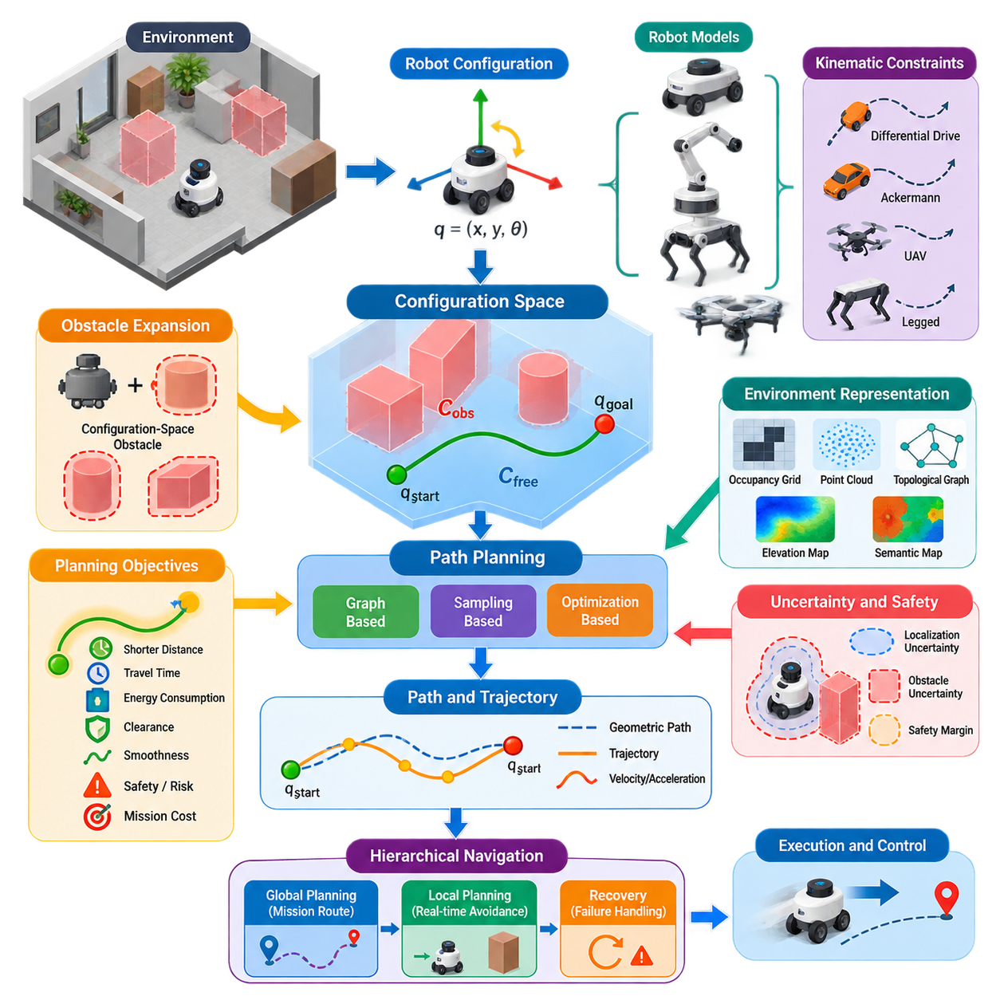
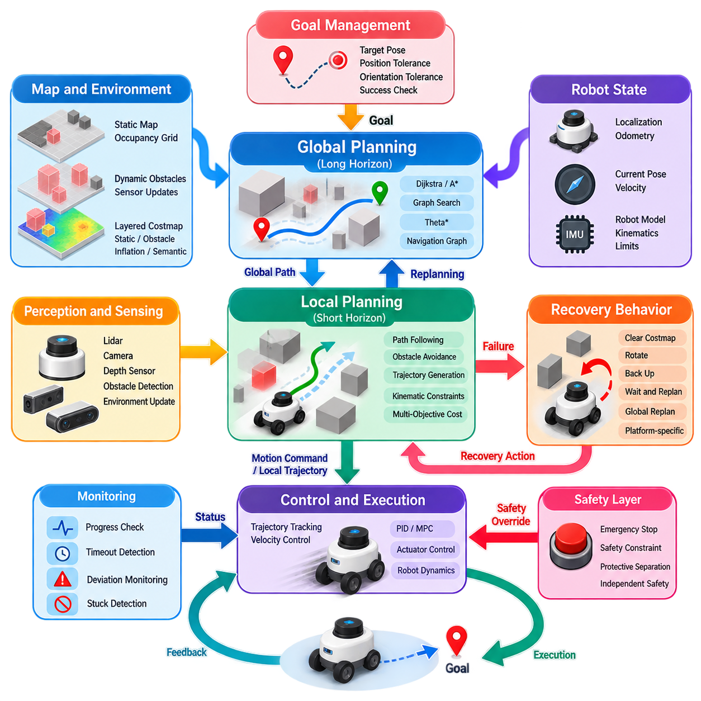
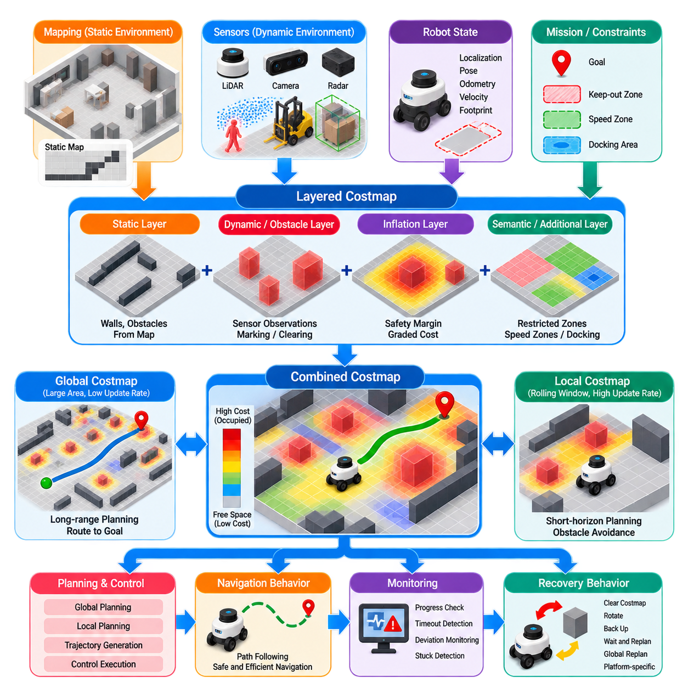
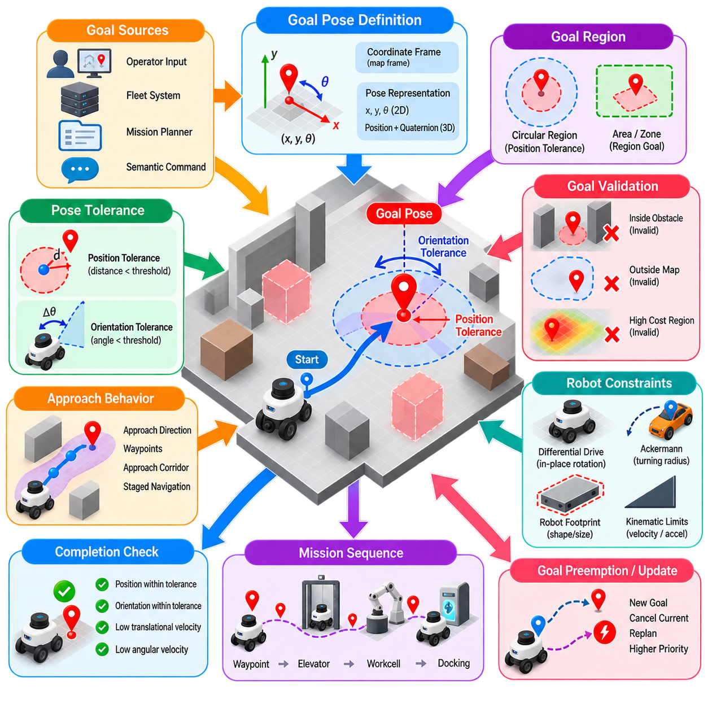
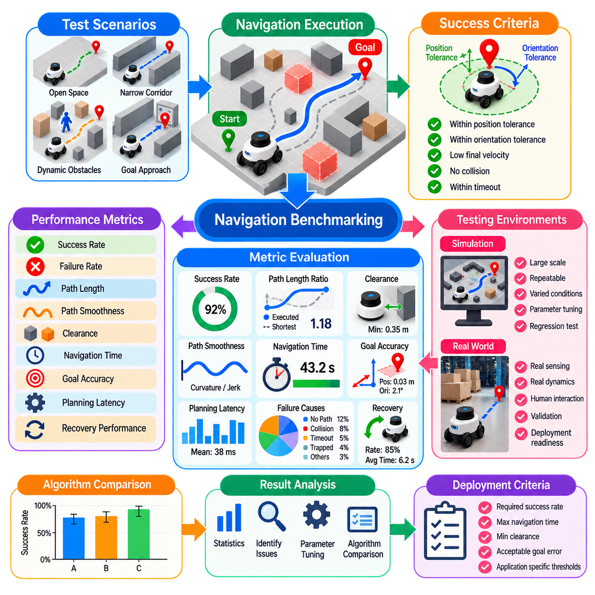
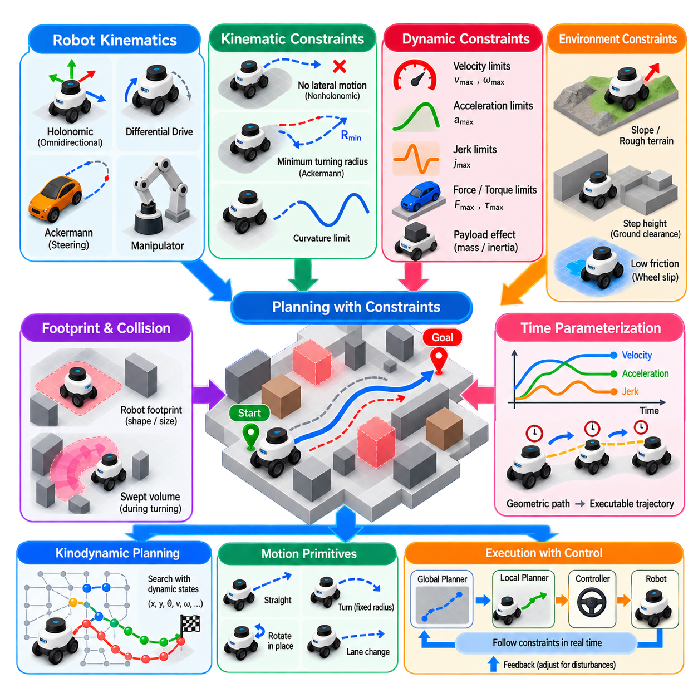
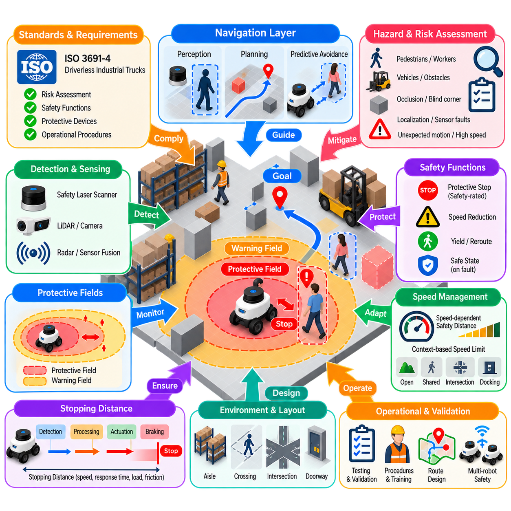
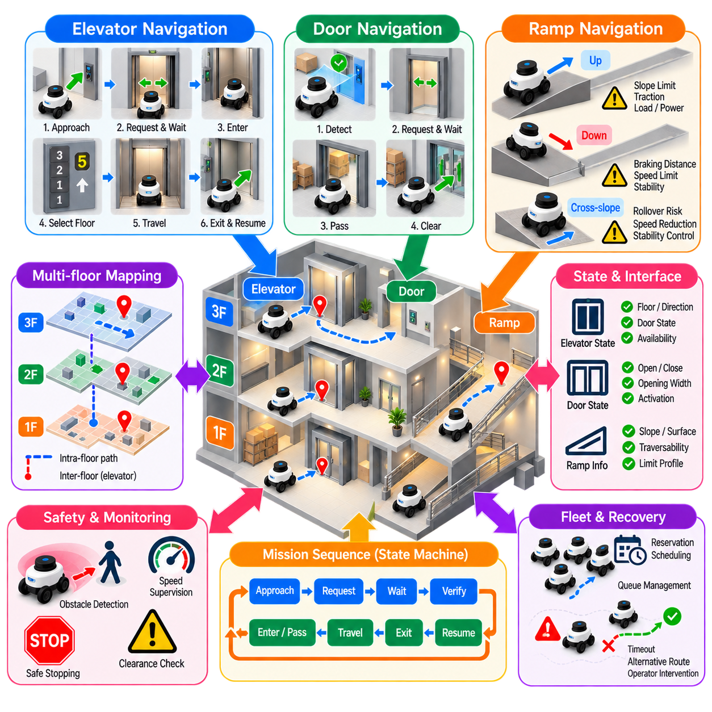
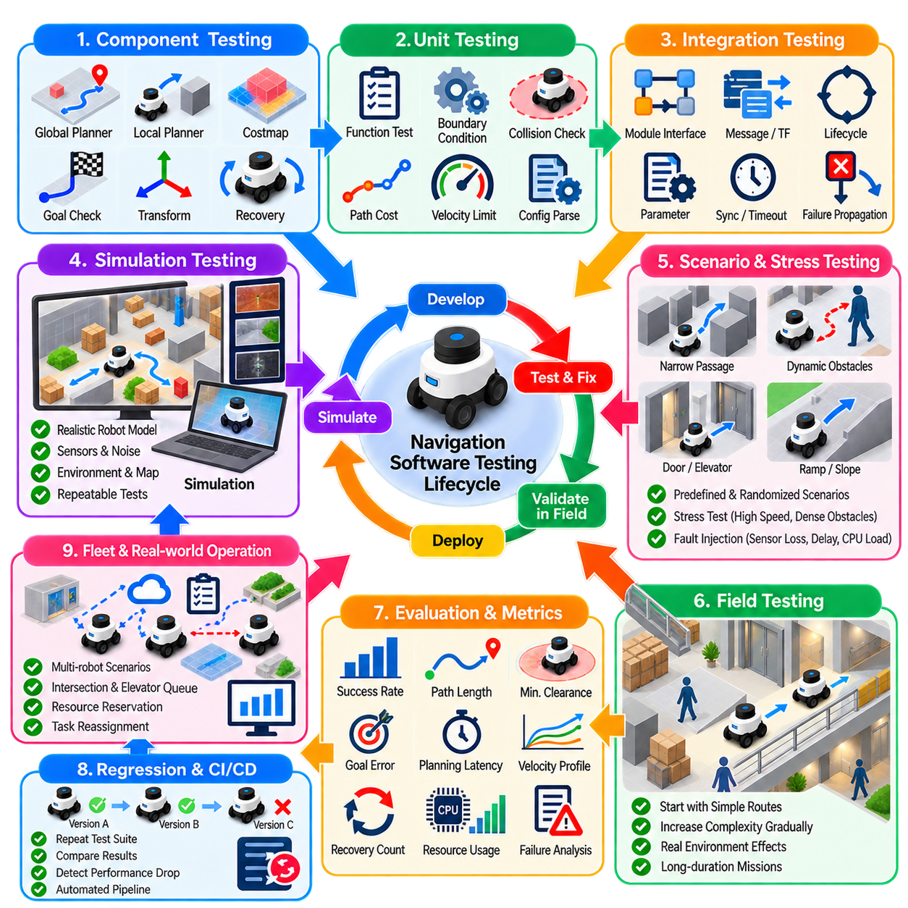
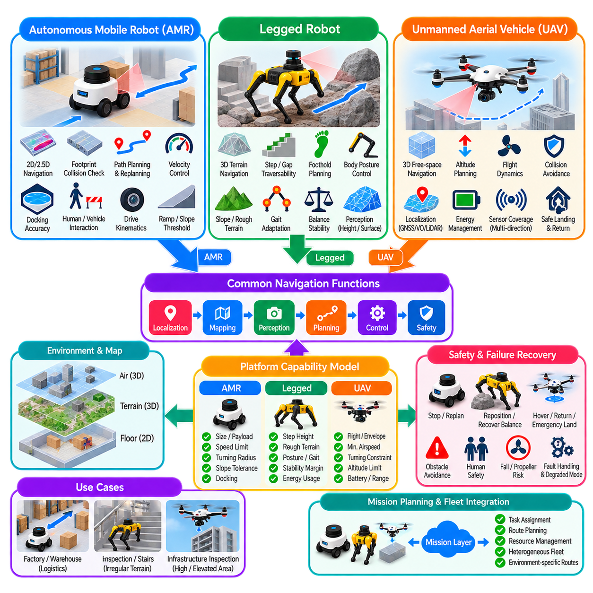

**Volume 15. Motion Planning and Navigation**

# Chapter 01. Navigation Fundamentals

## 01.01. Navigation Problem Configuration Space and Path Planning

{width="7.268055555555556in" height="7.268055555555556in"}

로봇 내비게이션(robot navigation)은 근본적으로 자율 시스템(autonomous system)이 환경의 기하학적 구조, 로봇의 물리적 크기, 운용 제약조건(operational constraints)을 고려하면서 초기 상태(initial state)에서 원하는 목표(goal)까지 이동하는 방법을 결정하는 문제이다. 이러한 관점에서 내비게이션은 단순히 목표를 향해 이동하는 것이 아니라, 공간 정보(spatial information)를 실행 가능한 로봇 구성(configuration)의 연속적인 과정으로 변환하는 구조화된 추론 과정(structured reasoning process)이다.

로봇 구성(robot configuration)은 로봇의 자세(pose) 또는 물리적 배치를 지정하는 데 필요한 변수들을 의미한다. 평면 이동 로봇(planar mobile robot)의 경우 구성은 일반적으로 q = (x, y, θ)로 표현되며, x와 y는 위치(position)를 나타내고 θ는 방향(orientation)을 나타낸다. 더 복잡한 로봇은 더 높은 차원의 표현이 필요하다. 매니퓰레이터(manipulator)는 각 관절(joint)마다 하나의 변수가 필요할 수 있으며, 모바일 매니퓰레이터(mobile manipulator)는 베이스 자세(base pose)와 로봇 팔의 관절 상태를 결합하여 더 큰 구성 벡터(configuration vector)를 형성한다.

구성 공간(configuration space), 일반적으로 C-space라고 부르는 개념은 가능한 하나의 로봇 구성에 하나의 점(point)이 대응되는 수학적 표현(mathematical representation)을 제공한다. 로봇 전체의 물리적 형상이 데카르트 공간(Cartesian space)을 이동하는 과정을 직접 계산하는 대신, 계획 알고리즘(planning algorithm)은 구성 공간의 점과 궤적(trajectory)을 대상으로 동작한다. 이러한 추상화(abstraction)는 이동 로봇, 매니퓰레이터, 다족 로봇(legged system), 무인 항공기(aerial vehicle)를 위한 공통적인 계획 기반을 제공한다.

따라서 물리적 환경의 장애물(obstacle)은 구성 공간에서 이동할 수 없는 금지 영역(forbidden region)으로 변환되어야 한다. 로봇의 어느 부분이라도 장애물과 충돌하게 만드는 구성들의 집합은 구성 공간 장애물 영역(configuration-space obstacle region), 즉 C_obs를 형성한다. 나머지 구성들은 자유 구성 공간(free configuration space), 즉 C_free를 구성한다. 따라서 경로 계획(path planning)은 초기 구성 q_start와 목표 구성 q_goal을 연결하면서 C_free 내부를 통과하는 연속적인 경로를 탐색하는 문제로 표현할 수 있다.

단순 병진 이동 로봇(translating robot)의 경우 구성 공간 장애물은 기하학적 장애물 확장(geometric obstacle expansion)을 통해 이해할 수 있다. 로봇의 전체 몸체를 모든 장애물 주변에서 직접 이동시키는 대신, 로봇의 풋프린트(footprint)를 기준으로 장애물 경계를 확장하고 로봇 자체는 개념적으로 하나의 점으로 취급한다. 이러한 변환은 충돌 판단(collision reasoning)을 계산적으로 다루기 쉽게 하지만, 방향에 따라 풋프린트가 달라지거나 비볼록 로봇 형상(non-convex robot geometry)을 갖는 경우에는 보다 정교한 구성 공간 표현이 필요하다.

경로(path)는 수학적으로 연속 사상(continuous mapping) q(s)로 표현할 수 있으며, 매개변수(parameter) s는 경로의 시작점에서 끝점까지 진행한다. 유효한 경로(valid path)는 q(0) = q_start와 q(1) = q_goal을 만족하는 동시에 전체 정의 구간에서 C_free 내부에 존재해야 한다. 이러한 정의는 기하학적 실행 가능성(geometric feasibility)을 특정 계획 알고리즘과 분리하며, 충돌 없는 내비게이션(collision-free navigation)을 판단하기 위한 일반적인 기준을 제공한다.

실제 로봇에서는 단순히 충돌하지 않는 경로를 찾는 것만으로 충분하지 않은 경우가 많다. 내비게이션 시스템은 일반적으로 이동 거리(travel distance), 주행 시간(traversal time), 에너지 소비(energy consumption), 장애물과의 이격 거리(clearance), 부드러움(smoothness), 위험도(risk), 임무별 비용(mission-specific cost)과 같은 하나 이상의 목적을 최적화한다. 따라서 경로 계획은 필요한 제약조건을 만족하면서 목적 함수(objective function)를 최소화하는 경로를 실행 가능한 해 공간(feasible solution space)에서 탐색하는 최적화 문제(optimization problem)로 표현되는 경우가 많다.

경로(path)와 궤적(trajectory)의 차이는 중요하다. 기하학적 경로(geometric path)는 로봇이 어디로 이동해야 하는지를 지정하지만 각 구성에 언제 도달해야 하는지는 반드시 정의하지 않는다. 반면 궤적은 시간 정보(temporal information)를 추가하므로 속도(velocity)와 가속도(acceleration) 같은 물리량을 포함한다. 따라서 기하학적으로 유효한 경로라도 조향 한계(steering limit), 가속도 제한, 최소 회전 반경(turning radius), 액추에이터 성능(actuator capability), 동적 안정성(dynamic stability) 제약을 위반하면 실제 플랫폼에서는 실행할 수 없다.

로봇 운동학(robot kinematics)은 계획 문제의 구조에 큰 영향을 미친다. 홀로노믹 시스템(holonomic system)은 사용 가능한 자유도(degree of freedom)에 대해 이론적으로 독립적인 운동 명령을 생성할 수 있지만, 비홀로노믹 플랫폼(nonholonomic platform)은 미분 제약조건(differential constraint)을 갖는다. 따라서 차동 구동 AMR(differential-drive AMR), 애커만 조향 차량(Ackermann-steered vehicle), 고정익 UAV(fixed-wing UAV), 다족 로봇은 동일한 기하학적 환경에 있더라도 같은 방식으로 처리할 수 없다. 실행 가능한 운동(feasible motion)은 실제 플랫폼의 이동 특성(mobility characteristics)을 반영해야 한다.

내비게이션은 계획기(planner)가 환경을 얼마나 정확하게 표현하는가에도 영향을 받는다. 점유 격자(occupancy grid), 기하학적 지도(geometric map), 포인트 클라우드(point cloud), 위상 그래프(topological graph), 고도 지도(elevation map), 의미론적 지도(semantic map)는 서로 다른 형태의 내비게이션 정보를 표현한다. 계획 표현(planning representation)은 불필요한 계산 복잡도(computational complexity)를 증가시키지 않으면서 충돌 회피와 주행 가능성(traversability)에 필요한 정보를 보존해야 한다. 따라서 지도 해상도(map resolution)는 공간 정밀도, 메모리 사용량, 계획 속도 사이의 공학적 절충(engineering tradeoff)이 된다.

실제 로봇에서는 추정된 자세, 지도, 장애물 경계, 로봇 크기 등에 불확실성(uncertainty)이 존재하기 때문에 추가적인 안전 여유(safety margin)가 필요하다. 수학적으로 장애물에 매우 근접하면서 충돌하지 않는 경로도 실제 운용에서는 안전하지 않을 수 있다. 따라서 실용적인 시스템에서는 장애물을 확장하거나 장애물 주변에 점차 증가하는 주행 비용(traversal cost)을 부여한다. 이를 통해 이격 거리(clearance)는 단순한 기하학적 속성이 아니라 내비게이션 안전성과 경로 품질(path quality)을 결정하는 명시적인 요소가 된다.

고전적인 내비게이션 문제(classical navigation problem)는 알려진 정적 환경(static environment)을 가정하는 경우가 많지만, 실제 배치된 로봇은 보행자, 차량, 문, 카트, 다른 로봇, 이전에 관측되지 않은 장애물이 존재하는 공간에서 동작한다. 따라서 계획기는 장기간 유지되는 환경 구조와 일시적인 관측 정보를 구분해야 한다. 전역 계획(global planning)은 비교적 안정적인 지도 정보를 이용해 임무 수준의 경로를 제공하고, 지역 계획(local planning)은 현재 센서 관측과 주변 환경 변화에 따라 실행 가능한 운동을 지속적으로 조정한다.

이러한 구분은 자연스럽게 계층적 내비게이션(hierarchical navigation)으로 이어진다. 전역 계획기(global planner)는 비교적 넓은 공간 영역을 탐색하여 목표까지의 경로를 생성하고, 지역 계획기(local planner) 또는 제어기(controller)는 해당 경로를 추종하면서 즉각적인 위험을 회피하기 위한 단기 운동(short-horizon motion)을 결정한다. 복구 메커니즘(recovery mechanism)은 정상적인 계획이 실패하는 상황을 처리한다. 이러한 전역-지역-복구(global-local-recovery) 구조는 다음 내비게이션 아키텍처(navigation architecture) 주제로 이어진다.

서로 다른 계획 기법(planning family)은 구성 공간을 서로 다른 방식으로 탐색한다. 그래프 기반 방법(graph-based method)은 가능한 움직임을 연결된 상태(state)로 이산화하고, 샘플링 기반 방법(sampling-based method)은 선택된 구성들로부터 탐색 구조를 생성하며, 최적화 기반 방법(optimization-based method)은 후보 경로나 궤적을 직접 개선한다. 이러한 접근법들은 이후 그래프 기반 계획, 샘플링 기반 계획, 최적화 기반 계획, 지역 계획, 동적 장애물 회피(dynamic obstacle avoidance), 다중 로봇 내비게이션(multi-robot navigation), 의미론적 내비게이션(semantic navigation), AI 기반 계획(AI-based planning)으로 확장된다.

구성 공간의 차원(dimensionality)은 계획 문제를 어렵게 만드는 근본적인 원인 중 하나이다. 평면상의 점 로봇(point robot)은 두 개의 변수만 필요할 수 있지만, 방향, 관절 구조(articulation), 매니퓰레이션 관절(manipulation joint), 전신 자세(whole-body posture)가 포함되면 필요한 차원은 빠르게 증가한다. 차원이 증가할수록 모든 상태를 완전하게 이산화하여 탐색하는 방식은 계산 비용이 급격히 증가한다. 따라서 샘플링, 최적화, 계층적 분해(hierarchical decomposition), 학습된 표현(learned representation) 등 대규모 상태 공간을 효율적으로 탐색하기 위한 기법이 필요하다.

계획 과정에서는 불확실성도 고려해야 한다. 위치 추정 오차(localization error)는 추정된 구성과 로봇의 실제 구성 사이에 차이를 발생시키며, 인지 불확실성(perception uncertainty)은 장애물의 위치와 분류 결과에 영향을 준다. 동적 환경(dynamic environment)은 미래 상태에 대한 추가적인 불확실성을 발생시킨다. 따라서 강건한 내비게이션(robust navigation)은 하나의 결정론적 경로(deterministic path)에만 의존할 수 없으며, 실행 과정에서 지속적인 센싱(sensing), 상태 추정(state estimation), 재계획(replanning), 모니터링(monitoring), 안전 개입(safety intervention)이 필요하다.

산업용 로봇(industrial robot)에서 경로 품질은 단순한 기하학적 거리만으로 평가하기보다 시스템 수준(system level)에서 평가해야 한다. 조금 더 긴 경로라도 장애물과의 이격 거리가 크고, 급격한 회전이 적으며, 에너지 요구량이 낮고, 위치 추정 신뢰성(localization reliability)이 높거나 사람과의 상호작용을 줄일 수 있다면 더 적절할 수 있다. 따라서 내비게이션 목적 함수는 최단 거리만을 기준으로 하기보다 운용 임무, 플랫폼 특성, 환경 조건, 안전 요구사항을 반영해야 한다.

구성 공간 공식화(configuration-space formulation)는 인지(perception)와 제어(control)를 연결하는 개념적 가교를 형성한다. 인지와 위치 추정(localization)은 로봇과 환경의 상태를 추정하고, 계획(planning)은 이러한 상태 사이에서 실행 가능한 진행 경로를 결정하며, 제어는 계획된 운동을 액추에이터 명령(actuator command)으로 변환한다. 따라서 내비게이션은 독립적인 최단 경로 알고리즘이 아니라 환경 이해(environmental understanding)와 물리적 행동(physical action)을 연결하는 통합 의사결정 계층(integrated decision layer)으로 기능한다.

이러한 기본 개념은 로봇 플랫폼과 임무에 따라 내비게이션 알고리즘을 선택해야 하는 이유도 설명한다. 실내 AMR(indoor AMR), 실외 자율주행 플랫폼(outdoor autonomous platform), 매니퓰레이터, 사족보행 로봇(quadruped), 휴머노이드(humanoid), UAV는 서로 다른 구성 공간과 제약조건을 갖는다. 그러나 모두 실행 가능한 상태를 표현하고, 금지 영역을 식별하며, 시작점과 목표점 사이의 안전한 연결 경로를 탐색하고, 실제 물리 환경의 변화에 지속적으로 대응하면서 생성된 운동을 실행한다는 동일한 근본적 내비게이션 문제를 공유한다.

## 01.02. Navigation Architecture Global Local Recovery

{width="7.268055555555556in" height="7.268055555555556in"}

내비게이션 아키텍처(navigation architecture)는 서로 다른 공간적·시간적 범위에서 동작하는 기능 계층(functional layer)들이 협력하여 자율 이동(autonomous movement)을 수행하도록 구성한다. 실제 로봇은 모든 내비게이션 상황을 하나의 계획기(planner)만으로 효율적으로 해결하기 어렵다. 따라서 전역 계획(global planning)은 임무 수준의 경로를 설정하고, 지역 계획(local planning)은 이를 즉시 실행 가능한 운동으로 변환하며, 복구 메커니즘(recovery mechanism)은 정상적인 내비게이션이 차단되거나 불일치가 발생하거나 진행할 수 없는 상황에 대응한다.

전역 계획 계층(global planning layer)은 비교적 넓은 범위의 환경 표현(environment representation)을 대상으로 판단한다. 로봇 자세(robot pose), 내비게이션 목표(navigation goal), 지도(map), 주행 가능성 정보(traversability information)가 주어지면 현재 위치에서 목적지까지 연결되는 충돌 없는 경로(collision-free route)를 탐색한다. 이 경로는 여러 방, 복도, 물류창고 구역, 층 또는 실외 영역에 걸쳐 확장될 수 있으므로, 전역 계획은 일시적인 센서 관측에 즉각 대응하기보다는 연결성(connectivity)과 전체적인 경로 품질(path quality)에 중점을 둔다.

전역 계획기(global planner)는 일반적으로 정적 점유 지도(static occupancy map), 내비게이션 그래프(navigation graph), 도로망(road network), 지속적으로 유지되는 비용 지도 계층(costmap layer)과 같이 비교적 안정적인 환경 정보를 사용한다. 출력은 일반적으로 목표를 향한 이동 과정을 나타내는 자세(pose), 경유점(waypoint), 경로 구간(path segment)의 연속으로 구성된다. 로봇의 표현 방식과 요구사항에 따라 다익스트라(Dijkstra), A\*(A-star), 세타 스타(Theta\*), 그래프 탐색(graph search) 등의 알고리즘이 이러한 기능을 수행할 수 있다.

전역 계획은 변경할 수 없는 고정 경로를 생성하는 과정으로 이해해서는 안 된다. 초기 경로가 생성된 이후에도 환경이 변할 수 있고, 위치 추정(localization)이 변경될 수 있으며, 실행 과정에서 다른 경로가 더 적합해질 수도 있다. 따라서 내비게이션 아키텍처는 관련 조건이 변경되면 전역 재계획(global replanning)을 수행할 수 있어야 한다. 재계획은 주기적(periodic), 이벤트 기반(event-driven) 또는 기존 전역 경로가 유효하지 않거나 비용이 지나치게 증가하거나 현재 로봇 상태에서 접근할 수 없게 되었을 때 수행될 수 있다.

지역 계획 계층(local planning layer)은 더 짧은 예측 범위(shorter horizon)를 대상으로 하며 훨씬 높은 갱신 주기(update rate)로 동작한다. 지역 계획기는 전역 경로를 이동 방향에 대한 지침으로 사용하면서 주변 장애물 관측 정보와 현재 로봇 상태를 지속적으로 반영한다. 주요 역할은 충돌 제약조건(collision constraint), 속도 제한(velocity limit), 가속도 제한(acceleration bound), 플랫폼 운동학(platform kinematics)을 만족하면서 로봇을 목표 경로를 따라 이동시키는 실행 가능한 운동 명령(motion command) 또는 단기 궤적(short trajectory)을 생성하는 것이다.

이러한 계층 분리는 중요한 계산 문제를 해결한다. 보행자, 카트 또는 일시적인 장애물이 나타날 때마다 전체 임무 수준 경로를 다시 계산하면 비효율적이고 불안정한 동작이 발생할 수 있다. 대신 지역 계획기는 전역 경로의 전략적 의도(strategic intent)를 유지하면서 일시적인 변화에 대응할 수 있다. 장애물이 사라지면 전체 내비게이션 문제를 다시 구성하지 않고도 자연스럽게 원래의 경로 방향으로 복귀할 수 있다.

지역 계획(local planning)은 경로 추종(path following)과 장애물 회피(obstacle avoidance)를 완전히 독립적인 목표로 취급하지 않고 함께 고려한다. 전역 경로를 지나치게 강하게 추종하면 새롭게 감지된 장애물 주변에서 위험한 움직임이 발생할 수 있으며, 반대로 경로를 고려하지 않고 장애물과의 이격 거리(clearance)만 최대화하면 로봇이 목적지에서 멀어질 수 있다. 따라서 실제 계획기는 경로 정렬(path alignment), 목표 접근(goal progress), 장애물 거리, 부드러움(smoothness), 속도, 실행 가능성(feasibility) 등의 여러 비용을 이용하여 후보 운동(candidate motion)을 평가한다.

지역 계획기는 실제 로봇의 운동 모델(motion model)도 고려해야 한다. 차동 구동 AMR(differential-drive AMR)은 순간적으로 측면 이동할 수 없으며, 애커만 조향 차량(Ackermann vehicle)은 조향 및 회전 반경(turning-radius) 제약을 갖는다. 항공 플랫폼(aerial platform)이나 다족 로봇(legged platform)은 추가적인 동역학(dynamic) 및 안정성(stability) 요구사항을 갖는다. 따라서 지역적으로 생성된 운동은 단순히 기하학적으로 충돌이 없는 것에 그치지 않고 하위 제어기(downstream controller)가 실제로 실행할 수 있어야 한다. 이는 계획과 제어 사이에 직접적인 아키텍처 연결 관계를 형성한다.

전역 계획과 지역 계획은 일반적으로 서로 다른 범위의 환경 정보를 사용한다. 전역 비용 지도(global costmap)는 전체 운용 영역을 포함하면서 지속적인 지도 구조를 강조할 수 있는 반면, 지역 비용 지도(local costmap)는 일반적으로 로봇을 중심으로 이동하는 제한된 영역을 표현한다. 지역 표현(local representation)은 센서 정보를 이용해 지속적으로 갱신되므로 최근 감지된 장애물이 즉각적인 운동 결정에 반영된다. 계층형 비용 지도(layered costmap)는 정적(static), 장애물(obstacle), 팽창(inflation) 및 기타 응용 분야별 정보를 결합할 수 있다.

내비게이션 제어기(navigation controller)는 계획 과정과 로봇의 물리적 액추에이터(physical actuator)를 연결하는 실행 인터페이스(execution interface)를 형성한다. 아키텍처에 따라 지역 계획기가 직접 속도 명령(velocity command)을 생성하거나 별도의 제어기가 추종할 궤적을 생성할 수 있다. 오도메트리(odometry), 위치 추정, 센서의 피드백(feedback)은 내비게이션 루프(navigation loop)를 폐루프(closed loop)로 구성한다. 따라서 로봇은 자신의 상태를 반복적으로 관측하고, 환경 정보를 갱신하며, 계획된 운동을 평가하고, 명령을 출력한 후 그 결과로 발생한 이동을 다시 측정한다.

잘 설계된 전역 계획기와 지역 계획기라도 정상적인 내비게이션으로 더 이상 진행할 수 없는 상황에 직면할 수 있다. 좁은 통로가 잘못 표현되어 막힌 것으로 판단될 수도 있고, 일시적인 장애물들이 로봇을 둘러쌀 수도 있으며, 위치 추정 결과에 불일치가 발생하거나 지역 궤적 생성이 반복적으로 실패할 수도 있다. 복구 행동(recovery behavior)은 계획기가 동일한 실패 동작을 무한히 반복하도록 두는 대신 이러한 비정상 상태(abnormal state)를 처리하기 위한 명시적인 메커니즘을 제공한다.

복구 메커니즘은 일반적으로 측정 가능한 실패 조건(failure condition)에 의해 활성화된다. 유효한 전역 경로 생성 실패, 반복적인 지역 계획 실패, 일정 시간 동안의 이동량 부족, 경로에서의 과도한 이탈, 명령된 운동이 예상된 진행을 발생시키지 못하는 상황 등이 이에 해당한다. 특히 진행 상태 모니터링(progress monitoring)이 중요하다. 계획기가 기술적으로 유효한 명령을 계속 생성하더라도 로봇이 사실상 갇혀 있거나 동일한 위치 주변에서 진동(oscillation)하고 있을 수 있기 때문이다.

복구 행동은 추정되는 실패 원인에 따라 선택되어야 한다. 시스템은 일시적인 장애물 정보를 제거하거나, 센싱(sensing)을 개선하기 위해 회전하거나, 일시적인 장애물이 사라질 때까지 정지하여 기다리거나, 문제가 발생한 위치에서 짧은 거리를 이동하거나, 전역 재계획을 요청하거나, 플랫폼에 특화된 다른 복구 기동(recovery maneuver)을 수행할 수 있다. 따라서 복구는 하나의 범용 비상 동작(universal emergency motion)이 아니라 내비게이션 내부에서 이루어지는 구조화된 오류 처리(structured fault handling)로 이해하는 것이 적절하다.

복구 행동에는 단계적 확대 로직(escalation logic)도 필요하다. 일반적으로 시스템에 큰 영향을 주는 동작을 수행하기 전에 가벼운 개입부터 시도해야 한다. 예를 들어 먼저 지역 재계획(local replanning)을 요청하고, 이후 환경 정보를 갱신하며, 그다음 제어된 복구 기동을 실행하고, 최종적으로 전역 경로를 다시 생성할 수 있다. 반복적인 시도에도 실패하면 통제되지 않은 재시도를 계속하는 대신 내비게이션을 안전하게 종료하고 현재 목표에 도달할 수 없음을 보고할 수 있어야 한다.

강건한 아키텍처(robust architecture)는 내비게이션 실패(navigation failure)와 안전 개입(safety intervention)을 구분해야 한다. 복구는 정상적인 계획을 계속할 수 없을 때 진행 상태를 회복하는 것이 목적이지만, 안전 계층(safety layer)은 운동이 독립적인 안전 조건을 위반할 경우 언제든지 내비게이션을 무시하고 개입할 수 있다. 따라서 비상 정지(emergency stopping), 보호 분리(protective separation), 하드웨어 안전 기능(hardware safety function), 인증된 안전 로직(certified safety logic)은 계획기의 복구 메커니즘에만 의존해서는 안 된다. 내비게이션 가용성(navigation availability)과 기능 안전(functional safety)은 서로 관련되어 있지만 구별되는 개념이다.

목표 관리(goal management) 역시 중요한 아키텍처 기능을 제공한다. 내비게이션은 목표 자세(target pose) 또는 임무 목적지(mission destination)에서 시작하지만, 성공적인 완료는 단순히 목표 위치 부근에 도달하는 것 이상의 조건을 요구한다. 시스템은 위치 허용오차(position tolerance), 방향 허용오차(orientation tolerance), 최종 속도(final velocity), 기타 응용 분야별 조건을 평가한다. 목표 판정(goal checking)은 로봇이 목적지 주변에서 반복적으로 진동하거나 너무 일찍 성공을 선언하지 않고 안정적으로 수렴(convergence)할 수 있도록 지역 제어와 연동되어야 한다.

아키텍처는 구성요소(component) 사이의 비동기적 상호작용(asynchronous interaction)도 관리해야 한다. 센서 갱신, 위치 추정값, 지도 변경, 전역 재계획, 제어기 주기(controller cycle), 진행 상태 확인, 복구 결정은 서로 다른 주기로 발생한다. 따라서 명확한 인터페이스(interface)가 필수적이다. 전역 계획기는 모든 제어 주기에 의존해서는 안 되며, 제어기는 즉각적인 장애물에 대응하거나 안정적인 운동을 유지하기 위해 계산 비용이 높은 전역 계획이 완료될 때까지 기다려서는 안 된다.

따라서 내비게이션은 선형 파이프라인(linear pipeline)이 아니라 폐루프 계층 구조(closed-loop hierarchy)로 이해할 수 있다. 임무 의도(mission intent)가 목표를 생성하고, 전역 계획이 전략적인 연결 경로를 설정하며, 지역 계획이 단기적으로 실행 가능한 운동을 결정하고, 제어가 해당 운동을 실제로 수행한다. 인지(perception)와 위치 추정은 환경 상태를 지속적으로 갱신하며, 진행 상태 모니터링과 복구 기능은 실행 과정을 감독한다. 새로운 정보는 계층 구조를 역방향으로 전달되어 적절한 수준에서 재계획을 유발할 수 있다.

산업용 AMR(industrial AMR)의 경우 좁은 통로, 교차로, 문, 임시 적재된 팔레트, 지게차, 보행자, 다른 로봇 등이 존재하는 환경에서 이러한 아키텍처가 특히 중요하다. 전역 계획은 선호되는 복도 또는 구역의 이동 순서를 결정할 수 있으며, 지역 계획은 즉각적인 주변 상호작용을 처리한다. 혼잡이나 통로 차단 상황이 지역 장애물 회피 능력을 초과하면 복구와 전역 재계획을 통해 다른 경로를 탐색하거나 운용 실패(operational failure)를 보고할 수 있다.

전역-지역-복구 아키텍처(global-local-recovery architecture)는 보다 전문화된 내비게이션 기능이 구축되는 구조적 기반(structural foundation)을 제공한다. 비용 지도 설계(costmap design)는 환경 정보가 계획 과정에 입력되는 방식을 결정하고, 목표 지정(goal specification)은 완료 조건을 정의하며, 벤치마킹(benchmarking)은 내비게이션 품질을 측정하고, 운동학적 제약조건(kinematic constraint)은 실제 실행 가능한 운동을 결정한다. 이후 사용되는 계획 알고리즘이 경로 계산 방식을 변화시키더라도 이러한 아키텍처의 기본적인 역할은 신뢰성 높은 자율 내비게이션을 위해 지속적으로 유지된다.

## 01.03. Costmap Design Static Dynamic Inflation Layer [w/Code]

{width="7.268055555555556in" height="7.268055555555556in"}

비용 지도(costmap)는 환경 정보를 계획기(planner)와 제어기(controller)가 효율적으로 평가할 수 있는 수치적 내비게이션 비용(navigation cost)으로 변환하는 공간 표현(spatial representation)이다. 비용 지도는 환경을 단순히 자유 공간 또는 점유 공간으로 표현하는 대신, 서로 다른 수준의 주행 가능성(traversability)과 위험도(risk)를 나타낸다. 각각의 셀(cell) 또는 공간 요소는 로봇이 해당 영역을 점유하는 것이 얼마나 바람직하거나 위험하거나 불가능한지를 표현한다.

비용 지도는 인지(perception), 매핑(mapping), 운동 계획(motion planning)을 연결하는 중요한 인터페이스(interface)를 형성한다. 매핑은 벽, 구조물, 알려진 장애물에 대한 지속적인 정보를 제공하고, 로봇에 탑재된 센서는 일시적이거나 기존에 알려지지 않은 객체를 감지한다. 비용 지도는 이러한 이질적인 정보원을 계획 알고리즘이 조회할 수 있는 공통 표현으로 통합한다. 이러한 분리를 통해 인지 구성요소가 변경되더라도 모든 계획기가 개별 센서 형식을 직접 이해할 필요가 없다.

일반적인 내비게이션 시스템은 전역 비용 지도(global costmap)와 지역 비용 지도(local costmap)를 구분한다. 전역 비용 지도는 일반적으로 넓은 운용 영역을 포함하며 현재 로봇 위치에서 내비게이션 목표까지의 장거리 경로 계획을 지원한다. 지역 비용 지도는 로봇 주변의 더 작은 영역을 표현하고 보다 높은 빈도로 갱신된다. 이를 통해 단기 궤적 생성(short-horizon trajectory generation), 장애물 회피(obstacle avoidance), 환경 변화에 대한 즉각적인 대응을 지원한다.

계층형 비용 지도 설계(layered costmap design)는 서로 다른 내비게이션 정보원을 독립적으로 설정할 수 있는 처리 계층(processing layer)으로 분리한다. 하나의 단일 격자(monolithic grid)를 구성하는 대신 시스템은 정적 구조(static structure), 관측된 장애물(observed obstacle), 안전 팽창(safety inflation), 응용 분야별 제약조건(application-specific constraint)을 나타내는 논리적 계층을 유지한다. 이러한 계층들은 최종 비용 표현으로 결합되며, 개별 계층을 전체 시스템 재설계 없이 갱신, 조정, 활성화 또는 교체할 수 있어 모듈성(modularity)을 향상시킨다.

정적 계층(static layer)은 기존 지도에서 얻어진 지속적인 환경 구조를 표현한다. 벽, 고정 설비, 선반, 기둥, 제한 구조물 및 기타 영구적인 요소들은 점유 영역(occupied region) 또는 높은 비용 영역(high-cost region)으로 표현할 수 있다. 자유 영역(free region)은 주행이 가능할 것으로 예상되는 위치를 나타낸다. 정적 정보는 상대적으로 천천히 변화하므로 전역 경로 계획(global path planning)과 장거리 내비게이션 판단을 위한 안정적인 기하학적 기반을 제공한다.

정적 지도(static map)는 일반적으로 각 셀이 해당 영역이 자유 상태인지, 점유 상태인지 또는 미확인 상태(unknown)인지를 나타내는 점유 격자(occupancy grid)로 표현된다. 격자 해상도(grid resolution)는 계획기가 사용할 수 있는 공간적 세부 수준을 결정한다. 높은 해상도는 더욱 정확한 장애물 경계를 제공하지만 메모리 사용량과 계산량을 증가시키며, 낮은 해상도는 처리 요구량을 줄이는 대신 기하학적 정확성과 좁은 통로 표현 능력을 감소시킨다.

동적 계층(dynamic layer) 또는 장애물 계층(obstacle layer)은 현재 센서 관측으로부터 획득한 환경 정보를 표현한다. 라이다(LiDAR), 깊이 카메라(depth camera), 스테레오 비전(stereo vision), 레이더(radar) 또는 기타 인지 시스템은 정적 지도에 포함되지 않은 객체를 식별할 수 있다. 따라서 팔레트, 카트, 사람, 차량, 이동 가능한 장비, 새롭게 추가된 구조물 등이 로봇 운용 중 내비게이션 비용을 변경할 수 있으며, 시스템은 저장된 지도뿐 아니라 실제 환경 상태에도 대응할 수 있다.

센서 관측 정보는 일반적으로 비용 지도를 갱신하기 전에 공통 좌표 프레임(shared coordinate frame)으로 변환된다. 센서, 로봇, 오도메트리(odometry), 지도 프레임 사이의 정확한 좌표 변환(transform)은 매우 중요하다. 작은 공간적 불일치도 장애물이 실제 위치에서 벗어나거나 중복되어 나타나는 문제를 발생시킬 수 있기 때문이다. 이동하는 로봇에서는 시간 동기화(timestamp synchronization)도 중요하며, 서로 다른 시간에 측정된 정보가 잘못된 로봇 자세를 기준으로 투영되면 장애물 표현의 신뢰성이 저하될 수 있다.

장애물 처리에는 일반적으로 마킹(marking)과 클리어링(clearing) 연산이 포함된다. 마킹은 센서 측정값이 장애물의 존재를 나타낼 때 점유 영역을 추가한다. 클리어링은 센서 광선(sensor ray) 또는 다른 관측 결과를 통해 이전에 점유되었던 공간이 현재 자유 공간임을 확인했을 때 오래된 장애물 정보를 제거한다. 적절한 클리어링 동작이 없으면 일시적인 객체가 지속적인 허위 장애물(false obstacle)로 남아 로봇이 인식하는 주행 가능 공간을 점차 감소시킬 수 있다.

미확인 공간(unknown space)에 대해서도 명시적인 내비게이션 정책이 필요하다. 지도화된 산업 시설에서는 로봇이 검증된 운용 영역 내부에서만 움직여야 하므로 미확인 셀을 주행 불가능 영역(non-traversable region)으로 처리하는 것이 합리적일 수 있다. 반면 탐사 시스템(exploration system)은 통제된 조건에서 미확인 영역으로의 이동을 허용할 수 있다. 따라서 미확인 공간의 해석은 임무 요구사항, 위치 추정 신뢰도(localization confidence), 센서 커버리지(sensor coverage), 허용 가능한 운용 위험 수준에 따라 달라진다.

팽창 계층(inflation layer)은 장애물의 명확한 경계를 주변으로 확장된 단계적 비용 영역(graded cost region)으로 변환한다. 장애물에 가까운 셀에는 높은 비용이 부여되고, 장애물에서 멀어질수록 비용은 점진적으로 감소하여 최종적으로 팽창의 영향이 사라진다. 이를 통해 장애물 주변의 모든 위치를 절대적인 충돌 영역으로 지정하지 않으면서 계획기가 적절한 이격 거리(clearance)를 유지하도록 유도할 수 있다. 따라서 팽창은 기하학적 장애물 경계와 선호되는 내비게이션 행동 사이의 실용적인 관계를 형성한다.

팽창(inflation)은 로봇의 충돌 풋프린트(collision footprint)와 구분해야 한다. 풋프린트(footprint)는 로봇이 물리적으로 점유하는 영역을 나타내며 특정 자세가 실제 충돌을 발생시키는지를 결정한다. 반면 팽창은 장애물 주변에 추가적인 내비게이션 비용을 부여하여 이격 거리와 안전 여유(safety margin)를 반영한다. 두 개념은 서로 연관되어 있지만 목적이 다르며, 팽창 반경(inflation radius)을 로봇 형상의 완전한 표현으로 잘못 사용하면 지나치게 보수적이거나 안전하지 않은 계획 동작이 발생할 수 있다.

팽창 비용 감소(inflation cost decay)의 형태는 경로 선택에 큰 영향을 미친다. 비용이 빠르게 감소하면 경로가 장애물에 비교적 가까이 접근할 수 있어 사용 가능한 공간은 증가하지만 이격 거리는 감소할 수 있다. 반대로 비용이 천천히 감소하면 넓은 고비용 영역이 형성되어 로봇이 복도의 중앙이나 개방된 영역을 선호하도록 유도한다. 따라서 팽창 매개변수(inflation parameter)는 로봇 크기, 위치 추정 불확실성(localization uncertainty), 환경의 기하학적 구조, 운용 속도, 요구되는 안전 동작에 따라 설정해야 한다.

원형으로 적절하게 근사하기 어려운 플랫폼에서는 로봇 풋프린트 모델링(robot footprint modeling)이 특히 중요하다. 직사각형 AMR, 긴 견인 차량(towing vehicle), 지게차(forklift), 모바일 매니퓰레이터(mobile manipulator)는 방향에 따라 점유하는 공간이 크게 달라질 수 있다. 계획기는 충돌 가능성을 평가할 때 이러한 크기와 형상을 고려해야 한다. 또한 위치 추정 오차, 제어 추종 오차(control tracking error), 기계적 공차(mechanical tolerance), 장애물 측정 불확실성을 보상하기 위한 추가적인 여유 공간을 적용할 수도 있다.

비용 지도 해상도(costmap resolution)와 갱신 주기(update frequency)는 중요한 계산적 절충 관계(computational tradeoff)를 형성한다. 고해상도 지도는 기하학적 정밀도를 향상시키지만 더 많은 셀을 포함하므로 계획기와 충돌 검사기(collision checker)의 계산량이 증가한다. 높은 갱신 주기는 동적 변화에 대한 대응성을 향상시키지만 CPU, 메모리 대역폭(memory bandwidth), 센서 처리 자원을 추가로 소비한다. 따라서 실제 시스템에서는 로봇 속도, 환경 밀도, 센서 범위, 사용 가능한 계산 자원을 고려하여 이러한 매개변수를 결정한다.

지역 비용 지도(local costmap)는 일반적으로 로봇을 중심으로 이동하는 롤링 표현(rolling representation)으로 구현된다. 로봇이 이동하면 비용 지도가 표현하는 윈도(window)도 함께 이동하고 경계 주변으로 새로운 센서 정보가 입력된다. 이를 통해 전체 시설에 대해 고주파 동적 정보를 유지할 필요가 없어진다. 결과적으로 지역 계획기는 즉각적인 판단이 필요한 영역에 대해 상세한 정보를 사용할 수 있고, 전역 비용 지도는 더 넓지만 상대적으로 안정적인 환경 표현을 유지할 수 있다.

계층 결합 규칙(layer combination rule)은 정적, 동적, 팽창 및 특수 목적 비용이 최종 비용 지도에 어떻게 반영되는지를 결정한다. 일부 정보는 명확한 충돌 위험을 의미하므로 낮은 비용을 덮어써야 하지만, 다른 정보는 서로 결합되거나 선호도(preference)로 해석될 수 있다. 내비게이션 아키텍처에서 보다 풍부한 행동이 필요한 경우 의미론적 구역(semantic zone), 속도 제한 영역(speed-restricted area), 진입 금지 영역(keep-out region), 선호 차선(preferred lane), 도킹 영역(docking area), 임시 운용 제한 구역 등을 추가 계층으로 표현할 수 있다.

비용 지도의 품질은 단순히 지도를 시각적으로 검사하는 것에 그치지 않고 실제 로봇의 이동 과정에서 평가해야 한다. 과도한 팽창은 정상적으로 통과할 수 있는 복도를 통과 불가능하게 만들 수 있고, 부족한 팽창은 장애물에 지나치게 가까운 경로를 생성할 수 있다. 지연된 클리어링은 유령 장애물(phantom blockage)을 만들 수 있으며, 센서 잡음(noise)은 불안정한 비용 변화를 발생시킬 수 있다. 이러한 문제들은 실제 원인이 부정확하거나 잘못 조정된 환경 표현에 있음에도 계획기의 실패처럼 보일 수 있다.

동적 환경(dynamic environment)에서는 감지된 모든 장애물을 시간에 관계없이 동일하게 처리해서는 안 되므로 특별한 주의가 필요하다. 단시간의 관측, 센서 잡음, 이동 객체, 가림(occlusion)은 셀 상태가 점유와 자유 사이에서 반복적으로 변화하게 만들 수 있다. 따라서 관측 지속 시간(observation persistence), 필터링(filtering), 클리어링 정책, 센서 범위, 갱신 시점을 조정하여 비용 지도가 불안정해지지 않으면서도 환경 변화에 적절하게 대응하도록 해야 한다. 목표는 최대 감도가 아니라 신뢰할 수 있는 내비게이션 근거를 확보하는 것이다.

잘 설계된 비용 지도는 궁극적으로 환경 이해(environmental understanding)와 계획 사이에 일관된 인터페이스 계약(interface contract)을 제공한다. 정적 계층은 지속적인 구조를 표현하고, 동적 계층은 현재 관측 정보를 반영하며, 팽창 계층은 장애물과의 근접도를 단계적인 내비게이션 비용으로 변환한다. 정확한 로봇 풋프린트, 좌표 변환, 갱신 정책, 적절한 해상도와 결합하면 이러한 메커니즘은 원시 환경 정보를 안전하고 효율적인 자율 내비게이션에 적합한 표현으로 변환한다.

따라서 비용 지도 설계는 모든 하위 내비게이션 기능에 직접적인 영향을 미친다. 전역 계획기는 이를 사용하여 경로를 선택하고, 지역 계획기는 단기 운동을 평가하며, 충돌 검사기(collision checker)는 안전하지 않은 구성을 제거하고, 복구 행동(recovery behavior)은 내비게이션이 차단되었을 때 비용 지도를 수정하거나 갱신할 수 있다. 신뢰성 높은 내비게이션은 정교한 계획 알고리즘뿐만 아니라 비용 지도가 로봇이 이동할 수 있는 곳, 이동할 수 없는 곳, 그리고 가급적 이동해야 하는 곳을 얼마나 정확하게 표현하는지에 달려 있다.

## 01.04. Navigation Goal Specification and Pose Tolerance

{width="7.268055555555556in" height="7.268055555555556in"}

내비게이션 목표(navigation goal)는 자율 로봇(autonomous robot)이 내비게이션 작업을 완료할 때 도달해야 하는 상태(state)를 정의한다. 목표는 흔히 지도상의 하나의 점으로 표현되지만, 실제 내비게이션 시스템에서는 일반적으로 위치(position)와 방향(orientation)을 모두 포함하는 자세(pose)로 표현된다. 따라서 목표 지정(goal specification)은 로봇이 어디에 도착해야 하는지뿐만 아니라 내비게이션이 완료된 것으로 판단될 때 어떤 자세를 가져야 하는지도 결정한다.

평면 이동 로봇(planar mobile robot)의 목표 자세는 일반적으로 x와 y 좌표 및 방향 θ로 표현되거나, 위치와 쿼터니언 방향(quaternion orientation)을 사용하는 동등한 자세 표현으로 정의된다. 또한 자세는 지도 프레임(map frame)과 같은 명확한 좌표 프레임(coordinate frame)에 속해야 한다. 명시적인 기준 프레임(reference frame)이 없으면 동일한 수치 좌표가 완전히 다른 물리적 위치를 의미할 수 있으므로 신뢰성 높은 목표 해석을 위해서는 프레임 일관성(frame consistency)이 필수적이다.

목표 지정은 여러 출처에서 생성될 수 있다. 운영자(operator)가 그래픽 인터페이스(graphical interface)를 통해 위치를 선택할 수 있고, 플릿 관리 시스템(fleet management system)이 목적지를 할당할 수도 있으며, 자율 임무 계획기(autonomous mission planner)가 경유점(waypoint)을 생성하거나 의미론적 명령(semantic command)이 기하학적 목표(geometric target)로 변환될 수도 있다. 생성 방식과 관계없이 내비게이션 하위 시스템은 최종적으로 로봇의 추정 자세와 비교하고 실행 가능한 계획 목표로 변환할 수 있는 표현을 필요로 한다.

목표가 항상 수학적으로 정확한 하나의 구성(configuration)을 의미하는 것은 아니다. 실제 로봇은 위치 추정 불확실성(localization uncertainty), 제한된 제어 분해능(control resolution), 기계적 공차(mechanical tolerance), 센서 잡음(sensor noise), 이산화된 지도(discretized map)가 존재하는 환경에서 동작한다. 따라서 로봇이 정확하게 x_goal, y_goal, θ_goal에 도달하도록 요구하는 것은 현실적이지 않으며 성공적인 완료를 무한정 방해할 수도 있다. 이에 따라 내비게이션 시스템은 자세 허용오차(pose tolerance)를 이용하여 요청된 목표 주변에 허용 가능한 영역을 정의한다.

위치 허용오차(position tolerance)는 목표의 위치 조건이 충족된 것으로 판단하기 위해 로봇이 목표 위치에 얼마나 가까이 접근해야 하는지를 지정한다. 평면 내비게이션에서는 일반적으로 현재 위치와 목표 위치 사이의 유클리드 거리(Euclidean distance)를 이용하여 이를 평가한다. 거리가 설정된 임계값(threshold)보다 작아지면 로봇의 추정 위치가 요청된 좌표와 정확하게 일치하지 않더라도 병진 이동 조건(translational requirement)이 충족된 것으로 판단할 수 있다.

방향 허용오차(orientation tolerance)는 헤딩(heading)에 대해 유사한 기능을 수행한다. 로봇의 현재 방향을 원하는 목표 방향과 비교하고 각도 오차(angular error)가 허용 범위 안에 들어오면 내비게이션이 성공한 것으로 판단할 수 있다. 방향 요구사항은 응용 분야에 따라 크게 달라진다. 개방된 대기 영역에 도착하는 로봇은 상당한 방향 오차를 허용할 수 있지만, 도킹(docking), 충전(charging), 매니퓰레이션(manipulation), 검사(inspection), 컨베이어 연동(conveyor interaction)에서는 정밀한 최종 정렬(final alignment)이 필요할 수 있다.

따라서 위치 허용오차와 방향 허용오차는 하나의 일반적인 정확도 값이 아니라 독립적인 설계 매개변수(design parameter)로 취급해야 한다. 어떤 임무에서는 비교적 큰 위치 오차를 허용하면서 특정 방향을 엄격하게 요구할 수 있고, 반대로 정밀한 위치를 요구하면서 방향에는 유연성을 허용할 수도 있다. 목표 판정기(goal checker)는 응용 요구사항에 따라 이러한 조건들을 결합함으로써 내비게이션 이후 수행되는 실제 물리적 작업에 적합한 완료 동작을 정의할 수 있다.

목표 허용오차(goal tolerance)는 로봇의 운동 제약조건(motion constraint)과도 직접적으로 상호작용한다. 차동 구동 플랫폼(differential-drive platform)은 엄격한 방향 허용오차를 만족시키기 위해 추가적인 기동이 필요할 수 있으며, 애커만 조향 차량(Ackermann-steered vehicle)은 최소 회전 반경(minimum turning radius) 때문에 제한된 공간에서 특정 최종 자세를 달성하지 못할 수 있다. 따라서 목표의 실행 가능성(feasibility)은 플랫폼의 운동학(kinematics), 풋프린트(footprint), 주변 자유 공간(free space), 접근 방향(approach direction)을 함께 고려하여 판단해야 한다.

목표에 대한 최종 접근(final approach)은 전체 경로의 대부분을 이동하는 것보다 더 어려운 경우가 많다. 로봇이 목적지에 접근할수록 병진 및 회전 오차는 작아지고, 속도를 감소시켜야 하며, 제어기는 오버슈트(overshoot)나 진동(oscillation)을 방지해야 한다. 부적절하게 설정된 허용오차는 목표 주변에서 반복적인 보정 동작을 유발할 수 있다. 실제 임무 목표가 이미 달성되었음에도 로봇이 계속 전진, 회전, 후진 또는 재정렬을 반복할 수 있다.

지나치게 엄격한 허용오차는 내비게이션 신뢰성(navigation reliability)을 저하시킬 수 있다. 위치 추정 잡음(localization noise)만으로도 추정 자세가 좁은 허용 경계(acceptance boundary)를 반복적으로 넘나들 수 있으며, 이로 인해 안정적인 성공 판정이 이루어지지 않을 수 있다. 제어 오차(control error)와 바닥 상태 역시 추가적인 변동을 발생시킬 수 있다. 따라서 허용오차는 위치 추정 및 제어 하위 시스템이 지속적으로 만족할 수 없는 이상적인 수학적 요구사항이 아니라 전체 내비게이션 시스템이 실제로 달성할 수 있는 정확도를 반영해야 한다.

반대로 지나치게 느슨한 허용오차는 다른 문제를 발생시킨다. 로봇이 의도된 목적지에서 너무 멀리 떨어져 있거나 부적절한 방향을 향하고 있음에도 내비게이션 시스템이 성공을 보고할 수 있다. 이는 도킹, 자동 충전(automated charging), 적재(loading), 매니퓰레이션, 검사 또는 인간과의 상호작용(human interaction)에서는 허용되지 않을 수 있다. 따라서 허용오차 설정은 완료의 강건성(completion robustness)과 후속 작업에서 요구되는 정밀도 사이의 공학적 절충(engineering compromise)이다.

목표 판정(goal checking)은 위치와 방향 이외의 조건도 포함할 수 있다. 성공을 선언하기 전에 로봇의 병진 속도(translational velocity)와 각속도(angular velocity)가 지정된 임계값 이하로 감소하도록 요구할 수 있다. 이를 통해 로봇이 상당한 속도로 허용 가능한 자세 영역을 순간적으로 통과하면서 잘못 완료를 보고하는 것을 방지할 수 있다. 안정적인 목표 달성은 일반적으로 기하학적 근접성(geometric proximity)과 정지 또는 다음 작업으로 안전하게 전환할 수 있는 운동 상태를 함께 요구한다.

일부 내비게이션 임무는 하나의 목표 자세보다 목표 영역(goal region)으로 표현하는 것이 더 적절하다. 서비스 로봇(service robot)은 대기 구역에 진입하기만 하면 될 수 있고, 검사 로봇(inspection robot)은 유효한 관측 영역 안의 어느 위치에서든 정지할 수 있으며, AMR은 여러 허용 가능한 방향에서 스테이징 영역(staging area)에 접근할 수 있다. 영역 기반 목표(region-based goal)는 계획기가 허용 가능한 상태 집합에서 실행 가능한 최종 구성을 선택할 수 있게 하여 계획의 유연성을 높인다.

다른 응용 분야에서는 제한된 접근 동작(constrained approach behavior)이 필요하다. 도킹 스테이션(docking station), 충전 접점(charging contact), 컨베이어, 작업 셀(work cell), 문, 엘리베이터, 매니퓰레이션 스테이션(manipulation station)은 특정 방향에서 로봇이 접근하도록 요구할 수 있다. 이러한 경우 최종 자세만 지정하는 것으로는 충분하지 않을 수 있다. 중간 경유점(intermediate waypoint), 접근 통로(approach corridor), 방향 제약조건 또는 단계적 내비게이션(staged navigation)을 이용하여 로봇이 기하학적으로 유효하면서 운용 목적에도 적합한 최종 구성으로 진입하도록 유도할 수 있다.

목표 유효성 검사(goal validation)는 계획 전과 계획 수행 중에 이루어져야 한다. 요청된 자세가 장애물 내부에 있거나, 알려진 지도 영역 밖에 있거나, 팽창된 고비용 영역(inflated high-cost region)에 있거나, 로봇 풋프린트로 접근할 수 없는 위치일 수 있다. 시스템은 이러한 목표를 거부하거나, 주변의 유효한 자세로 조정하거나, 계획이 불가능하다고 보고할 수 있다. 초기 단계에서 목표를 검증하면 불필요한 계획 시도를 방지하고 내비게이션 실패 원인을 더욱 쉽게 진단할 수 있다.

동적 환경(dynamic environment)에서는 이전에 유효했던 목표가 이후 무효화될 수도 있다. 일시적인 장애물이 목적지를 점유하거나, 다른 로봇이 도킹 스테이션을 막거나, 로봇이 이동하는 동안 운용 제한 조건이 변경될 수 있다. 따라서 목표 관리(goal management)는 목표가 할당된 이후에도 계속 유효하다고 가정하지 않고 재평가를 지원해야 한다. 임무 정책(mission policy)에 따라 로봇은 대기하거나, 재계획(replanning)을 수행하거나, 대체 목표(alternative goal)를 선택하거나, 목적지가 일시적으로 이용 불가능하다고 보고할 수 있다.

다단계 임무(multi-stage mission)는 하나의 최종 목적지가 아니라 여러 목표의 연속으로 구성되는 경우가 많다. 로봇은 여러 경유점을 통과하고, 엘리베이터에 진입하고, 다른 층으로 이동하고, 작업 스테이션에 접근한 후 최종적으로 정밀 도킹을 수행할 수 있다. 각 단계에는 서로 다른 허용오차와 완료 기준(completion criterion)을 적용할 수 있다. 따라서 내비게이션 목표 지정은 상위 수준의 작업 의도(task intent)를 운동 계획과 제어에 필요한 기하학적 조건으로 연결하는 임무 관리의 일부가 된다.

목표 선점(goal preemption)과 취소(cancellation) 역시 실제 운용 시스템에서 중요하다. 높은 우선순위의 작업, 안전 이벤트(safety event), 플릿 수준 의사결정(fleet-level decision), 운영자 명령이 현재 목적지가 완료되기 전에 이를 대체할 수 있다. 내비게이션 아키텍처는 기존 목표를 통제된 방식으로 종료하거나 새로운 목표로 대체하고, 계획 상태를 갱신하며, 하위 수준 구성요소에 오래된 명령이 남아 있지 않도록 하면서 새로운 목표로 전환해야 한다.

플릿 시스템(fleet system)에서는 목적지가 원격으로 생성될 수 있기 때문에 일관된 목표 의미론(goal semantics)이 특히 중요하다. 플릿 관리자(fleet manager)는 Station A, Charger 3, Loading Zone B와 같은 논리적 위치(logical location)를 지정할 수 있지만, 로봇 내비게이션 스택(navigation stack)은 기하학적 자세와 허용오차를 필요로 한다. 위치 데이터베이스(location database) 또는 의미론적 지도(semantic map)는 이러한 논리적 목적지를 선호 방향, 접근 규칙, 작업별 허용 영역을 포함하는 검증된 내비게이션 목표로 변환할 수 있다.

목표 지정과 자세 허용오차는 궁극적으로 내비게이션 성공에 대한 계약(contract)을 정의한다. 계획기는 로봇이 목적지까지 어떻게 이동할지를 결정하고, 제어기는 실행 과정에서 자세 오차(pose error)를 감소시키며, 위치 추정 시스템은 현재 상태를 추정하고, 목표 판정기는 요청된 조건이 달성되었는지를 결정한다. 적절하게 설계된 허용오차는 끝없는 정밀 위치 탐색(endless precision seeking)을 방지하면서 최종 로봇 자세가 내비게이션 이후 수행될 물리적 작업에 적합하도록 보장한다.

따라서 신뢰성 높은 자율 내비게이션은 수학적 기하학(mathematical geometry)과 실제 운용 의도(operational intent)를 모두 반영하는 목표 정의를 필요로 한다. 위치, 방향, 속도, 접근 방향, 환경적 유효성(environmental validity), 로봇 운동학, 후속 작업 요구사항이 모두 완료 기준에 포함될 수 있다. 목표를 단순한 하나의 좌표가 아니라 허용 가능한 최종 상태(terminal state) 또는 영역으로 정의함으로써 내비게이션 시스템은 강건하고 의미 있으며 반복 가능한 작업 완료를 달성할 수 있다.

## 01.05. Navigation Benchmarking Success Rate Path Quality

{width="7.268055555555556in" height="7.268055555555556in"}

내비게이션 벤치마킹(navigation benchmarking)은 자율 로봇(autonomous robot)이 할당된 목표에 얼마나 신뢰성 있고 효율적으로 도달하는지를 체계적으로 측정하는 방법을 제공한다. 내비게이션 시스템은 몇 번의 시연에서 성공했는지만으로 평가해서는 안 된다. 의미 있는 평가를 위해서는 반복 가능한 시나리오(repeatable scenario), 명확하게 정의된 지표(metric), 통제된 조건(controlled condition), 그리고 어려운 환경이나 운용 조건에서만 발생할 수 있는 실패까지 확인할 수 있는 충분한 시험 횟수가 필요하다.

성공률(success rate)은 가장 기본적인 내비게이션 지표 중 하나이다. 이는 전체 내비게이션 시험 중 로봇이 지정된 완료 조건을 만족하면서 요청된 목표에 도달한 시험의 비율을 나타낸다. 전체 N_total회의 시도 중 N_success회가 성공했다면 성공률은 N_success / N_total로 표현할 수 있다. 그러나 성공의 정의에는 목표 허용오차(goal tolerance), 시간 초과(timeout), 충돌 기준(collision criteria), 기타 종료 조건(termination condition)이 포함되어야 한다.

성공적인 시험은 일반적으로 대략적인 목표 영역에 진입하는 것 이상의 조건을 요구해야 한다. 위치 허용오차(position tolerance), 방향 허용오차(orientation tolerance), 최종 속도(final velocity), 충돌 상태(collision status), 임무 시간 초과(mission timeout) 등이 성공 기준에 포함될 수 있다. 서로 다른 실험에서 완료 조건을 다르게 정의하면 벤치마크 결과를 비교하기 어려워진다. 따라서 벤치마크 명세(benchmark specification)는 시험이 성공, 실패, 시간 초과 또는 중단된 실행(aborted execution)으로 분류되는 조건을 정확하게 정의해야 한다.

실패율(failure rate)은 실패가 근본적으로 서로 다른 원인에서 발생할 수 있기 때문에 성공률을 보완하는 중요한 정보를 제공한다. 전역 계획기(global planner)가 경로를 생성하지 못하거나, 지역 계획기(local planner)가 갇히거나, 위치 추정(localization)이 상실되거나, 충돌이 발생하거나, 진행 상태 모니터링(progress monitoring)이 시간 초과를 발생시키거나, 복구 행동(recovery behavior)이 모두 소진되어 실패할 수 있다. 하나의 통합된 실패 비율만 보고하는 것보다 실패 원인을 범주별로 분리하면 내비게이션 신뢰성을 제한하는 하위 시스템을 파악하는 데 더욱 유용하다.

경로 길이(path length)는 내비게이션 효율성을 평가하는 기본적인 척도이다. 실제 실행 경로(executed path)를 계획된 경로(planned path) 또는 기준 최단 경로(reference shortest path)와 비교할 수 있다. 유용한 정규화 지표(normalized metric)로 실행 거리를 적절한 기준 거리로 나눈 경로 길이 비율(path-length ratio)을 사용할 수 있다. 이 값이 1에 가까우면 효율적인 이동을 의미하며, 값이 커지면 불필요한 우회, 진동(oscillation), 반복적인 회피 기동, 부적절한 전역 계획 또는 복구 동작이 발생했음을 나타낼 수 있다.

그러나 최단 거리만으로 높은 품질의 경로를 정의할 수는 없다. 벽이나 장애물에 지나치게 가까이 접근하는 경로는 기하학적으로 짧더라도 실제 운용에는 적절하지 않을 수 있다. 이격 거리 지표(clearance metric)는 전체 내비게이션 과정에서 로봇 풋프린트(robot footprint)와 주변 장애물 사이의 거리를 측정한다. 최소 이격 거리(minimum clearance)는 가장 위험한 접근 상황을 나타내며, 평균 또는 백분위수 기반 이격 거리는 전체 경로에서 유지된 안전 여유(safety margin)를 평가하는 데 사용할 수 있다.

경로 부드러움(path smoothness)은 로봇이 방향 또는 곡률(curvature)을 얼마나 점진적으로 변경하는지를 측정한다. 빈번한 방향 변화, 급격한 회전, 진동성 조향(oscillatory steering)은 승객이나 적재물의 안정성을 저하시키고, 기계적 마모(mechanical wear)를 증가시키며, 궤적 추종(trajectory tracking)을 어렵게 만들 수 있다. 플랫폼과 분석 수준에 따라 헤딩 변화(heading variation), 곡률, 곡률 변화, 가속도(acceleration), 저크(jerk) 등을 이용하여 부드러움을 평가할 수 있다.

내비게이션 시간(navigation time) 역시 필수적인 벤치마크 지표이다. 전체 작업 시간(total task duration)은 목표가 수락된 시점부터 성공적인 완료 또는 종료까지의 경과 시간을 측정한다. 이를 실제 이동 시간, 정지 대기 시간, 계획 지연(planning latency), 복구 시간(recovery time), 장애물로 인한 지연 등으로 세분화할 수 있다. 이러한 분해를 통해 단순히 느리게 이동하는 로봇과 계획 비효율성, 혼잡 또는 반복적인 복구 작업으로 많은 시간을 소비하는 로봇을 구분할 수 있다.

계획 지연 시간(planning latency)은 내비게이션 소프트웨어가 얼마나 빠르게 의사결정을 생성하는지를 측정한다. 전역 계획 시간(global planning time)은 경로를 생성하거나 재생성하는 계산 비용을 나타내며, 지역 계획 또는 제어기 주기(controller cycle time)는 즉각적인 운동 결정이 실시간 요구조건(real-time requirement)을 충족하는지를 결정한다. 평균 지연 시간만으로는 간헐적인 계산 시간 급증을 숨길 수 있으므로 실제 운용 시스템을 평가할 때는 백분위수(percentile)와 최악 조건(worst-case) 측정도 중요하다.

목표 정확도(goal accuracy)는 실제로 도달한 로봇 자세와 요청된 목표 자세 사이의 최종 차이를 평가한다. 위치 오차(position error)와 방향 오차(orientation error)는 응용 분야별 요구사항이 다르므로 독립적으로 측정해야 한다. 일반적인 운송 임무는 어느 정도의 최종 오차를 허용할 수 있지만, 충전, 도킹(docking), 매니퓰레이션(manipulation), 검사(inspection), 컨베이어 정렬(conveyor alignment)은 훨씬 높은 정밀도를 요구할 수 있다. 따라서 벤치마크 허용오차는 실제 운용 작업을 반영해야 한다.

동적 장애물 성능(dynamic obstacle performance)은 정적인 경로 효율성 이상의 지표를 필요로 한다. 시험에서는 충돌률(collision rate), 최소 분리 거리(minimum separation distance), 회피 성공률(avoidance success), 이동 장애물로 인한 지연, 정상적인 경로 추종을 재개하는 데 필요한 시간 등을 측정할 수 있다. 사람이 존재하는 환경에서는 사회적으로 적절한 거리와 이동 행동도 추가로 평가해야 할 수 있다. 목표에 빠르게 도달하더라도 반복적으로 위험한 상호작용을 발생시키는 계획기는 높은 품질을 가진 것으로 평가할 수 없다.

복구 성능(recovery performance)도 명시적으로 측정해야 한다. 유용한 지표에는 복구 활성화 횟수, 복구 성공률, 복구에 소비된 시간, 반복적인 복구 주기(recovery cycle), 개입이 필요한 임무의 비율 등이 포함된다. 완료 여부만 고려하면 빈번한 복구 성공이 긍정적으로 보일 수 있지만, 실제로는 위치 추정, 비용 지도(costmap) 처리, 계획 또는 제어에서 해결해야 할 근본적인 불안정성을 나타낼 수 있다.

벤치마크 시나리오(benchmark scenario)는 실제 배치 환경에서 예상되는 운용 조건을 반영해야 한다. 개방된 공간만으로 산업용 내비게이션 시스템을 충분히 평가할 수 없다. 좁은 복도, 출입문, 교차로, 막다른 길(dead end), 복잡한 장애물 영역, 임시 장애물, 동적 횡단 상황, 위치 추정이 어려운 영역, 제한된 목표 접근 상황 등이 포함되어야 한다. 다양한 시나리오는 서로 다른 실패 모드(failure mode)를 노출하고 하나의 쉬운 환경에만 최적화되는 것을 방지한다.

내비게이션에는 확률적(stochastic)이고 시간 의존적인 동작이 포함되므로 반복성(repeatability)이 중요하다. 센서 잡음, 위치 추정 불확실성(localization uncertainty), 동적 장애물 움직임, 샘플링 기반 알고리즘(sampling-based algorithm), 비동기 처리(asynchronous processing)는 명목상 동일한 시험에서도 서로 다른 결과를 발생시킬 수 있다. 따라서 각 시나리오는 여러 번 실행해야 하며, 하나의 대표 실행 결과를 선택하기보다 통계적으로 결과를 요약해야 한다. 평균값, 분포(distribution), 백분위수, 실패 횟수는 서로 보완적인 정보를 제공한다.

시뮬레이션(simulation)은 대규모 내비게이션 벤치마킹을 수행하기 위한 효율적인 환경을 제공한다. 물리적 하드웨어의 위험 없이 통제된 지도, 장애물 배치, 센서 조건, 매개변수 설정에 대해 수천 번의 시험을 실행할 수 있다. 시뮬레이션은 회귀 시험(regression testing)과 드물게 발생하는 실패 시나리오에 특히 유용하다. 그러나 실제 센싱, 휠 슬립(wheel slip), 통신 지연, 바닥 상태, 액추에이터 한계, 인간 행동을 완전하게 재현할 수는 없다.

따라서 벤치마크 성능이 실제 로봇으로 전이되는지를 검증하기 위해서는 필드 시험(field testing)이 필요하다. 실제 환경 평가는 대표적인 운용 경로와 환경 교란(environmental disturbance)을 재현하면서 가능한 경우 시뮬레이션에서 사용한 것과 동일한 지표를 기록해야 한다. 시뮬레이션과 실제 환경 성능의 차이는 모델 부정확성, 표현되지 않은 지연, 위치 추정 문제, 센서 아티팩트(sensor artifact), 기계적 영향 또는 제어 한계를 발견하는 데 도움이 된다.

유용한 벤치마크는 측정 결과와 함께 실험 구성(experimental configuration)을 보존해야 한다. 로봇 모델, 풋프린트, 지도 해상도(map resolution), 비용 지도 매개변수, 계획기 설정, 제어기 매개변수, 센서 구성, 소프트웨어 버전, 하드웨어 플랫폼, 시나리오 정의는 모두 성능에 실질적인 영향을 줄 수 있다. 구성 추적성(configuration traceability)이 없으면 실제 원인이 다른 시스템 매개변수에 있음에도 성능 변화를 특정 알고리즘의 영향으로 잘못 판단할 수 있다.

벤치마킹은 매개변수 조정(parameter tuning)과 알고리즘 비교에도 특히 유용하다. 두 계획기는 동일한 지도, 로봇 제약조건, 목표, 장애물 조건, 종료 규칙에서 시험해야 한다. 성공률만 비교하면 경로 효율성이나 안전성의 차이를 놓칠 수 있으며, 경로 길이만 비교하면 위험한 동작을 오히려 우수한 것으로 평가할 수 있다. 따라서 신뢰성, 효율성, 안전성, 부드러움, 계산 비용 사이의 절충 관계를 평가하기 위해 다중 지표 평가(multi-metric evaluation)가 필요하다.

플릿 내비게이션(fleet navigation)에서는 개별 로봇 지표를 시스템 수준의 측정값으로 확장할 수 있다. 임무 완료율(mission completion rate), 로봇 처리량(robot throughput), 평균 대기 시간, 혼잡 지연(congestion delay), 교차로 차단, 교착 상태 빈도(deadlock frequency), 활용률(utilization) 등을 통해 개별적으로 효율적인 내비게이션이 전체 플릿에서도 효율적인지를 평가할 수 있다. 한 로봇이 약간 더 긴 경로를 선택하더라도 혼잡을 줄이거나 다른 로봇과의 간섭을 피한다면 전체 시스템 성능은 향상될 수 있다.

벤치마크 임계값(benchmark threshold)은 임의로 결정하기보다 궁극적으로 운용 요구사항(operational requirement)과 연결되어야 한다. 요구 성공률, 최대 내비게이션 시간, 최소 이격 거리, 허용 가능한 목표 오차, 계획 지연 시간은 로봇 속도, 적재물(payload), 환경, 안전 정책(safety policy), 비즈니스 프로세스(business process)에 따라 달라진다. 따라서 벤치마킹은 추상적인 내비게이션 성능과 실제 배치를 위한 측정 가능한 인수 기준(acceptance criteria)을 연결하는 역할을 한다.

내비게이션 소프트웨어가 발전함에 따라 지속적 벤치마킹(continuous benchmarking)의 중요성도 증가한다. 계획기, 비용 지도, 인지 모듈(perception module), 위치 추정, 제어기 매개변수 또는 로봇 하드웨어의 변경은 하나의 지표를 개선하면서 다른 지표를 악화시킬 수 있다. 자동화된 회귀 벤치마크(automated regression benchmark)는 이러한 변화를 실제 현장 배치 전에 감지할 수 있다. 안정적인 시나리오 모음과 과거 성능 기준선(historical performance baseline)을 유지하면 새로운 소프트웨어 버전이 전체 내비게이션 품질을 실제로 향상시켰는지 판단할 수 있다.

따라서 내비게이션 벤치마킹은 하나의 성공 점수(single success score)가 아니라 다차원 시스템 평가(multidimensional system evaluation)로 이해해야 한다. 성공률은 기본적인 신뢰성을 나타내고, 경로 길이, 이격 거리, 부드러움, 실행 시간, 목표 정확도, 계획 지연, 복구 동작, 실패 범주는 이러한 신뢰성이 어떠한 방식으로 달성되는지를 설명한다. 이러한 측정값을 종합하면 알고리즘 비교, 시스템 조정, 성능 회귀 탐지, 실제 로봇 운용을 위한 내비게이션 검증에 필요한 객관적인 근거를 확보할 수 있다.

## 01.06. Kinematic and Dynamic Constraints in Planning

{width="7.268055555555556in" height="7.268055555555556in"}

운동학적 제약조건(kinematic constraints)과 동역학적 제약조건(dynamic constraints)은 기하학적으로 유효한 경로가 실제 물리적 로봇에 의해 실행될 수 있는지를 결정한다. 계획기(planner)가 시작점과 목표점을 연결하는 충돌 없는 구성(configuration)을 찾아도 조향 기하학(steering geometry), 속도 제한, 가속 성능, 액추에이터 힘(actuator force), 안정성 요구조건 때문에 실제 운동은 불가능할 수 있다. 따라서 실제 계획에서는 로봇이 어디로 이동할 수 있는지만이 아니라 물리적으로 어떻게 이동할 수 있는지도 고려해야 한다.

운동학적 제약조건은 운동을 발생시키는 힘을 명시적으로 고려하지 않고 로봇의 위치, 방향, 속도, 제어 입력(control input) 사이의 관계를 설명한다. 이러한 제약조건은 주로 플랫폼의 기계적 구조와 이동 특성(mobility characteristics)에서 발생한다. 따라서 차동 구동 로봇(differential-drive robot), 애커만 조향 차량(Ackermann-steered vehicle), 전방향 플랫폼(omnidirectional platform), 매니퓰레이터(manipulator), 다족 로봇(legged robot), 무인 항공기(aerial vehicle)는 근본적으로 서로 다른 실행 가능한 순간 운동(feasible instantaneous motion)을 갖는다.

홀로노믹 로봇(holonomic robot)은 액추에이터 제한 내에서 관련된 모든 구성 공간(configuration space)의 차원에 대해 운동을 독립적으로 제어할 수 있다. 예를 들어 전방향 이동 베이스(omnidirectional mobile base)는 먼저 방향을 변경하지 않고도 측면으로 병진 이동할 수 있다. 이러한 능력은 기하학적 경로를 직접 추종할 수 있는 경우가 많기 때문에 일부 계획 문제를 단순화한다. 그러나 속도, 가속도, 풋프린트(footprint), 휠 구동력(wheel force), 환경 제약조건은 여전히 실행 가능한 운동을 제한할 수 있다.

비홀로노믹 로봇(nonholonomic robot)은 구성 공간에서 임의의 순간 이동을 허용하지 않는 운동 제약조건을 갖는다. 일반적인 바퀴형 차량은 측면 이동이 기하학적으로 가능해 보이더라도 직접 옆으로 이동할 수 없다. 차량의 운동은 바퀴 방향과 조향 기하학이 허용하는 방향을 따라야 한다. 따라서 계획에서는 단순히 충돌 없는 점들을 연결하는 것이 아니라 플랫폼의 특성과 호환되는 국부 방향(local direction)과 곡률(curvature)을 갖는 경로를 생성해야 한다.

차동 구동 로봇은 대표적인 예이다. 병진 및 회전 운동은 좌우 바퀴의 속도를 제어하여 생성한다. 일반적으로 전진, 후진, 제자리 회전(rotation in place)은 가능하지만 측면 속도(lateral velocity)를 직접 명령할 수는 없다. 이러한 구조는 특히 로봇의 풋프린트가 사용 가능한 자유 공간에 비해 큰 경우 복도 주행, 장애물 회피, 목표 정렬(goal alignment), 지역 궤적 생성(local trajectory generation)에 중요한 영향을 미친다.

애커만 조향 차량은 더욱 강한 기하학적 제약조건을 갖는다. 조향각(steering angle)은 경로의 곡률을 결정하며, 차량에는 일반적으로 유한한 최소 회전 반경(minimum turning radius)이 존재한다. 따라서 급격한 모서리를 포함하는 경로는 충돌이 없더라도 물리적으로 추종할 수 없을 수 있다. 이러한 플랫폼의 계획기는 후보 경로의 실행 가능성을 판단할 때 곡률 연속성(curvature continuity), 조향 한계, 차량 크기, 그리고 필요한 경우 전진과 후진 운동을 고려해야 한다.

곡률은 기하학적 경로 형상과 차량 운동학을 연결하는 중요한 요소이다. 큰 곡률은 급격한 회전을 의미하고 작은 곡률은 완만한 회전을 의미한다. 곡률을 제한하면 계획기가 조향 성능을 초과하는 회전을 생성하는 것을 방지할 수 있다. 일부 응용 분야에서는 곡률 자체가 실행 가능한 범위에 있더라도 급격한 조향 변화가 불편하거나 불안정하거나 기계적으로 부담이 큰 운동을 발생시킬 수 있으므로 곡률 변화율(rate of curvature change)까지 제한한다.

로봇 풋프린트와 방향은 운동학적 실행 가능성과 함께 고려해야 한다. 직사각형 AMR은 복도와 정렬된 상태에서는 좁은 통로를 안전하게 통과할 수 있지만 회전하는 과정에서 주변 구조물과 충돌할 수 있다. 마찬가지로 긴 차량은 회전할 때 정적인 풋프린트보다 훨씬 넓은 공간을 점유할 수 있다. 따라서 충돌 검사(collision checking)는 서로 분리된 로봇 위치만을 평가하는 것이 아니라 실행 가능한 운동에 의해 형성되는 스윕 형상(swept geometry)을 평가해야 한다.

동역학적 제약조건은 운동의 물리적 시간 변화를 포함함으로써 계획 문제를 확장한다. 로봇의 질량(mass), 관성(inertia), 속도, 가속도, 힘, 토크(torque), 마찰(friction), 액추에이터 성능은 운동이 얼마나 빠르게 변화할 수 있는지를 결정한다. 순간적인 속도 변화를 요구하는 궤적은 기하학적 및 운동학적 제약조건을 만족하더라도 물리적 동역학을 위반할 수 있다. 로봇 속도, 적재량(payload), 질량 또는 기동의 공격성이 증가할수록 동역학적 실행 가능성(dynamic feasibility)은 더욱 중요해진다.

속도 제한(velocity limits)은 로봇이 허용할 수 있는 병진 속도와 회전 속도의 범위를 정의한다. 이러한 제한은 액추에이터 성능, 기계 설계, 위치 추정 성능(localization performance), 환경 조건, 안전 요구사항 또는 운용 정책에서 결정될 수 있다. 최대 속도가 전체 임무에서 항상 일정할 필요는 없다. 좁은 통로, 사람과 상호작용하는 구역, 회전 구간, 도킹 영역, 거친 지형, 불확실성이 높은 영역에서는 개방되고 충분히 관측되는 영역보다 낮은 속도 제한이 필요할 수 있다.

가속도 제약조건(acceleration constraints)은 속도를 얼마나 빠르게 변화시킬 수 있는지를 결정한다. 과도한 가속은 휠 슬립(wheel slip), 적재물 이동, 액추에이터 포화(actuator saturation), 추종 정확도 저하 또는 불안정성을 발생시킬 수 있다. 감속 성능(deceleration capability) 역시 중요하다. 로봇은 장애물이나 제한 영역에 도달하기 전에 정지할 수 있어야 하기 때문이다. 따라서 계획 시스템은 예상되는 노면 상태, 적재 조건, 제동 조건에서 명령된 속도에 필요한 충분한 정지 거리(stopping distance)가 확보되는지를 고려해야 한다.

저크(jerk)는 가속도의 변화율로 정의되며 운동 품질을 나타내는 또 다른 척도이다. 속도와 가속도가 각각의 제한 범위 내에 있더라도 급격한 가속도 변화는 진동, 적재물 교란(payload disturbance), 승객 불편, 기계적 응력(mechanical stress)을 발생시킬 수 있다. 저크 제약조건은 서비스 로봇, 민감한 장비를 운반하는 운송 플랫폼, 자율주행 차량, 그리고 운동 단계 사이의 부드러운 전환이 필요한 고정밀 시스템에서 특히 중요하다.

동역학적 실행 가능성은 적재물과 운용 조건에 크게 의존한다. 무거운 적재물을 운반하는 AMR은 무부하 상태의 동일한 차량과 다른 가속, 제동, 회전 동작을 필요로 한다. 무게 중심(center of mass)의 변화 역시 안정성에 영향을 줄 수 있다. 따라서 계획 및 제어 매개변수는 추정된 적재량, 하중 분포(load distribution), 노면 마찰(surface friction), 경사(slope) 및 플랫폼의 물리적 응답에 영향을 미치는 기타 조건에 따라 조정될 필요가 있다.

지형(terrain)은 실외 및 필드 로봇(field robot)에 추가적인 제약조건을 발생시킨다. 경사각(slope angle), 횡경사(cross-slope), 표면 거칠기(surface roughness), 단차 높이(step height), 지상고(ground clearance), 견인력(traction), 변형 가능한 지형(deformable terrain)은 기하학적으로 개방된 영역이 실제로 주행 가능한지를 결정할 수 있다. 계획기는 지형에 따른 비용을 부여하거나 차량의 능력을 초과하는 구성을 명시적으로 제거할 수 있다. 이러한 환경에서는 구성 공간의 실행 가능성을 단순한 2차원 장애물 회피 이상으로 확장해야 한다.

안정성 제약조건(stability constraints)은 키가 큰 로봇, 무거운 적재 차량, 다족 플랫폼, 경사면에서 동작하거나 급격하게 회전하는 시스템에서 중요하다. 높은 횡가속도(lateral acceleration)는 전복 위험(rollover risk)을 증가시킬 수 있으며, 급격한 제동은 적재물을 이동시키거나 모바일 베이스에 장착된 매니퓰레이터를 불안정하게 만들 수 있다. 따라서 계획에서는 허용 가능한 안정성 여유(stability margin)를 유지하기 위해 곡률, 지형 경사, 적재 상태 또는 무게 중심 구성에 따라 속도를 제한할 수 있다.

매니퓰레이터와 모바일 매니퓰레이터(mobile manipulator)는 베이스 운동 제한과 함께 관절 공간 제약조건(joint-space constraints)을 갖는다. 관절 위치 한계, 속도 한계, 가속도 한계, 토크 성능, 자기 충돌(self-collision), 특이점(singularity), 작업 공간 경계(workspace boundary)를 모두 고려해야 한다. 모바일 매니퓰레이션(mobile manipulation)에서는 베이스와 로봇 팔의 운동을 별도로 또는 통합하여 계획할 수 있지만, 전체 궤적은 결합 시스템(combined system)에 대해 실행 가능해야 하며 실행 과정 전체에서 충돌 회피를 유지해야 한다.

시간 매개변수화(time parameterization)는 기하학적 계획과 동역학적으로 실행 가능한 궤적을 연결하는 역할을 한다. 기하학적 경로는 구성의 순서를 정의하고, 시간 매개변수화는 해당 경로를 따라 속도 및 가속도 프로파일(profile)을 할당한다. 적절한 시간 설정을 통해 실행 가능한 기하학적 경로를 운동 제한을 만족하는 부드러운 궤적으로 변환할 수 있다. 그러나 일부 경로는 단순히 속도를 낮추는 것만으로 동역학적 실행 가능성을 확보할 수 없으며 경로의 기하학적 형태 자체를 변경해야 한다.

키노다이내믹 계획(kinodynamic planning)은 탐색 과정 자체에서 기하학, 운동학, 동역학을 함께 고려한다. 임의의 구성을 생성한 후 순수한 기하학적 선분으로 연결하는 대신, 계획기는 동역학적으로 실행 가능한 운동이나 제어 입력을 이용하여 상태를 탐색한다. 이때 탐색 공간에는 위치, 방향, 속도 및 추가적인 동역학 상태 변수가 포함될 수 있다. 계산 복잡도(computational complexity)는 증가하지만 실제 물리 시스템의 동작과 더욱 일치하는 궤적을 생성할 수 있다.

모션 프리미티브(motion primitive)는 계획 과정에 제약조건을 포함시키는 실용적인 방법을 제공한다. 하나의 프리미티브는 선택된 운동학적 또는 동역학적 요구사항을 만족하는 것으로 이미 알려진 짧은 운동 구간을 의미한다. 직선 이동, 고정 반경 회전, 제자리 회전, 차선 변경(lane change), 플랫폼별 특수 기동 등을 탐색 과정에서 조합할 수 있다. 실행 가능한 프리미티브만으로 탐색 확장을 제한하면 기하학적으로는 매력적이지만 물리적으로 실행할 수 없는 후보 운동의 생성을 줄일 수 있다.

지역 계획기(local planner)와 제어기(controller)는 실행 과정에서 제약조건을 적용하는 데 중요한 역할을 한다. 전역 경로(global path)가 주로 기하학적으로 생성되더라도 지역 계획기는 속도, 가속도, 곡률, 장애물 제약조건을 만족하는 단기 궤적(short-horizon trajectory)을 생성할 수 있다. 이후 제어기는 액추에이터 한계를 준수하면서 선택된 궤적을 추종한다. 피드백(feedback)을 이용하면 외란(disturbance)이나 모델링 오차 때문에 실제 운동이 예측된 동작과 달라질 때 명령을 조정할 수 있다.

제약조건 처리는 내비게이션 성능 지표(navigation performance metric)에도 영향을 미친다. 공격적인 운동은 이동 시간을 줄일 수 있지만 에너지 소비, 추종 오차, 기계적 응력 또는 안전 위험을 증가시킬 수 있다. 보수적인 제약조건은 운동의 부드러움과 정지 여유를 향상시키지만 처리량(throughput)을 감소시킬 수 있다. 따라서 계획은 이동 시간, 경로 길이, 이격 거리(clearance), 에너지, 승차감 또는 운동 부드러움(comfort), 안정성, 액추에이터 활용도(actuator utilization), 임무별 요구사항 사이의 균형을 고려하는 다목적 문제(multi-objective problem)가 되는 경우가 많다.

신뢰성 높은 내비게이션을 위해서는 계획에서 가정하는 제약조건과 제어 및 하드웨어에서 실제로 적용되는 성능 사이의 일관성이 필요하다. 계획기가 로봇이 실제로 달성할 수 있는 수준보다 빠른 가속이나 더 작은 회전 반경을 가정하면 궤적 추종 성능이 저하되고 충돌 안전 여유가 사라질 수 있다. 반대로 불필요하게 보수적인 계획은 사용 가능한 성능을 낭비한다. 따라서 정확한 로봇 모델과 검증된 제한값은 계획, 제어, 물리적 플랫폼 설계를 연결하는 필수적인 인터페이스이다.

궁극적으로 운동학적 및 동역학적 제약조건은 경로 계획(path planning)을 추상적인 기하학적 탐색에서 물리적으로 실현 가능한 운동 계획(motion planning)으로 변환한다. 로봇의 기하학적 형상은 점유 공간을 정의하고, 운동학은 허용 가능한 운동 방향과 곡률을 결정하며, 동역학은 이러한 운동이 시간에 따라 어떻게 변화할 수 있는지를 결정한다. 이러한 제약조건을 계획에 통합함으로써 자율 시스템은 단순히 충돌이 없는 경로가 아니라 실제로 실행 가능하고, 안정적이며, 부드럽고, 안전하며, 실제 로봇 운용에 적합한 궤적을 생성할 수 있다.

## 01.07. Navigation Safety Pedestrian Avoidance ISO 3691

{width="7.268055555555556in" height="7.268055555555556in"}

내비게이션 안전(navigation safety)은 보행자(pedestrian), 작업자(worker), 차량, 산업 장비와 공간을 공유하는 자율 이동 로봇(autonomous mobile robot)의 핵심 요구사항이다. 내비게이션 시스템은 정상 조건에서 충돌 없는 경로를 찾는 것만으로 충분하지 않다. 위험 요소를 지속적으로 감지하고, 적절한 분리 거리(separation)를 유지하며, 속도를 제어하고, 필요한 경우 안전하게 정지하며, 내비게이션 실패가 사람에게 허용할 수 없는 위험을 발생시키지 않도록 해야 한다.

산업용 이동 로봇의 안전은 일반적으로 무인 산업용 트럭(driverless industrial truck)과 해당 시스템에 적용되는 기계 안전 원칙(machinery safety principles) 및 안전 표준을 통해 다루어진다. ISO 3691-4는 산업 환경에서 사용되는 자동 유도 차량(automated guided vehicle)과 자율 이동 로봇을 포함한 무인 산업용 트럭과 특히 관련이 있다. 이 표준의 적용은 시스템 수준 위험 평가(system-level risk assessment), 보호 장치(protective device), 운용 절차(operational procedure), 기타 적용 가능한 안전 표준과 함께 고려해야 한다.

안전은 특정 장애물 회피 알고리즘에서 시작되는 것이 아니라 위험 요소 식별(hazard identification)과 위험 평가(risk assessment)에서 시작된다. 설계자는 보행자가 로봇 경로를 횡단하는 상황, 작업자가 사각 코너에서 접근하는 상황, 물체가 정지 영역에 진입하는 상황, 예상하지 못한 장애물, 위치 추정 오류(localization error), 센서 성능 저하, 통신 장애, 과도한 속도, 의도하지 않은 운동 등을 고려해야 한다. 각 위험 요소는 심각도(severity), 노출(exposure), 발생 가능성(probability)에 따라 평가하여 적절한 위험 저감 조치(risk-reduction measure)를 선택해야 한다.

중요한 아키텍처 원칙은 기능적 내비게이션(functional navigation)과 안전 관련 보호(safety-related protection)를 분리하는 것이다. 일반적인 내비게이션 스택(navigation stack)은 인지(perception), 비용 지도(costmap), 전역 계획(global planning), 지역 계획(local planning), 예측형 장애물 회피(predictive obstacle avoidance)를 이용하여 효율적인 운동을 생성할 수 있다. 반면 안전 기능은 필요한 경우 위험한 운동이 발생하지 않거나 정지하도록 독립적으로 보장해야 한다. 따라서 고성능 지역 계획기만으로 완전한 인원 보호(personnel protection) 메커니즘이 구성되는 것은 아니다.

보행자 회피(pedestrian avoidance)는 로봇 운용 환경에 존재하는 사람과 장애물을 신뢰성 있게 감지하는 것에서 시작된다. 안전 레이저 스캐너(safety laser scanner)는 차량 주변에 정의된 보호 영역(protective field)을 감시할 수 있기 때문에 널리 사용된다. 라이다(LiDAR), 카메라, 깊이 센서(depth sensor), 레이더(radar), 센서 융합(sensor fusion)을 이용한 추가적인 인지는 환경 이해와 예측형 내비게이션을 향상시킬 수 있지만, 안전 관련 기능에는 요구되는 안전 성능에 적합한 구성요소, 아키텍처 및 검증(validation)이 적용되어야 한다.

보호 영역은 로봇 주변에 공간 영역을 정의하고, 해당 영역에서 물체가 감지되면 특정한 대응 동작을 발생시킨다. 경고 영역(warning field)에 물체가 진입하면 차량의 속도를 감소시킬 수 있으며, 더 중요한 보호 영역에 진입하면 안전 등급 정지(safety-rated stop)를 시작할 수 있다. 이러한 영역의 크기는 임의로 결정할 수 없다. 로봇 속도, 센싱 특성, 시스템 응답 시간(system response time), 제동 성능(braking performance), 측정 불확실성(measurement uncertainty), 적절한 안전 여유(safety margin)를 고려해야 한다.

따라서 정지 거리(stopping distance)는 보행자 안전의 핵심 개념이다. 로봇은 사람이나 장애물에 도달하기 전에 센싱, 안전 처리(safety processing), 명령 전달, 액추에이터 응답, 기계적 제동을 완료할 수 있을 만큼 충분히 일찍 위험 상황을 감지해야 한다. 이에 따라 필요한 보호 거리(protective distance)는 속도와 응답 시간이 증가할수록 커진다. 적재량(payload), 바닥 마찰(floor friction), 경사(slope), 타이어 상태, 제동 성능 역시 안전하게 정지하는 데 실제로 필요한 거리에 영향을 줄 수 있다.

속도 의존형 보호 영역(speed-dependent protective field)은 안전과 생산성을 동시에 유지하기 위한 실용적인 방법을 제공한다. 저속에서는 비교적 작은 보호 영역으로 운용할 수 있지만, 고속에서는 정지 거리가 증가하므로 더 넓은 감시 영역이 필요하다. 일부 시스템은 이동 방향, 조향 상태(steering state), 속도, 운용 모드에 따라 보호 영역을 동적으로 선택하거나 형태를 변경한다. 이러한 영역 전환(field switching) 자체도 결정론적(deterministic)이어야 하며 검증된 안전 아키텍처와 일관성을 유지해야 한다.

이동 로봇의 위험은 모든 방향에서 동일하지 않으므로 방향별 감시(directional monitoring)가 중요하다. 전진, 후진, 회전, 곡선 주행은 서로 다른 스윕 영역(swept area)을 형성할 수 있다. 직사각형 AMR이 사람 주변에서 회전하면 차량의 바로 전방 이외의 영역에서도 위험이 발생할 수 있다. 따라서 보호 센싱(protective sensing)은 회전 중 중요해지는 모서리와 스윕 영역을 포함하여 해당 운동 범위(motion envelope)를 감시해야 한다.

내비게이션 수준의 보행자 회피는 이러한 보호 안전 기능을 보완한다. 지역 계획기는 사람이 중요한 안전 영역에 진입하기 전에 사람을 감지하고 적절한 분리 거리를 유지하도록 궤적을 수정할 수 있다. 속도를 감소시키거나, 대체 경로를 선택하거나, 양보(yield)하거나, 일시적으로 정지할 수 있다. 예측형 회피(predictive avoidance)는 안전 장치가 보호 정지를 강제로 수행하기 전에 로봇이 대응할 수 있도록 하므로 운동의 부드러움과 운용 효율성을 향상시킨다.

사람의 움직임에는 불확실성이 존재하므로 보행자 회피는 정적 장애물 회피와 구별된다. 사람은 갑자기 방향을 변경하거나, 정지하거나, 가속하거나, 가려진 영역에서 갑자기 나타나거나, 계획기의 예측과 다르게 행동할 수 있다. 따라서 내비게이션은 하나의 예측된 보행자 궤적에만 의존해서는 안 된다. 보수적인 불확실성 여유(conservative uncertainty margin), 짧은 예측 구간(short prediction horizon), 반복적인 관측, 지속적인 재계획(replanning)은 사람의 행동이 예상과 다를 때 강건성(robustness)을 유지하는 데 도움이 된다.

가림(occlusion)은 물류창고와 공장에서 특히 중요하다. 선반, 기계, 팔레트, 문, 주차된 차량 등이 보행자를 가려 로봇 경로 가까이에 접근할 때까지 감지되지 않을 수 있다. 내비게이션 시스템은 시야가 제한된 교차로(blind intersection) 부근에서 속도를 낮추고, 추가적인 이격 거리를 유지하며, 필요한 경우 인프라 센싱(infrastructure sensing)을 사용하거나, 가시성을 높이는 경로를 설계하여 위험을 줄일 수 있다. 안전한 운용에서는 감지된 객체뿐만 아니라 현재 센서가 관측할 수 없는 영역도 고려해야 한다.

속도 관리(speed management)는 환경적 상황과 연계할 수 있다. 로봇만 사용하는 개방형 통로에서는 높은 속도를 허용할 수 있지만, 보행자 공유 구역, 교차로, 작업 셀(work cell), 출입문, 도킹 영역, 가시성이 낮은 영역에서는 더 낮은 속도 제한이 필요할 수 있다. 의미론적 지도(semantic map)와 운용 구역(operational zone)은 이러한 상황별 제한을 내비게이션 시스템에 제공할 수 있다. 안전 관련 속도 감시(safety-related speed supervision)는 명령된 속도가 허용된 제한을 초과하지 않도록 독립적으로 보장할 수 있다.

정상적인 내비게이션이 실패하는 경우에도 안전 정지(safe stopping)는 가능해야 한다. 위치 추정 상실, 센서 데이터 불일치, 계획기 실패, 제어기 오작동, 안전 센서 고장, 통신 중단 등이 발생하면 로봇을 정의된 안전 상태(safe state)로 전환해야 할 수 있다. 적절한 대응은 시스템 아키텍처와 위험 평가 결과에 따라 달라지지만, 안전한 내비게이션에 필수적인 정보의 신뢰성이 상실되었을 때 통제되지 않은 상태로 계속 이동하는 것이 기본 동작이 되어서는 안 된다.

비상 정지(emergency stopping)와 보호 정지(protective stopping)는 서로 관련되어 있지만 목적이 다르다. 보호 정지는 일반적으로 계속 이동할 경우 위험이 발생할 수 있을 때 안전 기능에 의해 자동으로 시작되는 반면, 비상 정지는 비상 상황에 대응하기 위한 의도적인 수단을 제공한다. 이러한 기능의 구현, 재설정 동작(reset behavior), 시스템 통합은 내비게이션 스택의 일반적인 소프트웨어 명령으로 처리하는 것이 아니라 적용 가능한 기계 안전 설계 요구사항에 따라야 한다.

안전 정지 이후의 재시작 동작(restart behavior) 역시 신중하게 설계해야 한다. 보호 영역에서 장애물이 사라졌다고 해서 즉각적인 자율 이동 재개가 항상 적절한 것은 아니다. 시스템은 안전 조건을 확인하거나, 재시작 인터록(restart interlock)을 적용하거나, 특정 상황에서는 의도적인 재설정(deliberate reset)을 요구하거나, 운용 상태가 허용하는 경우에만 이동을 재개해야 할 수 있다. 예상하지 못한 재시작 자체가 작업자 주변에서 중요한 위험 요소가 될 수 있다.

내비게이션 경로는 반응형 회피(reactive avoidance)가 필요해지기 전에 위험을 줄이도록 설계할 수도 있다. 보행자와 로봇의 이동 경로를 분리하고, 충분한 통로 폭을 확보하며, 교차로 우선순위를 제어하고, 사각 코너를 피하고, 횡단 구역(crossing)을 정의하고, 위험 영역에 대한 접근을 제한하며, 적재 스테이션을 적절하게 배치하면 안전성을 크게 향상시킬 수 있다. 따라서 안전은 온보드 알고리즘과 센서뿐만 아니라 시설 배치(facility layout)와 운용 조직에도 영향을 받는다.

기능 안전 공학(functional safety engineering)은 고장이 발생하는 상황에서도 안전 관련 제어 기능이 요구되는 수준의 신뢰성을 달성하는지를 고려한다. 센서 고장, 배선 장애, 처리 장치 오류, 액추에이터 고장, 전원 이상(power disturbance) 등을 적용되는 안전 아키텍처에 따라 고려해야 한다. 인원 위험을 감소시키기 위해 특정 기능에 의존하는 경우 진단 범위(diagnostic coverage), 중복성(redundancy), 고장 감지(fault detection), 안전 상태 동작, 검증이 중요해진다.

검증(validation)은 정상적인 시연뿐만 아니라 대표적인 최악 조건(worst-case condition)에서도 안전 동작을 확인해야 한다. 시험에는 관련 최대 속도와 최대 적재량, 예상되는 최소 제동 성능, 보호 영역 경계 부근에서의 장애물 출현, 회전 운동, 후진 운전, 센서 가림, 위치 추정 성능 저하, 고장 조건 등이 포함되어야 한다. 실제로 측정된 정지 성능은 보호 거리와 운용 한계를 설정할 때 사용된 가정과 비교되어야 한다.

안전 검증(safety validation)과 내비게이션 벤치마킹(navigation benchmarking)은 주요 목적이 서로 다르다. 내비게이션 벤치마킹은 성공률(success rate), 경로 품질(path quality), 목표 정확도(goal accuracy), 실행 시간(execution time) 등의 특성을 평가하지만, 안전 검증은 위험 요소가 요구되는 한계 내에서 통제되는지를 판단한다. 로봇이 뛰어난 내비게이션 성능을 달성하더라도 안전 설계가 충분하지 않을 수 있다. 반대로 안전한 로봇이라도 적절한 생산성을 달성하기 위해 추가적인 내비게이션 최적화가 필요할 수 있다.

운용 절차(operational procedure) 역시 전체 안전 개념의 일부이다. 작업자는 로봇 운용 구역, 횡단 구역, 경고 표시(warning indicator), 비상 제어 장치, 유지보수 조건, 비정상 상황에 대한 적절한 정보를 제공받아야 한다. 시설 배치, 적재량, 속도, 소프트웨어, 센서, 제동 부품 또는 운용 모드가 변경되면 기존의 위험 가정(risk assumption)이 달라질 수 있으므로 적절한 검토와 필요한 경우 재검증(revalidation)을 수행해야 한다.

다중 로봇 플릿(multi-robot fleet)에서는 플릿 협조(fleet coordination)가 실패하더라도 안전 기능이 계속 유효해야 한다. 교통 관리(traffic management)는 교차로를 예약하고, 경로를 스케줄링하며, 혼잡을 방지함으로써 충돌 가능성을 줄일 수 있지만 인원 보호가 중앙 집중형 플릿 통신에만 의존해서는 안 된다. 각 차량은 설계에서 요구되는 안전 기능을 자체적으로 유지하여 통신 손실이나 스케줄링 오류가 자동적으로 위험한 차량 운동으로 이어지지 않도록 해야 한다.

ISO 3691-4는 무인 산업용 트럭과 해당 시스템에 관련된 위험 요소와 안전 요구사항을 고려하기 위한 중요한 프레임워크(framework)를 제공하지만, 규격 준수를 안전 스캐너 하나를 설치하거나 하나의 정지 거리를 설정하는 문제로 축소해서는 안 된다. 안전한 배치를 위해서는 위험 평가, 차량 설계, 보호 센싱, 안전 관련 제어, 제동, 내비게이션 동작, 시설 설계, 운용 절차, 검증(verification), 유효성 확인(validation)을 통합해야 한다.

따라서 내비게이션 안전은 계층화된 공학 문제(layered engineering problem)로 이해하는 것이 적절하다. 예측형 내비게이션(predictive navigation)은 위험한 상호작용을 조기에 회피하고, 속도 및 경로 관리는 위험 노출을 줄이며, 보호 센싱은 중요한 영역을 감시하고, 안전 관련 제어는 필요한 대응을 시작하며, 기계적 제동(mechanical braking)은 로봇을 안전 상태로 정지시킨다. 이러한 계층들이 함께 작동함으로써 자율 로봇은 인원 보호를 최우선 시스템 제약조건으로 유지하면서도 생산적인 운용을 수행할 수 있다.

## 01.08. Elevator Door Ramp Navigation Special Scenarios

{width="7.268055555555556in" height="7.268055555555556in"}

엘리베이터(elevator), 출입문(door), 경사로(ramp) 내비게이션은 일반적인 평면 운동 계획(planar motion planning)에 인프라(infrastructure), 제한된 기하 구조(constrained geometry), 변화하는 환경 상태를 함께 조정해야 하는 특수 시나리오에 해당한다. 이러한 상황은 병원, 사무실, 공장, 호텔, 다층 물류 시설에서 흔히 발생한다. 따라서 신뢰성 높은 내비게이션을 위해서는 기하학적 계획뿐만 아니라 상태 모니터링(state monitoring), 통신, 순차 제어(sequencing), 복구 행동(recovery behavior)을 통합해야 한다.

엘리베이터 내비게이션(elevator navigation)은 로봇 임무를 하나의 연속된 지도 범위를 넘어 확장한다. 로봇은 엘리베이터 대기 영역에 접근하고, 서비스를 요청하고, 올바른 엘리베이터를 식별하고, 도착을 기다리고, 문이 열렸는지 확인한 후 승강기에 진입해야 한다. 이후 목적층을 요청하고, 이동 중 안전한 위치를 유지하고, 올바른 층에서 하차한 다음 내비게이션을 재개해야 한다. 각 단계에는 일반적인 경로 추종(path following)만으로 처리할 수 없는 조건이 포함된다.

다층 내비게이션 아키텍처(multi-floor navigation architecture)는 일반적으로 각 층을 독립적인 지도 또는 좌표 프레임(coordinate frame)으로 표현하면서 층 사이의 상위 수준 위상 관계(topological relationship)를 유지한다. 엘리베이터 출입구는 서로 분리된 내비게이션 공간을 연결하는 전환 노드(transition node)의 역할을 한다. 따라서 임무 계획에서는 엘리베이터 이동을 그래프(graph)의 특수 에지(edge)로 처리하고, 전환 전후의 각 층에서는 일반적인 내비게이션을 수행할 수 있다.

엘리베이터에 접근할 때는 로봇이 승객을 방해하거나 문을 막지 않으면서 진입할 수 있는 위치에 정지해야 하므로 정확한 위치 설정이 필요하다. 승강기 내부를 직접 목표로 설정하는 것보다 사전에 정의된 대기 자세(waiting pose)를 사용하는 것이 일반적으로 적절하다. 이러한 스테이징 위치(staging location)를 통해 로봇은 출입구와 정렬하고, 보행자와의 이격 거리를 유지하며, 엘리베이터 시스템이 현재 작업을 완료할 때까지 대기할 수 있다.

엘리베이터 상태 정보(elevator state information)는 빌딩 인터페이스(building interface), 전용 제어기, 플릿 인프라(fleet infrastructure), 무선 통신 또는 외부 센싱을 통해 획득할 수 있다. 유용한 상태에는 엘리베이터 식별 정보, 현재 층, 이동 방향, 문 상태, 이용 가능 여부, 요청된 목적층, 고장 상태 등이 포함된다. 내비게이션 시스템은 명령을 전송했다는 이유만으로 엘리베이터가 도착했다고 가정해서는 안 된다. 다음 임무 단계로 진행하기 전에 물리적 상태 또는 통신된 상태를 확인해야 한다.

문 상태 확인(door state verification)은 엘리베이터 승차와 하차 과정에서 특히 중요하다. 로봇은 충분한 개방 상태가 확인되고 사용 가능한 통과 폭이 로봇 풋프린트(robot footprint)와 안전 여유(safety margin)를 만족할 때만 진입해야 한다. 닫히고 있거나 부분적으로 열린 문은 변화하는 장애물(changing obstacle)로 처리해야 한다. 인프라 정보는 협조 동작을 향상시킬 수 있지만, 온보드 센싱(onboard sensing)은 로봇 주변의 실제 물리적 상태에 대한 추가적인 정보를 제공한다.

엘리베이터 승강기 내부는 위치 추정(localization)이 어려운 환경을 형성한다. 문이 닫히면 라이다(LiDAR) 관측 정보가 크게 변화할 수 있고, 반사 표면(reflective surface)이 센싱 성능을 저하시킬 수 있으며, 위성항법시스템(GNSS)은 사용할 수 없다. 또한 지도 기반 위치 추정(map-based localization)은 승강기 내부의 기하 구조를 주변 구조물과 잘못 연관시킬 수 있다. 따라서 내비게이션 아키텍처는 목적층에 도달할 때까지 위치 추정 모드를 전환하거나, 특정 추정값을 고정하거나, 오도메트리(odometry)와 관성 센싱(inertial sensing)을 사용하거나, 엘리베이터 전용 상태 처리를 적용할 수 있다.

엘리베이터 내부의 이동은 일반적으로 제한적이고 보수적으로 수행해야 한다. 로봇은 자유로운 지역 계획(local planning)을 수행하기보다 사전에 정의된 접근 통로(approach corridor)를 따라 진입하고 지정된 승강기 자세(cabin pose)에 정지할 수 있다. 승강기 크기, 로봇 풋프린트, 회전 능력, 다른 탑승자, 출입문 이격 거리가 실행 가능한 운동을 결정한다. 작은 엘리베이터에서는 내부에서 회전하려는 것보다 목적층에서 후진으로 빠져나오는 것이 더 실용적일 수 있다.

층 사이의 전환에는 명시적인 지도 및 위치 추정 관리(map and localization management)가 필요하다. 엘리베이터 이동 이후 내비게이션 시스템은 로봇을 목적층과 연관시키고 해당 지도에서 로봇 자세를 초기화하거나 확인해야 한다. 너무 이른 지도 전환은 위치 추정의 불일치를 발생시킬 수 있으며, 너무 늦은 전환은 로봇이 이전 층의 좌표를 계속 참조하게 만들 수 있다. 따라서 층 전환 로직(floor transition logic)은 확인된 엘리베이터 상태와 환경 상태에 연계되어야 한다.

엘리베이터 외부의 출입문 내비게이션(door navigation) 역시 유사한 기하학적 및 상태 의존적 문제를 갖는다. 출입문의 중심선(centerline)이 통과 가능한 것으로 보이더라도 필요한 이격 거리를 포함한 로봇 풋프린트에 비해 실제 폭이 좁을 수 있다. 계획기는 유효 개방 폭(effective opening width), 접근 각도(approach angle), 문의 기하 구조, 위치 추정 불확실성(localization uncertainty), 로봇의 스윕 영역(swept area)을 평가해야 한다. 대형 직사각형 플랫폼은 직선으로 통과할 때보다 정렬되지 않은 상태로 진입할 때 훨씬 넓은 여유 공간이 필요할 수 있다.

자동문(automatic door)은 내비게이션 문제에 시간적 동작(temporal behavior)을 추가한다. 로봇은 활성화 영역(activation region)에 진입하거나 개방 요청을 전송하고, 개방 확인을 기다린 다음 문이 닫히기 전에 통과해야 할 수 있다. 시스템은 닫혀 있지만 작동 가능한 문과 영구적으로 차단된 통로를 구분해야 한다. 모든 닫힌 문을 일반 장애물로 처리하면 유효한 경로를 사용할 수 없게 되고, 반대로 명령된 모든 문이 반드시 열린다고 가정하면 안전하지 않은 동작이 발생할 수 있다.

출입문은 보행자 및 다른 로봇과의 상호작용에서 흔히 병목 구간(bottleneck)이 된다. 동시에 통과하려는 행동은 안전하지 않거나 기하학적으로 불가능할 수 있다. 내비게이션 또는 플릿 시스템은 우선순위(priority)를 설정하고, 출입문을 예약(reservation)하거나, 양쪽에 대기 위치(waiting position)를 정의할 수 있다. 지역 장애물 회피(local obstacle avoidance)는 여전히 필요하지만 구조화된 협조를 적용하면 두 개의 이동 주체가 반복적으로 양보하거나 동일한 좁은 통로에 진입하려는 진동 현상(oscillation)을 줄일 수 있다.

경사로 내비게이션(ramp navigation)은 불연속적인 층 전환 대신 연속적인 고도 변화를 포함한다. 2차원 지도에서는 자유 공간으로 보이는 경사로도 종방향 경사(longitudinal slope), 횡경사(cross-slope), 표면 마찰(surface friction), 적재량(payload), 지상고(ground clearance), 제동 성능 때문에 중요한 물리적 제약조건을 가질 수 있다. 따라서 주행 가능성(traversability)은 투영된 장애물 기하 구조만이 아니라 플랫폼별 성능 한계를 이용하여 판단해야 한다.

경사로를 올라갈 때는 특히 무거운 적재물을 운반하는 로봇에서 견인력(traction)과 동력 요구량(power requirement)이 증가한다. 계획기 또는 제어기는 휠 슬립(wheel slip), 과도한 모터 부하, 추종 정확도 저하를 방지하기 위해 속도와 가속도를 낮출 수 있다. 반복적인 경사로 운용에서는 배터리 상태와 열적 한계(thermal limit)도 중요할 수 있다. 따라서 기하학적으로 더 짧은 경로라도 높은 경사를 포함하면 운용 측면에서는 더 불리한 경로가 될 수 있다.

경사로를 내려갈 때는 제동 및 정지 거리(stopping distance)에 대한 추가적인 고려가 필요하다. 중력은 정지에 필요한 거리를 증가시킬 수 있으며 과도한 속도로 인한 위험을 확대할 수 있다. 속도 제한은 경사, 적재량, 사용 가능한 제동력(braking force), 노면 상태를 고려해야 한다. 로봇의 동역학적 응답(dynamic response)이 평지에서와 달라지므로 보호 센싱(protective sensing)과 정지 거리 가정 역시 조정이 필요할 수 있다.

횡경사는 종방향 경사도가 허용 가능한 경우에도 안정성에 영향을 줄 수 있다. 키가 큰 로봇이나 무게 중심(center of mass)이 높은 적재물을 운반하는 차량은 경사진 표면을 횡방향으로 이동할 때 전복 위험(rollover risk)이 증가할 수 있다. 따라서 경로 계획에서는 허용 가능한 횡경사를 제한하고, 속도를 감소시키거나, 경사 방향에 대한 선호 방향(preferred orientation)을 요구할 수 있다. 이러한 안정성 제약조건(stability constraint)은 실외 AMR과 모바일 매니퓰레이터(mobile manipulator)에서 특히 중요하다.

경사로 상단과 하단의 전환 영역은 경사각만으로 표현할 수 없는 기하학적 문제를 발생시킬 수 있다. 표면 경사가 변화하면서 지상고가 낮은 부품이 바닥과 접촉하거나 바퀴가 적절한 접촉 상태를 잃을 수 있다. 따라서 경사로 전환 구간의 물리적 주행 가능성을 평가할 때 접근 각도, 휠베이스(wheelbase), 오버행(overhang), 지상고, 브레이크오버 기하 구조(breakover geometry)를 고려해야 한다.

특수 시나리오는 성공적인 실행이 순서화된 조건에 의존하므로 행동 기반(behavior-based) 또는 상태 기계(state machine) 방식의 조정이 효과적이다. 엘리베이터 시퀀스는 접근, 요청, 대기, 확인, 진입, 위치 확인, 이동, 목적층 확인, 하차, 재위치추정(relocalization) 상태로 구성할 수 있다. 출입문 내비게이션은 요청, 대기, 개방 확인, 통로 예약, 통과, 예약 해제 상태로 구성할 수 있다. 명시적인 순차 제어는 하나의 연속된 내비게이션 명령보다 실패를 탐지하고 복구하기 쉽게 만든다.

인프라가 예상대로 응답하지 않을 수 있으므로 시간 초과(timeout)와 복구 정책(recovery policy)이 필수적이다. 엘리베이터를 장시간 이용할 수 없거나, 문이 열리지 않거나, 다른 로봇이 전환 영역을 점유하거나, 층 전환 이후 위치 추정에 실패할 수 있다. 시스템은 동일한 명령을 무한히 반복하는 대신 재시도 횟수 제한, 대체 엘리베이터 또는 경로, 안전한 대기 행동, 임무 에스컬레이션(mission escalation), 운영자 개입(operator intervention)을 정의해야 한다.

여러 로봇이 엘리베이터, 출입문 또는 경사로를 공유하는 경우 플릿 협조(fleet coordination)가 중요해진다. 이러한 자원은 수용 능력이 제한되어 있어 심각한 혼잡 지점이 될 수 있다. 예약, 스케줄링(scheduling), 이동 방향 제어, 대기열 관리(queue management), 우선순위 정책을 이용하면 여러 로봇이 동일한 제한 자원을 놓고 경쟁하는 상황을 방지할 수 있다. 플릿 수준 최적화(fleet-level optimization)는 전체 시스템의 대기 시간과 혼잡을 줄일 수 있다면 의도적으로 더 먼 경로를 로봇에 할당할 수도 있다.

안전 기능(safety function)은 이러한 특수 전환 과정 전체에서 계속 활성화되어야 한다. 인프라 협조가 온보드 장애물 감지, 보호 센싱, 속도 감시(speed supervision), 안전 정지(safe stopping)를 대체해서는 안 된다. 출입문 제어기가 개방 상태를 보고하더라도 실제 통로가 비어 있다고 보장할 수 없으며, 엘리베이터가 예약되어 있더라도 내부에 사람이 없다고 보장할 수 없다. 따라서 기능적 협조(functional coordination)와 안전 관련 보호(safety-related protection)는 서로 구분되면서 상호 보완적으로 동작해야 한다.

시험에서는 정상적인 시나리오뿐만 아니라 비정상 시나리오(abnormal scenario)도 포함해야 한다. 엘리베이터 시험에서는 도착 지연, 예상하지 못한 문 닫힘, 잘못된 층 정보, 탑승자가 있는 승강기, 통신 손실, 위치 추정 복구 등을 평가해야 한다. 출입문 시험에는 부분 개방, 장애물로 인한 차단, 응답 지연, 경쟁 교통 상황이 포함되어야 한다. 경사로 시험에서는 대표적인 적재량, 경사도, 정지 동작, 표면 상태, 평면과 경사면 사이의 전환을 평가해야 한다.

궁극적으로 엘리베이터, 출입문, 경사로 내비게이션은 자율 내비게이션이 단순히 자유 공간을 연속적으로 이동하는 문제 이상이라는 것을 보여준다. 실제 시설에는 불연속적인 전환(discrete transition), 제어 가능한 인프라(controllable infrastructure), 제한된 통로, 변화하는 좌표 환경, 지형에 의존하는 차량 성능 한계가 존재한다. 계획, 인프라 인터페이스, 위치 추정 관리, 상태 순차 제어, 플릿 협조, 복구, 독립적인 안전 기능을 통합함으로써 로봇은 완전한 자율 임무의 일부로 이러한 특수 시나리오를 신뢰성 있게 주행할 수 있다.

## 01.09. Navigation SW Testing Strategy Sim and Field

{width="7.268055555555556in" height="7.268055555555556in"}

내비게이션 소프트웨어 시험(navigation software testing)은 계층화된 전략(layered strategy)을 필요로 한다. 자율 내비게이션(autonomous navigation)은 하나의 알고리즘이 아니라 위치 추정(localization), 매핑(mapping), 인지(perception), 계획(planning), 제어(control), 복구(recovery), 안전 관련 인터페이스(safety-related interface)가 결합된 폐루프 시스템(closed-loop system)이기 때문이다. 개별 시연에서 정상적으로 동작하는 내비게이션 스택(navigation stack)도 타이밍 변화, 센서 불확실성, 동적 장애물 또는 특수한 기하 구조에서 실패할 수 있다. 따라서 시험은 소프트웨어 구성요소에서 시작하여 완전한 필드 운용(field operation)까지 체계적으로 확장해야 한다.

첫 번째 시험 수준은 개별 소프트웨어 구성요소(component)에 집중한다. 전역 계획기(global planner)는 사전에 정의된 지도, 시작 자세(start pose), 목표, 예상 경로 특성을 이용하여 시험할 수 있으며, 지역 계획기(local planner)는 장애물 구성과 운동 제약조건(motion constraint)을 기준으로 평가할 수 있다. 비용 지도(costmap) 모듈, 목표 판정기(goal checker), 좌표 변환(coordinate transformation), 진행 상태 모니터(progress monitor), 복구 로직(recovery logic) 역시 독립적으로 시험해야 한다. 구성요소 시험을 수행하면 통합 과정에서 추가적인 상호작용이 발생하기 전에 실패를 보다 쉽게 재현하고 진단할 수 있다.

단위 시험(unit testing)은 통제된 입력과 예상 출력을 이용하여 결정론적 함수(deterministic function)와 명확하게 정의된 인터페이스를 검증한다. 대표적인 예로 좌표 변환, 풋프린트 충돌 검사(footprint collision check), 경로 비용 계산(path-cost calculation), 목표 허용오차(goal-tolerance) 평가, 속도 제한, 구성 설정(configuration) 분석 등이 있다. 내비게이션 실패는 장애물 경계, 지도 가장자리, 각도 래핑(angular wraparound), 최소 이격 거리, 수치적 허용오차와 같은 임계값 주변에서 자주 발생하므로 경계 조건(boundary condition)에 대한 시험이 특히 중요하다.

통합 시험(integration testing)은 내비게이션 모듈들이 정보를 올바르게 교환하는지를 평가한다. 계획기가 독립적으로는 정상적으로 동작하더라도 비용 지도 타임스탬프(timestamp), 좌표 프레임 또는 갱신 주기가 계획기의 가정과 다르면 실패할 수 있다. 따라서 메시지 인터페이스(message interface), 프레임 변환(frame transformation), 수명주기 전환(lifecycle transition), 매개변수 로딩(parameter loading), 비동기 갱신(asynchronous update), 시간 초과 처리(timeout handling), 실패 전파(failure propagation)를 검증해야 한다. 분산형 로봇 소프트웨어에서는 알고리즘의 정확성만큼 인터페이스의 정확성도 중요하다.

시뮬레이션(simulation)은 광범위하고 반복 가능한 내비게이션 시험을 위한 주요 환경을 제공한다. 가상 로봇은 물리적 하드웨어를 손상시키거나 시설 운용을 방해하지 않고 수천 개의 임무를 실행할 수 있다. 지도, 로봇 모델, 장애물, 센서 특성, 환경 조건을 정확하게 반복할 수 있으므로 동일한 조건에서 소프트웨어 버전 또는 매개변수 설정을 비교할 수 있다. 따라서 시뮬레이션은 회귀 시험(regression testing)과 체계적인 매개변수 탐색(parameter exploration)에 특히 유용하다.

유용한 시뮬레이션 환경은 내비게이션에 실질적인 영향을 미치는 특성을 재현해야 한다. 로봇 풋프린트(robot footprint), 운동학적 한계(kinematic limit), 가속도, 센서 시야각(field of view), 장애물 기하 구조, 지도 해상도(map resolution), 제어기 타이밍(controller timing), 관련 잡음(noise)은 실제 물리 플랫폼과 유사해야 한다. 지나치게 이상적인 시뮬레이션은 완벽한 위치 추정, 잡음이 없는 센서, 즉각적인 액추에이터 동작, 무제한 마찰을 가정하여 실제 로봇에서 발생하는 많은 실패 메커니즘을 제거하기 때문에 잘못된 신뢰를 형성할 수 있다.

시나리오 기반 시험(scenario-based testing)은 단순한 무작위 이동이 아니라 대표적인 내비게이션 상황을 중심으로 시뮬레이션을 구성한다. 시험 시나리오에는 긴 복도, 좁은 통로, 출입문, 교차로, 막다른 길(dead end), 복잡한 장애물 영역, 제한된 회전 공간, 도킹 접근(docking approach), 경사로, 엘리베이터, 임시 장애물, 보행자 횡단 등이 포함될 수 있다. 각 시나리오는 초기 조건, 목표, 외란(disturbance), 예상 동작, 종료 조건, 측정 가능한 인수 기준(acceptance criteria)을 정의해야 한다.

무작위 시험(randomized testing)은 사전에 정의된 시나리오를 보완하여 엔지니어가 수동으로 예상하지 못한 조합을 발견할 수 있도록 한다. 시작점과 목표 위치, 장애물 위치, 보행자 궤적, 센서 잡음, 위치 추정 오차, 마찰, 통신 지연, 제어기 매개변수 등을 현실적인 범위 안에서 변화시킬 수 있다. 반복적인 무작위 시험은 진동(oscillation), 지역 최소점(local minimum), 근접 충돌(near-collision), 시간 초과, 불안정한 복구 시퀀스와 같이 드물게 발생하는 실패를 발견하는 데 도움이 된다.

스트레스 시험(stress testing)은 내비게이션 시스템을 의도적으로 운용 한계에 가깝게 동작시킨다. 높은 장애물 밀도, 좁은 이격 거리, 높은 로봇 속도, 지연된 센서 갱신, 높은 CPU 부하, 네트워크 지연(network latency), 성능이 저하된 위치 추정, 반복적인 재계획(replanning)은 정상 시험에서 발견되지 않는 약점을 드러낼 수 있다. 목적은 단순히 시스템을 실패시키는 것이 아니라 사용 가능한 성능 여유(performance margin)가 점차 감소할 때 시스템이 어떻게 동작하는지를 확인하는 것이다.

고장 주입 시험(fault-injection testing)은 구성요소 또는 정보의 신뢰성이 저하되었을 때 내비게이션 아키텍처가 예측 가능한 방식으로 대응하는지를 평가한다. 센서 스트림(sensor stream)을 지연시키거나 제거할 수 있고, 좌표 변환 정보를 일시적으로 사용할 수 없도록 하거나, 위치 추정값을 저하시키거나, 계획 요청을 실패시키거나, 통신을 중단할 수 있다. 로봇이 재시도할 것인지, 복구를 실행할 것인지, 기능을 축소할 것인지, 정지할 것인지 또는 고장을 보고할 것인지에 대한 예상 결과를 사전에 정의해야 한다.

회귀 시험은 소프트웨어 변경이 이전에 검증된 동작을 의도하지 않게 저하시키지 않는지를 확인한다. 계획기, 제어기, 비용 지도, 위치 추정 모듈, 매개변수, 종속성(dependency), 하드웨어 인터페이스가 변경될 때마다 안정적으로 유지되는 지도 및 시나리오 모음을 실행해야 한다. 과거 결과는 성능 기준선(performance baseline)을 제공한다. 자동화된 회귀 파이프라인(automated regression pipeline)은 소프트웨어 버전 사이의 성공률, 경로 길이, 실행 시간, 이격 거리, 복구 횟수, 계산 성능을 비교할 수 있다.

시뮬레이션 시험에서는 최종 성공 또는 실패 여부만 기록해서는 안 된다. 로그(log)에는 로봇 자세, 명령 및 측정 속도, 계획된 경로, 지역 궤적(local trajectory), 비용 지도, 장애물 관측, 위치 추정값, 계획기 실행 시간, 제어기 실행 시간, 복구 이벤트, 상태 전환(state transition)을 보존해야 한다. 이러한 기록을 통해 개발자는 시뮬레이션 화면에서 관찰한 인상에 의존하지 않고 실패를 발생시킨 인과적 순서(causal sequence)를 재구성할 수 있다.

소프트웨어 인 더 루프 시험(software-in-the-loop testing)은 시뮬레이션된 로봇 및 센서 인터페이스를 대상으로 실제 운용용 내비게이션 소프트웨어를 실행한다. 이를 통해 물리적 하드웨어 없이 실제 소프트웨어 아키텍처의 상당 부분을 검증할 수 있다. 하드웨어 인 더 루프 시험(hardware-in-the-loop testing)은 실제 제어기, 컴퓨팅 장치, 통신 네트워크 또는 일부 센서를 추가하여 이러한 접근법을 확장할 수 있다. 이러한 중간 단계는 이상적인 시뮬레이션과 완전한 필드 배치 사이의 차이를 줄여준다.

내비게이션 동작은 타이밍에 의존하므로 실시간 성능(real-time performance)을 명시적으로 시험해야 한다. 올바른 결과를 생성하는 계획기라도 간헐적으로 실행 기한(deadline)을 초과하면 전체 시스템을 불안정하게 만들 수 있다. 따라서 현실적인 작업 부하에서 CPU 사용률, 메모리 소비량, 콜백 지연(callback delay), 메시지 지연, 갱신 주기, 최악 조건 계획 시간(worst-case planning time)을 측정해야 한다. 평균적인 계산 성능만으로는 간헐적인 타이밍 실패를 식별하기 어렵다.

필드 시험(field testing)은 시뮬레이션과 통합 시험을 통해 충분한 신뢰성이 확보된 이후 시작한다. 초기 물리적 시험은 저속, 넓은 이격 거리, 단순한 경로, 적절한 감독이 제공되는 통제된 환경에서 수행해야 한다. 이후 좁은 통로, 동적 장애물, 높은 속도, 장거리 임무, 변화하는 적재량, 실제 운용 교통을 단계적으로 추가하여 복잡도를 높일 수 있다. 이러한 단계적 접근(staged approach)은 위험을 제한하면서도 실패 원인을 명확하게 진단할 수 있도록 한다.

필드 환경은 시뮬레이션에서 정확하게 재현하기 어려운 영향을 드러낸다. 휠 슬립(wheel slip), 불균일한 바닥, 반사 표면(reflective surface), 진동, 조명 변화, 센서 오염(sensor contamination), 무선 간섭(wireless interference), 액추에이터 지연, 기계적 공차(mechanical tolerance), 변화하는 적재량 등이 내비게이션 동작에 영향을 줄 수 있다. 시뮬레이션과 실제 측정 성능의 차이는 단순한 예외가 아니라 모델, 매개변수, 인터페이스 또는 시스템 가정을 개선하기 위한 근거로 활용해야 한다.

필드 시험에서는 짧은 지점 간 이동(point-to-point route)만 평가하지 않고 실제 임무 주기(mission cycle)를 재현해야 한다. 산업용 AMR은 충전 스테이션에서 출발하고, 공유 통로를 이동하며, 출입문을 통과하고, 엘리베이터와 상호작용하고, 작업 셀(work cell)에 진입하여 도킹하고, 대기한 후 복귀하는 과정을 반복할 수 있다. 장시간 시험(long-duration testing)은 짧은 시연에서는 나타나지 않는 누적 위치 추정 드리프트(localization drift), 메모리 또는 자원 문제, 열적 영향, 간헐적인 통신 장애, 낮은 빈도의 내비게이션 고장을 발견할 수 있다.

가능한 경우 시뮬레이션과 필드 시험에서는 공통 지표(common metric)를 사용해야 한다. 성공률(success rate), 내비게이션 시간, 경로 길이, 최소 이격 거리(minimum clearance), 목표 오차(goal error), 속도 프로파일(velocity profile), 계획 지연(planning latency), 복구 빈도, 실패 범주를 사용하면 일관된 비교 기준을 확보할 수 있다. 시뮬레이션과 필드 사이에 큰 차이가 발생하면 이를 정량화하고 특정 환경적, 기계적, 센싱 또는 계산적 영향으로 추적할 수 있다.

실패 재현(failure reproduction)은 효과적인 시험 프로세스의 핵심 요구사항이다. 필드에서 실패가 발생하면 센서 데이터, 로봇 상태, 소프트웨어 로그, 지도, 구성 파일(configuration file), 타임스탬프, 임무 상황을 보존해야 한다. 가능한 경우 해당 이벤트를 시뮬레이션 또는 통제된 시험 환경에서 재현하는 것이 목표이다. 실패가 재현되면 이를 영구적인 회귀 시험 시나리오로 추가하여 동일한 결함이 이후 릴리스에서 다시 발생하지 않도록 할 수 있다.

시험 구성(test configuration)은 내비게이션 소프트웨어와 함께 버전 관리(version control)되어야 한다. 지도, 로봇 기술(robot description), 계획기 매개변수, 제어기 설정, 비용 지도 구성, 센서 보정(sensor calibration), 시험 시나리오, 예상 결과, 소프트웨어 버전을 추적할 수 있어야 한다. 구성 관리(configuration control)가 없으면 명목상 동일한 두 시험도 평가 중인 소프트웨어 변경과 관계없는 원인 때문에 서로 다른 결과를 생성할 수 있어 성능 비교의 신뢰성이 떨어진다.

인수 기준(acceptance criteria)은 배치 시험 결과를 관찰한 이후 결정하는 것이 아니라 시험 전에 설정해야 한다. 요구사항에는 최소 임무 성공률, 허용 가능한 최대 충돌 횟수, 목표 오차, 최소 이격 거리, 최대 계획 지연, 복구 횟수 제한, 경로 완료 시간 등이 포함될 수 있다. 안전 관련 인수 기준(safety-related acceptance criteria)은 일반적인 내비게이션 성능 목표와 구분하여 관리해야 한다. 성공적인 내비게이션 자체가 충분한 안전성을 입증하는 것은 아니기 때문이다.

실용적인 개발 프로세스는 시뮬레이션과 필드 시험 사이에 지속적인 순환 구조(continuous loop)를 형성한다. 새로운 기능은 먼저 결정론적 시험과 시뮬레이션에서 평가하고, 이후 무작위 조건과 성능 저하 조건에서 시험한 다음 최종적으로 실제 로봇에서 검증한다. 필드 실패는 재현 가능한 시험 사례로 변환하고, 모델을 갱신하고, 수정 사항을 구현한 후 새로운 배치 후보(deployment candidate)를 릴리스하기 전에 전체 회귀 시험 모음을 다시 실행한다.

플릿 규모 시험(fleet-scale testing)은 개별적으로 신뢰성 높은 로봇들 사이에서도 시스템 수준의 실패가 발생할 수 있기 때문에 추가적인 복잡성을 갖는다. 다중 로봇 시뮬레이션(multi-robot simulation)은 대규모 실제 플릿을 확보하기 전에 혼잡, 교차로 충돌, 자원 예약(resource reservation), 교착 상태(deadlock), 엘리베이터 대기열, 통신 부하, 작업 재할당(task reassignment)을 평가할 수 있다. 이후 선택된 시나리오를 점진적으로 규모가 증가하는 실제 플릿에서 재현하여 협조 가정(coordination assumption)이 실제 운용 조건에서도 유효한지 검증할 수 있다.

따라서 내비게이션 소프트웨어 시험은 최종 검증 단계가 아니라 전체 수명주기 활동(lifecycle activity)으로 이해해야 한다. 단위 시험은 국부적인 정확성을 확보하고, 통합 시험은 인터페이스를 검증하며, 시뮬레이션은 규모와 반복성을 제공하고, 고장 주입은 성능 저하 상태의 동작을 확인하며, 회귀 시험은 기존에 확보한 기능을 보호하고, 필드 시험은 물리적 현실과의 상호작용을 검증한다. 이러한 시험 계층을 통합함으로써 신뢰성, 성능, 운용 강건성(operational robustness)을 저하시키지 않으면서 자율 내비게이션 소프트웨어를 지속적으로 발전시킬 수 있다.

## 01.10. Platform Navigation Requirements AMR Legged UAV

{width="7.268055555555556in" height="7.268055555555556in"}

플랫폼별 내비게이션 요구사항(platform-specific navigation requirements)은 자율 이동 로봇(autonomous mobile robot), 다족 로봇(legged robot), 무인 항공기(unmanned aerial vehicle)가 근본적으로 서로 다른 이동 메커니즘(mobility mechanism)을 통해 물리적 환경과 상호작용하기 때문에 발생한다. 모든 플랫폼에는 위치 추정(localization), 인지(perception), 계획(planning), 제어(control), 장애물 회피(obstacle avoidance)가 필요하지만, 주행 가능한 공간(traversable space)과 실행 가능한 운동(feasible motion)의 정의는 크게 다르다. 따라서 내비게이션 아키텍처는 하나의 보편적인 운동 모델을 적용하기보다 각 로봇의 물리적 능력과 제약조건을 반영해야 한다.

자율 이동 로봇(Autonomous Mobile Robot, AMR)은 주로 2차원 또는 제한적인 3차원 주행 가능 영역으로 표현할 수 있는 표면 위에서 이동한다. AMR의 계획 문제는 일반적으로 바닥, 도로, 물류창고, 공장, 실외 통로에서 충돌 없이 이동하는 데 중점을 둔다. 주요 요구사항에는 풋프린트 기반 충돌 검사(footprint-aware collision checking), 신뢰성 높은 위치 추정, 장애물 감지, 경로 계획(path planning), 속도 제어, 도킹 정확도(docking accuracy), 사람 및 다른 차량과의 안전한 상호작용이 포함된다.

AMR의 이동 능력은 구동계 구성(drivetrain configuration)에 크게 좌우된다. 차동 구동 플랫폼(differential-drive platform)은 제자리 회전이 가능하지만 직접적인 측면 이동은 불가능하며, 애커만 조향 차량(Ackermann-steered vehicle)은 조향각과 최소 회전 반경(minimum turning radius)을 만족하는 경로가 필요하다. 전방향 플랫폼(omnidirectional platform)은 더 높은 기동성을 제공하지만 서로 다른 휠 및 제어 제약조건을 갖는다. 따라서 내비게이션 계획기는 모든 이동 베이스를 자유롭게 움직이는 점으로 취급하지 않고 실제 운동학적 구조와 일치하는 궤적을 생성해야 한다.

산업용 플랫폼은 섀시보다 바깥으로 돌출되는 적재물을 운반할 수 있으므로 로봇 풋프린트(robot footprint)는 AMR 내비게이션에서 특히 중요하다. 충돌 검사는 적재물 형상(payload geometry), 안전 여유(safety margin), 회전 중 스윕 영역(swept area)을 포함하는 전체 운용 영역을 고려해야 한다. 좁은 통로, 출입문, 도킹 스테이션, 엘리베이터, 교차로에서는 특정 방향에서 충돌이 없던 구성이 회전 이후 실행 불가능해질 수 있으므로 방향 인식 계획(orientation-aware planning)이 필요할 수 있다.

지면 상태(ground condition) 역시 AMR 내비게이션에 영향을 미친다. 실내 시스템은 바닥 마찰, 경사로, 문턱, 불균일한 표면, 제한 구역을 고려해야 하며, 실외 플랫폼은 경사면, 자갈, 물, 식생, 연석(curbs), 변화하는 견인력(traction)을 만날 수 있다. 따라서 많은 응용 분야에서는 순수한 기하학적 점유 지도(occupancy map)만으로 충분하지 않다. 주행 가능성 정보(traversability information)를 장애물 지도에 추가하여 속도, 안정성, 에너지 소비, 경로 실행 가능성에 영향을 미치는 지형 특성을 표현할 수 있다.

다족 로봇 내비게이션(legged robot navigation)은 플랫폼이 바퀴로 지지되는 연속적인 표면에 제한되지 않는다는 점에서 다르다. 다족 로봇은 장애물을 넘어가고, 계단을 오르며, 틈을 건너고, 불규칙한 지형을 통과하고, 제한된 공간을 지나기 위해 몸체 자세를 변경할 수 있다. 따라서 내비게이션은 로봇 몸체가 어디로 이동할 수 있는지만이 아니라 계획된 경로를 따라 적절한 접촉점(contact)과 안정적인 구성(stable configuration)을 확보할 수 있는지도 판단해야 한다.

지형 표현(terrain representation)은 다족 로봇 내비게이션의 핵심 요소가 된다. 고도 지도(elevation map), 표면 법선(surface normal), 국부 경사(local slope), 거칠기(roughness), 단차 높이(step height), 틈(gap), 발 디딤 품질(foothold quality), 장애물 형상이 주행 가능성을 결정할 수 있다. 바퀴형 AMR에는 차단된 영역이 사족 로봇(quadruped)에는 통과 가능할 수 있으며, 시각적으로 개방된 표면이라도 충분한 지지력을 제공하지 못하면 위험할 수 있다. 따라서 인지 시스템은 단순히 점유 셀과 자유 셀을 분류하는 것을 넘어 보행에 필요한 지형 특성을 추정해야 한다.

다족 로봇에서는 내비게이션과 보행(locomotion)의 협조도 필요하다. 상위 수준 계획기(high-level planner)가 환경을 통과하는 경로를 선택할 수 있지만, 보행 제어기(locomotion controller)는 이를 실행하기 위한 동역학적으로 안정된 몸체 및 발 운동을 생성해야 한다. 어려운 지형에서는 경로의 실행 가능성이 사용 가능한 발 디딤 위치, 보행 패턴(gait), 몸체 방향, 균형(balance), 접촉력(contact force)에 의존하기 때문에 이러한 계층들이 긴밀하게 결합된다. 내비게이션 명령은 보행 시스템의 실제 능력과 호환되어야 한다.

안정성(stability)은 다족 플랫폼의 주요 요구사항이다. 로봇은 등반, 발 디딤, 회전 또는 외란(disturbance)으로부터 복구하는 동안 정적 또는 동적 균형을 유지해야 한다. 무게 중심(center of mass)의 운동, 지지 영역(support region), 접촉 상태, 마찰, 몸체 자세(body attitude), 운동량(momentum)은 실행 가능한 궤적을 제한할 수 있다. 따라서 내비게이션은 기술적으로 통과할 수 있더라도 안정성 여유(stability margin)가 작거나 공격적인 보행을 요구하는 지형에 더 높은 비용을 부여할 수 있다.

다족 로봇 내비게이션은 자세(posture)를 계획의 일부로 활용할 수도 있다. 로봇은 장애물 아래를 통과하기 위해 몸체를 낮추거나, 경사면에서 몸체 방향을 조정하거나, 스탠스(stance)를 넓히거나, 지형에 따라 다른 보행 패턴을 선택할 수 있다. 이는 계획 상태(planning state)를 평면 위치와 방향 이상으로 확장한다. 그러나 상태 공간(state space)이 커지면서 계산 복잡도(computational complexity)가 증가하고 환경 인지, 운동 계획, 전신 제어(whole-body control) 사이의 의존성도 더욱 강해진다.

무인 항공기 내비게이션(UAV navigation)은 3차원 자유 비행 운동(three-dimensional free-flight motion)을 도입한다. 지상 로봇과 달리 UAV는 일반적으로 고도(altitude)가 명시적인 내비게이션 변수가 되는 체적 공간(volumetric space)을 통과하여 계획한다. 장애물은 3차원으로 표현해야 하며 경로는 구조물의 위, 아래 또는 주변을 통과할 수 있다. 따라서 위치, 방향, 속도, 가속도, 비행 동역학(flight dynamics)이 내비게이션 상태의 중요한 구성요소가 된다.

UAV 내비게이션은 차량 동역학(vehicle dynamics)에 크게 의존한다. 멀티로터 플랫폼(multirotor platform)은 호버링(hovering)이 가능하고 여러 방향으로 이동할 수 있지만 공중에 머무르기 위해 지속적으로 추력(thrust)을 발생시켜야 한다. 고정익 항공기(fixed-wing vehicle)는 호버링할 수 없으며 최소 비행 속도(minimum airspeed)와 충분히 큰 회전 궤적이 필요하다. 따라서 기하학적으로 유효한 3차원 경로라도 추력, 가속도, 자세, 회전 반경 또는 공기역학적 제약조건(aerodynamic constraint)을 위반할 수 있으므로 계획기는 이러한 차이를 반영해야 한다.

위치 추정 요구사항 역시 항공 환경에 따라 달라진다. 실외 UAV는 위성항법시스템(GNSS), 관성 센싱(inertial sensing), 비주얼 오도메트리(visual odometry), 라이다 또는 이들의 조합을 사용할 수 있지만, 실내 또는 시설물 검사 임무에서는 신뢰할 수 있는 GNSS를 사용할 수 없을 수 있다. 특히 고도 오차는 바닥, 천장, 케이블, 보, 장비와의 충돌을 발생시킬 수 있으므로 수직 방향 정확도가 중요하다. 따라서 강건한 내비게이션을 위해서는 적절한 불확실성 관리(uncertainty management)를 포함하는 일관된 3차원 상태 추정(three-dimensional state estimation)이 필요하다.

UAV의 장애물 인지는 비행 영역 주변을 충분히 감지할 수 있어야 한다. 멀티로터는 측면, 수직, 후방으로 이동할 수 있기 때문에 전방 센싱만으로는 충분하지 않을 수 있다. 카메라, 깊이 센서(depth sensor), 라이다, 레이더(radar), 센서 융합(sensor fusion)은 상호 보완적인 정보를 제공할 수 있지만, 센서 배치는 항공기가 이동할 수 있는 방향을 반영해야 한다. 프로펠러(propeller)와 공기역학적 안전 여유 역시 중앙 기체보다 실제 충돌 영역(collision envelope)을 확장시킨다.

에너지 제약조건(energy constraint)은 세 플랫폼 유형에서 서로 다른 의미를 갖는다. AMR은 주로 견인, 가속, 온보드 컴퓨팅(onboard computing), 적재 작업을 통해 에너지를 소비하고, 다족 로봇은 어려운 지형에서 보행을 유지하는 데 상당한 에너지를 소비할 수 있다. UAV는 비행 상태를 유지하는 데 지속적인 동력이 필요하기 때문에 특히 엄격한 에너지 제한을 갖는다. 따라서 내비게이션은 경로 거리, 지형 난이도, 속도, 고도 변화, 임무 예비 에너지(mission reserve), 충전 또는 복구 위치에 대한 접근성을 고려해야 한다.

실패 복구(failure recovery) 역시 플랫폼에 따라 달라진다. AMR은 차단되었을 때 정지하거나, 비용 지도를 초기화하거나, 재계획(replanning)을 수행하거나, 후진하거나, 지원을 요청할 수 있다. 다족 로봇은 발 위치를 다시 조정하거나, 보행 패턴을 변경하거나, 자세를 수정하거나, 후퇴하거나, 균형 복구 행동(balance-recovery behavior)을 수행할 수 있다. UAV는 남아 있는 제어 능력과 환경 조건에 따라 호버링하거나, 안전한 고도로 상승하거나, 귀환(return home)하거나, 대체 착륙 지점으로 이동하거나, 비상 착륙(emergency landing)을 수행할 수 있다.

안전 요구사항(safety requirements)은 각 플랫폼이 생성하는 물리적 위험을 반영한다. AMR은 안전한 정지 동작을 유지하면서 보행자, 차량, 적재물, 산업 인프라와의 상호작용을 관리해야 한다. 다족 로봇은 보행 또는 복구 과정에서 발생할 수 있는 예측하기 어려운 몸체 및 다리 운동도 추가로 관리해야 한다. UAV는 고도, 프로펠러, 낙하물, 추력 상실, 통제되지 않은 하강과 관련된 위험을 발생시킨다. 따라서 위험 저감(risk mitigation)은 플랫폼 특성에 맞게 설계되어야 한다.

임무 계획(mission planning)은 플랫폼 능력 모델(platform capability model)을 통해 이러한 차이를 명시적으로 표현해야 한다. 모든 로봇을 단순히 현재 자세와 목적지만으로 표현하는 대신, 능력 기술(capability description)에 크기, 적재량, 속도 제한, 회전 능력, 허용 경사, 단차 통과 능력, 비행 영역(flight envelope), 위치 추정 요구사항, 센서 감지 범위, 에너지 상태, 환경 제한조건을 포함할 수 있다. 그러면 상위 수준 오케스트레이션(high-level orchestration)은 각 플랫폼이 실제로 수행할 수 있는 능력에 따라 임무와 경로를 할당할 수 있다.

이기종 로봇 시스템(heterogeneous robot system)에서는 이러한 능력 모델이 특히 중요하다. AMR은 공장 바닥에서 자재를 효율적으로 운반할 수 있고, 다족 로봇은 계단이나 불규칙한 영역을 검사할 수 있으며, UAV는 지상에서 접근할 수 없는 높은 구조물을 검사할 수 있다. 공통 임무 계층(common mission layer)은 이러한 로봇들을 협조시키면서 하위 계층에서는 플랫폼별 내비게이션과 제어를 유지할 수 있다. 표준화된 작업 인터페이스(standardized task interface)가 동일한 운동 계획 구현을 의미하는 것은 아니다.

지도(map) 역시 플랫폼별 주행 가능성을 유지하면서 의미론적 수준(semantic level)에서는 공유할 수 있다. 계단은 바퀴형 AMR에는 접근 불가능한 영역으로, 다족 로봇에는 조건부로 주행 가능한 영역으로, UAV에는 관련성이 낮거나 우회 가능한 영역으로 분류할 수 있다. 마찬가지로 상부 개구부(overhead opening)는 지상 차량에는 의미가 없을 수 있지만 항공 내비게이션에는 중요한 요소가 된다. 따라서 환경 표현(environmental representation)은 공통 의미 정보와 플랫폼에 종속적인 실행 가능성 및 비용을 분리해야 한다.

내비게이션 벤치마킹(navigation benchmarking) 역시 이러한 차이를 고려해야 한다. AMR은 임무 성공률, 경로 효율성, 정지 거리, 도킹 정확도, 혼잡 동작을 중점적으로 평가할 수 있다. 다족 로봇은 추가적으로 발 디딤 성공률(foothold success), 안정성, 미끄러짐(slip), 지형 통과 성공률, 복구 성능을 평가해야 한다. UAV 평가는 3차원 추종 오차, 장애물 이격 거리, 에너지 소비, 비행 시간, 위치 추정 강건성(localization robustness), 안전 착륙 성능을 포함할 수 있다.

시뮬레이션 환경(simulation environment) 역시 플랫폼별 물리 특성을 재현해야 한다. AMR 시뮬레이션은 신뢰성 있는 바퀴-지면 상호작용(wheel-ground interaction)과 구동계 동작을 필요로 하고, 다족 로봇 시뮬레이션은 접촉 동역학(contact dynamics)과 지형 상호작용에 크게 의존하며, UAV 시뮬레이션은 적절한 비행 동역학, 공기역학적 영향, 센서 모델을 필요로 한다. 동일한 상위 수준 내비게이션 소프트웨어를 공유하더라도 하나의 단순화된 시뮬레이터 구성만으로 모든 플랫폼에 동일한 수준의 검증 신뢰성을 제공할 수는 없다.

따라서 소프트웨어 아키텍처는 재사용 가능한 내비게이션 개념과 플랫폼 종속적인 실행 기능을 분리해야 한다. 임무 관리(mission management), 의미론적 목표(semantic goal), 경로 의도(route intent), 지도 서비스, 로깅(logging), 모니터링, 플릿 협조(fleet coordination)는 공통으로 사용할 수 있는 경우가 많지만, 지역 계획(local planning), 궤적 생성(trajectory generation), 제어, 지형 평가, 안전 동작은 플랫폼별로 특화되어야 한다. 이러한 분리를 통해 공통 인프라는 물리적으로 중요한 차이를 감추지 않으면서 이기종 로봇으로 확장될 수 있다.

궁극적으로 플랫폼별 내비게이션 요구사항은 환경, 이동 능력, 센싱, 동역학, 임무 목표 사이의 관계에서 결정된다. AMR은 주로 주행 가능한 표면과 제약된 지상 운동을 고려하고, 다족 로봇은 지형 이해와 접촉 및 안정성 판단을 결합하며, UAV는 비행 동역학과 에너지 제약조건 아래에서 체적 공간을 이동한다. 강건한 자율 시스템(robust autonomous system)은 이러한 차이를 유지하면서 세 플랫폼을 일관된 내비게이션 및 임무 아키텍처(coherent navigation and mission architecture) 안에 통합해야 한다.
