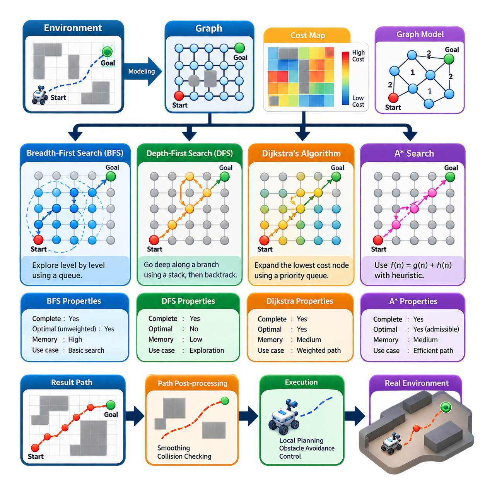
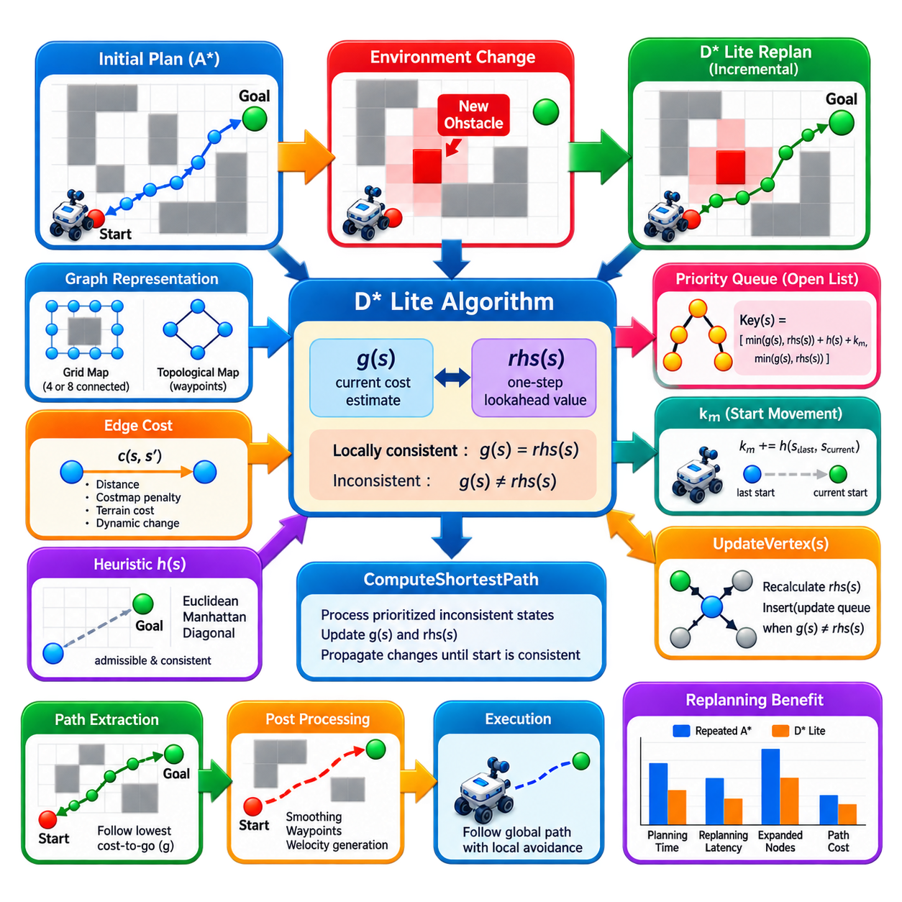
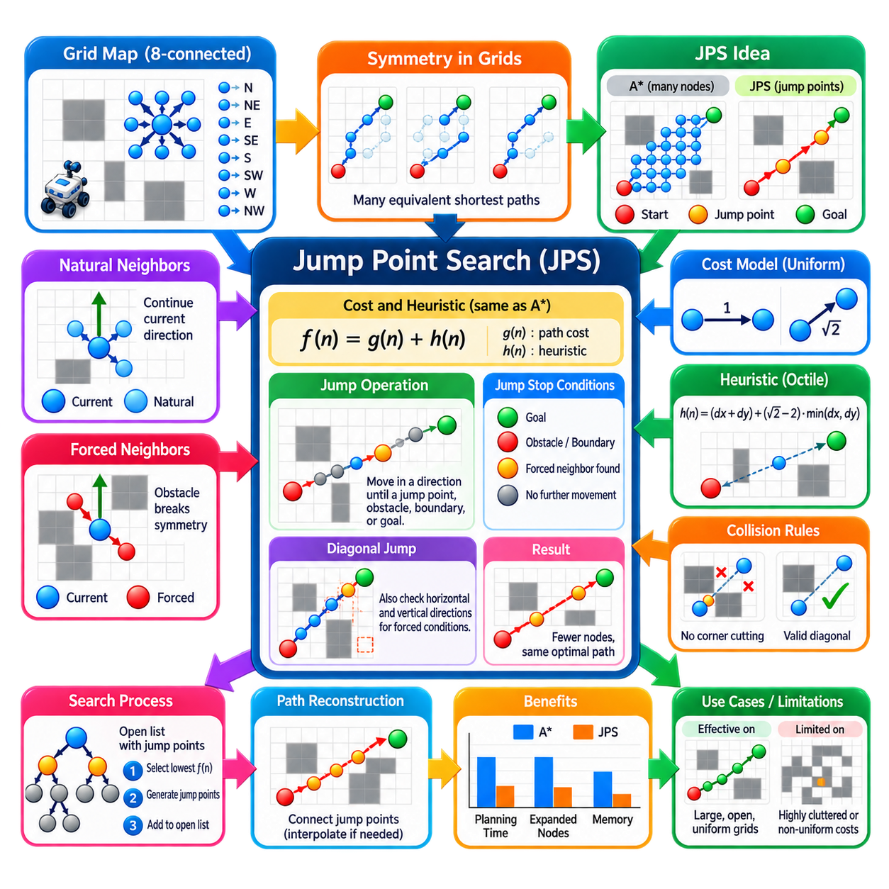
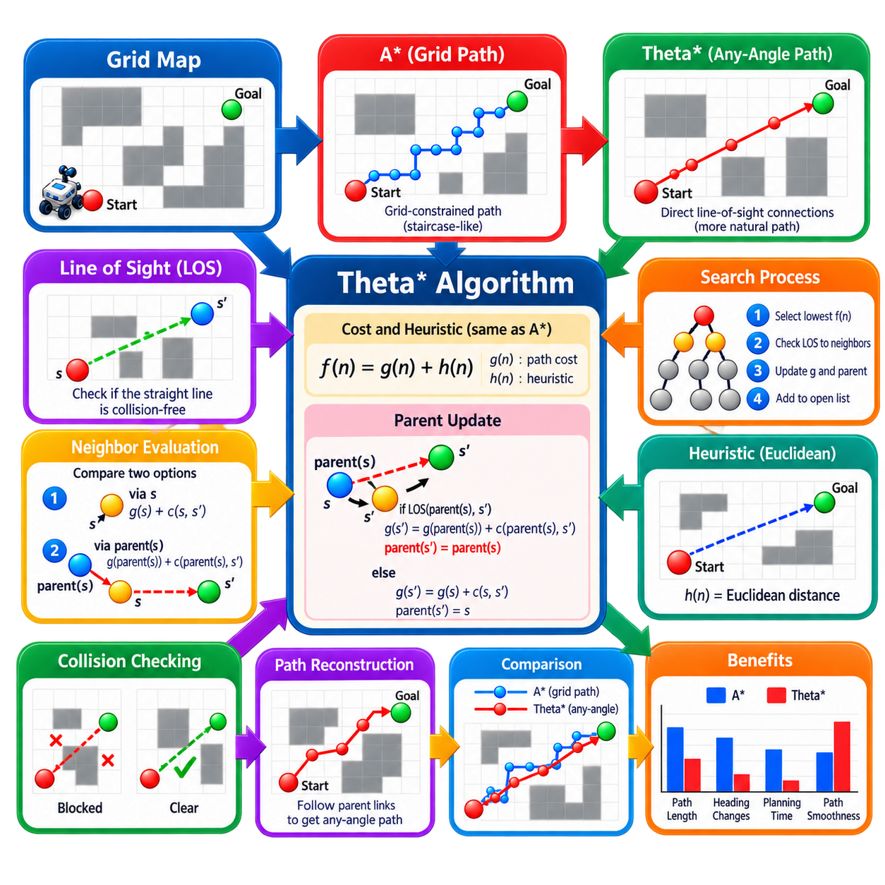
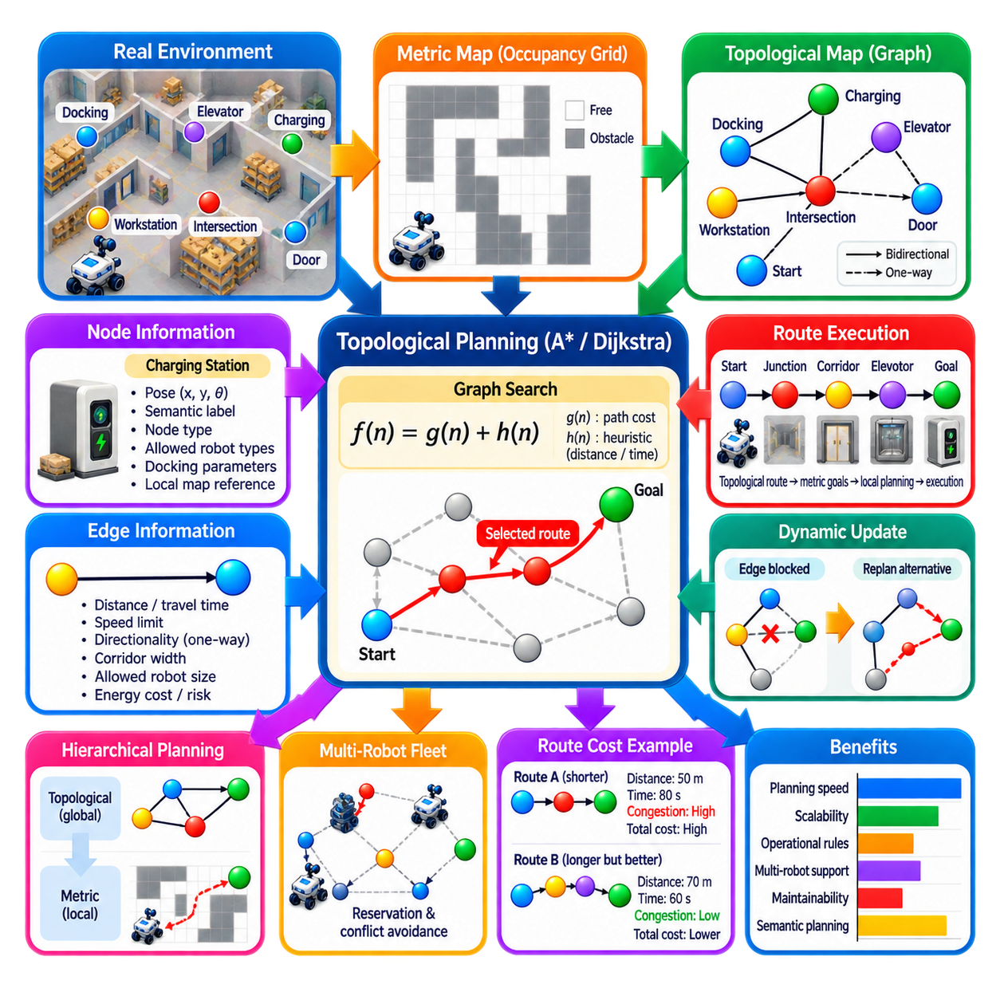
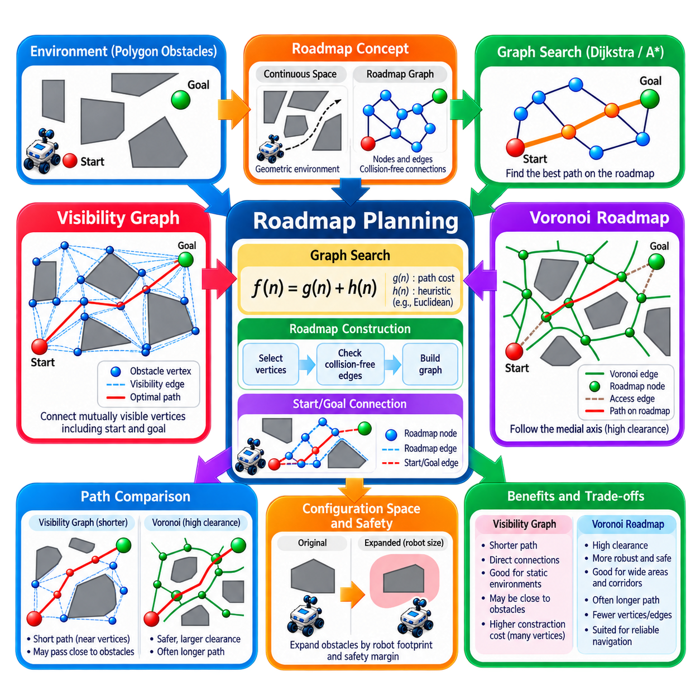
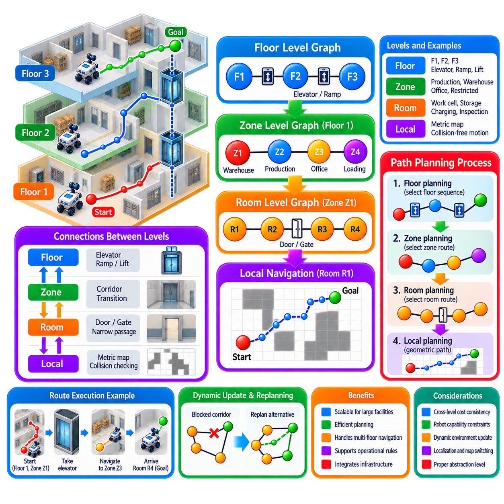
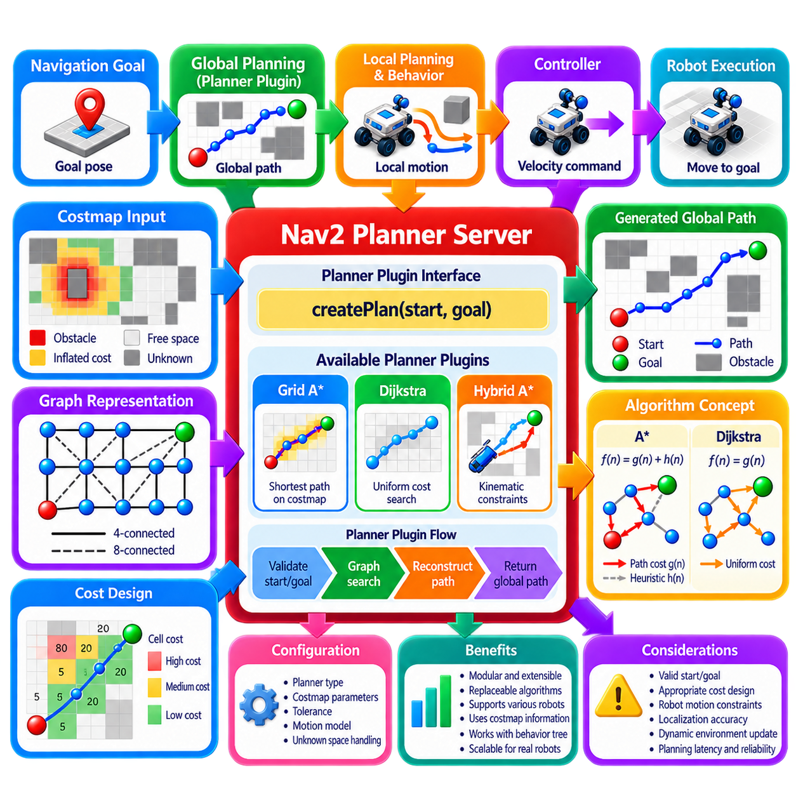

**Volume 15. Motion Planning and Navigation**


# Chapter 02. Graph Based Planning

##  

## 02.01. Graph Search Theory BFS DFS Dijkstra A Star [w/Code]

{width="7.268055555555556in" height="7.268055555555556in"}

Graph-based planning represents a navigation problem as a collection of discrete states connected by feasible transitions. A graph is commonly written as G = (V, E), where V contains vertices representing positions, configurations, or waypoints and E contains edges describing valid movements between them. In robot navigation, occupancy grids, roadmaps, and topological maps can all be transformed into graphs, allowing path planning to become a systematic search from a start vertex to a goal vertex.

Each edge may be assigned a cost describing distance, traversal time, energy consumption, terrain difficulty, risk, or another navigation objective. A planner then searches for a sequence of connected vertices that reaches the goal while satisfying the desired cost criterion. This abstraction separates the fundamental search problem from the physical representation of the environment and makes the same search principles applicable to indoor AMRs, outdoor mobile robots, manipulators, and other autonomous systems.

Breadth-First Search (BFS) explores a graph layer by layer. Starting from the initial vertex, it first visits all directly connected vertices, then vertices two edges away, and continues outward until the goal is discovered. A queue implements this first-in, first-out exploration order. For an unweighted graph, BFS is complete and returns a path containing the minimum number of edges, making it a useful baseline for understanding systematic graph exploration.

The principal limitation of BFS is that it does not distinguish between promising and unpromising search directions. In a large occupancy grid, the algorithm can expand a broad region around the start even when the goal lies in a clearly identifiable direction. Its memory demand can also become substantial because the frontier may contain many vertices simultaneously. BFS is therefore conceptually important but is rarely the most computationally efficient choice for large-scale robot navigation.

Depth-First Search (DFS) follows one branch of a graph as deeply as possible before backtracking. It is naturally implemented with a stack or recursion and generally requires less frontier memory than BFS. DFS is useful for graph traversal, connectivity analysis, exhaustive exploration, and several supporting algorithms, but it is poorly suited to shortest-path navigation because the first path reaching the goal may be unnecessarily long or costly.

The difference between BFS and DFS illustrates a fundamental planning tradeoff. BFS expands states according to search depth and can guarantee shortest paths in unweighted graphs, whereas DFS prioritizes depth and reduces frontier storage without preserving path optimality. Neither method considers arbitrary edge costs. Real robotic environments frequently contain movements with different distances or traversal penalties, motivating cost-aware search algorithms such as Dijkstra\'s algorithm.

Dijkstra\'s algorithm associates each vertex with the lowest accumulated path cost discovered from the start. The start receives cost zero, while other vertices initially have infinite cost. At each step, the algorithm selects the frontier vertex with the smallest accumulated cost and relaxes its outgoing edges. If reaching a neighbor through the current vertex produces a lower cost, the neighbor\'s cost and predecessor information are updated accordingly.

For graphs with nonnegative edge costs, Dijkstra\'s algorithm provides a complete and optimal shortest-path solution. In a robot costmap, this means that traversal penalties can influence planning rather than treating every movement identically. A planner may therefore prefer a slightly longer geometric route that avoids expensive cells near obstacles or difficult terrain. The resulting path reflects the cost model encoded in the graph instead of merely minimizing the number of transitions.

A priority queue is normally used to efficiently retrieve the vertex with the lowest current path cost. With appropriate data structures, Dijkstra\'s algorithm scales much better than a naive implementation, yet it still explores vertices in every direction according to accumulated cost. Because it has no explicit knowledge of the goal\'s direction, a considerable number of states may be processed even when only a relatively narrow region is relevant to the final route.

A\* search introduces goal-directed reasoning by combining the accumulated path cost g(n) with a heuristic estimate h(n) of the remaining cost to the goal. The evaluation function is expressed as f(n) = g(n) + h(n). The planner preferentially expands vertices with low estimated total path cost, allowing it to concentrate computation toward regions that appear likely to produce an efficient route while retaining the cost-sensitive behavior of Dijkstra\'s algorithm.

The heuristic is central to A\* performance. On a four-connected grid, Manhattan distance is often appropriate, while Euclidean distance naturally represents straight-line separation. Eight-connected grids can use heuristic formulations that reflect diagonal motion. A heuristic should correspond to the motion model and cost structure of the planning graph; otherwise, the search may perform unnecessary expansions or lose theoretical guarantees expected from the algorithm.

An admissible heuristic never overestimates the true minimum remaining cost. Under appropriate graph-search conditions, this property allows A\* to retain optimality while reducing exploration relative to uninformed cost search. A consistent heuristic additionally satisfies a triangle-like relationship between neighboring states, simplifying efficient graph-search implementations. When h(n) is zero everywhere, A\* effectively reduces to Dijkstra\'s algorithm and loses its goal-directed advantage.

The relationship among the four algorithms can therefore be understood through the information used to select the next state. DFS primarily uses search depth, BFS uses increasing graph depth, Dijkstra uses accumulated path cost g(n), and A\* combines accumulated cost with estimated future cost. This progression demonstrates how increasingly informative search policies can improve navigation efficiency while maintaining different combinations of completeness, optimality, memory usage, and computational cost.

A practical implementation maintains a frontier containing candidate vertices, a record of explored or finalized states, cost information, and predecessor links. When the goal is reached under the algorithm\'s termination conditions, predecessor links are followed backward from the goal to reconstruct the path. Careful handling of repeated states, stale priority-queue entries, unreachable goals, map boundaries, and invalid transitions is essential because implementation details can significantly affect planner correctness.

For grid-based robot navigation, each traversable cell can become a vertex and neighboring cells define edges. Obstacles are excluded or assigned prohibitive costs, while inflation regions and terrain properties can increase traversal costs. The connectivity model determines allowable movements: four-connectivity permits orthogonal motion, whereas eight-connectivity additionally permits diagonals. Edge costs should remain consistent with these motions so that the graph represents physical movement meaningfully.

Graph resolution also affects planning behavior. A fine grid captures narrow passages and obstacle geometry with greater precision but creates more vertices and therefore increases search workload. A coarse representation reduces computation but may remove feasible corridors or produce paths that inadequately represent the robot footprint. Graph construction, cost assignment, and search algorithm selection must consequently be treated as coupled design decisions rather than independent software choices.

The path produced by graph search is usually a geometric or topological reference rather than a directly executable control command. Mobile robots still require collision checking, path smoothing, velocity generation, local obstacle avoidance, and feedback control. This distinction is reflected in a broader navigation architecture in which graph-based methods primarily serve global planning, while local planners and controllers handle short-horizon motion and continuously changing conditions.

Static graph search also has limitations when the environment changes after planning. Newly detected obstacles can invalidate edges or increase their costs, forcing the planner to search again or employ incremental methods designed for dynamic environments. This motivates algorithms such as D\* Lite, while techniques such as Jump Point Search and Theta\* address other limitations of conventional grid search. The volume structure treats these methods as subsequent developments of the graph-planning foundation.

In production robotics, algorithm selection should therefore depend on graph size, edge-cost structure, available memory, required planning latency, and the quality of heuristic information. BFS and DFS remain valuable for understanding traversal behavior and specialized graph operations, Dijkstra provides a rigorous foundation for weighted shortest paths, and A\* forms one of the most important practical bridges between classical graph theory and efficient goal-directed robot navigation.

Graph search ultimately converts navigation from an informal geometric question into a structured computational problem. States define where the robot may be, edges define how it may move, costs encode operational preferences, and the search policy determines how computational effort is allocated. Understanding BFS, DFS, Dijkstra, and A\* therefore provides the theoretical foundation for the more specialized graph planners, dynamic replanning methods, and navigation software architectures developed later in motion planning and navigation.

그래프 기반 계획(Graph-based Planning)은 내비게이션 문제(Navigation Problem)를 실행 가능한 전이(Feasible Transition)로 연결된 이산 상태(Discrete State)의 집합으로 표현한다. 그래프(Graph)는 일반적으로 G = (V, E)로 나타내며, V는 위치(Position), 구성(Configuration), 웨이포인트(Waypoint)를 나타내는 정점(Vertex)의 집합이고 E는 정점 사이에서 가능한 이동을 나타내는 간선(Edge)의 집합이다. 로봇 내비게이션에서는 점유 격자(Occupancy Grid), 로드맵(Roadmap), 위상 지도(Topological Map)를 그래프로 변환하여 시작 정점에서 목표 정점까지 체계적으로 탐색할 수 있다.

각 간선(Edge)에는 거리(Distance), 이동 시간(Traversal Time), 에너지 소비(Energy Consumption), 지형 난이도(Terrain Difficulty), 위험도(Risk) 또는 다른 내비게이션 목적을 나타내는 비용(Cost)을 부여할 수 있다. 계획기(Planner)는 원하는 비용 기준을 만족하면서 목표까지 도달하는 연결된 정점의 순서를 탐색한다. 이러한 추상화는 기본적인 탐색 문제를 환경의 물리적 표현과 분리하여 동일한 탐색 원리를 실내 자율이동로봇(AMR), 실외 이동 로봇, 매니퓰레이터(Manipulator) 및 다양한 자율 시스템에 적용할 수 있게 한다.

너비 우선 탐색(Breadth-First Search, BFS)은 그래프를 계층별로 탐색한다. 시작 정점에서 출발하여 먼저 직접 연결된 모든 정점을 방문하고, 그다음 두 개의 간선만큼 떨어진 정점들을 탐색하며 목표가 발견될 때까지 바깥쪽으로 탐색을 확장한다. 큐(Queue)를 이용하여 선입선출(First-In, First-Out) 방식의 탐색 순서를 구현한다. 가중치가 없는 그래프(Unweighted Graph)에서 BFS는 완전성(Completeness)을 가지며 최소 간선 수의 경로를 반환하므로 체계적인 그래프 탐색을 이해하기 위한 중요한 기본 알고리즘이다.

BFS의 주요 한계는 유망한 탐색 방향과 그렇지 않은 방향을 구별하지 않는다는 점이다. 대규모 점유 격자(Occupancy Grid)에서는 목표가 명확한 방향에 존재하더라도 시작점 주변의 넓은 영역을 확장할 수 있다. 또한 탐색 경계(Frontier)에 많은 정점을 동시에 저장해야 하므로 메모리 요구량도 크게 증가할 수 있다. 따라서 BFS는 개념적으로 중요하지만 대규모 로봇 내비게이션에서는 계산 효율 측면에서 항상 최선의 선택은 아니다.

깊이 우선 탐색(Depth-First Search, DFS)은 하나의 그래프 분기(Branch)를 가능한 깊이까지 탐색한 후 역추적(Backtracking)한다. 일반적으로 스택(Stack)이나 재귀(Recursion)를 이용하여 구현하며 BFS보다 탐색 경계 메모리가 적게 필요한 경우가 많다. DFS는 그래프 순회(Graph Traversal), 연결성 분석(Connectivity Analysis), 전수 탐색(Exhaustive Exploration) 및 여러 보조 알고리즘에 유용하지만, 처음 발견한 목표 경로가 불필요하게 길거나 높은 비용을 가질 수 있으므로 최단 경로 내비게이션에는 적합하지 않다.

BFS와 DFS의 차이는 계획(Planning)의 기본적인 절충 관계(Trade-off)를 보여준다. BFS는 탐색 깊이에 따라 상태를 확장하며 가중치가 없는 그래프에서 최단 경로를 보장할 수 있는 반면, DFS는 깊이를 우선하여 탐색 경계 저장량을 줄이지만 경로 최적성(Path Optimality)을 보장하지 않는다. 두 방법 모두 임의의 간선 비용을 직접 고려하지 않는다. 실제 로봇 환경에서는 이동 거리나 통과 비용이 서로 다른 경우가 많으므로 다익스트라 알고리즘(Dijkstra\'s Algorithm)과 같은 비용 인식 탐색(Cost-aware Search)이 필요하다.

다익스트라 알고리즘(Dijkstra\'s Algorithm)은 각 정점에 시작점으로부터 현재까지 발견된 최소 누적 경로 비용(Accumulated Path Cost)을 연결한다. 시작점의 비용은 0으로 설정하고 다른 정점의 초기 비용은 무한대(Infinity)로 설정한다. 각 단계에서는 현재 누적 비용이 가장 작은 탐색 경계 정점을 선택하고 연결된 간선에 대해 완화(Relaxation)를 수행한다. 현재 정점을 거쳐 이웃 정점에 도달하는 비용이 더 작으면 해당 정점의 비용과 선행 정점(Predecessor) 정보를 갱신한다.

음수가 아닌 간선 비용(Nonnegative Edge Cost)을 갖는 그래프에서 다익스트라 알고리즘은 완전하고 최적인 최단 경로(Shortest Path)를 제공한다. 로봇 비용 지도(Costmap)에서는 모든 이동을 동일하게 취급하지 않고 이동 페널티(Traversal Penalty)를 계획에 반영할 수 있다. 따라서 장애물 주변이나 이동하기 어려운 지형을 피하기 위해 기하학적으로 약간 더 긴 경로를 선택할 수도 있다. 결과 경로는 단순히 전이 횟수를 최소화하는 것이 아니라 그래프에 정의된 비용 모델(Cost Model)을 반영한다.

현재 경로 비용이 가장 작은 정점을 효율적으로 선택하기 위해 일반적으로 우선순위 큐(Priority Queue)를 사용한다. 적절한 자료 구조(Data Structure)를 적용하면 다익스트라 알고리즘은 단순한 구현보다 훨씬 효율적으로 확장될 수 있지만, 목표 방향에 관한 명시적인 정보를 사용하지 않는다는 한계가 있다. 따라서 최종 경로와 직접 관련된 영역이 비교적 좁더라도 누적 비용을 기준으로 여러 방향의 많은 상태를 처리해야 할 수 있다.

A\* 탐색(A\* Search)은 누적 경로 비용 g(n)과 목표까지 남은 비용의 휴리스틱 추정값(Heuristic Estimate) h(n)을 결합하여 목표 지향 탐색(Goal-directed Search)을 수행한다. 평가 함수(Evaluation Function)는 f(n) = g(n) + h(n)으로 표현된다. 계획기는 예상 총 경로 비용이 낮은 정점을 우선적으로 확장하므로 효율적인 경로를 생성할 가능성이 높은 영역에 계산을 집중하면서도 다익스트라 알고리즘의 비용 기반 탐색 특성을 유지할 수 있다.

휴리스틱(Heuristic)은 A\* 성능을 결정하는 핵심 요소이다. 4방향 연결 격자(Four-connected Grid)에서는 맨해튼 거리(Manhattan Distance)가 자주 사용되며, 유클리드 거리(Euclidean Distance)는 직선상의 공간적 거리를 자연스럽게 나타낸다. 8방향 연결 격자(Eight-connected Grid)에서는 대각선 이동을 반영하는 휴리스틱을 사용할 수 있다. 휴리스틱은 계획 그래프의 이동 모델(Motion Model)과 비용 구조에 부합해야 하며, 그렇지 않으면 불필요한 상태 확장이 증가하거나 알고리즘의 이론적 보장이 약화될 수 있다.

허용 가능한 휴리스틱(Admissible Heuristic)은 실제 최소 잔여 비용을 절대로 과대평가하지 않는다. 적절한 그래프 탐색 조건에서 이러한 특성은 A\*가 비정보 탐색(Uninformed Search)보다 탐색 영역을 줄이면서도 최적성(Optimality)을 유지하도록 한다. 일관된 휴리스틱(Consistent Heuristic)은 인접 상태 사이에서 삼각 부등식과 유사한 관계를 추가로 만족하여 효율적인 그래프 탐색 구현을 단순화한다. 모든 상태에서 h(n) = 0이면 A\*는 사실상 다익스트라 알고리즘으로 축소되어 목표 지향적인 장점을 잃는다.

따라서 네 가지 알고리즘의 관계는 다음 상태를 선택할 때 어떤 정보를 사용하는가를 통해 이해할 수 있다. DFS는 주로 탐색 깊이를 사용하고, BFS는 증가하는 그래프 깊이를 사용하며, 다익스트라 알고리즘은 누적 경로 비용 g(n)을 사용한다. A\*는 누적 비용과 미래 비용의 추정값을 함께 사용한다. 이러한 발전 과정은 보다 많은 정보를 활용하는 탐색 정책(Search Policy)이 완전성, 최적성, 메모리 사용량 및 계산 비용 사이의 서로 다른 특성을 유지하면서 내비게이션 효율을 향상시키는 방법을 보여준다.

실제 구현에서는 후보 정점을 저장하는 탐색 경계(Frontier), 탐색되었거나 확정된 상태의 기록, 비용 정보(Cost Information), 선행 정점 연결(Predecessor Link)을 관리한다. 알고리즘의 종료 조건에 따라 목표에 도달하면 목표 정점에서 시작점 방향으로 선행 정점을 역추적하여 경로를 복원한다. 반복 상태(Repeated State), 오래된 우선순위 큐 항목(Stale Priority-Queue Entry), 도달 불가능한 목표(Unreachable Goal), 지도 경계(Map Boundary), 유효하지 않은 전이(Invalid Transition)를 정확히 처리하는 것이 계획기의 정확성을 위해 중요하다.

격자 기반 로봇 내비게이션(Grid-based Robot Navigation)에서는 이동 가능한 각 셀(Cell)을 하나의 정점으로 표현하고 인접한 셀 사이의 관계를 간선으로 정의할 수 있다. 장애물은 그래프에서 제외하거나 매우 높은 비용을 부여하며, 팽창 영역(Inflation Region)과 지형 특성에 따라 이동 비용을 증가시킬 수 있다. 4방향 연결(Four-connectivity)은 직교 방향 이동을 허용하고, 8방향 연결(Eight-connectivity)은 대각선 이동까지 허용한다. 그래프가 실제 물리적 이동을 의미 있게 표현하도록 간선 비용도 이러한 이동 방식과 일관성을 유지해야 한다.

그래프 해상도(Graph Resolution) 역시 계획 동작에 영향을 준다. 세밀한 격자는 좁은 통로와 장애물 형상을 보다 정확하게 표현하지만 더 많은 정점을 생성하여 탐색 연산량을 증가시킨다. 반대로 거친 표현(Coarse Representation)은 계산량을 감소시키지만 실제로 통과 가능한 경로를 제거하거나 로봇의 형상을 충분히 반영하지 못하는 경로를 생성할 수 있다. 따라서 그래프 구성(Graph Construction), 비용 할당(Cost Assignment), 탐색 알고리즘 선택은 독립적인 문제가 아니라 서로 연계된 설계 요소로 다루어야 한다.

그래프 탐색(Graph Search)이 생성하는 경로는 일반적으로 직접 실행할 수 있는 제어 명령(Control Command)이 아니라 기하학적 또는 위상학적 기준 경로(Reference Path)이다. 이동 로봇에는 추가적으로 충돌 검사(Collision Checking), 경로 평활화(Path Smoothing), 속도 생성(Velocity Generation), 지역 장애물 회피(Local Obstacle Avoidance), 피드백 제어(Feedback Control)가 필요하다. 이러한 구분에 따라 그래프 기반 방법은 주로 전역 계획(Global Planning)을 담당하고, 지역 계획기(Local Planner)와 제어기(Controller)는 단기적인 움직임과 지속적으로 변화하는 환경을 처리한다.

정적 그래프 탐색(Static Graph Search)은 계획이 완료된 이후 환경이 변화하는 경우에도 한계를 가진다. 새롭게 감지된 장애물은 기존 간선을 무효화하거나 비용을 증가시킬 수 있으며, 이에 따라 계획기는 다시 탐색하거나 동적 환경을 위해 설계된 증분 탐색 방법(Incremental Search Method)을 사용해야 한다. 이러한 문제는 D\* Lite와 같은 알고리즘의 필요성을 만들며, 점프 포인트 탐색(Jump Point Search, JPS)과 Theta\* 같은 기법은 기존 격자 탐색의 다른 한계를 개선한다.

실제 로봇 시스템(Production Robotics)에서 알고리즘 선택은 그래프 크기(Graph Size), 간선 비용 구조(Edge-cost Structure), 사용 가능한 메모리, 요구되는 계획 지연 시간(Planning Latency), 휴리스틱 정보의 품질을 고려해야 한다. BFS와 DFS는 탐색 동작과 특수한 그래프 연산을 이해하는 데 중요한 기반을 제공하고, 다익스트라 알고리즘은 가중 최단 경로(Weighted Shortest Path)의 엄밀한 기반을 제공한다. A\*는 고전적인 그래프 이론(Graph Theory)과 효율적인 목표 지향 로봇 내비게이션을 연결하는 가장 중요한 실용적 알고리즘 가운데 하나이다.

궁극적으로 그래프 탐색(Graph Search)은 내비게이션을 비정형적인 기하학 문제에서 구조화된 계산 문제(Computational Problem)로 변환한다. 상태(State)는 로봇이 존재할 수 있는 위치를 정의하고, 간선(Edge)은 로봇이 이동할 수 있는 방법을 정의하며, 비용(Cost)은 운용상의 선호도를 표현한다. 그리고 탐색 정책(Search Policy)은 계산 자원을 어디에 집중할지를 결정한다. 따라서 BFS, DFS, 다익스트라 알고리즘, A\*에 대한 이해는 이후의 전문적인 그래프 계획기(Graph Planner), 동적 재계획(Dynamic Replanning), 내비게이션 소프트웨어 아키텍처(Navigation Software Architecture)를 이해하기 위한 이론적 기반을 제공한다.

##  

## 02.02. A Star and Weighted A Star Implementation [w/Code]

{width="7.268055555555556in" height="7.268055555555556in"}

A\* is a goal-directed graph search algorithm that combines the exact cost already accumulated from the start with an estimate of the cost remaining to the goal. For a state n, the evaluation function is f(n) = g(n) + h(n), where g(n) represents the known path cost and h(n) is the heuristic estimate. This combination allows A\* to preserve cost-aware planning while concentrating exploration toward promising regions of the graph.

In robot navigation, the graph may originate from an occupancy grid, costmap, topological network, or discretized configuration space. Each traversable state becomes a node, while feasible movements define edges. Edge costs can represent geometric distance, cell traversal penalties, terrain difficulty, energy demand, or combinations of these quantities. A\* therefore operates on an abstract graph while remaining closely connected to physical navigation requirements.

A practical A\* implementation maintains an open set containing candidate nodes that may still be expanded and a record of nodes whose relevant search information has already been processed. The open set is normally organized as a priority queue ordered by f(n). Each node additionally requires its best-known g-cost and predecessor information so that the final route can be reconstructed after the goal is reached.

Search begins by assigning the start node a g-cost of zero and inserting it into the priority queue with its corresponding heuristic value. The algorithm repeatedly extracts the node with the smallest f-value and examines its neighbors. For every valid transition, a tentative cost is calculated by adding the edge cost to the current node\'s g-value. If this value improves the recorded cost of the neighbor, its cost and predecessor are updated.

The heuristic function strongly influences search efficiency. Euclidean distance is appropriate when motion approximates continuous straight-line travel, Manhattan distance naturally corresponds to four-connected grids, and diagonal-aware metrics can better represent eight-connected motion. The heuristic should reflect the graph\'s actual transition model because a poorly matched heuristic can cause unnecessary expansions even when the implementation itself is computationally efficient.

For standard optimal A\*, the heuristic is commonly required to be admissible, meaning that it never overestimates the true minimum cost from a state to the goal. A consistent heuristic additionally satisfies h(n) ≤ c(n,n\') + h(n\') for neighboring states. Consistency helps ensure that f-values behave predictably along paths and simplifies efficient graph-search implementations by reducing complications associated with reopening previously processed nodes.

The relationship between A\* and Dijkstra\'s algorithm becomes clear through the heuristic term. If h(n) = 0 for every node, then f(n) = g(n), and A\* behaves as Dijkstra\'s algorithm. As heuristic information becomes more informative while remaining admissible, exploration can become increasingly focused toward the goal. The heuristic therefore provides a mechanism for trading uninformed graph expansion for structured knowledge about the remaining search distance.

Weighted A\* modifies the evaluation function to f(n) = g(n) + w·h(n), where the heuristic weight w is typically greater than one. Increasing the contribution of h(n) makes the search more strongly goal-directed. The planner may consequently expand substantially fewer nodes and return a solution faster, but the selected path can become more expensive than the optimal path because estimated future cost is deliberately emphasized over accumulated cost.

The weight provides a direct mechanism for controlling the tradeoff between path quality and search effort. At w = 1, Weighted A\* becomes ordinary A\*. As w increases, behavior becomes progressively more heuristic-driven and can approach greedy best-first characteristics. This property is useful in robotics when planning latency matters more than obtaining the mathematically shortest possible route, particularly when global paths will subsequently be refined or locally controlled.

Under appropriate assumptions, Weighted A\* offers bounded-suboptimal behavior rather than abandoning solution quality without restriction. When an admissible heuristic is used with a fixed weight, the resulting solution cost can be related to the optimal cost through the heuristic inflation factor. This makes Weighted A\* attractive for systems that require predictable compromises between computational speed and route quality rather than purely heuristic acceleration without a meaningful performance bound.

Efficient priority-queue management is a critical implementation issue. Many standard heap structures do not directly support decreasing the priority of an existing entry. A common solution is to insert a new entry whenever a better g-cost is discovered and ignore obsolete entries when they are later removed from the queue. This lazy-update strategy simplifies implementation while preserving correct search behavior when stale entries are identified reliably.

Tie breaking also influences practical performance even when it does not change the fundamental algorithm. Multiple nodes may have identical or nearly identical f-values, particularly on regular grids. Secondary ordering based on h-values, g-values, insertion order, or another deterministic criterion can change the number and shape of expanded states. Deterministic tie handling is especially valuable for repeatable testing and debugging of production navigation software.

Neighbor generation must accurately reflect the robot\'s permitted motion. A four-connected grid allows horizontal and vertical transitions, whereas an eight-connected grid also introduces diagonal moves. Orthogonal edges may use unit cost and diagonal edges a cost proportional to √2 when geometric distance is represented. Invalid cells, obstacles, map boundaries, and transitions violating collision constraints must be rejected before they enter the normal relaxation process.

Diagonal motion introduces additional collision considerations. A planner should not automatically permit a diagonal transition merely because the destination cell is free. Moving diagonally between two occupied orthogonal neighbors may cause the robot to cut through an obstacle corner. Implementations therefore commonly apply corner-cutting rules or explicit edge collision checks so that graph connectivity remains consistent with the physical free space available to the robot.

Costmaps extend A\* beyond pure shortest-distance planning. A transition can combine geometric movement cost with penalties derived from obstacle inflation, semantic restrictions, terrain properties, or operational preferences. The resulting g-value represents accumulated navigation cost rather than distance alone. Care is required to scale the heuristic consistently with these costs so that its theoretical properties and practical influence remain appropriate for the graph being searched.

Path reconstruction begins after the goal satisfies the algorithm\'s termination condition. Each improved node stores a parent or predecessor indicating the state from which its current best path originated. Starting from the goal, these links are followed backward until the start is reached, and the resulting sequence is reversed. The reconstructed node sequence forms the discrete global path that can subsequently be converted into poses, waypoints, or trajectory references.

Robust implementations must also handle failure explicitly. The priority queue may become empty before the goal is reached, indicating that no path exists within the currently represented graph. The planner should distinguish this condition from invalid start or goal states, blocked endpoints, map errors, resource limits, and search timeouts. Clear failure semantics allow higher-level navigation software to select recovery actions instead of treating every planning failure identically.

Memory usage becomes important on large maps because g-costs, parent information, state flags, and queue entries may be maintained for many nodes. Array-based structures are efficient for dense regular grids, while hash-based representations can be advantageous for sparse or irregular graphs. Preallocated buffers, compact node indexing, and reuse of planning memory can reduce allocation overhead and improve timing consistency in repeatedly executed robot navigation tasks.

Implementation performance should be evaluated using more than final path length. Useful measurements include planning latency, number of expanded nodes, peak frontier size, total path cost, geometric path length, and success rate. Comparing A\* and Weighted A\* across identical maps reveals the practical effect of heuristic inflation. Such measurements also help determine whether increased weight produces meaningful latency improvement or merely sacrifices path quality without sufficient computational benefit.

For production AMRs, a fixed heuristic weight is not always the only useful strategy. A system may use conservative A\* when sufficient computation time is available and a more aggressive Weighted A\* when rapid replanning is required. Weight selection can also reflect map scale, mission urgency, computational load, or operational context. The important requirement is that changes remain predictable, testable, and compatible with the navigation system\'s safety constraints.

A\* and Weighted A\* ultimately share the same implementation foundation: graph construction, neighbor generation, accumulated cost tracking, heuristic evaluation, priority-based expansion, predecessor storage, and path reconstruction. Their essential difference lies in how strongly future estimated cost influences node selection. Understanding this single parameterized relationship provides a practical foundation for implementing efficient global planners and for studying later graph-search accelerations and dynamic replanning methods.

A\*(A-Star)는 시작점에서 이미 누적된 정확한 비용과 목표까지 남은 비용의 추정값을 결합하는 목표 지향 그래프 탐색(Goal-directed Graph Search) 알고리즘이다. 상태 n에 대한 평가 함수(Evaluation Function)는 f(n) = g(n) + h(n)으로 표현되며, 여기서 g(n)은 현재까지 알려진 경로 비용(Path Cost), h(n)은 휴리스틱 추정값(Heuristic Estimate)을 의미한다. 이러한 결합을 통해 A\*는 비용 인식 계획(Cost-aware Planning)을 유지하면서 유망한 그래프 영역에 탐색을 집중할 수 있다.

로봇 내비게이션(Robot Navigation)에서 그래프(Graph)는 점유 격자(Occupancy Grid), 비용 지도(Costmap), 위상 네트워크(Topological Network) 또는 이산화된 구성 공간(Discretized Configuration Space)으로부터 생성될 수 있다. 이동 가능한 각 상태는 노드(Node)가 되고 실행 가능한 이동은 간선(Edge)을 정의한다. 간선 비용은 기하학적 거리, 셀 통과 페널티(Cell Traversal Penalty), 지형 난이도, 에너지 요구량 또는 이러한 요소의 조합을 나타낼 수 있다. 따라서 A\*는 추상적인 그래프에서 동작하면서 실제 물리적 내비게이션 요구사항과 긴밀하게 연결된다.

실용적인 A\* 구현(Implementation)은 아직 확장될 가능성이 있는 후보 노드를 포함하는 오픈 집합(Open Set)과 관련 탐색 정보가 이미 처리된 노드의 기록을 유지한다. 오픈 집합은 일반적으로 f(n)을 기준으로 정렬되는 우선순위 큐(Priority Queue)로 구성한다. 또한 각 노드는 현재까지 알려진 최상의 g 비용(g-cost)과 선행 노드(Predecessor) 정보를 유지해야 하며, 이를 통해 목표에 도달한 이후 최종 경로를 복원할 수 있다.

탐색(Search)은 시작 노드의 g 비용을 0으로 설정하고 해당 휴리스틱 값을 이용하여 우선순위 큐에 삽입하면서 시작한다. 알고리즘은 반복적으로 가장 작은 f 값을 가진 노드를 추출하여 이웃 노드(Neighbor)를 검사한다. 각각의 유효한 전이에 대해 현재 노드의 g 값에 간선 비용을 더하여 임시 비용(Tentative Cost)을 계산한다. 이 값이 이웃 노드에 기록된 기존 비용보다 작으면 해당 노드의 비용과 선행 노드 정보를 갱신한다.

휴리스틱 함수(Heuristic Function)는 탐색 효율(Search Efficiency)에 큰 영향을 미친다. 유클리드 거리(Euclidean Distance)는 움직임이 연속적인 직선 이동에 가까운 경우 적합하며, 맨해튼 거리(Manhattan Distance)는 4방향 연결 격자(Four-connected Grid)에 자연스럽게 대응한다. 8방향 연결 격자(Eight-connected Grid)에서는 대각선 이동을 고려하는 거리 척도가 보다 적합할 수 있다. 휴리스틱은 그래프의 실제 전이 모델(Transition Model)을 반영해야 하며, 적절하지 않은 휴리스틱은 구현 자체가 효율적이더라도 불필요한 노드 확장을 증가시킬 수 있다.

표준 최적 A\*(Optimal A\*)에서는 일반적으로 휴리스틱이 허용 가능(Admissible)해야 한다. 즉, 특정 상태에서 목표까지의 실제 최소 비용을 절대로 과대평가하지 않아야 한다. 일관된 휴리스틱(Consistent Heuristic)은 인접 상태 n과 n\'에 대해 h(n) ≤ c(n,n\') + h(n\')의 조건을 추가로 만족한다. 일관성(Consistency)은 경로를 따라 f 값이 예측 가능한 방식으로 변화하도록 하며, 이미 처리된 노드를 다시 열어야 하는 복잡성을 줄여 효율적인 그래프 탐색 구현을 단순화한다.

A\*와 다익스트라 알고리즘(Dijkstra\'s Algorithm)의 관계는 휴리스틱 항(Heuristic Term)을 통해 명확하게 이해할 수 있다. 모든 노드에 대해 h(n) = 0이라면 f(n) = g(n)이 되므로 A\*는 다익스트라 알고리즘과 동일하게 동작한다. 허용 가능성을 유지하면서 휴리스틱 정보가 더욱 유용해질수록 탐색은 목표 방향으로 더욱 집중될 수 있다. 따라서 휴리스틱은 비정보 그래프 확장(Uninformed Graph Expansion)을 남은 탐색 거리에 대한 구조화된 지식으로 대체하는 역할을 한다.

가중 A\*(Weighted A\*)는 평가 함수를 f(n) = g(n) + w·h(n)으로 수정하며, 여기서 휴리스틱 가중치(Heuristic Weight) w는 일반적으로 1보다 큰 값을 사용한다. h(n)의 기여도를 높이면 탐색이 목표 지향적으로 더욱 강하게 진행된다. 이에 따라 계획기(Planner)는 훨씬 적은 수의 노드를 확장하고 더 빠르게 해를 찾을 수 있지만, 추정된 미래 비용을 누적 비용보다 의도적으로 강조하기 때문에 선택된 경로의 비용이 최적 경로보다 커질 수 있다.

가중치(Weight)는 경로 품질(Path Quality)과 탐색 연산량(Search Effort) 사이의 절충 관계를 직접 조절하는 수단을 제공한다. w = 1이면 가중 A\*는 일반 A\*와 동일해진다. w가 증가할수록 탐색은 점차 휴리스틱 중심(Heuristic-driven)으로 변화하며 탐욕적 최선 우선 탐색(Greedy Best-first Search)에 가까운 특성을 나타낼 수 있다. 이러한 특성은 수학적으로 가장 짧은 경로를 얻는 것보다 계획 지연 시간(Planning Latency)을 줄이는 것이 중요한 로봇 시스템에서 유용하다.

적절한 가정하에서 가중 A\*는 해의 품질을 아무런 제한 없이 포기하는 것이 아니라 제한된 준최적성(Bounded Suboptimality)을 제공할 수 있다. 허용 가능한 휴리스틱과 고정된 가중치를 사용하는 경우 생성된 해의 비용은 휴리스틱 팽창 계수(Heuristic Inflation Factor)를 통해 최적 비용과 연관시킬 수 있다. 따라서 가중 A\*는 단순한 휴리스틱 가속보다 계산 속도와 경로 품질 사이에서 예측 가능한 절충이 필요한 시스템에 적합하다.

효율적인 우선순위 큐 관리(Priority-queue Management)는 구현에서 매우 중요한 문제이다. 많은 표준 힙(Heap) 자료 구조는 기존 항목의 우선순위를 직접 낮추는 연산을 지원하지 않는다. 일반적인 해결 방법은 더 좋은 g 비용이 발견될 때마다 새로운 항목을 삽입하고, 이전 항목이 나중에 큐에서 추출되면 이를 오래된 항목(Stale Entry)으로 판단하여 무시하는 것이다. 이러한 지연 갱신 전략(Lazy-update Strategy)은 오래된 항목을 신뢰성 있게 식별한다면 올바른 탐색 동작을 유지하면서 구현을 단순화할 수 있다.

동점 처리(Tie Breaking) 역시 기본 알고리즘 자체를 변경하지 않으면서 실제 성능에 영향을 줄 수 있다. 특히 규칙적인 격자에서는 여러 노드가 동일하거나 거의 동일한 f 값을 가질 수 있다. h 값, g 값, 삽입 순서(Insertion Order) 또는 다른 결정론적 기준(Deterministic Criterion)을 이용한 2차 정렬은 확장되는 상태의 수와 형태를 변화시킬 수 있다. 결정론적인 동점 처리는 실제 내비게이션 소프트웨어의 반복 가능한 시험과 디버깅(Debugging)에 특히 유용하다.

이웃 노드 생성(Neighbor Generation)은 로봇이 허용하는 이동 방식을 정확하게 반영해야 한다. 4방향 연결 격자는 수평과 수직 이동을 허용하고, 8방향 연결 격자는 대각선 이동도 추가한다. 기하학적 거리를 비용으로 표현한다면 직교 방향 간선은 단위 비용(Unit Cost), 대각선 간선은 √2에 비례하는 비용을 사용할 수 있다. 유효하지 않은 셀, 장애물, 지도 경계 및 충돌 제약(Collision Constraint)을 위반하는 전이는 일반적인 완화 과정(Relaxation Process)에 들어가기 전에 제거해야 한다.

대각선 이동(Diagonal Motion)은 추가적인 충돌 문제를 발생시킨다. 목적지 셀이 비어 있다는 이유만으로 대각선 전이를 자동으로 허용해서는 안 된다. 서로 직교하는 두 인접 셀이 장애물로 점유되어 있다면 대각선 이동 과정에서 로봇이 장애물 모서리를 통과하는 코너 절단(Corner Cutting)이 발생할 수 있다. 따라서 그래프 연결성이 실제 물리적 자유 공간(Free Space)과 일치하도록 코너 절단 방지 규칙이나 명시적인 간선 충돌 검사(Edge Collision Check)를 적용하는 것이 일반적이다.

비용 지도(Costmap)를 적용하면 A\*를 단순한 최단거리 계획 이상으로 확장할 수 있다. 하나의 전이 비용은 기하학적 이동 비용과 장애물 팽창(Obstacle Inflation), 의미론적 제한(Semantic Restriction), 지형 특성 또는 운용상의 선호도에서 발생하는 페널티를 결합할 수 있다. 이에 따라 g 값은 단순한 거리 대신 누적 내비게이션 비용(Accumulated Navigation Cost)을 나타낸다. 휴리스틱의 이론적 특성과 실제 영향이 탐색 그래프에 적절하도록 이러한 비용과 휴리스틱의 척도(Scale)를 일관성 있게 설정해야 한다.

경로 복원(Path Reconstruction)은 목표가 알고리즘의 종료 조건(Termination Condition)을 만족한 이후 시작한다. 비용이 개선된 각 노드는 현재 최상의 경로가 어느 상태에서 시작되었는지를 나타내는 부모(Parent) 또는 선행 노드(Predecessor)를 저장한다. 목표에서 시작하여 시작점에 도달할 때까지 이 연결을 역방향으로 추적하고, 얻어진 순서를 뒤집는다. 이렇게 복원된 노드의 순서는 이후 포즈(Pose), 웨이포인트(Waypoint) 또는 궤적 기준(Trajectory Reference)으로 변환할 수 있는 이산 전역 경로(Discrete Global Path)를 구성한다.

견고한 구현(Robust Implementation)은 실패 상황도 명확하게 처리해야 한다. 목표에 도달하기 전에 우선순위 큐가 비어 버리면 현재 표현된 그래프 안에서는 경로가 존재하지 않는다는 의미이다. 계획기는 이러한 상황을 잘못된 시작 또는 목표 상태, 차단된 시작점이나 목표점, 지도 오류(Map Error), 자원 제한(Resource Limit), 탐색 시간 초과(Search Timeout)와 구분해야 한다. 명확한 실패 의미론(Failure Semantics)을 제공하면 상위 수준의 내비게이션 소프트웨어가 모든 계획 실패를 동일하게 처리하지 않고 적절한 복구 행동(Recovery Action)을 선택할 수 있다.

대규모 지도에서는 많은 노드에 대해 g 비용, 부모 정보, 상태 플래그(State Flag), 큐 항목을 유지해야 하므로 메모리 사용량이 중요해진다. 조밀하고 규칙적인 격자에서는 배열 기반 구조(Array-based Structure)가 효율적이며, 희소하거나 불규칙한 그래프에서는 해시 기반 표현(Hash-based Representation)이 유리할 수 있다. 사전 할당 버퍼(Preallocated Buffer), 간결한 노드 인덱싱(Compact Node Indexing), 계획 메모리 재사용을 적용하면 메모리 할당 오버헤드를 줄이고 반복적으로 수행되는 로봇 내비게이션의 시간 일관성(Timing Consistency)을 향상시킬 수 있다.

구현 성능(Implementation Performance)은 최종 경로 길이만으로 평가해서는 안 된다. 계획 지연 시간, 확장된 노드 수(Number of Expanded Nodes), 최대 탐색 경계 크기(Peak Frontier Size), 전체 경로 비용, 기하학적 경로 길이, 성공률(Success Rate) 등을 함께 측정하는 것이 유용하다. 동일한 지도에서 A\*와 가중 A\*를 비교하면 휴리스틱 팽창(Heuristic Inflation)이 미치는 실제 영향을 확인할 수 있으며, 가중치 증가가 경로 품질의 손실에 비해 충분한 지연 시간 개선을 제공하는지도 판단할 수 있다.

실제 자율이동로봇(AMR)에서는 고정된 휴리스틱 가중치만을 사용할 필요는 없다. 충분한 계산 시간이 확보된 상황에서는 보수적인 A\*를 사용하고 빠른 재계획(Rapid Replanning)이 필요한 경우에는 보다 공격적인 가중 A\*를 사용할 수 있다. 가중치 선택은 지도 규모, 임무 긴급도(Mission Urgency), 계산 부하(Computational Load), 운용 상황에 따라 달라질 수도 있다. 중요한 것은 이러한 변경이 예측 가능하고 시험 가능하며 내비게이션 시스템의 안전 제약(Safety Constraint)과 호환되어야 한다는 점이다.

A\*와 가중 A\*는 궁극적으로 그래프 구성(Graph Construction), 이웃 생성, 누적 비용 추적, 휴리스틱 평가, 우선순위 기반 확장(Priority-based Expansion), 선행 노드 저장 및 경로 복원이라는 동일한 구현 기반을 공유한다. 두 알고리즘의 본질적인 차이는 미래의 추정 비용이 노드 선택에 얼마나 강하게 영향을 미치는가에 있다. 이러한 하나의 매개변수화된 관계(Parameterized Relationship)를 이해하면 효율적인 전역 계획기(Global Planner)를 구현하고 이후의 그래프 탐색 가속(Graph-search Acceleration) 및 동적 재계획(Dynamic Replanning) 방법을 학습하기 위한 실용적인 기반을 마련할 수 있다.

##  

## 02.03. D Star Lite for Dynamic Environment [w/Code]

{width="7.268055555555556in" height="7.268055555555556in"}

D\* Lite is an incremental graph-search algorithm designed for navigation in environments where traversal costs can change after planning has begun. Instead of discarding previous search results whenever newly sensed obstacles modify the map, it repairs only the affected portions of the solution. This property makes D\* Lite particularly useful for mobile robots that repeatedly discover changes while moving toward a goal.

The algorithm addresses a fundamental limitation of conventional static planners such as A\*. A\* can efficiently compute a path on a known graph, but when an obstacle appears or an edge cost changes, a straightforward implementation may perform a new search from the robot\'s current position. D\* Lite preserves information from earlier searches and reuses it, reducing repeated computation when environmental changes affect only part of the graph.

D\* Lite is closely related to Lifelong Planning A\* (LPA\*) and inherits its incremental-search principles. Rather than maintaining only a single best-known path cost for each state, D\* Lite maintains two important values, conventionally written as g(s) and rhs(s). Their relationship represents whether the current information associated with a state remains consistent after changes in the graph.

The value g(s) represents the planner\'s current estimate of the cost associated with a state, while rhs(s) is a one-step lookahead value computed from neighboring states. For ordinary states, rhs(s) can be expressed using the minimum over successor transitions of c(s,s\') + g(s\'). The goal is initialized with rhs(goal) = 0, establishing the destination as the anchor from which cost information propagates through the graph.

A state is locally consistent when g(s) = rhs(s). If these values differ, the state is inconsistent and may require processing because some graph information affecting its best route has changed. This consistency mechanism is central to incremental replanning. Rather than searching the entire map again, D\* Lite identifies inconsistent states and propagates only the corrections required to restore a valid shortest-path structure.

D\* Lite performs its search conceptually backward from the goal toward the robot\'s current state. This direction is advantageous because the goal often remains fixed while the robot moves continuously. Cost-to-go information can therefore be retained as the robot changes position. When new obstacles are detected, the planner updates affected edges and repairs the previously computed information instead of reconstructing the entire search from the new start.

A priority queue called the open list stores inconsistent states that may influence the current solution. Unlike basic A\*, D\* Lite uses a two-component priority key. The key incorporates the minimum of g(s) and rhs(s), a heuristic estimate between the robot\'s current state and the candidate state, and an additional correction term commonly denoted km. Lexicographic ordering of these key components determines which inconsistent state is processed next.

The km term compensates for movement of the robot\'s start state between replanning episodes. As the robot advances, km is increased according to the heuristic distance between the previous and current start positions. This mechanism allows priorities to be adjusted without rebuilding the complete queue whenever the robot moves, contributing to the efficiency of repeated planning during navigation.

The UpdateVertex operation is one of the core procedures in D\* Lite. When the cost of an edge changes, rhs values associated with affected states are recalculated from their successors. States for which g and rhs become unequal are inserted into or updated in the priority queue. States that regain consistency no longer require pending repair, allowing computation to remain concentrated around graph regions influenced by the change.

The ComputeShortestPath procedure repeatedly processes prioritized inconsistent states until the current start state has sufficient information to define a valid shortest path. Depending on the relationship between g and rhs, processing may lower an overestimated state value or invalidate an outdated value and propagate that change to neighboring states. Through repeated local updates, global path consistency is restored without restarting the search.

Consider an AMR traveling through a warehouse aisle using a path computed from the current costmap. If a pallet is unexpectedly placed across the planned corridor, perception updates the affected cells from free space to occupied or high-cost space. D\* Lite changes the corresponding graph costs, marks relevant states inconsistent, repairs the cost structure, and derives an alternative route around the newly discovered obstruction.

The same mechanism can handle decreases in traversal cost. An obstacle previously blocking a corridor may disappear, a temporary restricted region may reopen, or updated sensing may reveal that previously uncertain space is traversable. D\* Lite can propagate the improved costs and discover a shorter route. Incremental planning therefore supports both deterioration and improvement of the represented environment.

Graph construction remains as important for D\* Lite as for A\*. An occupancy grid may be represented using four-connected or eight-connected neighborhoods, while a topological navigation system may use intersections, rooms, doors, or waypoints as graph nodes. Edge costs must represent the intended motion and costmap semantics accurately because incremental search can only optimize the graph that the navigation system provides.

Collision validity also requires careful treatment when edge costs change. A newly occupied cell can invalidate multiple transitions, and diagonal motion may require corner-collision checks involving neighboring cells. For a robot with a nonzero footprint, obstacle inflation or footprint-aware collision checking should be reflected in the graph before replanning. Otherwise, a mathematically valid repaired path may still be physically unsafe.

D\* Lite should not be confused with dynamic obstacle avoidance at the controller level. The algorithm replans a graph when the represented traversal costs change, but rapidly moving pedestrians, vehicles, or other robots may require prediction and short-horizon collision avoidance. In a complete navigation architecture, D\* Lite can provide an updated global path while a local planner or controller reacts continuously to immediate dynamic obstacles.

The computational advantage of D\* Lite is strongest when map changes are localized relative to the entire planning problem. If only a small region changes, previously computed values for most states remain useful and the repair can be much cheaper than complete replanning. If large portions of the map change simultaneously, however, many states can become inconsistent and the advantage over a fresh search may decrease substantially.

Memory requirements are also important because incremental planning intentionally preserves search information. Implementations maintain g and rhs values, priority information, map costs, and graph connectivity across replanning cycles. Dense grid maps can use indexed arrays for efficient access, while sparse graphs may use associative structures. Priority-queue handling must also correctly manage updated or obsolete entries to avoid unnecessary processing.

Heuristic design follows principles similar to A\*. The heuristic should reflect the underlying motion model and normally satisfy consistency requirements needed by the algorithm. Manhattan, Euclidean, or diagonal-aware distance measures may be appropriate depending on graph connectivity. Because the heuristic participates in priority calculation during repeated replanning, inappropriate scaling can degrade search efficiency even if graph updates themselves are handled correctly.

A practical implementation usually operates as a continuous sense-update-replan-execute cycle. The robot follows the current path while sensors update the local representation of the environment. Detected cost changes are converted into graph updates, affected vertices are revised, and ComputeShortestPath repairs the solution. The robot then extracts a new path from its current state and continues moving while additional observations arrive.

Path extraction typically selects successive states according to transition cost plus the repaired g-value of neighboring states. This produces a route descending through the maintained cost-to-go structure toward the goal. The resulting discrete path may subsequently require smoothing, waypoint conversion, velocity generation, and local collision checking before execution, just as paths generated by other graph-based global planners do.

Evaluation of D\* Lite should therefore measure more than final path length. Important metrics include initial planning time, replanning latency after map changes, number of updated or expanded states, path cost, memory consumption, and success under repeated environmental changes. Comparing D\* Lite with repeated A\* on identical change sequences reveals whether incremental reuse provides meaningful computational benefits for the intended robot and map scale.

D\* Lite extends graph-based planning from one-time shortest-path computation toward continuous path maintenance. Its key ideas are backward cost propagation, paired g and rhs values, local consistency, prioritized processing of inconsistent states, and reuse of previous search information. Together, these mechanisms allow an autonomous robot to adapt its global route efficiently as its knowledge of the environment evolves during navigation.

D\* Lite는 계획(Planning)이 시작된 이후에도 이동 비용(Traversal Cost)이 변화할 수 있는 환경에서 내비게이션(Navigation)을 수행하도록 설계된 증분 그래프 탐색(Incremental Graph Search) 알고리즘이다. 새롭게 감지된 장애물이 지도를 변경할 때마다 이전 탐색 결과를 폐기하는 대신, 기존 해에서 영향을 받은 부분만 수정한다. 이러한 특성으로 인해 D\* Lite는 목표를 향해 이동하면서 환경 변화를 반복적으로 발견하는 이동 로봇(Mobile Robot)에 특히 유용하다.

이 알고리즘은 A\*와 같은 기존 정적 계획기(Static Planner)의 근본적인 한계를 해결한다. A\*는 알려진 그래프에서 효율적으로 경로를 계산할 수 있지만, 장애물이 새롭게 나타나거나 간선 비용(Edge Cost)이 변경되면 일반적인 구현에서는 로봇의 현재 위치에서 새로운 탐색을 수행해야 할 수 있다. D\* Lite는 이전 탐색에서 얻은 정보를 보존하고 재사용하여 환경 변화가 그래프의 일부에만 영향을 미칠 때 반복적인 계산을 줄인다.

D\* Lite는 평생 계획 A\*(Lifelong Planning A\*, LPA\*)와 밀접한 관계가 있으며, LPA\*의 증분 탐색(Incremental Search) 원리를 계승한다. 각 상태에 대해 하나의 최적 경로 비용만 유지하는 대신, D\* Lite는 일반적으로 g(s)와 rhs(s)로 표현되는 두 개의 중요한 값을 관리한다. 이 두 값의 관계는 그래프가 변경된 이후 해당 상태와 관련된 현재 정보가 여전히 일관성을 유지하는지를 나타낸다.

g(s)는 상태에 대해 계획기가 현재 유지하고 있는 비용 추정값(Cost Estimate)을 나타내며, rhs(s)는 인접 상태를 이용하여 계산되는 한 단계 선행 탐색값(One-step Lookahead Value)이다. 일반적인 상태에서 rhs(s)는 후속 상태(Successor)에 대한 c(s,s\') + g(s\')의 최솟값을 이용하여 표현할 수 있다. 목표 상태는 rhs(goal) = 0으로 초기화되며, 이를 통해 목적지가 그래프 전체로 비용 정보가 전파되는 기준점(Anchor)이 된다.

상태는 g(s) = rhs(s)를 만족할 때 국소적으로 일관된 상태(Locally Consistent State)가 된다. 두 값이 서로 다르면 해당 상태는 비일관 상태(Inconsistent State)가 되며, 그래프의 최적 경로에 영향을 미치는 정보가 변경되었기 때문에 추가 처리가 필요할 수 있다. 이러한 일관성 메커니즘(Consistency Mechanism)은 증분 재계획(Incremental Replanning)의 핵심으로, 전체 지도를 다시 탐색하지 않고 유효한 최단 경로 구조를 복원하는 데 필요한 상태만 선택적으로 수정한다.

D\* Lite는 개념적으로 목표에서 로봇의 현재 상태 방향으로 역방향 탐색(Backward Search)을 수행한다. 이러한 탐색 방향은 목표가 고정되어 있는 동안 로봇의 위치는 지속적으로 변하는 경우에 유리하다. 따라서 로봇이 이동하더라도 목표까지의 비용 정보(Cost-to-go Information)를 유지할 수 있다. 새로운 장애물이 감지되면 영향을 받는 간선을 갱신하고, 새로운 시작점에서 전체 탐색을 수행하는 대신 기존에 계산된 정보를 수정한다.

오픈 리스트(Open List)라고 하는 우선순위 큐(Priority Queue)는 현재 해에 영향을 줄 수 있는 비일관 상태를 저장한다. 기본적인 A\*와 달리 D\* Lite는 두 개의 요소로 구성된 우선순위 키(Priority Key)를 사용한다. 이 키는 g(s)와 rhs(s)의 최솟값, 로봇의 현재 상태와 후보 상태 사이의 휴리스틱 추정값(Heuristic Estimate), 그리고 일반적으로 km으로 표현되는 추가적인 보정항(Correction Term)을 포함한다. 이러한 키를 사전식 순서(Lexicographic Ordering)로 비교하여 다음에 처리할 비일관 상태를 결정한다.

km 항은 재계획 과정 사이에서 로봇의 시작 상태(Start State)가 이동하는 것을 보정한다. 로봇이 이동하면 이전 시작 위치와 현재 시작 위치 사이의 휴리스틱 거리에 따라 km 값이 증가한다. 이 메커니즘을 통해 로봇이 이동할 때마다 전체 우선순위 큐를 다시 구성하지 않고도 우선순위를 조정할 수 있으며, 내비게이션 과정에서 반복적으로 수행되는 계획의 효율성을 향상시킨다.

정점 갱신(UpdateVertex) 연산은 D\* Lite의 핵심 절차 중 하나이다. 간선의 비용이 변경되면 영향을 받는 상태와 관련된 rhs 값을 후속 상태로부터 다시 계산한다. g와 rhs가 서로 달라진 상태는 우선순위 큐에 삽입되거나 기존 우선순위가 갱신된다. 다시 일관성을 회복한 상태는 더 이상 수정할 필요가 없으므로, 계산을 그래프 변화의 영향을 받은 영역에 집중할 수 있다.

최단 경로 계산(ComputeShortestPath) 절차는 현재 시작 상태가 유효한 최단 경로를 결정하기에 충분한 정보를 가질 때까지 우선순위가 높은 비일관 상태를 반복적으로 처리한다. g와 rhs의 관계에 따라 과대평가된 상태 값을 낮추거나 오래된 값을 무효화하고, 이러한 변화를 인접 상태에 전파한다. 이러한 국소적인 갱신을 반복함으로써 전체 탐색을 처음부터 다시 수행하지 않고 전역 경로 일관성(Global Path Consistency)을 복원한다.

현재 비용 지도(Costmap)를 이용하여 창고 통로를 이동하는 자율이동로봇(AMR)을 생각할 수 있다. 계획된 통로에 팔레트가 갑자기 놓이면 인지 시스템(Perception System)은 해당 셀을 자유 공간에서 점유 공간 또는 높은 비용의 공간으로 변경한다. D\* Lite는 이에 해당하는 그래프 비용을 변경하고 관련 상태를 비일관 상태로 만든 후 비용 구조를 수정하여 새롭게 발견된 장애물을 우회하는 대체 경로를 생성한다.

동일한 메커니즘은 이동 비용이 감소하는 경우에도 적용할 수 있다. 이전에 통로를 막고 있던 장애물이 사라지거나, 일시적으로 제한되었던 영역이 다시 개방되거나, 새로운 센서 정보에 의해 기존의 불확실한 공간이 이동 가능한 영역으로 확인될 수 있다. D\* Lite는 개선된 비용을 전파하여 더 짧은 경로를 발견할 수 있다. 따라서 증분 계획은 환경 상태가 악화되는 경우뿐만 아니라 개선되는 경우도 지원한다.

그래프 구성(Graph Construction)은 A\*와 마찬가지로 D\* Lite에서도 매우 중요하다. 점유 격자(Occupancy Grid)는 4방향 연결(Four-connected) 또는 8방향 연결(Eight-connected) 이웃 구조로 표현할 수 있으며, 위상 내비게이션 시스템(Topological Navigation System)에서는 교차점, 방, 문 또는 웨이포인트(Waypoint)를 그래프 노드로 사용할 수 있다. 증분 탐색은 내비게이션 시스템이 제공하는 그래프만을 최적화할 수 있으므로 간선 비용은 실제 이동 방식과 비용 지도의 의미를 정확하게 반영해야 한다.

간선 비용이 변경될 때는 충돌 유효성(Collision Validity)도 신중하게 처리해야 한다. 새롭게 점유된 셀은 여러 개의 전이를 무효화할 수 있으며, 대각선 이동에서는 주변 셀과 관련된 모서리 충돌 검사(Corner-collision Check)가 필요할 수 있다. 크기를 가진 실제 로봇에서는 재계획 전에 장애물 팽창(Obstacle Inflation) 또는 로봇 형상을 고려한 충돌 검사(Footprint-aware Collision Checking)를 그래프에 반영해야 한다. 그렇지 않으면 수학적으로 유효한 수정 경로라도 물리적으로 안전하지 않을 수 있다.

D\* Lite를 제어기(Controller) 수준의 동적 장애물 회피(Dynamic Obstacle Avoidance)와 혼동해서는 안 된다. 이 알고리즘은 표현된 이동 비용이 변화할 때 그래프를 재계획하지만, 빠르게 이동하는 보행자, 차량 또는 다른 로봇은 예측(Prediction)과 단기 충돌 회피(Short-horizon Collision Avoidance)가 필요할 수 있다. 완전한 내비게이션 아키텍처에서는 D\* Lite가 갱신된 전역 경로(Global Path)를 제공하고, 지역 계획기(Local Planner) 또는 제어기가 즉각적인 동적 장애물에 지속적으로 대응할 수 있다.

D\* Lite의 계산상 이점은 전체 계획 문제와 비교하여 지도 변화가 국소적(Local)일 때 가장 크게 나타난다. 작은 영역만 변경되면 대부분의 상태에서 이전에 계산된 값을 그대로 활용할 수 있으므로 전체 재계획보다 훨씬 적은 계산으로 경로를 수정할 수 있다. 반면 지도의 넓은 영역이 동시에 변경되면 많은 상태가 비일관 상태가 될 수 있으며, 이 경우 처음부터 다시 탐색하는 방법에 비해 계산상의 이점이 상당히 감소할 수 있다.

증분 계획은 의도적으로 탐색 정보를 유지하므로 메모리 요구량(Memory Requirement) 역시 중요하다. 구현에서는 여러 재계획 주기에 걸쳐 g 값과 rhs 값, 우선순위 정보, 지도 비용 및 그래프 연결 정보를 유지한다. 조밀한 격자 지도(Dense Grid Map)에서는 효율적인 접근을 위해 인덱스 배열을 사용할 수 있고, 희소 그래프(Sparse Graph)에서는 연관 자료 구조(Associative Structure)를 사용할 수 있다. 불필요한 처리를 방지하려면 갱신되었거나 오래된 우선순위 큐 항목도 정확하게 관리해야 한다.

휴리스틱 설계(Heuristic Design)는 A\*와 유사한 원리를 따른다. 휴리스틱은 기본적인 이동 모델(Motion Model)을 반영해야 하며 일반적으로 알고리즘에 필요한 일관성 조건(Consistency Requirement)을 만족해야 한다. 그래프 연결 방식에 따라 맨해튼 거리(Manhattan Distance), 유클리드 거리(Euclidean Distance) 또는 대각선 이동을 고려한 거리 척도가 적합할 수 있다. 휴리스틱은 반복적인 재계획 과정에서 우선순위 계산에 사용되므로 부적절한 척도 설정은 그래프 갱신이 올바르게 처리되더라도 탐색 효율을 저하시킬 수 있다.

실제 구현은 일반적으로 지속적인 감지-갱신-재계획-실행(Sense-Update-Replan-Execute) 순환 구조로 동작한다. 로봇이 현재 경로를 따라 이동하는 동안 센서는 환경의 지역 표현(Local Representation)을 지속적으로 갱신한다. 감지된 비용 변화는 그래프 갱신으로 변환되고 영향을 받는 정점이 수정되며, 최단 경로 계산(ComputeShortestPath)이 기존 해를 복구한다. 이후 로봇은 현재 상태에서 새로운 경로를 추출하고 추가적인 환경 정보를 수집하면서 계속 이동한다.

경로 추출(Path Extraction)은 일반적으로 전이 비용과 인접 상태의 수정된 g 값을 결합하여 다음 상태를 연속적으로 선택하는 방식으로 수행한다. 이를 통해 유지되고 있는 목표까지의 비용 구조(Cost-to-go Structure)를 따라 목표 방향으로 감소하는 경로를 생성할 수 있다. 이렇게 생성된 이산 경로(Discrete Path)는 다른 그래프 기반 전역 계획기와 마찬가지로 실제 실행 전에 경로 평활화(Path Smoothing), 웨이포인트 변환(Waypoint Conversion), 속도 생성(Velocity Generation), 지역 충돌 검사(Local Collision Checking) 등의 추가 처리가 필요할 수 있다.

따라서 D\* Lite의 평가는 최종 경로 길이만 측정해서는 안 된다. 초기 계획 시간(Initial Planning Time), 지도 변경 이후의 재계획 지연 시간(Replanning Latency), 갱신되거나 확장된 상태 수, 경로 비용(Path Cost), 메모리 사용량 및 반복적인 환경 변화에서의 성공률 등이 중요한 평가 지표가 된다. 동일한 환경 변화 순서에서 D\* Lite와 반복 A\*(Repeated A\*)를 비교하면 대상 로봇과 지도 규모에서 증분 정보 재사용이 실제로 의미 있는 계산상의 이점을 제공하는지 평가할 수 있다.

D\* Lite는 그래프 기반 계획(Graph-based Planning)을 일회성 최단 경로 계산에서 지속적인 경로 유지(Continuous Path Maintenance) 문제로 확장한다. 핵심 개념은 역방향 비용 전파(Backward Cost Propagation), 쌍으로 구성된 g 값과 rhs 값, 국소 일관성(Local Consistency), 비일관 상태의 우선순위 기반 처리, 그리고 이전 탐색 정보의 재사용이다. 이러한 메커니즘을 통해 자율 로봇은 내비게이션 과정에서 환경에 대한 지식이 변화하더라도 전역 경로를 효율적으로 수정하고 목표를 향한 이동을 지속할 수 있다.

:::

##  

## 02.04. Jump Point Search JPS Acceleration [w/Code]

{width="7.268055555555556in" height="7.268055555555556in"}

Jump Point Search (JPS) is an acceleration technique for shortest-path search on uniform-cost grid maps. It preserves the fundamental optimality of A\* while reducing the number of grid cells that must be explicitly expanded. Instead of evaluating every intermediate cell along a straight or diagonal direction, JPS identifies strategically important locations called jump points and allows the search to move directly between them.

The motivation for JPS comes from symmetry in regular grids. Consider a robot moving through a large open area using an eight-connected grid. Many different sequences of horizontal, vertical, and diagonal steps represent paths with identical cost. Conventional A\* may examine numerous equivalent alternatives even though most do not provide useful routing decisions. JPS removes these symmetric possibilities without changing the underlying shortest-path solution.

JPS can therefore be understood as a search-space pruning method rather than a fundamentally different shortest-path objective. It typically uses the same accumulated path cost g(n), heuristic h(n), and evaluation value f(n) = g(n) + h(n) associated with A\*. The major difference lies in successor generation: ordinary A\* generates nearby cells, whereas JPS selectively generates distant jump points reached by repeatedly stepping in particular directions.

The algorithm distinguishes between natural neighbors and forced neighbors. Natural neighbors are successors that remain relevant when movement continues in the direction from which the current node was reached. Other symmetric alternatives can be pruned because an equivalent or cheaper route can reach them without passing through the current node. This directional pruning dramatically reduces branching in open and regularly structured regions.

Forced neighbors arise when obstacles break the symmetry of otherwise equivalent paths. An obstacle adjacent to the current direction of travel can make a particular alternative direction necessary for preserving shortest-path possibilities. Such a neighbor cannot safely be pruned because the obstacle prevents an equivalent symmetric route. Detecting forced neighbors is therefore one of the central mechanisms that enables JPS to reduce search while maintaining optimality.

The jump operation repeatedly advances from a node in a selected direction rather than immediately returning the next adjacent grid cell. The process continues until it reaches the goal, encounters an obstacle or map boundary, or discovers a location satisfying the jump-point condition. Intermediate cells are traversed conceptually but are not inserted into the main search frontier as ordinary expanded nodes.

For horizontal or vertical motion, a cell becomes significant when a forced neighbor is detected. If no such condition exists, the jump procedure continues along the same direction. In a large open corridor, this means that many consecutive cells can effectively be skipped. The search graph explored by the planner becomes much smaller even though the geometric grid itself remains unchanged.

Diagonal movement requires additional logic because a diagonal route interacts with both horizontal and vertical directions. During a diagonal jump, JPS also examines whether useful jump points exist along the corresponding straight directions. If either component direction reveals a forced condition, the current diagonal position can become a jump point. This recursive structure allows JPS to preserve shortest paths while aggressively pruning symmetric grid states.

Obstacle geometry therefore determines where jump points emerge. In completely open space, relatively few nodes may need to be considered between the start and goal. Near walls, corners, narrow passages, and obstacle boundaries, additional jump points appear because movement choices become constrained. JPS naturally concentrates search effort around locations where the environment creates meaningful routing decisions.

The effectiveness of JPS is particularly noticeable on large uniform grids with substantial open regions. Standard A\* may expand many cells whose only purpose is to continue motion in the same direction. JPS compresses these repeated decisions into longer jumps, reducing node expansions and priority-queue operations. The resulting improvement can significantly decrease planning time without requiring a coarser map representation.

JPS does not simply shorten the output path by removing waypoints after planning. Its pruning occurs during graph search itself. This distinction is important because path smoothing and JPS solve different problems. Smoothing modifies the geometry or representation of an already generated path, whereas JPS reduces the computational effort required to discover an optimal grid path in the first place.

A typical implementation combines JPS with an A\*-style open list. The start state is inserted into a priority queue, and the state with the smallest evaluation value is repeatedly selected. Instead of expanding all conventional neighbors, the planner determines allowable search directions from the parent relationship and invokes the jump procedure. Valid jump points are assigned costs, parent information, and priorities before entering the open list.

The accumulated cost between two jump points must represent the complete distance traveled through all skipped cells. A horizontal or vertical jump spanning several cells therefore contributes the corresponding straight-line grid distance, while diagonal movement must use the appropriate diagonal cost. Skipping intermediate expansions does not mean ignoring their traversal cost; JPS changes search representation while preserving path-cost semantics.

The heuristic used with JPS should also correspond to the movement model. For an eight-connected grid with standard straight and diagonal movement costs, an octile-style distance is commonly appropriate because it represents the minimum unobstructed combination of diagonal and orthogonal steps. A heuristic that accurately reflects the connectivity helps retain the goal-directed efficiency of A\* in addition to the symmetry reduction provided by JPS.

Collision rules require careful implementation, especially for diagonal motion. Whether the robot may move diagonally past obstacle corners depends on the connectivity and corner-cutting policy of the grid. The jump procedure, forced-neighbor tests, and ordinary movement-validity checks must all use the same rule. Inconsistent collision assumptions can invalidate the pruning logic and potentially generate routes that are not physically traversable.

In robotic navigation, grid cells often carry nonuniform costs produced by obstacle inflation, terrain information, semantic restrictions, or safety margins. Classical JPS is most naturally suited to uniform-cost grids because its symmetry arguments depend on equivalent movement costs. When arbitrary cell penalties are introduced, straightforward JPS pruning may no longer preserve the assumptions used to eliminate alternative paths, requiring extensions or different planning strategies.

This limitation is important for practical AMR costmaps. A binary free-space map can provide conditions well suited to JPS, whereas a richly graded navigation costmap may assign different costs to cells near obstacles. In such cases, reducing search time must be balanced against preserving the intended cost semantics. The planner should not apply classical pruning rules blindly when traversing nominally free cells carries substantially different penalties.

Map resolution also affects the value of JPS. High-resolution occupancy grids contain many cells and therefore create more opportunities for conventional A\* to perform repetitive expansions. JPS can remove much of this redundancy when the map structure supports long unobstructed jumps. On small maps or highly cluttered environments, however, jumps may terminate frequently and the relative acceleration can become less significant.

Memory efficiency can improve because fewer meaningful states may enter the open and closed structures, although implementation details remain important. The planner still requires grid access, accumulated costs, parent information, and priority-queue management. Recursive jump implementations should also be designed carefully because very long unobstructed regions can create deep call chains; iterative implementations may provide more predictable behavior in production software.

Path reconstruction follows the parent relationships between jump points after the goal is reached. Because consecutive parents can be separated by multiple grid cells, the resulting representation may initially contain only the important turning or jump locations. If downstream software requires every traversed grid cell, the segments can be interpolated. If a controller accepts sparse waypoints, additional processing may instead convert the jump-point route directly into a suitable reference path.

JPS performance should be evaluated against ordinary A\* under identical map, connectivity, heuristic, and collision assumptions. Useful measurements include planning latency, number of expanded states, priority-queue operations, final path cost, memory usage, and success rate. Open maps, corridor networks, cluttered maps, and narrow passages should all be tested because the degree of symmetry strongly influences the acceleration that JPS can achieve.

JPS is best viewed as an example of exploiting structure in a planning problem rather than changing the optimization objective. A\* treats the grid as a general graph and searches many locally available transitions, while JPS recognizes that uniform grids contain large numbers of symmetric paths that need not be explored separately. By pruning natural redundancies and retaining obstacle-induced forced choices, it constructs a much smaller effective search space.

For robot navigation systems that use large, mostly uniform grid maps, this reduction can provide a valuable acceleration mechanism for global planning. Its benefits are strongest when movement costs and connectivity match the assumptions underlying the pruning rules. Understanding JPS therefore demonstrates a broader planning principle: substantial speed improvements can sometimes be obtained not by accepting poorer paths, but by identifying and eliminating redundant search states while preserving the optimal solution.

점프 포인트 탐색(Jump Point Search, JPS)은 균일 비용 격자 지도(Uniform-cost Grid Map)에서 최단 경로 탐색을 가속하는 기법이다. JPS는 A\*의 기본적인 최적성(Optimality)을 유지하면서 명시적으로 확장해야 하는 격자 셀(Grid Cell)의 수를 줄인다. 직선 또는 대각선 방향에 존재하는 모든 중간 셀을 하나씩 평가하는 대신, 점프 포인트(Jump Point)라고 불리는 전략적으로 중요한 위치를 찾아 이들 사이를 직접 이동하도록 탐색을 수행한다.

JPS의 핵심 동기는 규칙적인 격자(Grid)에 존재하는 대칭성(Symmetry)에서 비롯된다. 8방향 연결 격자(Eight-connected Grid)를 이용하여 넓은 개방 공간을 이동하는 로봇을 생각해 볼 수 있다. 수평, 수직, 대각선 이동을 조합한 여러 이동 순서가 동일한 비용의 경로를 만들 수 있다. 기존 A\*는 이러한 경로 대부분이 실질적인 경로 결정에 기여하지 않더라도 수많은 동등한 대안을 탐색할 수 있다. JPS는 기본적인 최단 경로 해를 변경하지 않으면서 이러한 대칭적인 가능성을 제거한다.

따라서 JPS는 근본적으로 다른 최단 경로 목적 함수를 사용하는 알고리즘이라기보다 탐색 공간 가지치기(Search-space Pruning) 기법으로 이해할 수 있다. 일반적으로 A\*에서 사용하는 누적 경로 비용 g(n), 휴리스틱(Heuristic) h(n), 평가값 f(n) = g(n) + h(n)을 동일하게 사용한다. 가장 중요한 차이는 후속 상태 생성(Successor Generation)에 있으며, 일반적인 A\*가 인접 셀을 생성하는 반면 JPS는 특정 방향으로 반복적으로 이동하여 도달한 원거리 점프 포인트를 선택적으로 생성한다.

알고리즘은 자연 이웃(Natural Neighbor)과 강제 이웃(Forced Neighbor)을 구분한다. 자연 이웃은 현재 노드에 도달한 이동 방향을 계속 유지할 때 탐색할 필요가 있는 후속 상태이다. 다른 대칭적인 대안은 현재 노드를 통과하지 않고도 동일하거나 더 낮은 비용으로 도달할 수 있으므로 가지치기할 수 있다. 이러한 방향 기반 가지치기(Directional Pruning)는 개방되고 규칙적인 영역에서 분기 수(Branching Factor)를 크게 감소시킨다.

강제 이웃(Forced Neighbor)은 장애물이 기존에 동등했던 경로의 대칭성을 깨뜨릴 때 발생한다. 현재 이동 방향에 인접한 장애물로 인해 최단 경로 가능성을 유지하기 위해 특정한 다른 방향으로 이동해야 할 수 있다. 장애물이 동등한 대칭 경로를 차단하기 때문에 이러한 이웃은 안전하게 제거할 수 없다. 따라서 강제 이웃 검출(Forced-neighbor Detection)은 JPS가 최적성을 유지하면서 탐색량을 감소시킬 수 있도록 하는 핵심 메커니즘 중 하나이다.

점프 연산(Jump Operation)은 바로 다음 인접 격자 셀을 반환하는 대신 선택된 방향으로 하나의 노드에서 반복적으로 전진한다. 이 과정은 목표에 도달하거나, 장애물 또는 지도 경계(Map Boundary)를 만나거나, 점프 포인트 조건(Jump-point Condition)을 만족하는 위치를 발견할 때까지 계속된다. 중간 셀은 개념적으로 통과하지만 일반적으로 확장되는 노드처럼 주 탐색 경계(Search Frontier)에 하나씩 삽입하지 않는다.

수평 또는 수직 이동에서는 강제 이웃이 발견될 때 해당 셀이 중요한 위치가 된다. 이러한 조건이 존재하지 않는다면 점프 절차는 같은 방향으로 계속 진행한다. 따라서 긴 개방 통로(Open Corridor)에서는 연속된 많은 셀을 효과적으로 건너뛸 수 있다. 기하학적 격자 자체를 변경하지 않으면서 계획기가 실제로 탐색해야 하는 그래프의 크기를 크게 감소시킬 수 있다.

대각선 이동(Diagonal Movement)은 대각선 경로가 수평 및 수직 방향 모두와 상호작용하므로 추가적인 처리가 필요하다. 대각선 점프를 수행하는 동안 JPS는 대응하는 직선 방향에 유효한 점프 포인트가 존재하는지도 검사한다. 수평 또는 수직 구성 방향 중 하나에서 강제 조건이 발견되면 현재 대각선 위치가 점프 포인트가 될 수 있다. 이러한 재귀적 구조(Recursive Structure)를 통해 JPS는 대칭적인 격자 상태를 적극적으로 제거하면서 최단 경로를 보존한다.

따라서 장애물 형상(Obstacle Geometry)은 점프 포인트가 어디에서 생성되는지를 결정한다. 완전히 개방된 공간에서는 시작점과 목표점 사이에서 상대적으로 적은 수의 노드만 고려하면 된다. 반면 벽, 모서리, 좁은 통로 및 장애물 경계 부근에서는 이동 선택이 제한되기 때문에 추가적인 점프 포인트가 생성된다. 결과적으로 JPS는 환경에 의해 실제적인 경로 결정이 필요한 위치에 탐색 연산을 자연스럽게 집중한다.

JPS의 효과는 넓은 개방 영역을 포함하는 대규모 균일 격자(Large Uniform Grid)에서 특히 두드러진다. 일반적인 A\*는 동일한 방향으로 이동을 계속하기 위해 많은 셀을 확장할 수 있다. JPS는 이러한 반복적인 결정을 긴 점프(Long Jump)로 압축하여 노드 확장(Node Expansion)과 우선순위 큐(Priority Queue) 연산을 줄인다. 따라서 지도 해상도를 낮추지 않고도 계획 시간(Planning Time)을 상당히 감소시킬 수 있다.

JPS는 계획이 완료된 이후 웨이포인트(Waypoint)를 제거하여 출력 경로를 단순히 짧게 만드는 방법이 아니다. 가지치기는 그래프 탐색 자체가 진행되는 과정에서 수행된다. 이러한 차이는 경로 평활화(Path Smoothing)와 JPS가 서로 다른 문제를 해결한다는 점에서 중요하다. 경로 평활화는 이미 생성된 경로의 기하학적 형태나 표현을 수정하지만, JPS는 최적의 격자 경로를 발견하는 과정에서 필요한 계산량 자체를 감소시킨다.

일반적인 구현에서는 JPS를 A\* 방식의 오픈 리스트(Open List)와 결합한다. 시작 상태를 우선순위 큐에 삽입하고 가장 작은 평가값을 가진 상태를 반복적으로 선택한다. 모든 일반적인 이웃을 확장하는 대신 부모 관계(Parent Relationship)를 이용하여 허용 가능한 탐색 방향을 결정한 후 점프 절차를 수행한다. 유효한 점프 포인트에는 비용, 부모 정보 및 우선순위를 할당하고 오픈 리스트에 삽입한다.

두 점프 포인트 사이의 누적 비용(Accumulated Cost)은 건너뛴 모든 셀을 통과한 전체 이동 거리를 정확하게 나타내야 한다. 여러 셀에 걸친 수평 또는 수직 점프에는 해당 직선 격자 거리가 비용으로 반영되어야 하며, 대각선 이동에는 적절한 대각선 비용을 적용해야 한다. 중간 셀의 명시적인 확장을 생략한다고 해서 이동 비용까지 무시하는 것은 아니다. JPS는 경로 비용의 의미(Path-cost Semantics)를 유지하면서 탐색 표현만 변경한다.

JPS에서 사용하는 휴리스틱 역시 이동 모델(Motion Model)과 일치해야 한다. 표준 직선 및 대각선 이동 비용을 사용하는 8방향 연결 격자에서는 옥타일 거리(Octile Distance)가 일반적으로 적합하다. 이는 장애물이 없을 때 대각선 이동과 직교 이동을 조합하여 얻을 수 있는 최소 거리를 효과적으로 표현하기 때문이다. 연결 구조를 정확하게 반영하는 휴리스틱은 JPS가 제공하는 대칭성 감소 효과와 함께 A\*의 목표 지향 탐색 효율을 유지하는 데 도움을 준다.

특히 대각선 이동에서는 충돌 규칙(Collision Rule)을 신중하게 구현해야 한다. 로봇이 장애물 모서리 주변을 대각선으로 통과할 수 있는지는 격자의 연결 방식과 코너 절단 정책(Corner-cutting Policy)에 따라 결정된다. 점프 절차, 강제 이웃 검사 및 일반적인 이동 유효성 검사는 모두 동일한 규칙을 사용해야 한다. 충돌에 대해 서로 다른 가정을 적용하면 가지치기 논리가 무효화되어 물리적으로 이동할 수 없는 경로가 생성될 수 있다.

로봇 내비게이션의 격자 셀에는 장애물 팽창(Obstacle Inflation), 지형 정보, 의미론적 제한(Semantic Restriction), 안전 여유(Safety Margin) 등으로부터 생성된 비균일 비용(Nonuniform Cost)이 포함되는 경우가 많다. 고전적인 JPS는 대칭성에 대한 논리가 동등한 이동 비용을 전제로 하기 때문에 균일 비용 격자에 가장 자연스럽게 적용된다. 임의의 셀 페널티가 추가되면 단순한 JPS 가지치기는 대체 경로를 제거하기 위한 기존 가정을 더 이상 보장하지 못할 수 있으므로 확장된 방법이나 다른 계획 전략이 필요할 수 있다.

이러한 제한은 실제 자율이동로봇(AMR)의 비용 지도(Costmap)에서 특히 중요하다. 이진 자유 공간 지도(Binary Free-space Map)는 JPS에 적합한 조건을 제공할 수 있지만, 세밀하게 단계화된 내비게이션 비용 지도는 장애물 주변 셀에 서로 다른 비용을 부여할 수 있다. 이러한 경우 탐색 시간 감소와 의도된 비용 의미의 보존 사이에서 균형을 유지해야 한다. 명목상 이동 가능한 셀의 비용이 크게 다르다면 고전적인 가지치기 규칙을 무조건 적용해서는 안 된다.

지도 해상도(Map Resolution)도 JPS의 효과에 영향을 준다. 고해상도 점유 격자(High-resolution Occupancy Grid)는 많은 셀을 포함하므로 일반적인 A\*가 반복적인 노드 확장을 수행할 가능성이 높다. 지도 구조가 장애물 없이 긴 점프를 허용한다면 JPS는 이러한 중복의 상당 부분을 제거할 수 있다. 반면 작은 지도나 장애물이 매우 밀집된 환경에서는 점프가 빈번하게 종료되므로 상대적인 가속 효과가 감소할 수 있다.

의미 있는 상태가 오픈 및 클로즈드 구조(Open and Closed Structure)에 더 적게 들어가기 때문에 메모리 효율도 향상될 수 있지만, 구현 세부 사항은 여전히 중요하다. 계획기는 격자 접근, 누적 비용, 부모 정보 및 우선순위 큐를 관리해야 한다. 재귀적 점프 구현(Recursive Jump Implementation)은 매우 긴 개방 영역에서 호출 깊이가 증가할 수 있으므로 주의해야 하며, 실제 제품 소프트웨어에서는 반복형 구현(Iterative Implementation)이 보다 예측 가능한 동작을 제공할 수 있다.

목표에 도달한 이후에는 점프 포인트 사이의 부모 관계를 이용하여 경로 복원(Path Reconstruction)을 수행한다. 연속된 부모 노드는 여러 격자 셀만큼 떨어져 있을 수 있으므로 초기 경로 표현에는 중요한 회전 지점 또는 점프 위치만 포함될 수 있다. 하위 소프트웨어가 모든 통과 셀을 요구한다면 구간을 보간(Interpolation)할 수 있으며, 제어기(Controller)가 희소 웨이포인트(Sparse Waypoint)를 사용할 수 있다면 점프 포인트 경로를 직접 적절한 기준 경로로 변환할 수도 있다.

JPS의 성능은 동일한 지도, 연결 구조, 휴리스틱 및 충돌 조건에서 일반 A\*와 비교하여 평가해야 한다. 유용한 지표에는 계획 지연 시간(Planning Latency), 확장 상태 수, 우선순위 큐 연산 횟수, 최종 경로 비용, 메모리 사용량 및 성공률이 포함된다. 대칭성의 정도가 JPS의 가속 성능에 큰 영향을 미치므로 개방 지도, 통로 네트워크, 장애물이 밀집된 지도 및 좁은 통로 환경을 모두 시험하는 것이 중요하다.

JPS는 최적화 목적 자체를 변경하는 것이 아니라 계획 문제에 존재하는 구조적 특성(Structure)을 활용하는 대표적인 방법으로 이해하는 것이 적절하다. A\*는 격자를 일반적인 그래프로 취급하여 국소적으로 가능한 많은 전이를 탐색하지만, JPS는 균일 격자에 별도로 탐색할 필요가 없는 많은 대칭 경로가 존재한다는 점을 활용한다. 자연스러운 중복을 제거하고 장애물에 의해 강제되는 선택을 유지함으로써 실질적으로 훨씬 작은 탐색 공간을 구성한다.

대규모이면서 대부분 균일한 격자 지도를 사용하는 로봇 내비게이션 시스템에서 이러한 탐색 공간 감소는 전역 계획(Global Planning)을 위한 효과적인 가속 메커니즘이 될 수 있다. 이동 비용과 연결 구조가 가지치기 규칙의 기본 가정에 부합할 때 가장 큰 효과를 얻을 수 있다. 따라서 JPS는 더 나쁜 경로를 허용하지 않고도 중복 탐색 상태를 식별하고 제거함으로써 최적해를 유지하면서 상당한 속도 향상을 얻을 수 있다는 보다 일반적인 계획 원리를 보여준다.

##  

## 02.05. Theta Star Any Angle Path Planning [w/Code]

{width="7.268055555555556in" height="7.268055555555556in"}

Theta\* is an any-angle graph-search algorithm designed to overcome the directional restrictions imposed by conventional grid-based path planning. Standard A\* on a four- or eight-connected grid produces paths constrained to predefined grid edges, often creating staircase-like or unnecessarily segmented routes. Theta\* retains an A\*-like search structure while allowing parent connections across multiple cells whenever direct line of sight exists.

The central objective of Theta\* is to approximate continuous-space shortest paths while still exploiting the computational convenience of a discrete grid. Rather than requiring every path segment to follow horizontal, vertical, or diagonal neighbor connections, the algorithm permits straight-line connections between nonadjacent vertices. This produces paths whose headings are not restricted to the small set of directions defined by grid connectivity.

Theta\* maintains familiar A\* components including an open list, accumulated path cost g(s), heuristic estimate h(s), evaluation value f(s) = g(s) + h(s), and a parent pointer for each state. The major difference appears during vertex expansion. When evaluating a neighbor, Theta\* tests whether that neighbor can connect directly to the parent of the current state instead of automatically using the current state as its parent.

Suppose the search expands state s and examines neighboring state s\'. Conventional A\* normally evaluates the path through s using g(s) + c(s,s\'). Theta\* first checks whether parent(s) has line of sight to s\'. If this direct connection is collision-free, it evaluates the alternative cost g(parent(s)) + c(parent(s),s\'). If that cost is better, s\' inherits parent(s), effectively skipping an unnecessary intermediate vertex.

This parent-skipping mechanism is the essential operation behind any-angle behavior. A chain of neighboring grid states may be explored during search, but the final parent relationships can connect states separated by several cells. Consequently, the reconstructed route contains longer straight segments and fewer artificial turns. The graph is therefore searched using discrete states while the resulting path is not strictly constrained to the original grid edges.

Line-of-sight checking is the key geometric operation required by Theta\*. Given two grid vertices, the planner determines whether the straight segment connecting them passes entirely through traversable space. Grid traversal methods similar to Bresenham-style line algorithms or digital differential techniques can efficiently examine the cells intersected by the segment. If any required cell is occupied or violates collision constraints, the direct connection is rejected.

Collision semantics must be defined carefully because line of sight for a mathematical point is not automatically safe for a physical robot. An AMR has a finite footprint, and a segment passing close to an obstacle may cause collision even when its centerline crosses only free cells. Practical implementations therefore combine inflated obstacles, footprint-aware collision checking, or safety margins with the line-of-sight test to represent the actual traversable configuration space.

The distinction between Theta\* and simple path smoothing is important. A conventional planner can first compute an A\* path and then attempt to remove unnecessary waypoints using line-of-sight checks. Theta\*, however, incorporates visibility-based shortcuts directly into the search process. Parent selection and path cost evolve according to these shortcuts, allowing the search itself to reason about any-angle alternatives rather than modifying only the final path afterward.

The heuristic used by Theta\* normally estimates geometric distance to the goal. Euclidean distance is particularly natural because the algorithm permits straight-line path segments with arbitrary headings. The heuristic guides expansion toward the destination while g-values represent the accumulated lengths or costs of accepted connections. As with A\*, appropriate heuristic properties are important for predictable search behavior and efficient exploration.

Theta\* typically begins by assigning the start vertex a zero g-value and setting its parent to itself. The start is inserted into a priority queue ordered by f. At each iteration, the lowest-priority state is removed and its neighboring states are examined. For each neighbor, the algorithm evaluates whether a direct connection through the current state\'s parent is possible; otherwise, it falls back to a conventional connection through the current state.

If line of sight exists, the planner can potentially reduce both path length and the number of turns by replacing two or more grid-constrained segments with one direct segment. If visibility is blocked by an obstacle, the normal neighbor relationship remains available. Theta\* therefore combines ordinary local graph connectivity with opportunistic long-range geometric connections, allowing it to operate robustly around obstacles while exploiting open space whenever possible.

Obstacle corners play an important role in Theta\* paths. In open regions, parent links can span long distances and create nearly direct routes. Near obstacles, visibility becomes restricted, causing useful parent states to appear around corners and boundaries. The resulting path often resembles a sequence of visibility-driven segments connecting geometrically significant locations rather than a dense sequence of adjacent grid cells.

Any-angle planning is particularly valuable when grid discretization produces unrealistic heading changes. A mobile robot following an eight-connected A\* path may repeatedly alternate between straight and diagonal segments even when a smooth diagonal trajectory exists through free space. Theta\* can connect distant visible states directly, reducing these grid artifacts and generating a global path that is usually more suitable for downstream trajectory generation and control.

Theta\* does not eliminate the need for path smoothing or trajectory optimization. Although the geometric path generally contains fewer unnecessary turns than a conventional grid path, sharp direction changes may still occur near obstacles. Robot kinematics, minimum turning radius, acceleration limits, steering constraints, and dynamic feasibility are not automatically satisfied. A downstream planner or controller may therefore further refine the Theta\* path.

Computational cost depends strongly on line-of-sight operations. Standard A\* evaluates local graph transitions, whereas Theta\* may repeatedly inspect multiple grid cells between candidate endpoints. Each individual expansion can therefore require more geometric work. This additional cost is exchanged for improved path geometry, and efficient visibility checking, caching, map representation, and collision routines become important for high-performance implementations.

Basic Theta\* and related variants explore different compromises between search effort and path quality. Lazy approaches can postpone some expensive line-of-sight checks until they are actually required, while other variants refine parent selection or visibility handling. These extensions preserve the central idea that grid vertices provide the search states but should not necessarily dictate every geometric segment of the final route.

Nonuniform costmaps introduce additional considerations. A straight visible connection may geometrically cross free space while traversing cells with different penalties caused by obstacle inflation, terrain difficulty, or semantic preferences. If path cost includes these penalties, the cost of a long parent connection must account for the cells or regions crossed by the segment. Treating every visible shortcut as pure Euclidean distance can otherwise violate the intended cost model.

Map resolution remains an important design parameter. Fine grids provide more accurate obstacle boundaries and more candidate vertices for visibility connections but increase the number of states and the cost of line-of-sight evaluation. Coarser grids reduce computation but may distort narrow passages or obstacle geometry. Theta\* reduces directional artifacts caused by grid connectivity, but it cannot recover environmental detail that was lost during map discretization.

Path reconstruction follows parent pointers from the goal back to the start, as in A\*, but consecutive parent states may be far apart. Reversing this sequence produces an any-angle polyline consisting of relatively long collision-free segments. These segments can be converted into navigation waypoints, sampled more densely if required, or passed to a local planner that generates dynamically feasible motion while responding to newly observed obstacles.

For production navigation, Theta\* should be benchmarked against grid A\*, JPS, and post-smoothed A\* under identical maps and collision assumptions. Useful measurements include planning latency, expanded nodes, number and cost of line-of-sight tests, path length, number of heading changes, obstacle clearance, memory usage, and success rate. Such evaluation reveals whether improved geometric path quality justifies the additional visibility computations.

Theta\* occupies an important position between purely discrete graph planning and continuous geometric planning. It retains the predictable data structures and search framework of A\* while relaxing the requirement that paths follow grid edges. This makes it especially attractive when occupancy grids are already available but the robot requires routes that better approximate the geometry of continuous free space.

The broader lesson of Theta\* is that discretization need not completely determine the geometry of a planned path. Grid vertices can provide a convenient computational structure while visibility relationships recover movement freedom between those vertices. By combining A\*-style cost search with line-of-sight parent selection, Theta\* provides an effective foundation for generating shorter, less grid-constrained, and more natural global paths for robotic navigation.

Theta\*(Theta-Star)는 기존 격자 기반 경로 계획(Grid-based Path Planning)이 갖는 방향 제약을 극복하기 위해 설계된 임의 각도 그래프 탐색(Any-angle Graph Search) 알고리즘이다. 일반적인 4방향 또는 8방향 연결 격자에서 A\*는 미리 정의된 격자 간선을 따라 경로를 생성하기 때문에 계단 형태이거나 불필요하게 많은 구간으로 나뉜 경로가 만들어질 수 있다. Theta\*는 A\*와 유사한 탐색 구조를 유지하면서 직접 가시선(Line of Sight)이 존재하면 여러 셀을 가로지르는 부모 연결을 허용한다.

Theta\*의 핵심 목적은 이산 격자(Discrete Grid)의 계산상 편리함을 활용하면서 연속 공간 최단 경로(Continuous-space Shortest Path)에 가까운 경로를 생성하는 것이다. 모든 경로 구간을 수평, 수직 또는 대각선 이웃 연결에 제한하는 대신, 서로 인접하지 않은 정점 사이에도 직선 연결을 허용한다. 따라서 생성되는 경로의 진행 방향은 격자 연결 구조가 정의하는 제한된 방향 집합에 구속되지 않는다.

Theta\*는 오픈 리스트(Open List), 누적 경로 비용 g(s), 휴리스틱 추정값(Heuristic Estimate) h(s), 평가값(Evaluation Value) f(s) = g(s) + h(s), 각 상태의 부모 포인터(Parent Pointer) 등 A\*의 익숙한 구성 요소를 유지한다. 가장 큰 차이는 정점 확장(Vertex Expansion) 과정에서 나타난다. 이웃 상태를 평가할 때 현재 상태를 자동으로 부모로 사용하는 대신, 현재 상태의 부모와 해당 이웃 상태를 직접 연결할 수 있는지를 검사한다.

탐색 과정에서 상태 s를 확장하고 이웃 상태 s\'를 검사한다고 가정할 수 있다. 기존 A\*는 일반적으로 g(s) + c(s,s\')를 이용하여 s를 통과하는 경로를 평가한다. Theta\*는 먼저 parent(s)에서 s\'까지 직접 가시선이 존재하는지 검사한다. 직접 연결에 충돌이 없다면 g(parent(s)) + c(parent(s),s\')의 대체 비용을 평가한다. 이 비용이 더 작으면 s\'는 parent(s)를 새로운 부모로 상속하여 불필요한 중간 정점을 건너뛴다.

이러한 부모 건너뛰기(Parent Skipping) 메커니즘이 임의 각도 동작(Any-angle Behavior)을 가능하게 하는 핵심 연산이다. 탐색 과정에서는 연속된 이웃 격자 상태가 처리될 수 있지만, 최종적인 부모 관계는 여러 셀만큼 떨어진 상태를 직접 연결할 수 있다. 그 결과 복원된 경로에는 더 긴 직선 구간과 더 적은 인위적인 회전이 포함된다. 즉, 이산 상태를 이용해 그래프를 탐색하면서도 최종 경로는 원래 격자의 간선에 엄격하게 제한되지 않는다.

가시선 검사(Line-of-sight Checking)는 Theta\*에서 요구되는 핵심 기하학적 연산이다. 두 격자 정점이 주어지면 계획기(Planner)는 이들을 연결하는 직선 구간 전체가 이동 가능한 공간을 통과하는지 판단한다. 브레젠험 방식 선 알고리즘(Bresenham-style Line Algorithm)이나 디지털 미분 방식(Digital Differential Technique)과 유사한 격자 순회 방법을 사용하면 해당 선분이 교차하는 셀을 효율적으로 검사할 수 있다. 필요한 셀 중 하나라도 점유되어 있거나 충돌 제약을 위반하면 직접 연결을 거부한다.

수학적인 점에 대한 가시선이 실제 로봇의 안전한 이동을 자동으로 의미하지 않으므로 충돌 의미론(Collision Semantics)을 신중하게 정의해야 한다. 자율이동로봇(AMR)은 유한한 크기의 로봇 형상(Footprint)을 가지므로 중심선이 자유 셀만 통과하더라도 장애물 가까이를 지나면 충돌할 수 있다. 따라서 실제 구현에서는 팽창된 장애물(Inflated Obstacle), 로봇 형상 기반 충돌 검사(Footprint-aware Collision Checking), 안전 여유(Safety Margin)를 가시선 검사와 결합하여 실제 이동 가능한 구성 공간을 표현한다.

Theta\*와 단순한 경로 평활화(Path Smoothing)의 차이도 중요하다. 일반적인 계획기는 먼저 A\* 경로를 계산한 다음 가시선 검사를 이용하여 불필요한 웨이포인트(Waypoint)를 제거할 수 있다. 그러나 Theta\*는 가시성 기반 지름길(Visibility-based Shortcut)을 탐색 과정 자체에 포함한다. 부모 선택과 경로 비용이 이러한 지름길에 따라 변화하기 때문에 최종 경로만 수정하는 것이 아니라 탐색 자체가 임의 각도의 대체 경로를 고려한다.

Theta\*에서 사용하는 휴리스틱(Heuristic)은 일반적으로 목표까지의 기하학적 거리를 추정한다. 알고리즘이 임의 방향의 직선 경로 구간을 허용하므로 유클리드 거리(Euclidean Distance)가 특히 자연스럽다. 휴리스틱은 탐색을 목표 방향으로 유도하고, g 값은 승인된 연결의 누적 거리 또는 비용을 나타낸다. A\*와 마찬가지로 적절한 휴리스틱 특성을 유지하는 것은 예측 가능한 탐색 동작과 효율적인 탐색을 위해 중요하다.

Theta\*는 일반적으로 시작 정점의 g 값을 0으로 설정하고 부모를 자기 자신으로 지정하면서 시작한다. 시작점은 f 값을 기준으로 정렬되는 우선순위 큐(Priority Queue)에 삽입된다. 각 반복 단계에서 우선순위가 가장 높은 상태를 꺼내어 이웃 상태를 검사한다. 각각의 이웃에 대해 현재 상태의 부모를 통한 직접 연결이 가능한지 평가하고, 불가능한 경우에는 현재 상태를 통과하는 기존 방식의 연결을 사용한다.

가시선이 존재한다면 계획기는 두 개 이상의 격자 제한 구간을 하나의 직접 구간으로 대체하여 경로 길이와 회전 횟수를 모두 감소시킬 수 있다. 장애물로 인해 가시성이 차단되면 일반적인 이웃 연결을 그대로 사용할 수 있다. 따라서 Theta\*는 일반적인 국소 그래프 연결(Local Graph Connectivity)과 기회적으로 생성되는 장거리 기하학적 연결(Long-range Geometric Connection)을 결합하여 장애물 주변에서 안정적으로 탐색하면서 개방 공간을 효과적으로 활용한다.

장애물 모서리(Obstacle Corner)는 Theta\* 경로에서 중요한 역할을 한다. 개방된 영역에서는 부모 연결이 긴 거리를 가로질러 거의 직접적인 경로를 형성할 수 있다. 장애물 주변에서는 가시성이 제한되면서 모서리와 경계 주변의 유용한 상태가 부모 노드로 선택된다. 결과적으로 경로는 인접 격자 셀의 조밀한 연속이라기보다 기하학적으로 중요한 위치를 연결하는 가시성 기반 구간(Visibility-driven Segment)의 연속과 유사한 형태를 갖는다.

임의 각도 계획(Any-angle Planning)은 격자 이산화(Grid Discretization)가 비현실적인 방향 변화를 생성하는 경우 특히 유용하다. 8방향 A\* 경로를 따라 이동하는 로봇은 자유 공간에 자연스러운 대각선 궤적이 존재하더라도 직선과 대각선 구간을 반복적으로 전환할 수 있다. Theta\*는 멀리 떨어진 가시 상태를 직접 연결하여 이러한 격자 인공물(Grid Artifact)을 줄이고 이후의 궤적 생성(Trajectory Generation)과 제어에 보다 적합한 전역 경로를 생성할 수 있다.

Theta\*가 경로 평활화 또는 궤적 최적화(Trajectory Optimization)의 필요성을 완전히 제거하는 것은 아니다. 기하학적 경로는 일반적인 격자 경로보다 불필요한 회전이 적지만 장애물 주변에서는 여전히 급격한 방향 변화가 발생할 수 있다. 로봇 운동학(Robot Kinematics), 최소 회전 반경(Minimum Turning Radius), 가속도 제한, 조향 제약(Steering Constraint), 동역학적 실행 가능성(Dynamic Feasibility)은 자동으로 만족되지 않는다. 따라서 하위 계획기나 제어기가 Theta\* 경로를 추가로 개선할 수 있다.

계산 비용(Computational Cost)은 가시선 연산에 크게 영향을 받는다. 일반적인 A\*는 국소적인 그래프 전이만 평가하지만 Theta\*는 후보 연결의 양 끝점 사이에 있는 여러 격자 셀을 반복적으로 검사할 수 있다. 따라서 개별 노드 확장에는 더 많은 기하학적 계산이 필요할 수 있다. 이러한 추가 비용을 지불하는 대신 향상된 경로 형상을 얻으므로 고성능 구현에서는 효율적인 가시성 검사, 캐싱(Caching), 지도 표현 및 충돌 검사 루틴이 중요하다.

기본 Theta\*와 관련 변형 알고리즘들은 탐색 연산량과 경로 품질(Path Quality) 사이의 서로 다른 절충 관계를 제공한다. 지연 방식(Lazy Approach)은 비용이 큰 일부 가시선 검사를 실제로 필요할 때까지 연기할 수 있으며, 다른 변형은 부모 선택이나 가시성 처리 방법을 개선한다. 이러한 확장 기법들은 격자 정점을 탐색 상태로 사용하되 최종 경로의 모든 기하학적 구간을 격자가 결정할 필요는 없다는 핵심 개념을 유지한다.

비균일 비용 지도(Nonuniform Costmap)를 사용하는 경우에는 추가적인 고려가 필요하다. 기하학적으로 자유 공간을 통과하는 직선 연결이라도 장애물 팽창(Obstacle Inflation), 지형 난이도(Terrain Difficulty), 의미론적 선호(Semantic Preference) 등에 의해 서로 다른 페널티를 갖는 셀을 통과할 수 있다. 경로 비용이 이러한 페널티를 포함한다면 긴 부모 연결의 비용에도 해당 선분이 통과하는 셀이나 영역의 비용을 반영해야 한다. 모든 가시 지름길을 단순한 유클리드 거리로 처리하면 의도한 비용 모델(Cost Model)을 위반할 수 있다.

지도 해상도(Map Resolution) 역시 중요한 설계 변수이다. 세밀한 격자는 장애물 경계를 더욱 정확하게 표현하고 가시성 연결에 사용할 수 있는 후보 정점을 증가시키지만, 상태 수와 가시선 평가 비용도 증가시킨다. 거친 격자는 계산량을 줄일 수 있지만 좁은 통로나 장애물 형상을 왜곡할 수 있다. Theta\*는 격자 연결성으로 발생하는 방향성 인공물을 줄일 수 있지만, 지도 이산화 과정에서 손실된 환경 정보를 복원할 수는 없다.

경로 복원(Path Reconstruction)은 A\*와 마찬가지로 목표에서 시작점까지 부모 포인터를 따라가는 방식으로 수행하지만, 연속된 부모 상태가 서로 멀리 떨어져 있을 수 있다는 차이가 있다. 이 순서를 역전하면 비교적 긴 충돌 없는 선분으로 구성된 임의 각도 폴리라인(Any-angle Polyline)이 생성된다. 이러한 선분은 내비게이션 웨이포인트로 변환하거나 필요에 따라 더 조밀하게 샘플링할 수 있으며, 동적으로 실행 가능한 움직임을 생성하는 지역 계획기(Local Planner)에 전달할 수도 있다.

실제 내비게이션 시스템에서는 동일한 지도와 충돌 조건에서 Theta\*를 격자 A\*, 점프 포인트 탐색(Jump Point Search, JPS), 경로 평활화를 적용한 A\*와 비교하여 벤치마킹하는 것이 바람직하다. 유용한 평가 지표에는 계획 지연 시간(Planning Latency), 확장 노드 수, 가시선 검사 횟수와 비용, 경로 길이, 방향 변경 횟수, 장애물 여유 거리(Obstacle Clearance), 메모리 사용량 및 성공률 등이 포함된다. 이를 통해 향상된 기하학적 경로 품질이 추가적인 가시성 계산 비용을 정당화하는지 판단할 수 있다.

Theta\*는 순수한 이산 그래프 계획(Discrete Graph Planning)과 연속 기하학 계획(Continuous Geometric Planning) 사이에서 중요한 위치를 차지한다. A\*의 예측 가능한 자료 구조와 탐색 프레임워크를 유지하면서 경로가 격자 간선을 따라야 한다는 제약을 완화한다. 따라서 점유 격자(Occupancy Grid)가 이미 제공되는 환경에서 로봇이 연속적인 자유 공간의 기하학적 특성을 보다 잘 반영하는 경로를 필요로 할 때 특히 유용하다.

Theta\*가 보여주는 보다 일반적인 교훈은 이산화(Discretization)가 계획 경로의 기하학적 형태를 완전히 결정할 필요는 없다는 것이다. 격자 정점은 편리한 계산 구조를 제공하면서도 정점 사이의 가시성 관계(Visibility Relationship)를 이용하면 이동 자유도를 복원할 수 있다. Theta\*는 A\* 방식의 비용 탐색과 가시선 기반 부모 선택(Line-of-sight Parent Selection)을 결합함으로써 더 짧고, 격자 제약이 적으며, 로봇 내비게이션에 보다 자연스러운 전역 경로(Global Path)를 생성하는 효과적인 기반을 제공한다.

##  

## 02.06. Topological Map Based Planning for AMR [w/Code]

{width="7.268055555555556in" height="7.268055555555556in"}

Topological map-based planning represents an AMR environment as a network of meaningful places and connectivity relationships rather than as a dense collection of geometric grid cells. Important locations such as intersections, doors, workstations, elevators, charging stations, docking points, and corridor junctions become nodes, while feasible travel connections between these locations become edges. This abstraction supports efficient planning across large industrial facilities.

A topological map answers a different question from a metric occupancy map. A metric map describes where free space and obstacles exist using coordinates and geometric measurements, whereas a topological map emphasizes which operational locations are connected and how the robot can travel between them. For AMRs, both representations are valuable: topology supports high-level route decisions, while metric information supports precise local navigation and collision avoidance.

Each topological node normally contains more information than a simple graph identifier. A node may include a metric pose, orientation, semantic label, operational type, allowable robot classes, docking parameters, or references to local maps. A charging station node, for example, can represent both a logical destination in the route network and the precise pose from which a local navigation or docking procedure begins.

Edges represent feasible transitions between nodes and can also carry rich attributes. An edge may store geometric distance, expected travel time, speed limit, directionality, corridor width, maximum robot size, floor type, safety restrictions, or energy cost. Industrial systems can therefore calculate routes according to operational objectives rather than treating every connection as an identical movement opportunity.

Directed edges are particularly important in structured facilities. A warehouse may define one-way aisles to prevent conflicts, separate inbound and outbound traffic, or constrain robot movement around production equipment. Representing these rules directly in the topological graph allows the global planner to exclude prohibited directions before geometric motion planning begins, simplifying downstream navigation and improving operational consistency.

Route planning on a topological map becomes a graph-search problem. Algorithms such as Dijkstra or A\* can search from the node associated with the robot\'s current region to the destination node. The resulting route is a sequence of nodes and edges rather than a dense cell-by-cell path. Because the topological graph can contain dramatically fewer states than a high-resolution occupancy grid, long-distance route planning can be computationally efficient.

A\* is especially useful when nodes have metric coordinates or another meaningful distance relationship. The accumulated cost g(n) represents the cost of traversed topological edges, while h(n) estimates the remaining cost to the destination. Euclidean distance, estimated travel time, or another lower-bound metric can guide the search. The final route can optimize distance, time, energy, risk, or a weighted combination of operational criteria.

For an AMR, the topological route must ultimately be converted into executable navigation commands. A route such as Start Zone → Junction A → Corridor B → Workstation C identifies the intended high-level movement sequence. The navigation system can then generate metric goals or local paths for each edge, execute them using a local planner and controller, and advance to the next topological segment after confirming successful arrival.

This hierarchical relationship between topological and metric planning is highly useful in large factories and warehouses. A facility-wide planner does not need to repeatedly search millions of occupancy-grid cells to decide which building corridor should be used. It can first select a compact topological route and then invoke detailed geometric planning only within the relevant corridor, room, or local map region.

Topological maps can also divide a large environment into manageable navigation zones. Individual floors, production cells, warehouse sectors, or buildings may maintain separate metric maps while a higher-level graph describes connections among them. Doors, elevators, ramps, transfer stations, and gateways become transition nodes. This organization supports scalable navigation without requiring one monolithic geometric map for the entire facility.

Semantic information strengthens this representation further. Nodes can be labeled as loading stations, inspection points, restricted zones, waiting positions, charging areas, or human-interaction locations. Edges can represent normal aisles, narrow passages, safety corridors, outdoor links, or controlled crossings. Planning can then incorporate the operational meaning of the environment instead of relying exclusively on geometric distance.

A route cost can combine multiple operational factors. One edge may be physically shorter but pass through a congested aisle, while another is longer but offers higher speed and lower interference. The planner can assign costs using expected traversal time, congestion, energy demand, safety margin, or mission priority. Consequently, the shortest geometric route does not necessarily have to be the preferred operational route.

Dynamic edge costs make the topology useful for changing facility conditions. If an aisle becomes congested, a door closes, maintenance blocks a corridor, or another fleet reserves a shared resource, the corresponding edge can receive a higher cost or become temporarily unavailable. The planner can then search the same graph again and select an alternative route without reconstructing the complete spatial representation of the facility.

Resource nodes require additional coordination beyond ordinary shortest-path planning. Elevators, automatic doors, narrow corridors, loading stations, and shared docking areas may allow only limited simultaneous access. An AMR may therefore need to reserve a resource before traversing an associated edge or entering a node. The topological graph provides a natural structure for linking route planning with fleet-level resource management.

Multi-robot operation further increases the value of topological planning. Instead of reasoning about conflicts over every metric cell, a fleet management system can reason about occupancy and reservations at meaningful graph segments. Robots may reserve corridors, intersections, or critical sections over time. This does not eliminate local collision avoidance, but it can prevent many predictable traffic conflicts before robots physically approach one another.

Localization connects the robot\'s continuous pose to the discrete topology. The AMR must determine which node, edge, or region corresponds to its current metric position before high-level route planning can begin. This process is often called topological localization or graph association. Robust association is important near intersections or overlapping regions because selecting the wrong graph element can produce an inappropriate route or transition command.

Transitions between topological segments require explicit completion criteria. Reaching a node should not always mean merely crossing a coordinate threshold. A docking node may require precise pose convergence, a doorway transition may require confirmation that the robot has completely entered the next region, and an elevator node may require successful communication with external infrastructure. Node semantics can define these specialized arrival conditions.

Failure handling is therefore an essential part of a practical topological planner. An AMR may fail to traverse an edge because of an unexpected obstacle, localization uncertainty, closed infrastructure, or controller failure. The system should distinguish temporary local blockage from permanent route invalidity. It can retry local navigation, increase an edge cost, disable the edge temporarily, or request a new topological route depending on the failure condition.

Topological graphs also simplify map maintenance when industrial layouts change. If a workstation moves or a corridor becomes unavailable, only affected nodes, edges, and associated local geometry may need modification. This can be easier to manage than rebuilding a facility-wide planning representation. Versioning and validation remain important because incorrect connectivity can create routes that are logically valid in the graph but impossible in the physical environment.

The level of abstraction must be selected carefully. A graph with too few nodes may fail to represent important route alternatives, narrow passages, or operational restrictions. A graph with excessive nodes begins to reproduce the complexity of a dense geometric representation and loses some scalability advantages. Useful nodes generally correspond to locations where navigation choices, semantic transitions, resource interactions, or operational decisions occur.

Topological planning does not replace obstacle perception or local planning. The graph may indicate that a corridor is available even when a pallet, person, or another robot temporarily blocks it. Sensors and local costmaps must continue to represent immediate conditions, while local planners generate collision-free motion. If a blockage persists, information can propagate upward and cause the topological planner to select another edge or route.

A robust AMR architecture can therefore operate hierarchically: mission management selects a destination, topological planning chooses the facility-level route, metric global or local planning determines geometric motion through each segment, and the controller executes the resulting trajectory. Feedback flows in the opposite direction so that local failures, blocked edges, completed transitions, and localization changes can modify high-level planning decisions.

Performance evaluation should include more than graph-search execution time. Relevant measures include end-to-end travel time, route cost, number of replanning events, congestion avoidance, edge traversal success, resource waiting time, localization-to-topology association reliability, and fleet throughput. Large-scale tests should also examine how planning latency changes as the number of nodes, edges, robots, and dynamic restrictions increases.

Topological map-based planning ultimately provides AMRs with an operational view of space. Instead of treating a factory or warehouse only as millions of geometric cells, it represents the environment as meaningful places connected by permitted movements. Combined with metric navigation, semantic information, dynamic costs, and fleet coordination, this approach provides a scalable foundation for facility-wide autonomous navigation and multi-robot operation.

위상 지도 기반 계획(Topological Map-based Planning)은 자율이동로봇(AMR)의 환경을 조밀한 기하학적 격자 셀(Geometric Grid Cell)의 집합으로 표현하는 대신, 의미 있는 장소와 이들 사이의 연결 관계를 네트워크로 표현한다. 교차로, 출입문, 작업 스테이션, 엘리베이터, 충전소, 도킹 지점, 통로 분기점과 같은 중요한 위치는 노드(Node)가 되고, 이 위치들 사이에서 이동 가능한 연결은 간선(Edge)이 된다. 이러한 추상화는 대규모 산업 시설에서 효율적인 계획을 지원한다.

위상 지도(Topological Map)는 계량 지도(Metric Map)와는 다른 질문에 답한다. 계량 지도는 좌표와 기하학적 측정을 이용하여 자유 공간과 장애물이 어디에 존재하는지를 표현하는 반면, 위상 지도는 어떤 운용 위치들이 서로 연결되어 있으며 로봇이 그 사이를 어떻게 이동할 수 있는지에 중점을 둔다. AMR에서는 두 표현 모두 중요하며, 위상 구조는 상위 수준의 경로 결정을 지원하고 계량 정보는 정밀한 지역 내비게이션과 충돌 회피를 지원한다.

각 위상 노드(Topological Node)는 일반적으로 단순한 그래프 식별자보다 많은 정보를 포함한다. 하나의 노드는 계량 포즈(Metric Pose), 방향(Orientation), 의미론적 레이블(Semantic Label), 운용 유형, 허용되는 로봇 종류, 도킹 파라미터 또는 지역 지도에 대한 참조 정보를 포함할 수 있다. 예를 들어 충전소 노드는 경로 네트워크의 논리적 목적지를 나타내는 동시에 지역 내비게이션이나 도킹 절차가 시작되는 정확한 포즈를 나타낼 수 있다.

간선(Edge)은 노드 사이에서 실행 가능한 전이(Feasible Transition)를 나타내며 다양한 속성도 포함할 수 있다. 하나의 간선에는 기하학적 거리, 예상 이동 시간, 속도 제한, 방향성(Directionality), 통로 폭, 허용 가능한 최대 로봇 크기, 바닥 유형, 안전 제한 또는 에너지 비용을 저장할 수 있다. 따라서 산업용 시스템은 모든 연결을 동일한 이동 가능성으로 취급하지 않고 실제 운용 목적에 따라 경로를 계산할 수 있다.

방향성 간선(Directed Edge)은 구조화된 시설에서 특히 중요하다. 창고에서는 충돌을 방지하거나 입고 및 출고 교통을 분리하고 생산 장비 주변에서 로봇의 이동 방향을 제한하기 위해 일방통행 통로를 정의할 수 있다. 이러한 규칙을 위상 그래프(Topological Graph)에 직접 표현하면 전역 계획기(Global Planner)가 기하학적 이동 계획을 시작하기 전에 금지된 이동 방향을 제외할 수 있어 하위 내비게이션을 단순화하고 운용 일관성을 향상시킨다.

위상 지도에서 경로 계획(Route Planning)은 그래프 탐색(Graph Search) 문제로 변환된다. 다익스트라(Dijkstra) 또는 A\*와 같은 알고리즘을 이용하여 로봇의 현재 영역과 연결된 노드에서 목적지 노드까지 탐색할 수 있다. 생성된 경로는 조밀한 셀 단위 경로가 아니라 노드와 간선의 순서로 구성된다. 위상 그래프는 고해상도 점유 격자(Occupancy Grid)보다 훨씬 적은 상태를 포함할 수 있으므로 장거리 경로 계획을 계산 효율적으로 수행할 수 있다.

A\*는 노드에 계량 좌표 또는 의미 있는 거리 관계가 존재할 때 특히 유용하다. 누적 비용 g(n)은 이미 통과한 위상 간선의 비용을 나타내고, h(n)은 목적지까지 남은 비용을 추정한다. 유클리드 거리(Euclidean Distance), 예상 이동 시간 또는 다른 하한 척도(Lower-bound Metric)를 이용하여 탐색을 유도할 수 있다. 최종 경로는 거리, 시간, 에너지, 위험도 또는 여러 운용 기준을 가중 결합한 비용을 최적화할 수 있다.

AMR에서 위상 경로(Topological Route)는 궁극적으로 실행 가능한 내비게이션 명령으로 변환되어야 한다. 시작 영역(Start Zone) → 교차점 A(Junction A) → 통로 B(Corridor B) → 작업 스테이션 C(Workstation C)와 같은 경로는 의도된 상위 수준 이동 순서를 나타낸다. 내비게이션 시스템은 각 간선에 대해 계량 목표(Metric Goal) 또는 지역 경로를 생성하고, 지역 계획기(Local Planner)와 제어기(Controller)를 이용하여 이를 실행한 후 성공적인 도착을 확인하고 다음 위상 구간으로 진행할 수 있다.

위상 계획과 계량 계획(Metric Planning)의 이러한 계층적 관계는 대규모 공장과 창고에서 매우 유용하다. 시설 전체 계획기는 어느 건물 통로를 이용할 것인지 결정하기 위해 수백만 개의 점유 격자 셀을 반복적으로 탐색할 필요가 없다. 먼저 간결한 위상 경로를 선택한 다음 관련된 통로, 공간 또는 지역 지도 영역에서만 상세한 기하학적 계획(Geometric Planning)을 수행할 수 있다.

위상 지도는 대규모 환경을 관리 가능한 내비게이션 구역(Navigation Zone)으로 분할하는 데에도 사용할 수 있다. 개별 층, 생산 셀, 창고 구역 또는 건물은 각각 별도의 계량 지도를 유지하면서 상위 수준 그래프가 이들 사이의 연결을 표현할 수 있다. 출입문, 엘리베이터, 경사로, 이송 스테이션 및 게이트웨이(Gateway)는 전이 노드(Transition Node)가 된다. 이러한 구조는 시설 전체를 하나의 거대한 기하학적 지도로 구성하지 않고도 확장 가능한 내비게이션을 지원한다.

의미론적 정보(Semantic Information)를 추가하면 이러한 표현은 더욱 강력해진다. 노드는 적재 스테이션, 검사 지점, 제한 구역, 대기 위치, 충전 영역 또는 사람과 상호작용하는 위치로 표시할 수 있다. 간선은 일반 통로, 좁은 통로, 안전 통로, 실외 연결 구간 또는 통제된 횡단 구간을 나타낼 수 있다. 이를 통해 계획기는 기하학적 거리만 사용하는 것이 아니라 환경이 갖는 운용상의 의미를 계획에 반영할 수 있다.

경로 비용(Route Cost)은 여러 운용 요소를 결합할 수 있다. 어떤 간선은 물리적으로 더 짧지만 혼잡한 통로를 통과할 수 있고, 다른 간선은 더 길지만 높은 이동 속도와 낮은 간섭을 제공할 수 있다. 계획기는 예상 이동 시간, 혼잡도(Congestion), 에너지 요구량, 안전 여유 또는 임무 우선순위(Mission Priority)를 이용하여 비용을 설정할 수 있다. 따라서 기하학적으로 가장 짧은 경로가 반드시 운용상 가장 선호되는 경로일 필요는 없다.

동적 간선 비용(Dynamic Edge Cost)을 적용하면 변화하는 시설 상황에도 위상 구조를 활용할 수 있다. 통로가 혼잡해지거나, 문이 닫히거나, 유지보수로 인해 통로가 차단되거나, 다른 로봇 플릿(Fleet)이 공유 자원을 예약하면 해당 간선의 비용을 높이거나 일시적으로 사용할 수 없도록 설정할 수 있다. 계획기는 시설 전체의 공간 표현을 다시 생성하지 않고 동일한 그래프를 재탐색하여 대체 경로를 선택할 수 있다.

자원 노드(Resource Node)는 일반적인 최단 경로 계획 이상의 추가적인 조정이 필요하다. 엘리베이터, 자동문, 좁은 통로, 적재 스테이션, 공유 도킹 영역은 동시에 접근할 수 있는 로봇 수가 제한될 수 있다. 따라서 AMR은 관련 간선을 통과하거나 노드에 진입하기 전에 자원을 예약해야 할 수 있다. 위상 그래프는 경로 계획과 플릿 수준 자원 관리(Fleet-level Resource Management)를 연결하기 위한 자연스러운 구조를 제공한다.

다중 로봇 운용(Multi-robot Operation)은 위상 계획의 가치를 더욱 높인다. 플릿 관리 시스템(Fleet Management System)은 모든 계량 셀에서 충돌을 판단하는 대신 의미 있는 그래프 구간의 점유 상태와 예약 상태를 관리할 수 있다. 로봇은 통로, 교차점 또는 임계 구간(Critical Section)을 시간에 따라 예약할 수 있다. 이것이 지역 충돌 회피(Local Collision Avoidance)를 제거하는 것은 아니지만, 로봇들이 실제로 서로 접근하기 전에 예측 가능한 교통 충돌의 상당 부분을 방지할 수 있다.

위치추정(Localization)은 로봇의 연속적인 포즈를 이산적인 위상 구조와 연결한다. 상위 수준의 경로 계획을 시작하기 전에 AMR은 현재 계량 위치가 어느 노드, 간선 또는 영역에 해당하는지 판단해야 한다. 이러한 과정을 위상 위치추정(Topological Localization) 또는 그래프 연관(Graph Association)이라고 부를 수 있다. 교차점이나 영역이 겹치는 위치에서 잘못된 그래프 요소를 선택하면 부적절한 경로나 전이 명령이 생성될 수 있으므로 견고한 연관 과정이 중요하다.

위상 구간 사이의 전이(Transition)에는 명확한 완료 조건이 필요하다. 노드에 도달했다는 것이 항상 특정 좌표의 임계값을 통과했다는 의미만을 갖는 것은 아니다. 도킹 노드는 정밀한 포즈 수렴(Precise Pose Convergence)이 필요할 수 있고, 출입문 전이는 로봇이 다음 영역에 완전히 진입했는지 확인해야 할 수 있으며, 엘리베이터 노드는 외부 인프라와의 통신 성공을 요구할 수 있다. 노드의 의미론적 정보는 이러한 특수한 도착 조건을 정의할 수 있다.

따라서 실패 처리(Failure Handling)는 실제 위상 계획기에서 필수적인 요소이다. AMR은 예상하지 못한 장애물, 위치추정 불확실성(Localization Uncertainty), 폐쇄된 인프라 또는 제어기 오류로 인해 특정 간선을 통과하지 못할 수 있다. 시스템은 일시적인 지역 차단과 영구적인 경로 무효화를 구분해야 한다. 실패 조건에 따라 지역 내비게이션을 재시도하거나, 간선 비용을 높이거나, 간선을 일시적으로 비활성화하거나, 새로운 위상 경로를 요청할 수 있다.

위상 그래프는 산업 시설의 배치가 변경될 때 지도 유지보수(Map Maintenance)를 단순화할 수도 있다. 작업 스테이션이 이동하거나 특정 통로를 사용할 수 없게 되면 영향을 받는 노드, 간선 및 관련 지역 기하 정보만 수정하면 될 수 있다. 이는 시설 전체의 계획 표현을 다시 구축하는 것보다 관리하기 쉬울 수 있다. 그러나 잘못된 연결 정보는 그래프상으로는 논리적으로 유효하지만 실제 환경에서는 이동할 수 없는 경로를 생성할 수 있으므로 버전 관리(Versioning)와 검증(Validation)이 중요하다.

추상화 수준(Level of Abstraction)은 신중하게 선택해야 한다. 노드가 지나치게 적으면 중요한 대체 경로, 좁은 통로 또는 운용 제한을 충분히 표현하지 못할 수 있다. 반대로 노드가 지나치게 많으면 조밀한 기하학적 표현의 복잡성을 다시 갖게 되어 위상 구조의 확장성 장점이 감소한다. 일반적으로 유용한 노드는 내비게이션 선택, 의미론적 전이, 자원 상호작용 또는 운용상의 의사결정이 발생하는 위치에 대응한다.

위상 계획은 장애물 인지(Obstacle Perception)나 지역 계획(Local Planning)을 대체하지 않는다. 그래프에서는 특정 통로를 이용할 수 있다고 표시되어 있더라도 팔레트, 사람 또는 다른 로봇이 일시적으로 해당 통로를 차단할 수 있다. 센서와 지역 비용 지도(Local Costmap)는 즉각적인 환경 상태를 지속적으로 표현해야 하며, 지역 계획기는 충돌 없는 움직임을 생성해야 한다. 차단 상태가 지속되면 해당 정보를 상위 계층으로 전달하여 위상 계획기가 다른 간선이나 경로를 선택하도록 할 수 있다.

따라서 견고한 AMR 아키텍처는 계층적 구조(Hierarchical Architecture)로 동작할 수 있다. 임무 관리(Mission Management)가 목적지를 선택하고, 위상 계획이 시설 수준 경로를 결정하며, 계량 전역 또는 지역 계획(Metric Global or Local Planning)이 각 구간에서의 기하학적 이동을 결정하고, 제어기가 생성된 궤적을 실행한다. 반대 방향으로는 피드백이 전달되어 지역 실패, 차단된 간선, 완료된 전이 및 위치추정 변화를 상위 수준 계획 결정에 반영할 수 있다.

성능 평가(Performance Evaluation)는 그래프 탐색 실행 시간만을 대상으로 해서는 안 된다. 전체 이동 시간(End-to-end Travel Time), 경로 비용, 재계획 횟수, 혼잡 회피, 간선 통과 성공률, 자원 대기 시간, 위치추정과 위상 구조 간 연관 신뢰성 및 플릿 처리량(Fleet Throughput) 등이 중요한 평가 항목이다. 대규모 시험에서는 노드, 간선, 로봇 및 동적 제한 조건의 수가 증가할 때 계획 지연 시간(Planning Latency)이 어떻게 변화하는지도 평가해야 한다.

궁극적으로 위상 지도 기반 계획(Topological Map-based Planning)은 AMR이 공간을 운용 관점에서 이해할 수 있도록 한다. 공장이나 창고를 수백만 개의 기하학적 셀로만 처리하는 대신, 허용된 이동으로 연결된 의미 있는 장소의 집합으로 환경을 표현한다. 이를 계량 내비게이션(Metric Navigation), 의미론적 정보, 동적 비용 및 플릿 협조(Fleet Coordination)와 결합하면 시설 전체 규모의 자율 내비게이션과 다중 로봇 운용을 위한 확장 가능한 기반을 구축할 수 있다.

##  

## 02.07. Roadmap Planning Visibility Graph Voronoi [w/Code]

{width="7.268055555555556in" height="7.268055555555556in"}

Roadmap planning transforms continuous free space into a graph that captures strategically useful connectivity for robot motion. Instead of searching every position in the environment, the planner constructs nodes at geometrically meaningful locations and connects them with collision-free edges. A graph-search algorithm can then determine a route from start to goal, after which the selected graph path is converted back into geometric motion through the workspace.

The roadmap concept separates geometric representation from graph search. Geometry determines which configurations or locations should become roadmap vertices and which pairs can be connected safely, while algorithms such as Dijkstra or A\* determine the best sequence of roadmap edges. This decomposition allows different roadmap construction methods to emphasize different navigation objectives without fundamentally changing the shortest-path search mechanism.

A roadmap is especially useful when obstacles can be represented geometrically as polygons or boundaries. The planner analyzes free-space structure and extracts a smaller connectivity graph that preserves important route alternatives. The start and goal are normally inserted into this graph and connected to visible or reachable roadmap vertices. Planning then occurs on a compact representation rather than directly over the full continuous environment.

A visibility graph constructs roadmap vertices primarily from obstacle vertices, together with the start and goal. Two vertices are connected when the straight segment between them lies entirely in collision-free space. The resulting graph captures direct geometric visibility relationships among important points. Because shortest paths around polygonal obstacles tend to pass near obstacle vertices, visibility graphs provide a powerful representation for Euclidean shortest-path planning.

Construction begins by identifying candidate vertices from polygonal obstacle boundaries. For every relevant pair of vertices, the planner performs a line-of-sight or segment-intersection test. If the connecting segment does not penetrate an obstacle, an edge is created with a weight usually equal to its Euclidean length. Start and goal visibility connections are added using the same collision-validity rule before graph search begins.

The principal advantage of a visibility graph is path efficiency. Since edges directly connect mutually visible vertices, Dijkstra or A\* can select routes composed of long straight segments. For point robots among polygonal obstacles, the resulting solution can correspond closely to the geometric shortest path. The representation therefore avoids the directional artifacts that can appear when paths are restricted to a regular four- or eight-connected grid.

This shortest-path behavior also produces an important practical limitation. Visibility-graph routes frequently pass very close to obstacle corners because touching or approaching those vertices minimizes geometric distance. A physical robot requires clearance for its footprint, localization uncertainty, tracking error, and safety margin. Obstacles must therefore be expanded in configuration space or visibility edges must be checked using footprint-aware collision constraints before execution.

Visibility graph construction can also become computationally expensive when the environment contains many obstacle vertices. A naive implementation tests visibility between many pairs of candidates, creating substantial geometric intersection work and potentially a dense graph. Efficient visibility algorithms, spatial indexing, obstacle preprocessing, and selective edge generation can reduce this cost, particularly when roadmaps are built repeatedly for large environments.

A Voronoi roadmap follows a substantially different geometric principle. Instead of favoring paths close to obstacle vertices, it constructs routes along locations that are approximately equidistant from nearby obstacles. These locations form the Voronoi diagram or generalized Voronoi structure of free space. Following this structure tends to maximize obstacle clearance, making the roadmap attractive when safety margin and navigation robustness are more important than minimum geometric distance.

In two-dimensional free space, Voronoi edges describe loci where points have equal distance to two nearby obstacle features, while Voronoi vertices occur where relationships among multiple features meet. The resulting network often runs through the medial regions of corridors and open spaces. Once this network is extracted, it can be treated as a graph whose vertices and edges provide candidate routes through the environment.

The start and goal usually do not lie exactly on the Voronoi structure. They must therefore be connected to suitable roadmap locations through collision-free access edges. After these connections are established, graph search determines a route through the Voronoi network. The final path consists of an entry segment, one or more high-clearance roadmap segments, and an exit segment connecting the network to the destination.

Voronoi planning naturally favors clearance because the roadmap is positioned away from surrounding obstacles. In a corridor, the path tends to follow a centerline rather than hugging one wall. This can provide additional tolerance for localization errors, controller tracking deviations, uncertain obstacle boundaries, and finite robot dimensions. Such properties can be valuable for AMRs operating in industrial environments where reliable traversal may be preferred over absolute minimum path length.

The primary tradeoff is that a high-clearance Voronoi route may be longer than the Euclidean shortest path. A visibility graph can cut directly around obstacle corners, whereas a Voronoi graph may guide the robot toward central free-space regions before approaching the goal. The two representations therefore embody different geometric priorities: visibility graphs emphasize path length, while Voronoi roadmaps emphasize clearance and robustness.

These priorities need not be treated as an absolute choice. Edge costs can combine geometric length with clearance penalties, risk measures, energy consumption, or operational preferences. A roadmap derived from one geometric structure can also be augmented with additional connections. Hybrid planning can therefore seek paths that are reasonably short while avoiding unnecessarily small obstacle clearances, producing behavior better suited to practical robot navigation.

Configuration-space reasoning remains essential for both methods. The environment seen by a robot\'s reference point must account for the robot\'s physical footprint. Polygonal obstacles can be expanded according to robot dimensions and safety margins before constructing a visibility graph or Voronoi roadmap. For noncircular robots, orientation-dependent collision geometry can make this transformation more complex because free space is no longer represented only by planar position.

Roadmap validity must also reflect environmental changes. If a new pallet blocks a corridor or a temporary obstacle intersects an existing edge, that edge can no longer be assumed traversable. Collision checking can invalidate affected connections and trigger graph replanning. When changes are substantial, portions of the roadmap may need to be reconstructed because the underlying visibility or Voronoi relationships themselves have changed.

Roadmaps are therefore well suited to relatively structured or slowly changing environments where useful geometric connectivity can be reused across multiple planning queries. A factory layout, warehouse aisle network, or known outdoor site may allow a roadmap to be generated once and queried repeatedly for different start and goal positions. Precomputation shifts part of the geometric planning cost away from real-time route requests.

The representation can also support hierarchical planning. A coarse roadmap can determine movement through major corridors or free-space regions, while a local planner handles detailed obstacle avoidance and trajectory generation. The roadmap supplies strategic connectivity, but the local navigation layer remains responsible for short-horizon sensing, dynamic obstacles, kinematic constraints, and precise execution of the selected route.

Visibility graphs and Voronoi diagrams should therefore not be interpreted as complete motion-control solutions. They generate geometric route structures, but a mobile robot still requires localization, perception, collision monitoring, path tracking, velocity control, and potentially path smoothing. A route that is geometrically valid may also require modification to satisfy minimum turning radius, steering limits, acceleration constraints, or other vehicle-specific requirements.

Performance evaluation should reflect the different objectives of the two roadmap types. Relevant measures include roadmap construction time, number of vertices and edges, graph-search latency, path length, minimum obstacle clearance, average clearance, memory consumption, and replanning cost after environmental changes. Comparing only path length would systematically undervalue the safety-oriented characteristics that motivate Voronoi-based planning.

For AMR applications, visibility graphs are attractive when accurate obstacle geometry is available and short geometric routes are important. Voronoi roadmaps are attractive when maintaining separation from obstacles improves robustness and safety. The appropriate choice depends on map representation, robot footprint, localization accuracy, available computation, required clearance, and whether the environment changes frequently during operation.

Roadmap planning ultimately reduces a continuous geometric navigation problem to a strategically constructed graph-search problem. Visibility graphs preserve direct line-of-sight opportunities and tend toward short paths, while Voronoi structures capture the medial geometry of free space and tend toward high-clearance paths. Understanding both approaches reveals how graph construction itself can encode different navigation priorities before Dijkstra, A\*, or another search algorithm selects the final route.

로드맵 계획(Roadmap Planning)은 연속적인 자유 공간(Continuous Free Space)을 로봇 이동에 전략적으로 유용한 연결 관계를 표현하는 그래프(Graph)로 변환한다. 환경의 모든 위치를 탐색하는 대신, 계획기(Planner)는 기하학적으로 의미 있는 위치에 노드(Node)를 구성하고 충돌 없이 이동할 수 있는 간선(Edge)으로 이들을 연결한다. 이후 그래프 탐색(Graph Search) 알고리즘으로 시작점에서 목표점까지 경로를 결정하고, 선택된 그래프 경로를 다시 작업 공간(Workspace)의 기하학적 움직임으로 변환한다.

로드맵 개념은 기하학적 표현(Geometric Representation)과 그래프 탐색(Graph Search)을 분리한다. 기하학은 어떤 구성(Configuration) 또는 위치를 로드맵 정점(Roadmap Vertex)으로 만들고 어떤 정점 쌍을 안전하게 연결할 수 있는지를 결정하며, 다익스트라(Dijkstra) 또는 A\*와 같은 알고리즘은 최적의 로드맵 간선 순서를 결정한다. 이러한 분리를 통해 서로 다른 로드맵 구성 방법이 최단 경로 탐색 메커니즘 자체를 근본적으로 변경하지 않으면서 서로 다른 내비게이션 목적을 강조할 수 있다.

로드맵은 장애물을 다각형(Polygon) 또는 경계(Boundary) 형태로 기하학적으로 표현할 수 있을 때 특히 유용하다. 계획기는 자유 공간의 구조를 분석하여 중요한 경로 대안을 보존하는 보다 작은 연결 그래프를 추출한다. 시작점과 목표점은 일반적으로 이 그래프에 추가되고, 가시성이 확보되거나 도달 가능한 로드맵 정점과 연결된다. 이후 전체 연속 환경을 직접 탐색하는 대신 간결한 표현에서 계획을 수행한다.

가시성 그래프(Visibility Graph)는 주로 장애물의 정점(Obstacle Vertex)과 시작점 및 목표점을 이용하여 로드맵 정점을 구성한다. 두 정점 사이의 직선 구간이 완전히 충돌 없는 공간에 존재하면 두 정점을 연결한다. 이렇게 생성된 그래프는 중요한 위치 사이의 직접적인 기하학적 가시성 관계(Visibility Relationship)를 표현한다. 다각형 장애물을 우회하는 최단 경로는 장애물 정점 주변을 통과하는 경향이 있기 때문에 가시성 그래프는 유클리드 최단 경로(Euclidean Shortest Path) 계획을 위한 강력한 표현을 제공한다.

구성 과정은 다각형 장애물 경계에서 후보 정점을 식별하는 것으로 시작한다. 관련된 각각의 정점 쌍에 대해 계획기는 가시선(Line of Sight) 또는 선분 교차 검사(Segment-intersection Test)를 수행한다. 연결 선분이 장애물을 관통하지 않으면 일반적으로 유클리드 길이를 가중치로 갖는 간선을 생성한다. 그래프 탐색을 시작하기 전에 동일한 충돌 유효성 규칙(Collision-validity Rule)을 사용하여 시작점과 목표점의 가시성 연결도 추가한다.

가시성 그래프의 주요 장점은 경로 효율(Path Efficiency)이다. 간선이 서로 가시성이 확보된 정점을 직접 연결하므로 다익스트라 또는 A\*는 긴 직선 구간으로 구성된 경로를 선택할 수 있다. 다각형 장애물 사이를 이동하는 점 로봇(Point Robot)의 경우 생성된 해는 기하학적 최단 경로와 매우 가까울 수 있다. 따라서 이 표현은 일반적인 4방향 또는 8방향 연결 격자에서 발생할 수 있는 방향성 인공물(Directional Artifact)을 방지한다.

그러나 이러한 최단 경로 특성은 실제 적용에서 중요한 한계도 만든다. 가시성 그래프의 경로는 기하학적 거리를 최소화하기 위해 장애물 모서리 매우 가까이를 통과하는 경우가 많다. 실제 로봇에서는 로봇 형상(Footprint), 위치추정 오차(Localization Uncertainty), 경로 추종 오차(Tracking Error), 안전 여유(Safety Margin)를 위한 공간이 필요하다. 따라서 실행 전에 구성 공간(Configuration Space)에서 장애물을 확장하거나 로봇 형상을 고려한 충돌 제약으로 가시성 간선을 검사해야 한다.

환경에 많은 장애물 정점이 존재하면 가시성 그래프 구성 자체의 계산 비용도 증가할 수 있다. 단순한 구현은 많은 후보 정점 쌍에 대해 가시성 검사를 수행하므로 상당한 기하학적 교차 계산이 발생하고 매우 조밀한 그래프가 생성될 수 있다. 효율적인 가시성 알고리즘, 공간 인덱싱(Spatial Indexing), 장애물 전처리(Obstacle Preprocessing), 선택적 간선 생성을 사용하면 특히 대규모 환경에서 로드맵을 반복적으로 생성할 때 이러한 비용을 줄일 수 있다.

보로노이 로드맵(Voronoi Roadmap)은 상당히 다른 기하학적 원리를 따른다. 장애물 정점에 가까운 경로를 선호하는 대신, 주변 장애물로부터 대략 동일한 거리에 있는 위치를 따라 경로를 구성한다. 이러한 위치들은 자유 공간의 보로노이 다이어그램(Voronoi Diagram) 또는 일반화 보로노이 구조(Generalized Voronoi Structure)를 형성한다. 이 구조를 따라 이동하면 장애물 여유 거리(Obstacle Clearance)가 커지는 경향이 있으므로 최소 기하학적 거리보다 안전 여유와 내비게이션 견고성(Robustness)이 중요한 경우에 유용하다.

2차원 자유 공간에서 보로노이 간선(Voronoi Edge)은 인접한 두 장애물 특징으로부터 동일한 거리에 있는 점들의 자취를 나타내며, 보로노이 정점(Voronoi Vertex)은 여러 장애물 특징 사이의 관계가 만나는 위치에서 형성된다. 생성된 네트워크는 일반적으로 통로나 개방 공간의 중앙 영역을 따라 형성된다. 이 네트워크를 추출한 후에는 정점과 간선을 통해 환경 내 후보 경로를 제공하는 그래프로 사용할 수 있다.

시작점과 목표점은 일반적으로 보로노이 구조 위에 정확하게 위치하지 않는다. 따라서 충돌 없는 접근 간선(Access Edge)을 이용하여 적절한 로드맵 위치와 연결해야 한다. 이러한 연결을 구성한 이후 그래프 탐색을 통해 보로노이 네트워크를 따라 이동하는 경로를 결정한다. 최종 경로는 네트워크로 진입하는 구간, 하나 이상의 높은 장애물 여유를 갖는 로드맵 구간, 그리고 네트워크에서 목적지까지 연결되는 이탈 구간으로 구성된다.

보로노이 계획(Voronoi Planning)은 로드맵이 주변 장애물에서 떨어진 위치에 형성되므로 자연스럽게 장애물 여유를 우선한다. 통로에서는 한쪽 벽 가까이를 따라 이동하기보다 통로 중심선을 따라가는 경향이 있다. 이는 위치추정 오차, 제어기 추종 편차(Controller Tracking Deviation), 불확실한 장애물 경계, 실제 로봇 크기에 대해 추가적인 허용 범위를 제공한다. 이러한 특성은 절대적인 최소 경로 길이보다 신뢰성 높은 이동이 중요한 산업용 AMR 환경에서 유용할 수 있다.

주요 절충 관계(Trade-off)는 높은 장애물 여유를 갖는 보로노이 경로가 유클리드 최단 경로보다 길어질 수 있다는 것이다. 가시성 그래프는 장애물 모서리 주변을 직접 통과할 수 있지만, 보로노이 그래프는 목표에 접근하기 전에 로봇을 자유 공간의 중앙 영역으로 유도할 수 있다. 따라서 두 표현은 서로 다른 기하학적 우선순위를 갖는다. 가시성 그래프는 경로 길이를 강조하고, 보로노이 로드맵은 장애물 여유와 견고성을 강조한다.

이러한 우선순위를 반드시 절대적인 선택으로 취급할 필요는 없다. 간선 비용(Edge Cost)에 기하학적 길이와 장애물 여유 페널티(Clearance Penalty), 위험도, 에너지 소비 또는 운용상의 선호도를 함께 반영할 수 있다. 하나의 기하학적 구조에서 생성한 로드맵에 추가 연결을 포함할 수도 있다. 따라서 하이브리드 계획(Hybrid Planning)을 통해 불필요하게 작은 장애물 여유를 피하면서도 합리적으로 짧은 경로를 탐색하여 실제 로봇 내비게이션에 더욱 적합한 동작을 생성할 수 있다.

두 방법 모두에서 구성 공간 추론(Configuration-space Reasoning)은 필수적이다. 로봇의 기준점(Reference Point)이 바라보는 환경은 실제 로봇의 물리적 형상을 고려해야 한다. 가시성 그래프 또는 보로노이 로드맵을 구성하기 전에 로봇 크기와 안전 여유에 따라 다각형 장애물을 확장할 수 있다. 원형이 아닌 로봇에서는 방향에 따라 충돌 기하학이 달라질 수 있으므로 자유 공간을 단순한 평면 위치만으로 표현하기 어려워질 수 있다.

로드맵 유효성(Roadmap Validity)은 환경 변화도 반영해야 한다. 새로운 팔레트가 통로를 차단하거나 임시 장애물이 기존 간선과 교차하면 해당 간선을 더 이상 이동 가능한 것으로 가정할 수 없다. 충돌 검사를 통해 영향을 받은 연결을 무효화하고 그래프 재계획(Graph Replanning)을 수행할 수 있다. 환경 변화가 큰 경우에는 기본적인 가시성 또는 보로노이 관계 자체가 변경되므로 로드맵의 일부를 다시 구성해야 할 수도 있다.

따라서 로드맵은 유용한 기하학적 연결 구조를 여러 계획 요청에서 재사용할 수 있는 비교적 구조화되거나 천천히 변화하는 환경에 적합하다. 공장 배치, 창고 통로 네트워크 또는 알려진 실외 사이트에서는 로드맵을 한 번 생성한 다음 서로 다른 시작점과 목표점에 대해 반복적으로 탐색할 수 있다. 이러한 사전 계산(Precomputation)을 통해 실시간 경로 요청에서 필요한 기하학적 계획 연산의 일부를 미리 처리할 수 있다.

이러한 표현은 계층적 계획(Hierarchical Planning)도 지원할 수 있다. 거친 로드맵(Coarse Roadmap)이 주요 통로나 자유 공간 영역을 통과하는 이동을 결정하고, 지역 계획기(Local Planner)가 세부적인 장애물 회피와 궤적 생성(Trajectory Generation)을 담당할 수 있다. 로드맵은 전략적인 연결 구조를 제공하지만, 단기 센싱, 동적 장애물, 운동학적 제약(Kinematic Constraint), 선택된 경로의 정밀 실행은 지역 내비게이션 계층이 계속 담당한다.

따라서 가시성 그래프와 보로노이 다이어그램을 완전한 움직임 제어(Motion Control) 솔루션으로 이해해서는 안 된다. 이들은 기하학적인 경로 구조를 생성하지만 이동 로봇에는 여전히 위치추정, 인지(Perception), 충돌 감시, 경로 추종(Path Tracking), 속도 제어, 경우에 따라 경로 평활화(Path Smoothing)가 필요하다. 기하학적으로 유효한 경로도 최소 회전 반경, 조향 제한, 가속도 제약 또는 다른 차량별 요구사항을 만족하도록 수정해야 할 수 있다.

성능 평가(Performance Evaluation)는 두 로드맵 유형이 서로 다른 목적을 갖는다는 점을 반영해야 한다. 주요 평가 항목에는 로드맵 구성 시간, 정점 및 간선 수, 그래프 탐색 지연 시간(Graph-search Latency), 경로 길이, 최소 장애물 여유, 평균 장애물 여유, 메모리 사용량 및 환경 변화 이후의 재계획 비용이 포함된다. 경로 길이만 비교하면 보로노이 기반 계획의 핵심 목적인 안전 지향 특성을 체계적으로 과소평가하게 된다.

AMR 응용에서는 정확한 장애물 기하 정보가 제공되고 짧은 기하학적 경로가 중요한 경우 가시성 그래프가 유용하다. 반면 장애물과의 충분한 거리를 유지하는 것이 견고성과 안전성을 높이는 경우에는 보로노이 로드맵이 유용하다. 적절한 방법은 지도 표현(Map Representation), 로봇 형상, 위치추정 정확도, 사용 가능한 계산 자원, 요구되는 장애물 여유 및 운용 중 환경 변화의 빈도에 따라 결정된다.

궁극적으로 로드맵 계획(Roadmap Planning)은 연속적인 기하학적 내비게이션 문제를 전략적으로 구성된 그래프 탐색 문제로 변환한다. 가시성 그래프(Visibility Graph)는 직접적인 가시선 연결 가능성을 보존하여 짧은 경로를 생성하는 경향이 있고, 보로노이 구조(Voronoi Structure)는 자유 공간의 중앙 기하학적 구조를 표현하여 높은 장애물 여유를 갖는 경로를 생성하는 경향이 있다. 두 접근법을 이해하면 다익스트라, A\* 또는 다른 탐색 알고리즘이 최종 경로를 선택하기 이전에 그래프 구성 자체가 서로 다른 내비게이션 우선순위를 어떻게 표현할 수 있는지 이해할 수 있다.

##  

## 02.08. Multi Level Graph Planning Floor Zone Room [w/Code]

{width="7.268055555555556in" height="7.268055555555556in"}

Multi-level graph planning organizes a large navigation environment into several interconnected layers of abstraction, such as floors, zones, rooms, corridors, and local navigation regions. Instead of representing an entire building as one enormous graph or occupancy grid, the planner separates strategic connectivity from detailed movement. This hierarchy allows an AMR to reason efficiently about long-distance routes while preserving precise navigation where it is required.

At the highest level, floors can be represented as major graph regions connected through elevators, ramps, lifts, or other vertical transportation resources. A robot traveling from a workstation on one floor to a destination on another does not initially need to consider every corridor and doorway. It first determines which floor transitions are feasible and which inter-floor connection provides the most appropriate route for the mission.

Within each floor, the environment can be divided into operational zones. A zone may represent a warehouse sector, production area, office region, loading area, clean room, or restricted section. Zone-level planning captures major horizontal connectivity and operational constraints. This abstraction reduces the number of alternatives considered during facility-wide planning while preserving the meaningful structure needed to select appropriate routes.

Rooms and corridors provide a finer graph level below zones. Rooms may correspond to work cells, storage spaces, inspection areas, charging rooms, or service locations, while corridors provide connections among them. Doorways, gates, intersections, and narrow passages naturally become transition nodes. At this level, the graph describes how the robot can move between specific operational spaces without yet specifying every geometric motion along the route.

The resulting hierarchy can be interpreted as Floor → Zone → Room → Local Navigation. Each level answers a different planning question. The floor level determines large-scale vertical movement, the zone level selects major operational regions, the room level determines local semantic connectivity, and the metric navigation level generates collision-free geometric motion. Together, these layers form a structured decomposition of a complex facility.

A hierarchical graph can be implemented using parent-child relationships between levels. A floor node contains multiple zone nodes, each zone contains rooms or corridor segments, and each lower-level region references its corresponding metric map. Cross-level links describe transitions between these structures. This organization enables the planner to move between abstract route reasoning and detailed navigation without losing the relationship between the two representations.

Planning normally begins at the highest level required by the mission. If the start and goal are on different floors, the planner first identifies a valid sequence of floors and vertical transitions. Once the appropriate destination floor is selected, planning is refined through the relevant zones and rooms. If the start and goal are already within the same room or local region, higher levels may be bypassed and detailed planning can begin immediately.

This selective refinement is one of the major computational advantages of multi-level planning. A conventional global planner might search a very large number of states representing regions that are irrelevant to the current mission. Hierarchical planning restricts detailed search to the portions of the environment selected by higher-level decisions. Large facilities can therefore remain computationally manageable even when local maps contain high-resolution geometric information.

Graph-search algorithms such as Dijkstra and A\* can operate independently at each level. A floor graph may use elevator travel time as an edge cost, while a zone graph may use expected traversal time or congestion. A room graph may include distance, doorway restrictions, or robot compatibility. The cost model can therefore reflect the operational meaning of each abstraction level instead of forcing all planning decisions into one uniform metric.

Cross-level cost consistency is nevertheless important. A high-level route that appears inexpensive should not repeatedly expand into extremely costly lower-level paths. High-level edge weights can therefore approximate the expected cost of their underlying detailed routes. Historical traversal time, geometric distance, congestion statistics, energy demand, or resource waiting time can be used to maintain realistic estimates and improve hierarchical route selection.

Vertical transportation illustrates the importance of semantic graph edges. An elevator connection is not simply a geometric line between two floor nodes. It may require calling the elevator, waiting for availability, reserving access, entering, confirming the robot position, selecting a destination floor, traveling vertically, and exiting safely. The graph edge can represent this complete operational transition while lower-level behaviors execute its individual steps.

Similar reasoning applies to controlled doors, airlocks, security gates, automatic shutters, and transfer stations. These elements connect navigation regions but require actions beyond ordinary path following. Multi-level graph planning can represent them as semantic transitions with preconditions, execution procedures, completion conditions, and failure states. Navigation therefore becomes coordinated with facility infrastructure rather than being treated purely as geometric movement.

Zone-level restrictions can encode operational policies directly into planning. A hazardous area may permit only certified robots, a clean zone may require specific entry procedures, and a production area may become unavailable during certain operations. Instead of allowing a local planner to discover these restrictions after approaching the region, the hierarchical graph can remove or penalize prohibited transitions before a facility-level route is selected.

Robot capabilities can also influence graph accessibility. A small AMR may traverse narrow corridors that are unavailable to a larger platform, while only certain robots may use particular elevators or ramps. Nodes and edges can therefore contain capability requirements such as footprint limits, payload restrictions, maximum slope, communication requirements, or localization modes. Route search then operates on a graph filtered according to the robot executing the mission.

Dynamic conditions can modify the hierarchy during operation. A blocked corridor may invalidate a room-level edge, congestion may increase a zone-level traversal cost, and an elevator failure may disable an inter-floor connection. Changes can propagate upward when they affect higher-level reachability or route cost. The planner can then reconsider only the necessary hierarchy levels rather than rebuilding and searching the complete facility representation.

Local failures should not automatically trigger complete facility-wide replanning. If an obstacle blocks one geometric path inside a room, the local planner may first attempt another route within that room. If the entire doorway becomes inaccessible, room-level replanning may be required. Only when the affected transition changes zone or floor connectivity does the failure need to propagate to higher levels. This containment reduces unnecessary planning computation.

Multi-level graphs are also valuable for large AMR fleets because reservations can be associated with different spatial scales. A robot may reserve an elevator at the floor level, a narrow corridor at the zone level, or a docking station at the room level. Fleet management can coordinate these shared resources without representing every interaction as occupancy of individual map cells, improving scalability for facility-wide traffic management.

Deadlock prevention can similarly exploit hierarchical structure. Two robots approaching a narrow inter-zone passage can be coordinated before both enter the constrained region. Elevator queues can be managed at transition nodes, while room entry can be controlled according to capacity. High-level resource awareness prevents conflicts that would be difficult or inefficient to resolve using only reactive local collision avoidance.

Localization must maintain correspondence between the robot\'s metric pose and the hierarchy. The navigation system should know not only the robot\'s coordinates but also its current room, zone, and floor. Crossing a doorway or entering an elevator can trigger a topological state transition. Reliable hierarchical localization enables mission management and fleet coordination to reason about robot position using operationally meaningful spatial concepts.

Map management becomes more scalable when metric maps are associated with individual regions. Instead of loading a complete high-resolution map of a large multi-floor facility, the robot can activate the maps required for its current and upcoming route segments. Floor or zone transitions can trigger map switching, localization initialization, or coordinate-frame transformation. This reduces unnecessary memory and computation while supporting geographically large installations.

Coordinate relationships between levels must be explicitly managed. Individual rooms or floors may use local coordinate frames, while facility management may require a common global reference. Transformation information connects these frames so that transition poses, elevator entrances, docking positions, and route handoffs remain consistent. Incorrect transformations can make a logically valid hierarchical route impossible to execute geometrically.

Path execution proceeds by progressively translating abstract route elements into concrete navigation goals. A high-level route may specify Floor 1 → Elevator A → Floor 3 → Zone C → Room C4. The execution manager expands each transition into metric waypoints, navigation actions, infrastructure commands, and confirmation conditions. Successful completion advances the robot through the hierarchical route until the mission destination is reached.

Recovery behavior should operate at the lowest level capable of resolving a problem. A controller tracking error should normally be handled locally, a blocked room transition may require room-level replanning, a closed zone connection may require zone-level rerouting, and an unavailable elevator may require floor-level replanning. This escalation principle avoids unnecessary global changes while still allowing the system to recover from major connectivity failures.

The hierarchy must be designed carefully because excessive abstraction can hide important constraints. If a zone is represented as a single node even though internal connectivity is complex, the planner may incorrectly assume that any entrance can reach any exit. Conversely, an excessively detailed hierarchy can eliminate computational advantages. Each level should preserve the connectivity and constraints necessary for correct decisions while hiding details that are irrelevant at that level.

Performance evaluation should therefore examine both planning efficiency and execution quality. Relevant measures include high-level search latency, detailed planning time, number of expanded graph states, route cost, transition success rate, resource waiting time, replanning frequency, map-switching latency, and end-to-end mission time. Scalability should be tested as floors, zones, rooms, robots, and dynamic restrictions increase.

Multi-level graph planning ultimately provides a structured bridge between facility-scale reasoning and local robot motion. Floors, zones, and rooms encode progressively finer spatial and semantic relationships, while metric planners handle detailed collision-free movement. By searching only the levels and regions relevant to each mission, an AMR can navigate complex multi-floor facilities efficiently while coordinating infrastructure, resources, operational restrictions, and local motion within one hierarchical planning architecture.

다중 계층 그래프 계획(Multi-level Graph Planning)은 대규모 내비게이션 환경을 층(Floor), 구역(Zone), 공간(Room), 통로(Corridor), 지역 내비게이션 영역(Local Navigation Region)과 같은 여러 개의 상호 연결된 추상화 계층으로 구성한다. 건물 전체를 하나의 거대한 그래프나 점유 격자(Occupancy Grid)로 표현하는 대신, 전략적인 연결 관계와 상세한 이동을 분리한다. 이러한 계층 구조를 통해 자율이동로봇(AMR)은 장거리 경로를 효율적으로 판단하면서 필요한 영역에서는 정밀한 내비게이션을 유지할 수 있다.

가장 높은 계층에서 층(Floor)은 엘리베이터(Elevator), 경사로(Ramp), 리프트(Lift) 또는 기타 수직 이동 자원을 통해 연결되는 주요 그래프 영역으로 표현할 수 있다. 한 층의 작업 스테이션에서 다른 층의 목적지로 이동하는 로봇은 처음부터 모든 통로와 출입문을 고려할 필요가 없다. 먼저 어떤 층간 전이(Inter-floor Transition)가 가능한지 판단하고, 임무에 가장 적합한 층간 연결을 선택한다.

각 층 내부에서는 환경을 운용 구역(Operational Zone)으로 나눌 수 있다. 하나의 구역은 창고 섹터, 생산 영역, 사무 공간, 적재 영역, 클린룸(Clean Room) 또는 제한 구역을 나타낼 수 있다. 구역 수준 계획(Zone-level Planning)은 주요 수평 연결 관계와 운용 제약을 표현한다. 이러한 추상화는 적절한 경로를 선택하는 데 필요한 의미 있는 구조를 유지하면서 시설 전체 계획에서 고려해야 할 대안의 수를 줄인다.

공간(Room)과 통로(Corridor)는 구역보다 한 단계 세밀한 그래프 계층을 제공한다. 공간은 작업 셀, 보관 공간, 검사 영역, 충전실 또는 서비스 위치에 대응할 수 있으며, 통로는 이들을 서로 연결한다. 출입문, 게이트, 교차로 및 좁은 통로는 자연스럽게 전이 노드(Transition Node)가 된다. 이 계층의 그래프는 아직 모든 기하학적 움직임을 지정하지 않으면서 로봇이 특정 운용 공간 사이를 어떻게 이동할 수 있는지를 표현한다.

결과적으로 이러한 계층 구조는 층(Floor) → 구역(Zone) → 공간(Room) → 지역 내비게이션(Local Navigation)의 형태로 이해할 수 있다. 각 계층은 서로 다른 계획 문제를 해결한다. 층 수준은 대규모 수직 이동을 결정하고, 구역 수준은 주요 운용 영역을 선택하며, 공간 수준은 지역적인 의미론적 연결(Semantic Connectivity)을 결정하고, 계량 내비게이션(Metric Navigation) 수준은 충돌 없는 기하학적 움직임을 생성한다. 이러한 계층들이 결합되어 복잡한 시설을 구조적으로 분해한다.

계층적 그래프(Hierarchical Graph)는 각 계층 사이의 부모-자식 관계(Parent-child Relationship)를 이용하여 구현할 수 있다. 하나의 층 노드는 여러 개의 구역 노드를 포함하고, 각 구역은 공간 또는 통로 구간을 포함하며, 각각의 하위 영역은 해당 계량 지도(Metric Map)를 참조한다. 계층 간 연결(Cross-level Link)은 이러한 구조 사이의 전이를 표현한다. 이를 통해 계획기는 추상적인 경로 추론과 상세한 내비게이션 사이를 오가면서 두 표현 사이의 관계를 유지할 수 있다.

계획은 일반적으로 임무에 필요한 가장 높은 계층에서 시작한다. 시작점과 목표점이 서로 다른 층에 있다면 계획기는 먼저 유효한 층의 순서와 수직 전이를 결정한다. 적절한 목적 층이 선택되면 관련된 구역과 공간을 통해 계획을 점차 상세화한다. 시작점과 목표점이 이미 동일한 공간이나 지역 영역에 있다면 상위 계층을 생략하고 바로 상세 계획을 시작할 수 있다.

이러한 선택적 상세화(Selective Refinement)는 다중 계층 계획의 주요 계산상 장점 중 하나이다. 기존 전역 계획기(Global Planner)는 현재 임무와 관계없는 영역을 나타내는 매우 많은 상태를 탐색할 수 있다. 계층적 계획은 상위 수준에서 선택된 환경 영역에만 상세 탐색을 제한한다. 따라서 지역 지도가 고해상도의 기하학적 정보를 포함하더라도 대규모 시설의 계획 문제를 계산 가능한 수준으로 유지할 수 있다.

다익스트라(Dijkstra)와 A\* 같은 그래프 탐색 알고리즘은 각 계층에서 독립적으로 동작할 수 있다. 층 그래프는 엘리베이터 이동 시간을 간선 비용(Edge Cost)으로 사용할 수 있고, 구역 그래프는 예상 이동 시간이나 혼잡도를 사용할 수 있다. 공간 그래프는 거리, 출입문 제한 또는 로봇 호환성을 포함할 수 있다. 따라서 모든 계획 결정을 하나의 동일한 척도로 처리하는 대신 각 추상화 계층의 운용 의미에 맞는 비용 모델(Cost Model)을 적용할 수 있다.

그러나 계층 간 비용 일관성(Cross-level Cost Consistency)은 중요하다. 상위 계층에서 비용이 낮아 보이는 경로가 하위 계층으로 확장되었을 때 반복적으로 매우 높은 비용의 경로가 되어서는 안 된다. 따라서 상위 수준 간선의 가중치는 하위 상세 경로의 예상 비용을 근사할 수 있다. 과거 이동 시간, 기하학적 거리, 혼잡 통계, 에너지 요구량 또는 자원 대기 시간을 사용하여 현실적인 비용을 추정하고 계층적 경로 선택을 개선할 수 있다.

수직 이동 수단은 의미론적 그래프 간선(Semantic Graph Edge)의 중요성을 잘 보여준다. 엘리베이터 연결은 단순히 두 층 노드 사이의 기하학적 선이 아니다. 엘리베이터 호출, 사용 가능 여부 대기, 접근 예약, 탑승, 로봇 위치 확인, 목적 층 선택, 수직 이동 및 안전한 하차 과정이 필요할 수 있다. 그래프 간선은 이러한 전체 운용 전이를 표현하고, 하위 수준 행동이 각각의 세부 단계를 실행할 수 있다.

통제된 출입문, 에어록(Airlock), 보안 게이트, 자동 셔터 및 이송 스테이션(Transfer Station)에도 동일한 원리를 적용할 수 있다. 이러한 요소들은 내비게이션 영역을 연결하지만 일반적인 경로 추종 이상의 행동을 요구한다. 다중 계층 그래프 계획은 이들을 사전 조건(Precondition), 실행 절차, 완료 조건 및 실패 상태를 갖는 의미론적 전이(Semantic Transition)로 표현할 수 있다. 이에 따라 내비게이션은 단순한 기하학적 이동을 넘어 시설 인프라와 연계된다.

구역 수준의 제한 조건(Zone-level Restriction)은 운용 정책을 계획에 직접 반영할 수 있다. 위험 구역은 인증된 로봇만 허용할 수 있고, 청정 구역은 특정 진입 절차를 요구할 수 있으며, 생산 영역은 특정 작업 중에 접근할 수 없을 수 있다. 지역 계획기가 해당 영역에 접근한 이후 이러한 제한을 발견하게 하는 대신, 계층적 그래프가 시설 수준의 경로를 선택하기 전에 금지된 전이를 제거하거나 높은 비용을 부여할 수 있다.

로봇의 능력(Robot Capability) 역시 그래프 접근 가능성에 영향을 줄 수 있다. 소형 AMR은 대형 플랫폼이 통과할 수 없는 좁은 통로를 이동할 수 있으며, 특정 로봇만 일부 엘리베이터나 경사로를 이용할 수 있다. 따라서 노드와 간선에는 로봇 형상 제한(Footprint Limit), 적재량 제한, 최대 경사도, 통신 요구사항 또는 위치추정 방식과 같은 능력 요구조건을 포함할 수 있다. 이후 임무를 수행하는 로봇의 특성에 따라 필터링된 그래프에서 경로 탐색을 수행한다.

동적 조건(Dynamic Condition)은 운용 중에도 계층 구조를 변경할 수 있다. 차단된 통로는 공간 수준의 간선을 무효화할 수 있고, 혼잡은 구역 수준 이동 비용을 증가시킬 수 있으며, 엘리베이터 고장은 층간 연결을 비활성화할 수 있다. 이러한 변화가 상위 계층의 도달 가능성이나 경로 비용에 영향을 주면 상위 계층으로 전파할 수 있다. 계획기는 시설 전체 표현을 다시 구성하고 탐색하는 대신 필요한 계층만 다시 검토할 수 있다.

지역적인 실패(Local Failure)가 항상 시설 전체의 재계획을 발생시켜서는 안 된다. 하나의 공간 내부에서 장애물이 기하학적 경로 하나를 차단한다면 지역 계획기가 먼저 같은 공간 안에서 다른 경로를 시도할 수 있다. 출입문 전체를 이용할 수 없다면 공간 수준 재계획이 필요할 수 있다. 영향을 받은 전이가 구역 또는 층 연결성을 변경하는 경우에만 실패를 상위 계층으로 전달하면 된다. 이러한 실패 범위 제한(Failure Containment)은 불필요한 계획 연산을 감소시킨다.

다중 계층 그래프는 대규모 AMR 플릿(Fleet)에서도 유용하다. 서로 다른 공간 규모에 자원 예약(Reservation)을 연결할 수 있기 때문이다. 로봇은 층 수준에서 엘리베이터를 예약하고, 구역 수준에서 좁은 통로를 예약하며, 공간 수준에서 도킹 스테이션을 예약할 수 있다. 플릿 관리(Fleet Management)는 모든 상호작용을 개별 지도 셀의 점유 상태로 표현하지 않고 이러한 공유 자원을 조정할 수 있으므로 시설 전체의 교통 관리 확장성을 향상시킬 수 있다.

교착 상태 방지(Deadlock Prevention)에도 계층 구조를 활용할 수 있다. 두 로봇이 좁은 구역 간 통로에 접근하고 있다면 두 로봇이 동시에 제한 영역으로 진입하기 전에 조정할 수 있다. 엘리베이터 대기열은 전이 노드에서 관리하고, 공간 진입은 수용 가능한 로봇 수에 따라 제어할 수 있다. 이러한 상위 수준의 자원 인식(Resource Awareness)은 반응형 지역 충돌 회피만으로 해결하기 어렵거나 비효율적인 충돌을 사전에 방지한다.

위치추정(Localization)은 로봇의 계량 포즈(Metric Pose)와 계층 구조 사이의 대응 관계를 유지해야 한다. 내비게이션 시스템은 로봇의 좌표뿐만 아니라 현재 어느 공간, 구역, 층에 있는지도 알아야 한다. 출입문을 통과하거나 엘리베이터에 진입하는 과정은 위상 상태 전이(Topological State Transition)를 발생시킬 수 있다. 신뢰성 높은 계층적 위치추정을 통해 임무 관리와 플릿 조정이 운용적으로 의미 있는 공간 개념을 이용하여 로봇 위치를 판단할 수 있다.

계량 지도를 개별 영역과 연결하면 지도 관리(Map Management)의 확장성도 향상된다. 대규모 다층 시설 전체의 고해상도 지도를 항상 로딩하는 대신 로봇의 현재 경로와 다음 경로 구간에 필요한 지도만 활성화할 수 있다. 층 또는 구역 전이에 따라 지도 전환(Map Switching), 위치추정 초기화 또는 좌표 프레임 변환(Coordinate-frame Transformation)을 수행할 수 있다. 이를 통해 불필요한 메모리와 계산량을 줄이면서 지리적으로 넓은 시설을 지원할 수 있다.

계층 사이의 좌표 관계(Coordinate Relationship)는 명시적으로 관리해야 한다. 개별 공간이나 층은 지역 좌표 프레임(Local Coordinate Frame)을 사용할 수 있지만, 시설 관리에서는 공통 전역 기준(Global Reference)이 필요할 수 있다. 변환 정보(Transformation Information)는 이러한 프레임을 연결하여 전이 포즈, 엘리베이터 입구, 도킹 위치 및 경로 인계(Route Handoff)의 일관성을 유지한다. 잘못된 좌표 변환은 논리적으로 유효한 계층 경로를 기하학적으로 실행할 수 없게 만들 수 있다.

경로 실행(Path Execution)은 추상적인 경로 요소를 점진적으로 구체적인 내비게이션 목표로 변환하면서 진행된다. 상위 수준 경로는 예를 들어 1층(Floor 1) → 엘리베이터 A(Elevator A) → 3층(Floor 3) → 구역 C(Zone C) → 공간 C4(Room C4)와 같이 표현할 수 있다. 실행 관리자(Execution Manager)는 각각의 전이를 계량 웨이포인트(Metric Waypoint), 내비게이션 행동, 인프라 명령 및 확인 조건으로 확장한다. 각 단계가 성공적으로 완료되면 로봇은 최종 임무 목적지에 도달할 때까지 계층 경로를 따라 진행한다.

복구 행동(Recovery Behavior)은 문제를 해결할 수 있는 가장 낮은 계층에서 수행하는 것이 바람직하다. 제어기의 경로 추종 오류는 일반적으로 지역 수준에서 처리하고, 차단된 공간 전이는 공간 수준 재계획을 요구할 수 있으며, 폐쇄된 구역 연결은 구역 수준 우회를 요구할 수 있다. 엘리베이터를 사용할 수 없다면 층 수준 재계획이 필요할 수 있다. 이러한 단계적 상향 처리(Escalation Principle)는 불필요한 전역 변경을 방지하면서도 주요 연결 실패에서 복구할 수 있도록 한다.

계층 구조는 지나친 추상화가 중요한 제약 조건을 숨길 수 있으므로 신중하게 설계해야 한다. 내부 연결 구조가 복잡한 구역을 하나의 노드로만 표현하면 계획기는 어떤 입구에서도 모든 출구로 이동할 수 있다고 잘못 가정할 수 있다. 반대로 지나치게 상세한 계층은 계산상의 장점을 감소시킨다. 각 계층은 올바른 의사결정에 필요한 연결성과 제약 조건을 보존하면서 해당 계층에서 불필요한 세부 사항은 숨겨야 한다.

따라서 성능 평가(Performance Evaluation)는 계획 효율과 실행 품질을 함께 고려해야 한다. 주요 평가 항목에는 상위 수준 탐색 지연 시간, 상세 계획 시간, 확장된 그래프 상태 수, 경로 비용, 전이 성공률, 자원 대기 시간, 재계획 빈도, 지도 전환 지연 시간(Map-switching Latency), 전체 임무 수행 시간(End-to-end Mission Time)이 포함된다. 또한 층, 구역, 공간, 로봇 및 동적 제한 조건의 수가 증가할 때 확장성을 평가해야 한다.

궁극적으로 다중 계층 그래프 계획(Multi-level Graph Planning)은 시설 규모의 추론(Facility-scale Reasoning)과 로봇의 지역 이동(Local Robot Motion)을 연결하는 구조적인 기반을 제공한다. 층, 구역, 공간은 점진적으로 세밀해지는 공간적·의미론적 관계를 표현하고, 계량 계획기(Metric Planner)는 상세한 충돌 없는 이동을 처리한다. 각 임무와 관련된 계층과 영역만 선택적으로 탐색함으로써 AMR은 복잡한 다층 시설에서 인프라, 공유 자원, 운용 제한 및 지역 이동을 하나의 계층적 계획 아키텍처(Hierarchical Planning Architecture) 안에서 조정하면서 효율적으로 내비게이션을 수행할 수 있다.

##  

## 02.09. Graph Planning in Nav2 Planner Plugin [w/Code]

{width="7.268055555555556in" height="7.268055555555556in"}

Graph planning in the Navigation2 (Nav2) framework is implemented through a modular global-planning architecture in which planner algorithms are loaded as plugins rather than embedded permanently in the navigation stack. This design allows an AMR to use different graph-search strategies while preserving a common navigation interface. The planner operates between a navigation goal and downstream path-following components that execute the generated global path.

Within a complete robot planning architecture, global graph planning belongs near the beginning of the motion-generation pipeline. A mission or navigation goal is converted into a global route, which is subsequently interpreted by behavior and local motion-planning functions before reaching the controller. This separation allows graph search to focus on strategic collision-free connectivity while lower layers address short-horizon motion, trajectory generation, and vehicle control.

Nav2 separates global planning functionality through the Planner Server. Rather than requiring one fixed planning algorithm, the server manages planner plugins that implement a standardized planning interface. A plugin receives information such as the robot start pose and requested goal pose and returns a path. This architecture makes the planner algorithm replaceable while the surrounding behavior-tree, costmap, controller, and lifecycle infrastructure can remain largely unchanged.

The global costmap provides the principal spatial representation used by many Nav2 graph planners. It discretizes the environment into cells and assigns costs representing free space, obstacles, inflated obstacle regions, unknown areas, and other navigation constraints. A graph planner can interpret traversable cells as states and feasible transitions between neighboring cells as edges, transforming costmap-based navigation into a weighted graph-search problem.

The graph representation is usually implicit rather than constructed as a separate graph containing every node and edge. Grid coordinates identify states, while neighborhood rules generate successors when a state is expanded. Four-connected or eight-connected transitions can be used depending on planner design. Edge costs can combine geometric movement distance with costmap penalties so that the planner considers both route length and proximity to undesirable regions.

A\* and Dijkstra-style search provide natural foundations for this type of planning. The accumulated value g(n) represents the cost already incurred from the start, while A\* additionally uses a heuristic h(n) estimating the remaining cost to the goal. Dijkstra can be interpreted as the case in which no goal-directed heuristic contributes to node ordering. Both approaches can generate globally consistent paths through the costmap when their assumptions and cost functions are properly configured.

Nav2\'s plugin architecture allows different global planners to embody different graph representations and search assumptions. A grid-based planner can emphasize conventional shortest-path search, while another plugin may use orientation-aware states, motion primitives, or vehicle-specific constraints. The common plugin boundary means that the navigation system can select a planner according to robot kinematics and operating environment without redesigning the complete Nav2 architecture.

This distinction is important because not every AMR should be modeled as a point moving freely between neighboring cells. Differential-drive robots, omnidirectional platforms, Ackermann-steered vehicles, and large industrial robots have different motion constraints. A graph planner intended for a particular vehicle should construct states and transitions that reflect its feasible motion sufficiently well, especially when turning radius, orientation, reversing, or large footprint constraints materially affect reachability.

Planner selection therefore becomes an architectural decision rather than merely an algorithmic preference. A simple grid search may be appropriate for an indoor differential-drive AMR operating in broad corridors, whereas a kinematically constrained platform may require a lattice or hybrid search representation. More generally, global planning may use A\*, D\*, Hybrid A\*, or other graph-search approaches combined with traversability information according to the vehicle and environment.

A planner plugin must translate the start and goal poses into valid planning states. These poses may fall in free cells, inflated-cost regions, unknown areas, or invalid locations depending on costmap configuration. Robust implementations therefore validate endpoints before beginning graph search. Goal tolerances may also allow the planner to identify a nearby reachable state when the exact requested pose cannot be connected safely.

During search, the planner repeatedly selects promising states from an open structure, evaluates valid neighbors, updates accumulated costs, and records predecessor relationships. Obstacle cells and prohibited transitions are rejected, while high-cost regions can be penalized. When the goal is reached, predecessor information is traced backward to reconstruct the path, which is then expressed as a sequence of poses suitable for the rest of the Nav2 navigation pipeline.

Cost interpretation strongly influences the resulting route. If geometric distance dominates, the planner tends to seek short paths. If inflated obstacle costs contribute strongly, it can prefer routes with greater clearance even when they are longer. The cost model therefore connects graph-search mathematics to practical AMR behavior. Appropriate scaling is essential because excessively weak or strong costmap penalties can produce paths that conflict with the intended balance between efficiency and safety.

Obstacle inflation is particularly important because a raw occupancy map does not by itself represent the complete navigation requirements of a physical robot. Costmap layers can enlarge or grade the region surrounding obstacles, encouraging the graph planner to maintain clearance. The planner consequently searches not only for geometric connectivity but through a navigation cost field shaped by robot footprint, safety policy, map information, and configured costmap behavior.

The planner plugin does not operate independently of localization. Start poses are obtained from the robot\'s estimated state relative to the map, and localization errors can therefore influence graph planning. If the estimated pose is displaced into an obstacle or disconnected region, planning may fail even when the physical robot has sufficient space. Reliable localization and consistent coordinate transformations are prerequisites for meaningful global path generation.

Dynamic environmental information can modify the costmap between planning requests. Newly detected obstacles may block cells that belonged to the previous route, while disappearing obstacles can reopen alternative connections. The Planner Server can then invoke the configured planner again using the updated representation. Whether previous search information is reused depends on the particular planning algorithm and plugin implementation rather than on graph planning as a general concept.

Global replanning should be distinguished from local dynamic obstacle avoidance. A planner plugin can generate a new strategic path when persistent environmental changes invalidate the current route, but rapidly moving obstacles are normally handled by lower-level motion and control components. The broader planning architecture therefore combines global graph search with local motion planning rather than expecting one graph planner to solve every temporal collision problem.

The generated global path becomes an input to downstream navigation components. A controller or local planning function uses this reference while considering the robot\'s immediate state and local environment. The control layer ultimately converts validated trajectory information into steering, velocity, acceleration, or braking commands. Safety monitoring and collision validation remain necessary between planning and physical actuation.

The plugin boundary also supports experimentation and system evolution. Developers can implement a new graph-search method behind the planner interface and compare it with existing alternatives without replacing mission management or controller logic. This modularity is valuable for research and industrial AMRs because planner algorithms can evolve independently while maintaining stable interfaces with localization, costmaps, behavior coordination, and path execution.

Configuration is therefore an important part of planner deployment. Parameters governing planner choice, search tolerance, cost interpretation, unknown-space handling, motion model, and related behavior must match the robot and map. A theoretically efficient graph algorithm can still perform poorly if its configuration does not correspond to costmap resolution, footprint dimensions, operating clearance, or the actual mobility constraints of the platform.

Lifecycle management contributes to operational robustness. Nav2 components are designed to move through managed states so that configuration, activation, deactivation, and recovery can occur systematically. Planner plugins participate within this managed navigation environment rather than behaving as isolated algorithms. This is important in production robots where map availability, localization readiness, costmap initialization, and other dependencies must be established before autonomous planning begins.

Failure semantics should also be explicit. Planning can fail because the start or goal is invalid, no connected free-space route exists, the costmap is unavailable, the search exceeds resource limits, or relevant transformations cannot be obtained. Higher-level navigation logic should distinguish recoverable planning problems from conditions requiring mission-level intervention, allowing retries, costmap recovery, alternative goals, or safe termination to be selected appropriately.

Performance evaluation should include planning latency, expanded states, path length, accumulated path cost, obstacle clearance, memory usage, replanning frequency, and success rate. For industrial robots, worst-case and high-percentile planning times can be as important as average performance because delayed planning can affect mission timing. Different planner plugins should therefore be compared using identical maps, costmaps, robot footprints, and navigation scenarios.

Graph planning in a Nav2 planner plugin ultimately connects classical search algorithms with a modular robotic software architecture. The costmap supplies a structured navigation space, the planner plugin converts that representation into a global path, and downstream behavior, motion, control, and safety functions transform the path into physical movement. This separation enables AMRs to adopt different graph-search strategies while retaining a reusable and extensible navigation framework.

내비게이션2(Navigation2, Nav2) 프레임워크에서 그래프 계획(Graph Planning)은 계획 알고리즘을 내비게이션 스택에 영구적으로 내장하는 대신 플러그인(Plugin)으로 로딩하는 모듈형 전역 계획 아키텍처(Modular Global-planning Architecture)를 통해 구현된다. 이러한 설계를 통해 자율이동로봇(AMR)은 공통 내비게이션 인터페이스를 유지하면서 다양한 그래프 탐색(Graph Search) 전략을 사용할 수 있다. 계획기는 내비게이션 목표와 생성된 전역 경로(Global Path)를 실행하는 하위 경로 추종 구성요소 사이에서 동작한다.

완전한 로봇 계획 아키텍처에서 전역 그래프 계획(Global Graph Planning)은 움직임 생성 파이프라인(Motion-generation Pipeline)의 앞부분에 위치한다. 임무 또는 내비게이션 목표는 전역 경로(Global Route)로 변환되고, 이후 제어기(Controller)에 도달하기 전에 행동 및 지역 움직임 계획 기능에서 해석된다. 이러한 분리를 통해 그래프 탐색은 전략적인 충돌 없는 연결성에 집중하고, 하위 계층은 단기 움직임, 궤적 생성(Trajectory Generation), 차량 제어를 담당할 수 있다.

Nav2는 플래너 서버(Planner Server)를 통해 전역 계획 기능을 분리한다. 하나의 고정된 계획 알고리즘을 요구하는 대신 서버는 표준화된 계획 인터페이스를 구현하는 플래너 플러그인(Planner Plugin)을 관리한다. 플러그인은 로봇의 시작 포즈(Start Pose)와 요청된 목표 포즈(Goal Pose) 등의 정보를 받아 경로를 반환한다. 이러한 아키텍처에서는 주변의 행동 트리(Behavior Tree), 비용 지도(Costmap), 제어기 및 생명주기(Lifecycle) 인프라를 대부분 변경하지 않고도 계획 알고리즘을 교체할 수 있다.

전역 비용 지도(Global Costmap)는 많은 Nav2 그래프 계획기에서 사용하는 주요 공간 표현(Spatial Representation)을 제공한다. 환경을 셀(Cell) 단위로 이산화하고 자유 공간, 장애물, 팽창된 장애물 영역(Inflated Obstacle Region), 미확인 영역(Unknown Area) 및 기타 내비게이션 제약을 나타내는 비용을 할당한다. 그래프 계획기는 이동 가능한 셀을 상태(State)로, 인접 셀 사이의 실행 가능한 전이를 간선(Edge)으로 해석하여 비용 지도 기반 내비게이션을 가중 그래프 탐색(Weighted Graph Search) 문제로 변환할 수 있다.

그래프 표현(Graph Representation)은 일반적으로 모든 노드와 간선을 포함하는 별도의 그래프를 명시적으로 구성하기보다 암시적으로 구성된다. 격자 좌표(Grid Coordinate)가 상태를 식별하고, 이웃 규칙(Neighborhood Rule)이 상태 확장 시 후속 상태를 생성한다. 계획기 설계에 따라 4방향 연결(Four-connected) 또는 8방향 연결(Eight-connected) 전이를 사용할 수 있다. 간선 비용은 기하학적 이동 거리와 비용 지도 페널티를 결합하여 경로 길이뿐만 아니라 바람직하지 않은 영역과의 근접성도 고려할 수 있다.

A\*와 다익스트라(Dijkstra) 방식의 탐색은 이러한 계획의 자연스러운 기반을 제공한다. 누적값 g(n)은 시작점에서 현재 상태까지 발생한 비용을 나타내며, A\*는 목표까지 남은 비용을 추정하는 휴리스틱(Heuristic) h(n)을 추가로 사용한다. 다익스트라는 목표 지향 휴리스틱이 노드 순서 결정에 기여하지 않는 경우로 해석할 수 있다. 두 접근법 모두 가정과 비용 함수가 적절하게 구성되면 비용 지도에서 전역적으로 일관된 경로를 생성할 수 있다.

Nav2의 플러그인 아키텍처(Plugin Architecture)를 사용하면 서로 다른 전역 계획기가 서로 다른 그래프 표현과 탐색 가정을 구현할 수 있다. 격자 기반 계획기(Grid-based Planner)는 기존의 최단 경로 탐색을 강조할 수 있으며, 다른 플러그인은 방향을 고려한 상태(Orientation-aware State), 모션 프리미티브(Motion Primitive) 또는 차량별 제약을 사용할 수 있다. 공통 플러그인 경계를 통해 전체 Nav2 아키텍처를 다시 설계하지 않고도 로봇 운동학(Robot Kinematics)과 운용 환경에 따라 계획기를 선택할 수 있다.

이러한 차이는 모든 AMR을 인접 셀 사이를 자유롭게 이동하는 하나의 점으로 모델링해서는 안 된다는 점에서 중요하다. 차동 구동 로봇(Differential-drive Robot), 전방향 플랫폼(Omnidirectional Platform), 애커만 조향 차량(Ackermann-steered Vehicle), 대형 산업용 로봇은 서로 다른 움직임 제약을 갖는다. 특정 차량을 위한 그래프 계획기는 특히 회전 반경, 방향, 후진 또는 대형 로봇 형상 제약이 도달 가능성(Reachability)에 실질적인 영향을 주는 경우 실행 가능한 움직임을 충분히 반영하도록 상태와 전이를 구성해야 한다.

따라서 계획기 선택(Planner Selection)은 단순한 알고리즘 선호가 아니라 아키텍처 설계 결정이 된다. 넓은 통로에서 운용되는 실내 차동 구동 AMR에는 단순한 격자 탐색이 적합할 수 있지만, 운동학적으로 제약된 플랫폼에는 격자 기반 탐색(Lattice Search) 또는 하이브리드 탐색(Hybrid Search) 표현이 필요할 수 있다. 보다 일반적으로 전역 계획은 차량과 환경에 따라 이동 가능성 정보(Traversability Information)를 결합한 A\*, D\*, 하이브리드 A\*(Hybrid A\*) 또는 다른 그래프 탐색 방식을 사용할 수 있다.

플래너 플러그인은 시작 포즈와 목표 포즈를 유효한 계획 상태로 변환해야 한다. 비용 지도 구성에 따라 이러한 포즈는 자유 셀, 팽창 비용 영역, 미확인 영역 또는 유효하지 않은 위치에 존재할 수 있다. 따라서 견고한 구현은 그래프 탐색을 시작하기 전에 시작점과 목표점의 유효성을 검사한다. 목표 허용오차(Goal Tolerance)를 사용하면 정확하게 요청된 포즈에 안전하게 연결할 수 없는 경우 주변의 도달 가능한 상태를 식별할 수도 있다.

탐색 과정에서 계획기는 오픈 구조(Open Structure)에서 유망한 상태를 반복적으로 선택하고, 유효한 이웃을 평가하며, 누적 비용을 갱신하고, 선행 상태 관계(Predecessor Relationship)를 기록한다. 장애물 셀과 금지된 전이는 제외하고 높은 비용을 갖는 영역에는 페널티를 부여할 수 있다. 목표에 도달하면 선행 상태 정보를 역방향으로 추적하여 경로를 복원하고, 이후 Nav2 내비게이션 파이프라인에서 사용할 수 있는 포즈의 연속으로 표현한다.

비용 해석(Cost Interpretation)은 생성되는 경로에 큰 영향을 준다. 기하학적 거리가 지배적인 경우 계획기는 짧은 경로를 선호한다. 반대로 팽창된 장애물 비용이 강하게 반영되면 더 긴 경로라도 장애물 여유 거리(Obstacle Clearance)가 큰 경로를 선택할 수 있다. 따라서 비용 모델은 그래프 탐색 수학과 실제 AMR 동작을 연결한다. 비용 지도 페널티가 지나치게 약하거나 강하면 효율성과 안전성 사이의 의도된 균형에 맞지 않는 경로가 생성될 수 있으므로 적절한 스케일 설정이 중요하다.

장애물 팽창(Obstacle Inflation)은 원시 점유 지도(Raw Occupancy Map)만으로는 실제 로봇의 전체 내비게이션 요구사항을 표현할 수 없기 때문에 특히 중요하다. 비용 지도 계층(Costmap Layer)은 장애물 주변 영역을 확장하거나 단계적인 비용으로 표현하여 그래프 계획기가 충분한 여유 거리를 유지하도록 유도할 수 있다. 따라서 계획기는 단순한 기하학적 연결성뿐만 아니라 로봇 형상(Footprint), 안전 정책, 지도 정보 및 설정된 비용 지도 동작에 의해 형성된 내비게이션 비용장(Navigation Cost Field)을 탐색한다.

플래너 플러그인은 위치추정(Localization)과 독립적으로 동작하지 않는다. 시작 포즈는 지도에 대한 로봇의 추정 상태에서 얻어지므로 위치추정 오차는 그래프 계획에 영향을 줄 수 있다. 추정된 포즈가 장애물 내부 또는 연결되지 않은 영역으로 이동하면 실제 로봇 주변에 충분한 공간이 있더라도 계획이 실패할 수 있다. 따라서 신뢰성 높은 위치추정과 일관된 좌표 변환(Coordinate Transformation)은 의미 있는 전역 경로 생성을 위한 필수 조건이다.

동적인 환경 정보는 계획 요청 사이에 비용 지도를 변경할 수 있다. 새롭게 감지된 장애물이 기존 경로에 포함된 셀을 차단할 수 있고, 사라진 장애물은 대체 연결을 다시 사용할 수 있게 한다. 플래너 서버는 갱신된 표현을 이용하여 설정된 계획기를 다시 호출할 수 있다. 이전 탐색 정보를 재사용할 수 있는지는 그래프 계획이라는 일반적인 개념보다는 특정 계획 알고리즘과 플러그인 구현 방식에 따라 결정된다.

전역 재계획(Global Replanning)은 지역 동적 장애물 회피(Local Dynamic Obstacle Avoidance)와 구분해야 한다. 플래너 플러그인은 지속적인 환경 변화로 현재 경로가 무효화되었을 때 새로운 전략적 경로를 생성할 수 있지만, 빠르게 움직이는 장애물은 일반적으로 하위 수준의 움직임 및 제어 구성요소에서 처리한다. 따라서 전체 계획 아키텍처는 하나의 그래프 계획기가 모든 시간적 충돌 문제를 해결하도록 하는 대신 전역 그래프 탐색과 지역 움직임 계획(Local Motion Planning)을 결합한다.

생성된 전역 경로는 하위 내비게이션 구성요소의 입력이 된다. 제어기 또는 지역 계획 기능은 로봇의 즉각적인 상태와 지역 환경을 고려하면서 이 기준 경로(Reference Path)를 사용한다. 제어 계층(Control Layer)은 최종적으로 검증된 궤적 정보를 조향(Steering), 속도(Velocity), 가속도(Acceleration) 또는 제동(Braking) 명령으로 변환한다. 계획과 실제 구동 사이에는 안전 감시(Safety Monitoring)와 충돌 검증(Collision Validation)이 계속 필요하다.

플러그인 경계(Plugin Boundary)는 실험과 시스템 발전도 지원한다. 개발자는 새로운 그래프 탐색 방법을 플래너 인터페이스 뒤에 구현하고 임무 관리 또는 제어기 로직을 교체하지 않은 상태에서 기존 방법과 비교할 수 있다. 이러한 모듈성(Modularity)은 계획 알고리즘이 발전하더라도 위치추정, 비용 지도, 행동 조정(Behavior Coordination), 경로 실행과 안정적인 인터페이스를 유지할 수 있으므로 연구용 및 산업용 AMR 모두에서 유용하다.

따라서 설정(Configuration)은 계획기 배포에서 중요한 부분을 차지한다. 계획기 선택, 탐색 허용오차, 비용 해석, 미확인 공간 처리, 움직임 모델(Motion Model) 및 관련 동작을 제어하는 파라미터는 로봇과 지도에 적합해야 한다. 이론적으로 효율적인 그래프 알고리즘이라도 설정이 비용 지도 해상도, 로봇 형상 크기, 운용 여유 거리 또는 플랫폼의 실제 이동 제약과 일치하지 않으면 성능이 저하될 수 있다.

생명주기 관리(Lifecycle Management)는 운용 견고성(Operational Robustness)에 기여한다. Nav2 구성요소는 관리되는 상태(Managed State)를 거치도록 설계되어 설정, 활성화, 비활성화 및 복구를 체계적으로 수행할 수 있다. 플래너 플러그인은 독립적인 알고리즘처럼 동작하는 것이 아니라 이러한 관리형 내비게이션 환경에 참여한다. 이는 자율 계획을 시작하기 전에 지도 가용성, 위치추정 준비 상태, 비용 지도 초기화 및 기타 의존 관계를 확립해야 하는 실제 제품 로봇에서 중요하다.

실패 의미론(Failure Semantics)도 명확하게 정의해야 한다. 시작점이나 목표점이 유효하지 않거나, 연결된 자유 공간 경로가 존재하지 않거나, 비용 지도를 사용할 수 없거나, 탐색이 자원 한계를 초과하거나, 필요한 좌표 변환을 얻을 수 없는 경우 계획이 실패할 수 있다. 상위 수준 내비게이션 로직은 복구 가능한 계획 문제와 임무 수준 개입이 필요한 조건을 구분하여 재시도, 비용 지도 복구, 대체 목표 또는 안전 종료(Safe Termination)를 적절하게 선택해야 한다.

성능 평가(Performance Evaluation)에는 계획 지연 시간(Planning Latency), 확장된 상태 수, 경로 길이, 누적 경로 비용, 장애물 여유 거리, 메모리 사용량, 재계획 빈도 및 성공률을 포함해야 한다. 산업용 로봇에서는 계획 지연이 임무 수행 시간에 영향을 줄 수 있기 때문에 평균 성능뿐만 아니라 최악 조건(Worst-case)과 높은 백분위수(High-percentile)의 계획 시간도 중요할 수 있다. 따라서 서로 다른 플래너 플러그인은 동일한 지도, 비용 지도, 로봇 형상 및 내비게이션 시나리오에서 비교해야 한다.

Nav2 플래너 플러그인에서의 그래프 계획(Graph Planning)은 궁극적으로 고전적인 탐색 알고리즘(Classical Search Algorithm)을 모듈형 로봇 소프트웨어 아키텍처와 연결한다. 비용 지도는 구조화된 내비게이션 공간을 제공하고, 플래너 플러그인은 이 표현을 전역 경로로 변환하며, 하위 행동, 움직임, 제어 및 안전 기능은 해당 경로를 실제 물리적 움직임으로 변환한다. 이러한 분리를 통해 AMR은 재사용 가능하고 확장 가능한 내비게이션 프레임워크를 유지하면서 다양한 그래프 탐색 전략을 적용할 수 있다.

##  

## 02.10. Large Scale Warehouse Graph Planning Case

{width="7.268055555555556in" height="7.268055555555556in"}

Large-scale warehouse graph planning converts a facility containing thousands of storage locations, long aisles, cross-aisles, workstations, charging areas, and transfer points into a structured navigation graph. Instead of repeatedly searching every cell of a high-resolution occupancy map, the system represents strategically important locations as nodes and feasible travel corridors as edges. This abstraction makes facility-wide route planning practical for large AMR fleets.

The warehouse graph normally reflects the physical organization of the facility. Nodes can represent aisle entrances, intersections, picking stations, packing stations, buffer zones, charging points, elevators, and waiting positions. Edges represent traversable aisle segments or controlled transitions between these locations. Each edge can store distance, nominal travel time, direction, speed limit, width, robot restrictions, and other operational attributes required for planning.

A typical warehouse contains strong structural regularity, making graph representation particularly effective. Long parallel aisles are connected through a smaller number of cross-aisles, creating repeated patterns of intersections and constrained passages. Rather than treating this environment as undifferentiated free space, the navigation graph explicitly captures these structural relationships. Search can therefore concentrate on meaningful route alternatives instead of exploring large numbers of irrelevant geometric states.

One-way traffic policies are frequently introduced when robot density increases. Selected aisles can be represented using directed edges so that robots enter and leave through predefined directions. This reduces head-on encounters and simplifies traffic coordination. Directional restrictions can also vary according to robot class, operational period, or warehouse mode, allowing the graph to encode traffic rules before individual AMRs begin local navigation.

When an order requires an AMR to travel from a storage area to a picking or transfer station, the planner first associates the robot and destination with graph nodes or edges. Dijkstra, A\*, or another shortest-path algorithm then searches the warehouse graph. Because the graph contains substantially fewer states than a detailed occupancy grid, long-distance route queries can be completed efficiently even when the physical facility covers a very large area.

Distance alone is rarely sufficient as the routing cost in a large warehouse. The shortest route may pass through heavily congested intersections or narrow aisles where waiting time dominates actual driving time. Edge costs can therefore combine geometric distance with estimated traversal time, congestion, queue length, speed restrictions, energy consumption, or operational risk. Planning then seeks the lowest operational cost rather than merely the shortest geometric path.

Dynamic edge costs allow the route network to respond to current warehouse conditions. When many robots occupy a particular corridor, its expected traversal cost can be increased. If congestion later decreases, the cost can return toward its nominal value. This mechanism distributes traffic across alternative routes and can prevent every AMR from independently selecting the same geometrically shortest corridor, which would otherwise create additional congestion.

Critical intersections require particular attention because they can become major throughput bottlenecks. The graph can identify these locations as shared resources and coordinate access using reservations, priorities, or time windows. Instead of allowing several robots to approach a narrow intersection simultaneously and relying entirely on reactive collision avoidance, fleet-level planning can sequence their arrival before physical conflict occurs.

Narrow aisles create an even stronger coordination problem. If two robots enter from opposite directions and cannot pass each other, local collision avoidance alone may produce a deadlock. The corresponding graph edge can therefore be modeled as a mutually exclusive resource. A robot obtains permission before entering, traverses the constrained segment, and releases the reservation after leaving, preventing incompatible traffic from occupying the aisle simultaneously.

Large fleets also require temporal reasoning because two routes that are geometrically independent at one moment may conflict later. A route can be represented not only as a sequence of graph edges but also as expected occupancy intervals over those edges. Space-time reservation mechanisms can then determine when robots may enter intersections, corridors, or stations. This extends ordinary shortest-path graph planning toward coordinated multi-robot traffic scheduling.

Route planning and task allocation are closely related at warehouse scale. Assigning the nearest robot to every task may appear efficient, but the selected robot could be located behind congestion or require access to heavily reserved corridors. Fleet management can use graph-derived travel estimates when assigning missions. Estimated route cost, resource waiting time, battery state, and task priority can therefore contribute jointly to robot-task selection.

Charging behavior also becomes part of graph planning. Charging stations are represented as destination nodes with limited capacity and potentially significant waiting times. When battery energy falls below an operational threshold, the fleet system can estimate not only the distance to available chargers but also route congestion and charger occupancy. The selected charging route can therefore minimize mission disruption rather than simply selecting the physically nearest charger.

Different robot classes may share the same warehouse while having different graph accessibility. A small AMR may travel through narrow aisles that a larger transport robot cannot enter, while heavy robots may require wider intersections or lower speed limits. Nodes and edges can store capability constraints, allowing the planner to filter the graph according to footprint, payload, turning requirements, safety classification, or other vehicle properties.

Graph planning does not replace the metric navigation system installed on each robot. Once the fleet planner selects a sequence of graph edges, the AMR still requires localization, obstacle perception, local costmaps, path generation, and motion control. The graph determines strategic movement through the warehouse, while onboard navigation determines the precise collision-free trajectory needed to traverse each selected corridor and intersection.

Temporary obstacles illustrate the relationship between these two planning levels. If a worker or another robot briefly blocks an aisle, the local navigation system may wait or maneuver around the obstruction without changing the facility-level route. If a pallet blocks the aisle for an extended period, the fleet system can mark the corresponding graph edge as unavailable or expensive and calculate a new route through another corridor.

This distinction prevents unnecessary global replanning. Short-lived local disturbances should normally remain local, whereas persistent connectivity changes should propagate to the warehouse graph. A practical system can use blockage duration, local planner failure, queue growth, or repeated traversal failures as evidence that an edge-level condition has changed. The route planner can then respond at the appropriate spatial and temporal scale.

Graph partitioning can improve scalability in exceptionally large facilities. The warehouse may be divided into zones, sectors, floors, or operational regions, with a higher-level graph connecting these partitions. Planning first determines a coarse sequence of regions and then searches detailed graphs only within relevant areas. Hierarchical planning reduces search complexity and makes it easier to distribute computation across fleet-management services.

Precomputation can further reduce planning latency. Static distances between important nodes, heuristic tables, connected components, or preferred corridor relationships can be calculated before operation. Real-time planning then combines this static structure with dynamic information such as congestion, blocked edges, reservations, and mission priorities. The planner avoids repeatedly solving unchanged geometric relationships while remaining responsive to operational conditions.

Graph updates must be carefully controlled because inconsistent topology can create unsafe or impossible routes. When warehouse layouts change, new racks, stations, gates, or restricted areas may require nodes and edges to be added, removed, or modified. Changes should be validated against the physical map and navigation system before deployment. Version management is especially important when hundreds of robots depend on the same facility graph.

Failure recovery should distinguish between robot-specific and infrastructure-level problems. If one AMR cannot traverse an edge because of localization or controller failure, the edge may still be valid for other robots. If multiple robots report the same obstruction, the fleet system has stronger evidence that the graph connection itself is unavailable. Aggregating fleet observations can therefore improve the reliability of dynamic graph-state estimation.

High-density operation requires route planning to consider global throughput rather than optimizing every robot independently. Giving each AMR its individually shortest path can overload central corridors and reduce overall productivity. A fleet-aware planner may intentionally assign slightly longer routes to some robots to balance traffic, reduce queues, and improve total mission completion rate. Local optimality and fleet-level optimality are therefore not necessarily equivalent.

Deadlock management becomes increasingly important as fleet density rises. Cyclic resource dependencies can occur when several robots reserve or occupy connected narrow segments while waiting for one another. The graph provides a natural representation for detecting such dependencies. Reservation ordering, controlled entry, route diversification, and designated waiting nodes can reduce the probability that traffic coordination enters an unrecoverable state.

Waiting locations should be designed explicitly rather than allowing robots to stop anywhere when congestion occurs. Graph nodes representing pull-over areas, queue positions, or staging zones provide safe places where robots can wait without blocking major traffic. The planner can incorporate these locations when resource access is delayed, separating stationary waiting behavior from the high-throughput corridors needed by moving robots.

Performance evaluation should focus on both individual navigation quality and warehouse productivity. Useful measures include route-planning latency, average travel time, P95 and P99 mission time, distance traveled, intersection waiting time, congestion level, deadlock frequency, replanning rate, energy consumption, and successful missions per hour. Fleet throughput and worst-case delays become increasingly important as the number of simultaneously operating robots grows.

Scalability testing should progressively increase graph size, task arrival rate, fleet population, and the number of dynamic restrictions. A planning system that performs well with ten robots may behave very differently with hundreds because congestion and resource interactions become dominant. Evaluation should therefore include realistic traffic distributions, peak operating periods, blocked corridors, charger contention, and temporary infrastructure failures.

A robust large-scale warehouse architecture ultimately combines graph search, dynamic cost estimation, resource reservation, fleet coordination, and onboard metric navigation. The warehouse graph supplies the strategic representation of movement possibilities, while real-time operational information continuously modifies how those possibilities are valued. This enables AMRs to navigate not merely through free space, but through a shared transportation network whose capacity must be managed.

The central lesson of large-scale warehouse graph planning is that route quality cannot be defined by geometric distance alone. As facility size and fleet density increase, congestion, shared resources, waiting time, robot capability, energy, and system-wide throughput become fundamental planning variables. A well-designed graph transforms warehouse geometry into an operational traffic network, providing a scalable foundation for coordinated AMR navigation.

대규모 창고 그래프 계획(Large-scale Warehouse Graph Planning)은 수천 개의 보관 위치, 긴 통로, 교차 통로, 작업 스테이션, 충전 구역 및 이송 지점을 포함하는 시설을 구조화된 내비게이션 그래프(Navigation Graph)로 변환한다. 고해상도 점유 지도(Occupancy Map)의 모든 셀을 반복적으로 탐색하는 대신, 시스템은 전략적으로 중요한 위치를 노드(Node)로 표현하고 이동 가능한 통로를 간선(Edge)으로 표현한다. 이러한 추상화는 대규모 자율이동로봇(AMR) 플릿(Fleet)의 시설 전체 경로 계획을 실용적으로 만든다.

창고 그래프(Warehouse Graph)는 일반적으로 시설의 물리적 구조를 반영한다. 노드는 통로 입구, 교차로, 피킹 스테이션(Picking Station), 패킹 스테이션(Packing Station), 버퍼 구역(Buffer Zone), 충전 지점, 엘리베이터 및 대기 위치를 나타낼 수 있다. 간선은 이러한 위치 사이에서 이동 가능한 통로 구간이나 통제된 전이를 나타낸다. 각 간선에는 거리, 기준 이동 시간, 방향, 속도 제한, 통로 폭, 로봇 제한 조건 및 계획에 필요한 기타 운용 속성을 저장할 수 있다.

일반적인 창고는 높은 구조적 규칙성(Structural Regularity)을 가지므로 그래프 표현이 특히 효과적이다. 긴 평행 통로는 상대적으로 적은 수의 교차 통로를 통해 연결되어 반복적인 교차점과 제한된 통행 구간 패턴을 형성한다. 이러한 환경을 구분되지 않은 자유 공간으로 처리하는 대신, 내비게이션 그래프는 구조적 관계를 명시적으로 표현한다. 따라서 탐색은 수많은 불필요한 기하학적 상태 대신 의미 있는 경로 대안에 집중할 수 있다.

로봇 밀도(Robot Density)가 증가하면 일방통행 교통 정책(One-way Traffic Policy)을 도입하는 경우가 많다. 선택된 통로를 방향성 간선(Directed Edge)으로 표현하여 로봇이 미리 정의된 방향으로 진입하고 빠져나가도록 할 수 있다. 이는 정면 대치 상황을 감소시키고 교통 조정을 단순화한다. 방향 제한은 로봇 종류, 운용 시간 또는 창고 운용 모드에 따라 변경할 수도 있으므로 개별 AMR이 지역 내비게이션을 시작하기 전에 그래프에서 교통 규칙을 표현할 수 있다.

주문에 따라 AMR이 보관 영역에서 피킹 또는 이송 스테이션으로 이동해야 할 경우, 계획기는 먼저 로봇과 목적지를 그래프의 노드 또는 간선과 연관시킨다. 이후 다익스트라(Dijkstra), A\* 또는 다른 최단 경로 알고리즘이 창고 그래프를 탐색한다. 그래프에는 상세한 점유 격자보다 훨씬 적은 수의 상태가 존재하므로 물리적인 시설 규모가 매우 크더라도 장거리 경로 질의(Route Query)를 효율적으로 처리할 수 있다.

대규모 창고에서는 거리만으로 경로 비용(Routing Cost)을 결정하는 것이 충분하지 않은 경우가 많다. 최단 경로가 심하게 혼잡한 교차로나 실제 주행 시간보다 대기 시간이 더 큰 좁은 통로를 통과할 수 있기 때문이다. 따라서 간선 비용(Edge Cost)은 기하학적 거리와 예상 통과 시간, 혼잡도(Congestion), 대기열 길이, 속도 제한, 에너지 소비 또는 운용 위험을 결합할 수 있다. 이를 통해 계획기는 단순히 기하학적으로 가장 짧은 경로가 아니라 운용 비용이 가장 낮은 경로를 탐색한다.

동적 간선 비용(Dynamic Edge Cost)을 사용하면 현재 창고 상황에 따라 경로 네트워크가 변화할 수 있다. 많은 로봇이 특정 통로를 점유하면 해당 통로의 예상 이동 비용을 증가시킬 수 있다. 이후 혼잡이 감소하면 비용을 다시 기준값에 가깝게 낮출 수 있다. 이러한 메커니즘은 교통을 대체 경로로 분산시키며, 모든 AMR이 독립적으로 동일한 기하학적 최단 통로를 선택하여 추가적인 혼잡을 만드는 현상을 방지할 수 있다.

중요 교차로(Critical Intersection)는 주요 처리량 병목(Throughput Bottleneck)이 될 수 있으므로 특별한 관리가 필요하다. 그래프는 이러한 위치를 공유 자원(Shared Resource)으로 식별하고 예약(Reservation), 우선순위 또는 시간 창(Time Window)을 이용하여 접근을 조정할 수 있다. 여러 로봇이 좁은 교차로에 동시에 접근한 후 반응형 충돌 회피(Reactive Collision Avoidance)에만 의존하는 대신, 플릿 수준 계획에서 실제 충돌이 발생하기 전에 로봇의 도착 순서를 조정할 수 있다.

좁은 통로(Narrow Aisle)는 더욱 강한 조정 문제를 발생시킨다. 두 로봇이 반대 방향에서 진입하고 서로 지나갈 수 없다면 지역 충돌 회피만으로는 교착 상태(Deadlock)가 발생할 수 있다. 따라서 해당 그래프 간선을 상호 배타적 자원(Mutually Exclusive Resource)으로 모델링할 수 있다. 로봇은 진입 전에 통행 권한을 얻고 제한 구간을 통과한 후 예약을 해제하여 서로 양립할 수 없는 교통이 동시에 통로를 점유하는 것을 방지한다.

대규모 플릿에서는 서로 다른 두 경로가 현재 시점에서는 기하학적으로 독립적이더라도 이후에 충돌할 수 있으므로 시간적 추론(Temporal Reasoning)도 필요하다. 경로는 단순한 그래프 간선의 순서뿐만 아니라 해당 간선을 점유할 것으로 예상되는 시간 구간으로 표현할 수 있다. 시공간 예약(Space-time Reservation) 메커니즘은 로봇이 교차로, 통로 또는 스테이션에 진입할 수 있는 시간을 결정한다. 이는 일반적인 최단 경로 그래프 계획을 협조형 다중 로봇 교통 스케줄링(Coordinated Multi-robot Traffic Scheduling)으로 확장한다.

창고 규모에서는 경로 계획(Route Planning)과 작업 할당(Task Allocation)이 밀접하게 연관된다. 모든 작업에 가장 가까운 로봇을 할당하는 방식은 효율적으로 보일 수 있지만, 선택된 로봇이 혼잡 구간 뒤에 있거나 예약이 집중된 통로를 이용해야 할 수도 있다. 플릿 관리(Fleet Management)는 임무를 할당할 때 그래프에서 계산한 이동 추정값을 활용할 수 있다. 따라서 예상 경로 비용, 자원 대기 시간, 배터리 상태 및 작업 우선순위를 함께 고려하여 로봇과 작업을 선택할 수 있다.

충전 동작(Charging Behavior) 역시 그래프 계획의 일부가 된다. 충전 스테이션은 제한된 수용 능력과 상당한 대기 시간을 가질 수 있는 목적지 노드로 표현된다. 배터리 에너지가 운용 임계값 이하로 내려가면 플릿 시스템은 사용 가능한 충전기까지의 거리뿐만 아니라 경로 혼잡도와 충전기 점유 상태도 추정할 수 있다. 따라서 물리적으로 가장 가까운 충전기를 단순히 선택하는 대신 임무 중단을 최소화하는 충전 경로를 선택할 수 있다.

서로 다른 종류의 로봇이 동일한 창고를 공유하면서도 서로 다른 그래프 접근성(Graph Accessibility)을 가질 수 있다. 소형 AMR은 대형 운송 로봇이 진입할 수 없는 좁은 통로를 이용할 수 있고, 중량 로봇은 더 넓은 교차로나 낮은 속도 제한이 필요할 수 있다. 노드와 간선에는 로봇 능력 제약(Capability Constraint)을 저장할 수 있으며, 계획기는 로봇 형상(Footprint), 적재량, 회전 요구조건, 안전 등급 또는 기타 차량 특성에 따라 그래프를 필터링할 수 있다.

그래프 계획은 각 로봇에 탑재된 계량 내비게이션 시스템(Metric Navigation System)을 대체하지 않는다. 플릿 계획기가 그래프 간선의 순서를 선택한 이후에도 AMR에는 위치추정(Localization), 장애물 인지(Obstacle Perception), 지역 비용 지도(Local Costmap), 경로 생성 및 움직임 제어(Motion Control)가 필요하다. 그래프는 창고를 통과하는 전략적인 이동을 결정하고, 온보드 내비게이션(Onboard Navigation)은 선택된 각각의 통로와 교차로를 통과하는 정밀한 충돌 없는 궤적을 결정한다.

일시적 장애물(Temporary Obstacle)은 이러한 두 계획 계층의 관계를 잘 보여준다. 작업자나 다른 로봇이 잠시 통로를 막으면 지역 내비게이션 시스템이 시설 수준의 경로를 변경하지 않고 기다리거나 장애물을 우회할 수 있다. 반면 팔레트가 장시간 통로를 차단한다면 플릿 시스템은 해당 그래프 간선을 사용할 수 없는 상태로 설정하거나 높은 비용을 부여하고 다른 통로를 이용하는 새로운 경로를 계산할 수 있다.

이러한 구분은 불필요한 전역 재계획(Global Replanning)을 방지한다. 짧게 지속되는 지역적인 방해는 일반적으로 지역 수준에서 처리하고, 지속적인 연결성 변화는 창고 그래프로 전달해야 한다. 실제 시스템에서는 차단 지속 시간, 지역 계획기(Local Planner)의 실패, 대기열 증가 또는 반복적인 통과 실패를 이용하여 간선 수준의 상태가 변경되었는지를 판단할 수 있다. 이후 경로 계획기는 적절한 공간적·시간적 규모에서 대응할 수 있다.

매우 큰 시설에서는 그래프 분할(Graph Partitioning)을 통해 확장성을 향상시킬 수 있다. 창고를 구역(Zone), 섹터(Sector), 층(Floor) 또는 운용 영역으로 나누고 상위 수준 그래프를 이용하여 이러한 파티션을 연결할 수 있다. 계획기는 먼저 대략적인 영역 순서를 결정한 후 관련 영역 내부의 상세 그래프만 탐색한다. 계층적 계획(Hierarchical Planning)은 탐색 복잡도를 줄이고 플릿 관리 서비스 사이에서 계산을 분산하기 쉽게 만든다.

사전 계산(Precomputation)을 사용하면 계획 지연 시간(Planning Latency)을 더욱 감소시킬 수 있다. 중요한 노드 사이의 정적 거리, 휴리스틱 테이블(Heuristic Table), 연결 요소(Connected Component) 또는 선호 통로 관계를 운용 전에 계산할 수 있다. 실시간 계획에서는 이러한 정적 구조와 혼잡, 차단된 간선, 예약 및 임무 우선순위와 같은 동적 정보를 결합한다. 이를 통해 변하지 않는 기하학적 관계를 반복적으로 계산하지 않으면서 운용 상황에는 실시간으로 대응할 수 있다.

일관성이 없는 위상 구조(Topology)는 안전하지 않거나 실행 불가능한 경로를 만들 수 있으므로 그래프 갱신(Graph Update)은 신중하게 관리해야 한다. 창고 배치가 변경되면 새로운 랙, 스테이션, 게이트 또는 제한 구역으로 인해 노드와 간선을 추가하거나 제거 또는 수정해야 할 수 있다. 변경된 그래프는 배포 전에 실제 물리 지도와 내비게이션 시스템을 기준으로 검증해야 한다. 수백 대의 로봇이 동일한 시설 그래프에 의존하는 경우에는 버전 관리(Version Management)가 특히 중요하다.

실패 복구(Failure Recovery)는 로봇별 문제와 인프라 수준 문제를 구분해야 한다. 한 대의 AMR이 위치추정 또는 제어기 문제로 특정 간선을 통과하지 못했더라도 해당 간선은 다른 로봇에게 여전히 유효할 수 있다. 반면 여러 로봇이 동일한 장애 상황을 보고한다면 그래프 연결 자체를 사용할 수 없다는 더 강한 근거가 된다. 따라서 플릿의 관측 정보를 통합하면 동적 그래프 상태 추정(Dynamic Graph-state Estimation)의 신뢰성을 향상시킬 수 있다.

고밀도 운용(High-density Operation)에서는 개별 로봇을 독립적으로 최적화하기보다 전체 처리량(Global Throughput)을 고려하여 경로를 계획해야 한다. 모든 AMR에 개별적인 최단 경로를 제공하면 중앙 통로에 교통이 집중되어 전체 생산성이 감소할 수 있다. 플릿 인식 계획기(Fleet-aware Planner)는 일부 로봇에 의도적으로 약간 더 긴 경로를 할당하여 교통을 분산하고 대기열을 줄이며 전체 임무 완료율을 높일 수 있다. 따라서 지역 최적성(Local Optimality)과 플릿 수준 최적성(Fleet-level Optimality)은 반드시 동일하지 않다.

플릿 밀도가 높아질수록 교착 상태 관리(Deadlock Management)의 중요성도 증가한다. 여러 로봇이 서로 연결된 좁은 구간을 예약하거나 점유하면서 상대 로봇을 기다리면 순환적인 자원 의존성(Cyclic Resource Dependency)이 발생할 수 있다. 그래프는 이러한 의존 관계를 검출하기 위한 자연스러운 표현을 제공한다. 예약 순서, 통제된 진입, 경로 분산(Route Diversification), 지정된 대기 노드(Waiting Node)를 이용하면 교통 조정이 복구 불가능한 상태로 진입할 가능성을 줄일 수 있다.

혼잡이 발생했을 때 로봇이 임의의 위치에서 정지하도록 하기보다 대기 위치(Waiting Location)를 명시적으로 설계해야 한다. 대피 공간(Pull-over Area), 대기열 위치(Queue Position), 스테이징 구역(Staging Zone)을 나타내는 그래프 노드는 주요 교통 흐름을 차단하지 않고 로봇이 안전하게 기다릴 수 있는 위치를 제공한다. 계획기는 자원 접근이 지연될 때 이러한 위치를 활용하여 정지 상태의 대기 로봇과 높은 처리량을 유지해야 하는 이동 통로를 분리할 수 있다.

성능 평가(Performance Evaluation)는 개별 내비게이션 품질과 창고 전체 생산성을 함께 고려해야 한다. 주요 평가 지표에는 경로 계획 지연 시간, 평균 이동 시간, P95 및 P99 임무 시간, 이동 거리, 교차로 대기 시간, 혼잡 수준, 교착 상태 발생 빈도, 재계획 비율, 에너지 소비 및 시간당 성공 임무 수가 포함된다. 동시에 운용되는 로봇 수가 증가할수록 플릿 처리량(Fleet Throughput)과 최악 조건의 지연 시간이 더욱 중요해진다.

확장성 시험(Scalability Testing)은 그래프 크기, 작업 도착률(Task Arrival Rate), 플릿 규모 및 동적 제한 조건의 수를 점진적으로 증가시키면서 수행해야 한다. 10대의 로봇에서 우수한 성능을 보이는 계획 시스템도 수백 대의 로봇에서는 혼잡과 자원 상호작용이 지배적인 요소가 되면서 전혀 다른 동작을 보일 수 있다. 따라서 현실적인 교통 분포, 최대 운용 시간대, 차단된 통로, 충전기 경쟁 및 일시적인 인프라 장애를 포함하여 평가해야 한다.

견고한 대규모 창고 아키텍처는 궁극적으로 그래프 탐색(Graph Search), 동적 비용 추정(Dynamic Cost Estimation), 자원 예약(Resource Reservation), 플릿 조정(Fleet Coordination), 온보드 계량 내비게이션(Onboard Metric Navigation)을 결합한다. 창고 그래프는 이동 가능성을 전략적으로 표현하고, 실시간 운용 정보는 이러한 가능성의 가치를 지속적으로 변경한다. 이를 통해 AMR은 단순한 자유 공간이 아니라 전체 수용 능력을 관리해야 하는 공유 운송 네트워크(Shared Transportation Network)를 통해 이동할 수 있다.

대규모 창고 그래프 계획의 핵심 교훈은 경로 품질(Route Quality)을 기하학적 거리만으로 정의할 수 없다는 것이다. 시설 규모와 플릿 밀도가 증가할수록 혼잡, 공유 자원, 대기 시간, 로봇 능력, 에너지 및 시스템 전체 처리량이 핵심적인 계획 변수가 된다. 잘 설계된 그래프는 창고의 기하학적 구조를 운용 교통 네트워크(Operational Traffic Network)로 변환하며, 이를 통해 협조형 AMR 내비게이션(Coordinated AMR Navigation)을 위한 확장 가능한 기반을 제공한다.
