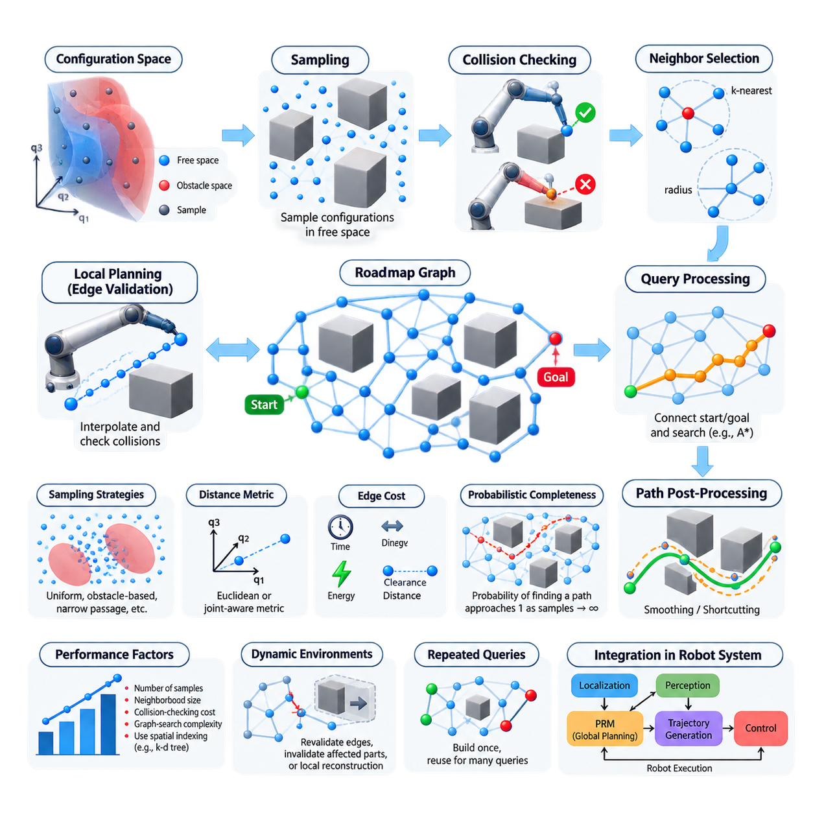
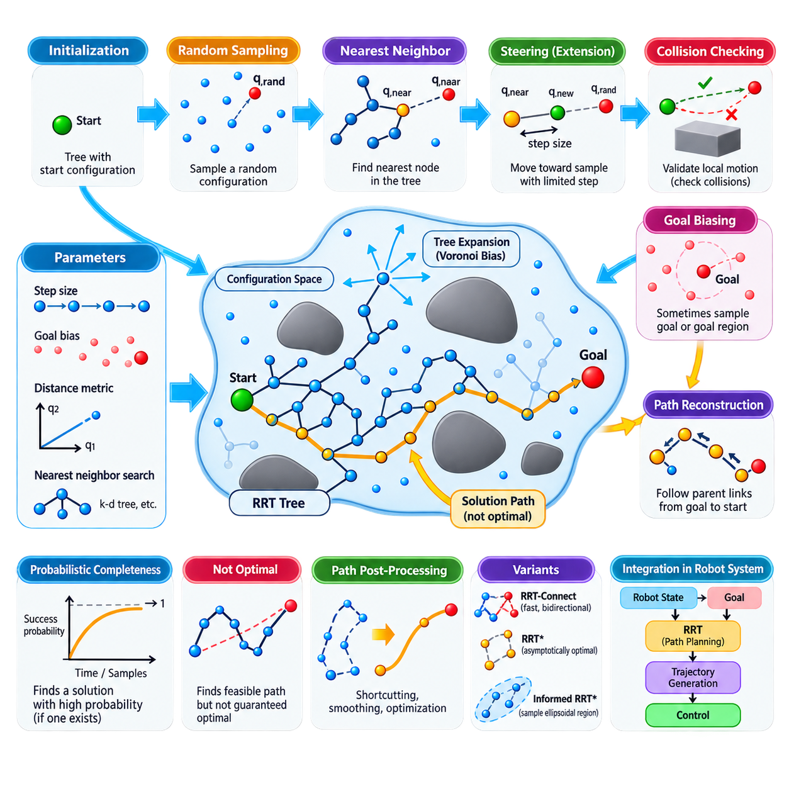
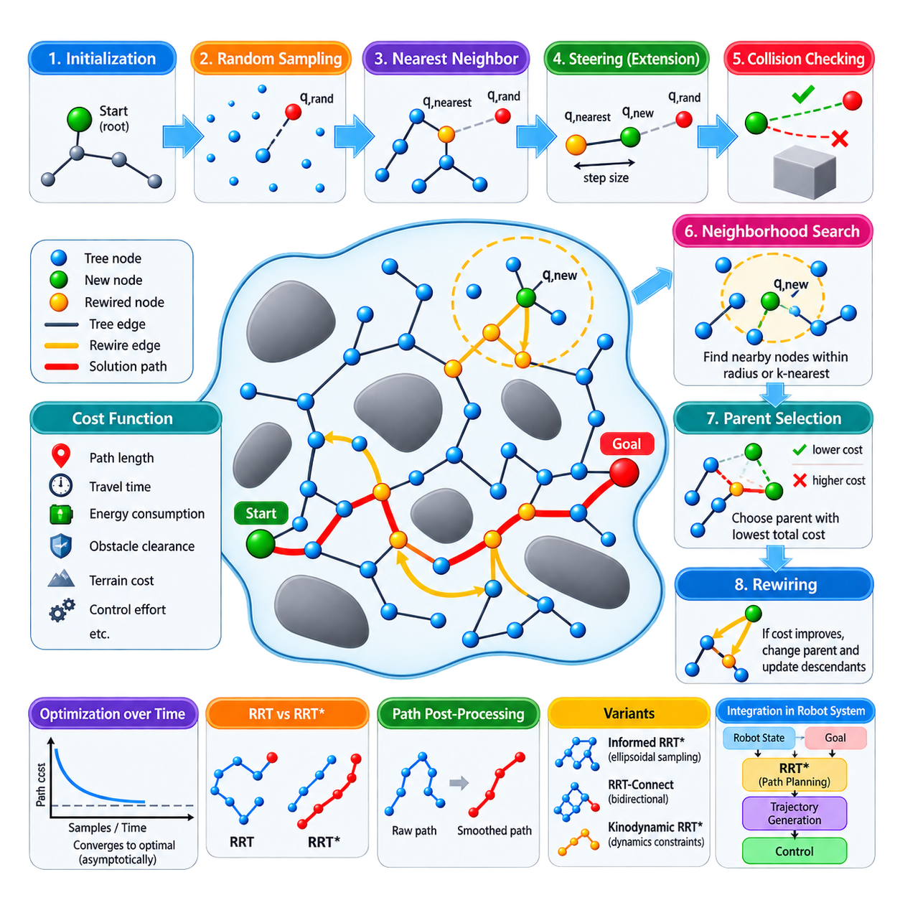
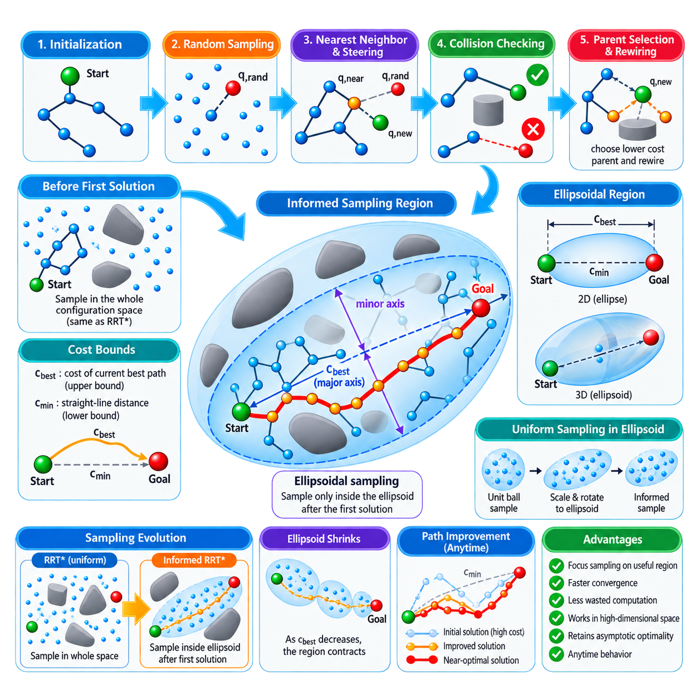
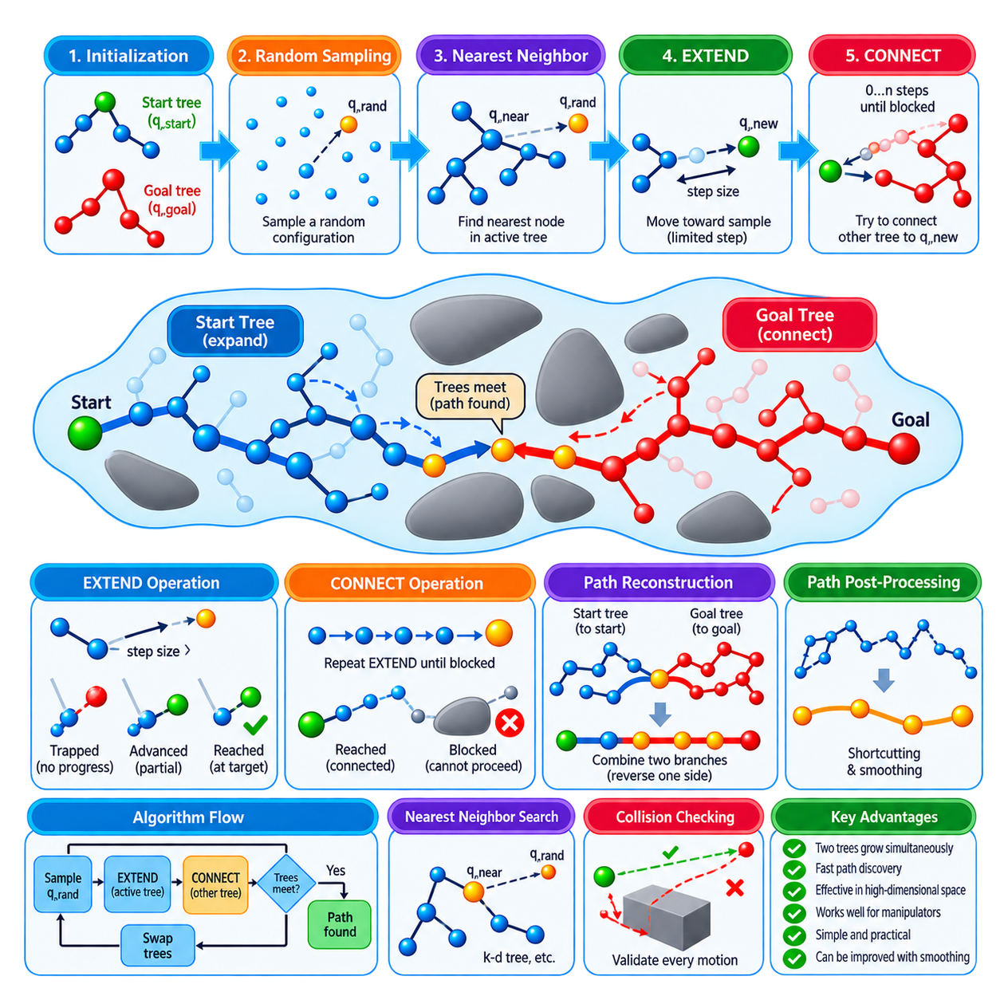
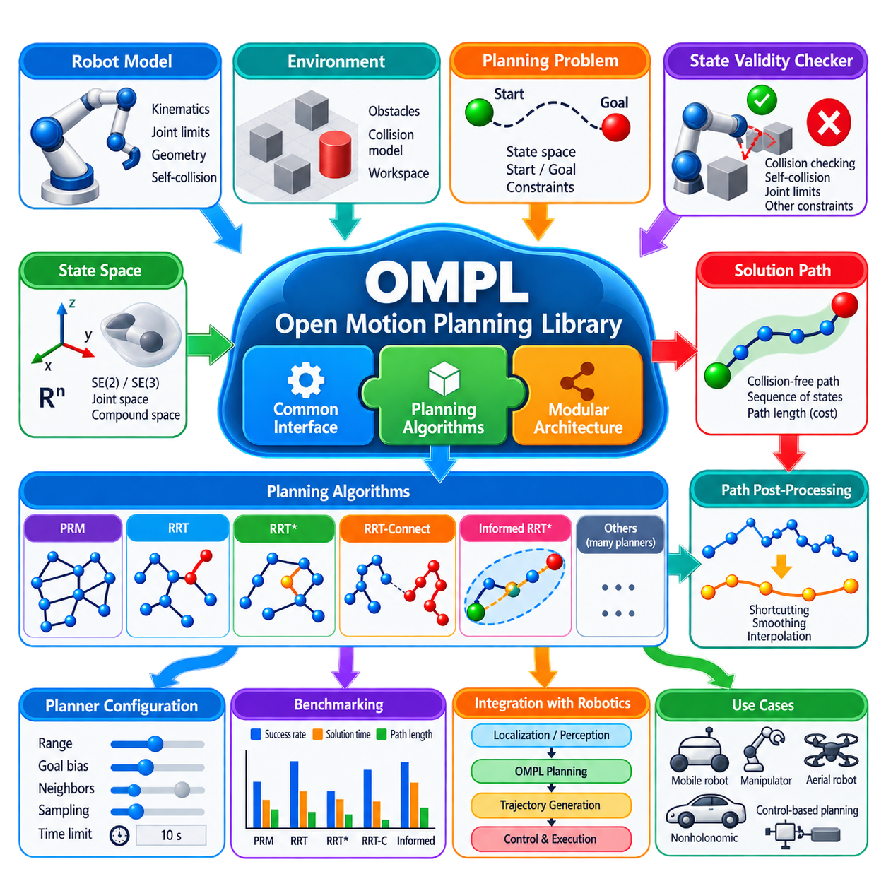
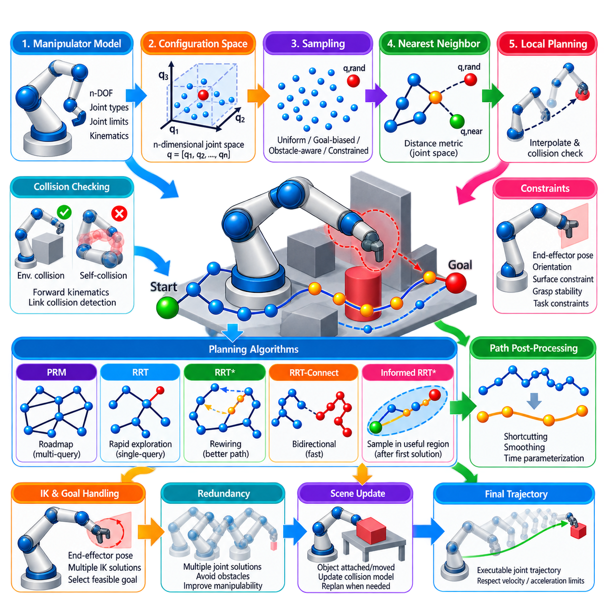
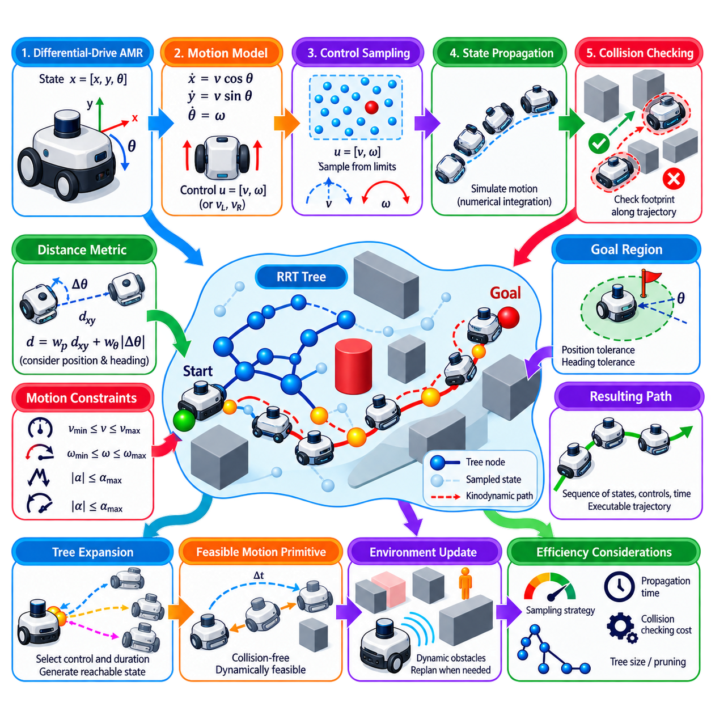
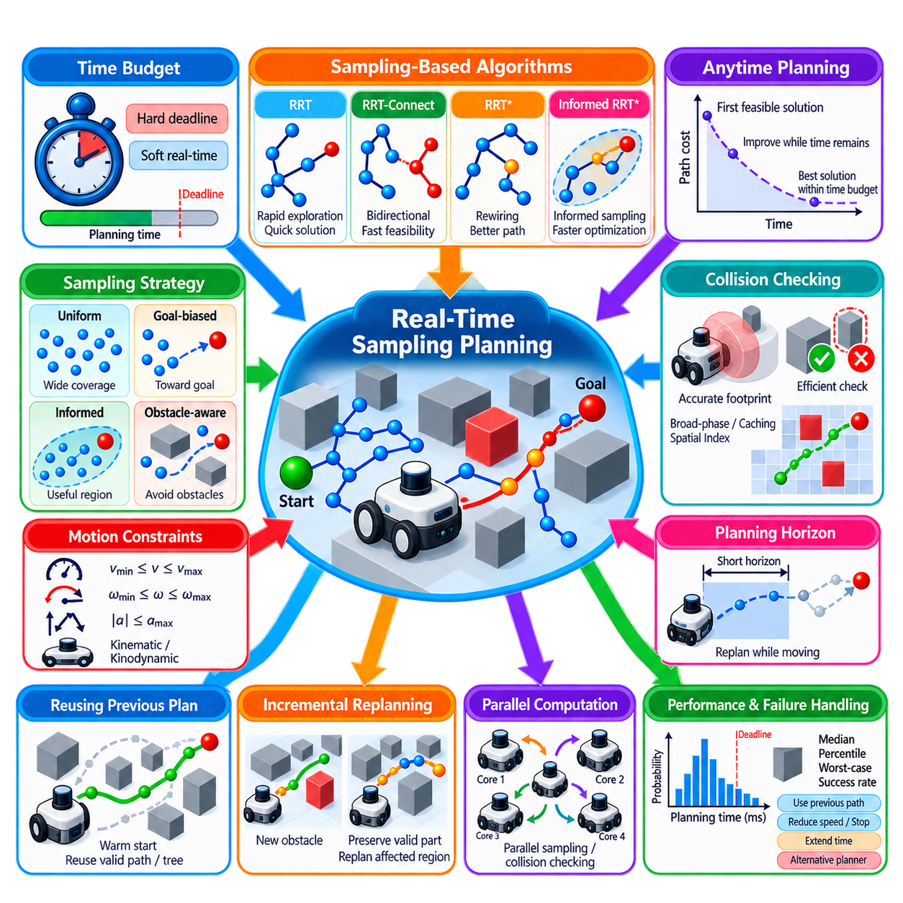
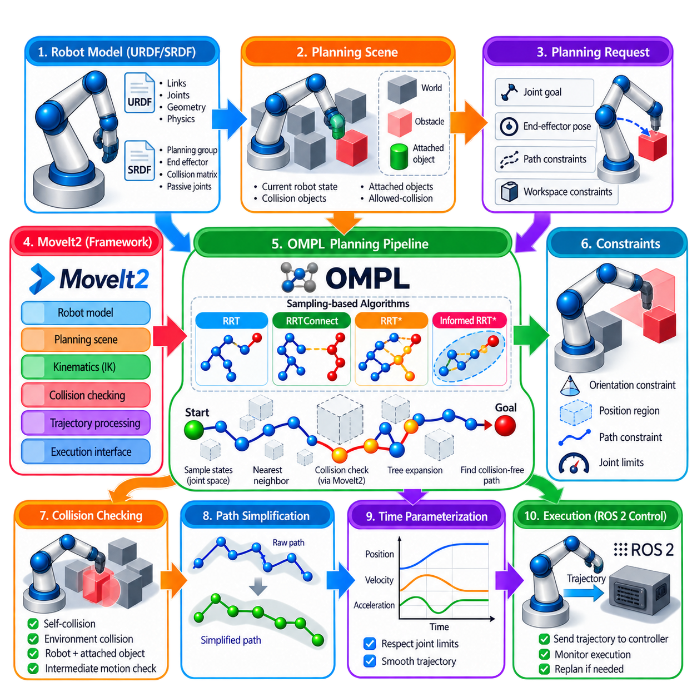

**Volume 15. Motion Planning and Navigation**

# Chapter 03. Sampling Based Planning

## 03.01. Probabilistic Roadmap PRM Theory and Implementation [w/Code]

{width="7.268055555555556in" height="7.268055555555556in"}

Probabilistic Roadmap (PRM) is a sampling-based motion planning method designed to represent the connectivity of collision-free configuration space without constructing an explicit geometric decomposition. Instead of exhaustively searching every possible robot configuration, PRM samples configurations from the free space, connects feasible neighboring samples, and organizes these connections into a graph called a roadmap. This makes PRM particularly useful when configuration spaces are continuous, high-dimensional, or geometrically complex.

The configuration space is divided conceptually into free space and obstacle space. A configuration represents the complete state needed to describe the robot pose, such as planar position and orientation for a mobile robot or joint angles for a manipulator. Each sampled configuration is tested by a collision checker. Samples that intersect obstacles or violate constraints are rejected, while valid samples become vertices of the roadmap. The resulting graph therefore provides a discrete approximation of continuous free-space connectivity.

PRM is commonly organized into two phases: roadmap construction and query processing. During construction, the planner generates a set of valid configurations and attempts to connect nearby configurations using a local planner. Successful collision-free connections become graph edges. During a query, the start and goal configurations are connected to suitable roadmap vertices, after which a graph-search algorithm finds a sequence of edges joining them. This separation is especially valuable when many planning queries share the same environment.

Sampling quality strongly affects roadmap quality. Uniform random sampling is simple and broadly applicable, but it may place many samples in large open regions while providing too few samples around narrow passages. Alternative strategies can bias samples toward obstacle boundaries, medial regions, difficult passages, or previously unsuccessful connection areas. The objective is not merely to maximize sample count, but to create vertices that efficiently capture the topology and connectivity of the robot\'s collision-free configuration space.

After sampling, PRM determines which vertices should be considered neighbors. A common implementation connects each vertex to its k nearest neighbors or to all vertices within a specified connection radius. Distance is measured using a metric appropriate to the configuration space. Euclidean distance can be sufficient for planar translation, whereas spaces containing orientation or robot joints require metrics that account for angular variables, scaling, joint ranges, and potentially different physical meanings among configuration dimensions.

The local planner determines whether two candidate vertices can be connected safely. A basic implementation interpolates configurations along the segment between them and performs collision checks at intermediate points. If every tested configuration remains valid, an edge is added to the roadmap. The edge weight may represent geometric distance, travel time, energy, clearance, or another planning cost. Local planning must use sufficiently fine validation because coarse collision checking can incorrectly accept an edge that passes through an obstacle.

Once the roadmap has been constructed, a planning query inserts or temporarily associates the start and goal configurations with nearby roadmap vertices. Algorithms such as Dijkstra or A\* can then search the graph for a feasible route. The resulting graph path consists of a sequence of configurations connected by valid local motions. Because these configurations may produce unnecessary turns or detours, practical implementations often apply shortcutting, smoothing, interpolation, or trajectory optimization before sending the path to downstream motion-control components.

The probabilistic completeness property is central to understanding PRM. If a feasible path exists with sufficient clearance and the sampling process continues indefinitely under appropriate assumptions, the probability that PRM fails to discover a connecting roadmap approaches zero. This does not mean that a finite roadmap guarantees success. Failure can result from insufficient sampling, poor connectivity parameters, difficult narrow passages, inaccurate collision checking, or a configuration-space representation that does not correctly model the robot and environment.

PRM performance depends on the interaction between sample count, neighborhood size, collision-checking cost, and graph-search complexity. Increasing the number of samples generally improves coverage but increases memory usage and the number of potential connection tests. Increasing the connection radius can improve graph connectivity while producing more expensive collision checks and denser graphs. Efficient implementations therefore use spatial indexing structures such as k-d trees or related nearest-neighbor methods rather than comparing every new configuration with every existing vertex.

Collision checking is frequently the dominant computational expense during roadmap construction. For a mobile robot, this may involve checking the robot footprint against occupancy maps or geometric obstacles. For manipulators, every interpolated joint configuration can require forward kinematics followed by collision tests involving multiple links and environmental objects. Caching validated edges, rejecting obviously impossible connections early, and choosing adaptive collision-checking resolutions can significantly reduce computational cost without changing the fundamental PRM architecture.

PRM is particularly attractive for repeated-query applications because the expensive roadmap can be constructed once and reused. A manipulator operating inside a stable manufacturing cell, for example, may receive many different start and goal configurations while the major obstacles remain unchanged. The roadmap captures reusable knowledge about free-space connectivity, allowing subsequent queries to rely primarily on start and goal attachment followed by relatively inexpensive graph search. This contrasts with planners that build a new search structure for every query.

Dynamic environments require additional consideration because the classical PRM assumes that the configuration-space obstacle structure remains sufficiently stable for roadmap reuse. When obstacles move or the workspace changes, previously valid edges may become invalid. A practical system can revalidate edges lazily during search, invalidate affected portions of the roadmap, or reconstruct local regions rather than rebuilding everything. PRM can therefore participate in a layered navigation architecture, but rapidly changing obstacle avoidance is usually handled by local planning or reactive control.

Implementation normally begins with configuration-space bounds, robot constraints, a state-validity function, a sampler, a distance metric, and a local connection procedure. The planner repeatedly samples a candidate configuration, rejects invalid states, identifies nearby roadmap vertices, validates candidate edges, and stores successful connections in a weighted graph. Query execution then validates start and goal states, connects them to the graph, performs shortest-path search, reconstructs the selected configuration sequence, and optionally post-processes the resulting path.

For production robotics, PRM should be treated as one component of a broader motion-planning pipeline rather than as a complete navigation solution. The roadmap supplies global connectivity information, while localization provides the current robot state, perception updates environmental constraints, trajectory generation converts geometric paths into executable motion, and controllers enforce vehicle or manipulator dynamics. The surrounding volume accordingly places PRM before RRT-family methods, OMPL usage, manipulator planning, kinodynamic planning, and real-time sampling approaches. :chatgpt-content-reference{index="0"}

## 03.02. RRT Rapidly Exploring Random Tree [w/Code]

{width="7.268055555555556in" height="7.268055555555556in"}

Rapidly-Exploring Random Tree (RRT) is a sampling-based motion planning algorithm designed to explore large, continuous configuration spaces efficiently. Unlike roadmap methods that construct a reusable graph across the environment, RRT incrementally grows a tree from an initial configuration toward unexplored regions. Its expansion mechanism naturally favors areas that have not yet been densely visited, making the method effective for high-dimensional spaces where exhaustive discretization becomes computationally impractical.

The algorithm begins with a tree containing only the start configuration. At each iteration, a random configuration is sampled from the valid configuration-space bounds. The planner then searches the existing tree for the node that is nearest to this random sample according to a selected distance metric. Rather than connecting directly to the sample in most implementations, the algorithm moves from the nearest node toward the sampled configuration by a limited distance called the extension or step size.

This operation is commonly described using three elements: the random sample, the nearest tree node, and the newly generated configuration. If the sampled configuration is denoted by q_rand and the nearest existing node by q_near, a steering function produces q_new in the direction from q_near toward q_rand. Limiting this extension distance prevents excessively long edges and allows collision checking to examine the configuration space progressively while controlling the resolution of tree growth.

Before q_new can be added to the tree, the local motion between q_near and q_new must be validated. The planner interpolates configurations along the candidate edge and performs collision checking against obstacles and other state constraints. If the entire local motion is valid, q_new becomes a new tree vertex and the connection becomes an edge. If a collision occurs, the extension is rejected or terminated at an appropriate valid point, depending on the implementation.

The characteristic exploration behavior of RRT results from the Voronoi bias created by nearest-neighbor expansion. Tree vertices associated with large unexplored regions of configuration space are more likely to be selected as the nearest vertex to a random sample. Consequently, branches tend to extend outward toward unexplored areas rather than repeatedly expanding dense regions. This property allows RRT to rapidly cover broad spaces without requiring an explicit exploration heuristic or complete representation of free space.

Goal-directed planning can be improved through goal biasing. Instead of selecting every sample uniformly at random, the planner occasionally selects the goal configuration itself or samples from a region around it. A moderate goal bias increases the probability that existing branches will grow toward the destination while retaining the exploratory behavior necessary to move around obstacles. Excessive goal bias can be counterproductive because the tree may repeatedly attempt blocked directions instead of discovering alternative routes.

Nearest-neighbor search becomes increasingly important as the tree grows. A straightforward implementation can compare each random sample against every existing node, but this approach becomes expensive for large trees. Spatial indexing structures such as k-d trees can accelerate nearest-neighbor queries in suitable configuration spaces. In high-dimensional planning, however, the effectiveness of such structures depends strongly on dimensionality, distance metrics, configuration representation, and the distribution of generated states.

The distance metric used by RRT must reflect the physical meaning of the robot configuration. Euclidean distance is often suitable for simple planar translational planning, but mobile robots may require combined position and orientation metrics. Manipulators require distances across multiple joint variables, while configuration dimensions with different units or ranges may require normalization or weighting. An inappropriate metric can cause the planner to select neighbors that appear mathematically close but are poor choices for feasible robot motion.

Step size is another critical parameter. A large step size allows the tree to expand quickly across open regions but increases the probability that extensions intersect obstacles or overlook important geometric structure. A small step size provides finer exploration near obstacles and narrow passages but creates more vertices and increases planning time. Practical implementations select the extension distance according to robot geometry, environment scale, collision-checking resolution, and the expected complexity of the configuration space.

Like PRM, RRT is probabilistically complete under appropriate assumptions. If a feasible solution exists and sampling continues sufficiently long, the probability that the planner discovers a solution approaches one. However, the original RRT algorithm does not guarantee that the discovered path is optimal. It is primarily designed to find a feasible path rapidly. The resulting trajectory may contain unnecessary turns, long detours, or irregular segments because each branch reflects the stochastic history of tree expansion.

Once the tree reaches the goal or enters a specified goal region, the solution path can be reconstructed by following parent relationships from the goal-side node back to the root. Reversing this sequence produces a path from the initial configuration to the destination. Because raw RRT paths are often jagged, practical systems frequently apply shortcutting, path smoothing, interpolation, or subsequent trajectory optimization to reduce unnecessary waypoints and improve compatibility with robot dynamics and controllers.

RRT is particularly valuable for single-query planning problems. Whereas PRM invests computational effort in constructing a roadmap that can support many future queries, RRT builds a search structure specifically for the current start-to-goal problem. This makes it attractive when environments or queries change frequently, when reusable preprocessing provides little benefit, or when configuration spaces are sufficiently complex that constructing a comprehensive roadmap would be expensive.

The basic RRT formulation is geometric and does not inherently enforce detailed robot dynamics. For systems whose future states depend strongly on control inputs, acceleration, velocity, steering limits, or nonholonomic constraints, the extension operation must incorporate an appropriate motion model. This leads toward kinodynamic RRT variants, where candidate controls are propagated through system dynamics rather than simply interpolating between geometric configurations. Such extensions are important for differential-drive robots, vehicles, UAVs, and dynamically constrained platforms.

RRT also provides the conceptual foundation for several major sampling-based planners. RRT-Connect grows search structures aggressively and can use bidirectional exploration to obtain feasible solutions rapidly. RRT\* introduces parent selection and rewiring so that path quality improves asymptotically. Informed RRT\* restricts sampling after an initial solution to regions capable of improving the current path. These developments preserve the core principle of incremental tree exploration while modifying expansion behavior for speed or optimality. :chatgpt-content-reference{index="0"}

In a robotics motion-planning architecture, RRT receives the robot state, goal, configuration-space constraints, collision information, and motion-model assumptions from surrounding components. Its output is normally a collision-free geometric path or state sequence rather than direct actuator commands. Trajectory generation subsequently imposes timing and dynamic feasibility, while controllers execute the resulting motion. RRT therefore serves as a bridge between continuous-space exploration and executable robot navigation or manipulation.

## 03.03. RRT Star Asymptotically Optimal Planning [w/Code]

{width="7.268055555555556in" height="7.268055555555556in"}

RRT\* extends the Rapidly-Exploring Random Tree framework from feasible motion planning toward asymptotically optimal planning. Like basic RRT, it incrementally explores continuous configuration space through random sampling and collision-checked tree expansion. Its defining difference is that newly generated configurations are not simply attached to the nearest existing node. RRT\* evaluates nearby alternatives and continuously restructures the tree so that the cost of reaching sampled states can decrease as exploration proceeds.

The algorithm begins with the start configuration as the root of a search tree. A random configuration q_rand is sampled, the nearest existing node q_nearest is identified, and a steering operation generates a candidate configuration q_new. The local motion from q_nearest to q_new is checked for collisions and constraint violations. If the extension is valid, RRT\* examines a neighborhood around q_new rather than immediately accepting q_nearest as its permanent parent.

This neighborhood search distinguishes RRT\* from conventional RRT. The planner collects nearby vertices whose distance from q_new lies within a connection radius or satisfies a nearest-neighbor criterion. Each neighboring vertex represents a possible parent for the new configuration. RRT\* evaluates the accumulated cost from the root to each candidate parent together with the local connection cost from that parent to q_new, while rejecting connections that are not collision-free.

Parent selection chooses the valid neighboring node that produces the lowest total cost to q_new. Consequently, the geometrically nearest node does not necessarily become the parent. A slightly more distant vertex may already belong to a substantially cheaper branch of the tree and therefore provide a better route. This cost-aware attachment mechanism allows RRT\* to improve path quality during construction rather than relying exclusively on post-processing after a feasible solution has been discovered.

After inserting q_new, RRT\* performs its second essential operation: rewiring. Nearby vertices are reconsidered to determine whether reaching them through q_new would reduce their existing cost from the root. If a collision-free connection through q_new produces a lower cost, the corresponding vertex changes its parent. The costs of affected descendants must then be updated consistently. Repeated rewiring gradually transforms an initially irregular random tree into a structure containing increasingly efficient routes.

The optimization objective is represented through a cost function. In simple geometric planning, edge cost may be Euclidean distance and the objective may be minimum path length. More realistic robotic applications can incorporate travel time, energy consumption, obstacle clearance, terrain difficulty, control effort, or combinations of several criteria. The meaning of optimality therefore depends directly on the selected objective, and an inappropriate cost function can optimize a mathematically valid path that is operationally undesirable.

The neighborhood radius plays a fundamental role in both computational efficiency and theoretical behavior. If the neighborhood is too small, useful alternative parents and rewiring opportunities may be missed, causing the algorithm to behave more like ordinary RRT. If it is excessively large, each insertion requires many collision checks and cost comparisons. RRT\* theory typically uses a neighborhood size that changes with the number of vertices so connectivity remains sufficient while unnecessary comparisons are reduced as the tree becomes denser.

RRT\* retains the exploratory behavior associated with random sampling and Voronoi bias. New samples encourage branches to enter previously unexplored regions, while parent optimization and rewiring improve the portions of the tree that have already been discovered. This combination separates exploration from local structural improvement: sampling expands coverage, while optimization reorganizes connectivity. The planner can therefore continue improving an existing solution instead of terminating immediately when the first feasible path reaches the goal.

Asymptotic optimality is the central theoretical property of RRT\*. Under suitable assumptions, as the number of samples approaches infinity, the cost of the best solution contained in the tree converges toward the cost of an optimal solution with probability one. This property should not be interpreted as a finite-time guarantee. A practical implementation must stop after a limited computation budget, meaning the returned path is normally the best solution discovered so far rather than a provably optimal finite-time result.

This anytime behavior is useful in robotics. RRT\* can first obtain a feasible solution and then continue sampling while computational time remains available. Each successful parent change or rewiring operation may reduce the current best cost. A planning system can therefore trade computation time against solution quality: applications requiring rapid response can stop soon after finding an acceptable path, while less time-critical tasks can allow further optimization before trajectory execution.

The first feasible solution found by RRT\* may still resemble a conventional RRT path, containing unnecessary bends and detours. As sampling continues, however, alternative connections and rewiring progressively shorten or otherwise improve the route according to the objective function. Path extraction follows parent links from the selected goal node back to the root. Additional shortcutting, smoothing, or trajectory optimization may still be applied because asymptotic graph optimality does not automatically guarantee smooth or dynamically executable motion.

Collision checking remains one of the major computational costs. Every candidate extension, alternative parent connection, and potential rewiring edge may require validation against obstacles. Efficient implementations therefore combine spatial nearest-neighbor structures, selective neighborhood searches, cached validity information, and appropriate collision-checking resolution. The benefit of additional rewiring must be balanced against the cost of repeatedly validating connections, particularly for manipulators or geometrically complex robots.

RRT\* is fundamentally a geometric planner unless robot dynamics are incorporated explicitly into its steering and state-propagation mechanisms. For mobile robots, manipulators, UAVs, or other constrained systems, geometric path optimality may not correspond to dynamically feasible trajectory optimality. Velocity, acceleration, steering, nonholonomic constraints, and control limits can require kinodynamic extensions or subsequent trajectory generation. Thus, RRT\* commonly supplies a high-quality collision-free path that later stages convert into executable motion.

Several advanced planners build upon the RRT\* principle. Informed RRT\* restricts sampling after the first solution to a subset of the configuration space that can potentially improve the current best path, reducing effort spent in irrelevant regions. Bidirectional and heuristic variants attempt to accelerate initial solution discovery or convergence. These methods preserve the fundamental concepts of sampling, neighborhood-based parent selection, cost propagation, and rewiring while improving search efficiency for particular planning conditions.

Within the sampling-based planning structure, RRT\* naturally follows basic RRT and precedes Informed RRT\*, bidirectional RRT-Connect, OMPL-based implementation, manipulator planning, and kinodynamic extensions. Its main conceptual contribution is the transition from rapidly discovering any feasible route to progressively improving the search tree toward an optimal one, establishing the foundation for optimization-oriented sampling planners used in modern robotic motion planning.

## 03.04. Informed RRT Star Ellipsoidal Sampling [w/Code]

{width="7.268055555555556in" height="7.268055555555556in"}

Informed RRT\* is an extension of RRT\* designed to accelerate convergence toward an optimal solution after an initial feasible path has been discovered. Standard RRT\* continues sampling throughout the entire configuration space even when many regions cannot possibly improve the current solution. Informed RRT\* addresses this inefficiency by restricting subsequent sampling to a geometrically defined subset containing states that have the potential to produce a lower-cost path between the start and goal.

Before the first feasible solution is available, Informed RRT\* behaves essentially like conventional RRT\*. Random configurations are sampled from the admissible configuration space, the tree expands through nearest-neighbor selection and steering, and collision-free nodes are inserted. Parent selection and rewiring improve the tree structure as in RRT\*. This unrestricted exploration is necessary because the planner does not yet possess an upper bound on the solution cost that could define a meaningful informed sampling region.

Once a feasible path reaches the goal, its cost provides an upper bound c_best on the optimal solution cost. For path-length optimization, the theoretical lower bound is the straight-line distance c_min between the start and goal configurations. Any state capable of participating in a path shorter than c_best must satisfy the condition that its minimum possible distance from the start plus its minimum possible distance to the goal is less than c_best. This observation defines the informed subset.

For Euclidean path-length planning, the informed subset has the geometry of a prolate hyperspheroid, which appears as an ellipse in two dimensions and an ellipsoid in three dimensions. The start and goal configurations form its two focal points. Its major transverse diameter is determined by c_best, while its minimum possible diameter is related to c_min. Every state outside this region can be excluded because even an obstacle-free path passing through that state could not improve the current best solution.

Ellipsoidal sampling therefore transforms the search after the first solution. Instead of repeatedly drawing configurations from irrelevant portions of the entire planning domain, samples are generated directly inside the informed region. As better paths are discovered and c_best decreases, the ellipsoid contracts around the start-to-goal corridor. The planner consequently concentrates an increasing fraction of its computational effort on regions that remain capable of producing further improvements.

Sampling uniformly inside the informed ellipsoid requires more than simply drawing points from an axis-aligned bounding box. A common implementation first samples uniformly from a unit n-dimensional ball. The sample is then scaled according to the principal radii of the informed hyperspheroid, rotated so that its major axis aligns with the vector from start to goal, and translated to the midpoint between them. This transformation generates samples directly in the desired informed subset without inefficient rejection from the full configuration space.

The transformation depends on the relationship between c_best and c_min. The principal radius along the start-goal direction is proportional to c_best, while the remaining radii depend on the square root of the difference between c_best squared and c_min squared. When the current solution is poor, the informed region remains relatively broad. As the solution approaches the theoretical lower bound, the region becomes increasingly narrow and concentrates around configurations most relevant to further optimization.

After an informed sample q_rand is generated, the remaining planning process follows the fundamental RRT\* mechanism. The planner identifies a nearby tree vertex, steers toward the sample, validates the local connection, and creates q_new if the motion is collision-free. Nearby vertices are then examined for lower-cost parent selection, followed by rewiring whenever routing an existing vertex through q_new decreases its accumulated cost. Thus, informed sampling modifies where exploration occurs rather than replacing RRT\* optimization.

The primary benefit appears when the configuration space is large relative to the region containing useful solutions. Standard RRT\* may continue generating samples far from the start-goal corridor, and those samples can consume nearest-neighbor queries, collision checks, memory, and rewiring operations without improving the solution. Informed RRT\* progressively eliminates such effort. The improvement can become especially significant in high-dimensional planning, where the fraction of the total configuration space relevant to optimization may be extremely small.

The method retains the anytime character of RRT\*. A feasible path can be returned as soon as one is discovered, while additional computation is used to improve its cost. Each newly discovered lower-cost solution reduces c_best and therefore reduces the informed sampling domain. This creates a feedback process: a better solution produces a smaller search region, the smaller region increases sampling efficiency, and increased efficiency can lead to additional improvements within the available planning time.

Informed sampling does not remove the difficulties created by obstacles. The ellipsoid represents states that could theoretically improve the current solution according to the optimization objective, but portions of that region may still lie inside obstacles or disconnected free-space components. Collision checking therefore remains essential. In environments containing narrow passages or complex obstacle arrangements, a small informed region may still require substantial exploration before a better topologically valid route can be discovered.

The effectiveness of Informed RRT\* also depends on the optimization objective. The familiar ellipsoidal formulation follows naturally from Euclidean path-length minimization because a geometric lower bound can be expressed using distances from the start and goal. Objectives involving energy, risk, terrain, dynamic constraints, or multiple weighted costs may not produce the same simple ellipsoidal subset. More general informed planners therefore require admissible cost heuristics or alternative methods for identifying states capable of improving the current solution.

Parameter selection remains important even after restricting the sampling domain. Steering distance influences how quickly the tree follows newly sampled regions, while neighborhood radius affects parent selection and rewiring efficiency. Collision-checking resolution determines the reliability and cost of edge validation. Nearest-neighbor data structures become increasingly valuable as the tree grows. Informed sampling reduces wasted exploration, but it does not eliminate the computational requirements of maintaining and optimizing a large search tree.

Compared with ordinary RRT, Informed RRT\* introduces both asymptotic optimization and focused sampling. Compared with RRT\*, its principal innovation is not a different rewiring rule but the direct exploitation of the current best solution to guide future samples. RRT\* asks whether newly sampled configurations can improve the tree, whereas Informed RRT\* additionally asks whether a configuration could possibly improve the current solution before investing significant computational effort in exploring it.

Within the sampling-based planning structure, Informed RRT\* follows RRT and RRT\* and precedes bidirectional RRT-Connect, OMPL usage, manipulator planning, and kinodynamic RRT. :chatgpt-content-reference{index="0"} Its central contribution is the conversion of solution quality into geometric information about where useful samples can exist, allowing the planner to transition from broad exploration to increasingly focused optimization while retaining the probabilistic and asymptotically optimal foundations of RRT\*.

## 03.05. Bi Directional RRT Connect Planning [w/Code]

{width="7.268055555555556in" height="7.268055555555556in"}

Bidirectional RRT-Connect is a sampling-based motion planning method designed to find feasible paths rapidly by growing two search trees simultaneously. One tree begins at the start configuration while the other begins at the goal configuration. Instead of requiring a single tree to explore the entire distance between them, both trees expand through collision-free configuration space and attempt to meet. This bidirectional strategy can dramatically reduce the exploration required for many planning problems.

The method builds upon the fundamental Rapidly-Exploring Random Tree mechanism. A random configuration q_rand is sampled from the configuration space, and the nearest node q_near in one active tree is identified. A steering operation generates a new configuration in the direction of the sample. If the local motion is collision-free, the new configuration is inserted into the tree. The distinctive RRT-Connect procedure then attempts to extend the opposite tree toward this newly reached configuration.

RRT-Connect commonly distinguishes between EXTEND and CONNECT operations. EXTEND performs a limited expansion from the nearest tree node toward a target configuration, usually by one predefined step. The result may be Trapped when no progress is possible, Advanced when partial progress is achieved, or Reached when the target is reached. These states provide a compact mechanism for controlling tree expansion and determining whether additional connection attempts should continue.

The CONNECT operation repeatedly applies EXTEND toward the same target rather than stopping after a single successful step. As long as each new segment remains valid, the tree continues advancing toward the target configuration. This aggressive extension behavior is one of the main reasons RRT-Connect often finds solutions much faster than basic RRT. In relatively open regions, a tree branch can traverse a substantial distance through configuration space during a single connection attempt.

A typical iteration first extends one tree toward q_rand. If this operation successfully creates or reaches a new configuration q_new, the planner asks the second tree to CONNECT toward q_new. When the second tree reaches that configuration without collision, the two trees become connected and a complete path exists between the start and goal. If the connection fails, both trees remain available for later iterations and continue exploring different regions of free space.

The roles of the two trees are usually exchanged after each iteration. The tree that previously expanded toward the random sample becomes the connection target, while the other tree becomes the active expansion tree. Alternating their roles encourages balanced exploration from both ends of the planning problem. Some implementations additionally choose which tree to expand according to tree size or other heuristics, but simple alternating growth is sufficient for the fundamental algorithm.

Nearest-neighbor search remains an important computational component because every extension must identify an appropriate node from which to grow. For small trees, linear search may be sufficient, while larger planning problems benefit from structures such as k-d trees. The selected distance metric must appropriately represent the robot configuration, particularly when states combine translation, rotation, multiple joint variables, or other dimensions with different physical meanings.

Collision checking determines whether each attempted tree extension is physically valid. The local planner interpolates between configurations and tests intermediate states against obstacles and configuration constraints. Because CONNECT may execute multiple consecutive extensions, efficient collision checking is especially important. A large step size can accelerate progress in open regions but may reduce effectiveness near complex obstacles, while a smaller step improves geometric resolution at the cost of additional nodes and validation operations.

The principal advantage of bidirectional search is that two rapidly exploring trees can reduce the effective distance each search structure must cover. A unidirectional RRT must eventually discover a sequence of expansions leading from the start toward the goal region. RRT-Connect can instead discover intermediate free-space regions from both directions. Once the expanding frontiers become sufficiently close, the aggressive CONNECT operation can bridge the remaining gap and terminate planning.

This behavior is particularly effective in high-dimensional configuration spaces such as robotic manipulator planning. A robot arm may need to move through a complex joint space containing self-collision constraints and workspace obstacles. Growing trees from both the initial and target joint configurations allows the planner to explore feasible approaches from each side. RRT-Connect consequently became a widely used practical approach for rapidly obtaining collision-free manipulator motions.

Narrow passages remain challenging because random sampling may rarely place useful configurations inside restricted regions. Bidirectional growth can improve the chance that one tree approaches a difficult passage from one side while the other approaches from the opposite side, but it does not eliminate the sampling problem itself. Obstacle-aware sampling, adaptive extension parameters, or specialized sampling strategies may therefore be combined with RRT-Connect when constrained passages dominate the planning environment.

When the two trees meet, path reconstruction must account for their opposite orientations. The start tree contains parent relationships leading back toward the start, while the goal tree contains parent relationships leading back toward the goal. The planner extracts both branches, reverses the appropriate sequence, and concatenates them at the connection configuration. The resulting path forms a continuous collision-free sequence from the initial configuration to the destination.

Like basic RRT, RRT-Connect primarily targets rapid feasibility rather than optimality. The first discovered solution may contain unnecessary turns, long detours, or irregular configuration transitions. Practical implementations therefore frequently apply shortcutting and path smoothing after tree connection. Random pairs of path configurations can be tested for direct collision-free connection, allowing intermediate segments to be removed and producing a shorter, simpler path before trajectory generation.

RRT-Connect differs conceptually from RRT\* and Informed RRT\*. RRT\* spends additional computation on parent selection and rewiring to asymptotically improve solution quality, while Informed RRT\* focuses sampling after an initial solution on regions capable of reducing its cost. RRT-Connect instead emphasizes fast discovery of a feasible connection. The appropriate planner therefore depends on whether the application prioritizes response time, path quality, repeated optimization, or computational budget.

In a complete motion-planning architecture, bidirectional RRT-Connect provides a collision-free geometric path that can subsequently be processed by smoothing, trajectory generation, and dynamic feasibility stages. The sampling-based planning structure places it after PRM, RRT, RRT\*, and Informed RRT\*, followed by OMPL usage, manipulator planning, kinodynamic RRT, real-time planning, and MoveIt2 integration. Its central contribution is the combination of two-ended exploration with aggressive connection attempts, providing a practical mechanism for rapidly solving complex single-query robot motion-planning problems.

## 03.06. OMPL Open Motion Planning Library Usage [w/Code]

{width="7.268055555555556in" height="7.268055555555556in"}

The Open Motion Planning Library (OMPL) is an open-source software framework that provides a broad collection of sampling-based motion planning algorithms through a common planning interface. Rather than requiring robotics developers to implement PRM, RRT, RRT\*, RRT-Connect, and related planners independently, OMPL separates planning algorithms from robot-specific state representation and collision checking. This modular architecture makes it possible to compare and deploy multiple planners within a consistent software environment.

OMPL focuses primarily on geometric and control-based motion planning in continuous state spaces. The library does not inherently provide a complete robot navigation or manipulation system. Instead, applications define the state space, valid states, start and goal conditions, and planning constraints, while OMPL searches for a feasible or optimized motion. Collision detection is normally supplied by an external robotics framework or application, allowing the planning algorithms to remain independent of a particular robot geometry or perception system.

A fundamental OMPL concept is the state space, which mathematically represents the robot configurations explored by the planner. Simple applications may use real-vector spaces for translational variables, while mobile robots commonly require SE(2) or SE(3) representations containing position and orientation. Manipulators can use multidimensional joint spaces, and compound state spaces can combine several representations. Correct state-space modeling is essential because sampling, distance calculation, interpolation, bounds, and neighborhood relationships all depend on this representation.

The state validity checker determines whether a sampled state is permissible. Applications provide a callback or equivalent interface that evaluates constraints such as collision with obstacles, self-collision, joint limits, forbidden regions, or other feasibility conditions. OMPL repeatedly invokes this function during sampling and edge validation. Because validity checking can occur extremely frequently, its computational efficiency often has a major influence on overall planning performance, especially for geometrically complex robots.

Planning normally begins by defining a space information structure that combines the state space with information required to evaluate motions. State bounds are specified, validity checking is registered, and motion validation parameters are configured. The application then defines a planning problem containing the start state and one or more goal conditions. This separation allows the same planning infrastructure to be reused while changing the planner, start and goal configurations, optimization objective, or environment-dependent validity logic.

OMPL provides numerous planners with different search characteristics. PRM and related roadmap methods are useful when reusable connectivity structures are desirable, while RRT and RRT-Connect emphasize rapid exploration and feasible solution discovery. RRT\* and other asymptotically optimal planners progressively improve path quality as computation continues. Selecting a planner should therefore reflect the dimensionality of the problem, obstacle geometry, query pattern, available planning time, and whether feasibility or optimization is the primary objective.

The SimpleSetup interface provides a convenient way to configure many geometric planning problems with relatively little application code. A developer defines the state space, registers the validity checker, specifies start and goal states, selects a planner when necessary, and invokes the solve operation with a planning-time limit. SimpleSetup manages several lower-level OMPL objects internally, making it useful for learning, prototyping, benchmarking, and applications that do not require detailed customization of every planning component.

Planner configuration strongly affects practical performance. RRT-family planners may expose parameters related to extension range and goal bias, while roadmap or optimal planners may use neighborhood and sampling-related settings. OMPL provides reasonable defaults for many parameters, but these defaults cannot be optimal for every robot and environment. Configuration should therefore consider workspace scale, configuration-space dimensionality, obstacle density, narrow passages, collision-checking cost, and the required balance between planning latency and path quality.

When a planner reports success, the resulting solution is typically represented as a sequence of states forming a geometric path. A raw sampling-based path may contain unnecessary intermediate configurations or irregular segments. OMPL supports path simplification operations that can attempt shortcutting, vertex reduction, and related improvements. Interpolation can subsequently increase waypoint density when downstream processing requires more closely spaced configurations. These operations improve usability but should not be confused with full dynamic trajectory optimization.

Optimization objectives allow planning quality to be expressed explicitly. A common objective minimizes geometric path length, but applications can define or combine other cost criteria when supported by the planning formulation. Optimal planners use these objectives to compare candidate solutions and progressively reduce cost. The choice of objective should correspond to operational requirements because shortest geometric distance does not necessarily minimize execution time, energy consumption, risk, or difficulty for a physical robot.

Benchmarking is another important use of OMPL because its common interfaces allow multiple planners to be evaluated on the same planning problem. Developers can compare success rate, solution time, path length, and other performance measures under repeated trials. Since sampling-based algorithms are stochastic, evaluation should use multiple random seeds and statistically meaningful repetitions rather than relying on a single successful run. This helps determine whether performance differences are systematic or simply consequences of random sampling.

For manipulator motion planning, OMPL is frequently used as the sampling-based planning engine beneath higher-level robotics software. The application layer supplies robot kinematics, joint constraints, collision geometry, and planning-scene information, while OMPL searches the corresponding configuration space. This separation is especially valuable for high-degree-of-freedom manipulators because the same robot model can be evaluated with several sampling strategies and planners without rewriting the complete planning infrastructure.

OMPL can also support control-based planning when simple geometric interpolation is insufficient. In such problems, states evolve according to control inputs and propagation models rather than arbitrary straight-line connections through configuration space. This formulation is relevant to systems with differential constraints, steering limitations, or dynamic behavior. However, accurate modeling of vehicle or robot dynamics remains the responsibility of the surrounding application, and computational requirements can become significantly greater than purely geometric planning.

In production systems, OMPL should be integrated with localization, perception, collision models, trajectory generation, control, and execution monitoring rather than treated as a complete autonomy stack. A typical workflow converts the current robot state and task goal into a planning problem, uses OMPL to obtain a collision-free state sequence, simplifies or optimizes that path, and then passes it to downstream trajectory and control components. Changes in the environment may require path revalidation or replanning.

Within the motion-planning structure, OMPL follows the theoretical treatment of PRM, RRT, RRT\*, Informed RRT\*, and bidirectional RRT-Connect, and provides a practical software framework through which these sampling-based concepts can be applied and compared. It also establishes the implementation foundation for subsequent manipulator planning, kinodynamic RRT, real-time sampling planning, and MoveIt2 integration. :chatgpt-content-reference{index="0"} OMPL therefore connects sampling-based planning theory with reusable robotics software implementation.

## 03.07. Sampling Based Planning for Manipulator Arms [w/Code]

{width="7.268055555555556in" height="7.268055555555556in"}

Sampling-based planning is particularly important for manipulator arms because their motion must be planned in high-dimensional configuration spaces rather than directly in three-dimensional workspace. A manipulator with n independently controlled joints generally has an n-dimensional configuration vector, where each point represents a complete arm posture. Even a moderate number of joints therefore creates a space that is impractical to discretize exhaustively, motivating planners based on randomized sampling.

The configuration space of a manipulator is normally defined by its joint variables. Revolute joints contribute angular coordinates, while prismatic joints contribute translational coordinates. Joint limits define the admissible bounds of this space, and additional constraints may further restrict valid configurations. Sampling-based planners generate candidate joint configurations within these bounds and use robot kinematics and collision checking to determine whether each configuration can participate in a feasible motion.

Collision checking for manipulators is more complicated than checking a simple mobile robot footprint. Every sampled configuration changes the positions and orientations of multiple links, so forward kinematics must determine the corresponding robot geometry. The resulting configuration must be checked for collisions between robot links and environmental objects as well as self-collision between different parts of the manipulator. These repeated geometric tests frequently dominate the computational cost of manipulator planning.

Self-collision constraints are especially important for articulated robots because mathematically valid joint values can place links in physically impossible intersections. Adjacent links may be excluded from unnecessary collision tests according to the robot model, while nonadjacent links must often be checked carefully. Efficient collision matrices, bounding volumes, hierarchical geometry representations, and early rejection techniques can reduce the number of expensive geometric comparisons required during planning.

Sampling also has to respect the structure of joint space. Uniformly selecting every joint within its limits provides a simple baseline, but useful configurations may occupy only a small fraction of the total space when obstacles and task constraints are present. Goal-biased sampling, obstacle-aware sampling, constraint sampling, or other specialized strategies can concentrate exploration in more relevant regions. The sampling strategy therefore strongly influences how quickly feasible manipulator motions are discovered.

The distance metric used for nearest-neighbor search must appropriately compare joint configurations. A simple metric can calculate a weighted norm of joint-angle differences, but joints may have different ranges, physical effects, and rotational topology. Angular wraparound must be handled correctly where applicable, and weighting may be required so that one joint does not dominate the metric solely because of its numerical scale. The metric directly affects tree expansion and roadmap connectivity.

Local planning determines whether two sampled manipulator configurations can be connected. In geometric planning, the planner commonly interpolates between their joint vectors and evaluates intermediate configurations for collision. The interpolation resolution must be sufficiently fine to prevent a moving link from passing through an obstacle between checked states. Adaptive motion validation can improve efficiency by reducing unnecessary checks in simple regions while maintaining sufficient resolution near collision boundaries.

PRM is useful for manipulator environments where many planning queries occur within a relatively stable workspace. A roadmap can be constructed from collision-free joint configurations and reused for different start and goal postures. This approach is attractive in structured manufacturing cells where robot geometry and major obstacles remain fixed. The initial roadmap construction can be expensive, but subsequent queries can benefit from previously discovered connectivity through the configuration space.

RRT and RRT-Connect are commonly suited to single-query manipulator planning because they explore high-dimensional joint spaces without constructing a complete reusable roadmap. RRT-Connect is especially practical because trees grown from the start and goal configurations aggressively attempt to connect to each other. For many manipulation tasks, this bidirectional behavior can provide a collision-free joint-space path quickly enough for interactive or repeatedly changing planning requests.

RRT\* and related optimal planners can be used when solution quality is more important than obtaining the first feasible path as rapidly as possible. Parent selection and rewiring progressively improve the cost of paths through configuration space. However, the additional neighborhood searches and collision checks can be expensive for manipulators. The planning system must therefore balance optimization time against execution requirements, particularly when environmental conditions may change before extensive optimization provides practical benefit.

Manipulator planning often includes constraints beyond collision avoidance. The end effector may need to maintain a specified orientation, remain on a surface, follow a Cartesian direction, preserve grasp stability, or avoid particular workspace regions. Such requirements define constrained subsets of the full configuration space. Naive random sampling may rarely generate states satisfying these constraints, so projection methods, constrained sampling, inverse kinematics, or specialized planners may be required to explore the feasible manifold effectively.

Inverse kinematics is particularly important when a manipulation goal is specified as an end-effector pose rather than an explicit joint configuration. A desired Cartesian pose can correspond to multiple valid joint solutions, each representing a different planning goal in configuration space. Selecting only one inverse-kinematics solution can unnecessarily make a problem difficult or impossible. Planning frameworks can instead evaluate multiple goal configurations and allow the planner to reach whichever valid solution provides feasible connectivity.

Redundancy creates both opportunities and challenges. A manipulator with more degrees of freedom than required for a task can achieve the same end-effector pose using many different joint configurations. This redundancy allows the planner to move around obstacles, avoid joint limits, and improve manipulability, but it also enlarges the configuration space. Sampling-based methods are well suited to exploiting these alternatives because they can explore multiple posture families without explicitly enumerating every possible solution.

Raw sampling-based paths are usually sequences of collision-free joint configurations rather than directly executable trajectories. They can contain unnecessary waypoints, abrupt changes in joint direction, and inefficient detours. Path simplification and shortcutting can remove redundant configurations, after which time parameterization assigns velocities and timing while respecting joint velocity and acceleration limits. Additional trajectory optimization may further improve smoothness, clearance, energy usage, or execution time.

Planning must also account for changes in the manipulation scene. Objects can be grasped, released, moved, or introduced into the workspace, altering the collision model and therefore the valid configuration space. A path planned before such a change may no longer be safe. Practical systems maintain an updated planning scene, revalidate relevant motions, and invoke replanning when necessary. Attached objects must also become part of the robot collision geometry during subsequent motion.

Within the sampling-based planning structure, manipulator planning follows OMPL usage and applies the preceding PRM, RRT, RRT\*, Informed RRT\*, and RRT-Connect concepts to articulated robot arms. It is followed by kinodynamic RRT, real-time sampling-based planning, and MoveIt2 integration in the surrounding motion-planning organization. Its central challenge is transforming high-dimensional joint-space exploration into collision-free, constraint-consistent, and ultimately executable robot-arm motion.

## 03.08. Kinodynamic RRT for Differential Drive AMR [w/Code]

{width="7.268055555555556in" height="7.268055555555556in"}

Kinodynamic RRT extends sampling-based planning beyond purely geometric collision-free paths by incorporating the motion constraints and dynamics of the robot directly into tree expansion. For a differential-drive Autonomous Mobile Robot (AMR), arbitrary straight-line interpolation between configurations may produce motions the platform cannot physically execute. Kinodynamic planning instead propagates candidate control inputs through a motion model, producing reachable states that satisfy the robot's nonholonomic and dynamic constraints.

A differential-drive AMR is commonly represented by a state containing planar position and heading, such as x = [x, y, θ], with additional variables such as linear and angular velocity included when acceleration and dynamic limits must be modeled explicitly. The control input can be represented by commanded linear velocity v and angular velocity ω, or equivalently by left and right wheel velocities. The selected representation determines how accurately the planner captures the physical behavior of the mobile platform.

The basic kinematic model relates state evolution to commanded motion through x_dot = v cos θ, y_dot = v sin θ, and θ_dot = ω. These equations express the essential nonholonomic property of differential-drive motion: the robot cannot instantaneously move sideways. A geometric planner that ignores this restriction may generate collision-free paths containing lateral displacement or abrupt orientation changes that are impossible for the actual AMR to follow without substantial downstream modification.

Kinodynamic RRT begins with the current robot state as the root of a search tree. At each iteration, the planner samples a target state or region and identifies an existing tree state suitable for expansion. Instead of drawing a straight segment toward the sample, it selects one or more candidate control inputs and propagation durations. Each candidate is simulated through the robot model, producing a dynamically reachable successor state and a corresponding motion segment.

Control sampling is therefore central to kinodynamic exploration. Candidate actions may contain combinations of forward velocity, reverse velocity when permitted, and positive or negative angular velocity. Controls can be sampled randomly from admissible ranges or selected using heuristics that encourage progress toward the target state. Propagation time must also be chosen carefully because short durations provide fine maneuverability while long durations allow rapid exploration but may produce coarse or collision-prone motions.

During state propagation, the planner numerically integrates the motion model over the selected duration. Intermediate states are generated along the propagated trajectory and checked against map boundaries, obstacles, footprint constraints, velocity limits, and other feasibility conditions. If any intermediate state becomes invalid, the propagation can be rejected or terminated at the last valid state. Successful propagation creates a new tree vertex connected by an executable motion primitive rather than an arbitrary geometric edge.

Collision checking must consider the complete AMR footprint throughout propagation. Representing the robot as a point can accept trajectories in which the chassis intersects shelves, walls, equipment, or other obstacles. Circular footprints simplify checking, while rectangular or polygonal models represent vehicle geometry more accurately. Safety inflation can additionally account for localization uncertainty, tracking error, stopping distance, and operational clearance requirements when constructing valid kinodynamic branches.

The distance metric used to guide tree expansion must account for both position and heading. Pure Euclidean distance between x and y coordinates can incorrectly treat two states at the same position but with opposite orientations as identical. A weighted metric can combine translational distance with angular difference, while state spaces containing velocity may require additional velocity terms. Metric design strongly influences which tree nodes are selected and how efficiently the planner explores reachable states.

Differential-drive AMRs are nonholonomic but highly maneuverable because they can normally rotate by commanding opposite wheel velocities. Whether in-place rotation should be permitted depends on the actual platform and operational constraints. A planner may allow pure rotation, enforce minimum translational motion, restrict reverse travel, or penalize aggressive angular commands. Kinodynamic planning should therefore model the specific driving behavior rather than assuming that every differential-drive platform has identical capabilities.

Acceleration limits become important when commands cannot change instantaneously. If linear velocity jumps directly from zero to maximum speed or angular velocity reverses immediately, a kinematic path may still be physically unrealistic. Extending the state with velocity variables and propagating acceleration-limited controls provides a more realistic representation. This increases state-space dimensionality but allows planning to respect actuator capability, wheel traction, payload effects, and required stopping behavior.

Goal conditions are commonly expressed as a region rather than one exact state. An AMR may be considered to have reached its destination when its position lies within a specified tolerance and its heading is sufficiently close to the desired orientation. Docking or workstation alignment can require much tighter tolerances than ordinary navigation. Defining a realistic goal region prevents the planner from wasting computation attempting to reach a mathematically exact state that is unnecessary or difficult to attain.

Kinodynamic RRT retains the exploratory advantage of conventional RRT but replaces geometric steering with forward simulation. This is particularly useful when an exact steering function between arbitrary states is unavailable. Differential-drive motion is relatively simple compared with many dynamic systems, yet obstacles, velocity constraints, orientation requirements, and finite control durations can still make direct state-to-state connection difficult. Forward propagation provides a practical way to construct only motions that the model can actually generate.

The resulting solution is a sequence of states, controls, and propagation durations from the initial state to the goal region. Unlike a purely geometric RRT path, this sequence already contains information about how the robot should move between successive states. Nevertheless, additional trajectory processing may be required to remove unnecessary control changes, improve smoothness, enforce tighter acceleration limits, or convert planned commands into the interfaces expected by the AMR's lower-level velocity and motor controllers.

Real-time AMR operation introduces further requirements because the environment can change while the planned motion is being executed. Dynamic obstacles, localization updates, newly detected hazards, and changes in traversability can invalidate previously generated branches. Kinodynamic RRT can therefore operate within a hierarchical architecture where global planning provides broader route guidance while local kinodynamic planning or control continuously considers the robot's current state and nearby constraints.

Computational efficiency depends on state dimensionality, control sampling, propagation resolution, collision-checking cost, and tree size. Excessively dense control sampling can make each expansion expensive, while overly sparse sampling can miss useful maneuvers. Long propagation horizons accelerate exploration but reduce local flexibility. Practical implementations balance these factors and may use biased sampling, motion primitives, pruning, parallel candidate evaluation, or reusable search information to meet planning-time requirements.

Within the sampling-based planning structure, kinodynamic RRT follows manipulator-oriented sampling methods and extends the earlier RRT concepts from geometric configuration-space exploration to dynamically feasible state-space exploration. It naturally leads toward real-time sampling-based planning and integration with robot planning frameworks. Its central contribution for differential-drive AMRs is ensuring that collision-free exploration also respects how the platform can physically move, turning sampled branches into reachable robot motions rather than merely geometric connections.

## 03.09. Real Time Sampling Planning with Time Constraint

{width="7.268055555555556in" height="7.268055555555556in"}

Real-time sampling-based planning addresses motion-planning problems in which a robot must produce a usable solution within a strict computational deadline rather than searching indefinitely for the best possible path. In practical autonomous systems, planning latency directly affects responsiveness and safety. The planner must therefore balance exploration, solution quality, collision checking, and optimization while guaranteeing that useful motion information is available within the permitted time budget.

A time constraint changes the objective of sampling-based planning. Classical algorithms are often analyzed according to probabilistic completeness or asymptotic optimality, but these properties describe behavior as computation approaches unlimited duration. A real robot operates with finite control cycles and deadlines. The relevant question becomes whether the planner can consistently produce a sufficiently safe and feasible path before its allotted planning time expires, even when the resulting solution is not globally optimal.

The planning budget may range from milliseconds for reactive local motion to hundreds of milliseconds or several seconds for more complex global or manipulator planning. A planner can treat this budget as a hard deadline or as a soft target. Hard real-time behavior requires completion before a defined deadline, whereas soft real-time planning tolerates occasional overruns but seeks predictable latency. Most sampling-based robotic planners provide bounded computation time without mathematically guaranteeing strict hard real-time execution.

RRT-family algorithms are attractive under time constraints because they can rapidly expand into unexplored regions and often discover an initial feasible solution before constructing a comprehensive representation of free space. RRT-Connect is particularly useful when fast feasibility is more important than optimality because its bidirectional trees aggressively attempt to connect. RRT\* provides better optimization behavior but its additional neighborhood searches, cost evaluations, collision checks, and rewiring operations can consume valuable computation time.

Anytime planning provides an effective strategy for handling variable computation budgets. The planner first attempts to obtain a feasible solution as quickly as possible and then improves that solution while time remains. If the deadline arrives, the best valid path found so far is returned immediately. RRT\* and Informed RRT\* naturally support this pattern because they can continue reducing solution cost after finding an initial path, allowing path quality to scale with the amount of available computation.

A practical planner must explicitly manage the remaining time budget. Time checks can be performed between sampling iterations, collision-validation operations, or optimization stages. Expensive procedures should not begin when insufficient time remains to complete them safely. Planning termination conditions can combine elapsed time, maximum iteration count, acceptable solution cost, and external interruption signals. Such mechanisms prevent uncontrolled computation from delaying downstream trajectory generation and control.

Collision checking frequently dominates real-time sampling-based planning cost. Every sampled state, candidate edge, propagated motion, or rewiring connection may require geometric validation. Efficient broad-phase collision detection, simplified robot geometry, spatial indexing, cached validity results, and adaptive checking resolution can reduce this burden. However, computational acceleration must never reduce validation below the level necessary to preserve the required collision-safety assumptions of the planning system.

Sampling strategy strongly influences how effectively limited computation is used. Uniform random sampling provides broad coverage but may waste samples in regions unrelated to the current task. Goal biasing increases exploration toward the destination, while informed sampling can restrict optimization to states capable of improving an existing solution. Obstacle-aware and experience-based sampling can further concentrate effort in useful regions. Under strict deadlines, every avoided unproductive sample can improve the probability of obtaining a usable solution.

Reuse of previous planning information can also reduce latency. During repeated navigation cycles, the robot often solves problems that differ only slightly from previous ones. Valid portions of an earlier path, roadmap, search tree, or sampled state set may therefore provide useful initialization for replanning. Warm-start strategies can reduce the amount of exploration required, although reused information must be revalidated whenever obstacles, localization estimates, robot constraints, or environmental conditions have changed.

Incremental replanning is especially valuable for autonomous mobile robots operating in dynamic environments. Rather than discarding the entire solution whenever new sensor information arrives, a system can preserve valid portions of the existing route and focus computation on affected regions. Sampling-based planners can operate within a hierarchical architecture in which a slower global planner provides route-level guidance while a faster local planner continuously generates short-horizon motions using current obstacle and robot-state information.

Planning horizon is another mechanism for controlling computation. Instead of planning an entire long mission at high resolution, the system can plan only a finite spatial or temporal horizon and repeatedly update the solution as the robot moves. Shorter horizons reduce state-space exploration and collision-checking requirements, enabling faster responses to environmental changes. The horizon must nevertheless remain long enough to prevent locally attractive decisions from leading the robot into dead ends or dynamically unsafe situations.

Kinodynamic planning introduces additional real-time costs because candidate controls must be propagated through a motion model. Multiple control samples, integration steps, and intermediate collision checks may be required for each tree expansion. Real-time implementations can restrict control sets, use predefined motion primitives, reduce propagation horizons, parallelize candidate evaluation, or employ simplified prediction models. These measures trade modeling detail and exploration diversity against computation latency.

Parallel computation can significantly improve sampling-based planning because many candidate samples, collision checks, or control propagations can be evaluated independently. Multi-core CPUs and suitable accelerators can process several planning operations concurrently, although synchronization and shared tree updates introduce overhead. Parallelization is therefore most effective when computationally expensive operations can be separated into sufficiently independent workloads without creating excessive contention or nondeterministic timing behavior.

Predictability is as important as average planning speed. A planner that usually returns a path in 20 ms but occasionally requires 500 ms may be unsuitable for a control architecture expecting updates every 50 ms. Performance evaluation should therefore examine latency distributions rather than average execution time alone. Median, percentile, worst-case observed planning time, success rate before deadline, path quality, and collision-checking workload provide a more meaningful characterization of real-time planning behavior.

Failure handling must be designed explicitly because a feasible solution may not be discovered before the deadline. The robot should not execute an invalid or partially verified path merely because computation time has expired. Depending on the application, the system can retain a previously validated trajectory, reduce speed, stop safely, extend the planning horizon during a controlled pause, or invoke an alternative planner. Planning failure is therefore an operational state that must be integrated with supervision and control.

Real-time sampling planning ultimately requires coordination among perception, localization, planning, trajectory generation, and control. New environmental information triggers state and map updates, the planner generates a feasible motion within its budget, trajectory processing converts the result into executable commands, and execution monitoring determines whether replanning is necessary. The central engineering objective is not simply maximum search performance, but dependable delivery of safe and sufficiently good motion decisions within the timing constraints imposed by physical robot operation.

## 03.10. MoveIt2 OMPL Integration for Arm Planning [w/Code]

{width="7.268055555555556in" height="7.268055555555556in"}

MoveIt2 integrates robot modeling, scene representation, kinematics, collision checking, motion planning, trajectory processing, and execution within the ROS 2 ecosystem. For manipulator arms, OMPL commonly provides the sampling-based planning algorithms beneath this framework. MoveIt2 supplies robot-specific information and planning requests, while the OMPL planning pipeline searches the corresponding configuration space for a collision-free path. This separation allows planning algorithms to remain reusable across different robot arms and applications.

The integration begins with an accurate robot model. URDF describes the manipulator links, joints, geometry, and physical structure, while SRDF provides semantic information such as planning groups, end effectors, predefined states, passive joints, and collision relationships. A planning group typically identifies the joints belonging to one arm or another controllable mechanism. MoveIt2 converts this information into the internal robot model used for kinematics, state validity checking, collision detection, and OMPL state-space construction.

A planning scene represents the environment in which the arm must move. It combines the current robot state with collision objects, attached objects, allowed-collision information, and other geometric constraints relevant to planning. When an object is grasped, it can become attached to a robot link so that subsequent collision checking treats the object as part of the moving system. Maintaining an accurate planning scene is essential because OMPL evaluates candidate states and motions against the scene supplied by MoveIt2.

OMPL does not independently understand the complete physical robot. The MoveIt2 OMPL interface maps a planning group into an appropriate configuration-space representation and provides validity information required by the selected planner. Sampled configurations correspond to joint states, and MoveIt2 evaluates whether they satisfy joint bounds, collision requirements, and applicable constraints. In this architecture, OMPL performs the search while MoveIt2 provides the robotics context that determines whether sampled states and connections are meaningful.

A planning request can specify a target joint configuration, an end-effector pose, or other supported goal and path constraints. When a Cartesian end-effector target is given, inverse kinematics is used to obtain joint configurations capable of satisfying the desired pose. Multiple valid joint solutions may exist because of manipulator redundancy. The planning system can therefore search for a collision-free route toward a configuration satisfying the goal rather than requiring a predetermined sequence of joint values.

Planner configuration determines which OMPL algorithm is used and how it behaves. Common choices include RRTConnect for rapid feasible planning and asymptotically optimal planners such as RRT\* when continued improvement is valuable. Parameters such as planning time, number of attempts, extension range, goal bias, and planner-specific settings influence performance. The appropriate configuration depends on robot degrees of freedom, workspace geometry, obstacle density, narrow passages, collision-checking cost, and required response time.

RRTConnect is frequently effective for manipulator planning because arm motions are commonly single-query problems in high-dimensional joint spaces. One tree can grow from the current robot configuration while another grows from a goal configuration, with both trees attempting to connect through collision-free space. This aggressive bidirectional exploration often produces a feasible path quickly. However, the first solution may not be short or smooth, so subsequent path-processing stages remain important before execution.

Collision checking forms a critical interface between MoveIt2 and OMPL. Each sampled state or candidate motion can require validation against self-collision and environmental collision. MoveIt2 uses the robot collision model and planning scene to perform these checks. Motion validation must also examine intermediate configurations between sampled states because two individually valid endpoints do not guarantee that the connecting arm motion is collision-free. Collision-checking resolution therefore affects both safety and planning computation.

Constraints make arm planning more demanding than unconstrained joint-space search. A task may require the end effector to preserve orientation, remain within a position region, or follow other path restrictions while avoiding obstacles. These requirements can reduce the feasible portion of configuration space substantially. MoveIt2 expresses task-level constraints and passes the relevant validity requirements into the planning process, while constrained sampling or specialized planning methods may be required when valid states occupy a narrow manifold.

Once OMPL discovers a solution, the result is fundamentally a geometric path through robot configuration space. The path consists of joint states that connect the initial configuration to the goal while satisfying the validity conditions used during planning. It does not by itself constitute a complete time-parameterized command sequence. MoveIt2 therefore performs additional processing to simplify, adapt, and prepare the geometric solution for trajectory generation and eventual execution by the robot control system.

Path simplification can remove unnecessary waypoints and reduce irregular detours produced by randomized sampling. After geometric processing, time parameterization assigns timing, velocity, and acceleration information while respecting configured joint limits. This stage transforms the planned joint-space path into a robot trajectory suitable for execution. The distinction is important: OMPL primarily answers where the arm can move through configuration space, while trajectory processing determines how that motion should evolve over time.

Execution connects the planning pipeline to the physical or simulated manipulator. The generated trajectory is sent through the appropriate MoveIt2 execution interfaces toward ROS 2 controllers responsible for commanding the joints. During execution, the actual robot state must remain consistent with planning assumptions. Significant deviations, controller failures, newly detected obstacles, or changes in the planning scene may require execution to stop or a new planning request to be generated.

MoveIt2 also provides interfaces that allow applications to formulate planning requests without directly manipulating low-level OMPL objects. Higher-level software can specify a planning group, current state, target, constraints, and planning parameters, then request planning or planning-and-execution behavior. This abstraction is valuable in manipulation applications because task logic can remain separated from the implementation details of sampling, nearest-neighbor search, tree construction, collision validation, and planner termination.

Planner performance should be evaluated statistically because OMPL algorithms are generally stochastic. Identical start and goal conditions can produce different paths and computation times across repeated runs. Practical evaluation should therefore consider planning success rate, latency distribution, path length, trajectory duration, clearance, and failure cases across multiple trials. Planner parameters can then be tuned for the specific manipulator and environment rather than assuming that a default configuration is universally appropriate.

For dynamic manipulation environments, the planning scene must be synchronized with perception and task execution. Objects may move, appear, disappear, or become attached to the robot, changing the collision relationships used during planning. A previously valid trajectory can therefore become unsafe. Reliable integration requires scene updates, state monitoring, trajectory validation, and replanning policies so that the motion-planning pipeline responds appropriately when the physical environment differs from the assumptions used to generate the original path.

Within the sampling-based planning structure, MoveIt2-OMPL integration completes the progression from PRM and RRT theory through RRT\*, Informed RRT\*, RRT-Connect, OMPL usage, manipulator planning, kinodynamic planning, and real-time planning. The attached structure places this topic as the final section of Chapter 03 before optimization-based planning begins. Its practical role is to connect sampling-based search with robot models, planning scenes, constraints, trajectory processing, ROS 2 control, and executable manipulator motion.
