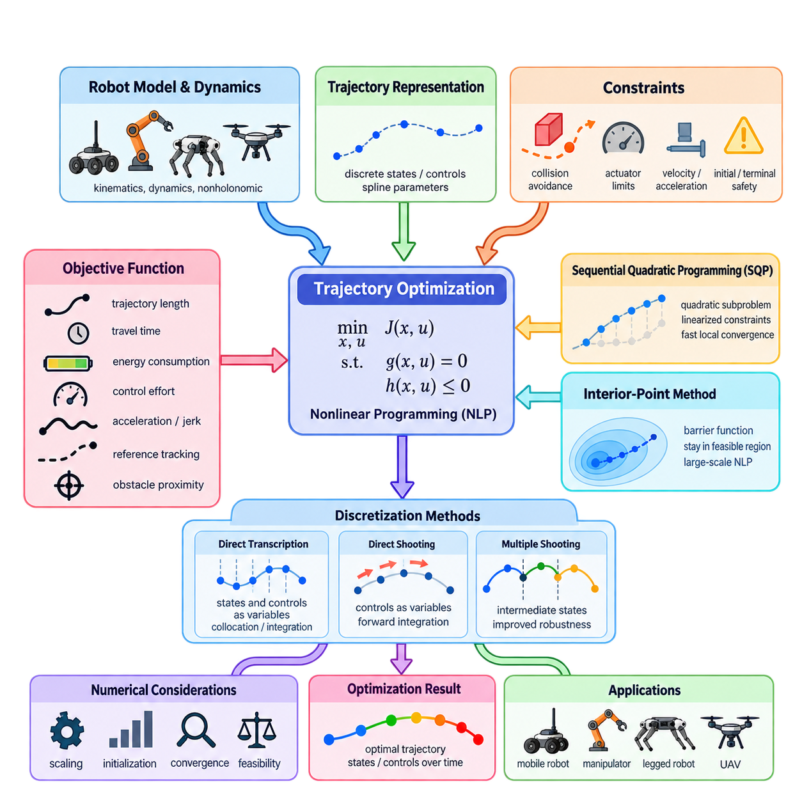
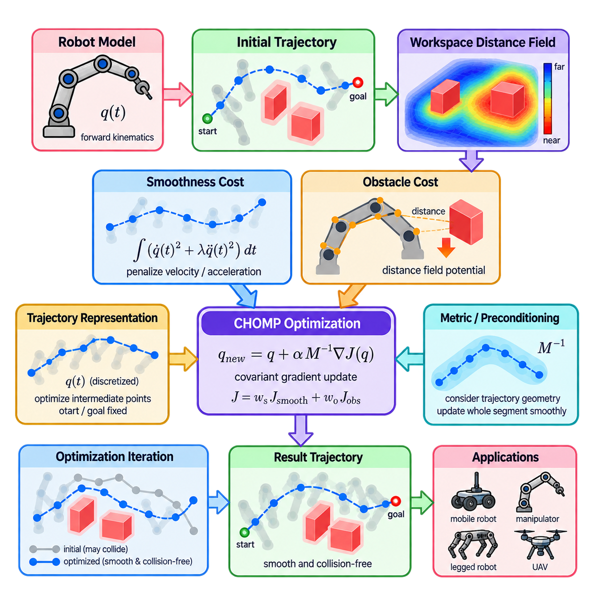
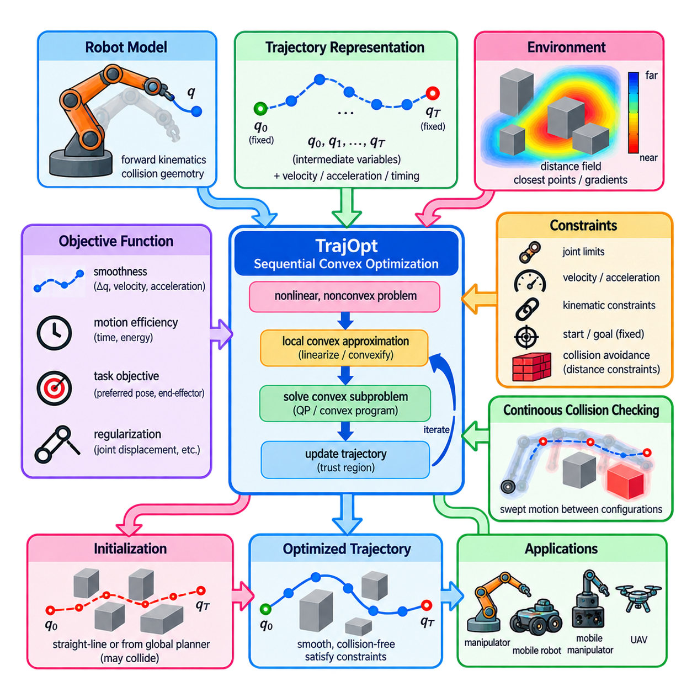
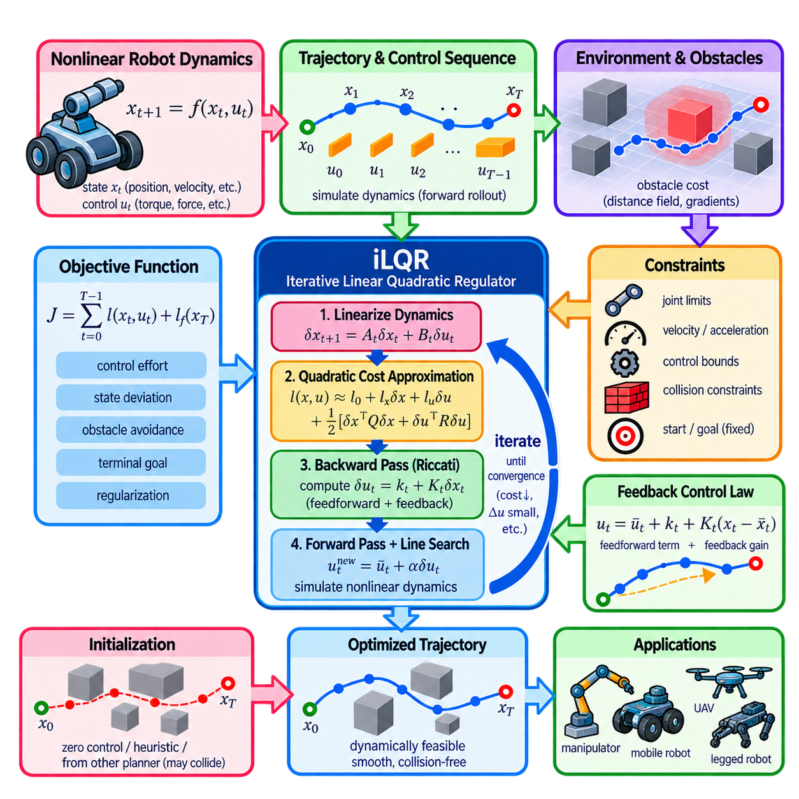
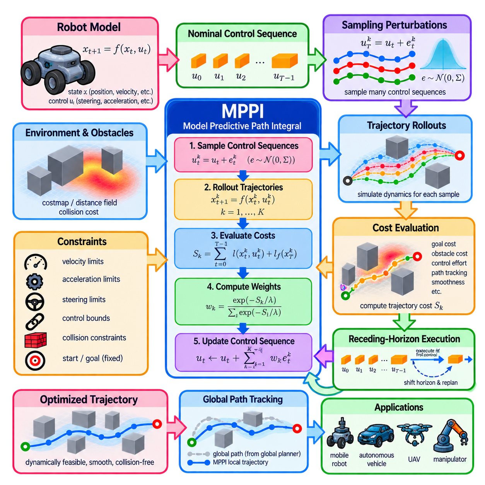
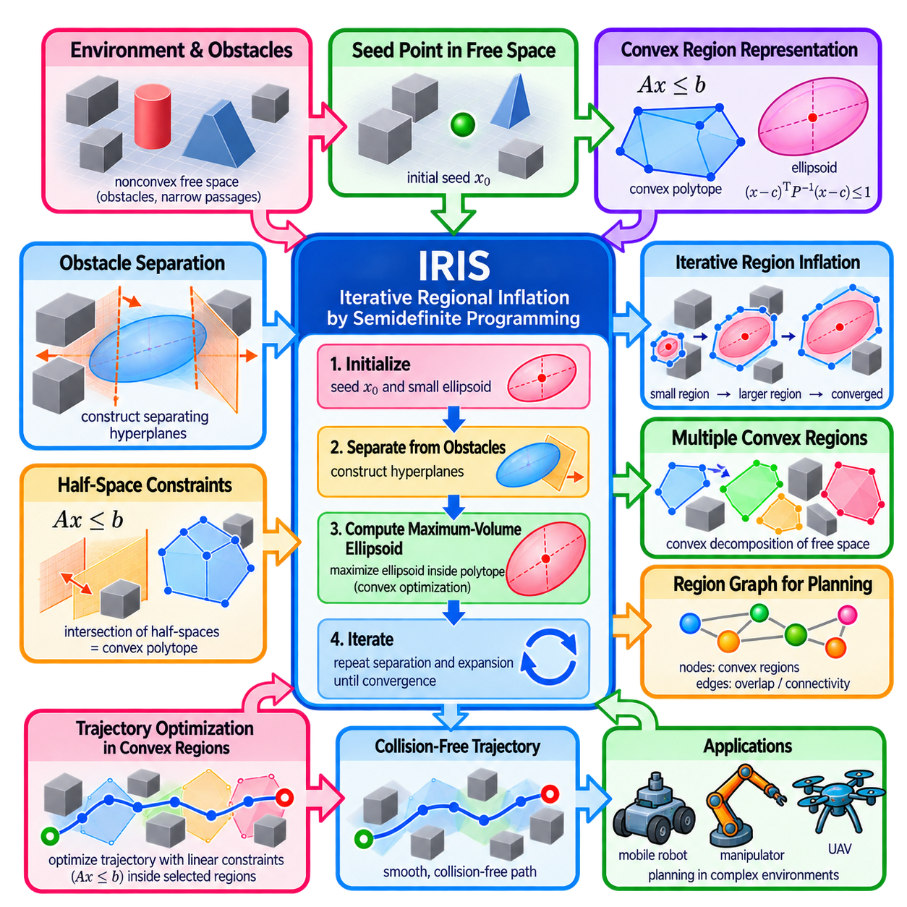
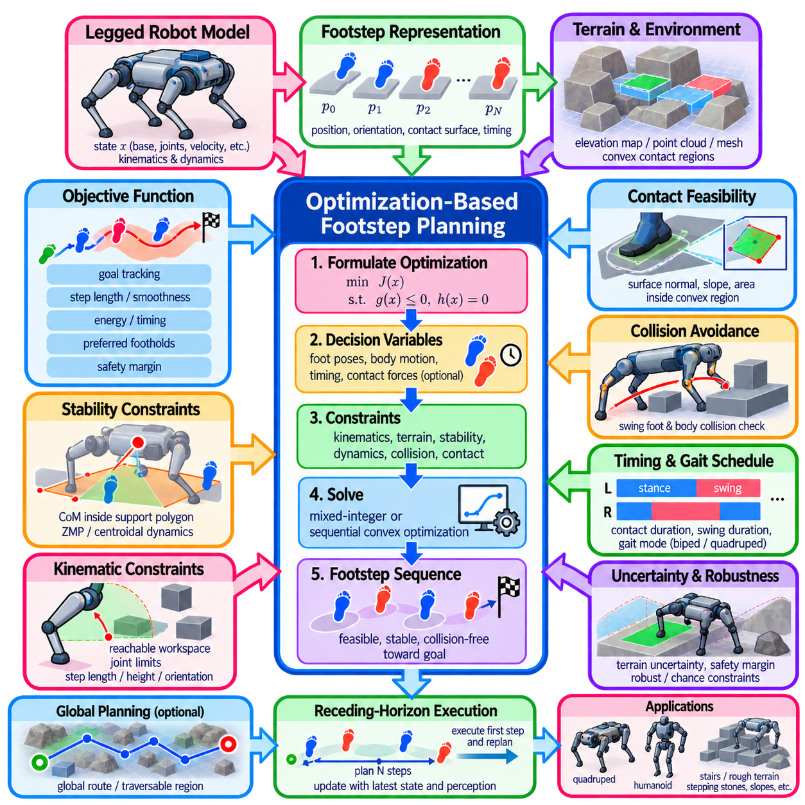
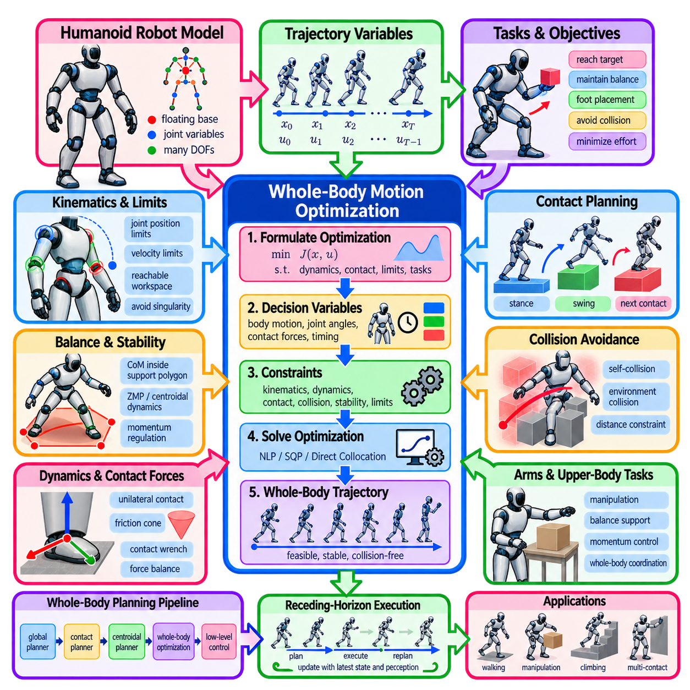
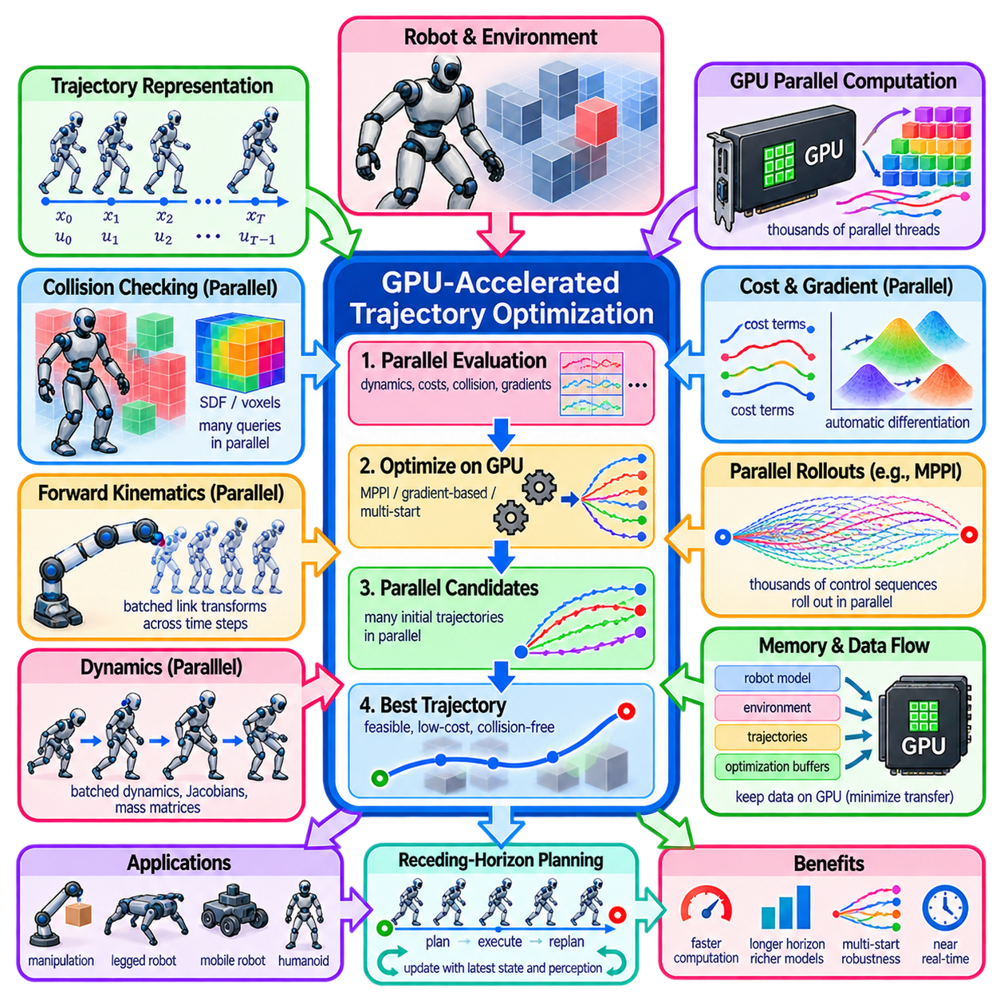
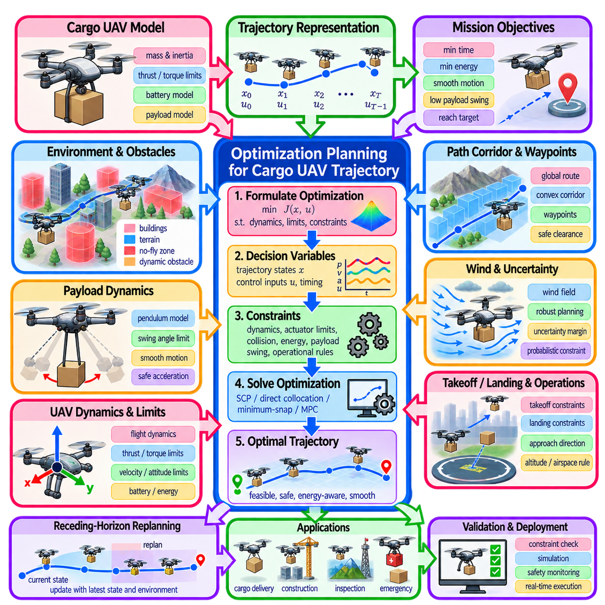

**Volume 15. Motion Planning and Navigation**

# Chapter 04. Optimization Based Planning

## 04.01. Trajectory Optimization Theory NLP SQP Interior Point

{width="7.268055555555556in" height="7.268055555555556in"}

Trajectory optimization formulates robot motion planning as a continuous optimization problem in which the decision variables describe a trajectory over time. Instead of exploring a graph or randomly sampling configurations, the planner directly modifies states, controls, or trajectory parameters to minimize an objective while satisfying motion, collision, and system constraints. This approach naturally integrates path quality and dynamic feasibility.

A trajectory may be represented by discrete robot states \\(x_0,x_1,\\ldots,x_N\\), control inputs \\(u_0,u_1,\\ldots,u_{N-1}\\), or parameters of continuous curves such as splines. The optimization variables can therefore include position, orientation, velocity, acceleration, steering angle, joint configuration, or time intervals. The representation determines both the numerical complexity of the problem and the kinds of physical constraints that can be expressed.

The general trajectory optimization problem minimizes an objective \\(J(x,u)\\) subject to equality and inequality constraints. Equality constraints typically describe initial and terminal conditions, robot dynamics, or kinematic relationships, while inequality constraints impose collision avoidance, actuator limits, velocity bounds, acceleration limits, and safety margins. Consequently, practical robot planning often becomes a constrained nonlinear programming problem, commonly abbreviated as NLP.

The objective function converts desirable motion characteristics into numerical costs. Typical terms penalize trajectory length, travel time, energy consumption, control effort, acceleration, jerk, proximity to obstacles, or deviation from a reference path. Multiple terms are usually combined through weighting coefficients. Selecting these weights is important because the optimizer mathematically balances competing objectives rather than treating every desirable property as an absolute requirement.

Nonlinearity arises naturally in robotics. Robot dynamics contain trigonometric relationships and products between states and controls, while collision constraints depend nonlinearly on robot geometry and obstacle boundaries. A mobile robot may additionally have nonholonomic constraints that prohibit arbitrary lateral motion. Manipulators, legged robots, and UAVs introduce increasingly complex dynamics, making general nonlinear optimization an important foundation for optimization-based motion planning.

Trajectory optimization requires converting continuous-time motion equations into a finite-dimensional problem that a numerical solver can process. Direct transcription discretizes the trajectory at selected time points and introduces states and controls as optimization variables. Dynamics are then enforced between neighboring points through numerical integration or collocation constraints. Finer discretization improves trajectory representation but increases the number of variables and computational cost.

Direct shooting uses control inputs as primary optimization variables and obtains states by integrating the robot dynamics forward in time. This reduces explicit state variables but can produce poor numerical conditioning for long horizons because early control changes propagate through the entire trajectory. Multiple shooting divides the horizon into shorter segments and introduces intermediate states, improving numerical robustness while adding continuity constraints between segments.

Sequential Quadratic Programming, or SQP, solves a nonlinear constrained problem through a sequence of quadratic programming subproblems. At each iteration, the nonlinear objective is approximated locally, while constraints are linearized around the current trajectory. The quadratic subproblem computes a search direction, after which the trajectory is updated and the process repeats. SQP can achieve rapid local convergence when derivatives and an appropriate initial trajectory are available.

The effectiveness of SQP depends strongly on gradient information and the approximation of second-order curvature. Analytical derivatives can provide high accuracy but become difficult to maintain for complex robotic systems. Numerical differentiation is easier but may introduce noise and substantial computational cost. Automatic differentiation provides an important alternative because derivatives can be generated systematically from the computational representation of objectives, dynamics, and constraints.

Interior-point methods approach constrained optimization differently by maintaining iterates within, or progressively toward, the feasible region. Inequality constraints are incorporated using barrier functions that impose increasingly severe penalties as variables approach forbidden boundaries. A sequence of barrier problems is solved while the barrier parameter is reduced, allowing the solution to approach the boundary of the original constrained problem without directly crossing prohibited constraints.

Interior-point methods are particularly useful for large nonlinear programs containing many continuous variables and constraints. Their linear algebra structure can often exploit sparsity produced by trajectory discretization, because a state at one time step usually interacts directly with only nearby states and controls. Efficient sparse factorization can therefore make optimization over long horizons practical even when the complete nonlinear program contains thousands of decision variables.

Collision avoidance is one of the most difficult components of trajectory optimization. A collision-free condition must be converted into a differentiable or approximately differentiable constraint or cost. Signed-distance functions are frequently useful because positive distance represents separation from an obstacle while negative distance represents penetration. Gradients of distance provide the optimizer with information about which direction should move the robot away from collision.

Hard constraints and soft costs serve different purposes. A hard velocity limit, for example, requires every candidate solution to remain within a specified bound, whereas a soft velocity penalty merely discourages excessive speed. Safety-critical requirements are generally better represented as constraints when the solver and formulation permit it. Comfort, smoothness, energy efficiency, and preference objectives are more naturally represented as weighted cost terms.

Optimization-based planning is inherently local for many nonlinear formulations. The solver normally improves an initial trajectory rather than guaranteeing discovery of the globally optimal trajectory. A poor initialization may converge to an undesirable local minimum or fail to find a feasible solution. For this reason, graph search or sampling-based planning can provide an initial path that is subsequently refined through optimization, combining global exploration with continuous trajectory improvement.

Constraint feasibility is often more important than pure objective reduction during early iterations. If the initial trajectory passes through obstacles or violates dynamics, the optimizer must simultaneously recover feasibility and improve trajectory quality. Penalty methods, slack variables, trust regions, merit functions, and filter methods provide mechanisms for balancing these requirements. Robust implementations monitor both objective improvement and constraint violation rather than considering cost alone.

Scaling is another critical numerical issue. Position may be measured in meters, orientation in radians, velocity in meters per second, and forces in hundreds or thousands of newtons. Large differences in numerical magnitude can produce poorly conditioned optimization problems. Normalization and appropriate scaling of decision variables, constraints, and objective terms improve numerical stability and make termination tolerances more meaningful across different physical quantities.

Termination criteria typically examine quantities such as objective change, constraint violation, gradient magnitude, step size, and optimality residuals. A solver reporting convergence does not automatically mean that a trajectory is safe or operationally acceptable. The resulting motion should therefore undergo independent validation for collision clearance, dynamic feasibility, actuator limits, discretization errors, and execution margins before being passed to the robot controller.

For mobile robots, trajectory optimization can jointly determine geometric path and velocity profile while enforcing steering, curvature, acceleration, and obstacle constraints. This differs from planning a geometric path first and assigning speed afterward. Joint optimization becomes particularly valuable for nonholonomic or dynamically constrained platforms because spatial and temporal decisions interact. Narrow turns, braking zones, and limited traction can then influence the trajectory directly.

For manipulators and whole-body robots, the optimization variables may contain dozens of joint positions and velocities at every time step. Constraints can enforce joint limits, end-effector poses, self-collision avoidance, contact conditions, balance, and torque limits. The same mathematical framework therefore extends from relatively simple AMR navigation to manipulation, legged locomotion, humanoid motion, and UAV trajectory generation within the broader optimization-based planning chapter. :chatgpt-content-reference{index="0"}

## 04.02. CHOMP Covariant Hamiltonian Optimization [w/Code]

{width="7.268055555555556in" height="7.268055555555556in"}

CHOMP, or Covariant Hamiltonian Optimization for Motion Planning, is an optimization-based method that generates smooth, collision-free robot trajectories by iteratively improving an initial path. Rather than constructing motion through graph expansion or random sampling, CHOMP treats the entire trajectory as an optimization variable. This formulation allows geometric smoothness and obstacle avoidance to be considered simultaneously within a continuous trajectory space.

The central idea of CHOMP is to define a trajectory cost containing two major components: a smoothness cost and an obstacle cost. The smoothness term penalizes undesirable variations in velocity or acceleration, while the obstacle term penalizes configurations that approach or intersect obstacles. Optimization modifies the trajectory to reduce the combined cost, gradually transforming an initial path into a smoother and safer motion suitable for robot execution.

A robot trajectory can be represented as a time-parameterized configuration \\(q(t)\\), where each configuration contains the robot\'s degrees of freedom. In numerical implementations, the continuous trajectory is discretized into a sequence of configurations. These trajectory points become optimization variables, while the start and goal configurations are normally fixed. Intermediate configurations are adjusted repeatedly until the trajectory reaches an acceptable local optimum.

The smoothness objective is commonly expressed through derivatives of the trajectory. Penalizing squared velocity encourages short and regular motion, while acceleration penalties suppress abrupt changes in velocity and produce smoother trajectories. Higher-order derivatives may also be considered when additional motion quality is required. In matrix form, these costs create structured quadratic expressions that provide useful curvature information for optimization.

Obstacle avoidance requires information about the robot\'s surrounding workspace rather than only configuration-space collision labels. CHOMP commonly relies on a workspace distance field that provides the distance from spatial locations to nearby obstacles. The distance information can be converted into a differentiable obstacle potential, enabling the optimizer to determine not only whether a trajectory is unsafe but also how the trajectory should move away from obstacles.

For a robot with multiple links, collision cost cannot be evaluated only at a single reference point. Points distributed across the robot body can be mapped from configuration space into workspace through forward kinematics. Each point receives an obstacle cost according to its location in the distance field. The contributions are then propagated back toward configuration variables through kinematic Jacobians, allowing whole-body trajectories to respond to nearby obstacles.

A distinctive feature of CHOMP is its covariant gradient update. Ordinary gradient descent depends strongly on the coordinate representation and may produce inefficient trajectory modifications. CHOMP instead preconditions the functional gradient using a metric related to trajectory smoothness. The resulting update accounts for relationships among neighboring trajectory points, so optimization tends to deform an entire section of the path coherently rather than moving individual waypoints independently.

This metric can be interpreted as defining the geometry of trajectory space. Directions that create highly irregular motion are treated differently from directions that produce smooth deformation. Consequently, the optimizer searches according to a notion of distance that better reflects trajectory quality. This covariant treatment is one of the major conceptual differences between CHOMP and simple waypoint-based gradient descent applied directly in Euclidean coordinates.

The obstacle functional is designed to consider collision exposure along the trajectory rather than merely at isolated waypoints. A useful formulation integrates obstacle potential along the path while accounting for the velocity of workspace points. This makes the cost less dependent on a particular time parameterization and focuses optimization on the geometric shape of the trajectory. Discretization must nevertheless be sufficiently dense to detect collisions between neighboring configurations.

During each optimization iteration, CHOMP evaluates the current trajectory, computes smoothness and obstacle gradients, combines them, and applies a metric-scaled update. Start and goal conditions remain fixed while intermediate configurations move. Repeated updates typically push colliding portions away from obstacles while regularizing unnecessary curvature. Step size and cost weighting determine how aggressively the trajectory changes and therefore strongly influence convergence behavior.

CHOMP is a local optimization method, so the initial trajectory has a major influence on the final solution. A simple initialization may be produced through interpolation between the start and goal configurations, but such a path can pass directly through obstacles. CHOMP can often deform an initially colliding trajectory toward free space, which is an important advantage, although difficult obstacle arrangements may trap the optimization in an undesirable local minimum.

Local minima become particularly important when different homotopy classes exist. If reaching the goal requires moving around a large obstacle in a fundamentally different direction, gradient information near the current trajectory may not reveal that alternative. A global planner or sampling-based method can therefore generate candidate initial paths, after which CHOMP can refine them. This hybrid approach combines broad exploration with continuous optimization of trajectory quality.

The balance between smoothness and obstacle avoidance is controlled through cost parameters. Excessive smoothness weighting may prevent the trajectory from bending sufficiently around obstacles, whereas excessive obstacle weighting can generate unnecessarily large deviations or reduce motion quality. Obstacle potential design, safety distance, update rate, and termination thresholds must therefore be selected according to robot geometry, environment scale, and required clearance.

Distance-field quality directly affects obstacle gradients. A signed or unsigned distance representation should provide sufficiently smooth spatial information near obstacle boundaries so that optimization receives meaningful descent directions. Grid resolution that is too coarse can distort narrow passages or produce inaccurate gradients, while extremely fine resolution increases memory and computation. Practical systems must therefore balance environmental fidelity against planning performance.

CHOMP can be computationally attractive because each iteration uses gradient information and structured trajectory matrices rather than repeatedly performing uninformed search. However, computational requirements increase with the number of trajectory points, robot degrees of freedom, collision-checking points, and environmental complexity. Efficient forward kinematics, Jacobian evaluation, distance-field queries, and matrix operations are therefore important for responsive planning.

Compared with generic nonlinear programming, CHOMP introduces structure specifically designed for motion planning. Smoothness metrics, functional gradients, workspace obstacle potentials, and covariant updates encode characteristics of robot trajectories directly into the optimization process. This specialization can produce high-quality continuous motions efficiently, although it does not eliminate the fundamental challenges of initialization, nonconvex collision geometry, and local optimality.

For mobile robots, CHOMP can refine geometric paths by reducing unnecessary curvature while maintaining clearance from walls and obstacles. For manipulators, it can optimize high-dimensional joint trajectories while considering the swept motion of multiple links. Similar principles can contribute to mobile manipulation and whole-body planning, although additional kinematic, dynamic, balance, or contact constraints may require extensions beyond the basic CHOMP formulation.

In practical motion-planning architecture, CHOMP is best understood as a trajectory refinement mechanism within the broader optimization-based planning family. It demonstrates how continuous obstacle information, trajectory smoothness, robot kinematics, and geometry-aware gradient updates can be integrated into one optimization process. Its core contribution is not simply minimizing path length, but systematically deforming a complete robot trajectory toward smooth, collision-free motion.

## 04.03. TrajOpt Sequential Convex Optimization [w/Code]

{width="7.268055555555556in" height="7.268055555555556in"}

TrajOpt, short for Trajectory Optimization, is an optimization-based motion planning framework that formulates robot trajectory generation as a sequence of convex optimization problems. Within the optimization-based planning structure, it follows general nonlinear trajectory optimization and CHOMP while introducing sequential convex optimization as its central mechanism. The method is particularly useful for generating smooth, collision-free trajectories in high-dimensional robot configuration spaces.

The fundamental difficulty in robot trajectory optimization is that collision avoidance, robot kinematics, and some motion constraints are nonlinear and often nonconvex. Solving the complete problem directly can therefore be computationally expensive and sensitive to initialization. TrajOpt addresses this difficulty by approximating the original nonconvex problem locally with convex subproblems that can be solved efficiently using established numerical optimization techniques.

A trajectory is usually represented as a finite sequence of robot configurations \\(q_0,q_1,\\ldots,q_T\\). The start and goal configurations may be fixed, while intermediate configurations become decision variables. Depending on the robot and task, additional variables can represent velocities, accelerations, timing, or auxiliary quantities. Optimization then modifies these variables simultaneously instead of independently selecting individual waypoints.

The objective function typically combines trajectory smoothness, motion efficiency, collision avoidance, and task-specific preferences. Smoothness can be encouraged by penalizing differences between consecutive configurations or changes in velocity and acceleration. Additional costs may penalize deviation from preferred poses, excessive joint displacement, or undesirable end-effector motion. The relative weights determine how strongly each property influences the resulting trajectory.

Sequential convex optimization begins from an initial trajectory and constructs a local convex approximation around the current solution. Nonlinear objective terms may be approximated by convex functions, while nonlinear constraints are linearized or otherwise convexified. The resulting convex subproblem is solved to obtain an improved trajectory. This trajectory becomes the expansion point for the next approximation, and the procedure continues iteratively.

The local nature of each approximation is controlled using a trust region. A convex approximation is generally reliable only near the trajectory around which it was constructed, so allowing excessively large updates can invalidate the model. Trust-region constraints restrict how far the new trajectory may move during one iteration. Their size can be adjusted according to whether predicted improvements agree with improvements measured using the original nonlinear problem.

Collision avoidance is a major contribution of the TrajOpt formulation. Rather than relying only on binary collision tests at discrete configurations, the optimization uses distance-related information between robot geometry and environmental obstacles. Signed-distance or closest-point information can provide gradients indicating how robot links should move to increase clearance. Collision conditions can then be locally approximated and incorporated into the convex optimization process.

Checking collision only at trajectory waypoints can miss collisions occurring between two configurations. TrajOpt therefore emphasizes continuous-time collision checking, where the swept motion between consecutive trajectory states is considered. This is especially important when trajectory discretization is relatively coarse or robot links move significantly between adjacent states. Continuous checking reduces the possibility that an apparently feasible discrete trajectory actually intersects an obstacle during execution.

Robot geometry is commonly represented through collision primitives, meshes, or convex components. For each relevant robot-obstacle pair, closest points and separation distances can be calculated. The associated contact normals provide directions for increasing separation. These geometric quantities allow collision avoidance to be expressed through locally linearized constraints or penalty terms that can be processed efficiently inside sequential convex optimization.

Hard constraints and soft penalties can both appear in TrajOpt. Joint limits, fixed start states, required poses, and certain kinematic relationships may be imposed as explicit constraints. Collision avoidance or task preferences may also be represented through penalty functions when strict feasibility is difficult to maintain during early iterations. This flexibility enables the optimizer to recover progressively from an initially infeasible or colliding trajectory.

Penalty-based formulations often use hinge-like costs that become active when a required safety distance is violated. If the robot remains farther than the specified margin from an obstacle, the collision penalty can become zero. As the robot approaches or penetrates the safety region, the penalty increases. This structure concentrates optimization effort near potentially dangerous portions of the trajectory while avoiding unnecessary cost in clearly collision-free regions.

Sequential convex optimization differs from solving one fixed convex problem. After every iteration, robot configurations change, collision geometry changes, and the local approximations must be recomputed. Thus, TrajOpt repeatedly alternates between evaluating the nonlinear robotic problem and solving a tractable convex approximation. Convergence occurs when trajectory changes, objective improvement, and constraint violations become sufficiently small according to selected termination criteria.

Initialization remains important because the complete motion-planning problem is nonconvex even though each subproblem is convex. A straight-line interpolation in configuration space is a common simple initialization and may initially intersect obstacles. TrajOpt can often repair moderate collisions through local optimization, but it cannot guarantee escape from every poor local minimum or discover a fundamentally different route around a large obstacle.

For environments containing multiple distinct route classes, a global planner can therefore complement TrajOpt. Graph-based or sampling-based planning can first identify a collision-free or approximately feasible route, after which TrajOpt refines it for smoothness, clearance, and task constraints. This division allows global planning to handle large topological decisions while trajectory optimization handles continuous geometric improvement.

Compared with CHOMP, TrajOpt shares the principle of improving an entire trajectory through optimization but uses a different numerical strategy. CHOMP is strongly associated with functional gradients, trajectory-space metrics, and covariant updates, whereas TrajOpt emphasizes sequential convex approximations, trust regions, and explicit treatment of constraints. Both remain local optimization approaches whose performance depends on trajectory initialization and environmental geometry.

Convex subproblems are attractive because they can be solved reliably and efficiently relative to general nonconvex optimization. Depending on the formulation, a subproblem may resemble quadratic programming or another convex program. Sparsity also arises naturally because costs and constraints at one trajectory step often depend primarily on neighboring states. Exploiting this structure is important when optimizing long trajectories or robots with many degrees of freedom.

Manipulator planning is a major application because arm trajectories may contain many joint variables while collision constraints involve multiple moving links. TrajOpt can simultaneously adjust all intermediate joint configurations to avoid obstacles and self-collision while maintaining smooth motion. End-effector position and orientation requirements can also be introduced, making the framework useful for reaching, manipulation, and constrained motion tasks.

The same principles can be extended to mobile robots and mobile manipulators. Configuration variables may include planar position, heading, steering quantities, manipulator joints, or other platform states. Appropriate constraints can represent nonholonomic motion, velocity bounds, workspace restrictions, and task conditions. More complex dynamic systems require additional modeling when forces, torques, contacts, or full equations of motion must be respected.

Practical performance depends on trajectory resolution, collision geometry, safety margins, trust-region parameters, penalty coefficients, solver tolerances, and initialization quality. Excessively coarse discretization can reduce geometric accuracy, while unnecessarily dense trajectories increase computation. Similarly, overly aggressive updates can invalidate local approximations, whereas excessively restrictive trust regions may cause slow convergence. Parameter selection therefore balances robustness, accuracy, and planning latency.

A trajectory returned by TrajOpt should still be independently validated before execution. Collision checking should verify both discrete configurations and continuous motion between them, while joint, velocity, acceleration, and task constraints should be checked against the actual robot model. Optimization convergence indicates numerical termination, not automatically operational safety, so execution margins and controller compatibility remain essential parts of the planning pipeline.

TrajOpt demonstrates an important principle of optimization-based motion planning: a difficult nonconvex robotic problem can be approached through a sequence of simpler local problems. By combining trajectory discretization, collision-distance information, continuous collision checking, convex approximation, and trust-region updates, sequential convex optimization provides a practical bridge between general nonlinear optimization and computationally efficient robot trajectory generation.

## 04.04. iLQR Iterative LQR for Robot Trajectory Opt [w/Code]

{width="7.268055555555556in" height="7.268055555555556in"}

Iterative Linear Quadratic Regulator, or iLQR, is a trajectory optimization method for nonlinear dynamical systems that repeatedly solves locally approximated linear-quadratic control problems. In robot planning, it optimizes a sequence of control inputs and the resulting state trajectory together. This makes iLQR especially useful when motion quality depends not only on geometric paths but also on robot dynamics, control effort, and time-dependent behavior.

The method begins with a discrete-time nonlinear system described by \\(x_{t+1}=f(x_t,u_t)\\), where \\(x_t\\) represents the robot state and \\(u_t\\) represents the control input. The state may contain position, orientation, velocity, or joint variables, while controls may represent forces, torques, steering commands, or accelerations. A candidate control sequence generates a corresponding trajectory through forward simulation of the dynamics.

Trajectory quality is expressed using a finite-horizon objective containing running costs and a terminal cost. A typical formulation is \\(J=\\sum_{t=0}\^{T-1}l(x_t,u_t)+l_f(x_T)\\). Running costs can penalize control effort, state deviation, velocity, obstacle proximity, or undesirable motion, while the terminal cost encourages the final state to approach the desired goal. Weighting terms determine the relative importance of these objectives.

The original trajectory optimization problem is difficult because both the dynamics and cost functions may be nonlinear. iLQR handles this by repeatedly constructing a local approximation around a nominal trajectory. The nonlinear dynamics are linearized with respect to states and controls, while the cost function is approximated locally by a quadratic model. This produces a structure similar to a finite-horizon Linear Quadratic Regulator problem.

Around a nominal state-control pair \\((\\bar{x}_t,\\bar{u}_t)\\), small perturbations satisfy approximately \\(\\delta x_{t+1}=A_t\\delta x_t+B_t\\delta u_t\\). Here, \\(A_t\\) and \\(B_t\\) are Jacobians of the dynamics with respect to state and control. These matrices describe how small changes propagate through the robot dynamics and provide the local linear model required for the optimization step.

The quadratic cost approximation describes how the objective changes near the nominal trajectory. First-order derivatives represent local cost gradients, while second-order terms capture curvature with respect to states and controls. Together with the linearized dynamics, these quantities allow iLQR to determine locally improved control commands without solving the complete nonlinear optimization problem directly at every iteration.

A defining feature of iLQR is its backward pass. Starting from the terminal time and proceeding toward the initial state, the algorithm recursively approximates the value function and computes control updates. Each update normally contains a feedforward component and a feedback component. The feedforward term improves the nominal control sequence, while the feedback gain specifies how controls should respond to deviations from the nominal state trajectory.

The backward recursion is closely related to the Riccati recursion used in LQR. At each time step, derivatives of the local action-value function are assembled from immediate cost information and the value approximation at the next state. Minimizing this local quadratic model with respect to control produces an optimal local control increment and a state-feedback gain, which are then propagated backward through the planning horizon.

After the backward pass, iLQR performs a forward pass through the actual nonlinear dynamics. Starting from the initial state, new controls are generated using the calculated feedforward updates and feedback gains. The resulting states are obtained through nonlinear forward simulation rather than through the linear approximation. This produces a new dynamically consistent nominal trajectory that can be evaluated using the original objective function.

A line-search procedure is commonly applied during the forward pass. The full feedforward update may be too aggressive because the local quadratic model is accurate only near the nominal trajectory. Scaling the update by a parameter such as \\(\\alpha\\) allows several candidate trajectories to be tested. An update is accepted when it provides sufficient cost reduction, improving numerical robustness and helping prevent divergence.

The backward and forward passes are repeated until the objective improvement, control change, or another convergence measure becomes sufficiently small. Each iteration therefore follows a recognizable cycle: simulate the nominal trajectory, locally approximate dynamics and costs, perform backward dynamic programming, generate a new trajectory through forward rollout, evaluate it, and repeat. This structure gives iLQR its characteristic computational efficiency.

One important strength of iLQR is that dynamics are embedded directly into trajectory generation. A geometric planner may produce a collision-free path that cannot be followed because of acceleration, steering, or dynamic limitations. In contrast, iLQR generates trajectories through the system dynamics, so resulting motions naturally reflect properties such as inertia, control authority, turning behavior, and coupling between state variables.

The distinction between iLQR and Differential Dynamic Programming, or DDP, is important. Both methods use backward and forward passes over a nonlinear trajectory. Standard iLQR typically linearizes the dynamics and uses a second-order approximation of the cost while neglecting second derivatives of the dynamics. Full DDP additionally incorporates those dynamics second derivatives, potentially improving local modeling at the cost of greater computational complexity.

Obstacle avoidance can be incorporated through state-dependent costs that increase as the robot approaches obstacles. Distance fields, signed-distance functions, or other differentiable geometric representations can provide gradients for this purpose. However, obstacle avoidance expressed purely as a soft cost does not automatically guarantee collision-free motion. Strong penalties, constraint extensions, or independent collision validation may therefore be required for safety-critical applications.

Control and state limits introduce another practical challenge. Basic iLQR is naturally formulated around unconstrained local quadratic control updates, whereas robots have actuator saturation, velocity limits, steering limits, joint bounds, and other restrictions. Practical variants may clamp controls, use constrained backward-pass methods, transform variables, or incorporate penalties and augmented optimization techniques to handle these restrictions more explicitly.

Initialization affects convergence because iLQR is fundamentally a local trajectory optimization method. An initial control sequence may consist of zeros, simple heuristic controls, a stabilized trajectory, or commands derived from another planner. Poor initialization can place the optimization in an undesirable local minimum or prevent it from reaching the desired state. Warm starting from a previously optimized trajectory is especially valuable in repeated planning.

Computational efficiency results from exploiting the temporal structure of the control problem. Rather than treating every state and control variable as an unrelated decision variable in a generic nonlinear program, iLQR performs structured recursions along the trajectory horizon. For systems with moderate state and control dimensions, this can provide rapid trajectory improvement and makes the method attractive for iterative planning and model-predictive applications.

For mobile robots, iLQR can optimize steering and acceleration while respecting nonlinear vehicle or differential-drive dynamics. For manipulators, states may include joint positions and velocities while controls represent torques or other actuation commands. Legged robots, autonomous vehicles, and UAVs can similarly use dynamics-aware trajectory optimization, although contact-rich or highly constrained systems often require more sophisticated extensions.

iLQR is also closely related to Model Predictive Control, or MPC. An optimized finite-horizon trajectory can be computed repeatedly as the robot moves, with only the first control command applied before the optimization is solved again using a new measured state. Warm-starting from the previous solution can reduce computation. This receding-horizon strategy allows trajectory optimization to adapt continuously to state estimation errors and environmental changes.

Successful implementation depends on accurate dynamics, derivative computation, cost design, numerical regularization, horizon length, time discretization, and convergence criteria. Analytical derivatives, automatic differentiation, or numerical derivatives may be used to construct local models. Regularization is often required when matrices in the backward pass become poorly conditioned, ensuring that control updates remain numerically stable and produce meaningful descent directions.

Within optimization-based robot planning, iLQR provides a bridge between optimal control and trajectory generation. Its central mechanism combines nonlinear forward simulation with local linearization, quadratic cost approximation, Riccati-style backward recursion, feedback control updates, and repeated rollout. The result is a practical framework for producing dynamically feasible trajectories while jointly optimizing robot states, controls, and motion quality.

## 04.05. Model Predictive Path Integral MPPI Planning [w/Code]

{width="7.268055555555556in" height="7.268055555555556in"}

Model Predictive Path Integral, or MPPI, planning is a sampling-based stochastic optimal control method that repeatedly evaluates many candidate control sequences over a finite prediction horizon. Instead of relying on explicit gradients of the dynamics or solving a constrained nonlinear program at every cycle, MPPI perturbs a nominal control sequence, simulates the resulting trajectories, evaluates their costs, and uses cost-weighted sampling to improve the controls.

The method considers a dynamical system whose state evolves according to a model such as \\(x_{t+1}=f(x_t,u_t)\\), potentially including stochastic disturbances. The state may contain robot position, orientation, velocity, steering state, or other dynamic variables, while the control vector may represent linear and angular velocity, acceleration, steering commands, forces, or torques. Forward simulation predicts how each candidate control sequence moves the robot.

MPPI operates over a finite prediction horizon containing \\(T\\) future control steps. A nominal sequence \\(U=(u_0,u_1,\\ldots,u_{T-1})\\) represents the current best estimate of future controls. At each optimization cycle, random perturbations are added to this sequence to produce many candidate control sequences. Each candidate is rolled forward through the robot model, generating a complete predicted state trajectory.

The trajectory cost defines the behavior desired from the planner. Typical terms penalize distance from a reference path or goal, obstacle proximity, collision, control effort, excessive velocity, heading error, unstable motion, or violation of preferred operating regions. A terminal cost can encourage progress toward the destination at the end of the horizon. The cost formulation therefore converts navigation objectives and operational preferences into numerical trajectory scores.

Unlike deterministic optimization methods that follow a single local gradient, MPPI evaluates a population of sampled trajectories. Some samples may remain close to the nominal trajectory, while others explore substantially different controls. Low-cost rollouts provide evidence about promising motion directions, whereas high-cost rollouts contribute little to the update. This population-based mechanism allows MPPI to handle nonlinear dynamics and complex cost landscapes without requiring cost derivatives.

A common sampling strategy generates perturbations \\(\\epsilon_t\^k\\) for rollout \\(k\\) from a Gaussian distribution with a selected covariance. Candidate controls can then be written approximately as \\(u_t\^k=u_t+\\epsilon_t\^k\\). The covariance determines the exploration scale: small noise produces conservative local search, while large noise explores a wider region but may generate many inefficient or infeasible trajectories.

Each sampled control sequence is propagated through the robot dynamics to calculate a rollout \\(x_0\^k,x_1\^k,\\ldots,x_T\^k\\). Its total trajectory cost \\(S_k\\) is then evaluated. Thousands of such rollouts may be processed during one planning cycle. Because individual rollouts are largely independent, the simulation and cost evaluation stages are highly parallelizable and can exploit GPU hardware effectively.

The path-integral update converts trajectory costs into importance weights. A commonly used form assigns a weight proportional to \\(\\exp(-S_k/\\lambda)\\), after suitable numerical normalization, where \\(\\lambda\\) is a temperature parameter. Low-cost trajectories receive exponentially larger weights than poor trajectories. The nominal control sequence is updated using the weighted average of sampled control perturbations, directing future controls toward regions associated with better rollouts.

The temperature parameter \\(\\lambda\\) strongly affects optimization behavior. A small value concentrates weight on a limited number of the best trajectories and produces aggressive selection, while a larger value distributes influence across more samples and creates a smoother update. Together with sampling covariance, the temperature determines the balance between exploration, exploitation, responsiveness, and robustness of the controller.

MPPI naturally follows a receding-horizon strategy. After optimization, the robot normally executes only the first control command or a short prefix of the optimized sequence. At the next control cycle, a new state estimate is obtained, the prediction horizon is shifted forward, and optimization is repeated. The unused portion of the previous solution can be shifted and reused as a warm start for the next iteration.

This repeated replanning makes MPPI suitable for environments where the robot state or surrounding scene changes continuously. Localization errors, disturbances, moving obstacles, and deviations from the predicted trajectory can be incorporated at the next optimization cycle. The planner therefore behaves as a feedback process even though individual sampled rollouts primarily evaluate open-loop control sequences over the prediction horizon.

Obstacle avoidance is commonly represented through trajectory costs. A costmap, occupancy grid, signed-distance representation, or geometric collision model can assign increasingly large penalties as predicted states approach obstacles. Direct collision can receive a very large cost so that unsafe rollouts obtain negligible importance weights. Additional inflation or clearance costs can encourage trajectories that preserve a practical safety margin around obstacles.

Hard constraints require careful treatment because basic MPPI is fundamentally cost driven. Velocity, acceleration, steering, and actuator limits can often be enforced by clipping sampled controls or rejecting invalid samples. More complicated state constraints may be represented through large penalties, barrier-like costs, or specialized constrained variants. Independent safety checking remains important because finite sampling does not mathematically guarantee that every executed trajectory is collision-free.

Sampling quality is central to MPPI performance. Too few rollouts may provide an inaccurate estimate of useful control directions, especially in cluttered or highly nonlinear environments. Increasing the number of samples improves coverage but raises computational demand. The prediction horizon creates a similar tradeoff: a longer horizon allows earlier anticipation of turns and obstacles, while increasing the amount of simulation required for every sampled trajectory.

GPU acceleration is especially well matched to MPPI because hundreds or thousands of trajectories can be simulated simultaneously. Robot dynamics, obstacle costs, path-tracking errors, and trajectory reductions can be evaluated using parallel kernels. This differs from algorithms dominated by sequential matrix factorizations or backward recursions. With suitable implementation, parallel rollout evaluation can support high-frequency local planning for dynamically constrained robots.

The robot model determines the physical realism of predicted trajectories. Simple mobile platforms may use differential-drive or unicycle models, while car-like robots require steering and curvature dynamics. More complex applications can employ richer dynamic models containing acceleration, actuator response, or additional states. A more accurate model improves prediction but increases computation, so model complexity must be balanced against the required planning frequency.

Reference-path tracking is a common use of MPPI in navigation architectures. A global planner first generates a broad route toward the goal, while MPPI operates locally to optimize dynamically executable motion along that route. Costs can measure distance and orientation relative to the reference path while simultaneously considering obstacles and control smoothness. The resulting planner therefore combines global guidance with short-horizon reactive optimization.

MPPI differs fundamentally from iLQR in how it searches for improved controls. iLQR linearizes dynamics, approximates costs quadratically, and uses a Riccati-style backward pass to compute local updates. MPPI instead performs stochastic rollouts and obtains updates from cost-weighted samples. It therefore avoids explicit dynamics derivatives but usually requires many model evaluations, making parallel computing particularly important.

Compared with purely geometric local planning, MPPI can reason directly about controls and predicted motion over time. It can evaluate alternative velocity and steering sequences before they are executed rather than selecting motion from instantaneous geometry alone. This capability is valuable when acceleration limits, momentum, turning radius, control smoothness, and short-term obstacle interactions significantly affect whether a candidate motion can actually be executed.

Practical tuning involves the number of rollouts, horizon length, control frequency, sampling covariance, temperature, control bounds, cost weights, and obstacle penalties. These parameters interact strongly. Excessive noise can create unstable candidate controls, while insufficient exploration can trap the planner around a poor nominal solution. Poorly balanced costs can cause oscillation, excessive clearance, weak path tracking, or overly conservative behavior.

The quality of MPPI also depends on computational latency. All sampling, rollout simulation, cost evaluation, weighting, and control updates must finish before the next command is required. Average execution time alone is insufficient for a real robot; latency variation and worst-case behavior matter because delayed commands reduce the validity of predictions. Efficient memory layout, parallelization, and predictable execution are therefore important implementation concerns.

For mobile robots, autonomous vehicles, UAVs, and other dynamically constrained platforms, MPPI provides a flexible framework for local trajectory generation and control. Its core cycle is conceptually simple: sample control perturbations, simulate future trajectories, evaluate their costs, weight promising samples, update the nominal controls, execute the first action, and repeat. Through this receding-horizon process, MPPI combines stochastic exploration, optimal-control reasoning, and real-time feedback planning.

## 04.06. Convex Decomposition IRIS for Collision Free Plan [w/Code]

{width="7.268055555555556in" height="7.268055555555556in"}

IRIS, or Iterative Regional Inflation by Semidefinite Programming, is a method for constructing large convex regions of collision-free configuration or workspace. Instead of optimizing a complete trajectory directly through a highly nonconvex obstacle field, IRIS identifies convex subsets of free space that can later support efficient trajectory optimization. This converts difficult collision geometry into regions described by tractable convex constraints.

The fundamental challenge arises because obstacle-free space is generally nonconvex. Obstacles divide the environment into irregular regions, narrow passages, and disconnected components, making direct optimization difficult. Convex optimization becomes substantially easier when motion is restricted to convex subsets. IRIS therefore attempts to approximate useful portions of free space with large convex regions while ensuring that these regions do not intersect known obstacles.

A convex region has the important property that the line segment connecting any two points inside the region remains entirely inside it. For motion planning, this property simplifies many geometric constraints. If trajectory points are constrained to lie within an appropriate convex region, interpolation and optimization can be performed without repeatedly reasoning about arbitrary nonconvex obstacle boundaries, although robot geometry and dynamic feasibility may still require additional treatment.

IRIS begins from a seed point located in collision-free space. Around this seed, the algorithm constructs an initial ellipsoid representing a small candidate region. It then alternates between separating the ellipsoid from obstacles and enlarging the ellipsoid inside the resulting polytope. Through repeated iterations, the region expands until further improvement becomes sufficiently small or another termination criterion is satisfied.

Obstacle separation is performed by constructing hyperplanes between the current ellipsoid and surrounding obstacles. Each hyperplane places the ellipsoid on the free side while excluding the relevant obstacle from the candidate region. The intersection of these half-spaces forms a convex polytope. This polytope acts as a collision-free geometric container within which the ellipsoid can subsequently be enlarged.

For a polytope represented by linear inequalities \\(Ax\\leq b\\), each row of \\(A\\) and corresponding element of \\(b\\) define a half-space boundary. The complete intersection describes the current convex region. Linear inequality representations are particularly useful for trajectory optimization because state or configuration variables can be constrained directly using standard convex optimization machinery when the relevant motion variables are represented in the same space.

After constructing separating hyperplanes, IRIS computes a large ellipsoid contained within the polytope. The ellipsoid can be represented through a center and a positive-definite shape matrix. Maximizing its volume encourages the algorithm to expand into available free space rather than remaining near the original seed. The maximum-volume inscribed ellipsoid problem can be formulated using convex optimization and semidefinite programming concepts.

The algorithm then uses the enlarged ellipsoid to recompute obstacle-separating hyperplanes. Because the ellipsoid has expanded, the supporting hyperplanes can change and permit a larger polytope. A new maximum-volume ellipsoid is calculated inside that polytope, and the process repeats. This alternating structure explains the term iterative regional inflation: a small safe region is progressively inflated while obstacles constrain its growth.

The ellipsoid plays an important computational role beyond merely visualizing region size. By applying an affine transformation that maps the current ellipsoid to a unit sphere, obstacle separation can be expressed in a normalized coordinate system. Finding supporting hyperplanes relative to this transformed geometry provides a systematic mechanism for determining which obstacle surfaces limit further expansion of the convex region.

IRIS typically assumes that obstacles can be represented using convex geometry or decomposed into convex components. Complex nonconvex obstacles may therefore require geometric decomposition before region inflation. For each relevant convex obstacle, a separating plane is sought so that the candidate region remains on one side and the obstacle remains on the other. The resulting collection of planes defines a conservative collision-free approximation.

The generated region is conservative because IRIS does not attempt to reproduce the entire boundary of free space exactly. Instead, it finds a convex subset guaranteed or intended to remain within free space under the adopted geometric model. Some collision-free areas may be excluded from the region. This loss of coverage is accepted in exchange for obtaining simple convex constraints that are much easier to use during subsequent optimization.

A single convex region is often insufficient for a large environment containing corridors, rooms, turns, or multiple route alternatives. Multiple seed points can therefore be used to generate several IRIS regions. Their union provides a convex decomposition or convex cover of useful free space. Neighboring regions may intentionally overlap, allowing a planned trajectory to transition from one convex region to another.

These overlapping regions can be organized into a connectivity graph. Each node represents a collision-free convex set, while an edge indicates that two regions intersect or permit a feasible transition. Motion planning can then combine discrete search over the region graph with continuous optimization inside selected regions. This separates large-scale route selection from local continuous trajectory generation.

Convex-region planning is especially attractive when combined with trajectory optimization. Once a sequence of regions has been selected, trajectory states, control points, or polynomial segments can be constrained to remain within the associated polytopes. Collision avoidance that originally involved complex obstacle geometry can then be replaced, at least partly, by linear inequalities describing membership in precomputed collision-free regions.

For robotic manipulators, the relevant free space may be configuration space rather than ordinary Cartesian workspace. Obstacles in configuration space can have complicated nonlinear shapes because collision depends on the positions of multiple robot links. Extensions and related IRIS formulations can construct collision-free regions in configuration space, but computational difficulty increases substantially with dimensionality and geometric complexity.

The quality of an IRIS region depends strongly on seed placement. A seed in an open area may inflate into a large region, whereas a seed near a narrow passage or obstacle boundary may produce a small polytope. Multiple seeds, sampling strategies, or task-informed initialization can therefore improve coverage. Region generation may also be performed offline when the environment is largely static, reducing computation required during online planning.

Narrow passages remain challenging because a maximum-volume objective naturally favors expansion into broad open areas. A large region may therefore cover a room effectively while failing to extend through a thin corridor. Additional seeds placed inside narrow passages can address this problem. The desired decomposition is consequently influenced not only by geometry but also by the routes and tasks the robot is expected to execute.

Compared with CHOMP, TrajOpt, iLQR, and MPPI, IRIS serves a different role in optimization-based planning. Those methods primarily improve trajectories or control sequences, whereas IRIS constructs geometric regions in which subsequent optimization can be performed more safely and efficiently. It is therefore best viewed as a free-space preprocessing or decomposition technique that can complement trajectory optimizers rather than replace them.

IRIS is particularly valuable when the same environment is used for many planning queries. Collision-free convex regions can be generated once and reused for different start states, goals, and trajectory optimization problems. This amortizes the cost of geometric preprocessing. Warehouses, factories, structured manipulation workspaces, and other relatively stable environments are natural settings where reusable convex free-space representations can provide significant benefits.

Practical implementation must consider obstacle representation, numerical tolerances, region overlap, seed selection, dimensionality, and robot geometry. Conservative inflation improves safety margins but may reduce connectivity, while aggressive inflation can become sensitive to modeling or numerical errors. The resulting regions should therefore be validated against the collision model used by the actual planner and, where necessary, reduced to preserve operational clearance.

Within optimization-based robot planning, IRIS demonstrates how nonconvex collision avoidance can be reorganized before trajectory optimization begins. By alternating obstacle-separating hyperplanes with maximum-volume ellipsoid expansion, it transforms portions of complicated free space into convex polytopes. These regions can then support efficient continuous optimization, region-graph search, and repeated collision-free planning across complex robotic environments.

## 04.07. Optimization Based Footstep Planning for Legged [w/Code]

{width="7.268055555555556in" height="7.268055555555556in"}

Optimization-based footstep planning formulates locomotion for legged robots as a constrained optimization problem in which future foot placements, body motion, timing, and sometimes contact forces are selected simultaneously. Instead of choosing footsteps from a fixed discrete library, the planner searches continuous variables to find feasible contacts that advance the robot toward a goal while respecting terrain geometry, kinematics, stability, and dynamic limitations.

A footstep plan can be represented by a sequence of contact poses \\(p_0,p_1,\\ldots,p_N\\), where each pose may contain foot position, orientation, contact surface, and timing information. For humanoid or biped robots, the sequence alternates between left and right support contacts. Quadrupeds introduce several possible contact schedules, requiring the planner to determine or receive information about which feet remain in stance and which move during each phase.

The optimization objective describes desirable locomotion behavior. Typical terms penalize deviation from the target direction, excessive step length, large changes in orientation, unnecessary body motion, energy consumption, irregular timing, or proximity to unsafe terrain. Additional terms can encourage smooth progression, symmetric gait patterns, preferred foothold locations, and sufficient clearance from terrain boundaries. Weighting coefficients balance these competing locomotion objectives.

Footstep feasibility is strongly constrained by robot kinematics. A candidate foothold must remain within the reachable workspace of the corresponding leg, while joint limits and body geometry restrict relative foot positions. Excessively long, narrow, crossed, or rotated steps may be physically unreachable even when the terrain location itself is collision-free. Kinematic constraints therefore eliminate contact configurations that cannot be realized by the robot mechanism.

Terrain geometry introduces another set of constraints. Candidate contacts should lie on surfaces capable of supporting the foot and should provide sufficient contact area. Surface position, orientation, slope, roughness, and boundary distance can influence whether a foothold is acceptable. Perception systems may represent terrain using elevation maps, point clouds, meshes, planar regions, signed-distance fields, or segmented contact surfaces from which feasible foothold regions are derived.

Convex terrain regions are particularly useful for optimization-based planning. A safe contact patch can be approximated by a convex polygon or polytope, allowing foot-position variables to be constrained through linear inequalities. Complex terrain can be decomposed into several candidate support regions. The planner then selects appropriate regions and optimizes continuous foot positions inside them, combining discrete terrain choices with continuous optimization.

This combination naturally produces mixed discrete-continuous optimization. Discrete variables may identify the selected support surface, contact sequence, gait mode, or left-right stepping decision, while continuous variables describe exact foot poses and timing. Mixed-Integer Programming can express such decisions explicitly, although computational cost can increase rapidly with the number of candidate regions, footsteps, and logical alternatives considered.

Sequential convex optimization provides another practical approach. Nonlinear reachability, collision, stability, and terrain constraints can be locally approximated around an initial footstep sequence. A convex subproblem is solved to improve the current plan, after which constraints are recomputed and the procedure repeats. Trust regions can limit each update so that local approximations remain valid while the footsteps progressively move toward feasible and lower-cost configurations.

Static stability can be expressed using the robot\'s center of mass and support polygon. During quasi-static locomotion, the projected center of mass should remain within an appropriate support region generated by active contacts. This concept is intuitive and computationally convenient, but it becomes insufficient for faster locomotion because momentum and inertial effects become significant. Dynamic planning therefore requires richer stability models.

The Zero Moment Point, or ZMP, provides a classical dynamic stability criterion for legged locomotion. Under suitable modeling assumptions, the planner constrains the ZMP to remain inside the support polygon. Simplified models such as the Linear Inverted Pendulum Model can relate center-of-mass motion, ZMP location, and foot placement through equations suitable for optimization. These models enable efficient prediction of dynamically meaningful walking behavior.

More general planners may optimize centroidal dynamics, including center-of-mass acceleration, linear momentum, angular momentum, and contact forces. Contact forces must satisfy force balance and friction constraints while preventing physically impossible pulling forces at unilateral contacts. Friction cones are often approximated using linear pyramids or other convex forms so that contact feasibility can be incorporated efficiently into numerical optimization.

Footstep timing is closely coupled with spatial placement. A foothold that is dynamically feasible with a long step duration may become infeasible when the same step must be executed rapidly. Optimization variables can therefore include contact duration, swing duration, or phase transition times. Jointly optimizing where and when the robot steps allows the planner to trade locomotion speed against stability, reachability, control effort, and terrain difficulty.

Swing-foot motion must also be considered because feasible contact poses alone do not guarantee feasible transitions. The foot must travel from its current contact to the next foothold without colliding with terrain or other robot links. Swing trajectories may be optimized directly or generated after footstep planning using clearance constraints. Uneven terrain, stairs, and isolated stepping stones make swing-foot clearance particularly important.

Collision avoidance extends beyond the swing foot. Knees, legs, torso, and other body components may collide with terrain or environmental structures even when every planned foothold is valid. Full-body collision models can be expensive, so planners frequently use simplified geometric approximations during footstep optimization and perform more detailed validation afterward. Conservative margins can reduce the risk introduced by these approximations.

Initial footstep sequences strongly affect optimization because legged locomotion problems are generally nonconvex. A nominal walking pattern, heuristic foothold sequence, lattice search, graph-based planner, or previous solution can provide initialization. Optimization then adjusts positions, orientations, timing, or body states. A poor initial sequence may place the solver in an infeasible region or an undesirable local minimum from which local optimization cannot recover.

A useful planning architecture therefore separates global route reasoning from local footstep refinement. A global planner identifies the general direction or traversable terrain corridor, while an optimization-based footstep planner selects precise contacts inside that corridor. Whole-body trajectory optimization or model predictive control can subsequently generate dynamically consistent body and joint motions that realize the selected contact sequence.

Receding-horizon footstep planning improves adaptability in uncertain environments. Rather than optimizing an entire long route once, the robot repeatedly plans several future contacts using its latest state and terrain estimate. After executing one or more steps, perception updates the terrain representation and optimization is performed again. This allows the robot to respond to localization errors, imperfect terrain models, disturbances, and newly observed obstacles.

Robustness is particularly important because planned footholds are executed using uncertain perception and control. Terrain height, surface orientation, friction, and robot state estimates may differ from their nominal values. Safety margins can shrink allowable contact regions or increase distance from edges. More advanced formulations may explicitly optimize against uncertainty, chance constraints, disturbance sets, or multiple terrain hypotheses to reduce sensitivity to modeling errors.

Different legged platforms impose different planning structures. Bipeds require careful balance during alternating single- and double-support phases, while quadrupeds can exploit additional contacts and diverse gait patterns. Humanoids may also use hands or other body contacts, turning footstep planning into general multi-contact planning. As contact possibilities increase, the optimization problem becomes richer but also substantially more computationally demanding.

Optimization-based footstep planning is particularly valuable on stairs, stepping stones, rubble, slopes, and discontinuous terrain where regular periodic stepping is inadequate. The planner can place each foot according to local geometry while considering future reachability and stability. This ability distinguishes terrain-aware legged navigation from simple gait generation, which may assume relatively uniform ground and predetermined step patterns.

Real-time performance depends on horizon length, terrain representation, number of candidate contacts, model complexity, solver choice, and initialization quality. Simplified dynamics and convex approximations improve speed, while full-body dynamics and large mixed-integer formulations increase computational demand. Practical systems therefore use hierarchical planning, warm starts, parallel evaluation, reduced-order models, and limited horizons to obtain sufficiently fast solutions.

The resulting footstep plan must be validated before execution and coordinated with lower-level locomotion control. Reachability, collision clearance, contact stability, friction, timing, and dynamic consistency should be checked using the robot model. The controller must then track body and swing-foot trajectories while compensating for disturbances. Planning and control therefore form a tightly coupled pipeline rather than independent stages.

Within optimization-based motion planning, footstep planning demonstrates how trajectory optimization principles extend to hybrid contact systems. Continuous body motion interacts with discrete contact transitions, terrain geometry, dynamics, and stability constraints. By optimizing contact locations, timing, and locomotion objectives together, the approach provides a systematic framework for generating feasible legged motion across complex environments.

## 04.08. Whole Body Motion Optimization for Humanoid [w/Code]

{width="7.268055555555556in" height="7.268055555555556in"}

Whole-body motion optimization for humanoid robots formulates coordinated movement of the entire robot as a unified optimization problem. Rather than planning the legs, arms, torso, and center of mass independently, the method simultaneously considers their coupled motion. This is essential because changing one body segment affects balance, reachability, collision risk, momentum, and contact forces throughout the humanoid system.

A humanoid configuration is commonly represented by a floating-base state together with many actuated joint variables. The floating base describes the position and orientation of the pelvis or torso relative to the world, while joint coordinates represent the legs, arms, torso, neck, and other mechanisms. Optimization may additionally include velocities, accelerations, torques, contact forces, and contact timing depending on the required physical fidelity.

The trajectory can be discretized into states \\(x_0,x_1,\\ldots,x_T\\) and controls \\(u_0,u_1,\\ldots,u_{T-1}\\). These variables describe how the complete humanoid evolves through time. The optimization searches over the trajectory while satisfying boundary conditions, task objectives, robot dynamics, contact constraints, and environmental restrictions. Increasing the number of time steps improves temporal resolution but also increases computational complexity.

Whole-body planning is fundamentally a multi-objective problem. A humanoid may need to move toward a target, maintain balance, place its feet accurately, reach with one hand, orient its torso, avoid obstacles, and minimize unnecessary joint motion simultaneously. These objectives are represented through weighted costs or hierarchical tasks so that the optimizer can coordinate competing requirements within a single motion-generation framework.

Task-space objectives are often defined using forward kinematics. A hand may be required to reach a desired Cartesian pose, a foot may need to remain fixed on a support surface, or the torso may be encouraged to maintain a preferred orientation. Kinematic Jacobians relate changes in joint variables to task-space motion, enabling optimization algorithms to determine how coordinated whole-body adjustments can reduce task errors.

Kinematic feasibility imposes joint position, velocity, and sometimes acceleration limits throughout the motion. The optimizer must prevent configurations that exceed mechanical ranges or require unrealistic rates of movement. Additional posture costs can keep joints away from singularities and extreme configurations. Redundant degrees of freedom allow multiple joint arrangements to accomplish the same task, giving optimization freedom to satisfy secondary objectives.

Balance is one of the defining constraints of humanoid motion. During slow quasi-static movement, the projected center of mass can be required to remain inside the support polygon formed by active contacts. For more dynamic motion, this simple criterion becomes insufficient because acceleration and momentum influence stability. Whole-body optimization therefore often incorporates dynamic quantities such as ZMP, centroidal momentum, or contact wrench constraints.

Centroidal dynamics provide a reduced representation connecting whole-body motion to external contact forces. The robot\'s center-of-mass acceleration depends on gravity and the forces applied through the feet, hands, or other contacts, while changes in angular momentum depend on the associated moments. Optimizing these quantities allows the planner to reason about balance without always requiring full rigid-body dynamics at every stage.

Higher-fidelity formulations directly impose multibody equations of motion. These equations relate generalized positions, velocities, accelerations, actuator torques, and contact forces through the robot mass matrix, Coriolis and centrifugal effects, gravity, and contact Jacobians. Such formulations can generate dynamically consistent trajectories but introduce large nonlinear optimization problems, particularly for humanoids containing many actuated degrees of freedom.

Contacts introduce both continuous and discrete decisions. When a foot is in stance, its position should remain consistent with the supporting surface and appropriate contact forces must exist. During swing, that contact disappears and the foot must move toward another support region. Walking, climbing, and multi-contact manipulation therefore create hybrid systems in which continuous dynamics interact with discrete changes in contact mode.

Contact forces must satisfy physical feasibility conditions. A unilateral ground contact can push the robot but cannot pull it toward the surface. Tangential forces must remain within friction limits to avoid slipping, while center-of-pressure or contact-wrench constraints may restrict how loads are distributed across the foot. Friction cones are frequently approximated by convex pyramids to make these constraints easier to optimize.

Footstep placement and whole-body motion are tightly coupled. Moving a foot changes the future support geometry, while the center of mass and torso must move appropriately before and during the step. A hierarchical architecture may first generate approximate footsteps and then optimize the complete body trajectory. More integrated approaches optimize contacts, body states, and forces together, potentially producing better motions at substantially greater computational cost.

Humanoid arms are not merely manipulation devices; they can contribute significantly to whole-body balance and momentum regulation. Arm motion can compensate for torso rotation, reduce angular momentum, improve reachability, or prepare for contact with the environment. Whole-body optimization can exploit this redundancy automatically, coordinating arm, torso, pelvis, and leg motion rather than treating upper-body movement as an independent secondary animation.

Collision avoidance must account for both the environment and the robot itself. Legs may collide during stepping, arms may intersect the torso, and the body may strike nearby structures while reaching or turning. Collision geometry can be represented by capsules, spheres, convex primitives, meshes, or signed-distance models. Differentiable distance information is particularly useful because it provides gradients that push optimized configurations away from collision.

Environmental contact can also be intentionally exploited. A humanoid may place a hand on a wall, railing, ladder, or support structure to improve stability or enable movement that would otherwise be infeasible. This extends ordinary footstep planning into multi-contact whole-body planning. The optimizer must then determine feasible body configurations and force distributions across several contacts while maintaining friction and reachability constraints.

Whole-body motion optimization is strongly nonconvex. Forward kinematics, rotations, collision avoidance, contact switching, friction, and nonlinear dynamics create multiple local solutions and infeasible regions. Initialization therefore has major influence on convergence. Initial trajectories may come from inverse kinematics, footstep planners, motion libraries, simplified centroidal models, previous solutions, or manually constructed reference motions.

Sequential quadratic programming, sequential convex optimization, direct collocation, differential dynamic programming, and related nonlinear optimization methods can be applied depending on the formulation. Direct transcription methods treat states and controls across time as optimization variables, while shooting methods generate states by integrating dynamics from controls. Each representation creates different tradeoffs among sparsity, constraint handling, numerical conditioning, and computational efficiency.

Direct collocation is particularly useful when dynamics and constraints must be enforced throughout a trajectory. States and controls are defined at discrete knot points, and additional equations ensure consistency with the dynamics between those points. This converts continuous-time optimal control into a structured nonlinear program. Sparse solvers can exploit the fact that each time step interacts primarily with neighboring trajectory states.

Hierarchical optimization can preserve task priorities when simple weighted sums are inappropriate. Maintaining contact or avoiding falls may receive higher priority than tracking a preferred posture, while hand accuracy may be more important than minimizing small joint motions. Lexicographic or hierarchical formulations prevent lower-priority objectives from degrading critical constraints, although they can require more sophisticated numerical methods.

Trajectory duration and contact timing can also become optimization variables. Slower movement may reduce required forces and improve stability, while faster motion may require greater momentum and actuator effort. Jointly optimizing spatial motion and timing allows the system to discover motions that would be impossible under a fixed schedule. However, variable timing introduces additional nonlinear coupling between dynamics, contacts, and trajectory discretization.

Uncertainty complicates execution because optimized trajectories rely on estimated robot states, terrain geometry, friction, and dynamic models. Robust formulations can introduce safety margins, uncertainty sets, or risk-sensitive costs. Receding-horizon optimization provides another mechanism: only an initial portion of the planned motion is executed before the state is measured again and the remaining trajectory is recomputed using updated information.

Model Predictive Control can therefore extend whole-body optimization from offline planning toward feedback control. At each cycle, a finite-horizon whole-body problem is solved using the current robot state and contact conditions. The first control action is executed and the horizon shifts forward. Warm starts, reduced-order models, sparse computation, and parallel hardware are important for achieving control rates suitable for practical humanoid systems.

A common practical architecture distributes complexity across several levels. A global planner determines where the humanoid should travel, a footstep or contact planner determines useful support locations, a centroidal planner determines approximate body and momentum evolution, and whole-body optimization generates consistent joint-level motion. Lower-level controllers then track the resulting references while responding rapidly to disturbances and modeling errors.

Validation remains essential even when numerical optimization converges successfully. The resulting motion should be checked for collisions, joint limits, actuator limits, friction feasibility, contact stability, dynamic consistency, and sufficient environmental clearance. Simulation can reveal sensitivity to state-estimation error or contact uncertainty before execution. Numerical convergence alone does not guarantee that a motion is physically safe or robust.

Whole-body motion optimization ultimately treats the humanoid as one coupled physical system rather than a collection of independently controlled limbs. By jointly reasoning about kinematics, dynamics, balance, contacts, collision avoidance, task objectives, forces, and timing, it provides a systematic foundation for walking, reaching, manipulation, climbing, and multi-contact behavior in complex environments.

## 04.09. GPU Accelerated Trajectory Optimization [w/Code]

{width="7.268055555555556in" height="7.268055555555556in"}

GPU-accelerated trajectory optimization uses massively parallel computation to reduce the time required for robot motion generation. Conventional trajectory optimization repeatedly evaluates dynamics, collision conditions, costs, gradients, and candidate trajectories, creating substantial computational demand for high-dimensional robots. GPUs provide thousands of parallel execution units that can process many independent trajectory operations simultaneously.

The opportunity for GPU acceleration arises from the structure of trajectory optimization itself. A trajectory contains many time steps, robot states, control inputs, collision queries, and cost terms that can often be evaluated independently or with limited coupling. Instead of processing these calculations sequentially on a CPU, GPU implementations distribute them across parallel threads, allowing large batches of trajectory-related computations to execute concurrently.

A robot trajectory may be represented as states \\(x_0,x_1,\\ldots,x_T\\) and controls \\(u_0,u_1,\\ldots,u_{T-1}\\). Optimization repeatedly modifies these variables to minimize an objective \\(J(X,U)\\) while satisfying dynamics, collision, actuator, and task constraints. As the horizon length, robot degrees of freedom, and environmental complexity increase, the number of calculations grows rapidly, making parallel hardware increasingly valuable.

Collision checking is one of the most important acceleration targets. During optimization, hundreds or thousands of robot configurations may need to be evaluated against complex environments. GPU kernels can perform distance calculations for many robot links, obstacle primitives, trajectory states, or sampled configurations simultaneously. Parallel collision evaluation can therefore remove a major computational bottleneck in manipulation, mobile robotics, and whole-body planning.

Signed-distance fields and voxel representations are particularly suitable for GPU processing. Environmental geometry can be stored in regular three-dimensional grids, allowing many trajectory points to query obstacle distances concurrently. Distance gradients can also be evaluated in parallel and supplied to gradient-based optimization. GPU texture and memory mechanisms can further support efficient spatial access when data organization is designed for coherent queries.

Forward kinematics is another highly parallel workload. For each trajectory state, robot link transforms must often be computed before collision distances or task-space errors can be evaluated. Although kinematic chains contain internal dependencies, calculations across trajectory steps, candidate trajectories, or robots are largely independent. Batched forward kinematics therefore enables substantial acceleration, especially for manipulators and humanoids with many joints.

Dynamics computation can similarly benefit from batching. Model-based trajectory optimization may repeatedly evaluate state transitions, rigid-body dynamics, Jacobians, mass matrices, or contact quantities across the planning horizon. Parallel computation across time steps or candidate trajectories reduces the cost of these repeated model evaluations. The benefit becomes particularly significant when many rollouts must be simulated during stochastic optimization.

Sampling-based optimal control methods such as MPPI are naturally aligned with GPU architectures. Thousands of perturbed control sequences can be generated and rolled forward independently through the robot model. Each rollout computes its own trajectory cost, after which parallel reduction operations determine importance weights and control updates. This high degree of independence allows GPU acceleration to transform computationally expensive sampling into practical real-time planning.

Gradient-based trajectory optimization can also exploit GPU parallelism. Cost terms associated with different trajectory states, links, obstacles, or tasks can be evaluated concurrently. Automatic differentiation frameworks can compute gradients through batched robot models and cost functions, reducing the need for manually derived derivatives. The resulting gradients can then be combined by the optimization algorithm to update the complete trajectory.

Modern differentiable robotics frameworks increasingly represent kinematics, dynamics, collision models, and costs as tensor operations. A batch dimension may correspond to different trajectories, time steps, robot configurations, or planning problems. GPU tensor libraries execute these operations efficiently using highly optimized kernels. This representation also integrates naturally with automatic differentiation, enabling rapid development of differentiable trajectory optimizers.

Batch optimization is particularly useful when multiple candidate solutions are desirable. Because trajectory optimization is nonconvex, a single initialization can converge to a poor local minimum. Several initial trajectories can instead be optimized simultaneously on the GPU. Different candidates may pass around obstacles in different directions or represent different motion strategies, after which the lowest-cost feasible solution can be selected.

Parallel multi-start optimization therefore improves both computation and planning robustness. A CPU implementation might solve candidate trajectories sequentially, making extensive multi-start search expensive. A GPU can process many candidates in one batch, although memory requirements increase. This approach does not eliminate local minima, but it increases the probability that at least one initialization reaches a useful solution within the available planning time.

GPU acceleration is also valuable for trajectory optimization involving learned models. Neural network dynamics, learned collision predictors, neural signed-distance fields, and learned cost functions are already designed for tensor computation. These components can remain on the GPU while trajectory variables are optimized, avoiding repeated transfer between CPU and accelerator. This enables hybrid planners combining analytical robot models with learned representations.

Memory transfer is a critical design issue. Moving states, geometry, gradients, and costs repeatedly between CPU and GPU can eliminate much of the expected acceleration. High-performance implementations therefore keep frequently used robot models, environmental representations, trajectory tensors, and optimization buffers resident in GPU memory. Only essential planning commands and final results should cross the host-device boundary whenever possible.

Memory layout also strongly influences performance. GPUs achieve high throughput when neighboring threads access contiguous or predictable memory locations. Trajectory data should therefore be organized to support coalesced access across time steps, degrees of freedom, or batch elements. Poor layout can produce excessive memory transactions and reduce utilization even when the underlying mathematical computation is highly parallel.

Kernel launch overhead becomes relevant for optimization algorithms composed of many small operations. Launching separate GPU kernels for every minor cost or transformation can create synchronization and scheduling overhead. Kernel fusion, batched operations, persistent buffers, and computational graphs can reduce this overhead. Effective GPU trajectory optimization therefore requires algorithm-hardware co-design rather than simply transferring CPU code to an accelerator.

Not every part of trajectory optimization parallelizes equally well. Sequential algorithms may contain recursions, line searches, sparse factorizations, or dependency chains that limit GPU utilization. iLQR, for example, includes a backward recursion whose time steps are inherently coupled, although rollout evaluation and derivative computation can still be accelerated. Algorithms should therefore be decomposed into parallel and sequential components rather than assuming uniform acceleration.

Sparse nonlinear programming presents similar challenges. Large trajectory problems often produce sparse Jacobian and Hessian matrices whose structure is advantageous on CPUs with mature sparse solvers. GPUs can accelerate selected linear algebra operations, but irregular sparsity and repeated synchronization may reduce efficiency. Hybrid CPU-GPU architectures can therefore be preferable, with the GPU evaluating expensive models and derivatives while the CPU coordinates optimization or sparse factorization.

Precision is another practical consideration. GPUs provide very high throughput for lower-precision arithmetic, but trajectory optimization can be sensitive to numerical conditioning. Single precision may be adequate for many geometric calculations and sampling-based planners, whereas difficult nonlinear optimization may require double precision in critical operations. Mixed-precision strategies can combine fast approximate evaluation with higher-precision computation where convergence or constraint accuracy demands it.

Real-time robotics requires predictable latency rather than high average throughput alone. A planner operating at tens or hundreds of hertz must complete optimization before its control deadline. GPU execution time can vary with batch size, memory allocation, synchronization, and competing workloads. Preallocated buffers, fixed-size batches, asynchronous pipelines, and bounded iteration counts can improve deterministic behavior and reduce worst-case planning latency.

For mobile robots, GPU-accelerated optimization can evaluate large numbers of local trajectories while simultaneously considering costmaps, dynamics, obstacle clearance, and path tracking. For manipulators, batched kinematics and collision checking can accelerate high-dimensional planning. Humanoid and legged robots benefit from parallel evaluation of contacts, body geometry, dynamics, and candidate motions, where conventional optimization can otherwise become computationally prohibitive.

Receding-horizon planning benefits directly from acceleration because a new optimization problem must be solved repeatedly as the robot moves. The previous solution can be shifted forward and used as a warm start, while the GPU rapidly reevaluates the updated state and environment. This combination of warm starting and parallel computation enables increasingly sophisticated trajectory optimization to operate inside model predictive planning and control loops.

GPU acceleration changes the practical design space of robot planning rather than changing the mathematical definition of trajectory optimization itself. More samples, longer horizons, richer collision geometry, multiple initializations, and more detailed robot models become computationally affordable. The planner can therefore evaluate a broader set of alternatives or use higher-fidelity models within the same latency budget available to a conventional implementation.

Within optimization-based motion planning, GPU acceleration provides the computational infrastructure for scaling algorithms such as MPPI, differentiable trajectory optimization, parallel collision-aware planning, and batched multi-start optimization. Its central principle is to expose parallelism across trajectories, time steps, robot links, costs, and environment queries while minimizing synchronization and data movement. Properly designed, this architecture enables high-dimensional trajectory optimization to approach real-time robotic operation.

## 04.10. Optimization Planning for Cargo UAV Trajectory [w/Code]

{width="7.268055555555556in" height="7.268055555555556in"}

Cargo UAV trajectory planning is an optimization problem in which the aircraft must transport a payload between locations while satisfying flight dynamics, vehicle limits, environmental constraints, and mission objectives. Unlike geometric path planning that searches only for collision-free positions, optimization-based planning determines a time-dependent trajectory whose position, velocity, attitude, thrust, and sometimes energy state remain physically executable throughout the mission.

The trajectory can be represented by a sequence of states \\(x_0,x_1,\\ldots,x_T\\) and control inputs \\(u_0,u_1,\\ldots,u_{T-1}\\). A state may contain three-dimensional position, velocity, attitude, angular velocity, battery state, or payload-related variables. Controls may represent total thrust, body torques, rotor commands, or higher-level acceleration references depending on the fidelity of the UAV model used by the planner.

Cargo transport changes the optimization problem because payload mass directly affects acceleration capability, thrust demand, energy consumption, and maneuverability. A UAV carrying a heavy load generally requires larger thrust to hover and has less remaining control authority for acceleration or disturbance rejection. The planner should therefore use the actual or estimated payload mass rather than assuming the dynamic behavior of an unloaded vehicle.

The payload can also modify the vehicle\'s center of mass and inertia tensor. If the cargo is mounted away from the nominal center, rotational dynamics and actuator requirements change. Optimization based on an inaccurate mass distribution may generate trajectories that appear feasible numerically but are difficult to track physically. Payload-aware models therefore improve the consistency between planned motion and the actual aircraft response.

Suspended cargo introduces additional dynamics because the payload can swing relative to the UAV. A simplified model may represent the load as a pendulum connected by a cable, adding payload angle and angular velocity to the system state. Aggressive acceleration, braking, or turning can excite oscillation. Trajectory optimization can penalize swing angle and swing velocity while limiting maneuvers that produce unacceptable payload motion.

The objective function combines mission performance with flight quality. Typical terms penalize travel time, energy consumption, deviation from a desired route, control effort, excessive acceleration, obstacle proximity, and terminal position error. Cargo-specific costs may additionally penalize payload swing, abrupt attitude changes, high jerk, or excessive load factors. Weight selection determines the tradeoff between speed, efficiency, safety, and smoothness.

Vehicle dynamics form the central feasibility constraint. A multirotor trajectory must satisfy translational and rotational equations of motion while remaining within available thrust and torque limits. Simplified planning may use point-mass or differential-flatness models, whereas higher-fidelity optimization can incorporate full rigid-body dynamics. The appropriate model depends on mission complexity, computation budget, and required tracking accuracy.

Differential flatness is particularly useful for multirotor trajectory generation because position and yaw can often serve as flat outputs from which attitude, velocity, acceleration, and control quantities are reconstructed. This allows trajectory optimization to operate on a reduced set of variables while retaining important dynamic relationships. Polynomial or spline trajectories can then be optimized for smoothness, timing, obstacle clearance, and actuator feasibility.

Minimum-snap trajectory optimization is widely associated with aggressive multirotor motion. Piecewise polynomial segments connect waypoints while minimizing high-order derivatives such as snap, producing smooth position trajectories and corresponding control commands. For cargo UAVs, however, pure minimum-snap objectives may need additional constraints because smooth mathematical trajectories do not automatically account for payload mass, energy limits, wind, suspended-load oscillation, or operational safety margins.

Obstacle avoidance requires reasoning in three-dimensional space. Buildings, terrain, cranes, power infrastructure, trees, and other structures can restrict feasible flight corridors. Obstacles may be represented using meshes, occupancy maps, voxel grids, signed-distance fields, or convex regions. Optimization can impose clearance constraints or obstacle penalties so that the vehicle and, when necessary, its suspended payload remain separated from environmental geometry.

Convex safe corridors provide a practical interface between global path planning and continuous trajectory optimization. A coarse planner can first identify a collision-free route and construct a sequence of overlapping convex regions around it. Polynomial control points or discrete UAV states are then constrained to remain inside these regions. This converts part of the nonconvex collision-avoidance problem into simpler linear or convex constraints.

Trajectory timing is tightly coupled with feasibility. Traversing the same geometric route faster requires greater acceleration, thrust, and attitude changes, while slower flight generally reduces dynamic demand but increases mission duration and potentially energy consumed against wind. Optimization may therefore treat segment duration or total mission time as decision variables, jointly determining both the spatial route and the speed profile along it.

Energy-aware planning is especially important for cargo UAVs because payload reduces flight endurance. Battery consumption depends on vehicle mass, aerodynamic conditions, flight velocity, maneuvering, wind, and propulsion efficiency. An energy model can be included in the objective or as a constraint requiring sufficient reserve at landing. The fastest trajectory is therefore not necessarily the trajectory with the lowest energy consumption or greatest operational margin.

Wind introduces both deterministic and uncertain disturbances. A known wind field can be incorporated into the dynamic model so that the optimizer selects headings, speeds, and altitude profiles that account for predicted airflow. Strong headwinds may make a short geometric route inefficient, while favorable winds may justify a longer spatial path. Wind gradients near buildings or terrain can further influence local trajectory feasibility.

Robust trajectory planning addresses uncertainty in wind, payload properties, state estimation, and vehicle models. Conservative margins can reduce allowable thrust, enlarge obstacle clearance, or preserve additional battery reserve. More advanced approaches can optimize against disturbance sets, probabilistic constraints, or multiple environmental scenarios. The resulting trajectory may sacrifice nominal performance in exchange for improved feasibility under real operating conditions.

Operational constraints extend beyond physical collision avoidance. A cargo mission may include permitted flight corridors, altitude bands, takeoff and landing zones, approach directions, speed restrictions, or regions that should not be traversed. These constraints can be encoded as geometric regions, state bounds, temporal conditions, or mission-level constraints, allowing the optimizer to generate trajectories consistent with both vehicle capability and operational requirements.

Takeoff and landing deserve special treatment because they occur near surfaces and usually provide smaller safety margins than cruise flight. Terminal constraints may specify position, velocity, acceleration, yaw, or approach direction at the destination. For precision cargo delivery, the planner may also require a stable hover or low-velocity approach before release, ensuring that residual vehicle motion and payload swing remain within acceptable limits.

Sequential convex optimization can solve cargo UAV planning problems by repeatedly approximating nonlinear dynamics and collision constraints around a nominal trajectory. Each iteration solves a more tractable subproblem and then updates the reference trajectory. Trust regions limit changes between iterations so that local approximations remain meaningful. A good initialization from a geometric planner or previous trajectory can substantially improve convergence.

Direct transcription and direct collocation provide alternatives for higher-fidelity planning. States and controls across the flight horizon become optimization variables, while equality constraints enforce dynamic consistency between neighboring time points. Inequality constraints represent thrust, velocity, attitude, collision, and operational limits. The resulting nonlinear program can exploit temporal sparsity, although computational demand increases as model fidelity and horizon resolution grow.

Receding-horizon optimization allows the cargo UAV to adapt after flight begins. Rather than executing an entire precomputed trajectory without modification, the planner repeatedly optimizes a finite future horizon using the latest vehicle state, payload behavior, obstacle information, and wind estimate. Only an initial portion of the solution is executed before replanning, connecting trajectory optimization naturally with Model Predictive Control.

Real-time replanning becomes particularly important when moving obstacles, unexpected winds, or inaccurate payload models invalidate the original trajectory. Warm starting from the previous solution reduces optimization time, while GPU acceleration can parallelize collision queries, trajectory evaluation, sampled alternatives, or model computations. Planning latency must remain bounded because an excellent trajectory computed too late has limited value for a rapidly moving aerial vehicle.

A hierarchical architecture can distribute the overall problem across several planning levels. Mission planning selects pickup and delivery objectives, global routing identifies a broad three-dimensional corridor, trajectory optimization determines dynamically feasible motion, and the flight controller tracks the resulting references. Payload estimation, perception, localization, and health monitoring continuously provide information that can trigger trajectory adjustment or mission replanning.

Trajectory validation is required before commands are executed. The planned motion should be checked against thrust and torque limits, velocity and attitude bounds, collision clearance, battery reserve, payload stability, and terminal conditions. Higher-fidelity simulation can reveal tracking errors or load oscillations hidden by simplified planning models. Safety monitoring should remain active during execution because numerical convergence alone does not guarantee operational feasibility.

Optimization-based cargo UAV planning therefore combines route geometry, aircraft dynamics, payload behavior, energy, environmental constraints, uncertainty, and mission timing within a unified trajectory-generation framework. By optimizing where the UAV flies, how fast it moves, and how its controls evolve through time, the planner can produce cargo missions that are not merely collision-free but dynamically feasible, energy-aware, smooth, and suitable for repeated real-world replanning.
