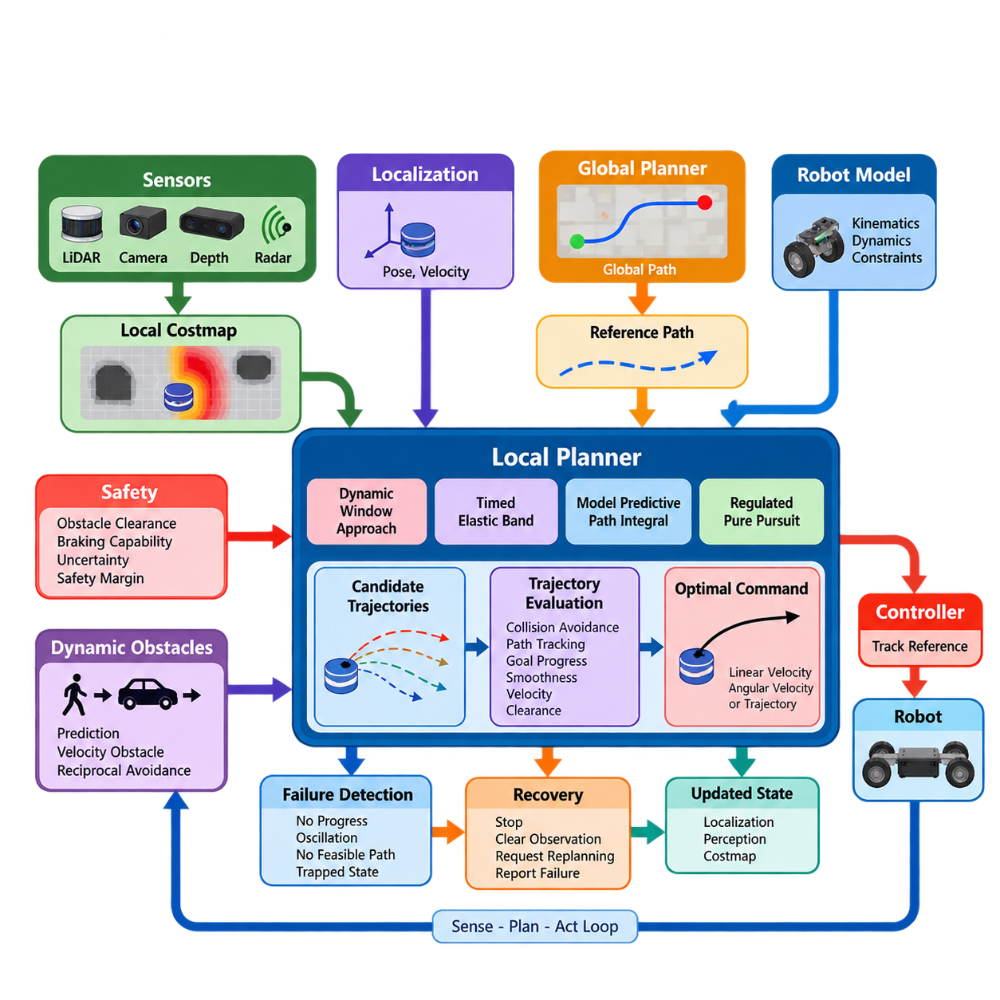
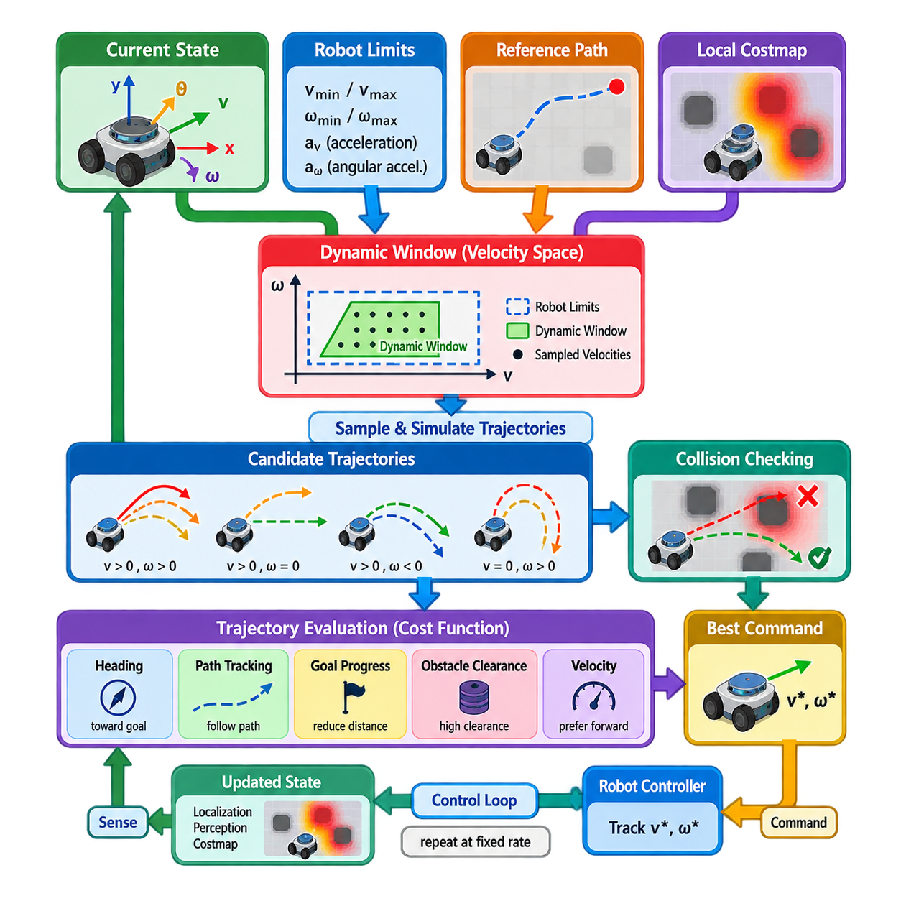
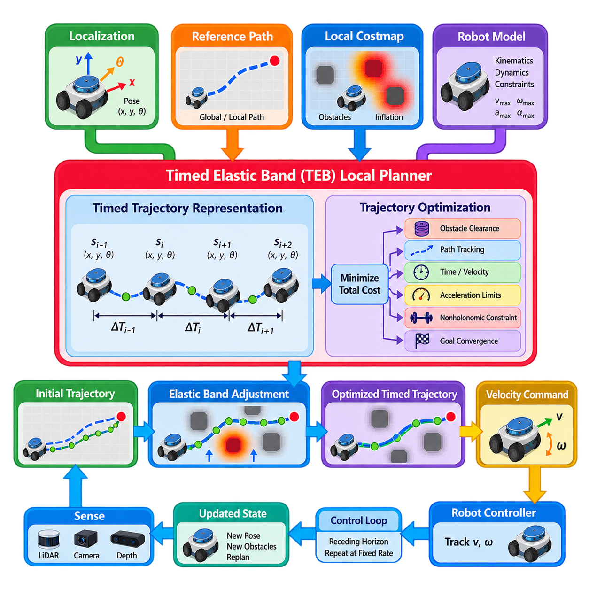
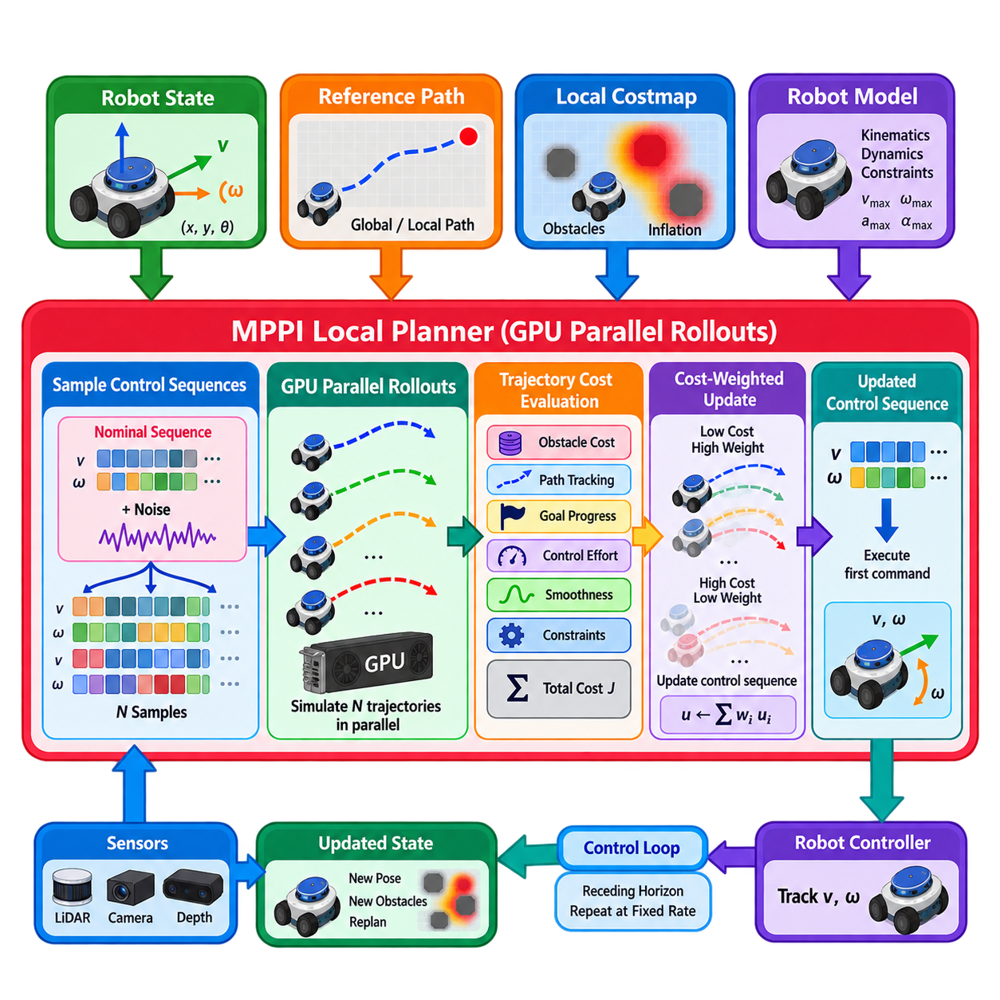
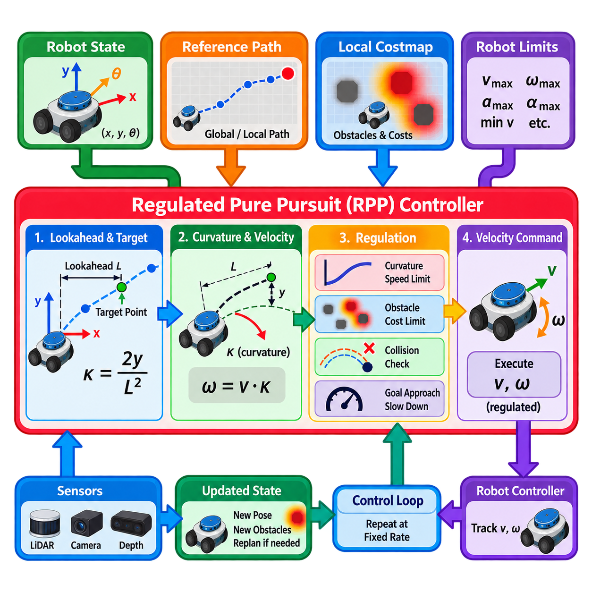
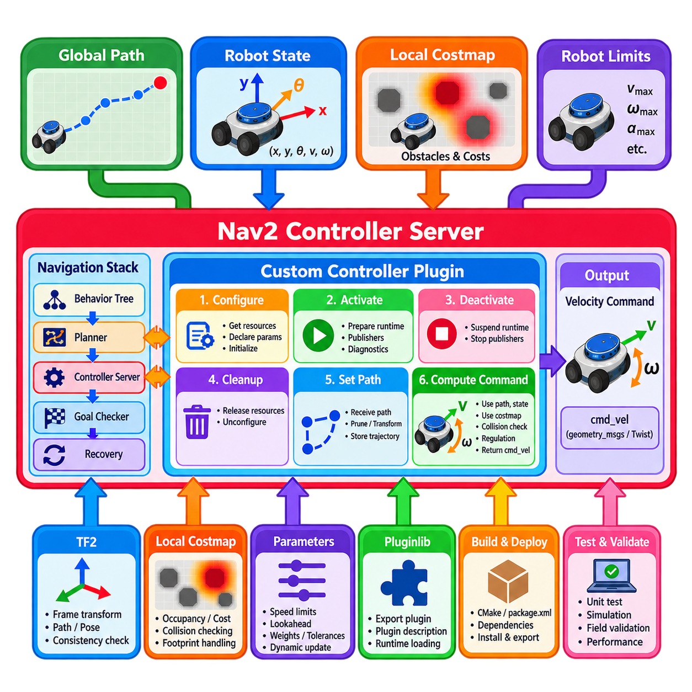
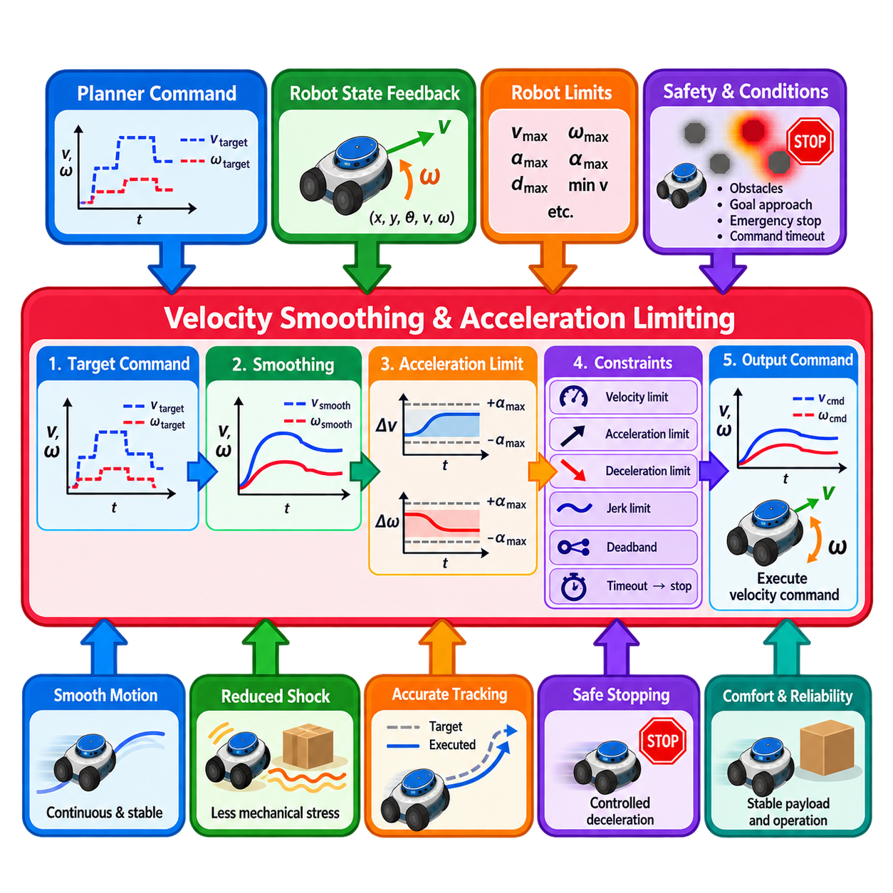
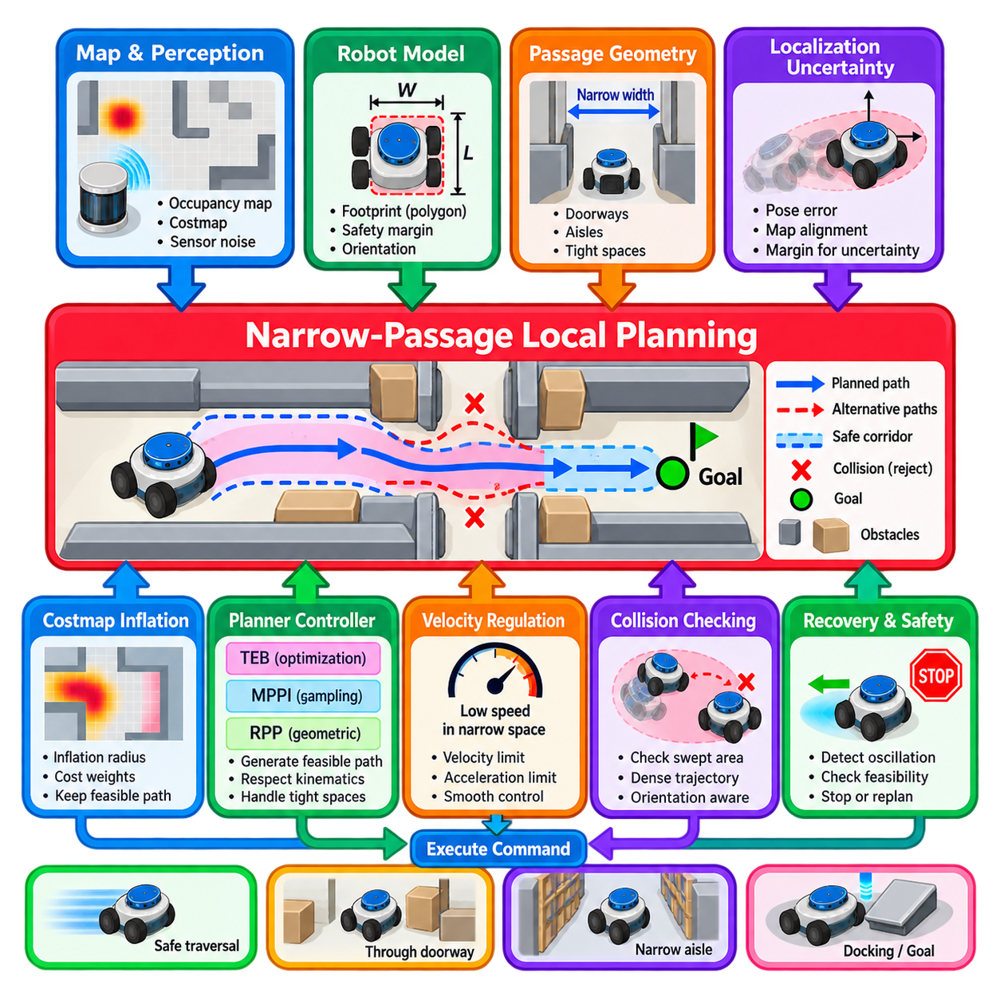
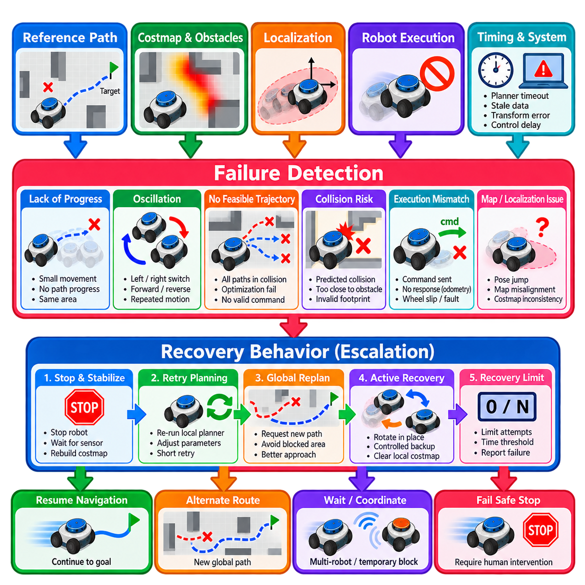
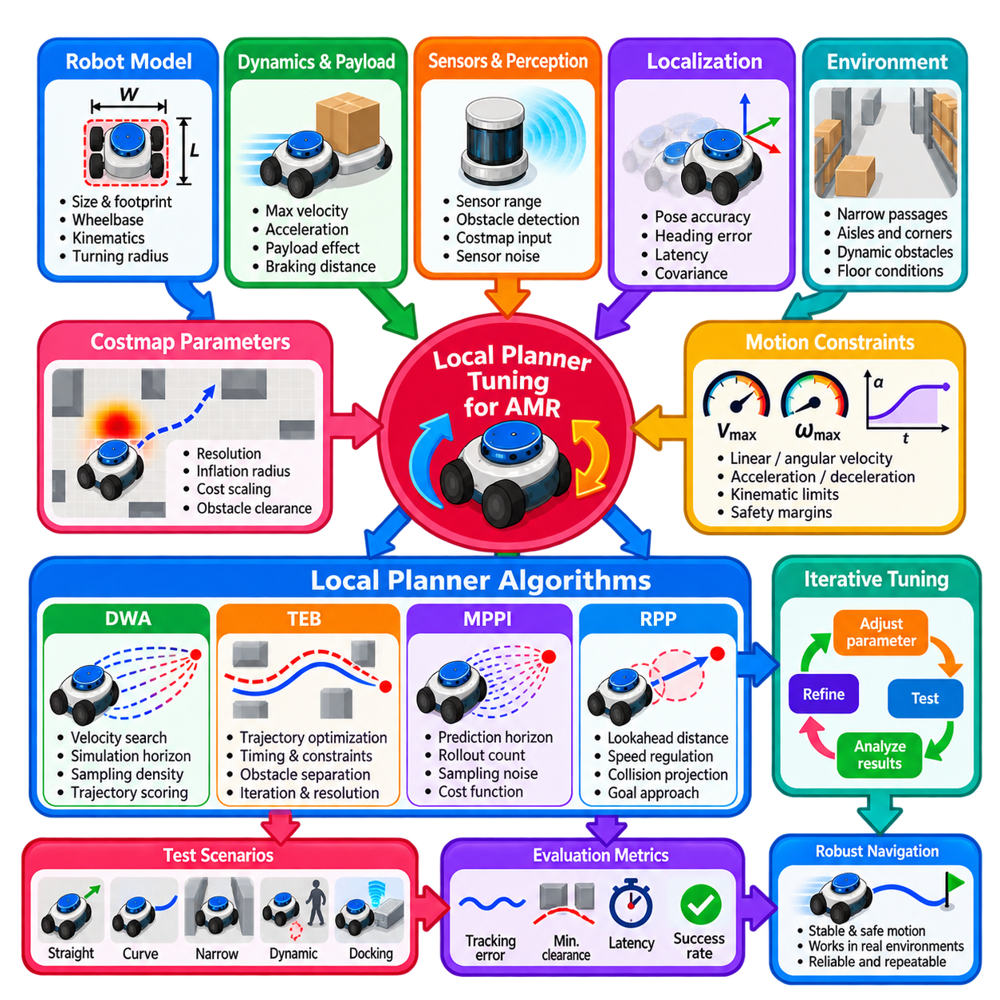

**Volume 15. Motion Planning and Navigation**


# Chapter 05. Local Planners

##  

## 05.01. Local Planner Role and Architecture in Navigation

{width="7.268055555555556in" height="7.268055555555556in"}

A local planner is the navigation component responsible for converting a higher-level path into motion commands that can be executed safely by the robot in the immediate environment. While a global planner determines how the robot should travel from its current region to a distant goal, the local planner operates over a shorter spatial and temporal horizon and continuously adapts the robot motion to current conditions. :chatgpt-content-reference{index="0"}

The distinction between global and local planning is fundamental to practical robot navigation. A global path is normally generated from a relatively large map and represents the desired route through free space. It cannot anticipate every short-term event encountered during execution. The local planner therefore interprets this route together with recent sensor observations and generates feasible commands while attempting to preserve progress toward the global objective.

A typical local-planning architecture receives several categories of information. These include the robot pose and velocity estimated by localization, the reference path supplied by the global planner, obstacles represented in a local costmap, and platform-specific kinematic or dynamic constraints. The planner combines these inputs to evaluate candidate motions and produces a command such as linear and angular velocity or a short executable trajectory.

The local costmap provides the planner with a continuously updated representation of nearby navigable space. Static structures may originate from a global map, while recently detected obstacles are inserted using LiDAR, cameras, depth sensors, radar, or other perception sources. Inflation regions around obstacles represent safety margins and discourage candidate trajectories that pass dangerously close to walls, equipment, people, or other robots.

Local planning is inherently a closed-loop process. After a command is generated, the robot moves only for a short interval before localization, perception, and costmap information are updated again. The planner then solves the motion problem using the new state. This repeated sense-plan-act cycle enables navigation to react to localization errors, imperfect models, unexpected obstacles, wheel slip, changing free space, and deviations from the nominal global path.

A useful architectural view separates reference generation, local trajectory generation, trajectory evaluation, and command execution. The reference path describes where the robot should generally travel. Candidate trajectories describe how it could move during the next short horizon. Evaluation determines which candidate provides the best compromise among collision avoidance, path tracking, goal progress, smoothness, velocity, clearance, and other operational objectives.

Different local planners formulate this decision in different ways. Dynamic Window Approach methods search a constrained velocity space, whereas Timed Elastic Band approaches optimize a locally deformable trajectory. Model Predictive Path Integral methods evaluate many sampled control sequences, and Regulated Pure Pursuit modifies geometric path following according to curvature and environmental constraints. These methods occupy subsequent sections of the chapter structure. :chatgpt-content-reference{index="1"}

Regardless of algorithm, feasibility is essential. A local planner should not request motion that the physical platform cannot execute. Differential-drive robots must respect translational and rotational velocity limits, while Ackermann-steered platforms must consider steering geometry and minimum turning radius. Acceleration, deceleration, jerk, actuator limits, stopping distance, and control latency may also constrain which candidate trajectories can safely become commands.

The relationship between the local planner and low-level controller must therefore be clearly defined. The planner normally operates at a higher abstraction level than motor control and generates velocity references or trajectories rather than direct motor currents or torques. Lower-level control software tracks these references using feedback from encoders, IMUs, steering sensors, or other state measurements, creating a layered architecture from navigation decisions to physical actuation.

Safety modifies the optimization problem rather than existing as an afterthought. A trajectory that makes excellent progress toward the goal is unacceptable if the robot cannot stop before collision. Local planning should therefore consider obstacle clearance, braking capability, uncertainty, command latency, and robot footprint. Conservative margins may be necessary when perception confidence decreases, localization uncertainty increases, or the environment becomes crowded.

Dynamic obstacles create a particularly important architectural boundary. A conventional local costmap can indicate that a location is currently occupied, but safe interaction with moving pedestrians or vehicles may require estimates of velocity and future trajectory. This extends local planning toward explicit dynamic-obstacle avoidance, which the volume treats as a separate chapter containing velocity-obstacle, reciprocal avoidance, prediction-based, and safety-oriented methods. :chatgpt-content-reference{index="2"}

Local planning also involves balancing competing objectives. Staying exactly on the global path may produce unnecessary oscillation when an obstacle temporarily blocks it, while aggressively maximizing clearance may create large detours. High velocity improves mission throughput but reduces reaction and braking margins. Practical planners encode these compromises through costs, weights, constraints, heuristics, or objective functions appropriate to the selected algorithm.

The planner must also recognize situations in which normal command generation is no longer productive. Repeatedly producing near-zero velocity, alternating steering directions, failing to reduce distance to the goal, or finding no collision-free candidate can indicate that the robot is trapped. Robust navigation therefore monitors planner progress and exposes failure conditions to higher-level recovery logic instead of allowing indefinite oscillation or unsafe attempts to escape.

Recovery establishes another important boundary between local and system-level navigation behavior. A local planner may temporarily stop, clear invalid observations, request replanning, or report failure, but broader decisions such as selecting another route or invoking specialized recovery behaviors generally belong to the navigation architecture above it. This separation keeps local motion generation focused while allowing the overall navigation system to manage exceptional situations systematically.

Real-time performance is critical because environmental information becomes stale rapidly. The planner must complete its computation within the control-cycle budget and provide commands at a sufficiently stable rate. Excessively complex optimization can improve trajectory quality yet become counterproductive if computation delays cause the robot to react to outdated states. Local planning architecture therefore balances planning sophistication, horizon length, sampling density, and available compute resources.

The resulting local planner is best understood as the real-time bridge between strategic path planning and physical robot motion. It transforms a geometrically desirable global route into short-horizon, dynamically feasible, collision-aware commands while continuously incorporating feedback from the environment and the robot itself. This role places local planning directly between planning, perception, localization, safety supervision, and motion control within the broader robotics software architecture. :chatgpt-content-reference{index="3"}

로컬 플래너(Local Planner)는 상위 수준 경로(Higher-Level Path)를 로봇이 주변 환경에서 안전하게 실행할 수 있는 모션 명령(Motion Command)으로 변환하는 내비게이션(Navigation) 구성 요소이다. 글로벌 플래너(Global Planner)가 로봇의 현재 영역에서 멀리 떨어진 목표까지 이동하는 방법을 결정하는 반면, 로컬 플래너는 더 짧은 공간적·시간적 범위(Spatial and Temporal Horizon)에서 동작하며 현재 상황에 맞추어 로봇의 움직임을 지속적으로 조정한다.

글로벌 계획(Global Planning)과 로컬 계획(Local Planning)의 구분은 실제 로봇 내비게이션(Robot Navigation)의 기본적인 개념이다. 글로벌 경로(Global Path)는 일반적으로 비교적 넓은 지도(Map)를 기반으로 생성되며 자유 공간(Free Space)을 통과하는 목표 이동 경로를 나타낸다. 그러나 실행 과정에서 발생하는 모든 단기적인 상황을 사전에 예측할 수 없기 때문에 로컬 플래너는 이 경로와 최신 센서 관측(Sensor Observation)을 함께 해석하여 글로벌 목표(Global Objective)를 향한 진행을 유지하면서 실행 가능한 명령을 생성한다.

일반적인 로컬 계획 아키텍처(Local Planning Architecture)는 여러 종류의 정보를 입력으로 사용한다. 여기에는 위치 추정(Localization)을 통해 계산된 로봇 자세(Robot Pose)와 속도(Velocity), 글로벌 플래너가 제공하는 기준 경로(Reference Path), 로컬 코스트맵(Local Costmap)에 표현된 장애물, 그리고 플랫폼별 운동학적·동역학적 제약조건(Kinematic and Dynamic Constraints)이 포함된다. 플래너는 이러한 입력을 결합하여 후보 모션(Candidate Motion)을 평가하고 선속도(Linear Velocity), 각속도(Angular Velocity), 또는 짧은 실행 가능 궤적(Executable Trajectory)과 같은 명령을 생성한다.

로컬 코스트맵(Local Costmap)은 플래너에 주변 주행 가능 공간(Navigable Space)을 지속적으로 갱신하여 제공한다. 정적 구조물(Static Structure)은 글로벌 지도(Global Map)에서 가져올 수 있으며, 최근 탐지된 장애물은 라이다(LiDAR), 카메라(Camera), 깊이 센서(Depth Sensor), 레이더(Radar) 또는 기타 인지 센서(Perception Sensor)를 통해 추가된다. 장애물 주변의 팽창 영역(Inflation Region)은 안전 여유(Safety Margin)를 표현하며 벽, 장비, 사람 또는 다른 로봇에 위험하게 접근하는 후보 궤적을 억제한다.

로컬 계획(Local Planning)은 본질적으로 폐루프 과정(Closed-Loop Process)이다. 명령이 생성된 이후 로봇은 짧은 시간 동안만 이동하고 위치 추정(Localization), 인지(Perception), 코스트맵(Costmap) 정보가 다시 갱신된다. 이후 플래너는 새로운 상태를 이용하여 모션 문제(Motion Problem)를 다시 해결한다. 이러한 반복적인 감지-계획-행동(Sense-Plan-Act) 주기를 통해 위치 추정 오차, 불완전한 모델, 예상하지 못한 장애물, 휠 슬립(Wheel Slip), 변화하는 자유 공간, 기준 글로벌 경로에서의 이탈 등에 대응할 수 있다.

유용한 아키텍처 관점에서는 기준 생성(Reference Generation), 로컬 궤적 생성(Local Trajectory Generation), 궤적 평가(Trajectory Evaluation), 명령 실행(Command Execution)을 분리한다. 기준 경로는 로봇이 전체적으로 어느 방향으로 이동해야 하는지를 나타내며, 후보 궤적(Candidate Trajectory)은 가까운 미래에 로봇이 어떻게 움직일 수 있는지를 나타낸다. 평가는 충돌 회피(Collision Avoidance), 경로 추종(Path Tracking), 목표 진행(Goal Progress), 부드러움(Smoothness), 속도, 장애물 여유 거리(Clearance) 등의 운용 목표 사이에서 가장 적절한 후보를 결정한다.

서로 다른 로컬 플래너(Local Planner)는 이러한 의사결정 문제를 서로 다른 방식으로 구성한다. 동적 윈도우 접근법(Dynamic Window Approach, DWA)은 제한된 속도 공간(Velocity Space)을 탐색하고, 시간 탄성 밴드(Timed Elastic Band, TEB)는 국부적으로 변형 가능한 궤적을 최적화한다. 모델 예측 경로 적분(Model Predictive Path Integral, MPPI)은 다수의 샘플링된 제어 시퀀스(Control Sequence)를 평가하며, 조절 순수 추종(Regulated Pure Pursuit, RPP)은 곡률과 환경 제약조건에 따라 기하학적 경로 추종(Geometric Path Following)을 조절한다.

어떤 알고리즘을 사용하더라도 실행 가능성(Feasibility)은 필수적이다. 로컬 플래너는 실제 플랫폼이 실행할 수 없는 움직임을 요구해서는 안 된다. 차동 구동 로봇(Differential-Drive Robot)은 병진 속도와 회전 속도 제한을 준수해야 하며, 애커먼 조향 플랫폼(Ackermann-Steered Platform)은 조향 기하학(Steering Geometry)과 최소 회전 반경(Minimum Turning Radius)을 고려해야 한다. 가속도(Acceleration), 감속도(Deceleration), 저크(Jerk), 액추에이터 제한(Actuator Limit), 정지 거리(Stopping Distance), 제어 지연(Control Latency) 역시 안전하게 명령으로 전환할 수 있는 후보 궤적을 제한한다.

따라서 로컬 플래너(Local Planner)와 저수준 제어기(Low-Level Controller)의 관계를 명확하게 정의해야 한다. 플래너는 일반적으로 모터 제어(Motor Control)보다 높은 추상화 수준에서 동작하며 모터 전류나 토크를 직접 생성하는 대신 속도 기준값(Velocity Reference)이나 궤적(Trajectory)을 생성한다. 저수준 제어 소프트웨어는 엔코더(Encoder), 관성 측정 장치(Inertial Measurement Unit, IMU), 조향 센서(Steering Sensor) 등의 상태 측정값을 이용하여 이러한 기준값을 추종하며, 내비게이션 의사결정에서 물리적 구동(Physical Actuation)으로 이어지는 계층형 아키텍처(Layered Architecture)를 구성한다.

안전성(Safety)은 사후에 추가되는 기능이 아니라 최적화 문제(Optimization Problem) 자체를 변화시키는 요소이다. 목표를 향해 매우 빠르게 진행하는 궤적이라도 충돌 전에 로봇이 정지할 수 없다면 허용될 수 없다. 따라서 로컬 계획은 장애물 여유 거리(Obstacle Clearance), 제동 능력(Braking Capability), 불확실성(Uncertainty), 명령 지연(Command Latency), 로봇 풋프린트(Robot Footprint)를 고려해야 한다. 인지 신뢰도(Perception Confidence)가 낮아지거나 위치 추정 불확실성이 증가하거나 환경이 혼잡해지는 경우에는 보다 보수적인 안전 여유가 필요할 수 있다.

동적 장애물(Dynamic Obstacle)은 특히 중요한 아키텍처 경계(Architectural Boundary)를 형성한다. 일반적인 로컬 코스트맵(Local Costmap)은 특정 위치가 현재 점유되어 있다는 사실을 나타낼 수 있지만, 이동하는 보행자나 차량과 안전하게 상호작용하려면 속도와 미래 궤적(Future Trajectory)에 대한 추정이 필요할 수 있다. 이에 따라 로컬 계획은 속도 장애물(Velocity Obstacle), 상호 충돌 회피(Reciprocal Avoidance), 예측 기반 회피(Prediction-Based Avoidance), 안전 중심 기법(Safety-Oriented Method) 등을 포함하는 명시적인 동적 장애물 회피(Dynamic Obstacle Avoidance) 영역으로 확장된다.

로컬 계획(Local Planning)은 서로 경쟁하는 여러 목표 사이의 균형도 다루어야 한다. 글로벌 경로(Global Path)를 지나치게 정확하게 추종하면 장애물이 일시적으로 경로를 차단했을 때 불필요한 진동(Oscillation)이 발생할 수 있으며, 장애물과의 여유 거리를 지나치게 크게 유지하면 불필요한 우회가 발생할 수 있다. 높은 속도는 임무 처리량(Mission Throughput)을 향상시키지만 반응 및 제동 여유를 감소시킨다. 실제 플래너는 선택된 알고리즘에 적합한 비용(Cost), 가중치(Weight), 제약조건(Constraint), 휴리스틱(Heuristic), 목적함수(Objective Function)를 통해 이러한 상충관계를 표현한다.

플래너는 정상적인 명령 생성이 더 이상 효과적이지 않은 상황도 인식해야 한다. 거의 0에 가까운 속도를 반복적으로 생성하거나, 조향 방향이 지속적으로 반전되거나, 목표까지의 거리가 감소하지 않거나, 충돌 없는 후보를 찾지 못하는 경우 로봇이 교착 상태(Trapped State)에 빠졌음을 의미할 수 있다. 따라서 견고한 내비게이션(Robust Navigation)은 플래너의 진행 상태를 감시하고 무한한 진동이나 위험한 탈출 시도를 허용하는 대신 실패 상태(Failure Condition)를 상위 수준 복구 로직(Recovery Logic)에 전달한다.

복구(Recovery)는 로컬 계획과 시스템 수준 내비게이션(System-Level Navigation) 사이의 또 다른 중요한 경계를 형성한다. 로컬 플래너는 일시적으로 정지하거나, 잘못된 관측 정보를 제거하거나, 재계획(Replanning)을 요청하거나, 실패를 보고할 수 있다. 그러나 다른 경로를 선택하거나 특수한 복구 행동(Recovery Behavior)을 실행하는 것과 같은 더 광범위한 결정은 일반적으로 상위 내비게이션 아키텍처가 담당한다. 이러한 분리를 통해 로컬 모션 생성(Local Motion Generation)은 본래 기능에 집중하면서 전체 내비게이션 시스템은 예외 상황을 체계적으로 관리할 수 있다.

환경 정보(Environmental Information)는 빠르게 오래된 정보가 되기 때문에 실시간 성능(Real-Time Performance)이 매우 중요하다. 플래너는 제어 주기(Control Cycle)의 계산 시간 예산 내에서 처리를 완료하고 충분히 안정적인 주기로 명령을 제공해야 한다. 복잡한 최적화는 궤적 품질(Trajectory Quality)을 향상시킬 수 있지만 계산 지연으로 인해 로봇이 오래된 상태 정보에 반응하게 된다면 오히려 성능을 저하시킬 수 있다. 따라서 로컬 계획 아키텍처는 계획 복잡도(Planning Sophistication), 계획 범위(Horizon Length), 샘플링 밀도(Sampling Density), 가용 연산 자원(Available Compute Resource) 사이에서 균형을 유지해야 한다.

결과적으로 로컬 플래너(Local Planner)는 전략적인 경로 계획(Strategic Path Planning)과 실제 로봇 모션(Physical Robot Motion)을 연결하는 실시간 연결 계층(Real-Time Bridge)으로 이해할 수 있다. 로컬 플래너는 기하학적으로 바람직한 글로벌 경로를 짧은 계획 범위의 동역학적으로 실행 가능하고 충돌을 고려한 명령으로 변환하면서 환경과 로봇 자체에서 얻는 피드백을 지속적으로 반영한다. 이러한 역할로 인해 로컬 계획은 전체 로봇 소프트웨어 아키텍처에서 계획(Planning), 인지(Perception), 위치 추정(Localization), 안전 감독(Safety Supervision), 모션 제어(Motion Control)를 직접 연결하는 핵심 구성 요소가 된다.

##  

## 05.02. Dynamic Window Approach DWA Implementation [w/Code]

{width="7.268055555555556in" height="7.268055555555556in"}

The Dynamic Window Approach (DWA) is a real-time local planning method that selects robot motion directly in velocity space rather than first constructing a complete geometric trajectory. It is particularly suitable for mobile robots that must follow a reference path while reacting quickly to nearby obstacles. The central idea is to restrict the search to velocities that are dynamically reachable during the next control interval and then choose the safest and most useful command.

DWA begins with the robot's current motion state, typically represented by translational velocity \\(v\\) and angular velocity \\(\\omega\\). The robot cannot instantaneously change these values because motors, wheels, drivetrain components, and controllers impose acceleration limits. The dynamic window therefore contains only velocity pairs that can be reached from the current state within a short time interval while respecting maximum acceleration, deceleration, and velocity constraints.

The complete velocity space is first bounded by the physical capabilities of the platform. For a differential-drive AMR, this normally includes minimum and maximum linear velocity, maximum rotational velocity, linear acceleration limits, and angular acceleration limits. These physical bounds are intersected with the dynamically reachable region calculated from the current velocity. The resulting window substantially reduces the number of commands that must be evaluated during each control cycle.

Each candidate pair \\((v,\\omega)\\) represents a possible short-term robot motion. Assuming the selected velocities remain approximately constant over a prediction interval, the planner forward-simulates the robot state using its kinematic model. For a differential-drive platform, the resulting motion is normally a straight line when angular velocity approaches zero and a circular arc when angular velocity is nonzero. Sampling many velocity pairs therefore generates a collection of candidate local trajectories.

Trajectory simulation should use the same robot motion assumptions that are relevant to actual execution. A common discrete model propagates pose using \\(x_{k+1}=x_k+v\\cos(\\theta_k)\\Delta t\\), \\(y_{k+1}=y_k+v\\sin(\\theta_k)\\Delta t\\), and \\(\\theta_{k+1}=\\theta_k+\\omega\\Delta t\\). Repeating these equations across the prediction horizon creates a sequence of future poses that can be checked against obstacles and evaluated relative to the navigation objective.

Collision checking eliminates unsafe candidates before final command selection. Every simulated pose should be evaluated using the robot footprint rather than treating the platform as an ideal point whenever practical. The footprint may be circular, rectangular, polygonal, or conservatively approximated. Candidate trajectories intersecting occupied or prohibited costmap regions are rejected, while obstacle clearance can additionally be incorporated into the trajectory score.

Stopping capability is another important part of safe DWA implementation. A velocity may be collision-free over the immediate simulated trajectory but still be unsafe if the robot cannot decelerate before reaching an obstacle. An admissible command should therefore provide sufficient stopping distance under the assumed braking capability. This relationship becomes increasingly important as maximum velocity rises because braking distance grows rapidly while perception, computation, and actuator delays consume part of the available safety margin.

After invalid candidates are removed, DWA evaluates the remaining trajectories using an objective function. Typical terms measure progress toward the local or global goal, alignment with the reference path, distance from obstacles, and preference for useful forward velocity. A conceptual score can be expressed as a weighted combination of heading, path adherence, goal progress, clearance, and velocity. The candidate receiving the best valid score becomes the command for the current control cycle.

The weights in the scoring function determine much of the observable navigation behavior. Excessive emphasis on path alignment can cause the robot to resist temporary deviations around obstacles, while excessive clearance weighting may produce unnecessarily wide detours. Strong velocity preference can improve throughput but reduce maneuvering margins in constrained spaces. Effective DWA tuning therefore requires considering the interactions among weights rather than optimizing each parameter independently.

Prediction horizon and sampling resolution also create important engineering tradeoffs. A short horizon reduces computation and enables rapid reactions, but it can produce locally attractive commands that lead toward dead ends or poor approach angles. A longer horizon provides greater foresight but increases computation and depends more strongly on motion assumptions. Similarly, dense velocity sampling can improve command quality while increasing the number of trajectories that must be simulated and checked.

The implementation can be organized as a repeated control loop. The planner obtains the latest robot pose, current velocity, reference path, and local obstacle representation; computes the dynamic window; samples reachable velocity commands; predicts trajectories; rejects collisions and inadmissible motions; scores the surviving candidates; and publishes the best command. At the next cycle, the entire process is repeated using updated localization and perception information.

Efficient implementation is important because trajectory generation and collision checking may be executed hundreds or thousands of times per second across candidate samples. Precomputed footprint information, efficient costmap access, early collision termination, vectorized trajectory calculations, and carefully selected sampling density can reduce computation. The goal is not simply to evaluate the largest possible number of trajectories, but to obtain reliable commands within a deterministic control-time budget.

DWA can exhibit characteristic failure modes in difficult environments. The robot may oscillate between similar left and right turns, become trapped near concave obstacles, stop because all sampled commands receive poor scores, or repeatedly prefer locally safe motions that do not produce meaningful global progress. These limitations arise because DWA primarily solves a short-horizon local decision problem and does not replace the global planner's responsibility for route-level reasoning.

Narrow corridors and doorways require particularly careful parameterization. Large inflation costs or excessive obstacle-clearance preference can make a geometrically traversable passage appear unattractive, while aggressive settings may place the robot too close to walls. Low-speed sampling, rotational behavior, footprint accuracy, localization uncertainty, and sensor noise all influence performance. Testing should therefore reproduce the actual robot geometry and expected environmental tolerances.

Dynamic obstacles introduce additional limitations because basic DWA commonly evaluates obstacle occupancy using a local representation without explicitly reasoning about long-term human or vehicle motion. Frequently updated sensor observations allow reactive avoidance, but a moving obstacle may require velocity estimation and trajectory prediction for more anticipatory behavior. Such functionality can complement DWA through dedicated dynamic-obstacle prediction or higher-level safety mechanisms.

For production AMRs, tuning should begin from verified physical limits rather than arbitrary planner parameters. Maximum velocity, acceleration, deceleration, rotational rate, footprint dimensions, braking behavior, and controller response should reflect measured platform characteristics. Navigation-quality parameters can then be adjusted systematically using repeatable scenarios such as straight corridors, ninety-degree turns, doorways, obstacle bypass, goal approach, and emergency stopping conditions.

Logging is essential during implementation and tuning. Useful data include the dynamic window bounds, sampled commands, rejected trajectories, individual cost terms, selected velocity, obstacle distance, current pose, controller frequency, and computation time. Visualizing candidate trajectories and their scores often reveals problems that are difficult to diagnose from robot motion alone, such as excessive path bias, incorrect footprint configuration, or inadequate angular-velocity sampling.

DWA ultimately provides a compact connection between local motion planning and executable velocity control. By searching only dynamically reachable commands, predicting their short-term consequences, rejecting unsafe trajectories, and ranking feasible alternatives, it converts the reference path and current environment into immediate robot motion. Its effectiveness depends not only on the algorithm itself but also on accurate robot models, reliable costmaps, realistic safety constraints, disciplined parameter tuning, and stable real-time execution.

동적 윈도우 접근법(Dynamic Window Approach, DWA)은 먼저 완전한 기하학적 궤적(Geometric Trajectory)을 생성하는 대신 속도 공간(Velocity Space)에서 직접 로봇의 움직임을 선택하는 실시간 로컬 계획(Real-Time Local Planning) 방법이다. 이 방법은 기준 경로(Reference Path)를 추종하면서 주변 장애물에 빠르게 대응해야 하는 이동 로봇(Mobile Robot)에 특히 적합하다. 핵심 개념은 탐색 범위를 다음 제어 주기(Control Interval) 동안 동역학적으로 도달 가능한 속도로 제한한 후 가장 안전하고 유용한 명령을 선택하는 것이다.

DWA는 일반적으로 병진 속도(Translational Velocity) \\(v\\)와 각속도(Angular Velocity) \\(\\omega\\)로 표현되는 로봇의 현재 운동 상태(Motion State)에서 시작한다. 모터, 휠, 구동계(Drivetrain), 제어기(Controller)가 가속도 제한을 가지므로 로봇은 이러한 값을 순간적으로 변경할 수 없다. 따라서 동적 윈도우(Dynamic Window)는 최대 가속도, 감속도 및 속도 제약조건을 만족하면서 짧은 시간 간격 내에 현재 상태에서 도달할 수 있는 속도 쌍만 포함한다.

전체 속도 공간(Velocity Space)은 먼저 플랫폼의 물리적 성능에 의해 제한된다. 차동 구동 자율이동로봇(Differential-Drive AMR)의 경우 일반적으로 최소 및 최대 선속도(Linear Velocity), 최대 회전 속도(Rotational Velocity), 선형 가속도 제한(Linear Acceleration Limit), 각가속도 제한(Angular Acceleration Limit)이 포함된다. 이러한 물리적 범위와 현재 속도에서 동적으로 도달 가능한 영역을 교차시키면 각 제어 주기에서 평가해야 하는 명령의 수를 크게 줄일 수 있다.

각 후보 속도 쌍(Candidate Velocity Pair) \\((v,\\omega)\\)은 가능한 단기 로봇 모션(Short-Term Robot Motion)을 나타낸다. 선택된 속도가 예측 구간(Prediction Interval) 동안 거의 일정하게 유지된다고 가정하면 플래너는 로봇의 운동학 모델(Kinematic Model)을 사용하여 상태를 순방향 시뮬레이션(Forward Simulation)한다. 차동 구동 플랫폼에서는 각속도가 0에 가까우면 직선 운동이 발생하고, 각속도가 0이 아니면 일반적으로 원호(Circular Arc)를 따라 움직인다. 따라서 다양한 속도 쌍을 샘플링하면 여러 후보 로컬 궤적(Candidate Local Trajectory)을 생성할 수 있다.

궤적 시뮬레이션(Trajectory Simulation)은 실제 실행에 적합한 로봇 운동 가정(Motion Assumption)을 사용해야 한다. 일반적인 이산 모델(Discrete Model)은 \\(x_{k+1}=x_k+v\\cos(\\theta_k)\\Delta t\\), \\(y_{k+1}=y_k+v\\sin(\\theta_k)\\Delta t\\), \\(\\theta_{k+1}=\\theta_k+\\omega\\Delta t\\)를 사용하여 자세를 전파한다. 이러한 식을 예측 범위(Prediction Horizon) 전체에 반복 적용하면 장애물과의 충돌 여부를 확인하고 내비게이션 목표와 비교하여 평가할 수 있는 미래 자세(Future Pose)의 시퀀스를 생성할 수 있다.

충돌 검사(Collision Checking)는 최종 명령을 선택하기 전에 안전하지 않은 후보를 제거한다. 가능한 경우 모든 시뮬레이션 자세는 로봇을 이상적인 점(Point)으로 취급하는 대신 실제 로봇 풋프린트(Robot Footprint)를 이용하여 평가해야 한다. 풋프린트는 원형, 직사각형, 다각형 또는 보수적인 근사 형태로 표현할 수 있다. 점유 영역이나 금지된 코스트맵(Costmap) 영역과 교차하는 후보 궤적은 제거되며 장애물 여유 거리(Obstacle Clearance)를 궤적 점수에 추가할 수도 있다.

정지 능력(Stopping Capability) 역시 안전한 DWA 구현에서 중요한 요소이다. 특정 속도가 즉각적인 시뮬레이션 궤적에서는 충돌하지 않더라도 장애물에 도달하기 전에 로봇이 감속할 수 없다면 안전하지 않을 수 있다. 따라서 허용 가능한 명령(Admissible Command)은 가정된 제동 능력(Braking Capability)을 기준으로 충분한 정지 거리(Stopping Distance)를 확보해야 한다. 최대 속도가 증가할수록 제동 거리가 빠르게 증가하고 인지, 계산 및 액추에이터 지연이 사용 가능한 안전 여유를 감소시키므로 이러한 관계는 더욱 중요해진다.

유효하지 않은 후보가 제거되면 DWA는 목적함수(Objective Function)를 사용하여 남아 있는 궤적을 평가한다. 일반적인 평가 항목에는 로컬 또는 글로벌 목표를 향한 진행 정도, 기준 경로와의 정렬, 장애물과의 거리, 유효한 전진 속도에 대한 선호도가 포함된다. 개념적인 점수는 방향 정렬(Heading), 경로 추종(Path Adherence), 목표 진행(Goal Progress), 여유 거리(Clearance), 속도(Velocity)의 가중 결합으로 표현할 수 있으며 가장 높은 유효 점수를 얻은 후보가 현재 제어 주기의 명령으로 선택된다.

점수 함수(Scoring Function)의 가중치(Weight)는 실제 내비게이션 동작의 상당 부분을 결정한다. 경로 정렬에 지나치게 높은 비중을 두면 로봇이 장애물을 우회하기 위한 일시적인 경로 이탈을 거부할 수 있으며, 장애물 여유 거리에 지나치게 높은 가중치를 부여하면 불필요하게 큰 우회가 발생할 수 있다. 속도를 지나치게 선호하면 처리량(Throughput)은 증가하지만 제한된 공간에서의 기동 여유가 감소한다. 따라서 효과적인 DWA 튜닝(Tuning)은 각각의 파라미터를 독립적으로 최적화하기보다 가중치 사이의 상호작용을 고려해야 한다.

예측 범위(Prediction Horizon)와 샘플링 해상도(Sampling Resolution) 역시 중요한 공학적 상충관계(Engineering Tradeoff)를 만든다. 짧은 예측 범위는 계산량을 줄이고 빠른 반응을 가능하게 하지만 막다른 공간이나 좋지 않은 접근 각도로 이어지는 국부적으로 매력적인 명령을 선택할 수 있다. 긴 예측 범위는 더 넓은 미래 상황을 고려할 수 있지만 계산량이 증가하고 운동 모델의 가정에 더 크게 의존한다. 마찬가지로 조밀한 속도 샘플링은 명령 품질을 향상시킬 수 있지만 시뮬레이션하고 검사해야 하는 궤적 수를 증가시킨다.

구현은 반복적인 제어 루프(Control Loop) 형태로 구성할 수 있다. 플래너는 최신 로봇 자세, 현재 속도, 기준 경로, 로컬 장애물 표현(Local Obstacle Representation)을 가져온 후 동적 윈도우를 계산하고 도달 가능한 속도 명령을 샘플링한다. 이후 궤적을 예측하고 충돌하거나 허용할 수 없는 모션을 제거하며 남은 후보에 점수를 부여한 다음 최적 명령을 출력한다. 다음 제어 주기에서는 갱신된 위치 추정 및 인지 정보를 사용하여 전체 과정을 다시 반복한다.

효율적인 구현(Efficient Implementation)은 후보 샘플 전체에서 궤적 생성과 충돌 검사가 초당 수백 또는 수천 번 수행될 수 있기 때문에 중요하다. 사전 계산된 풋프린트 정보(Precomputed Footprint Information), 효율적인 코스트맵 접근, 충돌 발견 시 조기 종료(Early Collision Termination), 벡터화된 궤적 계산(Vectorized Trajectory Calculation), 적절한 샘플링 밀도 선택을 통해 계산량을 줄일 수 있다. 목표는 가능한 한 많은 궤적을 평가하는 것이 아니라 결정론적인 제어 시간 예산(Deterministic Control-Time Budget) 내에서 신뢰할 수 있는 명령을 얻는 것이다.

DWA는 어려운 환경에서 특징적인 실패 모드(Failure Mode)를 보일 수 있다. 로봇이 비슷한 좌회전과 우회전 사이에서 진동(Oscillation)하거나, 오목한 장애물(Concave Obstacle) 주변에서 갇히거나, 모든 샘플 명령이 낮은 점수를 받아 정지하거나, 글로벌 진행에 실질적으로 기여하지 않는 국부적으로 안전한 움직임을 반복적으로 선택할 수 있다. 이러한 한계는 DWA가 기본적으로 짧은 예측 범위의 로컬 의사결정 문제를 해결하며 경로 수준의 추론(Route-Level Reasoning)을 담당하는 글로벌 플래너(Global Planner)를 대체하지 않기 때문에 발생한다.

좁은 복도(Narrow Corridor)와 출입구(Doorway)에서는 특히 세심한 파라미터 설정(Parameterization)이 필요하다. 큰 팽창 비용(Inflation Cost)이나 과도한 장애물 여유 거리 선호는 기하학적으로 통과 가능한 통로를 매력적이지 않은 경로로 판단하게 만들 수 있으며, 반대로 공격적인 설정은 로봇을 벽에 지나치게 가깝게 이동시킬 수 있다. 저속 샘플링(Low-Speed Sampling), 회전 동작, 풋프린트 정확도, 위치 추정 불확실성, 센서 노이즈 모두 성능에 영향을 미치므로 실제 로봇 형상과 예상 환경 허용 오차를 반영하여 시험해야 한다.

동적 장애물(Dynamic Obstacle)은 추가적인 한계를 발생시킨다. 기본적인 DWA는 일반적으로 로컬 환경 표현에서 장애물의 현재 점유 상태를 평가하며 사람이나 차량의 장기적인 움직임을 명시적으로 추론하지 않는다. 빈번하게 갱신되는 센서 관측을 통해 반응형 회피(Reactive Avoidance)는 가능하지만 이동 장애물에 대해 더 선제적으로 대응하려면 속도 추정(Velocity Estimation)과 궤적 예측(Trajectory Prediction)이 필요할 수 있다. 이러한 기능은 전용 동적 장애물 예측이나 상위 수준 안전 메커니즘과 결합하여 DWA를 보완할 수 있다.

양산 자율이동로봇(Production AMR)의 경우 튜닝은 임의의 플래너 파라미터가 아니라 검증된 물리적 한계(Physical Limit)에서 시작해야 한다. 최대 속도, 가속도, 감속도, 회전 속도, 풋프린트 치수, 제동 특성, 제어기 응답은 실제 측정된 플랫폼 특성을 반영해야 한다. 이후 직선 복도, 90도 회전, 출입구 통과, 장애물 우회, 목표 접근, 비상 정지 조건과 같은 반복 가능한 시나리오를 이용하여 내비게이션 품질 관련 파라미터를 체계적으로 조정할 수 있다.

구현 및 튜닝 과정에서는 로깅(Logging)이 필수적이다. 유용한 데이터에는 동적 윈도우 범위, 샘플링된 명령, 제거된 궤적, 개별 비용 항목(Cost Term), 선택된 속도, 장애물 거리, 현재 자세, 제어기 주기(Controller Frequency), 계산 시간이 포함된다. 후보 궤적과 각각의 점수를 시각화하면 과도한 경로 편향(Path Bias), 잘못된 풋프린트 설정, 부족한 각속도 샘플링처럼 로봇의 움직임만 관찰해서는 진단하기 어려운 문제를 발견하는 데 도움이 된다.

궁극적으로 DWA는 로컬 모션 계획(Local Motion Planning)과 실행 가능한 속도 제어(Executable Velocity Control)를 연결하는 간결한 방법을 제공한다. 동역학적으로 도달 가능한 명령만 탐색하고, 그 명령의 단기적인 결과를 예측하며, 안전하지 않은 궤적을 제거하고, 실행 가능한 대안을 평가함으로써 기준 경로와 현재 환경을 즉각적인 로봇 모션으로 변환한다. DWA의 효과는 알고리즘 자체뿐만 아니라 정확한 로봇 모델(Robot Model), 신뢰할 수 있는 코스트맵, 현실적인 안전 제약조건(Safety Constraint), 체계적인 파라미터 튜닝, 안정적인 실시간 실행(Real-Time Execution)에 의해 결정된다.

##  

## 05.03. Timed Elastic Band TEB Local Planner [w/Code]

{width="7.268055555555556in" height="7.268055555555556in"}

The Timed Elastic Band (TEB) local planner formulates local navigation as a trajectory optimization problem in which both robot poses and the time intervals between them are optimized. Instead of selecting only an instantaneous velocity command, TEB represents the future motion as a sequence of spatial configurations connected by temporal intervals. This allows geometric path shape, velocity, acceleration, obstacle clearance, and travel time to be considered within one optimization framework.

The term elastic band describes the intuitive behavior of the trajectory representation. A path can be imagined as a deformable band stretched from the robot toward a local goal. Obstacles push the band away from unsafe regions, while path-following and goal-related objectives pull it toward desirable configurations. Unlike a purely geometric elastic band, TEB additionally associates time differences with consecutive poses, enabling the optimizer to reason about how quickly the robot should move along each segment.

A typical timed elastic band consists of robot poses \\(s_i=(x_i,y_i,\\theta_i)\\) and time differences \\(\\Delta T_i\\) between neighboring poses. Together they define a discretized trajectory through space and time. Changing a pose modifies the geometry of the trajectory, while changing a time interval modifies the implied velocity and acceleration. Optimization can therefore reshape the path and modify its timing simultaneously rather than treating trajectory generation and velocity assignment as completely separate stages.

The global or reference path normally provides the initial geometric guidance for TEB. A portion of this path near the robot is transformed into an initial local trajectory, which is then adapted according to current obstacle observations and robot constraints. Because the previous optimized trajectory can often be reused and updated during the next control cycle, TEB supports continuous receding-horizon operation rather than repeatedly solving every local planning problem from an entirely new initialization.

Trajectory discretization strongly influences planner behavior and computational cost. If neighboring poses become too widely separated, additional poses can be inserted to preserve sufficient spatial and temporal resolution. Conversely, unnecessary poses may be removed when the trajectory becomes excessively dense. Maintaining an appropriate number of states allows the optimizer to represent turns and obstacle avoidance accurately while preventing the optimization problem from growing unnecessarily large.

TEB expresses navigation requirements as optimization costs or constraints connecting trajectory variables. Obstacle terms penalize insufficient clearance, while velocity and acceleration terms discourage motions exceeding platform limits. Additional terms can encourage short travel time, smooth rotation, nonholonomic motion, preferred turning behavior, and convergence toward the goal. The resulting problem seeks a trajectory that provides a useful compromise among these simultaneously competing requirements.

Obstacle handling is one of the central functions of the planner. Each trajectory pose or relevant segment is evaluated relative to obstacles represented by the local environment model. When the trajectory approaches an obstacle too closely, the corresponding penalty increases and optimization pushes the band toward safer free space. Robot footprint geometry must be represented appropriately because collision-free motion for a point robot does not guarantee collision-free motion for a physical AMR with finite width and length.

Kinematic feasibility is incorporated directly into trajectory optimization. A differential-drive robot cannot normally translate sideways, so neighboring poses should satisfy nonholonomic motion relationships. An Ackermann-steered vehicle introduces steering and turning-radius constraints, while other platforms may permit omnidirectional movement. Configuring the correct motion model prevents the optimizer from producing geometrically attractive trajectories that cannot be followed by the actual robot.

Temporal optimization distinguishes TEB from local planners that primarily search geometric paths. Given displacement between neighboring poses and the associated \\(\\Delta T_i\\), the planner can estimate translational and rotational velocities. Consecutive segments similarly provide information about acceleration. If these values exceed configured limits, penalties influence the optimizer to modify either the spatial trajectory, the timing, or both until a more dynamically feasible solution is obtained.

Travel time can also be incorporated into the objective. Reducing the sum of time intervals encourages efficient motion toward the goal, but minimizing time too aggressively may conflict with obstacle clearance, smoothness, or dynamic constraints. TEB therefore operates as a multi-objective optimization process in which fast traversal is balanced against safety and feasibility. Parameter weights determine how strongly the optimizer values each of these competing properties.

A practical TEB implementation repeatedly updates the local trajectory using current localization, reference-path, and obstacle information. The optimizer performs several iterations, calculates a locally improved timed trajectory, and extracts an executable velocity command from its initial portion. The robot controller applies this command, new sensor information arrives, and the optimization is repeated. TEB therefore remains a closed-loop local planner even though its internal representation covers multiple future states.

Many implementations formulate the optimization as a sparse graph. Robot poses and time differences become optimization variables, while constraints and objective terms become edges connecting the relevant variables. Because individual constraints usually depend on only a small subset of trajectory states, the resulting system has exploitable sparsity. This structure allows nonlinear trajectory optimization to be performed repeatedly within the computational limits of mobile-robot navigation.

TEB can also reason about alternative ways of passing obstacles. Two trajectories that travel around opposite sides of an obstacle may belong to different topological classes and cannot always be transformed smoothly into one another without crossing the obstacle. Implementations supporting homotopy-class planning can maintain several topologically distinct candidate trajectories, optimize them independently, and select the most appropriate solution according to cost and feasibility.

This multi-trajectory capability can improve navigation around large obstacles, corridor junctions, or environments where an initially selected side becomes inefficient. However, evaluating several candidate classes increases computation and may introduce switching behavior when alternatives have similar costs. Practical configuration therefore requires balancing topological exploration against execution stability, particularly when the robot operates in structured industrial environments with predictable traffic patterns.

Dynamic obstacles can be incorporated by associating obstacle positions with time and evaluating the timed trajectory against predicted obstacle motion. This is conceptually well matched to TEB because the robot trajectory already contains temporal information. Nevertheless, performance depends strongly on the quality of obstacle tracking and prediction. Incorrect velocity estimates or rapidly changing human behavior can invalidate predicted interactions, requiring frequent replanning and additional safety supervision.

TEB behavior is sensitive to parameter configuration because many objectives interact through the same optimization problem. Minimum obstacle distance, inflation distance, maximum translational and rotational velocity, acceleration limits, preferred turning radius, trajectory resolution, optimization iterations, and cost weights can all affect the final motion. Changing one parameter may alter several observable behaviors, so systematic tuning is more reliable than adjusting isolated values in response to individual failures.

Narrow passages illustrate these interactions clearly. A robot may physically fit through a doorway, yet conservative obstacle distance, inaccurate footprint dimensions, localization uncertainty, or costmap inflation can prevent the optimizer from finding a satisfactory trajectory. Reducing safety margins indiscriminately is not an appropriate solution. The underlying robot geometry, map accuracy, sensor uncertainty, controller tracking error, and required operational clearance should first be validated together.

Failure detection remains necessary even with trajectory optimization. The optimizer may fail to converge, produce a trajectory with unacceptable cost, repeatedly generate negligible forward progress, or oscillate between alternative solutions. The navigation system should detect these conditions and initiate appropriate responses such as stopping, requesting global replanning, clearing invalid environmental observations, changing recovery behavior, or reporting that the local navigation problem is temporarily infeasible.

For production AMRs, evaluation should combine numerical optimization metrics with physical navigation tests. Useful measurements include optimization time, control frequency, minimum obstacle clearance, path deviation, velocity and acceleration profiles, goal approach accuracy, oscillation frequency, and success rate through constrained environments. Logging the optimized band and individual cost terms helps identify whether undesirable behavior originates from obstacle penalties, dynamic limits, topology selection, or trajectory discretization.

TEB ultimately provides a structured method for transforming a reference path into a short-horizon trajectory that is simultaneously geometric, temporal, and dynamically constrained. Its strength lies in optimizing where the robot should move and how that motion should evolve over time within the same representation. When combined with accurate footprint models, reliable perception, realistic platform constraints, disciplined tuning, and robust failure handling, it can provide smooth and responsive local navigation for mobile robots.

시간 탄성 밴드(Timed Elastic Band, TEB) 로컬 플래너(Local Planner)는 로봇 자세(Robot Pose)와 자세 사이의 시간 간격(Time Interval)을 동시에 최적화하는 궤적 최적화 문제(Trajectory Optimization Problem)로 로컬 내비게이션(Local Navigation)을 구성한다. TEB는 순간적인 속도 명령만 선택하는 대신 미래 움직임을 시간 간격으로 연결된 일련의 공간 구성(Spatial Configuration)으로 표현한다. 이를 통해 기하학적 경로 형상, 속도, 가속도, 장애물 여유 거리, 이동 시간을 하나의 최적화 프레임워크(Optimization Framework)에서 함께 고려할 수 있다.

탄성 밴드(Elastic Band)라는 용어는 궤적 표현(Trajectory Representation)의 직관적인 동작을 나타낸다. 경로는 로봇에서 로컬 목표(Local Goal)를 향해 늘어난 변형 가능한 밴드로 생각할 수 있다. 장애물은 밴드를 위험한 영역에서 밀어내고, 경로 추종(Path Following)과 목표 관련 목적함수는 밴드를 바람직한 구성으로 끌어당긴다. 순수한 기하학적 탄성 밴드와 달리 TEB는 연속된 자세 사이에 시간 차이도 연결하여 각 구간에서 로봇이 얼마나 빠르게 움직여야 하는지 추론할 수 있도록 한다.

일반적인 시간 탄성 밴드(Timed Elastic Band)는 로봇 자세 \\(s_i=(x_i,y_i,\\theta_i)\\)와 인접한 자세 사이의 시간 차이 \\(\\Delta T_i\\)로 구성된다. 이들은 함께 공간과 시간에 걸쳐 이산화된 궤적(Discretized Trajectory)을 정의한다. 자세를 변경하면 궤적의 기하학적 형상이 변화하고, 시간 간격을 변경하면 이에 대응하는 속도와 가속도가 변화한다. 따라서 궤적 생성과 속도 할당을 완전히 분리하지 않고 경로 형상과 시간 특성을 동시에 최적화할 수 있다.

글로벌 경로(Global Path) 또는 기준 경로(Reference Path)는 일반적으로 TEB의 초기 기하학적 가이드(Geometric Guidance)를 제공한다. 로봇 주변의 경로 일부를 초기 로컬 궤적(Initial Local Trajectory)으로 변환한 후 현재 장애물 관측과 로봇 제약조건에 따라 이를 조정한다. 이전에 최적화된 궤적을 다음 제어 주기(Control Cycle)에서 재사용하고 갱신할 수 있으므로 TEB는 모든 로컬 계획 문제를 매번 완전히 새롭게 초기화하지 않고 연속적인 이동 예측 범위(Receding-Horizon) 방식으로 동작할 수 있다.

궤적 이산화(Trajectory Discretization)는 플래너 동작과 계산 비용에 큰 영향을 미친다. 인접한 자세 사이의 간격이 지나치게 커지면 충분한 공간적·시간적 해상도를 유지하기 위해 새로운 자세를 추가할 수 있다. 반대로 궤적이 지나치게 조밀해지면 불필요한 자세를 제거할 수 있다. 적절한 상태 수를 유지하면 회전과 장애물 회피를 정확하게 표현하면서 최적화 문제의 크기가 불필요하게 증가하는 것을 방지할 수 있다.

TEB는 내비게이션 요구조건을 궤적 변수(Trajectory Variable)를 연결하는 최적화 비용(Optimization Cost) 또는 제약조건(Constraint)으로 표현한다. 장애물 항(Obstacle Term)은 부족한 여유 거리에 페널티를 부여하고, 속도와 가속도 항은 플랫폼 한계를 초과하는 움직임을 억제한다. 추가적인 항을 통해 짧은 이동 시간, 부드러운 회전, 비홀로노믹 운동(Nonholonomic Motion), 선호되는 회전 특성, 목표로의 수렴을 유도할 수 있다. 최종적으로 서로 경쟁하는 여러 요구조건 사이에서 적절한 절충점을 제공하는 궤적을 탐색한다.

장애물 처리(Obstacle Handling)는 플래너의 핵심 기능 중 하나이다. 각 궤적 자세 또는 관련 구간은 로컬 환경 모델(Local Environment Model)에 표현된 장애물을 기준으로 평가된다. 궤적이 장애물에 지나치게 접근하면 해당 페널티가 증가하고 최적화 과정에서 밴드를 보다 안전한 자유 공간(Free Space)으로 이동시킨다. 점 로봇(Point Robot)에 대해 충돌이 없는 움직임이 실제 폭과 길이를 가진 자율이동로봇(AMR)의 충돌 없는 움직임을 보장하지 않으므로 로봇 풋프린트(Robot Footprint)의 형상을 적절하게 표현해야 한다.

운동학적 실행 가능성(Kinematic Feasibility)은 궤적 최적화에 직접 포함된다. 차동 구동 로봇(Differential-Drive Robot)은 일반적으로 측면으로 이동할 수 없으므로 인접한 자세는 비홀로노믹 운동 관계(Nonholonomic Motion Relationship)를 만족해야 한다. 애커먼 조향 차량(Ackermann-Steered Vehicle)은 조향 및 회전 반경 제약을 추가하며, 다른 플랫폼에서는 전방향 이동(Omnidirectional Motion)을 허용할 수 있다. 올바른 운동 모델을 설정하면 기하학적으로는 매력적이지만 실제 로봇이 추종할 수 없는 궤적이 생성되는 것을 방지할 수 있다.

시간 최적화(Temporal Optimization)는 TEB를 주로 기하학적 경로를 탐색하는 로컬 플래너와 구별하는 중요한 특징이다. 인접한 자세 사이의 변위와 이에 대응하는 \\(\\Delta T_i\\)를 이용하면 플래너가 병진 속도(Translational Velocity)와 회전 속도(Rotational Velocity)를 추정할 수 있다. 연속된 구간은 마찬가지로 가속도에 대한 정보를 제공한다. 이러한 값이 설정된 한계를 초과하면 페널티가 작용하여 공간 궤적, 시간 배치 또는 두 요소 모두를 수정하고 더욱 동역학적으로 실행 가능한 해를 생성하도록 한다.

이동 시간(Travel Time)도 목적함수(Objective)에 포함할 수 있다. 시간 간격의 합을 감소시키면 목표를 향한 효율적인 이동을 유도할 수 있지만, 이동 시간을 지나치게 공격적으로 최소화하면 장애물 여유 거리, 부드러움 또는 동역학적 제약조건과 충돌할 수 있다. 따라서 TEB는 빠른 이동과 안전성 및 실행 가능성 사이의 균형을 찾는 다목적 최적화 과정(Multi-Objective Optimization Process)으로 동작한다. 파라미터 가중치는 최적화 과정에서 각각의 경쟁 요소를 얼마나 중요하게 평가할지를 결정한다.

실제 TEB 구현은 현재 위치 추정(Localization), 기준 경로, 장애물 정보를 사용하여 로컬 궤적을 반복적으로 갱신한다. 최적화기는 여러 차례의 반복 계산(Optimization Iteration)을 수행하고 국부적으로 개선된 시간 궤적(Timed Trajectory)을 계산한 후 초기 구간에서 실행 가능한 속도 명령을 추출한다. 로봇 제어기(Robot Controller)가 이 명령을 적용하고 새로운 센서 정보가 입력되면 최적화를 다시 수행한다. 따라서 내부 표현이 여러 미래 상태를 포함하더라도 TEB는 폐루프 로컬 플래너(Closed-Loop Local Planner)로 동작한다.

많은 TEB 구현에서는 최적화 문제를 희소 그래프(Sparse Graph) 형태로 구성한다. 로봇 자세와 시간 차이는 최적화 변수(Optimization Variable)가 되고, 제약조건과 목적함수 항은 관련 변수들을 연결하는 에지(Edge)가 된다. 개별 제약조건은 일반적으로 궤적 상태의 일부에만 의존하기 때문에 전체 시스템은 활용 가능한 희소성(Sparsity)을 갖는다. 이러한 구조를 이용하면 이동 로봇 내비게이션의 제한된 계산 시간 내에서도 비선형 궤적 최적화(Nonlinear Trajectory Optimization)를 반복적으로 수행할 수 있다.

TEB는 장애물을 통과하는 서로 다른 방법도 고려할 수 있다. 장애물의 서로 반대쪽을 통과하는 두 궤적은 서로 다른 위상 클래스(Topological Class)에 속할 수 있으며, 장애물을 통과하지 않고는 하나의 궤적을 다른 궤적으로 부드럽게 변형할 수 없는 경우가 있다. 호모토피 클래스 계획(Homotopy-Class Planning)을 지원하는 구현에서는 위상적으로 구별되는 여러 후보 궤적을 유지하고 각각을 독립적으로 최적화한 후 비용과 실행 가능성을 기준으로 가장 적절한 해를 선택할 수 있다.

이러한 다중 궤적(Multi-Trajectory) 기능은 큰 장애물, 복도 교차점 또는 처음 선택한 우회 방향의 효율성이 낮아지는 환경에서 내비게이션 성능을 향상시킬 수 있다. 그러나 여러 후보 클래스를 평가하면 계산량이 증가하고 대안들의 비용이 비슷할 경우 궤적 전환(Switching Behavior)이 발생할 수 있다. 따라서 실제 설정에서는 특히 예측 가능한 교통 패턴을 가진 구조화된 산업 환경에서 위상 탐색(Topological Exploration)과 실행 안정성(Execution Stability) 사이의 균형을 고려해야 한다.

동적 장애물(Dynamic Obstacle)은 장애물 위치를 시간과 연결하고 예측된 장애물 움직임을 기준으로 시간 궤적을 평가하는 방법으로 포함할 수 있다. 로봇 궤적 자체가 이미 시간 정보를 포함하므로 이러한 방식은 개념적으로 TEB와 잘 부합한다. 그러나 실제 성능은 장애물 추적(Obstacle Tracking)과 예측 품질에 크게 의존한다. 잘못된 속도 추정이나 빠르게 변화하는 사람의 행동은 예측된 상호작용을 무효화할 수 있으므로 빈번한 재계획(Replanning)과 추가적인 안전 감독(Safety Supervision)이 필요하다.

TEB의 동작은 여러 목적함수가 동일한 최적화 문제에서 상호작용하기 때문에 파라미터 설정(Parameter Configuration)에 민감하다. 최소 장애물 거리(Minimum Obstacle Distance), 팽창 거리(Inflation Distance), 최대 병진 및 회전 속도, 가속도 제한, 선호 회전 반경(Preferred Turning Radius), 궤적 해상도, 최적화 반복 횟수, 비용 가중치 등이 최종 움직임에 영향을 줄 수 있다. 하나의 파라미터를 변경하면 여러 동작 특성이 동시에 변화할 수 있으므로 개별 실패 사례에 대응하여 특정 값만 조정하기보다 체계적인 튜닝(Systematic Tuning)이 더 신뢰할 수 있다.

좁은 통로(Narrow Passage)는 이러한 상호작용을 명확하게 보여준다. 로봇이 물리적으로 출입구를 통과할 수 있더라도 보수적인 장애물 거리, 부정확한 풋프린트 치수, 위치 추정 불확실성(Localization Uncertainty), 코스트맵 팽창(Costmap Inflation)으로 인해 최적화기가 만족스러운 궤적을 찾지 못할 수 있다. 단순히 안전 여유를 줄이는 것은 적절한 해결책이 아니다. 먼저 실제 로봇 형상, 지도 정확도, 센서 불확실성, 제어기 추종 오차(Controller Tracking Error), 요구되는 운용 여유 거리를 함께 검증해야 한다.

궤적 최적화를 사용하더라도 실패 감지(Failure Detection)는 필요하다. 최적화기가 수렴하지 않거나, 허용하기 어려운 높은 비용의 궤적을 생성하거나, 실질적인 전진 없이 반복적으로 움직이거나, 서로 다른 대안 사이에서 진동할 수 있다. 내비게이션 시스템은 이러한 조건을 감지하고 정지, 글로벌 재계획(Global Replanning) 요청, 잘못된 환경 관측 제거, 복구 행동(Recovery Behavior) 변경 또는 현재 로컬 내비게이션 문제가 일시적으로 실행 불가능하다는 상태 보고와 같은 적절한 대응을 수행해야 한다.

양산 자율이동로봇(Production AMR)의 경우 수치적인 최적화 지표와 실제 물리적 내비게이션 시험을 함께 평가해야 한다. 유용한 측정 항목에는 최적화 시간, 제어 주파수(Control Frequency), 최소 장애물 여유 거리, 경로 편차(Path Deviation), 속도 및 가속도 프로파일, 목표 접근 정확도, 진동 빈도(Oscillation Frequency), 제한된 환경에서의 성공률 등이 포함된다. 최적화된 밴드와 개별 비용 항을 로깅하면 바람직하지 않은 동작이 장애물 페널티, 동역학적 한계, 위상 선택 또는 궤적 이산화 중 어디에서 발생했는지를 파악하는 데 도움이 된다.

궁극적으로 TEB는 기준 경로(Reference Path)를 기하학적, 시간적, 동역학적 제약조건을 동시에 만족하는 짧은 예측 범위의 궤적(Short-Horizon Trajectory)으로 변환하는 구조화된 방법을 제공한다. TEB의 강점은 로봇이 어디로 이동해야 하는지와 그 움직임이 시간에 따라 어떻게 변화해야 하는지를 하나의 표현 안에서 동시에 최적화하는 데 있다. 정확한 풋프린트 모델, 신뢰할 수 있는 인지, 현실적인 플랫폼 제약조건, 체계적인 튜닝, 견고한 실패 처리와 결합하면 이동 로봇을 위한 부드럽고 반응성이 높은 로컬 내비게이션을 제공할 수 있다.

##  

## 05.04. MPPI Local Planner GPU Parallel Rollouts [w/Code]

{width="7.268055555555556in" height="7.268055555555556in"}

Model Predictive Path Integral (MPPI) control is a sampling-based local planning method that evaluates many possible future control sequences and uses their predicted costs to determine the next robot command. Rather than searching for a single trajectory through deterministic optimization, MPPI generates a population of stochastic rollouts around a nominal control sequence. This formulation is especially attractive for GPU acceleration because thousands of candidate trajectories can be simulated largely independently.

The planner operates over a finite prediction horizon containing a sequence of future control inputs. For a differential-drive mobile robot, each control step may contain linear velocity \\(v\\) and angular velocity \\(\\omega\\), while other platforms can use acceleration, steering angle, or platform-specific commands. The nominal sequence represents the planner's current estimate of useful future motion and is repeatedly refined as new localization and perception information becomes available.

At each control cycle, MPPI creates many candidate control sequences by adding sampled perturbations to the nominal sequence. Each perturbed sequence defines one rollout through the robot dynamics over the prediction horizon. The resulting trajectories may turn left or right, accelerate, decelerate, follow the reference path closely, or deviate around obstacles. Sampling therefore converts the local planning problem into evaluation of a broad set of possible future robot behaviors.

Forward rollout requires a motion model that predicts how each candidate control sequence changes the robot state. A differential-drive model can propagate position and orientation using linear and angular velocity, while more sophisticated implementations may incorporate acceleration limits, steering dynamics, actuator response, or other platform characteristics. The accuracy of this model influences how closely predicted trajectories correspond to motions that the physical robot can actually execute.

Each simulated rollout receives a trajectory cost describing its suitability for navigation. Typical terms penalize collision risk, proximity to obstacles, deviation from the reference path, poor progress toward the goal, excessive control effort, rapid command variation, or violation of motion constraints. Additional application-specific critics can represent preferred direction, terminal pose quality, path orientation, velocity limits, or operational zones. The total cost provides a common basis for comparing sampled futures.

Unlike approaches that simply select the lowest-cost sampled trajectory, MPPI uses cost-weighted information from many rollouts to update the nominal control sequence. Lower-cost trajectories receive greater influence, while high-cost trajectories contribute little. A temperature-related parameter controls how sharply the weighting favors the best samples. The resulting update combines information across the sampled distribution and can produce smoother behavior than repeatedly choosing one isolated candidate.

After updating the control sequence, only the first command or short initial portion is normally executed. The prediction horizon is then shifted forward, the robot receives updated state and obstacle information, and another set of rollouts is generated. This receding-horizon process makes MPPI a closed-loop controller: long enough horizons provide foresight, while repeated replanning allows the robot to react continuously to changes in the environment.

The computational structure of rollout evaluation maps naturally to graphics processing units (GPUs). Candidate trajectories are independent during forward simulation and cost evaluation, allowing large batches to be processed in parallel. Instead of calculating thousands of rollouts sequentially on a CPU, GPU threads can propagate many states and evaluate cost terms simultaneously. This parallelism makes high-sample-count predictive local planning practical within demanding control-cycle deadlines.

GPU acceleration does not eliminate computational tradeoffs. Increasing the number of rollouts improves coverage of the control space but requires additional computation and memory bandwidth. Extending the prediction horizon provides greater look-ahead but increases the number of simulated states per rollout. Smaller integration steps improve temporal resolution but further increase workload. Practical MPPI configuration therefore balances rollout count, horizon length, model complexity, and required controller frequency.

Memory organization is important for efficient parallel implementation. Robot states, control sequences, sampled noise, trajectory costs, and environment information should be arranged to support efficient batched access. Repeated host-to-device transfers can reduce the benefit of GPU acceleration, particularly at high control frequencies. Implementations therefore benefit from keeping frequently used planning data on the device and minimizing synchronization between CPU orchestration and GPU rollout computation.

Obstacle avoidance is usually represented through one or more cost terms evaluated along each predicted trajectory. Rollouts entering lethal costmap cells or colliding with the robot footprint can receive extremely large penalties or be treated as invalid. Near-obstacle costs can increase continuously as clearance decreases. This allows MPPI to compare not only collision-free versus colliding trajectories but also different degrees of safety among feasible alternatives.

Robot footprint modeling remains important because a trajectory for the robot center does not describe the swept area of the physical platform. Circular approximations are computationally efficient, while polygonal or oriented footprints provide greater geometric fidelity for rectangular AMRs. The selected representation should reflect the environment and required clearance because footprint errors can either reject usable passages or permit trajectories that place the physical robot dangerously close to obstacles.

Motion constraints can be incorporated by limiting sampled controls or penalizing invalid trajectories. Maximum velocity, angular velocity, acceleration, deceleration, steering rate, and other platform limits should correspond to measurable robot capabilities. Sampling within physically meaningful bounds reduces wasted computation on impossible rollouts. Cost terms can additionally discourage commands near undesirable operating regions even when those commands remain technically feasible.

The stochastic nature of MPPI gives it useful flexibility in complex local environments. Because many different control perturbations are explored simultaneously, the planner can evaluate alternatives around obstacles without explicitly constructing a small deterministic set of motion primitives. However, exploration depends strongly on the noise distribution. Perturbations that are too small may fail to discover useful alternatives, while excessive noise can waste rollouts on unrealistic or highly inefficient motions.

The temperature and noise parameters interact closely with rollout count. Strong concentration on a few low-cost samples can make behavior decisive but sensitive to sampling variation, whereas broader weighting incorporates more trajectories and may produce smoother but less aggressive updates. Large sample populations can reduce stochastic variability but consume additional resources. Parameter tuning should therefore evaluate the complete sampling-and-weighting process rather than treating individual values independently.

Dynamic environments require frequent updates of obstacle information and sufficiently fast replanning. MPPI can react to newly observed obstacles because every control cycle generates fresh predicted trajectories. If predicted motion of pedestrians, vehicles, or other robots is available, time-dependent obstacle costs can evaluate where those objects are expected to be during each rollout. Without reliable prediction, MPPI remains primarily reactive to the latest environmental representation.

Failure modes can arise when all sampled trajectories have similarly poor costs, the sampling distribution does not explore a feasible escape direction, or competing cost terms create undesirable local behavior. The robot may slow excessively, oscillate, or remain trapped near obstacles. Monitoring progress, valid rollout ratios, cost distributions, and command stability allows the navigation system to recognize such conditions and invoke replanning or higher-level recovery mechanisms.

Real-time reliability should be evaluated using more than average computation time. A production controller must satisfy timing requirements under difficult scenes containing many obstacles, dense costmap updates, and large rollout populations. Measuring median, high-percentile, and worst-case planning latency helps determine whether GPU execution remains compatible with the required control frequency. Thermal throttling and concurrent GPU workloads should also be considered when planning shares hardware with perception or AI inference.

Practical tuning should begin with verified robot dynamics and a manageable prediction configuration. Rollout count and horizon can then be increased while monitoring control latency, trajectory diversity, and navigation quality. Reference-path tracking, obstacle clearance, goal convergence, velocity smoothness, and control effort should be evaluated together in repeatable scenarios such as corridors, sharp turns, doorways, cluttered spaces, obstacle bypass, and final goal approach.

Logging and visualization are especially useful because MPPI internally evaluates far more trajectories than the robot ultimately executes. Displaying sampled rollouts, their costs, the weighted trajectory distribution, the nominal control sequence, and the selected command reveals how the planner interprets each situation. These diagnostics can expose inadequate exploration, excessive obstacle penalties, weak path attraction, poor model parameters, or insufficient prediction horizon.

MPPI ultimately transforms local navigation into massively parallel predictive evaluation. The planner samples many possible future control sequences, propagates them through the robot model, evaluates their consequences, and combines the most useful rollouts to update the command sequence. GPU parallelism makes this approach practical at large sampling scales, while receding-horizon feedback keeps the solution responsive. Its performance depends on realistic dynamics, carefully designed costs, effective sampling, reliable environment representation, and predictable real-time computation.

모델 예측 경로 적분(Model Predictive Path Integral, MPPI) 제어는 가능한 다수의 미래 제어 시퀀스(Control Sequence)를 평가하고 예측된 비용을 이용하여 다음 로봇 명령을 결정하는 샘플링 기반 로컬 계획(Sampling-Based Local Planning) 방법이다. 하나의 궤적을 결정론적 최적화(Deterministic Optimization)로 탐색하는 대신 MPPI는 기준 제어 시퀀스(Nominal Control Sequence) 주변에 확률적인 롤아웃(Stochastic Rollout) 집단을 생성한다. 이러한 구조에서는 수천 개의 후보 궤적을 대부분 독립적으로 시뮬레이션할 수 있기 때문에 그래픽 처리 장치(Graphics Processing Unit, GPU) 가속에 특히 적합하다.

플래너는 미래 제어 입력(Control Input)의 시퀀스로 구성된 유한 예측 범위(Finite Prediction Horizon)에서 동작한다. 차동 구동 이동 로봇(Differential-Drive Mobile Robot)의 경우 각 제어 단계는 선속도 \\(v\\)와 각속도 \\(\\omega\\)를 포함할 수 있으며, 다른 플랫폼에서는 가속도, 조향각(Steering Angle), 또는 플랫폼별 명령을 사용할 수 있다. 기준 시퀀스는 유용한 미래 움직임에 대한 플래너의 현재 추정치를 나타내며 새로운 위치 추정(Localization)과 인지(Perception) 정보가 입력될 때마다 반복적으로 개선된다.

각 제어 주기(Control Cycle)에서 MPPI는 기준 시퀀스에 샘플링된 섭동(Perturbation)을 추가하여 다수의 후보 제어 시퀀스를 생성한다. 각각의 섭동된 시퀀스는 예측 범위에 걸쳐 로봇 동역학(Robot Dynamics)을 통과하는 하나의 롤아웃을 정의한다. 생성된 궤적은 좌회전이나 우회전, 가속이나 감속, 기준 경로 추종 또는 장애물 우회를 수행할 수 있다. 따라서 샘플링을 통해 로컬 계획 문제를 가능한 미래 로봇 행동 집합을 평가하는 문제로 변환한다.

순방향 롤아웃(Forward Rollout)을 위해서는 각각의 후보 제어 시퀀스가 로봇 상태를 어떻게 변화시키는지 예측하는 운동 모델(Motion Model)이 필요하다. 차동 구동 모델은 선속도와 각속도를 이용하여 위치와 방향을 전파할 수 있으며, 보다 정교한 구현에서는 가속도 제한, 조향 동역학(Steering Dynamics), 액추에이터 응답 또는 기타 플랫폼 특성을 포함할 수 있다. 이 모델의 정확도는 예측된 궤적이 실제 로봇이 실행할 수 있는 움직임과 얼마나 일치하는지에 영향을 준다.

각각의 시뮬레이션 롤아웃에는 내비게이션 적합성을 나타내는 궤적 비용(Trajectory Cost)이 부여된다. 일반적인 비용 항(Cost Term)은 충돌 위험, 장애물 근접도, 기준 경로 이탈, 목표를 향한 부족한 진행, 과도한 제어 노력(Control Effort), 급격한 명령 변화 또는 운동 제약 위반에 페널티를 부여한다. 추가적인 응용별 평가 함수(Critic)를 이용하여 선호 방향, 최종 자세 품질, 경로 방향, 속도 제한 또는 운용 영역 등을 표현할 수 있다. 총비용은 샘플링된 미래 상태를 비교하는 공통 기준을 제공한다.

단순히 가장 낮은 비용을 가진 샘플 궤적 하나를 선택하는 방식과 달리 MPPI는 다수의 롤아웃에서 얻은 비용 가중 정보(Cost-Weighted Information)를 이용하여 기준 제어 시퀀스를 갱신한다. 비용이 낮은 궤적은 더 큰 영향을 미치고 비용이 높은 궤적은 거의 영향을 주지 않는다. 온도 관련 파라미터(Temperature-Related Parameter)는 최상의 샘플을 얼마나 강하게 선호할지를 조절한다. 이러한 갱신 방식은 샘플링 분포 전체의 정보를 결합하므로 하나의 후보만 반복적으로 선택하는 방식보다 부드러운 동작을 생성할 수 있다.

제어 시퀀스를 갱신한 후에는 일반적으로 첫 번째 명령 또는 초기의 짧은 구간만 실제로 실행한다. 이후 예측 범위가 앞으로 이동하고 로봇은 갱신된 상태 및 장애물 정보를 수신하며 새로운 롤아웃 집합을 생성한다. 이러한 이동 예측 범위(Receding-Horizon) 과정으로 MPPI는 폐루프 제어기(Closed-Loop Controller)로 동작한다. 충분히 긴 예측 범위는 미래 상황에 대한 선행 판단을 제공하고 반복적인 재계획은 환경 변화에 지속적으로 대응하도록 한다.

롤아웃 평가(Rollout Evaluation)의 계산 구조는 그래픽 처리 장치(GPU)에 자연스럽게 대응된다. 후보 궤적은 순방향 시뮬레이션과 비용 평가 과정에서 서로 독립적이므로 대규모 배치(Batch)를 병렬로 처리할 수 있다. 중앙처리장치(CPU)에서 수천 개의 롤아웃을 순차적으로 계산하는 대신 GPU 스레드(Thread)는 많은 상태를 동시에 전파하고 비용 항을 병렬로 평가할 수 있다. 이러한 병렬성은 높은 샘플 수를 사용하는 예측형 로컬 계획을 제한된 제어 주기 내에서 실행할 수 있도록 한다.

GPU 가속이 계산상의 상충관계(Computational Tradeoff)를 제거하는 것은 아니다. 롤아웃 수를 증가시키면 제어 공간(Control Space)의 탐색 범위가 향상되지만 계산량과 메모리 대역폭 사용량이 증가한다. 예측 범위를 확장하면 더 먼 미래를 고려할 수 있지만 각 롤아웃에서 시뮬레이션해야 하는 상태 수가 증가한다. 더 작은 적분 시간 간격(Integration Step)은 시간 해상도를 향상시키지만 작업량을 추가로 증가시킨다. 따라서 실제 MPPI 설정에서는 롤아웃 수, 예측 범위 길이, 모델 복잡도, 요구 제어 주파수 사이의 균형이 필요하다.

효율적인 병렬 구현에서는 메모리 구성(Memory Organization)이 중요하다. 로봇 상태, 제어 시퀀스, 샘플링 노이즈(Sampled Noise), 궤적 비용, 환경 정보는 효율적인 배치 접근(Batched Access)이 가능하도록 구성해야 한다. 반복적인 호스트-디바이스 데이터 전송(Host-to-Device Transfer)은 특히 높은 제어 주파수에서 GPU 가속의 이점을 감소시킬 수 있다. 따라서 자주 사용하는 계획 데이터를 디바이스에 유지하고 CPU 오케스트레이션(CPU Orchestration)과 GPU 롤아웃 계산 사이의 동기화를 최소화하는 것이 효과적이다.

장애물 회피(Obstacle Avoidance)는 일반적으로 각각의 예측 궤적을 따라 평가되는 하나 이상의 비용 항으로 표현된다. 치명적인 코스트맵 셀(Lethal Costmap Cell)에 진입하거나 로봇 풋프린트(Robot Footprint)가 충돌하는 롤아웃에는 매우 큰 페널티를 부여하거나 해당 롤아웃을 유효하지 않은 것으로 처리할 수 있다. 장애물과의 거리가 감소할수록 근접 비용을 연속적으로 증가시킬 수도 있다. 이를 통해 MPPI는 단순한 충돌 여부뿐만 아니라 실행 가능한 대안들 사이의 서로 다른 안전 수준까지 비교할 수 있다.

로봇 중심점의 궤적만으로는 실제 플랫폼이 이동하면서 차지하는 영역(Swept Area)을 표현할 수 없으므로 로봇 풋프린트 모델링(Footprint Modeling)이 중요하다. 원형 근사는 계산 효율성이 높고, 다각형 또는 방향성을 가진 풋프린트(Oriented Footprint)는 직사각형 자율이동로봇(AMR)에 대해 더 높은 기하학적 정확도를 제공한다. 풋프린트 오차는 사용 가능한 통로를 잘못 제거하거나 실제 로봇을 장애물에 위험할 정도로 접근시키는 궤적을 허용할 수 있으므로 환경과 요구 여유 거리에 적합한 표현을 선택해야 한다.

운동 제약(Motion Constraint)은 샘플링되는 제어 입력의 범위를 제한하거나 유효하지 않은 궤적에 페널티를 부여하는 방법으로 포함할 수 있다. 최대 속도, 각속도, 가속도, 감속도, 조향 속도 및 기타 플랫폼 한계는 측정 가능한 실제 로봇 성능과 일치해야 한다. 물리적으로 의미 있는 범위에서 샘플링하면 실행 불가능한 롤아웃에 계산 자원을 낭비하는 것을 줄일 수 있다. 또한 기술적으로 실행 가능하더라도 바람직하지 않은 운전 영역의 명령을 비용 항을 통해 억제할 수 있다.

MPPI의 확률적 특성(Stochastic Nature)은 복잡한 로컬 환경에서 유용한 유연성을 제공한다. 서로 다른 다수의 제어 섭동을 동시에 탐색하기 때문에 소수의 결정론적 모션 프리미티브(Motion Primitive)를 명시적으로 생성하지 않고도 장애물 주변의 다양한 대안을 평가할 수 있다. 그러나 탐색 성능은 노이즈 분포(Noise Distribution)에 크게 의존한다. 섭동이 지나치게 작으면 유용한 대안을 발견하지 못할 수 있으며, 지나치게 크면 비현실적이거나 매우 비효율적인 움직임에 롤아웃을 낭비할 수 있다.

온도(Temperature)와 노이즈 파라미터는 롤아웃 수와 밀접하게 상호작용한다. 소수의 낮은 비용 샘플에 강하게 집중하면 결정적인 동작을 생성할 수 있지만 샘플링 변화에 민감해질 수 있다. 반대로 더 넓은 가중 분포는 많은 궤적 정보를 반영하여 보다 부드러운 갱신을 만들 수 있지만 움직임이 덜 적극적일 수 있다. 대규모 샘플 집단은 확률적 변동을 감소시킬 수 있지만 추가적인 계산 자원을 요구하므로 개별 값을 독립적으로 조정하기보다 전체 샘플링 및 가중 과정(Sampling-and-Weighting Process)을 함께 평가해야 한다.

동적 환경(Dynamic Environment)에서는 빈번한 장애물 정보 갱신과 충분히 빠른 재계획(Replanning)이 필요하다. MPPI는 모든 제어 주기마다 새로운 예측 궤적을 생성하므로 새롭게 관측된 장애물에 대응할 수 있다. 보행자, 차량 또는 다른 로봇의 예측 움직임을 사용할 수 있다면 시간 의존적 장애물 비용(Time-Dependent Obstacle Cost)을 이용하여 각 롤아웃 시점에서 객체가 존재할 것으로 예상되는 위치를 평가할 수 있다. 신뢰할 수 있는 예측이 없다면 MPPI는 최신 환경 표현에 주로 반응하는 방식으로 동작한다.

모든 샘플 궤적의 비용이 비슷하게 높거나 샘플링 분포가 실행 가능한 탈출 방향을 탐색하지 못하거나 서로 경쟁하는 비용 항이 바람직하지 않은 로컬 동작을 생성하면 실패 모드(Failure Mode)가 발생할 수 있다. 로봇이 지나치게 감속하거나 진동(Oscillation)하거나 장애물 주변에서 갇힐 수 있다. 진행 상태, 유효 롤아웃 비율(Valid Rollout Ratio), 비용 분포, 명령 안정성을 감시하면 내비게이션 시스템이 이러한 조건을 감지하고 재계획이나 상위 수준 복구 메커니즘(Recovery Mechanism)을 실행할 수 있다.

실시간 신뢰성(Real-Time Reliability)은 평균 계산 시간만으로 평가해서는 안 된다. 양산 제어기(Production Controller)는 많은 장애물, 조밀한 코스트맵 갱신, 대규모 롤아웃 집단이 존재하는 어려운 상황에서도 시간 요구조건을 만족해야 한다. 중앙값(Median), 높은 백분위 지연시간(High-Percentile Latency), 최악 조건 계획 지연시간(Worst-Case Planning Latency)을 측정하면 GPU 실행이 요구되는 제어 주파수와 호환되는지를 판단할 수 있다. 인지 또는 인공지능 추론(AI Inference)과 GPU를 공유하는 경우 열 스로틀링(Thermal Throttling)과 동시 GPU 워크로드도 고려해야 한다.

실제 튜닝(Practical Tuning)은 검증된 로봇 동역학과 관리 가능한 예측 설정에서 시작해야 한다. 이후 제어 지연시간, 궤적 다양성(Trajectory Diversity), 내비게이션 품질을 관찰하면서 롤아웃 수와 예측 범위를 증가시킬 수 있다. 기준 경로 추종, 장애물 여유 거리, 목표 수렴(Goal Convergence), 속도 부드러움(Velocity Smoothness), 제어 노력은 복도, 급회전, 출입구, 복잡한 공간, 장애물 우회, 최종 목표 접근과 같은 반복 가능한 시나리오에서 함께 평가해야 한다.

MPPI는 로봇이 실제로 실행하는 궤적보다 훨씬 많은 내부 궤적을 평가하므로 로깅(Logging)과 시각화(Visualization)가 특히 유용하다. 샘플링된 롤아웃, 각각의 비용, 가중 궤적 분포(Weighted Trajectory Distribution), 기준 제어 시퀀스, 최종 선택 명령을 표시하면 플래너가 각 상황을 어떻게 해석하는지 파악할 수 있다. 이러한 진단을 통해 부족한 탐색, 과도한 장애물 페널티, 약한 경로 유도, 부정확한 모델 파라미터 또는 부족한 예측 범위를 확인할 수 있다.

궁극적으로 MPPI는 로컬 내비게이션(Local Navigation)을 대규모 병렬 예측 평가(Massively Parallel Predictive Evaluation) 문제로 변환한다. 플래너는 가능한 다수의 미래 제어 시퀀스를 샘플링하고, 이를 로봇 모델을 통해 전파하며, 그 결과를 평가한 후 가장 유용한 롤아웃의 정보를 결합하여 제어 시퀀스를 갱신한다. GPU 병렬 처리(GPU Parallelism)는 이러한 방식을 대규모 샘플링에서도 실용적으로 만들고, 이동 예측 범위 피드백(Receding-Horizon Feedback)은 환경 변화에 지속적으로 대응하도록 한다. 최종 성능은 현실적인 동역학 모델, 세심하게 설계된 비용 함수, 효과적인 샘플링, 신뢰할 수 있는 환경 표현, 예측 가능한 실시간 계산 성능에 의해 결정된다.

##  

## 05.05. RPP Regulated Pure Pursuit Controller [w/Code]

{width="7.268055555555556in" height="7.268055555555556in"}

Regulated Pure Pursuit (RPP) is a path-following controller designed to transform a geometric reference path into safe and executable velocity commands for mobile robots. It extends the classical Pure Pursuit method by regulating commanded speed according to path curvature, obstacle proximity, collision risk, and goal approach conditions. This preserves the computational simplicity of geometric tracking while improving behavior in constrained and safety-sensitive navigation environments.

Classical Pure Pursuit selects a target point located ahead of the robot on the reference path and computes the curvature required to steer toward that point. The distance between the robot and this target is called the lookahead distance. Instead of optimizing many candidate trajectories, the controller repeatedly identifies the pursuit point, calculates the required curvature, and generates linear and angular velocity commands that drive the robot toward it.

In the robot coordinate frame, the lookahead point provides the geometric information required for steering. If the target lies directly ahead, the commanded curvature approaches zero and the robot travels approximately straight. As the lateral displacement of the target increases, the required curvature increases. For a lookahead distance \\(L\\) and lateral target displacement \\(y\\), a common geometric relationship is \\(\\kappa = 2y/L\^2\\), where \\(\\kappa\\) represents path curvature.

Once curvature has been determined, angular velocity can be related to linear velocity through \\(\\omega=v\\kappa\\). This relationship makes Pure Pursuit particularly convenient for differential-drive and similar mobile platforms because the path geometry can be converted directly into velocity commands. However, applying a constant or aggressively chosen linear velocity can create problems on sharp turns, near obstacles, or when approaching the final goal.

RPP addresses this limitation by regulating the nominal linear velocity according to navigation conditions. Rather than allowing path geometry to determine steering while maintaining an almost independent speed command, RPP treats velocity as a safety- and feasibility-dependent quantity. The controller can reduce forward speed when curvature becomes large, when nearby obstacles increase risk, or when the robot approaches the destination.

Curvature-based regulation is especially important for mobile robots because high linear speed combined with high curvature produces large angular velocity and demanding lateral motion. A sharp turn that is feasible at low speed may become difficult to track accurately at high speed. RPP therefore decreases commanded linear velocity as curvature increases, improving tracking stability while respecting rotational velocity and platform motion constraints.

Lookahead selection strongly influences path-following behavior. A small lookahead distance makes the controller respond rapidly to local path curvature but can increase steering sensitivity and oscillation. A large lookahead produces smoother motion but may cut corners or react too slowly to tight geometry. Practical RPP implementations can use velocity-scaled lookahead so that the pursuit distance increases at higher speeds and decreases during slower, more precise maneuvering.

The reference path is typically transformed into the robot coordinate frame and pruned so that portions already traversed do not continue influencing control. The controller then searches the remaining path for the appropriate lookahead point. Efficient path pruning and coordinate transformation are important because this process occurs repeatedly at controller frequency and must remain consistent with localization updates and the current robot pose.

Collision regulation adds another safety layer beyond geometric path tracking. The controller can project the commanded motion forward for a limited time or distance and check the predicted arc against the local costmap. If the projected motion intersects an occupied or lethal region, the command can be reduced or rejected. This prevents the robot from blindly following a geometrically valid path when newly detected obstacles make the immediate motion unsafe.

The collision-checking horizon must be selected carefully. Excessively short projection may fail to detect hazards early enough for safe braking, while excessive projection can cause distant obstacles to unnecessarily suppress motion. The horizon should therefore reflect robot velocity, stopping capability, sensing range, controller frequency, and local environmental characteristics rather than being treated as an arbitrary geometric parameter.

Cost-based regulation can further modify velocity according to obstacle proximity represented in the costmap. Even when the projected path does not directly collide with an obstacle, elevated local costs can indicate reduced clearance or increased navigation risk. The controller can progressively lower speed as these costs increase, allowing cautious motion near walls, shelving, machinery, or other structures without immediately declaring the path infeasible.

Goal approach requires additional regulation because a controller operating at normal cruising speed may overshoot the final pose or generate abrupt braking. RPP can progressively reduce velocity as the remaining path distance becomes small. This approach-velocity constraint improves final positioning and provides a smoother transition from path tracking to stopping, particularly for AMRs that require accurate docking, station arrival, or task handoff.

Minimum velocity settings require careful consideration. A very low commanded speed can improve precision but may fall below the velocity that the physical drivetrain can reliably execute. Conversely, an excessively high minimum speed can cause aggressive movement in narrow spaces or near the goal. Controller parameters should therefore reflect measured motor response, friction, drivetrain characteristics, payload conditions, and low-level velocity-control performance.

RPP differs fundamentally from trajectory-optimization methods such as TEB and sampling-based predictive methods such as MPPI. It does not normally construct and optimize a large population of future trajectories. Instead, it relies strongly on the quality of the reference path and applies geometric pursuit together with regulatory mechanisms. This results in relatively low computational complexity and predictable execution, but places greater responsibility on the upstream planner to provide a usable path.

Because RPP follows an existing path rather than extensively searching for alternative local routes, its obstacle-avoidance capability is inherently different from planners that actively deform or sample trajectories around obstacles. If the reference path becomes blocked, velocity regulation and collision checking can stop or slow the robot, but a new feasible route may require replanning by the global or local planning architecture. This separation should be considered when designing the complete navigation stack.

Path quality therefore has a direct effect on controller performance. Sharp discontinuities, unnecessary zigzags, sparse path sampling, or curvature patterns inconsistent with robot capabilities can produce undesirable commands. Smoothing or generating dynamically appropriate reference paths can significantly improve RPP behavior. Controller tuning cannot fully compensate for a path that fundamentally violates the geometry or maneuverability of the physical platform.

RPP is well suited to structured environments where reference paths are reliable and computational predictability is valuable. Warehouse aisles, corridors, predefined logistics routes, and repeatable industrial navigation tasks are representative examples. Its relatively simple computation allows high controller frequencies without requiring large trajectory sampling or nonlinear optimization, which can be advantageous on embedded processors with limited computational resources.

Narrow passages require accurate coordination among footprint configuration, costmap inflation, path placement, and velocity regulation. If the reference path passes close to a wall, cost-based regulation may reduce speed significantly even though the route remains geometrically feasible. This behavior may be desirable for safety, but excessive regulation can cause unnecessary crawling. Physical clearance requirements should therefore guide tuning rather than visual path appearance alone.

Localization noise can also influence pursuit behavior because the relative position of the lookahead point changes with the estimated robot pose. Rapid pose fluctuations may cause corresponding variations in curvature and angular velocity commands. Stable localization, suitable lookahead distance, velocity smoothing, and realistic controller frequency help reduce this sensitivity. Excessive filtering, however, can introduce delay and degrade response to genuine path curvature.

Production tuning should begin with verified platform limits and a representative reference path. Maximum linear and angular velocity, acceleration constraints, lookahead bounds, curvature regulation, collision-checking horizon, obstacle-related scaling, and goal-approach behavior should then be tested systematically. Straight paths, gradual curves, sharp corners, narrow corridors, doorways, obstacle encounters, and final goal approaches provide useful repeatable scenarios.

Logging should include selected lookahead points, path curvature, commanded linear and angular velocities, regulation factors, local cost values, collision projections, remaining goal distance, and controller computation time. These signals make it possible to distinguish whether unexpected behavior originates from path geometry, lookahead selection, curvature regulation, obstacle costs, localization, or the underlying velocity controller.

RPP ultimately provides a computationally efficient bridge between a planned geometric path and real-time robot motion. Pure Pursuit supplies the geometric steering principle, while regulation mechanisms adapt velocity to curvature, obstacles, collision risk, and goal proximity. When paired with a suitable reference path, accurate localization, realistic robot limits, reliable costmaps, and systematic tuning, RPP can provide smooth, predictable, and safety-aware path following for production mobile robots.

조절 순수 추종(Regulated Pure Pursuit, RPP)은 기하학적 기준 경로(Geometric Reference Path)를 이동 로봇이 안전하게 실행할 수 있는 속도 명령(Velocity Command)으로 변환하도록 설계된 경로 추종 제어기(Path-Following Controller)이다. RPP는 경로 곡률(Path Curvature), 장애물 근접도(Obstacle Proximity), 충돌 위험(Collision Risk), 목표 접근 조건(Goal Approach Condition)에 따라 명령 속도를 조절함으로써 기존 순수 추종(Pure Pursuit) 방법을 확장한다. 이를 통해 기하학적 추종의 계산적 단순성을 유지하면서 제한된 공간과 안전이 중요한 내비게이션 환경에서의 동작을 개선한다.

기존 순수 추종(Classical Pure Pursuit)은 기준 경로에서 로봇보다 앞에 위치한 목표점을 선택하고 해당 지점을 향해 조향하는 데 필요한 곡률(Curvature)을 계산한다. 로봇과 이 목표점 사이의 거리를 전방주시 거리(Lookahead Distance)라고 한다. 다수의 후보 궤적을 최적화하는 대신 제어기는 추종점(Pursuit Point)을 반복적으로 결정하고 필요한 곡률을 계산한 후 로봇을 해당 지점으로 이동시키는 선속도(Linear Velocity)와 각속도(Angular Velocity) 명령을 생성한다.

로봇 좌표계(Robot Coordinate Frame)에서 전방주시점(Lookahead Point)은 조향에 필요한 기하학적 정보를 제공한다. 목표점이 로봇의 정면에 위치하면 명령 곡률은 0에 가까워지고 로봇은 거의 직선으로 이동한다. 목표점의 횡방향 변위(Lateral Displacement)가 증가하면 필요한 곡률도 증가한다. 전방주시 거리 \\(L\\)과 목표점의 횡방향 변위 \\(y\\)에 대해 일반적인 기하학적 관계는 \\(\\kappa = 2y/L\^2\\)로 표현할 수 있으며, 여기서 \\(\\kappa\\)는 경로 곡률을 나타낸다.

곡률이 결정되면 각속도는 \\(\\omega=v\\kappa\\) 관계를 통해 선속도와 연결할 수 있다. 이러한 관계를 통해 경로의 기하학적 형상을 속도 명령으로 직접 변환할 수 있으므로 순수 추종은 차동 구동(Differential-Drive) 및 이와 유사한 이동 플랫폼에 특히 편리하다. 그러나 일정하거나 지나치게 공격적으로 설정된 선속도를 적용하면 급격한 회전, 장애물 근처 또는 최종 목표에 접근하는 상황에서 문제가 발생할 수 있다.

RPP는 내비게이션 조건에 따라 기준 선속도(Nominal Linear Velocity)를 조절하여 이러한 한계를 해결한다. 경로 형상에 따라 조향을 결정하면서 속도를 거의 독립적으로 유지하는 대신 RPP는 속도를 안전성과 실행 가능성에 의존하는 변수로 취급한다. 곡률이 커지거나 주변 장애물로 인해 위험이 증가하거나 로봇이 목적지에 접근하면 제어기는 전진 속도를 감소시킬 수 있다.

곡률 기반 조절(Curvature-Based Regulation)은 이동 로봇에서 특히 중요하다. 높은 선속도와 큰 곡률이 결합되면 높은 각속도와 까다로운 횡방향 운동이 발생하기 때문이다. 낮은 속도에서는 실행 가능한 급회전도 높은 속도에서는 정확하게 추종하기 어려울 수 있다. 따라서 RPP는 곡률이 증가할수록 명령 선속도를 감소시켜 회전 속도와 플랫폼의 운동 제약을 만족하면서 추종 안정성(Tracking Stability)을 향상시킨다.

전방주시 거리 선택(Lookahead Selection)은 경로 추종 동작에 큰 영향을 준다. 작은 전방주시 거리는 제어기가 국부적인 경로 곡률에 빠르게 반응하도록 하지만 조향 민감도와 진동(Oscillation)을 증가시킬 수 있다. 큰 전방주시 거리는 더 부드러운 움직임을 생성하지만 코너를 가로질러 이동하거나 급격한 경로 형상에 늦게 반응할 수 있다. 실제 RPP 구현에서는 속도가 높을 때 추종 거리를 증가시키고 느리고 정밀한 기동에서는 감소시키는 속도 비례 전방주시(Velocity-Scaled Lookahead)를 사용할 수 있다.

기준 경로는 일반적으로 로봇 좌표계로 변환되고 이미 통과한 부분이 계속 제어에 영향을 주지 않도록 경로 가지치기(Path Pruning)를 수행한다. 이후 제어기는 남아 있는 경로에서 적절한 전방주시점을 탐색한다. 이러한 과정은 제어기 주파수(Controller Frequency)에 따라 반복적으로 실행되므로 효율적인 경로 가지치기와 좌표 변환(Coordinate Transformation)이 중요하며, 위치 추정 갱신과 현재 로봇 자세에 일관되게 대응해야 한다.

충돌 조절(Collision Regulation)은 기하학적 경로 추종에 추가적인 안전 계층(Safety Layer)을 제공한다. 제어기는 제한된 시간이나 거리 동안 명령된 움직임을 전방으로 투영하고 예측된 원호(Predicted Arc)를 로컬 코스트맵(Local Costmap)과 비교할 수 있다. 투영된 움직임이 점유 영역 또는 치명적 영역과 교차하면 명령을 감소시키거나 거부할 수 있다. 이를 통해 새롭게 탐지된 장애물 때문에 즉각적인 움직임이 위험해진 상황에서 기하학적으로 유효한 경로를 무조건 추종하는 것을 방지한다.

충돌 검사 예측 범위(Collision-Checking Horizon)는 신중하게 선택해야 한다. 지나치게 짧은 투영 범위는 안전하게 제동하기에 충분히 일찍 위험을 발견하지 못할 수 있으며, 지나치게 긴 범위는 멀리 있는 장애물 때문에 불필요하게 움직임을 억제할 수 있다. 따라서 예측 범위는 임의의 기하학적 파라미터로 취급하기보다 로봇 속도, 정지 능력(Stopping Capability), 센싱 범위(Sensing Range), 제어 주파수, 로컬 환경 특성을 반영하여 설정해야 한다.

비용 기반 조절(Cost-Based Regulation)을 사용하면 코스트맵에 표현된 장애물 근접도에 따라 속도를 추가적으로 변경할 수 있다. 예측 경로가 장애물과 직접 충돌하지 않더라도 높은 로컬 비용(Local Cost)은 여유 거리 감소 또는 내비게이션 위험 증가를 의미할 수 있다. 이러한 비용이 증가함에 따라 제어기가 점진적으로 속도를 낮추면 경로를 즉시 실행 불가능한 것으로 판단하지 않으면서도 벽, 선반, 기계 또는 기타 구조물 주변에서 신중하게 이동할 수 있다.

목표 접근(Goal Approach)에는 추가적인 조절이 필요하다. 일반적인 순항 속도로 동작하는 제어기는 최종 자세(Final Pose)를 지나치거나 급격한 제동을 발생시킬 수 있기 때문이다. RPP는 남아 있는 경로 거리가 짧아짐에 따라 속도를 점진적으로 감소시킬 수 있다. 이러한 접근 속도 제약(Approach-Velocity Constraint)은 최종 위치 정확도를 향상시키고 경로 추종에서 정지 상태로 보다 부드럽게 전환하도록 하며, 특히 정밀 도킹(Precise Docking), 스테이션 도착 또는 작업 인계가 필요한 자율이동로봇(AMR)에 유용하다.

최소 속도 설정(Minimum Velocity Setting)도 신중하게 고려해야 한다. 매우 낮은 명령 속도는 정밀도를 향상시킬 수 있지만 실제 구동계(Drivetrain)가 안정적으로 실행할 수 있는 최소 속도보다 낮아질 수 있다. 반대로 최소 속도가 지나치게 높으면 좁은 공간이나 목표 주변에서 공격적인 움직임이 발생할 수 있다. 따라서 제어기 파라미터는 실제 측정된 모터 응답, 마찰(Friction), 구동계 특성, 적재 조건(Payload Condition), 저수준 속도 제어 성능을 반영해야 한다.

RPP는 시간 탄성 밴드(Timed Elastic Band, TEB)와 같은 궤적 최적화(Trajectory Optimization) 방법이나 모델 예측 경로 적분(Model Predictive Path Integral, MPPI)과 같은 샘플링 기반 예측 방법과 근본적으로 다르다. 일반적으로 다수의 미래 궤적을 생성하여 최적화하지 않고 기준 경로의 품질에 크게 의존하면서 기하학적 추종과 다양한 조절 메커니즘을 적용한다. 따라서 계산 복잡도가 비교적 낮고 실행 특성을 예측하기 쉽지만, 상위 플래너가 실제 로봇이 사용할 수 있는 적절한 경로를 제공해야 한다.

RPP는 대체 로컬 경로를 적극적으로 변형하거나 샘플링하기보다 기존 경로를 추종하므로 장애물 회피 능력(Obstacle-Avoidance Capability)은 능동적으로 장애물 주변의 궤적을 탐색하는 플래너와 본질적으로 다르다. 기준 경로가 차단되면 속도 조절과 충돌 검사를 통해 로봇을 감속하거나 정지시킬 수 있지만 새로운 실행 가능 경로를 찾으려면 글로벌 또는 로컬 계획 아키텍처의 재계획(Replanning)이 필요할 수 있다. 전체 내비게이션 스택을 설계할 때 이러한 역할 분리를 고려해야 한다.

따라서 경로 품질(Path Quality)은 제어기 성능에 직접적인 영향을 준다. 급격한 불연속, 불필요한 지그재그, 지나치게 성긴 경로 샘플링 또는 로봇 성능과 일치하지 않는 곡률 패턴은 바람직하지 않은 명령을 생성할 수 있다. 기준 경로를 평활화(Smoothing)하거나 동역학적으로 적절한 경로를 생성하면 RPP 동작을 크게 개선할 수 있다. 제어기 튜닝만으로 실제 플랫폼의 기하학적 특성이나 기동성을 근본적으로 위반하는 경로를 완전히 보상할 수는 없다.

RPP는 신뢰할 수 있는 기준 경로와 계산 예측성(Computational Predictability)이 중요한 구조화된 환경(Structured Environment)에 적합하다. 창고 통로, 복도, 사전에 정의된 물류 경로, 반복적인 산업용 내비게이션 작업 등이 대표적인 예이다. 비교적 단순한 계산 구조를 사용하므로 대규모 궤적 샘플링이나 비선형 최적화(Nonlinear Optimization) 없이 높은 제어 주파수로 실행할 수 있으며, 이는 계산 자원이 제한된 임베디드 프로세서(Embedded Processor)에서 장점이 될 수 있다.

좁은 통로(Narrow Passage)에서는 풋프린트 설정(Footprint Configuration), 코스트맵 팽창(Costmap Inflation), 경로 배치(Path Placement), 속도 조절 사이의 정확한 조정이 필요하다. 기준 경로가 벽 가까이를 통과하면 경로가 기하학적으로 실행 가능하더라도 비용 기반 조절로 인해 속도가 크게 감소할 수 있다. 이러한 동작은 안전 측면에서 바람직할 수 있지만 과도한 조절은 불필요하게 느린 이동을 발생시킨다. 따라서 시각적인 경로 형태만이 아니라 실제 물리적 여유 거리 요구조건(Physical Clearance Requirement)을 기준으로 튜닝해야 한다.

위치 추정 노이즈(Localization Noise)도 추종 동작에 영향을 줄 수 있다. 추정된 로봇 자세가 변화하면 전방주시점의 상대 위치도 변화하기 때문이다. 빠른 자세 변동은 곡률과 각속도 명령의 변동으로 이어질 수 있다. 안정적인 위치 추정, 적절한 전방주시 거리, 속도 평활화(Velocity Smoothing), 현실적인 제어 주파수는 이러한 민감도를 줄이는 데 도움이 된다. 그러나 지나친 필터링(Filtering)은 지연을 발생시켜 실제 경로 곡률 변화에 대한 응답 성능을 저하시킬 수 있다.

양산 환경 튜닝(Production Tuning)은 검증된 플랫폼 한계와 대표적인 기준 경로에서 시작해야 한다. 최대 선속도 및 각속도, 가속도 제약, 전방주시 거리 범위, 곡률 조절, 충돌 검사 예측 범위, 장애물 관련 속도 스케일링(Obstacle-Related Scaling), 목표 접근 동작을 체계적으로 시험해야 한다. 직선 경로, 완만한 곡선, 급격한 코너, 좁은 복도, 출입구, 장애물 조우, 최종 목표 접근은 반복 시험에 유용한 대표 시나리오이다.

로깅(Logging)에는 선택된 전방주시점, 경로 곡률, 명령 선속도와 각속도, 조절 계수(Regulation Factor), 로컬 비용 값, 충돌 예측(Collision Projection), 남은 목표 거리, 제어기 계산 시간이 포함되어야 한다. 이러한 신호를 분석하면 예상하지 못한 동작의 원인이 경로 형상, 전방주시점 선택, 곡률 조절, 장애물 비용, 위치 추정 또는 하위 속도 제어기 중 어디에서 발생했는지를 구분할 수 있다.

궁극적으로 RPP는 계획된 기하학적 경로(Planned Geometric Path)와 실시간 로봇 모션(Real-Time Robot Motion)을 연결하는 계산 효율적인 방법을 제공한다. 순수 추종(Pure Pursuit)은 기하학적 조향 원리를 제공하고, 조절 메커니즘(Regulation Mechanism)은 곡률, 장애물, 충돌 위험, 목표 근접도에 따라 속도를 조정한다. 적절한 기준 경로, 정확한 위치 추정, 현실적인 로봇 한계, 신뢰할 수 있는 코스트맵, 체계적인 튜닝과 결합하면 RPP는 양산 이동 로봇을 위한 부드럽고 예측 가능하며 안전을 고려한 경로 추종을 제공할 수 있다.

##  

## 05.06. Nav2 Controller Plugin Development [w/Code]

{width="7.268055555555556in" height="7.268055555555556in"}

Nav2 controller plugin development provides a standardized mechanism for implementing custom local motion-control algorithms within the Navigation2 architecture. A controller plugin receives a global or locally transformed path together with the current robot state and generates executable velocity commands. This abstraction allows algorithms such as geometric path followers, trajectory optimizers, predictive controllers, and application-specific controllers to operate behind a common navigation interface.

The controller plugin executes under the Nav2 Controller Server, which separates controller lifecycle management and navigation-stack integration from the internal planning algorithm. The server handles interactions with higher-level navigation behaviors while the plugin concentrates on path tracking and local command generation. This separation enables controller implementations to evolve independently without redesigning the complete navigation architecture.

A custom controller is normally implemented as a C++ class conforming to the Nav2 controller interface. The class implements the required lifecycle and control functions defined by the controller API. These functions establish how the plugin is configured, activated, deactivated, cleaned up, supplied with a path, and requested to compute velocity commands. Following this contract allows the Controller Server to treat different algorithms through the same interface.

Configuration occurs when the navigation lifecycle prepares the controller plugin for operation. During this phase, the implementation receives access to resources such as the parent lifecycle node, transform buffer, local costmap, and plugin-specific configuration. Parameters controlling velocity limits, lookahead behavior, optimization weights, tolerances, or other algorithm properties can be declared and retrieved here. Expensive initialization should be completed before real-time command generation begins.

Activation and deactivation support Nav2 lifecycle management. Activation prepares runtime resources required while the controller is actively generating commands, whereas deactivation suspends them without necessarily destroying the plugin object. Publishers, diagnostic interfaces, or other lifecycle-aware resources can follow the same state transitions. Cleanup releases resources when the plugin is returned to an unconfigured state or removed from operation.

The path-setting interface provides the controller with the plan that it should follow. The incoming path usually originates from a global planner and consists of a sequence of poses expressed in a known coordinate frame. A controller may store the complete path, prune already traversed sections, transform relevant portions into the local frame, or derive an internal trajectory representation. The exact processing depends on the controller algorithm.

Velocity-command computation forms the central runtime operation. The Controller Server supplies the current robot pose and velocity, and the plugin calculates the next command according to the stored plan and current environment. Depending on the algorithm, this may involve selecting a lookahead point, sampling velocities, optimizing a trajectory, evaluating predictive rollouts, or applying another control law. The result is returned as a stamped velocity command for downstream execution.

Coordinate-frame handling is critical because the global path, robot pose, costmap, and controller calculations may use different frames. Transform information is typically obtained through TF2 so that relevant path segments and robot states can be represented consistently. Transform failures, stale timestamps, or frame inconsistencies should be detected explicitly because incorrect coordinate assumptions can generate severe path-tracking errors even when the controller mathematics itself is correct.

The local costmap provides environmental information required by controllers that consider obstacles or navigation costs. A custom plugin can access nearby occupancy and inflated cost information through the costmap interface and use it for collision checking, trajectory scoring, velocity regulation, or safety margins. Costmap access should remain computationally efficient because it may occur repeatedly inside a high-frequency control loop.

Robot geometry must be handled consistently with the local costmap configuration. Controllers performing collision prediction should evaluate the robot footprint or an appropriate conservative approximation rather than checking only the robot center. Incorrect footprint assumptions can make a valid passage appear blocked or, more seriously, classify a physically colliding trajectory as safe. Footprint handling should therefore be validated against the actual platform dimensions.

Goal checking is usually separated from controller-specific trajectory generation. Nav2 can use goal-checker plugins to determine whether position and orientation tolerances have been satisfied, while the controller focuses on generating motion toward the goal. Nevertheless, the controller may need awareness of remaining path length or goal proximity to reduce velocity, improve final approach behavior, or prevent overshoot before the goal checker declares completion.

Progress monitoring is similarly part of the broader navigation architecture. A controller can generate valid commands yet fail to produce meaningful movement because of obstacles, localization problems, wheel slip, or poor controller behavior. Nav2 progress checking and higher-level recovery logic can detect such situations. Custom controller development should therefore report failures clearly rather than hiding persistent inability to compute useful motion behind repeated zero commands.

Exception handling is an important part of the plugin contract. Conditions such as unavailable transforms, invalid paths, failed trajectory generation, or inability to produce a safe command should be communicated through appropriate controller failures or exceptions. Explicit failure propagation allows the surrounding navigation behavior to request replanning, invoke recovery actions, stop safely, or terminate the navigation task according to system policy.

Pluginlib provides the mechanism by which Nav2 discovers and loads controller implementations at runtime. The custom class is exported as a plugin and described through plugin metadata so that the Controller Server can instantiate it from configuration rather than through hard-coded dependencies. This runtime loading model allows multiple controller algorithms to be built, deployed, and selected without modifying the core Controller Server implementation.

Build-system integration requires the controller package to declare the appropriate ROS 2 and Nav2 dependencies and export its plugin description correctly. The package configuration, CMake definitions, headers, implementation files, and plugin metadata must remain consistent with the exported class and interface type. Many apparent runtime plugin failures originate from incorrect package exports, class names, library names, or plugin-description configuration rather than from the controller algorithm.

Controller selection is performed through Nav2 configuration. A robot can expose one or several controller plugins under distinct identifiers, with each plugin receiving its own parameter namespace. This enables different navigation behaviors to select controllers appropriate to particular tasks or platforms. For example, one controller may prioritize smooth path following while another is configured for slow maneuvering in constrained operational areas.

Dynamic parameter handling can improve field tuning when implemented carefully. Parameters such as speed limits, gains, lookahead distances, cost weights, or sampling properties may need adjustment without rebuilding the package. However, runtime updates must preserve internal consistency and thread safety. Parameters that fundamentally change data structures or computational requirements may be safer to apply during controlled lifecycle transitions rather than during active command computation.

Real-time performance is a major design consideration because the command-generation function executes repeatedly at controller frequency. Memory allocation, path transformation, costmap access, optimization, and logging all contribute to latency. The implementation should avoid unnecessary work inside the critical loop and should measure not only average computation time but also high-percentile and worst-case latency under representative environmental complexity.

Thread safety becomes important when callbacks, parameter updates, costmap processing, and controller execution can access shared state concurrently. Stored paths, configuration values, diagnostic data, and internal trajectory structures should have clearly defined ownership and synchronization. Excessive locking can harm timing performance, while insufficient synchronization can create intermittent failures that are difficult to reproduce during field testing.

Testing should begin below the complete navigation-stack level. Mathematical functions, path transformations, command limits, collision checks, and special cases can be verified through unit tests. Integration testing can then confirm plugin loading, lifecycle transitions, parameter configuration, path reception, and command generation. Simulation provides a further layer for evaluating behavior across repeatable navigation scenarios before deployment on physical hardware.

Field validation should include straight paths, curves, sharp turns, narrow corridors, doorways, obstacle encounters, goal approaches, blocked paths, localization disturbances, and recovery transitions. Important measurements include tracking error, minimum obstacle clearance, command smoothness, controller frequency, computation latency, failure rate, and navigation success rate. Tests should use realistic robot footprint, velocity limits, acceleration characteristics, and sensor update rates.

Observability is essential for developing and maintaining a production controller plugin. Useful diagnostics include the transformed local path, selected target or trajectory, generated command, controller state, cost values, failure reason, processing time, and relevant safety margins. Visualization through standard ROS 2 tools can make internal controller decisions understandable and greatly reduce the time required to diagnose unstable or unexpectedly conservative behavior.

A well-designed Nav2 controller plugin therefore combines algorithmic motion generation with disciplined software integration. The controller must satisfy the common Nav2 interface, participate correctly in lifecycle management, consume paths and environmental information consistently, respect robot constraints, report failures, and meet control-cycle timing requirements. This plugin architecture allows custom local planning research to be transformed into modular, testable, and deployable navigation software.

Nav2 제어기 플러그인 개발(Nav2 Controller Plugin Development)은 내비게이션2(Navigation2, Nav2) 아키텍처 내에서 사용자 정의 로컬 모션 제어 알고리즘(Custom Local Motion-Control Algorithm)을 구현하기 위한 표준화된 메커니즘을 제공한다. 제어기 플러그인(Controller Plugin)은 글로벌 경로(Global Path) 또는 로컬 좌표계로 변환된 경로와 현재 로봇 상태를 입력받아 실행 가능한 속도 명령(Velocity Command)을 생성한다. 이러한 추상화를 통해 기하학적 경로 추종기, 궤적 최적화기, 예측 제어기, 응용 분야별 제어기를 공통 내비게이션 인터페이스(Common Navigation Interface) 뒤에서 동작시킬 수 있다.

제어기 플러그인은 Nav2 제어기 서버(Controller Server)에서 실행되며, 이를 통해 제어기의 생명주기 관리(Lifecycle Management)와 내비게이션 스택 통합을 내부 계획 알고리즘에서 분리한다. 서버는 상위 수준 내비게이션 동작과의 상호작용을 처리하고 플러그인은 경로 추종(Path Tracking)과 로컬 명령 생성(Local Command Generation)에 집중한다. 이러한 분리를 통해 전체 내비게이션 아키텍처를 다시 설계하지 않고도 제어기 구현을 독립적으로 발전시킬 수 있다.

사용자 정의 제어기(Custom Controller)는 일반적으로 Nav2 제어기 인터페이스(Controller Interface)를 따르는 C++ 클래스로 구현된다. 이 클래스는 제어기 응용 프로그래밍 인터페이스(Controller API)에 정의된 필수 생명주기 및 제어 함수를 구현한다. 이러한 함수는 플러그인의 설정(Configuration), 활성화(Activation), 비활성화(Deactivation), 정리(Cleanup), 경로 입력, 속도 명령 계산 방식을 정의한다. 이 계약을 준수하면 제어기 서버는 서로 다른 알고리즘을 동일한 인터페이스를 통해 처리할 수 있다.

설정(Configuration)은 내비게이션 생명주기가 제어기 플러그인의 동작을 준비하는 과정에서 수행된다. 이 단계에서 구현체는 상위 생명주기 노드(Parent Lifecycle Node), 변환 버퍼(Transform Buffer), 로컬 코스트맵(Local Costmap), 플러그인별 설정과 같은 자원에 접근할 수 있다. 속도 제한, 전방주시 동작(Lookahead Behavior), 최적화 가중치, 허용 오차(Tolerance) 또는 기타 알고리즘 속성을 제어하는 파라미터를 이 단계에서 선언하고 읽을 수 있다. 계산 비용이 큰 초기화 작업은 실시간 명령 생성이 시작되기 전에 완료하는 것이 바람직하다.

활성화(Activation)와 비활성화(Deactivation)는 Nav2 생명주기 관리(Lifecycle Management)를 지원한다. 활성화는 제어기가 실제로 명령을 생성하는 동안 필요한 런타임 자원(Runtime Resource)을 준비하고, 비활성화는 플러그인 객체를 반드시 제거하지 않으면서 이러한 자원의 동작을 중지한다. 퍼블리셔(Publisher), 진단 인터페이스(Diagnostic Interface) 또는 기타 생명주기 인식 자원(Lifecycle-Aware Resource)도 동일한 상태 전환을 따를 수 있다. 정리(Cleanup)는 플러그인이 미설정 상태로 돌아가거나 운용에서 제거될 때 자원을 해제한다.

경로 설정 인터페이스(Path-Setting Interface)는 제어기가 추종해야 할 계획(Plan)을 전달한다. 입력 경로는 일반적으로 글로벌 플래너(Global Planner)에서 생성되며 특정 좌표 프레임(Coordinate Frame)으로 표현된 일련의 자세(Pose)로 구성된다. 제어기는 전체 경로를 저장하거나, 이미 통과한 구간을 제거하거나, 필요한 부분을 로컬 프레임(Local Frame)으로 변환하거나, 내부 궤적 표현(Internal Trajectory Representation)을 생성할 수 있다. 구체적인 처리 방식은 제어기 알고리즘에 따라 달라진다.

속도 명령 계산(Velocity-Command Computation)은 핵심 런타임 동작을 구성한다. 제어기 서버는 현재 로봇 자세와 속도를 제공하고 플러그인은 저장된 계획과 현재 환경을 바탕으로 다음 명령을 계산한다. 알고리즘에 따라 전방주시점(Lookahead Point)을 선택하거나, 속도를 샘플링하거나, 궤적을 최적화하거나, 예측 롤아웃(Predictive Rollout)을 평가하거나, 다른 제어 법칙(Control Law)을 적용할 수 있다. 계산 결과는 하위 실행 계층에서 사용할 수 있도록 타임스탬프가 포함된 속도 명령(Stamped Velocity Command)으로 반환된다.

글로벌 경로, 로봇 자세, 코스트맵, 제어기 계산이 서로 다른 좌표 프레임을 사용할 수 있기 때문에 좌표 프레임 처리(Coordinate-Frame Handling)는 매우 중요하다. 일반적으로 TF2를 통해 변환 정보를 얻어 필요한 경로 구간과 로봇 상태를 일관된 좌표계로 표현한다. 잘못된 좌표계 가정은 제어기 자체의 수학적 계산이 정확하더라도 심각한 경로 추종 오류를 발생시킬 수 있으므로 변환 실패(Transform Failure), 오래된 타임스탬프(Stale Timestamp), 프레임 불일치(Frame Inconsistency)를 명시적으로 감지해야 한다.

로컬 코스트맵(Local Costmap)은 장애물 또는 내비게이션 비용을 고려하는 제어기에 필요한 환경 정보를 제공한다. 사용자 정의 플러그인은 코스트맵 인터페이스를 통해 주변 점유 정보(Occupancy Information)와 팽창 비용(Inflated Cost)에 접근하고 이를 충돌 검사(Collision Checking), 궤적 평가(Trajectory Scoring), 속도 조절(Velocity Regulation), 안전 여유(Safety Margin)에 활용할 수 있다. 코스트맵 접근은 높은 주파수의 제어 루프(Control Loop) 내부에서 반복적으로 수행될 수 있으므로 계산 효율성을 유지해야 한다.

로봇 형상(Robot Geometry)은 로컬 코스트맵 설정과 일관되게 처리해야 한다. 충돌을 예측하는 제어기는 로봇 중심점만 검사하기보다 로봇 풋프린트(Robot Footprint) 또는 적절한 보수적 근사(Conservative Approximation)를 평가해야 한다. 잘못된 풋프린트 가정은 실제로 통과 가능한 공간을 차단된 것으로 판단하게 만들거나, 더 심각하게는 물리적으로 충돌하는 궤적을 안전하다고 분류할 수 있다. 따라서 풋프린트 처리는 실제 플랫폼 치수와 비교하여 검증해야 한다.

목표 판정(Goal Checking)은 일반적으로 제어기별 궤적 생성과 분리된다. Nav2는 목표 검사기 플러그인(Goal-Checker Plugin)을 이용하여 위치와 방향 허용 오차가 충족되었는지 판단할 수 있으며, 제어기는 목표를 향한 움직임 생성에 집중한다. 그러나 목표 검사기가 완료를 선언하기 전에 속도를 줄이고 최종 접근 동작을 개선하거나 오버슈트(Overshoot)를 방지하기 위해 제어기가 남은 경로 길이나 목표 근접도를 인식해야 할 수 있다.

진행 상태 감시(Progress Monitoring) 역시 더 넓은 내비게이션 아키텍처의 일부이다. 제어기가 유효한 명령을 생성하더라도 장애물, 위치 추정 문제, 휠 슬립(Wheel Slip), 부적절한 제어기 동작으로 인해 실제로 의미 있는 이동이 발생하지 않을 수 있다. Nav2의 진행 검사(Progress Checking)와 상위 수준 복구 로직(Recovery Logic)은 이러한 상황을 감지할 수 있다. 따라서 사용자 정의 제어기는 반복적인 0 속도 명령 뒤에 지속적인 명령 생성 실패를 숨기기보다 실패 상태를 명확하게 보고해야 한다.

예외 처리(Exception Handling)는 플러그인 계약(Plugin Contract)의 중요한 부분이다. 변환 정보를 사용할 수 없는 경우, 잘못된 경로, 궤적 생성 실패 또는 안전한 명령을 생성할 수 없는 상황은 적절한 제어기 실패 상태나 예외를 통해 전달해야 한다. 명시적인 실패 전파(Failure Propagation)를 통해 주변 내비게이션 동작은 시스템 정책에 따라 재계획(Replanning)을 요청하거나, 복구 동작을 실행하거나, 안전하게 정지하거나, 내비게이션 작업을 종료할 수 있다.

플러그인라이브러리(pluginlib)는 Nav2가 런타임에 제어기 구현을 검색하고 로드하는 메커니즘을 제공한다. 사용자 정의 클래스는 플러그인으로 내보내지고 플러그인 메타데이터(Plugin Metadata)를 통해 기술되므로 제어기 서버는 하드코딩된 의존성(Hard-Coded Dependency) 대신 설정 정보를 기반으로 이를 인스턴스화할 수 있다. 이러한 런타임 로딩(Runtime Loading) 모델을 통해 핵심 제어기 서버 구현을 수정하지 않고 여러 제어 알고리즘을 빌드하고 배포하며 선택할 수 있다.

빌드 시스템 통합(Build-System Integration)을 위해서는 제어기 패키지가 적절한 ROS 2 및 Nav2 의존성을 선언하고 플러그인 설명(Plugin Description)을 올바르게 내보내야 한다. 패키지 설정, CMake 정의, 헤더 파일, 구현 파일, 플러그인 메타데이터는 내보내는 클래스 및 인터페이스 형식과 일관되어야 한다. 실제로 많은 런타임 플러그인 오류는 제어기 알고리즘 자체보다 잘못된 패키지 내보내기, 클래스 이름, 라이브러리 이름 또는 플러그인 설명 설정에서 발생한다.

제어기 선택(Controller Selection)은 Nav2 설정을 통해 수행된다. 하나의 로봇은 서로 다른 식별자 아래 하나 또는 여러 개의 제어기 플러그인을 제공할 수 있으며 각 플러그인은 자체 파라미터 네임스페이스(Parameter Namespace)를 가질 수 있다. 이를 통해 서로 다른 내비게이션 동작이 특정 작업이나 플랫폼에 적합한 제어기를 선택할 수 있다. 예를 들어 하나의 제어기는 부드러운 경로 추종을 우선하고 다른 제어기는 제한된 운용 공간에서 저속 정밀 기동을 수행하도록 설정할 수 있다.

동적 파라미터 처리(Dynamic Parameter Handling)를 신중하게 구현하면 현장 튜닝(Field Tuning)을 개선할 수 있다. 속도 제한, 게인(Gain), 전방주시 거리, 비용 가중치, 샘플링 특성과 같은 파라미터는 패키지를 다시 빌드하지 않고 조정해야 할 수 있다. 그러나 런타임 갱신은 내부 일관성과 스레드 안전성(Thread Safety)을 유지해야 한다. 데이터 구조나 계산 요구량을 근본적으로 변경하는 파라미터는 활성 명령 계산 도중보다 제어된 생명주기 전환(Lifecycle Transition) 과정에서 적용하는 것이 더 안전할 수 있다.

명령 생성 함수가 제어기 주파수에 따라 반복적으로 실행되므로 실시간 성능(Real-Time Performance)은 중요한 설계 고려사항이다. 메모리 할당, 경로 변환, 코스트맵 접근, 최적화, 로깅 모두 지연시간(Latency)에 영향을 준다. 구현에서는 핵심 제어 루프 내부의 불필요한 작업을 줄여야 하며 평균 계산 시간뿐 아니라 대표적인 환경 복잡도에서 높은 백분위 지연시간(High-Percentile Latency)과 최악 조건 지연시간(Worst-Case Latency)도 측정해야 한다.

콜백(Callback), 파라미터 갱신, 코스트맵 처리, 제어기 실행이 공유 상태에 동시에 접근할 수 있는 경우 스레드 안전성이 중요해진다. 저장된 경로, 설정값, 진단 데이터, 내부 궤적 구조는 명확한 소유권(Ownership)과 동기화(Synchronization) 방식을 가져야 한다. 지나친 잠금(Locking)은 타이밍 성능을 저하시킬 수 있으며, 불충분한 동기화는 현장 시험에서 재현하기 어려운 간헐적인 오류를 발생시킬 수 있다.

시험(Testing)은 완전한 내비게이션 스택 수준보다 낮은 단계에서 시작해야 한다. 수학 함수, 경로 변환, 명령 제한, 충돌 검사, 특수 조건은 단위 시험(Unit Test)을 통해 검증할 수 있다. 이후 통합 시험(Integration Testing)을 통해 플러그인 로딩, 생명주기 전환, 파라미터 설정, 경로 수신, 명령 생성을 확인할 수 있다. 시뮬레이션(Simulation)은 실제 하드웨어에 배포하기 전에 반복 가능한 내비게이션 시나리오에서 동작을 평가하기 위한 추가적인 검증 계층을 제공한다.

현장 검증(Field Validation)에는 직선 경로, 곡선, 급회전, 좁은 복도, 출입구, 장애물 조우, 목표 접근, 차단된 경로, 위치 추정 교란(Localization Disturbance), 복구 전환(Recovery Transition)이 포함되어야 한다. 중요한 측정 항목에는 추종 오차(Tracking Error), 최소 장애물 여유 거리, 명령 부드러움(Command Smoothness), 제어기 주파수, 계산 지연시간, 실패율, 내비게이션 성공률이 포함된다. 시험에는 실제적인 로봇 풋프린트, 속도 제한, 가속 특성, 센서 갱신 주기를 적용해야 한다.

관측 가능성(Observability)은 양산 제어기 플러그인의 개발과 유지보수에 필수적이다. 유용한 진단 정보에는 변환된 로컬 경로, 선택된 목표점 또는 궤적, 생성된 명령, 제어기 상태, 비용 값, 실패 원인, 처리 시간, 관련 안전 여유가 포함된다. 표준 ROS 2 도구를 통한 시각화(Visualization)를 사용하면 제어기의 내부 의사결정을 이해할 수 있으며 불안정하거나 예상보다 지나치게 보수적인 동작을 진단하는 데 필요한 시간을 크게 줄일 수 있다.

잘 설계된 Nav2 제어기 플러그인은 알고리즘 기반 모션 생성(Algorithmic Motion Generation)과 체계적인 소프트웨어 통합(Software Integration)을 결합한다. 제어기는 공통 Nav2 인터페이스를 준수하고 생명주기 관리에 올바르게 참여하며, 경로와 환경 정보를 일관되게 사용하고, 로봇 제약조건을 준수하며, 실패를 명확히 보고하고, 제어 주기의 시간 요구조건을 만족해야 한다. 이러한 플러그인 아키텍처를 통해 사용자 정의 로컬 계획 연구를 모듈화되고 시험 가능하며 실제 배포 가능한 내비게이션 소프트웨어로 전환할 수 있다.

##  

## 05.07. Velocity Smoothing and Acceleration Limiting [w/Code]

{width="7.268055555555556in" height="7.268055555555556in"}

Velocity smoothing and acceleration limiting form the transition layer between motion commands generated by a local planner and commands that can be executed reliably by the physical robot. A planner may produce valid target velocities that change abruptly between control cycles, but motors, drivetrains, payloads, and low-level controllers cannot respond instantaneously. Smoothing reshapes these commands into continuous motion while acceleration limits enforce physically meaningful rates of change.

A mobile robot command can be represented by translational and rotational components such as \\(v_x\\), \\(v_y\\), and \\(\\omega\\). Differential-drive robots normally use forward velocity \\(v_x\\) and angular velocity \\(\\omega\\), while omnidirectional platforms may additionally command lateral velocity \\(v_y\\). Each component can have independent maximum velocity, acceleration, and deceleration limits reflecting the mechanical and control characteristics of the platform.

Without smoothing, small variations in localization, costmap observations, trajectory optimization, or path geometry can produce rapid changes in commanded velocity. These discontinuities may cause wheel slip, drivetrain shock, oscillatory motion, uncomfortable payload dynamics, and increased tracking error. They can also excite low-level control loops and produce behavior that appears unstable even when the local planner itself generates mathematically valid commands.

Acceleration limiting constrains the difference between consecutive velocity commands. For a control interval \\(\\Delta t\\), a simple linear constraint can be expressed as \\(\|v_{k+1}-v_k\|\\leq a_{\\max}\\Delta t\\). Angular velocity can be treated similarly using an angular acceleration limit. Instead of immediately applying a newly requested target velocity, the smoother moves the executable command toward that target at a rate permitted by the configured acceleration bounds.

Deceleration should often be configured separately from acceleration because stopping requirements differ from normal speed increase. A robot may accelerate gradually for smooth operation but require stronger deceleration to respond safely to obstacles or planner commands. The achievable deceleration must nevertheless remain consistent with tire friction, drivetrain capability, payload stability, motor control, and stopping-distance assumptions used elsewhere in the navigation system.

Velocity smoothing can operate as an open-loop process using previously commanded velocity as the current state estimate. This approach is computationally simple and does not require measured velocity feedback. However, commanded velocity may differ from actual robot motion because of wheel slip, actuator delay, slope, payload variation, or low-level tracking error. Accumulated differences can make the smoother's internal assumption inconsistent with the physical platform.

A closed-loop smoother instead uses measured or estimated robot velocity as feedback when generating the next command. Odometry commonly provides this information. Because the smoothing process begins from observed motion rather than only the previous command, it can better account for actual acceleration and deceleration behavior. Its effectiveness, however, depends on sufficiently accurate, timely, and low-noise velocity estimation.

Feedback quality introduces an important tradeoff. Noisy odometry can cause the smoother to continuously react to small velocity fluctuations, while heavily filtered feedback may introduce delay. The velocity source, update rate, timestamp handling, and filtering characteristics should therefore be considered together with the smoothing frequency. A high-rate smoother cannot compensate for stale or unreliable state feedback and may instead reproduce its errors at a higher frequency.

The smoothing frequency may be higher than the local planner frequency. A planner might generate new target commands at a moderate rate, while the smoother interpolates between them at a faster rate before commands reach the base controller. This architecture reduces step-like changes and provides more regular command timing. The smoother therefore acts not as another path planner but as a temporal conditioning layer between planning decisions and physical execution.

Interpolation alone is not sufficient if physical limits are ignored. A smooth mathematical transition may still require excessive acceleration, angular acceleration, or combined wheel effort. The command update must therefore remain bounded by configured motion constraints. For differential-drive robots, linear and angular limits also interact through wheel velocities, so platform-level validation should ensure that smoothed body commands remain achievable by individual wheel actuators.

Deadband handling can suppress very small commands that the drivetrain cannot execute reliably. Commands below static-friction or motor-control thresholds may cause buzzing, intermittent wheel motion, or repeated attempts to move without meaningful displacement. Applying a carefully selected deadband can improve stationary behavior, although an excessively large threshold may reduce precision during docking, final goal approach, or slow maneuvering.

Command timeout behavior is another essential safety consideration. If new planner commands stop arriving because of software failure, communication delay, lifecycle transition, or computational overload, the smoother should not continue indefinitely using an old nonzero target. A timeout mechanism can drive the output toward zero or otherwise invoke the configured safe behavior. This prevents stale commands from becoming persistent unintended motion.

Zero-velocity commands require special treatment because they may represent an intentional stop rather than merely another target to interpolate toward. In ordinary motion, controlled deceleration can provide smooth stopping. In safety-critical situations, however, an emergency or protective stop may need to bypass normal comfort-oriented smoothing and invoke a faster independent safety response. Navigation smoothing must never be treated as a replacement for certified safety functions.

Acceleration limits also affect path-tracking performance. If the local planner assumes that requested velocity changes are executed immediately while the smoother significantly delays those changes, the robot may lag behind the planner's predicted motion. This mismatch can become important during sharp turns or rapid obstacle avoidance. Planner dynamics, smoothing parameters, and low-level controller response should therefore be designed as a coordinated control chain rather than tuned independently.

Angular smoothing is particularly important for differential-drive platforms. Abrupt changes in \\(\\omega\\) can produce sudden wheel-speed reversals or large differences between left and right wheel commands. Limiting angular acceleration reduces rotational jerk and mechanical stress while producing more stable heading control. However, overly restrictive angular limits can make the robot unable to follow tight curves generated by the local planner at the requested speed.

Linear and angular commands may therefore require coupled consideration. If curvature is approximately \\(\\kappa=\\omega/v\\), independently limiting \\(v\\) and \\(\\omega\\) can temporarily alter the curvature of the executed motion. This may increase path-tracking error during acceleration or deceleration. Controllers and smoothers should account for this interaction when precise curvature following is required, especially for narrow passages and high-curvature trajectories.

Jerk, defined as the rate of change of acceleration, provides another level of motion-quality control. Acceleration-limited commands can still contain abrupt transitions when acceleration changes instantaneously between its positive and negative bounds. Jerk limiting can create smoother force and torque transitions, improving payload stability and mechanical comfort. It is particularly valuable for heavy AMRs, fragile payloads, and platforms operating at higher speeds.

Payload changes can significantly alter appropriate acceleration settings. An unloaded robot may safely accelerate faster than the same platform carrying its rated payload, while a high center of gravity can impose additional stability constraints. Fixed conservative limits are simple to validate, but advanced systems may use operating modes or payload-dependent profiles. Any adaptive scheme should remain bounded by verified platform safety limits.

Stopping distance provides a practical method for validating deceleration configuration. A simplified estimate includes both reaction distance during sensing and command latency and braking distance during deceleration. As velocity increases, the required stopping distance becomes increasingly significant. The local planner, collision monitor, velocity smoother, and base controller should therefore use compatible assumptions about achievable deceleration and system response delay.

Saturation handling must be predictable when requested commands exceed configured limits. Rather than clipping different components in ways that create unexpected motion geometry, the system should apply a clearly defined limiting strategy. Diagnostic information should indicate when velocity, acceleration, or other constraints are active. Persistent saturation may reveal that planner settings are inconsistent with the actual robot capabilities.

Testing should evaluate both normal transitions and boundary conditions. Representative cases include acceleration from rest, deceleration to zero, forward-to-reverse transitions, straight motion followed by rotation, sharp curvature changes, command timeout, low-speed motion, and emergency-stop interaction. Tests should be repeated under realistic payload, floor-friction, battery, and controller conditions because physical response can vary substantially from simulation.

Logging should capture planner target velocity, smoothed output velocity, measured robot velocity, acceleration estimates, active limits, timestamps, command age, and control-loop period. Comparing these signals reveals whether tracking problems originate in the planner, smoothing layer, communication path, or base controller. High-percentile timing measurements are also useful because irregular update intervals directly affect acceleration calculations based on \\(\\Delta t\\).

Velocity smoothing and acceleration limiting ultimately provide the temporal and dynamic conditioning required to transform ideal navigation commands into reliable physical motion. Properly configured smoothing reduces discontinuities, respects actuator capabilities, improves tracking stability, protects mechanical components, and produces predictable stopping behavior. Its effectiveness depends on coordinating planner assumptions, robot dynamics, feedback quality, timing, safety mechanisms, and experimentally verified motion limits.

속도 평활화(Velocity Smoothing)와 가속도 제한(Acceleration Limiting)은 로컬 플래너(Local Planner)가 생성한 모션 명령(Motion Command)과 실제 로봇이 신뢰성 있게 실행할 수 있는 명령 사이의 전환 계층(Transition Layer)을 구성한다. 플래너는 제어 주기(Control Cycle) 사이에서 급격하게 변화하는 유효한 목표 속도를 생성할 수 있지만 모터, 구동계(Drivetrain), 적재물(Payload), 저수준 제어기(Low-Level Controller)는 순간적으로 반응할 수 없다. 평활화는 이러한 명령을 연속적인 움직임으로 변환하고, 가속도 제한은 물리적으로 의미 있는 변화율을 적용한다.

이동 로봇의 명령은 \\(v_x\\), \\(v_y\\), \\(\\omega\\)와 같은 병진 및 회전 성분(Translational and Rotational Component)으로 표현할 수 있다. 차동 구동 로봇(Differential-Drive Robot)은 일반적으로 전진 속도 \\(v_x\\)와 각속도 \\(\\omega\\)를 사용하고, 전방향 플랫폼(Omnidirectional Platform)은 추가적으로 횡방향 속도 \\(v_y\\)를 명령할 수 있다. 각 성분에는 플랫폼의 기계적 및 제어 특성을 반영하여 독립적인 최대 속도, 가속도, 감속도 제한을 설정할 수 있다.

평활화가 없으면 위치 추정(Localization), 코스트맵(Costmap) 관측, 궤적 최적화(Trajectory Optimization), 경로 형상의 작은 변화가 명령 속도의 급격한 변화를 발생시킬 수 있다. 이러한 불연속은 휠 슬립(Wheel Slip), 구동계 충격(Drivetrain Shock), 진동성 움직임(Oscillatory Motion), 불안정한 적재물 동역학(Payload Dynamics), 추종 오차 증가를 유발할 수 있다. 또한 저수준 제어 루프를 자극하여 로컬 플래너 자체는 수학적으로 유효한 명령을 생성하더라도 실제 로봇의 움직임이 불안정하게 보이게 할 수 있다.

가속도 제한은 연속된 속도 명령 사이의 차이를 제한한다. 제어 시간 간격(Control Interval) \\(\\Delta t\\)에 대해 간단한 선형 제약은 \\(\|v_{k+1}-v_k\|\\leq a_{\\max}\\Delta t\\)로 표현할 수 있다. 각속도도 각가속도 제한(Angular Acceleration Limit)을 사용하여 동일한 방식으로 처리할 수 있다. 새롭게 요청된 목표 속도를 즉시 적용하는 대신 평활화기는 설정된 가속도 범위에서 실행 가능한 명령을 목표 속도 방향으로 점진적으로 변화시킨다.

정지 요구조건은 일반적인 속도 증가와 다르기 때문에 감속도(Deceleration)는 가속도와 별도로 설정하는 것이 적절한 경우가 많다. 로봇은 부드러운 운용을 위해 점진적으로 가속하면서도 장애물이나 플래너 명령에 안전하게 대응하기 위해 더 강한 감속이 필요할 수 있다. 그러나 실제 가능한 감속도는 타이어 마찰(Tire Friction), 구동계 성능, 적재물 안정성, 모터 제어, 내비게이션 시스템의 다른 부분에서 사용하는 정지 거리 가정과 일치해야 한다.

속도 평활화는 이전에 명령된 속도를 현재 상태 추정값으로 사용하는 개루프 과정(Open-Loop Process)으로 동작할 수 있다. 이 방법은 계산이 단순하며 실제 속도 피드백(Measured Velocity Feedback)이 필요하지 않다. 그러나 휠 슬립, 액추에이터 지연(Actuator Delay), 경사, 적재량 변화 또는 저수준 추종 오차로 인해 명령 속도와 실제 로봇 움직임 사이에 차이가 발생할 수 있다. 이러한 차이가 누적되면 평활화기의 내부 가정과 실제 플랫폼 상태가 일치하지 않을 수 있다.

폐루프 평활화기(Closed-Loop Smoother)는 다음 명령을 생성할 때 측정되거나 추정된 로봇 속도를 피드백으로 사용한다. 일반적으로 오도메트리(Odometry)가 이러한 정보를 제공한다. 평활화 과정이 이전 명령만이 아니라 관측된 실제 움직임에서 시작하므로 실제 가속 및 감속 특성을 더 잘 반영할 수 있다. 그러나 그 효과는 충분히 정확하고 적시에 제공되며 노이즈가 적은 속도 추정(Velocity Estimation)에 의존한다.

피드백 품질(Feedback Quality)은 중요한 상충관계(Tradeoff)를 발생시킨다. 노이즈가 많은 오도메트리는 평활화기가 작은 속도 변화에도 지속적으로 반응하도록 만들 수 있으며, 지나치게 강하게 필터링된 피드백은 지연을 발생시킬 수 있다. 따라서 속도 정보의 출처, 갱신 주기, 타임스탬프 처리, 필터링 특성을 평활화 주파수(Smoothing Frequency)와 함께 고려해야 한다. 높은 주파수의 평활화기도 오래되거나 신뢰할 수 없는 상태 피드백을 보상할 수 없으며 오히려 오류를 더 높은 주파수로 반복할 수 있다.

평활화 주파수는 로컬 플래너 주파수(Local Planner Frequency)보다 높게 설정할 수 있다. 플래너가 중간 수준의 주기로 새로운 목표 명령을 생성하는 동안 평활화기는 명령이 베이스 제어기(Base Controller)에 전달되기 전에 더 높은 주파수로 중간값을 생성할 수 있다. 이러한 아키텍처는 계단 형태의 속도 변화를 줄이고 더욱 일정한 명령 타이밍을 제공한다. 따라서 평활화기는 또 다른 경로 플래너가 아니라 계획 결정과 물리적 실행 사이의 시간적 조정 계층(Temporal Conditioning Layer)으로 동작한다.

물리적 한계를 고려하지 않는다면 보간(Interpolation)만으로는 충분하지 않다. 수학적으로 부드러운 변화라도 과도한 가속도, 각가속도 또는 결합된 휠 구동력(Combined Wheel Effort)을 요구할 수 있다. 따라서 명령 갱신은 설정된 운동 제약(Motion Constraint) 범위 안에서 이루어져야 한다. 차동 구동 로봇에서는 선형 및 각속도 제한이 개별 휠 속도를 통해 서로 영향을 주므로 평활화된 차체 명령(Body Command)이 실제 각 휠 액추에이터에서 실행 가능한지 플랫폼 수준에서 검증해야 한다.

데드밴드 처리(Deadband Handling)는 구동계가 신뢰성 있게 실행할 수 없는 매우 작은 명령을 억제할 수 있다. 정지 마찰(Static Friction)이나 모터 제어 임계값보다 낮은 명령은 진동음, 간헐적인 휠 움직임 또는 실제 변위 없이 반복적으로 움직임을 시도하는 현상을 발생시킬 수 있다. 적절한 데드밴드를 적용하면 정지 상태의 동작을 개선할 수 있지만 지나치게 큰 임계값은 도킹(Docking), 최종 목표 접근 또는 저속 기동의 정밀도를 감소시킬 수 있다.

명령 타임아웃(Command Timeout) 동작도 중요한 안전 고려사항이다. 소프트웨어 오류, 통신 지연, 생명주기 전환(Lifecycle Transition), 계산 과부하 등으로 새로운 플래너 명령이 더 이상 입력되지 않는 경우 평활화기가 오래된 0이 아닌 목표 속도를 무기한 계속 사용해서는 안 된다. 타임아웃 메커니즘을 통해 출력을 0으로 수렴시키거나 설정된 안전 동작을 실행할 수 있다. 이를 통해 오래된 명령(Stale Command)이 의도하지 않은 지속적인 움직임으로 이어지는 것을 방지한다.

영속도 명령(Zero-Velocity Command)은 단순히 보간해야 할 또 하나의 목표가 아니라 의도적인 정지를 의미할 수 있으므로 특별하게 처리해야 한다. 일반적인 움직임에서는 제어된 감속을 통해 부드럽게 정지할 수 있다. 그러나 안전이 중요한 상황에서 비상 정지(Emergency Stop)나 보호 정지(Protective Stop)는 일반적인 승차감 중심의 평활화를 우회하고 더 빠른 독립적인 안전 대응을 실행해야 할 수 있다. 내비게이션 평활화를 인증된 안전 기능(Certified Safety Function)의 대체 수단으로 취급해서는 안 된다.

가속도 제한은 경로 추종 성능(Path-Tracking Performance)에도 영향을 준다. 로컬 플래너가 요청한 속도 변화가 즉시 실행된다고 가정하지만 평활화기가 이러한 변화를 크게 지연시키면 실제 로봇은 플래너가 예측한 움직임보다 늦게 반응할 수 있다. 이러한 불일치는 급회전이나 빠른 장애물 회피 상황에서 중요해질 수 있다. 따라서 플래너 동역학, 평활화 파라미터, 저수준 제어기 응답을 독립적으로 튜닝하기보다 하나의 통합된 제어 체인(Coordinated Control Chain)으로 설계해야 한다.

각속도 평활화(Angular Smoothing)는 차동 구동 플랫폼에서 특히 중요하다. \\(\\omega\\)의 급격한 변화는 갑작스러운 휠 속도 반전이나 좌우 휠 명령 사이의 큰 차이를 발생시킬 수 있다. 각가속도를 제한하면 회전 저크(Rotational Jerk)와 기계적 스트레스를 줄이면서 보다 안정적인 방향 제어(Heading Control)를 제공할 수 있다. 그러나 각속도 제한이 지나치게 엄격하면 로봇이 로컬 플래너가 요청한 속도로 급격한 곡선을 추종하지 못할 수 있다.

따라서 선속도와 각속도 명령은 서로 결합하여 고려해야 할 수 있다. 곡률을 대략 \\(\\kappa=\\omega/v\\)로 표현할 경우 \\(v\\)와 \\(\\omega\\)를 독립적으로 제한하면 가속이나 감속 과정에서 실제 실행되는 움직임의 곡률이 일시적으로 달라질 수 있다. 이는 경로 추종 오차를 증가시킬 수 있다. 특히 좁은 통로나 큰 곡률의 궤적에서 정밀한 곡률 추종이 필요한 경우 제어기와 평활화기는 이러한 상호작용을 고려해야 한다.

가속도의 변화율로 정의되는 저크(Jerk)는 모션 품질을 제어하기 위한 또 하나의 수준을 제공한다. 가속도가 제한되어 있더라도 가속도가 양의 한계에서 음의 한계로 순간적으로 변경되면 명령에 급격한 변화가 존재할 수 있다. 저크 제한(Jerk Limiting)은 힘과 토크의 변화를 더욱 부드럽게 만들어 적재물 안정성과 기계적 움직임의 부드러움을 향상시킬 수 있다. 특히 중량급 자율이동로봇(Heavy AMR), 파손되기 쉬운 적재물, 높은 속도로 운용되는 플랫폼에서 유용하다.

적재량 변화(Payload Change)는 적절한 가속도 설정에 상당한 영향을 줄 수 있다. 무부하 로봇은 정격 적재량을 운반하는 동일 플랫폼보다 더 빠르게 안전하게 가속할 수 있으며, 높은 무게중심(Center of Gravity)은 추가적인 안정성 제약을 발생시킬 수 있다. 고정된 보수적 제한은 검증하기 쉽지만 고급 시스템에서는 운용 모드(Operating Mode)나 적재량 의존 프로파일(Payload-Dependent Profile)을 사용할 수 있다. 적응형 방식도 검증된 플랫폼 안전 한계를 초과해서는 안 된다.

정지 거리(Stopping Distance)는 감속도 설정을 검증하기 위한 실용적인 방법을 제공한다. 단순화된 추정에서는 센싱 및 명령 지연 동안의 반응 거리(Reaction Distance)와 실제 감속 과정의 제동 거리(Braking Distance)를 함께 고려한다. 속도가 증가할수록 필요한 정지 거리는 더욱 중요해진다. 따라서 로컬 플래너, 충돌 감시기(Collision Monitor), 속도 평활화기, 베이스 제어기는 실제 가능한 감속도와 시스템 응답 지연에 대해 서로 일관된 가정을 사용해야 한다.

요청된 명령이 설정된 한계를 초과하는 경우 포화 처리(Saturation Handling)는 예측 가능한 방식으로 이루어져야 한다. 서로 다른 명령 성분을 단순히 개별적으로 잘라내어 예상하지 못한 움직임 형상을 생성하기보다 명확하게 정의된 제한 전략(Limiting Strategy)을 적용해야 한다. 진단 정보(Diagnostic Information)는 속도, 가속도 또는 기타 제약조건이 활성화된 시점을 표시해야 한다. 지속적인 포화는 플래너 설정이 실제 로봇 성능과 일치하지 않는다는 것을 의미할 수 있다.

시험(Testing)은 정상적인 전환뿐 아니라 경계 조건(Boundary Condition)도 평가해야 한다. 대표적인 사례에는 정지 상태에서의 가속, 영속도까지의 감속, 전진에서 후진으로의 전환, 직선 운동 이후의 회전, 급격한 곡률 변화, 명령 타임아웃, 저속 이동, 비상 정지 상호작용이 포함된다. 실제 물리적 응답은 시뮬레이션과 크게 다를 수 있으므로 현실적인 적재량, 바닥 마찰, 배터리 상태, 제어기 조건에서 시험을 반복해야 한다.

로깅(Logging)에는 플래너 목표 속도, 평활화된 출력 속도, 측정된 로봇 속도, 가속도 추정값, 활성화된 제한 조건, 타임스탬프, 명령 경과 시간(Command Age), 제어 루프 주기(Control-Loop Period)가 포함되어야 한다. 이러한 신호를 비교하면 추종 문제가 플래너, 평활화 계층, 통신 경로 또는 베이스 제어기 중 어디에서 발생하는지 파악할 수 있다. 불규칙한 갱신 간격은 \\(\\Delta t\\)를 기반으로 하는 가속도 계산에 직접 영향을 주므로 높은 백분위 타이밍 측정(High-Percentile Timing Measurement)도 유용하다.

궁극적으로 속도 평활화(Velocity Smoothing)와 가속도 제한(Acceleration Limiting)은 이상적인 내비게이션 명령을 신뢰할 수 있는 실제 물리적 움직임으로 변환하는 데 필요한 시간적·동역학적 조정(Temporal and Dynamic Conditioning)을 제공한다. 적절하게 설정된 평활화는 명령의 불연속성을 줄이고, 액추에이터 성능 한계를 준수하며, 추종 안정성을 향상시키고, 기계 부품을 보호하며, 예측 가능한 정지 동작을 제공한다. 그 효과는 플래너의 가정, 로봇 동역학, 피드백 품질, 타이밍, 안전 메커니즘, 실험적으로 검증된 운동 한계를 서로 일관되게 조정하는 데 달려 있다.

##  

## 05.08. Narrow Passage and Tight Space Local Planning [w/Code]

{width="7.268055555555556in" height="7.268055555555556in"}

Narrow-passage and tight-space local planning addresses navigation situations in which the available free space is only slightly larger than the physical robot footprint. Typical examples include doorways, warehouse aisles, docking corridors, passages between machinery, elevator entrances, and cluttered industrial workspaces. In these environments, small errors in localization, obstacle representation, trajectory tracking, or footprint configuration can determine whether a motion is feasible.

The fundamental planning problem differs from ordinary obstacle avoidance because maximizing clearance may no longer be possible. In open space, a local planner can maintain generous margins around obstacles while preserving several alternative trajectories. Inside a narrow passage, the feasible region can collapse into a small corridor of configurations. The planner must therefore distinguish between genuinely unsafe motion and motion that is close to obstacles but still physically valid.

Robot footprint accuracy becomes critical as clearance decreases. Approximating a rectangular AMR as an excessively large circle may eliminate feasible passages, while an undersized footprint can permit physical collisions. Polygonal or oriented footprints provide more accurate representations for elongated platforms. The footprint should include relevant structural dimensions while safety margins are represented separately so that geometry and operational clearance are not unintentionally combined.

Configuration-space reasoning provides a useful interpretation of narrow-passage planning. Instead of moving the full robot around obstacles, obstacles can conceptually be expanded according to the robot footprint while the robot is treated as a reference point. For noncircular robots, this expansion depends on orientation, making passage feasibility sensitive to heading. A rectangular robot may fit through a corridor when aligned correctly but become infeasible if rotated significantly.

Costmap inflation strongly influences local planning behavior in constrained spaces. Inflation assigns increasing navigation cost near obstacles, encouraging trajectories to remain farther away. This is useful in open environments but can cause the entire width of a narrow corridor to receive high cost. If the planner interprets these costs too aggressively, a physically traversable passage may become unattractive or effectively unusable even though no lethal collision exists.

For this reason, lethal collision constraints and preference costs should remain conceptually distinct. A trajectory intersecting an obstacle or violating the required physical footprint clearance must be rejected. A trajectory passing through inflated but nonlethal regions may still be necessary when no wider route exists. The local planner should therefore preserve hard safety boundaries while allowing controlled tradeoffs in soft clearance objectives when operating inside constrained geometry.

Localization uncertainty becomes increasingly important as the remaining clearance approaches the magnitude of pose error. A path that appears centered in a narrow aisle may place the physical robot closer to one side because of map alignment error, SLAM drift, sensor bias, or short-term pose noise. Planning margins should therefore account for expected localization uncertainty rather than relying only on nominal robot dimensions and ideal map geometry.

Map and perception accuracy impose similar constraints. Walls represented several centimeters away from their true positions can significantly alter the estimated free width of a doorway. Dynamic costmap observations may also fluctuate because of LiDAR noise, reflections, occlusion, or temporary objects. Excessively reactive planning can respond to these small changes with alternating steering commands, producing oscillation precisely where stable centered motion is most important.

Path quality is particularly important before entering a narrow passage. The reference path should approach the entrance with an orientation that allows the robot to become aligned before clearance becomes restrictive. Entering diagonally may require large corrective rotations inside the passage, increasing the swept footprint and collision risk. A well-designed global or intermediate path should therefore provide sufficient alignment distance before constrained traversal begins.

Local trajectory generation must consider the swept area of the robot rather than checking only discrete poses. Two individually collision-free poses do not guarantee that the motion connecting them is collision-free, especially when the robot rotates. This issue becomes critical for rectangular platforms whose corners sweep outward during turning. Collision checking should use sufficiently dense trajectory sampling or continuous geometric reasoning to detect intermediate collisions.

Velocity should generally decrease as geometric clearance and maneuvering tolerance become smaller. Lower speed reduces stopping distance, improves tracking accuracy, provides more time for perception updates, and limits the consequences of control error. However, simply commanding an extremely low velocity is not always effective because drivetrains may exhibit static friction, quantization, or unstable low-speed control. Narrow-space velocity limits should therefore reflect experimentally verified platform behavior.

Acceleration and angular-acceleration limits also influence tight-space navigation. Sudden command changes can create overshoot, wheel slip, or heading errors that consume valuable clearance. Smooth velocity transitions help preserve predictable motion, but excessive smoothing can delay corrections when the robot begins drifting toward an obstacle. The planner, velocity smoother, and base controller must therefore provide both smoothness and sufficiently responsive corrective authority.

Lookahead-based controllers require special attention because large lookahead distances may cut corners or generate commands that ignore immediate passage geometry. Very short lookahead can increase sensitivity to path noise and produce oscillation. Adaptive lookahead is useful when the robot transitions from open space into a constrained region, allowing longer pursuit distances during normal travel and shorter, more precise tracking during doorway or aisle traversal.

Optimization-based planners such as TEB can reshape trajectories to balance obstacle clearance, path alignment, kinematic feasibility, and travel time. In narrow passages, obstacle-related weights must not overwhelm the optimization to the point that every feasible trajectory receives excessive cost. Accurate footprint modeling, trajectory resolution, and initialization become particularly important because the optimizer may have only a small feasible region in which to find a solution.

Sampling-based controllers such as MPPI face a different challenge. Randomly perturbed rollouts may frequently collide when the valid control region is narrow, leaving only a small fraction of useful samples. Sampling distributions, rollout count, reference-path attraction, and control noise should therefore support concentrated exploration around feasible motion. Excessively broad exploration wastes computation on trajectories that immediately leave the narrow free-space corridor.

Geometric controllers such as Regulated Pure Pursuit can perform effectively when the reference path is accurately centered and dynamically executable. Their relatively predictable tracking behavior is useful in structured corridors, but they do not independently discover major alternative routes when the path becomes blocked. Collision checking and speed regulation can protect immediate motion, while higher-level replanning should handle situations in which the intended passage is no longer traversable.

Differential-drive robots have useful zero-radius turning capability, but rotation inside a narrow corridor can still be dangerous because the footprint corners may sweep into nearby obstacles. A planner should not interpret in-place rotation as universally feasible merely because the kinematic model permits it. Rotation feasibility depends on footprint shape, passage width, robot orientation, and the available clearance around the complete swept geometry.

Goal placement inside constrained spaces also requires care. A goal pose located too close to a wall or obstacle may satisfy point-position requirements while being physically difficult to reach with the required orientation. Docking and workstation goals should be defined together with approach direction and final footprint occupancy. In some applications, a staged approach with an intermediate alignment pose provides more reliable behavior than direct navigation to the final target.

Oscillation is a common failure mode near narrow entrances. The planner may repeatedly prefer slightly different left and right corrections as obstacle costs or localization estimates fluctuate. Hysteresis, trajectory continuity preferences, stable path alignment, and appropriate controller gains can reduce this behavior. Detecting repeated command reversals or negligible progress can also allow the navigation system to stop and request replanning instead of continuing unstable motion.

Passage feasibility should ideally be assessed before the robot commits deeply to a constrained region. If the estimated width, obstacle configuration, or required orientation indicates insufficient clearance, entering the passage can create a difficult recovery problem. A higher-level feasibility check can compare robot geometry, safety margin, localization uncertainty, and map information before allowing the local planner to proceed into a region with limited escape options.

Recovery behavior inside tight spaces must be more conservative than in open environments. Large rotations, aggressive backup motions, or conventional clearing maneuvers may not be physically possible. Recovery actions should first determine which directions remain collision-free and whether controlled reverse motion along the recently executed path is available. When safe autonomous recovery cannot be established, stopping and requesting external assistance may be preferable to exploratory motion.

Testing requires physical scenarios with accurately measured clearances. Useful cases include progressively narrower corridors, centered and offset doorway approaches, turns immediately before or after a doorway, opposing obstacles, elevator entrances, docking lanes, and passages containing temporary obstructions. Tests should vary localization error, payload, speed, approach angle, and obstacle-detection conditions to identify the true operational envelope rather than only demonstrating nominal success.

Performance metrics should include more than navigation success. Minimum physical clearance, lateral tracking error, heading error, passage traversal time, number of command reversals, stop frequency, planner latency, localization uncertainty, and collision-check margin provide a more complete description. Repeated trials are necessary because a planner that succeeds once with minimal clearance may not provide the repeatability required for production operation.

Narrow-passage planning ultimately depends on coordinated treatment of geometry, uncertainty, control, and safety. Accurate footprints define what can physically fit, maps and perception describe the available space, localization determines confidence in the robot pose, and the local planner generates feasible motion within that space. Reliable operation emerges when these elements are validated together with realistic margins, controlled speed, stable tracking, and conservative failure handling.

좁은 통로 및 협소 공간 로컬 계획(Narrow-Passage and Tight-Space Local Planning)은 사용 가능한 자유 공간(Free Space)이 실제 로봇 풋프린트(Robot Footprint)보다 약간 큰 정도에 불과한 내비게이션 상황을 다룬다. 대표적인 사례로 출입구, 창고 통로, 도킹 복도, 기계 설비 사이의 통로, 엘리베이터 입구, 복잡한 산업 작업 공간이 있다. 이러한 환경에서는 위치 추정(Localization), 장애물 표현, 궤적 추종, 풋프린트 설정의 작은 오차도 움직임의 실행 가능 여부를 결정할 수 있다.

기본적인 계획 문제는 일반적인 장애물 회피(Obstacle Avoidance)와 다르다. 여유 거리(Clearance)를 최대화하는 것이 더 이상 가능하지 않을 수 있기 때문이다. 개방된 공간에서는 로컬 플래너(Local Planner)가 장애물 주변에 충분한 여유를 유지하면서 여러 대체 궤적을 확보할 수 있다. 좁은 통로에서는 실행 가능 영역(Feasible Region)이 매우 작은 구성 공간의 통로로 축소될 수 있다. 따라서 플래너는 실제로 안전하지 않은 움직임과 장애물에 가깝지만 물리적으로는 유효한 움직임을 구별해야 한다.

여유 거리가 감소할수록 로봇 풋프린트의 정확도(Footprint Accuracy)가 중요해진다. 직사각형 자율이동로봇(AMR)을 지나치게 큰 원으로 근사하면 실제 통과 가능한 통로를 제거할 수 있으며, 반대로 실제보다 작은 풋프린트는 물리적 충돌을 허용할 수 있다. 다각형 또는 방향성을 고려한 풋프린트(Oriented Footprint)는 길쭉한 플랫폼을 더욱 정확하게 표현한다. 실제 구조 치수는 풋프린트에 포함하고 안전 여유는 별도로 표현하여 기하학적 크기와 운용 여유가 의도하지 않게 혼합되지 않도록 해야 한다.

구성 공간 추론(Configuration-Space Reasoning)은 좁은 통로 계획을 이해하는 데 유용한 방법을 제공한다. 전체 크기의 로봇을 장애물 사이에서 직접 이동시키는 대신 개념적으로 로봇 풋프린트만큼 장애물을 확장하고 로봇을 하나의 기준점으로 취급할 수 있다. 원형이 아닌 로봇에서는 이러한 확장이 방향에 따라 달라지므로 통로의 실행 가능성이 헤딩(Heading)에 민감해진다. 직사각형 로봇은 올바르게 정렬되면 복도를 통과할 수 있지만 크게 회전하면 통과할 수 없게 될 수 있다.

코스트맵 팽창(Costmap Inflation)은 제한된 공간에서 로컬 계획 동작에 큰 영향을 미친다. 팽창은 장애물 가까이에 점점 높은 내비게이션 비용을 부여하여 궤적이 장애물에서 더 멀리 떨어지도록 유도한다. 이는 개방 환경에서는 유용하지만 좁은 복도에서는 통로 전체 폭에 높은 비용이 부여될 수 있다. 플래너가 이러한 비용을 지나치게 강하게 해석하면 실제 충돌 영역이 존재하지 않더라도 물리적으로 통과 가능한 통로가 매력적이지 않거나 사실상 사용할 수 없는 공간으로 판단될 수 있다.

따라서 치명적 충돌 제약(Lethal Collision Constraint)과 선호 비용(Preference Cost)은 개념적으로 구분되어야 한다. 장애물과 교차하거나 필요한 물리적 풋프린트 여유를 위반하는 궤적은 반드시 제거해야 한다. 반면 팽창되었지만 치명적이지 않은 영역을 통과하는 궤적은 더 넓은 경로가 존재하지 않을 경우 필요할 수 있다. 따라서 로컬 플래너는 강제적인 안전 경계(Hard Safety Boundary)를 유지하면서 제한된 기하학적 공간에서는 부드러운 여유 거리 목적함수(Soft Clearance Objective)의 절충을 허용해야 한다.

남아 있는 여유 거리가 자세 오차(Pose Error)의 크기에 가까워질수록 위치 추정 불확실성(Localization Uncertainty)이 더욱 중요해진다. 좁은 통로의 중앙에 있는 것처럼 보이는 경로도 지도 정렬 오차, 동시적 위치추정 및 지도작성(SLAM) 드리프트, 센서 편향 또는 단기적인 자세 노이즈로 인해 실제 로봇이 한쪽 벽에 더 가까이 위치할 수 있다. 따라서 계획 여유는 이상적인 지도 형상과 명목상 로봇 치수만이 아니라 예상되는 위치 추정 불확실성까지 고려해야 한다.

지도와 인지 정확도(Map and Perception Accuracy)도 유사한 제약을 발생시킨다. 실제 위치에서 수 센티미터 벗어나 표현된 벽은 출입구의 추정 자유 폭(Free Width)을 크게 변화시킬 수 있다. 동적 코스트맵(Dynamic Costmap) 관측 역시 라이다(LiDAR) 노이즈, 반사, 가림(Occlusion), 일시적인 물체로 인해 변동할 수 있다. 지나치게 반응적인 계획은 이러한 작은 변화에 따라 좌우 조향 명령을 번갈아 생성할 수 있으며, 안정적인 중앙 주행이 가장 중요한 위치에서 오히려 진동(Oscillation)을 발생시킬 수 있다.

좁은 통로에 진입하기 전에는 경로 품질(Path Quality)이 특히 중요하다. 기준 경로(Reference Path)는 여유 공간이 제한되기 전에 로봇이 충분히 정렬될 수 있는 방향으로 통로 입구에 접근해야 한다. 대각선으로 진입하면 통로 내부에서 큰 보정 회전이 필요할 수 있으며, 이는 로봇의 스윕 풋프린트(Swept Footprint)와 충돌 위험을 증가시킨다. 따라서 잘 설계된 글로벌 경로(Global Path) 또는 중간 경로는 제한된 통로를 통과하기 전에 충분한 정렬 거리를 제공해야 한다.

로컬 궤적 생성(Local Trajectory Generation)에서는 개별적인 이산 자세(Discrete Pose)만 검사하는 것이 아니라 로봇의 스윕 영역(Swept Area)을 고려해야 한다. 두 자세가 각각 충돌하지 않더라도 특히 로봇이 회전하는 경우 두 자세를 연결하는 움직임이 충돌하지 않는다는 보장은 없다. 회전할 때 모서리가 바깥쪽으로 크게 이동하는 직사각형 플랫폼에서는 이러한 문제가 특히 중요하다. 중간 충돌을 감지하려면 충분히 조밀한 궤적 샘플링 또는 연속적인 기하학적 추론(Continuous Geometric Reasoning)을 사용해야 한다.

일반적으로 기하학적 여유와 기동 허용 오차가 작아질수록 속도를 낮춰야 한다. 낮은 속도는 정지 거리를 줄이고, 추종 정확도를 향상시키며, 더 많은 인지 갱신 시간을 제공하고, 제어 오차의 영향을 감소시킨다. 그러나 단순히 극도로 낮은 속도를 명령하는 것이 항상 효과적인 것은 아니다. 구동계에는 정지 마찰(Static Friction), 양자화(Quantization), 불안정한 저속 제어가 존재할 수 있기 때문이다. 따라서 협소 공간 속도 제한은 실험적으로 검증된 플랫폼 동작을 반영해야 한다.

가속도와 각가속도 제한(Angular-Acceleration Limit)도 협소 공간 내비게이션에 영향을 준다. 급격한 명령 변화는 오버슈트(Overshoot), 휠 슬립(Wheel Slip), 헤딩 오차를 발생시켜 제한된 여유 공간을 소모할 수 있다. 부드러운 속도 전환은 예측 가능한 움직임을 유지하는 데 도움이 되지만 과도한 평활화(Smoothing)는 로봇이 장애물 방향으로 벗어나기 시작했을 때 보정 동작을 지연시킬 수 있다. 따라서 플래너, 속도 평활화기(Velocity Smoother), 베이스 제어기(Base Controller)는 부드러움과 충분히 빠른 보정 능력을 함께 제공해야 한다.

전방주시 기반 제어기(Lookahead-Based Controller)는 큰 전방주시 거리(Lookahead Distance)가 코너를 가로지르거나 가까운 통로 형상을 충분히 반영하지 못하는 명령을 생성할 수 있으므로 특별한 주의가 필요하다. 지나치게 짧은 전방주시 거리는 경로 노이즈에 대한 민감도를 증가시키고 진동을 발생시킬 수 있다. 로봇이 개방 공간에서 제한된 영역으로 이동할 때 적응형 전방주시(Adaptive Lookahead)를 사용하면 일반 주행에서는 긴 추종 거리를 사용하고 출입구나 통로를 통과할 때는 짧고 정밀한 추종 거리를 적용할 수 있다.

시간 탄성 밴드(Timed Elastic Band, TEB)와 같은 최적화 기반 플래너(Optimization-Based Planner)는 장애물 여유 거리, 경로 정렬, 운동학적 실행 가능성(Kinematic Feasibility), 이동 시간 사이의 균형을 맞추도록 궤적을 변형할 수 있다. 좁은 통로에서는 모든 실행 가능한 궤적이 지나치게 높은 비용을 받지 않도록 장애물 관련 가중치를 설정해야 한다. 최적화기가 해를 탐색할 수 있는 실행 가능 영역 자체가 매우 작을 수 있으므로 정확한 풋프린트 모델링, 궤적 해상도, 초기화(Initialization)가 특히 중요하다.

모델 예측 경로 적분(Model Predictive Path Integral, MPPI)과 같은 샘플링 기반 제어기(Sampling-Based Controller)는 다른 문제에 직면한다. 유효한 제어 영역이 좁으면 무작위로 섭동된 롤아웃(Rollout)이 빈번하게 충돌하여 유용한 샘플이 매우 적게 남을 수 있다. 따라서 샘플링 분포, 롤아웃 수, 기준 경로 인력(Reference-Path Attraction), 제어 노이즈(Control Noise)는 실행 가능한 움직임 주변에 집중된 탐색을 지원해야 한다. 지나치게 넓은 탐색은 좁은 자유 공간을 즉시 벗어나는 궤적에 계산 자원을 낭비한다.

조절 순수 추종(Regulated Pure Pursuit, RPP)과 같은 기하학적 제어기(Geometric Controller)는 기준 경로가 정확하게 중앙에 배치되고 동역학적으로 실행 가능하다면 효과적으로 동작할 수 있다. 예측 가능한 경로 추종 특성은 구조화된 복도에서 유용하지만 경로가 차단된 경우 주요 대체 경로를 독립적으로 탐색하지는 않는다. 충돌 검사와 속도 조절은 즉각적인 움직임을 보호할 수 있으며, 의도된 통로를 더 이상 통과할 수 없는 상황은 상위 수준 재계획(Higher-Level Replanning)이 처리해야 한다.

차동 구동 로봇(Differential-Drive Robot)은 제자리 회전(Zero-Radius Turning)이 가능하지만 좁은 복도 내부에서의 회전은 풋프린트 모서리가 주변 장애물 영역으로 이동할 수 있으므로 여전히 위험할 수 있다. 플래너는 운동학 모델이 제자리 회전을 허용한다는 이유만으로 해당 움직임이 항상 실행 가능하다고 판단해서는 안 된다. 회전 실행 가능성은 풋프린트 형상, 통로 폭, 로봇 방향, 전체 스윕 형상 주변의 사용 가능한 여유 공간에 따라 결정된다.

제한된 공간에서의 목표 위치 설정(Goal Placement)도 주의가 필요하다. 벽이나 장애물에 지나치게 가까운 목표 자세는 점 위치(Point Position) 요구조건을 만족하더라도 필요한 방향으로 실제 로봇이 접근하기 어려울 수 있다. 도킹 및 작업 스테이션 목표는 접근 방향(Approach Direction)과 최종 풋프린트 점유 영역을 함께 고려하여 정의해야 한다. 일부 응용에서는 중간 정렬 자세(Intermediate Alignment Pose)를 사용하는 단계적 접근(Staged Approach)이 최종 목표로 직접 이동하는 방식보다 더 신뢰성 높은 동작을 제공한다.

진동(Oscillation)은 좁은 입구 주변에서 흔히 발생하는 실패 모드(Failure Mode)이다. 장애물 비용이나 위치 추정값이 변동하면 플래너가 약간씩 다른 좌측 및 우측 보정을 반복적으로 선택할 수 있다. 히스테리시스(Hysteresis), 궤적 연속성 선호(Trajectory Continuity Preference), 안정적인 경로 정렬, 적절한 제어기 게인을 통해 이러한 동작을 감소시킬 수 있다. 반복적인 명령 반전이나 실질적인 진행 부족을 감지하면 불안정한 움직임을 계속하는 대신 정지하고 재계획을 요청할 수도 있다.

통로 실행 가능성(Passage Feasibility)은 가능하면 로봇이 제한된 영역 깊숙이 진입하기 전에 평가해야 한다. 추정 통로 폭, 장애물 구성 또는 요구 방향을 기준으로 충분한 여유 공간이 없다고 판단되는 경우 통로에 진입하면 복구하기 어려운 상황이 발생할 수 있다. 상위 수준 실행 가능성 검사(Higher-Level Feasibility Check)는 로봇 형상, 안전 여유, 위치 추정 불확실성, 지도 정보를 비교하여 탈출 선택지가 제한된 영역으로 로컬 플래너가 진입하는 것을 허용할지 판단할 수 있다.

협소 공간 내부의 복구 동작(Recovery Behavior)은 개방 환경보다 더욱 보수적이어야 한다. 큰 회전, 공격적인 후진, 일반적인 클리어링 기동(Clearing Maneuver)은 물리적으로 실행할 수 없을 수 있다. 복구 동작은 먼저 어떤 방향이 충돌 없이 유지되는지와 최근 실행한 경로를 따라 제어된 후진이 가능한지를 판단해야 한다. 안전한 자율 복구를 확립할 수 없다면 탐색적인 움직임을 시도하기보다 정지하고 외부 지원을 요청하는 것이 더 적절할 수 있다.

시험(Testing)에는 정확하게 측정된 여유 거리를 가진 실제 물리적 시나리오가 필요하다. 점진적으로 좁아지는 복도, 중앙 및 편향된 출입구 접근, 출입구 직전 또는 직후의 회전, 양쪽에 위치한 장애물, 엘리베이터 입구, 도킹 통로, 임시 장애물이 존재하는 통로 등이 유용한 시험 사례이다. 명목 조건의 성공만 확인하는 것이 아니라 실제 운용 가능 영역(Operational Envelope)을 파악하기 위해 위치 추정 오차, 적재량, 속도, 접근 각도, 장애물 탐지 조건을 변화시키면서 시험해야 한다.

성능 지표(Performance Metric)는 단순한 내비게이션 성공 여부 이상을 포함해야 한다. 최소 물리적 여유 거리, 횡방향 추종 오차(Lateral Tracking Error), 헤딩 오차, 통로 통과 시간, 명령 반전 횟수, 정지 빈도, 플래너 지연시간(Planner Latency), 위치 추정 불확실성, 충돌 검사 여유를 측정하면 성능을 더욱 완전하게 평가할 수 있다. 최소 여유로 한 번 성공하는 플래너가 양산 운용에 필요한 반복성을 제공한다고 볼 수 없으므로 반복 시험이 필요하다.

궁극적으로 좁은 통로 계획(Narrow-Passage Planning)은 기하학(Geometry), 불확실성(Uncertainty), 제어(Control), 안전(Safety)을 서로 조정하여 다루는 데 달려 있다. 정확한 풋프린트는 물리적으로 통과 가능한 공간을 정의하고, 지도와 인지는 사용 가능한 공간을 표현하며, 위치 추정은 로봇 자세에 대한 신뢰도를 결정하고, 로컬 플래너는 그 공간 안에서 실행 가능한 움직임을 생성한다. 현실적인 여유 거리, 제어된 속도, 안정적인 추종, 보수적인 실패 처리를 바탕으로 이러한 요소를 함께 검증할 때 신뢰성 높은 협소 공간 내비게이션을 구현할 수 있다.

##  

## 05.09. Local Planner Failure Detection and Recovery [w/Code]

{width="7.268055555555556in" height="7.268055555555556in"}

Local planner failure detection and recovery provide the mechanisms that allow a mobile robot to recognize when normal trajectory generation or path following is no longer producing safe and meaningful progress. A local planner can continue generating mathematically valid commands even when the robot is trapped, oscillating, blocked, or unable to execute the requested motion. Reliable navigation therefore requires explicit detection of failure conditions rather than assuming that continuous command generation implies successful movement.

A local planning failure can originate from several layers of the navigation system. The reference path may become blocked, the local costmap may contain unexpected obstacles, localization may become inaccurate, the controller may fail to find a feasible trajectory, or the physical robot may not respond correctly to commands. Distinguishing these causes is important because different failures require different recovery actions rather than a single generic retry mechanism.

One of the most important indicators is lack of progress. The navigation system can compare the robot's current pose with previous poses over a defined time interval and determine whether sufficient displacement toward the goal has occurred. If commanded motion continues while measured progress remains below a threshold, the robot may be physically blocked, trapped in a local minimum, suffering from wheel slip, or repeatedly generating ineffective control commands.

Progress detection should consider more than Euclidean displacement. A robot may move back and forth over a short distance without making useful progress along the planned route. Measuring reduction in remaining path length, advancement along the reference path, or improvement in goal distance can provide a more meaningful progress signal. Combining several indicators helps distinguish legitimate slow maneuvering from persistent navigation failure.

Oscillation is another characteristic local planner failure. The robot may alternate between left and right steering, forward and reverse commands, or competing trajectories without leaving the same region. Such behavior can arise from symmetric obstacle configurations, noisy costmaps, localization fluctuations, poorly balanced cost functions, or frequent switching between equivalent local solutions. Persistent oscillation wastes time and may increase collision risk in constrained spaces.

Oscillation detection can monitor command sign changes, heading reversals, trajectory switching, or repeated movement within a bounded spatial region. A small number of corrections should not immediately trigger recovery because normal navigation often requires short adjustments. Detection therefore needs temporal persistence and magnitude thresholds so that genuine unstable behavior can be separated from ordinary closed-loop corrections.

Trajectory infeasibility provides a more direct failure signal. Optimization-based planners may fail to converge to a valid trajectory, sampling-based planners may produce too few collision-free rollouts, and geometric controllers may detect that the commanded path intersects an obstacle. When no safe control command exists within the planner's search space, returning an explicit failure is preferable to repeatedly publishing zero velocity without explaining the underlying condition.

Collision prediction can identify failures before physical contact occurs. If all candidate trajectories intersect obstacles or violate required safety margins, the planner should classify the local situation as blocked or infeasible. The same principle applies when the robot's current footprint is already too close to an obstacle to execute the requested maneuver safely. Recovery should begin from a verified safe state rather than forcing continued motion through an invalid local solution.

Command execution should also be compared with measured robot response. A planner may continuously request forward velocity while odometry indicates little or no movement. This discrepancy can indicate wheel obstruction, drivetrain faults, excessive payload, floor interaction, emergency-stop conditions, or low-level controller problems. Failure detection should therefore include execution feedback rather than observing only the planner's internal state.

Timing failures are equally important in real-time navigation. Excessive planner computation time, missed control deadlines, stale costmaps, delayed transforms, or irregular command publication can make otherwise valid trajectories unsafe. Monitoring controller-cycle duration, data age, and transform availability allows the system to distinguish algorithmic infeasibility from infrastructure failures. Repeated timing violations should trigger controlled degradation or stopping rather than silent continuation.

Localization failures can create behavior that resembles controller instability. Pose jumps, covariance growth, map misalignment, or unavailable transforms may cause the local planner to produce rapidly changing commands or incorrectly perceive the robot as deviating from the path. Recovery logic should therefore examine localization health before assuming that trajectory generation itself is defective. Continuing aggressive motion with unreliable pose information can amplify the problem.

Costmap failures can similarly produce false obstacles or remove real ones. Sensor noise, stale observations, incorrect clearing behavior, transform errors, or temporary occlusion may cause the local environment representation to become inconsistent with reality. Recovery mechanisms may refresh or clear appropriate costmap information when justified, but indiscriminate clearing is dangerous because it can erase valid obstacles and temporarily create an unrealistically free planning space.

Recovery should normally follow an escalation strategy rather than immediately executing aggressive motion. The first response may be to stop and allow perception, localization, and costmap information to stabilize. The system can then retry local planning, request a new global path, or adjust the navigation behavior. More active maneuvers such as controlled rotation or backup should occur only after simpler and lower-risk recovery steps have failed.

Global replanning is appropriate when the local path is persistently blocked but another route may exist. The robot should communicate the local failure to the higher planning layer instead of repeatedly attempting the same infeasible trajectory. A newly generated global path may route around the obstruction, approach the constrained region from a better direction, or determine that no alternative route exists. This illustrates why failure propagation between navigation layers is essential.

Rotation can help refresh perception or escape certain local configurations, but it should not be treated as universally safe. A differential-drive robot may be kinematically capable of rotating in place while its rectangular footprint sweeps into nearby obstacles. Before commanding recovery rotation, the system should verify the swept area and available clearance. This requirement is particularly important in narrow passages, docking stations, and crowded industrial environments.

Controlled backup can provide another recovery option when the robot has entered a local dead end or approached an obstacle too closely. The safest reverse trajectory may be the recently executed forward path because that region was previously known to be traversable. Nevertheless, environmental conditions may have changed, so reverse motion still requires current collision checking, sensor coverage, velocity limits, and appropriate stopping margins.

Recovery behaviors should be context dependent. A robot trapped in an open area can safely attempt maneuvers that would be inappropriate inside a narrow aisle or elevator. Similarly, a robot carrying a heavy or unstable payload may require lower acceleration and more conservative rotation than an unloaded platform. Recovery policies should therefore consider robot geometry, payload state, environmental clearance, and available escape directions.

Repeated recovery attempts require explicit limits. An autonomous system should not rotate, clear maps, replan, and retry indefinitely when the underlying problem cannot be resolved. Recovery counters, elapsed-time limits, or repeated-failure histories can determine when autonomous recovery has been exhausted. At that point the robot should enter a safe stopped state and report that external intervention or higher-level task reassignment is required.

Failure classification improves operational diagnostics. Useful categories include blocked path, no feasible local trajectory, insufficient progress, oscillation, localization failure, costmap inconsistency, controller timeout, transform failure, actuator nonresponse, and recovery exhaustion. Structured failure codes allow fleet-management systems and operators to distinguish temporary navigation difficulties from hardware, mapping, localization, or infrastructure problems.

In multi-robot environments, local failure may be caused by another robot rather than a static obstacle. Immediate aggressive replanning can create unnecessary route changes if the blockage is temporary. The system may instead wait, negotiate priority through fleet coordination, or request traffic-level rerouting. Local recovery should therefore interact with fleet-level coordination when shared corridors, intersections, elevators, or docking resources create dependencies among robots.

Safety supervision must remain independent of planner recovery. Collision monitors, protective fields, emergency-stop systems, and certified safety controllers should continue enforcing their own constraints regardless of the recovery state. A recovery behavior must never disable or weaken these protections merely to escape a difficult planning condition. Navigation recovery operates within the safety envelope rather than redefining it.

Testing should intentionally create failure conditions instead of evaluating only successful navigation. Representative scenarios include blocked corridors, sudden obstacles, impossible doorways, oscillatory path choices, localization disturbances, stale sensor data, delayed transforms, wheel obstruction, planner timeout, and unsuccessful recovery attempts. Controlled fault injection makes it possible to verify that failures are detected promptly and that escalation follows the intended sequence.

Logging should capture the robot pose, measured and commanded velocity, planner status, progress metrics, candidate trajectory validity, costmap state, localization health, computation latency, recovery state, and failure reason. A timestamped sequence of these signals makes post-event diagnosis substantially easier. Recovery transitions should be recorded explicitly so that engineers can determine why a particular behavior was selected and whether it improved the situation.

Quantitative evaluation should include failure-detection latency, false-positive rate, recovery success rate, time to resume navigation, distance traveled during recovery, minimum obstacle clearance, number of repeated attempts, and percentage of failures requiring human intervention. These metrics reveal whether the system merely appears robust during demonstrations or can consistently manage abnormal situations during long-term autonomous operation.

Local planner failure detection and recovery ultimately transform navigation from a controller that works under nominal conditions into a resilient autonomous system. The robot must recognize loss of progress, oscillation, infeasible motion, stale information, and execution mismatch; classify the likely problem; stop safely when necessary; and escalate through appropriate recovery actions. Robustness emerges when detection, replanning, recovery, safety supervision, diagnostics, and higher-level coordination operate as an integrated navigation architecture.

로컬 플래너 실패 감지 및 복구(Local Planner Failure Detection and Recovery)는 정상적인 궤적 생성(Trajectory Generation)이나 경로 추종(Path Following)이 더 이상 안전하고 의미 있는 진행을 만들어내지 못하는 상황을 이동 로봇이 인식할 수 있도록 하는 메커니즘을 제공한다. 로컬 플래너는 로봇이 갇히거나, 진동하거나, 차단되거나, 요청된 움직임을 실행할 수 없는 상황에서도 수학적으로 유효한 명령을 계속 생성할 수 있다. 따라서 신뢰성 높은 내비게이션을 위해서는 지속적인 명령 생성이 성공적인 이동을 의미한다고 가정하지 않고 실패 조건을 명시적으로 감지해야 한다.

로컬 계획 실패(Local Planning Failure)는 내비게이션 시스템의 여러 계층에서 발생할 수 있다. 기준 경로(Reference Path)가 차단되거나, 로컬 코스트맵(Local Costmap)에 예상하지 못한 장애물이 나타나거나, 위치 추정(Localization)이 부정확해지거나, 제어기가 실행 가능한 궤적을 찾지 못하거나, 실제 로봇이 명령에 올바르게 반응하지 않을 수 있다. 서로 다른 실패에는 하나의 일반적인 재시도 메커니즘이 아니라 각각 다른 복구 동작(Recovery Action)이 필요하므로 이러한 원인을 구별하는 것이 중요하다.

가장 중요한 지표 중 하나는 진행 부족(Lack of Progress)이다. 내비게이션 시스템은 일정한 시간 간격 동안 현재 로봇 자세와 이전 자세를 비교하여 목표를 향해 충분한 변위가 발생했는지를 판단할 수 있다. 이동 명령이 계속 발생하는데 측정된 진행량이 임계값보다 낮다면 로봇이 물리적으로 차단되었거나, 국소 최솟값(Local Minimum)에 갇혔거나, 휠 슬립(Wheel Slip)이 발생했거나, 효과가 없는 제어 명령을 반복적으로 생성하고 있을 수 있다.

진행 감지(Progress Detection)는 단순한 유클리드 변위(Euclidean Displacement) 이상을 고려해야 한다. 로봇이 짧은 거리에서 앞뒤로 반복해서 움직이면서도 계획된 경로를 따라 실질적인 진행을 하지 못할 수 있다. 남아 있는 경로 길이의 감소, 기준 경로를 따른 진행량 또는 목표 거리의 개선 정도를 측정하면 보다 의미 있는 진행 신호를 얻을 수 있다. 여러 지표를 결합하면 정상적인 저속 기동과 지속적인 내비게이션 실패를 더욱 정확하게 구별할 수 있다.

진동(Oscillation)은 또 다른 대표적인 로컬 플래너 실패이다. 로봇은 동일한 영역에서 벗어나지 못한 채 좌우 조향, 전진과 후진 명령 또는 서로 경쟁하는 궤적 사이를 반복적으로 전환할 수 있다. 이러한 동작은 대칭적인 장애물 배치, 노이즈가 많은 코스트맵, 위치 추정 변동, 부적절하게 균형 잡힌 비용 함수(Cost Function), 또는 동등한 로컬 해(Local Solution) 사이의 빈번한 전환으로 인해 발생할 수 있다. 지속적인 진동은 시간을 낭비하고 제한된 공간에서는 충돌 위험까지 증가시킬 수 있다.

진동 감지(Oscillation Detection)는 명령 부호 변화(Command Sign Change), 헤딩 반전(Heading Reversal), 궤적 전환 또는 제한된 공간 영역 안에서 반복되는 움직임을 감시할 수 있다. 정상적인 내비게이션에서도 짧은 보정 동작이 필요하므로 소수의 보정만으로 즉시 복구를 시작해서는 안 된다. 따라서 실제 불안정 동작과 일반적인 폐루프 보정(Closed-Loop Correction)을 구별할 수 있도록 시간적 지속성(Temporal Persistence)과 크기 임계값(Magnitude Threshold)이 필요하다.

궤적 실행 불가능성(Trajectory Infeasibility)은 더욱 직접적인 실패 신호를 제공한다. 최적화 기반 플래너(Optimization-Based Planner)는 유효한 궤적으로 수렴하지 못할 수 있고, 샘플링 기반 플래너(Sampling-Based Planner)는 충돌 없는 롤아웃을 충분히 생성하지 못할 수 있으며, 기하학적 제어기(Geometric Controller)는 명령된 경로가 장애물과 교차하는 것을 감지할 수 있다. 플래너의 탐색 공간에서 안전한 제어 명령이 존재하지 않는 경우 원인을 설명하지 않은 채 반복적으로 영속도를 출력하기보다 명시적인 실패 상태를 반환하는 것이 바람직하다.

충돌 예측(Collision Prediction)은 실제 접촉이 발생하기 전에 실패를 식별할 수 있다. 모든 후보 궤적이 장애물과 교차하거나 요구되는 안전 여유(Safety Margin)를 위반한다면 플래너는 현재 로컬 상황을 차단됨(Blocked) 또는 실행 불가능(Infeasible) 상태로 분류해야 한다. 현재 로봇 풋프린트(Robot Footprint)가 이미 장애물에 지나치게 가까워 요청된 기동을 안전하게 수행할 수 없는 경우에도 동일한 원칙이 적용된다. 복구는 유효하지 않은 로컬 해를 강제로 실행하는 대신 검증된 안전 상태에서 시작해야 한다.

명령 실행(Command Execution)은 측정된 로봇 응답과도 비교해야 한다. 플래너가 지속적으로 전진 속도를 요청하는 동안 오도메트리(Odometry)에서는 거의 또는 전혀 움직임이 관측되지 않을 수 있다. 이러한 불일치는 휠 장애, 구동계 고장(Drivetrain Fault), 과도한 적재량, 바닥과의 상호작용, 비상 정지 상태 또는 저수준 제어기(Low-Level Controller)의 문제를 나타낼 수 있다. 따라서 실패 감지는 플래너의 내부 상태만 관찰하는 것이 아니라 실제 실행 피드백(Execution Feedback)도 포함해야 한다.

실시간 내비게이션에서는 타이밍 실패(Timing Failure) 역시 중요하다. 과도한 플래너 계산 시간, 제어 마감시간 누락(Missed Control Deadline), 오래된 코스트맵(Stale Costmap), 지연된 좌표 변환(Delayed Transform), 불규칙한 명령 발행은 정상적으로 유효한 궤적도 위험하게 만들 수 있다. 제어기 주기 시간, 데이터 경과 시간(Data Age), 좌표 변환 가용성을 감시하면 알고리즘 자체의 실행 불가능성과 인프라스트럭처 실패(Infrastructure Failure)를 구별할 수 있다. 반복적인 타이밍 위반은 조용히 계속 동작하기보다 제어된 성능 저하 또는 정지를 유발해야 한다.

위치 추정 실패(Localization Failure)는 제어기 불안정성과 유사한 동작을 발생시킬 수 있다. 자세 점프(Pose Jump), 공분산 증가(Covariance Growth), 지도 정렬 불량(Map Misalignment), 좌표 변환 사용 불가는 로컬 플래너가 급격하게 변화하는 명령을 생성하거나 로봇이 경로에서 벗어난 것으로 잘못 판단하게 만들 수 있다. 따라서 복구 로직은 궤적 생성 자체에 문제가 있다고 판단하기 전에 위치 추정 상태를 확인해야 한다. 신뢰할 수 없는 자세 정보를 사용하여 공격적인 움직임을 계속하면 문제가 더욱 심각해질 수 있다.

코스트맵 실패(Costmap Failure) 역시 존재하지 않는 장애물을 생성하거나 실제 장애물을 제거할 수 있다. 센서 노이즈, 오래된 관측, 잘못된 클리어링 동작(Clearing Behavior), 좌표 변환 오류 또는 일시적인 가림(Occlusion)으로 인해 로컬 환경 표현이 실제 환경과 일치하지 않을 수 있다. 정당한 경우 복구 메커니즘이 적절한 코스트맵 정보를 갱신하거나 제거할 수 있지만, 무분별한 클리어링은 실제 장애물을 지우고 일시적으로 비현실적인 자유 계획 공간을 만들 수 있으므로 위험하다.

복구(Recovery)는 일반적으로 즉시 공격적인 움직임을 실행하기보다 단계적 대응 전략(Escalation Strategy)을 따라야 한다. 첫 번째 대응은 정지한 후 인지(Perception), 위치 추정, 코스트맵 정보가 안정화될 시간을 제공하는 것이 될 수 있다. 이후 시스템은 로컬 계획을 다시 시도하거나, 새로운 글로벌 경로(Global Path)를 요청하거나, 내비게이션 동작을 조정할 수 있다. 제어된 회전이나 후진과 같은 적극적인 기동은 더 단순하고 위험이 낮은 복구 단계가 실패한 이후에 수행해야 한다.

글로벌 재계획(Global Replanning)은 로컬 경로가 지속적으로 차단되어 있지만 다른 경로가 존재할 가능성이 있을 때 적절하다. 로봇은 동일한 실행 불가능 궤적을 반복적으로 시도하는 대신 로컬 실패를 상위 계획 계층에 전달해야 한다. 새롭게 생성된 글로벌 경로는 장애물을 우회하거나, 제한된 영역에 더 적절한 방향으로 접근하거나, 대체 경로가 존재하지 않는다는 사실을 판단할 수 있다. 이는 내비게이션 계층 사이의 실패 전파(Failure Propagation)가 중요한 이유를 보여준다.

회전(Rotation)은 인지 정보를 갱신하거나 일부 로컬 상황에서 탈출하는 데 도움이 될 수 있지만 항상 안전한 동작으로 간주해서는 안 된다. 차동 구동 로봇(Differential-Drive Robot)은 운동학적으로 제자리 회전이 가능하지만 직사각형 풋프린트의 모서리가 주변 장애물 영역을 통과할 수 있다. 복구 회전을 명령하기 전에 시스템은 스윕 영역(Swept Area)과 사용 가능한 여유 공간을 확인해야 한다. 이는 좁은 통로, 도킹 스테이션, 혼잡한 산업 환경에서 특히 중요하다.

제어된 후진(Controlled Backup)은 로봇이 국소적인 막다른 공간에 진입하거나 장애물에 지나치게 가까이 접근한 경우 또 다른 복구 방법을 제공할 수 있다. 가장 안전한 후진 궤적은 이전에 통과 가능하다고 확인된 최근의 전진 경로일 수 있다. 그러나 환경 조건이 변화했을 가능성이 있으므로 후진 동작에서도 현재 시점의 충돌 검사, 센서 범위, 속도 제한, 적절한 정지 여유를 적용해야 한다.

복구 동작은 상황 의존적(Context-Dependent)이어야 한다. 개방된 공간에 갇힌 로봇은 좁은 통로나 엘리베이터 내부에서는 부적절한 기동을 안전하게 시도할 수 있다. 마찬가지로 무겁거나 불안정한 적재물을 운반하는 로봇은 무부하 플랫폼보다 낮은 가속도와 더욱 보수적인 회전이 필요할 수 있다. 따라서 복구 정책(Recovery Policy)은 로봇 형상, 적재 상태, 환경 여유 공간, 사용 가능한 탈출 방향을 고려해야 한다.

반복적인 복구 시도에는 명확한 제한이 필요하다. 자율 시스템은 근본적인 문제를 해결할 수 없는 상황에서 회전, 지도 클리어링, 재계획, 재시도를 무한히 반복해서는 안 된다. 복구 횟수 카운터(Recovery Counter), 경과 시간 제한 또는 반복 실패 이력(Failure History)을 사용하여 자율 복구가 소진되었는지를 판단할 수 있다. 이 시점에서는 로봇을 안전 정지 상태로 전환하고 외부 개입이나 상위 수준 작업 재할당(Task Reassignment)이 필요하다는 사실을 보고해야 한다.

실패 분류(Failure Classification)는 운용 진단 능력을 향상시킨다. 유용한 분류에는 경로 차단(Blocked Path), 실행 가능한 로컬 궤적 없음(No Feasible Local Trajectory), 진행 부족(Insufficient Progress), 진동, 위치 추정 실패, 코스트맵 불일치(Costmap Inconsistency), 제어기 타임아웃(Controller Timeout), 좌표 변환 실패(Transform Failure), 액추에이터 무응답(Actuator Nonresponse), 복구 소진(Recovery Exhaustion)이 포함된다. 구조화된 실패 코드(Failure Code)를 사용하면 플릿 관리 시스템(Fleet-Management System)과 운영자가 일시적인 내비게이션 문제와 하드웨어, 지도, 위치 추정 또는 인프라스트럭처 문제를 구별할 수 있다.

다중 로봇 환경(Multi-Robot Environment)에서는 정적 장애물이 아니라 다른 로봇으로 인해 로컬 실패가 발생할 수 있다. 차단 상태가 일시적인 경우 즉각적이고 공격적인 재계획은 불필요한 경로 변경을 발생시킬 수 있다. 시스템은 대신 대기하거나, 플릿 조정(Fleet Coordination)을 통해 우선순위를 협의하거나, 교통 수준 경로 변경(Traffic-Level Rerouting)을 요청할 수 있다. 따라서 공유 복도, 교차로, 엘리베이터 또는 도킹 자원으로 인해 로봇 사이에 의존성이 발생하는 경우 로컬 복구는 플릿 수준 조정과 연계되어야 한다.

안전 감독(Safety Supervision)은 플래너 복구와 독립적으로 유지되어야 한다. 충돌 감시기(Collision Monitor), 보호 필드(Protective Field), 비상 정지 시스템(Emergency-Stop System), 인증된 안전 제어기(Certified Safety Controller)는 복구 상태와 관계없이 자체 제약조건을 계속 적용해야 한다. 어려운 계획 상황에서 벗어나기 위해 복구 동작이 이러한 보호 기능을 비활성화하거나 약화해서는 안 된다. 내비게이션 복구는 안전 영역(Safety Envelope)을 재정의하는 것이 아니라 그 내부에서 동작해야 한다.

시험(Testing)은 성공적인 내비게이션만 평가하는 것이 아니라 의도적으로 실패 조건을 생성해야 한다. 대표적인 시나리오에는 차단된 복도, 갑자기 나타난 장애물, 통과할 수 없는 출입구, 진동하는 경로 선택, 위치 추정 교란, 오래된 센서 데이터, 지연된 좌표 변환, 휠 장애, 플래너 타임아웃, 실패한 복구 시도가 포함된다. 제어된 결함 주입(Controlled Fault Injection)을 사용하면 실패가 신속하게 감지되고 의도한 순서에 따라 단계적 복구가 수행되는지를 검증할 수 있다.

로깅(Logging)에는 로봇 자세, 측정 및 명령 속도, 플래너 상태, 진행 지표(Progress Metric), 후보 궤적 유효성, 코스트맵 상태, 위치 추정 건전성(Localization Health), 계산 지연시간, 복구 상태, 실패 원인이 포함되어야 한다. 이러한 신호를 타임스탬프 기반 시퀀스로 기록하면 사후 진단(Post-Event Diagnosis)이 훨씬 쉬워진다. 특정 복구 동작이 왜 선택되었고 실제로 상황을 개선했는지를 엔지니어가 판단할 수 있도록 복구 상태 전환(Recovery Transition)도 명시적으로 기록해야 한다.

정량적 평가(Quantitative Evaluation)에는 실패 감지 지연시간(Failure-Detection Latency), 오탐률(False-Positive Rate), 복구 성공률(Recovery Success Rate), 내비게이션 재개 시간, 복구 중 이동 거리, 최소 장애물 여유 거리, 반복 시도 횟수, 사람의 개입이 필요한 실패 비율 등이 포함되어야 한다. 이러한 지표는 시스템이 단순한 시연에서 견고해 보이는 수준을 넘어 장기간 자율 운용에서 비정상 상황을 일관되게 처리할 수 있는지를 보여준다.

궁극적으로 로컬 플래너 실패 감지 및 복구(Local Planner Failure Detection and Recovery)는 정상 조건에서만 동작하는 내비게이션 제어기를 회복탄력적인 자율 시스템(Resilient Autonomous System)으로 전환한다. 로봇은 진행 손실, 진동, 실행 불가능한 움직임, 오래된 정보, 명령과 실제 실행 사이의 불일치를 인식하고 예상되는 문제를 분류하며 필요할 경우 안전하게 정지한 후 적절한 복구 동작을 단계적으로 수행해야 한다. 실패 감지, 재계획, 복구, 안전 감독, 진단, 상위 수준 조정이 하나의 통합 내비게이션 아키텍처(Integrated Navigation Architecture)로 동작할 때 견고한 자율 내비게이션을 구현할 수 있다.

##  

## 05.10. Local Planner Tuning Guide for AMR Platforms

{width="7.268055555555556in" height="7.268055555555556in"}

Local planner tuning for Autonomous Mobile Robot (AMR) platforms is the process of aligning trajectory generation and motion-control parameters with the actual geometry, kinematics, dynamics, sensing characteristics, and operating environment of the robot. Effective tuning is not simply a search for parameter values that produce smooth motion. It establishes a consistent relationship among planner assumptions, physical capabilities, safety margins, and navigation performance.

Tuning should begin with a verified physical model of the AMR rather than with planner-specific parameters. Robot length, width, wheelbase, footprint, turning characteristics, maximum steering or rotational capability, ground clearance, and payload configuration define the feasible motion envelope. Incorrect geometry can make later parameter optimization misleading because the planner may evaluate trajectories using assumptions that differ from the physical platform.

The robot footprint is particularly important because it directly influences collision checking and obstacle clearance. A footprint that is too conservative can prevent navigation through valid corridors, while an undersized footprint can create unsafe trajectories. Polygonal footprints generally provide more realistic representations for rectangular industrial AMRs, while additional operational safety margins can be introduced through costmap inflation rather than by arbitrarily enlarging physical dimensions.

Kinematic constraints should next be matched to the actual drive architecture. Differential-drive, omnidirectional, Ackermann-steered, and four-wheel-steering platforms have different feasible velocity and curvature regions. Parameters such as minimum turning radius, maximum angular velocity, allowable lateral velocity, and reverse-motion capability must correspond to the robot model. A controller tuned for incorrect kinematics may produce commands that are geometrically attractive but physically impossible.

Velocity limits should initially be set below the maximum hardware capability. The objective during early tuning is stable and repeatable navigation rather than maximum throughput. Linear and angular velocities can then be increased progressively while observing tracking error, stopping distance, obstacle clearance, and command saturation. The final operating limit should include sufficient reserve for disturbances, payload variation, floor conditions, and low-level controller error.

Acceleration and deceleration parameters must reflect measured platform response. Excessive acceleration can produce wheel slip, payload motion, drivetrain stress, and path-tracking overshoot, while overly conservative values can make navigation unnecessarily slow. Deceleration deserves separate attention because collision avoidance and stopping performance depend on it. Planner assumptions should remain consistent with the velocity smoother and the actual base-controller limits.

Controller frequency determines how often the local planner can react to changes in path geometry, localization, and obstacles. Increasing frequency can improve responsiveness, but only when computation completes reliably within the available cycle time. A nominal 20 Hz controller provides little benefit if complex scenes repeatedly require more than 50 ms for computation. Tuning should therefore evaluate P50, P95, P99, and worst-case execution latency rather than only average performance.

Localization quality should be characterized before aggressive controller tuning. Pose noise, heading error, latency, and occasional jumps can appear as planner instability because the controller reacts to the estimated robot state. Increasing controller gains or obstacle weights cannot correct poor localization and may amplify oscillation. Straight-line tracking and slow curved-path tests provide useful baselines for separating localization problems from controller-specific behavior.

Costmap configuration and controller tuning should be treated as a coupled problem. Resolution determines the spatial detail available to collision checking, while inflation radius and cost scaling determine how strongly the planner reacts to nearby obstacles. Excessive inflation can make narrow passages effectively unusable, whereas insufficient inflation may permit trajectories with inadequate clearance. Parameters should be validated against measured physical clearance rather than visual appearance in a map display.

The global path supplied to the controller should also be examined before tuning local behavior. Sharp discontinuities, unnecessary zigzags, sparse waypoints, or paths incompatible with the robot's turning capability can force the local planner into unstable corrections. Path smoothing and appropriate global-planner configuration can often solve problems that would otherwise be incorrectly addressed by increasing local controller gains or obstacle penalties.

For Dynamic Window Approach (DWA)-style controllers, the velocity search space, simulation horizon, sampling density, and trajectory scoring weights strongly influence behavior. Excessively broad sampling wastes computation, while insufficient sampling may miss useful commands. Path alignment, goal attraction, obstacle cost, and forward-motion preference should be balanced so that the robot follows the intended route without becoming either dangerously aggressive or unnecessarily conservative.

Timed Elastic Band (TEB)-style planners require careful balancing among trajectory timing, obstacle separation, path consistency, kinematic constraints, and optimization behavior. Excessive obstacle penalties can distort trajectories, while weak penalties may reduce clearance. Optimization iterations and trajectory resolution affect both solution quality and computation time. Tuning should therefore evaluate convergence stability together with control-cycle latency rather than maximizing optimization effort.

Model Predictive Path Integral (MPPI) controllers introduce parameters associated with prediction horizon, rollout count, sampling noise, robot dynamics, and trajectory cost terms. More rollouts or longer horizons can improve search quality but increase computational demand. GPU or highly parallel implementations expand the available search budget, yet tuning should still focus on useful sample efficiency and deterministic latency rather than simply maximizing the number of evaluated trajectories.

Regulated Pure Pursuit (RPP) requires a different tuning strategy because its behavior depends strongly on reference-path quality and lookahead selection. Short lookahead distances increase responsiveness but can amplify path or localization noise, while long distances improve smoothness but may cut corners. Velocity-scaled lookahead, curvature-based speed regulation, collision projection, and goal-approach behavior should be tuned together using representative path geometries.

Obstacle clearance should be tuned using repeatable physical tests. Straight walls, corridor centers, doorway edges, shelving corners, and isolated obstacles provide useful reference geometries. The objective is not necessarily to maximize distance from every obstacle, because industrial AMRs must often operate in constrained environments. Instead, tuning should establish a predictable minimum clearance that remains valid under localization uncertainty and tracking error.

Narrow-passage testing should be performed separately from open-space tuning. Parameters that produce excellent obstacle clearance in open areas may prevent the robot from entering valid narrow corridors. Conversely, settings optimized only for tight spaces may produce unnecessarily close obstacle passing elsewhere. Context-dependent speed regulation or controller configurations can provide a better compromise when the operational environment contains both conditions.

Angular behavior deserves dedicated testing because many AMR navigation problems appear during transitions between translation and rotation. Excessive angular velocity can cause overshoot and footprint sweep near obstacles, while insufficient angular authority can prevent accurate curve tracking. Tests should include gradual curves, sharp corners, in-place rotation where permitted, doorway alignment, and transitions from straight motion into high-curvature sections.

Forward-to-reverse transitions should be evaluated when reverse motion is allowed. Frequent direction switching may indicate poor trajectory scoring or oscillation rather than useful maneuvering. Acceleration limits, minimum velocities, hysteresis, and path geometry influence these transitions. Heavy AMRs should generally avoid unnecessary reversals because drivetrain load, stopping distance, and payload dynamics make repeated direction changes more costly than on small research robots.

Goal approach parameters should be tuned independently from normal cruising behavior. Position tolerance, orientation tolerance, minimum controllable velocity, approach deceleration, and final rotation behavior determine whether the AMR reaches a target smoothly or repeatedly corrects around it. Docking applications may require a staged strategy in which normal navigation ends at an approach pose and a specialized precision controller completes the final alignment.

Payload conditions should be incorporated into tuning because robot dynamics can change significantly between unloaded and fully loaded operation. Acceleration capability, braking distance, wheel slip, turning response, and center-of-gravity stability may all change. A conservative parameter set can cover the complete operating range, while more advanced systems may use validated motion profiles for different payload classes or operational modes.

Parameter tuning should modify a small number of related variables at one time. Changing velocity limits, obstacle weights, lookahead distance, acceleration, and costmap inflation simultaneously makes cause-and-effect relationships difficult to identify. A controlled experimental procedure establishes a baseline, changes one parameter group, repeats the same test scenario, records quantitative metrics, and retains the modification only when measurable improvement occurs.

Representative scenarios should include straight tracking, long curves, sharp corners, narrow corridors, doorway transitions, static obstacles, dynamic obstacle encounters, blocked paths, goal approach, and recovery behavior. Testing only in a large open laboratory tends to produce parameters that fail in production. The test environment should reproduce actual aisle widths, floor properties, sensor visibility, obstacle types, and expected robot speeds whenever possible.

Useful tuning metrics include lateral tracking error, heading error, minimum obstacle clearance, trajectory curvature, commanded and measured velocity, stopping distance, controller latency, oscillation frequency, command reversals, replanning frequency, and navigation success rate. These measurements provide stronger evidence than subjective judgments such as whether the robot appears smooth. Repeated trials are necessary to evaluate variability and operational robustness.

Logging should preserve synchronized planner inputs and outputs so that parameter changes can be compared objectively. Robot pose, global and local paths, costmaps, target and measured velocities, candidate trajectory scores, selected commands, controller computation time, failure codes, and recovery events provide valuable diagnostic information. Versioning the corresponding configuration files makes successful tuning results reproducible across software releases and robot units.

The final parameter set should be validated across the operational envelope rather than against one ideal scenario. Tests should include different payloads, battery conditions, floor surfaces, obstacle densities, localization quality, network or computation loads, and representative mission durations. Long-duration testing is particularly useful because intermittent oscillation, timing overruns, accumulated localization error, and thermal performance limitations may not appear during short demonstrations.

AMR local planner tuning is ultimately a system-engineering activity rather than isolated algorithm adjustment. Robot geometry, kinematics, dynamics, localization, perception, costmaps, global planning, local control, velocity smoothing, safety supervision, and recovery behavior must share compatible assumptions. A production-quality configuration emerges through measured platform characterization, controlled parameter experiments, quantitative evaluation, and repeated validation under realistic operating conditions.

자율이동로봇(Autonomous Mobile Robot, AMR) 플랫폼을 위한 로컬 플래너 튜닝(Local Planner Tuning)은 궤적 생성(Trajectory Generation) 및 모션 제어(Motion Control) 파라미터를 실제 로봇의 기하학적 구조, 운동학(Kinematics), 동역학(Dynamics), 센싱 특성, 운용 환경과 일치시키는 과정이다. 효과적인 튜닝은 단순히 부드러운 움직임을 만들어내는 파라미터 값을 찾는 작업이 아니다. 플래너의 가정, 물리적 성능, 안전 여유(Safety Margin), 내비게이션 성능 사이에 일관된 관계를 확립하는 과정이다.

튜닝은 플래너별 파라미터보다 먼저 검증된 자율이동로봇(AMR)의 물리 모델(Physical Model)에서 시작해야 한다. 로봇의 길이, 폭, 휠베이스(Wheelbase), 풋프린트(Footprint), 회전 특성, 최대 조향 또는 회전 능력, 최저 지상고(Ground Clearance), 적재 구성(Payload Configuration)은 실행 가능한 모션 영역(Feasible Motion Envelope)을 정의한다. 기하학적 정보가 잘못되면 플래너가 실제 플랫폼과 다른 가정으로 궤적을 평가하기 때문에 이후의 파라미터 최적화가 잘못된 방향으로 진행될 수 있다.

로봇 풋프린트(Robot Footprint)는 충돌 검사(Collision Checking)와 장애물 여유 거리(Obstacle Clearance)에 직접적인 영향을 주기 때문에 특히 중요하다. 지나치게 보수적인 풋프린트는 실제로 통과 가능한 복도를 지나가지 못하게 만들 수 있으며, 실제보다 작은 풋프린트는 안전하지 않은 궤적을 허용할 수 있다. 다각형 풋프린트(Polygonal Footprint)는 일반적으로 직사각형 산업용 자율이동로봇을 보다 현실적으로 표현하며, 물리적 치수를 임의로 확대하기보다 코스트맵 팽창(Costmap Inflation)을 통해 추가적인 운용 안전 여유를 적용할 수 있다.

다음으로 운동학적 제약(Kinematic Constraint)을 실제 구동 아키텍처(Drive Architecture)와 일치시켜야 한다. 차동 구동(Differential Drive), 전방향 구동(Omnidirectional Drive), 애커먼 조향(Ackermann Steering), 사륜 조향(Four-Wheel Steering) 플랫폼은 각각 서로 다른 실행 가능 속도 및 곡률 영역을 가진다. 최소 회전 반경, 최대 각속도, 허용 횡방향 속도, 후진 가능 여부 등의 파라미터는 로봇 모델과 일치해야 한다. 잘못된 운동학에 맞춰 튜닝된 제어기는 기하학적으로는 적절해 보이지만 물리적으로 실행할 수 없는 명령을 생성할 수 있다.

속도 제한(Velocity Limit)은 초기에는 하드웨어의 최대 성능보다 낮게 설정해야 한다. 초기 튜닝의 목적은 최대 처리량(Maximum Throughput)이 아니라 안정적이고 반복 가능한 내비게이션이다. 이후 추종 오차, 정지 거리, 장애물 여유 거리, 명령 포화(Command Saturation)를 관찰하면서 선속도와 각속도를 점진적으로 증가시킬 수 있다. 최종 운용 한계에는 외란, 적재량 변화, 바닥 상태, 저수준 제어기 오차를 고려한 충분한 여유가 포함되어야 한다.

가속도 및 감속도 파라미터는 실제로 측정된 플랫폼 응답과 일치해야 한다. 과도한 가속도는 휠 슬립(Wheel Slip), 적재물 움직임, 구동계 스트레스(Drivetrain Stress), 경로 추종 오버슈트(Path-Tracking Overshoot)를 발생시킬 수 있으며, 지나치게 보수적인 값은 내비게이션을 불필요하게 느리게 만든다. 특히 충돌 회피와 정지 성능은 감속도에 직접 의존하므로 감속도는 별도로 주의 깊게 설정해야 한다. 플래너의 가정은 속도 평활화기(Velocity Smoother) 및 실제 베이스 제어기(Base Controller)의 한계와 일치해야 한다.

제어기 주파수(Controller Frequency)는 로컬 플래너가 경로 형상, 위치 추정, 장애물 변화에 얼마나 자주 대응할 수 있는지를 결정한다. 주파수를 높이면 반응성을 개선할 수 있지만 사용 가능한 제어 주기 안에서 계산이 안정적으로 완료되는 경우에만 의미가 있다. 예를 들어 명목상 20 Hz 제어기는 복잡한 장면에서 계산 시간이 반복적으로 50 ms를 초과한다면 실질적인 이점을 제공하지 못한다. 따라서 평균 성능뿐 아니라 P50, P95, P99 및 최악 조건 실행 지연시간(Worst-Case Execution Latency)을 평가해야 한다.

공격적인 제어기 튜닝을 시작하기 전에 위치 추정 품질(Localization Quality)을 먼저 특성화해야 한다. 자세 노이즈(Pose Noise), 헤딩 오차(Heading Error), 지연시간, 간헐적인 자세 점프는 제어기가 추정된 로봇 상태에 반응하기 때문에 플래너 불안정성처럼 나타날 수 있다. 제어기 게인이나 장애물 가중치를 증가시키는 것으로 불량한 위치 추정을 해결할 수 없으며 오히려 진동(Oscillation)을 증폭시킬 수 있다. 직선 추종과 저속 곡선 경로 시험은 위치 추정 문제와 제어기 자체의 문제를 구분하기 위한 유용한 기준을 제공한다.

코스트맵 설정(Costmap Configuration)과 제어기 튜닝은 서로 결합된 문제로 다루어야 한다. 해상도(Resolution)는 충돌 검사에서 사용할 수 있는 공간적 세부 수준을 결정하고, 팽창 반경(Inflation Radius)과 비용 스케일링(Cost Scaling)은 플래너가 주변 장애물에 얼마나 강하게 반응하는지를 결정한다. 과도한 팽창은 좁은 통로를 사실상 사용할 수 없게 만들 수 있고, 부족한 팽창은 충분하지 않은 여유 거리의 궤적을 허용할 수 있다. 파라미터는 지도 화면에서 보이는 형태가 아니라 실제로 측정된 물리적 여유 거리를 기준으로 검증해야 한다.

제어기에 제공되는 글로벌 경로(Global Path)도 로컬 동작을 튜닝하기 전에 확인해야 한다. 급격한 불연속, 불필요한 지그재그, 지나치게 성긴 웨이포인트(Waypoint), 로봇의 회전 능력과 일치하지 않는 경로는 로컬 플래너가 불안정한 보정을 수행하도록 만들 수 있다. 경로 평활화(Path Smoothing)와 적절한 글로벌 플래너 설정을 통해 로컬 제어기 게인이나 장애물 페널티(Obstacle Penalty)를 증가시키는 방식으로 잘못 해결하려 했던 문제를 근본적으로 개선할 수 있다.

동적 윈도우 접근법(Dynamic Window Approach, DWA) 계열 제어기에서는 속도 탐색 공간(Velocity Search Space), 시뮬레이션 예측 범위(Simulation Horizon), 샘플링 밀도(Sampling Density), 궤적 평가 가중치가 동작에 큰 영향을 준다. 지나치게 넓은 샘플링은 계산 자원을 낭비하고, 불충분한 샘플링은 유용한 명령을 놓칠 수 있다. 경로 정렬(Path Alignment), 목표점 인력(Goal Attraction), 장애물 비용, 전진 이동 선호를 균형 있게 설정하여 로봇이 지나치게 공격적이거나 불필요하게 보수적이지 않으면서 의도된 경로를 추종하도록 해야 한다.

시간 탄성 밴드(Timed Elastic Band, TEB) 계열 플래너에서는 궤적 타이밍(Trajectory Timing), 장애물 분리 거리, 경로 일관성(Path Consistency), 운동학적 제약, 최적화 동작 사이의 균형을 신중하게 조정해야 한다. 지나치게 높은 장애물 페널티는 궤적을 왜곡할 수 있으며, 너무 낮은 페널티는 장애물 여유를 감소시킬 수 있다. 최적화 반복 횟수와 궤적 해상도는 해의 품질뿐 아니라 계산 시간에도 영향을 주므로 최적화 계산량만 증가시키기보다 수렴 안정성과 제어 주기 지연시간을 함께 평가해야 한다.

모델 예측 경로 적분(Model Predictive Path Integral, MPPI) 제어기는 예측 범위(Prediction Horizon), 롤아웃 수(Rollout Count), 샘플링 노이즈(Sampling Noise), 로봇 동역학, 궤적 비용 항(Trajectory Cost Term)과 관련된 파라미터를 사용한다. 더 많은 롤아웃이나 긴 예측 범위는 탐색 품질을 향상시킬 수 있지만 계산 요구량도 증가시킨다. GPU 또는 고도의 병렬 구현은 사용 가능한 탐색 예산을 확장하지만, 단순히 평가하는 궤적 수를 최대화하기보다 유효 샘플 효율(Useful Sample Efficiency)과 결정론적 지연시간(Deterministic Latency)에 중점을 두어야 한다.

조절 순수 추종(Regulated Pure Pursuit, RPP)은 동작이 기준 경로의 품질과 전방주시점 선택(Lookahead Selection)에 크게 의존하므로 다른 튜닝 전략이 필요하다. 짧은 전방주시 거리는 반응성을 높이지만 경로 또는 위치 추정 노이즈를 증폭시킬 수 있고, 긴 거리는 부드러운 움직임을 제공하지만 코너를 가로질러 이동할 수 있다. 속도 비례 전방주시(Velocity-Scaled Lookahead), 곡률 기반 속도 조절(Curvature-Based Speed Regulation), 충돌 예측(Collision Projection), 목표 접근 동작을 대표적인 경로 형상에서 함께 튜닝해야 한다.

장애물 여유 거리(Obstacle Clearance)는 반복 가능한 실제 물리 시험을 통해 튜닝해야 한다. 직선 벽, 복도 중앙, 출입구 모서리, 선반 모서리, 독립된 장애물은 유용한 기준 형상을 제공한다. 산업용 자율이동로봇은 제한된 환경에서 운용해야 하는 경우가 많으므로 모든 장애물과의 거리를 최대화하는 것이 반드시 목표는 아니다. 대신 위치 추정 불확실성과 추종 오차가 존재하는 상황에서도 유지되는 예측 가능한 최소 여유 거리를 확립해야 한다.

좁은 통로 시험(Narrow-Passage Testing)은 개방 공간 튜닝과 별도로 수행해야 한다. 개방 공간에서 뛰어난 장애물 여유를 제공하는 파라미터는 실제로 통과 가능한 좁은 복도에 로봇이 진입하지 못하게 할 수 있다. 반대로 협소 공간만을 위해 최적화한 설정은 다른 환경에서 불필요하게 장애물 가까이 이동하도록 만들 수 있다. 운용 환경에 두 조건이 모두 존재한다면 상황 의존적 속도 조절(Context-Dependent Speed Regulation)이나 제어기 설정을 사용하여 더 적절한 절충점을 만들 수 있다.

많은 자율이동로봇 내비게이션 문제가 병진 운동과 회전 운동 사이의 전환 과정에서 나타나므로 각운동(Angular Behavior)을 별도로 시험해야 한다. 과도한 각속도는 오버슈트와 장애물 주변의 풋프린트 스윕(Footprint Sweep)을 발생시킬 수 있으며, 부족한 회전 능력은 정확한 곡선 추종을 어렵게 한다. 완만한 곡선, 급격한 코너, 허용되는 경우의 제자리 회전, 출입구 정렬, 직선 이동에서 높은 곡률 구간으로의 전환을 시험해야 한다.

후진이 허용되는 경우 전진-후진 전환(Forward-to-Reverse Transition)도 평가해야 한다. 빈번한 방향 전환은 유용한 기동이라기보다 잘못된 궤적 평가나 진동을 의미할 수 있다. 가속도 제한, 최소 속도, 히스테리시스(Hysteresis), 경로 형상이 이러한 전환에 영향을 준다. 중량급 자율이동로봇(Heavy AMR)은 구동계 부하, 정지 거리, 적재물 동역학 때문에 소형 연구용 로봇보다 불필요한 방향 반전을 최소화하는 것이 일반적으로 바람직하다.

목표 접근 파라미터(Goal Approach Parameter)는 일반적인 순항 동작과 별도로 튜닝해야 한다. 위치 허용 오차(Position Tolerance), 방향 허용 오차(Orientation Tolerance), 최소 제어 가능 속도(Minimum Controllable Velocity), 접근 감속(Approach Deceleration), 최종 회전 동작은 자율이동로봇이 목표에 부드럽게 도달하는지 또는 목표 주변에서 반복적으로 보정하는지를 결정한다. 도킹 응용에서는 일반 내비게이션을 접근 자세(Approach Pose)에서 종료하고 특수 정밀 제어기가 최종 정렬을 수행하는 단계적 전략이 필요할 수 있다.

로봇의 동역학이 무부하와 완전 적재 상태에서 크게 달라질 수 있으므로 적재 조건(Payload Condition)을 튜닝 과정에 포함해야 한다. 가속 성능, 제동 거리, 휠 슬립, 회전 응답, 무게중심 안정성이 모두 변화할 수 있다. 하나의 보수적인 파라미터 세트로 전체 운용 범위를 포괄할 수 있으며, 보다 발전된 시스템에서는 서로 다른 적재 등급이나 운용 모드에 대해 검증된 모션 프로파일(Motion Profile)을 사용할 수 있다.

파라미터 튜닝에서는 한 번에 소수의 관련 변수만 변경해야 한다. 속도 제한, 장애물 가중치, 전방주시 거리, 가속도, 코스트맵 팽창을 동시에 변경하면 원인과 결과의 관계를 파악하기 어렵다. 통제된 실험 절차에서는 기준선(Baseline)을 설정하고 하나의 파라미터 그룹을 변경한 다음 동일한 시험 시나리오를 반복하고 정량적 지표를 기록한 후 측정 가능한 개선이 확인된 경우에만 변경 사항을 유지해야 한다.

대표적인 시험 시나리오에는 직선 추종, 긴 곡선, 급격한 코너, 좁은 복도, 출입구 전환, 정적 장애물, 동적 장애물 조우, 차단된 경로, 목표 접근, 복구 동작이 포함되어야 한다. 넓은 개방형 실험실에서만 시험하면 실제 운용 환경에서 실패하는 파라미터가 만들어질 가능성이 높다. 가능한 경우 시험 환경은 실제 통로 폭, 바닥 특성, 센서 가시성(Sensor Visibility), 장애물 유형, 예상 로봇 속도를 재현해야 한다.

유용한 튜닝 지표(Tuning Metric)에는 횡방향 추종 오차(Lateral Tracking Error), 헤딩 오차, 최소 장애물 여유 거리, 궤적 곡률(Trajectory Curvature), 명령 및 측정 속도, 정지 거리, 제어기 지연시간, 진동 빈도, 명령 반전 횟수, 재계획 빈도, 내비게이션 성공률이 포함된다. 이러한 측정값은 로봇이 부드럽게 보이는지와 같은 주관적인 판단보다 더 강력한 근거를 제공한다. 변동성과 운용 견고성(Operational Robustness)을 평가하기 위해 반복 시험이 필요하다.

로깅(Logging)은 파라미터 변경 결과를 객관적으로 비교할 수 있도록 동기화된 플래너 입력과 출력을 보존해야 한다. 로봇 자세, 글로벌 및 로컬 경로, 코스트맵, 목표 및 측정 속도, 후보 궤적 점수, 선택된 명령, 제어기 계산 시간, 실패 코드(Failure Code), 복구 이벤트(Recovery Event)는 중요한 진단 정보를 제공한다. 관련 설정 파일(Configuration File)을 버전 관리하면 성공적으로 튜닝된 결과를 소프트웨어 릴리스와 서로 다른 로봇 개체에 걸쳐 재현할 수 있다.

최종 파라미터 세트는 하나의 이상적인 시나리오가 아니라 전체 운용 영역(Operational Envelope)에 걸쳐 검증해야 한다. 서로 다른 적재량, 배터리 상태, 바닥 표면, 장애물 밀도, 위치 추정 품질, 네트워크 또는 계산 부하, 대표적인 임무 지속시간을 포함하여 시험해야 한다. 특히 장시간 시험(Long-Duration Testing)은 짧은 시연에서는 나타나지 않는 간헐적인 진동, 타이밍 초과(Timing Overrun), 누적 위치 추정 오차, 열적 성능 한계(Thermal Performance Limitation)를 발견하는 데 유용하다.

궁극적으로 자율이동로봇 로컬 플래너 튜닝(AMR Local Planner Tuning)은 개별 알고리즘을 조정하는 작업이 아니라 시스템 엔지니어링(System Engineering) 활동이다. 로봇 기하학, 운동학, 동역학, 위치 추정, 인지(Perception), 코스트맵, 글로벌 계획(Global Planning), 로컬 제어(Local Control), 속도 평활화, 안전 감독(Safety Supervision), 복구 동작은 서로 일관된 가정을 공유해야 한다. 양산 수준의 설정은 측정에 기반한 플랫폼 특성화, 통제된 파라미터 실험, 정량적 평가, 현실적인 운용 조건에서의 반복 검증을 통해 완성된다.
