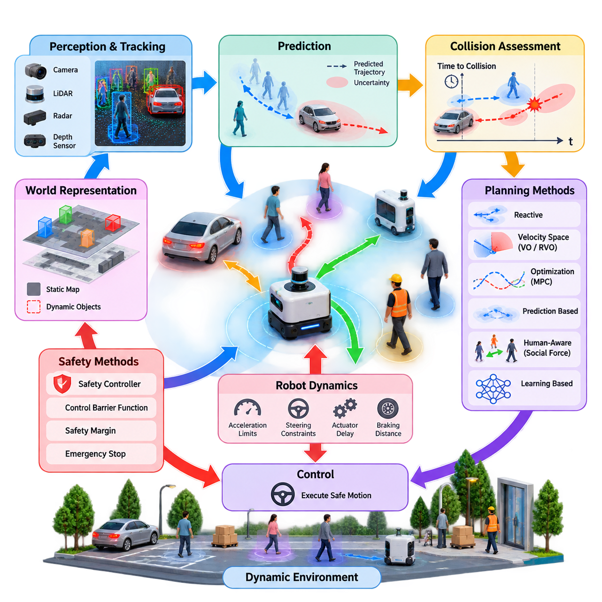
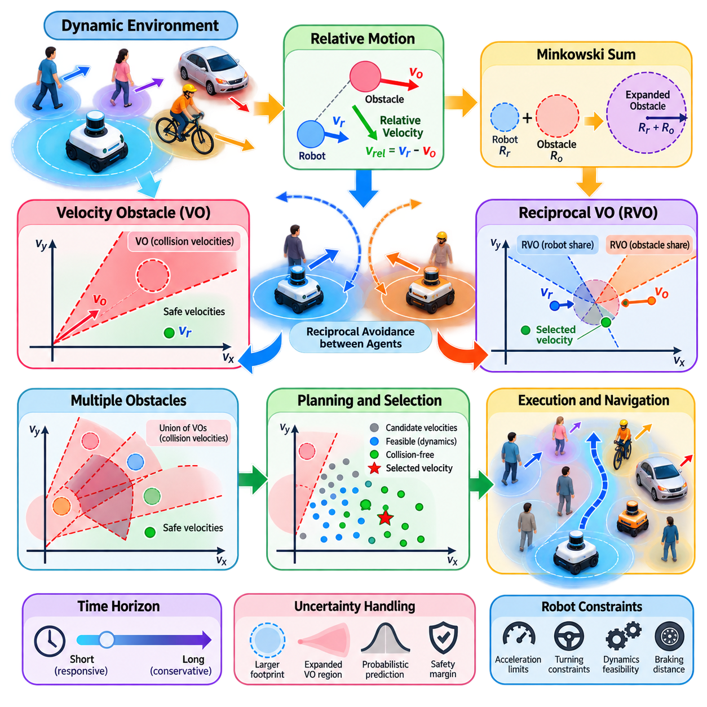
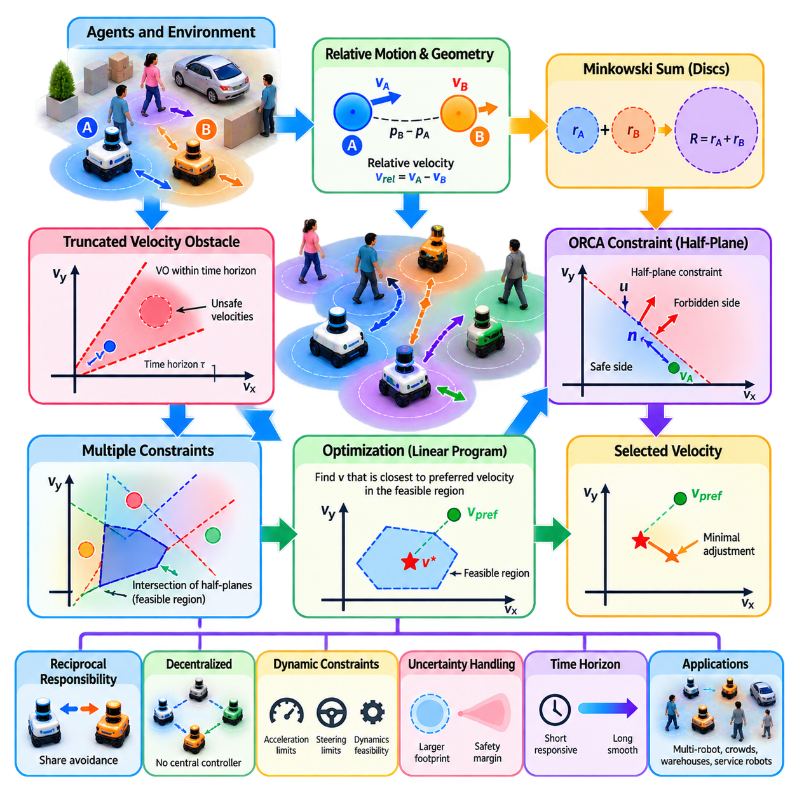
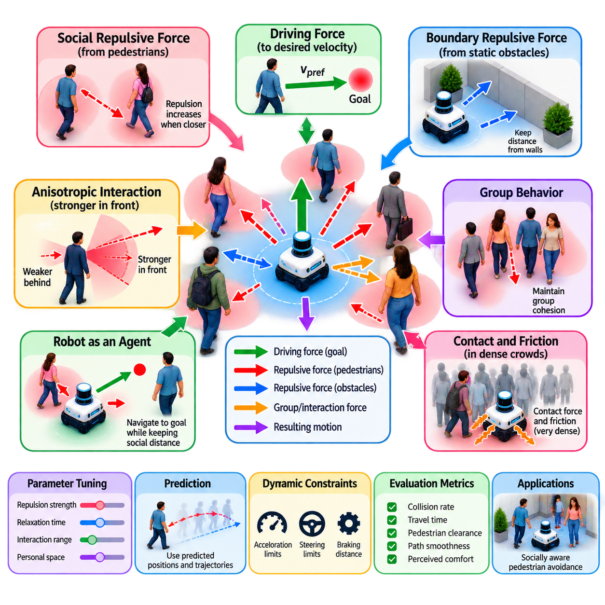
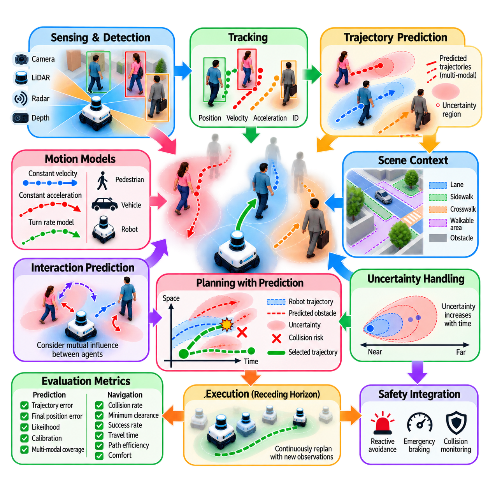
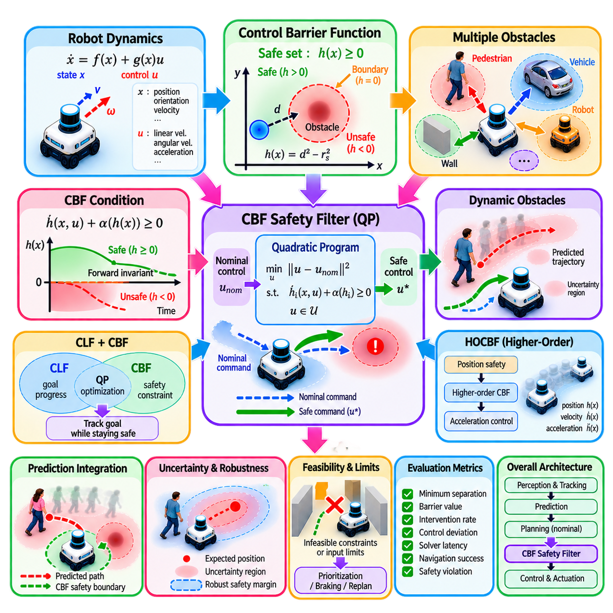
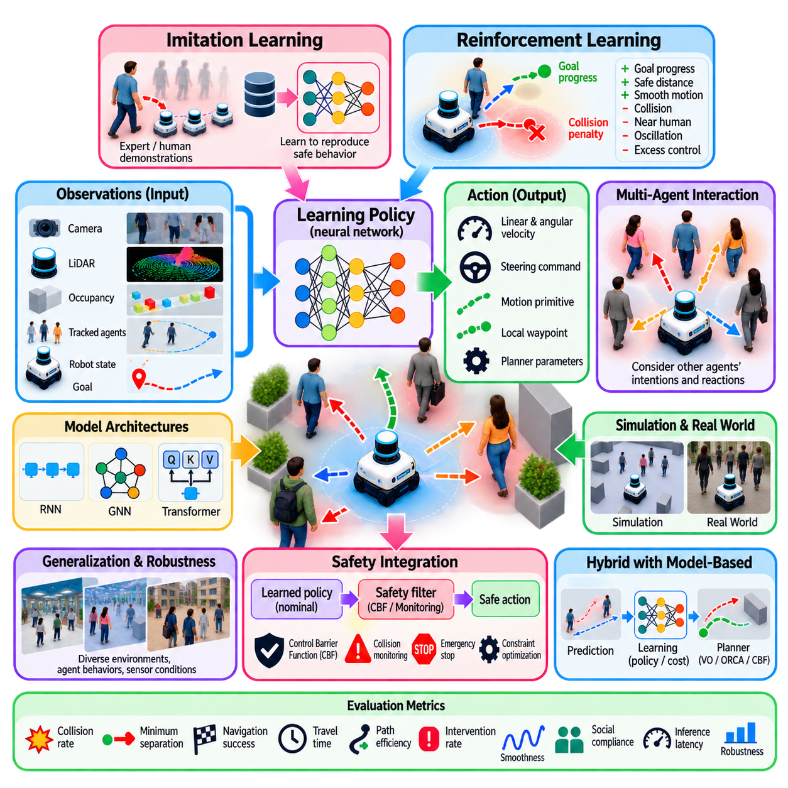
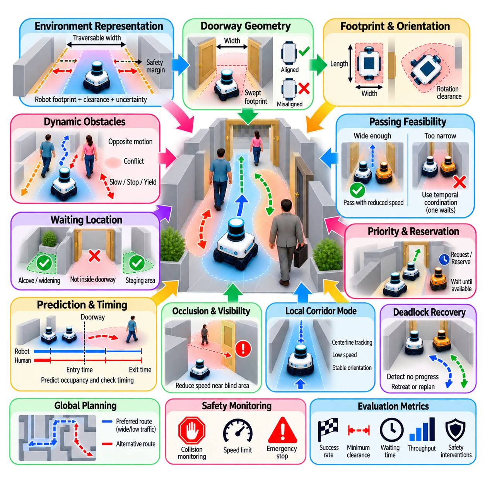
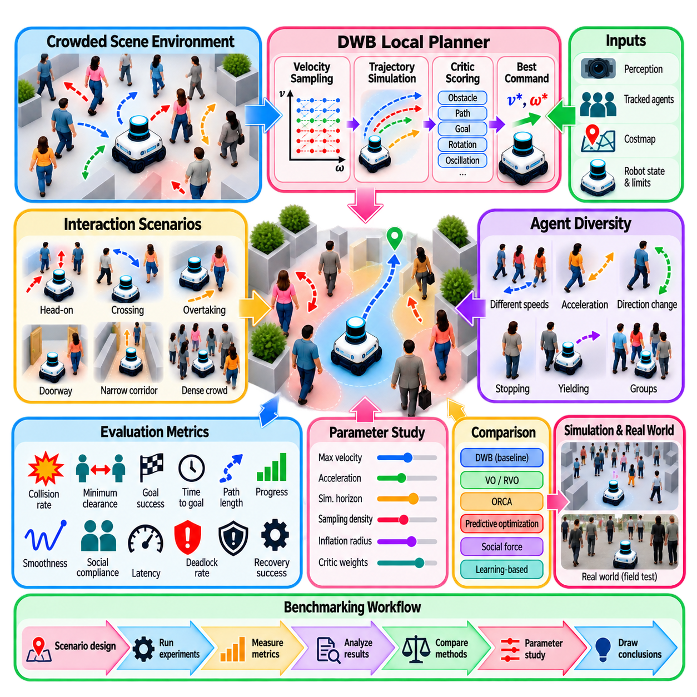
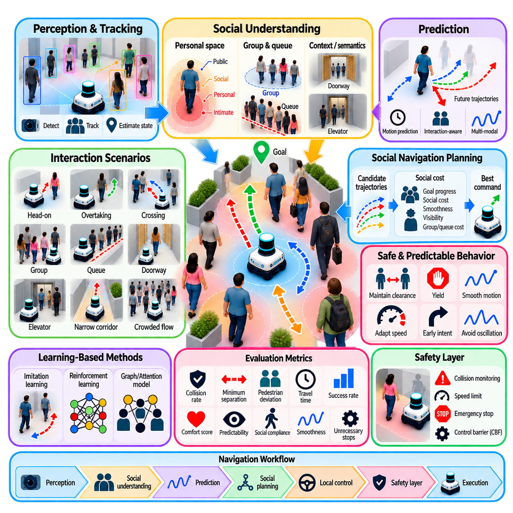

**Volume 15. Motion Planning and Navigation**


# Chapter 06. Dynamic Obstacle Avoidance

##  

## 06.01. Dynamic Obstacle Avoidance Problem and Methods

{width="7.268055555555556in" height="7.268055555555556in"}

Dynamic obstacle avoidance addresses the problem of navigating safely when obstacles change position over time. Unlike static path planning, where walls, shelves, and fixed structures can be represented by a stationary map, dynamic navigation must continuously reason about pedestrians, vehicles, forklifts, mobile robots, and other moving agents whose future states are uncertain. :chatgpt-content-reference{index="0"}

The fundamental difficulty is that collision risk depends not only on spatial separation but also on time. A location that is currently free may become occupied when the robot reaches it, while a currently blocked region may become available moments later. Dynamic obstacle avoidance therefore extends geometric collision checking into space-time reasoning, where position, velocity, heading, acceleration, and predicted motion influence every navigation decision.

A typical system begins with perception and tracking. Cameras, LiDAR, radar, depth sensors, or combinations of these sensors detect objects around the robot, while tracking algorithms estimate their positions and velocities over successive observations. The resulting dynamic world representation must distinguish moving objects from static structures and update rapidly enough that the planner does not operate on obsolete environmental information.

The robot then evaluates potential interactions between its own predicted motion and the estimated motion of surrounding objects. A simple approach assumes that each obstacle maintains its current velocity over a short horizon. More advanced approaches estimate multiple possible trajectories and their probabilities. Because human movement can change abruptly, prediction should normally be treated as uncertain rather than as a perfectly known future trajectory.

Collision assessment can be expressed through concepts such as time to collision, closest point of approach, predicted occupancy, or reachable regions. Instead of asking only whether two geometric footprints overlap, the system determines whether the robot and an obstacle could occupy conflicting regions at approximately the same time. Safety margins expand these regions to account for localization error, perception uncertainty, robot dimensions, braking distance, and prediction error.

Reactive avoidance methods generate commands directly from current or short-term observations. They are computationally efficient and can respond quickly to unexpected motion, making them useful as a fast local safety mechanism. However, purely reactive behavior may oscillate, become trapped, or select locally safe motions that create poor future situations. Consequently, practical navigation systems usually combine immediate reaction with short-horizon planning.

Velocity-space methods formulate avoidance by determining which robot velocities would produce a collision within a selected time horizon. The Velocity Obstacle concept identifies unsafe velocity regions generated by moving obstacles, allowing the controller to select admissible velocities outside those regions. Reciprocal formulations extend this principle to interactions in which multiple moving agents are expected to share responsibility for avoiding collisions.

Optimization-based methods instead evaluate candidate trajectories using objectives and constraints. A trajectory may be scored according to collision risk, progress toward the navigation goal, path deviation, control effort, smoothness, clearance, and dynamic feasibility. Model predictive approaches repeatedly solve a finite-horizon problem as new sensor measurements arrive, providing a natural framework for incorporating changing obstacle predictions into continuous navigation decisions.

Prediction-based avoidance becomes especially important when instantaneous reaction is insufficient. A pedestrian approaching an intersection may not yet block the robot\'s path, but trajectory forecasting can reveal an imminent conflict. The planner can then slow down, yield, stop, or pass before the interaction becomes critical. This predictive behavior generally produces smoother and safer navigation than waiting until the obstacle enters an immediate collision zone.

Dynamic obstacle avoidance also requires explicit consideration of robot dynamics. A commanded velocity cannot necessarily be reached instantaneously, and a heavy AMR may require substantial distance to decelerate. Acceleration limits, steering constraints, actuator delay, wheel-ground interaction, maximum curvature, and emergency braking capability therefore determine which avoidance maneuvers are physically executable rather than merely geometrically collision-free.

Human environments introduce additional requirements because mathematically collision-free motion may still be socially unacceptable. Robots should avoid passing excessively close to pedestrians, cutting across walking trajectories, approaching people aggressively from behind, or forcing humans into uncomfortable evasive actions. Human-aware navigation consequently incorporates interpersonal distance, directional preferences, yielding behavior, and other socially meaningful costs into planning.

Crowded environments create coupled interactions in which avoiding one person may increase the risk of collision with another. Local decisions must therefore consider several moving agents simultaneously. Methods based on reciprocal collision avoidance, social-force models, trajectory optimization, and learned interaction policies provide different mechanisms for handling these coupled behaviors, each making different assumptions about how other agents respond to the robot.

Safety-oriented methods can impose constraints independently of the nominal navigation objective. For example, a safety controller can restrict commands whenever the predicted state approaches an unsafe set, while a higher-level planner continues optimizing progress and efficiency. Control Barrier Function approaches formalize this concept by defining safety conditions that the controller attempts to preserve while modifying nominal control commands only when necessary.

Learning-based methods offer another approach by training policies from demonstrations, simulation, reinforcement learning, or recorded navigation data. Such policies can potentially capture complex interaction patterns that are difficult to encode analytically. Their main challenge is assurance: behavior learned from finite data may become unreliable in unfamiliar situations, so practical systems often combine learned prediction or planning with deterministic safety monitoring and fallback behavior.

No single avoidance method is universally optimal. Velocity-based techniques can provide efficient geometric reasoning, optimization methods can incorporate rich objectives and constraints, prediction-based approaches anticipate future conflicts, and learning methods can model complicated interactions. The chapter structure therefore treats these as complementary families, followed by specialized treatment of VO/RVO, ORCA, social-force models, prediction, CBF safety, and learned policies. :chatgpt-content-reference{index="1"}

A robust architecture consequently operates as a repeated perception-prediction-planning-control loop. Sensor observations update tracked objects, prediction estimates their future motion, collision analysis identifies dangerous interactions, the local planner generates feasible alternatives, and the controller executes the selected command. The complete cycle must run continuously because every executed motion changes the geometry and timing of subsequent interactions.

System quality should be evaluated beyond simple collision counts. Important measures include minimum separation distance, time to collision, intervention frequency, navigation success rate, travel time, path efficiency, stopping frequency, acceleration smoothness, computational latency, and social compliance. Testing should include crossing pedestrians, overtaking, head-on encounters, sudden appearances, narrow corridors, doorways, dense crowds, and interactions with other autonomous robots.

Dynamic obstacle avoidance is therefore not merely an obstacle-detection function but a real-time decision process connecting perception, prediction, motion planning, control, and safety. Within the broader motion-planning architecture, it bridges conventional local planning with human-aware navigation and multi-agent reasoning, providing the capability required for autonomous robots to operate safely and efficiently in environments that continuously change around them.

동적 장애물 회피(Dynamic Obstacle Avoidance)는 장애물의 위치가 시간에 따라 변화하는 환경에서 로봇이 안전하게 주행하는 문제를 다룬다. 벽, 선반, 고정 구조물을 정적인 지도(Static Map)로 표현할 수 있는 정적 경로 계획(Static Path Planning)과 달리, 동적 내비게이션(Dynamic Navigation)은 보행자, 차량, 지게차, 이동 로봇 등 미래 상태가 불확실한 이동 객체의 움직임을 지속적으로 고려해야 한다.

근본적인 어려움은 충돌 위험(Collision Risk)이 공간적 거리뿐만 아니라 시간에도 의존한다는 점이다. 현재 비어 있는 위치도 로봇이 도착할 때에는 점유될 수 있으며, 현재 막혀 있는 영역도 잠시 후에는 통과할 수 있다. 따라서 동적 장애물 회피는 기하학적 충돌 검사(Geometric Collision Checking)를 시공간 추론(Space-Time Reasoning)으로 확장하며, 위치, 속도, 방향, 가속도 및 예측된 움직임을 모든 내비게이션 판단에 반영한다.

일반적인 시스템은 인지 및 추적(Perception and Tracking) 단계에서 시작한다. 카메라(Camera), 라이다(LiDAR), 레이더(Radar), 깊이 센서(Depth Sensor) 또는 이들의 조합을 사용하여 로봇 주변의 객체를 검출하고, 추적 알고리즘(Tracking Algorithm)을 통해 연속적인 관측에서 객체의 위치와 속도를 추정한다. 생성된 동적 세계 표현(Dynamic World Representation)은 이동 객체와 정적 구조물을 구분하고 충분히 빠르게 갱신되어야 한다.

로봇은 이후 자신의 예측 움직임과 주변 객체의 추정 움직임 사이에서 발생할 수 있는 상호작용을 평가한다. 단순한 방법은 각 장애물이 짧은 예측 구간(Prediction Horizon) 동안 현재 속도를 유지한다고 가정한다. 보다 발전된 방법은 여러 개의 가능한 궤적(Trajectory)과 각각의 확률을 추정한다. 사람의 움직임은 갑작스럽게 변할 수 있으므로 예측은 완전히 결정된 미래 궤적이 아니라 불확실성을 포함하는 상태로 다루는 것이 일반적이다.

충돌 평가(Collision Assessment)는 충돌까지의 시간(Time to Collision), 최근접 접근점(Closest Point of Approach), 예측 점유(Predicted Occupancy), 도달 가능 영역(Reachable Region) 등의 개념으로 표현할 수 있다. 두 객체의 기하학적 형상이 단순히 겹치는지만 검사하는 대신, 로봇과 장애물이 거의 같은 시간에 충돌 가능한 영역을 점유하는지를 판단한다. 안전 여유(Safety Margin)는 위치 추정 오차, 인지 불확실성, 로봇 크기, 제동 거리 및 예측 오차 등을 고려하여 설정한다.

반응형 회피 방법(Reactive Avoidance Method)은 현재 또는 단기 관측 결과로부터 직접 제어 명령을 생성한다. 계산 효율이 높고 예상하지 못한 움직임에 빠르게 대응할 수 있기 때문에 신속한 지역 안전 메커니즘(Local Safety Mechanism)으로 유용하다. 그러나 순수한 반응형 동작은 진동(Oscillation)이나 교착 상태를 발생시키거나, 현재는 안전하지만 미래에는 불리한 상황을 만드는 동작을 선택할 수 있다. 따라서 실제 시스템에서는 즉각적인 반응과 단기 계획(Short-Horizon Planning)을 결합하는 경우가 많다.

속도 공간 기반 방법(Velocity-Space Method)은 선택한 시간 구간 안에서 충돌을 발생시키는 로봇 속도를 판별하여 회피 문제를 구성한다. 속도 장애물(Velocity Obstacle, VO)은 이동 장애물에 의해 생성되는 위험 속도 영역을 정의하고, 제어기는 해당 영역 밖에서 허용 가능한 속도를 선택한다. 상호 회피 방식(Reciprocal Avoidance)은 여러 이동 객체가 서로 충돌 회피의 책임을 분담한다고 가정하여 이러한 원리를 확장한다.

최적화 기반 방법(Optimization-Based Method)은 목적 함수(Objective Function)와 제약 조건(Constraint)을 이용하여 후보 궤적을 평가한다. 충돌 위험, 내비게이션 목표까지의 진행 정도, 기준 경로와의 편차, 제어 입력, 부드러움, 장애물과의 여유 거리 및 동역학적 실행 가능성 등을 종합적으로 평가할 수 있다. 모델 예측 방식(Model Predictive Approach)은 새로운 센서 정보가 입력될 때마다 유한 예측 구간(Finite Horizon)의 문제를 반복적으로 해결하여 변화하는 장애물 예측을 지속적으로 반영한다.

예측 기반 회피(Prediction-Based Avoidance)는 순간적인 반응만으로 충분하지 않은 상황에서 특히 중요하다. 교차로에 접근하는 보행자가 아직 로봇의 경로를 직접 차단하지 않았더라도 궤적 예측(Trajectory Forecasting)을 통해 곧 발생할 충돌 가능성을 발견할 수 있다. 그러면 로봇은 위험 상황이 가까워지기 전에 감속하거나, 양보하거나, 정지하거나, 먼저 통과할 수 있다. 이러한 예측 행동은 장애물이 즉각적인 충돌 영역에 들어올 때까지 기다리는 방식보다 일반적으로 부드럽고 안전한 주행을 가능하게 한다.

동적 장애물 회피에서는 로봇 동역학(Robot Dynamics)도 명시적으로 고려해야 한다. 명령된 속도에 즉시 도달할 수 있는 것은 아니며, 무거운 자율이동로봇(AMR)은 감속하는 데 상당한 거리가 필요할 수 있다. 따라서 가속도 제한, 조향 제약, 액추에이터 지연(Actuator Delay), 휠과 지면의 상호작용, 최대 곡률 및 비상 제동 성능은 회피 동작이 단순히 기하학적으로 충돌이 없는 수준을 넘어 실제로 실행 가능한지를 결정한다.

인간이 존재하는 환경에서는 수학적으로 충돌하지 않는 움직임이라도 사회적으로 적절하지 않을 수 있기 때문에 추가적인 요구사항이 필요하다. 로봇은 보행자에게 지나치게 가까이 접근하거나, 보행 경로를 갑자기 가로지르거나, 뒤에서 공격적으로 접근하거나, 사람이 불편한 회피 행동을 하도록 강요해서는 안 된다. 따라서 인간 인지형 내비게이션(Human-Aware Navigation)은 대인 거리, 이동 방향 선호도, 양보 행동과 같은 사회적 의미를 가진 비용을 계획 과정에 포함한다.

혼잡 환경(Crowded Environment)에서는 한 사람을 피하는 동작이 다른 사람과의 충돌 위험을 높일 수 있는 결합 상호작용(Coupled Interaction)이 발생한다. 따라서 지역적 판단은 여러 이동 객체를 동시에 고려해야 한다. 상호 충돌 회피(Reciprocal Collision Avoidance), 사회적 힘 모델(Social Force Model), 궤적 최적화(Trajectory Optimization), 학습 기반 상호작용 정책(Learned Interaction Policy) 등은 이러한 결합 행동을 처리하기 위한 서로 다른 방법을 제공하며, 주변 객체가 로봇에 어떻게 반응하는지에 대해 각각 다른 가정을 사용한다.

안전 중심 방법(Safety-Oriented Method)은 기본 내비게이션 목표와 독립적으로 제약 조건을 적용할 수 있다. 예를 들어 예측 상태가 위험 영역에 접근할 경우 안전 제어기(Safety Controller)가 명령을 제한하고, 상위 계획기는 계속해서 진행성과 효율성을 최적화할 수 있다. 제어 장벽 함수(Control Barrier Function, CBF)는 이러한 개념을 안전 조건으로 정식화하여 필요한 경우에만 기본 제어 명령을 수정하면서 안전 상태를 유지하도록 한다.

학습 기반 방법(Learning-Based Method)은 시연 데이터(Demonstration), 시뮬레이션(Simulation), 강화학습(Reinforcement Learning), 실제 내비게이션 기록 등으로 정책(Policy)을 학습하는 또 다른 접근법이다. 이러한 정책은 분석적으로 표현하기 어려운 복잡한 상호작용 패턴을 학습할 가능성이 있다. 그러나 제한된 데이터에서 학습된 행동은 새로운 상황에서 신뢰성이 떨어질 수 있으므로, 실제 시스템에서는 학습 기반 예측이나 계획을 결정론적 안전 감시(Deterministic Safety Monitoring) 및 대체 행동(Fallback Behavior)과 결합하는 경우가 많다.

모든 상황에서 최적인 단일 회피 방법은 존재하지 않는다. 속도 기반 기법(Velocity-Based Technique)은 효율적인 기하학적 추론을 제공하고, 최적화 방법은 다양한 목적과 제약 조건을 통합할 수 있으며, 예측 기반 접근법은 미래 충돌을 사전에 판단하고, 학습 방법은 복잡한 상호작용을 모델링할 수 있다. 따라서 이들은 상호 보완적인 방법군으로 이해해야 하며, 이후 속도 장애물 및 상호 속도 장애물(VO/RVO), 최적 상호 충돌 회피(ORCA), 사회적 힘 모델, 예측 기반 회피, 제어 장벽 함수(CBF), 학습 기반 정책 등으로 세분화할 수 있다.

견고한 시스템 아키텍처(Robust System Architecture)는 결과적으로 인지-예측-계획-제어 루프(Perception-Prediction-Planning-Control Loop)를 반복적으로 수행한다. 센서 관측은 추적 객체를 갱신하고, 예측 모듈은 객체의 미래 움직임을 추정하며, 충돌 분석은 위험한 상호작용을 식별한다. 지역 계획기(Local Planner)는 실행 가능한 대안을 생성하고 제어기는 선택된 명령을 수행한다. 실행된 모든 움직임이 이후의 상호작용 조건을 변화시키므로 전체 과정은 지속적으로 반복되어야 한다.

시스템의 성능은 단순한 충돌 횟수만으로 평가해서는 안 된다. 최소 분리 거리(Minimum Separation Distance), 충돌까지의 시간(Time to Collision), 개입 빈도(Intervention Frequency), 내비게이션 성공률, 이동 시간, 경로 효율, 정지 빈도, 가속도 부드러움, 계산 지연 시간(Computational Latency), 사회적 준수성(Social Compliance) 등을 함께 고려해야 한다. 시험에는 보행자 횡단, 추월, 정면 접근, 갑작스러운 출현, 좁은 복도, 출입문, 밀집 군중 및 다른 자율 로봇과의 상호작용 등이 포함되어야 한다.

따라서 동적 장애물 회피(Dynamic Obstacle Avoidance)는 단순한 장애물 검출 기능이 아니라 인지(Perception), 예측(Prediction), 동작 계획(Motion Planning), 제어(Control), 안전(Safety)을 연결하는 실시간 의사결정 과정이다. 전체 동작 계획 및 내비게이션(Motion Planning and Navigation) 아키텍처에서 이는 기존 지역 계획(Local Planning)과 인간 인지형 내비게이션 및 다중 에이전트 추론(Multi-Agent Reasoning)을 연결하며, 지속적으로 변화하는 실제 환경에서 자율 로봇이 안전하고 효율적으로 동작하기 위한 핵심 능력을 제공한다.

##  

## 06.02. Velocity Obstacle VO and Reciprocal VO RVO [w/Code]

{width="7.268055555555556in" height="7.268055555555556in"}

Velocity Obstacle (VO) is a geometric framework for dynamic collision avoidance that represents collision risk directly in velocity space rather than only in physical position space. Given the robot, a moving obstacle, their geometric footprints, and the obstacle velocity, VO identifies the set of robot velocities that would cause the two bodies to collide within a specified future interval. The avoidance problem then becomes selecting a feasible velocity outside this unsafe set.

The basic construction begins with relative motion. Instead of propagating the robot and obstacle independently through time, the obstacle velocity is subtracted from the robot velocity so that collision can be analyzed in a relative reference frame. The obstacle is conceptually stationary in this frame, while the robot moves according to the relative velocity. This transformation converts a dynamic two-body interaction into a simpler geometric collision test.

Robot and obstacle dimensions must also be incorporated into the calculation. A common approach uses the Minkowski sum to enlarge the obstacle by the robot footprint while representing the robot as a point. For circular approximations, the effective obstacle radius becomes the sum of the robot and obstacle radii. Collision checking can then be performed by determining whether the ray generated by the relative velocity intersects this enlarged obstacle region.

In velocity space, the resulting collision-producing velocities form a cone-like region whose apex and orientation depend on the obstacle velocity and relative position. Any robot velocity lying inside this Velocity Obstacle indicates that continuing with that velocity may eventually produce a collision. Velocities outside the region are considered collision-free under the assumed obstacle motion model and the selected prediction horizon.

The time horizon strongly affects VO behavior. An infinite horizon classifies every velocity that could eventually produce a collision as unsafe, which can make navigation unnecessarily conservative. A finite time horizon limits consideration to collisions expected within a practical interval. Short horizons encourage responsive and less conservative behavior, while longer horizons provide earlier avoidance but may restrict the available velocity space more aggressively.

When several moving obstacles are present, the robot constructs a Velocity Obstacle for each one. The union of these regions represents velocities that create predicted conflicts with at least one obstacle. The planner searches the remaining admissible velocity space for a command satisfying robot constraints while maintaining progress toward the goal. Desired velocity, clearance, smoothness, acceleration limits, and deviation from the reference path can be included when ranking candidates.

A major limitation of classical VO appears when both interacting agents independently perform avoidance. If two robots detect the same potential collision, each may change velocity in response to the other. At the next control cycle, both may observe that the conflict has shifted and reverse their decisions. Repeated symmetric reactions can generate oscillatory motion, especially during head-on encounters where both agents continuously choose corresponding avoidance directions.

Reciprocal Velocity Obstacle (RVO) was introduced to address this interaction by assuming that both agents participate in collision avoidance. Instead of requiring one robot to perform the entire avoidance maneuver, RVO distributes the required velocity change between the interacting agents. The resulting decision is based on the expectation that the other agent will make a complementary adjustment, reducing excessive reactions caused by treating its current velocity as permanently fixed.

Conceptually, RVO modifies the velocity-space construction using information from both agents\' current velocities. The reciprocal formulation shifts the effective avoidance region so that selecting a velocity outside it corresponds to taking an appropriate share of the collision-avoidance responsibility. When both agents apply compatible reciprocal reasoning, their combined velocity changes can separate their future trajectories without requiring either participant to execute the entire maneuver alone.

This reciprocal assumption is particularly useful in multi-robot environments. AMRs sharing warehouse intersections, service robots moving through corridors, and autonomous platforms operating in common traffic areas can encounter one another repeatedly. If each robot follows compatible avoidance rules, reciprocal methods can generate decentralized collision avoidance without requiring a central planner to calculate every short-term interaction among all robots.

However, RVO relies on assumptions about the behavior of other agents. A pedestrian, manually driven vehicle, or robot using a different navigation policy may not provide the expected reciprocal response. In such cases, assigning half of the avoidance responsibility to another agent can underestimate the maneuver required from the robot. Practical systems therefore combine reciprocal reasoning with conservative margins, obstacle classification, prediction, and safety overrides.

Velocity feasibility is another important consideration. Classical VO reasoning may identify a collision-free velocity that the physical robot cannot reach immediately. Differential-drive robots, Ackermann-steered vehicles, heavy AMRs, and dynamically constrained platforms have limits on acceleration, deceleration, turning rate, and curvature. The candidate velocity set should therefore be intersected with dynamically reachable velocities so that the selected avoidance action can actually be executed.

Uncertainty also changes the geometry of safe navigation. Position estimates contain localization and perception errors, measured velocities contain noise, and future obstacle motion rarely follows a perfectly constant-velocity model. Enlarging obstacle footprints, expanding unsafe velocity regions, shortening replanning intervals, or introducing probabilistic prediction can compensate for these uncertainties. The appropriate margin depends on sensing quality, platform dynamics, operating speed, and required safety level.

VO and RVO are naturally suited to real-time local navigation because their central computations are geometric and can be repeated whenever new tracking information arrives. A typical control cycle updates obstacle states, constructs velocity-space constraints, determines dynamically admissible robot velocities, removes collision-producing candidates, and selects a preferred safe command. This process is repeated continuously as both the robot and surrounding agents move.

The preferred velocity normally points toward a local navigation target or follows the global path, while collision constraints modify it only when necessary. This separation is useful because VO does not inherently determine where the robot should travel; it determines which velocities should be avoided. A local planner can therefore combine goal-directed motion with VO-based safety constraints while retaining responsibility for path following, progress, smoothness, and recovery behavior.

Dense scenes expose limitations of this approach because the union of many Velocity Obstacles may leave little or no feasible velocity space. Narrow corridors, doorways, opposing traffic, and tightly packed crowds can produce temporary states in which stopping or yielding is preferable to continuous avoidance. Deadlock detection, priority rules, trajectory prediction, global replanning, or explicit coordination may then be required above the basic VO or RVO layer.

The VO family provides an important bridge between geometric motion planning and multi-agent navigation. Classical VO expresses future collision risk as forbidden regions in velocity space, while RVO extends the idea by incorporating reciprocal behavior between moving agents. These principles establish the foundation for more refined reciprocal collision-avoidance methods such as Optimal Reciprocal Collision Avoidance (ORCA), which further formalizes feasible velocity selection for decentralized multi-agent motion.

속도 장애물(Velocity Obstacle, VO)은 동적 충돌 회피(Dynamic Collision Avoidance)를 위한 기하학적 프레임워크(Geometric Framework)로, 충돌 위험을 물리적인 위치 공간(Position Space)만이 아니라 속도 공간(Velocity Space)에서 직접 표현한다. 로봇과 이동 장애물의 형상, 현재 위치 및 장애물 속도가 주어지면, VO는 지정된 미래 시간 구간 내에서 두 객체의 충돌을 발생시키는 로봇 속도 집합을 식별한다. 따라서 회피 문제는 이 위험 집합 밖에서 실행 가능한 속도를 선택하는 문제로 변환된다.

기본적인 구성은 상대 운동(Relative Motion)에서 시작한다. 로봇과 장애물의 움직임을 각각 시간에 따라 독립적으로 전파하는 대신, 로봇 속도에서 장애물 속도를 빼서 상대 좌표계(Relative Reference Frame)에서 충돌을 분석한다. 이 좌표계에서는 장애물이 개념적으로 정지해 있고 로봇이 상대 속도(Relative Velocity)에 따라 움직인다. 이러한 변환을 통해 동적인 두 객체의 상호작용을 보다 단순한 기하학적 충돌 검사(Geometric Collision Test)로 바꿀 수 있다.

로봇과 장애물의 실제 크기도 계산에 포함되어야 한다. 일반적으로 민코프스키 합(Minkowski Sum)을 사용하여 장애물을 로봇의 형상만큼 확장하고 로봇 자체는 하나의 점으로 표현한다. 원형 근사(Circular Approximation)를 사용하는 경우 유효 장애물 반경은 로봇 반경과 장애물 반경의 합이 된다. 이후 상대 속도에 의해 생성되는 광선(Ray)이 이렇게 확장된 장애물 영역과 교차하는지를 판단하여 충돌 여부를 검사할 수 있다.

속도 공간(Velocity Space)에서 충돌을 발생시키는 속도들은 원뿔과 유사한 영역(Cone-Like Region)을 형성하며, 그 꼭짓점과 방향은 장애물의 속도 및 상대 위치에 의해 결정된다. 로봇 속도가 이 속도 장애물(Velocity Obstacle) 내부에 존재한다면 해당 속도를 계속 유지할 경우 미래에 충돌이 발생할 수 있음을 의미한다. 반대로 영역 밖의 속도는 가정된 장애물 운동 모델과 설정된 예측 시간 범위(Prediction Horizon)에서는 충돌이 없는 것으로 간주된다.

시간 범위(Time Horizon)는 VO의 동작 특성에 큰 영향을 준다. 무한 시간 범위(Infinite Horizon)를 사용하면 언젠가 충돌할 가능성이 있는 모든 속도를 위험한 것으로 판단하기 때문에 내비게이션이 불필요하게 보수적으로 변할 수 있다. 유한 시간 범위(Finite Time Horizon)는 실제적으로 의미 있는 시간 안에 예상되는 충돌만 고려한다. 짧은 시간 범위는 반응성이 높고 덜 보수적인 행동을 만들며, 긴 시간 범위는 더 일찍 회피할 수 있지만 사용 가능한 속도 공간을 더 강하게 제한할 수 있다.

여러 이동 장애물이 존재하는 경우 로봇은 각각의 장애물에 대해 속도 장애물(Velocity Obstacle)을 생성한다. 이러한 영역들의 합집합(Union)은 적어도 하나의 장애물과 예측 충돌을 일으키는 속도들을 나타낸다. 계획기(Planner)는 남아 있는 허용 속도 공간(Admissible Velocity Space)에서 로봇의 제약 조건을 만족하면서 목표 방향으로 진행할 수 있는 명령을 탐색한다. 후보 속도를 평가할 때 선호 속도, 장애물 여유 거리, 부드러움, 가속도 제한 및 기준 경로와의 편차 등을 함께 고려할 수 있다.

고전적인 VO의 주요 한계는 상호작용하는 두 에이전트(Agent)가 각각 독립적으로 회피 행동을 수행할 때 나타난다. 두 로봇이 동일한 잠재적 충돌을 감지하면 양쪽 모두 상대방의 움직임에 대응하여 속도를 변경할 수 있다. 다음 제어 주기(Control Cycle)에서는 충돌 관계가 바뀐 것을 감지하고 다시 반대 방향으로 판단할 수 있다. 이러한 대칭적 반응이 반복되면 특히 정면으로 마주치는 상황에서 양쪽이 비슷한 방향의 회피 결정을 계속 변경하면서 진동 운동(Oscillatory Motion)이 발생할 수 있다.

상호 속도 장애물(Reciprocal Velocity Obstacle, RVO)은 양쪽 에이전트가 모두 충돌 회피에 참여한다고 가정함으로써 이러한 문제를 완화하기 위해 제안되었다. 하나의 로봇이 전체 회피 동작을 수행하도록 요구하는 대신, RVO는 필요한 속도 변화(Velocity Change)를 상호작용하는 두 에이전트 사이에 분배한다. 상대방도 상호 보완적인 조정을 수행할 것이라고 예상함으로써 현재 상대 속도가 계속 유지된다고 가정할 때 발생할 수 있는 과도한 회피 반응을 줄인다.

개념적으로 RVO는 두 에이전트의 현재 속도 정보를 모두 이용하여 속도 공간 구성을 수정한다. 상호 회피 공식(Reciprocal Formulation)은 유효 회피 영역을 이동시켜, 해당 영역 밖의 속도를 선택하는 것이 충돌 회피 책임의 적절한 일부를 수행하도록 만든다. 두 에이전트가 호환되는 상호 회피 추론(Reciprocal Reasoning)을 적용하면 어느 한쪽이 전체 회피 동작을 단독으로 수행하지 않더라도 양쪽의 속도 변화가 결합되어 미래 궤적을 서로 분리할 수 있다.

이러한 상호 회피 가정은 다중 로봇 환경(Multi-Robot Environment)에서 특히 유용하다. 창고 교차로를 공유하는 자율이동로봇(AMR), 복도를 이동하는 서비스 로봇(Service Robot), 공통 교통 영역에서 운용되는 자율 플랫폼(Autonomous Platform)은 서로 반복적으로 마주칠 수 있다. 각 로봇이 호환 가능한 회피 규칙을 따른다면 상호 회피 방식은 중앙 계획기(Central Planner)가 모든 로봇의 단기 상호작용을 계산하지 않더라도 분산형 충돌 회피(Decentralized Collision Avoidance)를 수행할 수 있다.

그러나 RVO는 다른 에이전트의 행동에 대한 가정에 의존한다. 보행자, 사람이 운전하는 차량 또는 서로 다른 내비게이션 정책(Navigation Policy)을 사용하는 로봇은 예상한 상호 회피 행동을 수행하지 않을 수 있다. 이러한 경우 회피 책임의 절반을 다른 에이전트에게 할당하면 로봇 자체에 필요한 회피량을 과소평가할 수 있다. 따라서 실제 시스템에서는 상호 회피 추론을 보수적인 안전 여유(Conservative Safety Margin), 장애물 분류, 움직임 예측 및 안전 오버라이드(Safety Override)와 결합한다.

속도 실행 가능성(Velocity Feasibility)도 중요한 고려 사항이다. 고전적인 VO 추론은 충돌이 없는 속도를 찾아내더라도 실제 로봇이 해당 속도에 즉시 도달하지 못할 수 있다. 차동 구동 로봇(Differential-Drive Robot), 애커먼 조향 차량(Ackermann-Steered Vehicle), 중량 자율이동로봇(AMR) 및 동역학적 제약을 가진 플랫폼은 가속도, 감속도, 회전 속도 및 곡률에 제한을 갖는다. 따라서 후보 속도 집합을 동역학적으로 도달 가능한 속도(Dynamically Reachable Velocity)와 교차시켜 실제로 실행할 수 있는 회피 동작을 선택해야 한다.

불확실성(Uncertainty)은 안전한 내비게이션의 기하학적 구조에도 영향을 미친다. 위치 추정에는 로컬라이제이션(Localization) 및 인지 오차가 포함되고, 측정된 속도에는 노이즈(Noise)가 존재하며, 미래의 장애물 움직임도 완벽한 등속도 모델(Constant-Velocity Model)을 따르는 경우가 드물다. 장애물 형상을 확장하거나 위험 속도 영역을 넓히고, 재계획 주기(Replanning Interval)를 짧게 하거나 확률적 예측(Probabilistic Prediction)을 도입하여 이러한 불확실성을 보상할 수 있다. 적절한 안전 여유는 센서 성능, 플랫폼 동역학, 운행 속도 및 요구되는 안전 수준에 따라 결정된다.

VO와 RVO는 핵심 계산이 기하학적 방식으로 수행되고 새로운 추적 정보가 입력될 때마다 반복할 수 있기 때문에 실시간 지역 내비게이션(Real-Time Local Navigation)에 적합하다. 일반적인 제어 주기에서는 장애물 상태를 갱신하고, 속도 공간 제약(Velocity-Space Constraint)을 생성하며, 동역학적으로 허용 가능한 로봇 속도를 계산한다. 이후 충돌을 발생시키는 후보를 제거하고 선호되는 안전 명령을 선택하며, 로봇과 주변 에이전트가 이동함에 따라 이 과정을 지속적으로 반복한다.

선호 속도(Preferred Velocity)는 일반적으로 지역 내비게이션 목표(Local Navigation Target)를 향하거나 전역 경로(Global Path)를 추종하도록 설정되며, 충돌 제약은 필요한 경우에만 이를 수정한다. 이러한 분리는 VO 자체가 로봇이 어디로 이동해야 하는지를 결정하는 것이 아니라 어떤 속도를 피해야 하는지를 결정한다는 점에서 중요하다. 따라서 지역 계획기(Local Planner)는 목표 지향적 움직임과 VO 기반 안전 제약을 결합하면서 경로 추종, 진행성, 부드러움 및 복구 행동(Recovery Behavior)을 담당할 수 있다.

밀집 환경(Dense Scene)에서는 여러 속도 장애물의 합집합이 사용 가능한 속도 공간을 거의 남기지 않거나 완전히 제거할 수 있기 때문에 이 접근법의 한계가 나타난다. 좁은 복도, 출입문, 대향 교통(Opposing Traffic), 밀집 군중에서는 지속적으로 회피하기보다 일시적으로 정지하거나 양보하는 것이 더 적절한 상황이 발생할 수 있다. 이때는 기본적인 VO 또는 RVO 계층보다 상위에서 교착 상태 감지(Deadlock Detection), 우선순위 규칙, 궤적 예측, 전역 재계획(Global Replanning) 또는 명시적인 협조 제어가 필요할 수 있다.

VO 계열(VO Family)은 기하학적 동작 계획(Geometric Motion Planning)과 다중 에이전트 내비게이션(Multi-Agent Navigation)을 연결하는 중요한 기반을 제공한다. 고전적인 속도 장애물(VO)은 미래의 충돌 위험을 속도 공간의 금지 영역(Forbidden Region)으로 표현하고, 상호 속도 장애물(RVO)은 이동 에이전트 간의 상호 회피 행동을 반영하여 이를 확장한다. 이러한 원리는 분산형 다중 에이전트 이동에서 실행 가능한 속도 선택을 더욱 체계화하는 최적 상호 충돌 회피(Optimal Reciprocal Collision Avoidance, ORCA)와 같은 발전된 상호 충돌 회피 방법의 기초가 된다.

##  

## 06.03. ORCA Optimal Reciprocal Collision Avoidance [w/Code]

{width="7.268055555555556in" height="7.268055555555556in"}

Optimal Reciprocal Collision Avoidance (ORCA) is a velocity-space method for decentralized collision avoidance among multiple moving agents. It extends the reciprocal reasoning introduced by RVO by converting pairwise collision-avoidance requirements into explicit linear constraints on admissible velocities. Each agent independently selects a velocity that remains collision-free over a specified time horizon while staying as close as possible to its preferred motion.

The central assumption of ORCA is reciprocal responsibility. When two cooperative agents are predicted to collide, neither agent is required to perform the complete avoidance maneuver. Instead, the minimum velocity correction needed to prevent the collision is determined, and each agent is normally assigned an equal share of that correction. This symmetric responsibility provides predictable interaction behavior without requiring centralized trajectory coordination.

ORCA begins with the same relative-motion geometry used by Velocity Obstacles. For two agents A and B, their relative position and relative velocity are evaluated together with their physical dimensions. The agents can commonly be approximated as discs in planar navigation, allowing their radii to be combined through a Minkowski-sum construction. Collision risk is then represented as a forbidden region in relative velocity space.

A finite time horizon defines which future collisions are relevant. The corresponding truncated Velocity Obstacle contains relative velocities that would cause the agents to collide before the horizon expires. If the current relative velocity lies inside this unsafe region, ORCA determines the smallest velocity displacement required to move it to the boundary of the collision-free region. This displacement becomes the basis for constructing the avoidance constraint.

The resulting ORCA constraint is represented as a half-plane in velocity space. Its boundary passes through a velocity derived from the current agent velocity plus its assigned fraction of the required correction. The boundary normal indicates the direction toward safe velocities. Any candidate velocity on the permitted side of this line satisfies the pairwise reciprocal collision-avoidance condition for the selected time horizon.

When an agent interacts with several neighbors, a separate ORCA half-plane is constructed for each relevant pair. The intersection of these half-planes forms a convex region containing velocities that satisfy all pairwise avoidance constraints simultaneously. The agent then selects a velocity within this feasible region that is closest to its preferred velocity, usually representing goal-directed motion generated by a higher-level navigation or path-following system.

This formulation turns multi-agent collision avoidance into a compact optimization problem. Because the constraints are linear in two-dimensional velocity space, feasible velocity selection can be solved efficiently using low-dimensional linear programming. This computational structure is one of ORCA\'s major advantages, enabling collision-avoidance decisions to be updated rapidly even when many agents are operating within the same environment.

The preferred velocity provides the connection between collision avoidance and navigation objectives. A global or local planner determines how the robot would ideally move toward its target if no dynamic conflict existed. ORCA does not replace this navigation objective. Instead, it modifies the preferred velocity only as much as necessary to satisfy the current reciprocal safety constraints, preserving progress and motion efficiency whenever sufficient free velocity space remains available.

ORCA is decentralized because every agent can compute its own constraints from locally observed neighboring states. It does not require a central controller to optimize the complete joint trajectory of the robot population. This property makes it attractive for multi-robot systems, warehouse AMRs, service robots, simulated crowds, and other applications where large numbers of autonomous agents must react quickly to nearby motion.

Compared with basic RVO, ORCA provides a more explicit mathematical definition of reciprocal avoidance responsibility. Rather than merely shifting an avoidance region according to reciprocal assumptions, it computes the minimum correction and defines a precise boundary separating admissible and inadmissible velocities. This produces a systematic velocity-selection procedure and makes the collision-avoidance problem suitable for efficient optimization.

The theoretical behavior depends strongly on the assumptions made about participating agents. Reciprocal guarantees are most meaningful when other agents also perform compatible avoidance actions and when their state estimates are sufficiently accurate. Humans, manually controlled vehicles, malfunctioning robots, or agents using incompatible policies may not contribute the expected share of avoidance, so practical robotic systems cannot always rely exclusively on reciprocal behavior.

Real robots also introduce dynamic constraints that are not fully captured by an instantaneous velocity-space model. A heavy AMR cannot arbitrarily jump from its current velocity to the velocity selected by ORCA. Acceleration, deceleration, steering rate, wheel configuration, actuator delay, braking distance, and curvature limits determine which commands are physically reachable. Velocity constraints should therefore be combined with platform-specific motion feasibility.

Perception and prediction uncertainty further affect practical deployment. ORCA calculations depend on estimates of neighboring positions, velocities, and dimensions, yet these quantities contain sensor noise and tracking errors. Obstacle inflation, conservative radii, uncertainty-dependent margins, shorter replanning intervals, and emergency safety layers can compensate for imperfect estimates and unexpected changes in surrounding motion.

The time horizon provides an important tuning mechanism. A longer horizon causes agents to react earlier to potential future conflicts and generally creates smoother anticipatory behavior, but it can also make the system more conservative in dense environments. A shorter horizon allows greater freedom of motion and later reactions, but may require stronger corrections when collisions become imminent. The appropriate horizon depends on speed, density, dynamics, and sensing latency.

Dense traffic can produce situations in which the intersection of ORCA constraints becomes extremely small or temporarily infeasible. Narrow corridors, doorways, intersections, and opposing robot flows are especially challenging because local reciprocal decisions cannot always resolve structural traffic conflicts. In these cases, stopping, yielding, priority assignment, reservation mechanisms, global replanning, or fleet-level traffic management may be required.

Static obstacles require different treatment because they do not share reciprocal responsibility. The robot must generally assume the full avoidance requirement for walls, shelves, pillars, parked equipment, and other non-cooperative objects. Practical navigation therefore combines reciprocal constraints for cooperative moving agents with non-reciprocal constraints for static or unresponsive obstacles, while maintaining a consistent feasible-velocity representation.

ORCA is particularly valuable as a local multi-agent avoidance layer rather than as a complete navigation architecture. Global planning can determine routes, fleet management can assign priorities, prediction can estimate future behavior, and safety controllers can enforce emergency constraints. ORCA operates within this larger system by efficiently transforming nearby agent interactions into velocity constraints that can be evaluated at every control cycle.

The method therefore provides an important progression from VO and RVO toward structured decentralized navigation. Velocity Obstacles identify collision-producing velocities, RVO introduces shared avoidance responsibility, and ORCA formalizes that responsibility through optimal velocity corrections and linear half-plane constraints. This combination of geometric reasoning, reciprocal interaction, and efficient optimization makes ORCA a foundational method for real-time multi-agent collision avoidance.

최적 상호 충돌 회피(Optimal Reciprocal Collision Avoidance, ORCA)는 여러 이동 에이전트(Moving Agent) 사이에서 분산형 충돌 회피(Decentralized Collision Avoidance)를 수행하기 위한 속도 공간 기반 방법(Velocity-Space Method)이다. ORCA는 상호 속도 장애물(RVO)에서 도입된 상호 회피 추론(Reciprocal Reasoning)을 확장하여, 에이전트 간의 충돌 회피 요구사항을 허용 가능한 속도에 대한 명시적인 선형 제약 조건(Linear Constraint)으로 변환한다. 각 에이전트는 지정된 시간 범위에서 충돌을 피하면서 자신의 선호 움직임에 최대한 가까운 속도를 독립적으로 선택한다.

ORCA의 핵심 가정은 상호 책임(Reciprocal Responsibility)이다. 두 협력 에이전트 사이에 충돌이 예측될 경우 어느 한쪽이 전체 회피 동작을 수행하도록 요구하지 않는다. 대신 충돌을 방지하는 데 필요한 최소 속도 보정(Minimum Velocity Correction)을 계산하고, 일반적으로 두 에이전트가 그 보정량을 동일하게 분담한다. 이러한 대칭적 책임 분배를 통해 중앙 집중식 궤적 조정 없이도 예측 가능한 상호작용 행동을 생성할 수 있다.

ORCA는 속도 장애물(Velocity Obstacle)에서 사용하는 것과 동일한 상대 운동 기하학(Relative-Motion Geometry)에서 시작한다. 두 에이전트 A와 B에 대해 물리적 크기와 함께 상대 위치(Relative Position)와 상대 속도(Relative Velocity)를 평가한다. 평면 내비게이션에서는 일반적으로 두 에이전트를 원형으로 근사할 수 있으며, 민코프스키 합(Minkowski Sum)을 통해 두 반경을 결합한다. 이후 충돌 위험은 상대 속도 공간(Relative Velocity Space)의 금지 영역(Forbidden Region)으로 표현된다.

유한 시간 범위(Finite Time Horizon)는 어떤 미래 충돌을 고려할 것인지를 결정한다. 이에 대응하는 절단된 속도 장애물(Truncated Velocity Obstacle)은 해당 시간 범위가 종료되기 전에 에이전트 사이의 충돌을 발생시키는 상대 속도를 포함한다. 현재 상대 속도가 이 위험 영역 내부에 있다면 ORCA는 이를 충돌 없는 영역의 경계까지 이동시키는 데 필요한 최소 속도 변위(Minimum Velocity Displacement)를 계산한다. 이 변위가 회피 제약 조건을 구성하는 기반이 된다.

그 결과 생성되는 ORCA 제약 조건(ORCA Constraint)은 속도 공간에서 반평면(Half-Plane)으로 표현된다. 경계선은 현재 에이전트 속도에 할당된 속도 보정량을 더하여 계산된 속도를 통과한다. 경계의 법선 벡터(Normal Vector)는 안전한 속도가 존재하는 방향을 나타낸다. 이 경계선에서 허용되는 측면에 위치하는 모든 후보 속도는 선택된 시간 범위에 대해 두 에이전트 사이의 상호 충돌 회피 조건을 만족한다.

하나의 에이전트가 여러 이웃 에이전트와 상호작용하는 경우 관련된 각 에이전트 쌍마다 별도의 ORCA 반평면(Half-Plane)이 생성된다. 이러한 반평면들의 교집합(Intersection)은 모든 쌍별 회피 제약을 동시에 만족하는 속도들을 포함하는 볼록 영역(Convex Region)을 형성한다. 이후 에이전트는 이 실행 가능 영역(Feasible Region) 안에서 선호 속도(Preferred Velocity)에 가장 가까운 속도를 선택하며, 선호 속도는 일반적으로 상위 내비게이션 또는 경로 추종 시스템에서 생성된 목표 지향적 움직임을 나타낸다.

이러한 공식화는 다중 에이전트 충돌 회피(Multi-Agent Collision Avoidance)를 간결한 최적화 문제(Optimization Problem)로 변환한다. 제약 조건이 2차원 속도 공간에서 선형으로 표현되므로 실행 가능한 속도 선택은 저차원 선형 계획법(Low-Dimensional Linear Programming)을 사용하여 효율적으로 해결할 수 있다. 이러한 계산 구조는 ORCA의 주요 장점 중 하나이며, 동일한 환경에서 많은 에이전트가 동작하는 경우에도 충돌 회피 결정을 빠르게 갱신할 수 있도록 한다.

선호 속도(Preferred Velocity)는 충돌 회피와 내비게이션 목표를 연결하는 역할을 한다. 전역 또는 지역 계획기(Global or Local Planner)는 동적 충돌이 존재하지 않을 경우 로봇이 목표를 향해 이상적으로 이동해야 하는 방향과 속도를 결정한다. ORCA는 이러한 내비게이션 목표를 대체하지 않는다. 대신 현재의 상호 안전 제약 조건을 만족하는 데 필요한 만큼만 선호 속도를 수정하여 충분한 자유 속도 공간이 존재하는 경우 목표 방향으로의 진행성과 이동 효율을 유지한다.

ORCA는 각 에이전트가 주변에서 관측된 이웃 에이전트의 상태를 이용하여 자체적으로 제약 조건을 계산할 수 있기 때문에 분산형(Decentralized) 방식이다. 로봇 집단 전체의 결합 궤적(Joint Trajectory)을 중앙 제어기에서 최적화할 필요가 없다. 이러한 특성으로 인해 ORCA는 다중 로봇 시스템(Multi-Robot System), 창고 자율이동로봇(AMR), 서비스 로봇(Service Robot), 시뮬레이션 군중(Simulated Crowd) 등 다수의 자율 에이전트가 주변 움직임에 빠르게 대응해야 하는 응용 분야에 적합하다.

기본적인 RVO와 비교하면 ORCA는 상호 회피 책임을 보다 명시적인 수학적 형태로 정의한다. 단순히 상호 회피 가정에 따라 회피 영역을 이동시키는 것이 아니라 최소 보정량을 계산하고, 허용 가능한 속도와 허용되지 않는 속도를 구분하는 정확한 경계를 정의한다. 이를 통해 체계적인 속도 선택 절차를 제공하며 충돌 회피 문제를 효율적인 최적화 문제로 구성할 수 있다.

이론적인 동작 특성은 참여하는 에이전트에 대한 가정에 크게 의존한다. 다른 에이전트 역시 호환 가능한 회피 동작을 수행하고 상태 추정이 충분히 정확할 때 상호 회피에 대한 보장은 가장 의미 있게 작동한다. 사람, 수동으로 제어되는 차량, 고장 난 로봇 또는 서로 호환되지 않는 정책을 사용하는 에이전트는 예상된 회피 책임을 수행하지 않을 수 있다. 따라서 실제 로봇 시스템에서는 상호 회피 행동에만 전적으로 의존할 수 없다.

실제 로봇에서는 순간적인 속도 공간 모델(Instantaneous Velocity-Space Model)만으로 완전히 표현하기 어려운 동역학적 제약(Dynamic Constraint)도 존재한다. 중량 자율이동로봇(AMR)은 현재 속도에서 ORCA가 선택한 속도로 순간적으로 변경할 수 없다. 가속도, 감속도, 조향 속도, 휠 구성, 액추에이터 지연(Actuator Delay), 제동 거리 및 곡률 제한 등이 실제로 도달 가능한 명령을 결정한다. 따라서 속도 제약은 플랫폼 고유의 동작 실행 가능성(Motion Feasibility)과 함께 고려되어야 한다.

인지 및 예측 불확실성(Perception and Prediction Uncertainty)도 실제 적용에 영향을 준다. ORCA 계산은 주변 에이전트의 위치, 속도 및 크기 추정값에 의존하지만 이러한 값에는 센서 노이즈와 추적 오차가 포함된다. 장애물 팽창(Obstacle Inflation), 보수적인 반경 설정, 불확실성에 따른 안전 여유, 더 짧은 재계획 주기(Replanning Interval), 비상 안전 계층(Emergency Safety Layer) 등을 사용하여 부정확한 추정과 예상하지 못한 주변 움직임을 보완할 수 있다.

시간 범위(Time Horizon)는 중요한 조정 요소를 제공한다. 긴 시간 범위는 잠재적인 미래 충돌에 더 일찍 반응하도록 하여 일반적으로 부드럽고 예측적인 행동을 생성하지만, 밀집 환경에서는 시스템을 지나치게 보수적으로 만들 수 있다. 짧은 시간 범위는 더 큰 이동 자유도를 제공하고 반응 시점을 늦출 수 있지만 충돌이 가까워졌을 때 더 강한 속도 보정이 필요할 수 있다. 적절한 시간 범위는 속도, 밀도, 로봇 동역학 및 센싱 지연(Sensing Latency)에 따라 결정된다.

밀집 교통(Dense Traffic)에서는 ORCA 제약 조건의 교집합이 매우 작아지거나 일시적으로 실행 불가능한 상태가 발생할 수 있다. 좁은 복도, 출입문, 교차로 및 서로 반대 방향으로 이동하는 로봇 흐름은 지역적인 상호 회피 결정만으로 구조적인 교통 충돌을 해결하기 어려운 대표적인 상황이다. 이러한 경우 정지, 양보, 우선순위 할당(Priority Assignment), 예약 메커니즘(Reservation Mechanism), 전역 재계획(Global Replanning) 또는 플릿 수준 교통 관리(Fleet-Level Traffic Management)가 필요할 수 있다.

정적 장애물(Static Obstacle)은 상호 회피 책임을 분담하지 않기 때문에 다른 방식으로 처리해야 한다. 로봇은 일반적으로 벽, 선반, 기둥, 주차된 장비 및 기타 비협력 객체(Non-Cooperative Object)에 대한 전체 회피 책임을 스스로 부담해야 한다. 따라서 실제 내비게이션에서는 협력하는 이동 에이전트에 대해서는 상호 회피 제약을 적용하고, 정적 또는 반응하지 않는 장애물에는 비상호적 제약(Non-Reciprocal Constraint)을 적용하면서 일관된 실행 가능 속도 표현을 유지한다.

ORCA는 완전한 내비게이션 아키텍처 자체보다는 지역 다중 에이전트 회피 계층(Local Multi-Agent Avoidance Layer)으로서 특히 높은 가치를 가진다. 전역 계획(Global Planning)은 이동 경로를 결정하고, 플릿 관리(Fleet Management)는 우선순위를 할당하며, 예측 모듈은 미래 행동을 추정하고, 안전 제어기(Safety Controller)는 비상 제약 조건을 적용할 수 있다. ORCA는 이러한 전체 시스템 내부에서 주변 에이전트와의 상호작용을 매 제어 주기마다 평가할 수 있는 속도 제약으로 효율적으로 변환한다.

따라서 ORCA는 속도 장애물(VO)과 상호 속도 장애물(RVO)에서 구조화된 분산형 내비게이션(Decentralized Navigation)으로 발전하는 중요한 단계를 제공한다. 속도 장애물(VO)은 충돌을 발생시키는 속도를 식별하고, RVO는 공유된 회피 책임을 도입하며, ORCA는 최적 속도 보정(Optimal Velocity Correction)과 선형 반평면 제약(Linear Half-Plane Constraint)을 통해 이러한 책임을 명확하게 정식화한다. 기하학적 추론, 상호작용, 효율적인 최적화를 결합한 ORCA는 실시간 다중 에이전트 충돌 회피(Real-Time Multi-Agent Collision Avoidance)를 위한 대표적인 기반 방법이다.

##  

## 06.04. Social Force Model for Pedestrian Avoidance [w/Code]

{width="7.268055555555556in" height="7.268055555555556in"}

The Social Force Model is a behavioral framework for representing pedestrian motion as the result of virtual forces that influence movement through shared space. Instead of treating people as passive moving obstacles, the model describes how pedestrians pursue destinations, maintain personal distance, avoid collisions, respond to boundaries, and interact with surrounding crowds. In robot navigation, these principles can be adapted to generate socially aware pedestrian avoidance behavior.

The central idea is that pedestrian motion can be approximated through a combination of attractive and repulsive influences. An attractive driving force moves a person toward a desired destination with a preferred velocity, while repulsive forces discourage excessive proximity to other pedestrians, robots, walls, and obstacles. The resulting acceleration is determined by combining these influences, producing continuous motion that resembles many common pedestrian interactions.

The driving force represents the tendency of an agent to approach its desired velocity. If the current velocity differs from the preferred velocity, the model generates an acceleration that reduces this difference over a characteristic relaxation time. The desired direction generally points toward a destination or waypoint, while the preferred speed reflects normal walking behavior. This formulation allows navigation intention and local interaction effects to be represented within the same dynamical model.

Repulsive social forces represent the tendency to preserve interpersonal separation. As two agents approach each other, the magnitude of the repulsive influence increases, encouraging them to alter their trajectories before physical contact occurs. The force can depend on relative distance, body dimensions, direction of motion, and model parameters describing personal space. Consequently, pedestrians begin avoidance before their physical boundaries intersect.

Interactions are generally anisotropic because humans respond more strongly to events occurring in front of them than to agents located behind them. A pedestrian approaching from the forward direction therefore produces a stronger avoidance response than an equally distant pedestrian behind the robot or person. Direction-dependent weighting can model this property and helps generate motion that better reflects visual attention and natural pedestrian behavior.

Static structures can be incorporated through repulsive boundary forces. Walls, shelves, pillars, curbs, and other environmental boundaries generate influences that discourage an agent from approaching them too closely. Combined with goal attraction, these forces guide movement through free space while maintaining clearance from surrounding structures. In narrow corridors, however, careful parameter tuning is required to avoid excessive repulsion that can prevent forward progress.

When the Social Force Model is applied to a mobile robot, the robot can be treated as another interacting agent whose motion is influenced by pedestrians and environmental boundaries. A desired-motion term pulls the robot toward its navigation target, while pedestrian-related forces modify the trajectory to preserve socially acceptable separation. This creates a continuous mechanism for balancing goal progress against local human avoidance.

The interaction can also be modeled asymmetrically. A robot may be configured to assume greater responsibility for maintaining separation than nearby pedestrians, producing more conservative behavior around humans. Different parameters can be assigned according to object type, allowing stronger avoidance around children, standing pedestrians, groups, or vulnerable users while applying different interaction rules to other autonomous robots or vehicles.

Pedestrian groups introduce additional complexity because people often move as social units rather than independent particles. Group members may attempt to remain close, walk side by side, preserve visibility among members, or maintain conversational formations. A robot that simply navigates through the geometric gap between group members may therefore behave socially inappropriately even if the trajectory is collision-free. Group-aware forces can discourage such intrusions.

The Social Force Model can also represent physical contact effects in extremely dense environments. When agents approach distances comparable to their physical dimensions, additional contact and friction terms can model compression and tangential interaction. These terms originated in crowd simulation applications but are generally less important for normal robot navigation, where the objective is to maintain sufficient separation so that physical contact never occurs.

One major advantage of the model is computational simplicity. Social interaction can be calculated from local relationships between the robot and nearby pedestrians without solving a large global trajectory optimization problem. Forces can be updated repeatedly as new observations arrive, making the approach suitable for real-time local navigation. The resulting control influence can also be integrated with conventional planners rather than operating as an independent navigation system.

However, social forces are mathematical abstractions rather than literal physical forces. Human decisions depend on intent, attention, culture, environment, social relationships, and contextual rules that cannot be fully represented through simple attraction and repulsion. Two pedestrians with identical positions and velocities may behave differently depending on whether they are crossing, waiting, conversing, following another person, or intentionally yielding to the robot.

Parameter selection therefore has a strong influence on navigation quality. Excessive repulsive strength may cause large detours, oscillation, or failure to pass through crowded areas, while weak repulsion can produce uncomfortable proximity. Relaxation time, interaction range, force magnitude, anisotropic weighting, preferred speed, and personal-space parameters should be calibrated using representative pedestrian scenarios rather than selected solely for geometric collision avoidance.

The method also differs fundamentally from Velocity Obstacle and ORCA approaches. VO-based methods reason explicitly about future collision-producing velocities, while the Social Force Model generates motion through continuous behavioral influences. Social forces can produce natural-looking interactions but do not inherently provide the same geometric collision-avoidance guarantees. Consequently, social-force behavior is often combined with explicit collision checking or an independent safety layer.

Prediction can further improve social-force navigation. Instead of calculating interactions only from current pedestrian states, predicted positions and trajectories can be used to estimate future social forces. A robot approaching a crossing pedestrian can then begin yielding before entering close proximity. Prediction is especially valuable when robot speed, braking distance, perception latency, or dense traffic makes purely reactive interaction insufficient.

Robot dynamics must also be respected when converting social forces into commands. The acceleration suggested by the behavioral model may exceed physical acceleration, steering, or braking capabilities. Practical implementations therefore transform the resulting desired motion into dynamically feasible velocity or trajectory commands. Saturation, smoothing, model predictive control, or local trajectory optimization can provide this interface between behavioral intention and physical execution.

Evaluation should consider social quality as well as conventional navigation performance. Collision rate and travel time remain important, but pedestrian clearance, intrusion into personal space, unnecessary stopping, path smoothness, yielding behavior, disturbance to pedestrian trajectories, and perceived comfort provide additional measures. Testing should include head-on encounters, crossing pedestrians, overtaking, groups, narrow corridors, doorways, queues, and dense bidirectional flows.

The Social Force Model therefore provides a useful bridge between dynamic obstacle avoidance and human-aware navigation. By representing goal attraction, interpersonal repulsion, environmental boundaries, directional sensitivity, and group behavior within a unified interaction model, it allows robots to reason about more than geometric collision. Its greatest value emerges when socially meaningful behavior is combined with prediction, dynamic feasibility, and explicit safety mechanisms within a complete navigation architecture.

사회적 힘 모델(Social Force Model)은 공유 공간에서 보행자의 움직임을 가상의 힘(Virtual Force)이 작용한 결과로 표현하는 행동 모델링 프레임워크(Behavioral Framework)이다. 사람을 단순한 수동적 이동 장애물로 취급하는 대신, 보행자가 목적지를 향해 이동하고, 개인 공간을 유지하며, 충돌을 피하고, 주변 경계와 군중에 반응하는 방식을 모델링한다. 로봇 내비게이션에서는 이러한 원리를 사회적 인지형 보행자 회피(Socially Aware Pedestrian Avoidance)에 적용할 수 있다.

핵심 개념은 보행자의 움직임을 인력(Attractive Influence)과 척력(Repulsive Influence)의 조합으로 근사할 수 있다는 것이다. 목표를 향한 구동력(Driving Force)은 보행자를 선호 속도(Preferred Velocity)로 목적지 방향으로 이동시키고, 척력은 다른 보행자, 로봇, 벽 및 장애물과 지나치게 가까워지는 것을 억제한다. 이러한 영향들을 결합하여 최종 가속도를 결정함으로써 일반적인 보행자 상호작용과 유사한 연속적인 움직임을 생성한다.

구동력(Driving Force)은 에이전트가 자신의 희망 속도(Desired Velocity)에 도달하려는 경향을 나타낸다. 현재 속도와 선호 속도가 다르면 모델은 특성 완화 시간(Relaxation Time)에 따라 그 차이를 감소시키는 가속도를 생성한다. 희망 이동 방향은 일반적으로 목적지나 경유점(Waypoint)을 향하고, 선호 속도는 정상적인 보행 속도를 나타낸다. 이를 통해 내비게이션 의도와 지역 상호작용 효과를 동일한 동역학 모델(Dynamical Model) 안에서 표현할 수 있다.

사회적 척력(Repulsive Social Force)은 에이전트 사이의 대인 간격(Interpersonal Separation)을 유지하려는 경향을 나타낸다. 두 에이전트가 서로 가까워질수록 척력의 크기가 증가하여 물리적인 접촉이 발생하기 전에 이동 궤적을 변경하도록 유도한다. 이 힘은 상대 거리, 신체 크기, 이동 방향 및 개인 공간(Personal Space)을 표현하는 모델 파라미터에 따라 달라질 수 있다. 따라서 실제 신체 경계가 겹치기 전부터 보행자의 회피 행동이 시작될 수 있다.

사람은 일반적으로 자신의 뒤쪽보다 앞쪽에서 발생하는 상황에 더 강하게 반응하기 때문에 상호작용은 방향 비대칭성(Anisotropy)을 갖는다. 따라서 정면 방향에서 접근하는 보행자는 동일한 거리에 있는 후방 보행자보다 더 강한 회피 반응을 발생시킨다. 방향 의존 가중치(Direction-Dependent Weighting)를 사용하면 이러한 특성을 모델링할 수 있으며, 시각적 주의(Visual Attention)와 자연스러운 보행자 행동을 더욱 현실적으로 반영할 수 있다.

정적인 구조물은 경계 척력(Boundary Repulsive Force)을 통해 모델에 포함할 수 있다. 벽, 선반, 기둥, 연석 및 기타 환경 경계는 에이전트가 지나치게 가까이 접근하지 않도록 하는 영향을 생성한다. 이러한 힘을 목표 인력과 결합하면 주변 구조물과 일정한 여유 거리를 유지하면서 자유 공간을 따라 이동하도록 유도할 수 있다. 다만 좁은 복도에서는 과도한 척력으로 전진 자체가 방해되지 않도록 세심한 파라미터 조정이 필요하다.

사회적 힘 모델을 이동 로봇(Mobile Robot)에 적용할 경우 로봇을 보행자 및 환경 경계와 상호작용하는 또 하나의 에이전트로 취급할 수 있다. 희망 움직임 항(Desired-Motion Term)은 로봇을 내비게이션 목표 방향으로 유도하고, 보행자에 의해 발생하는 힘은 사회적으로 적절한 거리를 유지하도록 이동 궤적을 수정한다. 이를 통해 목표 방향으로의 진행과 주변 사람에 대한 지역적 회피를 연속적으로 조절할 수 있다.

상호작용은 비대칭적(Asymmetric)으로 모델링할 수도 있다. 로봇이 주변 보행자보다 거리 유지에 더 큰 책임을 갖도록 설정하면 사람 주변에서 보다 보수적인 행동을 생성할 수 있다. 객체 유형에 따라 서로 다른 파라미터를 적용하여 어린이, 정지한 보행자, 집단 또는 취약 사용자 주변에서는 더 강한 회피 행동을 수행하고, 다른 자율 로봇이나 차량에는 서로 다른 상호작용 규칙을 적용할 수 있다.

보행자 집단(Pedestrian Group)은 사람들이 독립적인 입자처럼 움직이지 않고 사회적 단위(Social Unit)로 행동하기 때문에 추가적인 복잡성을 발생시킨다. 집단 구성원은 서로 가까운 거리를 유지하거나 나란히 걷고, 구성원 사이의 시야를 유지하거나 대화를 위한 대형을 형성할 수 있다. 따라서 로봇이 집단 구성원 사이의 기하학적 틈을 통과하는 것은 충돌이 없는 경로라 하더라도 사회적으로 부적절할 수 있다. 집단 인지형 힘(Group-Aware Force)을 사용하면 이러한 침범을 억제할 수 있다.

사회적 힘 모델은 매우 밀집된 환경에서 발생하는 물리적 접촉 효과도 표현할 수 있다. 에이전트 사이의 거리가 실제 신체 크기에 가까워지면 추가적인 접촉력(Contact Force)과 마찰력(Friction Force)을 사용하여 압축과 접선 방향 상호작용을 모델링할 수 있다. 이러한 항은 원래 군중 시뮬레이션(Crowd Simulation)에서 중요한 역할을 하지만, 정상적인 로봇 내비게이션에서는 물리적 접촉이 발생하지 않도록 충분한 거리를 유지하는 것이 목표이므로 상대적으로 중요성이 낮다.

이 모델의 주요 장점 중 하나는 계산의 단순성(Computational Simplicity)이다. 대규모 전역 궤적 최적화(Global Trajectory Optimization) 문제를 해결하지 않고도 로봇과 주변 보행자의 지역적인 관계를 기반으로 사회적 상호작용을 계산할 수 있다. 새로운 관측 정보가 입력될 때마다 힘을 반복적으로 갱신할 수 있으므로 실시간 지역 내비게이션(Real-Time Local Navigation)에 적합하며, 기존 계획기와 결합하여 제어 입력으로 활용할 수도 있다.

그러나 사회적 힘(Social Force)은 실제 물리적인 힘이 아니라 인간 행동을 표현하기 위한 수학적 추상화(Mathematical Abstraction)이다. 인간의 판단은 의도, 주의, 문화, 환경, 사회적 관계 및 상황별 규칙에 영향을 받으며, 이를 단순한 인력과 척력만으로 완전히 표현하기는 어렵다. 동일한 위치와 속도를 가진 두 보행자라도 횡단 중인지, 대기 중인지, 대화 중인지, 다른 사람을 따라가는지 또는 로봇에게 의도적으로 양보하는지에 따라 서로 다른 행동을 할 수 있다.

따라서 파라미터 선택(Parameter Selection)은 내비게이션 품질에 큰 영향을 준다. 척력이 지나치게 강하면 큰 우회, 진동(Oscillation) 또는 혼잡 지역 통과 실패가 발생할 수 있으며, 반대로 척력이 너무 약하면 사람과 불편할 정도로 가까워질 수 있다. 완화 시간, 상호작용 범위, 힘의 크기, 방향 비대칭 가중치, 선호 속도 및 개인 공간 파라미터는 단순한 기하학적 충돌 회피만을 기준으로 설정하기보다 대표적인 보행자 상황을 이용하여 보정해야 한다.

이 방법은 속도 장애물(Velocity Obstacle, VO) 및 최적 상호 충돌 회피(Optimal Reciprocal Collision Avoidance, ORCA)와 근본적으로 다른 접근법을 사용한다. VO 기반 방법은 미래에 충돌을 발생시키는 속도를 명시적으로 추론하는 반면, 사회적 힘 모델은 연속적인 행동 영향(Behavioral Influence)을 통해 움직임을 생성한다. 사회적 힘은 자연스러운 상호작용을 생성할 수 있지만 동일한 수준의 기하학적 충돌 회피 보장을 본질적으로 제공하지 않으므로, 명시적인 충돌 검사 또는 독립적인 안전 계층(Safety Layer)과 함께 사용하는 경우가 많다.

예측(Prediction)을 결합하면 사회적 힘 기반 내비게이션을 더욱 향상시킬 수 있다. 현재 보행자 상태만을 사용하여 상호작용을 계산하는 대신 예측된 위치와 궤적을 이용해 미래의 사회적 힘을 추정할 수 있다. 횡단 중인 보행자에게 접근하는 로봇은 실제로 가까워지기 전에 양보를 시작할 수 있다. 특히 로봇 속도, 제동 거리, 인지 지연(Perception Latency) 또는 밀집 교통으로 인해 순수한 반응형 상호작용만으로 충분하지 않은 상황에서 예측이 중요하다.

사회적 힘을 실제 제어 명령으로 변환할 때는 로봇 동역학(Robot Dynamics)도 고려해야 한다. 행동 모델에서 제시하는 가속도가 실제 플랫폼의 가속, 조향 또는 제동 성능을 초과할 수 있기 때문이다. 따라서 실제 구현에서는 결과적인 희망 움직임을 동역학적으로 실행 가능한 속도 또는 궤적 명령으로 변환해야 한다. 포화 제한(Saturation), 평활화(Smoothing), 모델 예측 제어(Model Predictive Control) 또는 지역 궤적 최적화(Local Trajectory Optimization)를 사용하여 행동 의도와 물리적 실행 사이를 연결할 수 있다.

성능 평가에서는 기존의 내비게이션 성능뿐만 아니라 사회적 품질(Social Quality)도 고려해야 한다. 충돌률과 이동 시간은 여전히 중요하지만, 보행자와의 여유 거리, 개인 공간 침범, 불필요한 정지, 경로 부드러움, 양보 행동, 보행자 궤적에 미치는 방해 및 체감 편안함(Perceived Comfort)도 중요한 평가 지표가 된다. 시험 환경에는 정면 접근, 횡단 보행자, 추월, 보행자 집단, 좁은 복도, 출입문, 대기 행렬 및 밀집 양방향 흐름 등이 포함되어야 한다.

따라서 사회적 힘 모델(Social Force Model)은 동적 장애물 회피(Dynamic Obstacle Avoidance)와 인간 인지형 내비게이션(Human-Aware Navigation)을 연결하는 유용한 방법을 제공한다. 목표 인력, 대인 척력, 환경 경계, 방향 민감성 및 집단 행동을 하나의 통합된 상호작용 모델로 표현함으로써 로봇이 단순한 기하학적 충돌 이상의 사회적 관계를 고려할 수 있도록 한다. 특히 사회적으로 의미 있는 행동을 예측, 동역학적 실행 가능성(Dynamic Feasibility), 명시적 안전 메커니즘과 결합할 때 완전한 내비게이션 아키텍처에서 가장 큰 가치를 제공한다.

##  

## 06.05. Prediction Based Avoidance Object Trajectory Forecast [w/Code]

{width="7.268055555555556in" height="7.268055555555556in"}

Prediction-based obstacle avoidance extends reactive navigation by estimating where moving objects are likely to be in the future rather than responding only to their current positions. The robot continuously observes pedestrians, vehicles, mobile robots, and other dynamic objects, predicts their future trajectories over a finite horizon, and evaluates whether those trajectories may intersect with its own planned motion.

The process begins with reliable object detection and tracking. Sensors such as cameras, LiDAR, radar, and depth cameras provide observations from which dynamic objects are identified and associated across consecutive frames. A tracker estimates state variables including position, velocity, acceleration, heading, and sometimes object class or behavioral state, producing the temporal information required for trajectory forecasting.

A simple trajectory predictor assumes constant velocity. Given the current position and estimated velocity of an object, its future position is propagated linearly through time. Constant-acceleration and constant-turn-rate models extend this representation when motion dynamics are more complex. These models are computationally efficient and often useful over short horizons, but their accuracy decreases when agents intentionally change direction or speed.

Model-based forecasting can incorporate kinematic and dynamic constraints appropriate to each object type. Vehicles may be predicted using steering and lane constraints, while mobile robots can be modeled according to differential-drive or Ackermann kinematics. Pedestrian prediction requires weaker physical assumptions because humans can rapidly change direction, stop, accelerate, or respond to surrounding agents, making behavioral context increasingly important.

Probabilistic trajectory prediction represents uncertainty explicitly rather than committing to a single future path. Instead of predicting one exact position at each future time, the predictor estimates distributions or confidence regions representing possible object locations. These regions often expand with prediction horizon because uncertainty accumulates over time. Collision checking can then consider both expected trajectories and their associated uncertainty.

Many dynamic interactions are inherently multimodal. A pedestrian approaching a corridor intersection may continue straight, turn left, turn right, or stop, while a vehicle may select among several feasible maneuvers. Multimodal forecasting represents multiple candidate futures together with their probabilities. This prevents the navigation system from assuming that the most likely trajectory is the only possible behavior and allows planning against several plausible outcomes.

Interaction-aware forecasting considers how agents influence one another. Pedestrians alter their paths to avoid other people, vehicles respond to surrounding traffic, and robots may yield or negotiate passage. Predicting each object independently can therefore produce inconsistent forecasts in dense scenes. Interaction models use neighboring states, relative geometry, social context, or learned relational representations to estimate mutually dependent future trajectories.

Scene context also constrains future motion. Walls, sidewalks, corridors, doors, lanes, crosswalks, intersections, and other semantic structures make some trajectories much more likely than others. Map-aware prediction incorporates geometric and semantic information so that forecasts remain consistent with navigable space. A pedestrian is more likely to follow a corridor than pass through a wall, while a vehicle normally remains within a drivable region.

Learning-based trajectory forecasting can capture complex patterns from recorded motion data. Recurrent networks, convolutional models, graph neural networks, transformers, and generative models can learn relationships between motion history, surrounding agents, and scene context. Modern predictors can generate multimodal trajectory distributions, but their performance depends strongly on training data coverage and may degrade when deployed in unfamiliar environments.

The robot must compare predicted object motion with its own candidate trajectories. Each candidate robot trajectory contains time-indexed states, and predicted obstacles also occupy time-dependent regions. A collision occurs when robot and obstacle occupancy overlap at corresponding future times. This space-time formulation is more informative than checking only spatial path intersections because two paths may geometrically cross while their agents pass through the intersection at different times.

Prediction-based avoidance therefore evaluates collision risk over a planning horizon. A trajectory can be rejected when predicted occupancy exceeds a safety threshold, or collision probability can be incorporated into a continuous cost function. Higher risk may cause the robot to slow down, increase clearance, yield, stop, or select an alternative path. The planner can balance this risk against progress, travel time, smoothness, and other navigation objectives.

Time-to-collision and time-to-conflict provide useful summaries of predicted interactions. An object that is physically close but moving away may require little intervention, while a more distant pedestrian rapidly approaching the robot\'s future path may require immediate attention. Forecasting therefore allows navigation decisions to reflect the temporal evolution of risk rather than relying exclusively on current Euclidean distance.

Prediction horizon selection creates an important tradeoff. Short horizons generally provide more accurate forecasts and reduce computational requirements but may detect conflicts too late for smooth avoidance. Longer horizons enable earlier anticipation but introduce greater uncertainty and may create unnecessary reactions to events that never occur. Practical systems often use a moderate horizon combined with frequent replanning as new observations become available.

Prediction uncertainty should propagate into the planning process. Treating forecast trajectories as exact can create unsafe confidence when an object deviates from its predicted motion. Safety margins can increase with prediction time, probabilistic occupancy can be integrated into collision costs, and low-confidence forecasts can trigger more conservative behavior. The planner should distinguish between highly predictable motion and ambiguous situations requiring additional caution.

Receding-horizon operation makes prediction-based avoidance robust to changing behavior. The robot does not calculate one forecast and follow the resulting trajectory indefinitely. Instead, sensing, tracking, forecasting, planning, and control are repeated continuously. As an object turns, stops, accelerates, or reveals its intent more clearly, new observations replace previous assumptions and the robot updates its planned motion accordingly.

Prediction alone cannot guarantee safety because unexpected behavior remains possible. A pedestrian may suddenly reverse direction, an object may emerge from an occluded region, or tracking may fail. Prediction-based planning should therefore operate together with short-range reactive avoidance, emergency braking, collision monitoring, or other independent safety mechanisms capable of responding when observed behavior differs substantially from the forecast.

Evaluation requires both prediction and navigation metrics. Forecasting quality can be measured using displacement error, final-position error, likelihood, calibration, and multimodal coverage, while navigation evaluation includes collision rate, minimum separation, success rate, travel time, path efficiency, braking frequency, and comfort. A predictor with low average trajectory error is not necessarily optimal if its rare failures create dangerous navigation decisions.

Prediction-based avoidance transforms dynamic obstacle handling from immediate reaction into anticipatory decision making. By combining tracking, trajectory forecasting, uncertainty representation, scene context, interaction modeling, space-time collision assessment, and continuous replanning, a robot can respond to where surrounding objects are likely to move rather than merely where they are now. This capability is fundamental for smooth and safe navigation in dynamic human and multi-robot environments.

예측 기반 장애물 회피(Prediction-Based Obstacle Avoidance)는 이동 객체의 현재 위치에만 반응하는 것이 아니라 객체가 미래에 어디에 위치할 가능성이 있는지를 추정함으로써 반응형 내비게이션(Reactive Navigation)을 확장한다. 로봇은 보행자, 차량, 이동 로봇 및 기타 동적 객체를 지속적으로 관측하고, 유한한 예측 시간 범위(Finite Prediction Horizon)에서 미래 궤적을 예측한 다음, 이러한 궤적이 로봇 자신의 계획된 움직임과 교차할 가능성이 있는지를 평가한다.

이 과정은 신뢰할 수 있는 객체 검출 및 추적(Object Detection and Tracking)에서 시작한다. 카메라(Camera), 라이다(LiDAR), 레이더(Radar), 깊이 카메라(Depth Camera) 등의 센서는 동적 객체를 식별하고 연속된 프레임 사이에서 동일한 객체를 연관시키는 데 필요한 관측 정보를 제공한다. 추적기(Tracker)는 위치, 속도, 가속도, 방향 및 경우에 따라 객체 클래스나 행동 상태를 추정하여 궤적 예측(Trajectory Forecasting)에 필요한 시간적 정보를 생성한다.

단순한 궤적 예측기는 등속도(Constant Velocity)를 가정한다. 객체의 현재 위치와 추정 속도가 주어지면 미래 위치를 시간에 따라 선형적으로 전파한다. 등가속도(Constant Acceleration) 및 일정 회전율(Constant Turn Rate) 모델은 움직임의 동역학이 더 복잡한 경우 이러한 표현을 확장한다. 이들 모델은 계산 효율이 높고 짧은 예측 구간에서는 유용하지만, 에이전트가 의도적으로 방향이나 속도를 변경하면 정확도가 감소한다.

모델 기반 예측(Model-Based Forecasting)은 각 객체 유형에 적합한 운동학적 및 동역학적 제약(Kinematic and Dynamic Constraint)을 포함할 수 있다. 차량은 조향 및 차선 제약을 이용하여 예측할 수 있고, 이동 로봇은 차동 구동(Differential Drive) 또는 애커먼 운동학(Ackermann Kinematics)에 따라 모델링할 수 있다. 반면 보행자는 방향을 빠르게 변경하거나 정지 및 가속하고 주변 에이전트에 반응할 수 있기 때문에 물리적 가정만으로 예측하기 어려우며 행동적 맥락(Behavioral Context)이 더욱 중요하다.

확률적 궤적 예측(Probabilistic Trajectory Prediction)은 하나의 미래 경로를 확정적으로 결정하는 대신 불확실성(Uncertainty)을 명시적으로 표현한다. 각 미래 시점에 정확한 하나의 위치를 예측하는 것이 아니라 객체가 존재할 수 있는 위치의 확률 분포 또는 신뢰 영역(Confidence Region)을 추정한다. 일반적으로 시간이 멀어질수록 불확실성이 누적되므로 이러한 영역은 확대되며, 충돌 검사는 예상 궤적뿐만 아니라 관련 불확실성까지 함께 고려할 수 있다.

많은 동적 상호작용은 본질적으로 다중 모드(Multimodal) 특성을 가진다. 복도 교차점에 접근하는 보행자는 직진하거나, 좌회전하거나, 우회전하거나, 정지할 수 있으며 차량도 여러 실행 가능한 움직임 가운데 하나를 선택할 수 있다. 다중 모드 예측(Multimodal Forecasting)은 여러 후보 미래와 각각의 확률을 함께 표현한다. 이를 통해 내비게이션 시스템이 가장 가능성이 높은 하나의 궤적만을 유일한 미래로 가정하지 않고 여러 개의 현실적인 가능성을 고려할 수 있다.

상호작용 인지형 예측(Interaction-Aware Forecasting)은 에이전트들이 서로의 행동에 영향을 미친다는 점을 고려한다. 보행자는 다른 사람을 피하기 위해 경로를 변경하고, 차량은 주변 교통에 반응하며, 로봇은 통행을 양보하거나 협상할 수 있다. 따라서 각 객체를 독립적으로 예측하면 밀집 환경에서 일관되지 않은 결과가 발생할 수 있다. 상호작용 모델은 주변 객체의 상태, 상대적 기하 관계, 사회적 맥락 또는 학습된 관계 표현(Relational Representation)을 이용하여 서로 연관된 미래 궤적을 추정한다.

장면 맥락(Scene Context) 역시 미래 움직임을 제한한다. 벽, 보도, 복도, 출입문, 차선, 횡단보도, 교차로 및 기타 의미론적 구조(Semantic Structure)는 특정 궤적의 가능성을 다른 궤적보다 높게 만든다. 지도 인지형 예측(Map-Aware Prediction)은 기하학적 및 의미론적 정보를 활용하여 예측 궤적이 이동 가능한 공간과 일치하도록 한다. 예를 들어 보행자는 벽을 통과하기보다 복도를 따라 이동할 가능성이 높고 차량은 일반적으로 주행 가능 영역(Drivable Region) 안에서 움직인다.

학습 기반 궤적 예측(Learning-Based Trajectory Forecasting)은 기록된 이동 데이터에서 복잡한 행동 패턴을 학습할 수 있다. 순환 신경망(Recurrent Network), 합성곱 모델(Convolutional Model), 그래프 신경망(Graph Neural Network), 트랜스포머(Transformer), 생성 모델(Generative Model) 등을 사용하여 이동 이력, 주변 에이전트 및 장면 맥락 사이의 관계를 학습할 수 있다. 현대적인 예측기는 다중 모드 궤적 분포를 생성할 수 있지만 성능은 학습 데이터의 범위에 크게 의존하며 새로운 환경에서는 저하될 수 있다.

로봇은 예측된 객체 움직임을 자신의 후보 궤적(Candidate Trajectory)과 비교해야 한다. 각 로봇 후보 궤적은 시간 순서가 포함된 상태(Time-Indexed State)로 구성되고, 예측된 장애물 역시 시간에 따라 변화하는 영역을 점유한다. 로봇과 장애물의 점유 영역이 동일한 미래 시점에서 겹치면 충돌이 발생한다. 이러한 시공간 공식화(Space-Time Formulation)는 두 경로가 공간적으로 교차하더라도 서로 다른 시간에 교차점을 통과하면 충돌하지 않는다는 점을 반영할 수 있다.

따라서 예측 기반 회피는 계획 시간 범위(Planning Horizon) 전체에 걸쳐 충돌 위험을 평가한다. 예측 점유가 안전 임계값을 초과하면 해당 궤적을 제거하거나, 충돌 확률을 연속적인 비용 함수(Cost Function)에 포함할 수 있다. 위험도가 높아지면 로봇은 감속하거나, 더 큰 여유 거리를 확보하거나, 양보하거나, 정지하거나, 다른 경로를 선택할 수 있다. 계획기는 이러한 위험을 진행성, 이동 시간, 부드러움 및 기타 내비게이션 목표와 함께 균형 있게 고려할 수 있다.

충돌까지의 시간(Time-to-Collision)과 충돌 가능 상황까지의 시간(Time-to-Conflict)은 예측된 상호작용을 요약하는 유용한 지표를 제공한다. 물리적으로 가까이 있지만 로봇에서 멀어지는 객체는 즉각적인 대응이 거의 필요하지 않을 수 있는 반면, 더 멀리 있더라도 로봇의 미래 경로를 향해 빠르게 접근하는 보행자는 즉각적인 주의가 필요할 수 있다. 따라서 예측은 현재의 유클리드 거리(Euclidean Distance)에만 의존하지 않고 시간에 따른 위험 변화를 내비게이션 판단에 반영할 수 있도록 한다.

예측 시간 범위(Prediction Horizon)의 선택에는 중요한 절충 관계(Tradeoff)가 존재한다. 짧은 시간 범위는 일반적으로 예측 정확도가 높고 계산량을 줄일 수 있지만 부드러운 회피를 수행하기에는 충돌을 너무 늦게 발견할 수 있다. 긴 시간 범위는 충돌을 더 일찍 예상할 수 있지만 불확실성이 증가하고 실제로 발생하지 않을 상황에 불필요하게 반응할 가능성이 있다. 실제 시스템에서는 적절한 중간 수준의 시간 범위와 빈번한 재계획(Frequent Replanning)을 결합하는 경우가 많다.

예측 불확실성(Prediction Uncertainty)은 계획 과정에도 전달되어야 한다. 예측 궤적을 정확한 미래로 간주하면 객체가 예상 경로에서 벗어날 때 위험한 과신이 발생할 수 있다. 예측 시간이 증가함에 따라 안전 여유를 확대하거나, 확률적 점유(Probabilistic Occupancy)를 충돌 비용에 포함하고, 신뢰도가 낮은 예측에서는 더욱 보수적인 행동을 적용할 수 있다. 계획기는 예측 가능성이 높은 움직임과 추가적인 주의가 필요한 모호한 상황을 구분해야 한다.

이동 시간 범위 방식(Receding-Horizon Operation)은 변화하는 행동에 대한 예측 기반 회피의 강건성(Robustness)을 높인다. 로봇은 하나의 예측을 계산한 뒤 그 결과로 생성된 궤적을 끝까지 그대로 실행하지 않는다. 대신 센싱(Sensing), 추적(Tracking), 예측(Forecasting), 계획(Planning), 제어(Control)를 지속적으로 반복한다. 객체가 회전하거나 정지하고, 가속하거나 자신의 의도를 더욱 명확하게 드러내면 새로운 관측이 이전의 가정을 대체하고 로봇은 계획된 움직임을 다시 갱신한다.

예상하지 못한 행동은 항상 발생할 수 있으므로 예측만으로 안전을 보장할 수는 없다. 보행자가 갑자기 방향을 반대로 바꾸거나, 가려진 영역(Occluded Region)에서 객체가 갑자기 나타나거나, 추적 자체가 실패할 수 있다. 따라서 예측 기반 계획(Prediction-Based Planning)은 단거리 반응형 회피(Short-Range Reactive Avoidance), 비상 제동(Emergency Braking), 충돌 감시(Collision Monitoring) 또는 실제 행동이 예측과 크게 달라졌을 때 대응할 수 있는 독립적인 안전 메커니즘과 함께 동작해야 한다.

성능 평가에서는 예측 성능과 내비게이션 성능을 모두 고려해야 한다. 예측 품질은 변위 오차(Displacement Error), 최종 위치 오차(Final-Position Error), 우도(Likelihood), 보정도(Calibration), 다중 모드 포괄성(Multimodal Coverage) 등으로 평가할 수 있다. 내비게이션 평가는 충돌률, 최소 분리 거리, 성공률, 이동 시간, 경로 효율, 제동 빈도 및 승차감이나 이동 편안성(Comfort)을 포함한다. 평균 궤적 오차가 낮은 예측기라도 드물게 발생하는 예측 실패가 위험한 내비게이션 판단으로 이어진다면 반드시 최적이라고 볼 수는 없다.

예측 기반 회피(Prediction-Based Avoidance)는 동적 장애물 처리를 즉각적인 반응 중심 방식에서 선제적인 의사결정(Anticipatory Decision Making)으로 전환한다. 추적, 궤적 예측, 불확실성 표현, 장면 맥락, 상호작용 모델링, 시공간 충돌 평가 및 지속적인 재계획을 결합함으로써 로봇은 주변 객체가 현재 어디에 있는지만 보는 것이 아니라 앞으로 어디로 이동할 가능성이 있는지를 고려하여 대응할 수 있다. 이러한 능력은 동적인 인간 환경과 다중 로봇 환경에서 부드럽고 안전한 자율 내비게이션을 구현하기 위한 핵심 요소이다.

##  

## 06.06. Control Barrier Function CBF Safety Guarantee [w/Code]

{width="7.268055555555556in" height="7.268055555555556in"}

Control Barrier Functions (CBFs) provide a mathematical framework for enforcing safety constraints in dynamical systems while allowing a robot to continue pursuing its nominal navigation objective. Instead of generating an entire motion plan, a CBF defines conditions that keep the system inside a designated safe set. A safety controller can therefore monitor a nominal command and modify it only when necessary to prevent the robot from entering an unsafe state.

The framework begins by describing robot dynamics in state-space form, where the state may contain position, orientation, velocity, or other variables relevant to motion. A control input determines how this state evolves over time. Safety is represented through a scalar barrier function whose value distinguishes safe states from unsafe states. Typically, the safe set is defined by states for which the barrier function remains nonnegative.

For obstacle avoidance, a barrier function can be constructed from the separation between the robot and an obstacle. A simple example compares squared distance with a required safety radius. When the robot is comfortably separated from the obstacle, the barrier value is positive. It approaches zero near the safety boundary and becomes negative after violation, providing a continuous mathematical representation of collision-related safety.

The essential CBF requirement constrains how rapidly the barrier function may decrease. It does not merely require the robot to be safe at the current instant; it restricts control actions so that the system cannot evolve across the boundary of the safe set. When the appropriate CBF condition is satisfied continuously, the safe set becomes forward invariant, meaning that a trajectory starting safely can remain within the safe region.

This concept distinguishes CBFs from ordinary collision penalties. A planner may assign a large cost to trajectories passing near obstacles, but optimization can still accept risk when other objectives compensate for that cost. A CBF instead introduces safety as a constraint that admissible controls are expected to satisfy. Navigation efficiency, path tracking, comfort, and energy consumption can then be optimized within the remaining safe control space.

A common implementation combines the CBF constraint with a quadratic program (QP). The nominal controller first produces a desired control command, such as linear and angular velocity or acceleration. The QP searches for the closest command that satisfies all active barrier constraints. When the nominal command is already safe, little or no modification is required; when danger increases, the safety filter alters the command sufficiently to preserve the safe set.

This architecture allows CBFs to operate as a minimally invasive safety filter. A global planner, local planner, reinforcement-learning policy, or human command can generate nominal behavior without explicitly solving every safety constraint internally. The CBF layer evaluates that command against current safety conditions and intervenes when required. This separation is particularly attractive when advanced or learned planners must be combined with a more interpretable safety mechanism.

Multiple obstacles can be handled by constructing separate barrier constraints for relevant objects. The resulting optimization problem requires the selected control input to satisfy these constraints simultaneously. Static walls, moving robots, pedestrians, vehicles, and restricted regions can therefore contribute independent safety conditions. Computational efficiency depends on the number of active constraints, so practical systems commonly prioritize nearby or relevant obstacles.

Dynamic obstacles require the barrier formulation to account for relative motion. Distance alone may be insufficient when an obstacle is moving rapidly toward the robot. Relative position, obstacle velocity, predicted motion, and robot dynamics can be incorporated so that the safety condition reflects how separation is changing over time. This enables the controller to begin braking or steering before the geometric safety boundary is physically reached.

For systems in which the control input does not directly affect the first derivative of the barrier function, higher-order formulations are required. This situation occurs when safety is defined using position but the robot controls acceleration rather than velocity. Higher-Order Control Barrier Functions (HOCBFs) recursively constrain derivatives of the safety condition, allowing acceleration-controlled and dynamically complex systems to enforce position-related safety requirements.

CBFs can also be combined with Control Lyapunov Functions (CLFs). A CLF represents progress or stability toward a desired objective, while a CBF represents safety. A joint CLF-CBF quadratic program can therefore seek control actions that advance toward a target while respecting safety constraints. If progress and safety conflict, the formulation can assign safety higher priority and relax the performance objective rather than violate the protected region.

The quality of a CBF safety guarantee depends on the accuracy of the underlying system model and state information. Localization errors, delayed perception, uncertain obstacle velocities, actuator lag, and unmodeled dynamics can invalidate assumptions used in the barrier constraint. Practical implementations therefore require margins that reflect sensing uncertainty, control latency, braking capability, and modeling error rather than treating estimated states as perfectly accurate.

Robust and probabilistic extensions can address uncertainty more explicitly. Robust CBF formulations account for bounded disturbances or model errors when constructing admissible controls, while uncertainty-aware approaches can incorporate confidence regions around obstacle states. These methods generally become more conservative as uncertainty increases, trading some navigation efficiency for stronger protection against estimation and prediction errors.

Feasibility is another important issue. Several simultaneous barrier constraints may demand mutually incompatible control actions, particularly in dense crowds, narrow passages, or situations where the robot is already moving too quickly to stop safely. Input limits can further restrict the solution. Safety architecture must therefore consider constraint prioritization, braking policies, emergency stops, and planning strategies that avoid entering states from which no feasible safe action remains.

CBFs are especially valuable when integrated with predictive planning. A trajectory predictor or local planner can anticipate future interactions, while the barrier layer protects against short-term deviations and unexpected behavior. Prediction provides smoother early avoidance, whereas the CBF provides a mathematically structured last line of control modification. The two mechanisms therefore address different temporal aspects of dynamic obstacle safety.

Real-time performance is critical because the safety filter must execute at the control frequency. The QP should remain sufficiently small and deterministic for the target computing platform, and sensor-to-control latency must be considered when defining safety margins. Efficient constraint selection, warm starting, bounded solver time, and fallback commands are important engineering considerations when deploying CBF-based control on physical robots.

Testing should include more than nominal collision-free scenarios. Relevant cases include sudden pedestrian crossings, rapidly approaching objects, sensor delay, noisy tracking, actuator saturation, emergency braking, narrow corridors, multiple simultaneous obstacles, and infeasible constraint combinations. Evaluation should measure minimum separation, barrier values, intervention frequency, control deviation, solver latency, navigation success, and the occurrence of safety violations.

A Control Barrier Function should therefore be viewed as a safety-enforcement mechanism within a larger navigation architecture rather than as a complete planner. Perception estimates the environment, prediction anticipates dynamic behavior, planning proposes efficient motion, and the nominal controller generates commands. The CBF safety filter constrains those commands so that safety conditions are maintained whenever the modeling assumptions and feasible control authority permit.

CBFs provide an important transition from heuristic obstacle avoidance toward formally structured safety control. By defining safe sets, enforcing forward-invariance conditions, and projecting nominal commands into an admissible control region, they allow performance-oriented navigation and safety enforcement to coexist. For dynamic robot navigation, this makes CBFs particularly useful as a supervisory layer connecting advanced planning or learned policies with physically executable safety constraints.

제어 장벽 함수(Control Barrier Function, CBF)는 로봇이 기본 내비게이션 목표(Nominal Navigation Objective)를 계속 추구하면서 동적 시스템(Dynamical System)의 안전 제약 조건(Safety Constraint)을 강제하기 위한 수학적 프레임워크를 제공한다. CBF는 전체 동작 계획을 직접 생성하는 대신 시스템을 지정된 안전 집합(Safe Set) 내부에 유지하기 위한 조건을 정의한다. 따라서 안전 제어기(Safety Controller)는 기본 제어 명령을 감시하고 로봇이 위험 상태에 진입하는 것을 방지하기 위해 필요한 경우에만 이를 수정할 수 있다.

이 프레임워크는 로봇 동역학(Robot Dynamics)을 상태 공간 형태(State-Space Form)로 표현하는 것에서 시작한다. 상태(State)는 위치, 자세, 속도 또는 로봇 움직임과 관련된 다른 변수들을 포함할 수 있으며, 제어 입력(Control Input)은 이러한 상태가 시간에 따라 어떻게 변화하는지를 결정한다. 안전성은 안전 상태와 위험 상태를 구분하는 스칼라 장벽 함수(Scalar Barrier Function)를 통해 표현되며, 일반적으로 장벽 함수 값이 0 이상인 상태들의 집합을 안전 집합으로 정의한다.

장애물 회피(Obstacle Avoidance)의 경우 로봇과 장애물 사이의 분리 거리(Separation Distance)를 이용하여 장벽 함수를 구성할 수 있다. 간단한 예에서는 거리의 제곱과 요구되는 안전 반경(Safety Radius)을 비교한다. 로봇이 장애물에서 충분히 떨어져 있으면 장벽 함수 값은 양수가 되고, 안전 경계에 접근하면 0에 가까워지며, 경계를 위반하면 음수가 된다. 이를 통해 충돌 관련 안전성을 연속적인 수학적 형태로 표현할 수 있다.

CBF의 핵심 조건은 장벽 함수 값이 얼마나 빠르게 감소할 수 있는지를 제한한다. 이는 단순히 현재 순간에 로봇이 안전한지만 확인하는 것이 아니라 시스템이 안전 집합의 경계를 넘어가도록 만드는 제어 행동을 제한한다. 적절한 CBF 조건이 지속적으로 만족되면 안전 집합은 순방향 불변성(Forward Invariance)을 갖게 되며, 이는 안전한 상태에서 시작한 궤적이 계속 안전 영역 내부에 머무를 수 있음을 의미한다.

이러한 개념은 CBF를 일반적인 충돌 비용(Collision Penalty)과 구분한다. 계획기는 장애물 근처를 통과하는 궤적에 높은 비용을 부여할 수 있지만 다른 목적 함수의 이득이 해당 비용을 보상한다면 최적화 과정에서 위험한 궤적을 선택할 가능성이 있다. 반면 CBF는 허용 가능한 제어 입력이 만족해야 하는 제약 조건으로 안전을 도입한다. 이후 내비게이션 효율, 경로 추종, 편안함 및 에너지 소비 등은 남아 있는 안전 제어 공간(Safe Control Space) 내부에서 최적화할 수 있다.

일반적인 구현에서는 CBF 제약 조건을 이차 계획법(Quadratic Program, QP)과 결합한다. 기본 제어기(Nominal Controller)는 먼저 선속도와 각속도 또는 가속도와 같은 희망 제어 명령을 생성한다. QP는 활성화된 모든 장벽 제약 조건을 만족하면서 이 기본 명령에 가장 가까운 제어 명령을 탐색한다. 기본 명령이 이미 안전하다면 거의 수정하지 않으며, 위험이 증가하면 안전 필터(Safety Filter)가 안전 집합을 유지하는 데 필요한 수준으로 명령을 변경한다.

이러한 아키텍처를 통해 CBF는 최소 침습형 안전 필터(Minimally Invasive Safety Filter)로 동작할 수 있다. 전역 계획기(Global Planner), 지역 계획기(Local Planner), 강화학습 정책(Reinforcement-Learning Policy) 또는 사람의 명령이 모든 안전 제약을 내부적으로 직접 해결하지 않고 기본 행동을 생성할 수 있다. CBF 계층은 이 명령을 현재의 안전 조건과 비교하여 필요한 경우 개입한다. 이러한 역할 분리는 고급 계획기 또는 학습 기반 계획기를 해석 가능한 안전 메커니즘과 결합할 때 특히 유용하다.

여러 장애물은 각각에 대해 별도의 장벽 제약 조건(Barrier Constraint)을 구성하여 처리할 수 있다. 최종 최적화 문제에서는 선택된 제어 입력이 이러한 제약 조건을 동시에 만족해야 한다. 정적 벽, 이동 로봇, 보행자, 차량 및 제한 영역(Restricted Region) 등이 각각 독립적인 안전 조건을 제공할 수 있다. 계산 효율은 활성 제약 조건의 수에 영향을 받으므로 실제 시스템에서는 일반적으로 가까이 있거나 현재 상황과 관련된 장애물을 우선적으로 선택한다.

동적 장애물(Dynamic Obstacle)의 경우 장벽 함수 공식화에서 상대 운동(Relative Motion)을 고려해야 한다. 장애물이 로봇을 향해 빠르게 접근하는 경우 단순한 거리만으로는 충분하지 않을 수 있다. 상대 위치, 장애물 속도, 예측된 움직임 및 로봇 동역학을 포함함으로써 분리 거리가 시간에 따라 어떻게 변화하는지를 안전 조건에 반영할 수 있다. 이를 통해 실제로 기하학적 안전 경계에 도달하기 전에 제동이나 조향을 시작할 수 있다.

제어 입력이 장벽 함수의 1차 미분에 직접 영향을 미치지 않는 시스템에서는 고차 공식화(Higher-Order Formulation)가 필요하다. 예를 들어 위치를 기준으로 안전성을 정의하지만 로봇이 속도가 아니라 가속도를 직접 제어하는 경우가 이에 해당한다. 고차 제어 장벽 함수(Higher-Order Control Barrier Function, HOCBF)는 안전 조건의 미분을 재귀적으로 제한하여 가속도 제어 시스템과 복잡한 동역학 시스템에서도 위치 관련 안전 요구사항을 강제할 수 있도록 한다.

CBF는 제어 리아푸노프 함수(Control Lyapunov Function, CLF)와 결합할 수도 있다. CLF는 원하는 목표를 향한 진행 또는 안정성(Stability)을 표현하고, CBF는 안전을 표현한다. 따라서 결합된 CLF-CBF 이차 계획법(CLF-CBF Quadratic Program)은 안전 제약을 준수하면서 목표를 향해 진행하는 제어 입력을 탐색할 수 있다. 진행성과 안전성이 충돌하면 안전에 더 높은 우선순위를 부여하고 보호 영역을 위반하는 대신 성능 목표를 완화하도록 구성할 수 있다.

CBF 안전 보장(Safety Guarantee)의 품질은 기본 시스템 모델과 상태 정보의 정확성에 의존한다. 로컬라이제이션 오차(Localization Error), 인지 지연(Perception Delay), 불확실한 장애물 속도, 액추에이터 지연(Actuator Lag) 및 모델링되지 않은 동역학은 장벽 제약에서 사용된 가정을 무효화할 수 있다. 따라서 실제 구현에서는 추정 상태를 완벽하게 정확하다고 가정하기보다 센싱 불확실성, 제어 지연, 제동 능력 및 모델링 오차를 반영한 안전 여유(Safety Margin)가 필요하다.

강건 및 확률적 확장(Robust and Probabilistic Extension)을 이용하면 불확실성을 보다 명시적으로 처리할 수 있다. 강건 CBF(Robust CBF)는 허용 가능한 제어 입력을 구성할 때 제한된 외란(Bounded Disturbance)이나 모델 오차를 고려하고, 불확실성 인지형 접근법(Uncertainty-Aware Approach)은 장애물 상태 주변의 신뢰 영역(Confidence Region)을 포함할 수 있다. 이러한 방법은 일반적으로 불확실성이 증가할수록 더 보수적으로 동작하며, 내비게이션 효율의 일부를 희생하는 대신 추정 및 예측 오차에 대한 보호를 강화한다.

실행 가능성(Feasibility) 역시 중요한 문제이다. 여러 장벽 제약 조건이 동시에 서로 양립할 수 없는 제어 행동을 요구할 수 있으며, 이는 밀집 군중, 좁은 통로 또는 로봇이 이미 안전하게 정지하기 어려울 정도로 빠르게 움직이는 상황에서 특히 발생하기 쉽다. 제어 입력 제한(Input Limit)은 실행 가능한 해를 더욱 제한할 수 있다. 따라서 안전 아키텍처는 제약 조건 우선순위, 제동 정책, 비상 정지 및 안전한 행동이 존재하지 않는 상태로 진입하지 않도록 하는 계획 전략을 함께 고려해야 한다.

CBF는 예측 기반 계획(Predictive Planning)과 통합될 때 특히 유용하다. 궤적 예측기(Trajectory Predictor) 또는 지역 계획기는 미래 상호작용을 사전에 예상할 수 있으며, 장벽 계층은 단기적인 편차와 예상하지 못한 행동으로부터 로봇을 보호한다. 예측은 보다 부드럽고 조기에 수행되는 회피를 제공하는 반면, CBF는 수학적으로 구조화된 최종 제어 수정 계층을 제공한다. 따라서 두 메커니즘은 동적 장애물 안전성의 서로 다른 시간적 영역을 담당한다.

실시간 성능(Real-Time Performance)은 안전 필터가 제어 주파수(Control Frequency)에 맞추어 실행되어야 하기 때문에 매우 중요하다. QP는 대상 컴퓨팅 플랫폼에서 충분히 작고 결정론적으로 처리될 수 있어야 하며, 안전 여유를 정의할 때 센서 입력부터 제어 출력까지의 지연(Sensor-to-Control Latency)을 고려해야 한다. 효율적인 제약 조건 선택, 웜 스타트(Warm Starting), 제한된 솔버 실행 시간(Bounded Solver Time) 및 대체 제어 명령(Fallback Command)은 실제 로봇에 CBF 기반 제어를 적용할 때 중요한 엔지니어링 요소이다.

시험은 정상적인 충돌 회피 상황에만 제한해서는 안 된다. 갑작스러운 보행자 횡단, 빠르게 접근하는 객체, 센서 지연, 노이즈가 포함된 추적, 액추에이터 포화(Actuator Saturation), 비상 제동, 좁은 복도, 여러 장애물의 동시 접근 및 실행 불가능한 제약 조합 등을 포함해야 한다. 평가는 최소 분리 거리, 장벽 함수 값, 개입 빈도, 기본 제어 명령과의 편차, 솔버 지연 시간, 내비게이션 성공률 및 안전 위반 발생 여부 등을 측정해야 한다.

따라서 제어 장벽 함수(Control Barrier Function)는 완전한 계획기(Planner)가 아니라 더 큰 내비게이션 아키텍처 내부의 안전 강제 메커니즘(Safety-Enforcement Mechanism)으로 이해해야 한다. 인지(Perception)는 환경을 추정하고, 예측(Prediction)은 동적 행동을 예상하며, 계획(Planning)은 효율적인 움직임을 제안하고, 기본 제어기(Nominal Controller)는 명령을 생성한다. CBF 안전 필터는 모델링 가정이 유효하고 충분한 제어 권한이 존재하는 범위에서 안전 조건이 유지되도록 이러한 명령을 제한한다.

CBF는 경험적 장애물 회피(Heuristic Obstacle Avoidance)에서 형식적으로 구조화된 안전 제어(Formally Structured Safety Control)로 발전하는 중요한 방법을 제공한다. 안전 집합을 정의하고, 순방향 불변성 조건을 강제하며, 기본 제어 명령을 허용 가능한 제어 영역(Admissible Control Region)으로 투영함으로써 성능 중심의 내비게이션과 안전 강제가 공존할 수 있도록 한다. 동적 로봇 내비게이션에서 CBF는 고급 계획 또는 학습 기반 정책과 물리적으로 실행 가능한 안전 제약을 연결하는 감독형 안전 계층(Supervisory Safety Layer)으로 특히 유용하다.

##  

## 06.07. Learning Based Dynamic Avoidance Policies [w/Code]

{width="7.268055555555556in" height="7.268055555555556in"}

Learning-based dynamic avoidance policies use data-driven models to select robot actions in environments containing pedestrians, vehicles, mobile robots, and other moving obstacles. Instead of defining every avoidance rule analytically, the policy learns relationships between observations, surrounding motion, navigation goals, and appropriate control actions. This allows complex interaction patterns to be represented within a unified decision-making model.

The learning problem can be formulated as a mapping from observations or estimated states to actions. Inputs may include robot pose, velocity, goal direction, LiDAR scans, camera features, occupancy representations, tracked-object states, or predicted trajectories. Outputs may directly specify linear and angular velocity, steering commands, acceleration, motion primitives, local waypoints, or parameters used by a conventional motion planner.

Imitation learning trains avoidance behavior from demonstrations provided by human operators, expert planners, or previously validated controllers. The model learns to reproduce actions associated with observed navigation situations. This approach can generate useful behavior without manually designing a reward function, but its performance depends strongly on demonstration quality and coverage. Rare dangerous situations may be poorly represented in ordinary navigation datasets.

Behavior cloning is the simplest imitation-learning approach, where supervised learning predicts expert actions from recorded observations. A major difficulty is distribution shift: small policy errors can move the robot into states that were rarely encountered in the demonstrations, causing further errors to accumulate. Interactive data collection and corrective demonstrations can reduce this problem by adding examples from states visited by the learned policy itself.

Reinforcement learning (RL) instead trains a policy through interaction with an environment. The robot receives rewards for desirable outcomes such as goal progress, collision avoidance, smooth motion, and efficient travel, while penalties discourage collisions, excessive proximity, oscillation, or unnecessary control effort. Through repeated experience, the policy learns action strategies that maximize expected cumulative reward rather than simply reproducing an expert controller.

The reward function strongly shapes learned behavior. A large collision penalty can encourage safety but may also create excessively conservative policies that stop whenever uncertainty appears. Strong progress rewards can improve travel efficiency but may produce aggressive interactions with pedestrians. Practical reward design therefore balances safety, progress, clearance, smoothness, comfort, energy consumption, and socially appropriate behavior while avoiding unintended optimization shortcuts.

Dynamic avoidance is naturally modeled as a partially observable decision problem because the robot cannot directly know another agent\'s intent. Current sensor measurements reveal only part of the environment, while hidden variables may include destination, attention, willingness to yield, or future maneuver. Recurrent neural networks, temporal encoders, belief representations, and trajectory histories can provide memory that helps the policy infer relevant motion patterns from sequences of observations.

Multi-agent reinforcement learning extends this formulation to environments containing several interacting decision makers. Robots can learn policies that account for the reactions of neighboring agents rather than treating them as independently moving obstacles. Training may be centralized while execution remains decentralized, allowing richer interaction information during learning while enabling each deployed robot to make decisions using locally available observations.

Graph neural networks (GNNs) provide a useful representation when the number of surrounding agents changes over time. The robot and nearby pedestrians or robots can be represented as nodes, while relative position, velocity, visibility, or interaction relationships form edges. Message passing allows the policy to aggregate information from relevant neighbors and learn relational patterns that support scalable multi-agent collision avoidance.

Attention and transformer-based models offer another mechanism for selecting which agents and temporal observations matter most. Instead of treating all surrounding objects equally, attention can emphasize pedestrians approaching the robot\'s path, vehicles with high closing velocity, or agents near an intersection. Temporal attention can also connect current observations with earlier motion states, supporting more context-sensitive decisions in complex dynamic scenes.

Learning can operate at different levels of the navigation architecture. An end-to-end policy may map raw sensor observations directly to control commands, while a modular architecture may use learning only for pedestrian prediction, interaction modeling, cost estimation, local trajectory ranking, or waypoint selection. Modular designs generally provide clearer interfaces and make it easier to retain conventional planning and safety components around the learned function.

Simulation is particularly important because collecting dangerous interaction data on physical robots is costly and risky. Large numbers of pedestrian crossings, head-on encounters, overtaking events, dense crowds, and multi-robot conflicts can be generated synthetically. Domain randomization can vary sensor noise, obstacle behavior, robot dynamics, appearance, latency, and environmental geometry so that the learned policy encounters a wider range of conditions during training.

The simulation-to-reality gap remains a major deployment challenge. A policy may exploit simplified simulator behavior that does not exist in the physical world, while real sensors introduce noise, occlusion, timing variation, and tracking failures. System identification, realistic sensor simulation, domain adaptation, randomized dynamics, and limited real-world fine-tuning can reduce this gap, but extensive physical validation remains necessary before safety-critical deployment.

Generalization is equally important. A policy trained in one building, crowd density, robot platform, or pedestrian behavior distribution may perform poorly in unfamiliar environments. Training across diverse maps, interaction patterns, speeds, sensor conditions, and agent populations improves robustness. Out-of-distribution detection can also identify observations that differ substantially from training experience and trigger conservative fallback behavior.

Learning-based policies should not be assumed to provide safety guarantees merely because training produced a low collision rate. Neural policies can fail unpredictably in rare states, and empirical success does not establish formal invariance or guaranteed braking capability. A practical architecture can therefore place deterministic collision monitoring, emergency stopping, Control Barrier Functions, or other verified safety filters around the learned policy.

A hybrid architecture allows learning and model-based methods to complement each other. A neural network may predict pedestrian intent or generate a preferred local motion, while VO, ORCA, optimization, or CBF mechanisms enforce geometric and dynamic constraints. Alternatively, learning can tune planner costs or select among safe candidate trajectories. Such combinations preserve the adaptability of learned behavior while retaining interpretable constraints and established navigation structure.

Real-time deployment imposes additional engineering constraints. Neural inference, perception, tracking, planning, and safety filtering must fit within the control-cycle latency budget. Model size, accelerator availability, memory bandwidth, worst-case inference time, sensor synchronization, and communication delay can affect navigation safety. Average inference speed alone is insufficient when occasional long latency causes the robot to react too late to a moving obstacle.

Evaluation should therefore extend beyond average task reward. Important measures include collision rate, minimum separation, navigation success, time to goal, path efficiency, intervention frequency, control smoothness, pedestrian disturbance, social compliance, inference latency, and robustness under sensor or behavior perturbations. Rare-event testing and adversarial scenarios are especially valuable because safety failures may be hidden by strong average performance.

Learning-based dynamic avoidance ultimately provides a flexible mechanism for representing interactions that are difficult to encode using fixed analytical rules. Its strongest role is not necessarily to replace classical navigation, but to contribute learned prediction, relational reasoning, adaptive decision making, or local policy generation within a layered architecture. Combined with explicit dynamic constraints and independent safety mechanisms, learned policies can support more adaptive navigation in complex changing environments.

학습 기반 동적 회피 정책(Learning-Based Dynamic Avoidance Policy)은 보행자, 차량, 이동 로봇 및 기타 동적 장애물이 존재하는 환경에서 데이터 기반 모델(Data-Driven Model)을 사용하여 로봇의 행동을 선택한다. 모든 회피 규칙을 분석적으로 정의하는 대신 정책(Policy)이 관측 정보, 주변 객체의 움직임, 내비게이션 목표 및 적절한 제어 행동 사이의 관계를 학습한다. 이를 통해 복잡한 상호작용 패턴을 하나의 통합된 의사결정 모델(Decision-Making Model)로 표현할 수 있다.

학습 문제는 관측값(Observation) 또는 추정된 상태(Estimated State)를 행동(Action)으로 변환하는 매핑으로 구성할 수 있다. 입력에는 로봇 자세, 속도, 목표 방향, 라이다 스캔(LiDAR Scan), 카메라 특징(Camera Feature), 점유 표현(Occupancy Representation), 추적 객체 상태 또는 예측 궤적 등이 포함될 수 있다. 출력은 선속도와 각속도, 조향 명령, 가속도, 동작 프리미티브(Motion Primitive), 지역 경유점(Local Waypoint) 또는 기존 동작 계획기에서 사용하는 파라미터를 직접 지정할 수 있다.

모방 학습(Imitation Learning)은 사람 조작자, 전문가 계획기(Expert Planner) 또는 기존에 검증된 제어기가 제공한 시연(Demonstration)을 이용하여 회피 행동을 학습한다. 모델은 관측된 내비게이션 상황과 연관된 행동을 재현하도록 학습한다. 보상 함수(Reward Function)를 직접 설계하지 않고도 유용한 행동을 생성할 수 있지만, 성능은 시연 데이터의 품질과 범위에 크게 의존한다. 일반적인 내비게이션 데이터에서는 드물고 위험한 상황이 충분히 포함되지 않을 수 있다.

행동 복제(Behavior Cloning)는 가장 단순한 모방 학습 방식으로, 지도 학습(Supervised Learning)을 이용하여 기록된 관측으로부터 전문가 행동을 예측한다. 주요 문제는 분포 변화(Distribution Shift)이다. 작은 정책 오차가 로봇을 시연 데이터에서 거의 경험하지 못했던 상태로 이동시킬 수 있으며, 이후 추가적인 오차가 누적될 수 있다. 상호작용형 데이터 수집(Interactive Data Collection)과 교정 시연(Corrective Demonstration)을 사용하면 학습된 정책이 실제로 방문하는 상태의 사례를 추가하여 이러한 문제를 줄일 수 있다.

강화학습(Reinforcement Learning, RL)은 환경과의 상호작용을 통해 정책을 학습한다. 로봇은 목표 방향 진행, 충돌 회피, 부드러운 움직임 및 효율적인 이동과 같은 바람직한 결과에 대해 보상을 받고, 충돌, 지나치게 가까운 접근, 진동(Oscillation) 또는 불필요한 제어 입력에는 페널티를 받는다. 반복적인 경험을 통해 정책은 전문가 제어기를 단순히 모방하는 것이 아니라 기대 누적 보상(Expected Cumulative Reward)을 최대화하는 행동 전략을 학습한다.

보상 함수(Reward Function)는 학습된 행동의 특성을 강하게 결정한다. 큰 충돌 페널티는 안전성을 높일 수 있지만 불확실성이 나타날 때마다 정지하는 지나치게 보수적인 정책을 만들 수 있다. 강한 진행 보상은 이동 효율을 높일 수 있지만 보행자와 공격적으로 상호작용하는 행동을 생성할 가능성이 있다. 따라서 실제 보상 설계에서는 안전, 진행성, 여유 거리, 부드러움, 편안함, 에너지 소비 및 사회적으로 적절한 행동을 균형 있게 고려하면서 의도하지 않은 최적화 지름길을 방지해야 한다.

동적 회피는 로봇이 다른 에이전트의 의도를 직접 알 수 없기 때문에 부분 관측 의사결정 문제(Partially Observable Decision Problem)로 자연스럽게 모델링할 수 있다. 현재 센서 측정은 환경의 일부만 보여주며, 숨겨진 변수에는 목적지, 주의 상태, 양보 의도 또는 미래 행동 등이 포함될 수 있다. 순환 신경망(Recurrent Neural Network), 시간 인코더(Temporal Encoder), 신념 표현(Belief Representation), 궤적 이력(Trajectory History) 등을 이용하면 정책에 기억 기능을 제공하여 연속적인 관측에서 중요한 움직임 패턴을 추론할 수 있다.

다중 에이전트 강화학습(Multi-Agent Reinforcement Learning)은 여러 의사결정 에이전트가 존재하는 환경으로 이러한 문제를 확장한다. 로봇은 주변 에이전트를 독립적으로 이동하는 장애물로만 취급하지 않고 이들의 반응을 고려하는 정책을 학습할 수 있다. 학습 단계에서는 중앙 집중형 훈련(Centralized Training)을 사용하면서 실행 단계에서는 분산형 실행(Decentralized Execution)을 적용할 수 있으며, 이를 통해 학습 중에는 풍부한 상호작용 정보를 활용하면서 실제 배치된 각 로봇은 지역적으로 이용 가능한 관측 정보만으로 의사결정을 수행할 수 있다.

그래프 신경망(Graph Neural Network, GNN)은 주변 에이전트의 수가 시간에 따라 변화하는 환경에서 유용한 표현 방법을 제공한다. 로봇과 주변 보행자 또는 다른 로봇을 노드(Node)로 표현하고, 상대 위치, 속도, 가시성 또는 상호작용 관계를 엣지(Edge)로 구성할 수 있다. 메시지 전달(Message Passing)을 이용하면 정책이 관련된 이웃의 정보를 통합하고 관계적 패턴(Relational Pattern)을 학습하여 확장 가능한 다중 에이전트 충돌 회피를 수행할 수 있다.

어텐션 및 트랜스포머 기반 모델(Attention and Transformer-Based Model)은 어떤 에이전트와 시간적 관측이 가장 중요한지를 선택하는 또 다른 메커니즘을 제공한다. 모든 주변 객체를 동일하게 취급하는 대신 어텐션(Attention)은 로봇의 경로에 접근하는 보행자, 접근 속도가 높은 차량 또는 교차로 주변의 에이전트를 강조할 수 있다. 시간적 어텐션(Temporal Attention)은 현재 관측을 이전의 움직임 상태와 연결하여 복잡한 동적 장면에서 상황 의존적인 의사결정을 지원할 수 있다.

학습은 내비게이션 아키텍처의 다양한 계층에서 적용할 수 있다. 종단간 정책(End-to-End Policy)은 원시 센서 관측을 직접 제어 명령으로 변환할 수 있으며, 모듈형 아키텍처(Modular Architecture)는 보행자 예측, 상호작용 모델링, 비용 추정, 지역 궤적 순위 결정 또는 경유점 선택에만 학습을 적용할 수 있다. 모듈형 설계는 일반적으로 인터페이스가 더 명확하며 학습 기능 주변에 기존 계획 및 안전 구성 요소를 유지하기 쉽다.

위험한 상호작용 데이터를 실제 로봇에서 수집하는 것은 비용과 위험이 크기 때문에 시뮬레이션(Simulation)은 특히 중요하다. 보행자 횡단, 정면 접근, 추월, 밀집 군중 및 다중 로봇 충돌 상황을 대량으로 합성하여 생성할 수 있다. 도메인 랜덤화(Domain Randomization)를 사용하면 센서 노이즈, 장애물 행동, 로봇 동역학, 외관, 지연 시간 및 환경 기하 구조를 다양하게 변경하여 학습 과정에서 더 폭넓은 조건을 경험하도록 할 수 있다.

시뮬레이션-현실 격차(Simulation-to-Reality Gap)는 실제 배치에서 중요한 과제로 남는다. 정책은 현실에는 존재하지 않는 단순화된 시뮬레이터의 행동 특성을 이용할 수 있으며, 실제 센서에는 노이즈, 가림(Occlusion), 타이밍 변화 및 추적 실패가 존재한다. 시스템 식별(System Identification), 현실적인 센서 시뮬레이션, 도메인 적응(Domain Adaptation), 동역학 랜덤화 및 제한적인 실제 환경 미세조정(Fine-Tuning)을 통해 이러한 차이를 줄일 수 있지만, 안전이 중요한 실제 배치 이전에는 충분한 물리적 검증이 필요하다.

일반화(Generalization) 역시 중요하다. 하나의 건물, 군중 밀도, 로봇 플랫폼 또는 특정 보행자 행동 분포에서 학습된 정책은 익숙하지 않은 환경에서 성능이 크게 저하될 수 있다. 다양한 지도, 상호작용 패턴, 이동 속도, 센서 조건 및 에이전트 집단을 포함하여 학습하면 강건성(Robustness)을 높일 수 있다. 분포 외 탐지(Out-of-Distribution Detection)를 이용하여 학습 경험과 크게 다른 관측을 식별하고 보수적인 대체 행동(Fallback Behavior)을 실행하도록 구성할 수도 있다.

학습 기반 정책은 학습 과정에서 낮은 충돌률을 달성했다는 이유만으로 안전 보장(Safety Guarantee)을 제공한다고 가정해서는 안 된다. 신경망 정책(Neural Policy)은 드문 상태에서 예측하기 어려운 방식으로 실패할 수 있으며, 경험적인 성공만으로 형식적인 불변성(Formal Invariance)이나 보장된 제동 능력이 입증되는 것은 아니다. 따라서 실제 아키텍처에서는 결정론적 충돌 감시, 비상 정지, 제어 장벽 함수(Control Barrier Function, CBF) 또는 검증된 다른 안전 필터를 학습 정책의 외부 계층에 배치할 수 있다.

하이브리드 아키텍처(Hybrid Architecture)는 학습 기반 방법과 모델 기반 방법(Model-Based Method)이 서로의 장점을 보완하도록 한다. 신경망이 보행자의 의도를 예측하거나 선호 지역 움직임을 생성하고, 속도 장애물(VO), 최적 상호 충돌 회피(ORCA), 최적화 또는 CBF가 기하학적·동역학적 제약을 강제할 수 있다. 또는 학습 모델이 계획기의 비용을 조정하거나 안전한 후보 궤적 가운데 하나를 선택할 수 있다. 이러한 조합은 학습 행동의 적응성을 유지하면서 해석 가능한 제약과 기존 내비게이션 구조를 보존한다.

실시간 배치(Real-Time Deployment)에서는 추가적인 엔지니어링 제약이 발생한다. 신경망 추론, 인지, 추적, 계획 및 안전 필터링이 모두 제어 주기(Control Cycle)의 지연 시간 예산 안에서 수행되어야 한다. 모델 크기, 가속기(Accelerator) 가용성, 메모리 대역폭, 최악 조건 추론 시간(Worst-Case Inference Time), 센서 동기화 및 통신 지연은 내비게이션 안전에 영향을 줄 수 있다. 간헐적으로 긴 지연으로 인해 이동 장애물에 대한 반응이 늦어진다면 평균 추론 속도만으로는 충분한 성능 지표가 될 수 없다.

따라서 성능 평가는 평균 작업 보상(Average Task Reward)을 넘어 확장되어야 한다. 중요한 지표에는 충돌률, 최소 분리 거리, 내비게이션 성공률, 목표 도달 시간, 경로 효율, 개입 빈도, 제어 부드러움, 보행자 이동에 대한 방해 정도, 사회적 준수성(Social Compliance), 추론 지연 및 센서나 행동 변화에 대한 강건성이 포함된다. 특히 드문 안전 실패가 우수한 평균 성능에 가려질 수 있으므로 희귀 사건 시험(Rare-Event Testing)과 적대적 시나리오(Adversarial Scenario)가 중요하다.

학습 기반 동적 회피(Learning-Based Dynamic Avoidance)는 고정된 분석적 규칙만으로 표현하기 어려운 상호작용을 모델링할 수 있는 유연한 메커니즘을 제공한다. 가장 효과적인 역할은 기존 내비게이션 전체를 반드시 대체하는 것이 아니라 계층형 아키텍처(Layered Architecture) 안에서 학습된 예측, 관계적 추론, 적응형 의사결정 또는 지역 정책 생성을 담당하는 것이다. 명시적인 동역학적 제약과 독립적인 안전 메커니즘을 함께 적용하면 학습 기반 정책은 복잡하고 지속적으로 변화하는 환경에서 더욱 적응적인 자율 내비게이션을 지원할 수 있다.

##  

## 06.08. Avoidance in Narrow Corridors and Doorways [w/Code]

{width="7.268055555555556in" height="7.268055555555556in"}

Avoidance in narrow corridors and doorways is a constrained navigation problem in which limited free space reduces the robot's ability to maneuver around dynamic obstacles. Unlike open environments, lateral escape directions may be unavailable, and small deviations can place the robot close to walls, door frames, pedestrians, or other robots. Successful navigation therefore requires coordinated reasoning about geometry, timing, priority, motion feasibility, and interaction behavior.

The first requirement is accurate representation of traversable width. The planner must consider the robot footprint, localization uncertainty, wall clearance, sensor error, and additional safety margins rather than relying only on the geometric centerline of the corridor. A passage that appears open on a point-based map may be physically infeasible for a wide platform once its complete footprint and required clearance are considered.

Doorways create particularly strong geometric bottlenecks because the available width changes abruptly. The robot may approach through a relatively open region and then enter a passage only slightly wider than its footprint. The planner should therefore evaluate not only whether the doorway can be crossed, but also whether the robot can align itself before entry and maintain an appropriate orientation throughout the constrained transition.

Footprint orientation becomes important for noncircular robots. A rectangular AMR may fit through a doorway when aligned with the passage but violate clearance constraints while rotating near the entrance. Collision checking must therefore consider the swept footprint rather than evaluating only discrete robot poses. Entry trajectories should position and orient the platform before it reaches the most restrictive part of the passage.

Dynamic obstacles make these geometric constraints more difficult because two agents may be individually capable of traversing a corridor but unable to pass each other safely. A pedestrian or another robot approaching from the opposite direction can create a temporary conflict in which continuous forward motion is impossible. The navigation system must recognize that slowing, stopping, yielding, or retreating may be safer than attempting local side-to-side avoidance.

Passing feasibility can be evaluated from corridor width, agent dimensions, required separation, and uncertainty margins. If sufficient lateral space exists, both agents may pass while maintaining reduced speed and controlled clearance. If the available width is below the required combined envelope, the problem becomes one of temporal coordination rather than geometric avoidance. One participant must normally wait outside or move toward a wider region.

This distinction is important because conventional local avoidance algorithms may continue searching for a collision-free velocity even when no physically meaningful passing maneuver exists. Such behavior can produce oscillation, repeated left-right commands, or unnecessary proximity to walls. Detecting corridor topology and bottleneck conditions allows the planner to switch from continuous avoidance to explicit yielding or passage-management behavior.

Waiting locations should be selected deliberately. Stopping directly inside a doorway can block traffic in both directions, while stopping too close to a narrow entrance may prevent another agent from exiting. A robot can instead identify waiting zones, corridor widenings, alcoves, intersections, or staging positions where it can safely yield without obstructing the constrained region. These locations can be encoded in maps or detected from local free-space geometry.

Priority rules determine which agent should enter a bottleneck first when simultaneous passage is impossible. Priority may depend on arrival time, distance to the doorway, mission urgency, robot type, direction of traffic, loaded state, or fleet-level scheduling. Simple deterministic rules are often preferable to ambiguous local negotiation because two agents independently deciding to yield can create deadlock just as easily as two agents simultaneously deciding to proceed.

Reservation mechanisms provide a stronger form of coordination for multi-robot systems. A doorway, narrow corridor segment, elevator entrance, or other bottleneck can be represented as an exclusive or capacity-limited resource. Before entering, a robot requests permission or reserves a time interval. Other robots remain outside until the resource becomes available, reducing head-on conflicts and preventing several robots from entering a region that cannot support safe passing.

Human interactions require different assumptions because pedestrians do not participate in robot reservation protocols. The robot should infer pedestrian motion and preserve enough space for natural human behavior. Near a doorway, people may stop unexpectedly, emerge from occluded areas, change direction, or hold the door for another person. Conservative speed, trajectory prediction, and increased attention to blind regions are therefore important when approaching human-shared bottlenecks.

Occlusion is especially significant around door frames, corners, shelves, and corridor intersections. A pedestrian may become visible only shortly before entering the robot's path. The robot should adapt speed according to visibility and stopping distance rather than assuming that currently unobserved space is empty. Reduced approach velocity provides additional reaction time and can be combined with sensing strategies that improve visibility before committing to the passage.

Prediction-based avoidance helps determine whether a currently open bottleneck will remain open long enough for safe traversal. The planner can compare the robot's estimated entry and exit times with predicted pedestrian or robot occupancy. If another agent is expected to reach the doorway during the crossing interval, the robot may delay entry. This converts doorway avoidance into a space-time scheduling problem rather than a purely spatial collision check.

Robot dynamics must be incorporated because constrained spaces provide little room for late corrections. Heavy AMRs require sufficient distance to decelerate before entering a blocked corridor, while steering-constrained platforms may need additional space for alignment. Maximum acceleration, braking capability, minimum turning radius, control latency, and wheel configuration should therefore influence approach speed and the decision point at which the robot commits to entering.

Once committed to a very narrow passage, excessive replanning can itself become undesirable. Small perception changes may cause repeated steering corrections that produce unstable or uncomfortable motion. A corridor-following or doorway-traversal mode can temporarily emphasize centerline tracking, orientation stability, reduced speed, and controlled clearance while still retaining emergency obstacle detection. Normal local planning can resume after the robot exits the constrained region.

Deadlock recovery is necessary when multiple agents block one another despite preventive coordination. The system should detect prolonged lack of progress and identify which robot has a feasible retreat path. Recovery may require backing toward a previous widening, releasing a reservation, assigning temporary priority, or requesting fleet-level intervention. Random local movements are generally ineffective when the conflict is caused by structural limitations of the environment.

Global planning can reduce bottleneck conflicts before they occur. Routes may be assigned different costs according to corridor width, expected traffic, directionality, or predicted congestion. One-way traffic rules can be introduced for heavily used narrow aisles, while alternative routes can distribute robot flow across the facility. Local avoidance then handles short-term interactions within a traffic structure designed to reduce inherently difficult encounters.

Safety monitoring remains necessary even when priority and reservation logic are used. Communication delays, human entry, localization error, or another robot's failure can invalidate the expected occupancy of a passage. Independent collision monitoring, protective stopping, speed limits, and safety margins should therefore remain active throughout traversal. Coordination improves efficiency, but it should not replace local physical safety mechanisms.

Evaluation should include doorway entry, corridor passing, opposing traffic, pedestrian emergence, blocked exits, localization error, communication loss, and multi-robot deadlock scenarios. Relevant metrics include traversal success, minimum clearance, waiting time, bottleneck throughput, number of stops, retreat frequency, deadlock duration, path smoothness, and safety interventions. Testing should cover both nominal operation and situations where coordination assumptions fail.

Avoidance in narrow corridors and doorways therefore requires more than conventional reactive obstacle avoidance. The problem combines footprint-aware geometry, bottleneck detection, prediction, yielding, priority, reservation, dynamic feasibility, visibility-aware speed control, and deadlock recovery. By recognizing when lateral avoidance is physically impossible, the navigation system can shift from local maneuvering to coordinated space-time management and achieve safer, more efficient passage through constrained environments.

좁은 복도와 출입문에서의 회피(Avoidance in Narrow Corridors and Doorways)는 제한된 자유 공간으로 인해 로봇이 동적 장애물 주변에서 기동할 수 있는 능력이 감소하는 제약된 내비게이션 문제(Constrained Navigation Problem)이다. 개방된 환경과 달리 측면 회피 방향을 사용할 수 없는 경우가 많으며, 작은 경로 편차도 로봇을 벽, 문틀, 보행자 또는 다른 로봇에 가깝게 만들 수 있다. 따라서 성공적인 내비게이션을 위해서는 기하 구조, 시간, 우선순위, 동작 실행 가능성 및 상호작용 행동을 통합적으로 고려해야 한다.

첫 번째 요구사항은 통과 가능 폭(Traversable Width)을 정확하게 표현하는 것이다. 계획기(Planner)는 단순히 복도의 기하학적 중심선만을 기준으로 판단하지 않고 로봇 풋프린트(Robot Footprint), 로컬라이제이션 불확실성(Localization Uncertainty), 벽과의 여유 거리, 센서 오차 및 추가적인 안전 여유(Safety Margin)를 고려해야 한다. 점 기반 지도(Point-Based Map)에서는 통과 가능해 보이는 공간이라도 로봇의 전체 형상과 요구 여유 거리를 적용하면 넓은 플랫폼에는 실제로 통과 불가능할 수 있다.

출입문(Doorway)은 사용 가능한 폭이 갑작스럽게 변하기 때문에 특히 강한 기하학적 병목(Bottleneck)을 형성한다. 로봇은 비교적 넓은 공간을 통해 접근한 뒤 자신의 풋프린트보다 약간 넓은 통로로 진입해야 할 수 있다. 따라서 계획기는 단순히 출입문을 통과할 수 있는지만 평가하는 것이 아니라 진입하기 전에 적절하게 정렬할 수 있는지, 그리고 제한된 통과 과정 전체에서 적절한 자세를 유지할 수 있는지도 함께 판단해야 한다.

비원형 로봇(Noncircular Robot)에서는 풋프린트 방향(Footprint Orientation)이 중요하다. 직사각형 자율이동로봇(AMR)은 통로 방향과 정렬되어 있을 때는 출입문을 통과할 수 있지만 입구 근처에서 회전하는 동안 여유 거리 제약을 위반할 수 있다. 따라서 충돌 검사는 개별 로봇 자세만 평가하는 것이 아니라 스윕 풋프린트(Swept Footprint)를 고려해야 한다. 진입 궤적은 로봇이 통로의 가장 제한적인 부분에 도달하기 전에 적절한 위치와 방향으로 정렬되도록 구성해야 한다.

동적 장애물(Dynamic Obstacle)이 존재하면 이러한 기하학적 제약은 더욱 어려워진다. 두 에이전트가 각각 복도를 통과할 수 있더라도 서로 안전하게 교행할 수 없는 상황이 발생할 수 있다. 반대 방향에서 접근하는 보행자 또는 다른 로봇은 지속적인 전진이 불가능한 일시적인 충돌 상황을 만들 수 있다. 내비게이션 시스템은 이때 측면 회피를 무리하게 시도하기보다 감속, 정지, 양보 또는 후퇴가 더 안전한지를 판단해야 한다.

교행 가능성(Passing Feasibility)은 복도 폭, 에이전트 크기, 요구 분리 거리 및 불확실성 여유를 이용하여 평가할 수 있다. 충분한 측면 공간이 존재하면 두 에이전트는 속도를 낮추고 통제된 여유 거리를 유지하면서 서로 지나갈 수 있다. 그러나 사용 가능한 폭이 두 에이전트에 필요한 결합 공간보다 좁다면 문제는 기하학적 회피가 아니라 시간적 조정(Temporal Coordination)의 문제가 된다. 이 경우 일반적으로 한쪽이 통로 밖에서 기다리거나 더 넓은 영역으로 이동해야 한다.

이러한 구분이 중요한 이유는 기존의 지역 회피 알고리즘(Local Avoidance Algorithm)이 물리적으로 의미 있는 교행 동작이 존재하지 않는 상황에서도 계속 충돌 없는 속도를 탐색할 수 있기 때문이다. 이러한 행동은 진동(Oscillation), 반복적인 좌우 제어 명령 또는 벽에 불필요하게 가까이 접근하는 현상을 발생시킬 수 있다. 복도 토폴로지(Corridor Topology)와 병목 상태를 감지하면 계획기가 연속적인 회피에서 명시적인 양보 또는 통행 관리(Passage Management) 행동으로 전환할 수 있다.

대기 위치(Waiting Location)는 의도적으로 선택해야 한다. 출입문 내부에서 직접 정지하면 양방향 교통을 모두 차단할 수 있으며, 좁은 입구에 지나치게 가까이 정지하면 다른 에이전트가 통로에서 빠져나오지 못할 수 있다. 따라서 로봇은 대기 구역(Waiting Zone), 복도의 확장 영역, 벽면 후퇴 공간(Alcove), 교차로 또는 스테이징 위치(Staging Position)를 식별하여 제한된 영역을 방해하지 않고 안전하게 양보할 수 있어야 한다. 이러한 위치는 지도에 미리 정의하거나 지역 자유 공간의 기하 구조로부터 탐지할 수 있다.

우선순위 규칙(Priority Rule)은 동시 통과가 불가능한 병목에서 어느 에이전트가 먼저 진입할지를 결정한다. 우선순위는 도착 시간, 출입문까지의 거리, 임무 긴급도, 로봇 유형, 교통 방향, 적재 상태 또는 플릿 수준 스케줄링(Fleet-Level Scheduling)에 따라 결정할 수 있다. 두 에이전트가 동시에 진행하려는 경우뿐만 아니라 동시에 서로 양보하려는 경우에도 교착 상태(Deadlock)가 발생할 수 있으므로, 모호한 지역 협상보다 단순하고 결정론적인 규칙이 효과적인 경우가 많다.

예약 메커니즘(Reservation Mechanism)은 다중 로봇 시스템에서 더욱 강력한 형태의 조정 방법을 제공한다. 출입문, 좁은 복도 구간, 엘리베이터 입구 또는 기타 병목을 독점적이거나 용량이 제한된 자원(Resource)으로 표현할 수 있다. 로봇은 진입하기 전에 허가를 요청하거나 특정 시간 구간을 예약한다. 다른 로봇은 자원이 사용 가능해질 때까지 외부에서 대기함으로써 정면 충돌을 줄이고 안전한 교행이 불가능한 영역에 여러 로봇이 동시에 진입하는 것을 방지할 수 있다.

사람과의 상호작용(Human Interaction)은 보행자가 로봇의 예약 프로토콜에 참여하지 않기 때문에 다른 가정을 필요로 한다. 로봇은 보행자의 움직임을 추론하고 자연스러운 사람의 행동을 허용할 수 있는 충분한 공간을 유지해야 한다. 출입문 주변에서는 사람이 갑자기 정지하거나, 가려진 영역에서 나타나거나, 방향을 바꾸거나, 다른 사람을 위해 문을 잡아줄 수 있다. 따라서 사람이 공유하는 병목에 접근할 때는 보수적인 속도, 궤적 예측(Trajectory Prediction) 및 사각 영역에 대한 강화된 주의가 중요하다.

가림(Occlusion)은 문틀, 모서리, 선반 및 복도 교차점 주변에서 특히 중요하다. 보행자가 로봇의 경로에 진입하기 직전에야 보일 수도 있다. 따라서 로봇은 현재 관측되지 않는 공간이 비어 있다고 가정하는 대신 가시성(Visibility)과 정지 거리(Stopping Distance)에 따라 속도를 조절해야 한다. 접근 속도를 낮추면 추가적인 반응 시간을 확보할 수 있으며, 통로 진입을 결정하기 전에 가시성을 향상시키는 센싱 전략과 결합할 수 있다.

예측 기반 회피(Prediction-Based Avoidance)는 현재 열려 있는 병목이 안전한 통과를 완료할 때까지 계속 열려 있을지를 판단하는 데 도움을 준다. 계획기는 로봇의 예상 진입 및 이탈 시간과 보행자 또는 다른 로봇의 예측 점유(Predicted Occupancy)를 비교할 수 있다. 다른 에이전트가 통과 시간 동안 출입문에 도달할 것으로 예상되면 로봇은 진입을 지연할 수 있다. 이를 통해 출입문 회피 문제를 단순한 공간 충돌 검사가 아니라 시공간 스케줄링(Space-Time Scheduling) 문제로 변환할 수 있다.

제한된 공간에서는 늦은 제어 수정이 어려우므로 로봇 동역학(Robot Dynamics)을 반드시 고려해야 한다. 중량 자율이동로봇(AMR)은 막힌 복도에 진입하기 전에 충분한 감속 거리가 필요하며, 조향 제약이 있는 플랫폼은 정렬을 위해 추가적인 공간이 필요할 수 있다. 최대 가속도, 제동 능력, 최소 회전 반경, 제어 지연(Control Latency) 및 휠 구성은 접근 속도와 로봇이 통로 진입을 최종 결정하는 시점에 영향을 주어야 한다.

매우 좁은 통로에 진입한 이후에는 과도한 재계획(Replanning) 자체가 바람직하지 않을 수 있다. 작은 인지 변화로 인해 반복적인 조향 수정이 발생하면 불안정하거나 불편한 움직임이 만들어질 수 있다. 복도 추종(Corridor Following) 또는 출입문 통과 모드(Doorway-Traversal Mode)를 사용하여 일시적으로 중심선 추종, 자세 안정성, 저속 주행 및 통제된 여유 거리를 우선하면서도 비상 장애물 감지 기능은 유지할 수 있다. 제한 영역을 벗어난 이후에는 정상적인 지역 계획으로 복귀할 수 있다.

예방적 조정에도 불구하고 여러 에이전트가 서로를 차단하는 경우를 처리하려면 교착 상태 복구(Deadlock Recovery)가 필요하다. 시스템은 장시간 진행하지 못하는 상태를 감지하고 어떤 로봇이 실행 가능한 후퇴 경로를 갖는지 판단해야 한다. 이전의 넓은 구역까지 후진하거나, 예약을 해제하거나, 임시 우선순위를 부여하거나, 플릿 수준 개입(Fleet-Level Intervention)을 요청할 수 있다. 환경의 구조적인 제한 때문에 발생한 충돌 상황에서는 무작위적인 지역 움직임이 일반적으로 효과적이지 않다.

전역 계획(Global Planning)은 병목 충돌이 발생하기 전에 이를 줄일 수 있다. 복도 폭, 예상 교통량, 이동 방향성 또는 예측 혼잡도에 따라 경로에 서로 다른 비용을 부여할 수 있다. 사용 빈도가 높은 좁은 통로에는 일방통행 규칙(One-Way Traffic Rule)을 도입할 수 있으며, 대체 경로를 이용하여 시설 전체에 로봇 흐름을 분산할 수도 있다. 이후 지역 회피는 구조적으로 어려운 상호작용 자체를 줄이도록 설계된 교통 체계 안에서 단기적인 충돌을 처리한다.

우선순위 및 예약 논리를 사용하는 경우에도 안전 감시(Safety Monitoring)는 계속 필요하다. 통신 지연, 사람의 갑작스러운 진입, 로컬라이제이션 오차 또는 다른 로봇의 고장으로 인해 예상된 통로 점유 상태가 달라질 수 있다. 따라서 독립적인 충돌 감시, 보호 정지(Protective Stop), 속도 제한 및 안전 여유는 통과 과정 전체에서 활성 상태로 유지되어야 한다. 조정 메커니즘은 효율을 높일 수 있지만 지역적인 물리 안전 메커니즘을 대체해서는 안 된다.

평가에는 출입문 진입, 복도 교행, 대향 교통(Opposing Traffic), 보행자의 갑작스러운 출현, 막힌 출구, 로컬라이제이션 오차, 통신 손실 및 다중 로봇 교착 상태 등의 시나리오가 포함되어야 한다. 주요 평가 지표에는 통과 성공률, 최소 여유 거리, 대기 시간, 병목 처리량(Bottleneck Throughput), 정지 횟수, 후퇴 빈도, 교착 지속 시간, 경로 부드러움 및 안전 개입 횟수 등이 포함된다. 정상 동작뿐만 아니라 조정에 사용된 가정이 실패하는 상황도 함께 시험해야 한다.

따라서 좁은 복도와 출입문에서의 회피는 기존의 반응형 장애물 회피(Reactive Obstacle Avoidance)만으로 해결할 수 있는 문제가 아니다. 로봇 풋프린트를 고려한 기하 구조, 병목 감지, 예측, 양보, 우선순위, 예약, 동역학적 실행 가능성, 가시성 기반 속도 제어 및 교착 상태 복구를 통합해야 한다. 측면 회피가 물리적으로 불가능한 상황을 인식함으로써 내비게이션 시스템은 지역적인 기동에서 조정된 시공간 관리(Coordinated Space-Time Management)로 전환하여 제한된 환경에서 더욱 안전하고 효율적인 통과를 실현할 수 있다.

##  

## 06.09. Dynamic Avoidance Benchmark DWB Crowded Scenes

{width="7.268055555555556in" height="7.268055555555556in"}

Dynamic avoidance benchmarking evaluates how reliably and efficiently a mobile robot navigates through environments containing multiple moving agents. In crowded scenes, success cannot be judged only by whether the robot eventually reaches its goal. A meaningful benchmark must measure collision avoidance, clearance, progress, smoothness, interaction quality, computational latency, and recovery from temporary conflicts under repeatable dynamic conditions.

The Dynamic Window Approach and its ROS 2 Navigation2 implementation, commonly associated with the DWB local planner, provide a useful baseline for this evaluation. DWB samples dynamically reachable velocity commands, simulates their short-term trajectories, scores them using multiple critics, and selects a command with favorable overall cost. Its behavior therefore depends strongly on velocity limits, acceleration constraints, simulation horizon, sampling density, footprint, costmaps, and critic configuration.

A crowded-scene benchmark should separate perception, prediction, planning, and control effects whenever possible. If obstacle tracks are inaccurate, an avoidance failure may not indicate a weakness in the local planner itself. Conversely, perfect simulated obstacle states can hide problems that appear with real sensors. Evaluation should therefore include both controlled ground-truth experiments and realistic perception pipelines containing noise, latency, occlusion, and tracking uncertainty.

Scenario design should represent recurring interaction patterns rather than only random moving obstacles. Important cases include head-on encounters, perpendicular crossings, overtaking, merging flows, doorway conflicts, narrow corridors, bidirectional pedestrian streams, stationary groups, and sudden path intrusions. Each scenario exposes different planner characteristics, such as willingness to yield, ability to preserve progress, sensitivity to lateral clearance, and resistance to oscillation.

Crowd density should be varied systematically because planner behavior often changes nonlinearly as free space decreases. Sparse scenes mainly test ordinary dynamic avoidance, while moderate densities reveal interaction quality and trajectory selection. High densities expose local minima, repeated stopping, oscillation, and infeasible velocity choices. Density can be expressed through agents per unit area, average spacing, or the number of interacting agents within the robot's local planning region.

Agent speed and behavioral diversity are equally important. A benchmark containing only constant-speed pedestrians following predictable straight lines may overestimate planner capability. Moving agents should include different walking speeds, accelerations, stopping behavior, direction changes, and yielding tendencies. Some scenarios can remain deterministic for reproducibility, while others use controlled randomization to evaluate robustness across a distribution of interactions.

DWB evaluation should examine how trajectory sampling interacts with crowded geometry. Too few velocity samples can miss useful maneuvers, while very dense sampling increases computation. The simulation time also changes behavior: a short horizon may react late to crossing traffic, whereas a longer horizon may detect conflicts earlier but become constrained by uncertain future obstacle motion. Benchmarking should therefore record both navigation performance and computational cost as these parameters change.

Critic functions are central to DWB behavior because candidate trajectories are ranked according to weighted objectives. Typical considerations include obstacle proximity, path alignment, goal alignment, distance toward the goal, rotation behavior, and oscillation suppression. In crowded scenes, critic weights can substantially alter whether the robot aggressively maintains its route, creates clearance around moving agents, waits for an opening, or repeatedly changes direction.

A benchmark should distinguish collision avoidance from socially acceptable clearance. A robot may technically avoid contact while passing extremely close to pedestrians, which may be unacceptable in human-shared environments. Minimum separation distance, time spent below comfort thresholds, and intrusion into defined personal-space regions provide more informative measurements. These metrics complement binary collision counts and reveal behavior that is geometrically successful but operationally undesirable.

Progress metrics are needed because an extremely conservative robot can obtain a low collision rate simply by stopping. Goal success rate, time to goal, normalized path length, average forward progress, waiting duration, and timeout frequency help distinguish safe navigation from unnecessary paralysis. In dense scenes, successful behavior requires balancing sufficient caution with the ability to exploit temporary openings and continue toward the destination.

Oscillation and control smoothness are particularly important for DWB-style reactive planning. Rapid switching between left and right avoidance choices can produce unstable trajectories even when collisions do not occur. Metrics can include angular velocity variation, acceleration and jerk, command reversals, heading changes, stop-start frequency, and oscillation events. Smooth commands are also important for passenger comfort, payload stability, actuator wear, and predictable interaction with humans.

Dynamic-obstacle interaction should be evaluated in time as well as space. Time-to-collision, time-to-conflict, minimum predicted separation, and duration of conflict exposure can reveal whether the planner reacts early or waits until avoidance becomes urgent. These measures are especially useful when comparing a primarily reactive DWB configuration with prediction-based, velocity-obstacle, ORCA, or learning-based approaches.

Deadlock behavior should be measured explicitly. In narrow or crowded environments, the robot may remain collision-free but fail to make meaningful progress because every sampled trajectory receives an unfavorable score. A benchmark can define a no-progress interval and record deadlock frequency, duration, recovery success, number of replanning attempts, and whether external intervention is required. Such metrics are essential for realistic fleet operation.

Repeatability requires controlled initial conditions and reproducible agent behavior. Robot start and goal poses, obstacle trajectories, timing, map configuration, controller frequency, planner parameters, and random seeds should be recorded. Repeating each scenario across multiple trials allows mean performance to be reported together with variance and tail behavior. Safety-critical evaluation should emphasize worst cases and high-percentile results rather than relying only on averages.

Computational performance must be measured because dynamic avoidance operates under strict real-time constraints. Relevant quantities include controller-cycle time, trajectory evaluation time, CPU or accelerator utilization, missed control deadlines, and end-to-end sensing-to-command latency. P50, P95, P99, and worst-case latency provide a clearer picture than average computation time, particularly when crowded scenes increase the number of obstacles and candidate evaluations.

Parameter sensitivity is another important benchmark dimension. Velocity limits, acceleration bounds, simulation horizon, velocity sampling resolution, inflation radius, costmap update rate, and critic weights can be varied systematically. The objective is not merely to find one configuration that performs well in a single scene, but to determine whether acceptable behavior persists across realistic operating conditions and how strongly performance depends on careful tuning.

Comparative benchmarking should keep sensing, robot dynamics, maps, initial conditions, and scenario scripts consistent when evaluating different avoidance methods. DWB can serve as a classical local-planning baseline against methods such as VO, RVO, ORCA, predictive trajectory optimization, social-force approaches, or learned policies. Differences can then be analyzed in terms of safety, efficiency, smoothness, social behavior, computational demand, and failure modes.

Simulation enables large-scale crowded-scene testing before physical deployment. Thousands of controlled interactions can be executed with variations in crowd density, agent speed, sensor noise, latency, and behavioral uncertainty. However, simulation results should be complemented by physical tests because wheel slip, localization error, perception failures, actuator delay, communication jitter, and real human behavior can produce failure modes that simplified simulation does not reproduce.

A practical benchmark should therefore use a layered progression from deterministic unit scenarios to randomized simulation and finally controlled field trials. Early stages isolate specific behaviors such as crossing or head-on avoidance, while later stages combine multiple interactions and uncertainties. This progression makes failures easier to diagnose and provides stronger evidence that improvements observed in simulation remain meaningful on the physical robot.

Dynamic avoidance benchmarking in crowded scenes ultimately measures whether a navigation system remains safe, progressive, stable, and computationally predictable as interaction complexity increases. DWB provides a valuable reference because its sampled trajectories and critic-based decisions are interpretable and tunable. A rigorous benchmark extends beyond collision rate to expose clearance, deadlock, oscillation, latency, robustness, and worst-case behavior, creating a foundation for comparing increasingly advanced dynamic avoidance methods.

동적 회피 벤치마킹(Dynamic Avoidance Benchmarking)은 여러 이동 에이전트가 존재하는 환경에서 이동 로봇이 얼마나 신뢰성 있고 효율적으로 내비게이션을 수행하는지를 평가한다. 혼잡 환경(Crowded Scene)에서는 로봇이 최종적으로 목표에 도달했는지만으로 성공 여부를 판단할 수 없다. 의미 있는 벤치마크는 반복 가능한 동적 조건에서 충돌 회피, 여유 거리, 진행성, 움직임 부드러움, 상호작용 품질, 계산 지연 및 일시적인 충돌 상황으로부터의 복구 능력을 함께 측정해야 한다.

동적 윈도우 접근법(Dynamic Window Approach)과 일반적으로 DWB 지역 계획기(DWB Local Planner)와 연관되는 ROS 2 Navigation2 구현은 이러한 평가를 위한 유용한 기준선(Baseline)을 제공한다. DWB는 동역학적으로 도달 가능한 속도 명령을 샘플링하고, 단기 궤적을 시뮬레이션하며, 여러 평가 함수(Critic)를 이용하여 점수를 계산한 뒤 전체 비용이 유리한 명령을 선택한다. 따라서 DWB의 행동은 속도 제한, 가속도 제약, 시뮬레이션 시간 범위, 샘플링 밀도, 로봇 풋프린트, 비용 지도(Costmap) 및 평가 함수 설정에 크게 영향을 받는다.

혼잡 환경 벤치마크에서는 가능한 경우 인지(Perception), 예측(Prediction), 계획(Planning), 제어(Control)의 영향을 분리하여 평가해야 한다. 장애물 추적 정보가 부정확하다면 회피 실패가 반드시 지역 계획기 자체의 약점을 의미하지 않을 수 있다. 반대로 완벽한 시뮬레이션 장애물 상태를 사용하면 실제 센서에서 나타나는 문제를 숨길 수 있다. 따라서 평가는 제어된 실측값(Ground Truth) 기반 실험과 노이즈, 지연, 가림 및 추적 불확실성을 포함하는 현실적인 인지 파이프라인을 모두 포함해야 한다.

시나리오 설계(Scenario Design)는 단순히 무작위로 움직이는 장애물만 사용하는 것이 아니라 반복적으로 발생하는 대표적인 상호작용 패턴을 반영해야 한다. 중요한 사례에는 정면 접근, 수직 방향 횡단, 추월, 합류 흐름, 출입문 충돌, 좁은 복도, 양방향 보행자 흐름, 정지한 집단 및 갑작스러운 경로 진입 등이 포함된다. 각각의 시나리오는 양보 성향, 진행성 유지 능력, 측면 여유 거리에 대한 민감도 및 진동 억제 능력과 같은 서로 다른 계획기 특성을 드러낸다.

자유 공간이 감소함에 따라 계획기의 행동이 비선형적으로 변화하는 경우가 많으므로 군중 밀도(Crowd Density)는 체계적으로 변화시켜야 한다. 저밀도 환경은 일반적인 동적 회피 능력을 주로 평가하고, 중간 밀도에서는 상호작용 품질과 궤적 선택 능력이 드러난다. 고밀도 환경에서는 지역 최솟값(Local Minimum), 반복적인 정지, 진동 및 실행 불가능한 속도 선택 문제가 나타날 수 있다. 밀도는 단위 면적당 에이전트 수, 평균 간격 또는 로봇의 지역 계획 영역 내에서 상호작용하는 에이전트 수로 표현할 수 있다.

에이전트 속도와 행동 다양성(Behavioral Diversity) 역시 중요하다. 예측 가능한 직선 경로를 일정한 속도로 이동하는 보행자만 포함하는 벤치마크는 계획기의 실제 능력을 과대평가할 수 있다. 이동 에이전트에는 서로 다른 보행 속도, 가속, 정지 행동, 방향 변화 및 양보 성향을 포함해야 한다. 일부 시나리오는 재현성(Reproducibility)을 위해 결정론적으로 유지하고, 다른 시나리오에서는 제어된 무작위화(Controlled Randomization)를 사용하여 다양한 상호작용 조건에서 강건성을 평가할 수 있다.

DWB 평가에서는 궤적 샘플링(Trajectory Sampling)이 혼잡 환경의 기하 구조와 어떻게 상호작용하는지를 조사해야 한다. 속도 샘플이 너무 적으면 유용한 회피 동작을 놓칠 수 있고, 지나치게 조밀한 샘플링은 계산량을 증가시킨다. 시뮬레이션 시간 역시 행동에 영향을 준다. 짧은 시간 범위는 횡단 교통에 늦게 반응할 수 있고, 긴 시간 범위는 충돌을 더 일찍 감지할 수 있지만 불확실한 미래 장애물 움직임으로 인해 지나치게 제약될 수 있다. 따라서 파라미터 변화에 따른 내비게이션 성능과 계산 비용을 함께 기록해야 한다.

평가 함수(Critic Function)는 후보 궤적이 가중된 목적 함수에 따라 순위화되므로 DWB의 행동을 결정하는 핵심 요소이다. 일반적인 평가 요소에는 장애물 근접도, 경로 정렬(Path Alignment), 목표 정렬(Goal Alignment), 목표까지의 거리, 회전 행동 및 진동 억제 등이 포함된다. 혼잡 환경에서는 평가 함수의 가중치에 따라 로봇이 경로를 공격적으로 유지할지, 이동 에이전트 주변에 더 큰 여유를 만들지, 통과 공간이 생길 때까지 기다릴지 또는 반복적으로 방향을 변경할지가 크게 달라질 수 있다.

벤치마크에서는 충돌 회피와 사회적으로 적절한 여유 거리(Socially Acceptable Clearance)를 구분해야 한다. 로봇이 물리적인 접촉은 피하면서도 보행자에게 지나치게 가까이 지나간다면 사람과 공유하는 환경에서는 허용하기 어려울 수 있다. 최소 분리 거리(Minimum Separation Distance), 편안함 임계값 이하에서 머문 시간 및 정의된 개인 공간(Personal Space) 영역의 침범 정도를 측정하면 더욱 의미 있는 평가가 가능하다. 이러한 지표는 단순한 충돌 횟수를 보완하며 기하학적으로 성공했지만 운영 측면에서는 바람직하지 않은 행동을 드러낸다.

지나치게 보수적인 로봇은 단순히 정지하는 것만으로 낮은 충돌률을 얻을 수 있으므로 진행성 지표(Progress Metric)가 필요하다. 목표 도달 성공률, 목표까지의 이동 시간, 정규화된 경로 길이, 평균 전진 진행량, 대기 시간 및 시간 초과 빈도(Timeout Frequency)는 안전한 내비게이션과 불필요한 정지 상태를 구분하는 데 도움을 준다. 혼잡 환경에서 성공적인 행동은 충분한 주의를 유지하면서 일시적으로 발생하는 통과 공간을 활용하여 목표 방향으로 계속 진행할 수 있어야 한다.

진동(Oscillation)과 제어 부드러움(Control Smoothness)은 DWB 방식의 반응형 계획에서 특히 중요하다. 좌우 회피 방향을 빠르게 반복 전환하면 실제 충돌이 발생하지 않더라도 불안정한 궤적이 생성될 수 있다. 평가 지표에는 각속도 변화, 가속도와 저크(Jerk), 명령 반전, 방향 변화, 정지와 출발 반복 빈도 및 진동 발생 횟수를 포함할 수 있다. 부드러운 제어 명령은 승객의 편안함, 적재물 안정성, 액추에이터 수명 및 사람에게 예측 가능한 로봇 행동을 제공하는 측면에서도 중요하다.

동적 장애물과의 상호작용은 공간뿐만 아니라 시간 관점에서도 평가해야 한다. 충돌까지의 시간(Time-to-Collision), 충돌 가능 상황까지의 시간(Time-to-Conflict), 최소 예측 분리 거리 및 충돌 위험에 노출되는 지속 시간은 계획기가 일찍 대응하는지 아니면 회피가 긴급해질 때까지 기다리는지를 보여줄 수 있다. 이러한 지표는 주로 반응형 방식으로 동작하는 DWB 설정과 예측 기반 방식, 속도 장애물(VO), 최적 상호 충돌 회피(ORCA) 또는 학습 기반 접근법을 비교할 때 특히 유용하다.

교착 상태(Deadlock) 행동도 명시적으로 측정해야 한다. 좁거나 혼잡한 환경에서는 모든 샘플 궤적이 불리한 점수를 받아 로봇이 충돌 없이 정지한 상태로 의미 있는 진행을 하지 못할 수 있다. 벤치마크는 일정한 무진행 구간(No-Progress Interval)을 정의하고 교착 상태 발생 빈도, 지속 시간, 복구 성공률, 재계획 시도 횟수 및 외부 개입 필요 여부를 기록할 수 있다. 이러한 지표는 실제 플릿 운영(Fleet Operation)을 평가하는 데 필수적이다.

반복 가능성(Repeatability)을 확보하려면 제어된 초기 조건과 재현 가능한 에이전트 행동이 필요하다. 로봇의 시작 및 목표 자세, 장애물 궤적, 타이밍, 지도 설정, 제어기 주파수, 계획기 파라미터 및 난수 시드(Random Seed)를 기록해야 한다. 각 시나리오를 여러 차례 반복하면 평균 성능뿐만 아니라 분산과 꼬리 영역 행동(Tail Behavior)을 함께 평가할 수 있다. 안전 중심 평가에서는 평균값만 사용하는 것보다 최악 조건(Worst Case)과 높은 백분위수 결과를 중요하게 다루어야 한다.

동적 회피는 엄격한 실시간 제약 아래에서 동작하므로 계산 성능(Computational Performance)도 측정해야 한다. 주요 측정값에는 제어 주기 시간, 궤적 평가 시간, CPU 또는 가속기 사용률, 제어 마감 시간 초과(Missed Control Deadline), 센싱부터 명령 출력까지의 종단간 지연(End-to-End Latency)이 포함된다. 특히 혼잡 환경에서 장애물과 후보 평가 수가 증가할 수 있으므로 평균 계산 시간보다 P50, P95, P99 및 최악 조건 지연 시간이 시스템의 실제 성능을 더욱 명확하게 보여준다.

파라미터 민감도(Parameter Sensitivity) 역시 중요한 벤치마크 평가 차원이다. 속도 제한, 가속도 범위, 시뮬레이션 시간 범위, 속도 샘플링 해상도, 팽창 반경(Inflation Radius), 비용 지도 갱신 주기 및 평가 함수 가중치를 체계적으로 변경할 수 있다. 목적은 하나의 특정 장면에서 우수한 성능을 보이는 단일 설정을 찾는 것만이 아니라 현실적인 운용 조건의 변화에서도 허용 가능한 행동이 유지되는지, 그리고 성능이 세밀한 튜닝에 얼마나 민감한지를 파악하는 것이다.

서로 다른 회피 방법을 평가할 때는 센싱, 로봇 동역학, 지도, 초기 조건 및 시나리오 스크립트를 동일하게 유지하는 비교 벤치마킹(Comparative Benchmarking)이 필요하다. DWB는 속도 장애물(VO), 상호 속도 장애물(RVO), 최적 상호 충돌 회피(ORCA), 예측 기반 궤적 최적화, 사회적 힘 기반 접근법 또는 학습 기반 정책과 비교하기 위한 고전적인 지역 계획 기준선으로 사용할 수 있다. 이후 안전성, 효율성, 부드러움, 사회적 행동, 계산 요구량 및 실패 모드의 차이를 분석할 수 있다.

시뮬레이션(Simulation)은 실제 로봇 배치 이전에 대규모 혼잡 환경 시험을 수행할 수 있도록 한다. 군중 밀도, 에이전트 속도, 센서 노이즈, 지연 및 행동 불확실성을 변화시키면서 수천 개의 제어된 상호작용을 실행할 수 있다. 그러나 휠 슬립(Wheel Slip), 로컬라이제이션 오차, 인지 실패, 액추에이터 지연, 통신 지터(Communication Jitter) 및 실제 사람의 행동은 단순화된 시뮬레이션에서 재현되지 않는 실패 모드를 발생시킬 수 있으므로 실제 환경 시험을 함께 수행해야 한다.

따라서 실용적인 벤치마크는 결정론적 단위 시나리오(Deterministic Unit Scenario)에서 무작위화된 시뮬레이션(Randomized Simulation)을 거쳐 최종적으로 제어된 실제 환경 시험(Controlled Field Trial)으로 발전하는 계층적 평가 과정을 사용하는 것이 적절하다. 초기 단계에서는 횡단 또는 정면 회피와 같은 특정 행동을 분리하여 평가하고, 이후 단계에서는 여러 상호작용과 불확실성을 결합한다. 이러한 진행 방식은 실패 원인을 쉽게 진단하고 시뮬레이션에서 확인된 개선이 실제 로봇에서도 의미 있게 유지되는지를 검증할 수 있도록 한다.

혼잡 환경에서의 동적 회피 벤치마킹은 궁극적으로 상호작용의 복잡성이 증가하더라도 내비게이션 시스템이 안전성, 진행성, 안정성 및 계산적 예측 가능성(Computational Predictability)을 유지할 수 있는지를 측정한다. DWB는 샘플링된 궤적과 평가 함수 기반 의사결정이 해석 가능하고 조정 가능하다는 점에서 유용한 기준선을 제공한다. 엄격한 벤치마크는 단순한 충돌률을 넘어 여유 거리, 교착 상태, 진동, 지연, 강건성 및 최악 조건 행동을 드러내며, 더욱 발전된 동적 회피 방법을 객관적으로 비교하기 위한 기반을 제공한다.

##  

## 06.10. Human Aware Robot Navigation Social Compliance Case

{width="7.268055555555556in" height="7.268055555555556in"}

Human-aware robot navigation extends conventional collision avoidance by treating people as social participants rather than moving obstacles defined only by geometry. A socially compliant robot must remain physically safe while moving in ways that humans can easily interpret and accept. This requires reasoning about personal space, pedestrian flow, right-of-way, visibility, comfort, predictability, and culturally or contextually appropriate interaction.

Physical collision avoidance represents only the minimum requirement. A robot can maintain a technically collision-free trajectory while still making people uncomfortable by passing too closely, approaching rapidly from behind, cutting between interacting people, or forcing pedestrians to change direction abruptly. Human-aware navigation therefore introduces social constraints and costs that shape robot motion before a geometric collision becomes imminent.

Personal space is commonly represented as a spatial region surrounding each person. Unlike a fixed circular safety radius, this region may be asymmetric and dependent on motion. A moving pedestrian often requires greater clearance in front than behind or to the side because the forward region reflects likely future movement and perceptual attention. Navigation costs can therefore vary according to relative position, orientation, speed, and interaction context.

Proxemic models provide a useful framework for representing socially meaningful distance. Different spatial zones can indicate intimate, personal, social, or public interaction ranges, although appropriate distances vary with environment and culture. For navigation, these concepts are usually converted into continuous cost fields rather than rigid boundaries, allowing the planner to trade path efficiency against increasing discomfort as the robot approaches a person.

Pedestrian direction should influence avoidance behavior. When encountering a person head-on, the robot should select a clear avoidance side early enough to make its intention understandable. During overtaking, it should maintain additional lateral clearance and avoid sudden acceleration near the pedestrian. When crossing a pedestrian flow, the robot should seek a suitable gap instead of forcing its way through a sequence of closely spaced people.

Predictability is an important component of social compliance. Humans estimate robot intent from velocity, heading, path curvature, and changes in motion. Frequent left-right oscillation or abrupt stopping makes the robot difficult to interpret even if every individual command is collision-free. Smooth trajectories, early directional commitment, moderate acceleration, and consistent yielding behavior make robot motion easier for nearby people to anticipate.

Visibility also affects socially appropriate navigation. A robot approaching from a person's front is generally easier to notice than one approaching quickly from behind or emerging from an occluded corner. Human-aware planning can penalize trajectories through low-visibility interaction regions and reduce speed near doorways, blind corners, shelves, and intersections. The robot should preserve enough stopping distance for people who may appear unexpectedly.

Groups of people require reasoning beyond independent personal-space models. Two people facing each other may be engaged in conversation, and walking groups may form a socially meaningful unit. Passing directly between group members can be disruptive even when sufficient geometric space exists. Group-aware navigation can detect formations and assign additional cost to socially occupied regions, encouraging the robot to pass around the group when feasible.

Queues are another important social structure. A navigation system that sees only free geometric space may attempt to cross between people waiting in line or stop inside the queue. Semantic interpretation can identify queue direction, service points, and expected pedestrian behavior. The robot can then route around the queue or cross it only at locations where disruption is minimized and sufficient clearance is available.

Doorways, elevators, and narrow corridors create implicit right-of-way interactions. A robot approaching a doorway while a pedestrian is exiting should normally yield rather than entering simultaneously. At elevators, people leaving the cabin are commonly allowed to exit before others enter. Encoding such contextual conventions allows the robot to behave in ways that align with human expectations instead of relying exclusively on shortest-path optimization.

Social compliance also involves appropriate speed. High speed may be acceptable in an empty industrial corridor but uncomfortable in a dense human-shared area. Speed can be adapted according to pedestrian density, minimum separation, visibility, environmental semantics, and predicted interaction risk. Slowing before close encounters provides additional reaction time and communicates cautious intent, but excessive stopping should be avoided because it can make the robot obstructive.

Trajectory prediction strengthens human-aware navigation by estimating where pedestrians are likely to move rather than reacting only to their current locations. Historical motion, body orientation, scene structure, and surrounding agents can contribute to future trajectory estimates. Multimodal prediction is valuable because a pedestrian near an intersection may continue straight, turn, stop, or interact with another person, creating several plausible future behaviors.

Interaction-aware prediction recognizes that pedestrians may react to the robot itself. A trajectory forecast that assumes humans continue unchanged regardless of robot motion can become inaccurate during close encounters. More advanced models represent reciprocal influence, allowing the planner to estimate how a person may yield, accelerate, change direction, or preserve personal space in response to the robot's planned trajectory.

Social navigation costs can be integrated into conventional local or trajectory optimization planners. Candidate trajectories may be evaluated according to obstacle clearance, goal progress, path alignment, personal-space intrusion, pedestrian disturbance, visibility, group disruption, and control smoothness. The planner can then select motion that remains efficient while avoiding trajectories that are physically safe but socially undesirable.

Learning-based approaches can capture interaction patterns that are difficult to encode manually. Imitation learning can reproduce socially appropriate demonstrations, while reinforcement learning can optimize policies using rewards related to safety, progress, comfort, and pedestrian disturbance. Graph neural networks and attention-based models can represent relationships among multiple people, groups, and the robot, supporting reasoning in crowded and dynamically changing environments.

Learned social behavior nevertheless requires careful safety separation. A policy trained from human demonstrations or simulated crowds may behave unexpectedly in rare configurations, unfamiliar cultures, or environments outside its training distribution. Deterministic collision monitoring, speed limits, emergency stopping, or Control Barrier Function safety layers can therefore remain independent of the learned social-navigation component.

A practical human-aware architecture can use layered decision making. Perception detects and tracks people, semantic reasoning identifies groups and contextual regions, prediction estimates future motion, and a social planner generates a preferred trajectory. A local controller executes this trajectory while an independent safety layer monitors minimum separation and braking requirements. Continuous replanning updates behavior as pedestrian intentions become clearer.

Evaluation should measure both physical safety and human impact. Relevant metrics include collision rate, minimum separation, personal-space intrusion, pedestrian path deviation, pedestrian speed change, robot waiting time, navigation efficiency, trajectory smoothness, and unnecessary stops. Human-subject studies can additionally measure perceived safety, comfort, predictability, trust, and whether participants believe the robot behaved appropriately in shared space.

Scenario-based testing should include head-on encounters, overtaking, perpendicular crossings, groups, queues, doorway interactions, blind corners, elevator entry, narrow corridors, and dense bidirectional pedestrian flows. Variations in pedestrian speed, density, attention, and willingness to yield reveal whether behavior remains stable across realistic interactions. Rare cases such as sudden stopping or unexpected path changes are particularly important for safety validation.

Human-aware robot navigation ultimately requires the robot to optimize not only where it can move, but how its movement affects nearby people. Social compliance emerges from combining physical safety, personal-space modeling, prediction, contextual conventions, group awareness, smooth control, and understandable intent. A robot that navigates according to these principles can share human environments more safely and naturally while maintaining efficient progress toward its operational goals.

인간 인지형 로봇 내비게이션(Human-Aware Robot Navigation)은 사람을 단순히 기하학적으로 정의된 이동 장애물이 아니라 사회적 상호작용의 참여자로 취급함으로써 기존의 충돌 회피를 확장한다. 사회적 준수형 로봇(Socially Compliant Robot)은 물리적 안전을 유지하는 동시에 사람이 쉽게 이해하고 받아들일 수 있는 방식으로 이동해야 한다. 이를 위해 개인 공간, 보행자 흐름, 통행 우선권, 가시성, 편안함, 예측 가능성 및 문화적·상황적으로 적절한 상호작용을 고려해야 한다.

물리적 충돌 회피(Physical Collision Avoidance)는 최소한의 요구사항일 뿐이다. 로봇은 기술적으로 충돌이 없는 궤적을 유지하면서도 사람에게 지나치게 가까이 지나가거나, 뒤에서 빠르게 접근하거나, 상호작용 중인 사람들 사이를 가로지르거나, 보행자가 갑자기 방향을 변경하도록 강요함으로써 불편함을 유발할 수 있다. 따라서 인간 인지형 내비게이션은 기하학적 충돌이 임박하기 전부터 로봇의 움직임을 조정하는 사회적 제약(Social Constraint)과 비용을 도입한다.

개인 공간(Personal Space)은 일반적으로 각 사람을 둘러싸는 공간 영역으로 표현된다. 고정된 원형 안전 반경과 달리 이 영역은 비대칭적일 수 있으며 사람의 움직임에 따라 달라질 수 있다. 이동 중인 보행자는 앞쪽 영역이 예상되는 미래 움직임과 지각적 주의를 반영하기 때문에 뒤쪽이나 측면보다 전방에 더 큰 여유 공간이 필요할 수 있다. 따라서 내비게이션 비용은 상대 위치, 방향, 속도 및 상호작용 맥락에 따라 달라질 수 있다.

근접학 모델(Proxemic Model)은 사회적으로 의미 있는 거리를 표현하는 데 유용한 프레임워크를 제공한다. 서로 다른 공간 영역을 친밀 거리(Intimate Distance), 개인 거리(Personal Distance), 사회적 거리(Social Distance), 공적 거리(Public Distance) 등으로 구분할 수 있지만 적절한 거리는 환경과 문화에 따라 달라진다. 내비게이션에서는 이러한 개념을 일반적으로 고정된 경계보다 연속적인 비용장(Continuous Cost Field)으로 변환하여, 로봇이 사람에게 접근할수록 증가하는 불편함과 경로 효율 사이의 균형을 조절할 수 있도록 한다.

보행자의 이동 방향은 회피 행동에 영향을 주어야 한다. 사람과 정면으로 마주치는 경우 로봇은 자신의 의도를 사람이 쉽게 이해할 수 있도록 충분히 일찍 명확한 회피 방향을 선택해야 한다. 추월할 때는 추가적인 측면 여유 거리를 유지하고 보행자 가까이에서 갑작스럽게 가속하는 것을 피해야 한다. 보행자 흐름을 횡단할 때는 연속적으로 이동하는 사람들 사이를 강제로 통과하기보다 적절한 통과 간격을 찾아야 한다.

예측 가능성(Predictability)은 사회적 준수(Social Compliance)의 중요한 요소이다. 사람은 로봇의 속도, 진행 방향, 경로 곡률 및 움직임 변화를 통해 로봇의 의도를 추정한다. 빈번한 좌우 진동이나 갑작스러운 정지는 개별 제어 명령이 모두 충돌을 피하더라도 로봇의 행동을 이해하기 어렵게 만든다. 부드러운 궤적, 조기에 결정된 이동 방향, 적절한 가속 및 일관된 양보 행동은 주변 사람이 로봇의 움직임을 더욱 쉽게 예측하도록 한다.

가시성(Visibility) 역시 사회적으로 적절한 내비게이션에 영향을 준다. 사람의 정면에서 접근하는 로봇은 뒤에서 빠르게 접근하거나 가려진 모서리에서 갑자기 나타나는 로봇보다 일반적으로 인식하기 쉽다. 인간 인지형 계획(Human-Aware Planning)은 가시성이 낮은 상호작용 영역을 통과하는 궤적에 높은 비용을 부여하고 출입문, 사각 모서리, 선반 및 교차로 주변에서 속도를 줄일 수 있다. 로봇은 예상하지 못하게 나타날 수 있는 사람에 대응할 수 있도록 충분한 정지 거리를 확보해야 한다.

사람의 집단(Group)은 각각의 개인 공간 모델을 독립적으로 적용하는 것 이상의 추론을 필요로 한다. 서로 마주 보고 있는 두 사람은 대화 중일 수 있으며, 함께 걷는 사람들은 사회적으로 의미 있는 하나의 집단을 형성할 수 있다. 집단 구성원 사이에 기하학적으로 충분한 공간이 존재하더라도 로봇이 그 사이를 통과하면 상호작용을 방해할 수 있다. 집단 인지형 내비게이션(Group-Aware Navigation)은 이러한 대형을 감지하고 사회적으로 점유된 영역에 추가 비용을 부여하여 가능한 경우 집단의 바깥쪽으로 우회하도록 할 수 있다.

대기 행렬(Queue) 역시 중요한 사회적 구조이다. 자유 공간의 기하학적 구조만 인식하는 내비게이션 시스템은 줄을 서서 기다리는 사람들 사이를 가로지르거나 대기 행렬 내부에서 정지하려 할 수 있다. 의미론적 해석(Semantic Interpretation)을 통해 대기 행렬의 방향, 서비스 지점 및 예상되는 보행자 행동을 식별할 수 있다. 이후 로봇은 대기 행렬을 우회하거나 방해가 최소화되고 충분한 여유 공간이 확보된 위치에서만 횡단할 수 있다.

출입문, 엘리베이터 및 좁은 복도에서는 암묵적인 통행 우선권(Right-of-Way) 상호작용이 발생한다. 보행자가 출입문을 통해 나오고 있는 상황에서 접근하는 로봇은 동시에 진입하기보다 일반적으로 양보해야 한다. 엘리베이터에서도 내부의 사람이 먼저 내린 후 외부의 사람이 진입하는 것이 일반적이다. 이러한 상황별 관행(Contextual Convention)을 내비게이션에 반영하면 로봇이 단순한 최단 경로 최적화에 의존하지 않고 사람이 기대하는 방식으로 행동할 수 있다.

사회적 준수에는 적절한 속도(Appropriate Speed)도 포함된다. 사람이 없는 산업용 복도에서는 높은 속도가 허용될 수 있지만 사람이 밀집된 공유 공간에서는 동일한 속도가 불편하게 느껴질 수 있다. 보행자 밀도, 최소 분리 거리, 가시성, 환경의 의미론적 특성 및 예측된 상호작용 위험에 따라 속도를 조절할 수 있다. 근접 상호작용 전에 감속하면 추가적인 반응 시간을 확보하고 신중한 의도를 전달할 수 있지만, 과도한 정지는 오히려 통행을 방해할 수 있으므로 피해야 한다.

궤적 예측(Trajectory Prediction)은 보행자의 현재 위치에만 반응하지 않고 앞으로 어디로 이동할 가능성이 있는지를 추정함으로써 인간 인지형 내비게이션을 강화한다. 과거 움직임, 신체 방향, 장면 구조 및 주변 에이전트 정보를 미래 궤적 추정에 활용할 수 있다. 교차로 주변의 보행자는 직진하거나, 방향을 바꾸거나, 정지하거나, 다른 사람과 상호작용할 수 있으므로 여러 가능한 미래 행동을 고려하는 다중 모드 예측(Multimodal Prediction)이 유용하다.

상호작용 인지형 예측(Interaction-Aware Prediction)은 보행자가 로봇 자체의 행동에 반응할 수 있다는 점을 고려한다. 로봇의 움직임과 관계없이 사람이 기존 궤적을 그대로 유지한다고 가정하는 예측은 근접 상호작용에서 부정확해질 수 있다. 보다 발전된 모델은 상호 영향을 표현하여 로봇의 계획된 궤적에 대응해 사람이 양보하거나, 가속하거나, 방향을 변경하거나, 개인 공간을 유지하는 행동을 추정할 수 있다.

사회적 내비게이션 비용(Social Navigation Cost)은 기존 지역 계획기(Local Planner) 또는 궤적 최적화 계획기(Trajectory Optimization Planner)에 통합할 수 있다. 후보 궤적은 장애물 여유 거리, 목표 진행성, 경로 정렬, 개인 공간 침범, 보행자에 대한 방해, 가시성, 집단 상호작용 방해 및 제어 부드러움 등을 기준으로 평가할 수 있다. 이를 통해 계획기는 이동 효율을 유지하면서 물리적으로는 안전하지만 사회적으로 바람직하지 않은 궤적을 피할 수 있다.

학습 기반 접근법(Learning-Based Approach)은 수작업으로 정의하기 어려운 상호작용 패턴을 학습할 수 있다. 모방 학습(Imitation Learning)은 사회적으로 적절한 시연 행동을 재현할 수 있으며, 강화학습(Reinforcement Learning)은 안전, 진행성, 편안함 및 보행자 방해 정도와 관련된 보상을 이용하여 정책을 최적화할 수 있다. 그래프 신경망(Graph Neural Network, GNN)과 어텐션 기반 모델(Attention-Based Model)은 여러 사람, 집단 및 로봇 사이의 관계를 표현하여 혼잡하고 지속적으로 변화하는 환경에서의 추론을 지원할 수 있다.

그러나 학습된 사회적 행동(Learned Social Behavior)은 안전 기능과 신중하게 분리할 필요가 있다. 사람의 시연이나 시뮬레이션 군중을 이용해 학습한 정책은 드문 상황, 익숙하지 않은 문화 또는 학습 분포 밖의 환경에서 예상하지 못한 행동을 보일 수 있다. 따라서 결정론적 충돌 감시(Deterministic Collision Monitoring), 속도 제한, 비상 정지(Emergency Stop) 또는 제어 장벽 함수(Control Barrier Function, CBF) 기반 안전 계층을 학습 기반 사회적 내비게이션 구성 요소와 독립적으로 유지할 수 있다.

실용적인 인간 인지형 아키텍처(Human-Aware Architecture)는 계층형 의사결정(Layered Decision Making)을 사용할 수 있다. 인지(Perception)는 사람을 검출하고 추적하며, 의미론적 추론(Semantic Reasoning)은 집단과 상황적 영역을 식별하고, 예측(Prediction)은 미래 움직임을 추정하며, 사회적 계획기(Social Planner)는 선호 궤적을 생성한다. 지역 제어기는 이 궤적을 실행하고 독립적인 안전 계층은 최소 분리 거리와 제동 요구사항을 감시한다. 지속적인 재계획을 통해 보행자의 의도가 더욱 명확해짐에 따라 행동을 갱신한다.

평가에서는 물리적 안전성과 사람에게 미치는 영향(Human Impact)을 모두 측정해야 한다. 주요 지표에는 충돌률, 최소 분리 거리, 개인 공간 침범, 보행자 경로 편차, 보행자 속도 변화, 로봇 대기 시간, 내비게이션 효율, 궤적 부드러움 및 불필요한 정지가 포함된다. 사람 대상 실험(Human-Subject Study)을 추가하면 체감 안전성, 편안함, 예측 가능성, 신뢰 및 공유 공간에서 로봇의 행동이 적절했다고 느끼는지 여부도 평가할 수 있다.

시나리오 기반 시험(Scenario-Based Testing)에는 정면 접근, 추월, 수직 방향 횡단, 집단, 대기 행렬, 출입문 상호작용, 사각 모서리, 엘리베이터 진입, 좁은 복도 및 밀집된 양방향 보행자 흐름을 포함해야 한다. 보행자의 속도, 밀도, 주의 상태 및 양보 의도를 다양하게 변화시키면 현실적인 상호작용 조건에서도 행동이 안정적으로 유지되는지를 평가할 수 있다. 갑작스러운 정지나 예상하지 못한 경로 변경과 같은 희귀 상황은 안전성 검증에서 특히 중요하다.

인간 인지형 로봇 내비게이션은 궁극적으로 로봇이 어디로 이동할 수 있는지만 최적화하는 것이 아니라 자신의 움직임이 주변 사람에게 어떠한 영향을 주는지까지 고려하도록 요구한다. 사회적 준수는 물리적 안전, 개인 공간 모델링, 예측, 상황별 관행, 집단 인지, 부드러운 제어 및 이해 가능한 의도를 결합함으로써 형성된다. 이러한 원칙에 따라 내비게이션하는 로봇은 운영 목표를 향한 효율적인 진행성을 유지하면서 사람과 공유하는 환경에서 더욱 안전하고 자연스럽게 행동할 수 있다.
