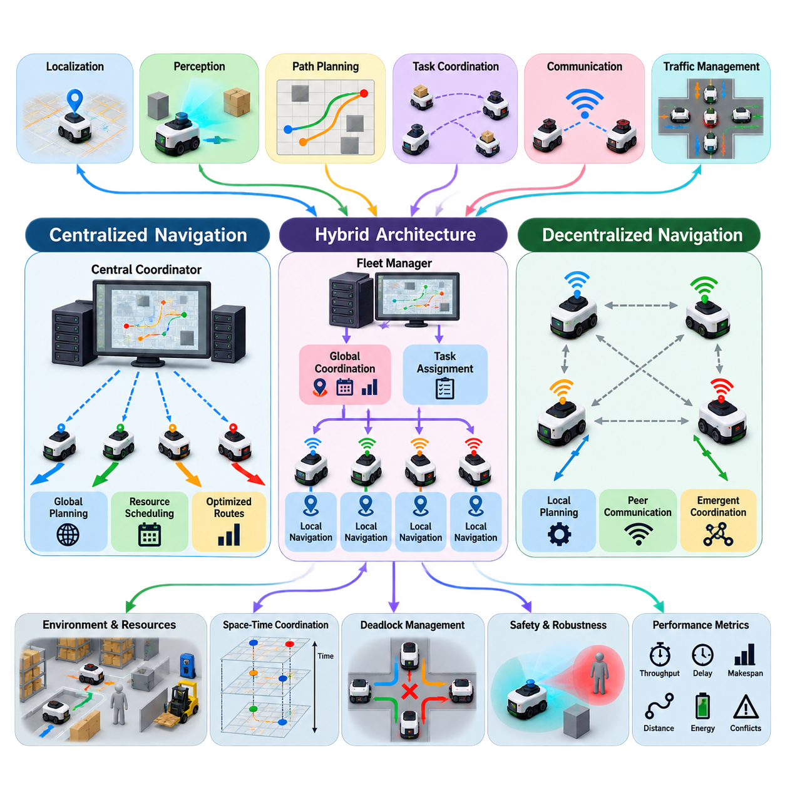
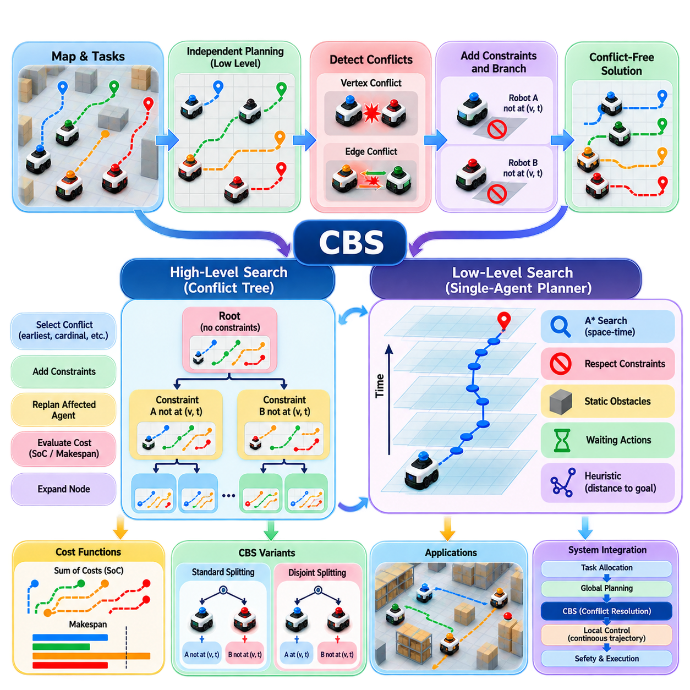
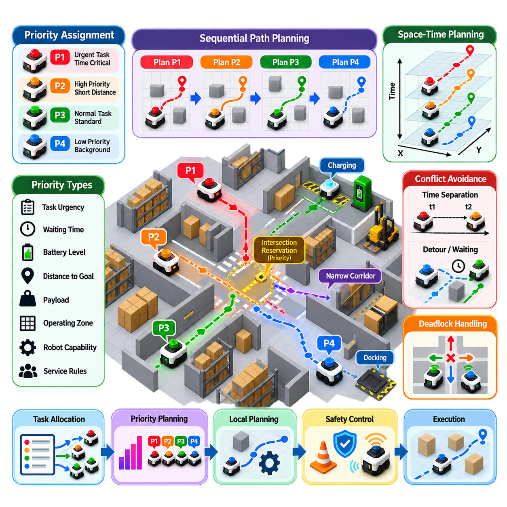
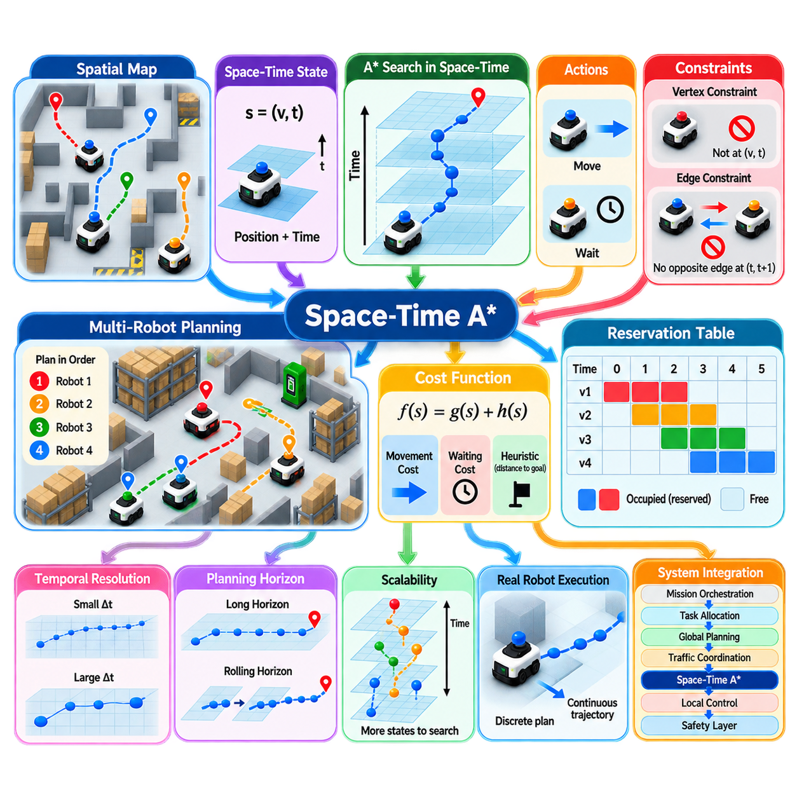
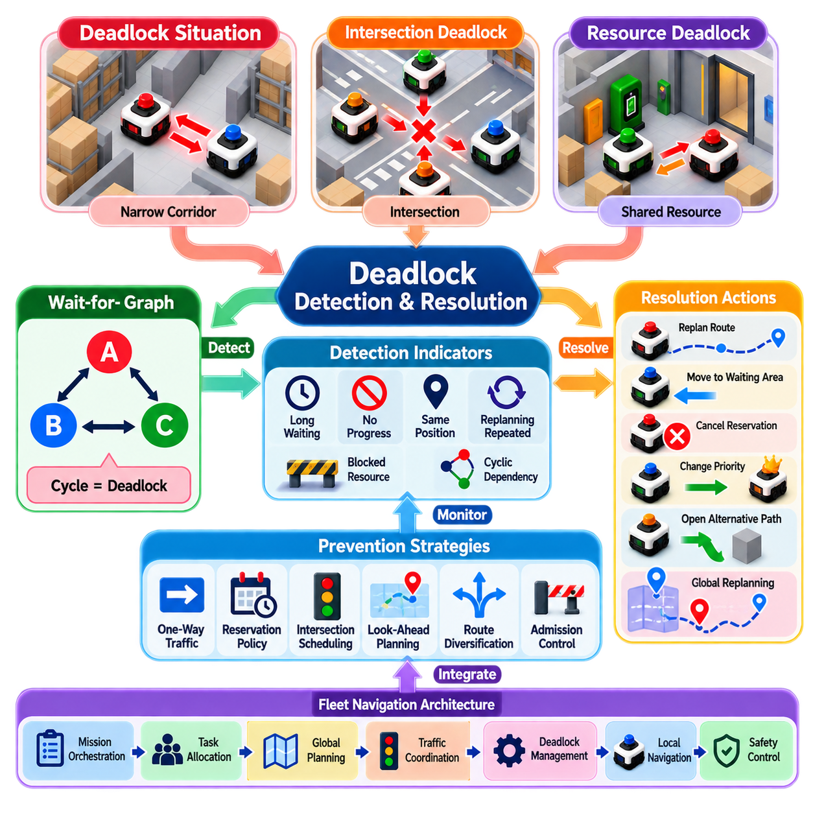
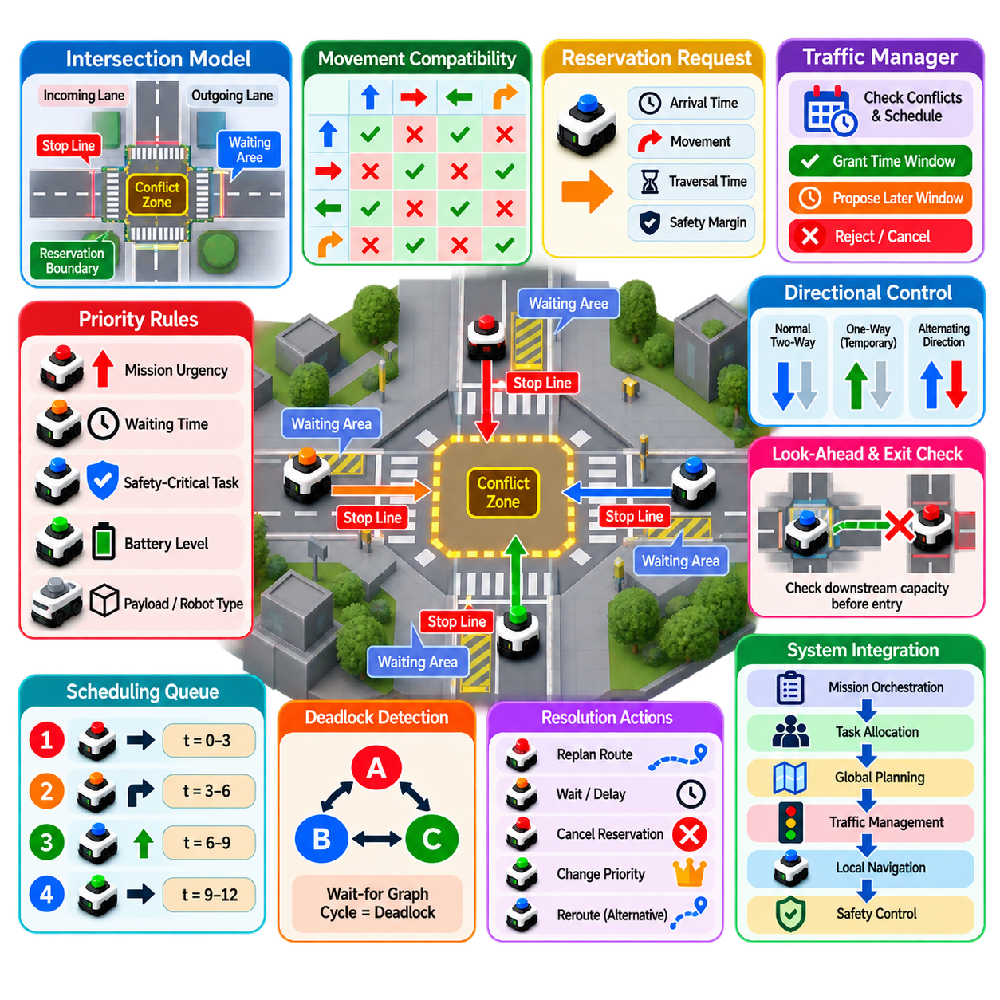
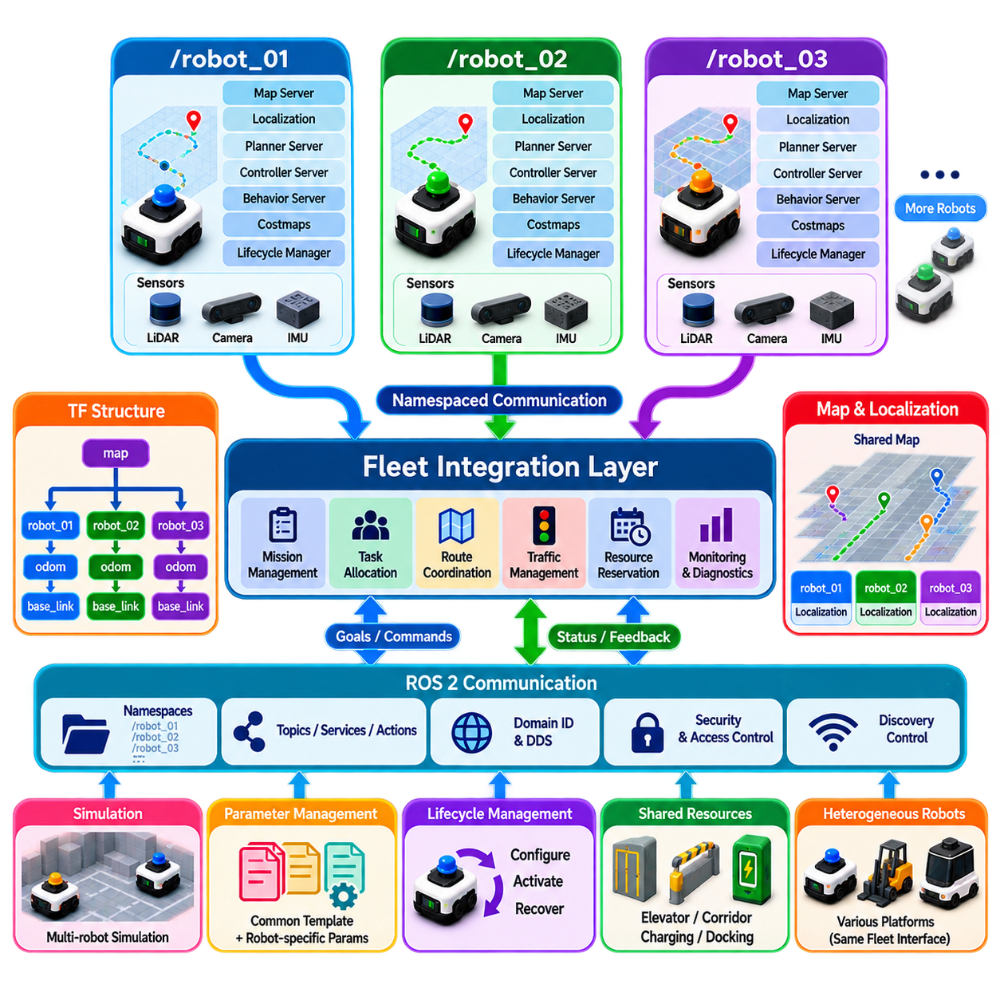
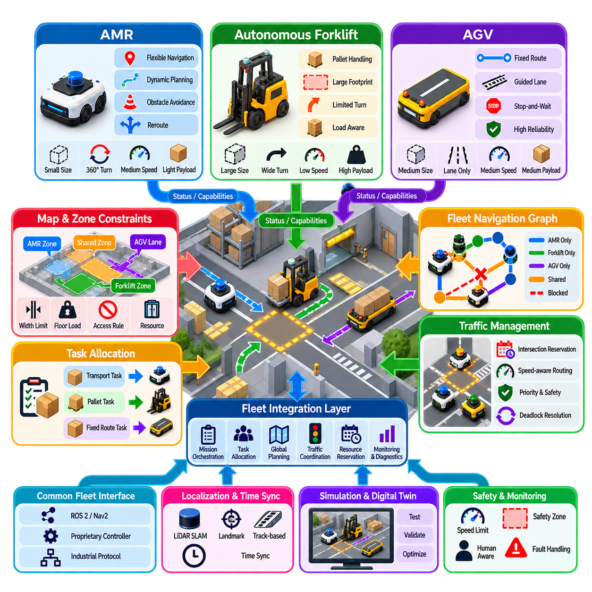
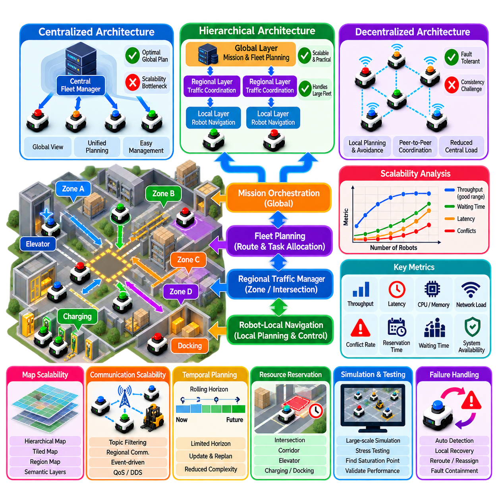
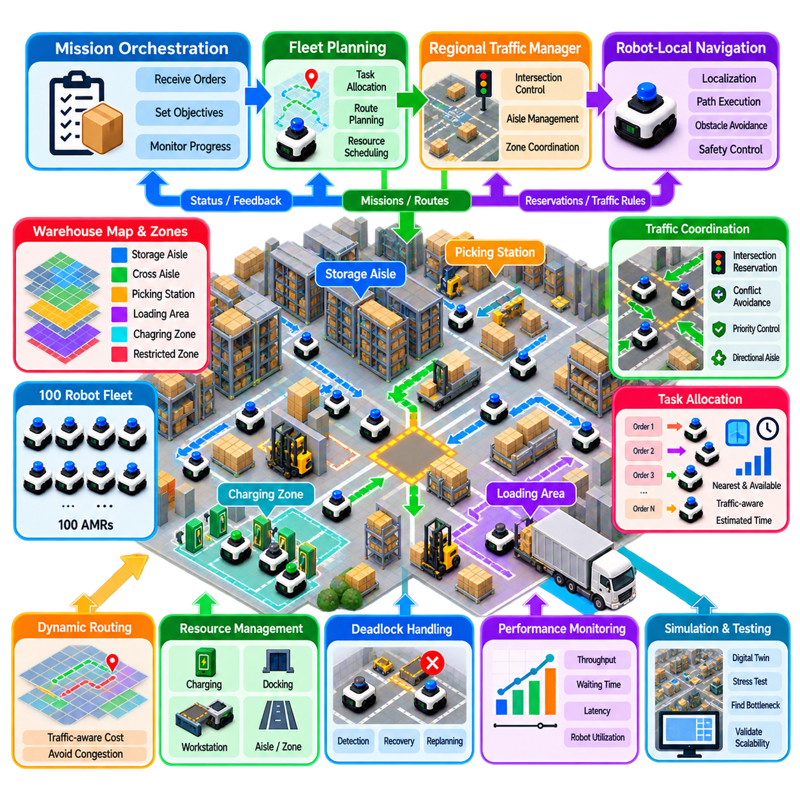

**Volume 15. Motion Planning and Navigation**


# Chapter 07. Multi Robot Navigation

##  

## 07.01. Multi Robot Navigation Architectures Centralized Decentralized

{width="7.268055555555556in" height="7.268055555555556in"}

Multi-robot navigation extends single-robot motion planning into a shared environment where several autonomous robots must reach individual or collective goals without collisions, deadlocks, or inefficient interference. The problem combines localization, perception, path planning, task coordination, communication, and traffic management. Its difficulty grows rapidly because each robot becomes both an intelligent agent and a dynamically changing obstacle for the others.

A multi-robot navigation architecture defines where navigation decisions are computed, how information is exchanged, and how conflicts between robots are resolved. The two fundamental architectural models are centralized and decentralized navigation. Practical systems frequently adopt hybrid forms between these extremes, selecting different coordination mechanisms according to fleet size, communication quality, computational resources, safety requirements, and operational environment.

In a centralized architecture, a central coordinator maintains information about the robots, their goals, maps, planned paths, and relevant environmental conditions. Individual robots periodically transmit their states to this coordinator, which calculates globally coordinated routes or trajectories. Because the coordinator has a system-wide view, it can explicitly consider interactions among robots rather than allowing each robot to optimize its motion independently.

Centralized navigation can formulate the fleet as a joint planning problem. If robot i has state x_i and control input u_i, the planner considers the combined state X = [x_1, x_2, \..., x_N] and searches for motions satisfying obstacle, kinematic, and inter-robot collision constraints. This representation enables global optimization of objectives such as travel distance, mission completion time, congestion, energy consumption, or total fleet throughput.

A major advantage of centralized coordination is its ability to manage shared resources systematically. Narrow corridors, intersections, elevators, docking stations, charging areas, loading zones, and restricted passages can be modeled as resources whose use must be scheduled. The coordinator can assign priorities, reserve spatial or temporal regions, and modify routes before conflicts physically occur, making centralized control attractive for structured warehouses and factories.

Centralized planning nevertheless faces significant scalability challenges. As the number of robots increases, the joint configuration space expands dramatically and the number of possible interactions grows. Exact multi-agent path finding can therefore become computationally expensive for large fleets. Practical implementations reduce complexity through hierarchical planning, prioritized planning, reservation tables, graph decomposition, rolling-horizon optimization, or local replanning around detected conflicts.

Communication is another important dependency. A central coordinator requires sufficiently current robot states to make valid decisions, while robots must receive updated plans with acceptable latency. Packet loss, network congestion, temporary disconnection, or delayed state information can cause the central representation to differ from physical reality. Robust architectures therefore include timestamps, state prediction, communication-health monitoring, local safety controllers, and degraded operating modes.

The central server can also become a logical single point of failure unless redundancy is deliberately designed. Industrial implementations may employ replicated fleet managers, failover servers, persistent mission databases, and distributed safety functions. Importantly, collision prevention should not depend entirely on the central computer. Each robot normally retains local perception and emergency behavior so that unexpected obstacles or communication failures can be handled immediately.

In a decentralized architecture, navigation decisions are distributed among individual robots rather than determined by one global coordinator. Each robot estimates its local environment, plans its motion, observes or receives information about neighboring robots, and adjusts its trajectory accordingly. Coordination emerges from local interactions, shared protocols, negotiation, or distributed optimization instead of a single authority computing every robot\'s movement.

Decentralized navigation offers strong scalability and fault tolerance because computational work is naturally distributed. Failure of one robot does not necessarily disable the remaining fleet, and robots can continue operating when connectivity to infrastructure is unavailable. This property is valuable for outdoor robots, exploration systems, search-and-rescue platforms, agricultural machines, heterogeneous robot teams, and other environments where reliable centralized communication cannot be guaranteed.

The principal difficulty of decentralization is achieving globally efficient behavior from locally available information. Two robots may independently choose routes that are individually optimal but mutually incompatible. Multiple robots can enter symmetric conflicts, repeatedly yield to one another, create oscillations, or form deadlocks around constrained passages. Decentralized systems therefore require explicit rules for priority, right-of-way, negotiation, conflict resolution, and recovery from coordination failures.

Local collision avoidance provides one layer of decentralized interaction. Robots can predict neighboring trajectories and select velocities that preserve separation while maintaining progress toward their goals. Methods based on velocity obstacles, reciprocal collision avoidance, model predictive control, or distributed trajectory optimization can support this behavior. However, purely reactive avoidance cannot always solve structural conflicts involving narrow corridors, bottlenecks, or long-duration resource contention.

Information sharing determines how much coordination decentralized robots can achieve. Robots may exchange pose, velocity, planned trajectory, destination, priority, intent, uncertainty, or reserved regions. Sharing future intent is especially valuable because another robot can react before a physical conflict becomes imminent. Communication protocols must nevertheless tolerate missing messages and inconsistent estimates, since safety cannot assume that every neighboring robot always provides correct and timely information.

Centralized and decentralized architectures therefore represent different distributions of knowledge and authority rather than simply different planning algorithms. Centralization favors global visibility, predictable traffic management, and fleet-level optimization, while decentralization favors autonomy, scalability, resilience, and operation under imperfect communication. The appropriate choice depends strongly on whether the environment is structured and infrastructure-rich or open, dynamic, geographically distributed, and communication-constrained.

Hybrid architectures combine both approaches and are increasingly important for practical robot fleets. A fleet manager may assign missions, global routes, traffic priorities, and resource reservations, while each robot independently performs localization, short-horizon trajectory generation, obstacle avoidance, and emergency stopping. This division prevents the central system from processing every control decision while preserving enough global coordination to reduce congestion and deadlock.

Hierarchical coordination extends the hybrid concept by dividing navigation across multiple spatial and temporal levels. A global layer can allocate destinations and major route segments, a regional coordinator can manage intersections or zones, and individual robots can execute local trajectories. Large facilities may further partition robots into groups or operational regions, allowing coordination complexity to grow more slowly than in a completely centralized fleet-wide planner.

The distinction between static obstacles and other robots is essential in multi-robot navigation. Another robot is not merely a moving obstacle; it has goals, planning capability, and potentially communicable intent. Treating cooperative robots exactly like unpredictable dynamic objects wastes information. Multi-robot systems can instead exploit shared plans, reservations, predicted arrival times, and negotiated priorities to coordinate motion more efficiently than independent obstacle avoidance would permit.

Temporal coordination is as important as geometric path planning. Two robots may safely use the same corridor if they occupy it at different times, meaning navigation should often reason in space-time rather than space alone. Reservation-based systems associate path segments, graph nodes, intersections, or regions with time intervals. This converts many collision conflicts into scheduling problems and enables dense fleets to share constrained infrastructure efficiently.

Deadlock management must be considered at the architectural level. A deadlock occurs when robots remain collision-free but cannot make progress because their planned movements mutually block one another. Detection may use wait-for graphs, timeout conditions, progress metrics, reservation dependencies, or repeated replanning patterns. Recovery can involve priority reassignment, route reversal, temporary retreat, reservation cancellation, or centralized intervention when local negotiation cannot resolve the conflict.

Navigation architecture must also distinguish coordination safety from functional safety. Cooperative planning attempts to prevent conflicts under normal operation, whereas safety mechanisms must protect against localization errors, communication failures, unexpected human motion, controller faults, or incorrect predictions. Independent sensing, speed supervision, protective stopping, minimum separation policies, and conservative fallback behavior provide additional protection when coordination assumptions are violated.

Heterogeneous fleets introduce further architectural complexity because robots may have different footprints, speeds, turning radii, payloads, sensing capabilities, or locomotion mechanisms. A shared navigation representation must therefore describe more than simple point occupancy. Centralized systems can incorporate heterogeneous constraints directly into scheduling, while decentralized systems require common conventions through which robots can interpret one another\'s motion capabilities and intentions.

System performance should ultimately be evaluated at both robot and fleet levels. Individual travel time alone can be misleading because aggressive shortest-path behavior may increase congestion for everyone else. Useful measures include mission throughput, average delay, makespan, distance traveled, energy consumption, conflict frequency, deadlock rate, communication load, planning latency, and recovery time. Architecture selection should therefore be driven by operational performance rather than algorithmic elegance alone.

For real-world deployments, the most robust pattern is often centralized strategic coordination combined with decentralized tactical autonomy. Global information is used where it provides genuine fleet-level value, while time-critical sensing and collision response remain close to each robot. This architecture allows a fleet to exploit shared intelligence without making every movement dependent on uninterrupted connectivity or a continuously available central planner.

As fleets evolve toward large-scale autonomous systems, multi-robot navigation increasingly becomes an orchestration problem rather than only a path-planning problem. Robots must coordinate motion with missions, infrastructure, charging, human activity, and other autonomous agents. Centralized, decentralized, and hybrid architectures provide complementary mechanisms for distributing this intelligence, and successful systems select their boundaries according to latency, scale, uncertainty, safety, and operational objectives.

다중 로봇 내비게이션(Multi-Robot Navigation)은 단일 로봇 모션 플래닝(Motion Planning)을 여러 자율 로봇이 공유 환경에서 각각 또는 공동의 목표에 도달하도록 확장한 개념이다. 이 과정에서는 충돌(Collision), 교착 상태(Deadlock), 비효율적인 상호 간섭을 방지해야 한다. 문제는 위치 추정(Localization), 인지(Perception), 경로 계획(Path Planning), 작업 조정(Task Coordination), 통신(Communication), 교통 관리(Traffic Management)를 통합하며, 각 로봇이 지능형 에이전트(Intelligent Agent)이면서 다른 로봇에게는 동적으로 변화하는 장애물이 되기 때문에 복잡도가 빠르게 증가한다.

다중 로봇 내비게이션 아키텍처(Multi-Robot Navigation Architecture)는 내비게이션 의사결정이 어디에서 계산되는지, 정보가 어떻게 교환되는지, 로봇 사이의 충돌과 경로 갈등이 어떻게 해결되는지를 정의한다. 두 가지 기본적인 아키텍처 모델은 중앙집중형 내비게이션(Centralized Navigation)과 분산형 내비게이션(Decentralized Navigation)이다. 실제 시스템에서는 차량군 규모(Fleet Size), 통신 품질, 연산 자원, 안전 요구사항, 운용 환경에 따라 두 방식의 중간 형태인 하이브리드 구조(Hybrid Architecture)를 자주 사용한다.

중앙집중형 아키텍처(Centralized Architecture)에서는 중앙 조정기(Central Coordinator)가 로봇의 상태, 목표, 지도, 계획된 경로, 관련 환경 조건에 대한 정보를 유지한다. 개별 로봇은 자신의 상태를 주기적으로 중앙 조정기에 전송하고, 중앙 조정기는 전체적으로 조정된 경로나 궤적(Trajectory)을 계산한다. 중앙 조정기는 시스템 전체를 관찰할 수 있으므로 각 로봇이 독립적으로 움직임을 최적화하는 대신 로봇 간 상호작용을 명시적으로 고려할 수 있다.

중앙집중형 내비게이션은 전체 로봇군(Fleet)을 결합 계획 문제(Joint Planning Problem)로 표현할 수 있다. 로봇 i의 상태를 x_i, 제어 입력을 u_i라고 하면 플래너(Planner)는 결합 상태 X = [x_1, x_2, \..., x_N]를 고려하고 장애물, 운동학적 제약(Kinematic Constraint), 로봇 간 충돌 제약을 만족하는 움직임을 탐색한다. 이를 통해 이동 거리, 임무 완료 시간, 혼잡도, 에너지 소비량, 전체 로봇군 처리량(Fleet Throughput) 등의 목표를 전역적으로 최적화할 수 있다.

중앙집중형 조정(Centralized Coordination)의 주요 장점은 공유 자원(Shared Resource)을 체계적으로 관리할 수 있다는 것이다. 좁은 복도, 교차로, 엘리베이터, 도킹 스테이션(Docking Station), 충전 구역, 상하차 구역, 제한 통로 등을 사용 일정이 관리되어야 하는 자원으로 모델링할 수 있다. 중앙 조정기는 우선순위를 할당하고 공간 또는 시간 영역을 예약하며 실제 충돌이 발생하기 전에 경로를 변경할 수 있어 구조화된 창고나 공장 환경에 특히 적합하다.

그러나 중앙집중형 계획(Centralized Planning)은 상당한 확장성(Scalability) 문제를 가진다. 로봇 수가 증가하면 결합 구성 공간(Joint Configuration Space)이 급격하게 커지고 가능한 상호작용의 수도 증가한다. 따라서 정확한 다중 에이전트 경로 탐색(Multi-Agent Path Finding)은 대규모 로봇군에서 높은 연산 비용을 요구할 수 있다. 실제 구현에서는 계층적 계획(Hierarchical Planning), 우선순위 기반 계획(Prioritized Planning), 예약 테이블(Reservation Table), 그래프 분할(Graph Decomposition), 롤링 호라이즌 최적화(Rolling-Horizon Optimization), 충돌 주변의 국부 재계획(Local Replanning) 등을 사용하여 복잡도를 줄인다.

통신(Communication) 역시 중요한 의존 요소이다. 중앙 조정기가 유효한 의사결정을 수행하려면 충분히 최신 상태의 로봇 정보를 확보해야 하며, 로봇은 허용 가능한 지연시간(Latency) 내에 갱신된 계획을 받아야 한다. 패킷 손실(Packet Loss), 네트워크 혼잡, 일시적인 연결 단절, 상태 정보 지연이 발생하면 중앙 시스템의 표현과 실제 물리적 상황 사이에 차이가 발생할 수 있다. 따라서 강건한 아키텍처(Robust Architecture)는 타임스탬프(Timestamp), 상태 예측(State Prediction), 통신 상태 감시, 로컬 안전 제어기(Local Safety Controller), 성능 저하 운용 모드(Degraded Operating Mode)를 포함한다.

중앙 서버(Central Server)는 이중화(Redundancy)를 의도적으로 설계하지 않으면 논리적인 단일 장애점(Single Point of Failure)이 될 수 있다. 산업용 구현에서는 복제된 차량군 관리자(Fleet Manager), 장애 전환 서버(Failover Server), 영속적 임무 데이터베이스(Persistent Mission Database), 분산 안전 기능(Distributed Safety Function)을 적용할 수 있다. 특히 충돌 방지는 중앙 컴퓨터에만 의존해서는 안 되며, 각 로봇은 예상하지 못한 장애물이나 통신 장애에 즉각 대응할 수 있도록 로컬 인지(Local Perception)와 비상 동작(Emergency Behavior)을 유지하는 것이 일반적이다.

분산형 아키텍처(Decentralized Architecture)에서는 모든 내비게이션 의사결정을 하나의 전역 조정기가 결정하는 대신 개별 로봇에 분산한다. 각 로봇은 자신의 주변 환경을 추정하고 움직임을 계획하며 인접 로봇을 직접 관찰하거나 전달받은 정보를 이용해 자신의 궤적을 조정한다. 하나의 중앙 권한이 모든 로봇의 움직임을 계산하는 대신 국부 상호작용(Local Interaction), 공유 프로토콜(Shared Protocol), 협상(Negotiation), 분산 최적화(Distributed Optimization)를 통해 조정된 행동이 형성된다.

분산형 내비게이션(Decentralized Navigation)은 연산 작업이 자연스럽게 여러 로봇으로 분산되기 때문에 높은 확장성과 결함 허용성(Fault Tolerance)을 제공한다. 하나의 로봇에 장애가 발생해도 반드시 전체 로봇군이 정지하는 것은 아니며, 기반시설과의 연결이 불가능한 경우에도 로봇이 계속 동작할 수 있다. 이러한 특성은 야외 로봇, 탐사 시스템, 수색 및 구조(Search and Rescue), 농업 기계, 이기종 로봇 팀(Heterogeneous Robot Team)처럼 안정적인 중앙 통신을 항상 보장하기 어려운 환경에서 중요하다.

분산화(Decentralization)의 핵심적인 어려움은 국부적으로 이용 가능한 정보만으로 전체 시스템 차원의 효율적인 행동을 만들어 내는 것이다. 두 로봇이 각각 독립적으로는 최적인 경로를 선택하더라도 두 경로가 서로 양립하지 못할 수 있다. 여러 로봇이 대칭적인 충돌 상황에 진입하거나 반복적으로 서로 양보하면서 진동(Oscillation)을 일으키거나 제한된 통로 주변에서 교착 상태를 형성할 수 있다. 따라서 분산형 시스템에는 우선순위, 통행권(Right-of-Way), 협상, 충돌 해결, 조정 실패 복구에 대한 명확한 규칙이 필요하다.

로컬 충돌 회피(Local Collision Avoidance)는 분산형 상호작용의 한 계층을 제공한다. 로봇은 주변 로봇의 미래 궤적을 예측하고 목표 방향으로 진행하면서 안전한 분리 거리를 유지하는 속도를 선택할 수 있다. 속도 장애물(Velocity Obstacle), 상호 충돌 회피(Reciprocal Collision Avoidance), 모델 예측 제어(Model Predictive Control), 분산 궤적 최적화(Distributed Trajectory Optimization) 기반의 방법을 사용할 수 있다. 그러나 순수한 반응형 회피(Reactive Avoidance)만으로는 좁은 복도, 병목 구간, 장시간의 자원 경합과 같은 구조적 충돌을 항상 해결할 수 없다.

정보 공유(Information Sharing)는 분산 로봇이 달성할 수 있는 조정 수준을 결정한다. 로봇들은 위치 자세(Pose), 속도, 계획된 궤적, 목적지, 우선순위, 의도(Intent), 불확실성(Uncertainty), 예약 영역 등을 교환할 수 있다. 특히 미래의 이동 의도를 공유하면 다른 로봇이 물리적인 충돌이 임박하기 전에 대응할 수 있다. 그러나 안전 시스템은 모든 주변 로봇이 항상 정확하고 적시에 정보를 제공한다고 가정할 수 없으므로 통신 프로토콜은 메시지 손실과 불일치하는 상태 추정에도 대응할 수 있어야 한다.

따라서 중앙집중형 및 분산형 아키텍처는 단순히 서로 다른 계획 알고리즘(Planning Algorithm)을 의미하는 것이 아니라 지식과 의사결정 권한을 서로 다르게 분배하는 구조라고 볼 수 있다. 중앙집중형 방식은 전역 가시성(Global Visibility), 예측 가능한 교통 관리, 로봇군 수준 최적화에 유리하며, 분산형 방식은 자율성(Autonomy), 확장성, 회복탄력성(Resilience), 불완전한 통신 환경에서의 운용에 유리하다. 적절한 방식은 환경이 구조화되고 기반시설이 충분한지, 또는 개방적이고 동적이며 지리적으로 분산되어 있고 통신 제약이 존재하는지에 따라 달라진다.

하이브리드 아키텍처(Hybrid Architecture)는 두 방식을 결합하며 실제 로봇군에서 점점 중요해지고 있다. 차량군 관리자(Fleet Manager)가 임무, 전역 경로(Global Route), 교통 우선순위, 자원 예약을 결정하는 동안 각 로봇은 위치 추정, 단기 궤적 생성(Short-Horizon Trajectory Generation), 장애물 회피, 비상 정지를 독립적으로 수행할 수 있다. 이러한 역할 분담은 중앙 시스템이 모든 제어 결정을 처리하지 않아도 되게 하면서 혼잡과 교착 상태를 줄이는 데 필요한 전역 조정 능력을 유지한다.

계층적 조정(Hierarchical Coordination)은 내비게이션을 여러 공간적·시간적 수준으로 분할하여 하이브리드 개념을 확장한다. 전역 계층(Global Layer)은 목적지와 주요 경로 구간을 할당하고, 지역 조정기(Regional Coordinator)는 교차로나 특정 구역을 관리하며, 개별 로봇은 로컬 궤적(Local Trajectory)을 실행할 수 있다. 대규모 시설에서는 로봇을 그룹이나 운용 영역으로 추가 분할하여 완전한 중앙집중형 차량군 계획보다 조정 복잡도가 더 완만하게 증가하도록 설계할 수 있다.

정적 장애물(Static Obstacle)과 다른 로봇을 구분하는 것은 다중 로봇 내비게이션에서 매우 중요하다. 다른 로봇은 단순한 이동 장애물이 아니라 목표와 계획 능력을 가지고 있으며 자신의 이동 의도를 통신할 수도 있다. 협력 로봇(Cooperative Robot)을 예측 불가능한 동적 객체와 동일하게 처리하면 활용 가능한 정보를 낭비하게 된다. 대신 공유 계획, 예약 정보, 예상 도착 시간, 협상된 우선순위를 활용하면 독립적인 장애물 회피보다 훨씬 효율적으로 움직임을 조정할 수 있다.

시간적 조정(Temporal Coordination)은 기하학적 경로 계획(Geometric Path Planning)만큼 중요하다. 두 로봇이 서로 다른 시간에 동일한 복도를 사용한다면 안전하게 통과할 수 있으므로 내비게이션은 공간만이 아니라 시공간(Space-Time)을 함께 고려해야 한다. 예약 기반 시스템(Reservation-Based System)은 경로 구간, 그래프 노드, 교차로 또는 특정 영역을 시간 구간과 연결한다. 이를 통해 많은 충돌 문제를 스케줄링 문제(Scheduling Problem)로 변환하고 밀집된 로봇군이 제한된 기반시설을 효율적으로 공유하도록 할 수 있다.

교착 상태 관리(Deadlock Management)는 아키텍처 수준에서 고려되어야 한다. 교착 상태는 로봇들이 서로 충돌하지는 않지만 계획된 움직임이 서로를 차단하여 더 이상 진행하지 못하는 상황이다. 대기 관계 그래프(Wait-for Graph), 타임아웃 조건(Timeout Condition), 진행도 지표(Progress Metric), 예약 의존성(Reservation Dependency), 반복적인 재계획 패턴 등을 이용하여 이를 감지할 수 있다. 복구 방법에는 우선순위 재할당, 경로 역행, 일시적인 후퇴, 예약 취소, 로컬 협상으로 해결할 수 없는 경우의 중앙 개입 등이 포함된다.

내비게이션 아키텍처는 조정 안전성(Coordination Safety)과 기능 안전성(Functional Safety)도 구분해야 한다. 협력 계획은 정상 운용 조건에서 충돌을 방지하는 것을 목적으로 하지만 안전 메커니즘(Safety Mechanism)은 위치 추정 오류, 통신 장애, 예상하지 못한 사람의 움직임, 제어기 고장, 잘못된 예측으로부터 시스템을 보호해야 한다. 독립적인 센싱(Independent Sensing), 속도 감독(Speed Supervision), 보호 정지(Protective Stop), 최소 분리 거리 정책, 보수적인 폴백 동작(Conservative Fallback Behavior)은 조정 과정의 가정이 무너졌을 때 추가적인 보호 계층을 제공한다.

이기종 로봇군(Heterogeneous Fleet)은 로봇마다 외형 크기(Footprint), 속도, 회전 반경, 적재 능력(Payload), 센싱 능력, 이동 메커니즘(Locomotion Mechanism)이 다를 수 있기 때문에 아키텍처를 더욱 복잡하게 만든다. 따라서 공유 내비게이션 표현(Shared Navigation Representation)은 단순한 점유 정보 이상을 표현해야 한다. 중앙집중형 시스템은 이기종 제약을 스케줄링에 직접 포함할 수 있으며, 분산형 시스템에서는 로봇들이 서로의 이동 능력과 의도를 해석할 수 있도록 공통 규약(Common Convention)이 필요하다.

시스템 성능은 궁극적으로 개별 로봇과 전체 로봇군 수준에서 모두 평가되어야 한다. 개별 이동 시간만 평가하면 공격적인 최단 경로 선택이 다른 로봇의 혼잡을 증가시키는 현상을 제대로 반영하지 못할 수 있다. 유용한 평가 지표에는 임무 처리량(Mission Throughput), 평균 지연시간, 전체 완료 시간(Makespan), 이동 거리, 에너지 소비량, 충돌 빈도, 교착 상태 발생률, 통신 부하, 계획 지연시간, 복구 시간 등이 있다. 따라서 아키텍처 선택은 알고리즘 자체의 우아함보다 실제 운용 성능을 기준으로 이루어져야 한다.

실제 시스템 배치(Real-World Deployment)에서는 중앙집중형 전략 조정(Centralized Strategic Coordination)과 분산형 전술 자율성(Decentralized Tactical Autonomy)을 결합하는 방식이 가장 강건한 구조가 되는 경우가 많다. 전역 정보는 로봇군 전체에 실질적인 가치를 제공하는 영역에 사용하고, 시간에 민감한 센싱과 충돌 대응은 각 로봇 가까이에서 수행한다. 이를 통해 전체 로봇군은 공유 지능(Shared Intelligence)의 장점을 활용하면서도 모든 움직임이 지속적인 네트워크 연결이나 중앙 플래너의 가용성에 의존하지 않도록 할 수 있다.

로봇군이 대규모 자율 시스템(Large-Scale Autonomous System)으로 발전함에 따라 다중 로봇 내비게이션은 단순한 경로 계획 문제가 아니라 점차 오케스트레이션 문제(Orchestration Problem)로 확장되고 있다. 로봇은 자신의 움직임뿐만 아니라 임무, 기반시설, 충전, 사람의 활동, 다른 자율 에이전트와도 조정되어야 한다. 중앙집중형, 분산형, 하이브리드 아키텍처는 이러한 지능을 분배하는 상호 보완적인 메커니즘을 제공하며, 성공적인 시스템은 지연시간, 규모, 불확실성, 안전성, 운용 목표에 따라 각 계층의 역할과 경계를 결정한다.

##  

## 07.02. Conflict Based Search CBS for Multi Robot [w/Code]

{width="7.268055555555556in" height="7.268055555555556in"}

Conflict-Based Search (CBS) is a two-level algorithm for Multi-Agent Path Finding (MAPF) that separates global conflict resolution from individual path planning. Instead of searching directly through the enormous joint configuration space of all robots, CBS initially plans a path for each robot independently and then detects conflicts among those paths. When a conflict is found, CBS adds constraints that force the involved robots to make different decisions and recursively resolves the resulting conflicts.

The central idea of CBS is to represent multi-robot coordination through a Conflict Tree (CT). Each node of this tree contains a set of constraints and a corresponding collection of individually planned robot paths. The root node begins with an empty constraint set, so every robot receives its independently optimal path. The resulting paths are then examined for collisions. If no conflict exists, the solution is valid; otherwise, the detected conflict becomes the basis for expanding the conflict tree.

A typical conflict occurs when two robots occupy the same location at the same time or attempt to exchange positions through the same edge in opposite directions. A vertex conflict can be represented as robot A occupying location v at time t while robot B also occupies v at time t. An edge conflict occurs when the two robots traverse the same connection in opposite directions during the same time interval. These conflicts provide precise information about where and when coordination has failed.

When CBS identifies a conflict between two robots, it creates child nodes by adding alternative constraints. For example, if robot A and robot B both attempt to occupy location v at time t, one child node may prohibit robot A from occupying v at t, while the other prohibits robot B from doing so. Each child therefore resolves the specific conflict in a different way. The affected robot then replans its path under the newly introduced constraint.

The lower level of CBS performs Single-Agent Path Finding (SAPF) for individual robots. A common implementation uses A\* search on a space-time representation, where a state contains both spatial position and time. The planner considers static obstacles, robot-specific constraints, and movement capabilities while searching for a feasible path. Because only the robot affected by a newly added constraint normally needs to be replanned, CBS avoids repeatedly recomputing all robot paths.

The high level of CBS searches through the Conflict Tree according to a cost function. A common objective is the Sum of Costs (SoC), which adds the path costs of all robots. Another objective is Makespan, which minimizes the time required for the entire fleet to finish. The selected objective changes the behavior of the planner because minimizing total travel cost can produce a different solution from minimizing the completion time of the slowest robot.

CBS is attractive because it decomposes a difficult combinatorial problem into manageable components. Individual path planning remains relatively simple, while conflicts are handled explicitly at the high level. This structure also provides an interpretable explanation of why a solution changes: a particular robot is replanned because a specific spatial-temporal conflict generated a corresponding constraint. Such explicit reasoning is useful when debugging or validating multi-robot navigation behavior.

The effectiveness of CBS depends strongly on the number and structure of conflicts. If independently generated paths rarely interact, the root node may already provide a solution or require only a few conflict resolutions. In dense environments, however, many robots can repeatedly compete for the same corridors, intersections, or bottlenecks. The Conflict Tree may then grow rapidly because each conflict creates alternative branches, increasing the computational burden of the high-level search.

Conflict selection therefore has an important influence on practical performance. A planner may select the earliest conflict in time, the most constrained conflict, or a conflict expected to divide the search space effectively. Modern CBS variants introduce the concept of conflict cardinality. Cardinal conflicts are those where resolving the conflict necessarily increases the cost of at least one involved path, while non-cardinal conflicts may sometimes be resolved without increasing the objective value. Prioritizing important conflicts can substantially reduce unnecessary exploration.

Constraint propagation is another important consideration. A constraint should be expressed precisely enough to prevent the identified conflict without unnecessarily restricting other feasible solutions. Overly restrictive constraints can eliminate useful paths and increase the search effort, while insufficient constraints may allow the same conflict to reappear. The quality of the constraint representation therefore directly affects both correctness and computational efficiency.

CBS can be extended through techniques such as disjoint splitting, which assigns constraints in a way that can partition the solution space more effectively. Standard splitting generally creates one constraint for each conflicting robot. Disjoint splitting introduces positive and negative constraints so that one branch explicitly requires a particular robot to perform a specific action while the other branch prohibits it. This can reduce duplicated search effort in some problem structures.

The single-agent planner also has a major impact on overall CBS performance. Efficient heuristics can reduce the number of states explored during each replanning operation. Space-time A\* can incorporate admissible heuristics based on distance to the goal while accounting for waiting actions and temporal constraints. For grid-based warehouse environments, precomputed shortest-path distances, directional costs, and map-specific heuristics can further accelerate repeated low-level searches.

A practical CBS implementation must carefully define the temporal model. Robots may be represented as occupying discrete grid cells at discrete time steps, or as moving along edges between successive states. Waiting in place must be explicitly represented because a robot may resolve a conflict simply by delaying its movement. For physical robots, however, discrete plans eventually need to be converted into continuous trajectories that respect acceleration, velocity, turning-radius, and stopping constraints.

This transition from discrete MAPF to physical navigation is one of the most important engineering considerations. A CBS solution that is collision-free on a grid is not automatically safe for real robots. Localization uncertainty, tracking error, robot dimensions, braking distance, controller latency, and dynamic obstacles must be incorporated through appropriate safety margins or downstream trajectory validation. The CBS layer should therefore be viewed as a coordination planner rather than a complete physical safety controller.

CBS is particularly suitable for environments that can be represented effectively as a navigation graph. Warehouse aisles, factory corridors, structured logistics areas, and indoor transportation networks naturally provide nodes and edges through which robots travel. Intersections and narrow passages become conflict hotspots that can be explicitly identified and managed. This makes CBS useful when the operational environment is relatively structured and robot motion can be discretized without excessive loss of realism.

In large industrial fleets, however, applying classical CBS directly to hundreds of robots can become computationally difficult. Dense traffic generates many conflicts, and the corresponding Conflict Tree can expand exponentially in unfavorable cases. Practical systems therefore combine CBS with hierarchical decomposition, regional planning, prioritized planning, traffic zones, rolling-horizon replanning, or fleet-level scheduling. Robots may first be assigned to regions or corridors before CBS resolves conflicts within a smaller planning problem.

CBS can also be combined with reservation-based traffic management. A high-level fleet system can reserve critical resources such as intersections, charging stations, elevators, or narrow corridors, while CBS handles residual conflicts among robots. This creates a layered architecture in which long-term resource allocation and short-term path conflict resolution are separated. Such separation prevents the CBS search from having to reason simultaneously about every operational decision in the entire facility.

The algorithm also interacts naturally with task allocation. If two robots are assigned tasks that require them to use the same constrained area simultaneously, the resulting navigation conflicts may reflect an upstream allocation problem rather than a purely geometric planning problem. A fleet intelligence system can therefore use CBS conflict information as feedback to task assignment, route selection, or scheduling layers. Persistent conflicts may indicate that tasks should be reassigned or that operational priorities need to change.

Robustness requires consideration of execution uncertainty. A planned CBS path assumes that robots follow their trajectories sufficiently closely. If one robot experiences a delay, localization error, obstacle encounter, or temporary communication problem, the original conflict-free plan may no longer remain valid. Runtime monitoring should therefore compare predicted and actual robot states and trigger local or global replanning when deviations exceed defined thresholds.

CBS can be viewed as a bridge between independent robot autonomy and coordinated fleet intelligence. The low-level planner preserves robot-specific navigation capabilities, while the high-level Conflict Tree provides an explicit mechanism for resolving interactions. This separation makes the method conceptually clean and allows different single-robot planners, cost functions, and constraint models to be incorporated without changing the fundamental coordination principle.

For a Physical AI fleet architecture, CBS is most naturally positioned as a tactical multi-robot coordination layer rather than as the complete navigation stack. Mission orchestration can determine what robots should accomplish, task allocation can determine which robot performs each task, global planning can establish broad routes, CBS can resolve conflicts among those routes, and local controllers can convert the resulting paths into dynamically feasible motion. Safety supervision remains independent of this planning chain.

The main value of CBS is therefore not simply that it produces collision-free paths, but that it provides a structured mechanism for reasoning about why independently planned robot behaviors become incompatible and how those conflicts can be systematically resolved. Its two-level architecture, explicit constraints, conflict-driven branching, and compatibility with graph-based environments make it a powerful foundation for multi-robot coordination, while scalability, continuous dynamics, uncertainty, and real-time execution must be addressed through appropriate extensions and architectural integration.

충돌 기반 탐색(Conflict-Based Search, CBS)은 다중 에이전트 경로 탐색(Multi-Agent Path Finding, MAPF)을 위한 2단계 알고리즘(Two-Level Algorithm)으로, 전역적인 충돌 해결(Global Conflict Resolution)과 개별 로봇의 경로 계획(Individual Path Planning)을 분리한다. 모든 로봇의 거대한 결합 구성 공간(Joint Configuration Space)을 직접 탐색하는 대신, CBS는 먼저 각 로봇의 경로를 독립적으로 계획한 후 이러한 경로 사이에서 발생하는 충돌을 탐지한다. 충돌이 발견되면 CBS는 관련 로봇이 서로 다른 결정을 내리도록 제약(Constraint)을 추가하고, 새롭게 발생한 충돌을 재귀적으로 해결한다.

CBS의 핵심 개념은 충돌 트리(Conflict Tree, CT)를 이용하여 다중 로봇 조정을 표현하는 것이다. 충돌 트리의 각 노드는 제약 조건 집합(Set of Constraints)과 이에 대응하는 개별 로봇 경로 집합(Collection of Individual Robot Paths)을 포함한다. 루트 노드(Root Node)는 빈 제약 집합으로 시작하므로 모든 로봇은 자신의 독립적인 최적 경로를 할당받는다. 이후 생성된 경로를 서로 비교하여 충돌을 탐색한다. 충돌이 없으면 해당 해는 유효한 해가 되며, 충돌이 존재하면 탐지된 충돌을 기반으로 충돌 트리를 확장한다.

일반적인 충돌은 두 로봇이 동일한 위치를 동일한 시간에 점유하거나 동일한 에지를 서로 반대 방향으로 통과하려고 할 때 발생한다. 정점 충돌(Vertex Conflict)은 로봇 A가 시간 t에 위치 v를 점유하는 동시에 로봇 B도 같은 위치 v를 점유하는 상황으로 표현할 수 있다. 에지 충돌(Edge Conflict)은 두 로봇이 동일한 연결 구간을 동일한 시간 간격에 서로 반대 방향으로 통과하는 경우에 발생한다. 이러한 충돌은 조정이 실패한 공간적·시간적 위치를 정확하게 나타내는 정보를 제공한다.

CBS가 두 로봇 사이의 충돌을 발견하면 대체 제약(Alternative Constraint)을 추가하여 자식 노드(Child Node)를 생성한다. 예를 들어 로봇 A와 로봇 B가 시간 t에 위치 v를 동시에 점유하려는 경우, 하나의 자식 노드는 로봇 A가 t 시점에 v를 점유하지 못하도록 제한하고, 다른 자식 노드는 로봇 B가 v를 점유하지 못하도록 제한할 수 있다. 따라서 각각의 자식 노드는 서로 다른 방식으로 해당 충돌을 해결한다. 이후 새롭게 추가된 제약 조건을 만족하도록 영향을 받은 로봇의 경로를 재계획한다.

CBS의 하위 계층(Lower Level)은 개별 로봇을 위한 단일 에이전트 경로 탐색(Single-Agent Path Finding, SAPF)을 수행한다. 일반적인 구현에서는 공간과 시간을 함께 표현하는 공간-시간 표현(Space-Time Representation) 위에서 A\* 탐색을 사용하며, 하나의 상태(State)는 공간적 위치와 시간을 모두 포함한다. 플래너는 정적 장애물, 로봇별 제약 조건, 이동 능력 등을 고려하여 실행 가능한 경로를 탐색한다. 새로운 제약이 추가되었을 때 일반적으로 해당 제약의 영향을 받는 로봇만 재계획하면 되므로, CBS는 모든 로봇의 경로를 반복적으로 다시 계산하는 것을 피할 수 있다.

CBS의 상위 계층(High Level)은 비용 함수(Cost Function)를 기준으로 충돌 트리를 탐색한다. 일반적인 목적 함수는 총 비용 합(Sum of Costs, SoC)으로, 모든 로봇의 경로 비용을 합산한다. 또 다른 목적 함수는 전체 완료 시간(Makespan)으로, 전체 차량군이 임무를 완료하는 데 필요한 시간을 최소화한다. 어떤 목적 함수를 선택하는지에 따라 플래너의 행동이 달라진다. 전체 이동 비용을 최소화하는 해는 가장 느린 로봇의 완료 시간을 최소화하는 해와 서로 다를 수 있다.

CBS가 매력적인 이유는 어려운 조합적 문제(Combinatorial Problem)를 관리 가능한 구성 요소로 분해하기 때문이다. 개별 경로 계획은 비교적 단순하게 유지하면서 로봇 간 충돌은 상위 계층에서 명시적으로 처리한다. 이러한 구조는 특정한 해가 변경되는 이유도 설명할 수 있게 한다. 즉, 특정 로봇이 특정 공간적·시간적 충돌 때문에 재계획되었다는 것을 명확하게 추적할 수 있다. 이러한 명시적 추론 구조는 다중 로봇 내비게이션의 디버깅(Debugging)이나 검증(Validation)에도 유용하다.

CBS의 효과는 충돌의 수와 구조에 크게 좌우된다. 독립적으로 생성된 경로가 거의 상호작용하지 않는 경우에는 루트 노드 자체가 이미 유효한 해가 되거나 몇 번의 충돌 해결만 필요할 수 있다. 반면 밀집된 환경에서는 여러 로봇이 동일한 복도, 교차로 또는 병목 구간을 반복적으로 이용하려 할 수 있다. 이 경우 충돌 트리가 빠르게 증가할 수 있으며, 하나의 충돌이 여러 분기를 생성하면서 상위 계층 탐색의 계산 부담이 크게 증가한다.

따라서 충돌 선택(Conflict Selection)은 실제 성능에 중요한 영향을 미친다. 플래너는 시간상 가장 먼저 발생하는 충돌, 가장 제약이 많은 충돌, 또는 탐색 공간을 효과적으로 분할할 것으로 예상되는 충돌을 선택할 수 있다. 최신 CBS 변형에서는 충돌의 카디널리티(Cardinality)를 활용하기도 한다. 카디널 충돌(Cardinal Conflict)은 충돌을 해결할 경우 관련된 로봇 중 적어도 하나의 경로 비용이 반드시 증가하는 충돌이며, 비카디널 충돌(Non-Cardinal Conflict)은 목적 함수의 비용을 증가시키지 않고 해결할 가능성이 있는 충돌이다. 중요한 충돌을 우선적으로 처리하면 불필요한 탐색을 상당히 줄일 수 있다.

제약 전파(Constraint Propagation) 역시 중요한 고려사항이다. 제약 조건은 발견된 충돌을 방지할 수 있을 만큼 정확하게 표현되어야 하지만, 다른 실행 가능한 해를 불필요하게 제한해서는 안 된다. 지나치게 제한적인 제약은 유용한 경로를 제거하여 탐색량을 증가시킬 수 있고, 반대로 제약이 충분하지 않으면 동일한 충돌이 다시 발생할 수 있다. 따라서 제약 표현의 품질은 알고리즘의 정확성과 계산 효율성 모두에 직접적인 영향을 미친다.

CBS는 분리 분할(Disjoint Splitting)과 같은 기법을 통해 확장할 수 있다. 분리 분할은 제약 조건을 보다 효과적으로 할당하여 해 공간(Solution Space)을 효율적으로 분할할 수 있도록 한다. 일반적인 분할(Standard Splitting)은 충돌에 관련된 각 로봇에 하나의 제약을 생성한다. 반면 분리 분할은 양의 제약(Positive Constraint)과 음의 제약(Negative Constraint)을 사용하여 한 분기에서는 특정 로봇이 특정 행동을 반드시 수행하도록 요구하고, 다른 분기에서는 해당 행동을 금지한다. 이러한 방식은 특정한 문제 구조에서 중복 탐색을 줄일 수 있다.

단일 에이전트 플래너(Single-Agent Planner) 역시 전체 CBS 성능에 큰 영향을 미친다. 효율적인 휴리스틱(Heuristic)은 각 재계획 과정에서 탐색해야 하는 상태 수를 줄일 수 있다. 공간-시간 A\*(Space-Time A\*)는 대기 행동(Waiting Action)과 시간적 제약을 고려하면서 목표까지의 거리를 기반으로 한 허용 가능한 휴리스틱(Admissible Heuristic)을 사용할 수 있다. 그리드 기반 창고 환경에서는 사전에 계산된 최단 경로 거리(Precomputed Shortest-Path Distance), 방향별 비용(Directional Cost), 지도 특화 휴리스틱(Map-Specific Heuristic) 등을 활용하여 반복적인 하위 계층 탐색을 더욱 빠르게 만들 수 있다.

실제 CBS 구현에서는 시간 모델(Temporal Model)을 신중하게 정의해야 한다. 로봇은 이산적인 그리드 셀(Discrete Grid Cell)과 이산적인 시간 단계(Discrete Time Step)에서 위치하는 것으로 표현할 수도 있고, 연속적인 상태 사이의 에지를 따라 이동하는 것으로 표현할 수도 있다. 한 위치에서 대기하는 행동도 명시적으로 표현해야 한다. 로봇은 충돌을 해결하기 위해 단순히 이동을 지연시키는 것만으로도 충분한 경우가 있기 때문이다. 그러나 실제 물리 로봇에서는 이러한 이산적인 계획을 결국 가속도, 속도, 회전 반경, 정지 거리 등을 만족하는 연속 궤적(Continuous Trajectory)으로 변환해야 한다.

이산적인 MAPF에서 실제 물리적 내비게이션으로 전환하는 과정은 가장 중요한 엔지니어링 고려사항 중 하나이다. 그리드상에서 충돌이 없는 CBS 해가 실제 로봇에서도 자동으로 안전하다는 의미는 아니다. 위치 추정 불확실성(Localization Uncertainty), 추적 오차(Tracking Error), 로봇의 실제 크기, 제동 거리(Braking Distance), 제어기 지연(Control Latency), 동적 장애물(Dynamic Obstacle) 등을 적절한 안전 여유(Safety Margin) 또는 후단 궤적 검증(Downstream Trajectory Validation)을 통해 반영해야 한다. 따라서 CBS 계층은 완전한 물리적 안전 제어기라기보다는 조정 플래너(Coordination Planner)로 보는 것이 적절하다.

CBS는 내비게이션 그래프(Navigation Graph)로 효과적으로 표현할 수 있는 환경에 특히 적합하다. 창고 통로, 공장 복도, 구조화된 물류 구역, 실내 운송 네트워크 등은 자연스럽게 로봇이 이동하는 노드(Node)와 에지(Edge)로 표현할 수 있다. 교차로와 좁은 통로는 충돌이 집중되는 영역(Conflict Hotspot)이 되며, 이를 명시적으로 식별하고 관리할 수 있다. 따라서 CBS는 운용 환경이 비교적 구조화되어 있고 로봇의 움직임을 과도한 현실성 손실 없이 이산화할 수 있는 경우에 유용하다.

그러나 대규모 산업용 차량군(Large Industrial Fleet)에서 고전적인 CBS를 수백 대의 로봇에 직접 적용하는 것은 계산적으로 어려울 수 있다. 밀집된 교통에서는 많은 충돌이 발생하고, 이에 따라 충돌 트리가 불리한 상황에서 지수적으로 증가할 수 있다. 따라서 실제 시스템에서는 CBS를 계층적 분할(Hierarchical Decomposition), 지역 계획(Regional Planning), 우선순위 기반 계획(Prioritized Planning), 교통 구역(Traffic Zone), 롤링 호라이즌 재계획(Rolling-Horizon Replanning), 차량군 수준 스케줄링(Fleet-Level Scheduling) 등과 결합한다. 먼저 로봇을 특정 지역이나 통로에 할당한 후 더 작은 계획 문제 내부에서 CBS를 적용할 수 있다.

CBS는 예약 기반 교통 관리(Reservation-Based Traffic Management)와도 자연스럽게 결합할 수 있다. 상위 수준의 차량군 시스템은 교차로, 충전 스테이션, 엘리베이터, 좁은 통로와 같은 핵심 자원을 예약하고, CBS는 그 이후 남아 있는 로봇 간 충돌을 처리할 수 있다. 이렇게 하면 장기적인 자원 할당(Long-Term Resource Allocation)과 단기적인 경로 충돌 해결(Short-Term Path Conflict Resolution)을 서로 분리할 수 있다. 이러한 분리는 CBS가 전체 시설의 모든 운용 결정을 동시에 탐색해야 하는 부담을 줄여준다.

CBS는 작업 할당(Task Allocation)과도 자연스럽게 연계된다. 두 로봇에 동일한 제한 구역을 동시에 사용해야 하는 작업이 할당되었다면, 발생하는 내비게이션 충돌은 순수한 기하학적 경로 계획 문제라기보다 상위 단계의 작업 할당 문제를 반영할 수 있다. 따라서 차량군 지능 시스템(Fleet Intelligence System)은 CBS에서 발생하는 충돌 정보를 작업 할당, 경로 선택, 스케줄링 계층에 피드백할 수 있다. 반복적으로 충돌이 발생한다면 작업을 다른 로봇에 재할당하거나 운용 우선순위를 변경해야 한다는 신호로 해석할 수 있다.

강건성(Robustness)을 확보하려면 실행 불확실성(Execution Uncertainty)을 고려해야 한다. CBS 경로는 로봇이 자신의 궤적을 충분히 정확하게 따라간다는 가정을 전제로 한다. 한 로봇이 지연, 위치 추정 오류, 장애물 발생, 일시적인 통신 문제 등을 경험하면 기존의 충돌 없는 계획이 더 이상 유효하지 않을 수 있다. 따라서 런타임 모니터링(Runtime Monitoring)은 예측된 로봇 상태와 실제 상태를 비교하고, 상태 편차가 정의된 임계값을 초과하면 국부 또는 전역 재계획을 실행해야 한다.

CBS는 개별 로봇 자율성(Individual Robot Autonomy)과 협력적인 차량군 지능(Coordinated Fleet Intelligence)을 연결하는 가교로 볼 수 있다. 하위 수준 플래너는 로봇별 내비게이션 능력을 유지하고, 상위 수준의 충돌 트리는 로봇 간 상호작용을 해결하기 위한 명시적인 메커니즘을 제공한다. 이러한 분리 구조는 개념적으로 명확하며, 기본적인 조정 원리를 변경하지 않고도 다양한 단일 로봇 플래너, 비용 함수, 제약 모델을 통합할 수 있도록 한다.

Physical AI 차량군 아키텍처에서 CBS는 완전한 내비게이션 스택(Navigation Stack)이 아니라 전술적 다중 로봇 조정 계층(Tactical Multi-Robot Coordination Layer)으로 배치하는 것이 가장 자연스럽다. 임무 오케스트레이션(Mission Orchestration)은 로봇이 무엇을 수행해야 하는지를 결정하고, 작업 할당(Task Allocation)은 어떤 로봇이 해당 작업을 수행할지를 결정하며, 전역 계획(Global Planning)은 큰 범위의 경로를 설정하고, CBS는 이러한 경로 사이의 충돌을 해결하며, 로컬 제어기(Local Controller)는 최종 경로를 동적으로 실행 가능한 움직임으로 변환한다. 안전 감독(Safety Supervision)은 이러한 계획 체계와 독립적으로 유지되어야 한다.

따라서 CBS의 핵심 가치는 단순히 충돌 없는 경로를 생성하는 데 있는 것이 아니라, 독립적으로 계획된 로봇의 행동이 왜 서로 양립할 수 없게 되었는지를 구조적으로 추론하고 이러한 충돌을 체계적으로 해결할 수 있다는 데 있다. 2단계 아키텍처(Two-Level Architecture), 명시적인 제약 조건(Explicit Constraints), 충돌 기반 분기(Conflict-Driven Branching), 그래프 기반 환경과의 높은 호환성은 CBS를 다중 로봇 조정을 위한 강력한 기반으로 만든다. 다만 확장성(Scalability), 연속 동역학(Continuous Dynamics), 불확실성(Uncertainty), 실시간 실행(Real-Time Execution)은 적절한 확장 기법과 시스템 아키텍처 통합을 통해 별도로 해결해야 한다.

##  

## 07.03. Priority Based Planning for Fleet Navigation [w/Code]

{width="7.268055555555556in" height="7.268055555555556in"}

Priority-Based Planning is a practical multi-robot navigation strategy in which robots are assigned explicit or dynamically computed priorities, and higher-priority robots are planned first. Lower-priority robots then generate paths that avoid the trajectories or reserved resources of robots that have already been planned. Rather than solving the entire fleet as one joint optimization problem, the method decomposes coordination into a sequence of single-robot planning problems.

The fundamental motivation is scalability. As fleet size increases, jointly planning all robot trajectories becomes increasingly expensive because every robot can interact with many others. Priority-Based Planning reduces this complexity by establishing an ordering among robots. Once the order is determined, the planner can treat previously planned trajectories as constraints while calculating paths for subsequent robots, making the approach attractive for real-time industrial fleet navigation.

A priority can be static or dynamic. Static priority may be determined from robot identity, mission class, vehicle capability, operating zone, or predefined service rules. Dynamic priority can instead depend on factors such as remaining travel distance, task urgency, battery condition, waiting time, estimated delay, payload requirements, or proximity to a conflict. Dynamic priorities allow the navigation system to respond to changing operational conditions rather than relying on a permanently fixed hierarchy.

The planning process normally begins by assigning priorities to all active robots. The highest-priority robot plans its route without considering lower-priority robots as planning constraints, while subsequent robots must avoid the trajectories already assigned to higher-priority robots. If robot A has higher priority than robot B, the planner first generates a feasible path for A and then searches for a path for B that does not conflict with A. This process continues until all robots have been processed.

Priority-Based Planning can use a space-time representation in which a robot\'s path specifies both location and time. A lower-priority robot therefore avoids not only locations occupied by higher-priority robots but also locations during the corresponding time intervals. This distinction is important in narrow corridors and intersections because two robots may use the same physical region safely if their passage times are sufficiently separated.

The quality of the priority ordering strongly influences the resulting fleet behavior. An appropriate ordering can produce efficient paths with relatively little waiting, while a poor ordering can force many lower-priority robots to take long detours or wait behind unnecessarily restrictive trajectories. Priority assignment should therefore be treated as a planning variable rather than merely an implementation detail when fleet performance is important.

A common approach is to give priority to robots with urgent or time-critical missions. Emergency transport, safety-related inspection, high-value production tasks, or robots approaching a critical resource may receive temporary priority. Another approach is to prioritize robots that have already waited for a long period. Incorporating waiting time helps prevent starvation, where a robot repeatedly loses priority and remains blocked while other robots continue to receive access to shared routes.

Priority can also be associated with infrastructure resources. At an intersection, for example, one robot may receive a temporary reservation for a critical passage while other robots plan around that reservation. Similar mechanisms can be applied to elevators, narrow aisles, docking stations, charging areas, loading zones, and one-way passages. In this form, priority-based planning becomes closely connected with traffic scheduling and resource management.

One important limitation is incompleteness. A priority ordering can produce a situation in which no feasible path exists for a lower-priority robot even though a solution exists if the robots were planned in another order. The problem is caused by the commitment made by earlier planning decisions. A higher-priority robot may occupy a strategically important corridor or timing window, leaving the lower-priority robot with no feasible alternative.

Priority inversion is another practical concern. A robot with an initially low priority may block a robot with higher operational importance because the priority information does not reflect the current mission state. Dynamic reprioritization can address this problem, but frequent priority changes may introduce instability or cause robots to repeatedly revise their plans. Robust systems therefore require clear rules defining when and how priorities can change.

Deadlock prevention is particularly important in priority-based systems. Two or more robots can become mutually blocked even when each robot individually follows the assigned priority rules. This can occur around narrow passages, closed loops, or shared intersections. Practical implementations can use wait-for graphs, timeout detection, progress monitoring, corridor reservations, or temporary priority escalation to identify and recover from such situations.

Priority-Based Planning can be combined with local reactive collision avoidance. The priority layer determines strategic right-of-way and establishes which robot should proceed through a constrained region, while local planners handle unexpected obstacles and small deviations. For example, a fleet manager may authorize one robot to cross an intersection first, while each robot\'s local controller continuously adjusts velocity to maintain safe separation from people, obstacles, and other vehicles.

The method is especially useful in structured environments where traffic rules can be expressed clearly. Warehouses, factories, distribution centers, hospitals, and campuses often contain recognizable corridors, intersections, charging locations, and operational zones. A navigation graph can represent these structures, while priority rules determine which robots obtain access to constrained graph resources. This combination can provide predictable behavior without requiring computationally expensive global joint planning.

For large fleets, hierarchical priority planning can further improve scalability. A fleet-level planner can establish priorities between missions or zones, a regional planner can determine priorities at local intersections, and each robot can independently perform short-horizon trajectory planning. This hierarchy prevents a single planner from having to resolve every interaction simultaneously and allows computational resources to be concentrated on regions where traffic density and conflict probability are high.

Priority-Based Planning also provides a useful interface between task allocation and navigation. Task assignment determines what each robot needs to accomplish, while priority planning determines how competing movements should be coordinated. If repeated conflicts occur because several robots are assigned tasks requiring the same constrained resource, the system can provide feedback to the task allocator. Tasks may then be rescheduled, reassigned, or temporally separated rather than repeatedly resolving the same navigation conflict.

The approach should not be confused with a complete safety mechanism. Priority determines operational right-of-way, but it cannot guarantee safety against unexpected people, sensor errors, localization failures, communication loss, or mechanical faults. Each robot should therefore retain independent obstacle detection, speed limitation, emergency stopping, and protective behavior. Priority planning operates above these mechanisms and should never override safety constraints merely to preserve traffic efficiency.

Performance evaluation should consider more than whether every robot eventually reaches its destination. Important measures include mission completion time, average and maximum waiting time, travel distance, fleet throughput, congestion, deadlock frequency, priority changes, computational latency, and fairness among robots. A priority policy that produces excellent throughput but repeatedly delays the same subset of robots may be operationally undesirable, while excessive fairness constraints may reduce overall fleet efficiency.

In practical fleet systems, the most effective architecture is often a hybrid arrangement in which priority-based planning provides a lightweight coordination mechanism while other planners handle cases that require deeper search. Normal traffic can be managed through priorities and reservations, while severe conflicts can be escalated to Conflict-Based Search, optimization-based planning, or centralized intervention. This creates a computational hierarchy in which simple cases remain inexpensive and difficult cases receive additional planning effort.

For a Physical AI fleet architecture, Priority-Based Planning can therefore serve as a tactical traffic coordination layer between global mission orchestration and robot-level navigation. Mission orchestration establishes operational objectives, task allocation determines robot responsibilities, priority planning establishes right-of-way and resource access, local planners generate executable trajectories, and independent safety functions supervise physical execution. This separation provides a practical balance between scalability, responsiveness, predictability, and fleet-level coordination.

우선순위 기반 계획(Priority-Based Planning)은 로봇에게 명시적 또는 동적으로 계산된 우선순위(Priority)를 부여하고, 우선순위가 높은 로봇부터 계획하는 실용적인 다중 로봇 내비게이션(Multi-Robot Navigation) 전략이다. 우선순위가 높은 로봇의 경로를 먼저 생성한 후, 우선순위가 낮은 로봇은 이미 계획된 로봇의 궤적(Trajectory)이나 예약된 자원(Resource)을 회피하도록 경로를 생성한다. 전체 차량군(Fleet)을 하나의 결합 최적화 문제로 해결하는 대신, 여러 개의 단일 로봇 계획 문제로 분해하여 조정을 수행한다.

이 방식의 근본적인 목적은 확장성(Scalability)을 확보하는 것이다. 차량군 규모가 증가하면 모든 로봇의 궤적을 동시에 계획하는 비용이 급격하게 증가하는데, 이는 각각의 로봇이 다른 많은 로봇과 상호작용할 수 있기 때문이다. 우선순위 기반 계획은 로봇 사이의 순서를 설정하여 이러한 복잡도를 줄인다. 계획 순서가 결정되면 이미 계획된 로봇의 궤적을 제약 조건으로 취급하면서 다음 로봇의 경로를 계산할 수 있으므로, 실시간 산업용 차량군 내비게이션에 적합하다.

우선순위는 정적(Static) 또는 동적(Dynamic)으로 설정할 수 있다. 정적 우선순위는 로봇의 식별자, 임무 등급, 차량 능력, 운용 구역, 사전에 정의된 서비스 규칙 등에 따라 결정될 수 있다. 반면 동적 우선순위는 남은 이동 거리, 작업 긴급도, 배터리 상태, 예상 지연시간, 대기 시간, 적재 요구사항, 충돌 발생 가능성 또는 특정 구역과의 근접성 등을 고려할 수 있다. 동적 우선순위를 사용하면 영구적으로 고정된 계층에 의존하지 않고 변화하는 운용 조건에 대응할 수 있다.

계획 과정은 일반적으로 현재 활성화된 모든 로봇에 우선순위를 할당하는 것에서 시작한다. 가장 높은 우선순위의 로봇은 낮은 우선순위 로봇을 계획 제약으로 고려하지 않고 자신의 경로를 계획하며, 이후의 로봇은 이미 할당된 상위 우선순위 로봇의 궤적과 충돌하지 않는 경로를 탐색해야 한다. 예를 들어 로봇 A가 로봇 B보다 높은 우선순위를 가진다면 먼저 A의 실행 가능한 경로를 생성하고, 이후 A와 충돌하지 않는 B의 경로를 탐색한다. 이 과정은 모든 로봇이 계획될 때까지 반복된다.

우선순위 기반 계획은 로봇의 경로가 위치와 시간을 모두 포함하는 공간-시간 표현(Space-Time Representation)을 사용할 수 있다. 따라서 낮은 우선순위의 로봇은 상위 우선순위 로봇이 점유하는 위치뿐만 아니라 해당 로봇이 그 위치를 점유하는 시간 구간도 회피해야 한다. 이러한 특성은 좁은 통로와 교차로에서 특히 중요하다. 두 로봇이 충분히 다른 시간에 동일한 물리적 영역을 통과한다면 안전하게 해당 영역을 공유할 수 있기 때문이다.

우선순위 순서의 품질은 최종적인 차량군 행동에 큰 영향을 미친다. 적절한 순서는 대기 시간을 최소화하면서 효율적인 경로를 생성할 수 있지만, 잘못된 순서는 낮은 우선순위 로봇이 불필요하게 긴 우회 경로를 선택하거나 상위 우선순위 로봇 뒤에서 대기하도록 만들 수 있다. 따라서 차량군 성능이 중요한 경우 우선순위 할당은 단순한 구현 세부사항이 아니라 계획의 중요한 변수로 취급해야 한다.

일반적인 방법은 긴급하거나 시간 제약이 있는 임무를 수행하는 로봇에 우선순위를 부여하는 것이다. 긴급 운송, 안전 관련 검사, 중요한 생산 작업 또는 중요한 자원에 접근하고 있는 로봇에는 일시적인 우선순위를 부여할 수 있다. 또 다른 방법은 오랫동안 대기한 로봇을 우선하는 것이다. 대기 시간을 우선순위에 포함하면 특정 로봇이 계속 우선순위를 잃고 다른 로봇들이 계속 자원을 사용하는 동안 장시간 차단되는 기아 상태(Starvation)를 방지할 수 있다.

우선순위는 기반시설 자원(Infrastructure Resource)과 연결할 수도 있다. 예를 들어 교차로에서 하나의 로봇에 중요한 통과 구간에 대한 일시적인 예약(Reservation)을 부여하고, 다른 로봇들은 해당 예약을 피해 경로를 계획하도록 할 수 있다. 동일한 메커니즘은 엘리베이터, 좁은 통로, 도킹 스테이션(Docking Station), 충전 구역, 상하차 구역, 일방통행 구간에도 적용할 수 있다. 이러한 형태의 우선순위 기반 계획은 교통 스케줄링(Traffic Scheduling) 및 자원 관리(Resource Management)와 밀접하게 연결된다.

중요한 한계 중 하나는 완전성(Completeness)이다. 하나의 우선순위 순서로 계획하면 낮은 우선순위 로봇에 실행 가능한 경로가 존재하지 않는 상황이 발생할 수 있으며, 다른 순서로 로봇을 계획했다면 해결책이 존재했을 수도 있다. 이는 앞서 수행된 계획 결정이 이미 고정되었기 때문에 발생한다. 높은 우선순위 로봇이 전략적으로 중요한 통로 또는 시간 구간을 점유하면 낮은 우선순위 로봇이 선택할 수 있는 실행 가능한 대안이 사라질 수 있다.

우선순위 역전(Priority Inversion) 역시 실제 운용에서 중요한 문제이다. 처음에는 낮은 우선순위를 가지고 있던 로봇이 현재의 임무 상태가 우선순위에 제대로 반영되지 않아 운영상 중요한 로봇의 이동을 방해할 수 있다. 동적 우선순위 재조정(Dynamic Reprioritization)은 이러한 문제를 해결할 수 있지만, 우선순위가 지나치게 자주 변경되면 시스템이 불안정해지거나 로봇이 반복적으로 자신의 계획을 수정할 수 있다. 따라서 강건한 시스템에서는 우선순위를 언제, 어떤 조건에서 변경할 수 있는지 명확한 규칙을 정의해야 한다.

교착 상태 방지(Deadlock Prevention)는 우선순위 기반 시스템에서 특히 중요하다. 두 개 이상의 로봇이 할당된 우선순위 규칙을 따르더라도 서로 차단되는 상황이 발생할 수 있다. 이는 좁은 통로, 폐쇄 루프 또는 공유 교차로 주변에서 발생할 수 있다. 실제 구현에서는 대기 관계 그래프(Wait-for Graph), 타임아웃 감지(Timeout Detection), 진행 상태 모니터링(Progress Monitoring), 통로 예약(Corridor Reservation), 일시적인 우선순위 상승(Priority Escalation) 등을 사용하여 이러한 상황을 탐지하고 복구할 수 있다.

우선순위 기반 계획은 로컬 반응형 충돌 회피(Local Reactive Collision Avoidance)와 결합할 수 있다. 우선순위 계층은 전략적인 통행권(Right-of-Way)을 결정하고 제한된 구역을 통과할 로봇을 지정하며, 로컬 플래너(Local Planner)는 예상하지 못한 장애물과 작은 위치 편차에 대응한다. 예를 들어 차량군 관리자가 하나의 로봇에 교차로를 먼저 통과하도록 허가하는 동안, 각 로봇의 로컬 제어기는 사람, 장애물 및 다른 차량과 안전한 거리를 유지하도록 속도를 지속적으로 조정할 수 있다.

이 방식은 교통 규칙을 명확하게 표현할 수 있는 구조화된 환경에 특히 유용하다. 창고, 공장, 물류 센터, 병원, 캠퍼스 등은 일반적으로 명확한 통로, 교차로, 충전 위치 및 운용 구역을 가지고 있다. 내비게이션 그래프(Navigation Graph)는 이러한 구조를 표현할 수 있으며, 우선순위 규칙은 어떤 로봇이 제한된 그래프 자원에 접근할 수 있는지를 결정한다. 이를 통해 계산 비용이 높은 전역 결합 계획(Global Joint Planning)을 사용하지 않고도 예측 가능한 행동을 구현할 수 있다.

대규모 차량군에서는 계층적 우선순위 계획(Hierarchical Priority Planning)을 통해 확장성을 더욱 향상시킬 수 있다. 차량군 수준 플래너(Fleet-Level Planner)는 임무 또는 구역 사이의 우선순위를 설정하고, 지역 플래너(Regional Planner)는 로컬 교차로에서 우선순위를 결정하며, 각 로봇은 독립적으로 단기 궤적 계획(Short-Horizon Trajectory Planning)을 수행할 수 있다. 이러한 계층 구조는 하나의 플래너가 모든 상호작용을 동시에 해결해야 하는 부담을 줄이고, 교통 밀도와 충돌 가능성이 높은 영역에 연산 자원을 집중할 수 있도록 한다.

우선순위 기반 계획은 작업 할당(Task Allocation)과 내비게이션 사이의 유용한 인터페이스도 제공한다. 작업 할당은 각 로봇이 무엇을 수행해야 하는지를 결정하고, 우선순위 계획은 경쟁하는 이동을 어떻게 조정할지를 결정한다. 여러 로봇에 동일한 제한 자원을 사용해야 하는 작업이 할당되어 반복적으로 충돌이 발생한다면, 시스템은 이러한 정보를 작업 할당기로 피드백할 수 있다. 이후 작업을 재스케줄링하거나 다른 로봇에 재할당하거나 시간적으로 분리하여 동일한 내비게이션 충돌을 반복적으로 해결하는 상황을 줄일 수 있다.

이 방법을 완전한 안전 메커니즘(Safety Mechanism)으로 간주해서는 안 된다. 우선순위는 운용상의 통행권을 결정하지만, 예측하지 못한 사람의 움직임, 센서 오류, 위치 추정 실패, 통신 장애 또는 기계적 고장에 대한 안전을 보장할 수는 없다. 따라서 각 로봇은 독립적인 장애물 탐지, 속도 제한, 비상 정지(Emergency Stop), 보호 동작(Protective Behavior)을 유지해야 한다. 우선순위 기반 계획은 이러한 기능보다 상위에서 동작하는 조정 계층이며, 교통 효율성을 유지하기 위해 안전 제약을 무시해서는 안 된다.

성능 평가는 모든 로봇이 최종적으로 목적지에 도달하는지만을 확인해서는 충분하지 않다. 중요한 지표에는 임무 완료 시간(Mission Completion Time), 평균 및 최대 대기 시간, 이동 거리, 차량군 처리량(Fleet Throughput), 혼잡도(Congestion), 교착 상태 발생 빈도, 우선순위 변경 횟수, 계산 지연시간(Computational Latency), 로봇 간 공정성(Fairness) 등이 포함된다. 처리량이 매우 높더라도 동일한 로봇 집합이 반복적으로 지연된다면 운용 측면에서는 바람직하지 않을 수 있으며, 반대로 지나치게 강한 공정성 제약은 전체 차량군 효율을 감소시킬 수 있다.

실제 차량군 시스템에서는 우선순위 기반 계획이 다른 플래너와 결합되는 하이브리드 구조(Hybrid Arrangement)가 효과적이다. 일반적인 교통 상황은 우선순위와 예약을 이용하여 관리하고, 심각한 충돌은 충돌 기반 탐색(Conflict-Based Search, CBS), 최적화 기반 계획(Optimization-Based Planning), 중앙집중형 개입(Centralized Intervention)으로 확대 처리할 수 있다. 이러한 구조는 단순한 문제는 낮은 계산 비용으로 처리하고 어려운 문제에 대해서만 추가적인 계획 연산을 수행하는 계산 계층(Computational Hierarchy)을 형성한다.

Physical AI 차량군 아키텍처에서 우선순위 기반 계획(Priority-Based Planning)은 전역 임무 오케스트레이션(Global Mission Orchestration)과 로봇 수준 내비게이션(Robot-Level Navigation) 사이의 전술적 교통 조정 계층(Tactical Traffic Coordination Layer)으로 활용할 수 있다. 임무 오케스트레이션은 운용 목표를 설정하고, 작업 할당은 로봇의 책임을 결정하며, 우선순위 계획은 통행권과 자원 접근을 설정하고, 로컬 플래너는 실행 가능한 궤적을 생성하며, 독립적인 안전 기능은 물리적 실행을 감독한다. 이러한 역할 분리는 확장성, 응답성, 예측 가능성, 차량군 수준의 조정 능력 사이에서 실용적인 균형을 제공한다.

##  

## 07.04. Space Time A Star for Multi Robot [w/Code]

{width="7.268055555555556in" height="7.268055555555556in"}

Space-Time A\* for Multi-Robot Navigation extends conventional A\* search by incorporating time directly into the navigation state. Instead of representing a state only as a spatial position, the planner represents it as a position-time pair, such as (x, y, t). This allows the planner to determine not only where a robot should move, but also when it should occupy each location. Such temporal reasoning is essential when several robots share corridors, intersections, docking areas, or other constrained spaces.

In conventional A\* planning, the primary objective is to find a low-cost path from a start position to a goal position while avoiding static obstacles. This representation is insufficient for multi-robot navigation because another robot can occupy the same location at a different time without creating a collision. Space-Time A\* therefore expands the search domain from a two-dimensional or three-dimensional spatial graph into a space-time graph. Each transition represents both a spatial movement and a corresponding change in time.

A typical Space-Time A\* state can be expressed as s = (v, t), where v represents a spatial node and t represents the associated time step. From this state, the robot may move to a neighboring node or remain at the current node for one or more time steps. The waiting action is particularly important because many multi-robot conflicts can be resolved simply by delaying a robot rather than forcing it to take a long alternative route. The planner therefore treats temporal waiting as an explicit navigation decision.

Collision avoidance is implemented by representing the predicted occupancy of other robots as space-time constraints. If another robot is expected to occupy node v at time t, the current robot cannot enter v at that same time. Edge conflicts must also be considered when two robots attempt to traverse the same connection in opposite directions during the same interval. A valid Space-Time A\* planner therefore evaluates both vertex occupancy and edge traversal constraints when expanding candidate states.

The cost function combines movement cost, waiting cost, and heuristic estimates of the remaining distance to the goal. A typical formulation can be written as f(s) = g(s) + h(s), where g represents the accumulated cost from the start and h estimates the remaining cost. The heuristic can often use the shortest spatial distance to the goal while ignoring other robots. When the heuristic remains admissible, A\* can preserve optimality with respect to the defined discrete planning model.

Temporal planning creates an important tradeoff between search-space size and planning accuracy. If the planner uses a very small time step, it can represent motion more precisely but must search through many more states. A larger time step reduces computational requirements but may miss important timing relationships or produce trajectories that are difficult to execute physically. Practical systems therefore select the temporal resolution according to robot speed, control frequency, map resolution, safety distance, and expected traffic density.

The planning horizon is another important design parameter. A long horizon provides more information about future conflicts and can generate globally consistent paths, but it increases memory and computational requirements. A short horizon supports rapid replanning and adapts well to dynamic environments, but decisions made near the current robot state may create conflicts later. Rolling-horizon Space-Time A\* addresses this problem by repeatedly planning a limited future interval and updating the solution as new robot states and environmental information become available.

Space-Time A\* becomes particularly useful when combined with reservations. A reservation table records which locations or edges are expected to be occupied during specific time intervals. The planner consults this table while expanding states and rejects transitions that violate existing reservations. Reservations can originate from previously planned robot trajectories, fleet-level traffic management, intersection scheduling, charging operations, elevator access, or other shared-resource mechanisms.

The order in which robots generate their space-time paths can strongly influence the final result. A sequential planner may first create a path for one robot and then treat that path as a reservation when planning the next robot. This approach is computationally attractive because each search remains a single-robot problem, but it can suffer from poor priority ordering. A robot planned later may be forced to wait or take a significant detour even though a different planning order could have produced a more efficient fleet solution.

Space-Time A\* can also operate as the low-level planner within more advanced multi-robot algorithms. In Conflict-Based Search, for example, the high-level Conflict Tree identifies conflicts and introduces constraints, while Space-Time A\* can replan the affected robot under those constraints. This separation is powerful because the high-level algorithm reasons about fleet-level conflicts while the low-level planner remains responsible for generating physically and temporally consistent individual paths.

For real robots, a discrete Space-Time A\* solution must eventually be converted into a continuous trajectory. The discrete plan may specify that a robot occupies a sequence of graph nodes at particular time steps, but the physical controller must execute corresponding velocities, accelerations, turns, and stopping behavior. Robot dimensions, localization uncertainty, braking distance, control latency, and dynamic obstacles therefore require safety margins around the nominal space-time plan. The planning layer should not be treated as a replacement for independent collision detection and safety control.

The method is especially effective in structured environments where navigation can be represented as a graph. Warehouses, factories, hospitals, airports, and logistics facilities often contain predictable corridors, intersections, doors, elevators, charging stations, and docking locations. These structures can be represented as spatial nodes and edges, while temporal occupancy determines when each resource can be used. Space-Time A\* therefore provides a natural bridge between geometric path planning and traffic scheduling.

Scalability remains a major challenge because adding the temporal dimension significantly increases the number of searchable states. A spatial node that could previously be represented once may now need to be considered at many different time steps. Large fleets further increase the number of occupancy constraints that must be checked. Practical implementations therefore use bounded planning horizons, efficient heuristics, hierarchical maps, conflict-focused replanning, reservation compression, and regional decomposition to control computational complexity.

A robust implementation should also account for uncertainty in predicted robot trajectories. A reservation generated several seconds earlier may become inaccurate if a robot slows down, encounters an obstacle, loses localization accuracy, or experiences communication delay. Instead of treating reservations as permanently fixed, the system can associate uncertainty margins and validity intervals with them. Runtime monitoring can then compare predicted and actual states and trigger replanning when deviations exceed predefined thresholds.

Space-Time A\* can be integrated into a broader fleet navigation architecture as a tactical trajectory-planning component. Mission orchestration determines the operational objective, task allocation determines which robot performs each task, global planning establishes broad routes, and traffic coordination manages shared resources. Space-Time A\* then generates time-consistent local or regional paths that respect the resulting constraints, while a local controller executes the trajectory and an independent safety layer supervises physical motion.

The principal value of Space-Time A\* is that it transforms multi-robot navigation from a purely spatial problem into a space-time coordination problem. Two robots do not necessarily need different routes when they can safely use the same route at different times. By explicitly representing waiting, temporal occupancy, edge traversal, reservations, and future conflicts, Space-Time A\* provides a practical foundation for coordinated fleet navigation. Its effectiveness ultimately depends on appropriate temporal resolution, search horizon, heuristic design, reservation management, and integration with higher-level fleet intelligence and lower-level safety control.

공간-시간 A\*(Space-Time A\*)는 내비게이션 상태에 시간(Time)을 직접 포함시켜 기존의 A\* 탐색을 확장한 방법이다. 일반적인 A\*가 상태를 공간적 위치만으로 표현하는 것과 달리, 공간-시간 A\*는 상태를 위치-시간 쌍(Position-Time Pair), 예를 들어 (x, y, t)로 표현한다. 이를 통해 플래너는 로봇이 어디로 이동해야 하는지뿐만 아니라 각 위치를 언제 점유해야 하는지도 결정할 수 있다. 이러한 시간적 추론(Temporal Reasoning)은 여러 로봇이 복도, 교차로, 도킹 구역, 기타 제한된 공간을 공유할 때 필수적이다.

기존 A\* 계획에서는 일반적으로 정적 장애물을 회피하면서 시작 위치에서 목표 위치까지 비용이 낮은 경로를 찾는 것이 주요 목적이다. 그러나 다중 로봇 내비게이션에서는 이러한 표현만으로 충분하지 않다. 다른 로봇이 서로 다른 시간에 동일한 위치를 점유한다면 반드시 충돌이 발생하는 것은 아니기 때문이다. 따라서 공간-시간 A\*는 탐색 영역을 2차원 또는 3차원의 공간 그래프에서 공간-시간 그래프(Space-Time Graph)로 확장한다. 각 전이는 공간적인 이동과 그에 대응하는 시간의 변화를 동시에 나타낸다.

일반적인 공간-시간 A\* 상태는 s = (v, t)로 표현할 수 있으며, 여기서 v는 공간 노드(Spatial Node), t는 해당 시간 단계(Time Step)를 의미한다. 이 상태에서 로봇은 인접 노드로 이동하거나 현재 노드에서 하나 이상의 시간 단계 동안 대기할 수 있다. 대기 행동(Waiting Action)은 매우 중요하다. 많은 다중 로봇 충돌은 로봇이 장거리 우회 경로를 선택하는 대신 단순히 이동을 지연시키는 것만으로 해결할 수 있기 때문이다. 따라서 플래너는 시간적 대기를 명시적인 내비게이션 의사결정으로 취급한다.

충돌 회피(Collision Avoidance)는 다른 로봇의 예측된 점유 상태를 공간-시간 제약(Space-Time Constraint)으로 표현하여 수행한다. 다른 로봇이 시간 t에 노드 v를 점유할 것으로 예상된다면 현재 로봇은 동일한 시간에 v로 진입할 수 없다. 두 로봇이 동일한 연결 구간을 동일한 시간 간격에 서로 반대 방향으로 통과하려는 경우에는 에지 충돌(Edge Conflict)도 고려해야 한다. 따라서 유효한 공간-시간 A\* 플래너는 후보 상태를 확장할 때 정점 점유(Vertex Occupancy)와 에지 통과(Edge Traversal) 제약을 모두 평가해야 한다.

비용 함수(Cost Function)는 이동 비용(Movement Cost), 대기 비용(Waiting Cost), 목표까지의 남은 비용을 추정하는 휴리스틱(Heuristic)을 결합한다. 일반적인 표현은 f(s) = g(s) + h(s)로 나타낼 수 있으며, g는 시작점부터 현재 상태까지 누적된 비용을 나타내고 h는 현재 상태에서 목표까지의 남은 비용을 추정한다. 휴리스틱은 다른 로봇을 무시한 목표까지의 최단 공간 거리(Shortest Spatial Distance)를 사용할 수 있다. 휴리스틱이 허용 가능한 휴리스틱(Admissible Heuristic) 조건을 유지한다면 A\*는 정의된 이산 계획 모델(Discrete Planning Model)에 대해 최적성을 유지할 수 있다.

시간적 계획(Temporal Planning)은 탐색 공간의 크기와 계획 정확성 사이에 중요한 균형을 만든다. 매우 작은 시간 단계를 사용하면 움직임을 더욱 정밀하게 표현할 수 있지만 훨씬 많은 상태를 탐색해야 한다. 반대로 큰 시간 단계를 사용하면 계산량을 줄일 수 있지만 중요한 시간 관계를 놓치거나 실제 물리 로봇에서 실행하기 어려운 궤적이 생성될 수 있다. 따라서 실제 시스템에서는 로봇 속도, 제어 주기, 지도 해상도, 안전 거리, 예상 교통 밀도 등을 기준으로 시간 해상도(Temporal Resolution)를 결정한다.

계획 지평(Planning Horizon) 역시 중요한 설계 변수이다. 긴 계획 지평은 미래 충돌에 대한 더 많은 정보를 제공하고 전역적으로 일관된 경로를 생성할 수 있지만 메모리와 계산량이 증가한다. 짧은 지평은 빠른 재계획(Replanning)을 지원하고 동적 환경에 잘 적응할 수 있지만 현재 로봇 위치 주변에서 이루어진 결정이 이후 충돌을 발생시킬 수 있다. 롤링 호라이즌 공간-시간 A\*(Rolling-Horizon Space-Time A\*)는 제한된 미래 구간을 반복적으로 계획하고 새로운 로봇 상태와 환경 정보를 반영하여 해를 갱신함으로써 이러한 문제를 해결한다.

공간-시간 A\*는 예약(Reservation)과 결합할 때 특히 유용하다. 예약 테이블(Reservation Table)은 특정 시간 구간 동안 어떤 위치 또는 에지가 점유될 것으로 예상되는지를 기록한다. 플래너는 상태를 확장하는 과정에서 이 테이블을 참조하고 기존 예약을 위반하는 전이를 거부한다. 예약 정보는 이미 계획된 다른 로봇의 궤적, 차량군 수준 교통 관리(Fleet-Level Traffic Management), 교차로 스케줄링(Intersection Scheduling), 충전 작업, 엘리베이터 접근 또는 기타 공유 자원 관리에서 생성될 수 있다.

로봇이 공간-시간 경로를 생성하는 순서 역시 최종 결과에 큰 영향을 미친다. 순차적 플래너(Sequential Planner)는 먼저 한 로봇의 경로를 생성한 다음 그 경로를 다음 로봇의 계획에서 예약으로 취급할 수 있다. 이 방식은 각각의 탐색이 단일 로봇 문제로 유지되기 때문에 계산적으로 유리하지만 우선순위 순서가 좋지 않으면 문제가 발생할 수 있다. 나중에 계획되는 로봇은 불필요하게 긴 대기나 우회 경로를 선택해야 할 수 있으며, 다른 계획 순서를 사용했다면 훨씬 효율적인 차량군 해를 얻을 수 있었을 가능성이 있다.

공간-시간 A\*는 더욱 고도화된 다중 로봇 알고리즘의 하위 수준 플래너(Low-Level Planner)로도 사용할 수 있다. 예를 들어 충돌 기반 탐색(Conflict-Based Search, CBS)에서는 상위 수준 충돌 트리(Conflict Tree)가 충돌을 식별하고 제약을 추가하는 반면, 공간-시간 A\*는 해당 제약 조건을 적용하여 영향을 받은 로봇의 경로를 재계획할 수 있다. 이러한 분리는 상위 수준 알고리즘이 차량군 전체의 충돌을 처리하고 하위 수준 플래너는 개별 로봇의 공간적·시간적으로 일관된 경로를 생성하도록 하기 때문에 매우 강력하다.

실제 로봇에서는 이산적인 공간-시간 A\* 해를 최종적으로 연속 궤적(Continuous Trajectory)으로 변환해야 한다. 이산 계획은 특정 시간 단계에 로봇이 일련의 그래프 노드를 점유하도록 지정하지만, 물리적 제어기는 이에 대응하는 속도, 가속도, 회전, 정지 동작을 실행해야 한다. 따라서 로봇의 크기, 위치 추정 불확실성(Localization Uncertainty), 추적 오차(Tracking Error), 제동 거리(Braking Distance), 제어 지연(Control Latency), 동적 장애물(Dynamic Obstacle) 등을 고려하여 명목상의 공간-시간 계획 주변에 안전 여유(Safety Margin)를 설정해야 한다. 계획 계층을 독립적인 충돌 감지 및 안전 제어의 대체 수단으로 취급해서는 안 된다.

이 방법은 내비게이션을 그래프로 표현할 수 있는 구조화된 환경에서 특히 효과적이다. 창고, 공장, 병원, 공항, 물류 시설에는 예측 가능한 복도, 교차로, 문, 엘리베이터, 충전 스테이션, 도킹 위치 등이 존재하는 경우가 많다. 이러한 구조를 공간 노드와 에지로 표현하고 시간적 점유 정보를 통해 각 자원을 언제 사용할 수 있는지를 결정할 수 있다. 따라서 공간-시간 A\*는 기하학적 경로 계획(Geometric Path Planning)과 교통 스케줄링(Traffic Scheduling)을 연결하는 자연스러운 방법을 제공한다.

확장성(Scalability)은 여전히 중요한 문제이다. 시간 차원을 추가하면 탐색해야 하는 상태의 수가 크게 증가하기 때문이다. 기존에는 하나의 공간 노드로 표현할 수 있었던 위치가 이제 여러 시간 단계에서 각각 고려되어야 한다. 대규모 차량군에서는 확인해야 할 점유 제약의 수도 증가한다. 따라서 실제 구현에서는 제한된 계획 지평(Bounded Planning Horizon), 효율적인 휴리스틱, 계층적 지도(Hierarchical Map), 충돌 중심 재계획(Conflict-Focused Replanning), 예약 정보 압축(Reservation Compression), 지역 분할(Regional Decomposition) 등을 사용하여 계산 복잡도를 관리한다.

강건한 구현에서는 예측된 로봇 궤적의 불확실성도 고려해야 한다. 몇 초 전에 생성된 예약 정보는 로봇이 속도를 늦추거나 장애물을 만나거나 위치 추정 정확도가 떨어지거나 통신 지연이 발생하면 실제 상황과 달라질 수 있다. 예약을 영구적으로 고정된 것으로 취급하는 대신 불확실성 여유(Uncertainty Margin)와 유효 시간 구간(Validity Interval)을 연결할 수 있다. 런타임 모니터링(Runtime Monitoring)은 예측 상태와 실제 상태를 비교하고 편차가 사전에 정의된 임계값을 초과하면 재계획을 실행할 수 있다.

공간-시간 A\*는 전체 차량군 내비게이션 아키텍처에서 전술적 궤적 계획(Tactical Trajectory Planning) 구성요소로 통합할 수 있다. 임무 오케스트레이션(Mission Orchestration)은 운용 목표를 결정하고, 작업 할당(Task Allocation)은 어떤 로봇이 각 작업을 수행할지 결정하며, 전역 계획(Global Planning)은 전체적인 경로를 설정하고, 교통 조정(Traffic Coordination)은 공유 자원을 관리한다. 이후 공간-시간 A\*는 이러한 제약을 만족하는 시간 일관적 경로(Time-Consistent Path)를 지역 또는 전술 수준에서 생성하고, 로컬 제어기(Local Controller)는 해당 궤적을 실행하며 독립적인 안전 계층(Safety Layer)은 물리적 움직임을 감독한다.

공간-시간 A\*의 핵심 가치는 다중 로봇 내비게이션을 순수한 공간 문제에서 공간-시간 조정 문제(Space-Time Coordination Problem)로 전환한다는 데 있다. 두 로봇이 서로 다른 시간에 동일한 경로를 안전하게 사용할 수 있다면 반드시 서로 다른 경로를 선택할 필요는 없다. 대기, 시간적 점유, 에지 통과, 예약, 미래 충돌을 명시적으로 표현함으로써 공간-시간 A\*는 협력적인 차량군 내비게이션을 위한 실용적인 기반을 제공한다. 궁극적인 성능은 적절한 시간 해상도, 탐색 지평, 휴리스틱 설계, 예약 관리, 그리고 상위 수준의 차량군 지능 및 하위 수준의 안전 제어와의 통합에 달려 있다.

##  

## 07.05. Deadlock Detection and Resolution in Fleet [w/Code]

{width="7.268055555555556in" height="7.268055555555556in"}

Deadlock in a robot fleet occurs when two or more robots remain operational and collision-free but cannot make meaningful progress because their movements mutually prevent one another. Unlike a direct collision, a deadlock can persist indefinitely without any physical contact. Typical situations include robots facing each other in a narrow corridor, multiple robots waiting at an intersection, or vehicles blocking one another around a shared resource. Deadlock detection and resolution are therefore essential components of reliable fleet navigation.

Deadlock can be understood as a dependency problem among robots. Robot A may be waiting for a passage currently occupied by robot B, while B is waiting for a region controlled by robot C, and C may be waiting for A. Each robot is individually following its navigation rules, yet the combined system has entered a circular dependency. This means that collision avoidance alone is insufficient. A fleet navigation system must also reason about progress, waiting relationships, resource dependencies, and whether the current traffic state can eventually resolve itself.

One of the most useful representations for deadlock analysis is the Wait-for Graph (WFG). Each robot is represented as a node, and a directed edge from robot A to robot B indicates that A is waiting for B to release a required resource or spatial region. If the graph contains a directed cycle, such as A waiting for B, B waiting for C, and C waiting for A, the system has a strong indication of circular deadlock. The graph can be continuously updated as reservations, trajectories, and robot states change.

Not every long waiting period represents a deadlock. A robot may legitimately wait for another robot to clear an intersection, for a door to open, or for a higher-priority vehicle to pass. Deadlock detection must therefore distinguish normal temporary waiting from persistent lack of progress. Useful indicators include waiting duration, repeated failure to advance, unchanged robot position, blocked-resource persistence, cyclic dependencies, and repeated replanning without measurable improvement.

Time thresholds provide a simple mechanism for detecting suspicious behavior. If a robot remains below a defined progress threshold for longer than an expected interval, the fleet manager can mark it as potentially blocked. However, a fixed timeout is insufficient for all environments because expected waiting time differs between a small warehouse intersection and a congested production facility. More robust systems combine timeouts with spatial dependency information, traffic density, task urgency, and historical movement patterns.

Deadlocks can occur at several levels of fleet operation. A local deadlock may involve two or three robots around a single corridor or intersection, while a regional deadlock may involve many robots and multiple connected resources. A system-wide deadlock can occur when congestion propagates across several zones and prevents meaningful fleet progress. The detection architecture should therefore support multiple spatial scales rather than assuming that every deadlock can be solved by modifying one robot\'s local trajectory.

Resource reservation is a major source of deadlock. A robot may reserve a downstream region before entering a narrow passage, while another robot simultaneously reserves the passage required by the first robot. If both robots retain their reservations while waiting, neither can proceed. This is sometimes described as a hold-and-wait condition. Preventing such situations requires reservation policies that consider not only the resource currently occupied but also the resources that a robot will need to complete its planned movement.

Priority-based navigation can also create deadlocks when priorities are applied too rigidly. A high-priority robot may receive continuous access to shared resources while lower-priority robots accumulate behind it. Conversely, poorly designed dynamic reprioritization can cause priorities to change repeatedly and prevent stable traffic flow. A practical system should therefore allow temporary priority escalation for blocked robots while preventing uncontrolled priority oscillation.

Deadlock resolution begins by identifying which dependency or reservation is preventing progress. The fleet manager can then select one or more robots whose plans should be modified. Possible actions include replanning a route, reversing to a safe waiting position, cancelling a reservation, changing right-of-way, delaying another robot, opening an alternative corridor, or temporarily removing a robot from the congested region. The selected intervention should minimize disruption while restoring a path toward measurable fleet progress.

Local recovery is usually preferable when the deadlock is spatially limited. If two robots meet in a narrow corridor, one robot may be instructed to retreat to a predefined passing area while the other continues. If several robots compete for an intersection, the system may cancel lower-value reservations and establish a new sequence. Local recovery avoids unnecessarily replanning the entire fleet and reduces computational cost, communication load, and operational disruption.

More complex deadlocks may require global intervention. When congestion propagates across several zones, changing one robot\'s path may simply move the problem to another location. A higher-level planner can then reconsider task allocation, global routes, resource reservations, or robot priorities. Conflict-Based Search, optimization-based planning, or centralized fleet replanning can be invoked selectively when simpler recovery mechanisms cannot restore progress.

Safety must remain independent of deadlock resolution. A recovery action should never instruct a robot to violate collision constraints, enter a forbidden area, exceed its physical limits, or ignore human presence merely to release traffic. The robot must continue to enforce local obstacle detection, emergency stopping, speed restrictions, and minimum separation requirements. Deadlock recovery is therefore an operational coordination function that operates within the boundaries established by the independent safety layer.

Deadlock prevention is often more efficient than repeated deadlock recovery. Systems can reduce the probability of deadlock by using one-way traffic rules, corridor reservations, intersection scheduling, look-ahead planning, limited resource holding, route diversification, and admission control. Before a robot enters a constrained region, the planner can verify whether sufficient downstream space exists for the robot to complete the movement. This prevents a robot from entering a region where it can become permanently blocked.

For large fleets, deadlock management should be integrated with mission orchestration and fleet-level intelligence. A repeated deadlock at the same location may indicate an architectural problem rather than an isolated navigation failure. The system can analyze historical deadlock events to identify problematic intersections, insufficient waiting areas, poor route assignments, excessive task concentration, or inefficient reservation policies. These observations can then be used to improve maps, traffic rules, scheduling policies, and task allocation.

In a Physical AI fleet architecture, deadlock detection and resolution can be positioned between traffic coordination and local navigation. Mission orchestration defines operational objectives, task allocation assigns responsibilities, global planning establishes routes, and traffic coordination manages shared resources. Deadlock monitoring continuously evaluates progress and dependencies, while local planners execute recovery actions when required. If local recovery fails, the problem can be escalated to a higher-level planner for broader replanning.

The ultimate objective of deadlock management is not simply to detect that robots have stopped moving. A robust fleet system should recognize emerging dependency cycles, distinguish legitimate waiting from pathological blocking, select the smallest effective intervention, and verify that progress has actually been restored. By combining Wait-for Graph analysis, temporal monitoring, reservation management, priority control, local recovery, and selective global replanning, deadlock handling becomes an integral part of fleet intelligence rather than an emergency function added after navigation has already failed.

로봇 차량군(Robot Fleet)에서 교착 상태(Deadlock)는 두 대 이상의 로봇이 정상적으로 작동하고 서로 충돌하지도 않지만, 서로의 움직임을 방해하여 의미 있는 진행을 할 수 없는 상황을 의미한다. 직접적인 충돌과 달리 교착 상태는 물리적인 접촉 없이도 무기한 지속될 수 있다. 대표적인 상황으로는 좁은 복도에서 서로 마주 보는 로봇, 교차로에서 여러 로봇이 서로 대기하는 상황, 공유 자원 주변에서 차량들이 서로를 차단하는 상황 등이 있다. 따라서 신뢰성 있는 차량군 내비게이션(Fleet Navigation)을 위해서는 교착 상태 탐지(Deadlock Detection)와 해결(Resolution)이 필수적인 구성 요소이다.

교착 상태는 로봇 사이의 의존성 문제(Dependency Problem)로 이해할 수 있다. 로봇 A가 현재 로봇 B가 점유하고 있는 통로를 기다리고 있고, B는 로봇 C가 사용하는 영역을 기다리며, C는 다시 A가 사용하는 영역을 기다릴 수 있다. 각 로봇은 개별적으로 자신의 내비게이션 규칙을 정상적으로 따르고 있지만, 전체 시스템은 순환 의존성(Circular Dependency)에 빠진 상태가 된다. 따라서 단순한 충돌 회피만으로는 충분하지 않다. 차량군 내비게이션 시스템은 진행 상태(Progress), 대기 관계(Waiting Relationship), 자원 의존성(Resource Dependency), 현재 교통 상태가 스스로 해결될 가능성이 있는지를 함께 판단해야 한다.

교착 상태 분석에서 가장 유용한 표현 중 하나는 대기 그래프(Wait-for Graph, WFG)이다. 각각의 로봇을 하나의 노드(Node)로 표현하고, 로봇 A에서 로봇 B로 향하는 방향성 에지(Directed Edge)는 A가 B가 점유한 자원이나 공간 영역을 해제하기를 기다리고 있다는 것을 의미한다. A가 B를 기다리고, B가 C를 기다리며, C가 다시 A를 기다리는 것과 같은 방향성 사이클(Directed Cycle)이 그래프에서 발견되면 순환형 교착 상태(Circular Deadlock)가 발생했다는 강한 신호가 된다. 이 그래프는 예약(Reservation), 궤적(Trajectory), 로봇 상태가 변화함에 따라 지속적으로 갱신할 수 있다.

모든 장시간 대기가 교착 상태를 의미하는 것은 아니다. 로봇은 다른 로봇이 교차로를 빠져나가기를 기다리거나, 문이 열리기를 기다리거나, 우선순위가 높은 차량이 먼저 통과하기를 기다리는 것이 정상일 수 있다. 따라서 교착 상태 탐지기는 일시적인 정상 대기와 지속적인 진행 불능 상태를 구분해야 한다. 유용한 지표에는 대기 시간, 반복적인 진행 실패, 로봇 위치의 변화 없음, 차단된 자원의 지속 시간, 순환 의존성, 실질적인 개선 없이 반복되는 재계획 등이 포함된다.

시간 임계값(Time Threshold)은 의심스러운 동작을 탐지하는 간단한 방법이다. 로봇이 정의된 진행 기준(Progress Threshold)을 일정 시간 이상 충족하지 못하면 차량군 관리자는 해당 로봇을 잠재적인 차단 상태로 표시할 수 있다. 그러나 고정된 타임아웃(Fixed Timeout)은 모든 환경에 적합하지 않다. 작은 창고 교차로와 혼잡한 생산 시설에서는 정상적인 예상 대기 시간이 다르기 때문이다. 따라서 더욱 강건한 시스템은 타임아웃뿐만 아니라 공간적 의존성, 교통 밀도, 임무 긴급도, 과거 이동 패턴 등을 함께 사용한다.

교착 상태는 차량군 운용의 여러 수준에서 발생할 수 있다. 국부 교착 상태(Local Deadlock)는 하나의 복도나 교차로 주변에서 두세 대의 로봇 사이에 발생할 수 있으며, 지역 교착 상태(Regional Deadlock)는 여러 로봇과 연결된 여러 자원에 걸쳐 발생할 수 있다. 시스템 전체 교착 상태(System-Wide Deadlock)는 여러 구역에 혼잡이 전파되어 전체 차량군의 의미 있는 진행을 방해할 때 발생할 수 있다. 따라서 교착 상태 탐지 아키텍처는 모든 교착 상태가 하나의 로봇의 국부 궤적을 수정하는 것만으로 해결될 수 있다고 가정하지 않고 여러 공간적 수준을 지원해야 한다.

자원 예약(Resource Reservation)은 교착 상태의 주요 원인이다. 한 로봇이 좁은 통로에 진입하기 전에 downstream 영역을 예약하고, 다른 로봇이 동시에 첫 번째 로봇이 필요로 하는 통로를 예약할 수 있다. 두 로봇이 자신의 예약을 계속 유지하면서 서로 기다리면 어느 쪽도 진행할 수 없게 된다. 이를 보유 후 대기(Hold-and-Wait) 조건이라고 볼 수 있다. 이러한 상황을 방지하려면 예약 정책이 현재 점유하고 있는 자원뿐만 아니라 로봇이 계획된 이동을 완료하기 위해 앞으로 필요로 하는 자원까지 고려해야 한다.

우선순위 기반 내비게이션(Priority-Based Navigation) 역시 우선순위가 지나치게 엄격하게 적용되면 교착 상태를 발생시킬 수 있다. 높은 우선순위의 로봇이 공유 자원에 지속적으로 접근할 수 있도록 허용되면 낮은 우선순위 로봇이 그 뒤에 계속 쌓일 수 있다. 반대로 동적 우선순위 재조정(Dynamic Reprioritization)이 잘못 설계되면 우선순위가 계속 변경되어 안정적인 교통 흐름이 형성되지 않을 수 있다. 따라서 실제 시스템에서는 차단된 로봇에 대해 일시적인 우선순위 상승(Temporary Priority Escalation)을 허용하면서도 통제되지 않은 우선순위 진동(Priority Oscillation)은 방지해야 한다.

교착 상태 해결(Deadlock Resolution)은 어떤 의존성 또는 예약이 진행을 방해하고 있는지를 식별하는 것에서 시작한다. 차량군 관리자는 이후 계획을 수정해야 하는 하나 이상의 로봇을 선택할 수 있다. 가능한 조치에는 경로 재계획(Replanning), 안전한 대기 위치로 후퇴, 예약 취소, 통행권 변경, 다른 로봇의 이동 지연, 대체 통로 개방, 혼잡 구역에서 특정 로봇을 일시적으로 제거하는 방법 등이 있다. 선택된 개입은 차량군의 전체적인 운영을 최소한으로 방해하면서 의미 있는 진행 경로를 다시 확보할 수 있어야 한다.

국부적 복구(Local Recovery)는 교착 상태가 제한된 공간에서 발생했을 때 일반적으로 선호된다. 두 로봇이 좁은 복도에서 마주쳤다면 한 로봇을 사전에 정의된 대피 또는 통과 대기 위치로 후퇴시키고 다른 로봇이 계속 이동하도록 할 수 있다. 여러 로봇이 교차로를 경쟁하는 경우에는 낮은 가치의 예약을 취소하고 새로운 통과 순서를 설정할 수 있다. 이러한 국부 복구는 전체 차량군을 불필요하게 재계획하지 않기 때문에 계산 비용, 통신 부하, 운영 중단을 줄일 수 있다.

보다 복잡한 교착 상태는 전역 개입(Global Intervention)을 필요로 할 수 있다. 혼잡이 여러 구역으로 전파되면 하나의 로봇 경로만 변경하는 것이 문제를 다른 장소로 이동시키는 결과를 만들 수 있다. 이 경우 상위 수준 플래너는 작업 할당(Task Allocation), 전역 경로(Global Route), 자원 예약(Resource Reservation), 로봇 우선순위 등을 다시 검토할 수 있다. 충돌 기반 탐색(Conflict-Based Search, CBS), 최적화 기반 계획(Optimization-Based Planning), 중앙집중형 차량군 재계획(Centralized Fleet Replanning) 등을 단순한 복구 방법으로 진행을 회복할 수 없을 때 선택적으로 호출할 수 있다.

안전(Safety)은 교착 상태 해결과 독립적으로 유지되어야 한다. 복구 조치는 교통을 해소하기 위해 로봇에게 충돌 제약을 위반하거나, 출입 금지 구역에 진입하거나, 물리적 한계를 초과하거나, 사람의 존재를 무시하도록 지시해서는 안 된다. 로봇은 계속해서 국부 장애물 탐지(Local Obstacle Detection), 비상 정지(Emergency Stop), 속도 제한(Speed Restriction), 최소 분리 거리(Minimum Separation) 등의 안전 기능을 유지해야 한다. 따라서 교착 상태 복구는 독립적인 안전 계층(Safety Layer)이 설정한 범위 내에서 작동하는 운용 조정 기능(Operational Coordination Function)이다.

교착 상태 예방(Deadlock Prevention)은 반복적인 교착 상태 복구보다 효율적인 경우가 많다. 일방통행 규칙(One-Way Traffic Rule), 복도 예약(Corridor Reservation), 교차로 스케줄링(Intersection Scheduling), 선행 계획(Look-Ahead Planning), 제한된 자원 점유(Limited Resource Holding), 경로 다양화(Route Diversification), 진입 제어(Admission Control) 등을 활용하면 교착 상태 발생 가능성을 줄일 수 있다. 로봇이 제한된 구역에 진입하기 전에 플래너는 로봇이 이동을 완료할 수 있도록 충분한 downstream 공간이 존재하는지 확인할 수 있다. 이를 통해 로봇이 이후 영구적으로 차단될 수 있는 영역에 진입하는 것을 방지할 수 있다.

대규모 차량군에서는 교착 상태 관리(Deadlock Management)를 임무 오케스트레이션(Mission Orchestration) 및 차량군 수준 지능(Fleet-Level Intelligence)과 통합해야 한다. 동일한 위치에서 교착 상태가 반복적으로 발생한다면 이는 개별적인 내비게이션 실패가 아니라 시스템 아키텍처의 문제일 가능성이 있다. 시스템은 과거의 교착 상태 이벤트를 분석하여 문제가 있는 교차로, 부족한 대기 공간, 잘못된 경로 할당, 특정 작업에 대한 과도한 집중, 비효율적인 예약 정책 등을 식별할 수 있다. 이러한 분석 결과는 지도, 교통 규칙, 스케줄링 정책, 작업 할당을 개선하는 데 활용할 수 있다.

Physical AI 차량군 아키텍처에서는 교착 상태 탐지 및 해결을 교통 조정(Traffic Coordination)과 로컬 내비게이션(Local Navigation) 사이에 배치할 수 있다. 임무 오케스트레이션은 운용 목표를 정의하고, 작업 할당은 책임을 배분하며, 전역 계획은 경로를 설정하고, 교통 조정은 공유 자원을 관리한다. 교착 상태 모니터링(Deadlock Monitoring)은 진행 상태와 의존성을 지속적으로 평가하고, 필요한 경우 로컬 플래너가 복구 동작을 수행하도록 한다. 국부 복구가 실패하면 문제를 상위 수준 플래너로 전달하여 보다 광범위한 재계획을 수행할 수 있다.

교착 상태 관리의 궁극적인 목적은 단순히 로봇이 움직이지 않고 있다는 사실을 탐지하는 것이 아니다. 강건한 차량군 시스템은 발생 가능성이 높은 의존성 사이클을 사전에 인식하고, 정상적인 대기와 비정상적인 차단을 구분하며, 가장 작은 개입으로 효과적인 해결책을 선택하고, 실제로 진행 상태가 회복되었는지를 검증해야 한다. 대기 그래프(Wait-for Graph) 분석, 시간 모니터링(Temporal Monitoring), 예약 관리(Reservation Management), 우선순위 제어(Priority Control), 국부 복구(Local Recovery), 선택적 전역 재계획(Selective Global Replanning)을 결합하면 교착 상태 처리는 내비게이션이 실패한 이후에 추가되는 비상 기능이 아니라 차량군 지능(Fleet Intelligence)의 핵심 구성 요소가 될 수 있다.

##  

## 07.06. Traffic Management Rules for Robot Intersections [w/Code]

{width="7.268055555555556in" height="7.268055555555556in"}

Traffic management at robot intersections is a core component of multi-robot fleet navigation because intersections concentrate multiple trajectories into a limited spatial region. Even when every robot has an individually valid path, simultaneous arrival at the same intersection can create collisions, excessive waiting, or deadlock. An effective traffic management system therefore treats an intersection as a shared operational resource and coordinates access according to spatial occupancy, arrival time, priority, vehicle capability, and safety constraints.

A robot intersection can be represented as a structured resource within a navigation graph. Incoming lanes, outgoing lanes, conflict zones, stop lines, waiting areas, and reservation boundaries are explicitly modeled so that the fleet manager can determine how robots enter and leave the intersection. This representation transforms an apparently continuous navigation problem into a combination of route selection, resource allocation, temporal scheduling, and local trajectory execution. The intersection model should also represent turning movements because different movement combinations can create different conflict patterns.

The fundamental rule is that only compatible robot movements should occupy a conflict zone simultaneously. Two robots traveling through an intersection may be able to proceed at the same time if their trajectories do not intersect, while two crossing trajectories generally require temporal separation. The traffic manager can therefore maintain a conflict matrix describing which movement pairs are compatible. This matrix provides a lightweight foundation for deciding whether a newly arriving robot can enter the intersection or must wait outside the protected region.

Reservation-based intersection management is one practical implementation. A robot requests access to an intersection by providing its estimated arrival time, intended movement, expected traversal duration, and relevant safety margin. The traffic manager evaluates the request against existing reservations and either grants an available time window or proposes a later window. Once granted, the robot receives permission to enter the conflict zone only when the required conditions remain valid. Reservations should have expiration and cancellation rules so that stale plans do not permanently block the intersection.

Priority rules determine which robot receives access when multiple requests compete for the same time window. Priority can depend on mission urgency, waiting time, safety-critical tasks, payload requirements, battery state, operating zone, or predefined service policies. However, priority should not be interpreted as permission to violate safety constraints. A high-priority robot may receive earlier access, but it must still satisfy collision avoidance, speed limitations, stopping distance, and other physical safety requirements.

Fairness is important because a purely priority-driven system can repeatedly favor the same robots. If priority is determined only by mission urgency, lower-priority robots may accumulate waiting time and eventually experience starvation. Waiting time can therefore be incorporated into dynamic priority calculation. A robot that has waited beyond a defined threshold can receive temporary priority escalation, allowing it to pass through the intersection before another cycle of higher-priority requests is processed.

Stop-line management provides a physical boundary between route planning and intersection access. Robots approaching an intersection should not enter the conflict zone merely because their local planner has generated a collision-free trajectory. Instead, the robot should stop at a designated waiting position when access has not been granted. Once authorization is received, the local planner generates a trajectory through the reserved region. This separation makes traffic behavior more predictable and prevents robots from occupying intersection space without a coordinated exit plan.

Look-ahead planning is particularly important for avoiding intersection deadlocks. Before granting access, the traffic manager should determine whether the robot can actually leave the intersection after entering it. A robot should not be authorized to enter a conflict zone when its downstream lane is already blocked by another robot. Otherwise, the robot may stop inside the intersection and prevent other vehicles from moving, creating a gridlock condition. Intersection admission should therefore consider downstream capacity as well as immediate availability.

Traffic rules can also include directional control. One-way movement may be temporarily established during periods of high traffic to simplify coordination and increase throughput. Alternating directions can be used in narrow shared corridors, while dedicated turning windows can separate incompatible movement patterns. These rules reduce the number of simultaneous conflicts that the planner must resolve and can be especially useful in structured warehouses, factories, hospitals, and logistics facilities where traffic patterns are relatively predictable.

For dense fleets, intersection management can use scheduling instead of purely reactive collision avoidance. The manager maintains a queue of upcoming requests and determines an access sequence that balances throughput, waiting time, priority, and fairness. A scheduling horizon can cover the next several seconds or several planned arrivals. The schedule should remain flexible because actual robot arrival times can differ from predictions. Continuous updates allow the system to preserve the overall traffic structure without requiring complete replanning whenever a robot experiences a small delay.

Communication between robots and the traffic manager is essential for reservation-based control. Robots should provide their current state, intended movement, estimated arrival time, and reservation status, while the traffic manager should communicate authorization, updated timing, cancellation, or rerouting instructions. Time synchronization is particularly important when reservations are based on precise temporal windows. Timestamped messages and synchronized clocks reduce ambiguity between planned and actual intersection occupancy.

Communication failure should not result in unsafe behavior. If a robot loses connection while approaching an intersection, it should transition to a predefined safe state, such as stopping before the conflict zone. If a robot loses communication after entering a protected region, the traffic manager and surrounding robots should follow predefined degraded-mode rules. Local perception and safety control must remain active regardless of fleet-level communication because intersection authorization cannot replace independent physical collision prevention.

Intersection management should also account for heterogeneous robots. Different robot types may have different dimensions, speeds, acceleration limits, turning radii, braking distances, and sensor capabilities. A compact AMR may clear an intersection rapidly, while a towing robot or larger outdoor platform may require considerably more space and time. Reservation duration and safety margins should therefore be calculated according to the characteristics of the specific robot rather than using one fixed value for the entire fleet.

The traffic manager can integrate with Space-Time A\*, Conflict-Based Search, and Priority-Based Planning. Space-Time A\* can generate paths that respect temporal reservations, while Priority-Based Planning can determine which robot should receive access first. Conflict-Based Search can be invoked when local intersection rules cannot resolve a complex interaction. This layered approach avoids using computationally expensive global planning for every ordinary intersection event while retaining the ability to handle difficult traffic configurations.

Deadlock detection is an essential part of intersection management because collision-free traffic can still stop completely. The system can monitor waiting time, unchanged robot positions, reservation dependencies, and wait-for relationships. If robots form a circular dependency or remain blocked beyond an acceptable threshold, the traffic manager can cancel selected reservations, change priorities, request a retreat maneuver, or invoke broader replanning. The recovery mechanism should first attempt the smallest local intervention before escalating to fleet-level replanning.

Performance should be evaluated at both intersection and fleet levels. Useful measures include average waiting time, maximum waiting time, intersection throughput, traversal time, queue length, reservation rejection rate, deadlock frequency, rerouting frequency, and overall fleet mission completion time. High throughput alone is not sufficient because aggressive intersection utilization can increase congestion elsewhere. The objective is to create predictable traffic flow that balances capacity, safety, fairness, and operational efficiency.

In a Physical AI fleet architecture, traffic management can operate as a tactical coordination layer between global planning and local robot control. Mission orchestration defines the operational objective, task allocation determines robot responsibilities, global planning establishes broad routes, and the traffic manager controls access to shared intersection resources. Space-Time A\*, priority rules, reservations, and local planners then cooperate to generate executable movements, while independent safety functions continuously supervise physical execution.

The long-term objective of robot intersection management is to make shared-space navigation predictable rather than purely reactive. Instead of allowing every robot to independently negotiate every encounter, the fleet establishes explicit rules for access, reservation, priority, waiting, admission, and recovery. When combined with temporal planning, deadlock management, communication synchronization, and independent safety control, these rules allow intersections to function as coordinated fleet resources and provide a scalable foundation for high-density autonomous robot operations.

로봇 교차로(Robot Intersection)의 교통 관리는 다중 로봇 차량군 내비게이션(Multi-Robot Fleet Navigation)의 핵심 구성 요소이다. 교차로는 여러 이동 궤적(Trajectory)이 제한된 공간에 집중되는 영역이기 때문이다. 각 로봇이 개별적으로 유효한 경로를 가지고 있더라도 동일한 교차로에 동시에 도착하면 충돌, 과도한 대기 또는 교착 상태(Deadlock)가 발생할 수 있다. 따라서 효과적인 교통 관리 시스템은 교차로를 공유 운영 자원(Shared Operational Resource)으로 취급하고 공간 점유, 도착 시간, 우선순위, 로봇의 능력, 안전 제약에 따라 접근을 조정해야 한다.

로봇 교차로는 내비게이션 그래프(Navigation Graph)의 구조화된 자원으로 표현할 수 있다. 진입 차선(Incoming Lane), 진출 차선(Outgoing Lane), 충돌 구역(Conflict Zone), 정지선(Stop Line), 대기 영역(Waiting Area), 예약 경계(Reservation Boundary)를 명시적으로 모델링하면 차량군 관리자가 로봇의 교차로 진입과 이탈을 결정할 수 있다. 이러한 표현은 연속적인 내비게이션 문제를 경로 선택, 자원 할당, 시간 스케줄링, 로컬 궤적 실행의 조합으로 변환한다. 또한 서로 다른 회전 동작이 서로 다른 충돌 패턴을 만들 수 있으므로 교차로 모델은 회전 이동(Turning Movement)도 표현해야 한다.

기본적인 규칙은 서로 호환되는 로봇 이동만 충돌 구역을 동시에 점유하도록 허용하는 것이다. 두 로봇이 교차하지 않는 궤적을 따라 이동한다면 동시에 교차로를 통과할 수 있지만, 서로 교차하는 궤적은 일반적으로 시간적 분리(Temporal Separation)가 필요하다. 따라서 교통 관리자는 어떤 이동 조합이 호환되는지를 나타내는 충돌 행렬(Conflict Matrix)을 유지할 수 있다. 이 행렬은 새롭게 도착한 로봇이 교차로에 진입할 수 있는지 또는 보호 구역 밖에서 대기해야 하는지를 결정하기 위한 경량화된 기반을 제공한다.

예약 기반 교차로 관리(Reservation-Based Intersection Management)는 실용적인 구현 방법 중 하나이다. 로봇은 예상 도착 시간, 의도한 이동 방향, 예상 통과 시간, 필요한 안전 여유(Safety Margin)를 제공하면서 교차로 접근을 요청한다. 교통 관리자는 기존 예약과 비교하여 사용 가능한 시간 창(Time Window)이 있는지를 평가하고, 가능하면 해당 시간 창을 승인하거나 더 늦은 시간 창을 제안한다. 승인된 경우에도 필요한 조건이 계속 유효할 때만 로봇이 충돌 구역에 진입할 수 있다. 오래된 계획이 교차로를 영구적으로 차단하지 않도록 예약에는 만료 및 취소 규칙이 있어야 한다.

우선순위 규칙(Priority Rule)은 여러 요청이 동일한 시간 창을 경쟁할 때 어떤 로봇이 접근 권한을 받을지를 결정한다. 우선순위는 임무 긴급도, 대기 시간, 안전 관련 작업, 적재 요구사항, 배터리 상태, 운용 구역, 사전에 정의된 서비스 정책 등에 따라 결정할 수 있다. 그러나 우선순위는 안전 제약을 위반할 수 있는 권한을 의미해서는 안 된다. 높은 우선순위의 로봇이 더 먼저 접근할 수는 있지만, 충돌 회피, 속도 제한, 정지 거리, 기타 물리적 안전 요구사항은 여전히 만족해야 한다.

공정성(Fairness)은 특정 로봇이 계속해서 우선권을 받는 것을 방지하기 때문에 중요하다. 순수하게 우선순위만 사용하는 시스템에서는 동일한 로봇이 반복적으로 선택되고 다른 로봇의 대기 시간이 계속 증가하여 기아 상태(Starvation)가 발생할 수 있다. 따라서 대기 시간을 동적 우선순위 계산에 포함할 수 있다. 일정 임계값을 초과하여 대기한 로봇에는 일시적인 우선순위 상승(Temporary Priority Escalation)을 적용하여 다음 우선순위 요청이 처리되기 전에 해당 로봇이 교차로를 통과할 수 있도록 할 수 있다.

정지선 관리(Stop-Line Management)는 경로 계획과 교차로 접근 권한 사이의 물리적 경계를 제공한다. 교차로에 접근하는 로봇은 로컬 플래너(Local Planner)가 충돌 없는 궤적을 생성했다는 이유만으로 충돌 구역에 진입해서는 안 된다. 접근 권한이 부여되지 않았다면 로봇은 지정된 대기 위치에서 정지해야 한다. 승인이 이루어지면 로컬 플래너가 예약된 구역을 통과하는 궤적을 생성한다. 이러한 분리는 교통 행동을 더욱 예측 가능하게 만들고, 조정된 이탈 계획 없이 로봇이 교차로 공간을 점유하는 것을 방지한다.

선행 계획(Look-Ahead Planning)은 교차로 교착 상태를 방지하는 데 특히 중요하다. 접근 권한을 부여하기 전에 교통 관리자는 로봇이 교차로에 진입한 이후 실제로 빠져나갈 수 있는지를 확인해야 한다. downstream 차선이 이미 다른 로봇에 의해 막혀 있는 경우 로봇이 충돌 구역에 진입하도록 승인해서는 안 된다. 그렇지 않으면 로봇이 교차로 내부에서 정지하여 다른 로봇의 이동까지 막을 수 있으며, 전체적인 교통 정체(Gridlock)를 발생시킬 수 있다. 따라서 교차로 진입 허가는 현재 교차로의 가용성뿐만 아니라 downstream 용량(Downstream Capacity)까지 고려해야 한다.

교통 규칙에는 방향 제어(Directional Control)도 포함할 수 있다. 교통량이 많은 시간에는 조정을 단순화하고 처리량(Throughput)을 높이기 위해 일시적인 일방통행(One-Way Traffic)을 설정할 수 있다. 좁은 공유 통로에서는 방향을 교대로 허용할 수 있으며, 서로 호환되지 않는 이동 패턴을 분리하기 위해 특정 회전 동작에 대한 전용 통과 시간 창(Dedicated Turning Window)을 설정할 수도 있다. 이러한 규칙은 플래너가 해결해야 하는 동시 충돌의 수를 줄이며, 교통 패턴이 비교적 예측 가능한 구조화된 창고, 공장, 병원, 물류 시설에서 특히 유용하다.

밀집된 차량군에서는 교차로 관리가 단순한 반응형 충돌 회피(Reactive Collision Avoidance)가 아니라 스케줄링(Scheduling)을 사용할 수 있다. 관리자는 향후 접근 요청의 대기열을 유지하고 처리량, 대기 시간, 우선순위, 공정성을 균형 있게 고려하여 통과 순서를 결정한다. 스케줄링 지평(Scheduling Horizon)은 다음 몇 초 또는 예정된 여러 대의 로봇 도착을 포함할 수 있다. 다만 실제 로봇의 도착 시간이 예측과 달라질 수 있으므로 스케줄은 유연하게 유지되어야 한다. 지속적인 갱신을 통해 로봇의 작은 지연이 발생하더라도 전체 교통 구조를 유지하면서 완전한 재계획을 피할 수 있다.

로봇과 교통 관리자 사이의 통신(Communication)은 예약 기반 제어에 필수적이다. 로봇은 현재 상태, 의도한 이동, 예상 도착 시간, 예약 상태를 제공해야 하며, 교통 관리자는 진입 승인, 시간 변경, 예약 취소 또는 경로 변경 지시를 전달해야 한다. 예약이 정확한 시간 창을 기반으로 하는 경우 시간 동기화(Time Synchronization)가 특히 중요하다. 타임스탬프가 포함된 메시지와 동기화된 시계는 계획된 교차로 점유 시간과 실제 점유 시간 사이의 모호성을 줄여준다.

통신 장애가 발생하더라도 안전하지 않은 행동으로 이어져서는 안 된다. 교차로에 접근하는 로봇이 연결을 잃으면 충돌 구역 앞에서 정지하는 것과 같은 사전에 정의된 안전 상태(Safe State)로 전환해야 한다. 보호 구역에 진입한 이후 통신이 끊어진 경우에는 교통 관리자와 주변 로봇이 사전에 정의된 성능 저하 운용 규칙(Degraded-Mode Rule)을 따라야 한다. 차량군 수준 통신과 관계없이 로컬 인지(Local Perception)와 안전 제어(Safety Control)는 계속 활성화되어야 한다. 교차로 진입 승인은 독립적인 물리적 충돌 방지를 대체할 수 없기 때문이다.

교차로 관리는 이기종 로봇(Heterogeneous Robot)도 고려해야 한다. 서로 다른 로봇은 크기, 속도, 가속 한계, 회전 반경, 제동 거리, 센서 능력이 다를 수 있다. 소형 AMR은 교차로를 빠르게 통과할 수 있지만 견인 로봇(Towing Robot)이나 대형 실외 플랫폼은 훨씬 더 많은 공간과 시간을 필요로 할 수 있다. 따라서 예약 시간과 안전 여유는 차량군 전체에 동일한 고정값을 사용하는 것이 아니라 개별 로봇의 특성에 따라 계산해야 한다.

교통 관리자는 공간-시간 A\*(Space-Time A\*), 충돌 기반 탐색(Conflict-Based Search, CBS), 우선순위 기반 계획(Priority-Based Planning)과 통합할 수 있다. 공간-시간 A\*는 시간적 예약을 만족하는 경로를 생성할 수 있고, 우선순위 기반 계획은 어떤 로봇이 먼저 접근할지를 결정할 수 있다. 국부적인 교차로 규칙으로 해결하기 어려운 복잡한 상호작용에는 충돌 기반 탐색을 호출할 수 있다. 이러한 계층적 접근은 일반적인 교차로 상황마다 계산 비용이 높은 전역 계획을 사용할 필요를 줄이면서도 복잡한 교통 상황을 처리할 수 있는 능력을 유지한다.

교착 상태 탐지(Deadlock Detection)는 충돌이 발생하지 않는 교통 상황에서도 전체 이동이 완전히 정지할 수 있기 때문에 교차로 관리의 필수적인 부분이다. 시스템은 대기 시간, 로봇 위치의 변화 없음, 예약 의존성(Reservation Dependency), 대기 관계(Wait-for Relationship)를 모니터링할 수 있다. 로봇들이 순환 의존성을 형성하거나 허용 가능한 임계값을 초과하여 차단되면 교통 관리자는 선택된 예약을 취소하거나 우선순위를 변경하거나 후퇴 동작을 요청하거나 보다 광범위한 재계획을 실행할 수 있다. 복구 메커니즘은 먼저 가장 작은 규모의 국부 개입을 시도하고, 필요한 경우에만 차량군 수준 재계획으로 확대해야 한다.

성능은 교차로 수준과 차량군 수준에서 모두 평가해야 한다. 유용한 지표에는 평균 대기 시간, 최대 대기 시간, 교차로 처리량, 통과 시간, 대기열 길이, 예약 거부율, 교착 상태 발생 빈도, 경로 변경 빈도, 전체 차량군 임무 완료 시간 등이 포함된다. 높은 처리량만으로는 충분하지 않다. 공격적인 교차로 활용이 다른 구역의 혼잡을 증가시킬 수 있기 때문이다. 목표는 용량(Capacity), 안전성(Safety), 공정성(Fairness), 운용 효율성(Operational Efficiency)을 균형 있게 유지하면서 예측 가능한 교통 흐름을 만드는 것이다.

Physical AI 차량군 아키텍처에서 교통 관리는 전역 계획(Global Planning)과 로봇의 로컬 제어(Local Robot Control) 사이에 위치하는 전술적 조정 계층(Tactical Coordination Layer)으로 동작할 수 있다. 임무 오케스트레이션(Mission Orchestration)은 운용 목표를 정의하고, 작업 할당(Task Allocation)은 로봇의 책임을 결정하며, 전역 계획은 큰 범위의 경로를 설정하고, 교통 관리자는 공유되는 교차로 자원에 대한 접근을 제어한다. 이후 공간-시간 A\*, 우선순위 규칙, 예약, 로컬 플래너가 협력하여 실행 가능한 이동을 생성하고, 독립적인 안전 기능(Independent Safety Function)이 물리적 실행을 지속적으로 감독한다.

로봇 교차로 관리의 장기적인 목표는 공유 공간 내비게이션(Shared-Space Navigation)을 순수하게 반응적인 방식이 아니라 예측 가능한 방식으로 만드는 것이다. 모든 로봇이 각각의 만남을 독립적으로 협상하도록 하는 대신, 차량군은 접근, 예약, 우선순위, 대기, 진입 허가, 복구에 대한 명시적인 규칙을 설정한다. 이러한 규칙을 시간적 계획, 교착 상태 관리, 통신 동기화, 독립적인 안전 제어와 결합하면 교차로를 조정된 차량군 자원으로 운영할 수 있으며, 고밀도 자율 로봇 운용을 위한 확장 가능한 기반을 제공할 수 있다.

##  

## 07.07. Nav2 Multi Robot Namespace and Fleet Integration [w/Code]

{width="7.268055555555556in" height="7.268055555555556in"}

Nav2 Multi-Robot Namespace and Fleet Integration addresses the software architecture required when multiple robots run Navigation2 (Nav2) simultaneously within a shared facility. Each robot needs an independent navigation context while the fleet must still coordinate maps, localization, planning, traffic, missions, and shared resources. The central architectural challenge is therefore to separate robot-local state from fleet-level state without creating duplicated or conflicting system responsibilities. A well-designed namespace architecture provides isolation at the ROS 2 communication layer while allowing controlled interfaces for fleet coordination.

In ROS 2, namespaces provide a fundamental mechanism for separating topics, services, actions, parameters, and node names belonging to different robots. A robot can operate under a namespace such as \`/robot_01\`, while another operates under \`/robot_02\`. Nav2 nodes, sensors, localization components, controllers, planners, costmaps, and lifecycle managers can therefore be instantiated independently for each robot. This prevents identical topic names such as \`/cmd_vel\`, \`/scan\`, or \`/odom\` from unintentionally referring to multiple robots at the same time.

A typical multi-robot Nav2 architecture gives every robot its own navigation stack instance. The robot namespace contains components such as the map server, localization system, planner server, controller server, behavior server, waypoint follower, velocity smoother, costmaps, and lifecycle manager. Sensor topics are similarly placed within the robot namespace. This arrangement allows each robot to maintain its own navigation state and local perception while the fleet system communicates with the robot through clearly defined interfaces rather than directly manipulating internal Nav2 components.

The TF architecture requires particular attention because coordinate frames must remain unique and correctly connected. Each robot normally requires its own frame hierarchy, such as \`robot_01/base_link\`, \`robot_01/odom\`, and \`robot_01/base_footprint\`. The global frame may be shared conceptually, but robot-specific transforms must not collide with those of other robots. A carefully designed TF tree allows every robot to localize itself within a common facility map while preserving independent odometry and sensor coordinate systems.

The map and localization architecture can be either shared or partially distributed. A common static map may be provided to all robots because they operate within the same facility, while each robot maintains its own localization estimate relative to that map. In other deployments, different robots may operate in separate zones or use different map layers. The fleet architecture should therefore distinguish between shared environmental information and robot-specific state rather than assuming that every Nav2 component must be centrally shared.

A key design principle is to separate robot-local navigation from fleet-level coordination. Nav2 should remain responsible for local path execution, obstacle avoidance, recovery behaviors, and controller-level navigation decisions. The fleet manager should instead handle mission assignment, robot selection, route coordination, traffic rules, shared-resource reservations, charging schedules, and operational priorities. This boundary prevents fleet logic from becoming tightly coupled to the internal implementation of individual Nav2 stacks.

Multi-robot navigation also requires careful treatment of global planning. If every robot independently plans against the same static map without knowing the intended paths of other robots, the resulting trajectories can conflict at intersections, narrow corridors, docking stations, or shared work areas. A fleet coordination layer can therefore provide route constraints, reservations, temporal restrictions, or priority information to each robot. Nav2 then executes a locally valid path within those fleet-level constraints.

Communication architecture is another important consideration. ROS 2 topics, services, and actions are well suited for robot-local communication, while fleet-level systems may additionally use dedicated coordination interfaces. A fleet manager can publish mission commands and navigation goals into the appropriate robot namespace, while each robot reports status, pose, progress, battery state, navigation state, and faults back to the fleet layer. The interfaces should be explicitly defined so that fleet applications do not depend on undocumented internal Nav2 topics.

The ROS 2 Domain ID and DDS communication configuration also influence multi-robot deployment. Robots operating on the same network may discover one another through DDS, which can be useful for fleet coordination but may also create unnecessary discovery traffic or topic visibility. Namespace separation alone does not automatically create complete communication isolation. Large fleets may therefore use domain segmentation, DDS partitions, topic remapping, access controls, or carefully designed discovery configurations to control which information is visible between robots and fleet services.

Simulation and deployment environments should use the same namespace principles. In simulation, multiple robot models can be spawned with separate namespaces, independent TF trees, sensor streams, and Nav2 instances. This allows the fleet software to be tested with many robots before physical deployment. Maintaining consistency between simulation and real-robot namespace conventions is valuable because it reduces integration differences and allows fleet-level algorithms to be validated under repeatable multi-robot conditions.

Parameter management becomes increasingly important as the number of robots grows. Each robot may share a common Nav2 configuration template while requiring robot-specific parameters for footprint, velocity limits, sensor topics, controller characteristics, and safety constraints. A parameter hierarchy can therefore separate fleet-wide defaults from robot-class parameters and individual robot overrides. This avoids maintaining entirely independent configuration files for every robot while preserving the ability to accommodate heterogeneous platforms.

Lifecycle management must also be coordinated carefully. Nav2 uses lifecycle nodes to control startup, configuration, activation, deactivation, and shutdown. In a fleet deployment, each robot should be able to restart or recover its own navigation stack without unnecessarily affecting other robots. The fleet manager should monitor lifecycle state and distinguish between a robot-local navigation failure and a fleet-level service failure. This separation supports fault containment and allows healthy robots to continue operating while one robot is undergoing recovery.

A fleet integration layer should expose a stable robot abstraction above the individual Nav2 implementations. From the fleet perspective, a robot can be represented through capabilities, current pose, mission state, availability, battery condition, navigation status, and fault state. The underlying robot may use different Nav2 planners, controllers, sensors, or compute platforms without changing the fleet-level interface. This abstraction becomes especially valuable for heterogeneous fleets containing indoor AMRs, towing robots, outdoor platforms, or specialized service robots.

Shared resources require an additional coordination mechanism because Nav2 alone does not provide complete fleet-level traffic management. Elevators, narrow corridors, intersections, docking stations, charging areas, loading zones, and restricted workspaces can be represented as fleet resources. The fleet manager can issue reservations or temporal constraints while the individual Nav2 stack remains responsible for executing the resulting navigation plan. This creates a clear hierarchy between resource coordination and physical trajectory execution.

Multi-robot recovery should also be divided between local and fleet levels. A Nav2 behavior tree can recover from local navigation failures by clearing costmaps, replanning, backing up, waiting, or selecting another recovery behavior. However, if the failure is caused by another robot blocking a shared corridor, the appropriate solution may require fleet-level intervention. The fleet manager can change priorities, cancel a reservation, reroute another robot, or invoke deadlock resolution rather than repeatedly triggering the same local recovery behavior.

For large fleets, namespace design should be combined with observability and operational monitoring. Each robot should expose consistent metrics for navigation state, planner latency, controller status, localization quality, obstacle conditions, communication health, and recovery events. Centralized dashboards and logging systems can aggregate these signals without merging the robots\' internal namespaces. This enables fleet-level diagnosis while preserving the independence of each robot\'s navigation stack.

In a Physical AI fleet architecture, Nav2 should therefore be treated as a robot-level execution layer rather than the complete fleet intelligence system. Mission orchestration determines operational objectives, task allocation assigns responsibilities, fleet planning establishes global routes and priorities, traffic coordination manages shared resources, and each robot\'s namespaced Nav2 stack performs local planning and execution. This separation creates a scalable interface between collective fleet intelligence and individual robot autonomy.

The resulting architecture provides three complementary properties: isolation, coordination, and interoperability. Namespace isolation prevents robots from interfering with one another at the ROS 2 software level. Fleet coordination allows robots to share routes, resources, priorities, and operational information. Interoperability allows different robot platforms and Nav2 configurations to participate through common fleet interfaces. When these principles are combined with appropriate DDS configuration, TF isolation, lifecycle management, reservation mechanisms, monitoring, and safety controls, Nav2 can serve as a robust execution foundation for large multi-robot fleets.

Nav2 다중 로봇 네임스페이스 및 차량군 통합(Nav2 Multi-Robot Namespace and Fleet Integration)은 여러 로봇이 하나의 공유 시설에서 동시에 Navigation2(Nav2)를 실행할 때 필요한 소프트웨어 아키텍처를 다룬다. 각 로봇은 독립적인 내비게이션 컨텍스트(Navigation Context)를 필요로 하는 동시에 차량군은 지도, 위치 추정, 계획, 교통, 임무, 공유 자원을 조정해야 한다. 따라서 핵심적인 아키텍처 과제는 로봇별 상태와 차량군 수준 상태를 분리하면서도, 서로 다른 책임 영역 사이에 통제된 인터페이스를 제공하는 것이다. 잘 설계된 네임스페이스 아키텍처(Namespace Architecture)는 ROS 2 통신 계층에서 로봇별 격리를 제공하면서 차량군 조정을 위한 명확한 인터페이스를 허용한다.

ROS 2에서 네임스페이스(Namespace)는 서로 다른 로봇에 속하는 토픽(Topic), 서비스(Service), 액션(Action), 파라미터(Parameter), 노드 이름(Node Name)을 분리하는 기본적인 메커니즘이다. 하나의 로봇은 \`/robot_01\`과 같은 네임스페이스에서 동작하고 다른 로봇은 \`/robot_02\`에서 동작할 수 있다. 따라서 Nav2 노드, 센서, 위치 추정 구성요소, 컨트롤러, 플래너, 코스트맵(Costmap), 라이프사이클 관리자(Lifecycle Manager)를 각각 독립적으로 실행할 수 있다. 이를 통해 \`/cmd_vel\`, \`/scan\`, \`/odom\`과 같은 동일한 토픽 이름이 여러 로봇을 동시에 의미하는 상황을 방지할 수 있다.

일반적인 다중 로봇 Nav2 아키텍처에서는 각 로봇에 독립적인 내비게이션 스택(Navigation Stack) 인스턴스를 제공한다. 로봇 네임스페이스에는 맵 서버(Map Server), 위치 추정 시스템(Localization System), 플래너 서버(Planner Server), 컨트롤러 서버(Controller Server), 비헤이비어 서버(Behavior Server), 웨이포인트 팔로워(Waypoint Follower), 속도 평활화기(Velocity Smoother), 코스트맵, 라이프사이클 관리자 등이 포함된다. 센서 토픽 역시 로봇 네임스페이스에 배치한다. 이러한 구조를 통해 각 로봇은 자신의 내비게이션 상태와 로컬 인지(Local Perception)를 유지하면서, 차량군 시스템은 개별 Nav2 내부 구성요소를 직접 제어하지 않고 명확하게 정의된 인터페이스를 통해 로봇과 통신할 수 있다.

TF 아키텍처(TF Architecture)는 각 좌표 프레임이 고유하고 올바르게 연결되어야 하기 때문에 특별한 주의가 필요하다. 일반적으로 각 로봇은 \`robot_01/base_link\`, \`robot_01/odom\`, \`robot_01/base_footprint\`와 같은 자체 프레임 계층(Frame Hierarchy)을 갖는다. 전역 프레임(Global Frame)은 개념적으로 공유할 수 있지만 로봇별 변환(Transform)은 다른 로봇의 변환과 충돌해서는 안 된다. 잘 설계된 TF 트리를 사용하면 모든 로봇이 공통 시설 지도(Facility Map) 안에서 자신의 위치를 추정하면서도 독립적인 오도메트리(Odometry) 및 센서 좌표계를 유지할 수 있다.

지도와 위치 추정 아키텍처(Map and Localization Architecture)는 공유형 또는 부분 분산형으로 구성할 수 있다. 동일한 시설에서 운용되는 로봇이라면 공통 정적 지도(Common Static Map)를 모든 로봇에 제공할 수 있으며, 각 로봇은 해당 지도에 대한 자신의 위치 추정값을 독립적으로 유지한다. 다른 운용 환경에서는 서로 다른 로봇이 서로 다른 구역에서 운용되거나 서로 다른 지도 계층(Map Layer)을 사용할 수도 있다. 따라서 차량군 아키텍처는 모든 Nav2 구성요소를 중앙에서 공유해야 한다고 가정하기보다 공유 환경 정보와 로봇별 상태를 구분해야 한다.

핵심적인 설계 원칙은 로봇 로컬 내비게이션(Robot-Local Navigation)과 차량군 수준 조정(Fleet-Level Coordination)을 분리하는 것이다. Nav2는 로컬 경로 실행, 장애물 회피, 복구 동작, 컨트롤러 수준의 내비게이션 의사결정을 담당해야 한다. 반면 차량군 관리자는 임무 할당, 로봇 선택, 경로 조정, 교통 규칙, 공유 자원 예약, 충전 일정, 운용 우선순위 등을 담당해야 한다. 이러한 경계를 유지하면 차량군 로직이 개별 Nav2 스택의 내부 구현과 지나치게 강하게 결합되는 것을 방지할 수 있다.

다중 로봇 내비게이션에서는 전역 계획(Global Planning) 역시 신중하게 다루어야 한다. 모든 로봇이 동일한 정적 지도에 대해 독립적으로 계획하면서 다른 로봇의 의도된 경로를 알지 못한다면 교차로, 좁은 통로, 도킹 스테이션, 공유 작업 영역에서 서로 충돌하는 궤적이 생성될 수 있다. 따라서 차량군 조정 계층은 각 로봇에 경로 제약(Route Constraint), 예약(Reservation), 시간적 제한(Temporal Restriction), 우선순위 정보(Priority Information)를 제공할 수 있다. 이후 Nav2는 이러한 차량군 수준 제약 안에서 로컬적으로 유효한 경로를 실행한다.

통신 아키텍처(Communication Architecture)도 중요한 고려사항이다. ROS 2 토픽, 서비스, 액션은 로봇 내부 통신에 적합하며, 차량군 수준 시스템에서는 별도의 조정 인터페이스(Coordination Interface)를 추가로 사용할 수 있다. 차량군 관리자는 적절한 로봇 네임스페이스에 임무 명령과 내비게이션 목표를 전달하고, 각 로봇은 상태, 위치, 진행률, 배터리 상태, 내비게이션 상태, 고장 정보를 차량군 계층으로 보고할 수 있다. 인터페이스는 명시적으로 정의되어야 하며, 차량군 애플리케이션이 문서화되지 않은 Nav2 내부 토픽에 의존하지 않도록 해야 한다.

ROS 2 Domain ID와 DDS 통신 구성(DDS Communication Configuration) 역시 다중 로봇 배치에 영향을 미친다. 동일한 네트워크에서 동작하는 로봇은 DDS를 통해 서로를 자동으로 발견할 수 있으며, 이는 차량군 조정에는 유용하지만 불필요한 디스커버리 트래픽이나 과도한 토픽 가시성을 발생시킬 수도 있다. 네임스페이스 분리만으로 완전한 통신 격리가 이루어지는 것은 아니다. 따라서 대규모 차량군에서는 Domain 분할, DDS 파티션, 토픽 리매핑(Topic Remapping), 접근 제어(Access Control), 정교한 디스커버리 구성을 사용하여 로봇과 차량군 서비스 사이에서 어떤 정보가 보이는지를 제어할 수 있다.

시뮬레이션과 실제 배치 환경에서도 동일한 네임스페이스 원칙을 사용해야 한다. 시뮬레이션에서는 여러 로봇 모델을 서로 다른 네임스페이스, 독립적인 TF 트리, 센서 스트림, Nav2 인스턴스로 생성할 수 있다. 이를 통해 실제 로봇을 배치하기 전에 차량군 소프트웨어를 여러 대의 로봇으로 테스트할 수 있다. 시뮬레이션과 실제 로봇의 네임스페이스 규칙을 일관되게 유지하면 통합 과정에서 발생하는 차이를 줄일 수 있으며, 반복 가능한 다중 로봇 환경에서 차량군 알고리즘을 검증할 수 있다.

파라미터 관리(Parameter Management)는 로봇 수가 증가할수록 더욱 중요해진다. 각 로봇은 공통 Nav2 설정 템플릿을 공유하면서도 로봇의 풋프린트(Footprint), 속도 제한, 센서 토픽, 컨트롤러 특성, 안전 제약 등에 대해서는 개별 파라미터가 필요할 수 있다. 따라서 파라미터 계층(Parameter Hierarchy)을 사용하여 차량군 공통 기본값, 로봇 종류별 파라미터, 개별 로봇 오버라이드(Override)를 분리할 수 있다. 이렇게 하면 모든 로봇에 대해 완전히 독립적인 설정 파일을 유지하지 않으면서도 이기종 플랫폼에 필요한 차이를 반영할 수 있다.

라이프사이클 관리(Lifecycle Management)도 신중하게 조정해야 한다. Nav2는 라이프사이클 노드(Lifecycle Node)를 사용하여 시작, 구성, 활성화, 비활성화, 종료를 제어한다. 차량군 환경에서는 하나의 로봇이 자신의 내비게이션 스택을 재시작하거나 복구할 때 다른 로봇에 불필요한 영향을 주지 않아야 한다. 차량군 관리자는 각 로봇의 라이프사이클 상태를 모니터링하고 로봇 로컬 내비게이션 장애와 차량군 수준 서비스 장애를 구분해야 한다. 이러한 분리는 장애 격리(Fault Containment)를 지원하고 한 로봇이 복구 중인 동안 정상적인 다른 로봇들이 계속 작업할 수 있도록 한다.

차량군 통합 계층(Fleet Integration Layer)은 개별 Nav2 구현 위에 안정적인 로봇 추상화(Robot Abstraction)를 제공해야 한다. 차량군 관점에서 하나의 로봇은 능력(Capability), 현재 위치, 임무 상태, 가용성, 배터리 상태, 내비게이션 상태, 고장 상태 등으로 표현할 수 있다. 실제 로봇은 서로 다른 Nav2 플래너, 컨트롤러, 센서, 연산 플랫폼을 사용하더라도 차량군 수준 인터페이스는 변경되지 않을 수 있다. 이러한 추상화는 실내 AMR, 견인 로봇, 실외 플랫폼, 특수 서비스 로봇 등이 혼재하는 이기종 차량군(Heterogeneous Fleet)에서 특히 중요하다.

공유 자원(Shared Resource)을 관리하려면 추가적인 조정 메커니즘이 필요하다. Nav2만으로는 완전한 차량군 수준 교통 관리를 제공할 수 없기 때문이다. 엘리베이터, 좁은 통로, 교차로, 도킹 스테이션, 충전 구역, 상하차 구역, 제한 작업 공간 등을 차량군 자원으로 표현할 수 있다. 차량군 관리자는 예약 또는 시간적 제약을 전달하고, 개별 로봇의 Nav2 스택은 그 결과로 생성된 내비게이션 계획을 실행하는 역할을 담당한다. 이를 통해 자원 조정(Resource Coordination)과 물리적 궤적 실행(Physical Trajectory Execution) 사이에 명확한 계층 구조를 형성할 수 있다.

다중 로봇 복구(Multi-Robot Recovery) 역시 로컬 수준과 차량군 수준으로 분리해야 한다. Nav2 비헤이비어 트리(Behavior Tree)는 코스트맵을 초기화하거나, 재계획하거나, 후진하거나, 대기하거나, 다른 복구 행동을 선택함으로써 로컬 내비게이션 장애를 해결할 수 있다. 그러나 다른 로봇이 공유 통로를 막아서 발생한 장애라면 차량군 수준의 개입이 필요할 수 있다. 차량군 관리자는 우선순위를 변경하거나, 예약을 취소하거나, 다른 로봇을 우회시키거나, 교착 상태 해결(Deadlock Resolution)을 실행할 수 있다. 동일한 로컬 복구 행동을 반복적으로 실행하기보다는 장애의 원인에 맞는 차량군 수준의 조정을 수행해야 한다.

대규모 차량군에서는 네임스페이스 설계를 관측성(Observability) 및 운용 모니터링(Operational Monitoring)과 결합해야 한다. 각 로봇은 내비게이션 상태, 플래너 지연시간, 컨트롤러 상태, 위치 추정 품질, 장애물 상태, 통신 상태, 복구 이벤트 등에 대해 일관된 지표(Metric)를 제공해야 한다. 중앙 집중형 대시보드와 로깅 시스템은 로봇별 내부 네임스페이스를 통합하지 않고도 이러한 신호를 집계할 수 있다. 이를 통해 각 로봇의 내비게이션 스택 독립성을 유지하면서 차량군 수준의 진단을 수행할 수 있다.

Physical AI 차량군 아키텍처에서 Nav2는 완전한 차량군 지능(Fleet Intelligence) 시스템이 아니라 로봇 수준 실행 계층(Robot-Level Execution Layer)으로 취급하는 것이 적절하다. 임무 오케스트레이션(Mission Orchestration)은 운용 목표를 결정하고, 작업 할당(Task Allocation)은 책임을 배분하며, 차량군 계획(Fleet Planning)은 전역 경로와 우선순위를 설정하고, 교통 조정(Traffic Coordination)은 공유 자원을 관리한다. 그리고 각 로봇의 네임스페이스 기반 Nav2 스택은 로컬 계획과 실행을 담당한다. 이러한 역할 분리는 집단적인 차량군 지능과 개별 로봇 자율성 사이에 확장 가능한 인터페이스를 제공한다.

결과적으로 이러한 아키텍처는 격리(Isolation), 조정(Coordination), 상호운용성(Interoperability)이라는 세 가지 상호 보완적인 특성을 제공한다. 네임스페이스 격리는 ROS 2 소프트웨어 수준에서 로봇들이 서로 간섭하는 것을 방지한다. 차량군 조정은 로봇들이 경로, 자원, 우선순위, 운용 정보를 공유할 수 있도록 한다. 상호운용성은 서로 다른 로봇 플랫폼과 Nav2 구성이 공통 차량군 인터페이스를 통해 하나의 시스템에 참여할 수 있도록 한다. 이러한 원칙을 적절한 DDS 구성, TF 격리(TF Isolation), 라이프사이클 관리, 예약 메커니즘, 모니터링, 안전 제어와 결합하면 Nav2는 대규모 다중 로봇 차량군을 위한 강건한 실행 기반(Robust Execution Foundation)으로 활용될 수 있다.

##  

## 07.08. Heterogeneous Fleet Navigation AMR Forklift AGV [w/Code]

{width="7.268055555555556in" height="7.268055555555556in"}

Heterogeneous fleet navigation coordinates multiple robot classes such as Autonomous Mobile Robots (AMRs), autonomous forklifts, and Automated Guided Vehicles (AGVs) within the same operational environment. Unlike homogeneous fleets, these platforms differ in dimensions, kinematics, sensing, payload, speed, turning behavior, and autonomy. The navigation architecture must therefore coordinate shared traffic without assuming that every vehicle can follow the same route or execute the same maneuver.

An AMR typically provides flexible navigation based on localization, mapping, obstacle detection, and dynamic path planning. It can often reroute around temporary obstacles and adapt its trajectory according to local conditions. An AGV may instead depend more strongly on predefined lanes, magnetic or visual guidance, virtual tracks, or fixed route networks. An autonomous forklift adds another level of complexity because its footprint, load geometry, steering characteristics, and material-handling operations directly influence navigation.

A common fleet representation should describe each robot through capabilities rather than treating platform identity as the primary planning variable. Relevant capabilities include maximum velocity, acceleration, minimum turning radius, footprint, payload capacity, allowed zones, localization method, docking capability, reverse-motion capability, and supported tasks. The fleet manager can then determine whether a robot is physically and operationally suitable for a requested route, resource, or mission before assigning navigation responsibilities.

Footprint differences are particularly important in heterogeneous traffic. A compact AMR may safely pass through a narrow corridor that cannot accommodate a loaded forklift, while an AGV may require a predefined lane with fixed clearance. The planner should therefore associate each navigation edge and operational zone with geometric constraints. Route feasibility becomes dependent on both map connectivity and vehicle geometry rather than assuming that every graph edge is universally traversable.

Kinematic constraints further differentiate navigation behavior. Differential-drive AMRs can often rotate in place, whereas Ackermann-steered vehicles and many forklifts require additional space to change direction. Some platforms can reverse efficiently, while others should minimize reverse travel because of sensing or operational restrictions. Fleet-level route planning should therefore use robot-specific motion models when estimating route feasibility, traversal time, intersection occupancy, and maneuvering requirements.

Forklift navigation requires special consideration because the vehicle configuration changes when carrying a load. A pallet can alter the effective footprint, visibility, stopping distance, center of mass, and maneuvering clearance. Raised forks may introduce additional operational restrictions, while different load dimensions can affect route eligibility. The fleet system should therefore treat vehicle state and payload state as part of the navigation context rather than relying only on the unloaded vehicle model.

Traffic coordination must account for different speeds and acceleration profiles. A fast AMR following a slower AGV through a narrow lane may be unable to overtake safely, producing queues even when no geometric conflict exists. The traffic manager can reduce such effects through lane assignment, speed-aware routing, passing zones, temporal reservations, or route diversification. Estimated traversal time should therefore reflect robot-specific dynamics rather than using a uniform edge cost for every platform.

Shared intersections become more complex when different vehicle classes require different occupancy times and safety margins. A small AMR may clear an intersection quickly, whereas a loaded forklift may require a wider turning envelope and longer reservation window. Intersection management should calculate reservations according to the expected swept volume, approach speed, turning motion, braking capability, and downstream clearance of each vehicle. Priority alone is insufficient when physical compatibility differs.

A heterogeneous navigation graph can represent platform-specific access rules directly. An edge may be available to AMRs but prohibited for forklifts because of width or floor-loading restrictions. Another route may be reserved for AGVs because it contains dedicated guidance infrastructure. Elevators, ramps, automatic doors, loading bays, and docking stations can similarly include capability requirements. Route planning then becomes a constrained graph search based on both topology and robot attributes.

Task allocation and navigation should be tightly connected because the best robot for a task depends partly on route feasibility. A forklift may have the required payload capability but be unable to reach a destination through the available route. A smaller AMR may reach the location but lack the required handling capacity. The fleet system should therefore evaluate task capability and navigation accessibility together before committing a mission to a specific robot.

A common fleet interface is essential when individual platforms use different navigation software. AMRs may use ROS 2 and Nav2, while an AGV or forklift may expose a proprietary controller or industrial protocol. The fleet integration layer should normalize commands and status into common concepts such as mission, goal, route, pose, velocity, availability, battery state, fault state, and task progress. Platform-specific adapters can translate these abstractions into native robot interfaces.

Localization differences must also be accommodated. One robot may use LiDAR SLAM, another may use reflectors or landmarks, while an AGV may obtain position from track-based infrastructure. The fleet system does not necessarily need identical localization technology across all platforms, but it requires a consistent spatial reference. Robot poses should therefore be transformed into a common facility coordinate system with sufficient accuracy and timing consistency for fleet-level traffic coordination.

Time synchronization becomes increasingly important when heterogeneous vehicles participate in reservation-based navigation. Estimated arrival times, intersection reservations, trajectory predictions, and event logs depend on consistent timestamps. Networked robots and infrastructure should therefore maintain a coherent time reference where required by the coordination architecture. Uncertain or delayed state information should be identified so that the traffic manager does not treat stale vehicle positions as reliable planning inputs.

Safety responsibilities must remain clearly separated from fleet optimization. The fleet manager may determine route access, right-of-way, priority, and reservations, but each platform must enforce its own applicable protective functions and physical operating limits. A fleet command should never require a forklift, AMR, or AGV to exceed its safe speed, violate protective separation, or execute an unsupported maneuver merely to improve throughput. Fleet intelligence coordinates operation within platform safety boundaries.

Deadlock handling must consider vehicle capabilities when selecting a recovery action. Asking a compact AMR to reverse into a nearby waiting area may be simple, while the same maneuver may be impossible for a loaded forklift. Recovery planning should therefore evaluate available clearance, reverse capability, turning requirements, payload condition, and alternative routes before selecting which robot should yield. Capability-aware recovery can prevent a traffic conflict from becoming a physically impossible instruction.

Dynamic obstacles and human interaction further increase heterogeneity. An AMR may possess sophisticated local perception and navigate around people, while a legacy AGV may depend on more conservative stop-and-wait behavior. The fleet manager should not assume identical obstacle-handling performance. Instead, route policies and traffic rules can reflect autonomy level, sensor capability, operating zone, and expected human density while local safety systems continue to control immediate physical responses.

Simulation and digital twins are particularly valuable for heterogeneous fleet integration because many conflicts arise from combinations of vehicle geometry and behavior that are difficult to predict analytically. Representative AMR, forklift, and AGV models can be tested in shared intersections, narrow corridors, loading areas, and peak traffic conditions. Simulation can reveal unsuitable route rules, insufficient waiting areas, unrealistic reservation durations, and throughput bottlenecks before deployment.

Fleet performance should be evaluated by robot class as well as across the entire system. Useful measures include mission completion time, travel distance, waiting time, intersection delay, route utilization, congestion, energy consumption, deadlock frequency, and task throughput. Class-specific analysis is important because an optimization that improves average fleet performance may disproportionately delay forklifts, overload particular AMR routes, or create inefficient operating patterns for AGVs.

For large deployments, hierarchical coordination can separate facility-wide planning from zone-level traffic management and robot-local execution. The fleet layer assigns missions and major routes, regional coordinators manage intersections and constrained resources, and each robot executes motion according to its platform-specific navigation stack. This hierarchy allows heterogeneous vehicles to share a common operational system without forcing every robot to use identical planning algorithms, sensors, or controllers.

In a Physical AI fleet architecture, heterogeneous navigation should therefore be organized around common semantic capabilities and shared operational constraints. Mission orchestration defines objectives, task allocation matches work with platform capability, fleet planning selects feasible routes, traffic management coordinates shared resources, and platform adapters translate fleet intent into robot-specific execution. Local navigation and independent safety functions remain responsible for physical motion on each platform.

The central objective is not to make AMRs, forklifts, and AGVs behave identically, but to make their differences explicit and manageable. A scalable heterogeneous fleet system preserves platform-specific strengths while providing common abstractions for missions, capabilities, routes, resources, traffic, status, and recovery. By combining capability-aware planning, vehicle-specific constraints, common spatial references, standardized fleet interfaces, and independent safety enforcement, diverse robots can operate as one coordinated fleet without sacrificing their individual navigation characteristics.

이기종 차량군 내비게이션(Heterogeneous Fleet Navigation)은 자율 이동 로봇(Autonomous Mobile Robot, AMR), 자율 지게차(Autonomous Forklift), 무인 운반 차량(Automated Guided Vehicle, AGV)과 같은 여러 종류의 로봇을 동일한 운용 환경에서 조정한다. 동종 차량군(Homogeneous Fleet)과 달리 이러한 플랫폼은 크기, 운동학(Kinematics), 센싱(Sensing), 적재 능력, 속도, 회전 특성, 자율성 수준에서 서로 다르다. 따라서 내비게이션 아키텍처는 모든 차량이 동일한 경로를 사용하거나 동일한 기동을 수행할 수 있다고 가정하지 않고 공유 교통을 조정해야 한다.

AMR은 일반적으로 위치 추정(Localization), 매핑(Mapping), 장애물 탐지(Obstacle Detection), 동적 경로 계획(Dynamic Path Planning)을 기반으로 유연한 내비게이션을 제공한다. AMR은 일시적인 장애물을 우회하고 로컬 환경에 따라 궤적을 조정할 수 있다. 반면 AGV는 사전에 정의된 차선, 자기 또는 비전 기반 유도, 가상 트랙(Virtual Track), 고정 경로 네트워크에 더 강하게 의존할 수 있다. 자율 지게차는 차량의 풋프린트(Footprint), 적재물 형상, 조향 특성, 물류 취급 작업이 내비게이션에 직접적인 영향을 주기 때문에 또 다른 수준의 복잡성을 추가한다.

공통 차량군 표현(Common Fleet Representation)은 플랫폼의 종류 자체를 주요 계획 변수로 사용하는 대신 각 로봇의 능력(Capability)을 기준으로 로봇을 기술해야 한다. 주요 능력에는 최대 속도, 가속도, 최소 회전 반경, 풋프린트, 적재 용량, 허용 구역, 위치 추정 방식, 도킹 능력, 후진 능력, 지원 가능한 작업 등이 포함된다. 차량군 관리자는 이러한 정보를 이용하여 임무를 할당하기 전에 특정 로봇이 요청된 경로, 자원 또는 임무에 물리적·운용적으로 적합한지를 판단할 수 있다.

풋프린트 차이(Footprint Difference)는 이기종 교통에서 특히 중요하다. 소형 AMR은 좁은 복도를 안전하게 통과할 수 있지만 적재된 지게차는 동일한 통로를 이용하지 못할 수 있으며, AGV는 일정한 여유 공간이 확보된 사전 정의 차선을 필요로 할 수 있다. 따라서 플래너는 각각의 내비게이션 에지(Navigation Edge)와 운용 구역에 기하학적 제약(Geometric Constraint)을 연결해야 한다. 경로 실행 가능성(Route Feasibility)은 모든 그래프 에지를 모든 차량이 사용할 수 있다고 가정하는 대신 지도 연결성과 차량 형상 모두에 따라 결정되어야 한다.

운동학적 제약(Kinematic Constraint)은 내비게이션 행동의 차이를 더욱 증가시킨다. 차동 구동(Differential Drive) AMR은 제자리 회전이 가능한 경우가 많지만, 애커먼 조향(Ackermann Steering) 차량과 많은 지게차는 방향을 변경하기 위해 추가 공간을 필요로 한다. 일부 플랫폼은 효율적으로 후진할 수 있지만, 다른 플랫폼은 센싱 또는 운용상의 제한 때문에 후진 이동을 최소화해야 한다. 따라서 차량군 수준 경로 계획은 경로 실행 가능성, 통과 시간, 교차로 점유, 기동 요구사항을 계산할 때 로봇별 운동 모델(Motion Model)을 사용해야 한다.

지게차 내비게이션(Forklift Navigation)은 적재물을 운반할 때 차량 구성이 변화하기 때문에 특별한 고려가 필요하다. 팔레트(Pallet)는 유효 풋프린트, 시야, 정지 거리, 무게 중심, 기동 여유 공간을 변화시킬 수 있다. 포크(Fork)가 상승한 상태에서는 추가적인 운용 제한이 발생할 수 있으며, 서로 다른 적재물 크기는 이용 가능한 경로에도 영향을 줄 수 있다. 따라서 차량군 시스템은 무적재 차량 모델만 사용하는 대신 차량 상태(Vehicle State)와 적재 상태(Payload State)를 내비게이션 컨텍스트의 일부로 취급해야 한다.

교통 조정(Traffic Coordination)은 서로 다른 속도와 가속 특성도 고려해야 한다. 빠른 AMR이 좁은 차선에서 느린 AGV를 따라가는 경우 기하학적 충돌이 없더라도 안전하게 추월할 수 없어 대기열이 형성될 수 있다. 교통 관리자는 차선 할당, 속도 인지 경로 계획(Speed-Aware Routing), 추월 구역(Passing Zone), 시간적 예약(Temporal Reservation), 경로 다양화(Route Diversification)를 통해 이러한 문제를 줄일 수 있다. 따라서 예상 통과 시간은 모든 플랫폼에 동일한 에지 비용을 적용하는 대신 로봇별 동적 특성을 반영해야 한다.

서로 다른 차량 종류가 서로 다른 점유 시간과 안전 여유를 필요로 하기 때문에 공유 교차로(Shared Intersection)는 더욱 복잡해진다. 소형 AMR은 교차로를 빠르게 통과할 수 있지만 적재된 지게차는 더 넓은 회전 공간과 긴 예약 시간 창(Reservation Window)을 필요로 할 수 있다. 교차로 관리는 각 차량의 예상 스윕 체적(Swept Volume), 접근 속도, 회전 동작, 제동 능력, downstream 여유 공간을 기준으로 예약을 계산해야 한다. 물리적 호환성이 서로 다른 환경에서는 우선순위만으로 충분하지 않다.

이기종 내비게이션 그래프(Heterogeneous Navigation Graph)는 플랫폼별 접근 규칙을 직접 표현할 수 있다. 특정 에지는 AMR에는 허용되지만 통로 폭이나 바닥 하중 제한 때문에 지게차에는 금지될 수 있다. 다른 경로는 전용 유도 인프라가 설치되어 있어 AGV 전용으로 지정될 수도 있다. 엘리베이터, 경사로, 자동문, 상하차 구역, 도킹 스테이션에도 이와 유사한 능력 요구조건(Capability Requirement)을 정의할 수 있다. 따라서 경로 계획은 토폴로지(Topology)와 로봇 속성을 모두 고려하는 제약 그래프 탐색(Constrained Graph Search)이 된다.

작업 할당(Task Allocation)과 내비게이션은 긴밀하게 연결되어야 한다. 특정 작업에 가장 적합한 로봇은 해당 작업 수행 능력뿐만 아니라 목적지까지 실제로 이동할 수 있는지에 따라서도 결정되기 때문이다. 지게차가 필요한 적재 능력을 갖추고 있더라도 이용 가능한 경로를 통해 목적지에 도달하지 못할 수 있으며, 소형 AMR은 목적지에 접근할 수 있지만 필요한 화물 처리 능력이 부족할 수 있다. 따라서 차량군 시스템은 특정 로봇에 임무를 확정하기 전에 작업 수행 능력과 내비게이션 접근성(Navigation Accessibility)을 함께 평가해야 한다.

개별 플랫폼이 서로 다른 내비게이션 소프트웨어를 사용하는 경우 공통 차량군 인터페이스(Common Fleet Interface)가 필수적이다. AMR은 ROS 2와 Nav2를 사용할 수 있지만 AGV나 지게차는 독자적인 제어기(Proprietary Controller) 또는 산업용 프로토콜을 사용할 수 있다. 차량군 통합 계층(Fleet Integration Layer)은 명령과 상태를 임무, 목표, 경로, 위치, 속도, 가용성, 배터리 상태, 고장 상태, 작업 진행률과 같은 공통 개념으로 표준화해야 한다. 플랫폼별 어댑터(Platform-Specific Adapter)는 이러한 추상 표현을 각 로봇의 고유 인터페이스로 변환할 수 있다.

위치 추정 방식의 차이(Localization Difference) 역시 수용해야 한다. 한 로봇은 LiDAR SLAM을 사용할 수 있고, 다른 로봇은 반사판(Reflector)이나 랜드마크(Landmark)를 이용할 수 있으며, AGV는 트랙 기반 인프라를 통해 위치 정보를 얻을 수 있다. 차량군 시스템이 모든 플랫폼에 동일한 위치 추정 기술을 요구할 필요는 없지만 일관된 공간 기준(Common Spatial Reference)은 필요하다. 따라서 모든 로봇의 위치는 차량군 수준 교통 조정에 충분한 정확도와 시간 일관성을 유지하면서 공통 시설 좌표계(Common Facility Coordinate System)로 변환되어야 한다.

이기종 차량이 예약 기반 내비게이션(Reservation-Based Navigation)에 참여할수록 시간 동기화(Time Synchronization)는 더욱 중요해진다. 예상 도착 시간, 교차로 예약, 궤적 예측, 이벤트 로그(Event Log)는 일관된 타임스탬프에 의존한다. 따라서 네트워크에 연결된 로봇과 인프라는 조정 아키텍처에서 요구되는 수준의 일관된 시간 기준을 유지해야 한다. 불확실하거나 지연된 상태 정보는 식별되어야 하며, 교통 관리자가 오래된 차량 위치를 신뢰할 수 있는 계획 입력으로 사용하지 않도록 해야 한다.

안전 책임(Safety Responsibility)은 차량군 최적화와 명확하게 분리되어야 한다. 차량군 관리자는 경로 접근, 통행권(Right-of-Way), 우선순위, 예약을 결정할 수 있지만 각 플랫폼은 자체적으로 적용되는 보호 기능(Protective Function)과 물리적 운용 한계를 강제해야 한다. 차량군 명령은 처리량을 높이기 위해 지게차, AMR 또는 AGV가 안전 속도를 초과하거나 보호 분리 거리(Protective Separation)를 위반하거나 지원하지 않는 기동을 수행하도록 요구해서는 안 된다. 차량군 지능은 각 플랫폼의 안전 경계 안에서 운용을 조정해야 한다.

교착 상태 처리(Deadlock Handling)는 복구 동작을 선택할 때 차량의 능력을 고려해야 한다. 소형 AMR을 가까운 대기 구역으로 후진시키는 것은 간단할 수 있지만 동일한 동작이 적재된 지게차에는 불가능할 수 있다. 따라서 복구 계획(Recovery Planning)은 어떤 로봇이 양보해야 하는지를 결정하기 전에 사용 가능한 여유 공간, 후진 능력, 회전 요구조건, 적재 상태, 대체 경로를 평가해야 한다. 능력 인지 복구(Capability-Aware Recovery)는 교통 충돌을 물리적으로 실행 불가능한 명령으로 전환하는 것을 방지할 수 있다.

동적 장애물(Dynamic Obstacle)과 사람과의 상호작용(Human Interaction)은 이기종성을 더욱 증가시킨다. AMR은 고도화된 로컬 인지 기능을 이용하여 사람 주변을 우회할 수 있지만, 기존 AGV는 보다 보수적인 정지 후 대기(Stop-and-Wait) 동작에 의존할 수 있다. 차량군 관리자는 모든 플랫폼이 동일한 장애물 대응 성능을 가진다고 가정해서는 안 된다. 대신 경로 정책과 교통 규칙은 자율성 수준, 센서 능력, 운용 구역, 예상 인구 밀도 등을 반영할 수 있으며, 즉각적인 물리적 대응은 계속해서 로컬 안전 시스템이 담당해야 한다.

시뮬레이션(Simulation)과 디지털 트윈(Digital Twin)은 이기종 차량군 통합에서 특히 중요하다. 차량 형상과 행동의 조합에서 발생하는 많은 충돌은 분석적으로 예측하기 어렵기 때문이다. 대표적인 AMR, 지게차, AGV 모델을 공유 교차로, 좁은 복도, 상하차 구역, 최대 교통량 조건에서 시험할 수 있다. 시뮬레이션을 통해 실제 배치 전에 부적절한 경로 규칙, 부족한 대기 공간, 비현실적인 예약 시간, 처리량 병목(Throughput Bottleneck)을 식별할 수 있다.

차량군 성능(Fleet Performance)은 전체 시스템뿐만 아니라 로봇 종류별로도 평가해야 한다. 유용한 지표에는 임무 완료 시간, 이동 거리, 대기 시간, 교차로 지연, 경로 이용률, 혼잡도, 에너지 소비, 교착 상태 발생 빈도, 작업 처리량 등이 포함된다. 로봇 종류별 분석(Class-Specific Analysis)이 중요한 이유는 평균 차량군 성능을 향상시키는 최적화가 지게차를 지나치게 지연시키거나 특정 AMR 경로에 부하를 집중시키거나 AGV에 비효율적인 운용 패턴을 만들 수 있기 때문이다.

대규모 배치에서는 계층적 조정(Hierarchical Coordination)을 통해 시설 전체 계획, 구역 수준 교통 관리, 로봇 로컬 실행을 분리할 수 있다. 차량군 계층은 임무와 주요 경로를 할당하고, 지역 조정기(Regional Coordinator)는 교차로와 제한 자원을 관리하며, 각 로봇은 자신의 플랫폼별 내비게이션 스택을 이용하여 움직임을 실행한다. 이러한 계층 구조를 사용하면 모든 로봇이 동일한 계획 알고리즘, 센서 또는 제어기를 사용하도록 강제하지 않고도 이기종 차량을 하나의 공통 운용 시스템에서 관리할 수 있다.

Physical AI 차량군 아키텍처에서는 이기종 내비게이션을 공통 의미론적 능력(Common Semantic Capability)과 공유 운용 제약(Shared Operational Constraint)을 중심으로 구성해야 한다. 임무 오케스트레이션(Mission Orchestration)은 목표를 정의하고, 작업 할당은 작업과 플랫폼 능력을 연결하며, 차량군 계획(Fleet Planning)은 실행 가능한 경로를 선택하고, 교통 관리(Traffic Management)는 공유 자원을 조정하며, 플랫폼 어댑터는 차량군의 의도를 로봇별 실행 명령으로 변환한다. 로컬 내비게이션과 독립적인 안전 기능은 각 플랫폼의 실제 물리적 움직임을 계속 담당한다.

핵심 목표는 AMR, 지게차, AGV가 동일하게 행동하도록 만드는 것이 아니라 서로의 차이를 명시적으로 표현하고 관리할 수 있도록 만드는 것이다. 확장 가능한 이기종 차량군 시스템은 각 플랫폼의 고유한 장점을 유지하면서 임무, 능력, 경로, 자원, 교통, 상태, 복구를 위한 공통 추상화(Common Abstraction)를 제공한다. 능력 인지 계획(Capability-Aware Planning), 차량별 제약, 공통 공간 기준, 표준화된 차량군 인터페이스, 독립적인 안전 강제(Independent Safety Enforcement)를 결합하면 서로 다른 로봇들이 각자의 내비게이션 특성을 희생하지 않으면서 하나의 조정된 차량군으로 운용될 수 있다.

##  

## 07.09. Multi Robot Navigation Scalability Analysis

{width="7.268055555555556in" height="7.268055555555556in"}

Multi-robot navigation scalability describes how effectively a fleet navigation architecture maintains planning quality, responsiveness, safety, and operational throughput as the number of robots increases. Scalability is not determined only by computational speed. Communication traffic, map complexity, conflict frequency, resource contention, localization updates, monitoring load, and recovery operations can all become limiting factors as a system grows from a few robots to tens, hundreds, or potentially thousands of mobile platforms.

The computational challenge originates from interaction complexity. If every robot must explicitly consider every other robot, the number of possible relationships grows rapidly with fleet size. Joint-state planning becomes especially difficult because the search space combines the possible states of all robots. Exact multi-agent planning algorithms can provide high-quality solutions for moderate problems, but direct global optimization becomes impractical when dense fleets operate across large environments with frequent conflicts and dynamic changes.

Conflict density is often more important than robot count alone. One hundred robots distributed across independent zones may be easier to coordinate than twenty robots competing for several narrow corridors. Scalability analysis should therefore measure spatial concentration, route overlap, intersection demand, shared-resource utilization, and temporal concurrency. The effective complexity of a fleet depends on how frequently robot trajectories interact rather than simply on the total number of registered robots.

Centralized architectures provide a convenient baseline for scalability analysis. A central fleet manager can maintain global robot states, assign missions, coordinate routes, and optimize shared resources using a unified view of the facility. This architecture simplifies global reasoning but creates increasing computational, communication, and availability requirements as the fleet expands. The central service can become a bottleneck if every pose update, planning request, reservation, and recovery event must be processed through the same coordination point.

Decentralized navigation distributes decision-making among robots or regional coordinators. Each robot can perform local planning and obstacle avoidance while exchanging only information required for coordination. This reduces dependence on a single global planner and can improve fault tolerance. However, decentralized architectures introduce challenges in consistency, negotiation, distributed deadlock detection, synchronization, and global optimization. Scalability therefore requires balancing centralized intelligence with distributed execution rather than selecting one extreme universally.

Hierarchical coordination provides one of the most practical approaches for large fleets. Facility-wide planning can determine missions and major routes, regional coordinators can manage traffic within zones, and robot-local planners can execute short-horizon trajectories. This decomposition reduces the number of robots considered by each planning problem. Interactions are handled at the lowest architectural level capable of resolving them, while difficult or cross-regional conflicts can be escalated to higher levels.

Spatial decomposition can divide a facility into regions based on topology, traffic patterns, operational functions, or computational boundaries. Robots operating within one region primarily interact with the corresponding regional planner. Boundary transitions are coordinated through gateways or shared resources. Proper decomposition reduces planning complexity, but poorly selected boundaries can simply move congestion to region interfaces. Scalability analysis should therefore include inter-region traffic and boundary contention.

Temporal decomposition provides another mechanism for limiting complexity. Instead of planning complete trajectories from current positions to distant goals, robots can use rolling-horizon planning over a limited future interval. Only interactions expected within the active horizon require detailed coordination. As robots move and new information becomes available, the horizon advances and plans are updated. This reduces state-space size while preserving responsiveness to dynamic traffic conditions.

Reservation systems can scale efficiently when shared resources are explicitly represented. Rather than comparing every trajectory against every other trajectory, robots reserve intersections, corridors, elevators, charging stations, or docking areas for specific time windows. Conflict detection can then focus on competing reservations. Efficient indexing of spatial and temporal reservations is important because a poorly implemented reservation database can itself become a bottleneck as fleet activity increases.

Planning algorithm selection has a major impact on scalability. Priority-Based Planning and reservation-based methods are computationally lightweight but may produce suboptimal solutions or fail under difficult interactions. Conflict-Based Search can provide stronger solution quality but may experience rapid search-tree growth in dense environments. Optimization-based methods can coordinate complex traffic but may require substantial computation. Practical systems therefore often combine several planners and escalate only difficult cases to expensive algorithms.

Communication scalability must be evaluated independently from planning scalability. A fleet of hundreds of robots can generate large volumes of pose updates, sensor summaries, mission states, reservation messages, diagnostics, and event logs. Broadcasting all information to every robot is rarely necessary. Topic filtering, regional communication, event-driven updates, state aggregation, quality-of-service policies, and carefully selected update frequencies can reduce network load without sacrificing coordination quality.

ROS 2 and DDS deployments require particular attention to discovery and message distribution as fleet size grows. Large numbers of nodes, topics, publishers, and subscribers can increase discovery traffic and middleware overhead even when application-level planning remains efficient. Namespace design alone does not eliminate this issue. Domain segmentation, discovery servers, communication gateways, selective subscriptions, and controlled data interfaces can reduce unnecessary connectivity between unrelated robot subsystems.

Map scalability also affects navigation performance. Large facilities can contain millions of grid cells, extensive semantic information, multiple floors, and numerous dynamic zones. Providing every robot with every map layer at maximum resolution may be unnecessary. Hierarchical maps, tiled maps, local costmaps, graph abstractions, and region-specific semantic layers can reduce memory and update traffic. Robots should receive the spatial information required for their current mission and operational region.

Fleet state management must distinguish between high-frequency control data and lower-frequency operational information. Local velocity control and obstacle avoidance should remain close to the robot, while fleet-level systems generally require poses, route progress, resource status, and mission events at lower rates. Sending control-frequency information to the fleet manager creates unnecessary network and processing load. A scalable architecture therefore assigns each data stream to the architectural layer that actually requires it.

Traffic throughput does not increase linearly with robot count. Beyond a certain density, additional robots can reduce total productivity because congestion, waiting, and interference increase faster than useful transport capacity. Scalability analysis should identify this saturation point for each facility or zone. Metrics such as throughput per robot, average waiting time, congestion ratio, intersection utilization, and mission completion time can reveal when adding robots no longer improves operational output.

Charging infrastructure introduces another scalability constraint. As fleet size increases, simultaneous charging demand, queue formation, charger availability, and battery scheduling become significant operational problems. Navigation scalability therefore includes the ability to coordinate routes to charging stations without creating new congestion. Fleet planning can distribute charging across time and location while maintaining sufficient active robots to satisfy mission demand.

Failure handling must also scale. In a small fleet, a central operator may manually resolve unusual navigation failures. In a large fleet, repeated human intervention becomes impractical. Automated fault classification, local recovery, deadlock detection, reservation cancellation, rerouting, and selective mission reassignment are required. Failures should be contained so that one robot or regional planner does not cause fleet-wide replanning unless the operational impact genuinely requires it.

Observability can become a hidden scalability problem. Logging every topic from every robot at full frequency produces enormous data volumes and makes diagnosis difficult. Scalable monitoring should use structured events, aggregated metrics, selective high-resolution recording, anomaly-triggered capture, and hierarchical dashboards. Fleet operators need to identify congestion, localization degradation, communication problems, and planner failures without manually inspecting hundreds of individual robot data streams.

Simulation is essential for determining scalability limits before deployment. Large-scale scenarios can vary robot count, task arrival rate, traffic concentration, communication delay, planner latency, and resource availability. The objective is not merely to demonstrate that hundreds of simulated robots can move simultaneously, but to identify where throughput saturates, latency increases, deadlocks emerge, or network utilization becomes unacceptable. Stress testing should deliberately exceed expected operating conditions.

Scalability should therefore be evaluated through multiple dimensions rather than represented by one maximum robot count. Important dimensions include planning latency, CPU and memory utilization, network bandwidth, discovery overhead, conflict frequency, reservation processing time, throughput, waiting time, deadlock rate, recovery latency, and system availability. Measurements should be collected as fleet size and traffic density increase so that nonlinear degradation can be identified before operational limits are reached.

In a Physical AI fleet architecture, scalability is achieved through architectural decomposition rather than by attempting to build one infinitely powerful central planner. Mission orchestration can operate globally, fleet planning can coordinate major flows, regional traffic managers can control constrained resources, and robot-local navigation can execute detailed motion. Shared intelligence should be distributed according to spatial scope, temporal horizon, decision urgency, and computational cost.

The central principle of scalable multi-robot navigation is to minimize unnecessary coupling while preserving the coordination required for safe and efficient operation. Robots that cannot influence one another should not participate in the same detailed planning problem, while robots approaching the same constrained resource must coordinate precisely. Hierarchical planning, regional decomposition, rolling horizons, reservations, selective communication, local autonomy, and systematic performance measurement together provide a practical path from small robot groups to high-density industrial fleets.

다중 로봇 내비게이션 확장성(Multi-Robot Navigation Scalability)은 로봇 수가 증가할 때 차량군 내비게이션 아키텍처가 계획 품질, 응답성, 안전성, 운용 처리량(Operational Throughput)을 얼마나 효과적으로 유지할 수 있는지를 의미한다. 확장성은 단순히 연산 속도만으로 결정되지 않는다. 시스템이 소수의 로봇에서 수십 대, 수백 대, 잠재적으로 수천 대의 이동 플랫폼으로 확대되면서 통신 트래픽, 지도 복잡도, 충돌 빈도, 자원 경합(Resource Contention), 위치 추정 갱신, 모니터링 부하, 복구 작업 등이 모두 제한 요소가 될 수 있다.

연산상의 문제는 상호작용 복잡도(Interaction Complexity)에서 시작된다. 모든 로봇이 다른 모든 로봇을 명시적으로 고려해야 한다면 차량군 규모가 증가함에 따라 가능한 상호관계의 수가 빠르게 증가한다. 특히 결합 상태 계획(Joint-State Planning)은 모든 로봇의 가능한 상태를 하나의 탐색 공간에 결합하기 때문에 매우 어려워진다. 정확한 다중 에이전트 계획(Exact Multi-Agent Planning)은 중간 규모 문제에서 높은 품질의 해를 제공할 수 있지만, 대규모 환경에서 밀집된 차량군이 빈번한 충돌과 동적 변화 속에서 운용되면 직접적인 전역 최적화(Global Optimization)는 실용성이 떨어진다.

충돌 밀도(Conflict Density)는 단순한 로봇 수보다 더 중요한 경우가 많다. 서로 독립적인 여러 구역에 분산된 100대의 로봇이 몇 개의 좁은 통로를 놓고 경쟁하는 20대의 로봇보다 조정하기 쉬울 수 있다. 따라서 확장성 분석은 공간적 집중도, 경로 중첩(Route Overlap), 교차로 수요, 공유 자원 이용률, 시간적 동시성(Temporal Concurrency)을 측정해야 한다. 차량군의 실질적인 복잡도는 등록된 전체 로봇 수보다는 로봇의 궤적이 얼마나 자주 상호작용하는지에 따라 결정된다.

중앙집중형 아키텍처(Centralized Architecture)는 확장성 분석을 위한 편리한 기준점을 제공한다. 중앙 차량군 관리자(Central Fleet Manager)는 시설 전체의 로봇 상태를 유지하고, 임무를 할당하며, 경로를 조정하고, 공유 자원을 통합적으로 최적화할 수 있다. 이러한 아키텍처는 전역적 추론을 단순화하지만 차량군이 증가할수록 연산, 통신, 가용성 요구사항이 함께 증가한다. 모든 위치 갱신, 계획 요청, 예약, 복구 이벤트를 동일한 조정 지점에서 처리해야 한다면 중앙 서비스가 병목(Bottleneck)이 될 수 있다.

분산형 내비게이션(Decentralized Navigation)은 의사결정을 개별 로봇 또는 지역 조정기(Regional Coordinator)에 분산한다. 각 로봇은 로컬 계획과 장애물 회피를 수행하면서 조정에 필요한 정보만 교환할 수 있다. 이를 통해 하나의 전역 플래너에 대한 의존성을 줄이고 결함 허용성(Fault Tolerance)을 향상시킬 수 있다. 그러나 분산형 아키텍처에서는 일관성, 협상(Negotiation), 분산 교착 상태 탐지, 동기화, 전역 최적화가 새로운 문제가 된다. 따라서 확장성을 위해서는 중앙집중형 지능과 분산 실행 사이에서 적절한 균형을 구성해야 한다.

계층적 조정(Hierarchical Coordination)은 대규모 차량군을 위한 가장 실용적인 접근 방법 중 하나이다. 시설 전체 계획은 임무와 주요 경로를 결정하고, 지역 조정기는 각 구역 내부의 교통을 관리하며, 로봇 로컬 플래너는 단기 궤적(Short-Horizon Trajectory)을 실행할 수 있다. 이러한 분해를 통해 각각의 계획 문제에서 고려해야 하는 로봇 수를 줄일 수 있다. 상호작용은 해결 가능한 가장 낮은 아키텍처 계층에서 처리하고, 어렵거나 여러 지역에 걸친 충돌만 상위 계층으로 에스컬레이션(Escalation)할 수 있다.

공간 분할(Spatial Decomposition)은 시설을 토폴로지(Topology), 교통 패턴, 운용 기능 또는 연산 경계에 따라 여러 지역으로 나눌 수 있다. 하나의 지역에서 운용되는 로봇은 주로 해당 지역 플래너와 상호작용하며, 지역 경계를 통과하는 이동은 게이트웨이(Gateway) 또는 공유 자원을 통해 조정한다. 적절한 분할은 계획 복잡도를 감소시키지만 잘못된 경계 설정은 혼잡을 단순히 지역 간 인터페이스로 이동시킬 수 있다. 따라서 확장성 분석에서는 지역 간 교통(Inter-Region Traffic)과 경계 자원 경합도 함께 고려해야 한다.

시간 분할(Temporal Decomposition)은 복잡도를 제한하는 또 다른 방법이다. 현재 위치에서 멀리 떨어진 목표까지 전체 궤적을 한 번에 계획하는 대신 제한된 미래 시간 구간에 대해 롤링 호라이즌 계획(Rolling-Horizon Planning)을 사용할 수 있다. 활성화된 계획 지평(Planning Horizon) 안에서 발생할 것으로 예상되는 상호작용만 상세하게 조정하면 된다. 로봇이 이동하고 새로운 정보가 제공되면 계획 지평을 앞으로 이동시키면서 계획을 갱신한다. 이를 통해 상태 공간의 크기를 줄이면서 동적 교통 환경에 대한 대응성을 유지할 수 있다.

예약 시스템(Reservation System)은 공유 자원을 명시적으로 표현할 때 효율적으로 확장할 수 있다. 모든 로봇의 궤적을 다른 모든 궤적과 직접 비교하는 대신 교차로, 복도, 엘리베이터, 충전 스테이션, 도킹 구역 등을 특정 시간 창(Time Window)에 예약하도록 할 수 있다. 그러면 충돌 탐지는 서로 경쟁하는 예약을 중심으로 수행할 수 있다. 차량군 활동이 증가하면서 예약 데이터베이스 자체가 병목이 되지 않도록 공간적·시간적 예약 정보를 효율적으로 인덱싱(Indexing)하는 것이 중요하다.

계획 알고리즘(Planning Algorithm)의 선택은 확장성에 큰 영향을 미친다. 우선순위 기반 계획(Priority-Based Planning)과 예약 기반 방법은 계산 비용이 낮지만 최적성이 떨어지거나 복잡한 상호작용에서 해를 찾지 못할 수 있다. 충돌 기반 탐색(Conflict-Based Search, CBS)은 더 높은 해 품질을 제공할 수 있지만 밀집된 환경에서는 탐색 트리가 빠르게 증가할 수 있다. 최적화 기반 방법(Optimization-Based Method)은 복잡한 교통을 조정할 수 있지만 많은 연산을 요구할 수 있다. 따라서 실제 시스템은 여러 플래너를 결합하고 어려운 상황에 대해서만 계산 비용이 높은 알고리즘으로 확대 처리하는 경우가 많다.

통신 확장성(Communication Scalability)은 계획 확장성과 별도로 평가해야 한다. 수백 대의 로봇으로 구성된 차량군은 위치 갱신, 센서 요약, 임무 상태, 예약 메시지, 진단 정보, 이벤트 로그 등을 통해 대량의 데이터를 생성할 수 있다. 모든 정보를 모든 로봇에 브로드캐스트(Broadcast)할 필요는 거의 없다. 토픽 필터링(Topic Filtering), 지역별 통신, 이벤트 기반 갱신(Event-Driven Update), 상태 집계(State Aggregation), 서비스 품질 정책(Quality of Service, QoS), 적절한 갱신 주기를 사용하면 조정 품질을 유지하면서 네트워크 부하를 줄일 수 있다.

ROS 2와 DDS 배치에서는 차량군 규모가 증가할수록 디스커버리(Discovery)와 메시지 분배(Message Distribution)에 특별한 주의가 필요하다. 많은 노드, 토픽, 퍼블리셔(Publisher), 서브스크라이버(Subscriber)는 애플리케이션 수준의 계획이 효율적이더라도 디스커버리 트래픽과 미들웨어 오버헤드(Middleware Overhead)를 증가시킬 수 있다. 네임스페이스 설계만으로 이러한 문제가 제거되지는 않는다. Domain 분할, 디스커버리 서버(Discovery Server), 통신 게이트웨이, 선택적 구독(Selective Subscription), 통제된 데이터 인터페이스를 이용하여 서로 관련이 없는 로봇 하위 시스템 사이의 불필요한 연결을 줄일 수 있다.

지도 확장성(Map Scalability)도 내비게이션 성능에 영향을 미친다. 대규모 시설은 수백만 개의 그리드 셀(Grid Cell), 광범위한 의미론적 정보(Semantic Information), 여러 층, 다수의 동적 구역을 포함할 수 있다. 모든 로봇에 모든 지도 계층을 최대 해상도로 제공하는 것은 불필요할 수 있다. 계층적 지도(Hierarchical Map), 타일 지도(Tiled Map), 로컬 코스트맵(Local Costmap), 그래프 추상화(Graph Abstraction), 지역별 의미론 계층을 사용하면 메모리와 갱신 트래픽을 줄일 수 있다. 로봇은 현재 임무와 운용 구역에 필요한 공간 정보만 제공받는 것이 효율적이다.

차량군 상태 관리(Fleet State Management)는 고주파 제어 데이터와 저주파 운용 정보를 구분해야 한다. 로컬 속도 제어와 장애물 회피는 로봇 가까이에서 수행되어야 하며, 차량군 수준 시스템은 일반적으로 위치, 경로 진행 상태, 자원 상태, 임무 이벤트 등을 상대적으로 낮은 주기로 필요로 한다. 제어 주파수 수준의 정보를 차량군 관리자에게 전송하면 불필요한 네트워크 및 연산 부하가 발생한다. 따라서 확장 가능한 아키텍처는 각각의 데이터 스트림을 실제로 필요로 하는 아키텍처 계층에 배치해야 한다.

교통 처리량(Traffic Throughput)은 로봇 수에 비례하여 선형적으로 증가하지 않는다. 일정한 밀도를 넘어서면 혼잡, 대기, 상호 간섭이 유효한 운송 능력보다 빠르게 증가하기 때문에 로봇을 추가할수록 전체 생산성이 오히려 감소할 수 있다. 따라서 확장성 분석에서는 시설 또는 구역별 포화점(Saturation Point)을 식별해야 한다. 로봇당 처리량, 평균 대기 시간, 혼잡 비율, 교차로 이용률, 임무 완료 시간 등의 지표를 통해 로봇 추가가 더 이상 운용 성과를 향상시키지 않는 시점을 파악할 수 있다.

충전 인프라(Charging Infrastructure)는 또 다른 확장성 제약을 만든다. 차량군 규모가 증가하면 동시 충전 수요, 대기열 형성, 충전기 가용성, 배터리 스케줄링이 중요한 운용 문제가 된다. 따라서 내비게이션 확장성에는 새로운 혼잡을 발생시키지 않으면서 충전 스테이션으로 이동하는 경로를 조정하는 능력도 포함된다. 차량군 계획은 시간과 위치에 따라 충전을 분산시키면서 임무 수요를 충족할 수 있는 충분한 수의 활성 로봇을 유지해야 한다.

장애 처리(Failure Handling) 역시 확장 가능해야 한다. 소규모 차량군에서는 중앙 운영자가 비정상적인 내비게이션 장애를 수동으로 해결할 수 있지만, 대규모 차량군에서는 반복적인 사람의 개입이 실용적이지 않다. 자동 장애 분류, 로컬 복구, 교착 상태 탐지, 예약 취소, 경로 재설정, 선택적 임무 재할당이 필요하다. 하나의 로봇이나 지역 플래너의 장애가 실제로 차량군 전체에 영향을 주는 경우가 아니라면 전체 차량군 재계획으로 확대되지 않도록 장애를 격리해야 한다.

관측성(Observability)은 쉽게 간과되는 확장성 문제가 될 수 있다. 모든 로봇의 모든 토픽을 최대 주기로 기록하면 막대한 데이터가 생성되고 오히려 진단이 어려워진다. 확장 가능한 모니터링은 구조화된 이벤트(Structured Event), 집계된 지표(Aggregated Metric), 선택적인 고해상도 기록, 이상 상황 기반 캡처(Anomaly-Triggered Capture), 계층적 대시보드를 사용해야 한다. 차량군 운영자는 수백 개의 개별 로봇 데이터 스트림을 직접 확인하지 않고도 혼잡, 위치 추정 성능 저하, 통신 문제, 플래너 장애를 식별할 수 있어야 한다.

시뮬레이션(Simulation)은 실제 배치 전에 확장성 한계를 결정하기 위해 필수적이다. 대규모 시나리오에서 로봇 수, 작업 도착률(Task Arrival Rate), 교통 집중도, 통신 지연, 플래너 지연시간, 자원 가용성을 변화시키면서 시스템을 평가할 수 있다. 목적은 단순히 수백 대의 시뮬레이션 로봇이 동시에 움직일 수 있음을 보여주는 것이 아니라 처리량이 포화되고, 지연시간이 증가하고, 교착 상태가 발생하거나, 네트워크 사용률이 허용 범위를 초과하는 지점을 식별하는 것이다. 스트레스 테스트(Stress Testing)는 예상 운용 조건을 의도적으로 초과하여 수행해야 한다.

따라서 확장성은 하나의 최대 로봇 수로 표현하기보다 여러 차원을 통해 평가해야 한다. 중요한 평가 항목에는 계획 지연시간(Planning Latency), CPU 및 메모리 사용률, 네트워크 대역폭, 디스커버리 오버헤드, 충돌 빈도, 예약 처리 시간, 처리량, 대기 시간, 교착 상태 발생률, 복구 지연시간, 시스템 가용성(System Availability) 등이 포함된다. 차량군 규모와 교통 밀도를 단계적으로 증가시키면서 이러한 지표를 측정하여 운용 한계에 도달하기 전에 비선형적인 성능 저하를 식별해야 한다.

Physical AI 차량군 아키텍처에서 확장성은 하나의 무한히 강력한 중앙 플래너를 구축하려는 방식이 아니라 아키텍처 분해(Architectural Decomposition)를 통해 달성해야 한다. 임무 오케스트레이션(Mission Orchestration)은 전역적으로 동작하고, 차량군 계획(Fleet Planning)은 주요 흐름을 조정하며, 지역 교통 관리자(Regional Traffic Manager)는 제한된 공유 자원을 관리하고, 로봇 로컬 내비게이션(Robot-Local Navigation)은 세부적인 움직임을 실행할 수 있다. 공유 지능(Shared Intelligence)은 공간적 범위, 시간적 지평, 의사결정 긴급도, 연산 비용에 따라 적절한 계층으로 분산되어야 한다.

확장 가능한 다중 로봇 내비게이션의 핵심 원칙은 안전하고 효율적인 운용에 필요한 조정은 유지하면서 불필요한 결합(Unnecessary Coupling)을 최소화하는 것이다. 서로 영향을 줄 수 없는 로봇은 동일한 상세 계획 문제에 포함할 필요가 없지만, 동일한 제한 자원에 접근하는 로봇은 정밀하게 조정되어야 한다. 계층적 계획, 지역 분할, 롤링 호라이즌, 예약, 선택적 통신, 로컬 자율성(Local Autonomy), 체계적인 성능 측정을 결합하면 소규모 로봇 그룹에서 고밀도 산업용 차량군(High-Density Industrial Fleet)으로 확장할 수 있는 실용적인 기반을 구축할 수 있다.

##  

## 07.10. Warehouse 100 Robot Fleet Navigation Case

{width="7.268055555555556in" height="7.268055555555556in"}

A 100-robot warehouse fleet represents a practical scale at which navigation changes from independent robot motion into coordinated traffic operation. Each AMR may individually localize, plan, avoid obstacles, and execute trajectories, but overall productivity depends on how efficiently the fleet shares aisles, intersections, workstations, charging areas, and docking points. The navigation architecture must therefore optimize collective flow while preserving safe local autonomy for every robot.

The warehouse can be modeled as a structured navigation network composed of storage aisles, cross-aisles, intersections, picking stations, loading areas, charging zones, and restricted regions. A geometric map supports localization and obstacle avoidance, while a higher-level topological graph represents operational connectivity. Important shared resources are explicitly identified so that traffic decisions can be made using route capacity and resource availability rather than treating the entire warehouse as an undifferentiated free-navigation space.

The 100 robots should not participate continuously in one fully coupled planning problem. Instead, mission orchestration maintains warehouse-level objectives while fleet planning assigns tasks and major routes. Regional traffic coordination manages robots that are likely to interact, and each AMR performs detailed local navigation. This hierarchical decomposition limits computational complexity because robots operating in distant or independent areas do not need to be considered in the same high-resolution planning process.

Task allocation begins before detailed navigation. Incoming transport requests are matched with available robots according to position, capability, battery state, current workload, destination, and predicted traffic cost. Selecting the geographically closest robot is not always optimal because its route may cross a congested region. A better assignment evaluates estimated mission completion time, including expected waiting at intersections, shared-resource reservations, and potential congestion along the planned route.

Major routes can be generated over a warehouse graph whose edge costs vary according to traffic conditions. Distance remains important, but route cost can additionally include predicted traversal time, current occupancy, queue length, intersection delay, directional restrictions, and congestion penalties. This prevents all robots from repeatedly selecting the geometrically shortest corridor. Dynamic route costs distribute traffic across alternative paths and improve overall fleet throughput even when individual robots occasionally travel farther.

Intersections require explicit coordination because they are common concentration points for robot conflicts. Approaching robots request access before entering protected intersection regions. The traffic manager evaluates intended movement, arrival time, existing reservations, downstream availability, and priority before granting access. Compatible movements may proceed simultaneously, while conflicting trajectories receive separate time windows. Robots without authorization wait at predefined stop positions rather than entering the intersection and relying solely on reactive collision avoidance.

Narrow aisles require different rules because opposing robots may not have enough space to pass. Aisles can therefore operate as reservable resources with temporary directional ownership. Before entering, a robot verifies that sufficient space exists to complete traversal and that no incompatible reservation is active. In high-demand areas, directional traffic policies or scheduled access windows can reduce repeated negotiation. Passing bays can be incorporated where the physical layout allows bidirectional operation.

Space-Time planning provides temporal coordination when several robots share the same routes. A planned trajectory specifies not only which graph nodes or corridor segments a robot will use but also approximately when they will be occupied. Waiting becomes an explicit planning action, allowing two robots to use the same corridor safely at different times. Rolling-horizon replanning updates these decisions as actual robot arrival times diverge from predictions or unexpected obstacles modify local motion.

Local navigation remains responsible for immediate physical execution. Each robot maintains its own localization, local costmap, obstacle perception, controller, and safety behavior. Fleet-level reservations do not guarantee that the physical environment remains clear. A pallet may protrude into an aisle, a person may cross a route, or another object may appear unexpectedly. The AMR must slow, stop, or locally avoid the obstacle while informing fleet coordination when the resulting delay affects shared reservations.

Deadlock monitoring operates continuously across the warehouse. The system observes prolonged waiting, unchanged positions, reservation dependencies, repeated replanning, and circular wait relationships. If several robots become mutually blocked, the fleet manager first attempts a limited recovery such as cancelling one reservation, changing priority, or instructing one robot to retreat to a safe waiting location. Larger regional replanning is invoked only when the local intervention cannot restore measurable traffic progress.

Congestion management becomes critical as the active robot population approaches warehouse capacity. Adding robots does not guarantee additional throughput because excessive density increases waiting and interference. The fleet system can monitor occupancy and queue formation by zone and temporarily discourage new routes through saturated regions. Mission release can also be controlled so that additional robots are not dispatched into an area faster than its aisles, intersections, and workstations can process them.

Warehouse zoning provides an effective mechanism for controlling coordination complexity. The facility can be divided into several traffic regions, each containing a manageable subset of robots and shared resources. Regional coordinators process ordinary conflicts locally, while cross-zone routes are coordinated at gateways. Robots transferring between zones receive reservations for the required boundary resources. This reduces global planning load while maintaining consistent facility-wide traffic behavior.

Communication architecture should avoid distributing every robot state to every other robot. Each AMR reports operational information such as pose, mission progress, battery state, route status, reservation status, and faults to the appropriate coordination services. High-frequency sensor streams and control loops remain local. Event-driven updates can report meaningful changes immediately, while lower-frequency state summaries support fleet monitoring. This separation reduces network traffic as the fleet approaches continuous 100-robot operation.

A ROS 2 and Nav2 implementation can assign an independent namespace and navigation stack to each AMR while maintaining common fleet interfaces above the individual robots. Robot-local Nav2 handles path execution, controller behavior, local costmaps, and recovery functions. Fleet services handle missions, route constraints, intersection access, and shared-resource reservations. DDS discovery and communication should be configured carefully so that large numbers of nodes and topics do not create unnecessary middleware overhead.

Charging must be integrated into navigation rather than treated as an isolated maintenance activity. If many robots respond to low battery conditions simultaneously, charging stations can become traffic bottlenecks. The fleet manager predicts energy demand and schedules charging according to mission load, battery state, charger availability, and travel time. Staggered charging maintains sufficient active fleet capacity while preventing long queues around charging areas and their surrounding access corridors.

Operational disturbances should be handled through progressive recovery. A temporary obstacle may require only local replanning, while a blocked aisle may trigger regional rerouting. A failed robot occupying a critical intersection may require reservation cancellation and traffic redirection around the affected zone. The architecture should contain failures at the smallest possible scope and avoid replanning all 100 robots whenever a local disturbance occurs. This principle improves both responsiveness and system stability.

The fleet should be evaluated using more than aggregate mission throughput. Average and maximum waiting time, intersection delay, route utilization, planning latency, deadlock frequency, charging queues, network utilization, mission completion time, and robot utilization provide complementary views of performance. Measurements should also be examined by warehouse zone and time period because acceptable facility-wide averages can conceal severe congestion at individual intersections or workstations.

Simulation and digital-twin testing are essential before deploying the complete fleet. Scenarios can progressively increase active robots from small groups toward 100 while varying task arrival rates and traffic concentration. Stress tests should intentionally overload selected intersections, disable routes, introduce communication delays, and simulate robot failures. The objective is to identify throughput saturation, unstable queues, deadlock-prone layouts, insufficient waiting areas, and planning bottlenecks before they affect production.

A useful commissioning strategy introduces fleet scale gradually. Initial operation validates individual navigation and shared-resource rules with a small number of robots. Subsequent stages increase traffic density while monitoring latency, waiting, conflict rates, and throughput. The important threshold is not whether 100 robots can physically move at the same time, but whether increasing the active population continues to improve useful warehouse output without causing disproportionate congestion or instability.

In a Physical AI fleet architecture, the 100-robot warehouse can be organized as a hierarchy of mission orchestration, fleet planning, regional traffic management, and robot-local navigation. Mission intelligence determines what work should be performed, fleet planning distributes tasks and major routes, regional coordination controls intersections and constrained resources, and each AMR executes detailed movement. Feedback from robot execution continuously updates traffic predictions and operational decisions.

The resulting system treats 100-robot navigation as a coordinated flow-management problem rather than one hundred independent path-planning problems. Scalability comes from limiting detailed interaction to robots that can actually influence one another, explicitly managing constrained resources, and keeping immediate motion control close to each robot. Hierarchical planning, dynamic routing, reservations, deadlock recovery, congestion control, selective communication, charging coordination, and continuous performance measurement together provide a practical foundation for reliable high-density warehouse autonomy.

100대 로봇 창고 차량군(100-Robot Warehouse Fleet)은 내비게이션이 개별 로봇의 독립적인 이동에서 조정된 교통 운영(Coordinated Traffic Operation)으로 전환되는 실질적인 규모를 나타낸다. 각 AMR은 개별적으로 위치 추정, 경로 계획, 장애물 회피, 궤적 실행을 수행할 수 있지만 전체 생산성은 차량군이 통로, 교차로, 작업 스테이션, 충전 구역, 도킹 지점을 얼마나 효율적으로 공유하는지에 따라 결정된다. 따라서 내비게이션 아키텍처는 각 로봇의 안전한 로컬 자율성(Local Autonomy)을 유지하면서 전체적인 차량군 흐름을 최적화해야 한다.

창고는 보관 통로(Storage Aisle), 교차 통로(Cross-Aisle), 교차로, 피킹 스테이션(Picking Station), 상하차 구역, 충전 구역, 제한 구역으로 구성된 구조화된 내비게이션 네트워크(Structured Navigation Network)로 모델링할 수 있다. 기하학적 지도(Geometric Map)는 위치 추정과 장애물 회피를 지원하고, 상위 수준 토폴로지 그래프(Topological Graph)는 운용상의 연결성을 표현한다. 중요한 공유 자원은 명시적으로 식별하여 전체 창고를 구분 없는 자유 이동 공간으로 취급하는 대신 경로 용량과 자원 가용성을 기반으로 교통 의사결정을 수행할 수 있도록 해야 한다.

100대의 로봇을 항상 하나의 완전히 결합된 계획 문제(Fully Coupled Planning Problem)에 포함해서는 안 된다. 대신 임무 오케스트레이션(Mission Orchestration)이 창고 수준의 목표를 관리하고, 차량군 계획(Fleet Planning)이 작업과 주요 경로를 할당하며, 지역 교통 조정(Regional Traffic Coordination)이 실제로 상호작용할 가능성이 있는 로봇들을 관리하고, 각 AMR은 세부적인 로컬 내비게이션을 수행해야 한다. 이러한 계층적 분해(Hierarchical Decomposition)는 멀리 떨어져 있거나 독립적인 구역에서 운용되는 로봇을 동일한 고해상도 계획 문제에 포함할 필요가 없기 때문에 연산 복잡도를 제한한다.

작업 할당(Task Allocation)은 상세한 내비게이션 계획보다 먼저 시작된다. 새롭게 들어오는 운송 요청은 위치, 능력, 배터리 상태, 현재 작업량, 목적지, 예상 교통 비용을 기준으로 사용 가능한 로봇과 연결된다. 지리적으로 가장 가까운 로봇을 선택하는 것이 항상 최적은 아니다. 해당 로봇의 이동 경로가 혼잡한 구역을 통과할 수 있기 때문이다. 더 효과적인 작업 할당은 교차로에서의 예상 대기, 공유 자원 예약(Shared-Resource Reservation), 계획 경로상의 잠재적인 혼잡을 포함한 예상 임무 완료 시간(Estimated Mission Completion Time)을 평가해야 한다.

주요 경로는 교통 상황에 따라 에지 비용(Edge Cost)이 변화하는 창고 그래프(Warehouse Graph)를 기반으로 생성할 수 있다. 이동 거리는 여전히 중요하지만 경로 비용에는 예상 통과 시간, 현재 점유 상태, 대기열 길이, 교차로 지연, 방향 제한, 혼잡 페널티(Congestion Penalty)를 추가할 수 있다. 이를 통해 모든 로봇이 기하학적으로 가장 짧은 동일한 통로를 반복적으로 선택하는 것을 방지할 수 있다. 동적 경로 비용(Dynamic Route Cost)은 개별 로봇이 때때로 더 긴 거리를 이동하더라도 교통을 대체 경로로 분산하여 전체 차량군 처리량을 향상시킬 수 있다.

교차로는 로봇 충돌이 집중적으로 발생하는 지점이기 때문에 명시적인 조정이 필요하다. 접근하는 로봇은 보호된 교차로 영역에 진입하기 전에 접근 권한을 요청한다. 교통 관리자는 진입 권한을 부여하기 전에 의도된 이동, 도착 시간, 기존 예약, downstream 가용성, 우선순위를 평가한다. 서로 호환되는 이동은 동시에 진행할 수 있지만 충돌하는 궤적에는 서로 다른 시간 창(Time Window)이 할당된다. 승인받지 않은 로봇은 단순히 반응형 충돌 회피(Reactive Collision Avoidance)에 의존하여 교차로에 진입하지 않고 사전에 정의된 정지 위치에서 대기한다.

좁은 통로(Narrow Aisle)는 서로 마주 오는 로봇이 안전하게 통과할 충분한 공간이 없을 수 있으므로 다른 교통 규칙이 필요하다. 따라서 통로를 임시 방향 점유권(Temporary Directional Ownership)을 갖는 예약 가능 자원(Reservable Resource)으로 운영할 수 있다. 로봇은 통로에 진입하기 전에 전체 통과를 완료할 충분한 공간이 존재하고 호환되지 않는 예약이 활성화되어 있지 않은지 확인해야 한다. 교통량이 많은 구역에서는 방향성 교통 정책 또는 예약된 접근 시간 창을 적용하여 반복적인 협상을 줄일 수 있다. 물리적 배치가 허용된다면 양방향 운용을 위한 교행 구역(Passing Bay)을 설치할 수도 있다.

공간-시간 계획(Space-Time Planning)은 여러 로봇이 동일한 경로를 공유할 때 시간적 조정을 제공한다. 계획된 궤적은 로봇이 어떤 그래프 노드나 통로 구간을 사용할 것인지뿐만 아니라 대략 언제 해당 공간을 점유할 것인지도 지정한다. 대기(Waiting)를 명시적인 계획 행동으로 취급하면 두 로봇이 서로 다른 시간에 동일한 통로를 안전하게 사용할 수 있다. 롤링 호라이즌 재계획(Rolling-Horizon Replanning)은 실제 로봇의 도착 시간이 예측과 달라지거나 예상하지 못한 장애물이 로컬 움직임을 변경할 때 이러한 결정을 지속적으로 갱신한다.

로컬 내비게이션(Local Navigation)은 실제 물리적 움직임의 즉각적인 실행을 계속 담당한다. 각 로봇은 자체 위치 추정, 로컬 코스트맵(Local Costmap), 장애물 인지, 컨트롤러, 안전 동작을 유지한다. 차량군 수준의 예약은 실제 물리 환경이 항상 비어 있음을 보장하지 않는다. 팔레트가 통로로 돌출될 수 있고, 사람이 이동 경로를 가로지를 수 있으며, 다른 물체가 갑자기 나타날 수도 있다. AMR은 이러한 경우 감속, 정지 또는 로컬 회피를 수행하고, 그로 인한 지연이 공유 예약에 영향을 주면 차량군 조정 계층에 이를 알려야 한다.

교착 상태 모니터링(Deadlock Monitoring)은 창고 전체에서 지속적으로 동작한다. 시스템은 장시간 대기, 위치 변화 없음, 예약 의존성(Reservation Dependency), 반복적인 재계획, 순환 대기 관계(Circular Wait Relationship)를 관찰한다. 여러 로봇이 서로를 차단하면 차량군 관리자는 먼저 하나의 예약을 취소하거나, 우선순위를 변경하거나, 특정 로봇을 안전한 대기 위치로 후퇴시키는 제한적인 복구를 시도한다. 이러한 국부적 개입으로 측정 가능한 교통 진행 상태를 복원할 수 없는 경우에만 더 광범위한 지역 재계획(Regional Replanning)을 실행한다.

활성 로봇 수가 창고의 수용 능력에 가까워질수록 혼잡 관리(Congestion Management)가 중요해진다. 로봇 수를 늘린다고 반드시 처리량이 증가하는 것은 아니다. 지나치게 높은 로봇 밀도는 대기와 상호 간섭을 증가시키기 때문이다. 차량군 시스템은 구역별 점유율과 대기열 형성을 모니터링하고 포화된 지역을 통과하는 새로운 경로의 선택을 일시적으로 억제할 수 있다. 또한 임무 방출 제어(Mission Release Control)를 적용하여 특정 구역의 통로, 교차로, 작업 스테이션이 처리할 수 있는 속도보다 빠르게 추가 로봇이 투입되지 않도록 할 수 있다.

창고 구역화(Warehouse Zoning)는 조정 복잡도를 제어하는 효과적인 방법이다. 시설을 여러 교통 구역(Traffic Region)으로 나누고 각 구역에 관리 가능한 수의 로봇과 공유 자원을 포함시킬 수 있다. 지역 조정기(Regional Coordinator)는 일반적인 충돌을 해당 구역 내부에서 처리하고, 구역 간 경로는 게이트웨이(Gateway)를 통해 조정한다. 구역 사이를 이동하는 로봇은 필요한 경계 자원에 대한 예약을 받는다. 이러한 방식은 시설 전체에서 일관된 교통 동작을 유지하면서 전역 계획 부하를 줄인다.

통신 아키텍처(Communication Architecture)는 모든 로봇의 상태를 모든 다른 로봇에게 전달하는 방식을 피해야 한다. 각 AMR은 위치, 임무 진행 상태, 배터리 상태, 경로 상태, 예약 상태, 고장과 같은 운용 정보를 적절한 조정 서비스에 보고한다. 고주파 센서 스트림과 제어 루프(Control Loop)는 로봇 내부에 유지한다. 이벤트 기반 갱신(Event-Driven Update)은 중요한 변화를 즉시 보고하고, 상대적으로 낮은 주기의 상태 요약은 차량군 모니터링을 지원할 수 있다. 이러한 분리는 차량군이 지속적인 100대 로봇 운용 규모에 도달할 때 네트워크 트래픽을 줄이는 데 중요하다.

ROS 2와 Nav2 기반 구현에서는 각각의 AMR에 독립적인 네임스페이스(Namespace)와 내비게이션 스택을 할당하고 개별 로봇 위에는 공통 차량군 인터페이스(Common Fleet Interface)를 유지할 수 있다. 로봇 로컬 Nav2는 경로 실행, 컨트롤러 동작, 로컬 코스트맵, 복구 기능을 담당한다. 차량군 서비스는 임무, 경로 제약, 교차로 접근, 공유 자원 예약을 관리한다. 많은 수의 노드와 토픽이 불필요한 미들웨어 오버헤드(Middleware Overhead)를 발생시키지 않도록 DDS 디스커버리(Discovery)와 통신 구성을 신중하게 설계해야 한다.

충전(Charging)은 독립적인 유지보수 작업이 아니라 내비게이션에 통합되어야 한다. 여러 로봇이 동시에 배터리 부족 상태에 대응하면 충전 스테이션이 새로운 교통 병목이 될 수 있다. 차량군 관리자는 임무 부하, 배터리 상태, 충전기 가용성, 이동 시간을 기반으로 에너지 수요를 예측하고 충전 일정을 계획해야 한다. 시차 충전(Staggered Charging)은 충분한 수의 활성 로봇을 유지하면서 충전 구역과 주변 접근 통로에서 긴 대기열이 발생하는 것을 방지할 수 있다.

운용상의 장애(Operational Disturbance)는 단계적 복구(Progressive Recovery)를 통해 처리해야 한다. 일시적인 장애물은 로컬 재계획만 필요할 수 있지만 통로 전체가 차단되면 지역 수준의 우회 경로 설정이 필요할 수 있다. 중요한 교차로를 고장 난 로봇이 점유하면 예약을 취소하고 해당 구역을 우회하도록 교통을 재설정해야 할 수도 있다. 아키텍처는 장애를 가능한 가장 작은 범위에서 격리하고 국부적인 문제가 발생할 때마다 100대의 모든 로봇을 재계획하는 것을 피해야 한다. 이러한 원칙은 응답성과 시스템 안정성을 모두 향상시킨다.

차량군은 전체 임무 처리량(Aggregate Mission Throughput)만으로 평가해서는 안 된다. 평균 및 최대 대기 시간, 교차로 지연, 경로 이용률, 계획 지연시간(Planning Latency), 교착 상태 빈도, 충전 대기열, 네트워크 이용률, 임무 완료 시간, 로봇 이용률(Robot Utilization)은 서로 보완적인 성능 지표를 제공한다. 또한 창고 전체의 평균값이 특정 교차로나 작업 스테이션에서 발생하는 심각한 혼잡을 숨길 수 있으므로 창고 구역과 시간대별로 지표를 분석해야 한다.

시뮬레이션(Simulation)과 디지털 트윈(Digital Twin) 시험은 전체 차량군을 배치하기 전에 필수적으로 수행해야 한다. 시나리오에서는 활성 로봇 수를 소규모에서 100대까지 단계적으로 증가시키면서 작업 도착률과 교통 집중도를 변화시킬 수 있다. 스트레스 테스트(Stress Test)에서는 특정 교차로에 의도적으로 과부하를 주고, 경로를 차단하고, 통신 지연을 발생시키고, 로봇 장애를 시뮬레이션해야 한다. 목적은 실제 생산에 영향을 주기 전에 처리량 포화, 불안정한 대기열, 교착 상태가 발생하기 쉬운 배치, 부족한 대기 공간, 계획 병목을 식별하는 것이다.

효과적인 시운전 전략(Commissioning Strategy)은 차량군 규모를 단계적으로 증가시키는 것이다. 초기 운용에서는 소수의 로봇을 이용하여 개별 내비게이션과 공유 자원 규칙을 검증한다. 이후 단계에서는 교통 밀도를 증가시키면서 지연시간, 대기 시간, 충돌 발생률, 처리량을 모니터링한다. 중요한 기준은 단순히 100대의 로봇이 동시에 물리적으로 움직일 수 있는지가 아니라 활성 로봇 수를 증가시킬 때 과도한 혼잡이나 불안정성을 발생시키지 않으면서 실제 창고 생산성이 계속 향상되는지를 확인하는 것이다.

Physical AI 차량군 아키텍처에서 100대 로봇 창고는 임무 오케스트레이션(Mission Orchestration), 차량군 계획(Fleet Planning), 지역 교통 관리(Regional Traffic Management), 로봇 로컬 내비게이션(Robot-Local Navigation)의 계층 구조로 구성할 수 있다. 임무 지능(Mission Intelligence)은 어떤 작업을 수행해야 하는지를 결정하고, 차량군 계획은 작업과 주요 경로를 분배하며, 지역 조정은 교차로와 제한된 자원을 제어하고, 각각의 AMR은 세부적인 움직임을 실행한다. 로봇 실행 결과의 피드백은 교통 예측과 운용 의사결정을 지속적으로 갱신한다.

결과적으로 100대 로봇 내비게이션은 100개의 독립적인 경로 계획 문제(Independent Path-Planning Problem)가 아니라 하나의 조정된 흐름 관리 문제(Coordinated Flow-Management Problem)로 다루어야 한다. 확장성은 실제로 서로 영향을 줄 수 있는 로봇들 사이에서만 상세한 상호작용을 수행하고, 제한된 공유 자원을 명시적으로 관리하며, 즉각적인 움직임 제어를 각 로봇 가까이에 유지함으로써 확보된다. 계층적 계획, 동적 경로 설정(Dynamic Routing), 예약, 교착 상태 복구, 혼잡 제어, 선택적 통신, 충전 조정, 지속적인 성능 측정을 결합하면 신뢰성 높은 고밀도 창고 자율 운영(High-Density Warehouse Autonomy)을 위한 실용적인 기반을 구축할 수 있다.
