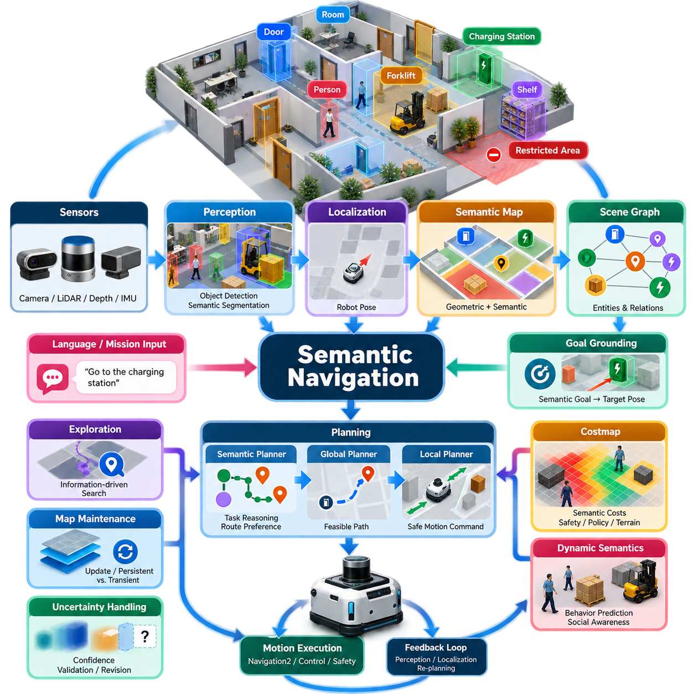
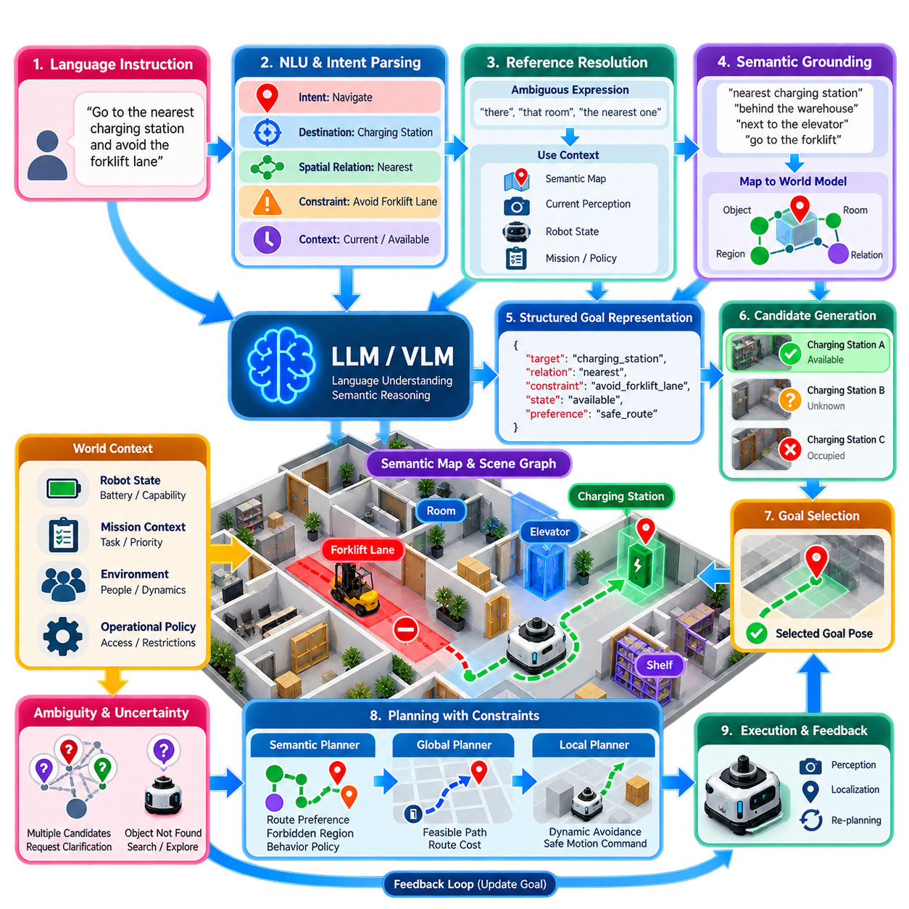
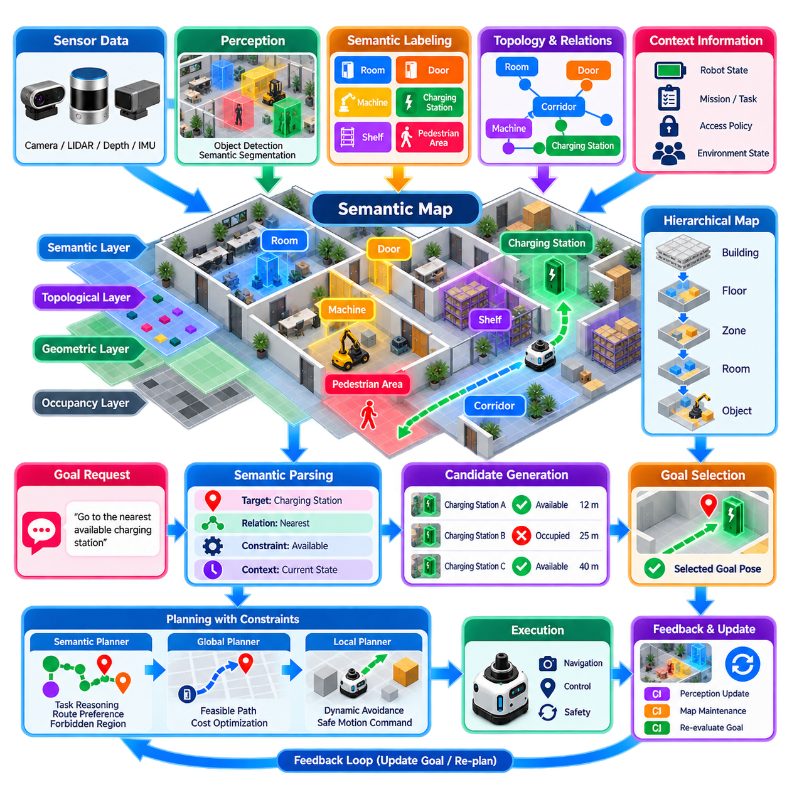
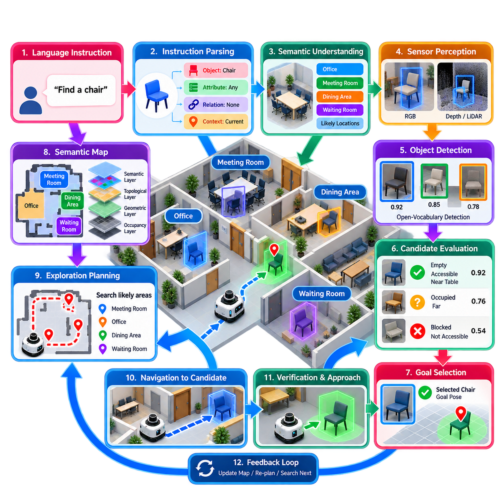
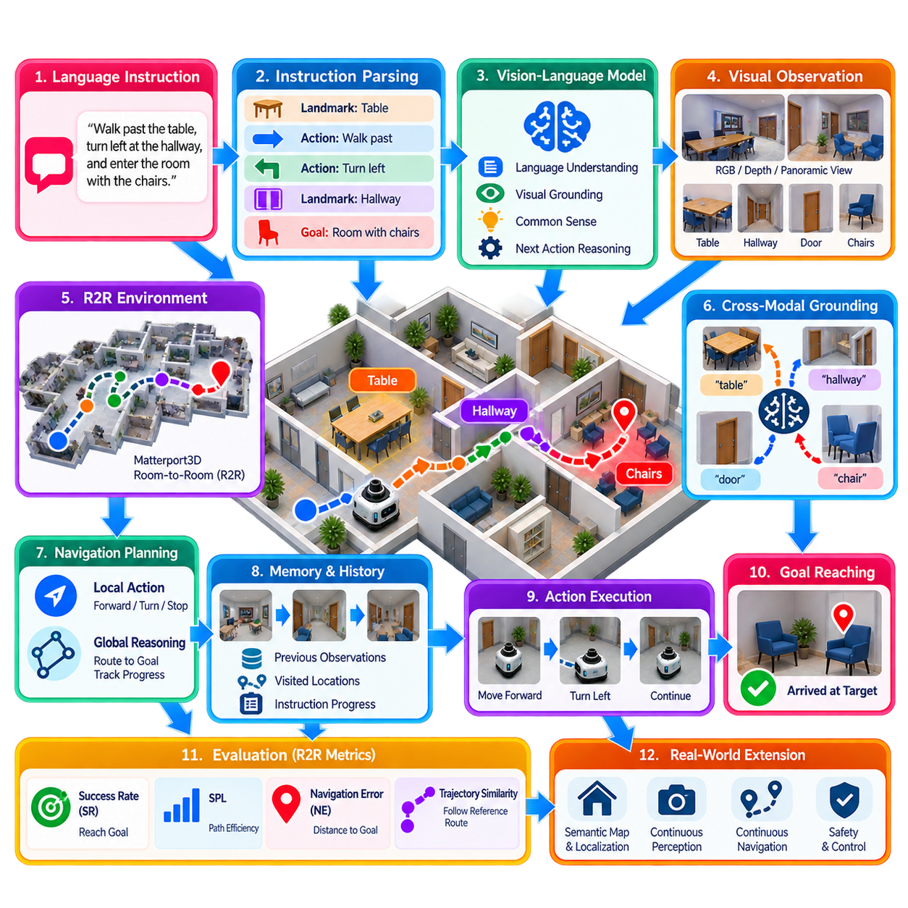
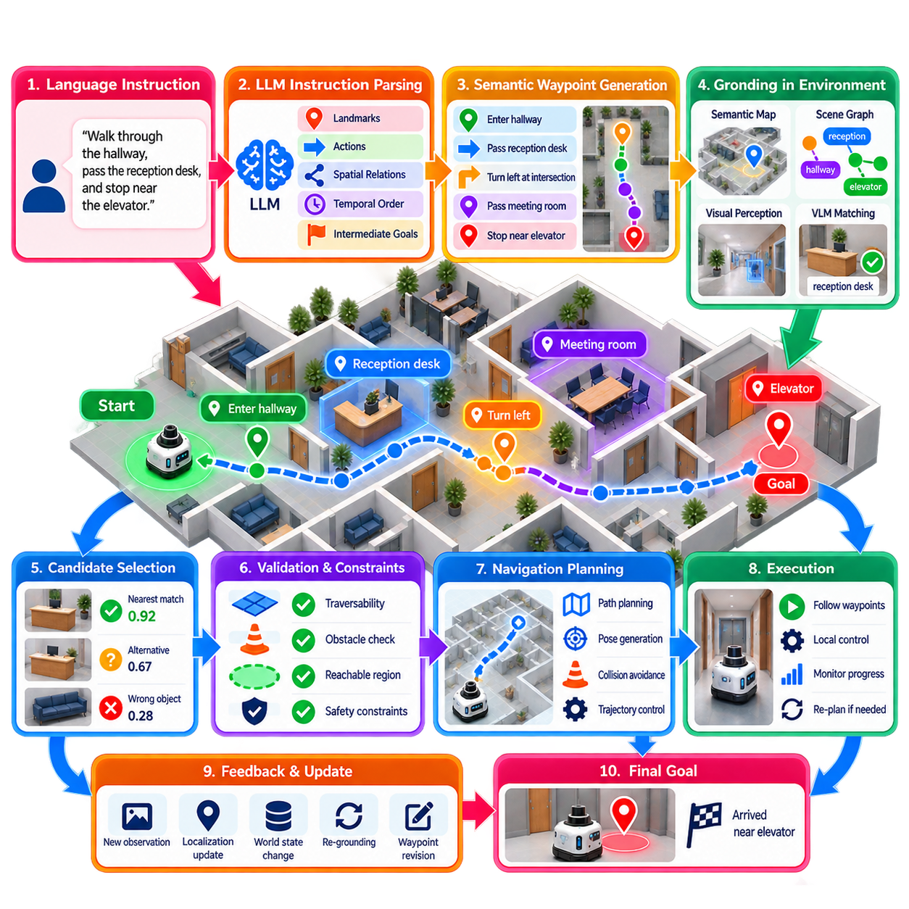
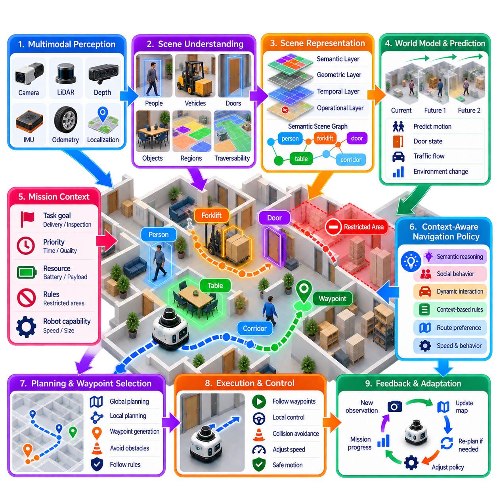
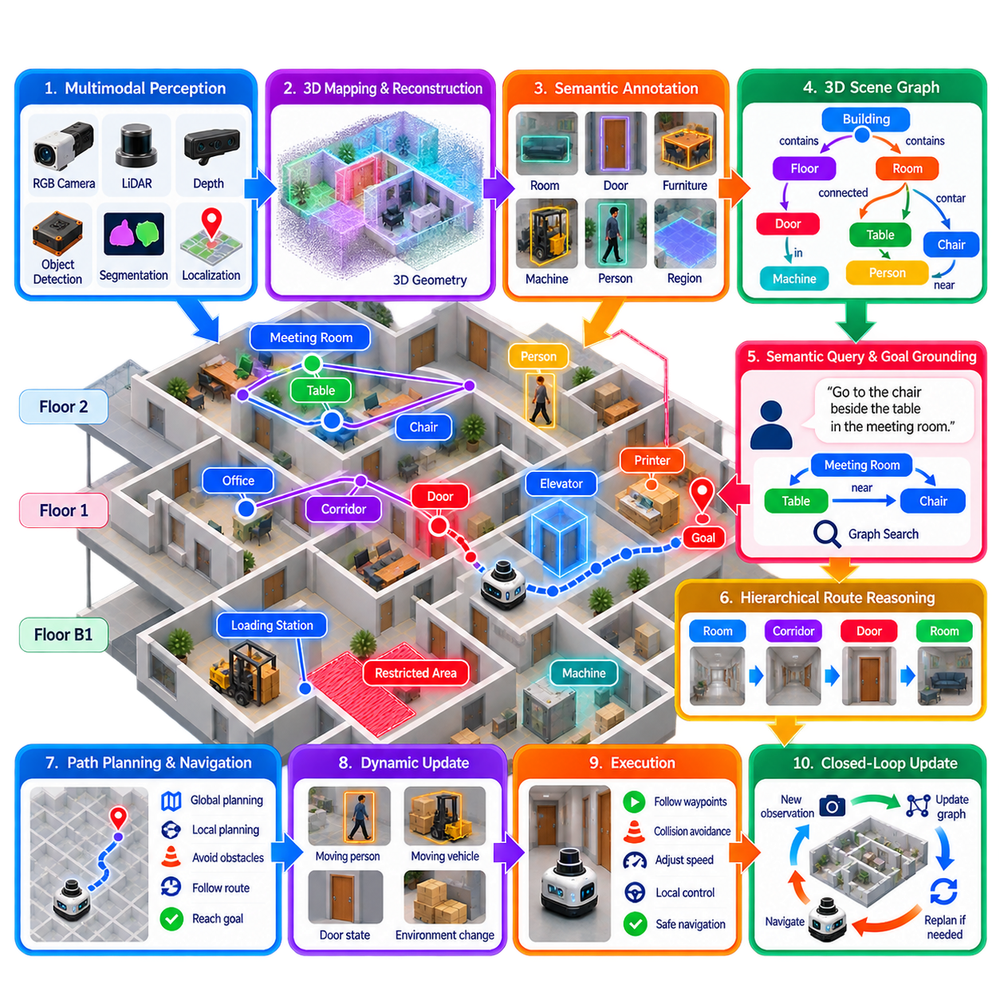
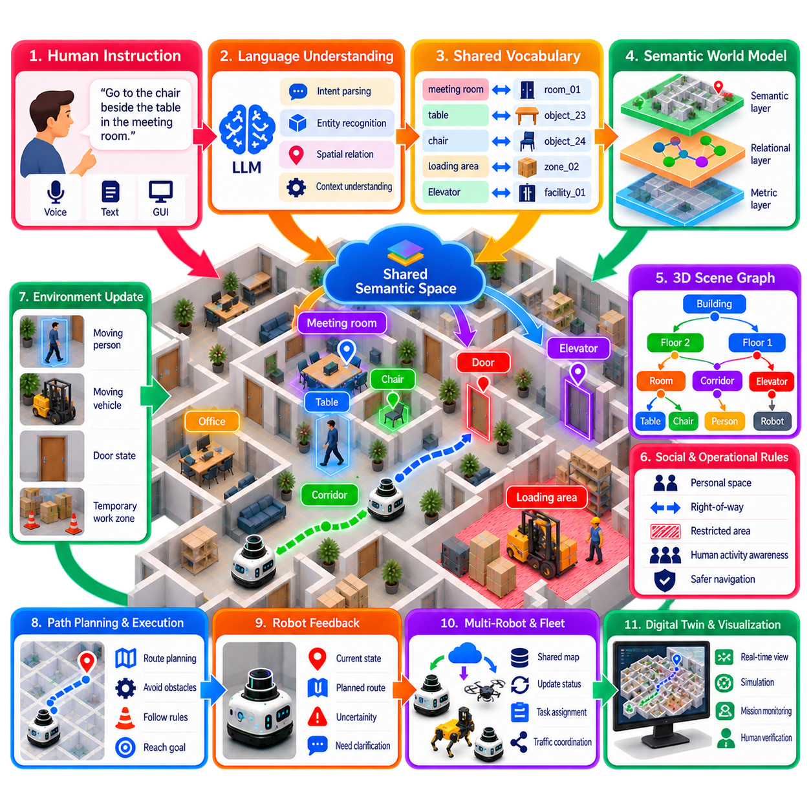
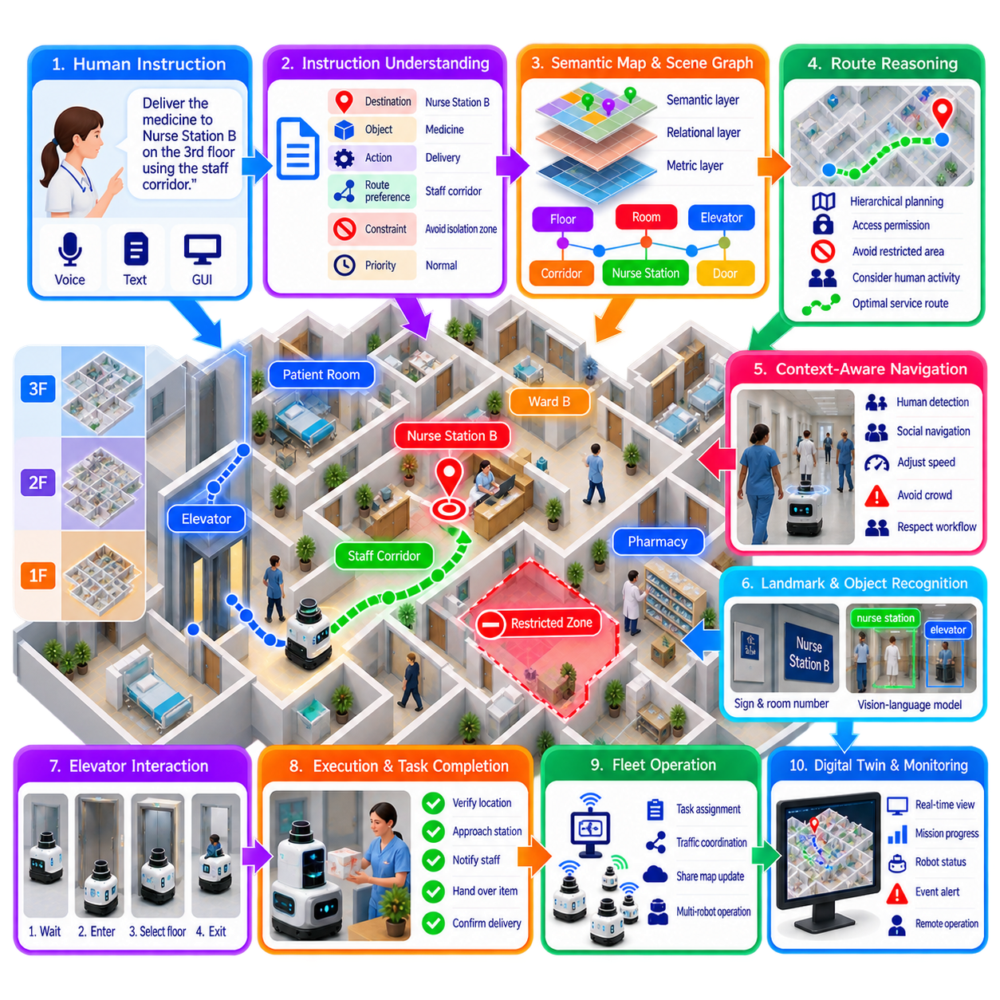

**Volume 15. Motion Planning and Navigation**

# Chapter 08. Semantic Navigation

## 08.01. Semantic Navigation Concepts and Architecture

{width="7.268055555555556in" height="7.268055555555556in"}

의미론적 내비게이션(Semantic Navigation)은 객체(Object), 장소(Place), 영역(Region), 활동(Activity)의 의미를 공간 추론(Spatial Reasoning)에 통합함으로써 기존 로봇 내비게이션(Robot Navigation)을 확장한다. 환경을 단순히 자유 공간(Free Space), 장애물(Obstacle), 기하학적 좌표(Geometric Coordinate)로만 취급하지 않고, 문(Door), 복도(Corridor), 작업대(Workstation), 엘리베이터(Elevator), 충전소(Charging Station), 사람(Person), 차량(Vehicle), 제한 구역(Restricted Area) 등의 개념을 표현한다. 이를 통해 로봇은 환경 요소가 무엇을 의미하는지와 임무(Mission)와 어떤 관계를 갖는지에 따라 행동을 선택할 수 있다.

전통적인 내비게이션(Traditional Navigation)은 주로 로봇이 어디에 있는지, 어떤 영역을 주행할 수 있는지, 현재 자세(Current Pose)와 목표(Goal)를 연결하는 충돌 없는 경로(Collision-Free Path)가 무엇인지와 같은 기하학적 질문에 답한다. 의미론적 내비게이션은 여기에 목적지가 무엇인지, 주변 객체가 무엇을 의미하는지, 어떤 경로가 작업에 적합한지를 판단하는 추론 계층(Reasoning Layer)을 추가한다. 따라서 "검사 스테이션(Inspection Station)으로 이동하라"는 명령을 수행하려면 먼저 상징적 개념(Symbolic Concept)을 물리적 위치(Physical Location)에 연결한 후 기존 경로 계획(Path Planning)과 모션 제어(Motion Control)를 수행해야 한다.

일반적인 의미론적 내비게이션 아키텍처(Semantic Navigation Architecture)는 인지(Perception), 위치 추정(Localization), 매핑(Mapping), 의미 표현(Semantic Representation), 추론(Reasoning), 계획(Planning), 모션 실행(Motion Execution)을 결합한다. 센서(Sensor)는 영상(Image), 포인트 클라우드(Point Cloud), 깊이 측정(Depth Measurement), 관성 정보(Inertial Information) 등의 관측값을 제공한다. 인지 알고리즘(Perception Algorithm)은 객체, 표면, 주행 가능 영역(Traversable Region), 장면 범주(Scene Category)를 식별하고, 위치 추정은 로봇 자세(Robot Pose)를 계산한다. 이러한 출력은 기하학적 요소를 의미 레이블(Semantic Label), 속성(Attribute), 관계(Relationship), 신뢰도(Confidence)와 연결하는 표현으로 통합된다.

의미론적 인지(Semantic Perception)는 원시 센서 측정값(Raw Sensor Measurement)과 의미 있는 환경 개념(Environmental Concept) 사이의 인터페이스를 형성한다. 객체 검출(Object Detection)은 팔레트(Pallet), 지게차(Forklift), 문, 보행자(Pedestrian), 선반(Shelf), 차량 등을 식별할 수 있으며, 의미론적 분할(Semantic Segmentation)과 인스턴스 분할(Instance Segmentation)은 더욱 상세한 공간 경계(Spatial Boundary)를 제공한다. 현대 시스템은 비전-언어 모델(Vision-Language Model)과 오픈 보캐뷸러리 인지(Open-Vocabulary Perception)를 추가로 활용하여 고정된 학습 레이블에 명시적으로 포함되지 않은 개념을 인식하고 자연어 명령(Natural-Language Instruction)을 관측된 장면과 연결할 수 있다.

의미 지도(Semantic Map)는 공간 구조(Spatial Structure)와 환경의 의미를 결합하기 때문에 의미론적 내비게이션의 핵심 구성요소이다. 기하학 지도(Geometric Map)가 벽과 자유 공간을 표현한다면, 의미 지도는 특정 영역을 복도, 적재 구역(Loading Zone), 실험실(Laboratory), 교차로(Intersection), 충전 구역(Charging Area) 등으로 식별할 수 있다. 개별 객체에는 클래스(Class), 위치(Position), 크기(Dimension), 상태(State), 신뢰도, 지속성(Persistence) 등의 정보가 포함될 수 있다. 이러한 표현은 내비게이션 시스템에 계량적 계획(Metric Planning)과 상위 수준 작업 추론(High-Level Task Reasoning)에 필요한 정보를 제공한다.

의미 표현(Semantic Representation)은 여러 추상화 수준(Abstraction Level)으로 구성할 수 있다. 계량적 표현(Metric Representation)은 좌표와 기하학(Geometry)을 기술하고, 위상학적 표현(Topological Representation)은 의미 있는 위치 사이의 연결 관계를 나타내며, 상징적 표현(Symbolic Representation)은 개체(Entity)와 관계를 기술한다. 따라서 로봇은 방 A(Room A)가 문 C(Door C)를 통해 복도 B(Corridor B)와 연결되어 있음을 이해하면서 동시에 해당 문을 통과하는 데 필요한 정밀한 기하학 정보를 유지할 수 있다. 이러한 표현을 결합하면 상위 수준 임무 설명(High-Level Mission Description)과 하위 수준 로봇 모션(Low-Level Robot Motion) 사이의 간극을 줄일 수 있다.

장면 그래프(Scene Graph)는 의미 개체(Semantic Entity) 사이의 관계를 표현하는 효과적인 방법을 제공한다. 노드(Node)는 방, 객체, 사람, 랜드마크(Landmark), 기능 영역(Functional Region)을 나타낼 수 있으며, 엣지(Edge)는 내부에 있음(Inside), 인접함(Adjacent To), 연결됨(Connected To), 가까움(Near), 통과하여 접근 가능함(Accessible Through) 등의 관계를 표현한다. 계층적 장면 그래프(Hierarchical Scene Graph)는 건물(Building), 층(Floor), 방(Room), 영역(Region), 객체를 추가적으로 구조화할 수 있다. 이러한 구조를 이용하면 모든 목적지를 정확한 좌표로 지정하지 않고도 관계 기반(Relational) 내비게이션 질의를 해석할 수 있다.

목표 그라운딩(Goal Grounding)은 의미론적 명령(Semantic Instruction)을 계획 시스템이 처리할 수 있는 내비게이션 목표(Navigation Target)로 변환한다. 로봇이 "충전소로 이동하라"는 요청을 받으면 시스템은 인지되었거나 지도에 등록된 개체 가운데 어떤 것이 해당 개념에 대응하는지 식별하고 적절한 목표 자세(Goal Pose)를 결정해야 한다. 여러 개의 일치 객체가 존재하거나, 목적지가 아직 관측되지 않았거나, "입구 근처 작업대 옆에 정지하라"와 같이 관계를 이용해 목적지를 표현하는 경우에는 그라운딩이 더욱 어려워진다.

따라서 의미론적 내비게이션은 전역 추론(Global Reasoning)과 기하학적 계획(Geometric Planning) 사이의 상호작용을 필요로 한다. 의미론적 계획기(Semantic Planner)는 로봇이 실험실을 나와 복도로 진입하고 지정된 문을 통과한 후 저장 구역(Storage Area)에 도달해야 한다고 판단할 수 있다. 이후 기하학적 전역 계획기(Geometric Global Planner)는 해당 지도 영역을 통과하는 실행 가능한 경로(Feasible Path)를 계산하고, 지역 계획기(Local Planner)는 동적으로 안전한 모션 명령(Motion Command)을 생성한다. 의미론적 제약조건(Semantic Constraint)은 비용(Cost)에 영향을 주어 기술적으로 통과할 수 있지만 바람직하지 않은 영역에 높은 페널티(Penalty)를 부여하거나 완전히 제외할 수 있다.

비용 지도(Costmap)는 기존 장애물 비용(Obstacle Cost)과 팽창 비용(Inflation Cost)에 추가하여 의미 정보를 포함할 수 있다. 내비게이션 시스템은 보행자 구역(Pedestrian Zone), 도로 표면(Road Surface), 잔디(Grass), 계단(Stairs), 제한 구역, 교차로, 취약 장비(Fragile Equipment)가 존재하는 영역에 서로 다른 비용을 부여할 수 있다. 이를 통해 계획기는 물리적으로 가능한 이동과 운영상 바람직한 이동을 구분할 수 있다. 따라서 최종 궤적(Trajectory)은 단순한 거리뿐만 아니라 안전성(Safety), 임무 정책(Mission Policy), 지형 적합성(Terrain Suitability), 사회적 제약(Social Constraint), 상황적 의미(Contextual Meaning)를 고려하여 선택된다.

동적 의미론(Dynamic Semantics)은 사람, 차량, 다른 로봇과 환경을 공유하는 경우 특히 중요하다. 사람은 단순한 이동 장애물(Moving Obstacle)이 아니며 예상 행동(Expected Behavior), 개인 공간(Personal Space), 이동 방향(Direction of Travel), 사회적 상황(Social Context)이 내비게이션 결정에 영향을 미칠 수 있다. 마찬가지로 물류 시설에서 운행하는 지게차는 정적인 팔레트와 다른 이동 패턴(Motion Pattern)과 통행 우선권(Right-of-Way)을 갖는다. 따라서 의미론적 분류(Semantic Classification)는 기본적인 충돌 회피(Collision Avoidance)를 넘어 예측(Prediction)과 행동 인지형 계획(Behavior-Aware Planning)을 지원한다.

의미론적 해석(Semantic Interpretation)은 본질적으로 완벽하지 않기 때문에 아키텍처 전체에서 불확실성(Uncertainty)을 명시적으로 관리해야 한다. 분류 신뢰도(Classification Confidence), 위치 추정 불확실성(Localization Uncertainty), 지도 노후도(Map Age), 객체 지속성(Object Persistence), 상충하는 관측(Contradictory Observation)은 모두 내비게이션 결정에 영향을 줄 수 있다. 강건한 시스템(Robust System)은 모든 인지 결과를 즉시 영구적인 사실로 변환해서는 안 된다. 대신 의미론적 증거(Semantic Evidence)를 시간에 따라 축적하고 신뢰도 추정치와 연결하며 반복 관측을 통해 검증하고 환경이 변화하면 수정하거나 제거할 수 있어야 한다.

장기 의미론적 내비게이션(Long-Term Semantic Navigation)은 지도 유지관리(Map Maintenance)도 필요로 한다. 산업 환경(Industrial Environment)은 장비가 이동하고, 임시 장애물(Temporary Obstacle)이 나타나며, 문의 상태가 변경되고, 운영 구역(Operational Zone)이 재지정되면서 지속적으로 변화한다. 시스템은 영구 구조(Persistent Structure)와 일시적 개체(Transient Entity)를 구분하고 기본 내비게이션 지도를 불안정하게 만들지 않으면서 의미 정보를 갱신해야 한다. 시간적 속성(Temporal Attribute)을 이용하면 객체가 언제 관측되었는지, 특정 영역이 얼마나 자주 변화하는지, 특정 의미 관계가 장기간 얼마나 신뢰할 수 있는지를 기록할 수 있다.

언어 기반 내비게이션(Language-Based Navigation)은 사용자가 좌표 대신 자연어 개념(Natural-Language Concept)을 통해 목적지와 작업을 지정할 수 있도록 의미론적 내비게이션을 확장한다. "창고 뒤쪽의 비상구(Emergency Exit)를 점검하라"와 같은 명령을 수행하려면 언어 이해(Language Understanding), 의미론적 그라운딩(Semantic Grounding), 공간 추론, 내비게이션 계획이 함께 동작해야 한다. 비전-언어 표현(Vision-Language Representation)은 텍스트 설명을 시각적 관측과 연결할 수 있으며, 대규모 멀티모달 모델(Large Multimodal Model)은 모호하거나 조합적인 개념(Compositional Concept)이 포함된 명령에 추가적인 추론 능력을 제공할 수 있다.

로봇이 단순한 기하학적 커버리지(Geometric Coverage)가 아니라 예상 정보 가치(Expected Information Value)에 따라 이동할 위치를 결정하면 탐색(Exploration)은 의미론적 탐색(Semantic Exploration)으로 확장된다. 목적지가 아직 발견되지 않은 충전소라면 로봇은 이전에 관측한 장면 맥락(Scene Context)을 기반으로 충전소가 존재할 가능성이 높은 영역을 우선적으로 탐색할 수 있다. 따라서 의미론적 사전정보(Semantic Prior)는 프런티어 선택(Frontier Selection), 객체 탐색(Object Search), 능동 인지(Active Perception)를 유도할 수 있다. 이는 모든 공간을 기하학적으로 탐색하는 데 과도한 시간과 에너지가 필요한 대규모 환경에서 특히 유용하다.

실용적인 구현에서는 의미론적 추론(Semantic Reasoning)과 안전 중요 내비게이션(Safety-Critical Navigation) 사이의 모듈 경계(Modular Boundary)를 유지해야 한다. 상위 수준 의미 구성요소는 목적지, 경로 선호도(Route Preference), 행동 제약조건(Behavioral Constraint)을 제안할 수 있지만, 하위 수준 위치 추정, 충돌 검사(Collision Checking), 궤적 생성(Trajectory Generation), 비상 정지(Emergency Stopping)는 독립적으로 물리적 안전을 보장해야 한다. 이러한 분리는 잘못된 의미 추론이 직접적으로 위험한 움직임을 명령하는 것을 방지하고 결정론적 안전 메커니즘(Deterministic Safety Mechanism)을 유지하면서 고급 인공지능 구성요소를 도입할 수 있도록 한다.

ROS 2 기반 시스템(ROS 2-Based System)에서는 의미론적 내비게이션을 완전히 별도의 모션 프레임워크(Motion Framework)로 구현하기보다 기존 내비게이션 스택(Navigation Stack)을 중심으로 통합할 수 있다. 의미론적 인지 및 매핑 노드(Node)는 객체와 영역 정보를 유지하고, 임무 수준 구성요소(Mission-Level Component)는 의미론적 목표를 자세(Pose), 웨이포인트(Waypoint), 경로 제약(Route Constraint), 비용 지도 업데이트(Costmap Update)로 변환할 수 있다. 이후 내비게이션2(Navigation2, Nav2)는 이러한 출력을 이용해 전역 및 지역 계획(Global and Local Planning)을 수행함으로써 기존 위치 추정 및 모션 제어 구성요소에 의미론적 지능(Semantic Intelligence)을 추가할 수 있다.

전체 아키텍처는 센싱(Sensing)에서 의미(Meaning)로, 의미에서 의도(Intent)로, 의도에서 물리적으로 실행 가능한 모션(Physically Executable Motion)으로 이어지는 계층적 변환으로 이해할 수 있다. 센서는 환경을 관측하고, 인지는 의미 개체를 추출하며, 매핑은 이를 공간적으로 고정하고, 추론은 개체 사이의 관계를 해석하며, 계획은 작업 의도(Task Intent)를 실행 가능한 경로와 궤적으로 변환한다. 위치 추정과 인지에서 지속적으로 제공되는 피드백(Feedback)은 폐루프(Closed Loop)를 형성하여 로봇이나 환경이 변화할 때마다 의사결정을 수정할 수 있도록 한다.

궁극적으로 의미론적 내비게이션은 자율 이동성(Autonomous Mobility)과 피지컬 AI(Physical AI)를 연결하는 중요한 가교 역할을 한다. 좌표만 이해하는 이동 로봇(Mobile Robot)은 사전에 정의된 자세에 도달할 수 있지만, 지능형 물리 에이전트(Intelligent Physical Agent)로 동작하는 로봇은 인지, 언어(Language), 환경 지식(Environmental Knowledge), 작업 맥락(Task Context), 행동(Action)을 서로 연결해야 한다. 의미 표현을 기하학적 내비게이션(Geometric Navigation) 및 실시간 안전 메커니즘(Real-Time Safety Mechanism)과 결합함으로써 로봇은 단순히 장애물과 자유 공간의 위치에 따라 움직이는 것을 넘어 환경이 무엇을 의미하는지를 이해하고 그 의미에 따라 이동할 수 있다.

## 08.02. Language Instruction to Navigation Goal Parsing [w/Code]

{width="7.268055555555556in" height="7.268055555555556in"}

언어 명령에서 내비게이션 목표로의 파싱(Language Instruction to Navigation Goal Parsing)은 사람이 원하는 행동이나 목적지를 설명하는 표현을 로봇이 내비게이션 시스템에서 실행할 수 있는 구조화된 목표로 변환하도록 한다. 사람은 일반적으로 "가장 가까운 충전소(Charging Station)", "생산 라인 옆의 검사 영역(Inspection Area)", "회의가 진행되고 있는 방(Room)"과 같은 개념을 사용하여 위치를 설명한다. 이러한 표현에는 하나의 좌표만으로 표현할 수 없는 의미론적(Semantic), 공간적(Spatial), 상황적(Contextual), 때로는 시간적(Temporal) 정보가 포함된다. 따라서 파싱은 인간의 의도(Human Intent)와 물리적 내비게이션(Physical Navigation)을 연결하는 중요한 가교가 된다.

첫 번째 단계는 자연어 이해(Natural Language Understanding)이며, 여기서 시스템은 명령에 포함된 기본 의도(Intent)를 식별한다. 내비게이션 명령은 목적지(Destination), 객체(Object), 경로 선호도(Route Preference), 공간적 관계(Spatial Relation), 운영 제약조건(Operational Constraint) 또는 이들의 조합을 표현할 수 있다. 예를 들어 "적재 구역(Loading Area)으로 이동하고 지게차 차선(Forklift Lane)은 피하라"는 명령에는 목적지와 안전 관련 경로 제약조건이 모두 포함되어 있다. 파서는 문장 전체를 단순한 목표 위치로 축소하지 않고 이러한 서로 다른 의미를 각각 보존해야 한다.

내비게이션 명령은 구조화된 의미 슬롯(Semantic Slot)을 사용하여 표현할 수 있다. 목적지 슬롯(Destination Slot)은 원하는 장소나 객체를 식별하고, 공간적 관계는 근처(Near), 뒤(Behind), 옆(Beside), 내부(Inside), 사이(Between), 맞은편(Across From)과 같은 개념을 표현한다. 제약조건(Constraint)은 접근성(Accessibility), 안전성(Safety), 우선순위(Priority), 지형(Terrain), 인간 상호작용(Human Interaction), 운영 제한(Operational Restriction) 등을 지정할 수 있다. "현재 이용 가능한 충전소(Currently Available Charging Station)" 또는 "회의에 사용되고 있는 방(Room Being Used for the Meeting)"처럼 조건을 나타내는 명령에서는 시간적 표현(Temporal Expression)도 중요할 수 있다. 이렇게 생성된 표현은 이후의 추론(Reasoning)과 계획(Planning)이 사용할 수 있도록 충분히 구조화되어 있어야 한다.

참조 해석(Reference Resolution)은 자연어에 모호한 표현이 자주 등장하기 때문에 중요한 기능이다. "거기(There)", "그 방(That Room)", "가장 가까운 것(The Nearest One)", "왼쪽의 스테이션(The Station on the Left)"과 같은 표현은 이전 대화, 현재 인지(Current Perception), 환경 맥락(Environmental Context)에 의존한다. 로봇은 의도된 참조 대상을 결정하기 위해 언어적 맥락(Linguistic Context)과 의미 지도(Semantic Map), 최근 관측(Recent Observation)을 결합해야 할 수 있다. 동일한 설명을 만족하는 후보가 여러 개라면 시스템은 임의의 위치를 조용히 선택하기보다 이러한 모호성을 유지해야 한다.

공간 언어(Spatial Language)는 로봇의 환경 표현(Environmental Representation)에 그라운딩(Grounding)되어야 한다. "창고 뒤(Behind the Warehouse)", "엘리베이터 옆(Next to the Elevator)", "복도 맞은편(Across the Corridor)"과 같은 표현은 절대 좌표(Absolute Coordinate)가 아니라 객체 사이의 관계를 설명한다. 의미 장면 그래프(Semantic Scene Graph)는 이러한 그라운딩에 필요한 관계 구조(Relational Structure)를 제공할 수 있다. 언어 파서는 관계를 식별하고 월드 모델(World Model)에서 대응하는 객체를 검색한 다음 해당 관계를 하나 이상의 후보 영역(Candidate Region) 또는 목표 자세(Target Pose)로 변환한다.

객체 기반 명령(Object-Based Instruction)은 명시된 객체 자체가 유효한 내비게이션 자세(Navigation Pose)를 의미하지 않을 수 있기 때문에 추가적인 변환이 필요하다. "지게차로 이동하라(Go to the Forklift)"는 명령이 반드시 로봇이 지게차의 정확한 위치로 이동해야 한다는 의미는 아니다. 실제 목표는 안전한 관찰 위치(Safe Observation Point), 지게차 옆의 위치(Position Beside the Forklift), 또는 검사를 수행할 수 있는 위치일 수 있다. 따라서 목표 파싱(Goal Parsing)은 의미론적 목표(Semantic Target)와 해당 목표와 상호작용하거나 관찰하기 위해 필요한 물리적 자세(Physical Pose)를 구분해야 한다.

맥락(Context)은 내비게이션 명령을 해석하는 데 중요한 역할을 한다. "충전소(The Charging Station)"라는 표현의 의미는 로봇의 현재 배터리 상태(Battery State), 운영 구역(Operational Zone), 접근 권한(Access Permission), 여러 충전소의 이용 가능 여부에 따라 달라질 수 있다. 마찬가지로 "검사 영역(The Inspection Area)"도 현재 임무(Current Mission)에 따라 서로 다른 위치를 의미할 수 있다. 상황 인지형 파서(Context-Aware Parser)는 최종 내비게이션 목표를 생성하기 전에 언어, 로봇 상태(Robot State), 작업 상태(Task State), 의미 지도, 월드 모델, 운영 정책(Operational Policy)을 함께 고려한다.

대규모 언어 모델(Large Language Model, LLM)과 비전-언어 모델(Vision-Language Model, VLM)은 복잡한 명령에 대해 유연한 추론 능력을 제공할 수 있지만, 결정론적 내비게이션 구성요소(Deterministic Navigation Component)를 직접 대체해서는 안 된다. 언어 모델은 문장을 해석하고 관련 개념을 식별하며 관계를 해결하고 구조화된 목표 표현(Structured Goal Representation)을 생성할 수 있다. 이후 내비게이션 시스템은 실제 지도, 인지 결과, 로봇의 능력(Robot Capability), 안전 정책(Safety Policy), 현재 환경 조건을 기준으로 이 표현을 검증해야 한다. 이러한 분리는 확률적 의미 추론(Probabilistic Semantic Reasoning)과 안전이 중요한 물리적 실행(Safety-Critical Physical Execution) 사이에 통제된 인터페이스를 형성한다.

목표 그라운딩(Goal Grounding)은 파싱된 의미 표현을 구체적인 내비게이션 목표로 변환한다. 이 과정에는 알려진 랜드마크(Landmark)의 선택, 객체 인스턴스(Object Instance)의 식별, 의미 영역(Semantic Region)의 위치 결정, 목표 자세의 생성, 또는 허용 가능한 복수 목표 자세(Set of Acceptable Goal Poses)의 정의가 포함될 수 있다. 예를 들어 "가장 가까운 이용 가능한 충전소로 이동하라"는 명령은 후보 충전소를 식별하고, 각 충전소의 이용 가능 상태를 판단하며, 로봇과의 공간적 관계를 계산하고, 적절한 목표를 선택해야 한다. 최종 결과는 전역 계획기(Global Planner)와 지역 계획기(Local Planner)가 안정적으로 사용할 수 있는 형태로 표현되어야 한다.

유용한 중간 표현(Intermediate Representation)은 의미론적 의도(Semantic Intent)와 기하학적 구현(Geometric Realization)을 분리한다. 의미 계층(Semantic Layer)은 target = charging station, relation = nearest, state = available, preference = safe route와 같은 개념을 지정할 수 있다. 이후 기하학 계층(Geometric Layer)은 이러한 개념을 좌표, 방향(Orientation), 주행 가능 영역(Traversable Region), 경로 제약조건으로 변환한다. 이러한 분리를 통해 동일한 언어 수준의 명령을 서로 다른 환경에서 실행할 수 있으며, 의미 해석 계층을 변경하지 않고도 플랫폼별 내비게이션 구현을 적용할 수 있다.

파싱과 그라운딩 과정에서는 모호성과 불확실성(Ambiguity and Uncertainty)을 명시적으로 표현해야 한다. "검사실로 이동하라"는 명령이 유사한 의미 설명을 가진 세 개의 후보 방과 대응한다면 시스템은 후보 가설(Candidate Hypothesis)을 유지하고 필요할 경우 사용자에게 명확화를 요청해야 한다. 언어 해석에 대한 확신은 높지만 대응하는 객체를 검출할 수 없는 경우에는 시스템이 탐색(Search), 탐험(Exploration)을 수행하거나 이전에 구축된 지도 정보를 사용할 수 있다. 신뢰도 기반 파싱(Confidence-Aware Parsing)은 불확실한 언어 해석이 의심할 수 없는 내비게이션 사실로 처리되는 것을 방지한다.

내비게이션 목표가 설정된 후에는 시스템이 의미론적 요구사항을 계획 제약조건(Planning Constraint)으로 변환해야 한다. "보행자 구역을 피하면서 창고까지 가장 안전한 경로를 이용하라"는 명령은 단순히 목적지 좌표를 생성해서는 충분하지 않다. 경로 비용(Route Cost), 금지 영역(Forbidden Region), 선호 복도(Preferred Corridor), 행동 정책(Behavior Policy) 등을 변경해야 한다. 따라서 의미론적 계획기(Semantic Planner)는 구조화된 제약조건을 전역 계획기에 전달하고, 지역 계획기는 동적 장애물(Dynamic Obstacle)과 새롭게 관측된 환경 조건에 지속적으로 대응할 수 있다.

전체 과정은 언어가 의도(Intent)를 제공하고, 파싱이 구조화된 의미를 추출하며, 그라운딩이 그 의미를 물리적 환경과 연결하고, 검증(Validation)이 실행 가능성과 안전성을 확인한 다음, 내비게이션 계획이 실행 가능한 모션(Executable Motion)을 생성하는 폐루프 의미-모션 파이프라인(Semantic-to-Motion Pipeline)을 형성한다. 이후 인지, 위치 추정(Localization), 실행 과정에서 발생하는 피드백(Feedback)은 해석된 목표를 환경 변화에 따라 갱신할 수 있도록 한다. 이러한 아키텍처를 통해 로봇은 좌표 기반 명령을 넘어 인간의 개념(Human Concept), 상황적 관계(Contextual Relationship), 임무 수준 의도(Mission-Level Intent)에 따라 동작할 수 있으며, 동시에 기존 내비게이션과 안전 메커니즘의 신뢰성을 유지할 수 있다.

## 08.03. Semantic Map Based Goal Specification [w/Code]

{width="7.268055555555556in" height="7.268055555555556in"}

의미 지도 기반 목표 지정(Semantic Map-Based Goal Specification)은 고정된 좌표를 사용하는 방식에서 벗어나 의미 있는 객체(Object), 영역(Region), 관계(Relationship), 상황 조건(Contextual Condition)을 이용하여 목적지를 정의함으로써 내비게이션을 확장한다. 로봇은 카르테시안 위치(Cartesian Position)를 직접 전달받지 않고도 충전소(Charging Station), 검사 셀(Inspection Cell), 적재장(Loading Dock), 비상구(Emergency Exit), 생산 영역(Production Area) 등의 장소로 이동하도록 지시받을 수 있다. 의미 지도(Semantic Map)는 이러한 개념을 물리적 위치와 연결하는 공간적 기억(Spatial Memory)을 제공하며, 이를 통해 내비게이션 시스템은 인간 중심의 설명을 실행 가능한 목표(Executable Goal)로 변환할 수 있다.

의미 지도는 환경에 대한 기하학적 정보(Geometric Information)와 의미론적 정보(Semantic Information)를 결합한다. 점유 격자(Occupancy Grid)는 자유 공간과 점유 공간을 표현하고, 의미 계층(Semantic Layer)은 방(Room), 복도(Corridor), 문(Door), 선반(Shelf), 기계(Machine), 충전소, 보행자 영역(Pedestrian Area) 및 기타 의미 있는 개체를 식별한다. 위상학적 관계(Topological Relationship)는 어떤 방이 연결되어 있는지, 어떤 객체가 특정 영역 내부에 있는지, 어떤 경로가 접근을 제공하는지를 추가적으로 표현할 수 있다. 따라서 목표 지정(Goal Specification)은 정밀한 기하학과 상위 수준의 환경 의미를 동시에 이용할 수 있다.

기본적인 목표 표현(Goal Representation)은 의미론적 목표(Semantic Target)와 물리적 내비게이션 자세(Physical Navigation Pose)를 분리해야 한다. 목표는 객체, 영역, 랜드마크(Landmark), 방 또는 기능 영역(Functional Area)으로 표현될 수 있으며, 대응하는 내비게이션 자세는 로봇이 실제로 정지해야 하는 위치를 지정한다. 예를 들어 "검사 스테이션으로 이동하라"는 명령은 미리 정의된 검사 영역을 의미할 수 있지만, 로봇은 특정 방향으로 검사 스테이션의 특정 측면에 접근해야 할 수 있다. 이러한 분리는 의미론적 목표를 기존 경로 계획기(Path Planner)와 호환되도록 한다.

공간적 관계(Spatial Relationship)는 목표를 지정하는 또 하나의 중요한 방법이다. "엘리베이터 옆(Next to the Elevator)", "창고 뒤(Behind the Warehouse)", "적재 영역 내부(Inside the Loading Area)", "세 번째 검사 스테이션 근처(Near the Third Inspection Station)"와 같은 표현은 절대 좌표가 아니라 관계를 이용하여 목적지를 정의한다. 의미 지도는 장면 그래프(Scene Graph)를 통해 객체, 영역, 랜드마크 사이의 관계를 해석할 수 있다. 이렇게 해석된 관계는 요청된 공간 조건을 만족하는 후보 영역(Candidate Region)이나 후보 자세(Candidate Pose)로 변환될 수 있다.

객체 기반 목표 지정(Object-Based Goal Specification)은 Physical AI에서 특히 중요하다. 객체는 위치나 상태가 변경될 수 있기 때문이다. 로봇이 "사용 가능한 충전소로 이동하라"고 지시받았다면 단순히 과거에 기록된 좌표를 사용할 수 없다. 로봇은 의미 지도에서 충전소를 식별하고 현재 운영 상태를 확인한 다음 명령 조건을 만족하는 충전소를 선택해야 한다. 따라서 의미론적 목표에는 객체 클래스(Object Class)뿐만 아니라 이용 가능 여부(Availability), 접근 가능성(Accessibility), 거리(Distance), 운영 우선순위(Operational Priority) 등의 상황 조건도 포함된다.

영역 기반 목표(Region-Based Goal)는 하나의 정확한 좌표에서 정밀하게 정지할 필요가 없거나 특정 좌표를 사용하는 것이 바람직하지 않은 경우 유용하다. "창고 안으로 들어가라"는 명령은 하나의 고정된 목표점(Fixed Goal Point)이 아니라 여러 개의 허용 가능한 자세를 갖는 목표 영역(Target Region)으로 표현할 수 있다. 마찬가지로 "검사 영역으로 이동하라"는 명령은 현재 장애물, 장비 위치, 검사 요구사항, 지역적 접근성에 따라 적절한 위치를 선택할 수 있는 운영 영역(Operational Zone)으로 정의할 수 있다. 이러한 방식은 의미를 유지하면서도 목표 위치에 유연성을 제공한다.

계층적 의미 지도(Hierarchical Semantic Map)는 서로 다른 추상화 수준(Abstraction Level)에서 목표를 지정할 수 있도록 한다. 하나의 건물(Building)은 여러 층(Floor)을 포함하고, 각 층은 기능 구역(Functional Zone)을 포함하며, 구역은 방을 포함하고, 방은 객체나 작업대(Workstation)를 포함할 수 있다. 따라서 명령은 "2층 실험실(Second-Floor Laboratory)", "실험실의 검사 영역(Inspection Area in the Laboratory)", 또는 "검사 셀 옆의 카메라 스테이션(Camera Station Beside the Inspection Cell)"과 같이 다양한 수준으로 표현될 수 있다. 계층적 그라운딩(Hierarchical Grounding)은 사용자가 내부 좌표계를 이해하지 않아도 광범위한 환경 맥락에서 정밀한 내비게이션 목표까지 단계적으로 명령을 해석할 수 있도록 한다.

목표 지정에는 로봇과 임무의 상황 정보도 포함되어야 한다. 동일한 의미론적 목표라도 배터리 상태(Battery State), 적재물(Payload), 로봇 능력(Robot Capability), 임무 단계(Mission Phase), 접근 권한(Access Permission), 환경 조건(Environmental Condition)에 따라 서로 다른 내비게이션 목표가 생성될 수 있다. 예를 들어 대형 AMR은 경량 플랫폼만을 위해 설계된 영역에 진입할 수 없으며, 배터리가 부족한 로봇은 접근 가능한 충전소를 우선적으로 선택할 수 있다. 따라서 의미론적 목표 생성(Semantic Goal Generation)은 지도 지식(Map Knowledge)과 로봇 상태, 작업 맥락(Task Context), 운영 정책(Operational Policy)을 함께 결합한다.

동일한 설명을 만족하는 의미 객체가 여러 개 존재하는 경우 후보 생성(Candidate Generation)이 필요하다. 시설에 여러 개의 충전소, 검사 셀 또는 비상구가 있다면 시스템은 즉시 하나의 목표를 가정하기보다 후보 집합(Candidate Set)을 생성해야 한다. 각 후보는 의미적 일치성(Semantic Compatibility), 거리, 접근성, 이용 가능 여부, 안전성(Safety), 임무 제약조건(Mission Constraint)을 기준으로 평가할 수 있다. 이후 최종 목표는 결정론적 의사결정(Deterministic Decision)이나 최적화 기반 의사결정(Optimization-Based Decision)을 통해 선택할 수 있으며, 선택 과정에서 사용된 추론 정보도 유지할 수 있다.

불확실성(Uncertainty)과 모호성(Ambiguity)은 목표 지정 과정 전체에서 명시적으로 관리되어야 한다. 의미 지도에는 오래된 정보가 포함될 수 있고, 객체가 이동했거나 여러 객체가 유사한 설명을 가질 수도 있다. 따라서 현재 인지(Current Perception)는 지도 정보를 무조건 신뢰하기보다 저장된 의미 정보와 비교되어야 한다. 신뢰도가 충분하지 않은 경우 로봇은 추가 인지(Additional Perception)를 수행하거나, 환경을 탐색(Search)하거나, 후보 영역을 탐험(Exploration)하거나, 운영자에게 명확화(Clarification)를 요청할 수 있다. 이를 통해 불확실한 의미 해석이 위험한 내비게이션 명령으로 직접 변환되는 것을 방지할 수 있다.

의미론적 목표는 최종적으로 기존 내비게이션 소프트웨어가 실행할 수 있는 제약조건(Constraint)으로 변환되어야 한다. 목표 표현에는 목표 영역, 허용 가능한 자세 범위(Acceptable Pose Range), 선호 방향(Preferred Orientation), 금지 영역(Forbidden Area), 경로 선호도(Route Preference), 행동 정책(Behavior Policy) 등을 포함할 수 있다. 의미론적 계획기(Semantic Planner)는 이러한 요구사항을 전역 계획기(Global Planner)에 전달하여 실행 가능한 경로를 계산하게 하고, 지역 계획기(Local Planner)는 동적 장애물(Dynamic Obstacle)과 지속적으로 변화하는 환경 조건을 처리한다. 이 구조를 통해 의미론적 지능(Semantic Intelligence)은 언어 모델이 저수준 모션 명령(Low-Level Motion Command)을 직접 생성하지 않아도 내비게이션에 영향을 줄 수 있다.

의미 지도는 운영 환경이 정적인 상태로 유지되지 않기 때문에 동적 갱신(Dynamic Update)을 지원해야 한다. 기계가 이동하거나 임시 장벽(Temporary Barrier)이 나타날 수 있으며, 문의 상태가 변경되거나 충전소가 점유될 수도 있다. 강건한 시스템(Robust System)은 영구 구조(Persistent Structure)와 일시적 객체(Transient Entity)를 구분하고 이들의 의미 상태(Semantic State)를 지속적으로 갱신해야 한다. 목표 지정은 가장 최근의 신뢰할 수 있는 정보를 우선적으로 사용하면서도 탐색, 예측(Prediction), 복구(Recovery)에 유용한 과거 정보를 필요에 따라 유지해야 한다.

전체 과정은 의미론적 목표 지정 파이프라인(Semantic Goal Specification Pipeline)을 형성한다. 사람이나 임무 시스템(Mission System)이 추상적인 목표(Abstract Objective)를 제공하면, 의미 파싱(Semantic Parsing)이 목표와 관계를 추출하고, 의미 지도가 이러한 개념을 물리적 환경에 그라운딩하며, 후보 목표가 생성되고 검증된 후 선택된 목표가 내비게이션 호환 표현(Navigation-Compatible Representation)으로 변환된다. 실행 과정에서는 인지와 위치 추정(Localization)이 지속적인 피드백(Feedback)을 제공하여 환경 조건이 변화하면 목표나 경로를 수정할 수 있도록 한다. 이러한 아키텍처는 인간 수준의 개념(Human-Level Concept)을 정밀한 로봇 내비게이션과 연결하면서 기존 계획 및 안전 메커니즘의 신뢰성을 유지할 수 있도록 한다.

## 08.04. Object Goal Navigation Find a Chair [w/Code]

{width="7.268055555555556in" height="7.268055555555556in"}

객체 목표 내비게이션(Object-Goal Navigation)은 목적지가 미리 정의된 좌표가 아니라 로봇이 찾아야 하는 대상이 무엇인지에 의해 정의되기 때문에 자율 내비게이션(Autonomous Navigation)의 중요한 확장 방식이다. "의자를 찾아라(Find a Chair)"와 같은 작업에서 로봇은 의자라는 단어의 의미론적 의미(Semantic Meaning)를 이해하고, 어떤 시각적 또는 상황적 증거가 의자를 식별하는지 판단하며, 환경을 탐색하고 적절한 객체 인스턴스(Object Instance)를 향해 이동해야 한다. 따라서 최종 목표는 고정된 기하학적 웨이포인트(Geometric Waypoint)가 아니라 객체 중심 목표(Object-Centered Goal)가 된다.

이 과정은 객체 명세(Object Specification)를 해석하는 것에서 시작한다. "의자를 찾아라"와 같은 단순한 명령은 객체 범주(Object Category)만 지정할 수 있지만, 더 복잡한 명령은 "테이블 근처의 빨간 의자를 찾아라" 또는 "회의실에서 비어 있는 의자를 찾아라"와 같이 속성(Attribute)과 관계(Relationship)를 포함할 수 있다. 내비게이션 시스템은 탐색 대상이 무엇인지 결정하기 전에 목표 범주, 속성, 공간적 맥락(Spatial Context), 작업 제약조건(Task Constraint)을 추출해야 한다. 이렇게 생성된 의미 표현(Semantic Representation)은 이후 인지(Perception)와 탐색(Exploration)의 기반이 된다.

객체 인식(Object Recognition)은 후보 목표를 식별하는 데 필요한 시각적 증거(Visual Evidence)를 제공한다. 카메라(Camera), 깊이 센서(Depth Sensor), LiDAR 및 기타 센싱 수단은 서로 보완적인 정보를 제공할 수 있다. 비전-언어 모델(Vision-Language Model)과 오픈 보캐뷸러리 객체 검출(Open-Vocabulary Object Detection)을 이용하면 로봇은 소수의 사전 정의된 클래스에 제한되지 않고 자연어로 설명된 객체를 탐색할 수 있다. 그러나 조명, 가림(Occlusion), 관측 시점(Viewpoint), 객체 간 유사성, 환경의 복잡성 때문에 시각적 식별이 불확실할 수 있으므로 인식 신뢰도(Recognition Confidence)는 명시적으로 관리되어야 한다.

의미 지도(Semantic Map)는 로봇이 요청된 객체가 어디에 존재할 가능성이 높은지를 판단할 수 있도록 공간적 기억(Spatial Memory)을 제공한다. 의자는 사무실, 회의실, 식사 공간, 대기실, 책상 주변 등과 의미적으로 연결될 수 있으며, 그 위치는 시간에 따라 변경될 수 있다. 지도는 방, 가구, 기능 영역(Functional Area), 객체 사이의 관계를 표현할 수 있으므로 로봇은 세밀한 탐색을 수행하기 전에 객체가 존재할 가능성이 높은 위치를 추론할 수 있다. 이를 통해 불필요한 탐색을 줄이고 의미론적 지식과 기하학적 내비게이션을 연결할 수 있다.

목표 객체가 아직 관측되지 않은 경우 객체 목표 내비게이션은 더욱 어려워진다. 이때 로봇은 요청된 객체를 발견할 가능성을 최대화할 수 있는 탐색 위치를 선택해야 한다. 모든 영역을 균일하게 탐색하는 대신 목표 객체와 의미적으로 관련성이 높은 방이나 영역을 우선적으로 탐색할 수 있다. 예를 들어 의자를 찾는 경우 창고보다 사무실이나 회의실에 더 높은 탐색 우선순위를 부여할 수 있다. 따라서 의미론적 사전정보(Semantic Prior)는 프런티어 선택(Frontier Selection)을 유도하고 탐색을 더욱 목적 지향적으로 만든다.

탐색 과정은 전역 의미 추론(Global Semantic Reasoning)과 지역 시각 검증(Local Visual Verification)을 결합할 수 있다. 상위 수준 계획기(High-Level Planner)는 후보 방이나 영역을 식별하고, 내비게이션 계획기는 해당 위치까지의 경로를 생성한다. 로봇이 후보 위치에 도착하면 인지 시스템은 주변 환경을 검사하여 목표 객체를 탐색한다. 객체가 검출되지 않으면 시스템은 환경에 대한 신뢰도와 가설을 갱신하고 다른 후보 위치를 선택할 수 있다. 따라서 탐색은 하나의 고정된 경로가 아니라 반복적인 탐색-내비게이션 루프(Search-and-Navigation Loop)를 형성한다.

여러 개의 후보 객체가 존재하면 추가적인 목표 선택 문제(Goal Selection Problem)가 발생한다. 여러 의자가 검출된 경우 로봇은 원래 명령을 가장 잘 만족하는 객체 인스턴스를 결정해야 한다. 단순히 거리가 가까운 것만으로는 충분하지 않으며, 선택 대상이 비어 있는지, 특정 테이블 근처에 있는지, 지정된 방 안에 있는지, 접근 가능한지 또는 로봇의 의도된 작업에 적합한지 등을 고려해야 할 수 있다. 따라서 후보 객체는 의미적 일치성(Semantic Compatibility), 공간적 관계, 접근성, 객체 상태(Object State), 신뢰도, 임무 요구사항(Mission Requirement)을 기준으로 평가할 수 있다.

객체 상태(Object State)와 어포던스(Affordance) 역시 중요하다. 객체를 식별했다고 해서 반드시 유효한 목표라는 의미는 아니기 때문이다. 의자는 사람이 사용 중이거나, 장애물에 의해 막혀 있거나, 손상되었거나, 접근할 수 없거나, 제한 구역(Restricted Area)에 위치할 수 있다. 명령이 이용 가능한 의자를 요구한다면 시스템은 단순히 의자를 검출하는 것과 해당 의자가 실제 운영 목표를 만족하는지를 구분해야 한다. 따라서 의미론적 인지(Semantic Perception)는 객체의 정체성뿐만 아니라 관련 속성, 상태, 접근성, 작업 적합성(Task Suitability)까지 추정해야 한다.

언어 정보(Language Information)와 시각 정보(Visual Information)는 멀티모달 추론(Multimodal Reasoning)을 통해 공동으로 그라운딩(Grounding)될 수 있다. "회의 테이블 근처의 비어 있는 의자를 찾아라"라는 명령은 언어 개념을 시각적 객체, 공간적 관계, 환경 맥락과 연결해야 한다. 비전-언어 모델은 명령을 해석하고 후보 객체의 우선순위를 결정하는 데 도움을 줄 수 있으며, 의미 지도는 지속적인 공간 구조를 제공하고 내비게이션 스택(Navigation Stack)은 결정론적인 모션 계획(Deterministic Motion Planning)을 수행한다. 이러한 역할 분리를 통해 파운데이션 모델(Foundation Model)이 로봇을 직접 제어하지 않아도 유연한 의미론적 추론을 수행할 수 있다.

탐색 과정 전체에서는 인지와 환경 지식이 모두 불완전할 수 있기 때문에 불확실성(Uncertainty)을 지속적으로 관리해야 한다. 의자는 부분적으로 가려져 있거나 잘못 분류될 수 있으며, 지도에 기록된 위치에서 이동했거나 다른 객체와 혼동될 수도 있다. 로봇은 여러 후보 가설(Candidate Hypothesis)을 유지하면서 새로운 관측이 들어올 때마다 각 후보의 신뢰도를 갱신할 수 있다. 필요한 조건을 만족하는 후보가 존재하지 않는 경우 시스템은 탐색을 계속하거나 탐색 전략을 수정하거나 사용자에게 명확화(Clarification)를 요청할 수 있으며, 불확실한 검출 결과를 확정된 목표로 처리해서는 안 된다.

적절한 객체가 식별된 이후에는 의미론적 객체 목표(Semantic Object Goal)를 내비게이션 시스템이 사용할 수 있는 목표로 변환해야 한다. 로봇이 반드시 객체의 정확한 위치로 이동해야 하는 것은 아니며, 안전한 방향에서 접근하거나 일정한 관찰 거리(Observation Distance)에 정지하거나 이후 조작 작업(Manipulation Task)을 수행할 수 있는 자세(Pose)에 도달해야 할 수 있다. 따라서 목표 표현에는 객체의 정체성, 선택된 객체 인스턴스, 허용 가능한 접근 영역(Approach Region), 원하는 방향, 안전 제약조건(Safety Constraint), 작업별 정지 조건(Task-Specific Stopping Condition) 등을 포함할 수 있다.

객체 목표 내비게이션은 궁극적으로 의미 이해(Semantic Understanding), 인지, 탐색, 내비게이션, 피드백(Feedback)이 상호작용하는 폐루프(Closed-Loop) 구조를 형성한다. 로봇은 객체 목표를 해석하고, 목표 객체가 존재할 가능성이 높은 위치를 예측하며, 관련 영역을 탐색하고, 후보 객체를 검출하고, 적합성을 평가한 다음 선택된 목표를 향해 이동하고 새로운 관측을 통해 결과를 검증한다. 이러한 구조를 통해 로봇은 변화하는 환경에서도 "의자를 찾아라"와 같은 실제 요청을 수행할 수 있으며, 언어 이해(Language Understanding), 의미 지도, 시각적 그라운딩(Visual Grounding), 전통적인 계획(Classical Planning), 지속적인 피드백을 하나의 통합된 Physical AI 내비게이션 프로세스로 결합할 수 있다.

## 08.05. Vision Language Navigation VLN R2R [w/Code]

{width="7.268055555555556in" height="7.268055555555556in"}

비전-언어 내비게이션(Vision-and-Language Navigation, VLN)은 시각적 인지(Visual Perception)와 자연어 이해(Natural Language Understanding)를 결합하여 로봇이나 체화형 에이전트(Embodied Agent)가 사람이 제공한 명령을 따라 환경을 이동할 수 있도록 한다. 기존 내비게이션에서는 목적지가 일반적으로 좌표나 사전에 정의된 웨이포인트(Waypoint)로 표현되지만, VLN에서는 "테이블을 지나 복도에서 왼쪽으로 돌고 의자가 있는 방으로 들어가라"와 같은 설명을 이해해야 한다. 에이전트는 언어와 현재 관측한 환경을 지속적으로 연결하고 그 해석을 실제 내비게이션 행동으로 변환해야 한다.

방에서 방으로(Room-to-Room, R2R) 벤치마크는 실내 환경에서 언어 기반 내비게이션(Language-Guided Navigation)을 평가하는 중요한 기반을 마련했다. R2R은 Matterport3D에서 구축된 실제와 유사한 3D 환경을 사용하며, 기준 내비게이션 궤적(Reference Navigation Trajectory)과 연결된 자연어 명령을 제공한다. 에이전트는 명령을 해석하고, 일련의 파노라마 관측점(Panoramic Viewpoint)을 관찰하며, 적절한 이동 행동을 선택하고, 최종적으로 의도된 목적지에 도달해야 한다. 환경에는 시각적으로 유사한 방, 객체, 복도, 관측점이 존재하기 때문에 성공적인 내비게이션에는 단순한 키워드 매칭 이상의 능력이 필요하다.

R2R의 핵심 과제 중 하나는 언어와 시각 및 공간적 증거를 연결하는 교차 모달 그라운딩(Cross-Modal Grounding)이다. "문(Door)", "계단(Stairs)", "소파(Sofa)", "복도(Hallway)", "왼쪽(Left)"과 같은 단어는 대응하는 시각적 요소와 공간적 관계에 연결되어야 한다. 또한 시스템은 "지나가라(Go Past)", "오른쪽으로 돌아라(Turn Right)", "향해 이동하라(Walk Toward)", "근처에서 정지하라(Stop Near)"와 같은 방향 및 관계 표현도 이해해야 한다. 효과적인 VLN은 언어 특징(Language Feature), 시각 특징(Visual Feature), 공간 구조(Spatial Structure), 에이전트의 현재 상태(Current State)가 상호작용할 수 있는 공유 표현(Shared Representation)을 필요로 한다.

명령 파싱(Instruction Parsing)은 내비게이션을 위한 초기 의미 구조(Semantic Structure)를 제공한다. 긴 명령은 랜드마크(Landmark), 행동(Action), 공간적 관계(Spatial Relationship), 순서 정보(Ordering Information)로 분해할 수 있다. 예를 들어 "주방을 나와 식탁을 지나 복도에서 오른쪽으로 돌고 침실로 들어가라"는 하나의 단순한 목적지가 아니라 일련의 중간 의미 이벤트(Semantic Event)를 설명한다. 내비게이션 모델은 이러한 요소들을 유지하면서 현재 관측점과 관련된 명령 부분과 다음에 실행해야 할 행동을 결정해야 한다.

시각적 관측(Visual Observation)은 일반적으로 파노라마 또는 순차적 이미지 특징(Sequential Image Feature)으로 표현된다. 에이전트는 객체, 방, 문, 복도, 가구 및 기타 랜드마크를 식별하면서 이들 사이의 공간적 관계도 동시에 추정해야 한다. 객체 인지형 접근법(Object-Aware Approach)은 전체 이미지를 구분되지 않은 하나의 특징 표현으로 처리하기보다 명령과 관련된 객체를 명시적으로 강조함으로써 이 과정을 개선한다. 이러한 그라운딩은 참조된 객체나 랜드마크가 다음 내비게이션 행동을 선택하는 데 중요한 단서가 될 수 있음을 에이전트가 인식하도록 한다.

과거 정보(History)는 VLN에서 특히 중요하다. VLN은 부분 관측성(Partial Observability) 환경에서 수행되기 때문에 현재 카메라 화면만으로 전체 경로를 결정하기 어려운 경우가 많다. 따라서 에이전트는 이전 관측, 행동, 방문 위치, 해석된 명령 부분에 대한 기억이 필요하다. 순환 모델(Recurrent Model)과 계층적 트랜스포머(Hierarchical Transformer)와 같은 이력 인지형 아키텍처(History-Aware Architecture)는 긴 내비게이션 맥락을 유지하고 반복적인 행동, 잘못된 방향 전환, 목표 지점 초과(Overshooting)를 방지하는 데 도움을 줄 수 있다. 이를 통해 현재 관측과 해당 관측에 이르게 된 과거 궤적을 연결할 수 있다.

R2R은 전통적으로 에이전트가 사전에 정의된 관측점 사이를 이동하는 이산 내비게이션 그래프(Discrete Navigation Graph)를 사용한다. 이러한 구조는 평가를 단순화하고 예측된 궤적과 기준 경로를 비교할 수 있도록 하지만, 실제 로봇 내비게이션을 완전히 표현하지는 못한다. 실제 로봇은 연속 공간(Continuous Space)에서 움직이고, 위치 추정 오류(Localization Error)를 경험하며, 사전에 관측되지 않은 장애물을 만나고, 주변 관측점에 대한 오라클 정보(Oracle Access)에 의존할 수 없다. 따라서 연속 VLN(Continuous VLN) 환경은 문제를 저수준 제어(Low-Level Control), 웨이포인트 예측(Waypoint Prediction), 실제 환경과의 보다 현실적인 상호작용으로 확장한다.

VLN에서의 계획(Planning)은 지역 행동 선택(Local Action Selection)과 장기적인 경로 추론(Long-Term Route Reasoning)을 모두 필요로 한다. 지역적 의사결정에서는 전진, 회전, 정지와 같은 행동을 결정할 수 있지만, 전역적인 추론 과정에서는 의도된 목적지와 남아 있는 명령 순서를 계속 인식해야 한다. 구조화된 장면 기억(Structured Scene Memory), 위상학적 표현(Topological Representation), 변화하는 그래프(Evolving Graph)는 지속적인 환경 맥락을 제공할 수 있다. 이러한 표현을 통해 에이전트는 방문 영역과 미방문 영역을 구분하고 랜드마크 정보를 유지하며, 전체 임무 목표를 잃지 않은 상태에서 지역적인 내비게이션 오류를 복구할 수 있다.

현대의 VLN은 의미론적 추론을 향상시키기 위해 비전-언어 모델(Vision-Language Model, VLM)과 대규모 언어 모델(Large Language Model, LLM)을 점점 더 많이 활용하고 있다. 이러한 모델은 유연한 언어를 해석하고, 시각적 관측과 상식적 지식(Common-Sense Knowledge)을 연결하며, 객체와 위치 사이의 관계를 추론할 수 있다. 오픈 보캐뷸러리 표현(Open-Vocabulary Representation)은 사전에 정의된 소수의 객체 범주에 제한되지 않는 개념을 인식할 수 있도록 한다. 그러나 파운데이션 모델(Foundation Model)은 일반적으로 의미 해석과 상위 수준 추론을 담당하고, 결정론적 위치 추정(Deterministic Localization), 충돌 검사(Collision Checking), 궤적 생성(Trajectory Generation), 안전 제어(Safety Control)를 직접 대체하지 않는 구조가 적절하다.

예상되는 랜드마크를 즉시 관측할 수 없는 경우 탐색(Exploration)과 불확실성(Uncertainty)이 중요해진다. 에이전트는 잘못된 경로를 선택했는지, 참조된 방이 보이지 않는 복도 너머에 있는지, 또는 관측된 랜드마크가 실제로 다른 객체인지 판단해야 할 수 있다. 의미론적 프런티어 탐색(Semantic Frontier Exploration)과 월드 모델(World Model) 기반 접근법은 명령과 관련된 정보를 포함할 가능성이 높은 미탐색 영역을 추정할 수 있다. 가능한 위치와 해석에 대한 불확실성을 유지하면 잘못된 경로를 조기에 확정하는 것을 방지하고 모호한 관측으로부터 복구할 수 있다.

VLN의 평가는 에이전트가 최종적으로 목적지에 도달했는지만으로 충분하지 않다. 성공률(Success Rate, SR), 경로 길이를 고려한 성공률(Success weighted by Path Length, SPL), 내비게이션 오류(Navigation Error, NE), 궤적 기반 평가 지표(Trajectory-Based Metric) 등은 서로 다른 성능 측면을 평가한다. SR은 목표 도달 여부를 측정하고, SPL은 여기에 경로 효율성을 추가로 고려한다. NE는 최종 위치와 목표 사이의 거리를 측정하며, 궤적 기반 지표는 실행된 경로가 예상 경로와 얼마나 유사한지를 평가한다. 이러한 지표는 잘못된 그라운딩, 비효율적인 탐색, 불필요한 우회, 목표 초과(Overshoot)와 같은 다양한 실패 원인을 구분하는 데 도움을 준다.

R2R 방식의 VLN에서 실제 Physical AI로 전환하기 위해서는 언어 추론(Language Reasoning)을 지속적인 의미 지도(Semantic Map), 연속적인 인지(Continuous Perception), 위치 추정, 계획(Planning), 제어(Control)와 연결하는 아키텍처가 필요하다. 실제 시스템은 VLM 또는 LLM을 이용하여 명령을 해석하고, 의미 지도에서 랜드마크를 그라운딩하며, 작업 중심 월드 모델(Task-Oriented World Model)을 유지하고, 그 결과로 얻어진 의도를 구조화된 내비게이션 목표로 변환할 수 있다. 이후 고전적 계획(Classical Planning) 또는 최적화 기반 계획(Optimization-Based Planning)은 안전한 궤적을 생성하고, 인지 시스템은 진행 상황을 지속적으로 검증하며 환경 표현을 갱신할 수 있다.

궁극적으로 비전-언어 내비게이션은 좌표 중심 내비게이션(Coordinate-Driven Navigation)에서 명령 중심 체화 지능(Instruction-Driven Embodied Intelligence)으로의 전환을 의미한다. R2R은 성공적인 내비게이션이 언어를 시각적 맥락, 공간적 관계, 과거 정보, 환경 구조와 함께 이해해야 한다는 점을 보여주었다. Physical AI에서는 이러한 원리를 이산적인 실내 관측점에서 연속적인 로봇 모션, 동적 환경(Dynamic Environment), 의미 지도, 객체 목표 내비게이션(Object-Goal Navigation), 다단계 임무(Multi-Stage Mission)로 확장할 수 있다. 결과적으로 시스템은 단순히 문장을 따라가거나 경로를 계산하는 것이 아니라, 인간의 의도를 지속적으로 해석하고 이를 물리적 세계에 그라운딩하며, 내비게이션을 통해 행동하고, 새로운 증거가 확보될 때마다 의사결정을 수정하는 지능형 내비게이션 시스템을 구성하게 된다.

## 08.06. Semantic Waypoint Generation from LLM [w/Code]

{width="7.268055555555556in" height="7.268055555555556in"}

대규모 언어 모델(Large Language Model, LLM)을 이용한 의미론적 웨이포인트 생성(Semantic Waypoint Generation)은 언어 기반 내비게이션(Language-Guided Navigation)을 확장하여 상위 수준의 명령을 저수준 모션 명령(Low-Level Motion Command)으로 직접 변환하는 대신 중간 공간 목표(Intermediate Spatial Target)로 변환할 수 있도록 한다. 사람은 좌표를 지정하지 않고 "복도를 지나 리셉션 데스크를 통과한 다음 엘리베이터 근처에서 정지하라"고 말할 수 있다. LLM은 명령을 해석하고 의미 있는 랜드마크(Landmark)와 공간적 관계(Spatial Relationship)를 식별한 다음, 로봇의 환경 표현(Environmental Representation)에 그라운딩(Grounding)할 수 있는 의미론적 웨이포인트(Semantic Waypoint)의 순서를 제안한다.

의미론적 웨이포인트의 핵심 목적은 언어 추론(Language Reasoning)과 기하학적 내비게이션(Geometric Navigation) 사이의 간극을 연결하는 것이다. 의미론적 웨이포인트는 단순한 좌표가 아니라 "복도로 진입하라(Enter the Corridor)", "리셉션 데스크로 접근하라(Approach the Reception Desk)", "교차로를 통과하라(Pass the Intersection)", "엘리베이터 근처에 서라(Stand Near the Elevator)"와 같은 중간 목표를 의미한다. 각 웨이포인트에는 의미론적 설명(Semantic Description), 공간적 관계, 선호 방향(Preferred Orientation), 허용 영역(Acceptable Region), 신뢰도(Confidence Level) 등을 포함할 수 있다. 이후 기존 계획기(Conventional Planner)는 이러한 추상적 목표를 정밀한 자세(Pose)와 궤적(Trajectory)으로 변환할 수 있다.

LLM 기반 웨이포인트 생성은 명령 파싱(Instruction Parsing)과 의미론적 분해(Semantic Decomposition)에서 시작한다. 긴 명령은 랜드마크, 행동(Action), 공간적 관계, 시간적 순서(Temporal Order)에 따라 의미 있는 단계로 나뉜다. 예를 들어 "로비를 나와 첫 번째 복도에서 오른쪽으로 돌고, 회의실을 지나 충전소 옆에서 정지하라"는 일련의 중간 목표로 변환할 수 있다. 이러한 분해는 장기 내비게이션(Long-Horizon Navigation)의 복잡성을 줄여주며, 로봇이 하나의 연속적인 궤적 전체를 한 번에 생성하기보다 임무를 단계적으로 추론할 수 있도록 한다.

생성된 웨이포인트는 실행하기 전에 시각적 및 공간적 증거(Visual and Spatial Evidence)에 그라운딩되어야 한다. LLM은 "첫 번째 복도"나 "충전소"를 식별할 수 있지만, 물리적 환경에서 그 정확한 좌표를 본질적으로 알고 있는 것은 아니다. 의미 지도(Semantic Map), 장면 그래프(Scene Graph), 시각 인지 시스템(Visual Perception System), 멀티모달 모델(Multimodal Model)은 이러한 설명을 실제 객체와 영역에 연결할 수 있다. 따라서 그라운딩 과정은 언어 수준의 웨이포인트 개념을 현재 월드 상태(World State)와 비교할 수 있는 후보 물리 위치(Candidate Physical Location)로 변환한다.

웨이포인트가 객체나 시각적 랜드마크에 의존하는 경우 멀티모달 인지(Multimodal Perception)가 특히 중요하다. LLM이 "창문 옆의 테이블로 이동하라"는 웨이포인트를 생성하면 인지 시스템은 현재 장면에서 테이블과 창문의 후보를 식별할 수 있다. 비전-언어 모델(Vision-Language Model, VLM)은 텍스트 설명을 관측된 시각적 특징과 비교하고 후보 위치의 우선순위를 평가할 수 있다. 이를 통해 언어 추론과 환경 인지 사이에 피드백 인터페이스(Feedback Interface)가 형성되며, 웨이포인트 생성이 실제 물리 환경과 지속적으로 연결될 수 있다.

실용적인 아키텍처에서는 웨이포인트 생성과 저수준 제어(Low-Level Control)를 분리하는 것이 중요하다. LLM 또는 VLM은 의미론적 목표(Semantic Goal), 경로 선호도(Route Preference), 중간 웨이포인트, 행동 제약조건(Behavioral Constraint)을 생성하고, 결정론적 내비게이션 모듈(Deterministic Navigation Module)은 위치 추정(Localization), 경로 계획(Path Planning), 충돌 검사(Collision Checking), 궤적 생성(Trajectory Generation), 차량 제어(Vehicle Control)를 수행해야 한다. 이러한 분리는 언어 모델이 의미상 그럴듯하지만 기하학적으로 유효하지 않은 결과를 생성할 수 있기 때문에 중요하다. 따라서 모든 제안된 웨이포인트는 실행 전에 주행 가능성(Traversability), 로봇 크기, 장애물 기하학(Obstacle Geometry), 위치 추정 신뢰도, 안전 제약조건(Safety Constraint)을 기준으로 검증되어야 한다.

웨이포인트 생성은 불확실성 하의 계획(Planning Under Uncertainty) 문제로도 다룰 수 있다. 명령이 모호하거나 환경이 부분적으로 관측된 경우 LLM은 여러 개의 가능한 중간 랜드마크를 제안할 수 있다. 하위 계획기(Downstream Planner)는 이러한 후보를 의미적 적합성(Semantic Compatibility), 거리, 접근성, 가시성(Visibility), 임무 진행도(Mission Progress), 안전성을 기준으로 평가할 수 있다. 선택된 웨이포인트는 다음 내비게이션 목표가 되고, 다른 후보들은 새로운 관측으로 초기 선택이 유효하지 않게 되었을 때 복구(Recovery)를 위한 대안으로 유지할 수 있다.

동적 환경(Dynamic Environment)에서는 의미론적 웨이포인트를 지속적으로 수정해야 한다. 랜드마크가 막히거나, 문이 닫히거나, 충전소가 점유되거나, 이전에 보였던 복도가 접근할 수 없는 상태가 될 수 있다. 따라서 생성된 웨이포인트를 영구적인 명령(Permanent Command)으로 취급하기보다 상황에 의존하는 계획 가설(Context-Dependent Planning Hypothesis)로 취급해야 한다. 새로운 관측은 재그라운딩(Re-Grounding), 후보 교체(Candidate Replacement), 웨이포인트 재생성(Waypoint Regeneration), 경로 재계획(Route Replanning)을 유발할 수 있으며, 이 과정에서도 원래의 임무 의도(Mission Intent)는 유지되어야 한다.

LLM이 생성한 웨이포인트는 어포던스(Affordance) 및 주행 가능성 정보(Traversability Information)와 결합할 때 더욱 강력해질 수 있다. 언어 모델은 "검사 스테이션으로 접근하라"는 의미를 이해할 수 있지만, 물리 시스템은 로봇이 어디에서 안전하게 정지할 수 있는지와 현재 방향에서 해당 스테이션에 접근할 수 있는지를 판단해야 한다. 시각적 어포던스 모델(Visual Affordance Model)과 기하학 지도(Geometric Map)는 안전한 접근 영역(Safe Approach Region)을 식별할 수 있으며, 계획기는 이를 실행 가능한 자세로 변환한다. 이를 통해 의미론적 추론은 무엇을 해야 하는지를 결정하고, 물리적 추론(Physical Reasoning)은 그것을 어떻게 안전하게 수행할지를 결정하는 계층적 구조를 형성한다.

연속 비전-언어 내비게이션(Continuous Vision-Language Navigation, Continuous VLN)은 실제 로봇이 사전에 정의된 내비게이션 그래프에만 의존할 수 없기 때문에 이러한 아키텍처의 중요한 발전 방향이다. 웨이포인트 예측(Waypoint Prediction) 프레임워크와 어포던스 중심 계획(Affordance-Oriented Planning)은 상위 수준의 언어 추론을 시각적 장면 이해와 연속적인 공간 제어에 연결하는 것이 중요하다는 점을 보여준다. LLM은 의미론적 관측으로부터 의미 있는 웨이포인트를 선택하고, 전문화된 내비게이션 모듈은 이러한 웨이포인트를 3차원 위치와 실행 가능한 궤적으로 변환할 수 있다. 이러한 구조는 언어에서 직접 행동을 생성하는 방식보다 실제 로봇에 더욱 적합하다.

메모리(Memory)와 월드 모델(World Model)은 장기 임무에서 의미론적 웨이포인트 생성을 더욱 향상시킬 수 있다. 로봇은 이전에 관측한 랜드마크, 완료된 웨이포인트, 차단된 경로, 환경 변화, 성공적인 내비게이션 결정을 기억할 수 있다. 월드 모델은 현재 관측 범위를 넘어 어떤 것이 존재할 가능성이 있는지를 추가적으로 추정하고, 계획기가 정보 가치가 높은 중간 목표를 선택하도록 지원할 수 있다. LLM은 전체 환경을 매번 처음부터 해석하는 대신 이러한 구조화된 기억(Structured Memory)을 기반으로 추론할 수 있으며, 이를 통해 장기 내비게이션에서 일관성을 향상시킬 수 있다.

전체 아키텍처는 인간의 언어가 의도를 표현하고, LLM이 그 의도를 의미론적 웨이포인트로 분해하며, 멀티모달 인지가 웨이포인트를 환경에 그라운딩하고, 내비게이션 계획기가 이를 안전한 기하학적 목표로 변환하는 의미론적-물리적 웨이포인트 파이프라인(Semantic-to-Physical Waypoint Pipeline)을 형성한다. 실행 과정에서 발생하는 피드백은 인지, 위치 추정, 월드 상태, 웨이포인트의 유효성을 지속적으로 갱신한다. 이를 통해 로봇은 원래 명령의 의미를 유지하면서도 실제 환경 조건에 맞추어 물리적 경로를 적응시킬 수 있다. 핵심 원칙은 LLM이 의미 있는 중간 목표를 결정하고, 전문화된 내비게이션 및 안전 시스템이 물리적으로 정확한 실행을 담당하도록 역할을 분리하는 것이다.

## 08.07. Scene Context Aware Navigation Policies [w/Code]

{width="7.268055555555556in" height="7.268055555555556in"}

장면 맥락 인지형 내비게이션 정책(Scene-Context-Aware Navigation Policies)은 주변 환경의 의미(Meaning), 구조(Structure), 운영 상태(Operational State)를 이동 의사결정에 반영함으로써 기존 내비게이션을 확장한다. 로봇은 모든 장애물, 복도, 방, 이동 개체를 동일한 방식으로 처리해서는 안 되며, 적절한 대응은 상황에 따라 달라진다. 복도에 서 있는 사람은 양보(Yielding)가 필요할 수 있고, 임시 장애물은 짧은 우회로로 대응할 수 있으며, 제한된 산업 구역(Restricted Industrial Zone)은 완전히 회피해야 할 수 있다. 따라서 장면 맥락(Scene Context)은 내비게이션 정책 생성과 실행의 명시적인 입력이 된다.

장면 맥락 표현(Scene Context Representation)은 현재 환경에 대한 기하학적(Geometric), 의미론적(Semantic), 시간적(Temporal), 운영적(Operational) 정보를 하나의 통합된 표현으로 결합한다. 기하학적 정보에는 자유 공간(Free Space), 장애물(Obstacle), 거리(Distance), 지형(Terrain), 연결성(Connectivity)이 포함되고, 의미론적 정보는 방, 문, 차량, 보행자, 작업대, 충전소, 교차로, 제한 구역 등을 식별한다. 시간적 정보는 이동하는 사람, 열리는 문, 임시 장비와 같은 변화를 설명하며, 운영 정보는 임무 우선순위(Mission Priority), 접근 규칙(Access Rule), 교통 정책(Traffic Policy), 로봇 능력(Robot Capability)을 포함한다.

내비게이션 정책(Navigation Policy)은 단순히 로봇이 어디로 이동해야 하는지만 결정하는 것이 아니라 이러한 맥락을 이용하여 로봇이 어떻게 행동해야 하는지를 결정한다. 동일한 기하학적 상황도 서로 다른 의미론적 조건에서는 다른 행동을 요구할 수 있다. 복도가 느리게 이동하는 사람으로 점유되어 있다면 로봇은 속도를 낮추고 사회적 거리(Social Distance)를 유지할 수 있다. 동일한 복도에 창고의 정지된 팔레트(Pallet)가 있다면 로봇은 지역적 우회(Local Detour)를 수행할 수 있다. 반면 비상 대피 흐름(Emergency Evacuation Flow)이 존재한다면 정책은 해당 구역의 진입 자체를 금지할 수 있다. 따라서 맥락은 유사한 공간 구성에 대한 해석 자체를 변경한다.

장면 이해(Scene Understanding)는 멀티모달 인지(Multimodal Perception)에서 시작한다. 카메라는 시각적 및 의미론적 정보를 제공하고, LiDAR는 기하학적 구조를 제공하며, 깊이 센서(Depth Sensor)는 주변 표면을 추정하고, IMU와 휠 오도메트리(Wheel Odometry)는 움직임 정보를 제공한다. 위치 추정 시스템(Localization System)은 환경 내 로봇의 위치를 제공한다. 이러한 관측은 객체, 영역, 동적 에이전트(Dynamic Agent), 주행 가능성(Traversability), 불확실성(Uncertainty), 관계(Relationship)를 포함하는 월드 상태(World State)로 융합된다. 이후 내비게이션 정책은 원시 센서 데이터에만 의존하지 않고 이러한 구조화된 상태를 입력으로 사용한다.

의미 장면 그래프(Semantic Scene Graph)는 기존 비용 지도(Costmap)로 표현하기 어려운 관계를 나타내는 데 유용하다. 그래프는 로봇이 창고 내부에 있고, 지게차가 교차로에 접근하고 있으며, 보행자가 복도를 건너고 있고, 적재 스테이션(Loading Station)이 제한 구역 너머에 있다는 관계를 표현할 수 있다. 이러한 관계는 내비게이션 의사결정에 상위 수준의 맥락을 제공한다. 로봇은 단순히 장애물까지의 거리를 계산하는 것이 아니라 객체의 역할(Role), 공간적 관계, 예상 행동(Expected Behavior), 임무 관련성(Mission Relevance)을 추론할 수 있다.

맥락 인지형 내비게이션(Context-Aware Navigation)은 장면이 지속적으로 변화하기 때문에 시간적 추론(Temporal Reasoning)도 필요로 한다. 어떤 문은 한 번의 관측에서는 열려 있다가 몇 초 후 닫힐 수 있고, 보행자는 한 복도에서 다른 복도로 이동할 수 있다. 따라서 내비게이션 정책은 지속적인 환경 구조(Persistent Environmental Structure)와 일시적인 상태(Temporary State)를 구분해야 한다. 최근 관측, 과거 정보, 예측된 궤적(Predicted Trajectory), 시간적 일관성(Temporal Consistency)을 결합하면 특정 장면 변화가 즉각적인 재계획(Replanning)을 요구하는지 아니면 단기간의 사건으로 처리할 수 있는지를 판단할 수 있다.

동적 에이전트(Dynamic Agent)는 특히 세심한 맥락적 처리가 필요하다. 사람, 지게차, 차량, 다른 로봇은 서로 다른 이동 특성과 행동 규칙을 가진다. 보행자는 갑자기 멈출 수 있지만, 지게차는 예측 가능한 산업 교통 경로(Industrial Traffic Route)를 따를 수 있다. 다른 AMR은 인간의 사회적 관습이 아니라 플릿 수준 교통 규칙(Fleet-Level Traffic Rule)에 의해 제어될 수 있다. 장면 인지형 정책(Scene-Aware Policy)은 에이전트 분류, 예측 이동, 통행 우선권(Right-of-Way) 규칙, 상호작용 맥락(Interaction Context)을 결합하여 더욱 안전하고 효율적인 행동을 선택할 수 있다.

사회적 내비게이션(Social Navigation)은 장면 맥락의 또 다른 중요한 적용 분야이다. 충돌이 발생하지 않는 이동이 항상 사회적으로 적절한 이동을 의미하는 것은 아니다. 공공 환경에서 로봇은 개인 공간(Personal Space)을 유지하고, 사람들 사이를 가로질러 지나가는 행동을 피하며, 줄을 존중하고, 사람에게 접근할 때 속도를 조절해야 할 수 있다. 따라서 정책은 물리적인 충돌 확률뿐만 아니라 사회적 편안함(Social Comfort)과 예측 가능한 행동(Predictable Behavior)도 고려한다. 이러한 요구사항은 내비게이션 정책에서 맥락적 제약조건(Contextual Constraint)이나 학습된 선호도(Learned Preference)로 표현할 수 있다.

임무 맥락(Mission Context)은 환경 정보가 내비게이션에 어떤 영향을 미쳐야 하는지를 결정한다. 긴급한 화물을 운반하는 배송 로봇은 이동 시간을 우선시할 수 있지만, 검사 로봇은 관측 품질(Observation Quality)과 안정적인 위치 확보를 우선시할 수 있다. 배터리가 부족한 로봇은 충전소 근처를 통과하는 경로를 선호할 수 있고, 무거운 차량은 적재물(Payload)에 적합하지 않은 지형을 회피할 수 있다. 따라서 최종 내비게이션 행동을 선택하기 전에 장면 맥락은 임무 상태(Mission State), 작업 우선순위(Task Priority), 자원 상태(Resource State), 플랫폼 능력(Platform Capability)과 결합되어야 한다.

맥락 인지형 정책은 계층적 아키텍처(Layered Architecture)를 통해 구현할 수 있다. 의미론적 인지 계층(Semantic Perception Layer)은 장면 표현(Scene Representation)을 구축하고, 월드 모델 계층(World-Model Layer)은 현재 및 예측 환경 상태를 유지하며, 임무 계층(Mission Layer)은 목표와 제약조건을 정의하고, 내비게이션 정책은 이러한 입력을 경로 선호도(Route Preference), 지역 웨이포인트(Local Waypoint), 모션 행동(Motion Behavior)으로 변환한다. 이후 결정론적 계획기(Deterministic Planner)와 안전 제어기(Safety Controller)가 선택된 행동을 검증하고 실행한다. 이러한 분리를 통해 학습 기반 또는 언어 기반 추론이 내비게이션에 영향을 주면서도 독립적인 안전 권한(Safety Authority)을 유지할 수 있다.

학습 기반 정책(Learning-Based Policy)은 맥락 정보를 활용함으로써 의사결정 공간의 모호성을 크게 줄일 수 있다. 강화학습(Reinforcement Learning)은 지형, 장애물, 교통 조건, 임무 상태가 결합된 다양한 상황에서 행동을 최적화할 수 있으며, 모방학습(Imitation Learning)은 복잡한 장면에 대한 전문가의 대응을 학습할 수 있다. 시뮬레이션과 도메인 랜덤화(Domain Randomization)는 정책이 다양한 환경 조건 조합에 노출되도록 한다. 그러나 학습된 정책은 명시적인 운영 범위(Operational Boundary)를 기준으로 평가하고 배포 중에도 지속적으로 모니터링해야 한다. 훈련 분포를 벗어난 특이한 장면 조합이 발생할 수 있기 때문이다.

대규모 비전-언어 모델(Large Vision-Language Model, LVLM)과 대규모 언어 모델(Large Language Model, LLM)은 고정된 규칙만으로 표현하기 어려운 내비게이션 상황에서 상위 수준의 맥락 추론(Contextual Reasoning)을 제공할 수 있다. 예를 들어 모델은 장면을 "다가오는 지게차와 적재 구역으로 이동하는 보행자가 존재하는 혼잡한 창고 교차로"로 해석할 수 있다. 이러한 의미론적 설명은 경로 선택, 대기 여부, 대체 웨이포인트 생성에 활용될 수 있다. 다만 모델은 맥락 해석과 계획 지원을 담당하고, 위치 추정, 충돌 검사, 궤적 생성, 안전 보장은 전문화된 내비게이션 구성요소가 담당하는 것이 적절하다.

월드 모델(World Model)은 환경이 어떻게 변화할지를 예측함으로써 장면 맥락 인지형 내비게이션을 더욱 강화한다. 로봇은 현재 장면에만 반응하는 대신 보행자가 경로에 진입하거나, 지게차가 교차로를 통과하거나, 문이 열리는 등의 가능한 미래를 평가할 수 있다. 이후 후보 행동을 예상되는 임무 진행도(Mission Progress), 안전성, 에너지 소비(Energy Consumption), 상호작용 위험(Interaction Risk)을 기준으로 비교할 수 있다. 반사실적 추론(Counterfactual Reasoning)을 이용하면 실제로 움직이기 전에 여러 대안 전략을 평가할 수 있다.

맥락 인지형 내비게이션은 자연스럽게 폐루프(Closed-Loop) 프로세스를 형성한다. 인지는 장면 표현을 갱신하고, 월드 모델은 변화와 미래 상태를 추정하며, 정책은 행동을 선택하고, 계획기는 실행 가능한 모션을 생성하며, 실행 결과는 새로운 관측을 만들어낸다. 맥락이 변화하면 정책은 전체 임무를 포기하지 않고 경로, 웨이포인트, 속도 또는 상호작용 행동을 수정할 수 있다. 이를 통해 내비게이션은 작업 시작 시 한 번 내려지는 정적인 의사결정이 아니라 지속적으로 적응하는 과정이 된다.

산업용 Physical AI 시스템에서 장면 맥락은 의미론적 이해, 내비게이션, 플릿 협조(Fleet Coordination), 임무 관리를 연결하는 공통 인터페이스(Common Interface)가 될 수 있다. 동일한 맥락 표현은 AMR의 지역 정책(Local Policy), 플릿 관리자의 교통 의사결정, 디지털 트윈(Digital Twin)의 시뮬레이션 상태, LLM 기반 임무 계획기(Mission Planner)에 동시에 활용될 수 있다. 이러한 공유 표현은 자율성의 서로 다른 수준 사이의 불일치를 줄이고 내비게이션 의사결정이 운영 규칙과 임무 목표에 일관되게 정렬되도록 한다.

궁극적으로 장면 맥락 인지형 내비게이션은 내비게이션을 단순한 장애물 회피(Obstacle Avoidance)에서 상황 인지형 행동 선택(Situation-Aware Behavior Selection)으로 전환한다. 로봇은 단순히 자유 공간이 어디에 있는지를 묻는 것이 아니라 주변 개체가 무엇인지, 무엇을 하고 있는지, 환경이 어떻게 변화하고 있는지, 임무가 무엇을 요구하는지, 어떤 행동이 안전하고 적절한지를 함께 고려한다. 의미론적 인지, 시간적 월드 모델, 맥락 추론, 학습 기반 정책, 결정론적 계획, 독립적인 안전 제어를 결합함으로써 Physical AI 로봇은 복잡한 실제 상황에 맞추어 내비게이션 행동을 적응시키면서도 신뢰성 있고 통제 가능한 실행을 유지할 수 있다.

## 08.08. Semantic Navigation with 3D Scene Graph [w/Code]

{width="7.268055555555556in" height="7.268055555555556in"}

3D 장면 그래프를 활용한 의미론적 내비게이션(Semantic Navigation with 3D Scene Graph)은 환경을 단순한 기하학적 표면(Geometric Surface)이나 점유 셀(Occupancy Cell)로만 표현하지 않고 서로 연결된 개체(Entity)의 구조로 표현함으로써 기존 매핑(Mapping)을 확장한다. 로봇은 건물(Building), 층(Floor), 방(Room), 복도(Corridor), 문(Door), 가구(Furniture), 기계(Machine), 사람(Person), 기능 영역(Functional Region)을 의미 있는 공간 관계(Spatial Relationship)로 연결된 노드(Node)로 모델링할 수 있다. 이러한 표현은 3차원 기하학을 유지하면서 의미 구조(Semantic Structure)를 추가하여 객체가 어디에 있고, 공간이 어떻게 연결되며, 현재 내비게이션 작업에 어떤 개체가 중요한지를 추론할 수 있도록 한다.

3D 장면 그래프(3D Scene Graph)는 일반적으로 여러 추상화 수준(Abstraction Level)에서 환경 지식을 구성한다. 상위 수준에서는 건물, 층, 운영 구역(Operational Zone)을 표현할 수 있으며, 하위 수준에서는 방, 객체, 랜드마크(Landmark), 주행 가능 영역(Navigable Region)을 표현할 수 있다. 엣지(Edge)는 내부에 있음(Inside), 인접함(Adjacent To), 통과하여 연결됨(Connected Through), 위에 있음(Above), 아래에 있음(Below), 가까움(Near), 접근 가능함(Accessible From) 등의 관계를 설명한다. 이러한 계층 구조를 통해 로봇은 모든 작업을 카르테시안 좌표(Cartesian Coordinate)에서 시작하지 않고도 "2층 실험실"과 같은 광범위한 개념에서 정밀한 객체나 접근 영역(Approach Region)까지 단계적으로 추론할 수 있다.

그래프는 멀티모달 인지(Multimodal Perception)와 공간 매핑(Spatial Mapping)을 기반으로 구축된다. RGB 카메라는 외형(Appearance)과 의미론적 단서를 제공하고, 깊이 카메라(Depth Camera)와 LiDAR는 3차원 기하학을 복원하며, 위치 추정(Localization)은 공통 기준 좌표계(Common Reference Frame)에서 로봇 자세(Robot Pose)를 추정한다. 객체 검출(Object Detection), 분할(Segmentation), 방 분류(Room Classification), 기하학적 재구성(Geometric Reconstruction)은 그래프 노드가 될 수 있는 후보 개체를 식별한다. 센서 관측은 기존 개체와 지속적으로 연관되어 반복적인 검출을 통해 영구적인 환경 표현(Persistent Environmental Representation)을 강화하고 갱신하거나 수정한다.

각 노드는 의미론적 속성(Semantic Attribute)과 기하학적 속성(Geometric Attribute)을 모두 포함할 수 있다. 객체 노드는 범주(Category), 위치(Position), 크기(Dimension), 방향(Orientation), 신뢰도(Confidence), 상태(State), 관측 이력(Observation History)을 저장할 수 있으며, 방 노드는 경계(Boundary), 기능 레이블(Functional Label), 출입구(Entrance), 연결된 영역 정보를 포함할 수 있다. 문 노드는 열림(Open), 닫힘(Closed), 차단됨(Blocked), 제한됨(Restricted)과 같은 상태를 추가로 표현할 수 있다. 속성과 그래프 연결성(Graph Connectivity)을 결합함으로써 로봇은 기존 계량 지도(Metric Map)보다 풍부하면서도 측정 가능한 물리 공간에 그라운딩(Grounding)된 구조화된 월드 표현(Structured World Representation)을 확보한다.

장면 그래프의 관계는 의미론적 목표 그라운딩(Semantic Goal Grounding)을 강력하게 지원한다. "회의실의 테이블 옆에 있는 의자로 이동하라"는 명령은 관계 기반 그래프 질의(Relational Graph Query)로 해석할 수 있다. 시스템은 먼저 회의실을 식별하고, 그 내부에 포함된 테이블을 검색한 다음, 해당 테이블 근처의 의자를 찾고, 어떤 후보가 명령을 가장 잘 만족하는지 평가한다. 이후 선택된 의미 개체(Semantic Entity)를 접근 가능한 내비게이션 자세(Navigation Pose)로 변환하면서 목표를 생성한 관계 추론(Relational Reasoning) 정보도 유지할 수 있다.

그래프는 의미론적 수준과 기하학적 수준에서 동시에 내비게이션을 수행할 수 있기 때문에 경로 추론(Route Reasoning)도 향상시킨다. 로봇은 모든 자유 공간 셀을 대상으로 직접 경로를 계획하는 대신 먼저 한 방을 나와 복도를 통과하고, 특정 문을 지나 다른 영역으로 진입해야 한다는 상위 수준 경로를 결정할 수 있다. 이후 기존 경로 계획(Path Planning)은 이러한 의미론적 전환(Semantic Transition) 사이에서 정밀한 모션을 계산한다. 이러한 계층적 접근(Hierarchical Approach)은 복잡한 임무에서 탐색 공간(Search Space)을 줄이고 특정 경로가 선택된 이유를 해석 가능한 형태로 제공한다.

객체 목표 내비게이션(Object-Goal Navigation)은 객체를 예상 위치 및 주변 맥락과 연결할 수 있기 때문에 3D 장면 그래프의 장점을 크게 활용할 수 있다. 로봇이 "프린터를 찾아라"는 요청을 받으면 그래프는 프린터가 사무실이나 공동 작업 공간(Shared Work Area)과 연관되어 있을 가능성을 나타낼 수 있다. 목표가 이전에 관측되었다면 해당 객체 노드는 직접적인 공간 참조(Spatial Reference)를 제공한다. 아직 관측되지 않았다면 맥락적 관계(Contextual Relationship)를 이용하여 의미론적으로 가능성이 높은 영역으로 탐색을 유도함으로써 균일한 기하학적 탐색보다 불필요한 탐색을 줄일 수 있다.

동적 개체(Dynamic Entity)를 처리하기 위해서는 장면 그래프가 영구적인 구조(Persistent Structure)와 일시적인 상태(Temporary State)를 구분해야 한다. 벽, 방, 고정 기계는 장기간 안정적으로 유지될 수 있지만 사람, 이동 장비, 팔레트(Pallet), 문은 위치나 상태가 자주 변경될 수 있다. 시간적 속성(Temporal Attribute)과 신뢰도 값을 이용하면 개체가 마지막으로 언제 관측되었는지와 현재 상태가 여전히 신뢰할 수 있는지를 표현할 수 있다. 따라서 그래프는 일시적인 변화가 발생할 때마다 안정적인 환경 지식을 폐기하지 않으면서 지속적으로 변화할 수 있다.

3D 장면 그래프는 의미 개체를 행동 모델(Behavioral Model)과 연결하여 예측(Prediction)을 지원할 수도 있다. 지게차(Forklift) 노드는 이동 방향(Motion Direction), 경로 연관성(Route Association), 예측 궤적(Predicted Trajectory)을 포함할 수 있으며, 사람 노드는 예상 이동과 사회적 상호작용 맥락(Social Interaction Context)을 포함할 수 있다. 이러한 동적 관계(Dynamic Relationship)를 이용하면 내비게이션 정책은 현재의 점유 상태뿐만 아니라 미래의 접근 가능성(Future Accessibility)까지 추론할 수 있다. 따라서 이동 차량으로 일시적으로 막힌 복도는 구조적 변화로 영구 폐쇄된 복도와 다르게 처리할 수 있다.

언어 모델(Language Model)과 비전-언어 모델(Vision-Language Model, VLM)은 장면 그래프를 구조화된 그라운딩 인터페이스(Structured Grounding Interface)로 활용할 수 있다. 파운데이션 모델(Foundation Model)에 원시 이미지나 구조화되지 않은 지도만 제공하는 대신 현재 작업과 관련된 개체, 속성, 관계를 제공할 수 있다. 대규모 언어 모델(Large Language Model, LLM)은 "적재 스테이션 뒤의 기계를 검사하라"는 명령을 그래프 질의로 해석하고, VLM은 현재의 시각 관측을 기반으로 후보 개체를 검증할 수 있다. 구조화된 그라운딩은 언어 추론이 로봇의 측정 가능한 실제 환경으로부터 분리되는 위험을 줄여준다.

그래프 신경망(Graph Neural Network, GNN)은 노드 사이의 관계를 통해 정보를 전파함으로써 장면 그래프를 추가적으로 처리할 수 있다. 방, 객체, 주행 가능성(Traversability), 접근성(Accessibility), 임무 관련성을 설명하는 특징은 인접한 개체 사이에서 집계되어 분류(Classification), 예측, 목표 순위 결정(Goal Ranking), 경로 선택(Route Selection)을 지원할 수 있다. 예를 들어 회의 공간과 연결된 미탐색 방(Unexplored Room)은 산업용 설비실보다 요청된 의자가 존재할 가능성을 더 높게 평가받을 수 있다. 따라서 관계 학습(Relational Learning)은 명시적인 상징적 그래프 질의(Symbolic Graph Query)를 학습 기반의 맥락 추론(Contextual Inference)으로 보완한다.

의미론적 매핑(Semantic Mapping)은 완벽하게 신뢰할 수 없기 때문에 불확실성(Uncertainty)은 그래프 표현의 일부로 유지되어야 한다. 객체 분류가 잘못될 수 있고, 공간적 관계가 변경될 수 있으며, 위치 추정 오류(Localization Error)로 인해 노드 위치가 왜곡될 수도 있다. 따라서 각 노드와 엣지는 신뢰도, 관측 횟수(Observation Count), 타임스탬프(Timestamp), 공분산(Covariance) 등의 정보를 유지할 수 있다. 내비게이션 의사결정이 불확실한 그래프 정보에 의존하는 경우 로봇은 추가적인 인지를 수행하거나, 특정 위치를 다시 방문하거나, 여러 가설을 비교하거나, 잠재적으로 위험한 경로를 선택하기 전에 사용자에게 명확화(Clarification)를 요청할 수 있다.

실제 로봇 내비게이션에서 3D 장면 그래프는 계량 지도와 안전 중요 계획(Safety-Critical Planning)을 대체하기보다 보완해야 한다. 그래프는 의미론적 추론, 관계 질의, 계층적 경로 구조(Hierarchical Route Structure), 임무 맥락(Mission Context)을 제공하고, 점유 지도(Occupancy Map), 비용 지도(Costmap), 지역 계획기(Local Planner), 제어기(Controller)는 기하학적 실행 가능성(Geometric Feasibility)과 충돌 회피(Collision Avoidance)를 보장한다. 따라서 방-복도-엘리베이터(Room-to-Corridor-to-Elevator)와 같은 의미론적 경로는 실행 전에 검증된 자세와 궤적(Trajectory)으로 변환되며, 상위 수준 지능과 하위 수준 안전 사이의 명확한 경계를 유지할 수 있다.

전체 아키텍처는 폐루프 의미론적 매핑 및 내비게이션(Closed-Loop Semantic Mapping and Navigation) 구조를 형성한다. 인지는 환경을 관측하고, 매핑은 기하학적 구조를 생성하며, 의미론적 처리는 개체를 식별하고, 3D 장면 그래프는 이들을 관계 구조로 구성하며, 작업 추론(Task Reasoning)은 그래프를 질의하여 목표와 경로 제약조건(Route Constraint)을 생성한다. 내비게이션이 결과 모션을 실행하는 동안 새로운 관측은 노드, 엣지, 속성, 신뢰도를 지속적으로 갱신한다. 따라서 월드 표현(World Representation)은 배포 전에 생성된 정적인 지도로 남아 있는 것이 아니라 로봇이 운영되는 동안 지속적으로 개선되고 변화한다.

Physical AI에서 3D 장면 그래프는 인지, 언어, 내비게이션, 조작(Manipulation), 플릿 지능(Fleet Intelligence)을 연결하는 공유 관계형 월드 모델(Shared Relational World Model)로 활용할 수 있다. 동일한 그래프는 객체가 어디에 위치하는지, 어떤 로봇이 해당 객체에 접근할 수 있는지, 어떤 경로를 이용할 수 있는지, 어떤 상호작용이 가능한지, 환경 조건이 어떻게 변화하는지를 함께 표현할 수 있다. 3차원 기하학(3D Geometry)을 의미 개체 및 명시적 관계(Explicit Relationship)와 결합함으로써 장면 그래프 기반 내비게이션(Scene-Graph-Based Navigation)은 로봇이 물리 세계를 단순한 좌표와 장애물의 집합이 아니라 의미 있는 장소, 객체, 에이전트, 상호작용으로 구성된 체계적인 환경으로 이해하고 추론할 수 있도록 한다.

## 08.09. Human Robot Shared Semantic Space Design

{width="7.268055555555556in" height="7.268055555555556in"}

인간-로봇 공유 의미 공간 설계(Human-Robot Shared Semantic Space Design)는 사람과 로봇이 동일한 장소, 객체, 활동, 규칙, 상황을 상호 해석 가능한 개념으로 참조할 수 있도록 공통 표현(Common Representation)을 구축한다. 기존 로봇 지도는 주로 좌표(Coordinate), 장애물(Obstacle), 자유 공간(Free Space)을 표현하지만, 사람은 자연스럽게 "적재 영역(Loading Area)", "테이블 옆의 의자(Chair Beside the Table)", "엘리베이터 근처의 복도(Corridor Near the Elevator)"와 같은 표현을 사용한다. 공유 의미 공간(Shared Semantic Space)은 이러한 인간의 개념을 측정 가능한 물리적 개체(Physical Entity)와 내비게이션 구조(Navigation Structure)에 연결한다.

공유 공간의 기반은 기하학 지도(Geometric Map)를 상징적 및 관계적 지식(Symbolic and Relational Knowledge)과 결합하는 의미론적 월드 모델(Semantic World Model)이다. 계량 계층(Metric Layer)은 위치, 형태, 거리, 주행 가능성(Traversability)을 표현하고, 의미 계층(Semantic Layer)은 방, 문, 장비, 사람, 작업 구역(Work Zone), 기능 영역(Functional Area)을 표현한다. 관계 계층(Relational Layer)은 내부에 있음(Inside), 옆에 있음(Beside), 연결됨(Connected To), 통과하여 접근 가능함(Accessible Through), 전용으로 지정됨(Reserved For), 진입 금지됨(Prohibited From) 등의 개념으로 이러한 개체를 연결한다. 이러한 계층적 표현을 통해 인간의 설명과 로봇의 계획 변수(Planning Variable)가 동일한 환경을 참조할 수 있다.

공통 어휘(Common Vocabulary)는 사람과 로봇이 동일한 위치에 서로 다른 의미를 부여할 가능성이 있기 때문에 필수적이다. 사람은 특정 영역을 "검사 구역(Inspection Zone)"이라고 부를 수 있지만, 로봇 데이터베이스에서는 단순히 region_042로 식별할 수 있다. 의미론적 별칭(Semantic Alias)을 이용하면 운영 명칭(Operational Name), 자연어 표현(Natural-Language Expression), 데이터베이스 식별자(Database Identifier), 기하학적 영역(Geometric Region)을 하나의 지속적인 개체(Persistent Entity)와 연결할 수 있다. 이를 통해 인터페이스, 임무 계획기(Mission Planner), 플릿 시스템(Fleet System), 자율 로봇이 인간 운영자에게 내부 좌표계나 지도 식별자를 이해하도록 요구하지 않고도 명령을 교환할 수 있다.

공간 개념(Spatial Concept) 역시 일관되게 표현되어야 한다. 사람은 정확한 거리보다 가까이(Near), 뒤에(Behind), 내부에(Inside), 맞은편에(Across From), 사이에(Between)와 같은 정성적 관계(Qualitative Relation)를 자주 사용한다. 이러한 표현은 기준 좌표계(Reference Frame)와 맥락(Context)에 의존하므로 시스템은 이를 기하학적으로 어떻게 그라운딩(Grounding)할 것인지 정의해야 한다. "기계 뒤(Behind the Machine)"는 기계의 방향(Orientation)에 따라 달라질 수 있고, "복도 왼쪽(Left of the Corridor)"은 관찰자의 방향에 따라 달라질 수 있다. 따라서 공유 의미 공간 설계에는 명시적인 기준 좌표계와 상황 의존형 공간 관계 모델(Context-Sensitive Spatial Relation Model)이 필요하다.

3차원 장면 그래프(3D Scene Graph)는 공유 의미론적 지식(Shared Semantic Knowledge)을 구성하는 효과적인 구조를 제공한다. 노드(Node)는 건물(Building), 층(Floor), 방(Room), 객체(Object), 사람(Person), 로봇(Robot), 운영 영역(Operational Region)을 표현할 수 있으며, 엣지(Edge)는 공간적, 기능적, 사회적 관계(Spatial, Functional, and Social Relationship)를 설명한다. 인간의 명령은 그래프 질의(Graph Query)로 변환될 수 있고, 로봇의 관측은 동일한 그래프를 갱신할 수 있다. 따라서 공유 그래프(Shared Graph)는 자연어 의사소통, 인지(Perception), 내비게이션, 조작(Manipulation), 임무 수준 추론(Mission-Level Reasoning)을 연결하는 중간 표현(Intermediate Representation)이 된다.

인간 활동(Human Activity)은 기하학 정보만으로는 얻을 수 없는 의미론적 정보를 제공한다. 복도는 기하학적으로 계속 주행 가능하더라도 일시적으로 대기 행렬(Queue), 유지보수 구역(Maintenance Zone), 비상 통로(Emergency Route), 협업 작업 공간(Collaborative Workspace)으로 사용될 수 있다. 로봇은 적절하게 행동하기 위해 이러한 변화하는 기능적 의미(Functional Meaning)를 이해해야 한다. 활동 인식(Activity Recognition), 일정 정보(Schedule Information), 운영자 입력(Operator Input), 환경 관측(Environmental Observation)을 이용하여 영역의 의미 상태(Semantic State)를 갱신할 수 있으며, 내비게이션 정책은 현재 공간이 실제로 어떻게 사용되고 있는지에 따라 대응할 수 있다.

공유 의미 공간은 물리적 구조뿐만 아니라 사회적 관습(Social Convention)도 표현해야 한다. 사람은 로봇이 개인 공간(Personal Space), 보행 방향(Walking Direction), 대기열, 작업 경계(Work Boundary), 통행 우선권(Right-of-Way), 인간 전용 제한 구역(Human-Only Restricted Area)을 존중할 것으로 기대한다. 이러한 기대는 단순한 물리적 장애물이 아니라 의미론적 제약조건(Semantic Constraint), 상황적 비용(Contextual Cost), 행동 정책(Behavioral Policy)으로 표현할 수 있다. 이를 통해 로봇은 기하학적으로 가능한 경로와 사회적 또는 운영적으로 허용 가능한 경로를 구분하여 사람과 공유하는 환경에서 이동을 계획할 수 있다.

공유된 이해(Shared Understanding)는 사람이 로봇에게 일방적으로 명령하는 것에만 의존해서는 안 되므로 양방향 의사소통(Bidirectional Communication)이 중요하다. 로봇 역시 목표에 대한 자신의 해석, 의도된 경로(Intended Route), 불확실성(Uncertainty), 명확화(Clarification)의 필요성을 사람에게 전달할 수 있어야 한다. 운영자가 "입구 근처의 스테이션으로 이동하라"고 지시했는데 여러 스테이션이 해당 설명을 만족한다면, 로봇은 후보 개체(Candidate Entity)를 식별하고 추가적인 구분 정보를 요청할 수 있다. 이러한 상호작용형 그라운딩(Interactive Grounding)은 모호한 언어가 잘못된 물리적 행동으로 조용히 변환되는 것을 방지한다.

시각화(Visualization)는 공유된 이해를 구축하는 또 다른 방법을 제공한다. 운영자 인터페이스(Operator Interface)는 의미 영역(Semantic Region), 객체 레이블(Object Label), 계획 경로(Planned Route), 제한 구역, 로봇의 의도(Robot Intention), 불확실성을 지도나 디지털 트윈(Digital Twin) 위에 표시할 수 있다. 사람은 이를 통해 로봇이 "적재 영역"이나 "검사 스테이션"을 의도한 대로 해석하고 있는지 확인할 수 있다. 시각적 확인(Visual Confirmation)은 의미론적 오해가 운영 비효율, 교통 방해, 장비 간섭 또는 안전 위험(Safety Risk)으로 이어질 수 있는 산업 환경에서 특히 중요하다.

환경과 인간의 해석은 모두 변화하기 때문에 공유 표현은 동적(Dynamic)으로 유지되어야 한다. 장비가 재배치되거나, 임시 작업 구역이 생성되거나, 방의 기능이 변경되거나, 현장에서 사용하는 용어가 변화할 수 있다. 따라서 의미 개체(Semantic Entity)는 필요에 따라 타임스탬프(Timestamp), 신뢰도(Confidence), 소유권 정보(Ownership Information), 버전 이력(Version History)을 유지해야 한다. 로봇 인지, 시설 시스템(Facility System), 운영자, 플릿 관리(Fleet Management)에서 발생한 갱신 정보를 조정함으로써 모든 참여자가 현재 환경에 대해 충분히 일관된 표현을 기반으로 동작할 수 있다.

불확실성은 숨기기보다 명시적으로 전달되어야 한다. 로봇은 특정 객체가 의자라는 사실에는 높은 확신을 가지면서도 그 의자가 요청된 회의 영역에 속하는지에 대해서는 불확실할 수 있다. 또는 작업대의 위치는 알고 있지만 현재 경로가 접근 가능한지는 확신하지 못할 수 있다. 신뢰도 값(Confidence Value)과 대안 가설(Alternative Hypothesis)을 의미 개체 및 관계에 연결할 수 있으며, 불확실성이 운영 임계값(Operational Threshold)을 초과하면 시스템은 신뢰할 수 없는 해석을 실행하는 대신 추가 관측을 수행하거나 사람의 개입을 요청할 수 있다.

대규모 언어 모델(Large Language Model, LLM)과 비전-언어 모델(Vision-Language Model, VLM)은 공유 의미 공간을 위한 유연한 인터페이스를 제공할 수 있다. LLM은 인간의 명령을 구조화된 의미론적 질의(Structured Semantic Query)로 변환하고, VLM은 언어적 설명을 로봇이 관측한 객체와 영역에 연결할 수 있다. 이러한 모델은 동의어(Synonym), 상황적 설명(Contextual Description), 이전에 접하지 못한 표현을 처리하는 데 특히 유용하다. 그러나 모델의 출력은 내비게이션이나 조작 명령으로 변환되기 전에 검증된 장면 개체(Scene Entity), 지도, 로봇 능력, 안전 규칙(Safety Rule)을 기준으로 그라운딩되고 검증되어야 한다.

공유 의미 공간은 여러 로봇과 플릿 수준 시스템(Fleet-Level System)을 연결할 수도 있다. 서로 다른 플랫폼은 서로 다른 센서와 표현 방식을 이용하여 동일한 환경을 관측할 수 있지만, 공통 의미 개체(Common Semantic Entity)를 통해 정보를 교환할 수 있다. AMR은 복도가 차단되었다고 보고할 수 있고, 사족보행 로봇(Quadruped Robot)은 검사 영역의 상태를 갱신할 수 있으며, 플릿 관리자(Fleet Manager)는 적재 구역에 교통 우선순위(Traffic Priority)를 부여할 수 있다. 공유 의미론(Shared Semantics)을 이용하면 이기종 로봇(Heterogeneous Robot)이 공통의 운영 상황 인식(Common Operational Understanding)에 정보를 제공하고 동시에 이를 활용할 수 있다.

디지털 트윈은 이러한 공유 공간의 지속적인 시각적 및 계산적 구현(Persistent Visual and Computational Embodiment)을 제공할 수 있다. 물리 환경의 의미 개체는 디지털 트윈의 개체와 대응할 수 있으며, 이를 통해 사람과 로봇이 동일한 운영 상태(Operational State)를 확인할 수 있다. 계획 경로, 예측된 상호작용(Predicted Interaction), 임시 제한 사항(Temporary Restriction), 임무 진행 상황(Mission Progress)을 물리적으로 실행하기 전에 시뮬레이션하고 시각화할 수 있다. 따라서 디지털 트윈은 단순한 기하학적 복제본을 넘어 인간의 의사결정과 자율 로봇 행동을 연결하는 공유 의미론적 인터페이스(Shared Semantic Interface)가 된다.

전체 아키텍처는 지속적인 인간-로봇 그라운딩 루프(Continuous Human-Robot Grounding Loop)를 형성한다. 사람은 자연스러운 개념으로 목표를 표현하고, 언어 처리는 이를 구조화된 의미 표현(Structured Semantic Representation)으로 변환하며, 월드 모델(World Model)은 해당 개념을 물리적 개체에 그라운딩하고, 내비게이션 또는 조작 시스템은 검증된 행동을 실행한다. 이후 로봇의 인지는 공유 월드 모델을 갱신하고, 인터페이스는 실행 결과와 불확실성을 다시 사람에게 전달한다. 사람의 수정(Correction)은 다시 의미 표현을 개선하고 이후 로봇 행동에 반영될 수 있다.

궁극적으로 인간-로봇 공유 의미 공간 설계는 인간과 자율 시스템이 물리 세계에 대한 공통 개념 모델(Common Conceptual Model) 안에서 함께 동작할 수 있도록 한다. 목표는 사람이 로봇의 좌표로 의사소통하도록 강요하거나 로봇이 제한 없이 언어를 자의적으로 해석하도록 만드는 것이 아니다. 대신 기하학(Geometry), 의미론(Semantics), 관계(Relationship), 사회적 관습, 운영 규칙(Operational Rule), 불확실성, 대화(Dialogue)를 하나의 그라운딩된 공유 표현(Grounded Shared Representation)으로 결합한다. 이러한 공통 공간은 직관적인 협업(Intuitive Collaboration), 설명 가능한 내비게이션(Explainable Navigation), 이기종 플릿 협조(Heterogeneous Fleet Coordination), 더욱 발전된 Physical AI 시스템을 위한 기반을 제공한다.

## 08.10. Semantic Navigation Service Robot Case

{width="7.268055555555556in" height="7.268055555555556in"}

병원, 호텔, 사무실 또는 공공시설에서 운영되는 서비스 로봇(Service Robot)은 의미론적 내비게이션(Semantic Navigation)이 기존 자율 이동(Autonomous Mobility)을 작업 중심 Physical AI로 어떻게 확장하는지를 보여주는 대표적인 사례이다. 로봇은 단순히 좌표를 전달받는 대신 "이 패키지를 엘리베이터 옆 간호사 스테이션(Nurse Station)으로 배송하라" 또는 "방문객을 안내 데스크(Reception) 근처의 회의실로 안내하라"와 같은 명령을 받을 수 있다. 로봇은 인간이 사용하는 개념을 해석하고 이를 물리적 장소와 연결하며, 원래 서비스 요청의 의미를 유지하면서 안전하게 내비게이션을 수행해야 한다.

약국(Pharmacy)에서 간호사 스테이션으로 의약품을 운송하도록 배정된 병원 배송 로봇(Hospital Delivery Robot)을 생각할 수 있다. 임무 시스템(Mission System)은 목적지를 x-y 좌표가 아니라 "3층 간호사 스테이션 B(Nurse Station B on the Third Floor)"와 같이 지정할 수 있다. 의미론적 월드 모델(Semantic World Model)은 병원, 층(Floor), 병동(Ward), 복도(Corridor), 엘리베이터(Elevator), 방(Room), 간호사 스테이션, 충전 지점(Charging Point), 제한 구역(Restricted Area)을 기하학적 지도 요소(Geometric Map Element)와 연결한다. 이를 통해 로봇은 운영 목적지(Operational Destination)를 물리적으로 그라운딩된 내비게이션 목표(Physically Grounded Navigation Objective)로 변환할 수 있다.

임무는 의미론적 명령 파싱(Semantic Instruction Parsing)에서 시작된다. 자연어 또는 구조화된 작업 입력(Structured Task Input)은 목적지(Destination), 객체(Object), 행동(Action), 공간적 관계(Spatial Relationship), 우선순위(Priority), 운영 제약조건(Operational Constraint)으로 분해된다. "직원용 복도(Staff Corridor)를 이용하여 간호사 스테이션 B로 의약품을 배송하고 격리 구역(Isolation Zone)은 피하라"는 명령에는 목적지 이상의 정보가 포함되어 있다. 여기에는 배송 행동, 선호 경로 유형(Preferred Route Category), 금지된 의미 영역(Prohibited Semantic Region)이 포함된다. 이러한 요소는 목표 좌표가 선택된 이후 폐기되는 것이 아니라 계획 과정 전체에서 유지되어야 한다.

의미 지도(Semantic Map)는 명령을 그라운딩하는 데 필요한 지속적인 공간 지식(Persistent Spatial Knowledge)을 제공한다. 계량 계층(Metric Layer)은 벽, 자유 공간(Free Space), 장애물, 주행 가능성(Traversability)을 표현하고, 의미 계층(Semantic Layer)은 병동, 엘리베이터, 문, 복도, 간호사 스테이션, 병실(Patient Room), 서비스 영역(Service Area)을 식별한다. 관계형 표현(Relational Representation)은 간호사 스테이션 B가 병동 B 내부에 있고, 병동 B가 3층에 있으며, 특정 엘리베이터를 통해 3층에 접근할 수 있다는 관계를 나타낼 수 있다. 따라서 내비게이션은 의미 있는 환경 개체(Environmental Entity)를 기반으로 계층적으로 계획될 수 있다.

서비스 로봇은 기하학적으로 가장 짧은 경로가 운영적으로 항상 유효한 것은 아니기 때문에 접근 가능성(Accessibility)도 추론해야 한다. 공용 복도가 혼잡하거나, 엘리베이터가 일시적으로 사용할 수 없거나, 문에 접근 권한(Authorization)이 필요하거나, 특정 임상 구역(Clinical Zone)에 자율 로봇의 진입이 금지될 수 있다. 의미론적 비용(Semantic Cost)과 제약조건은 접근 권한(Access Permission), 서비스 정책(Service Policy), 인간 활동(Human Activity), 로봇 능력(Robot Capability)에 따라 경로 선택을 변경할 수 있다. 따라서 생성된 경로는 단순히 충돌이 없는 경로가 아니라 서비스 임무와 운영 맥락에 적합한 경로가 된다.

엘리베이터 상호작용(Elevator Interaction)은 의미론적 내비게이션이 기존 경로 계획(Path Planning) 이상의 기능을 필요로 하는 이유를 잘 보여준다. 로봇은 엘리베이터를 기능적 자원(Functional Resource)으로 인식하고, 적절한 대기 영역(Waiting Region)으로 이동하며, 엘리베이터 호출을 요청하고, 올바른 엘리베이터가 도착했는지 판단하고, 안전하게 탑승하며, 목적 층을 선택하거나 요청하고, 정확한 위치에서 하차해야 한다. 따라서 엘리베이터는 단순한 기하학 구조가 아니라 상태(State), 행동(Action), 접근 규칙(Access Rule), 층과의 관계를 가진 상호작용 가능한 의미 개체(Interactive Semantic Entity)로 표현된다.

동적인 인간 활동(Dynamic Human Activity)은 주행 가능한 공간의 의미를 지속적으로 변화시킨다. 병원 복도는 기하학적 구조가 변하지 않더라도 의료진, 환자, 카트(Cart), 응급 이동(Emergency Movement)으로 혼잡해질 수 있다. 로봇은 속도를 조절하고, 적절한 대인 거리(Interpersonal Distance)를 유지하며, 필요한 경우 양보하고, 중요한 업무 흐름(Critical Workflow)을 방해하지 않아야 한다. 따라서 장면 맥락 인지형 내비게이션(Scene-Context-Aware Navigation)은 지역 행동(Local Behavior)을 선택할 때 보행자 인지(Pedestrian Perception), 의미 영역 정보, 운영 우선순위, 사회적 내비게이션 규칙(Social Navigation Rule)을 결합한다.

객체 및 랜드마크 인식(Object and Landmark Recognition)은 지도 정보만으로 충분하지 않을 때 내비게이션을 지원한다. 로봇은 표지판(Sign), 병실 번호(Room Number), 간호사 스테이션의 가구, 엘리베이터 문, 안내 데스크 및 기타 시각적 랜드마크(Visual Landmark)를 이용하여 의미론적 해석이 실제 물리 환경과 일치하는지 검증할 수 있다. 비전-언어 모델(Vision-Language Model, VLM)은 오픈 보캐뷸러리 인식(Open-Vocabulary Recognition)과 상황적 매칭(Contextual Matching)을 지원할 수 있으며, 위치 추정(Localization)과 계량 지도(Metric Mapping)는 정밀한 공간적 그라운딩(Spatial Grounding)을 제공한다. 따라서 시각적 의미론(Visual Semantics)은 기하학적 내비게이션을 대체하는 것이 아니라 보완한다.

3D 장면 그래프(3D Scene Graph)는 더욱 복잡한 서비스 임무에 필요한 관계를 체계적으로 구성할 수 있다. 노드(Node)는 층, 방, 문, 사람, 로봇, 엘리베이터, 스테이션, 카트, 임시 장애물(Temporary Obstacle)을 표현할 수 있으며, 엣지(Edge)는 포함 관계(Containment), 인접 관계(Adjacency), 접근 가능성, 근접성(Proximity), 상호작용(Interaction)을 표현한다. "병동 B의 엘리베이터 옆 간호사 스테이션으로 이동하라"는 요청은 병동, 엘리베이터, 스테이션, 대응하는 접근 영역(Approach Region)을 단계적으로 해석하는 그래프 질의(Graph Query)로 처리할 수 있다.

환경이 저장된 의미론적 지식(Semantic Knowledge)과 일치하지 않을 때 불확실성(Uncertainty)이 중요해진다. 간호사 스테이션이 이동되었거나, 복도가 일시적으로 폐쇄되었거나, 랜드마크가 가려질 수 있다. 로봇은 의미 개체(Semantic Entity)에 대한 신뢰도(Confidence)를 유지하고 저장된 정보와 현재 관측(Current Observation)을 비교해야 한다. 목적지를 검증할 수 없는 경우 오래된 좌표를 무조건 따라가는 대신 주변 후보 영역(Candidate Region)을 탐색하거나, 최신 시설 정보를 요청하거나, 운영자에게 명확화(Clarification)를 요청할 수 있다.

내비게이션 아키텍처는 의미론적 지능(Semantic Intelligence)과 안전 중요 모션 실행(Safety-Critical Motion Execution) 사이의 명확한 경계를 유지해야 한다. 대규모 언어 모델(Large Language Model, LLM)이나 VLM은 서비스 요청을 해석하고 의미론적 목표(Semantic Goal)를 식별하거나 중간 웨이포인트(Intermediate Waypoint)를 제안할 수 있지만, 검증된 내비게이션 구성요소는 주행 가능성을 판단하고, 경로를 계산하고, 충돌을 회피하며, 플랫폼을 제어해야 한다. 모든 의미론적 목표는 실행 가능한 기하학적 목표(Feasible Geometric Target)로 변환되고 현재 장애물, 로봇 크기, 위치 추정 신뢰도(Localization Confidence), 운영 안전 규칙(Operational Safety Rule)을 기준으로 검증되어야 한다.

임무 실행(Mission Execution)은 한 번의 계획으로 끝나는 것이 아니라 폐루프(Closed Loop)를 형성한다. 로봇이 이동하는 동안 인지 시스템은 사람, 문, 장애물, 랜드마크, 의미 영역 상태(Semantic Region State)를 지속적으로 갱신한다. 월드 모델(World Model)은 이러한 관측을 예상 조건과 비교하고, 내비게이션 정책(Navigation Policy)은 필요에 따라 경로, 속도, 중간 목표를 조정한다. 엘리베이터를 사용할 수 없게 되거나 복도가 폐쇄되면 로봇은 원래의 의약품 배송 목적을 유지하면서 대체 의미론적 경로(Alternative Semantic Route)를 생성할 수 있다.

간호사 스테이션 B에 도착한 이후에도 의미론적 내비게이션은 서비스 목표가 실제로 달성되었는지를 판단해야 한다. 스테이션 근처의 좌표에 도달하는 것만으로는 충분하지 않을 수 있다. 로봇은 스테이션의 정체성(Station Identity)을 검증하고, 접근 가능한 인계 위치(Handover Position)에 도달하며, 수령 영역(Recipient Area)을 향하도록 방향을 조정하고, 의료진에게 알림을 보내며, 배송 완료를 확인해야 할 수 있다. 따라서 목표 완료(Goal Completion)는 목적지 자세까지의 기하학적 거리뿐만 아니라 의미론적 조건(Semantic Condition)과 작업 조건(Task Condition)을 기준으로 평가된다.

플릿 운영(Fleet Operation)은 동일한 개념을 여러 서비스 로봇으로 확장한다. 플릿 관리자(Fleet Manager)는 의미론적 위치를 이용하여 임무를 할당하고, 임시 제한 사항(Temporary Restriction)을 공유하며, 엘리베이터 사용을 조정하고, 좁은 복도를 예약하며, 로봇의 위치와 능력에 따라 작업을 재분배할 수 있다. 하나의 로봇이 특정 복도가 차단되었다는 사실을 발견하면 다른 로봇을 위해 공유 의미론적 월드 상태(Shared Semantic World State)를 갱신할 수 있다. 따라서 공유 의미 표현(Shared Semantic Representation)은 지역 내비게이션(Local Navigation)을 플릿 수준 교통 관리(Fleet-Level Traffic Management) 및 운영 협조(Operational Coordination)와 연결한다.

디지털 트윈(Digital Twin)은 로봇이 사용하는 동일한 의미론적 환경을 사람이 이해할 수 있는 형태로 운영자에게 제공할 수 있다. 인터페이스는 단순히 좌표와 궤적(Trajectory)만 표시하는 대신 병동, 스테이션, 제한 구역, 엘리베이터 상태, 로봇 의도(Robot Intention), 임무 진행 상황(Mission Progress), 감지된 운영 장애(Operational Disruption)를 표시할 수 있다. 운영자는 로봇이 목적지를 올바르게 해석했는지 확인하고 저수준 내비게이션 지도를 직접 수정하지 않고도 의미론적 규칙이나 임시 제약조건을 변경할 수 있다.

이 서비스 로봇 사례(Service-Robot Case)는 의미론적 내비게이션이 인간 의도(Human Intent), 환경 의미(Environmental Meaning), 인지, 월드 모델링(World Modeling), 계획, 제어, 운영 피드백(Operational Feedback)을 연결하는 통합 문제(Integration Problem)임을 보여준다. 로봇은 "간호사 스테이션 B로 의약품을 배송하라"는 명령에서 출발하여 의미론적 그라운딩, 계층적 경로 추론(Hierarchical Route Reasoning), 맥락 인지형 내비게이션, 작업 검증(Task Verification)을 거쳐 임무를 완수한다. 임무 명령에서 물리적 실행까지 의미를 지속적으로 보존함으로써 의미론적 내비게이션은 서비스 로봇을 단순히 사전 정의된 좌표 사이를 이동하는 자율 이동체가 아니라 이해 가능하고 적응 가능한 Physical AI 시스템으로 발전시킬 수 있다.
