**Volume 15. Motion Planning and Navigation**

# Chapter 09. AI Based Planning

## 09.01. Learning Based Motion Planning Overview

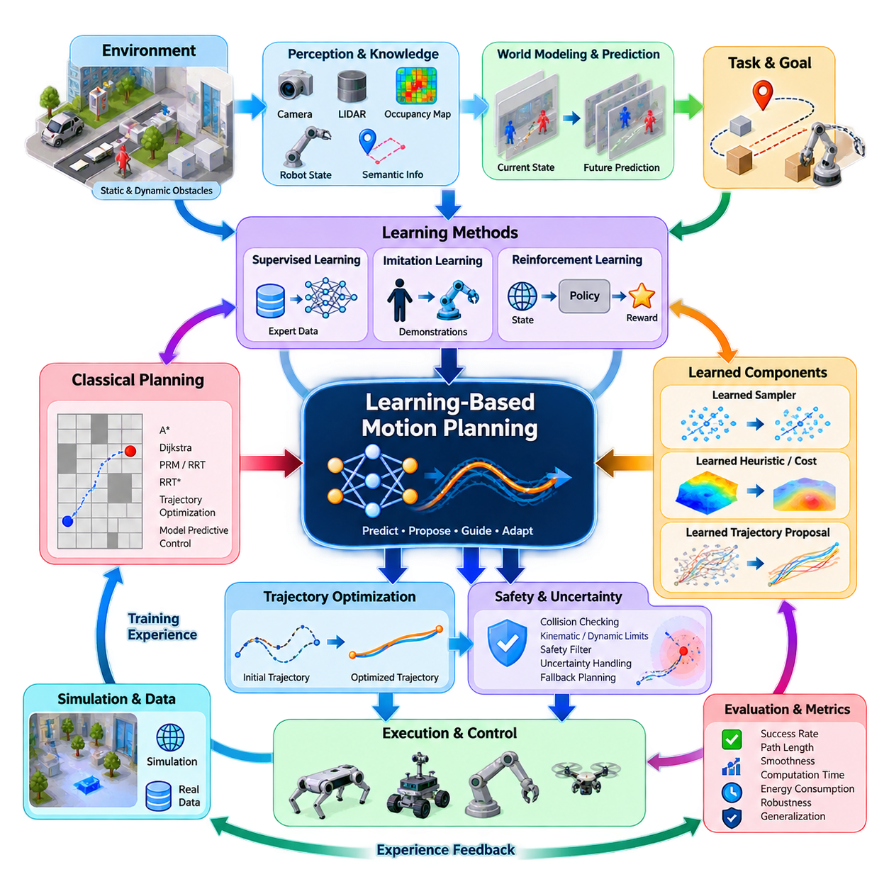{width="7.268055555555556in" height="7.268055555555556in"}

Learning-based motion planning introduces data-driven models into the process of generating collision-free, dynamically feasible, and task-relevant robot motions. Unlike conventional planners that depend primarily on explicit geometric models, search algorithms, or optimization objectives, learning-based methods extract useful planning knowledge from demonstrations, simulations, previous planning episodes, or interaction with environments. The objective is not necessarily to replace classical planning, but to improve its efficiency, adaptability, and ability to operate in complex environments.

Traditional motion planning typically formulates navigation or manipulation as a search through configuration space or state space. Algorithms such as A\*, Dijkstra, PRM, RRT, RRT\*, trajectory optimization, and model predictive control rely on predefined models and mathematical rules. These approaches provide strong interpretability and well-understood behavior, but computational complexity can increase rapidly when robots have many degrees of freedom, environments contain dynamic obstacles, or planning must account for complicated interaction constraints.

Learning-based planning changes this formulation by exploiting experience accumulated from previous problems. Instead of solving every planning problem entirely from scratch, a learned model can recognize structural similarities between the current situation and previously observed situations. It may predict promising regions of configuration space, estimate useful waypoints, rank candidate trajectories, approximate cost-to-go functions, or directly generate motion proposals. Planning therefore becomes a combination of computation performed online and knowledge acquired offline.

Supervised learning is one common approach to acquiring planning knowledge. A dataset can be constructed from trajectories generated by expert demonstrations, classical planners, optimization algorithms, or human operators. Neural networks then learn mappings from observations and goal specifications to actions, waypoints, trajectories, or planning heuristics. Imitation learning extends this concept by attempting to reproduce expert behavior, allowing robots to acquire useful motion policies without explicitly deriving every decision rule.

Reinforcement learning provides another important framework in which motion planning is represented as sequential decision making. The robot observes a state, selects an action, receives a reward, and gradually learns a policy that maximizes expected cumulative reward. Rewards may represent progress toward the goal, collision avoidance, energy efficiency, smooth motion, or task completion. This formulation is particularly attractive when effective behavior is difficult to specify analytically but can be discovered through repeated interaction or simulation.

Deep reinforcement learning combines reinforcement learning with neural representations capable of processing high-dimensional observations. Camera images, LiDAR measurements, occupancy maps, robot states, and semantic information can therefore be incorporated into planning policies. However, purely learned policies may behave unpredictably outside their training distribution. For safety-critical robotics, learned planning components are consequently often combined with geometric constraints, collision checking, safety filters, or conventional local planners.

Learning can also enhance sampling-based motion planning rather than replacing it. Conventional PRM or RRT methods frequently sample configuration space without knowing which regions are most useful for solving a particular problem. A learned sampler can estimate regions that are likely to contain feasible or high-quality paths and concentrate samples accordingly. Neural models can similarly predict expansion directions, connection candidates, or intermediate states, reducing unnecessary exploration while retaining the fundamental structure of classical planning.

Graph-based planners can benefit from learned heuristics and cost functions. Instead of relying only on Euclidean distance or manually designed traversal costs, a neural model may estimate the expected difficulty of reaching the goal from a particular state. Such estimates can guide graph search toward more promising regions. Learned cost models may additionally encode terrain traversability, human preferences, semantic restrictions, interaction risks, or historical experience that cannot easily be represented by simple geometric distance.

Trajectory optimization provides another natural interface between learning and classical planning. Neural networks can generate an initial trajectory that is subsequently refined by numerical optimization under collision, kinematic, dynamic, and actuator constraints. This architecture separates rapid experience-based prediction from rigorous constraint handling. Because optimization quality often depends strongly on initialization, learned trajectory proposals can substantially reduce convergence time and decrease the probability of becoming trapped in poor local solutions.

World models extend learning-based planning by predicting how the environment and robot state may evolve after candidate actions. Rather than learning only a direct observation-to-action mapping, the system learns a representation of dynamics and uses it to evaluate possible futures. Planning can then occur in a learned latent space, where multiple action sequences are imagined before execution. This principle connects motion planning with model-based reinforcement learning, predictive control, and emerging Physical AI architectures.

For mobile robots, learning-based planners can incorporate information beyond geometric obstacle boundaries. A robot operating outdoors may learn that grass, gravel, mud, slopes, curbs, or uneven surfaces produce different motion risks and energy costs. Indoor robots may learn patterns associated with pedestrian movement, doorways, intersections, elevators, or congested corridors. Planning can consequently consider traversability, social behavior, uncertainty, and operational experience in addition to shortest-path distance.

Dynamic environments create an especially important application area because future obstacle motion must be considered during planning. Learned models can estimate pedestrian trajectories, vehicle motion, or interaction patterns and provide predictions to a planner. The planner can evaluate not only where obstacles currently exist but where they are likely to move. This converts purely spatial planning into spatiotemporal planning and allows trajectories to account for future collision probability and interaction uncertainty.

Learning-based planning may operate at several architectural levels. At the lowest level, learned components can estimate local actions or short-horizon trajectories. At an intermediate level, they can propose subgoals, waypoints, or motion primitives. At a higher level, learned reasoning systems can select navigation strategies or coordinate planning with task objectives. Hierarchical architectures are therefore particularly useful because learning can be applied selectively where data-driven adaptation provides the greatest benefit.

A major challenge is generalization. A planner trained in a limited set of environments may perform well during evaluation but fail when encountering unfamiliar geometry, sensor conditions, robot dynamics, or obstacle behaviors. Training datasets must therefore represent sufficient variation, and evaluation should include environments that were not encountered during training. Domain randomization, simulation augmentation, transfer learning, and online adaptation can improve robustness, although none alone guarantees reliable operation.

Simulation plays a central role because large quantities of planning experience can be generated without exposing physical robots to unnecessary risk. Diverse maps, obstacles, robot configurations, friction conditions, sensor noise, and dynamic agents can be randomized during training. Nevertheless, differences between simulation and physical systems create a simulation-to-real gap. Real-world deployment requires validation against actual sensing errors, actuator limitations, latency, localization uncertainty, and environmental variability.

Safety remains one of the strongest reasons to adopt hybrid planning architectures. Learned models are powerful approximators but generally do not provide the same deterministic guarantees available from explicitly constrained algorithms. A practical robot can therefore use learning to propose trajectories while independent modules verify collision clearance, velocity limits, stability constraints, stopping distance, and actuator feasibility. Unsafe proposals can be rejected, modified, or passed to a fallback planner before commands reach the robot.

Uncertainty must also be represented explicitly. Perception errors, imperfect localization, uncertain dynamics, and unpredictable obstacle behavior mean that a single deterministic trajectory may provide insufficient protection. Probabilistic predictions, uncertainty-aware cost functions, risk-sensitive reinforcement learning, and belief-space planning can help account for these effects. The planner should distinguish between situations where a learned prediction is reliable and situations where uncertainty requires slower motion, replanning, or conservative behavior.

Evaluation of learning-based motion planning should therefore extend beyond success rate. Relevant measures include collision frequency, path length, trajectory smoothness, computation time, planning latency, energy consumption, minimum obstacle clearance, robustness to disturbances, and generalization to unseen environments. For real-time robotics, worst-case or high-percentile latency can be more significant than average inference speed because delayed planning decisions may directly affect safety.

The most practical direction is increasingly a hybrid architecture in which classical planning and learning provide complementary capabilities. Classical algorithms contribute geometric consistency, explicit constraints, verification mechanisms, and predictable fallback behavior. Learning contributes experience, semantic understanding, prediction, adaptive heuristics, and rapid approximation. Combining these capabilities allows robots to retain established planning principles while exploiting information that would otherwise be difficult to encode manually.

In Physical AI systems, motion planning ultimately becomes part of a larger perception--prediction--reasoning--action loop. Perception constructs representations of the robot and environment, learned models estimate future states and interaction possibilities, planning evaluates candidate behaviors, and safety mechanisms constrain execution. Experience from completed actions can then return to the learning process. This closed-loop structure transforms motion planning from an isolated algorithm into an adaptive decision component that continuously connects perception, world modeling, control, and physical interaction.

## 09.02. Imitation Learning for Navigation Policy [w/Code]

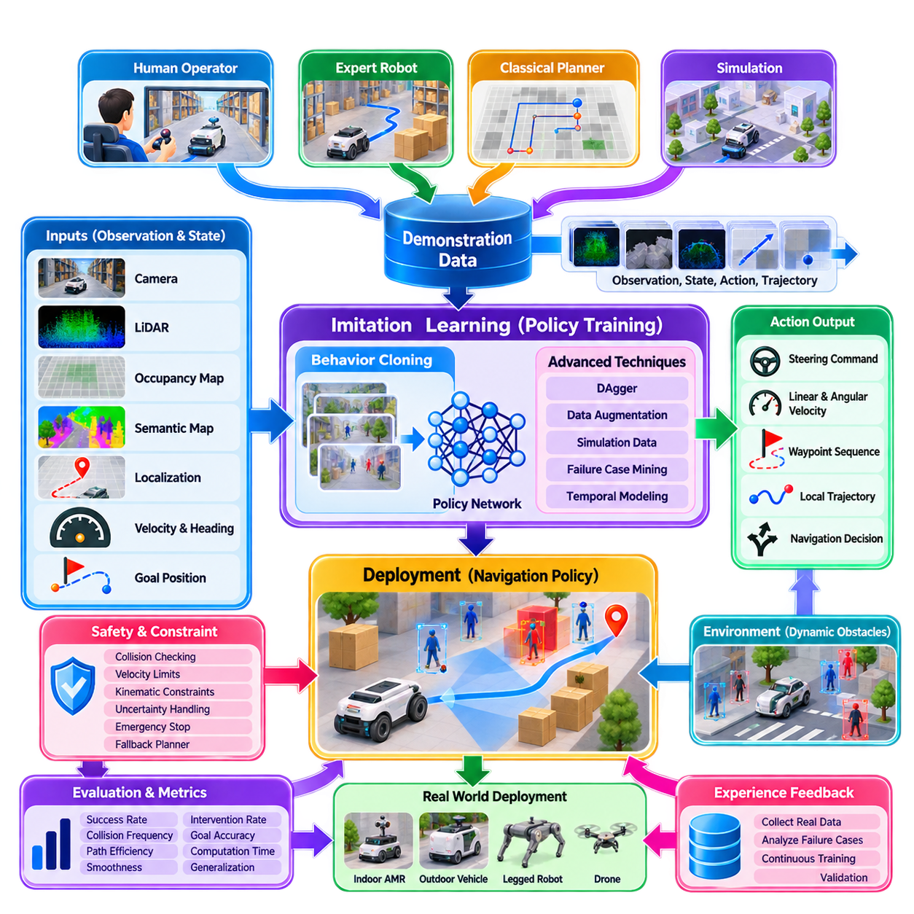{width="7.268055555555556in" height="7.268055555555556in"}

Imitation learning for navigation policy learning enables a robot to acquire navigation behavior by learning from demonstrated trajectories rather than deriving every decision from manually designed rules. An expert, human operator, classical planner, or previously validated navigation system provides examples of observations, states, actions, and resulting trajectories. A learning model then approximates the relationship between the perceived environment, navigation goal, robot state, and desired motion. The learned policy can subsequently generate navigation actions for previously unseen situations.

The fundamental formulation treats navigation as a mapping from observation and state information to an action or short-horizon motion command. Inputs may include camera images, LiDAR scans, occupancy grids, semantic maps, localization estimates, velocity, heading, and the relative position of the target. The output may be a steering command, linear and angular velocity, waypoint sequence, local trajectory, or higher-level navigation decision. The appropriate output representation depends on the robot platform and the degree of control that the learned policy is expected to assume.

Behavior cloning is the most direct form of imitation learning. Demonstration data are collected as pairs or sequences of observations and expert actions, and a supervised learning model is trained to minimize the difference between the predicted action and the demonstrated action. For navigation, the dataset may contain driving trajectories through corridors, intersections, warehouses, roads, or outdoor industrial environments. The resulting policy learns behavioral patterns such as obstacle avoidance, corridor following, goal approach, turning, yielding, and recovery from common navigation situations.

A major advantage of imitation learning is that it can capture behavioral knowledge that is difficult to express through explicit mathematical rules. An experienced operator may naturally maintain appropriate clearance from obstacles, anticipate pedestrian movement, select practical routes, or adjust speed according to environmental context. These behaviors can be embedded in demonstrations without requiring every underlying decision criterion to be explicitly modeled. The learned policy therefore becomes a compact representation of navigation experience that can complement conventional geometric planning.

However, simple behavior cloning has an important limitation known as covariate shift. During training, the robot generally observes states produced by the expert policy, whereas during deployment the learned policy may make a small error and enter a state that was not represented in the training data. From that unfamiliar state, the policy may make another error, causing the robot to progressively diverge from the intended trajectory. This compounding-error problem is particularly significant for long-horizon navigation because small deviations can eventually produce large positional or behavioral differences.

Data collection is therefore a central engineering problem. A useful navigation dataset should contain not only successful nominal trajectories but also diverse environmental conditions, robot speeds, obstacle configurations, localization errors, and recovery situations. Demonstrations should cover intersections, narrow passages, dead ends, dynamic obstacles, docking approaches, route changes, and abnormal conditions. For industrial AMRs, data should also represent different payloads, floor conditions, traffic densities, lighting conditions, and operational constraints so that the policy does not become overly specialized to a single environment.

Several techniques can improve the quality and coverage of imitation learning. Dataset aggregation methods such as DAgger allow the learner to interact with the environment while an expert continues to provide corrective actions for states encountered by the learned policy. This reduces the mismatch between training and deployment distributions. Additional approaches include trajectory perturbation, synthetic data generation, simulation-based demonstrations, active data collection, and targeted recording of failure cases. These methods make the training distribution more representative of the states that the robot will actually encounter.

The representation of the navigation policy strongly affects generalization. A policy based only on raw images may learn useful visual correlations but can struggle when lighting, camera position, or scene appearance changes. Incorporating geometric information such as LiDAR, occupancy maps, localization, and robot velocity can provide stronger spatial structure. Semantic representations can further distinguish pedestrians, vehicles, walls, doors, loading areas, restricted zones, and other meaningful entities. Multimodal policy inputs therefore allow imitation learning to combine geometric, semantic, and temporal information.

Temporal context is particularly important for navigation because a single observation often does not contain enough information to determine the correct action. Recurrent networks, temporal transformers, stacked observations, trajectory encoders, and memory mechanisms can provide information about previous states and actions. Temporal modeling helps the policy recognize whether an object is approaching, whether the robot is already turning, whether an obstacle has moved, or whether a previous maneuver failed. This converts the policy from a purely reactive controller into a behavior model that can incorporate short-term navigation history.

Imitation learning can also be combined with classical navigation architectures rather than replacing them. A learned policy may generate candidate waypoints or local trajectories while a conventional planner performs global route generation. Alternatively, the policy can provide a learned heuristic, preferred direction, sampling distribution, or trajectory initialization to an optimization-based planner. Collision checking, kinematic constraints, velocity limits, and safety verification can remain deterministic components. This hybrid structure allows learned behavioral knowledge to improve adaptability while preserving explicit mechanisms for constraint enforcement and failure handling.

For dynamic environments, imitation learning can incorporate demonstrations showing how an expert responds to moving agents. The policy can learn behaviors such as slowing near pedestrians, yielding at intersections, maintaining appropriate following distance, or selecting alternative paths around temporarily blocked areas. Nevertheless, imitation from historical behavior does not guarantee correct prediction of every future interaction. A robust system should therefore combine learned behavioral prediction with real-time perception, dynamic obstacle tracking, risk estimation, and continuous replanning. The learned policy should guide decisions rather than assume that the environment will evolve exactly as demonstrated.

Safety and validation are essential when an imitation policy is deployed on a physical robot. The policy should operate within defined action boundaries and be monitored by independent safety mechanisms. Collision prediction, emergency stopping, obstacle clearance, speed limits, localization confidence, and actuator constraints can be evaluated outside the learned model. When confidence is low or the policy proposes an unsafe action, the system can slow down, reject the command, invoke a conventional planner, or transition into a recovery behavior. This creates a layered architecture in which learning provides adaptability while deterministic mechanisms retain authority over safety.

The evaluation of an imitation-based navigation policy should measure more than similarity to expert demonstrations. Important metrics include navigation success rate, collision frequency, intervention frequency, path efficiency, trajectory smoothness, goal-reaching accuracy, computational latency, recovery performance, and generalization to unseen environments. Comparison against the expert trajectory alone can be misleading because multiple trajectories may be equally valid. A policy should therefore be evaluated according to whether it reaches the operational objective safely, efficiently, and consistently under conditions that differ from its training distribution.

Simulation and digital twins provide an effective environment for scaling imitation-learning development. Expert trajectories can be generated across large numbers of maps and scenarios while systematically varying obstacles, robot parameters, sensor noise, traffic patterns, and environmental conditions. The resulting data can be combined with real-world demonstrations to create a broader training distribution. Sim-to-real validation remains necessary because physical systems introduce effects such as wheel slip, sensor artifacts, communication latency, actuator saturation, and imperfect localization that may not be fully represented in simulation.

In advanced Physical AI architectures, imitation learning can evolve from simple behavior cloning into a component of a broader learning-and-planning system. Demonstrations provide behavioral priors, world models provide predictive representations, learned planners generate candidate futures, and classical modules verify physical feasibility. The policy can operate at different abstraction levels, from local velocity generation to waypoint selection and high-level navigation strategy. Experience collected during deployment can then be analyzed and incorporated into subsequent training cycles, creating a continuous improvement loop.

The practical objective is therefore not to create a navigation policy that blindly imitates an expert, but to construct a system that extracts useful navigation knowledge from experience and combines it with explicit planning, prediction, and safety mechanisms. Imitation learning is particularly valuable when expert behavior contains complex contextual knowledge that is difficult to encode manually. When integrated with perception, localization, world modeling, classical planning, trajectory optimization, and runtime safety supervision, it can become an effective learning layer for robust autonomous navigation across AMRs, autonomous vehicles, legged robots, and other Physical AI platforms.

## 09.03. Reinforcement Learning for End to End Navigation [w/Code]

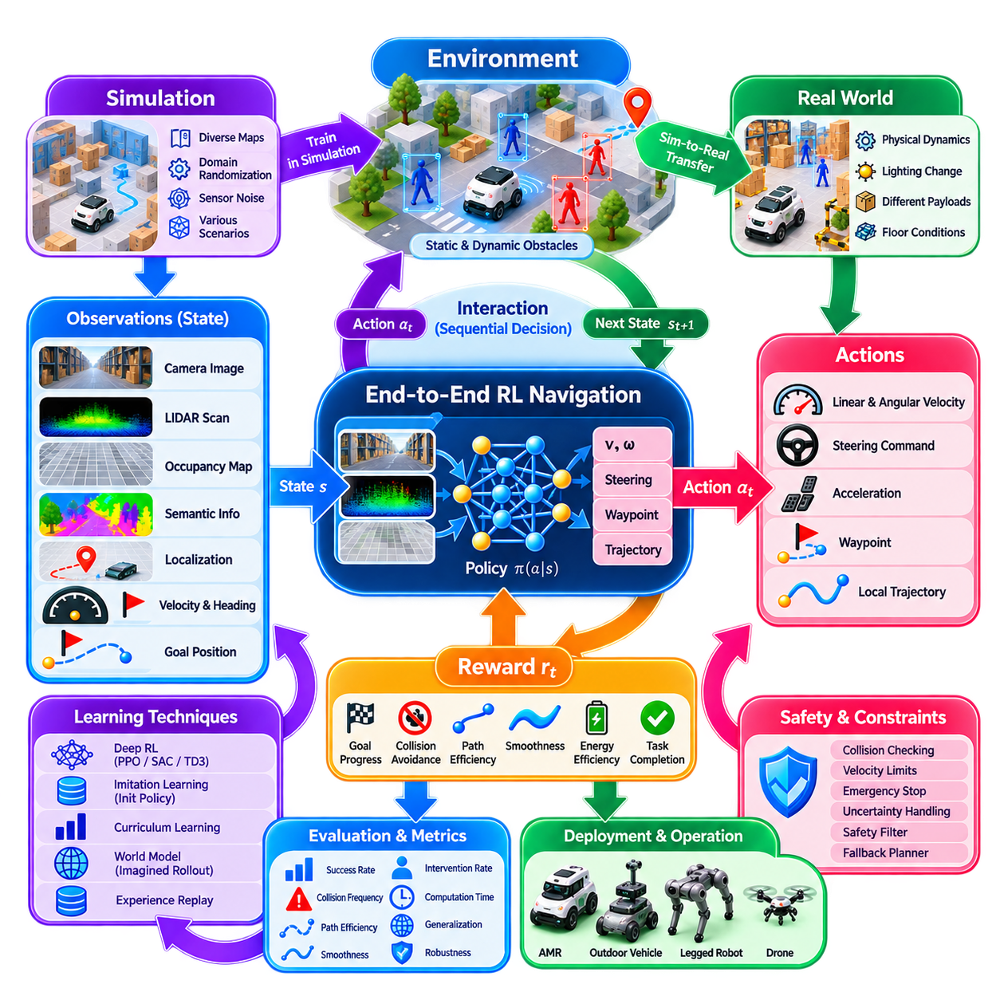{width="7.268055555555556in" height="7.268055555555556in"}

Reinforcement learning for end-to-end navigation treats autonomous robot navigation as a sequential decision-making problem in which the robot learns how to transform environmental observations directly into navigation actions. Instead of explicitly constructing a complete perception, planning, and control pipeline with manually designed rules, the system learns a policy through interaction with an environment. The policy receives observations such as camera images, LiDAR measurements, robot state, and goal information, and produces actions that progressively move the robot toward a desired destination while avoiding unsafe situations.

The central concept is the navigation policy, which maps an observed state to an action according to a learned objective. A state may contain raw sensor observations or structured representations such as occupancy maps, semantic information, localization, velocity, and relative goal position. Actions may be represented as linear and angular velocity, steering commands, acceleration, waypoints, or short-horizon trajectories. The policy is optimized according to cumulative reward rather than simply matching a predefined expert trajectory. This allows the robot to discover behaviors that may differ from conventional planning solutions while still satisfying the overall navigation objective.

The reinforcement learning formulation defines navigation through states, actions, transitions, and rewards. At each time step, the robot observes its current condition, selects an action using its policy, and receives feedback from the environment. The environment then transitions to a new state. The learning objective is to maximize expected cumulative reward over time. Reward design is therefore critical because it determines what behaviors the policy considers desirable. A navigation reward may combine progress toward the goal, collision avoidance, path efficiency, motion smoothness, energy consumption, and successful mission completion.

End-to-end navigation becomes particularly attractive when the policy can operate directly on high-dimensional sensory information. A deep neural network may process camera images, LiDAR representations, or multimodal observations and generate navigation commands without requiring every intermediate representation to be explicitly constructed. Convolutional networks, transformers, recurrent architectures, and multimodal encoders can learn representations of obstacles, free space, landmarks, and environmental context. The policy can consequently learn a direct relationship between perception and action while still incorporating temporal information and navigation objectives.

The main advantage of this approach is that perception, decision making, and action selection can be optimized as a connected learning problem. Conventional systems often require careful tuning of interfaces between perception, localization, planning, and control. End-to-end reinforcement learning can discover useful internal representations jointly with navigation behavior. This is especially useful when the relationship between sensor observations and effective actions is difficult to model analytically, such as navigating around pedestrians, adapting to irregular terrain, or selecting appropriate behavior in visually complex environments.

However, end-to-end reinforcement learning also introduces substantial challenges. A policy that learns entirely through physical trial and error would require enormous numbers of interactions and could expose the robot to unacceptable collision and equipment risks. Training is therefore normally performed extensively in simulation before physical deployment. Simulated environments allow millions of navigation episodes to be generated while varying maps, obstacles, robot dynamics, sensor noise, lighting, terrain, and traffic conditions. The resulting policy can then be transferred to a physical platform through carefully controlled sim-to-real procedures.

Reward design is one of the most difficult aspects of navigation reinforcement learning. If the reward emphasizes only goal completion, the robot may discover undesirable shortcuts or aggressive behaviors. If collision penalties are excessively large, the robot may become overly conservative and fail to make useful progress. If path length is strongly penalized, the robot may select narrow or risky routes. A practical reward therefore needs to balance progress, safety, efficiency, smoothness, comfort, energy, and operational constraints. Reward shaping should guide learning without encoding an overly rigid navigation strategy.

Sparse rewards create another difficulty because successful navigation may require a long sequence of correct decisions before the final goal is reached. If the robot receives meaningful feedback only when it reaches the destination, learning can become extremely inefficient. Dense rewards provide intermediate information about progress and behavior, while curriculum learning can gradually increase task difficulty. A training sequence may begin with simple obstacle-free environments, then introduce static obstacles, narrow passages, dynamic agents, uncertain localization, and finally complex multi-zone navigation scenarios.

Exploration is fundamental to reinforcement learning because the robot must discover actions that improve its long-term outcome. Excessive exploration can produce unsafe or inefficient behavior, while insufficient exploration can cause the policy to converge prematurely to a limited strategy. Algorithms such as PPO, SAC, TD3, and related actor-critic methods provide different mechanisms for balancing exploration and exploitation. The appropriate algorithm depends on whether actions are discrete or continuous, the dimensionality of observations, training stability requirements, and computational resources.

Navigation policies can also incorporate demonstrations and prior knowledge before reinforcement learning begins. Imitation learning can provide an initial policy based on expert trajectories, after which reinforcement learning refines the policy through interaction. This approach reduces the need for completely random exploration and can accelerate convergence. Classical planners can similarly provide initial trajectories, heuristic information, or reward references. The combination of imitation learning and reinforcement learning is therefore particularly useful when safe and efficient behavior must be learned without starting from an unstructured policy.

Temporal reasoning becomes increasingly important for end-to-end navigation in dynamic environments. A single camera frame or LiDAR scan may not reveal whether an obstacle is stationary, approaching, or moving away. Recurrent networks and temporal transformers can process sequences of observations and actions to infer motion patterns and environmental evolution. The policy can then learn behaviors such as slowing for approaching pedestrians, waiting for traffic to clear, maintaining a safe following distance, or selecting an alternative route when a passage becomes blocked.

The robot\'s physical dynamics must also be considered when reinforcement learning generates low-level navigation actions. A policy trained on an idealized point robot may produce commands that cannot be executed reliably by a real AMR with steering constraints, wheel slip, actuator delays, payload variation, and braking limitations. Physics-based simulation and dynamics randomization can expose the policy to these effects during training. Alternatively, reinforcement learning can operate at a higher level by producing waypoints or short trajectories while a conventional controller guarantees physically feasible execution.

Safety is therefore best implemented as an independent layer rather than being represented only through reward penalties. A reward function can encourage safe behavior, but it cannot guarantee that an individual action will never be dangerous. Runtime safety mechanisms can perform collision prediction, speed limitation, emergency stopping, localization-confidence monitoring, and trajectory validation. When a learned policy proposes an unsafe action, the safety layer can modify, reject, or override it. This creates a constrained end-to-end architecture in which learning provides adaptive decision making while deterministic mechanisms enforce critical operational boundaries.

Uncertainty estimation is equally important for real-world deployment. The learned policy may encounter sensor conditions, environmental structures, or obstacle behaviors that differ substantially from the training distribution. A confidence or uncertainty mechanism can identify situations in which the policy should not operate aggressively. The system may respond by reducing speed, requesting additional sensing, switching to a conventional planner, stopping safely, or initiating recovery behavior. This is especially important for industrial AMRs operating for long periods in environments where rare and previously unseen conditions inevitably occur.

Generalization must therefore be evaluated systematically. A policy that performs well on training maps may fail when deployed in a new warehouse, factory, campus, road, or outdoor facility. Evaluation should include unseen layouts, different obstacle distributions, varying lighting, sensor noise, localization errors, dynamic agents, and changes in robot payload or surface conditions. Domain randomization and environment diversity can improve generalization, but real-world validation remains essential because simulation cannot reproduce every physical phenomenon and operational interaction.

End-to-end reinforcement learning can also be integrated with hierarchical navigation. A high-level planner may determine the mission or destination sequence, while the learned policy handles local navigation. Alternatively, reinforcement learning may select behaviors such as follow, yield, avoid, recover, or dock, while conventional planners generate detailed trajectories. This hierarchical structure reduces the learning burden and allows reinforcement learning to focus on decisions for which adaptive behavior provides the greatest benefit. It also preserves established planning mechanisms for tasks that are easier to solve deterministically.

World models provide another pathway for improving reinforcement-learning efficiency. Instead of learning exclusively through direct interaction with the environment, the system can learn a predictive model of future states and use that model to evaluate candidate actions internally. The policy can therefore perform imagined rollouts before executing actions on the physical robot. This reduces expensive real-world experimentation and allows the system to reason about possible future consequences. World-model-based reinforcement learning is particularly relevant to Physical AI because it connects perception, prediction, planning, and action within a unified learning loop.

For industrial AMRs, end-to-end reinforcement learning is most practical when treated as one component within a broader autonomy architecture. Global mission planning, localization, mapping, fleet coordination, safety control, and deterministic emergency functions can remain conventional, while reinforcement learning provides adaptive local navigation behavior. This division allows the learned policy to exploit environmental experience without forcing the entire operational system to depend on a single neural network. The resulting architecture can support controlled deployment, staged validation, monitoring, and gradual expansion of autonomous capabilities.

The long-term significance of reinforcement learning for navigation is that the robot can improve behavior through experience rather than relying exclusively on manually specified rules. Simulation, demonstrations, real-world logs, and fleet experience can continuously contribute to policy improvement. Operational data can reveal failure patterns, difficult scenarios, and previously unrecognized environmental conditions, which can then be reproduced in simulation and incorporated into subsequent training. This creates a closed learning cycle in which experience improves the policy, the improved policy generates new experience, and validation determines whether the resulting behavior is suitable for deployment.

In a Physical AI architecture, end-to-end reinforcement learning should therefore be understood not simply as a replacement for conventional navigation algorithms, but as a learning mechanism for acquiring adaptive decision-making capability. Its strongest role is in situations where navigation depends on complex interactions among perception, prediction, environment dynamics, and long-term objectives. When combined with simulation, imitation learning, world models, classical planning, trajectory control, uncertainty estimation, and independent safety supervision, reinforcement learning can provide a scalable pathway toward autonomous navigation systems that learn from experience while remaining physically constrained and operationally verifiable.

## 09.04. Neural Motion Planning MPinets [w/Code]

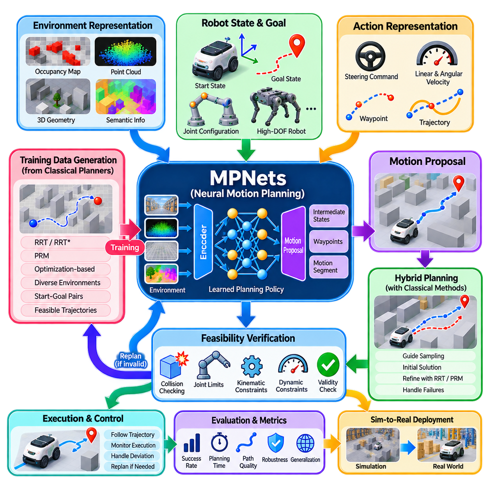{width="7.268055555555556in" height="7.268055555555556in"}

Neural motion planning introduces deep learning into the generation of collision-free robot motions by learning a relationship between the robot state, environmental representation, and feasible motion. MPNets, or Motion Planning Networks, represent an important approach in this direction because they seek to learn planning behavior from previously solved motion-planning problems rather than repeatedly performing expensive search from scratch. The learned model can provide rapid motion proposals while retaining the concept of feasibility and collision-aware planning.

The central idea of MPNets is to learn a neural approximation of a motion planner. Conventional planners search configuration space using methods such as RRT, RRT\*, PRM, or optimization-based techniques. Although these algorithms are general and mathematically structured, repeated planning can become computationally expensive, particularly for high-dimensional robots and complex environments. MPNets instead learn from collections of solved planning problems so that information obtained from previous planning experiences can accelerate future solutions.

A motion-planning problem can be represented by the robot configuration, the desired goal configuration, and the surrounding environment. For a mobile robot, the configuration may contain position and orientation, while an articulated robot may require many joint variables. The environment can be represented using obstacles, point clouds, occupancy information, signed distance representations, or other geometric features. The neural planner receives these representations and predicts useful intermediate configurations or motion segments that guide the robot toward the goal.

Training data are generally generated from conventional motion planners or other reliable planning procedures. Each training example contains an environment together with a start state, goal state, and one or more feasible solutions. These examples provide demonstrations of how a planner successfully navigates the configuration space. The neural network learns statistical relationships between environmental geometry, robot configuration, and successful motion. The quality and diversity of this dataset are therefore fundamental to the resulting planner\'s generalization capability.

One important characteristic of MPNets is that the learned model does not necessarily need to reproduce an entire trajectory in a single prediction. Instead, it can propose a sequence of intermediate states that progressively moves the robot toward the goal. Collision checking and feasibility verification can then determine whether the proposed motion is valid. If a prediction is rejected, another prediction or a conventional planning mechanism can be invoked. This allows the learned component to function as a fast planning proposal mechanism rather than an uncontrolled direct-action policy.

The approach is particularly useful for high-dimensional configuration spaces. An industrial manipulator, humanoid robot, or mobile manipulator may have many degrees of freedom, making exhaustive exploration extremely expensive. A neural planner can learn the structure of frequently encountered configuration spaces and identify regions that are likely to contain useful solutions. Instead of treating every planning problem as completely new, the network uses learned representations to guide the search toward configurations that have historically been associated with successful solutions.

MPNets can also support different robot and environment representations through learned encoders. Geometric information may be transformed into a latent representation that captures obstacle structure and relevant spatial relationships. The robot\'s current configuration and goal can then be combined with this representation to generate a motion proposal. This separation between environmental encoding and motion generation is important because the same planning framework can potentially be adapted to different environments while preserving a common representation of planning knowledge.

The concept becomes especially powerful when neural planning is combined with classical sampling-based methods. A learned network can predict promising samples, expansion directions, or intermediate states, while RRT, PRM, or another planner retains responsibility for constructing and verifying a complete feasible path. The neural model therefore reduces wasted exploration without removing the established search mechanism. Such a hybrid architecture can improve planning speed while preserving the ability of conventional planners to recover when the learned prediction is inaccurate.

Collision checking remains a critical component because neural networks do not inherently guarantee geometric validity. A predicted configuration may appear reasonable statistically while placing a robot link inside an obstacle or violating a joint constraint. The planning system must therefore evaluate candidate motions against the actual environment and robot model. Collision detection, inverse kinematics, joint limits, dynamic constraints, and other feasibility tests provide an independent verification layer around the learned planner.

The training objective can incorporate more than simple trajectory imitation. A neural motion planner may be trained to predict feasible configurations, minimize distance to the goal, remain within collision-free regions, or reproduce characteristics of high-quality solutions. Additional loss terms can encourage smoothness, continuity, or efficient motion. The design of these objectives determines whether the network learns merely to imitate the statistical structure of the training data or develops representations that are useful for generating new feasible solutions.

Generalization is one of the most important challenges for neural motion planning. A network trained on a limited set of obstacle configurations may perform well on similar environments but fail when geometry, robot configuration, or goal locations change significantly. Training therefore needs sufficient variation in obstacle shapes, spatial arrangements, start states, goal states, and robot configurations. Randomized environments and procedurally generated training data can expose the network to a much broader range of planning situations than manually collected examples alone.

The relationship between learned planning and classical optimality also requires careful consideration. A neural planner may produce a feasible path rapidly without guaranteeing that the path is globally optimal. Classical algorithms such as RRT\* can provide stronger asymptotic optimality properties, although they may require greater computation. In practical robotics, the appropriate objective may therefore be fast generation of sufficiently good feasible trajectories rather than mathematical optimality. Neural planning can provide this speed while classical optimization can subsequently refine the proposed trajectory when higher quality is required.

For mobile robots, neural motion planning can operate at several levels. A network may predict local waypoints, candidate trajectories, sampling regions, or preferred motion directions. These outputs can then be processed by a conventional local planner or controller. For manipulators, the network may predict intermediate joint configurations or end-effector motion segments. For mobile manipulators and humanoids, neural planning can help manage the large combined configuration space created by simultaneous base, arm, and whole-body motion.

Runtime performance is one of the principal motivations for neural motion planning. Once a neural network has been trained, inference can be performed rapidly on GPU-enabled edge computers. This can be valuable when a robot repeatedly solves related planning problems, such as moving between frequently used workstations, approaching objects from different directions, or operating in environments with continuously changing obstacles. However, inference speed alone is not sufficient. Total planning performance must include preprocessing, collision checking, trajectory validation, fallback planning, communication latency, and execution verification.

Uncertainty should also be considered because neural predictions are inherently approximate. A planner should be able to recognize situations where the learned model is operating outside its training distribution or producing low-confidence proposals. In such cases, the system can increase classical search, request additional samples, reduce robot speed, or switch entirely to a conventional planner. This creates a practical architecture in which the neural model provides speed under familiar conditions while deterministic planning mechanisms provide robustness under uncertain conditions.

Simulation provides an effective foundation for training and evaluating MPNets. Large numbers of environments can be generated with randomized obstacle geometry, robot configurations, start and goal states, and planning constraints. Classical planners can solve these problems offline to create training datasets. The neural network can then learn from this accumulated planning experience without requiring equivalent numbers of physical-robot trials. After training, evaluation should include unseen environments and real-world experiments to measure the effects of sensor uncertainty, model mismatch, actuation limits, and environmental changes.

In a broader Physical AI architecture, MPNets can be positioned between world understanding and trajectory generation. Perception and mapping provide geometric and semantic representations of the environment, while localization supplies the robot state. The neural planner uses these representations to generate candidate motions, and a classical verification and optimization layer evaluates their feasibility. A controller then tracks the selected trajectory while monitoring execution. Feedback from successful and failed planning episodes can subsequently become additional training data, creating a continuous improvement cycle.

The most practical role of neural motion planning is therefore not to eliminate classical planning but to learn where and how planning computation should be concentrated. MPNets illustrate this principle by converting accumulated planning experience into a fast neural proposal mechanism. When combined with collision checking, sampling-based planning, optimization, uncertainty estimation, simulation, and runtime safety supervision, neural motion planning can substantially reduce computational effort while retaining the verification mechanisms required for reliable physical robots. This hybrid approach provides a practical bridge between classical algorithmic planning and learning-driven Physical AI.

## 09.05. Diffusion Policy for Robot Navigation [w/Code]

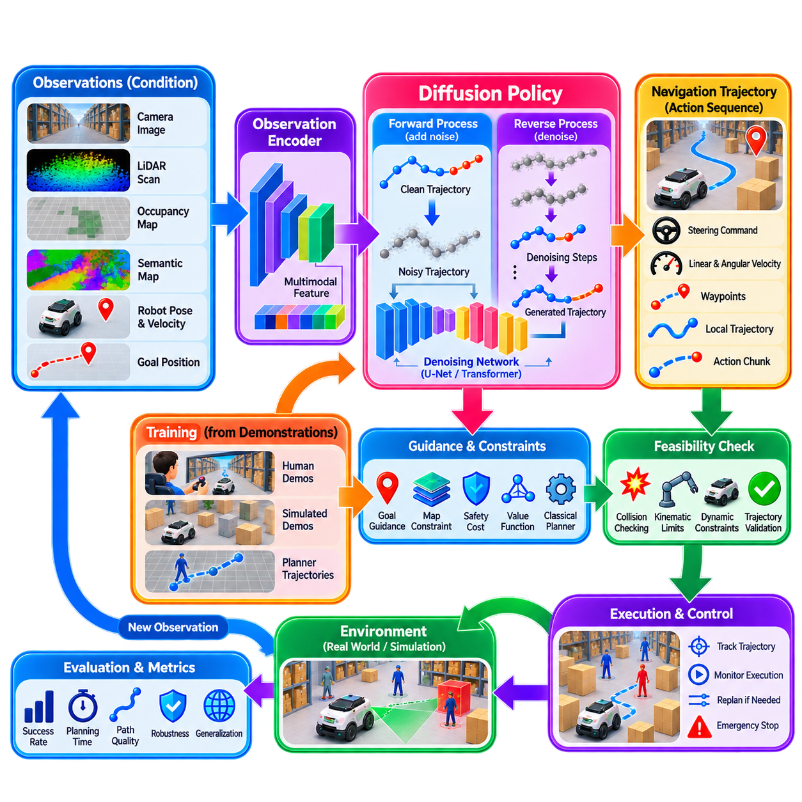{width="7.268055555555556in" height="7.268055555555556in"}

Diffusion policies introduce a generative approach to robot navigation in which a neural network learns to produce action sequences or trajectories by progressively transforming random noise into structured motion. Instead of predicting a single deterministic action from the current observation, the model learns a distribution over possible behaviors. This is particularly useful for navigation because multiple trajectories can be valid for the same environment and goal. The policy can therefore represent behavioral diversity while remaining conditioned on the robot, environment, and task.

The basic diffusion process consists of a forward process that gradually adds noise to demonstration trajectories and a learned reverse process that reconstructs meaningful trajectories from noisy representations. During training, expert trajectories are progressively corrupted with different levels of noise, and the neural network learns to predict how the noisy trajectory should be denoised. During inference, the process begins from noise and repeatedly refines the representation until a complete action sequence or motion trajectory is generated. This iterative generation provides a flexible mechanism for modeling complex multimodal navigation behavior.

For robot navigation, the diffusion model can be conditioned on observations such as camera images, LiDAR scans, occupancy maps, semantic maps, robot pose, velocity, and goal position. These inputs provide contextual information that guides the generation process toward trajectories appropriate for the current situation. A learned encoder converts multimodal observations into a representation that conditions the diffusion network. The output can then be expressed as a sequence of linear and angular velocities, waypoints, local poses, steering commands, or short-horizon trajectories depending on the robot platform and control architecture.

One of the most important advantages of diffusion-based policies is their ability to represent multimodal behavior. In a corridor with multiple possible exits, for example, several trajectories may be equally valid depending on the task objective, surrounding agents, or future navigation requirements. A conventional regression policy may average these possibilities and produce an undesirable trajectory between them. A diffusion policy can instead represent several distinct modes of behavior and generate one coherent trajectory corresponding to a particular feasible navigation strategy.

Diffusion policies are particularly well suited to learning from demonstrations because their training objective naturally operates on trajectory distributions. Demonstrations can be collected from expert operators, classical planners, autonomous navigation systems, or simulation environments. Each trajectory contains the temporal relationship between observations, robot states, and actions. The diffusion model learns the statistical structure of these trajectories rather than merely memorizing individual actions. This allows the policy to generate new motion sequences that share characteristics with demonstrated behavior while adapting to different environmental conditions.

The temporal structure of navigation is another major benefit. A navigation decision is rarely independent from the actions that follow it. Turning into a corridor, passing an obstacle, approaching a docking station, or yielding to a pedestrian involves a sequence of coordinated actions. A diffusion policy can generate an entire action chunk or trajectory over a finite horizon, allowing neighboring actions to remain mutually consistent. This differs from purely reactive policies that predict one action at a time and may accumulate errors through repeated independent decisions.

Action chunking also has practical implications for computation and control. Instead of invoking a neural policy for every individual control command, the diffusion model can generate a short sequence of future actions and execute a portion of that sequence before replanning. This reduces the frequency of expensive policy inference while preserving receding-horizon behavior. The robot can continuously observe the environment, generate a new trajectory, execute the most appropriate portion, and then repeat the process. Such a structure connects diffusion policies naturally with model predictive control and local trajectory planning.

Conditioning mechanisms determine how strongly environmental and task information influences generated trajectories. The policy can condition on the current robot state, navigation goal, local map, semantic information, previous actions, or a broader mission context. Cross-attention and transformer architectures can combine spatial and temporal information across these inputs. For mobile robots, this enables the diffusion process to distinguish between obstacles that merely occupy space and objects whose semantic identity or predicted behavior should influence the selected trajectory.

Dynamic obstacle navigation presents an important application. A diffusion policy can learn from demonstrations in which operators or planners respond to pedestrians, vehicles, other robots, or changing obstacles. Rather than generating a trajectory solely from the current obstacle position, the model can use temporal observations to infer movement patterns and produce a sequence that anticipates future interactions. The policy may learn behaviors such as slowing down, yielding, passing on an appropriate side, waiting, or selecting an alternative route. However, learned prediction should remain subject to real-time collision checking and safety constraints.

Diffusion policies can also capture smooth and coordinated motion characteristics that are difficult to obtain from independent action regression. The training distribution can contain preferred acceleration profiles, turning patterns, obstacle clearance, approach behavior, and stopping characteristics. The generated trajectory therefore reflects correlations between consecutive actions. Additional conditioning or optimization objectives can encourage smooth velocity, acceleration, curvature, and jerk profiles. This is important for industrial AMRs because trajectory quality affects mechanical stress, payload stability, energy consumption, and passenger or human comfort.

A major limitation is computational cost. Diffusion generation normally requires multiple denoising steps, and each step requires neural network inference. Generating a trajectory can therefore be more expensive than a single forward pass from a conventional policy network. For real-time robotics, inference latency must be carefully measured and optimized. Techniques such as fewer denoising steps, latent diffusion, distillation, efficient transformer architectures, parallel computation, and hardware acceleration can reduce this burden. The required optimization depends strongly on the planning horizon and control frequency.

Another challenge is that diffusion policies do not automatically guarantee physical feasibility. A generated trajectory may intersect an obstacle, violate the robot\'s turning radius, exceed velocity or acceleration limits, or require an actuator response that is physically impossible. The diffusion model should therefore operate within a broader planning architecture. Collision checking, kinematic constraints, dynamic constraints, trajectory validation, and safety monitoring can independently evaluate the generated motion before execution. Invalid trajectories can be rejected, repaired, or regenerated under stronger constraints.

Guidance mechanisms provide one way to incorporate explicit objectives into diffusion generation. The generation process can be conditioned toward a particular goal, cost function, semantic region, or preferred behavior. A navigation system may guide trajectories toward the destination while discouraging collision risk or excessive motion. External guidance can also be introduced from a classical planner, learned value function, cost model, or safety evaluator. This creates an interface through which symbolic or geometric planning knowledge can influence the generative model without requiring the entire planner to be replaced.

Diffusion policies can be trained primarily in simulation, where large collections of trajectories can be generated under controlled conditions. Maps, obstacle layouts, robot dynamics, sensor noise, lighting, pedestrian behavior, and goal locations can be varied to create a diverse training distribution. Real-world demonstrations can then be added to improve correspondence with physical behavior. Simulation provides scale and diversity, while real-world data provide information about actuator delays, localization errors, wheel slip, sensing artifacts, and environmental details that are difficult to model accurately.

Generalization remains a central research and engineering concern. A diffusion policy may generate realistic trajectories in environments similar to its training distribution but behave unexpectedly in unfamiliar situations. Robust training should therefore include substantial variation in geometry, obstacle density, goal configurations, robot dynamics, and environmental appearance. Evaluation should specifically test unseen maps, unusual obstacle configurations, sensor degradation, dynamic agents, and changes in payload or surface conditions. The ability to generate plausible trajectories is not sufficient; the generated motion must remain safe and operationally useful outside the training distribution.

Uncertainty can be represented more naturally in a generative policy than in a single deterministic regression output because the model represents a distribution of possible trajectories. Nevertheless, the existence of multiple generated trajectories does not automatically provide calibrated safety confidence. The system should evaluate the generated candidates using explicit risk measures and environmental constraints. When uncertainty is high, the robot can reduce speed, shorten the planning horizon, increase obstacle clearance, request additional sensing, switch to a conventional planner, or stop safely. Generative diversity should therefore complement rather than replace safety supervision.

For AMR navigation, a practical architecture can place the diffusion policy at the local motion-generation layer. Global planning determines the mission route and major waypoints, while the diffusion model generates locally appropriate trajectories using the current sensor observations and local map. A trajectory validator checks collision and dynamic feasibility, and a low-level controller tracks the selected trajectory. The system continuously replans as the robot moves. This division allows diffusion models to exploit learned behavioral patterns without requiring them to solve global routing, localization, fleet coordination, and emergency safety functions simultaneously.

Diffusion policies can also be combined with imitation learning, reinforcement learning, and world models. Demonstrations can establish an initial behavioral distribution, reinforcement learning can refine behavior according to task-specific rewards, and a world model can provide predicted future states for trajectory evaluation. A learned value or cost function can rank generated candidates, while a classical planner can provide additional constraints or fallback solutions. Such combinations create a broader learning-based planning architecture in which different methods contribute complementary capabilities rather than competing for complete control of navigation.

In a Physical AI system, diffusion-based navigation can be understood as a generative motion layer connecting perception, world modeling, planning, and control. Perception provides observations, localization determines the robot state, and the world model supplies spatial and temporal context. The diffusion policy generates multiple possible motion futures, while planners and safety modules evaluate and constrain those futures. The controller then executes the selected trajectory and feeds new observations back into the planning loop. This creates a continuous perception-to-action cycle in which learned generative behavior remains grounded in physical constraints.

The practical value of diffusion policies lies in their ability to model complex distributions of feasible behavior rather than producing only one deterministic response. They are especially useful when navigation contains multiple valid strategies, strong temporal dependencies, and subtle behavioral patterns that are difficult to encode manually. Their computational cost, probabilistic nature, and lack of inherent safety guarantees mean that they should not be treated as isolated autonomous controllers. When combined with efficient inference, classical planning, collision checking, trajectory optimization, uncertainty handling, and runtime safety supervision, diffusion policies can become a powerful generative component for robust robot navigation and broader Physical AI motion planning.

## 09.06. Transformer Based Planning Perceiver IO [w/Code]

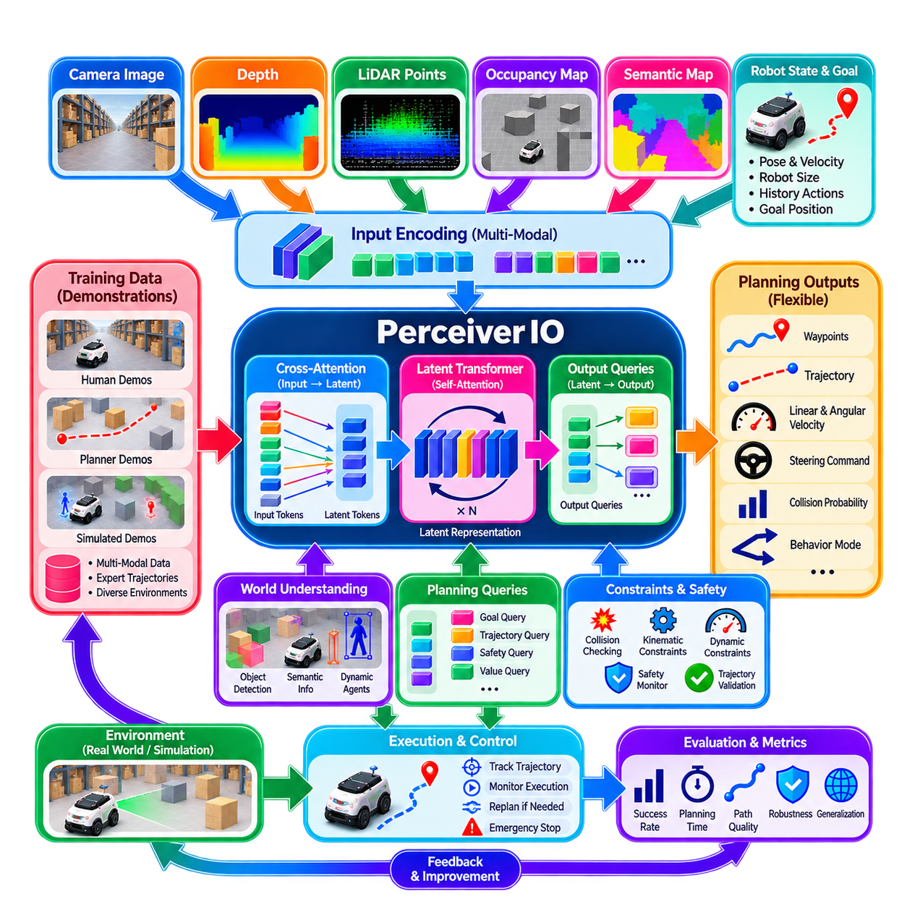{width="7.268055555555556in" height="7.268055555555556in"}

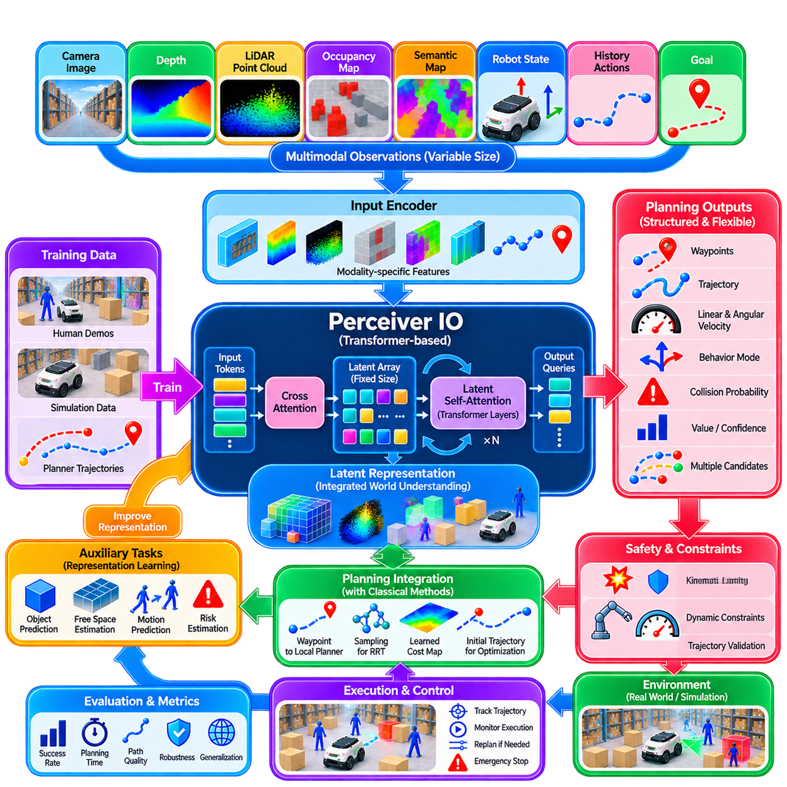{width="7.268055555555556in" height="7.268055555555556in"}

Perceiver IO is a Transformer-based architecture designed to process large, heterogeneous, and multimodal inputs while producing outputs with different structures and meanings. Its central principle is to avoid applying full self-attention directly across every input element. Instead, the system first projects high-dimensional observations into a relatively small latent representation and performs most of the expensive processing in this latent space. This makes the architecture attractive for robot planning, where camera images, LiDAR points, maps, robot states, temporal histories, and semantic information can produce very large and irregular input spaces. :chatgpt-content-reference{index="0"}

The Perceiver IO architecture separates input processing, latent reasoning, and output generation. Raw observations are first converted into feature representations and presented to a fixed-size latent array through cross-attention. The latent variables then interact through Transformer-style self-attention, allowing the model to integrate information across modalities and spatial or temporal regions. Finally, output queries determine what information should be extracted from the latent representation. This separation allows the same core architecture to support different output types without redesigning the entire network for each task.

For robot navigation, the input space can contain RGB images, depth observations, LiDAR point clouds, occupancy grids, semantic maps, localization estimates, velocity, robot dimensions, previous actions, and navigation goals. These sources have very different structures and resolutions, making conventional Transformer tokenization and full attention expensive. Perceiver IO provides a common mechanism for encoding such heterogeneous information into a shared latent representation. The model can therefore reason over visual, geometric, temporal, and state information without requiring every modality to have the same token structure.

The latent bottleneck is one of the most important characteristics of the architecture. Instead of allowing every input token to attend directly to every other input token, a fixed number of latent vectors receives information from the input through cross-attention. The latent vectors then repeatedly exchange information through self-attention. Because the number of latent vectors can remain much smaller than the number of input elements, the computational burden associated with very large inputs can be reduced substantially. This property is particularly useful when a robot must process dense point clouds, high-resolution images, or long observation histories.

Cross-attention provides the mechanism that connects the large input space to the compact latent representation. Each latent vector queries the available observations and extracts information relevant to forming a global internal representation. Positional and modality information can be added so that the model can distinguish spatial locations, sensor types, timestamps, and other structural properties. In a navigation system, this allows the latent representation to encode relationships among obstacles, free space, robot state, goal position, and moving agents rather than treating each observation independently.

Latent self-attention then performs the primary reasoning operation. Once information has been compressed into the latent space, Transformer layers allow different latent elements to exchange information repeatedly. This can represent relationships between distant obstacles, the robot and its destination, previously observed states, and dynamic agents. The model can therefore develop an integrated representation of the current navigation situation. Repeated latent processing also provides a natural location for incorporating temporal context and learned world knowledge without requiring full attention across every raw sensor element.

The output side of Perceiver IO is equally important because planning does not have a single universal output format. An output query can request a particular representation from the shared latent state. Depending on the application, queries can produce a local waypoint, a sequence of poses, linear and angular velocities, a trajectory, a collision probability, a behavior classification, or a planning-related value. The output query therefore determines what information is extracted from the latent representation. This flexible input-output mechanism is one of the defining characteristics of Perceiver IO. :chatgpt-content-reference{index="1"}

For navigation planning, multiple output queries can be used to generate structured trajectory information. One set of queries may correspond to future time steps, with each query predicting the robot state at a particular horizon position. Another set may represent different candidate behaviors or trajectory modes. Additional queries can estimate safety margins, obstacle interaction, or confidence. This allows a single latent world representation to support multiple planning outputs and auxiliary predictions. Such a structure is useful when navigation requires both motion generation and situational assessment.

The architecture is also suitable for multimodal fusion because the latent space acts as a common information domain. Camera features can provide appearance and semantic information, LiDAR can provide accurate geometry, maps can provide larger-scale spatial context, and robot state sensors can provide motion and localization information. Instead of forcing all modalities into identical representations, each modality can be encoded according to its characteristics and then introduced into the shared latent system. The latent representation becomes a learned fusion layer for Physical AI navigation.

Temporal navigation can be implemented by including sequences of observations rather than only the current sensor frame. Previous camera features, LiDAR observations, robot states, actions, and local maps can be represented with temporal position information. The latent Transformer can then integrate information across time. This enables the planner to distinguish a stationary obstacle from a moving pedestrian, recognize that the robot has already initiated a turn, or infer that a previously blocked corridor has become available. Temporal context therefore improves the transition from purely reactive planning toward predictive behavior.

Perceiver IO can also support hierarchical planning by using different output query groups for different decision levels. High-level queries may estimate navigation intent or subgoals, intermediate queries may generate waypoints or behavior selections, and low-level queries may generate short-horizon trajectories or velocity commands. These outputs can be connected to conventional planners and controllers rather than directly controlling the robot. Such a hierarchy reduces the responsibility placed on the learned model and allows different planning frequencies to coexist within a single architecture.

A significant application is planning with variable-size environments. The number of obstacles, detected agents, map elements, or point-cloud features can change continuously during robot operation. A conventional fixed-dimensional network may require preprocessing that limits the number of objects or imposes a rigid representation. Perceiver IO is designed to accept structured inputs with varying sizes while maintaining a fixed latent processing capacity. This makes it conceptually suitable for environments in which the number of relevant entities changes from one planning cycle to another. :chatgpt-content-reference{index="2"}

The architecture can be trained using imitation learning, reinforcement learning, supervised trajectory prediction, or combinations of these methods. Expert demonstrations can teach the model how experienced operators or classical planners generate navigation trajectories. Reinforcement learning can subsequently optimize behavior according to progress, safety, efficiency, energy, and task-completion objectives. Supervised auxiliary tasks can improve the internal representation by predicting object motion, free-space structure, collision risk, or future robot states. These complementary objectives can encourage the latent representation to contain information useful for planning rather than merely reproducing surface-level sensor correlations.

Training data diversity is particularly important because the latent representation is expected to generalize across different environments and sensor conditions. Datasets should include different map structures, obstacle densities, pedestrian behaviors, lighting conditions, sensor noise levels, robot speeds, payloads, and localization uncertainty. Simulation can generate large amounts of multimodal data while real-world datasets can provide physical effects that are difficult to reproduce accurately. The combination of simulation and real-world data can therefore support broader coverage of the navigation state space.

The model can also incorporate semantic information into planning. Semantic labels allow the system to distinguish walls, pedestrians, vehicles, doors, loading areas, restricted zones, charging stations, and other entities with different operational meanings. A Perceiver-based planner can combine these semantic features with geometric and temporal information inside the latent representation. Consequently, planning decisions need not depend only on geometric distance. The model can learn that approaching a charging station, crossing a pedestrian area, passing a doorway, or entering a restricted region requires different behavior.

Safety should remain an independent component even when Perceiver IO provides a powerful planning representation. The latent model can predict a trajectory that appears plausible but violates collision, kinematic, dynamic, or operational constraints. A separate safety layer should therefore perform collision checking, clearance evaluation, velocity and acceleration validation, emergency stopping, and trajectory verification. Unsafe outputs can be rejected, modified, or replaced by a conventional planner. This separation allows the Transformer to provide flexible reasoning while deterministic mechanisms retain authority over critical safety conditions.

Uncertainty estimation is also important because a compact latent representation may encounter situations outside its training distribution. Confidence estimates can be generated alongside trajectory outputs or obtained through multiple candidate predictions and auxiliary uncertainty models. When confidence decreases, the robot can reduce speed, increase safety margins, shorten the planning horizon, request additional sensing, or switch to a fallback planner. The latent architecture should therefore be treated as an adaptive planning component rather than as an unconditional authority over physical motion.

Perceiver IO can be integrated with classical planning in several ways. The model may generate candidate waypoints that are passed to a conventional local planner, predict sampling distributions for an RRT-based planner, provide learned costs for graph search, or generate an initial trajectory for trajectory optimization. It can also estimate future obstacle states and provide them to a model predictive controller. In these configurations, the Transformer performs high-dimensional information integration while established algorithms retain responsibility for explicit geometric reasoning and constraint satisfaction.

Runtime efficiency is a major consideration for deployment. Although the latent bottleneck reduces the dependence of computation on the raw input size, the network still requires multiple Transformer operations and multimodal feature encoding. Efficient sensor preprocessing, latent dimension selection, reduced inference frequency, model quantization, knowledge distillation, GPU acceleration, and hardware-aware architecture design can help achieve real-time operation. The appropriate configuration depends on the robot\'s control frequency, sensor bandwidth, planning horizon, and available edge-computing resources.

For industrial AMRs, a practical architecture can place Perceiver IO between multimodal perception and local motion planning. Sensors and localization provide synchronized observations, encoders convert them into modality-specific features, and Perceiver IO produces a unified latent representation of the current situation. Planning queries then generate waypoints, trajectories, behavior decisions, or risk estimates. A conventional trajectory validator checks the proposed motion, and a controller executes the approved trajectory. New observations continuously enter the system, creating a closed-loop perception, reasoning, planning, and control process.

In a broader Physical AI architecture, Perceiver IO can function as a relational and temporal information-integration layer rather than simply a perception network. It can connect multimodal sensing to world modeling, planning, and policy generation while maintaining a compact internal representation. This makes it compatible with architectures in which perception provides semantic and geometric information, a world model predicts future states, a planner evaluates possible actions, and a policy or controller executes the selected behavior. The latent representation can serve as an interface between these components.

The main significance of Perceiver IO for robot planning is therefore its ability to handle large and heterogeneous inputs while supporting flexible structured outputs through a shared latent representation. Its latent bottleneck addresses one of the scaling challenges of attention-based models, while output queries allow the same architecture to support different planning tasks and representations. The architecture does not by itself solve navigation, guarantee physical feasibility, or replace classical planning. Its practical value emerges when it is integrated with multimodal perception, temporal world modeling, trajectory generation, explicit constraints, safety verification, and real-time control, forming a scalable Transformer-based planning layer for Physical AI robots.

## 09.07. LLM Based Task and Motion Planning TAMP [w/Code]

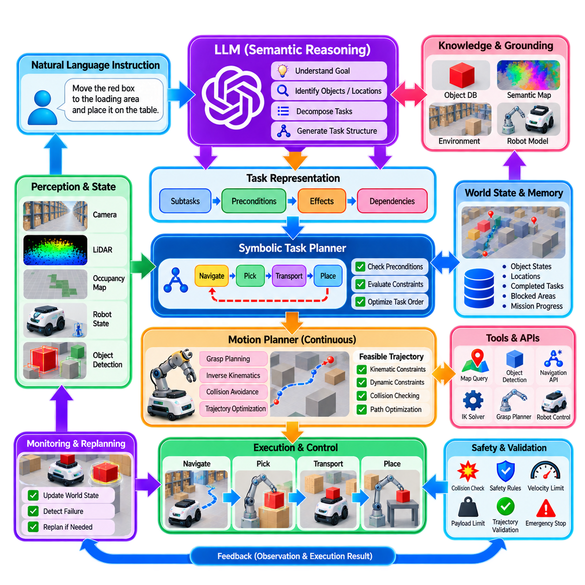{width="7.268055555555556in" height="7.268055555555556in"}

Large Language Model based Task and Motion Planning (LLM-based TAMP) connects high-level language reasoning with symbolic task planning and physically executable robot motion. Traditional TAMP separates discrete decisions, such as what object to manipulate and which task should be performed first, from continuous decisions, such as where the robot should move and how its arm should be positioned. An LLM can provide a semantic reasoning layer that interprets goals, decomposes missions, identifies relevant objects and constraints, and proposes task structures that can subsequently be verified by formal planners.

The central concept is to represent a robotic mission at multiple abstraction levels. A natural-language instruction may describe a goal such as retrieving an object, transporting it to another location, and placing it at a specified destination. The LLM converts this instruction into structured subtasks, preconditions, expected effects, and dependencies. A task planner then determines a valid symbolic sequence, while a motion planner calculates collision-free robot configurations for each action. The overall system therefore connects language understanding, symbolic reasoning, geometric planning, and physical execution.

Classical TAMP commonly operates over a symbolic state containing objects, locations, robot capabilities, task predicates, and environmental relationships. Actions have preconditions describing when they are applicable and effects describing how the world changes after execution. Motion planning supplies continuous feasibility information, such as whether a robot can reach an object, grasp it, navigate to a destination, or place it safely. LLMs can assist in constructing or interpreting these symbolic structures, but the resulting plans should remain grounded in explicit world states and executable constraints.

An LLM is particularly useful for task decomposition because natural-language instructions often contain implicit relationships that are difficult to encode through rigid command templates. The model can interpret references to objects, locations, priorities, temporal relationships, and operational intent. It may transform a high-level request into actions such as navigate, identify, approach, grasp, transport, place, verify, and return. However, language reasoning alone does not establish that these actions are physically possible. Every generated task should therefore pass through symbolic validation and motion-level feasibility checking.

Grounding is one of the most important challenges in LLM-based TAMP. Language concepts must be connected to actual objects, coordinates, robot capabilities, maps, sensors, and available tools. An instruction such as "move the box beside the loading area" requires the system to identify which box is intended, determine what "beside" means operationally, locate the loading area, and calculate a physically executable placement position. Perception, semantic mapping, knowledge graphs, and geometric representations therefore provide the grounding layer between the LLM\'s abstract reasoning and the physical environment.

The task planner provides a critical verification boundary between language reasoning and robot execution. The LLM may propose several possible action sequences, but a symbolic planner can evaluate preconditions, dependencies, resource constraints, and state transitions. If an action is impossible because an object is unavailable, a required tool is occupied, or a prerequisite has not been completed, the planner can reject or modify the proposed sequence. This prevents fluent language generation from being mistaken for a valid operational plan.

Motion planning provides the continuous component of TAMP. Once the task planner specifies an action such as grasping, carrying, docking, or placing an object, the motion planner must determine how the robot can physically perform it. Navigation planners calculate collision-free paths, while manipulation planners consider inverse kinematics, joint limits, grasp configurations, collision avoidance, and trajectory constraints. The LLM therefore operates above these mechanisms, selecting and organizing actions while specialized planners determine whether and how each action can be executed.

Closed-loop execution is essential because the real world rarely behaves exactly as predicted. A grasp may fail, an obstacle may appear, a door may be closed, a target may have moved, or the robot may experience localization uncertainty. After each significant action, the system should update its world state using perception and execution feedback. The LLM or task planner can then revise the remaining plan. This transforms TAMP from a one-time plan-generation process into an iterative cycle of reasoning, planning, execution, observation, and replanning.

Tool use provides another important mechanism for LLM-based TAMP. Instead of directly producing low-level robot commands, the LLM can invoke specialized tools such as map queries, object detection, navigation planners, inverse-kinematics solvers, collision checkers, grasp planners, database services, or robot APIs. The LLM determines which capability is required and how the resulting information should influence the task plan. This tool-oriented structure keeps the language model focused on reasoning and orchestration while deterministic software performs calculations requiring precise geometric or physical guarantees.

Memory and world-state representation become increasingly important for long-duration missions. The system may need to remember which objects have already been transported, which locations have been inspected, which routes are blocked, and which tasks remain incomplete. A structured world model or knowledge graph can maintain these facts independently of the LLM\'s conversational context. The LLM can query this representation when making decisions, while execution results update the shared state. This separation improves consistency and reduces the risk of treating generated language as the authoritative source of physical truth.

Safety requires an independent enforcement layer because an LLM does not inherently guarantee physically safe behavior. Generated task sequences must be checked against operational policies, restricted areas, robot capabilities, collision constraints, speed limits, payload limits, and emergency conditions. Navigation and manipulation trajectories should undergo deterministic validation before execution. If a proposed action violates a safety rule, the execution layer should reject or modify it regardless of the LLM\'s reasoning. This establishes a hierarchy in which language reasoning proposes actions but safety mechanisms retain final authority over physical execution.

LLM-based TAMP can also incorporate learned perception, world models, reinforcement learning, and diffusion-based motion generation. The LLM can determine the task structure, a world model can predict environmental changes, a learned policy can provide candidate behaviors, and a diffusion model can generate locally appropriate trajectories. Classical planners can then verify collision and kinematic feasibility. These components are complementary because they operate at different abstraction levels. The LLM provides semantic reasoning and orchestration, while specialized models provide prediction, motion generation, and physical execution capabilities.

For industrial AMRs and mobile manipulators, a practical architecture can place LLM-based TAMP above the existing navigation and robot-control stack. The LLM interprets mission objectives and decomposes them into executable tasks. A symbolic task layer manages dependencies and resources, while navigation and motion planners generate physically valid trajectories. Fleet systems coordinate multiple robots, charging systems, elevators, doors, and shared workspaces. Execution feedback continuously updates the mission state, allowing the task planner to reschedule or recover when operational conditions change.

The long-term value of LLM-based TAMP lies in connecting semantic intelligence with physically grounded autonomy. Language models can make robotic systems more capable of understanding open-ended objectives, adapting task sequences, using diverse software tools, and reasoning about relationships among objects and activities. However, effective deployment depends on grounding, verification, deterministic motion planning, safety supervision, and continuous feedback. LLM-based TAMP is therefore best understood not as replacing conventional planning, but as an intelligence and orchestration layer that connects human-level task descriptions with symbolic planning, geometric reasoning, learned behavior, and reliable physical robot execution.

## 09.08. Generalist Navigation Policy for Multiple Robots [w/Code]

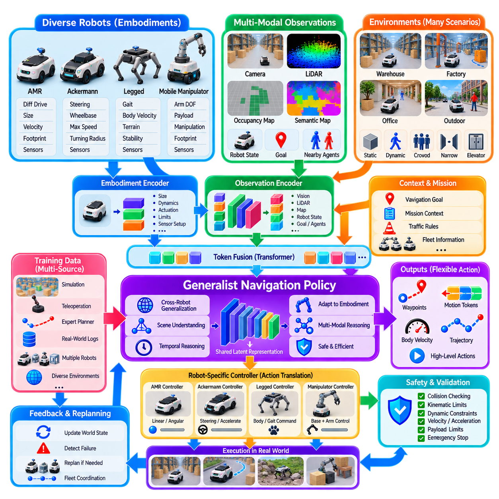{width="7.268055555555556in" height="7.268055555555556in"}

A generalist navigation policy for multiple robots aims to learn a shared decision-making capability that can operate across different robot platforms, environments, sensor configurations, and navigation tasks. Instead of training a separate policy for every AMR, wheeled robot, legged robot, or mobile manipulator, the system learns reusable navigation knowledge from diverse experience. Platform-specific information is provided as context so that one policy can adapt its decisions to the physical capabilities and constraints of each robot.

The central challenge is that different robots do not share identical state and action spaces. A differential-drive AMR may use linear and angular velocity, an Ackermann platform may require steering and acceleration commands, and a legged robot may navigate through body velocity or foothold-related interfaces. A generalist policy therefore requires an abstraction layer that separates common navigation intent from platform-specific actuation. The learned model can generate waypoints, motion tokens, normalized commands, or short-horizon trajectories that are translated into executable commands by each robot controller.

Observation diversity creates a similar problem. One robot may use 3D LiDAR and cameras, another may rely on 2D LiDAR and depth sensors, while a third may combine vision, proprioception, terrain sensing, and semantic maps. Modality-specific encoders can transform these heterogeneous observations into a shared latent representation. The policy then reasons over common concepts such as free space, obstacle motion, traversability, goal direction, localization confidence, and nearby agents rather than depending directly on one fixed sensor configuration.

Robot embodiment must be represented explicitly because identical environmental observations can require different actions from different machines. Useful embodiment information includes robot dimensions, footprint, wheelbase, turning radius, maximum velocity, acceleration and braking limits, payload, sensor coverage, locomotion type, and terrain capability. Encoding these characteristics as embodiment tokens or conditioning vectors allows the policy to adapt its behavior. A narrow AMR and a large towing robot may therefore select different clearances and turning strategies even when given the same destination.

Training a generalist policy requires experience covering many embodiments and operating conditions. Data can be collected from simulation, classical planners, teleoperation, deployed robot fleets, and previously trained specialist policies. Navigation episodes should include successful routes, difficult interactions, recovery situations, dynamic obstacles, localization uncertainty, and platform-specific limitations. By learning from this mixture, the policy can identify navigation patterns that are transferable across robots while retaining information about conditions under which different behaviors are appropriate.

Simulation is especially important because it allows large-scale variation of robot morphology and environment parameters. Wheelbase, footprint, sensor placement, acceleration, steering limits, latency, terrain interaction, obstacle density, and pedestrian behavior can be randomized across training episodes. The policy is consequently exposed to a family of robots rather than one fixed machine. This form of embodiment randomization can improve transfer to new platforms, although physical validation remains necessary because simulated dynamics cannot reproduce every real-world effect.

A Transformer-based architecture is well suited to generalist navigation because it can represent heterogeneous information as tokens and reason across variable input structures. Sensor observations, map features, goal information, robot embodiment, previous actions, mission context, and nearby agents can be encoded as different token groups. Attention mechanisms then identify relationships among these elements. The same model can therefore process different combinations of available information while maintaining a shared representation of the navigation problem.

Temporal context is essential because navigation decisions depend on how the environment and robot state evolve. A generalist policy can process sequences of observations, actions, and states to recognize approaching pedestrians, persistent obstacles, wheel slip, delayed steering response, or changes in localization quality. Temporal models can also infer aspects of robot dynamics from recent behavior. This allows the policy to adjust future decisions when a platform responds differently from what static embodiment parameters alone would predict.

The output representation strongly influences transfer across robots. Directly predicting actuator commands makes the policy tightly coupled to a particular drivetrain. More transferable alternatives include relative waypoints, local poses, desired body velocities, trajectory segments, or abstract motion tokens. A platform-specific controller can convert these outputs into wheel velocities, steering angles, joint commands, or locomotion targets. This hierarchical separation allows shared intelligence to operate above deterministic embodiment-specific control.

Motion tokens provide another approach to common action representation. Instead of expressing every action directly in actuator coordinates, navigation behavior can be represented through reusable concepts such as advance, turn, yield, stop, pass, approach, dock, recover, or follow a local trajectory primitive. Tokens can also encode continuous parameters such as direction, distance, curvature, speed, or duration. A decoder associated with each embodiment converts the selected representation into physically meaningful motion, providing an interface between general navigation intelligence and heterogeneous robots.

Multi-robot generalization should be distinguished from multi-robot coordination. A generalist policy means that the same learned policy can operate on multiple robot types, whereas coordination concerns how several robots interact while operating simultaneously. The two concepts can nevertheless be combined. Each robot may execute the same generalist navigation model while receiving information about neighboring robots, assigned priorities, reserved paths, traffic rules, and fleet objectives. The policy can then adapt local behavior while a fleet-management layer maintains global coordination.

Shared environments introduce interaction constraints that cannot be solved solely through individual obstacle avoidance. Robots may encounter intersections, narrow aisles, elevators, docking stations, charging areas, and shared loading zones. The policy can learn local behaviors such as yielding, maintaining formation, negotiating passage, or waiting for a reserved resource. However, global resource allocation and deadlock prevention should remain coordinated through explicit fleet mechanisms when deterministic guarantees are required.

A generalist policy can be trained through imitation learning, reinforcement learning, offline reinforcement learning, or combinations of these methods. Imitation learning transfers behavior from experts and established planners, while reinforcement learning can optimize efficiency, safety, progress, comfort, and energy consumption. Offline learning can exploit large fleet logs without requiring unrestricted exploration on physical robots. Specialist policies can also act as teachers, allowing knowledge from individually optimized robots to be distilled into a shared generalist model.

Generalization to an unseen robot is a more demanding objective than operating several robots encountered during training. Zero-shot transfer requires the model to infer useful behavior from embodiment descriptions and available observations without platform-specific retraining. Few-shot adaptation allows a small amount of new experience to calibrate the policy to the robot. Adapter modules, embodiment embeddings, parameter-efficient fine-tuning, and online system identification can improve adaptation while preserving the shared knowledge contained in the generalist model.

World models can further improve cross-platform navigation by separating environmental prediction from embodiment-specific action execution. A shared world model can represent obstacles, agents, terrain, semantic regions, and likely future changes independently of the exact robot. The navigation policy then evaluates possible behaviors using both this common environmental representation and the current embodiment context. This separation can improve knowledge reuse because understanding that a corridor is blocked is transferable even when different robots require different maneuvers in response.

Uncertainty estimation is essential when the policy encounters unfamiliar embodiments or operating conditions. A robot with unusual dimensions, degraded sensors, unexpected dynamics, or a new terrain type may lie outside the training distribution. The system should detect reduced confidence and respond conservatively by lowering speed, increasing clearance, shortening the planning horizon, invoking a classical planner, or requesting human supervision. Generalization should therefore include mechanisms for recognizing when generalization itself is unreliable.

Safety must remain independent of the shared learned policy. Each platform should enforce its own velocity, acceleration, braking, stability, collision, payload, and actuator limits through deterministic mechanisms. A generalist policy may propose a waypoint or trajectory, but a platform-specific safety layer should verify that it can be executed under the current robot state. This prevents knowledge transfer from accidentally transferring unsafe assumptions between embodiments with substantially different physical capabilities.

Evaluation must test both navigation quality and breadth of transfer. Performance should be measured across known and unseen robots, environments, sensor combinations, obstacle patterns, payload conditions, and dynamic interactions. Success rate, collision rate, path efficiency, completion time, intervention frequency, energy consumption, comfort, and recovery performance provide complementary indicators. Evaluation should also compare the generalist policy with specialist policies to determine how much platform-specific performance is sacrificed in exchange for broader capability.

For an industrial fleet, deployment can follow a shared-model and local-adaptation architecture. A common navigation foundation policy contains transferable knowledge, while each robot carries embodiment parameters, sensor adapters, platform-specific controllers, and safety constraints. Fleet experience can be collected centrally, filtered, replayed in simulation, and incorporated into subsequent policy training. Updated models can then be validated by robot class before deployment, allowing experience from one part of the fleet to improve navigation capabilities elsewhere without bypassing platform-specific verification.

In a broader Physical AI architecture, the generalist navigation policy can serve as a shared action-intelligence layer connecting multimodal perception, world models, fleet intelligence, and robot-specific control. Common representations capture environmental and relational knowledge, while embodiment conditioning preserves the differences that matter physically. Experience from AMRs, mobile manipulators, legged robots, and other platforms can contribute to a progressively richer navigation model without requiring their mechanical characteristics to be treated as identical.

The long-term significance of generalist navigation is therefore not the creation of one universal controller that directly operates every robot. A more practical objective is a shared navigation intelligence that understands common spatial and behavioral principles while remaining explicitly conditioned on embodiment, sensors, mission context, and safety constraints. Combined with heterogeneous training data, common motion representations, world models, fleet experience, local adaptation, deterministic controllers, and independent safety validation, such policies can provide a scalable foundation for navigation knowledge transfer across diverse Physical AI robots.

## 09.09. AI Planning Safety Monitoring and Override

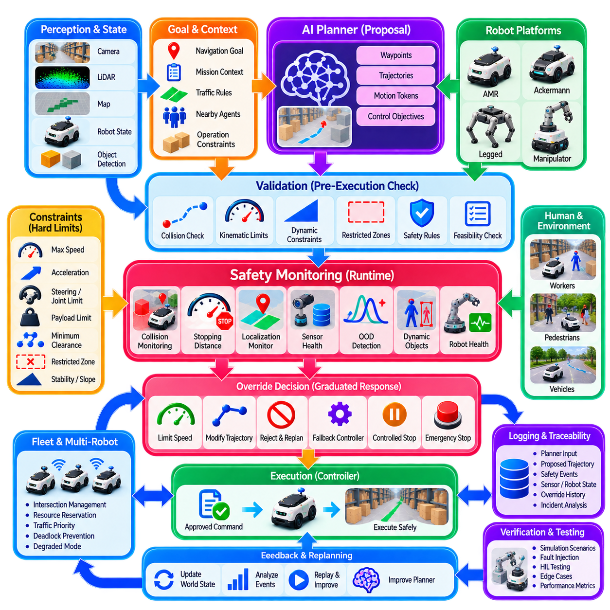{width="7.268055555555556in" height="7.268055555555556in"}

AI-based planning can improve robot adaptability in complex environments, but learned planners may produce uncertain or unsafe actions when observations differ from training conditions. AI planning safety therefore requires an independent monitoring and override architecture that evaluates proposed actions before and during execution. The fundamental principle is that an AI planner may recommend motion, while a separate safety system retains authority to restrict, modify, reject, or terminate that motion whenever predefined safety conditions are violated.

Safety monitoring should operate independently from the internal confidence of the learned planner. A neural policy may generate a trajectory with high confidence even when the environment contains an unfamiliar obstacle or sensor failure. Independent monitors evaluate measurable physical conditions such as obstacle clearance, velocity, acceleration, stopping distance, localization quality, actuator status, and communication health. This separation reduces the possibility that a single model failure simultaneously affects both planning and safety judgment.

The planning architecture can therefore be divided into proposal, validation, execution, and supervision stages. The AI planner generates candidate waypoints, trajectories, motion tokens, or control objectives. A validation layer evaluates these candidates against geometric, kinematic, dynamic, and operational constraints. Only approved commands are passed to the controller. During execution, runtime monitors continuously observe the robot and environment, allowing previously valid motion to be interrupted if conditions change unexpectedly.

Collision monitoring is one of the most important safety functions. A planned trajectory should be checked against static obstacles, dynamic objects, restricted regions, and the robot\'s physical footprint. Safety margins can be expanded according to speed, localization uncertainty, payload, surface conditions, and sensor confidence. Dynamic collision prediction can estimate whether the robot and another moving agent may occupy conflicting regions in the future. This allows intervention before a collision becomes unavoidable.

Stopping capability must be incorporated directly into safety evaluation. Obstacle distance alone is insufficient because a robot traveling quickly may require substantial braking distance. The monitor should consider current velocity, maximum deceleration, controller latency, actuator response, payload, traction, and environmental conditions. A dynamic safety envelope can expand as speed increases and contract when the robot moves slowly. Commands that cannot maintain adequate stopping distance should be reduced or rejected before execution.

Localization integrity is another critical input because a geometrically valid trajectory becomes unsafe if the robot does not know its position accurately. Safety monitoring can observe localization covariance, map consistency, GNSS or SLAM quality, sensor agreement, and sudden pose discontinuities. When localization confidence decreases, the system can reduce velocity, enlarge obstacle margins, request relocalization, switch localization sources, or stop. Planning authority should therefore depend not only on trajectory quality but also on confidence in the state used to generate that trajectory.

Sensor health monitoring provides protection against degraded perception. Cameras may become obscured, LiDAR returns may deteriorate, timestamps may become inconsistent, or communication links may experience delays. The system can evaluate sensor freshness, frame rate, synchronization, coverage, diagnostic status, and agreement among redundant sensors. A degraded sensor does not always require an immediate stop, but the robot should transition to an operating mode whose speed and autonomy level remain appropriate for the available perception capability.

Out-of-distribution detection is particularly important for AI planners. Learned models may encounter environments, objects, weather conditions, sensor patterns, or robot dynamics that differ substantially from their training data. Uncertainty estimators, embedding-distance measures, ensemble disagreement, novelty detectors, or confidence models can identify such conditions. When unfamiliarity becomes significant, the system should reduce reliance on the learned planner and transition toward conservative behavior, verified classical planning, remote supervision, or a safe stop.

Safety constraints can be represented as hard limits that the AI planner is never allowed to override. These may include maximum velocity, acceleration, steering angle, joint range, payload, slope, stability, restricted-zone, and minimum-clearance constraints. Soft objectives such as comfort or path efficiency may be optimized by the AI planner, but hard constraints remain enforced externally. This distinction prevents optimization pressure from trading away requirements that are essential for physical safety.

Runtime assurance provides a useful architectural pattern for combining advanced AI planning with verified fallback behavior. Under normal conditions, a high-performance learned planner controls navigation while an assurance monitor evaluates its proposed and executed behavior. If safety conditions approach a defined boundary, control can be transferred to a simpler safety controller whose behavior is easier to analyze. The fallback controller may decelerate, stop, maintain a safe corridor, or follow a previously verified trajectory until normal operation can be restored.

Override behavior should be graduated rather than limited to emergency stopping. The first intervention may constrain speed or modify a waypoint. A stronger intervention may reject the proposed trajectory and request replanning. If the planner repeatedly fails, the system can switch to a classical planner or restricted autonomy mode. More severe conditions may trigger a controlled stop, followed by an emergency stop when immediate danger exists. This hierarchy avoids unnecessary mission interruption while preserving clear escalation toward safer states.

Trajectory modification can sometimes provide better continuity than complete rejection. A safety filter may project an unsafe command into a safe action set, adjust velocity, increase clearance, limit curvature, or truncate the planning horizon. Techniques based on control barrier functions, model predictive safety filters, constrained optimization, or reachable-set analysis can provide structured mechanisms for modifying commands. The AI planner remains responsible for performance, while the safety filter enforces the admissible region of physical behavior.

Temporal monitoring is necessary because many hazards develop over time rather than appearing in a single observation. A pedestrian may gradually move into the robot\'s path, actuator temperature may increase, localization drift may accumulate, or communication latency may deteriorate. Safety monitors should therefore evaluate trends and persistence as well as instantaneous thresholds. Predictive monitoring can intervene before the system reaches a critical condition, improving both safety and the smoothness of recovery behavior.

Multi-robot systems introduce additional safety requirements because individually safe trajectories can conflict when robots share space and resources. Fleet-level monitoring can supervise intersection reservations, narrow passages, elevators, docking stations, charging areas, and traffic priorities. Local safety remains responsible for immediate collision avoidance, while fleet coordination prevents systematic conflicts and deadlocks. If communication with the fleet manager is lost, each robot should transition to a predefined degraded mode rather than assuming that shared resources remain available.

Human-aware monitoring requires more conservative behavior when robots operate near workers, patients, visitors, or passengers. Safety zones can depend on human distance, relative velocity, visibility, direction of motion, and uncertainty in human tracking. The robot may reduce speed when approaching blind corners, increase clearance around groups, or stop when human intent cannot be estimated reliably. Learned social navigation behavior can improve interaction quality, but deterministic safety limits should remain independent from learned predictions of human behavior.

Logging and traceability are essential for improving AI planning safety after deployment. The system should record planner inputs, proposed trajectories, safety-monitor decisions, override events, sensor health, uncertainty estimates, controller responses, and relevant world-state information. These records allow engineers to reconstruct incidents and near misses. Difficult cases can be replayed in simulation, incorporated into regression tests, and added to future training datasets, creating a feedback loop between field experience and safety improvement.

Verification should include both nominal performance and intentionally difficult failure conditions. Testing can inject sensor dropout, localization errors, delayed messages, unexpected obstacles, actuator limitations, map inconsistencies, unusual robot dynamics, and adversarial combinations of otherwise manageable disturbances. Simulation enables large-scale scenario testing, while hardware-in-the-loop and controlled physical tests expose implementation effects. Safety validation should focus especially on transitions between normal operation, degraded modes, fallback control, and stopping states.

For industrial AMRs, the practical architecture should place the AI planner inside rather than above the safety envelope. Perception, localization, and world modeling provide the information required for planning, and the AI module proposes local motion. Independent validation checks the proposal before the robot controller receives it. Runtime monitors then supervise execution, while a deterministic safety controller retains access to speed limiting and stopping mechanisms. This structure prevents the learned planner from becoming the final authority over physical motion.

In a broader Physical AI architecture, safety monitoring can operate across edge, fleet, and system levels. The robot edge provides the fastest collision, motion, sensor, and actuator supervision. Fleet intelligence monitors interactions among robots and shared infrastructure. Higher-level systems analyze operational trends, policy violations, repeated overrides, and emerging failure patterns. These layers should complement rather than replace one another because immediate physical safety requires local response even when network connectivity or centralized intelligence is unavailable.

The objective of AI planning safety is therefore not to prove that a learned planner will never make an incorrect decision. A more practical engineering objective is to ensure that incorrect or uncertain decisions cannot directly become uncontrolled physical actions. Independent monitoring, explicit constraints, uncertainty detection, trajectory validation, graduated override, verified fallback control, local emergency mechanisms, and continuous feedback provide multiple barriers between AI planning errors and hazardous outcomes. This layered architecture allows learning-based planning to contribute adaptability and performance while preserving deterministic authority over critical physical safety.

## 09.10. AI Navigation Policy Production Deployment Case

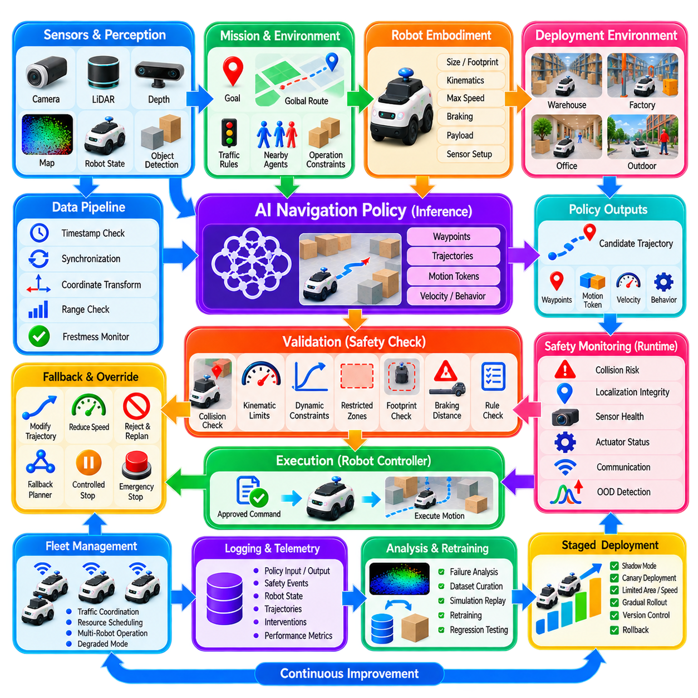{width="7.268055555555556in" height="7.268055555555556in"}

Production deployment of an AI navigation policy is fundamentally different from demonstrating a learned planner in simulation or a controlled laboratory. A production robot must operate continuously across changing layouts, traffic conditions, sensor degradation, network interruptions, and unexpected human behavior. The deployment architecture must therefore treat the AI policy as one component within a larger navigation system that includes deterministic safety, localization, perception, conventional planning, monitoring, fleet management, and operational recovery.

A practical deployment begins by defining the exact responsibility of the learned policy. The policy may generate local waypoints, short-horizon trajectories, motion tokens, velocity objectives, or behavior selections, while global routing and mission scheduling remain outside the model. Restricting the policy to a clearly defined operational boundary makes verification easier and prevents a single neural network from simultaneously controlling localization, routing, traffic coordination, collision avoidance, and emergency behavior.

The production input pipeline must transform heterogeneous sensor and system information into stable policy observations. Camera, LiDAR, depth, localization, map, robot state, goal, traffic information, and recent motion history may all contribute to the policy state. Every input requires timestamp validation, coordinate transformation, synchronization, range checking, and freshness monitoring. Missing or delayed information should be explicitly detected rather than silently converted into apparently valid neural-network input.

The deployed model should also receive embodiment information describing the robot on which it is operating. Footprint, wheelbase, steering characteristics, maximum speed, braking capability, payload condition, sensor configuration, and motion limits can influence navigation behavior. This is particularly important when a shared policy is deployed across several AMR variants. Embodiment conditioning allows common navigation intelligence to be reused while platform-specific controllers and safety mechanisms preserve the physical differences among robots.

The AI policy typically runs as a local planning component inside a receding-horizon control loop. At each planning cycle, synchronized observations and the current navigation objective are processed to generate a candidate motion over the next short interval. Only an initial portion of the approved trajectory is executed before the environment is observed again. Continuous replanning prevents the robot from committing blindly to a long prediction and allows rapid adaptation when obstacles, people, or traffic conditions change.

Production inference requires deterministic timing behavior even when the underlying neural computation is complex. Average inference latency alone is insufficient because occasional long delays can destabilize the navigation loop. Deployment should therefore measure median, high-percentile, and worst-observed latency together with preprocessing and postprocessing time. GPU utilization, memory consumption, thermal behavior, and competing workloads must also be monitored so that the navigation policy remains within a defined real-time execution budget.

Model optimization can reduce the computational burden of production inference. Quantization, pruning, knowledge distillation, reduced input resolution, efficient attention mechanisms, optimized runtime engines, and hardware acceleration may be applied depending on the model architecture. Optimization must be validated against navigation behavior rather than benchmark speed alone. A faster model is not useful if numerical changes significantly alter obstacle clearance, trajectory smoothness, uncertainty estimation, or behavior near safety boundaries.

Every policy output should pass through an independent trajectory validation layer before reaching the motion controller. The validator checks collision clearance, robot footprint, velocity, acceleration, curvature, steering limits, braking distance, restricted zones, and other platform-specific constraints. A trajectory that violates hard requirements is rejected or modified regardless of the neural policy\'s confidence. The AI model therefore proposes motion, while deterministic software retains authority over whether that motion is physically admissible.

Runtime safety monitoring continues after a trajectory has been approved. New obstacles may appear, localization may degrade, sensors may fail, or another robot may enter the planned path. Independent monitors continuously evaluate stopping distance, collision risk, localization integrity, sensor health, actuator status, and communication quality. If risk increases, the system can constrain speed, request replanning, transfer control to a fallback planner, perform a controlled stop, or activate an emergency response.

A production system should maintain at least one navigation path that does not depend entirely on the learned policy. A conventional local planner or verified fallback controller can provide degraded operation when AI inference fails, uncertainty becomes excessive, hardware acceleration becomes unavailable, or observations fall outside the supported operating domain. The fallback does not need to reproduce the full performance of the AI policy. Its purpose is to maintain predictable behavior and reach a safe operational state.

Operational design domain definition is critical for deciding where the AI policy may be used. The supported domain can specify environment type, map quality, allowable speeds, obstacle density, lighting, sensor availability, floor conditions, localization quality, and expected human interaction. When runtime conditions move outside this domain, the system should not assume that learned generalization will succeed. It should reduce autonomy, switch planning modes, request supervision, or stop according to predefined operational rules.

Before deployment, the policy should pass through a staged validation pipeline. Offline dataset evaluation can first identify obvious prediction failures. Large-scale simulation can then expose the policy to diverse maps, dynamic agents, sensor noise, and rare scenarios. Hardware-in-the-loop testing verifies timing and software integration, while controlled robot testing evaluates real dynamics. Shadow mode can subsequently run the AI policy on production robots without giving it control, allowing its proposed actions to be compared with the active navigation system.

A gradual rollout reduces the consequences of unknown failure modes. Initial deployment may begin with a small number of robots, limited areas, reduced speed, or selected operating periods. Performance can then be compared against established navigation baselines before expanding the deployment. Canary deployment strategies allow a new policy version to operate on a small fleet subset while the previous version remains available. If safety or performance metrics deteriorate, the new model can be rolled back without updating the entire fleet.

Version control must include more than the neural-network weight file. A production navigation release should identify the model version, training dataset version, preprocessing configuration, sensor calibration assumptions, inference runtime, robot software version, safety parameters, and compatible hardware classes. Without this information, reproducing a field failure becomes difficult. Model artifacts should therefore be managed as part of a complete navigation software release rather than as isolated machine-learning files.

Fleet deployment requires compatibility management because robots may differ in hardware, firmware, sensor configuration, or compute capacity. A deployment service should determine which policy version is approved for each robot class and prevent incompatible combinations. Updates can be staged according to robot group, site, or operating condition. Robots should verify model integrity before activation and retain a validated previous version so that rollback remains possible when a newly deployed policy behaves unexpectedly.

Production telemetry provides the evidence required to determine whether the AI policy is actually improving navigation. Useful measurements include mission success, intervention frequency, collision and near-miss events, path efficiency, travel time, replanning frequency, emergency stops, minimum clearance, inference latency, fallback activation, localization quality, and energy consumption. Metrics should be evaluated by environment and robot class because fleet-wide averages can conceal localized failure patterns.

Logging should capture enough context to reconstruct important decisions without requiring continuous storage of every raw sensor stream. Triggered logging can preserve richer information around safety interventions, unusual uncertainty, repeated replanning, collisions, near misses, localization failures, or operator takeover. Relevant policy inputs, outputs, trajectories, safety decisions, robot state, and world-state information can then be replayed. These records provide valuable material for debugging, regression testing, and future training.

Field failures should feed a structured improvement loop rather than being treated as isolated incidents. Difficult episodes can be classified according to perception error, localization failure, policy error, unsafe trajectory generation, controller mismatch, unexpected human interaction, or operational configuration. Reproducible cases can be converted into simulation scenarios and regression tests. Selected data can also be added to future training sets, allowing production experience to systematically improve later policy versions.

Data collected from deployed robots requires quality control before it becomes training material. Successful operation produces enormous amounts of repetitive data, while rare failures are disproportionately valuable. Automated filtering can identify unusual trajectories, high uncertainty, interventions, recovery actions, and difficult interactions. Human review can then validate selected episodes. This creates a targeted data engine in which the fleet continuously discovers situations that expose weaknesses in the current navigation policy.

Retraining should not automatically lead to deployment. Every new policy must be compared with the currently approved model across a fixed regression suite and newly discovered difficult cases. Improvements in average efficiency should not compensate for unacceptable degradation in safety-critical scenarios. Promotion criteria can therefore combine success rate, collision metrics, clearance, intervention frequency, latency, and scenario-specific requirements. Only versions satisfying the defined acceptance gates proceed toward staged production rollout.

Cybersecurity and model integrity also become production concerns. Navigation models, configuration files, maps, and update packages should be authenticated before installation. Access to deployment services should be controlled, and unauthorized modification of model or safety parameters should be detectable. Communication failures must not disable local safety functions. The robot should retain sufficient onboard capability to stop safely or continue in a restricted mode even when cloud or fleet connectivity is unavailable.

For an industrial AMR fleet, the resulting architecture forms a closed operational lifecycle. Multimodal perception and localization provide synchronized state information, the AI policy generates local navigation proposals, deterministic validation approves admissible motion, and the controller executes it under continuous safety supervision. Fleet systems provide traffic and mission context, while telemetry and event logs return operational evidence to evaluation, simulation, dataset curation, retraining, and release management.

Within a broader Physical AI architecture, production deployment transforms an AI navigation policy from an experimental model into a governed physical capability. Perception, world modeling, learned planning, deterministic safety, robot control, fleet intelligence, data infrastructure, and lifecycle management must operate as one system. The policy contributes adaptive navigation intelligence, but operational authority is distributed across validation, runtime assurance, platform constraints, fleet rules, and recovery mechanisms.

The success of production AI navigation should therefore not be measured by whether a neural policy can replace every conventional navigation component. A more robust objective is to deploy learned intelligence where it provides measurable advantages while surrounding it with explicit interfaces, deterministic safety boundaries, fallback behavior, observability, version control, staged rollout, and continuous validation. This architecture enables AI navigation policies to evolve from laboratory demonstrations into maintainable, scalable, and operationally trustworthy capabilities for real Physical AI robot fleets.
