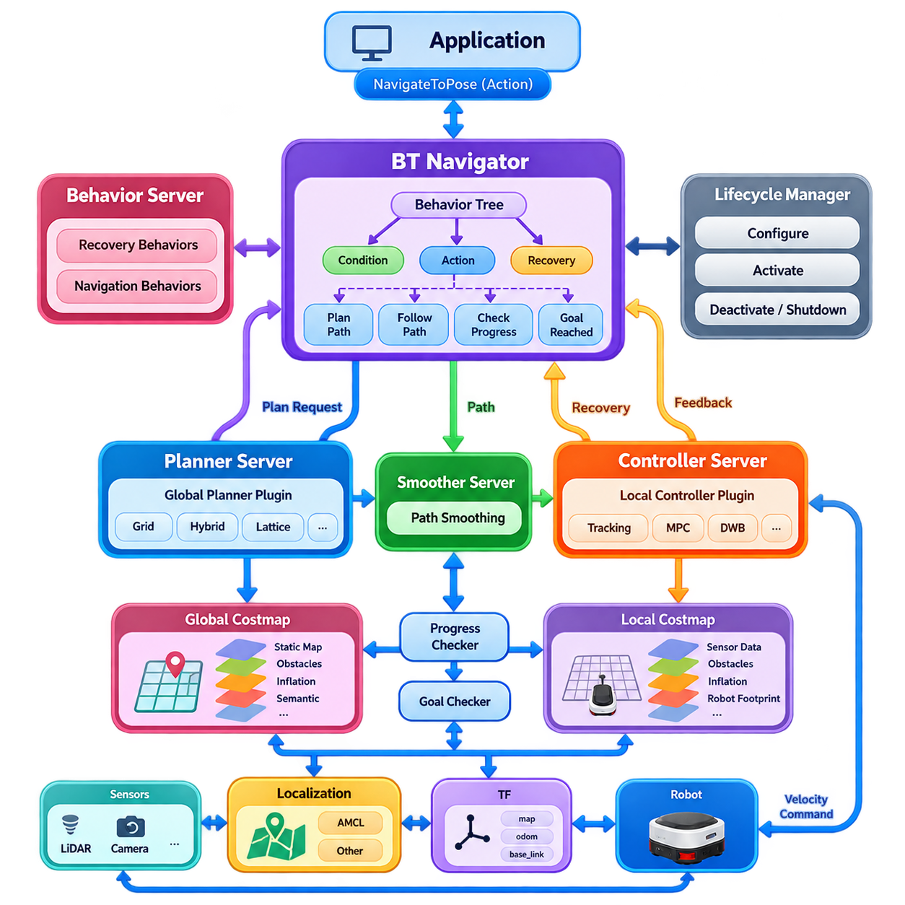
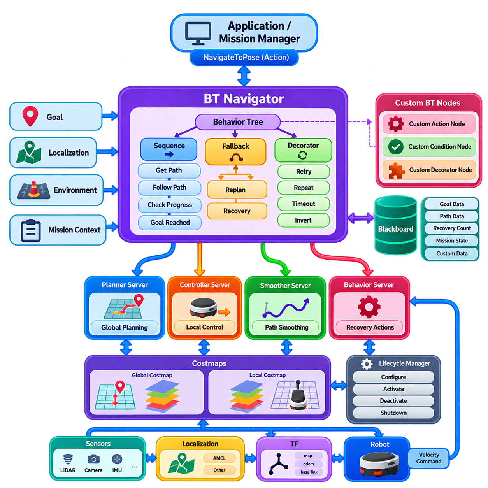
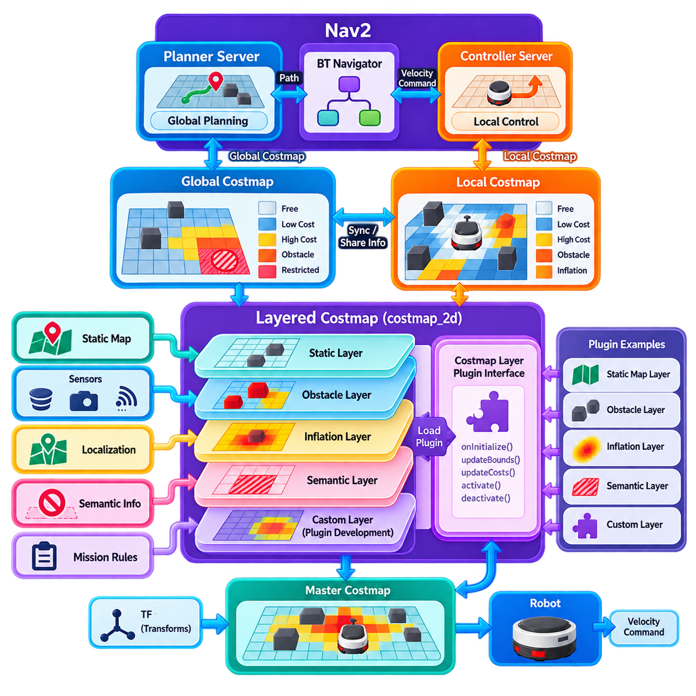
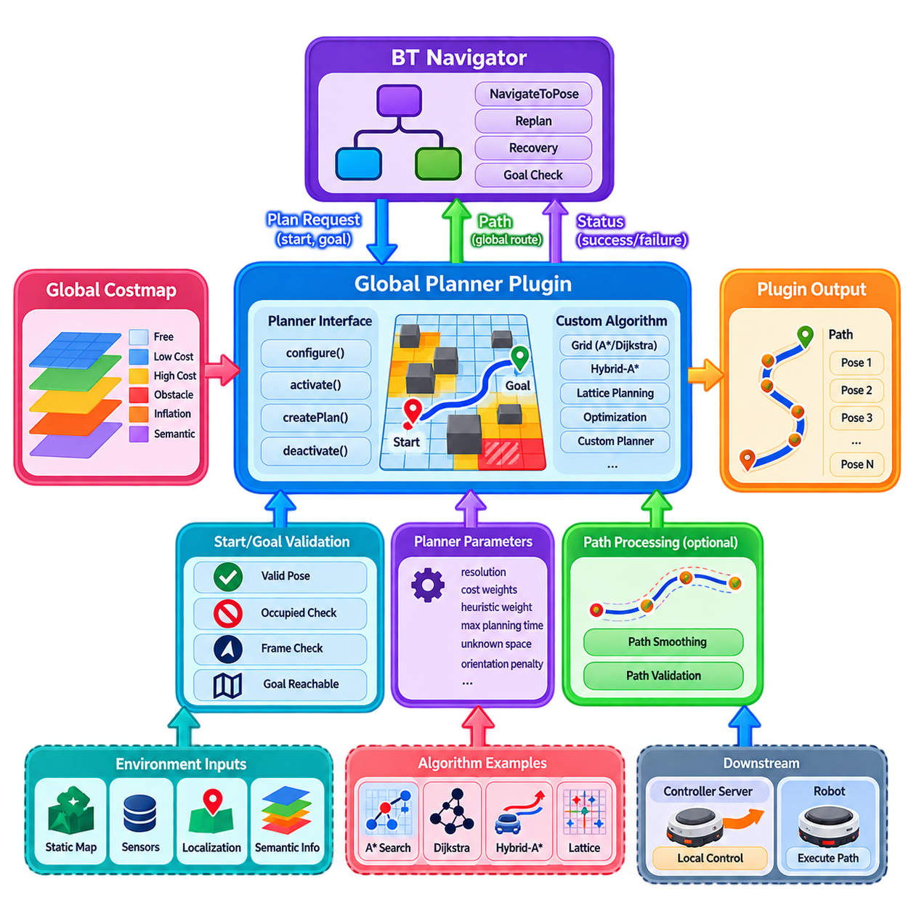
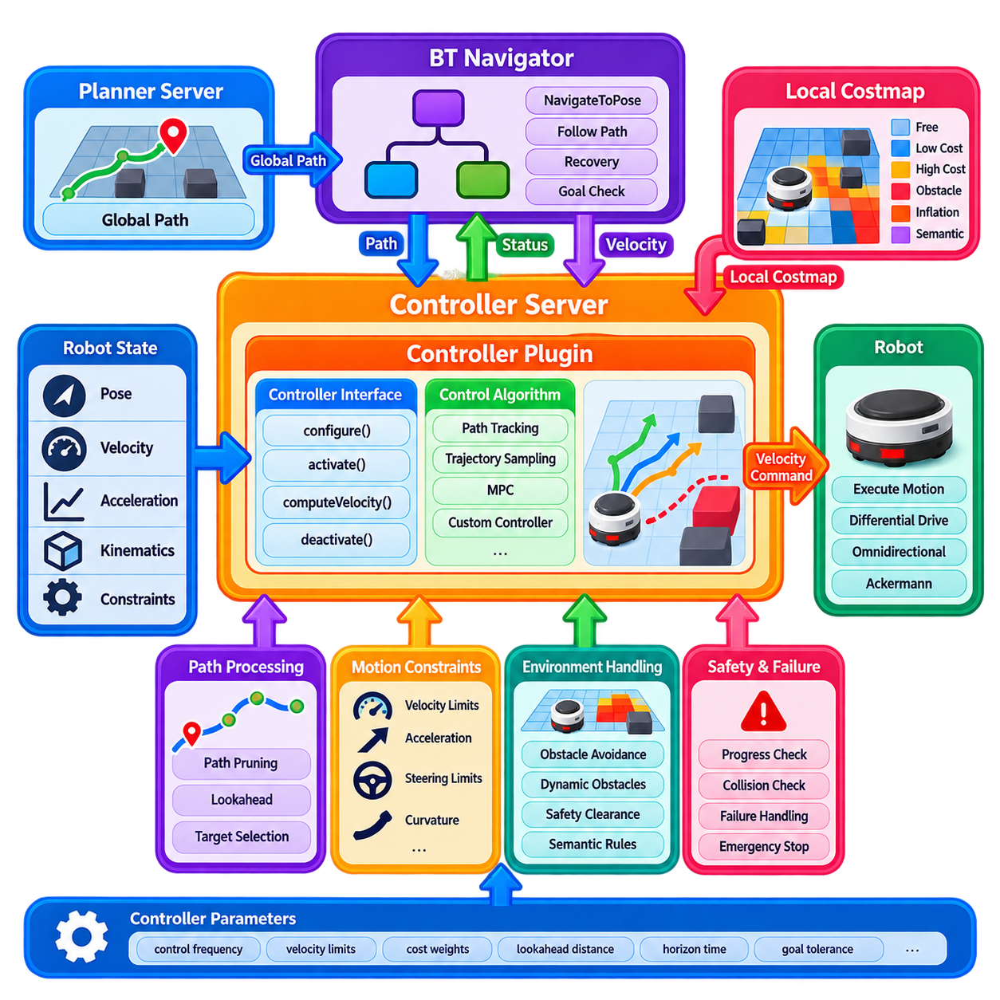
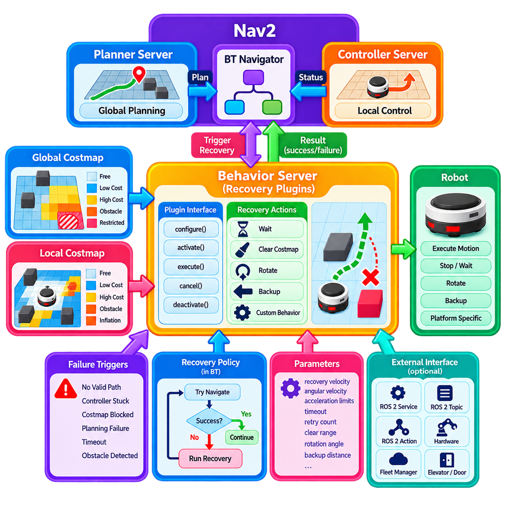
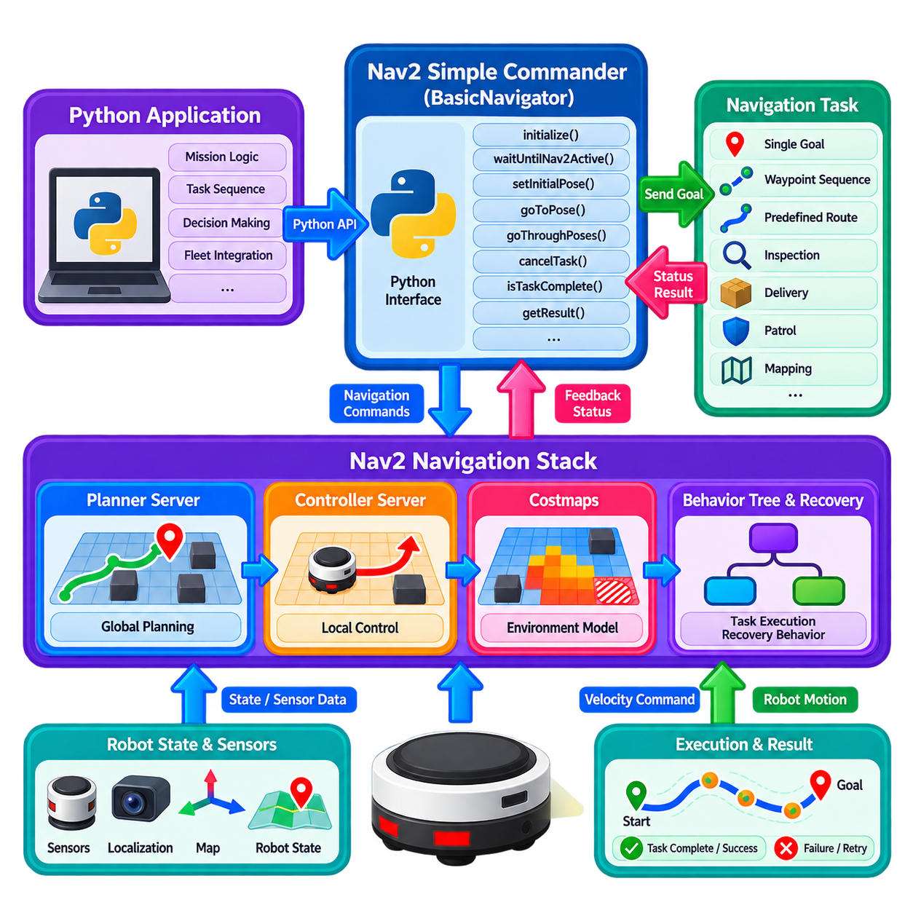
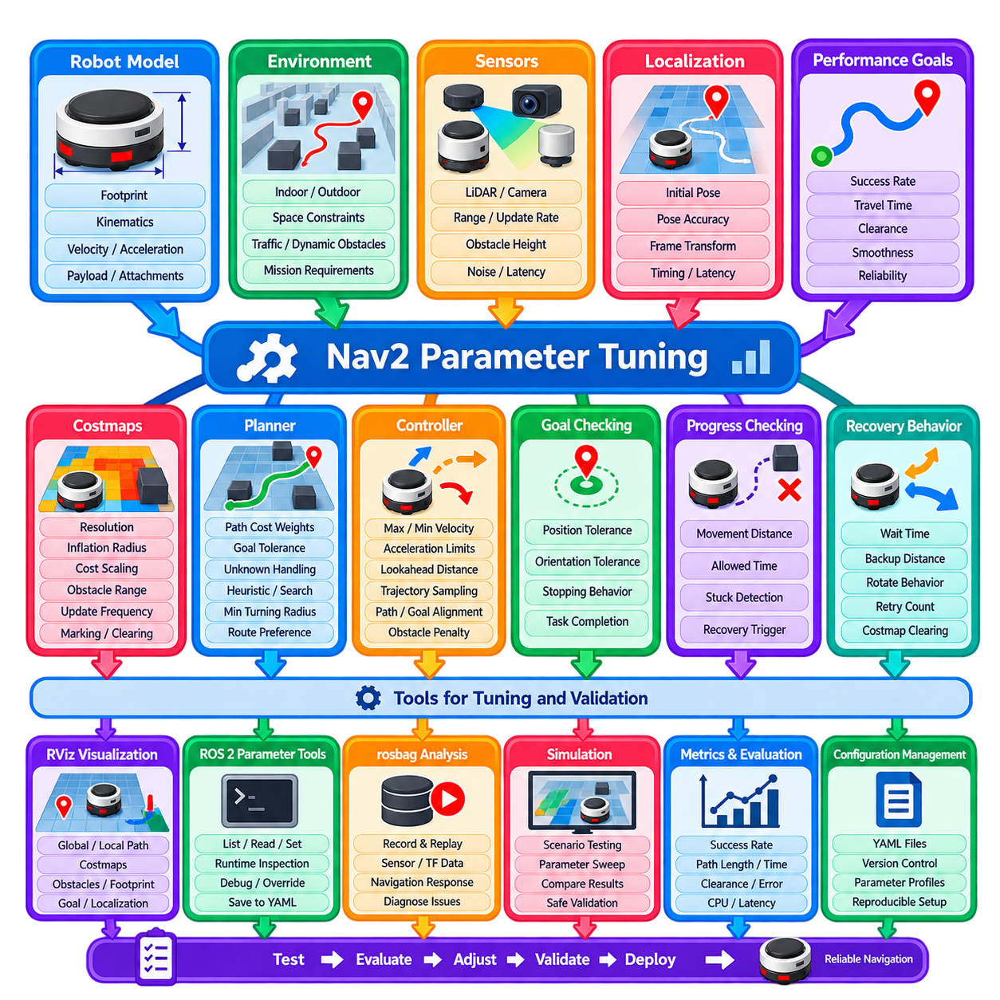
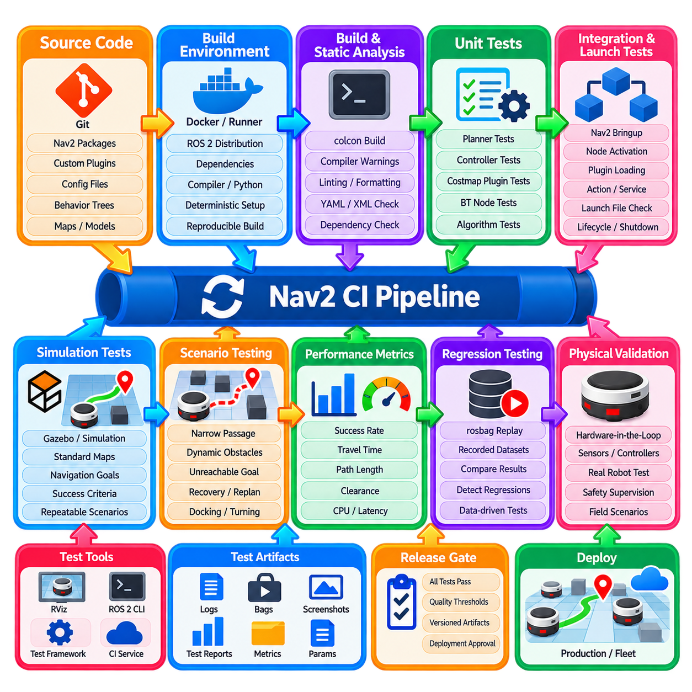
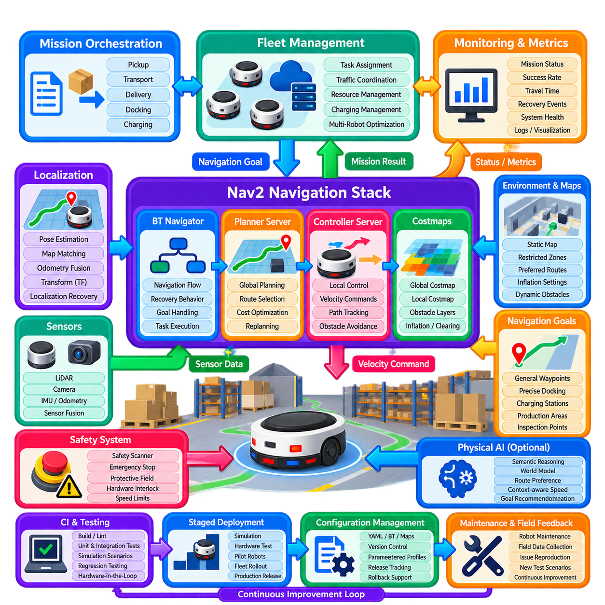

**Volume 15. Motion Planning and Navigation**

# Chapter 10. Navigation2 Stack

## 10.01. Nav2 Architecture BT Navigator Planner Controller

{width="7.268055555555556in" height="7.268055555555556in"}

내비게이션2(Navigation2)는 일반적으로 Nav2라고 불리며, 목표 지향 이동(goal-directed movement)을 위한 모듈형 기능을 자율이동로봇(autonomous mobile robot)에 제공하도록 설계된 ROS 2 내비게이션 프레임워크(navigation framework)이다. Nav2는 내비게이션을 하나의 단일 알고리즘(monolithic algorithm)으로 구현하지 않고, 경로 계획(planning), 제어(control), 복구(recovery), 지도 인터페이스(mapping interface), 임무 실행(mission execution)을 담당하는 여러 서버가 협력하는 구조로 구성한다. 이러한 아키텍처를 통해 전체 시스템 수준의 작업 흐름을 유지하면서 개별 알고리즘을 교체할 수 있다.

Nav2 아키텍처는 ROS 2 통신 메커니즘(communication mechanism)을 기반으로 하는 분산 서버 기반 설계(distributed server-based design)를 따른다. 주요 기능은 수명주기 관리 노드(lifecycle-managed node)로 실행되며 토픽(topic), 서비스(service), 액션(action)을 통해 통신한다. 장시간 수행되는 내비게이션 작업은 지속적인 피드백(feedback), 취소(cancellation), 선점(preemption)이 필요할 수 있기 때문에 주로 ROS 2 액션으로 표현된다. 수명주기 관리(lifecycle management)는 내비게이션 구성요소의 결정론적 설정(configuration), 활성화(activation), 비활성화(deactivation), 종료(shutdown)를 제공한다.

가장 높은 실행 수준에서 BT 내비게이터(BT Navigator)는 행동 트리(Behavior Tree, BT)를 통해 내비게이션 동작을 조정한다. 내비게이션 로직을 고정된 절차적 순서에 포함하는 대신, 트리는 조건(condition), 액션(action), 폴백(fallback), 재시도(retry), 복구 작업(recovery operation)의 계층적 조합으로 내비게이션을 표현한다. 이를 통해 내비게이션 정책(navigation policy)을 명시적이고 설정 가능한 형태로 만들 수 있으며, 기반 경로 계획기(planner)나 제어기(controller)를 재설계하지 않고도 복잡한 임무 동작을 수정할 수 있다.

일반적인 내비게이션 요청은 애플리케이션(application)이 NavigateToPose와 같은 액션 인터페이스(action interface)를 통해 목표 자세(target pose)를 전달하면서 시작된다. BT 내비게이터는 이 목표를 수신하고 설정된 행동 트리(Behavior Tree)를 실행한다. 트리 노드는 전역 경로(global path)를 요청하고, 경로 추종(path following)을 시작하며, 진행 상태(progress)를 평가하고, 실패를 감지하거나 비용 지도(costmap)를 초기화하고 재계획(replanning)을 수행할 수 있다. 따라서 행동 트리는 상위 수준 내비게이션 의도와 전문화된 내비게이션 서버를 연결하는 오케스트레이션 계층(orchestration layer)의 역할을 한다.

플래너 서버(Planner Server)는 로봇의 현재 상태에서 요청된 목표까지 도달할 수 있는 실행 가능한 전역 경로(global path)를 계산한다. 플래너 서버는 주로 전역 비용 지도(global costmap)와 하나 이상의 플래너 플러그인(planner plugin)을 사용한다. 로봇과 환경에 따라 이러한 플러그인은 격자 탐색(grid search), 하이브리드 상태 탐색(hybrid-state search), 격자 기반 경로 계획(lattice planning) 또는 다른 경로 계획 기법을 구현할 수 있다. 서버 추상화(server abstraction)를 통해 BT 내비게이터나 후단 제어기를 수정하지 않고도 경로 계획 알고리즘을 변경할 수 있다.

전역 경로 계획(global planning)은 전역 비용 지도(global costmap)가 유지하는 환경 표현(environment representation)에 크게 의존한다. 정적 지도 정보(static map information), 감지된 장애물(sensed obstacle), 팽창 영역(inflation region), 의미론적 제한(semantic restriction) 및 기타 내비게이션 제약조건을 설정 가능한 비용 지도 계층(costmap layer)을 통해 표현할 수 있다. 플래너는 점유 영역이나 높은 비용 영역을 회피하면서 이 표현을 탐색한다. 따라서 내비게이션 성능은 탐색 알고리즘뿐만 아니라 지도 품질, 로봇 풋프린트(robot footprint) 설정, 비용 지도 매개변수에도 영향을 받는다.

컨트롤러 서버(Controller Server)는 계획된 경로를 이동 플랫폼(mobile base)이 실행할 수 있는 명령으로 변환한다. 플래너 서버가 비교적 장거리의 경로 생성을 담당하는 반면, 컨트롤러는 훨씬 높은 주기로 로봇의 국부 상태(local robot state), 주변 장애물, 운동학적 제약조건(kinematic constraint), 경로 형상을 반복적으로 평가한다. 출력은 일반적으로 속도 명령(velocity command) 또는 이에 상응하는 운동 기준값(motion reference)이며, 로봇의 하위 수준 주행 제어 시스템으로 전달된다.

컨트롤러 기능은 플러그인(plugin)을 통해 구현되므로 동일한 Nav2 프레임워크에서 서로 다른 국부 이동 전략(local motion strategy)을 사용할 수 있다. 플랫폼에 따라 컨트롤러는 경로 추종(path tracking), 예측 최적화(predictive optimization), 궤적 샘플링(trajectory sampling), 곡률 조절(curvature regulation), 동적 장애물 대응(dynamic obstacle response) 등을 중점적으로 수행할 수 있다. 이러한 분리는 차동구동(differential-drive), 전방향 구동(omnidirectional), 애커만 조향(Ackermann-steered) 등 서로 다른 이동 플랫폼이 크게 다른 실행 가능 운동 특성을 갖기 때문에 특히 중요하다.

따라서 플래너 서버(Planner Server)와 컨트롤러 서버(Controller Server)는 상호 보완적인 공간적·시간적 범위에서 동작한다. 플래너는 넓은 환경에서 로봇이 어디를 통해 이동해야 하는지를 결정하고, 컨트롤러는 즉각적인 실행 구간에서 로봇이 어떻게 움직여야 하는지를 결정한다. Nav2는 컨트롤러가 갱신된 기준 경로를 계속 추종하는 동안 전역 경로를 주기적으로 다시 생성할 수 있으므로 장애물, 위치 추정(localization estimate), 환경 조건이 변경될 때 시스템이 적응할 수 있다.

경로 계획과 제어 사이에서 Nav2는 스무더 서버(Smoother Server)와 같은 경로 처리 구성요소(path-processing component)를 사용할 수 있다. 기하학적으로 실행 가능한 경로라도 급격한 방향 변화, 불필요한 곡률(curvature), 격자 기반 경로 계획에서 발생하는 이산화 아티팩트(discrete artifact)를 포함할 수 있다. 경로 평활화(smoothing)는 충돌 제약조건을 유지하면서 실행 전에 경로를 개선한다. 이를 통해 컨트롤러의 부담을 줄이고 특히 조향이나 가속 능력이 제한된 로봇에서 이동 품질을 향상시킬 수 있다.

내비게이션에서는 명령된 움직임이 실제로 의미 있는 진행을 만들어내고 있는지를 지속적으로 평가해야 한다. 진행 검사 메커니즘(progress checking mechanism)은 로봇이 목표를 향해 이동하고 있는지를 판단하며, 목표 검사기(goal checker)는 위치와 자세 허용오차(tolerance)가 충족되었는지를 판단한다. 이러한 메커니즘은 로봇이 차단되거나, 진동하거나, 위치 추정이 잘못되거나, 물리적으로 요청된 자세에 도달할 수 없는 상황에서 내비게이션 시스템이 무한히 명령을 실행하는 것을 방지한다.

실패는 하나의 비상 루틴(emergency routine)이 아니라 조정된 복구 및 행동 메커니즘을 통해 처리된다. 경로 계획이나 제어가 반복적으로 실패하면 행동 트리(Behavior Tree)는 내비게이션을 다시 시도하기 전에 대기(waiting), 회전(rotating), 후진(backing up), 선택된 비용 지도 정보 제거(clearing) 등의 행동을 실행할 수 있다. 트리는 국부적 실패(local failure)와 보다 광범위한 내비게이션 실패를 구분할 수 있으므로 모든 실패 시도를 즉시 종료하지 않고 적절한 범위에서 복구를 수행할 수 있다.

Nav2의 비헤이비어 서버(Behavior Server)는 행동 트리 노드가 호출할 수 있는 재사용 가능한 행동(reusable behavior)을 제공한다. 이러한 행동은 어려운 내비게이션 상황에서 필요한 의도적 동작을 지원함으로써 경로 계획과 경로 추종을 보완한다. 복구 로직(recovery logic)이 오케스트레이션 계층에서 표현되기 때문에 시스템은 알고리즘 실패 정보와 재시도 정책(retry policy), 운영 상황(operational context)을 결합할 수 있다. 이는 단순히 실패한 노드를 재시작하는 방식보다 강인한 내비게이션 작업 흐름을 제공한다.

비용 지도(costmap)는 인지(perception), 경로 계획(planning), 제어(control)를 연결하는 공유 환경 추상화(shared environmental abstraction)를 형성한다. Nav2는 일반적으로 전역 및 국부 내비게이션 범위가 서로 다른 요구사항을 갖기 때문에 전역 비용 지도(global costmap)와 국부 비용 지도(local costmap)를 별도로 유지한다. 전역 비용 지도는 넓은 영역의 경로 계획을 지원하고, 국부 비용 지도는 로봇 주변에서 최근 관측된 장애물을 중점적으로 표현한다. LiDAR, 깊이 카메라(depth camera) 또는 기타 인지 시스템의 센서 관측값은 이러한 표현을 지속적으로 갱신할 수 있다.

위치 추정(localization)은 로봇, 지도, 오도메트리(odometry), 센서 좌표계(coordinate frame)를 연결하는 데 필요한 변환 관계(transform relationship)를 제공한다. Nav2는 AMCL과 같은 위치 추정 시스템 또는 필요한 ROS 2 변환과 자세 정보를 제공하는 다른 자세 추정 파이프라인(pose-estimation pipeline)과 함께 동작할 수 있다. 플래너, 컨트롤러, 비용 지도, 센서가 로봇의 연속적인 움직임 중에도 호환되는 기준 좌표계에서 기하 정보를 해석해야 하므로 정확하고 시간적으로 일관된 변환이 필수적이다.

변환 계층(transform hierarchy)은 일반적으로 전역 지도 프레임(global map frame)을 오도메트리 프레임(odometry frame)에 연결하고, 다시 로봇 베이스 프레임(robot base frame)에 연결한다. 오도메트리 계층은 국부적으로 부드러운 움직임 추정값을 제공하고, 전역 위치 추정 계층(global localization layer)은 환경을 기준으로 누적된 드리프트(drift)를 보정한다. Nav2는 특정 위치 추정 알고리즘을 요구하는 대신 이러한 관계를 이용한다. 이러한 인터페이스 기반 설계를 통해 비전(visual), LiDAR, GNSS 보조 또는 다중 센서 위치 추정 시스템이 동일한 내비게이션 스택을 지원할 수 있다.

Nav2는 아키텍처 역할과 알고리즘 구현을 분리하기 위해 플러그인 인터페이스(plugin interface)를 광범위하게 사용한다. 전역 플래너(global planner), 컨트롤러(controller), 목표 검사기(goal checker), 진행 검사기(progress checker), 비용 지도 계층(costmap layer), 행동(behavior), 스무더(smoother), 행동 트리 노드를 독립적으로 선택하거나 확장할 수 있다. 이러한 모듈성(modularity)은 플랫폼 기능과 운영 요구사항에 따라 개별 알고리즘이 발전하더라도 내비게이션 아키텍처 자체는 안정적으로 유지할 수 있다는 점에서 중요하다.

ROS 2 수명주기 관리(lifecycle management)는 이러한 모듈형 구조에 또 하나의 아키텍처 계층을 추가한다. 내비게이션 노드는 미설정(unconfigured), 비활성(inactive), 활성(active)과 같은 정의된 상태를 전환할 수 있다. 수명주기 관리자(lifecycle manager)는 이러한 전환을 조정하여 상호 의존적인 구성요소가 통제된 순서로 동작 상태에 진입하도록 한다. 이는 센서, 위치 추정, 지도, 내비게이션 서비스가 자율 이동을 허용하기 전에 유효한 상태에 도달해야 하는 실제 배치 로봇에서 특히 중요하다.

행동 트리(Behavior Tree)는 지속적인 재계획(continuous replanning)을 구현하는 자연스러운 메커니즘도 제공한다. 내비게이션 트리는 컨트롤러가 현재 경로를 추종하는 동안 새로운 전역 경로를 주기적으로 요청할 수 있으며, 새롭게 감지된 장애물이나 갱신된 위치 추정 정보가 이후 움직임에 반영되도록 한다. 그러나 지나치게 빈번한 재계획은 계산 자원을 소비하고 불안정한 경로 변경을 유발할 수 있으며, 재계획이 너무 적으면 반응성이 저하되므로 재계획 주기를 신중하게 선택해야 한다.

새로운 목표가 입력될 경우 내비게이션 액션(navigation action)을 선점(preemption)할 수도 있다. 모든 목표를 완료될 때까지 반드시 수행해야 하는 독립적인 명령으로 처리하는 대신, 실행 중인 내비게이션 작업을 취소하거나 새로운 작업으로 교체할 수 있다. 이러한 특성은 작업 우선순위, 환경 이벤트 또는 상위 감독 명령에 따라 목적지가 변경될 수 있는 플릿 관리(fleet management), 인간-로봇 상호작용(human-robot interaction), 순찰 로봇(patrol robot), 임무 수준 오케스트레이션(mission-level orchestration)에서 중요하다.

시스템 관점에서 BT 내비게이터(BT Navigator), 플래너 서버(Planner Server), 컨트롤러 서버(Controller Server)를 세 개의 독립적인 알고리즘으로 보아서는 안 된다. 이들은 세 가지 의사결정 아키텍처 계층(decision-making architectural layer)을 형성한다. BT 내비게이터는 다음에 어떤 내비게이션 작업을 수행할지 결정하고, 플래너 서버는 환경을 통과하는 실행 가능한 경로를 결정하며, 컨트롤러 서버는 실행 가능한 단기 운동 명령(short-horizon motion command)을 결정한다. 내비게이션 실행 과정에서 피드백은 이러한 계층을 지속적으로 연결한다.

이러한 분리는 고급 자율 시스템(advanced autonomy)을 위한 명확한 통합 경계(integration boundary)도 제공한다. 학습 기반 플래너(learning-based planner)는 기존 경로 계획 플러그인을 대체할 수 있고, 예측 제어기(predictive controller)는 전통적인 추종 기법을 대체할 수 있으며, 의미론적 또는 AI 생성 정보는 지도, 비용값, 행동 트리 조건을 통해 입력될 수 있다. 상위 수준 작업 플래너(task planner)는 바퀴 움직임을 직접 제어하지 않고 Nav2 목표를 전달할 수 있으므로 임무 추론(mission reasoning)과 실시간 내비게이션 실행(real-time navigation execution) 사이의 유용한 경계를 유지할 수 있다.

산업용 로봇(industrial robot)의 경우 아키텍처만으로 신뢰성 높은 내비게이션을 보장할 수 없다. 플래너 주기(planner frequency), 컨트롤러 주기(controller frequency), 비용 지도 해상도(costmap resolution), 센서 갱신 속도(sensor update rate), 변환 허용오차(transform tolerance), 풋프린트 형상(footprint geometry), 가속도 제한(acceleration limit), 복구 정책(recovery policy)을 하나의 일관된 시스템으로 설정해야 한다. 예를 들어 사용 가능한 인지 정보의 갱신 속도보다 컨트롤러를 빠르게 실행한다고 해서 반드시 안전성이 향상되는 것은 아니다. 따라서 인지, 위치 추정, 경로 계획, 구동(actuation) 사이의 시간 관계를 통합적으로 설계해야 한다.

안전 필수 이동(safety-critical motion)은 일반적인 내비게이션 의사결정과 추가적으로 분리되어야 한다. Nav2가 경로와 속도 명령을 생성할 수 있지만, 하드웨어 수준의 비상 정지(emergency stopping), 안전 등급 장애물 감지(safety-rated obstacle detection), 구동 제한(drive limit), 워치독(watchdog), 독립 보호 메커니즘(independent protective mechanism)이 최종적으로 실행 가능한 움직임을 제한해야 한다. 이러한 계층형 구성은 내비게이션 소프트웨어의 오류가 물리적 이동 허용 여부를 결정하는 유일한 요소가 되는 것을 방지한다.

결과적으로 이 아키텍처는 단순한 선형 경로 계획 파이프라인(linear planning pipeline)이 아니라 폐루프 내비게이션(closed navigation loop)으로 이해할 수 있다. 목표가 BT 내비게이터로 입력되면 경로 계획이 전역 경로를 생성하고, 제어기가 실행 가능한 움직임을 생성하며, 센서는 비용 지도를 갱신하고, 위치 추정 시스템은 로봇 상태를 갱신한다. 실행 피드백은 다시 행동 트리로 전달된다. 실패하면 복구 또는 재계획이 실행되고, 목표 검사에 성공하면 내비게이션 액션이 종료되면서 요청 시스템에 완료 상태가 보고된다.

따라서 Nav2는 단순한 경로 계획 알고리즘의 집합 이상이다. Nav2의 핵심 가치는 임무 수준 내비게이션 로직(mission-level navigation logic), 전역 경로 계획(global planning), 국부 제어(local control), 환경 표현(environmental representation), 복구 행동(recovery behavior), 실행 관리(execution management)를 분리하면서 이들 사이에 표준화된 인터페이스를 정의하는 확장 가능한 ROS 2 아키텍처에 있다. 이러한 구조를 통해 동일한 내비게이션 프레임워크를 연구용 로봇에서 설정 가능한 산업용 자율이동로봇(Autonomous Mobile Robot, AMR), 그리고 보다 발전된 자율 이동 플랫폼까지 확장할 수 있다.

## 10.02. Nav2 Behavior Tree Design Custom BT Nodes [w/Code]

{width="7.268055555555556in" height="7.268055555555556in"}

행동 트리(Behavior Tree, BT)는 Nav2에서 자율 내비게이션을 위한 구조화된 실행 모델(structured execution model)을 제공한다. 내비게이션 동작을 하나의 절차적 프로그램(procedural program)에 하드코딩하는 대신, 트리는 조건(condition), 액션(action), 시퀀스(sequence), 선택자(selector), 데코레이터(decorator), 복구 분기(recovery branch)를 계층적으로 표현한다. BT 내비게이터(BT Navigator)는 이 구조를 실행하면서 플래너 서버(Planner Server), 컨트롤러 서버(Controller Server), 스무더 서버(Smoother Server), 비헤이비어 서버(Behavior Server)와 같은 Nav2 서버와 상호작용한다. 이러한 분리는 내비게이션 동작을 명시적이고, 검사 가능하며, 교체 가능하고, 확장 가능한 형태로 만든다.

일반적인 Nav2 내비게이션 트리는 목표(goal)를 수신하고, 필요한 경로를 획득하거나 갱신하며, 해당 경로를 추종하고, 진행 상태를 평가하고, 목표 도달 여부를 확인하는 상위 수준의 시퀀스로 시작한다. 트리는 기본 작업이 실패했을 때 대체 동작을 시도하는 폴백 분기(fallback branch)를 포함할 수 있다. 예를 들어 경로 추종이 실패하면 트리는 먼저 재계획(replanning)을 요청하고, 반복적인 재계획으로도 진행할 수 없는 경우 복구 동작(recovery behavior)을 실행할 수 있다. 결과적으로 이러한 구조는 내비게이션을 단순한 선형 파이프라인이 아니라 통제된 의사결정 과정으로 표현한다.

시퀀스(Sequence)와 폴백(Fallback) 제어 노드는 BT 설계의 기본 요소이다. 시퀀스는 필요한 하위 노드가 모두 성공해야 성공하므로, 경로를 계산한 다음 해당 경로를 실행하는 것과 같은 순차적인 작업에 적합하다. 폴백은 하나의 하위 노드가 성공할 때까지 대안을 순차적으로 시도하므로 복구 전략이나 선택적 동작에 유용하다. 이러한 제어 노드를 사용하면 비교적 작은 재사용 가능한 구성요소를 조합하여 복잡한 내비게이션 정책을 만들 수 있으며, 실행 의미(execution semantics)는 시스템 통합을 담당하는 엔지니어가 이해하기 쉬운 형태로 유지된다.

데코레이터 노드(Decorator Node)는 하위 노드의 내부 구현을 변경하지 않고 해당 노드가 실행되는 방식을 수정한다. 대표적인 개념으로는 작업 재시도(retry), 조건이 유효한 동안 반복(repetition), 시간 제약(time constraint), 조건 반전(condition inversion) 등이 있다. Nav2에서 데코레이터는 제어된 재계획, 재시도 횟수 제한, 주기적인 검사, 조건부 실행을 구현하는 데 특히 유용하다. 그러나 잘못 설계된 재시도 또는 반복 구조는 과도한 계산량, 진동성 동작(oscillatory behavior), 종료 상태에 도달하지 못하는 실행 트리를 만들 수 있으므로 신중하게 사용해야 한다.

사용자 정의 BT 노드(custom BT node)는 표준 내비게이션 트리에서 제공하지 않는 특정 애플리케이션 동작을 Nav2에 추가할 수 있도록 한다. 사용자 정의 노드는 도킹 준비 상태 확인(docking readiness check), 의미론적 목적지 검증(semantic destination validation), 외부 인지 결과 요청, 페이로드 상태 확인, 임무 관리 시스템과의 통신과 같은 동작을 표현할 수 있다. 이러한 노드는 명확한 인터페이스를 제공하고 책임 범위를 제한하는 것이 일반적으로 바람직하다. 이를 통해 상위 수준 임무 로직이 내비게이션 구현 코드 내부에 불필요하게 포함되는 것을 방지할 수 있다.

사용자 정의 액션 노드(custom action node)는 완료하는 데 시간이 필요하고 중간 상태를 생성할 수 있는 작업에 적합하다. 노드는 비동기 작업(asynchronous operation)을 시작하고, 작업이 진행되는 동안 실행 중(running) 상태를 유지한 후 최종적으로 성공 또는 실패를 반환할 수 있다. 또한 새로운 목표, 안전 이벤트, 상위 우선순위 임무에 의해 행동 트리가 중단될 수 있으므로 취소(cancellation)도 고려해야 한다. 따라서 잘 설계된 비동기 노드는 초기화(initialization), 실행(execution), 완료(completion), 실패(failure), 취소(cancellation)를 서로 구분되는 운영 상태로 관리한다.

조건 노드(condition node)는 장시간 실행되는 동작을 직접 수행하지 않고 트리에 정보를 제공한다. 목표가 유효한지, 위치 추정 품질이 충분한지, 장애물이 계획된 경로를 막고 있는지, 로봇이 도킹되었는지, 임무 수준의 이동 허가가 승인되었는지를 평가할 수 있다. 조건 노드는 가능한 한 빠르고 결정론적이며 부작용(side effect)이 없도록 설계하는 것이 바람직하다. 이를 통해 행동 트리가 느린 외부 작업과 과도하게 결합되는 것을 방지하고, 결과적인 내비게이션 정책을 보다 쉽게 분석할 수 있다.

사용자 정의 노드는 행동 트리 블랙보드(Behavior Tree blackboard), ROS 2 인터페이스 또는 별도의 애플리케이션 인터페이스를 통해 통신한다. 블랙보드는 현재 목표, 선택된 경로, 복구 횟수, 상황별 매개변수와 같은 실행 데이터를 여러 노드 사이에서 공유할 수 있는 편리한 메커니즘을 제공한다. 그러나 블랙보드를 통제되지 않은 전역 데이터 저장소처럼 사용해서는 안 된다. 사용자 정의 노드가 시스템 확장 이후에도 이해 가능한 상태로 유지되도록 데이터 소유권, 명명 규칙, 수명주기, 갱신 책임을 명확하게 정의해야 한다.

Nav2의 사용자 정의 BT 노드는 일반적으로 BehaviorTree.CPP 프레임워크를 사용하여 구현되고 플러그인 메커니즘(plugin mechanism)을 통해 Nav2에 통합된다. 구현에서는 적절한 노드 등록(node registration)과 포트 정의(port definition)를 제공하여 BT XML이 해당 노드를 생성할 수 있도록 해야 한다. 입력 및 출력 포트(input/output port)는 XML 트리와 C++ 구현 사이의 데이터 계약(data contract)을 정의한다. 이러한 분리를 통해 재사용 가능한 소프트웨어 구성요소를 유지하면서 시스템 동작을 설정 수준에서 수정할 수 있다.

행동 트리의 XML 표현(XML representation)은 노드 구현과 독립적으로 내비게이션 정책을 검사할 수 있기 때문에 중요한 엔지니어링 산출물이다. 잘 구성된 트리는 의미가 명확한 서브트리(subtree) 경계와 설명적인 노드 이름을 사용해야 한다. 반복되는 내비게이션 패턴은 전체 XML에 복사하기보다는 재사용 가능한 서브트리로 캡슐화하는 것이 바람직하다. 이를 통해 유지보수성을 향상시키고 정상 내비게이션, 재계획, 복구 동작 사이의 차이를 보다 쉽게 이해할 수 있다.

사용자 정의 BT 설계는 Nav2를 산업용 또는 임무 지향 로봇 시스템과 통합할 때 특히 유용하다. 창고 자율이동로봇(AMR)은 교통 구역, 충전 스테이션, 엘리베이터 인터페이스, 작업 예약(task reservation)과 관련된 조건을 필요로 할 수 있다. 검사 로봇은 이동을 계속하기 전에 스캔 준비 상태, 페이로드 상태, 목표 가시성, 검사 완료 여부를 확인해야 할 수 있다. 이러한 작업은 일반적인 로컬 플래너(local planner) 내부에 숨기기보다는 명시적인 행동 의사결정으로 표현하는 것이 바람직하다. 이는 해당 기능이 순수한 기하학적 이동보다는 임무 실행과 운영 상태에 관련되기 때문이다.

유용한 아키텍처는 내비게이션 행동과 임무 오케스트레이션(mission orchestration)을 분리한다. 행동 트리는 내비게이션 목표가 어떻게 실행되는지를 결정하고, 상위 수준의 임무 관리자는 로봇이 왜 이동하며 내비게이션 완료 후 무엇을 수행해야 하는지를 결정할 수 있다. 예를 들어 임무 시스템은 검사 스테이션으로 이동하도록 요청하고, Nav2 트리는 경로 계획, 장애물 회피, 복구, 목표 검증을 처리할 수 있다. 로봇이 도착하면 제어권은 임무 계층으로 돌아가 스캔 실행이나 다음 작업을 선택할 수 있다.

행동 트리는 의미론적 내비게이션(semantic navigation)을 통합하는 실용적인 메커니즘도 제공한다. 목적지는 단순한 기하학적 자세(geometric pose)가 아니라 적재 스테이션, 검사 셀, 충전 영역, 제한 구역과 같은 운영상의 목표로 표현될 수 있다. 사용자 정의 조건은 이동 시작 전에 의미론적 유효성(semantic validity)을 확인할 수 있으며, 사용자 정의 액션은 로봇이 지정된 영역에 도착했을 때 추가 정보를 요청할 수 있다. 이를 통해 기본 플래너가 모든 애플리케이션 수준 개념을 이해하도록 강제하지 않고도 Nav2를 보다 광범위한 의미론적 내비게이션 아키텍처에 참여시킬 수 있다.

복구 설계(recovery design)는 사후적으로 추가하는 기능이 아니라 기본 행동 아키텍처의 일부로 취급해야 한다. 복구 분기는 일시적인 차단과 지속적인 경로 계획 실패를 구분하고 점진적으로 강한 대응을 적용할 수 있다. 예를 들어 트리는 일시적인 장애물이 사라질 때까지 먼저 대기하고, 이후 국부 비용 지도(local costmap)의 선택적 정보를 제거하며, 재계획을 요청하고, 최종적으로 제어된 후진 또는 회전을 수행할 수 있다. 복구 행동에는 제한된 재시도 횟수와 명확한 종료 조건이 있어야 로봇이 복구 루프에 무한히 갇히는 것을 방지할 수 있다.

재계획 로직(replanning logic) 역시 가능한 최대 빈도가 아니라 의미 있는 트리거(trigger)를 중심으로 설계해야 한다. 현재 경로가 유효하지 않게 되었거나, 진행 상태가 예상 임계값보다 낮거나, 환경에 중요한 변화가 감지되었거나, 복구 동작이 완료된 경우 트리가 재계획을 수행하도록 구성할 수 있다. 이러한 이벤트 중심 접근(event-oriented approach)은 시스템 반응성을 유지하면서 불필요한 플래너 실행을 줄일 수 있다. 대규모 로봇 플릿(fleet)에서는 내비게이션 행동을 무차별적인 주기적 처리보다 실제 환경 및 운영 변화에 연계함으로써 전체 계산 부하를 관리하는 데에도 도움이 된다.

사용자 정의 BT 노드는 내비게이션 시스템의 실시간 특성(real-time characteristic)을 존중해야 한다. 과도한 계산, 블로킹 입출력(blocking I/O), 긴 서비스 호출, 외부 AI 추론(external AI inference)이 BT 실행 루프를 불필요하게 차단해서는 안 된다. 상당한 처리 시간이 필요한 작업이라면 일반적으로 비동기 방식으로 구현하거나 적절한 ROS 2 구성요소로 위임해야 한다. 이는 Nav2가 응답 시간이 로컬 내비게이션 작업보다 덜 결정론적일 수 있는 인지, 의미론적 추론, 월드 모델(world model), 클라우드 연결 서비스와 통합될 때 특히 중요하다.

사용자 정의 행동 트리를 테스트하려면 로봇이 최종적으로 목표에 도달하는지만 검증해서는 안 된다. 개별 노드는 성공(success), 실패(failure), 실행 중(running), 취소(cancellation), 시간 초과(timeout), 잘못된 입력(invalid input), 반복 실행(repeated execution)을 각각 테스트해야 한다. 이후 전체 트리는 일시적인 장애물, 막힌 통로, 위치 추정 교란(localization disturbance), 플래너 실패, 컨트롤러 실패, 통신 손실과 같은 대표적인 환경 조건에서 테스트해야 한다. 로깅(logging)과 인트로스펙션(introspection)은 어떤 분기가 실행되었고 왜 트리가 특정 행동으로 전환되었는지를 확인할 수 있기 때문에 유용하다.

성숙한 Nav2 행동 트리는 내비게이션 서비스와 임무 수준 자율성(mission-level autonomy) 사이의 정책 계층(policy layer)으로 볼 수 있다. 표준 노드는 검증된 내비게이션 기능을 제공하고, 사용자 정의 노드는 애플리케이션별 지식과 운영 규칙을 표현한다. 플래너와 컨트롤러 알고리즘은 기하학적 및 동적 이동 결정을 담당하고, 행동 트리는 해당 기능을 언제 호출하고, 반복하고, 중단하거나, 복구 행동으로 전환할지를 결정한다. 이러한 역할 분리는 아키텍처의 모듈성을 유지하면서도 상당한 수준의 사용자 정의를 가능하게 한다.

고급 물리적 AI(Physical AI) 내비게이션 아키텍처에서는 행동 트리를 보다 적응적인 AI 구성요소를 둘러싼 결정론적 실행 경계(deterministic execution boundary)로 사용할 수 있다. 학습 기반 인지(learning-based perception), 의미론적 추론(semantic reasoning), 월드 모델 추론(world-model inference), AI 기반 경로 계획은 정보나 후보 의사결정을 제공할 수 있으며, 행동 트리는 명시적인 실행 조건, 폴백 경로, 복구 정책, 안전 관련 게이트(safety-related gate)를 유지한다. 이러한 구조에서는 예측 가능한 로봇 운용에 필요한 구조화된 제어 로직을 제거하지 않으면서 AI가 적응형 지능을 제공할 수 있다.

따라서 사용자 정의 BT 설계의 핵심 원칙은 통제된 확장성(controlled extensibility)이다. 기존 Nav2 기능으로 의미 있는 애플리케이션 동작을 명확하게 표현할 수 없는 경우 사용자 정의 노드를 추가하고, 아키텍처의 명확성을 유지할 수 있을 정도로 인터페이스 범위를 좁게 유지해야 한다. 행동 트리는 운영상의 의사결정을 가시적이고, 제한적이며, 테스트 가능하고, 복구 가능한 형태로 표현해야 한다. 이러한 원칙을 따르면 Nav2는 기존의 내비게이션 스택에서 벗어나 이동 경로 계획과 제어를 의미론적 내비게이션, 임무 오케스트레이션, 상위 수준의 물리적 AI 시스템과 연결하는 유연한 실행 프레임워크로 발전할 수 있다.

## 10.03. Nav2 Costmap 2D Plugin Development [w/Code]

{width="7.268055555555556in" height="7.268055555555556in"}

Nav2 비용 지도(costmap)는 이동 로봇의 충돌 인식 경로 계획(collision-aware planning)과 제어(control)를 지원하기 위해 사용되는 핵심 환경 표현(environmental representation)이다. 비용 지도는 자유 공간(free space), 장애물(obstacle), 내비게이션 제약조건(navigation constraint)에 대한 정보를 2차원 격자(2D grid)로 변환하며, 각 셀(cell)은 비용 값(cost value)을 가진다. 플래너 서버(Planner Server)는 주로 장거리 경로 생성을 위해 전역 비용 지도(global costmap)를 사용하고, 컨트롤러 서버(Controller Server)는 단기 이동 결정을 위해 국부 비용 지도(local costmap)를 사용한다. 이러한 분리를 통해 내비게이션은 광범위한 환경 정보와 빠르게 변화하는 국부 관측 정보를 함께 활용할 수 있다.

Nav2 비용 지도 아키텍처는 계층형 플러그인 모델(layered plugin model)을 중심으로 설계된다. 모든 환경 규칙을 하나의 거대한 비용 지도 구성요소에 구현하는 대신, 개별 계층(layer)이 서로 다른 유형의 정보를 최종 격자에 추가한다. 일반적인 계층에는 정적 지도 정보(static map information), 장애물 관측(obstacle observation), 장애물 주변의 팽창 영역(inflation), 애플리케이션별 제약조건(application-specific constraint)이 포함된다. 계층형 아키텍처를 사용하면 핵심 비용 지도 구현을 수정하지 않고 환경 표현을 추가, 제거, 교체할 수 있으므로 연구용 내비게이션 시스템과 산업용 내비게이션 시스템 모두에 적합하다.

비용 지도 플러그인(costmap plugin)은 일반적으로 적절한 Nav2 비용 지도 계층 인터페이스를 상속하고 프레임워크가 요구하는 수명주기(lifecycle)와 갱신(update) 동작을 구현한다. 플러그인은 마스터 비용 지도(master costmap)에서 자신이 수정해야 하는 영역을 결정한 다음 해당 영역에 계산된 값을 기록한다. 이러한 설계는 특정 환경 효과에 대한 계산과 전체 비용 지도의 관리를 분리한다. 따라서 사용자 정의 계층(custom layer)은 하나의 명확하게 정의된 책임에 집중할 수 있으며, 비용 지도 프레임워크가 다른 계층과의 결합을 처리한다.

갱신 주기(update cycle)는 비용 지도 플러그인 개발에서 가장 중요한 개념 중 하나이다. 내비게이션이 실행되는 동안 비용 지도는 반복적으로 센서 정보를 수신하고, 관련 계층을 갱신하며, 그 결과를 마스터 격자(master grid)에 결합한다. 플러그인은 가능하면 새로운 정보의 영향을 받은 영역만 효율적으로 식별해야 하며, 매번 전체 지도를 다시 계산해서는 안 된다. 갱신 영역(update bounds)과 갱신 비용(update costs) 연산은 변경된 영역으로 계산을 제한하는 메커니즘을 제공한다. 지도 해상도와 운영 영역이 커질수록 이러한 방식은 더욱 중요해진다.

사용자 정의 장애물 계층(custom obstacle layer)은 외부 인지 결과를 내비게이션 비용으로 변환할 수 있다. 예를 들어 인지 시스템은 LiDAR, 카메라, 레이더 또는 AI 기반 검출기를 사용하여 객체를 감지하고, 해당 위치를 로봇 또는 월드 좌표계(world coordinate frame)로 제공할 수 있다. 플러그인은 이러한 관측값을 비용 지도 좌표계(costmap coordinate system)로 변환한 후 해당 위치의 셀을 점유 또는 높은 비용으로 표시할 수 있다. 이러한 변환의 품질은 매우 중요하다. 좌표 정합의 오류는 잘못된 장애물 위치를 만들고, 결과적으로 안전하지 않거나 불필요하게 제한적인 내비게이션 동작을 발생시킬 수 있기 때문이다.

비용 지도 값(costmap value)은 단순한 이진 점유 상태(binary occupancy state)가 아니라 내비게이션 비용으로 해석되어야 한다. 하나의 셀은 자유 공간, 장애물, 팽창된 장애물 영역(inflated obstacle region), 또는 다른 중간 수준의 내비게이션 상태를 표현할 수 있다. 이를 통해 플래너와 컨트롤러는 단순히 기하학적으로 충돌하지 않는 경로를 찾는 것을 넘어 보다 안전한 경로를 선호할 수 있다. 따라서 사용자 정의 플러그인은 비용의 의미(cost semantics)를 명확하게 정의하고, 해당 값이 후단의 플래너와 컨트롤러가 사용하는 가정과 호환되도록 해야 한다.

팽창(inflation)은 환경 표현과 로봇 형상 사이를 연결하는 중요한 기능이다. 실제 로봇은 점(point)이 아니라 일정한 크기의 풋프린트(footprint)를 가지고 있으므로, 장애물 바로 옆을 이동하는 것이 점 기반 표현에서는 충돌하지 않더라도 실제 플랫폼에서는 안전하지 않을 수 있다. 팽창은 장애물 경계 주변에 점진적으로 증가하는 비용을 할당하여 경로 계획과 제어가 자연스럽게 더 큰 여유 공간(clearance)을 선호하도록 만든다. 특수한 로봇의 경우 표준 팽창 모델에 플랫폼별 여유 공간, 페이로드 크기 또는 운영 안전 여유(operational safety margin)를 표현하는 사용자 정의 계층을 추가할 필요가 있을 수 있다.

의미론적 비용 지도 플러그인(semantic costmap plugin)은 이러한 개념을 물리적 장애물 이상의 영역으로 확장한다. 의미론적 계층(semantic layer)은 제한 구역(restricted zone), 선호 주행 차선(preferred lane), 충전 영역(charging area), 검사 영역(inspection region), 보행자 공간(pedestrian space), 적재 스테이션(loading station) 또는 기타 운영 정보를 표현할 수 있다. 모든 통행 가능한 영역을 동일하게 취급하는 대신 비용 지도를 통해 경로 선택에 영향을 주는 선호도와 제약조건을 표현할 수 있다. 이를 통해 상위 수준의 월드 모델(world model)이나 시설 관리 시스템(facility-management system)의 의미론적 정보를 플래너 자체가 모든 의미론적 개념을 이해하지 않아도 기존 Nav2 경로 계획에 반영할 수 있다.

동적 비용 지도 플러그인(dynamic costmap plugin)은 정보의 유지와 만료(expiration)도 관리해야 한다. 센서 관측은 객체가 이동하거나 센서의 가시성이 사라지거나 관측 정보가 더 이상 신뢰할 수 없게 되면서 사라질 수 있다. 플러그인이 과거의 모든 관측을 영구적으로 장애물로 표시한다면 비용 지도는 오래된 장애물 정보로 점차 채워질 수 있다. 따라서 개발자는 관측 정보의 수명(observation lifetime), 제거(clearing), 시간 감쇠(temporal decay), 무효화(invalidation)에 대한 명확한 정책을 정의해야 한다. 이러한 정책은 임의의 타임아웃 값이 아니라 센서 특성과 로봇의 운용 속도를 고려하여 결정해야 한다.

좌표계(coordinate frame)와 변환 시간(transform timing)은 신뢰성 높은 플러그인 동작을 위한 핵심 요소이다. 센서 관측은 LiDAR 프레임, 카메라 프레임 또는 로봇 베이스 프레임에서 들어올 수 있지만, 비용 지도는 지도(map) 또는 오도메트리(odometry) 프레임에서 동작할 수 있다. 플러그인은 적절한 변환을 확보해야 하며 각 관측값에 연결된 타임스탬프(timestamp)도 고려해야 한다. 로봇이나 장애물이 움직이는 상황에서는 공간적으로 정확한 관측값이라도 잘못된 타임스탬프를 사용하면 장애물 위치가 잘못 계산될 수 있다. 따라서 견고한 플러그인 개발에는 변환 사용 가능성(transform availability)과 시간적 일관성(temporal consistency)에 대한 명시적인 고려가 필요하다.

플러그인은 전역 비용 지도와 국부 비용 지도의 차이도 존중해야 한다. 전역 계층(global layer)은 상대적으로 넓은 영역에서 동작하면서 지속적인 환경 정보를 중점적으로 다루는 반면, 국부 계층(local layer)은 일반적으로 작은 롤링 윈도우(rolling window)에서 동작하면서 현재 센서 관측을 중점적으로 처리한다. 전체 시설에 적용되는 의미론적 제한은 전역 비용 지도에 적합할 수 있고, 빠르게 변화하는 보행자나 장애물 정보는 국부 비용 지도에 더 적합할 수 있다. 따라서 동일한 개념의 정보라도 서로 다른 내비게이션 규모에서는 서로 다른 구현이 필요할 수 있다.

성능 엔지니어링(performance engineering)은 비용 지도 갱신이 지속적으로 수행되는 동시에 경로 계획과 제어도 계산 자원을 사용하기 때문에 필수적이다. 비용 지도 갱신 루프 내부에서 이미지 처리, 대규모 그래프 탐색, 신경망 추론(neural-network inference)과 같은 고비용 연산을 수행하는 플러그인은 내비게이션 파이프라인에 지연(latency)을 발생시킬 수 있다. 계산량이 큰 AI 처리는 일반적으로 별도의 인지 또는 추론 구성요소에서 수행하고, 비용 지도 플러그인은 그 결과로 생성된 압축된 표현(compact representation)을 사용하는 것이 바람직하다. 이를 통해 비용 지도는 공간 표현(spatial representation)에 집중하고 고비용 계산과의 결합을 줄일 수 있다.

스레드 안전성(thread safety)과 데이터 소유권(data ownership)은 플러그인이 외부 ROS 2 토픽이나 비동기 구성요소(asynchronous component)로부터 정보를 받을 때 고려해야 한다. 센서 콜백(sensor callback)이 내부 데이터를 갱신하는 동시에 비용 지도 갱신 주기가 해당 데이터를 읽을 수 있기 때문이다. 따라서 적절한 동기화(synchronization) 또는 신중하게 설계된 락 프리 데이터 교환(lock-free data exchange)이 필요할 수 있다. 목표는 데이터 경쟁(race condition)을 방지하면서도 내비게이션 갱신 루프에 긴 블로킹 구간을 도입하지 않는 것이다. 고주기 시스템에서는 내비게이션 스레드를 차단하는 것보다 다소 오래된 정보라도 내부적으로 일관된 상태로 사용하는 것이 더 바람직할 수 있다.

잘 설계된 사용자 정의 비용 지도 플러그인은 운영상의 가정을 하드코딩하기보다 설정 가능한 매개변수(configuration parameter)를 제공해야 한다. 매개변수는 토픽(topic), 임계값(threshold), 갱신 주기, 관측 범위(observation range), 감쇠 시간(decay time), 비용 값, 의미론적 클래스(semantic class), 공간적 경계를 정의할 수 있다. ROS 2 매개변수 메커니즘을 사용하면 플러그인을 다시 컴파일하지 않고도 다양한 로봇과 환경에 맞게 이러한 값을 조정할 수 있다. 매개변수 검증(parameter validation)도 중요하다. 잘못된 값은 과도한 장애물 표시, 불안정한 제거 동작 또는 계산 과부하와 같은 비정상적인 동작을 발생시킬 수 있기 때문이다.

플러그인의 수명주기 동작(lifecycle behavior)은 Nav2 수명주기 관리(lifecycle management)와 일치해야 한다. 플러그인은 설정(configuration) 단계에서 리소스를 초기화하고, 적절한 단계에서 구독(subscription)과 필요한 인터페이스를 구성하며, 내비게이션이 동작 상태가 되었을 때 처리를 활성화하고, 비활성화 또는 정리 단계에서 리소스를 해제해야 한다. 이는 전체 로봇 소프트웨어 스택을 재시작하지 않고도 내비게이션을 재시작하거나 재구성해야 하는 실제 배치 로봇에서 특히 중요하다. 수명주기를 고려한 플러그인은 사용자 정의 계층을 전체 내비게이션 시스템의 운영 상태 머신(operational state machine)에 보다 쉽게 통합할 수 있게 한다.

사용자 정의 비용 지도 계층에 대한 테스트는 전체 Nav2 스택에 통합하기 전에 독립적인 기능 테스트(isolated functional test)부터 시작해야 한다. 개발자는 좌표 변환(coordinate transformation), 셀 표시(cell marking), 제거 동작(clearing behavior), 비용 할당(cost assignment), 갱신 영역(update bounds), 매개변수 처리(parameter handling), 관측 만료(observation expiration)를 독립적으로 검증해야 한다. 이후 통합 테스트(integration test)를 통해 플래너 서버와 컨트롤러 서버가 포함된 상태에서 플러그인을 평가해야 한다. 대표적인 시나리오에는 정적 장애물, 이동 장애물, 센서 중단(sensor dropout), 위치 추정 변화, 좁은 통로, 지도 경계, 빠르게 변화하는 환경 조건이 포함되어야 한다.

개발 과정에서 시각화(visualization)와 인트로스펙션(introspection)은 특히 유용하다. 생성된 비용 지도를 원래의 센서 관측값 및 로봇 풋프린트와 함께 확인하면 인지 결과와 내비게이션 표현 사이의 차이를 식별할 수 있다. 개발자는 장애물이 예상 위치에 표시되는지, 제거가 올바르게 수행되는지, 의미론적 비용이 의도한 경로 선호도를 만들어내는지를 확인해야 한다. 갱신 주기(update frequency)와 처리 지연(processing latency)을 모니터링하는 것도 단순한 환경에서는 드러나지 않는 성능 문제를 발견하는 데 도움이 된다.

사용자 정의 비용 지도 계층은 안전 등급 장애물 감지(safety-rated obstacle detection)나 비상 정지(emergency stopping)를 대신하는 수단이 되어서는 안 된다. Nav2 비용 지도는 경로 계획과 제어를 지원하기 위한 내비게이션 표현이며, 보호 시스템은 독립적인 센싱, 인증된 로직(certified logic), 하드웨어 수준의 개입(hardware-level intervention)을 요구할 수 있다. 비용 지도 플러그인은 보수적인 내비게이션 동작과 유용한 환경 제약을 제공할 수 있지만, 물리적 움직임을 허용할지 여부에 대한 최종 권한은 적절한 안전 아키텍처(safety architecture)에 있어야 한다. 이는 사람과 기계 주변에서 동작하는 산업용 AMR에서 특히 중요하다.

고급 물리적 AI(Physical AI) 시스템에서는 비용 지도가 학습 기반 인지(learned perception)와 결정론적 내비게이션(deterministic navigation) 사이의 중요한 인터페이스가 될 수 있다. AI 모델은 객체, 의미론적 영역, 교통 패턴 또는 상황 의존적 위험(context-dependent hazard)을 식별할 수 있으며, 사용자 정의 비용 지도 플러그인은 이러한 결과를 기존 Nav2 플래너와 컨트롤러가 사용할 수 있는 공간적 비용으로 변환할 수 있다. 이는 적응형 지능(adaptive intelligence)과 구조화된 내비게이션(structured navigation)을 연결하는 실용적인 방법을 제공한다. AI 시스템이 반드시 내비게이션 스택을 대체할 필요는 없으며, 기존의 경로 계획 및 제어 구성요소가 사용하는 환경 표현을 풍부하게 만드는 방식으로 활용할 수 있다.

결과적으로 이러한 아키텍처는 기본적인 Nav2 실행 모델을 유지하면서 점점 더 풍부한 내비게이션 표현을 지원할 수 있다. 기존의 정적 지도는 센서 장애물, 팽창 정보, 의미론적 제한, 동적 객체 정보, 애플리케이션별 위험 필드(risk field)로 확장될 수 있다. 각 계층은 독립적으로 설정하고 테스트할 수 있으며, 마스터 비용 지도는 후단의 내비게이션 구성요소에 통합된 공간 표현을 제공한다. 이러한 계층형 설계는 동일한 로봇이 창고, 캠퍼스, 검사 시설 및 서로 다른 운영 규칙을 가진 다양한 환경에서 동작해야 하는 경우 특히 유용하다.

Nav2 비용 지도 플러그인 개발의 핵심 원칙은 비용 지도를 환경 정보와 이동 의사결정(motion decision making) 사이의 명확하게 정의된 계약(contract)으로 취급하는 것이다. 플러그인은 명확한 의미론적 목적(semantic purpose), 잘 정의된 좌표 및 시간 동작, 제한된 계산 복잡도(bounded computational complexity), 명시적인 수명주기 관리, 테스트 가능한 비용 의미론(cost semantics)을 가져야 한다. 이러한 원칙을 따르면 사용자 정의 계층을 통해 Nav2를 기본적인 장애물 회피에서 의미론적(semantic), 동적(dynamic), 위험 인식형(risk-aware) 내비게이션으로 확장할 수 있으며, 동시에 ROS 2 내비게이션 아키텍처 전체와의 모듈성, 운영 투명성(operational transparency), 호환성을 유지할 수 있다.

## 10.04. Nav2 Custom Global Planner Plugin [w/Code]

{width="7.268055555555556in" height="7.268055555555556in"}

Nav2 전역 플래너 플러그인(global planner plugin)은 전역 비용 지도(global costmap)를 사용하여 로봇의 현재 위치에서 내비게이션 목표까지 충돌을 고려한 경로(collision-aware route)를 생성하는 역할을 담당한다. 전역 플래너는 국부 컨트롤러(local controller)보다 상위에서 동작하며 환경을 통과하기 위한 목표 경로를 제공한다. 플러그인 아키텍처는 전역 경로 계획 알고리즘을 Nav2의 다른 구성요소와 분리하므로 격자 탐색(grid search), 그래프 기반 경로 계획(graph-based planning), Hybrid-A\*, 격자형 경로 계획(lattice planning), 최적화 기반 방법(optimization-based method), 애플리케이션별 플래너 등을 BT 내비게이터(BT Navigator)나 컨트롤러 서버(Controller Server)를 변경하지 않고 통합할 수 있다.

전역 플래너는 내비게이션 프레임워크와 경로 계획 알고리즘 사이에 명확하게 정의된 인터페이스(interface)를 기반으로 동작한다. 플래너는 현재 시작 자세(start pose), 목표 자세(goal pose), 비용 지도 표현(costmap representation)을 입력받은 후 일련의 자세(pose)로 구성된 경로(path)를 생성한다. 반환되는 경로는 후단 구성요소가 기대하는 좌표계와 기하학적 구조에 일치해야 한다. 또한 플래너는 계획이 성공했는지, 실패했는지, 또는 현재 유효한 해결책을 생성할 수 없는지를 정확하게 보고해야 한다. 이러한 상태는 행동 트리(Behavior Tree)의 실행과 이후 복구 또는 재계획 동작에 직접적인 영향을 준다.

사용자 정의 플래너(custom planner)는 일반적으로 적절한 Nav2 전역 플래너 인터페이스(global planner interface)를 구현하는 플러그인으로 작성된다. 플러그인은 관리되는 Nav2 시스템 안에서 정상적으로 동작할 수 있도록 초기화(initialization), 설정(configuration), 활성화(activation), 비활성화(deactivation), 정리(cleanup)와 같은 수명주기(lifecycle)를 가진다. 설정 단계에서는 비용 지도와 ROS 2 노드 인터페이스(node interface) 같은 필요한 리소스에 대한 참조를 확보하고 플래너 매개변수를 읽는다. 활성 내비게이션 단계에서는 계획 요청을 수행하고 경로를 반환한다. 이러한 수명주기 분리를 통해 전체 내비게이션 시스템을 다시 구축하지 않고도 플래너를 안전하게 재시작하거나 재구성할 수 있다.

핵심 경로 계획 방법(core planning method)은 ROS 2 통신과 수명주기 관리로부터 분리하는 것이 바람직하다. 플러그인 인터페이스는 Nav2와 실제 경로 계획 알고리즘 사이의 어댑터(adapter) 역할을 수행해야 한다. 이러한 분리는 알고리즘을 독립적으로 테스트하기 쉽게 만들며, 동일한 계획 구현을 기록된 지도, 시뮬레이션 환경 또는 서로 다른 로봇 플랫폼에서 평가할 수 있게 한다. 또한 애플리케이션별 통신 로직이 수학적 또는 탐색 기반 경로 계획 부분에 직접 포함되는 것을 방지한다.

전역 플래너는 일반적으로 자유 셀(free cell), 장애물, 팽창 영역(inflated region), 그리고 의미론적 또는 위험 관련 비용(semantic or risk-related cost)을 포함하는 2차원 비용 지도를 입력받는다. 플래너는 명확하게 정의된 비용 모델(cost model)에 따라 이러한 값을 해석해야 한다. 단순한 환경에서는 이진 방식의 해석만으로 충분할 수 있지만, 산업용 로봇은 비용을 연속적인 주행 선호도(traversal preference)로 취급하는 것이 유리한 경우가 많다. 이를 통해 플래너는 더 넓은 통로를 선호하거나 장애물과 더 큰 거리를 유지하거나 운영상 바람직하지 않은 영역을 회피할 수 있다.

격자 기반 플래너(grid-based planner)는 사용자 정의 전역 플래너 개발의 일반적인 출발점이다. Dijkstra 또는 A\*와 같은 알고리즘은 비용 지도상의 노드나 셀을 탐색하면서 거리와 주행 비용에 따라 여러 경로를 평가한다. A\*는 목표까지 남은 거리를 추정하는 휴리스틱(heuristic)을 사용하여 탐색 효율을 향상시킬 수 있다. 휴리스틱과 비용 함수(cost function)의 품질은 플래너 성능에 큰 영향을 준다. 따라서 사용자 정의 구현에서는 기하학적 거리, 장애물 비용, 의미론적 비용, 플랫폼별 패널티를 명확하게 구분하고 이를 근거 없이 하나의 값으로 결합하지 않는 것이 바람직하다.

비홀로노믹(nonholonomic) 또는 자동차형 운동 제약(car-like motion constraint)을 가진 로봇에서는 단순한 격자 경로만으로 실제 실행 가능한 움직임을 충분히 표현하기 어려울 수 있다. Hybrid-A\* 플래너는 로봇의 방향(orientation)을 탐색 상태에 포함하여 조향 및 곡률 제약을 보다 잘 만족하는 경로를 생성할 수 있다. 격자형 플래너(lattice planner)는 실행 가능한 차량 움직임을 나타내는 사전 정의된 운동 프리미티브(motion primitive)를 탐색할 수도 있다. 이러한 방식은 야외 AMR, 자율주행 차량, 견인 플랫폼(towing platform), 기타 이동 중 임의로 방향을 변경하기 어려운 시스템에 특히 중요하다.

플래너는 충돌 여부를 평가할 때 로봇 풋프린트(robot footprint)를 고려해야 한다. 로봇을 하나의 점으로 취급하면 실제 플랫폼의 크기를 고려했을 때 장애물을 통과하는 경로가 생성될 수 있다. 충돌 검사 메커니즘(collision-checking mechanism)은 설정된 풋프린트 또는 적절한 기하학적 근사 모델을 비용 지도와 비교하여 평가해야 한다. 가변 페이로드(variable payload)를 운반하거나 부착물을 사용하는 로봇에서는 운용 중 실제 풋프린트가 변경될 수 있으므로, 필요한 경우 이러한 변화를 제어된 방식으로 표현할 수 있는 플래너 아키텍처가 필요하다.

경로의 품질은 단순히 장애물을 회피할 수 있는지 여부만으로 결정되지 않는다. 충돌이 없는 경로라도 과도한 곡률, 불필요한 진동, 급격한 방향 변화, 부족한 장애물 여유 거리(clearance)를 포함할 수 있다. 따라서 사용자 정의 플래너는 경로 후처리(path post-processing)를 포함하거나 별도의 스무더(smoother)와 연결될 수 있다. 전역 탐색과 평활화(smoothing)를 개념적으로 분리하면 경로 계획 알고리즘은 실행 가능한 경로를 찾는 데 집중하고 별도의 구성요소가 기하학적 연속성을 개선할 수 있다. 평활화 이후에도 최종 경로는 충돌 안전성을 유지해야 한다.

경로 계획 성능은 내비게이션 중 전역 계획이 반복적으로 요청될 수 있기 때문에 특히 중요하다. 넓은 지도에서 계산량이 많은 탐색을 수행하는 플래너는 재계획이 빈번하게 발생할 경우 허용하기 어려운 지연을 발생시킬 수 있다. 따라서 개발자는 지도 해상도, 탐색 공간 크기, 휴리스틱 품질, 메모리 사용량, 예상 재계획 빈도를 함께 고려해야 한다. 대규모 환경에서는 전체 영역을 매번 다시 계산할 필요가 없으므로 증분 계획(incremental planning), 계층형 계획(hierarchical planning), 탐색 결과 재사용(search reuse), 공간적으로 제한된 재계획(spatially restricted replanning) 등이 적절할 수 있다.

전역 플래너는 해결책이 존재하지 않을 때도 예측 가능한 방식으로 동작해야 한다. 실패는 완전히 막힌 통로, 도달할 수 없는 목표, 잘못된 시작 또는 목표 자세, 부족한 지도 정보, 또는 경로를 실행 불가능하게 만드는 제약조건 때문에 발생할 수 있다. 플러그인은 가능한 경우 이러한 상황을 구분하고 적절한 실패 상태를 반환해야 한다. 그러면 행동 트리(Behavior Tree)는 재시도, 관련 정보 제거, 다른 목표 요청, 복구 행동 실행, 또는 임무 계층에 실패 보고 중 적절한 대응을 결정할 수 있다.

가능하면 비용이 큰 경로 계획을 수행하기 전에 시작점과 목표점의 유효성을 먼저 검사해야 한다. 플래너는 자세가 유효한지, 사용 가능한 계획 영역 안에 있는지, 명백하게 점유된 셀에 위치하지 않는지를 확인해야 한다. 로봇 방향, 풋프린트 충돌, 지도 사용 가능성, 의미론적 제한에 대한 추가 검사가 필요할 수도 있다. 초기 단계에서 유효성을 검사하면 불필요한 계산을 줄이고 상위 수준 내비게이션 시스템에 보다 의미 있는 실패 정보를 제공할 수 있다.

좌표계 일관성(coordinate-frame consistency)은 전역 계획에서 필수적이다. 입력 자세와 생성된 경로는 Nav2가 기대하는 좌표 프레임을 사용해야 하며, 비용 지도 역시 관련 변환 정보(transform information)를 기준으로 해석되어야 한다. 좌표 프레임을 잘못 처리하면 시각적으로는 그럴듯하지만 실제 환경에서는 물리적으로 잘못 이동된 경로가 생성될 수 있다. 따라서 개발자는 단위 테스트와 통합 내비게이션 테스트 모두에서 프레임 식별자(frame identifier), 변환 사용 가능성(transform availability), 타임스탬프 동작(timestamp behavior), 수치 정밀도(numerical precision)를 명시적으로 검증해야 한다.

사용자 정의 전역 플래너는 Nav2 전체를 의미론적 시스템으로 변경하지 않고도 의미론적 정보를 통합할 수 있다. 예를 들어 플래너는 보행자 영역, 제한 구역, 유지보수 영역, 선호 운송 통로 등에 추가 비용을 부여할 수 있다. 이를 통해 여러 기하학적으로 실행 가능한 경로 중 운영상의 우선순위에 따라 경로를 선택할 수 있다. 이러한 의미론적 비용은 비용 지도 또는 플래너 입력에 일관된 방식으로 표현되어야 하며, 이를 통해 결과적인 동작을 설명 가능하고 설정 가능한 상태로 유지해야 한다.

고급 물리적 AI(Physical AI) 시스템에서 전역 플래너는 월드 모델(world model)과 결정론적 경로 실행(deterministic path execution) 사이의 인터페이스가 될 수 있다. 상위 수준의 추론 시스템은 선호 통로, 목적지의 상황적 의미, 임시 제한, 임무별 경로 선호도 등을 식별할 수 있다. 플래너는 이러한 정보를 탐색 제약조건이나 비용 조정(cost adjustment)으로 변환한 다음 일반적인 기하학적 경로를 생성할 수 있다. 이러한 방식은 최종 모션 컨트롤러가 복잡한 의미론적 추론을 직접 해석하지 않고도 상위 수준 지능이 경로 선택에 영향을 줄 수 있도록 한다.

플래너 플러그인은 중요한 매개변수를 소스 코드에 직접 포함하기보다 ROS 2 설정을 통해 노출해야 한다. 유용한 매개변수에는 탐색 해상도, 주행 비용 가중치, 장애물 임계값, 휴리스틱 가중치, 최대 계획 시간, 미지 공간 처리 방식, 방향 패널티, 평활화 옵션, 의미론적 비용 계수 등이 포함될 수 있다. 매개변수 검증을 통해 불안정하거나 지나치게 많은 계산을 유발할 수 있는 값을 방지해야 한다. 설정 파일을 사용하면 동일한 플래너 구현을 유지하면서 로봇 플랫폼별 동작을 정의할 수 있다.

플래너는 내비게이션 스택의 계산 및 시간 요구사항을 준수해야 한다. 특히 계획 요청이 취소되거나 새로운 요청으로 대체될 수 있는 환경에서는 전역 플래너가 중요한 ROS 2 실행을 통제되지 않은 시간 동안 차단해서는 안 된다. 계획에 상당한 시간이 소요될 수 있다면 적절한 취소(cancellation)와 제한된 실행 시간(bounded execution)을 지원해야 한다. AI 기반 계획, 대규모 그래프 탐색, 월드 모델 질의(world-model query)가 전역 계획 과정에 포함될 경우 이러한 특성은 더욱 중요해진다.

테스트는 알고리즘의 정확성과 Nav2 통합을 모두 평가해야 한다. 단위 테스트에서는 경로 유효성, 충돌 검사, 휴리스틱 동작, 매개변수 처리, 시작점 및 목표점 검증, 실패 조건을 확인할 수 있다. 통합 테스트에서는 실제 비용 지도, 좌표 변환, BT 내비게이터, 컨트롤러 서버와 함께 플래너를 평가해야 한다. 대표적인 환경에는 개방 공간, 좁은 통로, 막다른 길, 분리된 영역, 장애물 변화, 미지 공간, 환경 경계 근처의 목표가 포함되어야 한다.

시각화(visualization)는 플래너 동작을 검증하는 효과적인 방법이다. 생성된 경로는 전역 비용 지도, 로봇 풋프린트, 장애물 위치, 목표 자세와 함께 확인해야 한다. 개발자는 단순히 경로가 목표에 도달하는지뿐만 아니라 왜 특정 경로가 선택되었는지도 검토해야 한다. 과도한 우회, 부족한 장애물 여유 거리, 반복적인 경로 변경, 높은 비용 영역을 비정상적으로 선호하는 현상은 비용 해석이나 휴리스틱 설계의 문제를 나타낼 수 있다. 기록된 내비게이션 데이터를 사용하면 서로 다른 플래너 버전 사이의 반복 가능한 평가도 가능하다.

사용자 정의 전역 플래너는 모든 내비게이션 지능을 대체하는 독립적인 구성요소로 취급해서는 안 된다. 전역 플래너는 전역 수준에서 경로를 결정하고, 국부 제어(local control)는 즉각적인 환경 및 동적 제약조건 아래에서 해당 경로를 실행한다. BT 내비게이터는 언제 경로 계획을 수행하고 계획 실패를 어떻게 처리할지를 결정한다. 비용 지도는 환경 표현을 제공하고, 위치 추정과 변환은 공간적 기준을 제공한다. 이러한 경계를 유지하면 전체 내비게이션 아키텍처를 더욱 쉽게 유지하고 발전시킬 수 있다.

안전 고려사항(safety consideration) 역시 명확하게 유지해야 한다. 전역 플래너는 알려진 장애물을 통과하는 경로를 거부하고 보수적인 여유 거리 비용을 적용할 수 있지만, 단독 안전 메커니즘으로 간주해서는 안 된다. 국부 장애물 회피, 컨트롤러 제약조건, 비상 정지, 안전 등급 센싱(safety-rated sensing), 하드웨어 수준 보호 기능(hardware-level protective function)이 독립적으로 동작할 수 있다. 따라서 플래너는 안전한 실행에 적합한 경로를 생성해야 하지만, 최종적인 물리적 안전은 로봇 시스템의 여러 계층에 의해 확보된다는 점을 명확히 해야 한다.

가장 유용한 사용자 정의 전역 플래너는 단순히 더 복잡한 알고리즘으로 표준 플래너를 대체하는 것이 아니라 특정 플랫폼이나 운영 환경에 대해 명확한 개선을 제공하는 플래너이다. 야외 AMR은 지형 인식(terrain-aware) 또는 곡률 제약(curvature-constrained) 경로 계획이 필요할 수 있고, 창고 로봇은 의미론적 차선 선호도와 효율적인 대규모 그래프 탐색의 혜택을 더 많이 받을 수 있다. 따라서 적절한 아키텍처는 로봇의 운동학, 환경 규모, 장애물 특성, 임무 요구사항, 계산 자원을 기준으로 선택해야 한다.

물리적 AI(Physical AI) 내비게이션 아키텍처에서 전역 플래너는 궁극적으로 적응형 경로 추론(adaptive route reasoning)과 결정론적 로봇 실행(deterministic robot execution) 사이의 통제된 경계(controlled boundary) 역할을 할 수 있다. 월드 모델, 의미론적 인지, 학습 기반 정책, 임무 시스템은 계획 제약조건과 경로 선호도에 영향을 줄 수 있으며, 플래너는 공간적으로 일관되고 충돌을 고려한 경로를 생성하는 역할을 유지한다. 명확한 인터페이스, 제한된 계산량, 명시적인 비용 의미론, 견고한 수명주기 동작을 갖춘 사용자 정의 Nav2 전역 플래너는 확장 가능하고 의미론적이며 플랫폼 특성을 반영하는 자율 내비게이션을 위한 모듈형 기반이 될 수 있다.

## 10.05. Nav2 Custom Controller Plugin [w/Code]

{width="7.268055555555556in" height="7.268055555555556in"}

Nav2 사용자 정의 컨트롤러 플러그인(custom controller plugin)은 계획된 전역 또는 국부 경로를 이동 로봇이 실행할 수 있는 실제 이동 명령으로 변환하는 역할을 담당한다. 전역 플래너(global planner)가 로봇이 어디로 이동해야 하는지를 결정한다면, 컨트롤러(controller)는 현재 자세, 속도, 가속도 제한, 운동학(kinematics), 주변 장애물을 고려하면서 해당 경로를 따라 로봇이 어떻게 움직여야 하는지를 결정한다. 플러그인 아키텍처를 사용하면 BT 내비게이터(BT Navigator), 플래너 서버(Planner Server), 전체 내비게이션 프레임워크를 수정하지 않고도 다양한 제어 전략(control strategy)을 Nav2에 통합할 수 있다.

컨트롤러 서버(Controller Server)는 컨트롤러 플러그인의 실행 환경을 제공하고 Nav2와 선택된 제어 알고리즘 사이의 인터페이스를 관리한다. 사용자 정의 컨트롤러는 현재 로봇 상태, 국부 비용 지도(local costmap), 기준 경로(reference path)를 입력으로 받아 적절한 속도 명령(velocity command)을 계산한다. 로봇 플랫폼에 따라 명령은 차동구동(differential drive)을 위한 선속도와 각속도, 전방향 로봇을 위한 복수의 평면 속도 성분, 또는 애커만(Ackermann) 방식 플랫폼을 위한 조향 및 속도 명령으로 구성될 수 있다.

사용자 정의 컨트롤러는 일반적으로 Nav2 컨트롤러 인터페이스(controller interface)를 구현하며 Nav2 수명주기(lifecycle)에 참여한다. 설정(configuration) 단계에서 플러그인은 필요한 노드 인터페이스(node interface)를 확보하고 매개변수를 읽으며 내부 리소스를 준비한다. 활성화(activation) 단계에서는 이동 실행을 수행할 수 있는 상태가 되며, 비활성화(deactivation)와 정리(cleanup) 단계에서는 운영 리소스를 해제한다. 이러한 수명주기 구조를 통해 컨트롤러는 다른 Nav2 구성요소와 일관된 방식으로 관리될 수 있으며, 전체 로봇 소프트웨어 시스템을 다시 구축하지 않고도 내비게이션을 재시작하거나 재구성할 수 있다.

컨트롤러의 핵심 동작은 로봇의 현재 상태를 기준 경로와 비교하고 단기 이동 명령(short-horizon motion command)을 생성하는 것이다. 넓은 환경을 대상으로 판단하는 전역 경로 계획(global planning)과 달리 국부 제어(local control)는 상대적으로 높은 주기로 지속적으로 실행된다. 컨트롤러는 로봇의 현재 위치, 기준 경로의 위치, 주변 장애물, 동적으로 실행 가능한 움직임을 반복적으로 확인한 후 경로 추종을 유지하면서 즉각적인 충돌을 회피하고 플랫폼의 제약조건을 만족하는 명령을 생성한다.

서로 다른 로봇 운동학은 서로 다른 컨트롤러 전략을 요구한다. 차동구동 AMR은 선속도와 각속도를 직접 제어할 수 있지만, 전방향 플랫폼은 횡방향 움직임을 독립적으로 명령할 수 있다. 애커만 조향 차량은 조향각, 회전 반경, 휠베이스(wheelbase), 곡률 제약(curvature constraint)을 고려해야 한다. 따라서 사용자 정의 컨트롤러는 모든 로봇이 임의의 평면 속도 명령을 실행할 수 있다고 가정하기보다 해당 플랫폼의 실행 가능한 운동 공간(feasible motion space)을 명시적으로 모델링해야 한다.

국부 비용 지도(local costmap)는 컨트롤러에 중요한 환경 정보를 제공한다. 비용 지도는 주변 장애물, 팽창된 안전 영역(inflated safety region), 동적 관측값(dynamic observation), 그리고 의미론적 또는 위험 관련 비용(semantic or risk-related cost)을 표현할 수 있다. 컨트롤러는 이러한 정보를 사용하여 안전하지 않은 궤적을 거부하거나, 장애물과의 여유 거리가 작은 움직임에 패널티를 부여하거나, 단기 이동 명령을 조정할 수 있다. 그러나 컨트롤러가 전체 인지 파이프라인을 중복해서 구현해서는 안 된다. 일반적으로 컨트롤러의 역할은 Nav2가 제공하는 공간적 표현을 해석하여 로봇의 현재 상태와 일치하는 이동 결정을 생성하는 것이다.

컨트롤러는 이동 명령을 생성하기 위해 다양한 수학적 접근법을 사용할 수 있다. 단순한 추종 제어기(tracking controller)는 목표점 또는 경로 구간에 대한 속도 오차를 계산할 수 있다. 궤적 샘플링 방식(trajectory-sampling method)은 여러 후보 궤적을 생성하고 경로 추종, 장애물 여유 거리, 속도 제한 등의 기준으로 평가할 수 있다. 모델 예측 제어(Model Predictive Control, MPC)는 로봇 동역학과 제약조건을 이용하여 미래 명령의 연속적인 시퀀스를 최적화할 수 있다. 적절한 방식은 플랫폼의 동역학, 환경의 복잡성, 계산 자원, 요구되는 이동 품질에 따라 결정된다.

경로 추종(path tracking)은 위치 오차와 방향 오차를 모두 고려해야 한다. 로봇이 정확한 위치에 도달했더라도 방향이 적절하지 않으면 도킹, 검사, 견인, 좁은 통로 통과 등의 작업에서는 제대로 정렬되지 않은 상태가 될 수 있다. 반대로 모든 지점에서 방향 오차를 지나치게 최소화하면 불필요한 회전이나 진동이 발생할 수 있다. 따라서 잘 설계된 컨트롤러는 플랫폼의 운영 요구사항에 따라 횡방향 오차, 종방향 진행량, 헤딩 오차, 곡률, 장애물 여유 거리, 최종 정렬을 적절하게 균형 잡아야 한다.

컨트롤러 주기(controller frequency)와 계산 지연(computational latency)은 생성된 이동 명령이 실제 로봇의 물리적 움직임에 직접 영향을 주기 때문에 매우 중요하다. 컨트롤러가 너무 느리게 실행되면 변화하는 장애물이나 위치 추정 갱신에 적절히 대응하지 못할 수 있으며, 지나치게 복잡한 계산은 명령 지연과 불안정한 응답을 유발할 수 있다. 따라서 컨트롤러는 예측 가능한 실행 시간을 제공하고 블로킹 연산(blocking operation)을 피해야 한다. 고비용 인지 또는 AI 추론은 일반적으로 컨트롤러 루프 외부에서 수행하고, 컨트롤러는 압축된 상태 또는 환경 표현을 사용하는 것이 바람직하다.

사용자 정의 컨트롤러는 로봇의 이동 제약조건(motion constraint)을 명시적으로 적용해야 한다. 최대 및 최소 속도, 가속도, 감속도, 각속도, 각가속도, 조향 제한, 기타 플랫폼별 제약조건을 명령 생성에 포함해야 한다. 이러한 제한을 단순히 명령이 계산된 이후에 검사하는 설정값으로 취급해서는 안 된다. 궤적 생성이나 최적화 과정 자체에 이러한 제한이 반영되어야 하며, 이를 통해 생성된 명령이 물리적으로 실행 가능하고 로봇의 구동 시스템과 일치하도록 해야 한다.

진행 상태 모니터링(progress monitoring)과 실패 처리(failure handling) 역시 효과적인 컨트롤러 통합의 중요한 부분이다. 경로 자체는 유효하지만 장애물, 위치 추정 오류, 액추에이터 한계, 불리한 기하 구조 때문에 로봇이 의미 있는 진행을 하지 못하는 상황이 발생할 수 있다. 컨트롤러는 적절한 상태 정보를 반환하여 BT 내비게이터가 재계획 또는 복구를 시작할 수 있도록 해야 한다. 컨트롤러가 로봇을 진동하거나 정체된 상태에 남겨두면서 작은 명령을 계속 생성하는 것이 아니라 의미 있는 실패 상태를 제공하는 것이 중요하다.

사용자 정의 컨트롤러는 경로 가지치기(path pruning)와 국부 기준 경로 선택(local reference selection)도 지원해야 한다. 전체 전역 경로는 수천 개의 자세를 포함할 수 있지만, 컨트롤러는 일반적으로 로봇의 현재 위치와 가까운 미래의 단기 이동에 필요한 부분만 사용한다. 이미 통과한 경로 구간을 제거하면 계산 비용을 줄이고 국부 궤적 생성을 단순화할 수 있다. 이후 컨트롤러는 룩어헤드 거리(lookahead distance), 곡률, 속도, 환경 조건 등에 따라 국부 목표점 또는 기준 경로 구간을 선택할 수 있다.

동적 장애물(dynamic obstacle)은 경로 자체가 기하학적으로는 유효하더라도 즉각적인 미래 궤적이 안전하지 않게 될 수 있다는 추가적인 문제를 발생시킨다. 컨트롤러는 장애물 패널티를 높이거나, 속도를 낮추거나, 대체 국부 궤적을 선택하거나, 일시적으로 정지하는 방식으로 대응할 수 있다. 보다 발전된 컨트롤러는 장애물의 추정 속도를 사용하고 미래의 상호작용을 예측할 수도 있다. 그러나 컨트롤러는 즉각적인 국부 회피와 전역 경로 변경을 명확히 구분해야 하며, 보다 광범위한 내비게이션 재계획은 플래너 서버와 행동 트리가 담당하도록 하는 것이 바람직하다.

산업용 AMR에서는 컨트롤러가 순수한 기하학적 제약만으로 설명되지 않는 운영상의 제약조건도 고려해야 한다. 페이로드 질량, 견인 조건, 바닥 마찰, 회전 공간, 도킹 정밀도, 사람과의 근접성, 장비별 제한 등이 허용 가능한 이동 프로파일에 영향을 줄 수 있다. 따라서 컨트롤러는 현재 작업에 따라 속도, 가속도, 여유 거리, 최종 정렬 요구사항을 변경하는 운영 매개변수를 제공할 수 있다. 이러한 매개변수는 컨트롤러 내부의 숨겨진 휴리스틱으로 구현하기보다 명시적이고 설정 가능한 형태로 유지해야 한다.

사용자 정의 컨트롤러는 필요한 경우 의미론적 정보(semantic information)를 통합할 수 있다. 창고 로봇은 보행자 구역에서 더 낮은 속도 제한을 사용할 수 있고, 검사 로봇은 검사 스테이션 근처에서 정밀한 정렬이 필요할 수 있다. 견인 AMR은 결합 장치(coupling mechanism)를 향해 후진할 때 특별한 제어 동작이 필요할 수 있다. 이러한 요구사항은 컨트롤러 매개변수, 상황별 상태(contextual state), 상위 수준 명령을 통해 표현할 수 있다. 컨트롤러는 광범위한 임무 로직을 저수준 이동 제어에 포함시키기보다 이러한 정보를 명시적인 제약조건 또는 목표로 해석해야 한다.

고급 물리적 AI(Physical AI) 시스템에서 컨트롤러는 적응형 의사결정(adaptive decision making)과 물리적 구동(physical actuation) 사이의 결정론적 실행 계층(deterministic execution layer)으로 기능할 수 있다. 월드 모델(world model)이나 학습 기반 플래너(learning-based planner)가 선호 경로, 목표 속도, 상황별 제약조건을 제공하면 컨트롤러는 현재의 운동학적 및 환경적 조건에서 해당 움직임이 실행 가능한지를 검증한다. 이를 통해 상위 수준의 지능이 움직임에 영향을 줄 수 있으면서도 안정적이고 안전한 로봇 제어에 필요한 실시간 제약조건은 유지할 수 있다.

학습 기반 제어(learning-based control) 역시 사용자 정의 Nav2 컨트롤러에 신중하게 통합할 수 있다. 학습된 정책(learned policy)은 센서 및 상태 정보를 입력으로 받아 속도 명령, 궤적, 제어 보정값을 예측할 수 있다. 그러나 학습된 출력은 일반적으로 로봇 베이스에 전달되기 전에 명시적인 제약조건 및 안전 검사를 통과해야 한다. 속도 제한, 충돌 제약, 명령 유효성, 워치독(watchdog), 비상 정지는 학습 구성요소와 독립적으로 유지되어야 한다. 이러한 구조를 통해 적응형 제어를 사용하면서도 물리적 구동을 둘러싼 결정론적 경계를 유지할 수 있다.

사용자 정의 컨트롤러의 테스트에서는 경로 추종 품질과 실패 동작을 모두 평가해야 한다. 단위 테스트에서는 명령 생성, 운동학적 제약조건, 매개변수 처리, 목표 선택, 경로 가지치기, 잘못된 상태 처리를 검증해야 한다. 시뮬레이션 및 실제 하드웨어 테스트에서는 직선 경로, 곡선, 좁은 통로, 장애물 접근, 갑작스러운 목표 변경, 위치 추정 교란, 가속도 제한, 정지 동작을 평가해야 한다. 횡방향 추종 오차(cross-track error), 헤딩 오차(heading error), 명령 지연(command latency), 정지 거리(stopping distance), 장애물 여유 거리(clearance), 진동 주파수(oscillation frequency), 계산 부하(computational load)와 같은 정량적 지표는 컨트롤러 튜닝을 위한 유용한 근거가 된다.

시각화(visualization)와 기록 데이터(recorded data)는 컨트롤러 개발 과정에서 특히 유용하다. 개발자는 기준 경로, 로봇 궤적, 국부 비용 지도, 생성된 속도 명령, 실제 움직임을 시간축에 따라 비교해야 한다. 예상하지 못한 진동은 과도한 게인(gain)이나 서로 충돌하는 목표를 의미할 수 있고, 지나친 경로 이탈은 부적절한 룩어헤드나 좋지 않은 상태 추정을 나타낼 수 있다. 갑작스러운 속도 변화는 궤적 선택이나 제약조건 처리에서 불연속성이 존재함을 나타낼 수 있다. 기록된 시나리오를 재생하면 이러한 문제를 반복적으로 재현하고 진단하기가 쉬워진다.

사용자 정의 컨트롤러는 하드웨어 수준의 주행 제어(hardware-level drive control)와 분리되어야 한다. Nav2는 적절한 내비게이션 명령을 결정하고, 로봇의 베이스 컨트롤러(base controller)는 해당 명령을 모터, 조향, 제동, 액추에이터 수준의 동작으로 변환한다. 이러한 분리를 통해 내비게이션 컨트롤러는 여러 플랫폼에서 재사용될 수 있으며, 하위 수준 시스템은 액추에이터 피드백, 모터 제어, 구동 동기화, 하드웨어 보호를 담당할 수 있다. 두 계층 사이의 인터페이스에는 단위, 제한값, 시간 특성, 명령 유효성 규칙이 명확하게 정의되어야 한다.

안전 아키텍처(safety architecture)는 일반적인 내비게이션 제어와 독립적으로 유지되어야 한다. 사용자 정의 컨트롤러는 장애물 주변에서 속도를 낮추고, 안전하지 않은 궤적을 거부하고, 내비게이션 조건이 유효하지 않을 때 정지할 수 있지만, 물리적 위험을 방지하는 유일한 메커니즘이 되어서는 안 된다. 안전 등급 센싱(safety-rated sensing), 비상 정지 시스템, 보호 필드(protective field), 하드웨어 인터록(hardware interlock), 독립적인 구동 감시(independent drive supervision) 등이 추가적인 계층을 제공할 수 있다. 따라서 컨트롤러는 보다 광범위한 안전 아키텍처 안에서 보수적으로 동작해야 하며, 기본적으로 안전 인증 구성요소(safety-certified component)로 간주해서는 안 된다.

가장 효과적인 사용자 정의 컨트롤러가 반드시 가장 수학적으로 복잡한 컨트롤러인 것은 아니다. 예측 가능한 바닥에서 안정적으로 동작하는 실내 AMR에는 단순하고 잘 튜닝된 컨트롤러가 적합할 수 있으며, 고속, 큰 페이로드, 비홀로노믹 제약을 가진 야외 플랫폼에는 예측 제어 또는 최적화 기반 제어가 필요할 수 있다. 따라서 컨트롤러 선택은 알고리즘의 복잡성 자체보다 로봇 동역학, 운용 속도, 환경 변동성, 경로 특성, 계산 자원, 요구되는 추종 정밀도를 기준으로 결정해야 한다.

물리적 AI(Physical AI) 내비게이션 아키텍처에서 Nav2 사용자 정의 컨트롤러는 궁극적으로 계획된 지능과 물리적 움직임 사이의 최종 소프트웨어 경계(final software boundary) 역할을 할 수 있다. 전역 계획은 원하는 경로를 결정하고, 행동 트리(Behavior Tree)는 실행 정책을 결정하며, 국부 비용 지도는 즉각적인 환경 제약조건을 제공하고, 컨트롤러는 이러한 입력을 실행 가능한 이동 명령으로 변환한다. 명시적인 운동학적 제약조건, 제한된 계산량, 견고한 실패 처리, 명확한 인터페이스, 독립적인 안전 메커니즘을 갖춘 컨트롤러는 AMR 및 기타 이동 로봇 플랫폼에서 신뢰성 높은 국부 자율성을 구현하기 위한 모듈형 기반이 될 수 있다.

## 10.06. Nav2 Recovery Behavior Plugin Design [w/Code]

{width="7.268055555555556in" height="7.268055555555556in"}

Nav2 복구 행동 플러그인(recovery behavior plugin)은 내비게이션 실패 또는 일시적으로 불리한 운용 조건에 대응하기 위한 구조화된 메커니즘을 제공한다. 복구 행동(recovery behavior)은 내비게이션이 실패한 이후에 실행되는 단순한 비상 루틴(emergency routine)이 아니라, 경로 계획이나 제어를 다시 수행할 수 있는 상태를 회복하기 위한 의도적인 동작이다. 대표적인 복구 동작에는 대기(wait), 비용 지도 제거(costmap clearing), 회전(rotation), 후진(backup), 플랫폼별 특수 동작이 포함된다. 행동 트리(Behavior Tree)는 이러한 행동을 언제 호출할지와 그 결과가 이후 내비게이션에 어떤 영향을 미칠지를 결정한다.

복구 행동은 Nav2 비헤이비어 서버(Behavior Server)를 통해 동작하며 일반적으로 플러그인으로 구현된다. 플러그인은 행동 트리(Behavior Tree)가 실행을 요청하고 결과를 전달받을 수 있도록 정의된 인터페이스를 제공한다. 이러한 분리를 통해 복구 로직을 전역 플래너(global planner)와 국부 컨트롤러(local controller)로부터 독립시킬 수 있다. 예를 들어 플래너가 현재 유효한 경로를 찾을 수 없다고 보고하면, 복구 플러그인은 다시 경로 계획을 시도하기 전에 로봇이 어떻게 대응해야 하는지를 결정할 수 있다. 이를 통해 실패 감지(failure detection)와 복구 실행(recovery execution) 사이에 명확한 아키텍처 경계를 형성할 수 있다.

사용자 정의 복구 플러그인(custom recovery plugin)은 Nav2 수명주기(lifecycle)에 참여하며 다른 Nav2 구성요소와 동일한 설정(configuration), 활성화(activation), 비활성화(deactivation), 정리(cleanup) 원칙을 따라야 한다. 설정 단계에서 플러그인은 필요한 노드 인터페이스(node interface)를 확보하고 매개변수를 읽으며 내부 리소스를 준비한다. 실행 단계에서는 복구 동작을 수행하면서 현재 상태를 보고한다. 내비게이션이 중단되거나 재구성될 경우 플러그인은 안전하게 동작을 종료하고 리소스를 해제해야 한다. 특히 복구 행동이 로봇의 물리적 움직임을 직접 명령하는 경우 수명주기 준수는 매우 중요하다.

복구 동작은 통제되지 않은 블로킹 함수(blocking function)로 구현하기보다 명확하게 정의된 실행 상태(execution state)를 가져야 한다. 일반적으로 행동은 초기화(initialization)로 시작하여 주 동작을 수행하고, 실행 중(running) 상태를 유지하다가 최종적으로 성공(success) 또는 실패(failure)를 반환한다. 새로운 내비게이션 목표, 안전 이벤트(safety event), 상위 우선순위 임무가 복구 동작을 중단할 수 있으므로 취소(cancellation)도 지원해야 한다. 따라서 잘 설계된 플러그인은 실행, 취소, 시간 초과(timeout), 실패를 명시적인 상태로 취급하고 결정론적인 전환(deterministic transition)을 제공해야 한다.

대기(waiting)는 가장 단순한 복구 행동 중 하나이지만 동적 환경에서는 매우 효과적일 수 있다. 일시적인 장애물, 보행자, 지게차 또는 다른 로봇이 현재 경로를 막고 있지만 새로운 내비게이션 전략이 필요하지 않은 경우가 있을 수 있다. 대기 행동은 더 많은 계산이 필요한 복구 동작을 수행하기 전에 환경이 변화할 시간을 제공한다. 대기 시간은 설정 가능해야 하며, 일반적으로 타임아웃이 발생하면 종료되어야 한다. 이를 통해 로봇이 불확실한 상태에서 무기한 대기하는 것을 방지할 수 있다.

비용 지도 제거(costmap clearing)는 또 하나의 일반적인 복구 행동이다. 센서 아티팩트(sensor artifact), 오래된 장애물 관측값(stale obstacle observation), 잘못된 장애물 표시 등으로 인해 실제로는 가능한 경로가 생성되지 않는 경우가 발생할 수 있다. 복구 플러그인은 특정 비용 지도 영역이나 계층을 제거하도록 요청한 다음 플래너가 다시 시도하도록 할 수 있다. 그러나 제거 동작을 모든 문제를 해결하는 범용적인 방법으로 취급해서는 안 된다. 실제 장애물에 대한 정보를 제거하면 내비게이션 표현이 지나치게 낙관적으로 변할 수 있으므로, 가능한 경우 오래된 정보와 지속적인 물리적 장애물을 구분하는 제거 정책을 사용해야 한다.

회전(rotation)과 후진(backup) 행동은 국부 내비게이션 문제에서 벗어나기 위한 물리적인 방법을 제공한다. 제어된 회전은 센서의 시야를 개선하거나 국부 비용 지도의 구성을 변경하거나 컨트롤러가 실행 가능한 방향을 찾도록 도울 수 있다. 제어된 후진은 좁은 장애물 구성에서 로봇을 벗어나게 하거나 좋지 않은 국부 자세(local pose)에서 회복하도록 할 수 있다. 이러한 행동은 로봇 풋프린트, 주변 장애물, 속도 및 가속도 제한, 플랫폼의 실제 운동학적 능력을 고려해야 한다. 단순한 이동 명령이 자동으로 안전하다고 가정해서는 안 된다.

복구 행동은 플랫폼별 특성을 가질 수도 있다. 창고 AMR은 내비게이션을 다시 시도하기 전에 교통 구역 예약(traffic reservation)을 해제해야 할 수 있으며, 견인 로봇(towing robot)은 트레일러 또는 결합 장치(coupling mechanism)가 올바르게 정렬된 상태인지 확인해야 할 수 있다. 검사 로봇은 센서 가시성을 회복하기 위해 위치를 다시 조정해야 할 수 있고, 병원 로봇은 엘리베이터나 사람의 통행 상황이 정리될 때까지 기다려야 할 수 있다. 이러한 행동은 일반적인 경로 추종(path tracking)과 다른 운영상의 복구 의사결정이므로 컨트롤러 내부에 숨기기보다 명시적인 복구 플러그인으로 구현하는 것이 바람직하다.

복구 플러그인은 필요한 경우 외부 ROS 2 서비스, 토픽, 액션 또는 하드웨어 인터페이스와 상호작용할 수 있지만 이러한 상호작용은 제한된 시간과 명확한 동작 범위를 가져야 한다. 긴 블로킹 서비스 호출은 행동 트리가 취소나 다른 이벤트에 대응하는 것을 방해할 수 있다. 외부 작업에 상당한 시간이 필요한 경우 복구 플러그인은 비동기 통신(asynchronous communication)을 사용하고 명시적인 실행 중 상태를 유지하는 것이 바람직하다. 외부 작업에는 타임아웃을 적용하여 통신 장애로 인해 로봇이 복구 상태에 무기한 머무르는 것을 방지해야 한다.

복구 행동은 독립적인 하나의 행동이 아니라 보다 광범위한 복구 정책(recovery policy)의 일부로 설계해야 한다. 행동 트리는 낮은 위험도의 동작부터 보다 강력한 개입까지 여러 복구 수준을 구성할 수 있다. 예를 들어 시스템은 먼저 일시적인 장애물을 기다리고, 이후 오래된 국부 정보를 제거하고, 재계획을 요청하며, 제어된 후진을 수행한 다음에도 문제가 해결되지 않으면 최종적으로 실패를 보고할 수 있다. 정확한 순서는 로봇과 환경에 따라 달라지지만 모든 복구 분기에는 제한된 재시도 횟수와 명확한 종료 조건이 있어야 한다.

내비게이션 복구와 안전 개입(safety intervention)의 구분은 특히 중요하다. 복구 행동은 자율 내비게이션을 회복하려고 시도할 수 있지만 독립적인 안전 시스템을 무시해서는 안 된다. 안전 등급 센서(safety-rated sensor)가 보호 영역(protective field) 안에서 사람을 감지하면 행동 트리가 어떤 명령을 요청하고 있는지와 관계없이 적절한 안전 제어기가 로봇을 정지시킬 수 있어야 한다. 안전 조건이 해제된 이후 내비게이션 시스템은 자신의 상태에 따라 재개하거나 복구를 수행할 수 있다. 이러한 분리를 통해 복구 로직이 보호 메커니즘을 우회하는 의도하지 않은 경로가 되는 것을 방지할 수 있다.

사용자 정의 복구 행동은 행동 트리가 의미 있는 상태 정보를 받을 수 있도록 해야 한다. 복구 행동은 로봇의 위치가 성공적으로 복구된 경우 성공을 반환하고, 복구 동작을 완료할 수 없는 경우 실패를 반환하며, 실행이 계속되는 동안에는 실행 중 상태를 반환할 수 있다. 이러한 결과를 통해 트리는 다음 동작을 선택할 수 있다. 복구 플러그인은 단순히 명령을 전달했다는 이유로 성공을 보고해서는 안 된다. 성공은 유효한 경로 계획 조건을 복원하거나 정의된 복구 자세에 도달하는 것과 같이 복구 목적이 실제로 달성되었음을 의미해야 한다.

플랫폼과 환경에 따라 합리적으로 달라질 수 있는 복구 동작은 매개변수(parameter)를 통해 노출해야 한다. 유용한 매개변수에는 복구 속도, 각속도, 가속도 제한, 타임아웃, 여유 거리 임계값(clearance threshold), 재시도 횟수, 탐색 거리, 비용 지도 제거 범위 등이 포함될 수 있다. 매개변수 검증(parameter validation)은 안전하지 않은 복구 설정이 직접적인 물리적 움직임을 발생시키지 않도록 하기 때문에 중요하다. 따라서 설정 단계에서 매개변수를 검사하고, 알려진 플랫폼 제한을 위반하는 값은 거부하거나 적절하게 제한해야 한다.

복구 행동의 테스트는 빈 환경에서 로봇이 복구 동작을 수행할 수 있는지를 확인하는 것만으로 충분하지 않다. 개발자는 복구 시작, 완료, 취소, 시간 초과, 실패, 반복 실행, 센서 성능 저하, 위치 추정 교란, 통신 손실을 테스트해야 한다. 대표적인 시나리오에는 막힌 통로, 일시적인 장애물, 오래된 비용 지도 관측값, 좁은 공간, 좋지 않은 초기 방향, 그리고 복구 동작 자체를 안전하게 수행할 수 없는 상황이 포함되어야 한다. 시뮬레이션은 유용한 첫 번째 단계이지만 마찰, 액추에이터 동작, 센서 가림, 기계적 제약조건이 복구 결과에 영향을 줄 수 있기 때문에 실제 하드웨어 테스트도 필요하다.

로깅(logging)과 인트로스펙션(introspection)은 여러 내비게이션 구성요소 간의 상호작용으로 인해 발생하는 복구 문제를 분석하는 데 특히 유용하다. 개발자는 어떤 복구 행동이 선택되었는지, 왜 실행되었는지, 얼마나 오래 수행되었는지, 어떤 결과를 반환했는지, 그리고 이후 어떤 동작이 수행되었는지를 확인할 수 있어야 한다. 행동 트리 전환, 비용 지도 상태, 로봇 자세, 속도 명령, 복구 상태를 기록하면 반복적인 실패의 원인을 분석하는 데 유용하다. 이러한 정보는 이후 복구 정책을 최적화하는 데에도 활용할 수 있다.

고급 물리적 AI(Physical AI) 시스템에서 복구 행동은 적응형 추론(adaptive reasoning)과 결정론적 물리 동작(deterministic physical action) 사이의 통제된 인터페이스 역할을 할 수 있다. 상위 수준의 월드 모델(world model)은 경로가 일시적인 운영 조건에 의해 막혀 있음을 식별할 수 있고, 행동 트리는 복구 전략을 선택하며, 복구 플러그인은 제한된 물리적 동작을 실행할 수 있다. 마찬가지로 의미론적 정보(semantic information)는 로봇이 대기해야 하는지, 경로를 변경해야 하는지, 안전한 대기 위치로 이동해야 하는지, 또는 사람의 지원을 요청해야 하는지를 결정하는 데 활용될 수 있다. 중요한 것은 적응형 의사결정과 물리적 실행을 명확하게 분리하는 것이다.

복구 아키텍처는 국부적인 복구만으로 충분하지 않은 경우 플릿 수준 조정(fleet-level coordination)도 지원할 수 있다. 동일한 통로에서 반복적으로 장애물을 만나는 AMR은 예약을 해제하거나, 다른 경로를 요청하거나, 플릿 관리자(fleet manager)에게 알리거나, 임시 대기 위치로 이동해야 할 수 있다. 이러한 작업은 사용자 정의 복구 노드(custom recovery node)를 통해 노출할 수 있으며, 그 아래의 내비게이션 스택은 변경하지 않고 유지할 수 있다. 이를 통해 복구는 고정된 저수준 탈출 동작의 집합이 아니라 확장 가능한 운영 능력(operational capability)이 된다.

가장 효과적인 복구 플러그인이 반드시 가장 복잡한 플러그인일 필요는 없다. 중요한 것은 명확하게 정의된 목적, 예측 가능한 실행, 적절한 안전 제약조건, 제한된 실행 시간, 의미 있는 상태 보고, 행동 트리와의 명확한 통합이다. 복구 행동은 불필요한 물리적 위험을 증가시키지 않으면서 내비게이션 기능을 점진적으로 회복해야 한다. 이러한 원칙을 따르면 Nav2 복구 행동은 단순히 내비게이션 실패에 대한 최종 대응책이 아니라 변화하는 환경 조건에서도 자율성을 유지하기 위한 구조화된 메커니즘이 된다.

물리적 AI(Physical AI) 내비게이션 아키텍처에서 복구 계층(recovery layer)은 내비게이션 자율성, 의미론적 추론, 운영 회복탄력성(operational resilience)을 연결하는 중요한 계층이 될 수 있다. 플래너 서버(Planner Server)는 경로를 생성하고, 컨트롤러 서버(Controller Server)는 국부 이동을 실행하며, 비용 지도(costmap)는 환경 제약조건을 제공하고, 행동 트리는 복구가 언제 수행되어야 하는지를 결정한다. 사용자 정의 복구 플러그인은 이러한 구조 안에서 플랫폼 및 임무별 복구 동작을 명시적인 경계 내에서 제공한다. 이러한 아키텍처를 통해 AMR 및 기타 이동 로봇은 장애물, 불확실성, 일시적인 오류, 운영상의 교란에 체계적으로 대응하면서도 모듈성과 독립적인 안전 제어를 유지할 수 있다.

## 10.07. Nav2 Simple Commander Python API [w/Code]

{width="7.268055555555556in" height="7.268055555555556in"}

Nav2 Simple Commander는 내부 ROS 2 액션(action), 서비스(service), 수명주기(lifecycle) 인터페이스를 애플리케이션 개발자가 직접 관리하지 않고도 Nav2 내비게이션 시스템을 제어할 수 있도록 하는 Python 기반 애플리케이션 인터페이스(application interface)를 제공한다. 특히 Python 프로그램에서 내비게이션 목표를 전송하고, 진행 상태를 모니터링하며, 작업 실행을 제어하고, 내비게이션을 다른 로봇 기능과 연계해야 하는 임무 수준 애플리케이션(mission-level application)에 유용하다. 따라서 이 인터페이스는 상위 수준의 임무 로직과 하위 Nav2 내비게이션 스택 사이에 실용적인 경계를 제공한다.

핵심 구성요소는 \`BasicNavigator\` 인터페이스이며, 일반적인 내비게이션 작업을 위한 고수준 메서드(high-level method)를 제공한다. 애플리케이션은 내비게이터를 초기화하고, Nav2가 사용 가능한 상태가 될 때까지 기다리며, 초기 자세(initial pose)를 설정하고, 내비게이션 목표를 전송하고, 작업 완료를 확인하고, 최종 결과를 가져올 수 있다. 모든 내비게이션 작업마다 ROS 2 액션 클라이언트(action client)를 직접 구성하는 대신 간결한 Python 메서드 호출을 사용할 수 있다. 따라서 Simple Commander는 프로토타이핑(prototyping), 애플리케이션 개발, 테스트, 시연, 임무 오케스트레이션(mission orchestration)에 특히 적합하다.

내비게이션을 시작하기 전에 애플리케이션은 필요한 내비게이션 상태(navigation state)를 설정해야 한다. 위치 추정(localization)에 명시적인 시작 추정값이 필요한 경우에는 일반적으로 초기 로봇 자세(initial robot pose)를 제공해야 한다. 애플리케이션은 적절한 지도 좌표 프레임(map coordinate frame)에서 초기 자세를 설정한 후 위치 추정 시스템과 Nav2가 일관된 내비게이션 상태를 구성하도록 할 수 있다. 또한 내비게이터는 Nav2가 활성화될 때까지 기다릴 수 있다. 이러한 시작 순서는 플래너, 컨트롤러, 비용 지도(costmap), 위치 추정 구성요소가 아직 준비되지 않았는데도 상위 수준의 Python 로직이 이미 준비되었다고 가정하는 문제를 방지한다.

일반적인 내비게이션 애플리케이션은 비동기 작업 패턴(asynchronous task pattern)을 따른다. Python 프로그램은 특정 자세 또는 여러 지점으로 이동하도록 요청하고, Nav2는 내부의 경로 계획 및 제어 프로세스를 계속 실행한다. 애플리케이션은 하나의 함수 호출에서 무기한 대기하기보다 작업이 완료되었는지를 주기적으로 확인할 수 있다. 이를 통해 Python 계층은 내비게이션이 진행되는 동안 추가적인 모니터링을 수행하고, 임무 상태를 갱신하고, 외부 이벤트에 대응하거나, 새로운 의사결정을 수행할 수 있다. 이러한 분리는 지속적인 임무 수준 감독(mission-level supervision)이 필요한 애플리케이션에서 특히 유용하다.

Simple Commander는 하나의 지점에서 다른 지점으로 이동하는 단일 목표 내비게이션 이외에도 여러 가지 내비게이션 패턴을 지원한다. 하나의 임무에서 여러 웨이포인트(waypoint)를 순차적으로 전송하거나, 미리 정의된 경로를 따라 이동하거나, 내비게이션과 다른 로봇 작업을 결합할 수 있다. 웨이포인트 기반 실행(waypoint-oriented execution)은 검사, 배송, 순찰, 매핑, 시설 운영 등에 유용하다. 따라서 Python 애플리케이션은 임무를 여러 내비게이션 목표의 시퀀스로 표현할 수 있으며, Nav2는 각 목표에 도달하기 위해 필요한 세부 경로 계획, 국부 제어, 장애물 처리, 복구 동작을 계속 담당한다.

인터페이스는 내비게이션 진행 상태와 작업 결과(task result)도 모니터링할 수 있도록 한다. 임무 애플리케이션은 내비게이션 작업이 아직 실행 중인지, 성공적으로 완료되었는지, 실패했는지를 확인할 수 있다. 이러한 정보는 단순히 사용자 인터페이스의 상태 표시로만 사용하기보다 임무 수준에서 해석해야 한다. 예를 들어 웨이포인트에 성공적으로 도착하면 검사, 페이로드 처리, 충전, 도킹 또는 다른 운영 작업을 시작할 수 있다. 반대로 내비게이션이 실패하면 미리 정의된 운영 규칙에 따라 재시도하거나 다른 목적지를 선택하거나 사람의 지원을 요청하거나 임무를 종료할 수 있다.

취소(cancellation)는 Simple Commander 프로그래밍 모델에서 중요한 요소이다. 임무가 변경되거나, 새로운 우선순위 작업이 발생하거나, 외부 안전 조건이 발생하거나, 더 이상 기존 목적지로 이동할 필요가 없어지면 실행 중인 내비게이션 작업을 중단해야 할 수 있다. 따라서 Python 애플리케이션은 내비게이션 요청을 되돌릴 수 없는 명령이 아니라 중단 가능한 작업(interruptible task)으로 취급해야 한다. 또한 취소와 성공적인 완료를 구분해야 한다. 이후의 임무 동작이 내비게이션이 종료된 이유에 따라 달라질 수 있기 때문이다.

Simple Commander는 수명주기 및 시스템 수준 작업과 내비게이션을 조정하는 데에도 사용할 수 있다. Python 애플리케이션은 Nav2가 활성화될 때까지 기다리고, 내비게이션 환경을 설정하거나, 임무를 시작하기 전에 필요한 내비게이션 서비스가 사용 가능한지 확인할 수 있다. 이는 여러 소프트웨어 구성요소가 독립적으로 시작되는 자율 시스템에서 유용하다. 그러나 Python 애플리케이션이 모든 Nav2 서버의 내부 수명주기 관리를 다시 구현해서는 안 된다. 일반적으로 Python 계층의 책임은 애플리케이션 수준의 준비 상태를 조정하는 것이며, Nav2는 자체 내부 구성요소의 수명주기를 관리한다.

내비게이션 명령은 애플리케이션별 로직(application-specific logic)과 결합하여 임무 수준의 동작을 구성할 수 있다. 예를 들어 검사 애플리케이션은 검사 스테이션으로 이동하고, 도착을 확인한 후 검사 프로세스를 실행하고, 결과를 평가한 다음 다음 위치로 이동할 수 있다. 창고 AMR은 픽업 위치로 이동하고 적재 작업을 기다린 다음 배송 목적지로 이동하고 마지막으로 충전 스테이션으로 돌아갈 수 있다. 이러한 경우 Simple Commander는 Nav2 행동 트리(Behavior Tree)나 내비게이션 서버를 대체하는 것이 아니라 임무 오케스트레이션 인터페이스(orchestration interface)로 기능한다.

Python API는 임무가 자연스럽게 순차적인 애플리케이션 로직으로 표현될 수 있을 때 특히 유용하다. 개발자는 임무 상태, 목적지 식별자, 작업 결과, 재시도 횟수, 외부 장비 상태 등을 나타내는 변수를 관리하면서 각각의 내비게이션 작업에는 Nav2 명령을 사용할 수 있다. 이러한 방식은 완전한 사용자 정의 행동 트리(custom Behavior Tree)를 구현하는 것보다 초기 시스템 통합을 훨씬 빠르게 만들 수 있다. 그러나 임무가 매우 반응적이거나, 동시 실행이 많거나, 안전과 밀접하게 관련되거나, 내비게이션 복구와 깊게 통합되어야 하는 경우에는 전용 행동 트리 또는 임무 오케스트레이션 계층이 더 강력한 구조와 관측성을 제공할 수 있다.

Simple Commander는 Nav2의 경로 계획 및 제어 아키텍처를 대체하는 것으로 이해해서는 안 된다. Python 인터페이스는 궁극적으로 Nav2에 내비게이션 동작을 요청하며, 플래너 서버(Planner Server)는 적절한 전역 경로를 결정하고, 컨트롤러 서버(Controller Server)는 국부 이동 명령을 생성하며, 비용 지도는 환경 제약조건을 표현하고, 행동 트리는 내비게이션 실행과 복구 동작을 관리한다. 이러한 역할 분리는 중요하다. Python 애플리케이션은 로봇이 무엇을 달성해야 하는지를 표현하고, Nav2는 해당 내비게이션 목표가 어떻게 실행될지를 결정하기 때문이다.

산업용 AMR 시스템에서 Python API는 로봇 애플리케이션과 상위 수준의 임무 관리 시스템 사이에 유용한 연결 계층(bridge)을 제공할 수 있다. 창고 관리 시스템(Warehouse Management System), 검사 스케줄러(inspection scheduler), 병원 업무 흐름 시스템(hospital workflow system), 플릿 관리자(fleet manager) 등이 목적지와 운영 상황을 포함한 작업을 생성할 수 있다. Python 애플리케이션은 이러한 작업을 Nav2 내비게이션 명령으로 변환하고 그 결과 상태를 다시 임무 시스템에 보고할 수 있다. 이를 통해 하위 ROS 2 내비게이션 스택의 모듈성을 유지하면서 가벼운 통합 계층을 구성할 수 있다.

Simple Commander를 실제 운영 시스템에서 사용할 때는 오류 처리(error handling)를 명시적으로 설계해야 한다. 내비게이션 작업은 목표가 잘못되었거나, 경로를 생성할 수 없거나, 로봇이 막히거나, 위치 추정이 불안정하거나, 통신이 중단되거나, 컨트롤러가 진행 상태를 유지하지 못하는 등의 이유로 실패할 수 있다. 애플리케이션은 이러한 모든 실패를 동일한 의미로 해석해서는 안 된다. 어떤 실패는 즉시 재시도하는 것이 적절할 수 있고, 다른 실패는 재계획, 다른 목적지 선택, 복구 절차 또는 플릿 수준 시스템으로의 에스컬레이션(escalation)이 필요할 수 있다. 따라서 임무 로직은 Nav2 결과를 실제 운영 상황의 맥락에서 해석해야 한다.

Python 기반 임무 애플리케이션에서는 시간 특성과 반응성(responsiveness)도 중요하다. Python은 오케스트레이션과 의사결정 로직에는 적합하지만 Simple Commander 애플리케이션을 모터 수준 또는 안전 등급 액추에이션을 위한 기본 실시간 제어 루프(real-time control loop)로 사용해서는 안 된다. 고주기 제어는 Nav2 컨트롤러와 하위 로봇 제어 시스템이 담당해야 한다. Python 계층은 적절한 애플리케이션 수준 주기로 목표를 전달하고, 상태를 모니터링하고, 작업을 조정하고, 의미 있는 이벤트에 대응해야 한다. 이러한 분리를 통해 고수준 스크립트가 결정론적인 이동 제어에 영향을 주는 것을 방지할 수 있다.

Simple Commander는 비교적 적은 양의 코드로 전체 내비게이션 흐름을 실행할 수 있기 때문에 개발 단계에서 특히 유용하다. 개발자는 Python 스크립트를 사용하여 위치 추정, 웨이포인트 내비게이션, 플래너 동작, 컨트롤러 동작, 복구 행동, 임무 순서를 검증할 수 있으며, 이후 더 큰 규모의 운영 애플리케이션을 구축할 수 있다. 또한 시뮬레이션과 실제 로봇에서 반복 가능한 테스트 시나리오를 구성할 수 있다. 기록된 작업 결과와 내비게이션 지표는 설정 변경을 비교하고 시스템 수준의 문제를 식별하는 데 활용할 수 있다.

고급 물리적 AI(Physical AI) 시스템에서 Simple Commander는 지능적인 임무 추론(intelligent mission reasoning)과 결정론적인 Nav2 내비게이션 사이의 상위 수준 실행 인터페이스(high-level execution interface) 역할을 할 수 있다. 월드 모델(world model), 의미론적 추론(semantic reasoning) 시스템, AI 기반 작업 플래너(task planner)는 로봇이 특정 영역을 검사하거나, 물체를 배송하거나, 특정 장소를 재방문하거나, 임무 순서를 변경해야 한다고 판단할 수 있다. Python 애플리케이션은 이러한 결정을 Nav2 내비게이션 요청으로 변환하면서 적응형 추론과 내비게이션 실행 사이의 명확한 경계를 유지할 수 있다. Nav2는 계속해서 경로 계획, 국부 제어, 장애물 처리, 복구를 담당한다.

결과적으로 Simple Commander는 단순한 편의성 Python 래퍼(wrapper)라기보다 애플리케이션 지향 제어 인터페이스(application-oriented control interface)로 이해하는 것이 적절하다. 이 인터페이스는 플래너, 컨트롤러, 비용 지도, 행동 트리, 위치 추정, 복구 행동으로 구성된 Nav2의 기본 아키텍처를 유지하면서 임무 소프트웨어와 Nav2를 연결하는 복잡성을 줄여준다. 명확한 작업 경계, 명시적인 오류 처리, 취소 지원, 실시간 및 안전 기능과의 적절한 분리를 유지한다면, 이 API는 Python 기반 로봇 애플리케이션, 산업용 워크플로, 상위 수준의 물리적 AI 임무 오케스트레이션을 구축하기 위한 실용적인 기반을 제공할 수 있다.

## 10.08. Nav2 Parameter Tuning Guide and Tooling [w/Code]

{width="7.268055555555556in" height="7.268055555555556in"}

Nav2 매개변수 튜닝(parameter tuning)은 전체 내비게이션 시스템의 동작을 실제 로봇, 운영 환경, 센싱 특성, 임무 요구사항에 맞도록 조정하는 과정이다. 플래너(planner), 컨트롤러(controller), 비용 지도(costmap), 위치 추정(localization), 행동(behavior), 속도 제약조건은 서로 영향을 주기 때문에 매개변수를 독립된 수치로 취급하여 조정해서는 안 된다. 효과적인 튜닝은 안정적인 기준 설정(baseline configuration)에서 시작하고, 측정 가능한 내비게이션 동작을 명확하게 정의된 성능 목표와 비교하는 통제된 실험(controlled experiment)을 통해 단계적으로 진행해야 한다.

첫 번째 요구사항은 정확한 로봇 모델(robot model)이다. 풋프린트(footprint) 크기, 휠베이스(wheelbase), 최소 회전 반경, 최대 선속도와 각속도, 가속도, 감속도, 정지 성능은 편의상 설정한 명목값이 아니라 실제 플랫폼의 특성을 반영해야 한다. 잘못된 물리적 매개변수는 이후 튜닝 과정에서 모델링 오류를 다른 설정값으로 보상하게 만들어 특정 조건에서만 동작하는 구성을 만들 수 있다. 페이로드 변화, 견인 구성, 부착 장치 등은 동역학과 여유 공간 요구사항을 크게 변경할 수 있으므로 별도의 매개변수 프로파일(parameter profile)이 필요할 수 있다.

비용 지도 튜닝(costmap tuning)은 Nav2가 경로 계획과 제어를 위해 환경을 어떻게 표현할지를 결정한다. 중요한 변수에는 지도 해상도, 로봇 풋프린트, 팽창 반경(inflation radius), 비용 스케일링(cost scaling), 장애물 범위, 레이 트레이싱 범위(ray-tracing range), 관측 지속 시간(observation persistence), 갱신 주기(update frequency)가 포함된다. 팽창이 지나치면 좁은 통로가 이동 불가능한 영역처럼 표현될 수 있고, 팽창이 부족하면 장애물과의 여유 거리가 지나치게 작은 경로가 생성될 수 있다. 실제 장애물은 안정적으로 표시되고 오래된 관측값은 적절한 속도로 제거되도록 센서 표시(marking)와 제거(clearing) 동작도 검증해야 한다.

전역 비용 지도(global costmap)와 국부 비용 지도(local costmap)의 매개변수는 서로 다른 역할에 맞추어 조정해야 한다. 전역 비용 지도는 일반적으로 장거리 경로 선택을 지원하고 지속적인 지도 정보를 강조하는 반면, 국부 비용 지도는 더 작은 영역에서 동작하면서 현재 센서 관측에 빠르게 대응해야 한다. 따라서 롤링 윈도우(rolling window)의 크기, 갱신 주기, 발행 주기(publish frequency), 해상도, 장애물 소스는 필요에 따라 각각 독립적으로 설정해야 한다. 두 비용 지도에 동일한 설정을 그대로 복사하면 불필요한 계산량 증가나 낮은 반응성이 발생할 수 있다.

플래너 튜닝(planner tuning)은 Nav2가 전역 환경에서 어떤 경로를 선택하는지를 결정한다. 관련 매개변수는 사용하는 플래너에 따라 달라지지만 장애물 비용 가중치, 목표 주변 허용 오차(tolerance), 미지 공간 처리, 휴리스틱(heuristic) 특성, 최소 회전 반경, 모션 모델(motion model) 선택, 탐색 제한 등이 포함될 수 있다. 목표는 단순히 경로 길이를 최소화하는 것이어서는 안 된다. 산업용 내비게이션에서는 더 큰 장애물 여유 거리, 적은 급회전, 예측 가능한 통로 사용, 반복적인 경로 계획에서도 안정적인 동작을 제공하는 경로가 더 유리할 수 있다.

컨트롤러 튜닝(controller tuning)은 로봇에서 실제로 관찰되는 이동 품질에 직접적인 영향을 준다. 일반적인 매개변수에는 최대 및 최소 속도, 각속도, 가속도 제한, 감속도 제한, 룩어헤드 거리(lookahead distance), 궤적 샘플링(trajectory sampling), 예측 구간(prediction horizon), 경로 정렬(path alignment), 목표 정렬(goal alignment), 장애물 패널티, 정지 동작 등이 포함된다. 튜닝은 보수적인 속도에서 시작하여 고속 동역학의 영향을 최소화한 상태로 경로 추종 성능을 먼저 평가해야 한다. 안정적인 경로 추종, 회전, 정지, 장애물 대응이 검증된 이후 속도를 점진적으로 증가시키는 것이 바람직하다.

컨트롤러 매개변수는 서로 독립적으로 평가하기보다 상호작용하는 그룹으로 평가해야 한다. 최대 속도를 증가시키면서 제동 거리나 예측 능력을 개선하지 않으면 안전 여유가 감소할 수 있다. 경로 추종 가중치를 높이면 기하학적 오차는 감소하지만 장애물 주변에서 공격적인 조향이 발생할 수 있다. 장애물 패널티를 증가시키면 여유 거리는 커질 수 있지만 좁은 통로에서는 진동(oscillation)이 발생할 수 있다. 따라서 매개변수 튜닝은 하나의 지표를 최적화하기보다 추종 정확도, 부드러움, 여유 거리, 반응성, 계산 안정성 사이의 균형을 찾아야 한다.

목표 판정(goal checking) 매개변수는 Nav2가 언제 내비게이션 작업을 완료한 것으로 판단할지를 결정한다. 위치 허용 오차(position tolerance)와 방향 허용 오차(orientation tolerance)는 목적지의 운영 목적을 반영해야 한다. 넓은 대기 영역에 정지하는 배송 로봇은 비교적 큰 자세 오차를 허용할 수 있지만, 도킹, 검사, 충전, 자동 결합(automatic coupling)은 훨씬 높은 최종 정렬 정확도를 요구할 수 있다. 허용 오차를 불필요하게 작게 설정하면 목표 근처에서 반복적인 보정 동작이 발생하고, 지나치게 크게 설정하면 로봇이 운영상 올바른 위치에 도달하기 전에 성공으로 판단할 수 있다.

진행 상태 확인(progress checking) 매개변수는 로봇이 내비게이션 명령을 받고 있지만 실제로 의미 있는 진행을 하지 못하는 상황을 감지하는 중요한 메커니즘을 제공한다. 요구되는 이동 거리와 허용 이동 시간은 로봇 속도, 환경 혼잡도, 예상되는 기동 동작을 반영해야 한다. 임계값이 지나치게 엄격하면 정상적인 저속 이동이 실패로 판정될 수 있고, 지나치게 느슨하면 로봇이 진동하거나 막힌 상태로 오랜 시간 머문 후에야 복구가 시작될 수 있다. 따라서 진행 상태 확인은 컨트롤러 및 복구 행동(recovery behavior)과 함께 조정해야 한다.

복구 매개변수(recovery parameter)는 정상적인 내비게이션을 계속할 수 없을 때 시스템이 어떻게 대응할지를 결정한다. 대기 시간, 후진 거리, 후진 속도, 회전 동작, 재시도 횟수, 비용 지도 제거 정책(costmap-clearing policy)은 보수적이고 제한된 범위로 설정해야 한다. 복구는 즉시 공격적인 물리적 동작을 명령하기보다 낮은 위험도의 개입에서 더 강한 개입으로 단계적으로 진행하는 것이 바람직하다. 튜닝의 목표는 복구 시도 횟수를 최대화하는 것이 아니라, 내비게이션을 효율적으로 회복하면서 추가적인 자율 시도가 더 이상 효과적이지 않은 시점을 정확하게 판단하는 것이다.

행동 트리(Behavior Tree)의 매개변수와 시간 관련 설정도 전체 내비게이션 성능에 영향을 준다. 재계획 주기, 재시도 제한, 복구 순서, 타임아웃 값, 조건 확인 주기는 시스템이 환경 변화나 실패에 얼마나 빠르게 대응하는지를 결정한다. 지나치게 빈번한 재계획은 계산 자원을 소비하고 불안정한 경로 변경을 발생시킬 수 있으며, 재계획 빈도가 너무 낮으면 로봇이 오래된 경로를 계속 추종할 수 있다. 따라서 시간 설정은 일반적인 예제 설정값만을 기준으로 선택하기보다 환경의 동적 특성과 플래너 계산 비용을 반영해야 한다.

센서 관련 튜닝(sensor-related tuning)은 플래너 또는 컨트롤러 매개변수로 문제를 보상하려고 하기 전에 먼저 수행해야 한다. LiDAR 범위, 깊이 카메라 필터링(depth-camera filtering), 장애물 높이 제한, 스캔 품질, 좌표 변환 지연(transform latency), 타임스탬프 일관성, 센서 갱신 주기는 비용 지도에 직접적인 영향을 준다. 장애물 정보가 간헐적으로 나타나거나 잘못된 위치에 표시된다면 컨트롤러가 일관된 동작을 수행하기 어렵다. 마찬가지로 위치 추정 잡음(localization noise)이 지나치면 실제로는 위치 추정 문제인 추종 오차를 컨트롤러 튜닝 문제로 잘못 판단할 수 있다.

좌표 변환(transform)과 시간 특성 검증은 튜닝을 시작하기 위한 기본 전제조건이다. \`map\`, \`odom\`, \`base_link\`, 센서 프레임 사이의 관계가 안정적이어야 하며, 변환 허용 오차(transform tolerance)는 실제 통신 및 처리 지연을 반영해야 한다. 지나치게 큰 변환 허용 오차는 시간 동기화 문제를 숨길 수 있고, 지나치게 엄격한 설정은 정상적인 데이터를 거부할 수 있다. 개발자는 좌표 변환 관련 오류를 단순히 매개변수로 억제하려 하기보다 변환 지연과 센서 타임스탬프를 직접 확인해야 한다.

ROS 2 매개변수 파일(parameter file)은 반복 가능한 Nav2 설정을 유지하기 위한 기본적인 메커니즘을 제공한다. 매개변수는 서브시스템(subsystem)별로 구성하고 버전 관리(version control)를 적용하여 설정 변경과 테스트 결과를 연결할 수 있어야 한다. 운영 로봇에서는 통제되지 않은 수동 매개변수 변경을 피해야 한다. 특정 동작이 어떤 설정에서 발생했는지를 추적하기 어려워지기 때문이다. 시뮬레이션, 실험실 테스트, 실제 운영, 페이로드 상태, 서로 다른 로봇 모델에 따라 별도의 설정 프로파일(configuration profile)을 유지할 수 있다.

런타임 매개변수 검사(runtime parameter inspection)는 실제 동작 중인 시스템에 설정 파일에서 의도한 값이 적용되어 있는지를 확인하는 데 유용하다. ROS 2 명령줄 매개변수 도구(command-line parameter tool)를 사용하면 지원되는 범위에서 매개변수를 나열하고, 읽고, 설명하고, 수정할 수 있다. 이는 네임스페이스(namespace) 문제, 런치 파일(launch file)의 재정의, 동적으로 변경된 값, 잘못된 설정 로딩을 디버깅할 때 유용하다. 런타임 수정은 실험 속도를 높일 수 있지만 검증된 값은 최종적으로 통제된 설정 파일에 반영하여 시스템 재시작 이후에도 동일한 구성을 재현할 수 있도록 해야 한다.

RViz와 같은 시각화 도구(visualization tool)는 수치 매개변수를 실제로 관찰 가능한 내비게이션 동작과 연결해야 하기 때문에 필수적이다. 개발자는 전역 경로, 국부 경로 또는 궤적, 전역 및 국부 비용 지도, 로봇 풋프린트, 장애물 관측값, 목표 자세, 위치 추정 결과를 동시에 확인해야 한다. 경로가 벽에 지나치게 가깝게 생성된다면 비용 지도나 플래너 가중치 문제일 수 있고, 경로 자체는 올바르지만 실제 로봇의 추종이 좋지 않다면 컨트롤러나 위치 추정 문제가 더 유력하다. 따라서 시각화는 실제로 어느 서브시스템을 튜닝해야 하는지를 판단하는 데 도움을 준다.

기록된 ROS 2 데이터(recorded ROS 2 data)를 활용하면 매개변수 튜닝을 단순한 시행착오에서 반복 가능한 엔지니어링 과정으로 전환할 수 있다. 대표적인 시나리오를 rosbag 기록으로 저장하고 재생하여 위치 추정, 센서 데이터, 좌표 변환, 비용 지도, 내비게이션 응답을 분석할 수 있다. 물리적 움직임 자체를 기록 데이터 재생만으로 완전히 재현할 수 있는 것은 아니지만, 기록된 정보는 인지 및 시간 동기화 문제를 분석하는 데 매우 유용하다. 표준화된 시뮬레이션 시나리오를 함께 사용하면 하드웨어에 변경 사항을 적용하기 전에 여러 매개변수 세트를 반복적으로 비교할 수 있다.

시각적인 판단에는 정량적 지표(quantitative metric)가 함께 사용되어야 한다. 유용한 측정값에는 내비게이션 성공률, 경로 계획 시간, 경로 길이, 이동 시간, 최소 장애물 여유 거리, 횡방향 추종 오차(cross-track error), 헤딩 오차, 정지 거리, 복구 횟수, 재계획 횟수, 명령 지연, CPU 사용률, 비용 지도 갱신 지연 등이 포함된다. 적절한 지표는 애플리케이션에 따라 달라진다. 병원 로봇은 부드러운 이동과 사람과의 여유 거리를 중요하게 평가할 수 있고, 야외 물류 AMR은 속도, 곡률 실행 가능성, 정지 성능을 더 중요하게 평가할 수 있다.

체계적인 튜닝 과정에서는 한 번에 제한된 수의 관련 매개변수 그룹만 변경하고 그 결과를 기록해야 한다. 플래너 가중치, 컨트롤러 게인(gain), 팽창 반경, 속도 제한, 복구 설정을 동시에 변경하면 결과가 개선되더라도 어떤 변경이 실제 원인이었는지 확인하기 어렵다. 통제된 실험을 수행하면 회귀 분석(regression analysis)이 가능하고 검증된 기준 설정으로 다시 돌아갈 수 있다. 따라서 매개변수 튜닝은 소프트웨어 개발과 유사하게 설정 버전, 테스트 시나리오, 측정 지표, 승인 기준(acceptance criteria)을 관리하는 방식으로 수행해야 한다.

시뮬레이션은 광범위한 매개변수 탐색을 효율적으로 수행할 수 있는 환경을 제공하지만 최종 튜닝에서는 시뮬레이션이 정확하게 표현하지 못할 수 있는 물리적 영향을 고려해야 한다. 휠 슬립(wheel slip), 구동계 백래시(drivetrain backlash), 바닥 전환, 타이어 변형, 페이로드 움직임, 센서 진동, 통신 지터(communication jitter), 제동 특성은 내비게이션 성능에 큰 영향을 줄 수 있다. 효과적인 워크플로는 시뮬레이션에서 매개변수 범위를 좁히고, 통제된 실제 환경에서 동작을 검증한 다음, 대표적인 실제 운영 조건에서 최종 평가를 수행하는 것이다.

서로 다른 운영 모드(operational mode)는 서로 다른 매개변수 세트를 사용하는 것이 합리적일 수 있다. 무거운 페이로드를 운반하는 로봇은 비어 있는 상태의 동일한 플랫폼보다 낮은 가속도와 더 큰 정지 여유가 필요할 수 있다. 견인 AMR은 더 큰 회전 여유 공간과 서로 다른 컨트롤러 제약조건이 필요할 수 있다. 정밀 도킹(precision docking)은 일반적인 내비게이션보다 느린 최종 제어 프로파일(terminal control profile)을 사용할 수 있다. 이러한 모드 변경은 애플리케이션 코드 곳곳에서 임의로 매개변수를 변경하는 방식이 아니라 명시적이고 검증되며 제한된 방식으로 수행해야 한다.

자동 튜닝(automated tuning)은 큰 매개변수 공간을 탐색하는 데 도움을 줄 수 있지만 최적화 목표를 신중하게 선택해야 한다. 이동 시간만 최소화하는 매개변수 탐색은 장애물 여유 거리가 부족하거나 제어 노력이 지나치게 큰 공격적인 이동을 생성할 수 있다. 다목적 평가(multi-objective evaluation)는 이동 시간, 추종 오차, 부드러움, 장애물 여유 거리, 복구 빈도, 계산 부하를 함께 고려할 수 있다. 자동화된 방법은 실제 하드웨어에서 제한 없이 로봇 동작을 탐색하도록 하기보다 안전 제약조건과 표준화된 시나리오를 함께 적용할 때 가장 유용하다.

고급 물리적 AI(Physical AI) 시스템에서 매개변수 튜닝은 적응형 지능(adaptive intelligence)과 결정론적 내비게이션 동작(deterministic navigation behavior) 사이의 중요한 경계를 정의한다. AI 구성요소는 경로 선호도, 상황별 속도 제한, 운영 모드를 제안할 수 있지만 허용 가능한 매개변수 범위는 검증된 플랫폼 제약조건에 의해 관리되어야 한다. 학습 기반 적응(learned adaptation)이 제동 한계, 안전 여유, 기타 중요한 설정을 자유롭게 변경하도록 해서는 안 된다. 통제된 매개변수 계층(controlled parameter layer)을 사용하면 상황 인식형 지능이 내비게이션에 영향을 주면서도 예측 가능한 물리적 동작을 유지할 수 있다.

성숙한 Nav2 튜닝 과정은 단순히 동작하는 하나의 YAML 파일을 만드는 것 이상의 결과를 제공해야 한다. 로봇 특성, 환경 가정, 설정 매개변수, 테스트 시나리오, 측정 결과, 운영 승인 기준 사이에 추적 가능한 관계(traceable relationship)를 형성해야 한다. 매개변수 관리, 시각화, 기록 데이터, 정량적 지표, 시뮬레이션, 실제 하드웨어 검증을 결합하면 Nav2 튜닝은 체계적인 엔지니어링 과정으로 발전한다. 이러한 접근법을 통해 서로 다른 로봇, 소프트웨어 버전, 배치 현장, 그리고 점점 복잡해지는 물리적 AI 애플리케이션에서도 신뢰성 높은 내비게이션 성능을 반복적으로 재현할 수 있다.

## 10.09. Nav2 Continuous Integration Test Setup [w/Code]

{width="7.268055555555556in" height="7.268055555555556in"}

Nav2 기반 로봇 시스템의 지속적 통합(Continuous Integration, CI)은 코드베이스가 발전하는 과정에서도 내비게이션 소프트웨어가 지속적으로 빌드 가능하고, 테스트 가능하며, 동작의 일관성을 유지하는지를 자동으로 검증하는 메커니즘을 제공한다. 일반적인 애플리케이션 CI와 달리 내비게이션 CI는 ROS 2 패키지, 플러그인(plugin), 설정 파일, 행동 트리(Behavior Tree), 좌표 변환(transform), 비용 지도(costmap), 시뮬레이션 환경, 로봇별 인터페이스 사이의 상호작용을 검증해야 한다. 목표는 소프트웨어 변경 사항이 실제 로봇이나 운영 환경에 배포되기 전에 회귀 문제(regression)를 탐지하는 것이다.

실용적인 CI 아키텍처는 재현 가능한 ROS 2 빌드 환경(reproducible ROS 2 build environment)에서 시작한다. 운영체제, ROS 2 배포판(distribution), 컴파일러, Python 환경, 의존성 버전, 미들웨어(middleware) 관련 조건을 명확하게 정의해야 한다. 컨테이너(container) 또는 표준화된 실행기 이미지(runner image)를 사용하면 개발자 컴퓨터와 CI 서버 사이의 환경 차이를 줄일 수 있다. 의존성 설치 역시 결정론적(deterministic)이어야 하며, 특정 컴퓨터에 우연히 설치되어 있던 패키지에 의존하지 않고 성공적인 빌드를 이후에도 동일하게 재현할 수 있어야 한다.

소스 워크스페이스(source workspace)는 내비게이션 패키지가 서로의 의존 관계를 유지하면서도 독립적으로 빌드될 수 있도록 구성해야 한다. CI 작업(job)은 일반적으로 소스 코드를 가져오고, ROS 의존성을 해결하며, \`colcon\`으로 워크스페이스를 빌드하고, 컴파일러 경고나 실패를 보고한다. 빌드 테스트는 클린 빌드(clean build)와 필요한 증분 빌드(incremental build) 조건을 모두 검증하는 것이 바람직하다. 사용자 정의 플래너, 컨트롤러, 비용 지도, 행동 트리, 복구 플러그인은 전체 로봇 애플리케이션을 통해 간접적으로만 테스트하지 않고 독립적인 주요 구성요소로 컴파일하고 검증해야 한다.

정적 분석(static analysis)은 가능한 경우 계산 비용이 큰 시뮬레이션 테스트보다 먼저 수행해야 한다. 포맷 검사, 린팅(linting), 컴파일러 경고, Python 품질 검사, XML 검증, YAML 검증, 플러그인 설정 검사를 통해 많은 결함을 빠르게 탐지할 수 있다. ROS 2 패키지는 패키지 테스트 인프라를 통해 적절한 린팅을 통합할 수 있다. 목적은 단순한 코드 스타일의 일관성만이 아니다. 잘못된 설정 파일, 잘못된 플러그인 식별자, 누락된 의존성, 유효하지 않은 런치 정의(launch description)는 내비게이션 시스템 자체가 정상적으로 시작되지 못하게 할 수 있다.

단위 테스트(unit test)는 알고리즘과 구성요소 수준의 동작을 격리하여 검증해야 한다. 사용자 정의 플래너는 유효한 경로 생성, 도달할 수 없는 목표, 지도 경계, 충돌 조건 등을 테스트할 수 있다. 컨트롤러는 명령 제한, 경로 추종 계산, 잘못된 입력, 정지 동작 등을 검증할 수 있다. 비용 지도 플러그인은 계층 갱신(layer update)과 비용 해석을 확인할 수 있으며, 사용자 정의 행동 트리 노드는 성공(success), 실패(failure), 실행 중(running), 시간 초과(timeout), 취소(cancellation) 상태 전환을 테스트할 수 있다. 빠른 단위 테스트는 관련 코드가 변경될 때마다 실행하는 것이 바람직하다.

통합 테스트(integration test)는 단위 테스트만으로 충분히 표현하기 어려운 구성요소 간 상호작용을 검증한다. Nav2 서버를 수명주기 관리(lifecycle management), 좌표 변환, 위치 추정(localization), 지도, 테스트 노드와 함께 실행하여 실제에 가까운 조건에서 인터페이스를 검증할 수 있다. 필요한 노드가 정상적으로 활성화되는지, 플러그인이 성공적으로 로드되는지, 액션(action)과 서비스(service)가 사용 가능한 상태가 되는지, 내비게이션 요청이 예상된 구성요소를 통해 전달되는지를 확인해야 한다. 수명주기 및 초기화 결함은 내비게이션이 시작되기 전에도 자주 발생하므로 시작 및 종료 동작도 테스트해야 한다.

런치 테스트(launch testing)는 ROS 2 시스템에서 특히 중요하다. 런치 파일(launch file)은 상당한 수준의 시스템 아키텍처 정보를 포함하고 있기 때문이다. 자동화된 테스트를 통해 예상되는 노드가 생성되는지, 네임스페이스(namespace)가 올바른지, 매개변수가 로드되는지, 필요한 좌표 변환이 사용 가능한 상태가 되는지, 프로세스가 필요한 시간 동안 정상적으로 유지되는지를 확인할 수 있다. 시뮬레이션, 개발, 실제 운영을 위한 서로 다른 런치 구성을 각각 테스트할 수도 있다. 이를 통해 개별 패키지는 단위 테스트를 통과했지만 전체 Nav2 시스템은 런치 또는 설정 오류로 실행되지 않는 문제를 줄일 수 있다.

시뮬레이션(simulation)은 통제된 가상 환경에서 실제 내비게이션 동작을 실행하여 검증하는 다음 단계이다. CI 실행기는 시뮬레이터를 시작하고, 로봇을 생성하고, 위치 추정을 초기화하고, Nav2를 활성화한 다음 내비게이션 목표를 전달하여 로봇이 예상한 목적지에 도달하는지를 평가할 수 있다. 표준 지도와 시나리오는 버전 관리되어야 하며, 서로 다른 커밋(commit)에서도 동일한 조건을 재현할 수 있어야 한다. 시뮬레이션 테스트는 소프트웨어 회귀와 무작위 환경 변화를 구분할 수 있을 정도로 충분한 결정성(determinism)을 가져야 한다.

시나리오 기반 테스트(scenario-based test)는 빈 지도에서 성공적으로 이동하는 경우만을 대상으로 해서는 안 된다. 대표적인 테스트에는 좁은 통로, 회전 구간, 차단된 경로, 동적 장애물, 도달할 수 없는 목표, 일시적인 장애, 복구 실행, 재계획(replanning), 목표 취소 등이 포함될 수 있다. 플랫폼별 시나리오에는 후진 이동, 도킹 접근, 견인 기하 구조, 제한된 회전 등이 포함될 수 있다. 실제 개발 과정에서 발견된 실패 사례를 시나리오 라이브러리(scenario library)에 반영하여 중요한 현장 문제가 반복 가능한 회귀 테스트(regression test)로 전환되도록 해야 한다.

내비게이션 성공 여부는 단순히 시뮬레이션 프로세스가 정상적으로 종료되었는지만 확인하지 말고 명확한 승인 기준(acceptance criteria)을 사용하여 평가해야 한다. 목표 위치와 방향 허용 오차 안에 도달했는지, 지정된 시간 안에 실행이 완료되었는지, 요구되는 장애물 여유 거리를 유지했는지 등을 측정할 수 있다. 추가적인 지표에는 경로 길이, 이동 시간, 복구 횟수, 재계획 빈도, 추종 오차, 명령 포화(command saturation), 계산 부하 등이 포함될 수 있다. 이러한 측정을 통해 내비게이션 자체는 성공하더라도 동작 품질이 저하되는 문제를 CI에서 탐지할 수 있다.

설정 파일(configuration file)은 버전이 관리되는 소프트웨어 산출물(versioned software artifact)로 취급해야 한다. Nav2 YAML 매개변수, 행동 트리 XML 파일, 지도, 플러그인 정의, 로봇 설명(robot description)의 변경은 소스 코드 변경만큼 내비게이션 동작에 큰 영향을 줄 수 있다. 따라서 CI는 이러한 파일의 구문을 검증하고 파일이 변경될 때 대표적인 테스트를 실행해야 한다. 검증된 정상 설정 기준선(known-good configuration baseline)을 유지하면 소프트웨어 버전 간 성능을 비교하고 특정 매개변수 변경이 회귀 문제를 발생시켰는지 판단할 수 있다.

행동 트리 검증(Behavior Tree validation)은 플래너나 컨트롤러 코드를 변경하지 않더라도 내비게이션 동작을 크게 변화시킬 수 있기 때문에 특별한 주의가 필요하다. CI는 필요한 BT 플러그인이 정상적으로 로드되는지, XML 구조가 유효한지, 필요한 복구 분기(recovery branch)가 존재하는지, 주요 내비게이션 결과가 의도된 트리 상태 전환을 발생시키는지를 검증해야 한다. 가능한 경우 개별 사용자 정의 BT 노드는 전체 내비게이션 트리와 분리하여 단위 테스트를 수행해야 한다. 이를 통해 노드 구현 오류와 임무 수준의 트리 구성 오류를 구분할 수 있다.

시간 관련 테스트(timing-related test)도 중요하다. 내비게이션 스택은 논리적으로 올바른 결과를 생성하더라도 지나친 지연(latency) 때문에 실제 운영에서는 실패할 수 있기 때문이다. CI에서는 플래너 실행 시간, 컨트롤러 루프 주기, 비용 지도 갱신 지연, 좌표 변환 가용성, 시스템 시작 시간을 모니터링할 수 있다. 임계값은 실제 배포 하드웨어의 성능을 고려하여 현실적으로 설정해야 한다. 공유 CI 실행기는 성능 변동이 존재할 수 있으므로 클라우드 CI 결과만으로 엄격한 실시간 보장을 판단해서는 안 되지만, 큰 성능 저하는 효과적으로 탐지할 수 있다.

테스트 격리(test isolation)는 하나의 내비게이션 테스트가 다른 테스트에 영향을 주는 것을 방지하기 위해 필요하다. ROS 도메인(domain), 네임스페이스, 임시 파일, 시뮬레이션 프로세스, 생성된 지도는 테스트 사이에 정리되어야 한다. 각 작업은 실패가 발생한 경우에도 실행된 노드와 시뮬레이터 프로세스를 반드시 종료해야 한다. 통제되지 않은 프로세스가 포트를 점유하거나 오래된 좌표 변환을 발행하거나 이후 작업을 방해할 수 있기 때문이다. 따라서 안정적인 정리(cleanup)는 단순한 테스트 환경의 편의 기능이 아니라 CI 아키텍처의 일부이다.

테스트가 실패할 경우 테스트 데이터와 산출물(artifact)을 보존해야 한다. 유용한 CI 산출물에는 콘솔 로그, 테스트 보고서, 런치 로그, 매개변수 스냅샷(parameter snapshot), 생성된 경로, 선택된 성능 지표, 실패한 시나리오의 rosbag 기록 등이 포함된다. 테스트 환경에서 지원되는 경우 스크린샷이나 시각화 결과도 문제 분석에 도움을 줄 수 있다. 개발자는 실패한 파이프라인을 확인한 후 전체 환경을 즉시 로컬 워크스테이션에서 재현하지 않더라도 무엇이 발생했는지를 이해할 수 있어야 한다.

rosbag 기반 회귀 테스트(regression testing)는 대표적인 상황에서 센서 및 시스템 데이터를 보존하여 시뮬레이션을 보완할 수 있다. 기록된 LiDAR, 오도메트리(odometry), 위치 추정, 좌표 변환 및 기타 ROS 2 데이터를 선택한 구성요소에 다시 재생하여 소프트웨어 변경으로 인지 또는 내비게이션 관련 처리 결과가 달라졌는지를 분석할 수 있다. 데이터 재생만으로 모든 폐루프 물리 상호작용(closed-loop physical interaction)을 재현할 수는 없으므로 시뮬레이션이나 하드웨어 테스트를 대체해서는 안 된다. 그러나 데이터 기반 회귀 문제를 분석하고 처리 파이프라인을 검증하는 반복 가능한 방법을 제공한다.

계층형 CI 파이프라인(layered CI pipeline)은 빠른 검사를 먼저 실행하고 앞 단계가 성공한 경우에만 계산 비용이 높은 테스트를 실행함으로써 전체 계산 비용을 제어할 수 있다. 정적 분석과 단위 테스트는 모든 커밋에서 실행하고 이후 통합 및 런치 테스트를 수행할 수 있다. 시뮬레이션 시나리오는 사용 가능한 계산 자원에 따라 풀 리퀘스트(pull request), 보호 브랜치(protected branch), 예약 빌드(scheduled build), 릴리스 후보(release candidate) 단계에서 실행할 수 있다. 장시간이 필요한 고비용 시나리오는 모든 작은 코드 변경마다 실행하기보다 주기적으로 수행할 수 있다.

내비게이션 시나리오가 적절하게 격리되어 있다면 병렬 실행(parallel execution)을 통해 CI 시간을 크게 줄일 수 있다. 서로 독립적인 단위 테스트 그룹, 지도, 로봇 설정, 시뮬레이션 시나리오를 별도의 워커(worker)에서 실행할 수 있다. 그러나 결정론적인 테스트 격리가 확보되기 전에 병렬화를 적용해서는 안 된다. 공유 ROS 도메인, 시뮬레이터 리소스, GPU 장치, 네트워크 포트는 원인을 찾기 어려운 간헐적 실패(intermittent failure)를 발생시킬 수 있다. 빠르지만 신뢰할 수 없는 병렬 테스트보다는 안정적인 순차 실행이 더 바람직하다.

하드웨어 인 더 루프 테스트(Hardware-in-the-Loop, HIL)는 대표적인 로봇 컨트롤러, 센서, 컴퓨팅 플랫폼, 통신 인터페이스를 포함함으로써 CI를 시뮬레이션 이상의 수준으로 확장한다. 이러한 테스트는 CAN, EtherCAT, 직렬 통신(serial), Ethernet, GNSS, IMU, LiDAR, 구동 인터페이스를 실제 배포 시스템에 가까운 조건에서 검증할 수 있다. 하드웨어 자원은 제한적이므로 일반적으로 예약 검증, 릴리스 후보 또는 배포 게이트(deployment gate)에 HIL 테스트를 적용한다. CI는 전용 하드웨어 실행기에 테스트를 자동으로 전달하고 표준화된 결과를 수집할 수 있다.

포괄적인 시뮬레이션과 HIL 검증을 수행하더라도 실제 로봇 테스트(physical robot testing)는 여전히 필요하다. 실제 플랫폼에서는 휠 슬립(wheel slip), 기계적 백래시(mechanical backlash), 센서 진동, 통신 지터(communication jitter), 바닥 상태, 페이로드 영향, 비상 정지 상호작용 등 다른 환경에서 정확히 표현되지 않을 수 있는 요소가 존재한다. 따라서 자동화된 실제 로봇 테스트는 독립적인 안전 감독(independent safety supervision) 아래 신중하게 제한된 시나리오를 중심으로 수행해야 한다. 소프트웨어 CI 통과는 실제 로봇 테스트를 수행하기 위한 전제조건으로 보아야 하며, 물리적 검증이 필요 없다는 의미로 해석해서는 안 된다.

릴리스 게이팅(release gating)은 CI 결과를 실제 배포 절차와 직접 연결한다. 내비게이션 소프트웨어 버전은 필요한 빌드, 단위 테스트, 통합 테스트, 시뮬레이션, 플랫폼별 테스트를 통과한 이후에만 현장 배포 단계로 진행해야 한다. 치명적인 실패는 릴리스를 자동으로 차단하고, 중요도가 낮은 성능 경고는 엔지니어링 검토를 요구하도록 할 수 있다. 버전이 지정된 바이너리(binary), 컨테이너 이미지, 매개변수 세트, 로봇 설명, 테스트 보고서는 동일한 릴리스 식별자(release identifier)와 연결하여 실제 배포된 동작을 추적할 수 있도록 해야 한다.

다중 로봇 제품에서는 아키텍처와 자원이 허용하는 범위에서 하나의 기준 플랫폼만이 아니라 여러 플랫폼을 대상으로 CI를 수행해야 한다. 서로 다른 AMR 기하 구조, 센서 구성, 운동학 모델, 매개변수 프로파일은 공통 내비게이션 소프트웨어에 숨겨져 있던 가정을 드러낼 수 있다. 매트릭스 기반 파이프라인(matrix-based pipeline)을 사용하면 전체 CI 정의를 중복하지 않고도 대표적인 여러 구성을 빌드하고 테스트할 수 있다. 동일한 Nav2 프레임워크가 차동구동 AMR, 견인 로봇, 야외 플랫폼 등 이기종 이동 로봇을 지원하는 경우 이러한 검증은 특히 중요하다.

지속적 통합은 현장 피드백(field feedback)과도 연결되어야 한다. 배포된 로봇에서 재현 가능한 내비게이션 실패가 발생하면 엔지니어링 프로세스에서는 해당 사건을 지도, 시뮬레이션 시나리오, rosbag 데이터 세트, 단위 테스트 또는 통합 테스트로 변환하는 것을 목표로 해야 한다. 이러한 사례가 CI 테스트 모음에 추가되면 해당 실패는 영구적인 회귀 방지 경계(regression boundary)의 일부가 된다. 시간이 지나면서 초기 개발 단계에서 상상한 시나리오에만 의존하는 것이 아니라 실제 운영 경험에서 만들어진 내비게이션 검증 라이브러리가 축적된다.

고급 물리적 AI(Physical AI) 시스템에서 CI는 적응형 지능(adaptive intelligence)과 결정론적 내비게이션 실행(deterministic navigation execution) 사이의 경계를 유지해야 한다. 월드 모델(world model), 학습된 정책(learned policy), 의미론적 플래너(semantic planner), AI 임무 시스템이 Nav2의 목표와 제약조건에 영향을 줄 수 있지만, 이러한 출력은 검증된 내비게이션 인터페이스와 안전 범위(safety envelope)를 기준으로 테스트되어야 한다. CI는 스키마(schema), 명령 제한, 타임아웃 동작, 폴백 경로(fallback path), 실패 처리를 검증하여 지능형 구성요소의 변경이 기존 내비게이션 가정을 조용히 우회하지 않도록 해야 한다.

성숙한 Nav2 CI 시스템은 단순한 자동 빌드 서버 이상의 역할을 수행한다. 소스 코드, 설정, 시뮬레이션, 기록 데이터, 하드웨어 인터페이스, 실제 로봇 검증, 배포 의사결정을 연결하는 지속적 검증 프레임워크(continuous verification framework)를 형성한다. 계층화된 테스트, 재현 가능한 환경, 측정 가능한 승인 기준, 보존된 테스트 산출물, 릴리스 게이팅, 실제 현장 경험에서 도출된 회귀 시나리오를 결합하면 개발팀은 내비게이션 소프트웨어를 빠르게 발전시키면서도 실제 로봇 운용에 요구되는 신뢰성을 각 변경 단계에서 지속적으로 유지하고 검증할 수 있다.

## 10.10. Nav2 Production AMR Deployment Case Study

{width="7.268055555555556in" height="7.268055555555556in"}

Nav2를 활용한 운영용 AMR 배포(production AMR deployment)는 실험실 수준의 내비게이션 시연과 근본적으로 다르다. 목표는 단순히 로봇이 하나의 자세에서 다른 자세로 이동할 수 있음을 증명하는 것이 아니라, 수천 회의 임무, 변화하는 교통 조건, 센서 교란, 소프트웨어 업데이트, 운영 예외 상황에서도 예측 가능한 자율 운용을 유지하는 것이다. 따라서 운영 아키텍처는 Nav2 내비게이션과 임무 오케스트레이션(mission orchestration), 플릿 조정(fleet coordination), 안전 시스템, 모니터링, 설정 관리, 체계적인 배포 절차를 결합해야 한다.

저장, 생산, 검사, 충전 구역 사이를 지속적으로 이동하는 실내 물류 AMR을 예로 들 수 있다. 로봇은 플릿 또는 창고 관리 계층(fleet or warehouse management layer)으로부터 운송 임무를 수신하고, Nav2는 로봇 수준의 내비게이션을 담당한다. 임무 소프트웨어는 업무 작업을 목적지와 운영 상태로 변환하고, BT 내비게이터(BT Navigator)는 내비게이션 실행을 조정하며, 플래너 서버(Planner Server)는 경로를 생성하고, 컨트롤러 서버(Controller Server)는 국부 이동 명령을 생성하며, 비용 지도(costmap)는 충돌을 고려한 이동에 필요한 공간 표현을 유지한다.

운영 로봇 모델(production robot model)은 실제 물리적 플랫폼을 정확하게 표현해야 한다. 풋프린트(footprint) 크기, 휠 기하 구조, 속도 제한, 가속도, 제동 성능, 페이로드 조건, 최소 회전 능력을 실제 하드웨어에서 검증한 후 배포해야 한다. 명목상의 기계 사양이 실제 바닥에서 적재 상태의 동작을 항상 정확하게 나타내는 것은 아니므로 초기에는 보수적인 값을 사용한다. 물리적 동작 특성이 크게 달라지는 경우 공차 이동, 적재 이동, 정밀 도킹(precision docking) 등의 운용 모드에 따라 별도의 프로파일을 적용할 수 있다.

위치 추정(localization)은 일회성 시작 기능이 아니라 지속적으로 모니터링되는 운영 서비스로 취급해야 한다. 시스템은 운용 중 자세 품질, 지도 일관성, 오도메트리(odometry) 동작, 좌표 변환(transform) 가용성, 위치 추정 복구 조건을 지속적으로 평가한다. 반복적인 기하 구조, 유리 표면, 변화하는 재고 배치, 특징이 부족한 긴 통로가 있는 영역은 특별히 주의해야 한다. 위치 추정 신뢰도가 허용할 수 없는 수준으로 낮아지면 내비게이션 오류가 위험하거나 운영상 잘못된 이동으로 이어지기 전에 임무 실행을 중단할 수 있어야 한다.

전역 비용 지도(global costmap)는 장거리 경로 선택에 필요한 지속적인 환경 정보와 운영 제한을 결합한다. 벽, 고정 설비, 제한 구역, 선호 통로, 기타 지도 기반 정보는 장거리 내비게이션 구조를 형성한다. 팽창 매개변수(inflation parameter)는 장애물과 적절한 여유 거리를 유지하고, 의미론적 또는 운영 계층(semantic or operational layer)은 바람직하지 않은 경로의 사용을 억제할 수 있다. 목표가 항상 수학적으로 가장 짧은 경로를 찾는 것은 아니다. 운영 시스템에서는 충분한 여유 공간과 낮은 상호작용 위험을 가진 예측 가능한 경로가 더 유리한 경우가 많다.

국부 비용 지도(local costmap)는 현재의 센서 관측과 즉각적인 이동 제약조건을 중점적으로 처리한다. LiDAR, 깊이 센싱(depth sensing), 기타 장애물 센서는 주변의 자유 공간과 점유 공간을 지속적으로 갱신한다. 센서 범위, 관측 지속 시간(observation persistence), 표시(marking), 제거(clearing), 갱신 주기, 좌표 변환 시간 특성은 기록된 현장 데이터를 이용하여 튜닝한다. 관측값을 지나치게 오래 유지하면 유령 장애물(ghost obstacle)이 발생할 수 있고, 지나치게 공격적인 제거는 실제 장애물 정보를 삭제할 수 있다. 따라서 안정적인 비용 지도 동작은 컨트롤러가 보상해야 하는 문제가 아니라 컨트롤러 튜닝 이전에 확보되어야 하는 전제조건이다.

전역 경로 계획(global planning)은 시설 구조와 AMR의 운동학(kinematics)에 맞게 설정한다. 구조화된 실내 환경에서 운용되는 차동구동 로봇에는 일반적인 격자 기반 플래너(grid-based planner)가 충분할 수 있지만, 크기가 크거나 이동 제약이 많은 플랫폼에는 곡률을 고려하는 경로 계획(curvature-aware planning)이 필요할 수 있다. 경로 품질은 경로 길이, 장애물 여유 거리, 회전 복잡도, 계획 지연, 반복 임무에서의 일관성을 기준으로 평가한다. 불필요하게 빈번한 경로 변경은 플릿 조정과 사람과의 상호작용에서 예측 가능성을 떨어뜨리므로 바람직하지 않다.

국부 컨트롤러(local controller)는 보수적인 시뮬레이션 검증 이후 실제 하드웨어에서 튜닝한다. 전체 임무 테스트를 수행하기 전에 직선 추종, 코너링, 좁은 통로, 정지, 장애물 대응, 최종 접근 동작을 각각 평가한다. 안정적인 경로 추종과 제동 성능이 확인된 이후에만 최대 속도를 증가시킨다. 컨트롤러 튜닝은 속도 하나만을 최대화하는 것이 아니라 경로 정확도, 부드러움, 장애물 여유 거리, 명령 안정성, 이동 시간 사이의 균형을 확보하는 과정이다.

목표 허용 오차(goal tolerance)는 목적지의 운영 목적에 따라 달라져야 한다. 일반적인 이동 웨이포인트(waypoint)는 어느 정도의 위치 및 방향 오차를 허용할 수 있지만, 충전, 컨베이어 연동, 도킹, 검사, 자동 결합(automatic coupling)에는 훨씬 높은 최종 정렬 정확도가 필요할 수 있다. 따라서 운영 시스템에서는 일반적인 내비게이션 완료와 정밀 최종 동작(precision terminal operation)을 구분한다. 많은 경우 Nav2가 로봇을 접근 영역까지 이동시키고 이후 전용 도킹 또는 정렬 컨트롤러가 국부 센서를 이용하여 마지막 기동을 수행한다.

행동 트리(Behavior Tree)는 내비게이션 실행과 복구 정책(recovery policy)을 구성한다. 정상 내비게이션에는 경로 계산, 경로 추종, 진행 상태 모니터링, 재계획(replanning), 목표 검증이 포함될 수 있으며, 복구 분기(recovery branch)는 일시적인 차단이나 성능 저하 상태를 처리한다. 복구 행동은 대기 또는 재계획과 같은 낮은 위험도의 대응에서 시작하여 비용 지도 제거, 제어된 위치 변경, 임무 에스컬레이션(mission escalation)으로 진행한다. 모든 복구 과정에는 제한된 재시도 횟수를 적용하여 로봇이 반복적인 자율 복구 시도에 무기한 갇히지 않도록 해야 한다.

동적 교통(dynamic traffic)은 실험실과 실제 운영 내비게이션을 구분하는 주요 요소 중 하나이다. 작업자, 지게차, 카트, 수동 장비, 다른 AMR이 정상적으로 사용 가능한 경로를 일시적으로 차단할 수 있다. 국부 컨트롤러는 즉각적인 상호작용을 처리하고, 장시간의 차단은 재계획 또는 플릿 수준의 의사결정을 발생시킬 수 있다. 시스템은 일시적인 장애물과 지속적인 경로 사용 불가능 상태를 구분하여 사람이 잠시 통과하는 상황에서 불필요한 전역 우회를 발생시키지 않으면서 실제로 통로가 막힌 경우에는 적절히 대응해야 한다.

플릿 조정(fleet coordination)은 개별 Nav2 인스턴스보다 상위 계층에서 동작한다. 각 AMR은 국부 내비게이션을 수행하고, 플릿 시스템은 임무 할당, 교통 예약(traffic reservation), 공유 자원, 혼잡, 충전, 필요한 경우 교차로 우선순위를 관리한다. Nav2가 전체 플릿에 대한 정보가 필요한 문제를 독립적으로 해결하려고 해서는 안 된다. 반대로 플릿 관리자가 저수준 로봇 이동을 직접 제어하는 것도 바람직하지 않다. 플릿 의사결정과 로봇 내비게이션 사이에 명확한 인터페이스를 유지하면 확장성과 장애 격리(failure isolation)를 향상시킬 수 있다.

임무 오케스트레이션(mission orchestration)은 운영 작업을 실제 로봇 행동으로 변환한다. 하나의 운송 임무는 픽업 위치로 이동하고, 도착을 확인하고, 자재 이동을 기다리고, 페이로드 상태를 검증하고, 목적지로 이동하고, 하역한 다음 완료 상태를 보고하는 과정으로 구성될 수 있다. Nav2 Simple Commander, ROS 2 액션 또는 전용 임무 계층을 이러한 인터페이스로 사용할 수 있다. 내비게이션 결과는 임무 이벤트(mission event)로 변환되어 업무 워크플로 로직과 경로 계획 및 이동 제어를 서로 분리할 수 있도록 한다.

운영 안전(operational safety)은 일반적인 Nav2 내비게이션과 독립적으로 유지되어야 한다. 안전 스캐너(safety scanner), 비상 정지(emergency stop), 보호 영역(protective field), 구동 수준 제한, 하드웨어 인터록(hardware interlock)은 내비게이션 명령과 관계없이 로봇을 정지시킬 수 있어야 한다. Nav2는 충돌을 고려한 경로 계획과 장애물 대응에 기여하지만 유일한 안전 메커니즘으로 간주해서는 안 된다. 운영 설계에서는 기능적 내비게이션과 안전 등급 제어(safety-rated control)의 관계를 명시적으로 정의하여 소프트웨어 복구나 임무 로직이 보호 기능을 우회할 수 없도록 해야 한다.

관측 가능성(observability)은 로봇이 엔지니어의 지속적인 감독 없이 운용되기 시작하면 필수적인 요소가 된다. 시스템은 임무 상태, 내비게이션 결과, 플래너 실패, 컨트롤러 실패, 복구 이벤트, 위치 추정 상태, 비용 지도 상태, 속도 명령, 자원 사용률, 주요 진단 정보를 기록해야 한다. 운영자에게는 간결한 운영 알람을 제공하고, 엔지니어링 팀에는 근본 원인 분석(root-cause analysis)을 위한 상세 로그를 유지해야 한다. 이벤트 타임스탬프와 로봇 식별자를 사용하면 여러 분산 소프트웨어 구성요소에 걸쳐 발생한 내비게이션 사건을 재구성할 수 있다.

운영 지표(production metric)는 단순한 내비게이션 성공률 이상으로 확장되어야 한다. 유용한 측정값에는 임무 완료율, 사람 개입 빈도, 평균 이동 시간, 차단 시간, 복구 빈도, 재계획 빈도, 최소 장애물 여유 거리, 도킹 성공률, 위치 추정 오류, 비상 정지 이벤트, 충전 이용률, 소프트웨어 관련 가동 중단 시간이 포함될 수 있다. 개별 실패보다 장기적인 추세가 더 중요한 경우도 많다. 예를 들어 복구 빈도가 점진적으로 증가하면 완전한 임무 실패가 발생하기 전에 센서 오염, 지도 변화, 환경 변화 또는 부적절한 소프트웨어 설정을 발견할 수 있다.

설정 관리(configuration management)는 소스 코드 관리와 동일한 수준의 규율을 적용해야 한다. Nav2 YAML 파일, 행동 트리, 지도, 로봇 설명(robot description), 플러그인 버전, 안전 관련 인터페이스, 임무 설정을 통제된 소프트웨어 릴리스와 연결해야 한다. 엔지니어는 특정 사건이 발생했을 때 정확히 어떤 설정이 실행되고 있었는지를 식별할 수 있어야 한다. 한 대의 로봇에서 성공적으로 검증된 매개변수 변경이라도 전체 플릿에 즉시 적용해서는 안 된다. 작은 설정 변경도 실제 물리적 동작을 변화시킬 수 있기 때문에 단계적인 검증이 필요하다.

배포 과정(deployment process)은 일반적으로 시뮬레이션, 통제된 하드웨어 테스트, 파일럿 로봇, 제한적인 플릿 배포, 전체 운영 릴리스의 순서로 진행한다. 새로운 Nav2 설정은 하나 또는 소수의 대표 AMR에 설치되기 전에 자동화된 CI 시나리오와 하드웨어 검증을 통과할 수 있다. 이후 운영 지표를 이전 릴리스와 비교하고, 사전에 정의된 승인 기준(acceptance criteria)을 만족한 경우에만 더 넓은 플릿으로 소프트웨어를 확장한다. 이를 통해 예상하지 못한 회귀 문제(regression)의 영향을 제한할 수 있다.

따라서 롤백(rollback) 기능은 운영 시스템의 필수 요구사항이다. 모든 배포 로봇에는 릴리스에서 허용할 수 없는 동작이 발생했을 때 복원할 수 있는 검증된 소프트웨어, 설정, 지도, 종속 구성요소의 조합이 존재해야 한다. 롤백 과정이 엔지니어가 이전 설정을 수동으로 재구성하는 방식에 의존해서는 안 된다. 버전이 관리된 배포 산출물(versioned deployment artifact)과 자동화된 설치 절차를 이용하면 문제가 있는 릴리스를 분석하는 동안 플릿을 검증된 기준 상태로 신속하게 복원할 수 있다.

현장 실패(field failure)는 독립적인 운영 사건으로 끝나는 것이 아니라 엔지니어링 프로세스의 입력으로 사용되어야 한다. 로봇이 특정 통로나 기동에서 반복적으로 실패하면 로그, 지도, rosbag 데이터, 임무 상황 정보를 수집해야 한다. 엔지니어는 해당 조건을 시뮬레이션 또는 통제된 테스트 환경에서 재현하고 가능한 경우 회귀 시나리오(regression scenario)로 변환한다. 생성된 테스트는 CI에 추가하여 이후의 소프트웨어 버전에서 동일한 문제가 다시 발생하지 않도록 해야 한다.

유지보수(maintenance) 역시 내비게이션 신뢰성에 영향을 준다. 오염된 LiDAR 창, 손상된 휠, 변경된 타이어 직경, 기계적 정렬 변화, 느슨해진 센서, 페이로드 변경 등이 소프트웨어 문제처럼 나타날 수 있다. 따라서 운영 진단(production diagnostics)은 내비게이션 지표와 하드웨어 유지보수 정보를 연결해야 한다. 지속적인 추종 오차는 컨트롤러 튜닝 문제일 수 있지만 휠 마모 또는 오도메트리 성능 저하를 의미할 수도 있다. 신뢰성 높은 배포를 위해서는 소프트웨어와 실제 로봇을 하나의 운영 시스템으로 취급해야 한다.

대규모 플릿에서는 단계적 배포 과정에서 로봇마다 소프트웨어 버전과 내비게이션 설정이 일시적으로 다를 수 있다. 따라서 플릿 관리 및 모니터링 시스템은 각 로봇에서 현재 실행 중인 버전과 기능을 알고 있어야 한다. 호환성 규칙(compatibility rule)을 적용하여 임무 소프트웨어가 이전 버전에서 지원되지 않는 기능을 요청하지 않도록 해야 한다. 새로운 플래너, 컨트롤러 모드, 의미론적 계층, 임무 행동을 전체 플릿에 동시에 적용하지 않고 점진적으로 도입하는 경우 이러한 관리가 더욱 중요하다.

물리적 AI(Physical AI) 기능은 결정론적인 내비게이션 경계를 제거하지 않고 이러한 운영 기반 위에 추가할 수 있다. 의미론적 추론 시스템(semantic reasoning system)은 다른 목적지, 경로 선호도, 운영 모드, 상황별 속도 정책을 제안할 수 있다. 월드 모델(world model)은 혼잡을 식별하거나 일시적인 경로 제한을 예측할 수 있다. 이러한 의사결정은 검증된 내비게이션 목표와 제한된 제약조건으로 변환되고, Nav2는 계속해서 결정론적 경로 계획, 국부 제어, 복구, 실행 인터페이스를 담당한다.

이 운영 사례는 신뢰성 높은 AMR 내비게이션이 궁극적으로 플래너 선택의 문제가 아니라 시스템 엔지니어링(system engineering)의 문제라는 것을 보여준다. 플래너 품질, 컨트롤러 성능, 위치 추정, 비용 지도, 행동 트리, 플릿 조정, 임무 로직, 안전, 관측 가능성, CI, 배포, 롤백, 유지보수가 모두 운영 자율성에 기여한다. 개별 내비게이션 알고리즘이 기술적으로 성공적으로 동작하더라도 이러한 계층 중 하나에 약점이 존재하면 전체 플릿의 가용성(fleet availability)이 감소할 수 있다.

성숙한 Nav2 운영 배포는 결국 설정(configure), 검증(validate), 배포(deploy), 관측(observe), 측정(measure), 진단(diagnose), 재현(reproduce), 개선(improve), 재배포(redeploy)로 이어지는 지속적인 운영 순환 구조를 확립한다. 각각의 현장 사건은 엔지니어링 의사결정에 활용할 수 있는 증거를 증가시키고, CI와 단계적 배포는 개선 과정에서 통제되지 않은 회귀 문제가 발생하는 것을 방지한다. 이러한 체계를 갖추면 Nav2는 단순한 내비게이션 시연 프레임워크를 넘어 운영용 AMR, 플릿 운영, 그리고 더욱 고도화되는 물리적 AI 시스템을 지원할 수 있는 안정적인 로봇 수준 자율성 기반(robot-level autonomy foundation)으로 발전할 수 있다.
