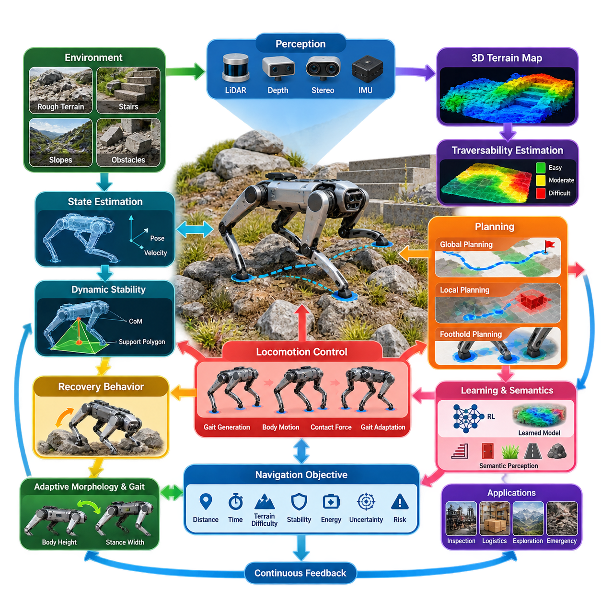
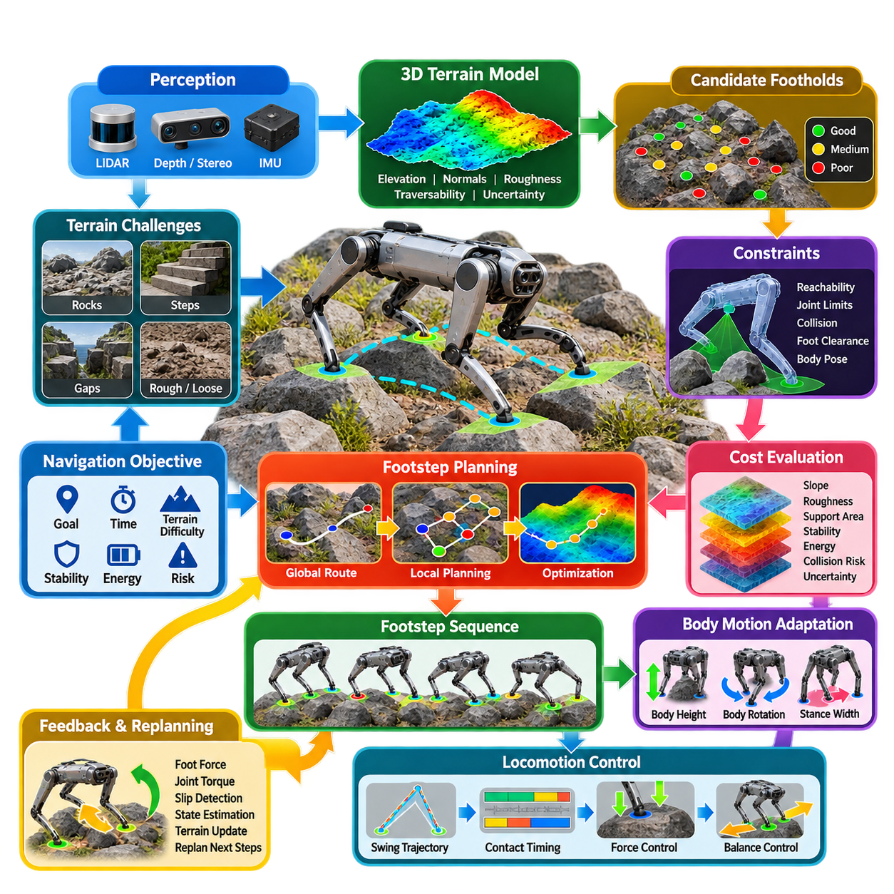
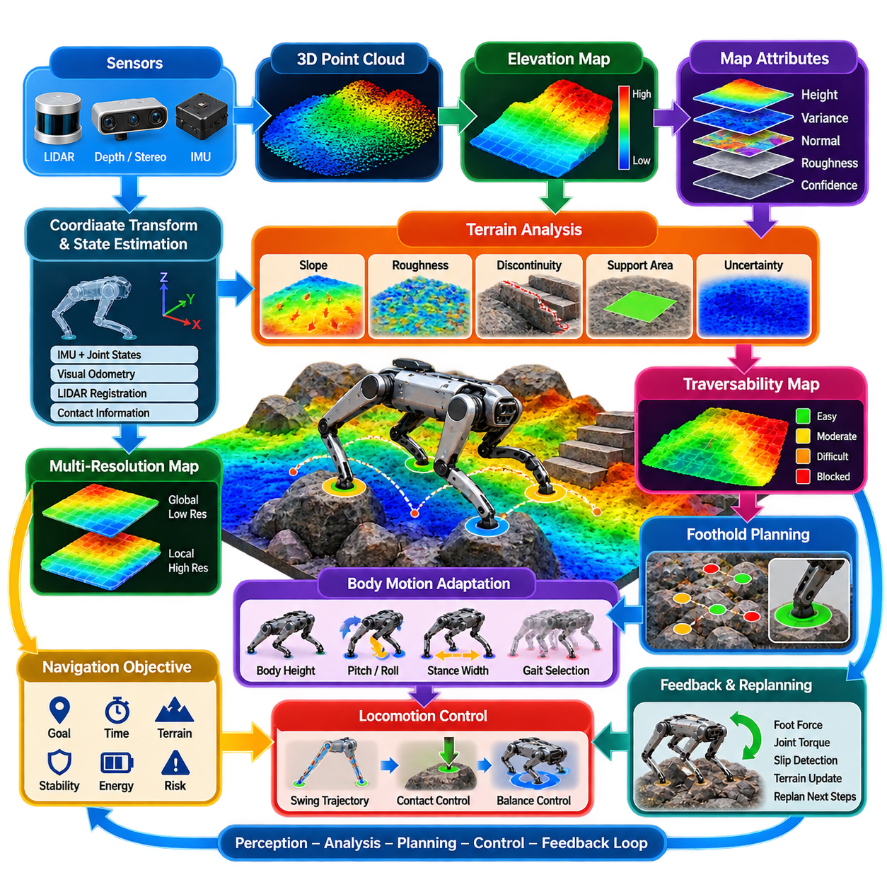
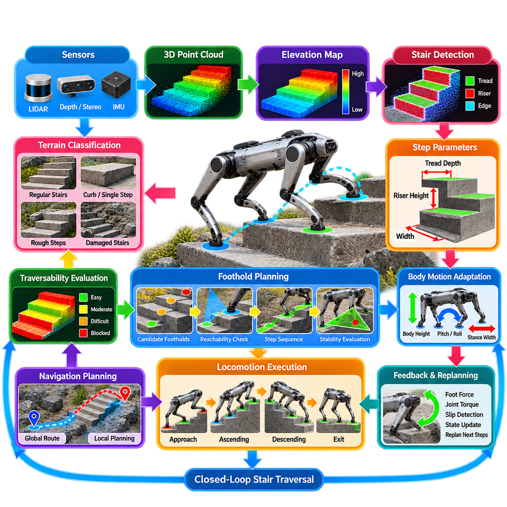
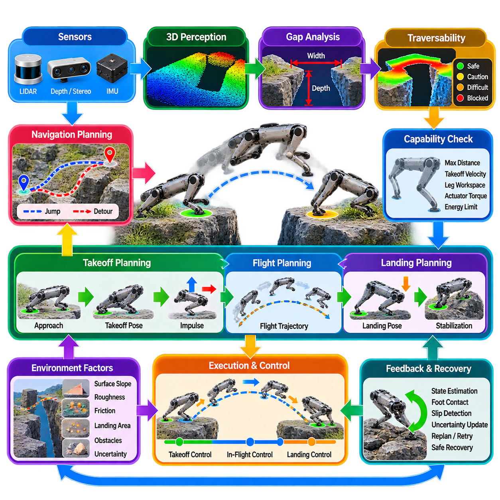
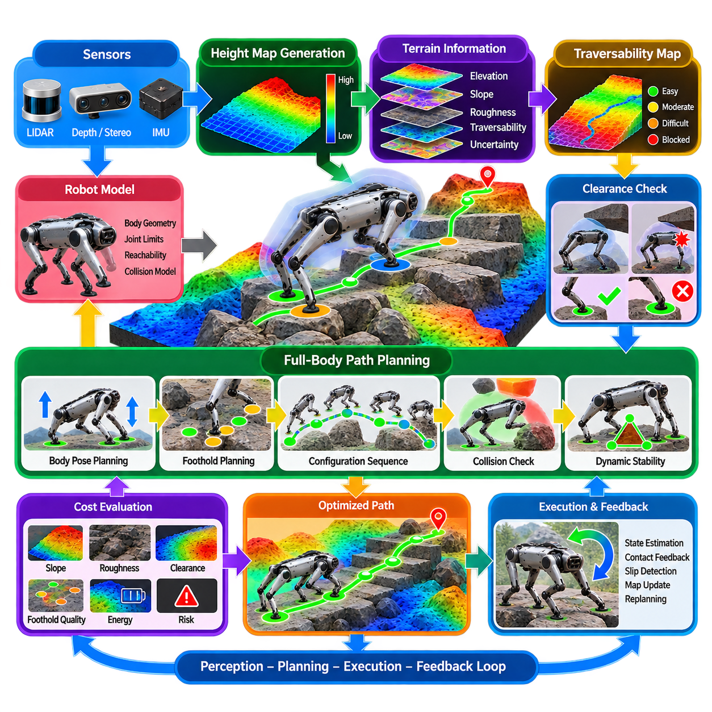
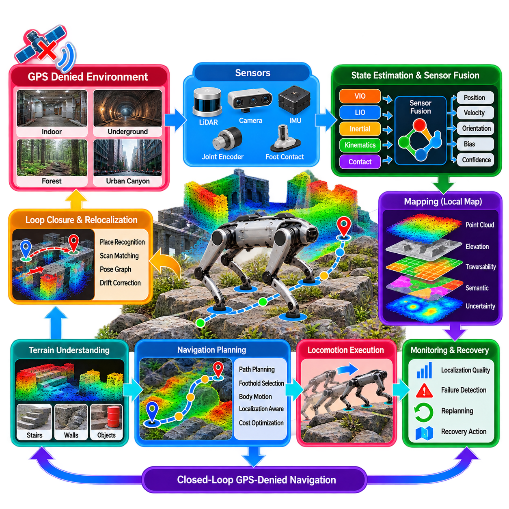
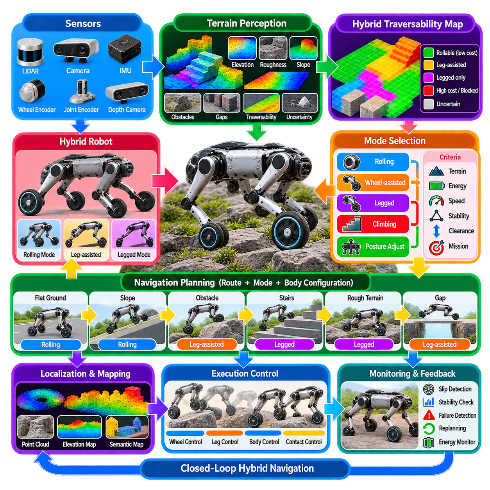
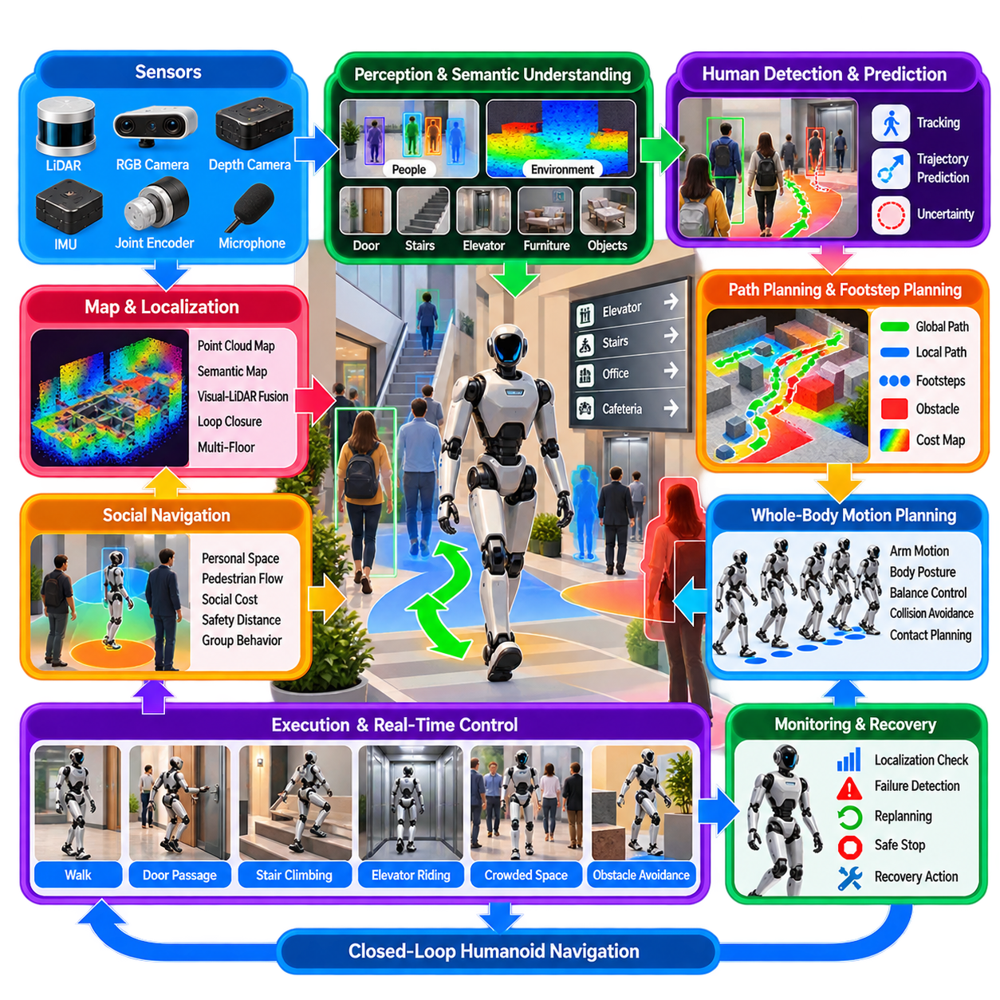
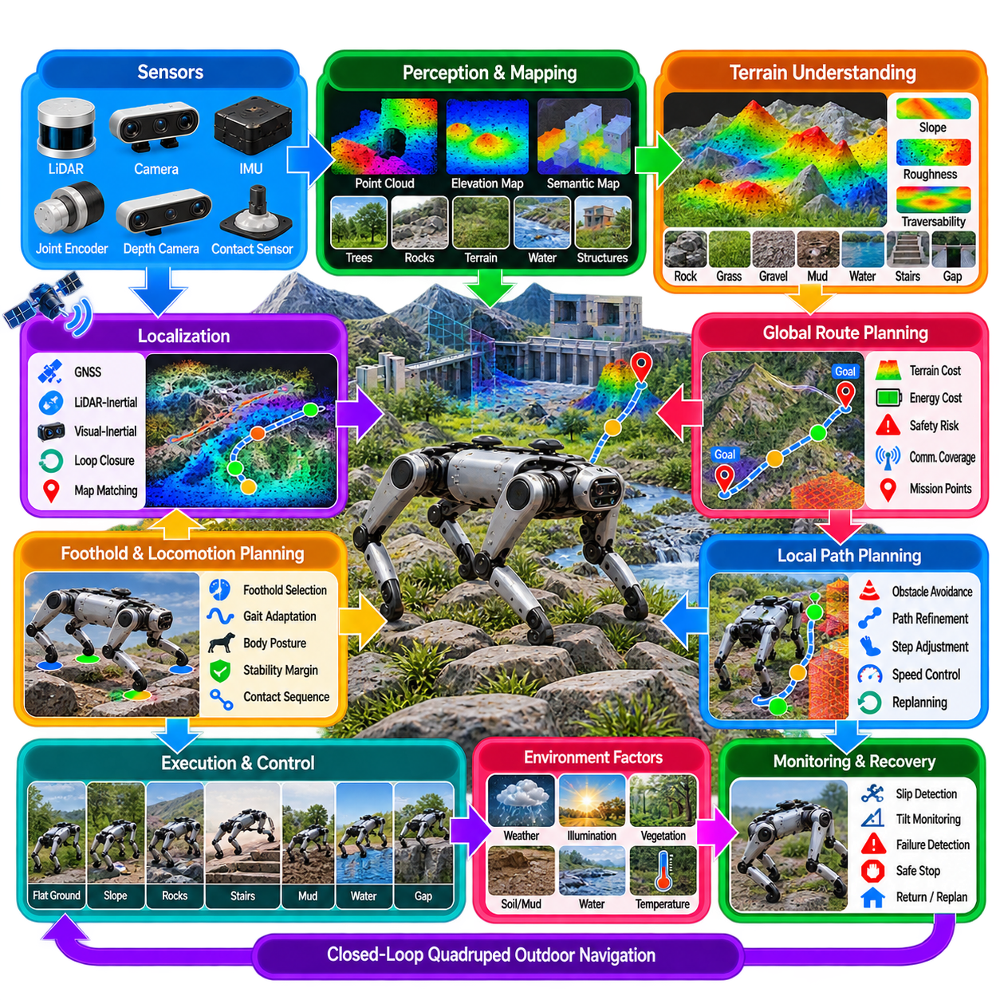

**Volume 15. Motion Planning and Navigation**


# Chapter 11. Legged Robot Navigation

##  

## 11.01. Legged Robot Navigation Unique Challenges and Opportunities

{width="7.268055555555556in" height="7.268055555555556in"}

Legged robot navigation differs fundamentally from wheeled navigation because locomotion and navigation cannot be treated as fully independent problems. A legged robot must decide not only where to move but also how its body and individual feet should interact with the terrain. Every navigation decision therefore depends on terrain geometry, contact stability, body configuration, actuator limits, and the dynamic state of the robot.

The principal challenge is the discontinuous nature of ground contact. Unlike a wheeled platform that normally maintains continuous contact through its tires, a legged robot repeatedly creates and removes contacts while walking. The support region changes during each gait cycle, and disturbances can destabilize the body. Navigation must consequently coordinate global motion objectives with gait generation, foothold selection, balance control, and contact-force regulation.

Terrain traversability is substantially more complex for legged systems than for conventional mobile robots. A region that appears occupied in a two-dimensional costmap may actually be a useful stepping surface, while an apparently free region may contain holes, unstable material, excessive slopes, or geometric structures unsuitable for foot placement. Navigation therefore requires three-dimensional terrain representations that describe elevation, surface orientation, roughness, discontinuities, and expected contact quality.

Perception must provide information at several spatial scales. Long-range sensing identifies corridors, obstacles, slopes, stairs, and alternative routes, whereas short-range perception estimates precise geometry for upcoming footholds. LiDAR, depth cameras, stereo cameras, and inertial sensors are commonly combined to construct local elevation maps or other terrain models. The navigation system must continuously update these representations because body motion can cause significant sensor viewpoint changes.

Traversability estimation converts perceived geometry into information useful for planning. Instead of classifying space simply as free or occupied, the robot estimates whether a region can be crossed safely with its available locomotion capabilities. Factors such as slope angle, step height, surface roughness, foothold area, clearance, friction, and uncertainty may contribute to a traversability cost. This produces a mobility-aware representation of the environment.

Legged navigation naturally introduces multiple planning levels. A global planner can determine a relatively long-range route using terrain and mission information, while a local planner adapts motion to newly observed obstacles and terrain conditions. Below these layers, a locomotion planner generates body trajectories, gait transitions, and feasible footholds. Successful navigation requires these planners to exchange feasibility information rather than operating as completely isolated modules.

Foothold planning is one of the defining differences between legged and wheeled navigation. Candidate foot locations must provide sufficient support while respecting leg workspace, collision constraints, joint limits, and expected contact conditions. Selecting geometrically reachable footholds alone is insufficient because a sequence of individually valid contacts can still create an unstable or dynamically infeasible motion. Foothold evaluation must therefore consider the evolving robot state.

Dynamic stability becomes particularly important when the robot moves rapidly or traverses irregular terrain. Static measures such as the support polygon can be useful during slow motion, but dynamic locomotion requires consideration of momentum, contact forces, center-of-mass motion, and future contact transitions. Model Predictive Control (MPC) and related optimization techniques can predict these quantities over a finite horizon and continuously revise commands as new state estimates arrive.

State estimation is also more difficult because legged locomotion produces vibration, impacts, rapid orientation changes, and intermittent contacts. Inertial Measurement Unit (IMU) data can be fused with joint encoders, contact estimates, visual information, and LiDAR observations to estimate body pose and velocity. Incorrect assumptions about foot contact or slip can introduce significant errors, making robust contact estimation an important component of reliable navigation.

Foot slip and uncertain terrain create additional difficulties in outdoor environments. Mud, gravel, snow, vegetation, wet surfaces, and loose debris may have similar geometric appearances but very different mechanical properties. A robot may therefore need to combine geometric perception with proprioceptive observations such as unexpected foot velocity, contact force, actuator response, or body acceleration. Navigation can then modify speed, gait, footholds, or route selection.

The coupling between navigation and locomotion also creates an important opportunity: the robot can actively adapt its morphology and gait to the environment. It may lower its body beneath an obstacle, increase clearance over vegetation, shorten steps on uncertain terrain, widen its stance for stability, or select a different gait for higher speed. Configuration therefore becomes another planning variable rather than a fixed property of the mobile platform.

Legged robots can exploit terrain that would normally be considered an obstacle by wheeled systems. Stairs, curbs, rocks, narrow passages, discontinuous surfaces, and moderate gaps may become traversable when suitable footholds exist. This changes the meaning of obstacle avoidance. Instead of always planning around geometric obstacles, the system can evaluate whether stepping onto, over, between, or across environmental structures provides a safer or shorter route.

Navigation objectives must nevertheless balance mobility with risk. The shortest route may contain difficult terrain that increases energy consumption, slip probability, actuator loading, or fall risk. A more practical cost function can combine distance, traversal time, terrain difficulty, stability margin, energy demand, localization uncertainty, and recovery capability. Mission requirements determine how these costs should be weighted for inspection, logistics, exploration, or emergency-response applications.

Recovery behavior is especially important because navigation cannot assume that every planned motion will succeed. A foot may fail to establish secure contact, terrain may deform, or an unexpected obstacle may invalidate the planned foothold sequence. The robot should detect degraded conditions and transition to recovery actions such as stopping, widening its stance, replacing a foot, stepping backward, replanning locally, or requesting a new global route.

Learning-based methods provide opportunities to improve the relationship between perception, planning, and locomotion. Reinforcement Learning (RL) can produce terrain-adaptive locomotion policies, while learned traversability models can infer mobility characteristics from visual, geometric, and proprioceptive observations. These approaches can complement model-based planners, but deployment requires careful treatment of uncertainty, out-of-distribution terrain, physical constraints, and safety boundaries.

Semantic information can further improve navigation by allowing the robot to reason about environmental meaning rather than geometry alone. Stairs, doors, grass, pavement, rubble, ramps, and construction materials imply different locomotion strategies even when their local shapes are similar. Combining semantic perception with geometric terrain maps allows navigation costs and locomotion modes to reflect both physical structure and expected interaction properties.

For quadrupeds and other autonomous legged platforms, a robust architecture therefore connects perception, state estimation, terrain mapping, traversability analysis, global planning, local planning, foothold generation, locomotion control, and safety supervision in a continuous feedback loop. Information must flow upward as well as downward: locomotion failures and contact observations should update navigation-level estimates of what terrain is actually traversable.

The major opportunity of legged robot navigation is ultimately the ability to transform environmental complexity from a strict mobility limitation into a planning problem. By jointly reasoning about route, terrain, body configuration, contacts, and dynamics, a legged robot can operate where conventional platforms cannot. Achieving this capability requires navigation to evolve from two-dimensional collision avoidance into an integrated process of perception, prediction, contact planning, and adaptive physical interaction.

다족 로봇 내비게이션(Legged Robot Navigation)은 이동(Locomotion)과 내비게이션(Navigation)을 완전히 독립된 문제로 다룰 수 없다는 점에서 바퀴형 로봇 내비게이션(Wheeled Robot Navigation)과 근본적으로 다르다. 다족 로봇은 어디로 이동할 것인지뿐만 아니라 로봇의 몸체와 개별 발이 지형과 어떻게 상호작용해야 하는지도 결정해야 한다. 따라서 모든 내비게이션 결정은 지형 형상(Terrain Geometry), 접촉 안정성(Contact Stability), 몸체 구성(Body Configuration), 액추에이터 한계(Actuator Limits), 로봇의 동적 상태(Dynamic State)에 영향을 받는다.

가장 중요한 과제는 지면 접촉(Ground Contact)이 불연속적이라는 점이다. 일반적으로 타이어를 통해 지면과 지속적으로 접촉하는 바퀴형 플랫폼(Wheeled Platform)과 달리, 다족 로봇은 보행 과정에서 지면 접촉을 반복적으로 생성하고 해제한다. 각 보행 주기(Gait Cycle)마다 지지 영역(Support Region)이 변화하며 외란(Disturbance)은 몸체를 불안정하게 만들 수 있다. 따라서 내비게이션은 전역 이동 목표(Global Motion Objectives)를 보행 생성(Gait Generation), 발 디딤 위치 선택(Foothold Selection), 균형 제어(Balance Control), 접촉력 조절(Contact-Force Regulation)과 연계해야 한다.

지형 통과 가능성(Terrain Traversability)은 기존 이동 로봇보다 다족 시스템(Legged System)에서 훨씬 복잡하다. 2차원 비용 지도(2D Costmap)에서 점유 영역으로 보이는 위치가 실제로는 유용한 발 디딤 표면(Stepping Surface)이 될 수 있으며, 반대로 자유 공간처럼 보이는 영역에도 구멍, 불안정한 물질, 과도한 경사 또는 발을 놓기에 부적합한 형상이 존재할 수 있다. 따라서 내비게이션에는 고도(Elevation), 표면 방향(Surface Orientation), 거칠기(Roughness), 불연속성(Discontinuity), 예상 접촉 품질(Expected Contact Quality)을 표현하는 3차원 지형 표현(3D Terrain Representation)이 필요하다.

인지(Perception)는 여러 공간적 범위(Spatial Scale)의 정보를 제공해야 한다. 장거리 센싱(Long-Range Sensing)은 통로, 장애물, 경사면, 계단 및 대체 경로를 식별하고, 단거리 인지(Short-Range Perception)는 앞으로 사용할 발 디딤 위치의 정밀한 형상을 추정한다. 라이다(LiDAR), 깊이 카메라(Depth Camera), 스테레오 카메라(Stereo Camera), 관성 센서(Inertial Sensor)를 결합하여 국부 고도 지도(Local Elevation Map) 또는 다른 형태의 지형 모델(Terrain Model)을 구축할 수 있다. 몸체 움직임으로 센서 시점(Sensor Viewpoint)이 크게 변할 수 있으므로 이러한 표현은 지속적으로 갱신되어야 한다.

통과 가능성 추정(Traversability Estimation)은 인식된 지형 형상을 경로 계획에 활용할 수 있는 정보로 변환한다. 단순히 공간을 자유 영역(Free Space)과 점유 영역(Occupied Space)으로 구분하는 대신, 로봇이 보유한 이동 능력(Locomotion Capability)을 이용하여 특정 영역을 안전하게 통과할 수 있는지를 평가한다. 경사각(Slope Angle), 단차 높이(Step Height), 표면 거칠기(Surface Roughness), 발 디딤 면적(Foothold Area), 여유 공간(Clearance), 마찰(Friction), 불확실성(Uncertainty) 등이 통과 비용(Traversability Cost)에 반영될 수 있으며, 이를 통해 이동 능력 인지형 표현(Mobility-Aware Representation)을 생성한다.

다족 로봇 내비게이션은 자연스럽게 여러 단계의 계획 계층(Planning Level)을 형성한다. 전역 계획기(Global Planner)는 지형 및 임무 정보를 사용하여 비교적 장거리 경로를 결정하고, 지역 계획기(Local Planner)는 새롭게 관측된 장애물과 지형 조건에 맞추어 움직임을 조정한다. 그 하위에서는 이동 계획기(Locomotion Planner)가 몸체 궤적(Body Trajectory), 보행 전환(Gait Transition), 실행 가능한 발 디딤 위치(Feasible Foothold)를 생성한다. 성공적인 내비게이션을 위해서는 이러한 계획기들이 완전히 분리되어 동작하는 것이 아니라 실행 가능성 정보(Feasibility Information)를 상호 교환해야 한다.

발 디딤 계획(Foothold Planning)은 다족 로봇과 바퀴형 로봇 내비게이션을 구분하는 핵심적인 차이 중 하나이다. 후보 발 위치(Candidate Foot Location)는 다리 작업 공간(Leg Workspace), 충돌 제약(Collision Constraint), 관절 한계(Joint Limit), 예상 접촉 조건(Expected Contact Condition)을 만족하면서 충분한 지지력을 제공해야 한다. 단순히 기하학적으로 도달 가능한 발 위치를 선택하는 것만으로는 충분하지 않으며, 개별적으로 유효한 접촉의 연속도 전체적으로 불안정하거나 동역학적으로 실행 불가능한 움직임을 만들 수 있다. 따라서 발 디딤 평가는 변화하는 로봇 상태(Robot State)를 함께 고려해야 한다.

동적 안정성(Dynamic Stability)은 로봇이 빠르게 이동하거나 불규칙한 지형을 통과할 때 특히 중요하다. 지지 다각형(Support Polygon)과 같은 정적 지표는 저속 이동에서 유용하지만, 동적 이동(Dynamic Locomotion)에서는 운동량(Momentum), 접촉력(Contact Force), 질량 중심 운동(Center-of-Mass Motion), 미래 접촉 전환(Future Contact Transition)을 고려해야 한다. 모델 예측 제어(Model Predictive Control, MPC)와 관련 최적화 기법(Optimization Technique)은 유한 예측 구간(Finite Horizon)에서 이러한 변수들을 예측하고 새로운 상태 추정값이 입력될 때마다 명령을 지속적으로 수정할 수 있다.

상태 추정(State Estimation) 역시 다족 보행 과정에서 발생하는 진동, 충격, 빠른 자세 변화 및 간헐적인 접촉으로 인해 더욱 어려워진다. 관성 측정 장치(Inertial Measurement Unit, IMU)의 데이터를 관절 인코더(Joint Encoder), 접촉 추정(Contact Estimation), 시각 정보(Visual Information), 라이다 관측(LiDAR Observation)과 융합하여 몸체 위치 및 자세(Body Pose)와 속도를 추정할 수 있다. 발 접촉 또는 미끄러짐(Slip)에 대한 잘못된 가정은 큰 오차를 발생시킬 수 있으므로 강건한 접촉 추정(Robust Contact Estimation)은 신뢰성 높은 내비게이션의 중요한 요소이다.

발 미끄러짐(Foot Slip)과 불확실한 지형(Uncertain Terrain)은 야외 환경에서 추가적인 어려움을 발생시킨다. 진흙, 자갈, 눈, 식생, 젖은 표면 및 느슨한 잔해는 기하학적으로 비슷하게 보이더라도 매우 다른 기계적 특성(Mechanical Property)을 가질 수 있다. 따라서 로봇은 기하학적 인지(Geometric Perception)와 함께 예상하지 못한 발 속도, 접촉력, 액추에이터 응답(Actuator Response), 몸체 가속도와 같은 고유수용성 관측(Proprioceptive Observation)을 결합해야 한다. 이후 내비게이션 시스템은 속도, 보행 패턴, 발 디딤 위치 또는 경로 선택을 조정할 수 있다.

내비게이션과 이동의 결합은 로봇이 환경에 맞추어 자신의 형태(Morphology)와 보행 패턴(Gait)을 능동적으로 조정할 수 있다는 중요한 기회도 제공한다. 로봇은 장애물 아래를 통과하기 위해 몸체를 낮추거나, 식생 위를 이동하기 위해 지상고를 높이거나, 불확실한 지형에서 보폭을 줄이고, 안정성을 위해 자세 폭(Stance Width)을 넓히거나, 높은 속도를 위해 다른 보행 패턴을 선택할 수 있다. 따라서 로봇 구성(Configuration)은 이동 플랫폼의 고정된 특성이 아니라 또 하나의 계획 변수(Planning Variable)가 된다.

다족 로봇은 바퀴형 시스템에서 일반적으로 장애물로 간주되는 지형을 적극적으로 활용할 수 있다. 적절한 발 디딤 위치가 존재한다면 계단, 연석, 바위, 좁은 통로, 불연속 표면 및 중간 크기의 틈도 통과 가능한 영역이 될 수 있다. 이에 따라 장애물 회피(Obstacle Avoidance)의 의미도 달라진다. 로봇은 항상 기하학적 장애물을 우회하는 대신 환경 구조물 위를 밟거나, 넘어가거나, 구조물 사이를 통과하거나, 틈을 건너는 것이 더 안전하고 짧은 경로인지를 평가할 수 있다.

그러나 내비게이션 목표(Navigation Objective)는 이동 능력과 위험(Risk) 사이의 균형을 고려해야 한다. 최단 경로(Shortest Route)는 에너지 소비, 미끄러짐 확률, 액추에이터 부하(Actuator Loading), 추락 위험(Fall Risk)을 증가시키는 어려운 지형을 포함할 수 있다. 보다 실용적인 비용 함수(Cost Function)는 거리, 통과 시간, 지형 난이도, 안정성 여유도(Stability Margin), 에너지 요구량, 위치 추정 불확실성(Localization Uncertainty), 복구 능력(Recovery Capability)을 함께 고려할 수 있다. 검사, 물류, 탐사 또는 긴급 대응과 같은 임무 요구사항에 따라 각 비용의 가중치를 결정해야 한다.

복구 행동(Recovery Behavior)은 계획된 모든 움직임이 성공한다고 가정할 수 없기 때문에 특히 중요하다. 발이 안정적인 접촉을 형성하지 못하거나, 지형이 변형되거나, 예상하지 못한 장애물로 인해 계획된 발 디딤 순서가 무효화될 수 있다. 로봇은 이러한 상태 악화를 감지하고 정지, 자세 폭 확대, 발 재배치(Foot Replacement), 후방 이동, 지역 재계획(Local Replanning), 새로운 전역 경로 요청과 같은 복구 동작으로 전환할 수 있어야 한다.

학습 기반 방법(Learning-Based Method)은 인지, 계획 및 이동 사이의 관계를 향상시킬 수 있는 기회를 제공한다. 강화 학습(Reinforcement Learning, RL)은 지형 적응형 이동 정책(Terrain-Adaptive Locomotion Policy)을 생성할 수 있으며, 학습된 통과 가능성 모델(Learned Traversability Model)은 시각, 기하학 및 고유수용성 관측으로부터 이동 특성을 추론할 수 있다. 이러한 접근법은 모델 기반 계획기(Model-Based Planner)를 보완할 수 있지만 실제 배치에서는 불확실성, 분포 외 지형(Out-of-Distribution Terrain), 물리적 제약(Physical Constraint), 안전 경계(Safety Boundary)를 신중하게 처리해야 한다.

의미 정보(Semantic Information)를 활용하면 로봇이 단순한 기하학적 형상을 넘어 환경의 의미를 추론할 수 있으므로 내비게이션 성능을 더욱 향상시킬 수 있다. 계단, 문, 잔디, 포장도로, 잔해, 경사로 및 건축 자재는 국부적인 형상이 비슷하더라도 서로 다른 이동 전략을 요구할 수 있다. 의미 인지(Semantic Perception)를 기하학적 지형 지도(Geometric Terrain Map)와 결합하면 내비게이션 비용과 이동 모드(Locomotion Mode)에 물리적 구조와 예상 상호작용 특성을 동시에 반영할 수 있다.

4족 보행 로봇(Quadruped Robot)과 기타 자율 다족 플랫폼(Autonomous Legged Platform)을 위한 강건한 구조는 인지(Perception), 상태 추정(State Estimation), 지형 매핑(Terrain Mapping), 통과 가능성 분석(Traversability Analysis), 전역 계획(Global Planning), 지역 계획(Local Planning), 발 디딤 생성(Foothold Generation), 이동 제어(Locomotion Control), 안전 감독(Safety Supervision)을 연속적인 피드백 루프(Feedback Loop)로 연결해야 한다. 또한 정보는 하향식뿐만 아니라 상향식으로도 전달되어야 하며, 이동 실패와 접촉 관측 결과는 실제 지형의 통과 가능성에 대한 내비게이션 수준의 추정을 갱신하는 데 활용되어야 한다.

다족 로봇 내비게이션이 제공하는 가장 중요한 기회는 궁극적으로 복잡한 환경을 단순한 이동 제한 요소가 아니라 계획을 통해 해결할 수 있는 문제로 전환할 수 있다는 점이다. 경로, 지형, 몸체 구성, 접촉 및 동역학(Dynamics)을 통합적으로 추론함으로써 다족 로봇은 기존 이동 플랫폼이 접근하기 어려운 환경에서도 동작할 수 있다. 이러한 능력을 실현하려면 내비게이션은 2차원 충돌 회피(2D Collision Avoidance)를 넘어 인지, 예측(Prediction), 접촉 계획(Contact Planning), 적응형 물리적 상호작용(Adaptive Physical Interaction)을 통합하는 과정으로 발전해야 한다.

##  

## 11.02. Footstep Planning for Rough Terrain Navigation [w/Code]

{width="7.268055555555556in" height="7.268055555555556in"}

Footstep planning is a defining capability of legged robot navigation because the robot cannot move simply by following a continuous ground trajectory. Instead, it must determine a sequence of discrete contact locations for its feet while maintaining balance and satisfying the kinematic and dynamic constraints of the body. On rough terrain, this problem becomes tightly coupled with perception, terrain interpretation, body motion, gait selection, and local navigation.

A rough-terrain environment contains surfaces with different heights, slopes, gaps, rocks, steps, loose materials, and irregular boundaries. A useful terrain representation therefore needs more than an occupancy map. Elevation maps, surface normals, roughness estimates, traversability costs, and uncertainty information can be used to identify candidate footholds. The planner must continuously update this representation because newly observed terrain can invalidate previously selected footholds.

Footstep planning generally begins by generating candidate foothold locations from the local terrain model. A candidate should provide sufficient support area and acceptable surface orientation while remaining reachable by the corresponding leg. The planner also considers nearby obstacles, foot clearance, collision margins, joint limits, and the expected position of the robot body. Candidate generation should therefore be understood as a constrained geometric filtering process rather than simply selecting visually flat points.

Reachability is one of the most important constraints in foothold selection. Each leg has a limited workspace determined by its kinematic structure, joint ranges, current body configuration, and neighboring contacts. A foothold that appears safe from the terrain perspective may be unreachable without moving the body into an undesirable configuration. The planner must evaluate both individual leg reachability and the feasibility of the complete sequence of contacts that will move the robot toward its navigation goal.

Stability must be evaluated over the entire stepping sequence rather than at only one instant. During locomotion, the support polygon changes whenever a foot is lifted or placed, and the center of mass must remain compatible with the available contacts. For dynamic walking, the planner may additionally consider momentum, contact forces, body velocity, and predicted state evolution. This makes foothold planning closely related to whole-body motion planning and model predictive control.

The cost assigned to a foothold should represent more than geometric quality. A practical cost function can combine terrain roughness, surface slope, support area, distance from the nominal step, body stability, expected energy consumption, collision risk, and uncertainty. A slightly longer step onto a large and stable surface may therefore be preferable to a shorter step onto a narrow or uncertain surface. The appropriate weighting depends on whether the mission emphasizes speed, safety, endurance, precision, or terrain coverage.

Step sequencing introduces another level of complexity. Selecting four individually good footholds does not guarantee that the robot can safely transition between them. The sequence must respect the gait pattern, contact timing, leg workspace, body trajectory, and stability requirements. A planner may therefore search through alternative foothold sequences rather than optimizing each foot independently. This transforms foothold planning into a discrete-continuous planning problem involving both contact decisions and continuous body motion.

Body motion and foothold selection should be planned together whenever terrain becomes sufficiently difficult. The robot may need to shift its center of mass, rotate its body, change its height, or modify its stance width to reach a desired foothold. Conversely, the available footholds constrain the body trajectory that can be safely executed. Hierarchical planners commonly separate global route selection, local foothold planning, and low-level locomotion control while maintaining feedback between these layers.

Terrain uncertainty is particularly important in real environments. A depth camera or LiDAR may provide an apparently suitable surface while failing to reveal loose gravel, vegetation, mud, or an unsupported edge. The robot can reduce this uncertainty by incorporating proprioceptive feedback after each contact. Foot force, joint torque, estimated foot velocity, body acceleration, and contact confidence can indicate whether the actual terrain response matches the planned model.

Footstep planning must also account for dynamic obstacles and changing terrain. A foothold that was valid when initially selected may become unavailable because of another robot, a person, moving equipment, or newly revealed terrain. Local replanning should therefore operate continuously rather than treating the footstep sequence as a fixed trajectory. When conditions change significantly, the system can modify upcoming footholds while preserving already established contacts and maintaining a feasible transition.

Optimization-based methods provide a systematic framework for this problem. A planner can formulate foothold selection as an objective subject to terrain, kinematic, collision, stability, and timing constraints. Mixed-integer optimization, nonlinear programming, graph search, sampling-based planning, and model predictive approaches can all be applied depending on computational requirements. In practice, hierarchical combinations are often useful because global planning requires efficiency while local foothold decisions require detailed geometric reasoning.

Learning-based approaches can complement explicit foothold planners by estimating which terrain regions are likely to provide successful contacts. A learned model can use terrain appearance, geometry, previous contact outcomes, and proprioceptive information to predict foothold quality or slip probability. Reinforcement learning can also learn locomotion behaviors that implicitly adapt foot placement. However, learned predictions should remain bounded by explicit kinematic, collision, stability, and safety constraints when operating on physical robots.

The final foothold plan must be converted into executable locomotion commands. The locomotion controller determines swing trajectories, foot velocities, contact timing, body stabilization, and contact forces while tracking the planned sequence. During execution, deviations between the expected and measured robot state are fed back to the planner. This creates a closed-loop process in which planning proposes contacts, locomotion executes them, perception observes the result, and the next footholds are continuously revised.

For rough-terrain navigation, the most effective architecture is therefore not a simple foot-placement module but an integrated terrain-aware planning loop. Perception builds a three-dimensional terrain model, traversability estimation identifies suitable regions, foothold generation produces candidates, constrained planning selects feasible contacts, and locomotion control executes them while monitoring stability and contact quality. Navigation can then adapt its route when the terrain proves more difficult than initially expected.

The central objective of footstep planning is to transform irregular terrain from an uncontrolled obstacle field into a sequence of physically feasible decisions. A successful planner does not merely ask where a foot can be placed; it asks whether that placement contributes to a stable, reachable, collision-free, energy-efficient, and recoverable sequence of movements. This integration of terrain understanding, discrete contact planning, continuous body motion, and closed-loop feedback is what enables legged robots to navigate reliably beyond the limitations of conventional wheeled platforms.

발 디딤 계획(Footstep Planning)은 다족 로봇 내비게이션(Legged Robot Navigation)을 구성하는 핵심 능력이다. 다족 로봇은 단순히 연속적인 지면 경로를 따라 이동할 수 없으며, 균형을 유지하면서 발의 개별적인 접촉 위치(Contact Location)를 순차적으로 결정해야 한다. 거친 지형(Rough Terrain)에서는 이 문제가 인지(Perception), 지형 해석(Terrain Interpretation), 몸체 움직임(Body Motion), 보행 선택(Gait Selection), 지역 내비게이션(Local Navigation), 그리고 로봇의 운동학적·동역학적 제약과 긴밀하게 결합된다.

거친 지형 환경에는 서로 다른 높이, 경사, 틈, 바위, 단차, 느슨한 물질 및 불규칙한 경계가 존재한다. 따라서 유용한 지형 표현(Terrain Representation)은 단순한 점유 지도(Occupancy Map) 이상의 정보를 필요로 한다. 고도 지도(Elevation Map), 표면 법선(Surface Normal), 거칠기 추정(Roughness Estimation), 통과 가능성 비용(Traversability Cost), 불확실성 정보(Uncertainty Information) 등을 사용하여 후보 발 디딤 위치(Foothold)를 식별할 수 있다. 새롭게 관측된 지형이 기존 발 디딤 위치를 무효화할 수 있으므로 로봇은 이러한 표현을 지속적으로 갱신해야 한다.

발 디딤 계획은 일반적으로 지역 지형 모델(Local Terrain Model)에서 후보 발 디딤 위치를 생성하는 것부터 시작한다. 후보 위치는 충분한 지지 면적(Support Area)과 허용 가능한 표면 방향을 제공하면서 해당 다리가 도달할 수 있어야 한다. 또한 계획기는 주변 장애물, 발의 통과 여유 공간(Foot Clearance), 충돌 여유도(Collision Margin), 관절 한계(Joint Limit), 예상되는 로봇 몸체 위치를 고려한다. 따라서 후보 생성은 단순히 시각적으로 평평한 지점을 선택하는 것이 아니라 제약 조건에 따른 기하학적 필터링 과정(Constrained Geometric Filtering Process)으로 이해해야 한다.

도달 가능성(Reachability)은 발 디딤 위치를 선택할 때 가장 중요한 제약 중 하나이다. 각 다리는 다리의 운동학적 구조, 관절 범위, 현재 몸체 구성, 인접한 접촉 상태에 의해 결정되는 제한된 작업 공간(Workspace)을 갖는다. 지형 관점에서 안전해 보이는 발 디딤 위치도 몸체를 바람직하지 않은 구성으로 이동시키지 않고는 도달할 수 없을 수 있다. 따라서 계획기는 개별 다리의 도달 가능성뿐만 아니라 전체 접촉 순서가 로봇을 내비게이션 목표 방향으로 이동시키는 데 실행 가능한지도 평가해야 한다.

안정성(Stability)은 특정 한 순간이 아니라 전체 발 디딤 순서에 걸쳐 평가되어야 한다. 이동 중에는 발이 들어 올려지거나 내려놓일 때마다 지지 다각형(Support Polygon)이 변화하며, 질량 중심(Center of Mass)은 현재 이용 가능한 접촉 상태와 양립할 수 있어야 한다. 동적 보행(Dynamic Walking)에서는 운동량(Momentum), 접촉력(Contact Force), 몸체 속도(Body Velocity), 예측된 상태 변화(State Evolution)까지 고려할 수 있다. 따라서 발 디딤 계획은 전신 움직임 계획(Whole-Body Motion Planning) 및 모델 예측 제어(Model Predictive Control)와 밀접하게 연결된다.

발 디딤 위치에 부여되는 비용(Cost)은 단순한 기하학적 품질만을 나타내서는 안 된다. 실제적인 비용 함수(Cost Function)는 지형 거칠기, 표면 경사, 지지 면적, 기준 보폭(Nominal Step)으로부터의 거리, 몸체 안정성, 예상 에너지 소비, 충돌 위험, 불확실성을 함께 반영할 수 있다. 따라서 조금 더 긴 보폭을 필요로 하더라도 넓고 안정적인 표면에 발을 디디는 것이 좁거나 불확실한 표면에 짧게 발을 디디는 것보다 바람직할 수 있다. 각 비용의 적절한 가중치는 속도, 안전성, 지속 시간, 정밀도 또는 지형 커버리지 중 어떤 것을 임무가 중시하는지에 따라 결정된다.

보폭 순서(Step Sequencing)는 또 다른 수준의 복잡성을 추가한다. 개별적으로 좋은 네 개의 발 디딤 위치를 선택했다고 해서 로봇이 그 위치들 사이를 안전하게 이동할 수 있다는 보장은 없다. 순서는 보행 패턴(Gait Pattern), 접촉 타이밍(Contact Timing), 다리 작업 공간(Leg Workspace), 몸체 궤적(Body Trajectory), 안정성 조건을 만족해야 한다. 따라서 계획기는 각 발을 독립적으로 최적화하기보다는 여러 발 디딤 위치의 대체 순서를 탐색할 수 있다. 이 과정은 접촉 결정(Contact Decision)과 연속적인 몸체 움직임(Continuous Body Motion)을 함께 다루는 이산-연속 계획 문제(Discrete-Continuous Planning Problem)로 확장된다.

지형이 충분히 복잡해지면 몸체 움직임과 발 디딤 위치를 함께 계획해야 한다. 로봇은 원하는 발 디딤 위치에 도달하기 위해 질량 중심을 이동하거나, 몸체를 회전시키거나, 몸체 높이를 변경하거나, 자세 폭(Stance Width)을 조정해야 할 수 있다. 반대로 사용 가능한 발 디딤 위치가 안전하게 실행할 수 있는 몸체 궤적을 제한한다. 계층형 계획기(Hierarchical Planner)는 일반적으로 전역 경로 선택(Global Route Selection), 지역 발 디딤 계획(Local Foothold Planning), 저수준 이동 제어(Low-Level Locomotion Control)를 분리하지만, 이들 계층 사이에는 지속적인 피드백이 유지되어야 한다.

실제 환경에서는 지형 불확실성(Terrain Uncertainty)이 특히 중요하다. 깊이 카메라(Depth Camera)나 라이다(LiDAR)가 적합해 보이는 표면을 제공하더라도 느슨한 자갈, 식생, 진흙 또는 지지되지 않는 가장자리를 정확히 식별하지 못할 수 있다. 로봇은 각 접촉 이후 고유수용성 피드백(Proprioceptive Feedback)을 활용하여 이러한 불확실성을 줄일 수 있다. 발의 힘(Foot Force), 관절 토크(Joint Torque), 추정 발 속도(Estimated Foot Velocity), 몸체 가속도(Body Acceleration), 접촉 신뢰도(Contact Confidence)는 실제 지형의 반응이 계획된 모델과 일치하는지를 판단하는 데 활용될 수 있다.

발 디딤 계획은 동적 장애물(Dynamic Obstacle)과 변화하는 지형도 고려해야 한다. 처음 선택했을 때 유효했던 발 디딤 위치가 다른 로봇, 사람, 이동 장비 또는 새롭게 발견된 지형 때문에 사용할 수 없게 될 수 있다. 따라서 지역 재계획(Local Replanning)은 발 디딤 순서를 고정된 궤적으로 취급하기보다는 지속적으로 수행되어야 한다. 환경 조건이 크게 변하면 시스템은 이미 형성된 접촉을 유지하면서 향후 발 디딤 위치를 수정하고 실행 가능한 전환 상태를 유지할 수 있다.

최적화 기반 방법(Optimization-Based Method)은 이 문제를 체계적으로 다룰 수 있는 프레임워크를 제공한다. 계획기는 지형, 운동학, 충돌, 안정성, 타이밍 제약을 만족하면서 발 디딤 위치를 선택하는 목적 함수를 구성할 수 있다. 혼합정수 최적화(Mixed-Integer Optimization), 비선형 계획(Nonlinear Programming), 그래프 탐색(Graph Search), 샘플링 기반 계획(Sampling-Based Planning), 모델 예측 기반 접근법(Model Predictive Approach) 등을 계산 요구사항에 따라 적용할 수 있다. 실제 시스템에서는 전역 계획에는 효율성이 필요하고 지역 발 디딤 결정에는 상세한 기하학적 추론이 필요하기 때문에 이러한 방법을 계층적으로 결합하는 방식이 유용하다.

학습 기반 접근법(Learning-Based Approach)은 명시적인 발 디딤 계획기를 보완하여 어떤 지형 영역이 성공적인 접촉을 제공할 가능성이 높은지를 추정할 수 있다. 학습 모델(Learned Model)은 지형의 외관, 형상, 이전 접촉 결과, 고유수용성 정보를 이용하여 발 디딤 품질(Foothold Quality)이나 미끄러짐 확률(Slip Probability)을 예측할 수 있다. 강화 학습(Reinforcement Learning, RL)은 발 디딤 위치를 암묵적으로 조정하는 이동 행동을 학습할 수도 있다. 그러나 실제 로봇에서는 학습된 예측 결과가 명시적인 운동학, 충돌, 안정성 및 안전 제약으로 제한되어야 한다.

최종 발 디딤 계획은 실행 가능한 이동 명령(Locomotion Command)으로 변환되어야 한다. 이동 제어기(Locomotion Controller)는 계획된 순서를 추적하면서 스윙 궤적(Swing Trajectory), 발 속도(Foot Velocity), 접촉 타이밍(Contact Timing), 몸체 안정화(Body Stabilization), 접촉력을 결정한다. 실행 중에는 예상된 로봇 상태와 측정된 로봇 상태 사이의 차이가 계획기로 피드백된다. 이를 통해 계획기는 접촉 위치를 제안하고, 이동 제어기는 이를 실행하며, 인지 시스템은 결과를 관측하고, 다음 발 디딤 위치를 지속적으로 수정하는 폐루프 과정(Closed-Loop Process)이 형성된다.

거친 지형 내비게이션을 위해 가장 효과적인 구조는 단순한 발 위치 결정 모듈이 아니라 통합된 지형 인지형 계획 루프(Terrain-Aware Planning Loop)이다. 인지 시스템은 3차원 지형 모델을 구축하고, 통과 가능성 추정(Traversability Estimation)은 적합한 영역을 식별하며, 발 디딤 생성(Foothold Generation)은 후보를 만들고, 제약 기반 계획(Constrained Planning)은 실행 가능한 접촉을 선택하며, 이동 제어는 안정성과 접촉 품질을 모니터링하면서 이를 실행한다. 이후 지형이 처음 예상했던 것보다 어렵다는 것이 확인되면 내비게이션은 경로를 조정할 수 있다.

발 디딤 계획의 핵심 목표는 불규칙한 지형을 통제할 수 없는 장애물 영역에서 물리적으로 실행 가능한 일련의 의사결정 문제로 전환하는 것이다. 성공적인 계획기는 단순히 발을 어디에 놓을 수 있는지를 묻는 것이 아니라, 해당 발 디딤이 안정적이고 도달 가능하며 충돌이 없고 에너지 효율적이며 복구 가능한 움직임의 연속 과정에 기여하는지를 판단해야 한다. 지형 이해(Terrain Understanding), 이산적 접촉 계획(Discrete Contact Planning), 연속적인 몸체 움직임(Continuous Body Motion), 폐루프 피드백(Closed-Loop Feedback)을 통합하는 이러한 접근이 다족 로봇이 기존 바퀴형 플랫폼의 한계를 넘어 안정적으로 이동할 수 있도록 한다.

##  

## 11.03. Elevation Map Based Terrain Analysis [w/Code]

{width="7.268055555555556in" height="7.268055555555556in"}

An elevation map is a fundamental representation for terrain-aware navigation because it describes the three-dimensional structure of the ground rather than treating the environment as a flat occupancy space. For a legged robot, elevation information is especially important because changes in height directly affect foothold selection, body posture, leg reachability, stability, and locomotion strategy. Elevation maps therefore provide an intermediate representation between raw perception data and motion planning.

An elevation map typically divides the surrounding terrain into a two-dimensional grid in which each cell stores an estimated ground height. The map can be constructed from LiDAR, depth cameras, stereo vision, or fused sensor observations. In addition to mean elevation, practical systems may maintain variance, observation count, surface normal, roughness, and temporal confidence. These additional attributes allow the planner to distinguish between well-observed stable terrain and geometrically uncertain regions.

The quality of an elevation map depends strongly on coordinate transformation and state estimation. Sensor measurements must be transformed from the robot or sensor frame into a consistent terrain frame using an accurate estimate of robot pose. Errors in roll, pitch, or vertical position can introduce artificial slopes and height discontinuities across the map. For legged robots, IMU measurements, joint states, visual odometry, LiDAR registration, and contact information can therefore be combined to maintain a stable terrain representation.

Unlike a static map, an elevation map for autonomous navigation should normally be local and continuously updated. As the robot moves, new terrain enters the sensor field of view while previously observed regions become less relevant. A rolling local map can maintain a fixed spatial area around the robot and update its cells using incoming observations. This approach limits computational cost while preserving the high-resolution terrain information required for local footstep planning and obstacle avoidance.

Terrain analysis begins by extracting geometric properties from the elevation data. Local gradients can estimate surface slope, while neighboring height differences reveal steps, edges, holes, and discontinuities. Surface normals provide information about the orientation of potential footholds, and local height variance can indicate roughness or measurement uncertainty. These geometric features transform a basic elevation map into a terrain description that can support navigation and locomotion decisions.

Slope is one of the most direct terrain characteristics derived from an elevation map. A moderate slope may be traversable, whereas a steep surface can exceed the robot\'s locomotion capability or create insufficient stability margins. However, slope should not be evaluated independently. A steep but broad and uniform surface may be safer than a nearly flat region covered with small unstable rocks. Terrain analysis should therefore combine slope with roughness, support area, contact geometry, and robot-specific mobility constraints.

Roughness estimation evaluates how irregular the terrain is within a local neighborhood. Height variance, residual error from a fitted plane, local curvature, or other geometric statistics can be used to characterize surface irregularity. Rough terrain does not automatically mean non-traversable terrain for a legged robot, because individual feet can often adapt to local height variations. The purpose of roughness estimation is instead to quantify the additional locomotion difficulty and provide useful information for foothold selection.

Elevation maps can also identify terrain discontinuities that are difficult to represent in conventional two-dimensional costmaps. Sudden height changes may indicate stairs, curbs, ledges, trenches, or large rocks. The planner can determine whether such structures should be avoided, crossed, stepped onto, or incorporated into a different locomotion strategy. This is particularly valuable for legged robots because vertical terrain structure can become a usable mobility feature rather than simply an obstacle.

Uncertainty is an essential component of elevation-map-based terrain analysis. Sparse LiDAR returns, reflective surfaces, vegetation, occlusion, sensor noise, and motion-induced distortion can produce unreliable elevation estimates. A planner should therefore distinguish between terrain that is known to be unsuitable and terrain whose suitability is simply unknown. Confidence-aware planning can avoid excessively optimistic decisions while preventing unnecessary avoidance of areas that may become traversable after additional observation.

Temporal information can further improve terrain interpretation. Multiple observations of the same region can be compared to determine whether a surface is stable or changing. A persistent elevation estimate provides greater confidence than a single measurement, while inconsistent observations may indicate moving objects, vegetation, deformable materials, or sensor artifacts. Temporal filtering must nevertheless be designed carefully so that rapidly changing obstacles are not incorrectly treated as stable terrain.

For legged navigation, elevation analysis should ultimately produce a traversability representation. Each terrain cell can be assigned a cost based on characteristics such as slope, roughness, elevation discontinuity, support area, clearance, uncertainty, and expected contact quality. Robot-specific constraints can then transform generic terrain geometry into mobility-aware information. The same elevation map may consequently produce different traversability costs for a quadruped, humanoid, wheeled robot, or tracked vehicle.

The elevation map also provides a foundation for foothold planning. Candidate foot locations can be sampled from cells with appropriate height, surface orientation, support area, and confidence. The planner can then evaluate whether each candidate is reachable by the corresponding leg and whether the resulting sequence maintains stability. This creates a direct connection between terrain perception and discrete contact planning, allowing the robot to use detailed local terrain geometry instead of relying only on a predefined global path.

Body motion can also be influenced by elevation-map analysis. When the terrain changes rapidly, the robot may adjust body height, pitch, roll, stance width, step length, or gait selection. A terrain map can therefore provide information not only about where the robot should place its feet but also about how the body should move while crossing the terrain. This enables coordinated planning in which route selection, foothold placement, and body configuration respond to the same environmental representation.

Elevation-map-based analysis becomes particularly powerful when integrated with semantic and learned terrain models. Geometry can determine the physical structure of a surface, while semantic perception can identify grass, pavement, stairs, gravel, mud, or other terrain categories. Learning-based models can combine appearance, geometry, and previous contact outcomes to estimate traversability or slip probability. The resulting representation can support more adaptive decisions while retaining explicit geometric constraints for physical safety.

A robust implementation must also consider computational efficiency and map resolution. High-resolution maps provide detailed foothold information but require greater memory, sensor-processing capacity, and planning computation. Coarser maps are efficient for longer-range terrain reasoning but may hide small obstacles or suitable stepping surfaces. A multi-resolution representation can therefore use coarse terrain information for broader navigation decisions and high-resolution elevation data for local foothold planning and locomotion control.

The complete process can be viewed as a continuous perception-to-action loop. Sensor observations are transformed into a consistent coordinate frame, fused into an elevation map, analyzed for slope, roughness, discontinuities, and uncertainty, and converted into traversability information. Navigation and footstep planners use this information to select routes and contacts, while locomotion execution generates new observations and proprioceptive feedback. These observations then update the map and trigger replanning when the actual terrain differs from the predicted model.

The central value of elevation-map-based terrain analysis is that it converts raw three-dimensional observations into a structured representation that can directly support physical decision-making. For a legged robot, the map is not merely a visualization of the ground surface; it is a computational model of where the robot can step, how difficult the terrain may be, and how its body should adapt. When combined with uncertainty estimation, traversability analysis, foothold planning, and closed-loop locomotion control, the elevation map becomes a core component of reliable rough-terrain navigation.

고도 지도(Elevation Map)는 환경을 평면적인 점유 공간(Occupancy Space)으로만 다루지 않고 지면의 3차원 구조를 표현하기 때문에 지형 인지형 내비게이션(Terrain-Aware Navigation)을 위한 핵심 표현 방식이다. 다족 로봇(Legged Robot)에서는 고도 정보가 발 디딤 위치(Foothold) 선택, 몸체 자세(Body Posture), 다리 도달 가능성(Leg Reachability), 안정성(Stability), 이동 전략(Locomotion Strategy)에 직접적인 영향을 미치기 때문에 특히 중요하다. 따라서 고도 지도는 원시 인지 데이터(Raw Perception Data)와 움직임 계획(Motion Planning) 사이를 연결하는 중간 표현(Intermediate Representation)으로 활용된다.

고도 지도는 일반적으로 주변 지형을 2차원 격자(2D Grid)로 나누고 각 셀(Cell)에 추정된 지면 높이(Ground Height)를 저장하는 방식으로 구성된다. 지도는 라이다(LiDAR), 깊이 카메라(Depth Camera), 스테레오 비전(Stereo Vision) 또는 여러 센서 관측값을 융합하여 구축할 수 있다. 실제 시스템에서는 평균 고도(Mean Elevation)뿐만 아니라 분산(Variance), 관측 횟수(Observation Count), 표면 법선(Surface Normal), 거칠기(Roughness), 시간적 신뢰도(Temporal Confidence) 등을 함께 관리할 수 있다. 이러한 추가 속성은 충분히 관측된 안정적인 지형과 기하학적으로 불확실한 영역을 구분할 수 있도록 한다.

고도 지도의 품질은 좌표 변환(Coordinate Transformation)과 상태 추정(State Estimation)에 크게 의존한다. 센서 측정값은 정확한 로봇 자세(Robot Pose) 추정값을 이용하여 로봇 또는 센서 좌표계(Sensor Frame)에서 일관된 지형 좌표계(Terrain Frame)로 변환되어야 한다. 롤(Roll), 피치(Pitch), 수직 위치(Vertical Position)에 발생하는 오차는 지도상에 실제로 존재하지 않는 경사나 고도 불연속을 만들어낼 수 있다. 따라서 다족 로봇에서는 IMU 측정값, 관절 상태(Joint State), 시각 주행거리 추정(Visual Odometry), 라이다 정합(LiDAR Registration), 접촉 정보(Contact Information)를 결합하여 안정적인 지형 표현을 유지할 수 있다.

자율 내비게이션(Autonomous Navigation)을 위한 고도 지도는 일반적으로 정적 지도(Static Map)가 아니라 지역 지도(Local Map) 형태로 지속적으로 갱신되는 것이 바람직하다. 로봇이 이동함에 따라 새로운 지형이 센서의 시야에 들어오고 기존에 관측했던 영역은 점차 중요성이 감소한다. 이동형 지역 지도(Rolling Local Map)는 로봇 주변의 일정한 공간 영역을 유지하면서 입력되는 새로운 관측값으로 셀을 갱신할 수 있다. 이러한 방식은 계산 비용(Computational Cost)을 제한하면서도 지역 발 디딤 계획(Local Footstep Planning)과 장애물 회피(Obstacle Avoidance)에 필요한 고해상도 지형 정보를 유지할 수 있다.

지형 분석(Terrain Analysis)은 고도 데이터에서 기하학적 특성(Geometric Property)을 추출하는 것부터 시작한다. 지역적인 기울기(Local Gradient)는 지표면 경사(Surface Slope)를 추정할 수 있으며, 인접한 셀 사이의 높이 차이는 단차(Step), 가장자리(Edge), 구멍(Hole), 불연속(Discontinuity)을 나타낼 수 있다. 표면 법선은 잠재적인 발 디딤 위치의 방향을 제공하고, 국부적인 고도 분산은 거칠기 또는 측정 불확실성(Measurement Uncertainty)을 나타낼 수 있다. 이러한 기하학적 특징을 통해 기본적인 고도 지도를 내비게이션과 이동 의사결정에 활용할 수 있는 지형 표현으로 발전시킬 수 있다.

경사(Slope)는 고도 지도에서 직접적으로 도출할 수 있는 가장 중요한 지형 특성 중 하나이다. 적당한 경사는 통과 가능하지만 지나치게 가파른 표면은 로봇의 이동 능력(Locomotion Capability)을 초과하거나 충분한 안정성 여유도(Stability Margin)를 제공하지 못할 수 있다. 그러나 경사만 독립적으로 평가해서는 안 된다. 가파르더라도 넓고 균일한 표면이 작은 불안정한 바위로 덮인 거의 평평한 영역보다 안전할 수 있다. 따라서 지형 분석은 경사를 거칠기, 지지 면적(Support Area), 접촉 형상(Contact Geometry), 로봇의 이동 제약(Mobility Constraint)과 함께 평가해야 한다.

거칠기 추정(Roughness Estimation)은 지역적인 주변 영역에서 지형이 얼마나 불규칙한지를 평가한다. 고도 분산(Height Variance), 평면 적합(Plane Fitting)으로부터의 잔차 오차(Residual Error), 국부 곡률(Local Curvature) 또는 기타 기하학적 통계량을 사용하여 표면의 불규칙성을 특성화할 수 있다. 다족 로봇에서는 개별 발이 국부적인 높이 변화를 적응적으로 대응할 수 있기 때문에 거친 지형이 반드시 통과 불가능한 지형을 의미하지는 않는다. 거칠기 추정의 목적은 추가적인 이동 난이도를 정량화하고 발 디딤 위치 선택에 유용한 정보를 제공하는 데 있다.

고도 지도는 기존의 2차원 비용 지도(2D Costmap)로 표현하기 어려운 지형 불연속도 식별할 수 있다. 급격한 높이 변화는 계단(Stair), 연석(Curb), 낭떠러지(Ledge), 도랑(Trench), 큰 바위(Large Rock)를 나타낼 수 있다. 계획기는 이러한 구조물을 회피해야 하는지, 넘어야 하는지, 올라가야 하는지 또는 다른 이동 전략에 포함해야 하는지를 판단할 수 있다. 이는 다족 로봇에서 특히 중요하다. 수직 방향의 지형 구조가 단순한 장애물이 아니라 활용 가능한 이동 특성(Mobility Feature)이 될 수 있기 때문이다.

불확실성(Uncertainty)은 고도 지도 기반 지형 분석에서 필수적인 요소이다. 희소한 라이다 반환(Sparse LiDAR Return), 반사율이 높은 표면, 식생, 가림(Occlusion), 센서 노이즈(Sensor Noise), 움직임으로 인한 왜곡(Motion-Induced Distortion)은 신뢰하기 어려운 고도 추정값을 생성할 수 있다. 따라서 계획기는 지형이 부적합하다는 사실이 알려진 영역과 단순히 적합성을 알 수 없는 영역을 구분해야 한다. 신뢰도 인지형 계획(Confidence-Aware Planning)은 지나치게 낙관적인 결정을 방지하면서 추가 관측을 통해 통과 가능성이 확인될 수 있는 영역을 불필요하게 회피하는 것도 방지할 수 있다.

시간 정보(Temporal Information)를 활용하면 지형 해석을 더욱 향상시킬 수 있다. 동일한 영역에 대한 여러 관측값을 비교하면 표면이 안정적인지 또는 변화하고 있는지를 판단할 수 있다. 지속적으로 유지되는 고도 추정값은 단일 측정값보다 높은 신뢰도를 제공하는 반면, 서로 일치하지 않는 관측값은 이동 물체, 식생, 변형 가능한 물질(Deformable Material) 또는 센서 이상(Sensor Artifact)을 나타낼 수 있다. 그러나 시간 필터링(Temporal Filtering)은 빠르게 움직이는 장애물을 안정적인 지형으로 잘못 판단하지 않도록 신중하게 설계되어야 한다.

다족 내비게이션에서 고도 분석은 궁극적으로 통과 가능성 표현(Traversability Representation)을 생성해야 한다. 각 지형 셀에는 경사, 거칠기, 고도 불연속, 지지 면적, 여유 공간(Clearance), 불확실성, 예상 접촉 품질(Expected Contact Quality) 등의 특성을 기반으로 비용을 부여할 수 있다. 이후 로봇 고유의 제약 조건을 적용하여 일반적인 지형 형상을 이동 능력 인지형 정보(Mobility-Aware Information)로 변환할 수 있다. 따라서 동일한 고도 지도라도 4족 로봇(Quadruped), 휴머노이드(Humanoid), 바퀴형 로봇(Wheeled Robot), 궤도형 차량(Tracked Vehicle)에 대해 서로 다른 통과 비용을 생성할 수 있다.

고도 지도는 발 디딤 계획(Foothold Planning)을 위한 기반도 제공한다. 적절한 높이, 표면 방향, 지지 면적, 신뢰도를 가진 셀에서 후보 발 위치(Candidate Foot Location)를 생성할 수 있다. 이후 계획기는 각 후보 위치가 해당 다리로 도달 가능한지를 평가하고, 그 결과로 생성되는 접촉 순서가 안정성을 유지하는지를 판단할 수 있다. 이를 통해 지형 인지와 이산적 접촉 계획(Discrete Contact Planning)을 직접 연결할 수 있으며, 로봇은 미리 정의된 전역 경로에만 의존하지 않고 상세한 지역 지형 형상을 활용할 수 있다.

몸체 움직임(Body Motion) 역시 고도 지도 분석의 영향을 받을 수 있다. 지형의 높이가 급격하게 변하면 로봇은 몸체 높이(Body Height), 피치(Pitch), 롤(Roll), 자세 폭(Stance Width), 보폭(Step Length), 보행 선택(Gait Selection)을 조정할 수 있다. 따라서 지형 지도는 로봇이 어디에 발을 놓아야 하는지뿐만 아니라 해당 지형을 통과하는 동안 몸체를 어떻게 움직여야 하는지에 대한 정보도 제공할 수 있다. 이를 통해 경로 선택, 발 디딤 위치, 몸체 구성이 동일한 환경 표현에 따라 함께 반응하는 통합 계획(Coordinated Planning)이 가능해진다.

고도 지도 기반 분석은 의미 기반 지형 모델(Semantic Terrain Model) 및 학습 기반 지형 모델(Learned Terrain Model)과 통합될 때 더욱 강력해진다. 기하학 정보는 표면의 물리적 구조를 결정하고, 의미 인지(Semantic Perception)는 잔디, 포장도로, 계단, 자갈, 진흙과 같은 지형 유형을 식별할 수 있다. 학습 기반 모델(Learning-Based Model)은 외관, 기하학, 과거 접촉 결과를 결합하여 통과 가능성이나 미끄러짐 확률(Slip Probability)을 추정할 수 있다. 이러한 통합 표현은 보다 적응적인 의사결정을 지원하면서도 물리적 안전성을 위해 명시적인 기하학적 제약(Geometric Constraint)을 유지할 수 있다.

실제 구현에서는 계산 효율성(Computational Efficiency)과 지도 해상도(Map Resolution)도 고려해야 한다. 고해상도 지도는 상세한 발 디딤 정보를 제공하지만 더 많은 메모리, 센서 처리 능력, 계획 계산량을 요구한다. 반대로 저해상도 지도는 장거리 지형 추론(Long-Range Terrain Reasoning)에는 효율적이지만 작은 장애물이나 적합한 발 디딤 표면을 숨길 수 있다. 따라서 다중 해상도 표현(Multi-Resolution Representation)을 사용하여 보다 넓은 내비게이션 의사결정에는 저해상도 지형 정보를 사용하고, 지역 발 디딤 계획과 이동 제어에는 고해상도 고도 데이터를 사용하는 방식이 효과적이다.

전체 과정은 연속적인 인지-행동 루프(Perception-to-Action Loop)로 볼 수 있다. 센서 관측값은 일관된 좌표계로 변환되고, 고도 지도에 융합된 후 경사, 거칠기, 불연속성, 불확실성에 대해 분석되어 통과 가능성 정보로 변환된다. 내비게이션 및 발 디딤 계획기는 이 정보를 사용하여 경로와 접촉 위치를 선택하고, 이동 실행 과정에서 새로운 관측값과 고유수용성 피드백(Proprioceptive Feedback)을 생성한다. 이러한 관측값은 다시 지도를 갱신하고 실제 지형이 예측 모델과 다를 경우 재계획(Replanning)을 유발한다.

고도 지도 기반 지형 분석의 핵심적인 가치는 원시적인 3차원 관측값을 물리적 의사결정을 직접 지원할 수 있는 구조화된 표현(Structured Representation)으로 변환하는 데 있다. 다족 로봇에서 고도 지도는 단순히 지면의 형상을 시각화하는 도구가 아니라 로봇이 어디를 밟을 수 있는지, 지형이 얼마나 어려운지, 그리고 몸체가 어떻게 적응해야 하는지를 나타내는 계산 모델(Computational Model)이다. 불확실성 추정, 통과 가능성 분석, 발 디딤 계획, 폐루프 이동 제어(Closed-Loop Locomotion Control)가 함께 결합될 때 고도 지도는 신뢰성 높은 거친 지형 내비게이션(Rough-Terrain Navigation)을 구현하는 핵심 구성요소가 된다.

##  

## 11.04. Stair and Step Detection and Traversal Planning [w/Code]

{width="7.268055555555556in" height="7.268055555555556in"}

Stair and step detection is a critical capability for legged robot navigation because stairs and isolated steps create abrupt changes in terrain elevation that cannot be handled reliably by a conventional two-dimensional obstacle map. Unlike wheeled robots, legged robots can potentially climb, descend, or step across these structures, but doing so requires coordinated reasoning about geometry, foothold placement, body posture, leg reachability, balance, and gait. The navigation system must therefore recognize steps as structured terrain rather than simply classifying them as obstacles.

Detection begins by identifying elevation discontinuities in sensor observations. LiDAR, depth cameras, stereo cameras, and elevation maps can reveal vertical surfaces, horizontal tread regions, and repeated height transitions. Local surface normals, height gradients, edge features, and geometric consistency can be used to distinguish stairs from isolated rocks or irregular terrain. Robust detection should also tolerate partial occlusion, vegetation, shadows, missing depth measurements, and sensor noise because real environments rarely provide complete geometric observations.

An elevation-map representation is particularly useful because stairs have a characteristic spatial relationship between horizontal tread surfaces and vertical risers. A sequence of approximately uniform elevation changes can indicate a staircase, while a single abrupt transition may represent a curb or isolated step. The planner can estimate step height, tread depth, width, orientation, and spacing from the observed geometry. These parameters provide the information needed to determine whether the structure is compatible with the robot's locomotion capability.

Stair classification should not rely only on geometric appearance. The same elevation pattern may represent different physical situations, such as a concrete staircase, a damaged industrial platform, a rocky ascent, or a deformable surface. Semantic perception can provide additional context, while proprioceptive observations can confirm whether detected surfaces provide reliable support. Combining geometry, semantics, and contact information allows the robot to distinguish a visually recognizable step from a physically usable foothold.

After detecting a staircase or step, the robot must evaluate traversability. Step height is constrained by leg length, joint range, available torque, body clearance, and the desired gait. Tread depth determines whether a foot can be placed securely before the next transition, while staircase width affects the available lateral margin. Surface slope, roughness, friction, and uncertainty further influence whether the structure should be climbed, descended, bypassed, or approached using a different locomotion strategy.

Stair traversal requires planning a sequence of footholds rather than selecting a single target position. Each foot placement must remain reachable from the current body configuration while providing sufficient support for the next transition. The planner must consider contact order, swing-leg clearance, body trajectory, and the changing support polygon. A sequence that is individually valid at each step may still fail if the accumulated body motion creates an unstable configuration, making sequence-level planning essential.

Ascending and descending stairs impose different constraints. During ascent, the robot must generate sufficient vertical motion and maintain adequate forward progression while preventing the rear legs from colliding with risers. During descent, forward momentum and body pitch must be controlled carefully because the robot is moving toward lower terrain. The planner may therefore use different foothold margins, body trajectories, gait patterns, and speed limits for ascent and descent rather than treating both directions as identical problems.

Body posture adaptation is another important component of stair traversal. The robot may change body height, pitch, stance width, or step length to maintain a favorable configuration as elevation changes. A higher step may require greater leg extension, while a narrow tread may require more precise foot placement and a narrower motion envelope. Coordinating body motion with foothold planning reduces excessive joint excursions and helps maintain a stable relationship between the center of mass and the available support contacts.

The planner must also consider transitions between flat ground and stairs. The first step often represents a critical transition because the robot must shift from a conventional walking pattern to a terrain-adaptive sequence. The final step presents a similar challenge when returning to flat terrain. A robust system should therefore plan several contacts before and after the staircase rather than optimizing only the visible stair surfaces. This provides smoother transitions and reduces sudden changes in gait or body configuration.

Stair detection and traversal should operate within a hierarchical navigation architecture. Global planning determines whether the staircase is useful for reaching the mission goal, while local terrain analysis evaluates its actual geometric and physical condition. A foothold planner then generates feasible contacts, and the locomotion controller executes the selected sequence. If the observed staircase differs from the expected model, local replanning should modify upcoming steps without unnecessarily disrupting contacts that have already been established.

Uncertainty is especially important when stairs are partially visible or damaged. Missing tread edges, worn surfaces, debris, wet materials, and irregular risers can make geometric estimates unreliable. The robot should maintain confidence values for detected step boundaries and avoid making aggressive assumptions from incomplete observations. Additional sensing from a closer viewpoint can reduce uncertainty before committing to a difficult traversal. This creates an active perception loop in which navigation influences where the robot observes next.

Failure detection and recovery must be integrated into stair traversal planning. A foot may fail to establish the expected contact, slip on a tread, encounter an unexpected height difference, or collide with a riser. Contact force, joint torque, foot velocity, IMU response, and body motion can reveal such deviations. The robot can then stop, replace a foothold, modify the next step, change gait, retreat to a stable surface, or select an alternative route depending on the severity of the event.

Optimization and learning can further improve stair traversal. An optimization-based planner can minimize a combination of travel time, energy, instability, collision risk, and foothold uncertainty while satisfying kinematic and dynamic constraints. Learning-based models can estimate stair traversability, recognize unusual step structures, or adapt locomotion policies from previous experiences. In physical deployment, learned behavior should remain bounded by explicit safety and feasibility constraints so that unfamiliar stair geometry does not produce uncontrolled actions.

The complete stair-navigation process can therefore be understood as a closed-loop sequence of detection, geometric reconstruction, classification, traversability evaluation, foothold planning, body-motion adaptation, locomotion execution, and feedback-driven replanning. The essential objective is not merely to recognize that stairs exist, but to determine whether and how the robot can physically traverse them. By treating stairs and steps as structured three-dimensional terrain and coupling their analysis with contact-aware planning and locomotion control, a legged robot can turn abrupt elevation changes from navigation barriers into manageable mobility opportunities.

계단 및 단차 감지(Stair and Step Detection)는 다족 로봇 내비게이션(Legged Robot Navigation)의 핵심 기능이다. 계단과 개별 단차는 지형 고도의 급격한 변화를 만들기 때문에 기존의 2차원 장애물 지도(2D Obstacle Map)만으로는 안정적으로 처리하기 어렵다. 바퀴형 로봇과 달리 다족 로봇은 이러한 구조물을 오르거나, 내려가거나, 넘어갈 수 있지만 이를 위해서는 형상, 발 디딤 위치, 몸체 자세, 다리 도달 가능성, 균형, 보행 패턴을 통합적으로 판단해야 한다. 따라서 내비게이션 시스템은 계단을 단순한 장애물이 아니라 구조화된 지형(Structured Terrain)으로 인식해야 한다.

감지는 센서 관측값에서 고도 불연속(Elevation Discontinuity)을 식별하는 것부터 시작한다. 라이다(LiDAR), 깊이 카메라(Depth Camera), 스테레오 카메라(Stereo Camera), 고도 지도(Elevation Map)는 수직면(Vertical Surface), 수평 디딤면(Horizontal Tread Surface), 반복적인 높이 변화를 나타낼 수 있다. 국부 표면 법선(Local Surface Normal), 높이 기울기(Height Gradient), 가장자리 특징(Edge Feature), 기하학적 일관성(Geometric Consistency)을 이용하여 계단과 고립된 바위 또는 불규칙한 지형을 구분할 수 있다. 강건한 감지(Robust Detection)는 부분적인 가림(Partial Occlusion), 식생, 그림자, 누락된 깊이 측정, 센서 노이즈도 견뎌야 한다.

고도 지도 표현(Elevation-Map Representation)은 계단이 수평 디딤면과 수직 라이저(Riser) 사이에 특징적인 공간적 관계를 가진다는 점에서 특히 유용하다. 대략적으로 균일한 높이 변화가 반복되면 계단을 나타낼 수 있으며, 하나의 급격한 변화는 연석(Curb)이나 개별 단차일 수 있다. 계획기는 관측된 형상으로부터 단차 높이, 디딤면 깊이(Tread Depth), 폭, 방향, 간격을 추정할 수 있다. 이러한 매개변수는 해당 구조물이 로봇의 이동 능력(Locomotion Capability)에 적합한지를 판단하는 데 필요한 정보를 제공한다.

계단 분류(Stair Classification)는 기하학적 외관에만 의존해서는 안 된다. 동일한 고도 패턴도 콘크리트 계단, 손상된 산업용 플랫폼, 암석으로 이루어진 오르막 또는 변형 가능한 표면(Deformable Surface)과 같이 서로 다른 물리적 상황을 나타낼 수 있다. 의미 인지(Semantic Perception)는 추가적인 환경 정보를 제공할 수 있으며, 고유수용성 관측(Proprioceptive Observation)은 감지된 표면이 실제로 신뢰할 수 있는 지지를 제공하는지를 확인할 수 있다. 기하학, 의미 정보, 접촉 정보를 결합하면 시각적으로 계단처럼 보이는 구조와 실제로 사용할 수 있는 발 디딤면을 구분할 수 있다.

계단이나 단차를 감지한 후에는 로봇이 이를 통과할 수 있는지 평가해야 한다. 단차 높이는 다리 길이, 관절 범위(Joint Range), 사용 가능한 토크, 몸체 여유 공간(Body Clearance), 원하는 보행 패턴에 의해 제한된다. 디딤면 깊이는 발을 다음 전환 전에 안정적으로 놓을 수 있는지를 결정하며, 계단 폭은 측면 여유 공간(Lateral Margin)에 영향을 미친다. 표면 경사, 거칠기, 마찰, 불확실성도 해당 구조물을 올라가야 하는지, 내려가야 하는지, 우회해야 하는지 또는 다른 이동 전략을 사용해야 하는지에 영향을 미친다.

계단 이동(Stair Traversal)에는 하나의 목표 위치를 선택하는 것이 아니라 발 디딤 위치의 연속적인 순서를 계획해야 한다. 각각의 발 위치는 현재 몸체 구성에서 도달 가능해야 하며 다음 전환을 위한 충분한 지지력을 제공해야 한다. 계획기는 접촉 순서(Contact Order), 스윙 다리의 통과 여유 공간(Swing-Leg Clearance), 몸체 궤적(Body Trajectory), 변화하는 지지 다각형(Support Polygon)을 함께 고려해야 한다. 각각의 위치가 개별적으로 실행 가능하더라도 누적된 몸체 움직임이 불안정한 구성을 만들 수 있기 때문에 순서 수준의 계획(Sequence-Level Planning)이 필수적이다.

계단을 올라가는 것과 내려가는 것은 서로 다른 제약을 가진다. 상승(Ascent)에서는 충분한 수직 움직임을 생성하고 전진을 유지하는 동시에 뒷다리가 라이저와 충돌하지 않도록 해야 한다. 하강(Descent)에서는 로봇이 낮은 지형으로 이동하기 때문에 전진 운동량(Forward Momentum)과 몸체 피치(Body Pitch)를 신중하게 제어해야 한다. 따라서 계획기는 상승과 하강을 동일한 문제로 취급하기보다는 방향에 따라 서로 다른 발 디딤 여유도, 몸체 궤적, 보행 패턴, 속도 제한을 사용할 수 있다.

몸체 자세 적응(Body Posture Adaptation)은 계단 이동의 또 다른 중요한 구성요소이다. 로봇은 고도가 변화하는 동안 유리한 구성을 유지하기 위해 몸체 높이, 피치, 자세 폭(Stance Width), 보폭(Step Length)을 변경할 수 있다. 높은 단차에서는 더 큰 다리 신전(Leg Extension)이 필요할 수 있으며, 좁은 디딤면에서는 더욱 정밀한 발 디딤과 좁은 움직임 범위(Motion Envelope)가 요구될 수 있다. 몸체 움직임과 발 디딤 계획을 결합하면 과도한 관절 움직임을 줄이고 질량 중심(Center of Mass)과 지지 접촉 사이의 안정적인 관계를 유지할 수 있다.

계획기는 평탄한 지면과 계단 사이의 전환도 고려해야 한다. 첫 번째 단차는 로봇이 일반적인 보행 패턴에서 지형 적응형 순서(Terrain-Adaptive Sequence)로 전환해야 하기 때문에 중요한 전환 구간이다. 마지막 단차 역시 평탄한 지형으로 복귀할 때 유사한 어려움을 만든다. 따라서 강건한 시스템은 눈에 보이는 계단 표면만 최적화하는 것이 아니라 계단에 진입하기 전과 빠져나온 후의 여러 접촉까지 함께 계획해야 한다. 이를 통해 더욱 부드러운 전환을 만들고 보행 패턴이나 몸체 구성의 갑작스러운 변화를 줄일 수 있다.

계단 감지와 이동은 계층형 내비게이션 구조(Hierarchical Navigation Architecture) 안에서 동작해야 한다. 전역 계획(Global Planning)은 계단이 임무 목표(Mission Goal)에 도달하는 데 유용한 경로인지 결정하고, 지역 지형 분석(Local Terrain Analysis)은 실제 기하학적·물리적 상태를 평가한다. 이후 발 디딤 계획기(Foothold Planner)는 실행 가능한 접촉을 생성하고 이동 제어기(Locomotion Controller)는 선택된 순서를 실행한다. 관측된 계단이 예상 모델과 다를 경우 지역 재계획(Local Replanning)을 통해 이미 형성된 접촉을 불필요하게 방해하지 않으면서 앞으로의 발 디딤 위치를 수정해야 한다.

계단이 부분적으로만 보이거나 손상된 경우 불확실성(Uncertainty)은 특히 중요하다. 누락된 디딤면 가장자리, 마모된 표면, 잔해, 젖은 물질, 불규칙한 라이저는 기하학적 추정을 불안정하게 만들 수 있다. 로봇은 감지된 단차 경계에 대한 신뢰도(Confidence)를 유지하고 불완전한 관측에 근거하여 과도하게 공격적인 판단을 내려서는 안 된다. 어려운 이동을 확정하기 전에 더 가까운 관측 위치에서 추가 센싱을 수행하면 불확실성을 줄일 수 있다. 이는 내비게이션이 다음 관측 위치에 영향을 미치는 능동 인지 루프(Active Perception Loop)를 형성한다.

실패 감지와 복구(Failure Detection and Recovery)는 계단 이동 계획에 통합되어야 한다. 발이 예상한 접촉을 형성하지 못하거나, 디딤면에서 미끄러지거나, 예상하지 못한 높이 차이를 만나거나, 라이저와 충돌할 수 있다. 접촉력(Contact Force), 관절 토크(Joint Torque), 발 속도(Foot Velocity), IMU 응답, 몸체 움직임(Body Motion)을 통해 이러한 편차를 감지할 수 있다. 이후 로봇은 상황의 심각성에 따라 정지하거나, 발 디딤 위치를 교체하거나, 다음 단계를 수정하거나, 보행 패턴을 변경하거나, 안정된 표면으로 후퇴하거나, 대체 경로를 선택할 수 있다.

최적화(Optimization)와 학습(Learning)은 계단 이동 성능을 더욱 향상시킬 수 있다. 최적화 기반 계획기(Optimization-Based Planner)는 운동학적·동역학적 제약을 만족하면서 이동 시간, 에너지, 불안정성, 충돌 위험, 발 디딤 불확실성을 함께 최소화할 수 있다. 학습 기반 모델(Learning-Based Model)은 계단 통과 가능성(Traversability)을 추정하거나, 비정상적인 계단 구조를 인식하거나, 이전 경험을 통해 이동 정책(Locomotion Policy)을 적응시킬 수 있다. 실제 로봇에 적용할 때는 익숙하지 않은 계단 형상이 통제되지 않은 행동을 유발하지 않도록 학습된 행동을 명시적인 안전 및 실행 가능성 제약으로 제한해야 한다.

전체적인 계단 내비게이션 과정은 감지(Detection), 기하학적 재구성(Geometric Reconstruction), 분류(Classification), 통과 가능성 평가(Traversability Evaluation), 발 디딤 계획(Foothold Planning), 몸체 움직임 적응(Body-Motion Adaptation), 이동 실행(Locomotion Execution), 피드백 기반 재계획(Feedback-Driven Replanning)이 연속적으로 연결되는 폐루프 과정(Closed-Loop Process)으로 이해할 수 있다. 핵심 목표는 단순히 계단이 존재한다는 사실을 인식하는 것이 아니라 로봇이 계단을 물리적으로 어떻게 통과할 수 있는지를 결정하는 것이다. 계단과 단차를 구조화된 3차원 지형(Structured 3D Terrain)으로 취급하고 접촉 인지형 계획(Contact-Aware Planning) 및 이동 제어와 결합함으로써 다족 로봇은 급격한 고도 변화를 내비게이션 장벽에서 관리 가능한 이동 기회(Mobility Opportunity)로 전환할 수 있다.

##  

## 11.05. Jumping and Gap Crossing Motion Planning [w/Code]

{width="7.268055555555556in" height="7.268055555555556in"}

Jumping and gap crossing introduce a fundamentally different class of locomotion problem because the robot temporarily loses ground contact and must control its body through a ballistic or highly dynamic motion phase. Unlike ordinary walking, where each step can provide continuous support and correction, a jump requires the robot to prepare its state before takeoff, control its motion during flight, and establish a stable landing afterward. Navigation and locomotion must therefore be planned as one continuous dynamic process.

Gap crossing begins with identifying whether a discontinuity can be crossed safely. Elevation maps, LiDAR, depth cameras, and stereo vision can estimate the width, depth, edges, and surrounding terrain of a gap. The planner must distinguish a traversable gap from a deep trench, unstable edge, or visually ambiguous region. Because perception may be incomplete, the estimated geometry should include uncertainty margins that prevent the robot from planning a jump based on overly optimistic measurements.

The key geometric variables include takeoff position, landing position, gap width, available approach distance, landing surface elevation, and the orientation of both terrain boundaries. A feasible jump requires sufficient space for the robot to generate the required takeoff motion and enough landing area to absorb the impact. The planner should therefore evaluate the entire region surrounding the gap rather than treating the gap width as the only relevant parameter.

Jump planning is strongly constrained by the robot\'s physical capabilities. Maximum takeoff velocity, leg workspace, actuator torque, body mass, available energy, flight time, and landing tolerance determine the maximum practical crossing distance. The planner should maintain explicit capability limits rather than relying solely on learned behavior. A geometric jump that appears feasible on a map may be dynamically impossible if the robot cannot generate sufficient vertical or horizontal velocity before leaving the ground.

The takeoff phase is particularly important because errors introduced before the robot becomes airborne cannot easily be corrected during flight. The robot may need to adjust its body height, stance width, center of mass, leg configuration, and approach velocity before initiating the jump. A suitable takeoff location should provide reliable footholds and sufficient traction so that the required impulse can be generated without slipping or rotating the body unexpectedly.

During takeoff, the locomotion controller must coordinate multiple legs to generate the required ground reaction forces. The desired impulse determines the initial velocity of the center of mass, while body orientation must remain within a range that permits a controlled landing. Excessive pitch or roll at takeoff can produce an unfavorable flight attitude and reduce the available correction margin. Model Predictive Control or whole-body optimization can be used to coordinate contact forces and body motion during this phase.

The flight phase differs from normal locomotion because the robot has no external ground contact through which it can directly regulate its motion. Body orientation can still be modified by moving the legs and redistributing internal angular momentum, but the available control authority is limited. The planner therefore needs to predict the future landing state from the takeoff condition and determine whether the robot will arrive with an acceptable position, velocity, and orientation.

Landing is often the most critical phase of a jump. The robot must establish contact with sufficient support while absorbing vertical and horizontal impact energy. Landing too close to an edge can cause partial support or rollover, while excessive horizontal velocity can produce slipping after contact. The landing controller should coordinate leg compliance, joint motion, body posture, and contact timing to distribute impact forces and rapidly recover a stable support configuration.

The landing surface should be evaluated using more than its apparent geometric area. Surface slope, roughness, height variation, friction, support strength, and nearby obstacles affect whether a landing is safe. A large but steep surface may be less suitable than a smaller flat region. For this reason, landing-site selection can be formulated as a foothold and terrain-quality problem in which multiple candidate landing configurations are compared according to stability and recovery margins.

Gap crossing also requires consideration of the approach trajectory. The robot may need to accelerate before reaching the takeoff point, which means the preceding terrain must provide enough distance for controlled speed generation. Obstacles or narrow corridors near the gap can restrict the approach angle and prevent the robot from achieving the desired takeoff state. Navigation planning must therefore reserve sufficient preparation space and cannot treat the jump as an isolated event.

The planner should distinguish between jumping over a gap and stepping across a small discontinuity. If a gap is sufficiently narrow, ordinary gait adaptation may provide a safer and more energy-efficient solution. The robot could lengthen a step, reposition its body, or select an alternative foothold sequence rather than entering a full airborne phase. Jumping should therefore be selected as a locomotion mode only when its expected benefit exceeds the additional dynamic and recovery risk.

Energy consumption is another important consideration. Dynamic jumping requires a substantial burst of actuator power and may increase mechanical stress compared with normal walking. Repeated jumps can reduce mission endurance and increase thermal or actuator loading. A navigation planner should therefore include energy and mechanical effort in its cost function and compare dynamic gap crossing with possible detours or slower terrain-adaptive walking.

Uncertainty becomes especially important because the consequences of an incorrect estimate are greater during a jump. A small error in gap width, landing elevation, friction, or takeoff velocity can produce a significant landing displacement. The planner should incorporate safety margins and confidence estimates into its feasibility calculation. When uncertainty is excessive, the robot may perform additional sensing, approach the edge more cautiously, select a wider landing region, or choose an alternative route.

Dynamic obstacle avoidance during jumping presents an additional challenge because the robot cannot stop or change direction normally once airborne. Moving objects near the landing zone can therefore invalidate an otherwise feasible plan. The navigation system should evaluate predicted obstacle motion and maintain a sufficiently large landing safety region. When necessary, the robot should delay the jump until the landing area becomes suitable rather than committing to an uncertain flight trajectory.

Jumping and gap crossing are well suited to hierarchical planning. A global planner determines whether crossing the gap is useful for the overall mission, while a local terrain planner identifies suitable takeoff and landing regions. A motion planner then generates the required body and contact trajectory, and the locomotion controller executes the dynamic maneuver. Feedback from perception and proprioception continuously updates the estimated state and can trigger replanning before takeoff or recovery actions after landing.

Simulation and predictive modeling are particularly valuable for dynamic gap crossing because many failures cannot be safely explored directly on a physical robot. Physics simulation can evaluate different takeoff velocities, body configurations, landing conditions, and terrain geometries. A digital twin or learned dynamics model can further estimate feasible jump envelopes. However, simulation results must account for model uncertainty, actuator limitations, contact variation, and the difference between simulated and real terrain.

Learning-based methods can complement model-based jump planning by learning takeoff and landing behaviors from repeated experience. Reinforcement learning can optimize coordinated leg motion, body orientation, and impact absorption, while supervised models can estimate successful landing regions from terrain observations. Nevertheless, safety-critical constraints such as maximum joint torque, allowable body orientation, collision clearance, and landing stability should remain explicitly enforced rather than delegated entirely to a learned policy.

Recovery planning must begin before the jump rather than being added only after failure. The robot should identify nearby stable terrain where it could recover if the intended landing is missed or partially successful. During flight, state estimation can determine whether the predicted landing remains feasible. If a safe landing is no longer possible, the controller may modify body orientation and leg configuration to maximize the probability of a controlled contact rather than continuing to follow the original trajectory.

The complete process can therefore be represented as a closed-loop dynamic navigation sequence: terrain perception identifies the gap, geometric analysis estimates its dimensions, feasibility analysis evaluates robot capability, navigation selects the crossing strategy, takeoff planning generates the required impulse, flight control manages body state, and landing control establishes stable contact. Proprioceptive feedback then verifies the outcome and updates the terrain and robot-state models for subsequent navigation.

The central objective of jumping and gap-crossing motion planning is not simply to maximize the distance a robot can jump. It is to determine when dynamic crossing is physically feasible, operationally useful, and sufficiently robust compared with alternative routes. By integrating terrain perception, capability modeling, takeoff and landing planning, dynamic control, uncertainty management, and recovery behavior, a legged robot can cross discontinuous terrain while maintaining the broader navigation objective and preserving safe, controllable mobility.

점프와 틈새 통과(Jumping and Gap Crossing)는 로봇이 일시적으로 지면 접촉을 잃고 탄도 운동(Ballistic Motion) 또는 고동적 움직임(Highly Dynamic Motion)을 통해 몸체를 제어해야 하기 때문에 근본적으로 다른 유형의 이동 문제를 만든다. 일반적인 보행에서는 각 발 디딤이 지속적인 지지와 보정 기회를 제공하지만, 점프에서는 로봇이 이륙 전에 상태를 준비하고, 비행 중 움직임을 제어하며, 착지 후 안정적인 자세를 확보해야 한다. 따라서 내비게이션(Navigation)과 이동(Locomotion)은 하나의 연속적인 동적 과정으로 계획되어야 한다.

틈새 통과(Gap Crossing)는 해당 불연속 지형(Discontinuity)을 안전하게 건널 수 있는지를 판단하는 것에서 시작한다. 고도 지도(Elevation Map), 라이다(LiDAR), 깊이 카메라(Depth Camera), 스테레오 비전(Stereo Vision)을 통해 틈의 폭, 깊이, 가장자리 및 주변 지형을 추정할 수 있다. 계획기는 통과 가능한 작은 틈과 깊은 도랑, 불안정한 가장자리, 시각적으로 모호한 영역을 구분해야 한다. 인지가 불완전할 수 있으므로 추정된 지형 형상에는 과도하게 낙관적인 측정에 기반한 점프 계획을 방지하는 불확실성 여유도(Uncertainty Margin)를 포함해야 한다.

핵심적인 기하학적 변수에는 이륙 위치(Takeoff Position), 착지 위치(Landing Position), 틈의 폭(Gap Width), 접근 가능한 거리(Approach Distance), 착지면의 고도(Landing Surface Elevation), 두 지형 경계의 방향이 포함된다. 실행 가능한 점프를 위해서는 로봇이 필요한 이륙 동작을 생성할 충분한 공간과 충격을 흡수할 수 있는 충분한 착지 영역이 필요하다. 따라서 계획기는 틈의 폭만을 고려하는 것이 아니라 틈 주변의 전체 영역을 평가해야 한다.

점프 계획은 로봇의 물리적 능력(Physical Capability)에 강하게 제약된다. 최대 이륙 속도(Maximum Takeoff Velocity), 다리 작업 공간(Leg Workspace), 액추에이터 토크(Actuator Torque), 몸체 질량(Body Mass), 사용 가능한 에너지, 비행 시간(Flight Time), 착지 허용 오차(Landing Tolerance)가 실질적인 최대 통과 거리를 결정한다. 계획기는 학습된 행동에만 의존하기보다 명시적인 능력 한계(Capability Limit)를 유지해야 한다. 지도상에서 기하학적으로 가능한 점프라도 로봇이 충분한 수직 또는 수평 속도를 생성할 수 없다면 동역학적으로 실행할 수 없기 때문이다.

이륙 단계(Takeoff Phase)는 로봇이 공중에 떠오른 이후에는 지면 접촉을 통해 쉽게 수정할 수 없는 오차가 발생하기 때문에 특히 중요하다. 로봇은 점프를 시작하기 전에 몸체 높이(Body Height), 자세 폭(Stance Width), 질량 중심(Center of Mass), 다리 구성(Leg Configuration), 접근 속도(Approach Velocity)를 조정해야 할 수 있다. 적절한 이륙 위치는 신뢰할 수 있는 발 디딤 위치를 제공하고 충분한 마찰력을 확보하여 미끄러지거나 예상하지 못한 몸체 회전 없이 필요한 충격량(Impulse)을 생성할 수 있어야 한다.

이륙 과정에서 이동 제어기(Locomotion Controller)는 여러 다리를 협조적으로 제어하여 필요한 지면 반력(Ground Reaction Force)을 생성해야 한다. 원하는 충격량은 질량 중심의 초기 속도를 결정하며, 몸체 방향은 제어된 착지가 가능한 범위 안에 유지되어야 한다. 이륙 시 과도한 피치(Pitch)나 롤(Roll)은 불리한 비행 자세를 만들고 이후의 보정 여유를 감소시킬 수 있다. 모델 예측 제어(Model Predictive Control, MPC) 또는 전신 최적화(Whole-Body Optimization)를 통해 이 단계의 접촉력과 몸체 움직임을 협조적으로 제어할 수 있다.

비행 단계(Flight Phase)는 일반적인 이동과 달리 로봇이 외부 지면 접촉을 전혀 갖지 않기 때문에 특별하다. 다리를 움직이고 내부 각운동량(Internal Angular Momentum)을 재분배함으로써 몸체 방향을 변경할 수 있지만, 사용할 수 있는 제어 능력에는 한계가 있다. 따라서 계획기는 이륙 상태를 기반으로 미래의 착지 상태를 예측하고, 로봇이 허용 가능한 위치, 속도, 방향으로 착지할 수 있는지를 판단해야 한다.

착지(Landing)는 점프에서 가장 중요한 단계인 경우가 많다. 로봇은 충분한 지지력을 확보하면서 수직 및 수평 충격 에너지를 흡수해야 한다. 가장자리에 너무 가까이 착지하면 부분적인 지지나 전복(Rollover)이 발생할 수 있으며, 과도한 수평 속도는 착지 이후 미끄러짐을 유발할 수 있다. 착지 제어기(Landing Controller)는 충격력을 분산시키고 안정적인 지지 구성으로 빠르게 회복하기 위해 다리의 탄성(Compliance), 관절 움직임, 몸체 자세, 접촉 타이밍을 협조적으로 제어해야 한다.

착지면은 겉보기 면적만으로 평가해서는 안 된다. 표면 경사, 거칠기, 높이 변화, 마찰, 지지 강도(Support Strength), 주변 장애물이 착지의 안전성에 영향을 미친다. 넓지만 가파른 표면이 작은 평탄면보다 적합하지 않을 수 있다. 따라서 착지 지점 선택(Landing-Site Selection)은 여러 후보 착지 구성을 안정성 여유도(Stability Margin)와 복구 여유도(Recovery Margin)에 따라 비교하는 발 디딤 및 지형 품질 문제로 구성할 수 있다.

틈새 통과는 접근 궤적(Approach Trajectory)도 고려해야 한다. 로봇은 이륙 지점에 도달하기 전에 가속해야 할 수 있으며, 이를 위해서는 제어된 속도를 확보할 충분한 접근 거리가 필요하다. 틈 주변의 장애물이나 좁은 통로는 접근 각도를 제한하고 원하는 이륙 상태를 달성하지 못하게 할 수 있다. 따라서 내비게이션 계획은 충분한 준비 공간을 확보해야 하며 점프를 고립된 하나의 동작으로 취급해서는 안 된다.

계획기는 틈새를 점프하는 것과 작은 불연속 지형을 한 걸음으로 통과하는 것을 구분해야 한다. 틈이 충분히 좁다면 일반적인 보행 적응(Gait Adaptation)이 더 안전하고 에너지 효율적인 방법이 될 수 있다. 로봇은 보폭을 늘리거나 몸체를 재배치하거나 다른 발 디딤 순서를 선택하여 완전한 공중 이동 단계에 들어가지 않고도 통과할 수 있다. 따라서 점프는 추가적인 동적 위험과 복구 위험보다 기대되는 이점이 클 때만 이동 모드(Locomotion Mode)로 선택되어야 한다.

에너지 소비(Energy Consumption)도 중요한 고려사항이다. 동적 점프는 일반 보행보다 상당한 액추에이터 출력(Actuator Power)을 순간적으로 요구하며 기계적 응력(Mechanical Stress)을 증가시킬 수 있다. 반복적인 점프는 임무 지속 시간을 감소시키고 열 부하(Thermal Loading)나 액추에이터 부하를 증가시킬 수 있다. 따라서 내비게이션 계획기는 비용 함수(Cost Function)에 에너지와 기계적 노력(Mechanical Effort)을 포함하고, 동적 틈새 통과와 우회 경로 또는 느린 지형 적응형 보행을 비교해야 한다.

점프에서는 잘못된 추정의 결과가 더 크기 때문에 불확실성이 특히 중요하다. 틈의 폭, 착지 고도, 마찰 또는 이륙 속도에서 발생한 작은 오차도 상당한 착지 위치 오차를 만들 수 있다. 계획기는 실행 가능성 계산에 안전 여유도(Safety Margin)와 신뢰도 추정값(Confidence Estimate)을 포함해야 한다. 불확실성이 지나치게 높다면 로봇은 추가 센싱을 수행하거나, 가장자리에 더욱 신중하게 접근하거나, 더 넓은 착지 영역을 선택하거나, 대체 경로를 선택할 수 있다.

점프 중 동적 장애물 회피(Dynamic Obstacle Avoidance)는 추가적인 어려움을 만든다. 로봇은 공중에 떠 있는 동안 일반적인 방식으로 정지하거나 방향을 변경할 수 없기 때문에 착지 영역 주변의 이동 물체가 기존의 실행 가능한 계획을 무효화할 수 있다. 내비게이션 시스템은 예측된 장애물 움직임을 평가하고 충분히 넓은 착지 안전 영역을 유지해야 한다. 필요한 경우 불확실한 비행 궤적에 진입하기보다 착지 영역이 적합해질 때까지 점프를 지연해야 한다.

점프와 틈새 통과는 계층형 계획(Hierarchical Planning)에 적합하다. 전역 계획기(Global Planner)는 틈을 통과하는 것이 전체 임무에 유용한지를 결정하고, 지역 지형 계획기(Local Terrain Planner)는 적절한 이륙 및 착지 영역을 식별한다. 이후 움직임 계획기(Motion Planner)는 필요한 몸체 및 접촉 궤적을 생성하고 이동 제어기는 동적 동작을 실행한다. 인지와 고유수용성(Proprioception)에서 전달되는 피드백은 추정 상태를 지속적으로 갱신하고 이륙 전 재계획 또는 착지 후 복구 동작을 유발할 수 있다.

동적 틈새 통과에서는 많은 실패를 실제 로봇에서 직접 시험하기 어렵기 때문에 시뮬레이션과 예측 모델링(Predictive Modeling)이 특히 중요하다. 물리 시뮬레이션(Physics Simulation)을 사용하면 다양한 이륙 속도, 몸체 구성, 착지 조건, 지형 형상을 평가할 수 있다. 디지털 트윈(Digital Twin) 또는 학습된 동역학 모델(Learned Dynamics Model)은 실행 가능한 점프 범위를 추가로 추정할 수 있다. 그러나 시뮬레이션 결과는 모델 불확실성, 액추에이터 한계, 접촉 조건의 변화, 실제 지형과 시뮬레이션 지형 사이의 차이를 고려해야 한다.

학습 기반 방법(Learning-Based Method)은 반복적인 경험으로부터 이륙 및 착지 동작을 학습하여 모델 기반 점프 계획(Model-Based Jump Planning)을 보완할 수 있다. 강화 학습(Reinforcement Learning)은 다리의 협조 움직임, 몸체 방향, 충격 흡수 동작을 최적화할 수 있으며, 지도 학습 모델(Supervised Model)은 지형 관측으로부터 성공적인 착지 영역을 추정할 수 있다. 그러나 최대 관절 토크, 허용 가능한 몸체 방향, 충돌 여유 공간, 착지 안정성과 같은 안전 핵심 제약(Safety-Critical Constraint)은 학습된 정책에 완전히 위임하지 않고 명시적으로 적용해야 한다.

복구 계획(Recovery Planning)은 실패가 발생한 이후에 추가하는 것이 아니라 점프 전에 시작되어야 한다. 로봇은 의도한 착지에 실패하거나 부분적으로 성공했을 경우 복구할 수 있는 주변의 안정된 지형을 미리 식별해야 한다. 비행 중 상태 추정(State Estimation)은 예상된 착지가 여전히 실행 가능한지를 판단할 수 있다. 안전한 착지가 더 이상 불가능하다면 제어기는 원래 궤적을 계속 따르기보다 몸체 방향과 다리 구성을 수정하여 통제된 접촉이 이루어질 가능성을 최대화할 수 있다.

전체 과정은 폐루프 동적 내비게이션 순서(Closed-Loop Dynamic Navigation Sequence)로 표현할 수 있다. 지형 인지는 틈을 식별하고, 기하학적 분석은 그 크기를 추정하며, 실행 가능성 분석은 로봇의 능력을 평가하고, 내비게이션은 통과 전략을 선택한다. 이후 이륙 계획은 필요한 충격량을 생성하고, 비행 제어는 몸체 상태를 관리하며, 착지 제어는 안정적인 접촉을 형성한다. 고유수용성 피드백(Proprioceptive Feedback)은 결과를 검증하고 이후 내비게이션을 위해 지형 및 로봇 상태 모델을 갱신한다.

점프와 틈새 통과 움직임 계획(Jumping and Gap-Crossing Motion Planning)의 핵심 목표는 단순히 로봇이 얼마나 멀리 점프할 수 있는지를 최대화하는 것이 아니다. 동적 통과가 물리적으로 실행 가능하고, 임무 측면에서 유용하며, 대체 경로와 비교했을 때 충분히 강건한지를 결정하는 것이 핵심이다. 지형 인지, 능력 모델링(Capability Modeling), 이륙 및 착지 계획, 동적 제어, 불확실성 관리, 복구 행동을 통합함으로써 다족 로봇은 전체적인 내비게이션 목표를 유지하면서 불연속 지형을 통과하고 안전하며 제어 가능한 이동 능력을 유지할 수 있다.

##  

## 11.06. Full Body Path Planning with Height Maps [w/Code]

{width="7.268055555555556in" height="7.268055555555556in"}

Full-body path planning for a legged robot extends conventional path planning from a simple body-center trajectory into a coordinated motion problem involving the entire robot body, legs, feet, and surrounding terrain. On uneven environments, a path that is geometrically collision-free for the robot\'s center may still be impossible to execute because the torso, knees, feet, or other body parts can collide with terrain. Height maps provide the geometric foundation for evaluating these interactions and generating physically feasible whole-body trajectories.

A height map represents terrain elevation over a two-dimensional spatial grid and can be augmented with surface normals, roughness, uncertainty, and traversability information. Full-body planning uses this representation to evaluate how the robot\'s complete geometry interacts with the terrain along a candidate path. Instead of asking only whether the robot can reach a destination, the planner determines whether the body can continuously move through the environment while maintaining sufficient clearance, feasible footholds, and stable configurations.

The first stage is to transform sensor observations into a consistent terrain representation. LiDAR, depth cameras, stereo vision, and IMU data can be fused to estimate terrain elevation while robot localization provides the transformation between sensor coordinates and the navigation frame. Because body motion can introduce significant perception distortion, the height map should be continuously updated using state estimation and temporal filtering. Uncertain or poorly observed regions should remain explicitly represented rather than being treated as reliably traversable.

Terrain clearance is a central consideration in full-body planning. A candidate body trajectory must maintain sufficient distance between the torso, legs, sensors, and other structures and nearby terrain. Low obstacles may be safely crossed by the feet but still interfere with the robot\'s torso or knee joints. Conversely, a narrow passage may appear blocked for the body center while remaining feasible if the robot changes its posture. Clearance therefore depends on the complete body configuration and cannot be represented by a single fixed footprint.

Body configuration becomes an important planning variable when terrain elevation changes significantly. The robot may lower its body under an overhead obstacle, raise its torso over rough terrain, rotate its body while traversing a slope, or widen its stance to improve stability. These changes affect leg reachability, joint limits, center-of-mass location, and collision margins. Full-body planning must therefore coordinate body pose with foothold placement rather than treating posture as a fixed parameter.

A candidate path is typically evaluated as a sequence of robot configurations distributed along a spatial trajectory. Each configuration includes the position and orientation of the body as well as the corresponding leg and foot states. The planner checks whether successive configurations can be connected through feasible motions while satisfying kinematic constraints. This converts ordinary path planning into a configuration-space problem in which terrain geometry and robot articulation are considered simultaneously.

Foothold planning remains closely coupled with the full-body path. Each foot must reach a suitable region of the height map while the body follows the planned trajectory. A body path that looks smooth may require impossible leg extensions or awkward joint configurations at particular terrain locations. Conversely, a carefully selected sequence of footholds can make a difficult body trajectory feasible. Whole-body planning therefore evaluates body motion and foot placement together whenever terrain complexity requires such coupling.

Dynamic stability adds another layer of constraints. A feasible geometric configuration is not necessarily dynamically stable during motion. The planner may need to consider the center of mass, support polygon, contact sequence, body velocity, angular momentum, and expected contact forces. For faster locomotion, model predictive control can evaluate predicted states over a finite horizon and continuously adjust the body trajectory and foothold sequence as the robot moves through the terrain.

Height maps can also support terrain-aware cost functions for whole-body path planning. A path may be penalized according to slope, roughness, body clearance, foothold quality, energy demand, collision risk, uncertainty, and expected locomotion difficulty. The shortest geometric route is therefore not necessarily the preferred path. A slightly longer route with smoother terrain and larger clearance may provide a more reliable and energy-efficient solution for the complete robot.

Multi-resolution planning is useful because different decisions require different spatial scales. A coarse height map can support long-range route selection and identify broad terrain structures, while a high-resolution local map can support precise body clearance and foothold decisions. The planner can therefore combine global terrain reasoning with local whole-body optimization without requiring the entire environment to be represented at maximum resolution.

Optimization-based methods provide a systematic way to solve the resulting constrained problem. The planner can minimize a combined objective involving path length, body motion, energy, stability, clearance, foothold quality, and collision risk while enforcing kinematic and dynamic constraints. Depending on computational requirements, graph search, nonlinear optimization, trajectory optimization, model predictive control, or sampling-based methods can be used. Hierarchical combinations are often practical because global navigation and local body-motion planning have different computational requirements.

Full-body planning must operate in a closed loop because the real terrain rarely matches the initial model perfectly. As the robot moves, new sensor observations may reveal unexpected steps, holes, obstacles, or surface changes. Proprioceptive feedback can also indicate foot slip, unexpected contact, excessive joint torque, or body-state deviations. The planner should use these observations to update the height map and modify upcoming body and foot trajectories rather than continuing to follow an outdated plan.

The central purpose of full-body path planning with height maps is to connect environmental geometry directly with physically executable robot motion. The height map provides terrain structure, while whole-body planning determines how the robot\'s body, legs, and feet should move through that structure. By integrating terrain perception, body clearance, foothold planning, posture adaptation, dynamic stability, optimization, and feedback-driven replanning, a legged robot can navigate complex three-dimensional environments with trajectories that are not merely geometrically valid but physically executable and robust.

다족 로봇의 전신 경로 계획(Full-Body Path Planning)은 기존의 단순한 경로 계획을 로봇의 전체 몸체, 다리, 발, 주변 지형을 포함하는 통합적인 움직임 문제로 확장한다. 불규칙한 환경에서는 로봇 몸체 중심(Body Center)의 경로가 기하학적으로 충돌이 없어 보이더라도 몸통(Torso), 무릎(Knee), 발 또는 다른 신체 부위가 지형과 충돌하여 실제로는 실행할 수 없을 수 있다. 고도 지도(Height Map)는 이러한 상호작용을 평가하고 물리적으로 실행 가능한 전신 궤적(Whole-Body Trajectory)을 생성하기 위한 기하학적 기반을 제공한다.

고도 지도는 2차원 공간 격자(2D Spatial Grid)에 지형 고도(Terrain Elevation)를 표현하며, 표면 법선(Surface Normal), 거칠기(Roughness), 불확실성(Uncertainty), 통과 가능성(Traversability) 정보로 확장할 수 있다. 전신 계획(Full-Body Planning)은 이러한 표현을 사용하여 로봇 전체 형상이 후보 경로를 따라 지형과 어떻게 상호작용하는지를 평가한다. 계획기는 단순히 목적지에 도달할 수 있는지만 판단하는 것이 아니라, 충분한 여유 공간(Clearance), 실행 가능한 발 디딤 위치(Foothold), 안정적인 구성을 유지하면서 몸체가 환경을 연속적으로 통과할 수 있는지를 결정한다.

첫 번째 단계는 센서 관측값을 일관된 지형 표현(Terrain Representation)으로 변환하는 것이다. 라이다(LiDAR), 깊이 카메라(Depth Camera), 스테레오 비전(Stereo Vision), IMU 데이터를 융합하여 지형 고도를 추정하고, 로봇 위치 추정(Robot Localization)을 통해 센서 좌표계와 내비게이션 좌표계 사이의 변환을 계산할 수 있다. 몸체 움직임은 상당한 인지 왜곡(Perception Distortion)을 발생시킬 수 있으므로 고도 지도는 상태 추정(State Estimation)과 시간 필터링(Temporal Filtering)을 사용하여 지속적으로 갱신되어야 한다. 불확실하거나 충분히 관측되지 않은 영역은 신뢰할 수 있는 통과 가능 영역으로 임의 처리하지 않고 불확실한 상태로 명시적으로 유지해야 한다.

지형 여유 공간(Terrain Clearance)은 전신 계획에서 핵심적으로 고려해야 할 요소이다. 후보 몸체 궤적은 몸통, 다리, 센서 및 기타 구조물과 주변 지형 사이에 충분한 거리를 유지해야 한다. 낮은 장애물은 발로 안전하게 넘어갈 수 있지만 몸통이나 무릎 관절과 충돌할 수도 있다. 반대로 좁은 통로가 몸체 중심에는 막혀 보이더라도 로봇이 자세를 변경하면 통과할 수 있는 경우가 있다. 따라서 여유 공간은 전체 몸체 구성(Whole-Body Configuration)에 따라 달라지며 하나의 고정된 로봇 외곽선(Footprint)만으로 표현할 수 없다.

지형 고도가 크게 변화할 때는 몸체 구성(Body Configuration)이 중요한 계획 변수가 된다. 로봇은 머리 위 장애물 아래를 통과하기 위해 몸체를 낮추거나, 거친 지형을 넘어가기 위해 몸통을 높이거나, 경사면을 이동하면서 몸체를 회전시키거나, 안정성을 향상시키기 위해 자세 폭(Stance Width)을 넓힐 수 있다. 이러한 변화는 다리 도달 가능성(Leg Reachability), 관절 한계(Joint Limit), 질량 중심(Center of Mass) 위치, 충돌 여유도(Collision Margin)에 영향을 미친다. 따라서 전신 계획에서는 자세(Posture)를 고정된 매개변수로 취급하기보다 발 디딤 위치와 함께 조정해야 한다.

후보 경로는 일반적으로 공간 궤적을 따라 배치된 일련의 로봇 구성(Robot Configuration)으로 평가된다. 각 구성에는 몸체의 위치와 방향뿐만 아니라 해당 시점의 다리와 발 상태가 포함된다. 계획기는 운동학적 제약(Kinematic Constraint)을 만족하면서 연속적인 구성 사이를 실행 가능한 움직임으로 연결할 수 있는지를 확인한다. 이를 통해 일반적인 경로 계획은 지형 형상과 로봇의 관절 구조를 동시에 고려하는 구성 공간 문제(Configuration-Space Problem)로 확장된다.

발 디딤 계획(Foothold Planning)은 전신 경로와 긴밀하게 연결되어 있다. 각 발은 고도 지도에서 적절한 영역에 도달해야 하는 동시에 몸체는 계획된 궤적을 따라 이동해야 한다. 매끄럽게 보이는 몸체 경로라도 특정 지형 위치에서 불가능한 다리 신전(Leg Extension)이나 비효율적인 관절 구성을 요구할 수 있다. 반대로 신중하게 선택된 발 디딤 순서는 어려운 몸체 궤적도 실행 가능하게 만들 수 있다. 따라서 지형의 복잡성이 충분히 높은 경우 전신 계획은 몸체 움직임과 발 디딤 위치를 함께 평가해야 한다.

동적 안정성(Dynamic Stability)은 또 다른 제약 조건을 추가한다. 기하학적으로 실행 가능한 구성이라고 해서 이동 중 동적으로 안정적이라는 보장은 없다. 계획기는 질량 중심, 지지 다각형(Support Polygon), 접촉 순서(Contact Sequence), 몸체 속도, 각운동량(Angular Momentum), 예상 접촉력을 고려해야 할 수 있다. 빠른 이동에서는 모델 예측 제어(Model Predictive Control)를 사용하여 유한한 시간 구간 동안 예측 상태를 평가하고, 로봇이 지형을 이동함에 따라 몸체 궤적과 발 디딤 순서를 지속적으로 조정할 수 있다.

고도 지도는 전신 경로 계획을 위한 지형 인지형 비용 함수(Terrain-Aware Cost Function)도 지원할 수 있다. 경로에는 경사, 거칠기, 몸체 여유 공간, 발 디딤 품질, 에너지 요구량, 충돌 위험, 불확실성, 예상 이동 난이도에 따른 비용을 부여할 수 있다. 따라서 가장 짧은 기하학적 경로가 반드시 가장 적합한 경로는 아니다. 약간 더 긴 경로라도 더 부드러운 지형과 넓은 여유 공간을 제공한다면 전체 로봇에 더욱 안정적이고 에너지 효율적인 해결책이 될 수 있다.

다중 해상도 계획(Multi-Resolution Planning)은 서로 다른 의사결정이 서로 다른 공간적 범위를 필요로 하기 때문에 유용하다. 저해상도 고도 지도는 장거리 경로 선택과 넓은 지형 구조 식별에 사용할 수 있으며, 고해상도 지역 지도는 정밀한 몸체 여유 공간과 발 디딤 위치 결정에 사용할 수 있다. 따라서 계획기는 전체 환경을 최대 해상도로 표현하지 않고도 전역 지형 추론(Global Terrain Reasoning)과 지역 전신 최적화를 결합할 수 있다.

최적화 기반 방법(Optimization-Based Method)은 이러한 제약 문제를 체계적으로 해결할 수 있는 방법을 제공한다. 계획기는 경로 길이, 몸체 움직임, 에너지, 안정성, 여유 공간, 발 디딤 품질, 충돌 위험을 결합한 목적 함수를 최소화하면서 운동학적 및 동역학적 제약을 만족하도록 할 수 있다. 계산 요구사항에 따라 그래프 탐색(Graph Search), 비선형 최적화(Nonlinear Optimization), 궤적 최적화(Trajectory Optimization), 모델 예측 제어, 샘플링 기반 방법(Sampling-Based Method)을 사용할 수 있다. 전역 내비게이션과 지역 몸체 움직임 계획은 계산 요구사항이 다르기 때문에 계층적으로 결합하는 방식이 실용적이다.

전신 계획은 실제 지형이 초기 모델과 정확히 일치하지 않기 때문에 폐루프(Closed Loop)로 동작해야 한다. 로봇이 이동하면 새로운 센서 관측을 통해 예상하지 못한 단차, 구멍, 장애물 또는 표면 변화가 발견될 수 있다. 고유수용성 피드백(Proprioceptive Feedback)은 발 미끄러짐, 예상하지 못한 접촉, 과도한 관절 토크, 몸체 상태 편차를 나타낼 수도 있다. 계획기는 이러한 정보를 사용하여 고도 지도를 갱신하고 기존의 오래된 계획을 계속 실행하기보다는 앞으로의 몸체 및 발 궤적을 수정해야 한다.

고도 지도를 이용한 전신 경로 계획의 핵심 목적은 환경의 기하학적 구조를 실제로 실행 가능한 로봇 움직임과 직접 연결하는 것이다. 고도 지도는 지형의 구조를 제공하고, 전신 계획은 로봇의 몸체, 다리, 발이 해당 지형을 어떻게 통과해야 하는지를 결정한다. 지형 인지, 몸체 여유 공간, 발 디딤 계획, 자세 적응, 동적 안정성, 최적화, 피드백 기반 재계획(Feedback-Driven Replanning)을 통합함으로써 다족 로봇은 복잡한 3차원 환경에서 단순히 기하학적으로 가능한 경로가 아니라 물리적으로 실행 가능하고 강건한 궤적으로 이동할 수 있다.

##  

## 11.07. Legged Robot Navigation in GPS Denied Environments [w/Code]

{width="7.268055555555556in" height="7.268055555555556in"}

GPS-denied navigation is a critical capability for legged robots operating inside buildings, underground facilities, dense forests, urban canyons, tunnels, industrial plants, and other environments where reliable Global Navigation Satellite System (GNSS) signals are unavailable or degraded. Without an absolute global position reference, the robot must estimate its motion and construct a consistent local representation using onboard sensors. For legged robots, this problem is further complicated by body vibration, intermittent foot contact, terrain deformation, and dynamic locomotion.

A GPS-denied navigation system typically combines LiDAR, cameras, Inertial Measurement Units (IMU), joint encoders, and foot-contact information to estimate the robot state. Visual-Inertial Odometry (VIO) and LiDAR-Inertial Odometry (LIO) can provide continuous motion estimates, while leg kinematics and contact observations provide additional constraints. Sensor fusion is essential because every sensing modality has failure conditions. A robust system should therefore avoid depending on a single source of localization information.

State estimation is the foundation of navigation without an external positioning system. The estimator must continuously determine the robot\'s position, velocity, orientation, and sometimes sensor biases and terrain-related states. IMU measurements provide high-rate motion information but accumulate drift over time. Camera and LiDAR observations can reduce this drift through geometric registration, while contact constraints can provide useful corrections when a foot is reliably stationary relative to the terrain.

Legged robots provide a unique source of proprioceptive localization through their feet. When a foot establishes a stable contact, its estimated position can act as a temporary reference for body motion. Multiple contacts can constrain body translation and orientation, particularly during slow or quasi-static locomotion. However, contact assumptions become unreliable when the foot slips, the terrain deforms, or the robot encounters loose materials. Contact confidence should therefore be estimated explicitly and incorporated into the state estimator.

LiDAR-based localization is particularly valuable in visually degraded environments. A three-dimensional LiDAR can observe structural features such as walls, columns, machinery, terrain surfaces, and other persistent geometry. Scan matching or LiDAR odometry can estimate relative motion even when lighting conditions are poor. Nevertheless, geometrically repetitive environments can produce ambiguous matches, while dynamic objects can corrupt registration. Robust feature selection, motion compensation, and loop-closure mechanisms can reduce these problems.

Visual navigation provides complementary information in environments with rich textures and distinctive features. Cameras can detect structural edges, corners, semantic landmarks, and visual patterns that are difficult to represent using sparse geometric features alone. Visual-inertial estimation can operate at relatively high frequency and support precise local motion estimation. However, darkness, glare, dust, motion blur, repetitive surfaces, and low-texture environments can significantly reduce visual reliability, making sensor redundancy important.

The navigation system should maintain a local map even when a globally referenced map is unavailable. A local elevation map, voxel representation, point-cloud map, or semantic scene graph can provide the robot with spatial context for terrain interpretation and planning. The map should preserve geometric information needed for foothold selection, obstacle avoidance, and body-motion planning while also maintaining uncertainty. As the robot moves, local mapping and localization must operate together so that new observations remain correctly aligned.

Loop closure can provide an important mechanism for reducing accumulated drift. When the robot revisits a previously observed location, visual or LiDAR place recognition can identify the correspondence and introduce a global consistency constraint. Pose-graph optimization can then distribute accumulated error across the trajectory. For long-duration missions, loop closure is particularly valuable because even small localization errors can eventually distort the local map and cause the navigation system to make incorrect terrain or route decisions.

GPS-denied navigation also requires careful handling of localization failure. The robot should monitor indicators such as scan-matching residuals, visual tracking quality, inertial consistency, contact confidence, and estimated covariance. When localization quality deteriorates, the system can reduce speed, increase sensing frequency, select more observable terrain, or temporarily stop. Recovery may include relocalization against a stored map, returning to a previously known region, or switching to another available localization modality.

Terrain itself can become a localization resource. Large structural features, stairs, walls, corridors, poles, rocks, and other persistent geometric patterns can serve as landmarks. A legged robot can therefore combine navigation and terrain understanding rather than treating localization as an entirely separate function. In challenging environments, the planner may prefer routes containing distinctive and observable structures if they provide better localization confidence, even when several geometrically feasible routes are available.

Semantic perception can further strengthen GPS-denied localization. Objects and places such as doors, elevators, intersections, machinery, signs, storage racks, and building entrances can provide meaningful landmarks that remain useful across repeated missions. A semantic map can associate these landmarks with geometric locations and navigation context. This creates a richer localization framework in which the robot reasons not only about numerical coordinates but also about recognizable environmental structures.

Navigation planning should account for localization uncertainty rather than treating the estimated pose as perfectly known. A path through a feature-poor corridor may be geometrically short but produce significant positional uncertainty, while a slightly longer route containing strong geometric landmarks may maintain better localization quality. Cost functions can therefore incorporate distance, terrain difficulty, energy, obstacle risk, and localization confidence. This allows route planning to consider both where the robot should move and how reliably it can know where it is.

Multi-sensor fusion provides the strongest foundation for robust GPS-denied operation. An estimator can combine IMU, LiDAR, cameras, joint states, foot contacts, and occasionally external references such as UWB, radio localization, visual markers, or known infrastructure. The fusion architecture should allow individual sensors to degrade without immediately causing navigation failure. Measurement confidence, covariance estimation, outlier rejection, and fault detection are therefore important parts of the navigation stack.

For long-duration autonomous missions, map consistency and coordinate-frame management become increasingly important. The robot may maintain several coordinate frames, including a local body frame, odometry frame, local map frame, and mission-level reference frame. Transformations between these frames must remain consistent even when the robot experiences relocalization or loop closure. Clear separation between local motion estimation and higher-level global referencing helps prevent sudden navigation discontinuities.

The complete GPS-denied navigation process can therefore be understood as a continuous loop connecting perception, state estimation, mapping, localization, terrain analysis, planning, locomotion, and feedback. Sensor observations estimate the robot state and update the local map; localization confidence influences route and motion decisions; locomotion generates new observations and contact constraints; and detected inconsistencies trigger correction or recovery. The objective is not merely to replace GPS with another sensor, but to create a navigation architecture that remains reliable when absolute positioning is unavailable.

GPS 불능 환경(GPS-Denied Environment)에서의 내비게이션(Navigation)은 건물 내부, 지하 시설, 울창한 숲, 도심 협곡(Urban Canyon), 터널, 산업 시설 및 신뢰할 수 있는 위성항법시스템(Global Navigation Satellite System, GNSS) 신호를 사용할 수 없거나 크게 저하되는 환경에서 운용되는 다족 로봇(Legged Robot)에게 핵심적인 능력이다. 절대적인 전역 위치 기준(Global Position Reference)이 없는 상황에서 로봇은 탑재 센서를 사용하여 자신의 움직임을 추정하고 일관된 지역 환경 표현(Local Environmental Representation)을 구축해야 한다. 다족 로봇에서는 여기에 몸체 진동, 간헐적인 발 접촉, 지형 변형, 동적 이동까지 추가되므로 문제가 더욱 복잡해진다.

GPS 불능 내비게이션 시스템은 일반적으로 라이다(LiDAR), 카메라(Camera), 관성 측정 장치(Inertial Measurement Unit, IMU), 관절 인코더(Joint Encoder), 발 접촉 정보(Foot-Contact Information)를 결합하여 로봇 상태를 추정한다. 시각-관성 주행거리 추정(Visual-Inertial Odometry, VIO)과 라이다-관성 주행거리 추정(LiDAR-Inertial Odometry, LIO)은 지속적인 움직임 추정값을 제공할 수 있으며, 다리 운동학(Leg Kinematics)과 접촉 관측(Contact Observation)은 추가적인 제약 조건을 제공한다. 각 센서에는 고유한 실패 조건이 있기 때문에 센서 융합(Sensor Fusion)이 중요하다. 따라서 강건한 시스템은 단일 위치 추정 정보에 의존하지 않아야 한다.

상태 추정(State Estimation)은 외부 위치 측정 시스템이 없는 내비게이션의 기반이다. 추정기는 로봇의 위치(Position), 속도(Velocity), 자세(Orientation), 그리고 필요한 경우 센서 바이어스(Sensor Bias) 및 지형 관련 상태(Terrain-Related State)를 지속적으로 계산해야 한다. IMU 측정값은 높은 주파수의 움직임 정보를 제공하지만 시간이 지나면서 드리프트(Drift)가 누적된다. 카메라와 라이다 관측은 기하학적 정합(Geometric Registration)을 통해 이러한 드리프트를 줄일 수 있으며, 접촉 제약(Contact Constraint)은 발이 지면에 안정적으로 고정되어 있을 때 추가적인 상태 보정을 제공할 수 있다.

다족 로봇은 발을 통해 고유수용성 위치 추정(Proprioceptive Localization)을 수행할 수 있다는 독특한 장점을 갖는다. 발이 안정적인 접촉을 형성하면 해당 발의 추정 위치를 몸체 움직임을 위한 일시적인 기준점(Temporary Reference)으로 사용할 수 있다. 여러 발이 지면에 접촉한 상태에서는 특히 저속 또는 준정적 이동(Quasi-Static Locomotion)에서 몸체의 이동과 방향을 강하게 제약할 수 있다. 그러나 발이 미끄러지거나 지형이 변형되거나 느슨한 지면을 만나는 경우 접촉 가정은 신뢰하기 어려워진다. 따라서 접촉 신뢰도(Contact Confidence)를 명시적으로 추정하고 상태 추정기에 반영해야 한다.

라이다 기반 위치 추정(LiDAR-Based Localization)은 시각 정보가 저하된 환경에서 특히 유용하다. 3차원 라이다는 벽, 기둥, 기계, 지형 표면 및 기타 지속적인 구조적 형상을 관측할 수 있다. 스캔 정합(Scan Matching)이나 라이다 주행거리 추정(LiDAR Odometry)을 사용하면 조명 조건이 좋지 않은 환경에서도 상대적인 움직임을 추정할 수 있다. 그러나 기하학적으로 반복되는 환경에서는 잘못된 정합이 발생할 수 있으며, 움직이는 물체는 등록 과정(Registration)을 오염시킬 수 있다. 강건한 특징 선택(Robust Feature Selection), 움직임 보상(Motion Compensation), 루프 폐쇄(Loop Closure) 기능은 이러한 문제를 줄일 수 있다.

시각 내비게이션(Visual Navigation)은 질감이 풍부하고 구별 가능한 특징이 많은 환경에서 상호 보완적인 정보를 제공한다. 카메라는 구조적 가장자리, 코너, 의미론적 랜드마크(Semantic Landmark), 시각적 패턴을 감지할 수 있으며, 이러한 정보는 희소한 기하학적 특징만으로는 표현하기 어려울 수 있다. 시각-관성 추정(VIO)은 비교적 높은 주파수로 동작하며 정밀한 지역 움직임 추정을 지원할 수 있다. 그러나 어두움, 강한 반사, 먼지, 모션 블러(Motion Blur), 반복적인 표면, 낮은 텍스처 환경에서는 시각 정보의 신뢰도가 크게 떨어질 수 있으므로 센서 중복성(Sensor Redundancy)이 중요하다.

전역 기준 지도가 존재하지 않더라도 내비게이션 시스템은 지역 지도(Local Map)를 유지해야 한다. 지역 고도 지도(Local Elevation Map), 복셀 표현(Voxel Representation), 점군 지도(Point-Cloud Map), 의미론적 장면 그래프(Semantic Scene Graph)는 로봇에 지형 해석과 경로 계획을 위한 공간적 맥락을 제공할 수 있다. 지도는 발 디딤 위치 선택(Foothold Selection), 장애물 회피(Obstacle Avoidance), 몸체 움직임 계획(Body-Motion Planning)에 필요한 기하학 정보를 유지하면서 불확실성도 함께 표현해야 한다. 로봇이 이동함에 따라 지역 매핑(Local Mapping)과 위치 추정(Localization)은 새롭게 관측되는 정보가 올바르게 정렬되도록 서로 연계되어 동작해야 한다.

루프 폐쇄(Loop Closure)는 누적된 위치 추정 드리프트를 줄이는 중요한 방법이 될 수 있다. 로봇이 이전에 관측했던 위치를 다시 방문하면 시각 또는 라이다 장소 인식(Place Recognition)을 통해 해당 위치를 식별하고 전역적인 일관성 제약(Global Consistency Constraint)을 추가할 수 있다. 이후 자세 그래프 최적화(Pose-Graph Optimization)를 통해 누적된 오차를 전체 궤적에 분산시킬 수 있다. 장시간 임무에서는 작은 위치 추정 오차도 결국 지역 지도를 왜곡하고 내비게이션 시스템이 잘못된 지형 또는 경로 결정을 내리게 할 수 있기 때문에 루프 폐쇄가 특히 중요하다.

GPS 불능 내비게이션은 위치 추정 실패(Localization Failure)도 신중하게 처리해야 한다. 시스템은 스캔 정합 잔차(Scan-Matching Residual), 시각 추적 품질(Visual Tracking Quality), 관성 일관성(Inertial Consistency), 접촉 신뢰도, 추정 공분산(Estimated Covariance)과 같은 지표를 지속적으로 감시해야 한다. 위치 추정 품질이 저하되면 로봇은 속도를 줄이거나, 센싱 빈도를 높이거나, 관측 가능성이 높은 지형을 선택하거나, 일시적으로 정지할 수 있다. 복구 과정에는 저장된 지도와의 재위치 추정(Relocalization), 이전에 알려진 영역으로의 복귀, 또는 사용 가능한 다른 위치 추정 방식으로의 전환이 포함될 수 있다.

지형 자체도 위치 추정을 위한 자원(Localization Resource)이 될 수 있다. 대형 구조물, 계단, 벽, 복도, 기둥, 바위 및 기타 지속적인 기하학적 패턴은 랜드마크(Landmark)로 활용될 수 있다. 따라서 다족 로봇은 위치 추정을 완전히 독립적인 기능으로 처리하는 대신 내비게이션과 지형 이해(Terrain Understanding)를 결합할 수 있다. 어려운 환경에서는 여러 기하학적 경로가 모두 실행 가능하더라도 위치 추정 신뢰도를 더 높일 수 있는 독특하고 관측하기 쉬운 구조물을 포함한 경로를 계획기가 선호할 수 있다.

의미론적 인지(Semantic Perception)는 GPS 불능 위치 추정을 더욱 강화할 수 있다. 문, 엘리베이터, 교차로, 기계, 표지판, 저장 랙(Storage Rack), 건물 출입구와 같은 객체 및 장소는 반복적인 임무에서도 유용한 의미론적 랜드마크가 될 수 있다. 의미론적 지도(Semantic Map)는 이러한 랜드마크를 기하학적 위치 및 내비게이션 맥락과 연결할 수 있다. 이를 통해 로봇은 단순히 수치적인 좌표뿐만 아니라 인식 가능한 환경 구조를 기반으로 판단하는 보다 풍부한 위치 추정 체계를 구축할 수 있다.

내비게이션 계획은 추정된 위치가 완벽하게 정확하다고 가정하지 않고 위치 추정 불확실성(Localization Uncertainty)을 고려해야 한다. 특징이 거의 없는 복도를 통과하는 경로는 기하학적으로 짧더라도 상당한 위치 불확실성을 발생시킬 수 있으며, 반대로 강한 기하학적 랜드마크가 존재하는 약간 더 긴 경로는 더 높은 위치 추정 품질을 유지할 수 있다. 따라서 비용 함수(Cost Function)는 거리, 지형 난이도, 에너지, 장애물 위험, 위치 추정 신뢰도를 함께 반영할 수 있다. 이를 통해 경로 계획은 로봇이 어디로 이동해야 하는지뿐만 아니라 자신의 위치를 얼마나 신뢰성 있게 파악할 수 있는지도 고려할 수 있다.

다중 센서 융합(Multi-Sensor Fusion)은 강건한 GPS 불능 운용을 위한 가장 강력한 기반을 제공한다. 추정기는 IMU, 라이다, 카메라, 관절 상태(Joint State), 발 접촉, 그리고 경우에 따라 UWB, 무선 위치 추정(Radio Localization), 시각 마커(Visual Marker), 알려진 인프라와 같은 외부 기준을 결합할 수 있다. 융합 구조는 특정 센서의 성능이 저하되더라도 즉시 내비게이션 전체가 실패하지 않도록 설계되어야 한다. 따라서 측정 신뢰도(Measurement Confidence), 공분산 추정(Covariance Estimation), 이상치 제거(Outlier Rejection), 고장 감지(Fault Detection)가 내비게이션 스택의 중요한 구성요소가 된다.

장시간 자율 임무(Long-Duration Autonomous Mission)에서는 지도 일관성(Map Consistency)과 좌표계 관리(Coordinate-Frame Management)가 점점 더 중요해진다. 로봇은 로컬 몸체 좌표계(Local Body Frame), 오도메트리 좌표계(Odometry Frame), 지역 지도 좌표계(Local Map Frame), 임무 수준 기준 좌표계(Mission-Level Reference Frame) 등 여러 좌표계를 유지할 수 있다. 위치 재추정이나 루프 폐쇄가 발생하더라도 이들 좌표계 사이의 변환은 일관되게 유지되어야 한다. 지역 움직임 추정(Local Motion Estimation)과 상위 수준의 전역 기준(Global Reference)을 명확하게 분리하면 갑작스러운 내비게이션 불연속(Navigation Discontinuity)을 방지하는 데 도움이 된다.

전체적인 GPS 불능 내비게이션 과정은 인지(Perception), 상태 추정, 매핑(Mapping), 위치 추정, 지형 분석(Terrain Analysis), 계획(Planning), 이동(Locomotion), 피드백(Feedback)이 지속적으로 연결되는 루프로 이해할 수 있다. 센서 관측은 로봇 상태를 추정하고 지역 지도를 갱신하며, 위치 추정 신뢰도는 경로와 움직임 결정에 영향을 미치고, 이동 과정에서는 새로운 관측과 접촉 제약이 생성된다. 또한 감지된 불일치는 보정(Correction) 또는 복구(Recovery)를 유발한다. 핵심 목표는 GPS를 단순히 다른 하나의 센서로 대체하는 것이 아니라, 절대적인 위치 정보가 사용할 수 없는 상황에서도 신뢰성 있게 동작할 수 있는 내비게이션 아키텍처(Navigation Architecture)를 구축하는 것이다.

##  

## 11.08. Hybrid Wheeled Legged Navigation Strategy

{width="7.268055555555556in" height="7.268055555555556in"}

Hybrid wheeled-legged navigation combines the efficiency of rolling locomotion with the terrain adaptability of articulated legs. On smooth floors, roads, and gentle slopes, wheels can provide higher speed and lower energy consumption than repeated stepping. When the robot encounters stairs, large obstacles, gaps, rough terrain, or discontinuous surfaces, its legs can modify wheel position, body posture, or contact mode. Navigation therefore becomes a problem of selecting both a route and an appropriate locomotion mode.

The central advantage of a hybrid platform is that mobility does not need to be optimized around a single locomotion mechanism. Rolling can be treated as the preferred mode when terrain conditions permit because it minimizes mechanical motion and energy expenditure. Legged or articulated motion can then be activated only when necessary. This creates a mobility hierarchy in which the planner seeks the simplest feasible mode while retaining the ability to negotiate terrain that would block a conventional wheeled robot.

Terrain perception is essential for determining when locomotion modes should change. LiDAR, depth cameras, stereo vision, IMU data, and wheel or joint feedback can be fused into elevation maps, point clouds, or traversability representations. The system should identify surface slope, roughness, step height, obstacle dimensions, gaps, clearance, and uncertainty. These terrain characteristics are then evaluated against the capabilities of both rolling and leg-assisted locomotion.

A hybrid traversability map can represent more than a simple free-or-occupied classification. Each region may contain separate costs for rolling, stepping, climbing, body adjustment, or other supported locomotion modes. A flat corridor may have a very low rolling cost, while a staircase may have an effectively infinite rolling cost but a feasible legged cost. Navigation can therefore compare routes using mode-dependent terrain costs instead of assuming that every traversable region is equivalent.

Locomotion-mode selection becomes a discrete decision within continuous navigation. The robot may choose among rolling, wheel-assisted stepping, legged walking, obstacle climbing, posture adaptation, or stationary body reconfiguration. Each mode has different speed, energy, stability, clearance, and control requirements. The planner should select a mode according to terrain conditions and mission objectives while avoiding unnecessary transitions that increase execution time and mechanical complexity.

Mode transitions require explicit planning because switching from rolling to stepping is not instantaneous. The robot may need to reduce velocity, reposition its wheels, adjust leg extension, change body height, establish stable contacts, and confirm terrain conditions before entering a legged mode. Returning to rolling may similarly require aligning the wheels and restoring a suitable body configuration. Transition regions should therefore be considered part of the planned trajectory rather than treated as isolated controller events.

Body posture is particularly important for wheeled-legged systems because leg articulation can modify the effective geometry of the wheeled base. The robot can raise its body to increase ground clearance, lower it for stability, shift the center of mass on slopes, or adjust individual leg lengths to keep the body approximately level. These capabilities allow the planner to adapt the robot geometry to terrain rather than representing it with one fixed footprint and constant ground clearance.

Obstacle negotiation illustrates the benefit of hybrid locomotion. A small obstacle may be crossed by rolling directly over it, a larger obstacle may require lifting one or more wheels using leg articulation, and a very irregular region may require full stepping behavior. The navigation system should therefore classify obstacles according to the least complex safe traversal strategy. This reduces unnecessary dynamic motion while preserving the ability to handle challenging terrain.

Stairs create a particularly important mode-selection problem. Conventional rolling may be unsuitable, but wheel-assisted stepping can exploit both wheel contact and leg articulation. The robot may position wheels on successive treads while adjusting body pitch and leg extension to maintain stability. Stair traversal planning must consider tread depth, riser height, wheel radius, leg workspace, traction, and center-of-mass motion when deciding whether the structure can be crossed safely.

Slopes can often be traversed efficiently using wheels, but steep or irregular slopes may require active leg adaptation. The robot can modify individual leg lengths to maintain a favorable body orientation and redistribute normal forces across the wheels. If traction becomes insufficient, the planner may reduce speed, alter the approach direction, change posture, or switch to a more contact-intensive locomotion mode. Terrain slope and friction should therefore influence both path selection and mode selection.

Energy-aware navigation is especially valuable for hybrid robots because the energy characteristics of rolling and stepping are substantially different. Rolling generally requires less mechanical work on smooth terrain, whereas repeated leg motion can consume considerably more energy. A planner can include locomotion energy, actuator loading, transition cost, travel time, and terrain difficulty in its objective function. This allows the robot to choose a longer rolling route when it is operationally preferable to a shorter but highly articulated route.

Dynamic stability must be evaluated differently for each locomotion mode. During normal rolling, wheel contact and vehicle-like stability measures may dominate. During stepping, the support polygon, center-of-mass trajectory, contact forces, and leg reachability become more important. During transitions, both wheel dynamics and leg-contact constraints may apply simultaneously. A unified state representation can help the planner and controller manage these different stability regimes without treating them as unrelated systems.

Localization and mapping can also benefit from hybrid locomotion. Rolling provides smooth motion that can improve visual or LiDAR registration, while leg articulation allows the robot to reposition sensors or stabilize the body on irregular terrain. Conversely, rapid stepping or impact can introduce vibration and motion distortion. The navigation system can therefore consider sensing quality when selecting speed, posture, and locomotion mode, particularly in GPS-denied or visually difficult environments.

Hybrid planning is naturally suited to hierarchical architectures. A global planner can select a route based on distance, terrain classes, and estimated mode costs. A local planner evaluates detailed terrain geometry and chooses the immediate locomotion mode. A whole-body or contact planner determines wheel and leg configurations, while low-level controllers regulate wheel velocity, joint motion, contact forces, and body stability. Feedback between these layers allows feasibility information to influence higher-level navigation decisions.

Learning-based methods can improve mode selection by estimating terrain difficulty and predicting the success of different traversal strategies. Experience from previous missions can reveal that certain surfaces are more efficiently crossed by rolling, active suspension, or stepping. Reinforcement learning can optimize complex wheel-leg coordination, while supervised models can predict slip or traversal cost. Explicit safety constraints should nevertheless bound learned decisions when operating near stairs, gaps, unstable terrain, or other high-risk structures.

Failure detection is essential because a selected locomotion mode may become unsuitable during execution. Wheel slip, unexpected terrain deformation, joint saturation, excessive body tilt, or failed contact can indicate that the current strategy should be changed. The robot can reduce speed, adjust posture, switch from rolling to stepping, retreat, or replan the route. This capability turns locomotion-mode selection into a closed-loop process rather than a one-time decision made before traversal.

The complete hybrid navigation architecture can therefore be viewed as a continuous cycle connecting terrain perception, traversability analysis, route planning, mode selection, body-configuration planning, locomotion execution, and feedback. Each terrain segment is evaluated according to what the robot can accomplish using wheels, legs, or a coordinated combination of both. Execution results update terrain and mobility estimates, allowing subsequent decisions to reflect actual traction, stability, and energy performance.

The central objective of hybrid wheeled-legged navigation is not to use legs whenever terrain becomes difficult, but to select the most appropriate mobility mechanism for each situation. Wheels provide efficiency, speed, and smooth motion, while articulated legs provide adaptability, clearance, contact control, and access to discontinuous terrain. By integrating these capabilities within a unified planning framework, a hybrid robot can achieve broader mobility while controlling energy consumption, mechanical complexity, and operational risk.

하이브리드 바퀴-다리형 내비게이션(Hybrid Wheeled-Legged Navigation)은 바퀴 주행(Rolling Locomotion)의 효율성과 관절형 다리(Articulated Leg)의 지형 적응 능력을 결합한다. 평탄한 바닥, 도로, 완만한 경사에서는 바퀴가 반복적인 보행보다 높은 속도와 낮은 에너지 소비를 제공할 수 있다. 로봇이 계단, 큰 장애물, 틈새, 거친 지형 또는 불연속적인 표면을 만나면 다리를 이용하여 바퀴 위치, 몸체 자세 또는 접촉 모드(Contact Mode)를 변경할 수 있다. 따라서 내비게이션은 경로뿐만 아니라 적절한 이동 모드(Locomotion Mode)까지 선택하는 문제로 확장된다.

하이브리드 플랫폼(Hybrid Platform)의 핵심적인 장점은 이동성을 하나의 이동 메커니즘(Locomotion Mechanism)에만 맞추어 최적화할 필요가 없다는 점이다. 지형 조건이 허용되는 경우 구름 주행(Rolling)을 선호 모드로 사용할 수 있으며, 이는 기계적 움직임과 에너지 소비를 최소화한다. 이후 필요한 경우에만 다리형 또는 관절형 움직임을 활성화할 수 있다. 이를 통해 계획기는 가장 단순하게 실행 가능한 모드를 우선적으로 선택하면서도 기존 바퀴형 로봇이 통과할 수 없는 지형을 극복할 수 있는 이동 계층(Mobility Hierarchy)을 구성할 수 있다.

지형 인지(Terrain Perception)는 이동 모드를 언제 전환해야 하는지를 결정하는 데 필수적이다. 라이다(LiDAR), 깊이 카메라(Depth Camera), 스테레오 비전(Stereo Vision), IMU 데이터, 바퀴 또는 관절 피드백을 융합하여 고도 지도(Elevation Map), 점군(Point Cloud), 통과 가능성 표현(Traversability Representation)을 구축할 수 있다. 시스템은 표면 경사, 거칠기, 단차 높이, 장애물 크기, 틈새, 여유 공간(Clearance), 불확실성을 식별해야 한다. 이후 이러한 지형 특성을 바퀴 주행과 다리 보조 이동(Leg-Assisted Locomotion)의 능력과 비교하여 평가한다.

하이브리드 통과 가능성 지도(Hybrid Traversability Map)는 단순한 자유 영역(Free) 또는 점유 영역(Occupied) 분류 이상의 정보를 표현할 수 있다. 각 영역에는 구름 주행, 보행(Stepping), 등반(Climbing), 몸체 조정(Body Adjustment) 또는 기타 지원되는 이동 모드에 대한 개별 비용을 부여할 수 있다. 평탄한 복도에서는 구름 주행 비용이 매우 낮을 수 있지만 계단에서는 구름 주행 비용이 사실상 무한대인 반면 다리형 이동 비용은 실행 가능한 수준일 수 있다. 따라서 내비게이션은 모든 통과 가능 영역을 동일하게 취급하지 않고 모드 의존형 지형 비용(Mode-Dependent Terrain Cost)을 이용하여 경로를 비교할 수 있다.

이동 모드 선택(Locomotion-Mode Selection)은 연속적인 내비게이션 과정 안에서 이루어지는 이산적 의사결정(Discrete Decision)이 된다. 로봇은 구름 주행, 바퀴 보조 보행(Wheel-Assisted Stepping), 다리 보행(Legged Walking), 장애물 등반(Obstacle Climbing), 자세 적응(Posture Adaptation), 정지 상태의 몸체 재구성(Stationary Body Reconfiguration) 가운데 하나를 선택할 수 있다. 각 모드는 서로 다른 속도, 에너지, 안정성, 여유 공간 및 제어 요구사항을 가진다. 계획기는 지형 조건과 임무 목표에 따라 적절한 모드를 선택하면서 실행 시간과 기계적 복잡성을 증가시키는 불필요한 전환을 피해야 한다.

모드 전환(Mode Transition)은 구름 주행에서 보행으로의 변경이 즉시 이루어지는 과정이 아니기 때문에 명시적으로 계획해야 한다. 로봇은 다리형 모드에 진입하기 전에 속도를 낮추고, 바퀴 위치를 재조정하고, 다리 신전(Leg Extension)을 조절하고, 몸체 높이를 변경하고, 안정적인 접촉을 형성하며, 지형 상태를 확인해야 할 수 있다. 다시 구름 주행으로 복귀할 때도 바퀴를 정렬하고 적절한 몸체 구성을 복원해야 할 수 있다. 따라서 전환 영역(Transition Region)은 단순한 제어기 이벤트가 아니라 계획된 궤적의 일부로 취급해야 한다.

몸체 자세(Body Posture)는 다리 관절을 통해 바퀴형 기반의 실질적인 기하학적 형상을 변경할 수 있기 때문에 바퀴-다리형 시스템에서 특히 중요하다. 로봇은 지상고(Ground Clearance)를 높이기 위해 몸체를 들어 올리거나, 안정성을 위해 낮추거나, 경사면에서 질량 중심(Center of Mass)을 이동시키거나, 개별 다리 길이를 조정하여 몸체를 거의 수평으로 유지할 수 있다. 이러한 능력을 통해 계획기는 로봇을 하나의 고정된 외곽선(Footprint)과 일정한 지상고로 표현하는 대신 지형에 맞추어 로봇의 형상을 적응시킬 수 있다.

장애물 통과(Obstacle Negotiation)는 하이브리드 이동 방식의 장점을 명확하게 보여준다. 작은 장애물은 바퀴로 직접 넘어갈 수 있고, 더 큰 장애물은 다리 관절을 사용하여 하나 이상의 바퀴를 들어 올려 통과해야 할 수 있으며, 매우 불규칙한 영역에서는 완전한 보행 동작이 필요할 수 있다. 따라서 내비게이션 시스템은 가장 단순하면서도 안전한 통과 전략을 기준으로 장애물을 분류해야 한다. 이를 통해 불필요한 동적 움직임을 줄이면서도 어려운 지형에 대응할 수 있는 능력을 유지할 수 있다.

계단(Stairs)은 특히 중요한 이동 모드 선택 문제를 만든다. 일반적인 구름 주행은 적합하지 않을 수 있지만 바퀴 보조 보행은 바퀴 접촉과 다리 관절을 함께 활용할 수 있다. 로봇은 몸체 피치(Body Pitch)와 다리 신전을 조정하여 안정성을 유지하면서 각 계단 디딤면(Tread)에 바퀴를 순차적으로 배치할 수 있다. 계단 이동 계획(Stair Traversal Planning)은 계단 디딤면 깊이(Tread Depth), 단차 높이(Riser Height), 바퀴 반경(Wheel Radius), 다리 작업 공간(Leg Workspace), 마찰력(Traction), 질량 중심 움직임을 함께 고려하여 해당 구조물을 안전하게 통과할 수 있는지를 결정해야 한다.

경사면(Slope)은 일반적으로 바퀴를 이용하여 효율적으로 이동할 수 있지만 가파르거나 불규칙한 경사에서는 능동적인 다리 적응(Active Leg Adaptation)이 필요할 수 있다. 로봇은 개별 다리 길이를 변경하여 유리한 몸체 방향을 유지하고 바퀴 사이의 수직 하중(Normal Force)을 재분배할 수 있다. 마찰력이 부족해지면 계획기는 속도를 낮추거나, 접근 방향을 변경하거나, 자세를 조정하거나, 더 많은 접촉을 활용하는 이동 모드로 전환할 수 있다. 따라서 지형 경사와 마찰은 경로 선택과 이동 모드 선택 모두에 영향을 미쳐야 한다.

에너지 인지형 내비게이션(Energy-Aware Navigation)은 구름 주행과 보행의 에너지 특성이 크게 다르기 때문에 하이브리드 로봇에서 특히 중요하다. 평탄한 지형에서 구름 주행은 일반적으로 더 적은 기계적 일(Mechanical Work)을 필요로 하지만 반복적인 다리 움직임은 훨씬 많은 에너지를 소비할 수 있다. 계획기는 목적 함수(Objective Function)에 이동 에너지, 액추에이터 부하(Actuator Loading), 전환 비용(Transition Cost), 이동 시간, 지형 난이도를 포함할 수 있다. 이를 통해 짧지만 다리 움직임이 매우 많은 경로보다 더 길더라도 구름 주행 중심의 경로가 운용상 유리한 경우 이를 선택할 수 있다.

동적 안정성(Dynamic Stability)은 각각의 이동 모드에 따라 서로 다른 방식으로 평가해야 한다. 일반적인 구름 주행에서는 바퀴 접촉과 차량형 안정성 지표(Vehicle-Like Stability Measure)가 중요할 수 있다. 보행 과정에서는 지지 다각형(Support Polygon), 질량 중심 궤적(Center-of-Mass Trajectory), 접촉력(Contact Force), 다리 도달 가능성이 더욱 중요해진다. 모드 전환 과정에서는 바퀴 동역학과 다리 접촉 제약이 동시에 적용될 수 있다. 통합 상태 표현(Unified State Representation)을 사용하면 계획기와 제어기가 이러한 서로 다른 안정성 영역을 별개의 시스템으로 분리하지 않고 관리할 수 있다.

위치 추정(Localization)과 매핑(Mapping)도 하이브리드 이동 방식의 이점을 활용할 수 있다. 구름 주행은 부드러운 움직임을 제공하여 시각 또는 라이다 정합(Registration)의 품질을 향상시킬 수 있으며, 다리 관절은 불규칙한 지형에서 센서 위치를 조정하거나 몸체를 안정화할 수 있다. 반대로 빠른 보행이나 충격은 진동과 움직임 왜곡(Motion Distortion)을 발생시킬 수 있다. 따라서 내비게이션 시스템은 특히 GPS 불능 환경(GPS-Denied Environment)이나 시각적으로 어려운 환경에서 속도, 자세, 이동 모드를 선택할 때 센싱 품질(Sensing Quality)을 함께 고려할 수 있다.

하이브리드 계획(Hybrid Planning)은 계층형 아키텍처(Hierarchical Architecture)에 자연스럽게 적용될 수 있다. 전역 계획기(Global Planner)는 거리, 지형 유형, 예상 이동 모드 비용을 기반으로 경로를 선택할 수 있다. 지역 계획기(Local Planner)는 상세한 지형 형상을 평가하고 즉각적으로 사용할 이동 모드를 선택한다. 전신 계획기(Whole-Body Planner) 또는 접촉 계획기(Contact Planner)는 바퀴와 다리의 구성을 결정하며, 저수준 제어기(Low-Level Controller)는 바퀴 속도, 관절 움직임, 접촉력, 몸체 안정성을 제어한다. 이러한 계층 사이의 피드백을 통해 실행 가능성 정보가 상위 수준의 내비게이션 결정에도 영향을 미칠 수 있다.

학습 기반 방법(Learning-Based Method)은 지형 난이도를 추정하고 다양한 통과 전략의 성공 가능성을 예측함으로써 이동 모드 선택을 향상시킬 수 있다. 이전 임무의 경험을 통해 특정 표면은 구름 주행, 능동 서스펜션(Active Suspension), 또는 보행 중 어떤 방식으로 통과하는 것이 더 효율적인지를 학습할 수 있다. 강화 학습(Reinforcement Learning)은 복잡한 바퀴-다리 협조 제어(Wheel-Leg Coordination)를 최적화할 수 있으며, 지도 학습 모델(Supervised Model)은 미끄러짐이나 통과 비용을 예측할 수 있다. 그러나 계단, 틈새, 불안정한 지형과 같은 고위험 구조물 주변에서는 학습된 판단을 명시적인 안전 제약(Safety Constraint)으로 제한해야 한다.

선택된 이동 모드가 실행 과정에서 부적합해질 수 있기 때문에 실패 감지(Failure Detection)가 필수적이다. 바퀴 미끄러짐(Wheel Slip), 예상하지 못한 지형 변형, 관절 포화(Joint Saturation), 과도한 몸체 기울기, 접촉 실패는 현재 전략을 변경해야 한다는 신호가 될 수 있다. 로봇은 속도를 낮추거나, 자세를 조정하거나, 구름 주행에서 보행으로 전환하거나, 후퇴하거나, 경로를 다시 계획할 수 있다. 이러한 능력을 통해 이동 모드 선택은 지형에 진입하기 전에 한 번만 수행되는 결정이 아니라 지속적인 폐루프 과정(Closed-Loop Process)이 된다.

전체적인 하이브리드 내비게이션 아키텍처(Hybrid Navigation Architecture)는 지형 인지, 통과 가능성 분석(Traversability Analysis), 경로 계획(Route Planning), 이동 모드 선택, 몸체 구성 계획(Body-Configuration Planning), 이동 실행(Locomotion Execution), 피드백이 지속적으로 연결되는 순환 구조로 이해할 수 있다. 각각의 지형 구간은 로봇이 바퀴, 다리 또는 두 방식을 협조적으로 결합하여 무엇을 수행할 수 있는지를 기준으로 평가된다. 실행 결과는 지형과 이동 능력 추정값을 갱신하며, 이후의 의사결정에는 실제 마찰력, 안정성, 에너지 성능이 반영된다.

하이브리드 바퀴-다리형 내비게이션의 핵심 목표는 지형이 어려워질 때마다 다리를 사용하는 것이 아니라 각 상황에 가장 적합한 이동 메커니즘을 선택하는 것이다. 바퀴는 효율성, 속도, 부드러운 움직임을 제공하고, 관절형 다리는 적응성, 여유 공간, 접촉 제어(Contact Control), 불연속 지형에 대한 접근 능력을 제공한다. 이러한 능력을 하나의 통합 계획 프레임워크(Unified Planning Framework) 안에서 결합하면 하이브리드 로봇은 에너지 소비, 기계적 복잡성, 운용 위험을 관리하면서 더 넓은 범위의 이동 능력을 확보할 수 있다.

##  

## 11.09. Humanoid Navigation in Human Environments [w/Code]

{width="7.268055555555556in" height="7.268055555555556in"}

Humanoid navigation in human environments requires more than moving a robot from one geometric position to another. A humanoid must operate in spaces designed around human body dimensions, behavior, and social conventions while maintaining balance through discrete foot contacts. Corridors, doors, stairs, elevators, furniture, crowds, and work areas therefore become both geometric constraints and interaction contexts that influence route selection, posture, walking speed, and motion execution.

The humanoid body provides important mobility advantages in human-centered infrastructure. Its narrow footprint can pass through pedestrian corridors, articulated legs can climb stairs and cross thresholds, and the upper body can change posture to negotiate constrained spaces. At the same time, a tall body and relatively small support region increase sensitivity to collisions and disturbances. Navigation must consequently consider full-body geometry rather than representing the robot as a simple circular or rectangular footprint.

Perception must capture both static environmental structure and dynamic human activity. LiDAR, RGB cameras, depth cameras, IMUs, and proprioceptive sensors can provide information about walls, doors, furniture, stairs, objects, people, and free space. Semantic perception can distinguish functional structures such as entrances, elevators, desks, shelves, and pedestrian areas. This information allows the navigation system to reason about how environmental elements should be used rather than treating every detected surface as generic geometry.

Human detection and tracking are particularly important because people move unpredictably and frequently change direction, speed, or intention. The robot should estimate pedestrian position and velocity while maintaining uncertainty about future motion. Short-term trajectory prediction can help identify potential conflicts before they occur. However, human motion should not be treated as perfectly deterministic, so the planner should preserve sufficient distance and maintain alternative actions when predictions become unreliable.

Social navigation introduces constraints that are not captured by collision avoidance alone. A humanoid should normally avoid passing unnecessarily close to people, cutting abruptly across walking paths, blocking doorways, or approaching someone from an uncomfortable direction. Personal space, pedestrian flow, group formations, and culturally dependent interaction conventions can influence navigation cost. These factors can be represented as soft constraints that modify route and velocity planning while physical safety remains a hard constraint.

Walking among people requires continuous velocity adaptation. A humanoid moving too quickly can create discomfort or reduce its ability to react, while excessive caution can obstruct surrounding pedestrians. The planner should adjust speed according to crowd density, visibility, available clearance, localization confidence, and predicted human motion. Smooth acceleration and deceleration are also important because abrupt changes affect both social predictability and the robot\'s dynamic balance.

Footstep planning connects pedestrian-scale navigation with humanoid locomotion. A global or local planner may generate a desired body path, but the robot must convert this path into a feasible sequence of left and right foot contacts. Each footstep must satisfy reachability, collision, stability, and terrain constraints. Narrow passages, turns, stairs, and cluttered areas may require modified step length, lateral stepping, body rotation, or temporary changes in walking pattern.

Whole-body collision avoidance becomes essential in confined environments. Even when the feet can follow a collision-free path, the shoulders, arms, torso, head, or carried objects may collide with surrounding structures or people. The planner should account for the changing volume occupied by the complete robot during walking. Arm configuration and torso orientation can become navigation variables, particularly when passing through narrow doors, moving beside furniture, or carrying large objects.

Doorways create a characteristic transition between open navigation and constrained full-body motion. The robot must detect the opening, estimate its width and orientation, align its body, select appropriate footsteps, and maintain clearance while passing through. If a door must be manipulated, navigation and manipulation become coupled because the robot must establish a suitable stance before operating the handle and then coordinate body motion with the changing door geometry.

Stairs are another major feature of human infrastructure. A humanoid can potentially use conventional stairs without specialized ramps, but stair traversal requires accurate estimation of tread depth, riser height, staircase orientation, and available handrails or support structures. Foot placement, body pitch, center-of-mass motion, and swing-foot clearance must be coordinated. Transitions at the first and final steps require particular attention because the locomotion pattern changes between level walking and vertical progression.

Elevator navigation combines locomotion with semantic reasoning and interaction. The robot must locate the elevator, approach an appropriate waiting position, avoid blocking exiting passengers, enter when sufficient space becomes available, and maintain balance during elevator motion. It may also need to interact with buttons or building systems. Successful operation therefore requires coordination among navigation, perception, task planning, communication, and potentially manipulation.

Crowded environments require local planning that can react rapidly without producing unstable or socially confusing behavior. The planner should preserve feasible stopping regions, avoid oscillating between alternative directions, and recognize when waiting is safer than forcing passage. In dense pedestrian traffic, cooperative behavior may emerge from yielding, following flow, or selecting a less congested route. Navigation quality should therefore consider progress, safety, predictability, and disruption to nearby people.

Localization in human environments can combine geometric, visual, and semantic information. Walls and structural features support LiDAR localization, while signs, doors, furniture, room identities, and other recognizable objects can provide semantic landmarks. Dynamic people should normally be separated from persistent mapping features. In GPS-denied buildings, multi-sensor localization and loop closure are especially important for maintaining map consistency across long corridors, multiple rooms, and different floors.

Navigation uncertainty should influence humanoid behavior directly. If localization confidence decreases, perception becomes partially occluded, or human motion becomes difficult to predict, the robot should reduce speed and increase safety margins. A narrow passage that is acceptable under accurate state estimation may become unsuitable under high uncertainty. Confidence-aware navigation therefore connects perception quality with locomotion aggressiveness and provides a systematic mechanism for conservative behavior when environmental understanding is incomplete.

Task context also changes navigation strategy. A humanoid delivering materials may prioritize efficient routes and stable carrying posture, while an inspection robot may intentionally approach equipment closely. A service robot interacting with people may prioritize visibility and socially appropriate approach direction. Navigation objectives should therefore include mission requirements in addition to distance, energy, terrain difficulty, collision probability, and social cost.

Human-aware navigation benefits from hierarchical planning. A mission-level planner selects destinations and semantic routes, a global planner determines paths through rooms and corridors, and a local planner manages people and nearby obstacles. Footstep and whole-body planners convert the selected motion into dynamically feasible locomotion, while low-level controllers maintain balance and contact forces. Feedback between these levels allows locomotion feasibility and social conditions to modify higher-level route decisions.

Learning-based methods can improve pedestrian prediction, semantic understanding, social navigation, and locomotion adaptation. Models trained from human motion data can estimate likely pedestrian trajectories, while reinforcement learning can optimize interaction-aware local navigation. Learned policies can also assist footstep generation and whole-body coordination. Physical collision limits, balance constraints, restricted areas, and minimum safety margins should nevertheless remain explicitly enforced during real-world deployment.

Failure detection and recovery are essential because human environments change continuously. A corridor may become blocked, an elevator may be crowded, a person may suddenly enter the robot\'s path, or a planned foothold may become unavailable. The robot should detect degraded conditions, stop safely when necessary, replan locally, select another route, or request assistance. Recovery behavior should be predictable to nearby people and should preserve stable locomotion rather than relying on abrupt evasive movements.

The complete humanoid navigation process can therefore be viewed as a closed-loop interaction among perception, semantic understanding, localization, human-motion prediction, route planning, social navigation, footstep generation, whole-body motion, and balance control. Environmental and human observations continuously update the robot\'s internal representation, while execution feedback modifies subsequent decisions. Navigation is consequently inseparable from locomotion and interaction in spaces shared with people.

The central objective of humanoid navigation in human environments is not simply to imitate human walking. It is to exploit a human-compatible body structure while providing reliable autonomous mobility within infrastructure and social spaces designed for people. By integrating semantic perception, human-aware planning, footstep and whole-body reasoning, dynamic balance, uncertainty management, and socially predictable behavior, humanoid robots can navigate complex shared environments safely, efficiently, and purposefully.

인간 환경에서의 휴머노이드 내비게이션(Humanoid Navigation in Human Environments)은 단순히 로봇을 하나의 기하학적 위치에서 다른 위치로 이동시키는 것 이상의 능력을 요구한다. 휴머노이드(Humanoid)는 인간의 신체 크기, 행동 방식, 사회적 관습을 중심으로 설계된 공간에서 개별적인 발 접촉을 통해 균형을 유지하면서 동작해야 한다. 따라서 복도, 출입문, 계단, 엘리베이터, 가구, 군중, 작업 공간은 기하학적 제약이면서 동시에 경로 선택, 자세, 보행 속도, 움직임 실행에 영향을 미치는 상호작용 맥락(Interaction Context)이 된다.

휴머노이드의 신체 구조는 인간 중심 인프라(Human-Centered Infrastructure)에서 중요한 이동상의 장점을 제공한다. 좁은 외곽선(Footprint)을 이용하여 보행자용 복도를 통과할 수 있고, 관절형 다리(Articulated Leg)를 이용하여 계단을 오르거나 문턱을 넘을 수 있으며, 상체 자세를 변경하여 제한된 공간을 통과할 수도 있다. 동시에 높은 몸체와 상대적으로 작은 지지 영역(Support Region)은 충돌과 외란(Disturbance)에 대한 민감성을 증가시킨다. 따라서 내비게이션은 로봇을 단순한 원형 또는 직사각형 외곽선으로 표현하지 않고 전신 형상(Full-Body Geometry)을 고려해야 한다.

인지(Perception)는 정적인 환경 구조와 동적인 인간 활동을 모두 파악해야 한다. 라이다(LiDAR), RGB 카메라, 깊이 카메라(Depth Camera), 관성 측정 장치(Inertial Measurement Unit, IMU), 고유수용성 센서(Proprioceptive Sensor)는 벽, 출입문, 가구, 계단, 물체, 사람, 자유 공간에 대한 정보를 제공할 수 있다. 의미론적 인지(Semantic Perception)는 출입구, 엘리베이터, 책상, 선반, 보행 영역과 같은 기능적 구조를 구분할 수 있다. 이를 통해 내비게이션 시스템은 감지된 모든 표면을 일반적인 기하학 구조로만 취급하지 않고 환경 요소가 어떻게 사용되어야 하는지를 판단할 수 있다.

사람 감지 및 추적(Human Detection and Tracking)은 사람들이 예측하기 어렵게 움직이고 방향, 속도, 의도를 자주 변경하기 때문에 특히 중요하다. 로봇은 보행자의 위치와 속도를 추정하는 동시에 미래 움직임에 대한 불확실성을 유지해야 한다. 단기 궤적 예측(Short-Term Trajectory Prediction)을 통해 잠재적인 충돌 상황을 실제 발생 전에 식별할 수 있다. 그러나 인간의 움직임을 완전히 결정론적인 것으로 취급해서는 안 되며, 예측의 신뢰성이 떨어지는 경우 계획기는 충분한 거리를 유지하고 대체 행동을 확보해야 한다.

사회적 내비게이션(Social Navigation)은 단순한 충돌 회피(Collision Avoidance)만으로 표현할 수 없는 제약을 포함한다. 휴머노이드는 일반적으로 사람에게 불필요하게 가까이 지나가거나, 보행 경로를 갑자기 가로지르거나, 출입문을 막거나, 상대방이 불편하게 느낄 수 있는 방향에서 접근하지 않아야 한다. 개인 공간(Personal Space), 보행자 흐름(Pedestrian Flow), 집단 형성(Group Formation), 문화에 따라 달라지는 상호작용 관습이 내비게이션 비용에 영향을 미칠 수 있다. 이러한 요소는 경로와 속도 계획을 조정하는 연성 제약(Soft Constraint)으로 표현할 수 있으며, 물리적 안전은 강성 제약(Hard Constraint)으로 유지되어야 한다.

사람들 사이를 보행하려면 지속적인 속도 적응(Velocity Adaptation)이 필요하다. 휴머노이드가 지나치게 빠르게 이동하면 사람에게 불편함을 주거나 대응 능력이 감소할 수 있으며, 지나치게 조심스럽게 이동하면 주변 보행자의 흐름을 방해할 수 있다. 계획기는 군중 밀도(Crowd Density), 가시성(Visibility), 사용 가능한 여유 공간(Clearance), 위치 추정 신뢰도(Localization Confidence), 예측된 인간 움직임에 따라 속도를 조정해야 한다. 부드러운 가속과 감속 역시 중요하다. 갑작스러운 속도 변화는 사회적 예측 가능성(Social Predictability)뿐만 아니라 로봇의 동적 균형(Dynamic Balance)에도 영향을 미치기 때문이다.

발 디딤 계획(Footstep Planning)은 보행자 수준의 내비게이션과 휴머노이드 이동(Locomotion)을 연결한다. 전역 또는 지역 계획기(Global or Local Planner)가 원하는 몸체 경로를 생성하더라도 로봇은 이 경로를 실행 가능한 왼발과 오른발의 접촉 순서로 변환해야 한다. 각각의 발 디딤은 도달 가능성(Reachability), 충돌, 안정성, 지형 제약을 만족해야 한다. 좁은 통로, 회전 구간, 계단, 복잡한 장애물 환경에서는 보폭 변경, 측면 보행(Lateral Stepping), 몸체 회전 또는 일시적인 보행 패턴 변경이 필요할 수 있다.

전신 충돌 회피(Whole-Body Collision Avoidance)는 제한된 공간에서 필수적이다. 발이 충돌 없는 경로를 따라갈 수 있더라도 어깨, 팔, 몸통, 머리 또는 운반 중인 물체가 주변 구조물이나 사람과 충돌할 수 있다. 계획기는 보행 중 전체 로봇이 차지하는 공간의 변화를 고려해야 한다. 특히 좁은 출입문을 통과하거나 가구 옆을 지나가거나 큰 물체를 운반할 때는 팔 구성(Arm Configuration)과 몸통 방향(Torso Orientation)도 내비게이션 계획 변수가 될 수 있다.

출입문(Doorway)은 개방된 공간의 내비게이션에서 제한된 전신 움직임으로 전환되는 대표적인 구간이다. 로봇은 출입구를 감지하고 폭과 방향을 추정한 후 몸체를 정렬하고 적절한 발 디딤 위치를 선택하여 충분한 여유 공간을 유지하면서 통과해야 한다. 문을 직접 조작해야 하는 경우에는 내비게이션과 조작(Manipulation)이 결합된다. 로봇은 손잡이를 조작하기 전에 적절한 자세를 형성하고 이후 변화하는 문의 형상과 몸체 움직임을 함께 조정해야 한다.

계단(Stairs)은 인간 인프라의 또 다른 중요한 요소이다. 휴머노이드는 별도의 경사로 없이 일반적인 계단을 사용할 가능성이 있지만, 계단을 통과하려면 디딤면 깊이(Tread Depth), 단차 높이(Riser Height), 계단 방향, 사용 가능한 난간(Handrail) 또는 지지 구조를 정확하게 추정해야 한다. 발 디딤 위치, 몸체 피치(Body Pitch), 질량 중심(Center of Mass) 움직임, 스윙 발 여유 공간(Swing-Foot Clearance)을 협조적으로 제어해야 한다. 첫 번째와 마지막 단차에서는 평지 보행과 수직 이동 사이에서 이동 패턴이 변경되므로 특히 주의가 필요하다.

엘리베이터 내비게이션(Elevator Navigation)은 이동과 의미론적 추론(Semantic Reasoning), 상호작용을 결합한다. 로봇은 엘리베이터의 위치를 찾고 적절한 대기 위치로 접근하며, 내리는 승객의 이동을 방해하지 않고, 충분한 공간이 확보되었을 때 내부로 진입하고, 엘리베이터가 움직이는 동안 균형을 유지해야 한다. 또한 버튼이나 건물 시스템과 상호작용해야 할 수도 있다. 따라서 성공적인 운용을 위해서는 내비게이션, 인지, 작업 계획(Task Planning), 통신(Communication), 경우에 따라 조작 기능까지 협조적으로 동작해야 한다.

혼잡한 환경(Crowded Environment)에서는 불안정하거나 사회적으로 혼란스러운 행동을 만들지 않으면서 빠르게 대응할 수 있는 지역 계획(Local Planning)이 필요하다. 계획기는 실행 가능한 정지 영역(Stopping Region)을 확보하고, 대체 방향 사이에서 반복적으로 흔들리는 행동을 방지하며, 무리하게 통과하는 것보다 기다리는 것이 더 안전한 상황을 판단해야 한다. 밀집된 보행자 흐름에서는 양보(Yielding), 흐름 추종(Flow Following), 덜 혼잡한 경로 선택 등을 통해 협력적인 행동이 나타날 수 있다. 따라서 내비게이션 품질은 이동 진행도뿐만 아니라 안전성, 예측 가능성, 주변 사람에게 미치는 방해까지 함께 고려해야 한다.

인간 환경에서의 위치 추정(Localization)은 기하학적, 시각적, 의미론적 정보를 결합할 수 있다. 벽과 구조적 특징은 라이다 기반 위치 추정을 지원하며, 표지판, 출입문, 가구, 방의 정체성(Room Identity), 기타 인식 가능한 객체는 의미론적 랜드마크(Semantic Landmark)를 제공할 수 있다. 동적으로 움직이는 사람은 일반적으로 지속적인 지도 특징(Persistent Mapping Feature)에서 분리해야 한다. GPS 불능 건물에서는 긴 복도, 여러 개의 방, 서로 다른 층을 이동하면서 지도 일관성(Map Consistency)을 유지하기 위해 다중 센서 위치 추정(Multi-Sensor Localization)과 루프 폐쇄(Loop Closure)가 특히 중요하다.

내비게이션 불확실성(Navigation Uncertainty)은 휴머노이드의 행동에 직접적인 영향을 미쳐야 한다. 위치 추정 신뢰도가 감소하거나, 인지 영역이 부분적으로 가려지거나, 인간 움직임을 예측하기 어려워지는 경우 로봇은 속도를 낮추고 안전 여유도(Safety Margin)를 증가시켜야 한다. 정확한 상태 추정에서는 통과 가능한 좁은 공간도 높은 불확실성에서는 부적절할 수 있다. 따라서 신뢰도 인지형 내비게이션(Confidence-Aware Navigation)은 인지 품질과 이동의 공격성(Locomotion Aggressiveness)을 연결하고 환경 이해가 불완전할 때 보수적인 행동을 체계적으로 수행하도록 한다.

작업 맥락(Task Context)에 따라서도 내비게이션 전략이 달라진다. 물품을 운반하는 휴머노이드는 효율적인 경로와 안정적인 운반 자세를 우선할 수 있으며, 검사 로봇은 의도적으로 장비에 가까이 접근할 수 있다. 사람과 상호작용하는 서비스 로봇은 가시성과 사회적으로 적절한 접근 방향을 우선할 수 있다. 따라서 내비게이션 목적에는 거리, 에너지, 지형 난이도, 충돌 확률, 사회적 비용뿐만 아니라 임무 요구사항(Mission Requirement)도 포함되어야 한다.

인간 인지형 내비게이션(Human-Aware Navigation)은 계층형 계획(Hierarchical Planning)을 통해 효과적으로 구성할 수 있다. 임무 수준 계획기(Mission-Level Planner)는 목적지와 의미론적 경로를 선택하고, 전역 계획기는 방과 복도를 통과하는 경로를 결정하며, 지역 계획기는 사람과 주변 장애물을 관리한다. 발 디딤 및 전신 계획기(Whole-Body Planner)는 선택된 움직임을 동역학적으로 실행 가능한 이동으로 변환하고, 저수준 제어기(Low-Level Controller)는 균형과 접촉력을 유지한다. 이러한 계층 사이의 피드백을 통해 이동 실행 가능성과 사회적 상황이 상위 수준의 경로 결정에도 영향을 미칠 수 있다.

학습 기반 방법(Learning-Based Method)은 보행자 예측(Pedestrian Prediction), 의미론적 이해, 사회적 내비게이션, 이동 적응을 향상시킬 수 있다. 인간 움직임 데이터로 학습된 모델은 보행자의 예상 궤적을 추정할 수 있으며, 강화 학습(Reinforcement Learning)은 상호작용 인지형 지역 내비게이션(Interaction-Aware Local Navigation)을 최적화할 수 있다. 학습 정책은 발 디딤 생성과 전신 협조 제어에도 활용할 수 있다. 그러나 실제 환경에서는 물리적 충돌 한계, 균형 제약, 제한 구역(Restricted Area), 최소 안전거리와 같은 조건을 명시적으로 강제해야 한다.

인간 환경은 지속적으로 변화하기 때문에 실패 감지 및 복구(Failure Detection and Recovery)가 필수적이다. 복도가 갑자기 막히거나, 엘리베이터가 혼잡해지거나, 사람이 갑자기 로봇의 이동 경로에 들어오거나, 계획된 발 디딤 위치를 사용할 수 없게 될 수 있다. 로봇은 상황 악화를 감지하고 필요한 경우 안전하게 정지하며, 지역 재계획(Local Replanning)을 수행하거나, 다른 경로를 선택하거나, 지원을 요청할 수 있어야 한다. 복구 행동은 주변 사람이 쉽게 예측할 수 있어야 하며 갑작스러운 회피 동작에 의존하지 않고 안정적인 이동을 유지해야 한다.

전체적인 휴머노이드 내비게이션 과정은 인지, 의미론적 이해(Semantic Understanding), 위치 추정, 인간 움직임 예측(Human-Motion Prediction), 경로 계획, 사회적 내비게이션, 발 디딤 생성, 전신 움직임, 균형 제어(Balance Control)가 상호작용하는 폐루프 과정(Closed-Loop Process)으로 이해할 수 있다. 환경과 사람에 대한 관측은 로봇 내부의 표현을 지속적으로 갱신하며, 실행 과정에서 얻어진 피드백은 이후의 의사결정을 수정한다. 따라서 사람과 공간을 공유하는 환경에서는 내비게이션을 이동 및 상호작용과 분리하여 생각할 수 없다.

인간 환경에서 휴머노이드 내비게이션의 핵심 목표는 단순히 인간의 보행을 모방하는 것이 아니다. 인간과 호환되는 신체 구조(Human-Compatible Body Structure)의 장점을 활용하면서 사람을 위해 설계된 인프라와 사회적 공간에서 신뢰할 수 있는 자율 이동성을 제공하는 것이 핵심이다. 의미론적 인지, 인간 인지형 계획, 발 디딤 및 전신 추론, 동적 균형, 불확실성 관리, 사회적으로 예측 가능한 행동(Socially Predictable Behavior)을 통합함으로써 휴머노이드 로봇은 복잡한 공유 환경을 안전하고 효율적이며 목적에 맞게 이동할 수 있다.

##  

## 11.10. Quadruped Outdoor Terrain Navigation Case

{width="7.268055555555556in" height="7.268055555555556in"}

A quadruped outdoor terrain navigation case represents an integrated Physical AI problem in which perception, localization, terrain understanding, route planning, footstep generation, locomotion, and safety control must operate continuously under changing environmental conditions. Unlike structured indoor navigation, outdoor deployment exposes the robot to slopes, rocks, vegetation, mud, loose soil, water, steps, gaps, and uncertain surfaces. Successful autonomy therefore depends on understanding both terrain geometry and its physical interaction with the robot.

Consider an autonomous quadruped assigned to inspect infrastructure across a large industrial or remote outdoor site. The mission may require traveling from a deployment station to several inspection points while crossing paved roads, gravel, grass, drainage structures, embankments, stairs, and unprepared terrain. The navigation system must select routes that satisfy mission objectives while considering travel time, terrain difficulty, energy consumption, localization confidence, communication coverage, and the probability of safe traversal.

The perception system combines three-dimensional LiDAR, RGB or depth cameras, an IMU, joint encoders, and proprioceptive contact information. Long-range sensing identifies large terrain structures and possible routes, while short-range sensing reconstructs detailed geometry for foothold planning. Sensor observations are transformed into a consistent local reference frame and fused into elevation maps, point clouds, or voxel representations. Continuous updates are necessary because vegetation, moving objects, shadows, and viewpoint changes can alter terrain interpretation.

Terrain analysis converts raw geometry into mobility-relevant information. Elevation gradients provide slope estimates, local height variation indicates roughness, and discontinuities reveal rocks, curbs, trenches, or steps. Surface normals and support-area estimates help identify candidate footholds. Uncertainty should remain explicitly represented because missing measurements or vegetation can make apparently continuous ground unreliable. The resulting terrain model becomes a robot-specific representation of traversability rather than a generic obstacle map.

Outdoor terrain requires more than geometric classification because visually similar surfaces can produce very different contact behavior. Dry soil, wet soil, gravel, grass, mud, and rock may have comparable shape but different friction, compliance, and load-bearing characteristics. Semantic perception can identify terrain categories, while proprioceptive feedback provides evidence about actual physical response. Combining exteroception and proprioception allows the robot to update its mobility estimate after interacting with the terrain.

Localization must remain robust when GNSS is degraded by trees, structures, terrain, or atmospheric conditions. GNSS can provide a global reference when available, while LiDAR-Inertial Odometry, Visual-Inertial Odometry, IMU integration, and leg-contact constraints maintain local motion estimates. Loop closure can reduce accumulated drift when the robot revisits known areas. Localization confidence should be communicated to the planner so that uncertain positioning leads to more conservative speed and route choices.

The global planner determines a mission-level route using terrain and operational costs rather than geometric distance alone. A short path over steep, loose terrain may be less desirable than a longer path over stable ground. Route cost can incorporate slope, roughness, predicted slip, energy consumption, localization quality, communication availability, and recovery difficulty. This enables the robot to select routes according to operational robustness instead of simply minimizing distance.

As the robot approaches difficult terrain, local planning becomes more detailed. The local planner evaluates nearby elevation and traversability information, modifies the body path, and determines whether normal walking remains appropriate. Step length, body height, gait, speed, and stance width can be adapted according to terrain conditions. If an obstacle cannot be crossed safely, the planner should identify an alternative local route and reconnect it to the mission-level path.

Foothold planning converts the selected local path into physically executable contacts. Candidate footholds are evaluated according to surface orientation, support area, roughness, reachability, collision clearance, and uncertainty. The planner must evaluate sequences rather than isolated contacts because each foothold changes the support geometry available for the next movement. Body trajectory and foot placement are therefore coordinated to maintain feasible leg configurations and adequate stability margins.

Slopes demonstrate the interaction between terrain analysis and locomotion adaptation. On moderate slopes, the robot can adjust body pitch and redistribute contact forces while maintaining its normal gait. On steeper or irregular slopes, it may shorten steps, lower the center of mass, widen the stance, or choose a diagonal route that reduces effective gradient. If estimated traction becomes insufficient, the robot should stop or replan rather than continuing until slip occurs.

Loose or deformable terrain requires closed-loop adaptation. A planned foothold may sink, slide, or provide less support than expected. Joint torque, contact force, foot velocity, body acceleration, and IMU measurements can reveal these conditions immediately after contact. The robot can then reduce speed, alter the gait, reposition the foot, redistribute load, or avoid similar terrain regions. The terrain model consequently evolves from purely visual geometry toward an experience-informed mobility representation.

Vegetation creates a particularly difficult perception problem because sensors may observe leaves and branches rather than the supporting ground. Some vegetation can be safely traversed, while dense bushes may conceal rocks, holes, or unstable surfaces. The planner should maintain higher uncertainty in such areas and use close-range sensing or cautious physical interaction before committing the full body. Semantic classification and previous traversal experience can improve decisions without eliminating explicit safety margins.

Water, mud, and drainage features introduce additional constraints. Reflective water surfaces may produce incomplete depth measurements, while mud can dramatically reduce traction and increase energy consumption. Drainage channels may appear as narrow gaps that can be stepped across or as deep structures requiring avoidance. The robot should evaluate width, depth uncertainty, landing quality, and alternative routes before attempting a dynamic or extended step across such features.

Outdoor obstacles may require locomotion-mode adaptation rather than simple avoidance. Rocks and fallen structures can sometimes be stepped onto or crossed, while low barriers may be negotiated by increasing foot clearance. Larger discontinuities may require specialized climbing or gap-crossing behaviors. The planner should compare these maneuvers against bypass routes using risk, energy, time, and recovery capability so that technically possible motions are not selected unnecessarily.

Weather and environmental change make long-duration navigation nonstationary. Rain can change friction, wind can disturb body stability, and changing illumination can degrade camera-based perception. Temperature can affect batteries and actuator performance. The navigation system should therefore incorporate environmental observations into capability estimates. A route considered safe earlier in the mission may require a different speed, gait, or path when conditions deteriorate.

Energy management is important when the quadruped must operate far from its deployment station. Terrain difficulty, gait, speed, payload, and repeated posture adjustments affect energy consumption. The mission planner should estimate the energy required not only to reach inspection points but also to return safely or reach a charging location. Navigation decisions can then trade distance against terrain efficiency, avoiding difficult shortcuts when they threaten mission endurance.

Communication loss must not immediately terminate autonomous navigation. The quadruped should retain sufficient onboard perception, mapping, planning, and locomotion capability to continue safely within predefined mission rules. When connectivity degrades, the robot may complete a local task, move toward a communication recovery point, or return along a known route. Mission-level autonomy should therefore distinguish between functions that require remote infrastructure and safety-critical functions that must remain available onboard.

Safety supervision operates independently of nominal navigation decisions. Excessive body tilt, joint load, localization uncertainty, slip, unstable contact, collision proximity, or degraded perception can trigger speed reduction, stopping, retreat, or replanning. Recovery locations and safe standing configurations should be considered during route planning. This prevents the robot from entering terrain where failure would leave no physically feasible way to stabilize or retreat.

The outdoor quadruped case can therefore be represented as a closed-loop hierarchy from mission planning to physical interaction. Mission objectives define destinations, global planning selects robust terrain corridors, local planning adapts the route, foothold planning determines contacts, and locomotion control executes body and leg motion. Perception and proprioception continuously evaluate the result, updating terrain, localization, traversability, and robot capability estimates before the next decision.

The essential lesson of quadruped outdoor navigation is that autonomy cannot be reduced to path following over a static map. Reliable operation emerges from continuous interaction between environmental understanding and physical mobility. By integrating terrain geometry, semantic interpretation, localization confidence, foothold planning, adaptive locomotion, energy management, safety supervision, and experience-based feedback, a quadruped can transform complex outdoor terrain into a sequence of measurable, executable, and recoverable navigation decisions.

4족 보행 로봇의 야외 지형 내비게이션 사례(Quadruped Outdoor Terrain Navigation Case)는 인지(Perception), 위치 추정(Localization), 지형 이해(Terrain Understanding), 경로 계획(Route Planning), 발 디딤 생성(Footstep Generation), 이동(Locomotion), 안전 제어(Safety Control)가 변화하는 환경 조건에서 지속적으로 함께 동작해야 하는 통합 피지컬 AI(Physical AI) 문제이다. 구조화된 실내 내비게이션과 달리 야외 운용에서는 경사면, 바위, 식생, 진흙, 느슨한 토양, 물, 단차, 틈새, 불확실한 표면을 만나게 된다. 따라서 성공적인 자율 운용은 지형의 기하학적 구조뿐만 아니라 지형과 로봇 사이의 물리적 상호작용까지 이해하는 능력에 달려 있다.

대규모 산업 현장이나 원격 야외 지역의 인프라를 검사하도록 배정된 자율 4족 보행 로봇을 생각할 수 있다. 임무는 배치 기지(Deployment Station)에서 여러 검사 지점까지 이동하면서 포장도로, 자갈길, 잔디, 배수 구조물, 제방, 계단, 비정형 지형을 통과하도록 요구할 수 있다. 내비게이션 시스템은 이동 시간, 지형 난이도, 에너지 소비, 위치 추정 신뢰도(Localization Confidence), 통신 범위, 안전한 통과 가능성을 함께 고려하면서 임무 목표를 만족하는 경로를 선택해야 한다.

인지 시스템(Perception System)은 3차원 라이다(3D LiDAR), RGB 또는 깊이 카메라(Depth Camera), 관성 측정 장치(Inertial Measurement Unit, IMU), 관절 인코더(Joint Encoder), 고유수용성 접촉 정보(Proprioceptive Contact Information)를 결합한다. 장거리 센싱(Long-Range Sensing)은 대규모 지형 구조와 가능한 경로를 식별하고, 단거리 센싱(Short-Range Sensing)은 발 디딤 계획(Foothold Planning)에 필요한 상세 형상을 재구성한다. 센서 관측은 일관된 지역 기준 좌표계(Local Reference Frame)로 변환되어 고도 지도(Elevation Map), 점군(Point Cloud), 복셀 표현(Voxel Representation)으로 융합된다. 식생, 이동 물체, 그림자, 관측 시점 변화가 지형 해석을 변경할 수 있기 때문에 지속적인 갱신이 필요하다.

지형 분석(Terrain Analysis)은 원시 기하학 정보를 이동성과 관련된 정보로 변환한다. 고도 기울기(Elevation Gradient)는 경사도를 제공하고, 국부적인 높이 변화는 거칠기(Roughness)를 나타내며, 불연속 구간은 바위, 연석(Curb), 도랑, 단차를 식별하는 데 활용된다. 표면 법선(Surface Normal)과 지지 면적 추정(Support-Area Estimation)은 후보 발 디딤 위치를 식별하는 데 도움을 준다. 누락된 측정값이나 식생으로 인해 연속적으로 보이는 지면도 실제로는 신뢰할 수 없을 수 있으므로 불확실성(Uncertainty)을 명시적으로 유지해야 한다. 이렇게 생성된 지형 모델은 일반적인 장애물 지도가 아니라 로봇 특성에 맞는 통과 가능성 표현(Traversability Representation)이 된다.

야외 지형에서는 시각적으로 비슷한 표면이라도 매우 다른 접촉 특성을 나타낼 수 있기 때문에 기하학적 분류만으로는 충분하지 않다. 마른 흙, 젖은 흙, 자갈, 잔디, 진흙, 암석은 비슷한 형상을 가질 수 있지만 마찰(Friction), 순응성(Compliance), 하중 지지 능력(Load-Bearing Capability)은 크게 다를 수 있다. 의미론적 인지(Semantic Perception)는 지형 유형을 식별할 수 있으며, 고유수용성 피드백(Proprioceptive Feedback)은 실제 물리적 반응에 대한 정보를 제공한다. 외부수용성 인지(Exteroception)와 고유수용성 인지(Proprioception)를 결합하면 로봇이 지형과 실제로 상호작용한 후 이동성 추정값을 갱신할 수 있다.

위치 추정은 나무, 구조물, 지형 또는 대기 조건에 의해 위성항법시스템(Global Navigation Satellite System, GNSS) 신호가 저하되더라도 강건하게 유지되어야 한다. GNSS를 사용할 수 있을 때는 전역 기준(Global Reference)을 제공하고, 라이다-관성 주행거리 추정(LiDAR-Inertial Odometry), 시각-관성 주행거리 추정(Visual-Inertial Odometry), IMU 통합, 다리 접촉 제약(Leg-Contact Constraint)은 지역 움직임 추정을 유지한다. 로봇이 이미 알고 있는 지역을 다시 방문하면 루프 폐쇄(Loop Closure)를 통해 누적된 드리프트를 줄일 수 있다. 위치 추정 신뢰도는 계획기로 전달되어 위치 불확실성이 증가할수록 더욱 보수적인 속도와 경로가 선택되도록 해야 한다.

전역 계획기(Global Planner)는 단순한 기하학적 거리보다 지형 및 운용 비용을 기준으로 임무 수준 경로(Mission-Level Route)를 결정한다. 가파르고 느슨한 지형을 통과하는 짧은 경로보다 안정적인 지면을 이용하는 더 긴 경로가 바람직할 수 있다. 경로 비용(Route Cost)에는 경사, 거칠기, 예상 미끄러짐(Predicted Slip), 에너지 소비, 위치 추정 품질, 통신 가용성(Communication Availability), 복구 난이도를 포함할 수 있다. 이를 통해 로봇은 단순히 이동 거리를 최소화하는 대신 운용 강건성(Operational Robustness)을 기준으로 경로를 선택할 수 있다.

로봇이 어려운 지형에 접근하면 지역 계획(Local Planning)은 더욱 세밀해진다. 지역 계획기는 주변의 고도 및 통과 가능성 정보를 평가하고 몸체 경로(Body Path)를 수정하며 정상적인 보행을 계속 사용할 수 있는지를 판단한다. 보폭(Step Length), 몸체 높이(Body Height), 보행 패턴(Gait), 속도, 자세 폭(Stance Width)은 지형 조건에 따라 조정될 수 있다. 장애물을 안전하게 통과할 수 없다면 계획기는 대체 지역 경로를 찾고 이를 다시 임무 수준 경로와 연결해야 한다.

발 디딤 계획은 선택된 지역 경로를 물리적으로 실행 가능한 접촉으로 변환한다. 후보 발 디딤 위치(Candidate Foothold)는 표면 방향, 지지 면적, 거칠기, 도달 가능성(Reachability), 충돌 여유 공간(Collision Clearance), 불확실성을 기준으로 평가된다. 각각의 발 디딤은 다음 움직임에서 사용할 수 있는 지지 형상을 변화시키므로 계획기는 개별 접촉이 아니라 연속적인 접촉 순서(Contact Sequence)를 평가해야 한다. 따라서 몸체 궤적(Body Trajectory)과 발 배치는 실행 가능한 다리 구성과 충분한 안정성 여유도(Stability Margin)를 유지하도록 함께 조정된다.

경사면(Slope)은 지형 분석과 이동 적응(Locomotion Adaptation)의 상호작용을 잘 보여준다. 중간 정도의 경사에서는 로봇이 정상적인 보행 패턴을 유지하면서 몸체 피치(Body Pitch)를 조절하고 접촉력을 재분배할 수 있다. 더 가파르거나 불규칙한 경사에서는 보폭을 줄이고, 질량 중심(Center of Mass)을 낮추고, 자세 폭을 넓히거나, 실질적인 경사도를 줄일 수 있는 대각선 경로를 선택할 수 있다. 예상되는 마찰력이 충분하지 않다면 미끄러짐이 발생할 때까지 계속 이동하는 대신 정지하거나 재계획해야 한다.

느슨하거나 변형 가능한 지형(Deformable Terrain)에서는 폐루프 적응(Closed-Loop Adaptation)이 필요하다. 계획된 발 디딤 위치가 가라앉거나, 미끄러지거나, 예상보다 작은 지지력을 제공할 수 있다. 관절 토크(Joint Torque), 접촉력(Contact Force), 발 속도(Foot Velocity), 몸체 가속도, IMU 측정값을 이용하면 접촉 직후 이러한 상태를 감지할 수 있다. 로봇은 이후 속도를 줄이거나, 보행 패턴을 변경하거나, 발 위치를 재조정하거나, 하중을 재분배하거나, 유사한 지형을 회피할 수 있다. 이에 따라 지형 모델은 순수한 시각적 기하학 표현에서 경험 정보를 반영하는 이동성 표현(Experience-Informed Mobility Representation)으로 발전한다.

식생(Vegetation)은 센서가 실제 지지 지면보다 나뭇잎과 가지를 관측할 수 있기 때문에 특히 어려운 인지 문제를 만든다. 일부 식생은 안전하게 통과할 수 있지만 울창한 덤불은 바위, 구멍 또는 불안정한 표면을 숨길 수 있다. 계획기는 이러한 영역에 더 높은 불확실성을 부여하고 전체 몸체를 진입시키기 전에 근거리 센싱(Close-Range Sensing)이나 신중한 물리적 상호작용을 활용해야 한다. 의미론적 분류(Semantic Classification)와 이전 통과 경험은 명시적인 안전 여유도(Safety Margin)를 유지하면서 의사결정 품질을 향상시킬 수 있다.

물, 진흙, 배수 구조물(Drainage Feature)은 추가적인 제약을 만든다. 반사성이 높은 수면은 불완전한 깊이 측정값을 생성할 수 있으며, 진흙은 마찰력을 크게 감소시키고 에너지 소비를 증가시킬 수 있다. 배수로는 한 걸음으로 넘어갈 수 있는 좁은 틈처럼 보일 수도 있고 반드시 우회해야 하는 깊은 구조물일 수도 있다. 로봇은 이러한 구조물을 동적 움직임이나 확장된 보폭으로 통과하기 전에 폭, 깊이 불확실성, 착지 품질(Landing Quality), 대체 경로를 평가해야 한다.

야외 장애물은 단순한 회피보다 이동 모드 적응(Locomotion-Mode Adaptation)을 요구할 수 있다. 바위나 쓰러진 구조물은 발을 올려놓거나 넘어갈 수 있으며, 낮은 장벽은 발의 통과 높이(Foot Clearance)를 증가시켜 극복할 수 있다. 더 큰 불연속 지형에서는 특수한 등반(Climbing) 또는 틈새 통과(Gap-Crossing) 동작이 필요할 수 있다. 계획기는 위험, 에너지, 시간, 복구 능력(Recovery Capability)을 기준으로 이러한 동작과 우회 경로를 비교하여 기술적으로 가능하다는 이유만으로 어려운 동작을 불필요하게 선택하지 않아야 한다.

기상과 환경 변화는 장시간 내비게이션을 비정상적 환경(Nonstationary Environment)으로 만든다. 비는 지면 마찰 특성을 변경할 수 있고, 바람은 몸체 안정성을 방해할 수 있으며, 조명 변화는 카메라 기반 인지 성능을 저하시킬 수 있다. 온도는 배터리와 액추에이터 성능에 영향을 미칠 수 있다. 따라서 내비게이션 시스템은 환경 관측(Environmental Observation)을 로봇의 능력 추정(Capability Estimation)에 반영해야 한다. 임무 초기에 안전했던 경로라도 환경 조건이 악화되면 다른 속도, 보행 패턴 또는 경로가 필요할 수 있다.

에너지 관리(Energy Management)는 4족 보행 로봇이 배치 기지에서 멀리 떨어진 곳까지 운용되어야 할 때 중요하다. 지형 난이도, 보행 패턴, 속도, 탑재 하중(Payload), 반복적인 자세 조정은 에너지 소비에 영향을 미친다. 임무 계획기(Mission Planner)는 검사 지점에 도달하는 데 필요한 에너지뿐만 아니라 안전하게 복귀하거나 충전 위치에 도달하는 데 필요한 에너지까지 추정해야 한다. 이를 통해 내비게이션은 이동 거리와 지형 효율성을 비교하고 임무 지속성(Mission Endurance)을 위협하는 어려운 지름길을 피할 수 있다.

통신 단절(Communication Loss)이 발생했다고 해서 자율 내비게이션이 즉시 중단되어서는 안 된다. 4족 보행 로봇은 사전에 정의된 임무 규칙 안에서 안전하게 계속 동작할 수 있도록 충분한 온보드 인지(Onboard Perception), 매핑(Mapping), 계획, 이동 능력을 유지해야 한다. 연결성이 저하되면 로봇은 지역 작업을 완료하거나, 통신 복구 지점(Communication Recovery Point)으로 이동하거나, 이미 알고 있는 경로를 따라 복귀할 수 있다. 따라서 임무 수준 자율성(Mission-Level Autonomy)은 원격 인프라가 필요한 기능과 로봇 내부에서 반드시 유지되어야 하는 안전 핵심 기능(Safety-Critical Function)을 구분해야 한다.

안전 감독(Safety Supervision)은 정상적인 내비게이션 의사결정과 독립적으로 동작한다. 과도한 몸체 기울기, 관절 부하, 위치 추정 불확실성, 미끄러짐, 불안정한 접촉, 충돌 위험, 인지 성능 저하는 속도 감소, 정지, 후퇴 또는 재계획을 유발할 수 있다. 경로를 계획할 때 복구 위치(Recovery Location)와 안전하게 서 있을 수 있는 자세(Safe Standing Configuration)도 함께 고려해야 한다. 이를 통해 로봇이 실패했을 때 안정화하거나 후퇴할 수 있는 물리적으로 실행 가능한 방법이 없는 지형에 진입하는 것을 방지할 수 있다.

야외 4족 보행 로봇 사례는 임무 계획에서 실제 물리적 상호작용까지 이어지는 폐루프 계층 구조(Closed-Loop Hierarchy)로 표현할 수 있다. 임무 목표는 목적지를 정의하고, 전역 계획은 강건한 지형 이동 통로(Terrain Corridor)를 선택하며, 지역 계획은 경로를 적응시키고, 발 디딤 계획은 접촉 위치를 결정하며, 이동 제어(Locomotion Control)는 몸체와 다리 움직임을 실행한다. 인지와 고유수용성 정보는 실행 결과를 지속적으로 평가하고 다음 의사결정 전에 지형, 위치 추정, 통과 가능성, 로봇 능력 추정값을 갱신한다.

4족 보행 로봇의 야외 내비게이션에서 얻을 수 있는 핵심적인 교훈은 자율성(Autonomy)을 정적인 지도 위에서 경로를 따라가는 문제로 축소할 수 없다는 것이다. 신뢰할 수 있는 운용은 환경 이해와 물리적 이동성 사이의 지속적인 상호작용에서 만들어진다. 지형 기하학(Terrain Geometry), 의미론적 해석(Semantic Interpretation), 위치 추정 신뢰도, 발 디딤 계획, 적응형 이동(Adaptive Locomotion), 에너지 관리, 안전 감독, 경험 기반 피드백(Experience-Based Feedback)을 통합함으로써 4족 보행 로봇은 복잡한 야외 지형을 측정 가능하고, 실행 가능하며, 실패 시 복구 가능한 일련의 내비게이션 의사결정으로 변환할 수 있다.
