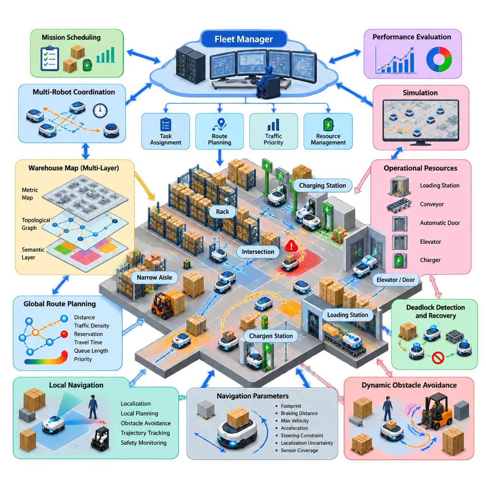
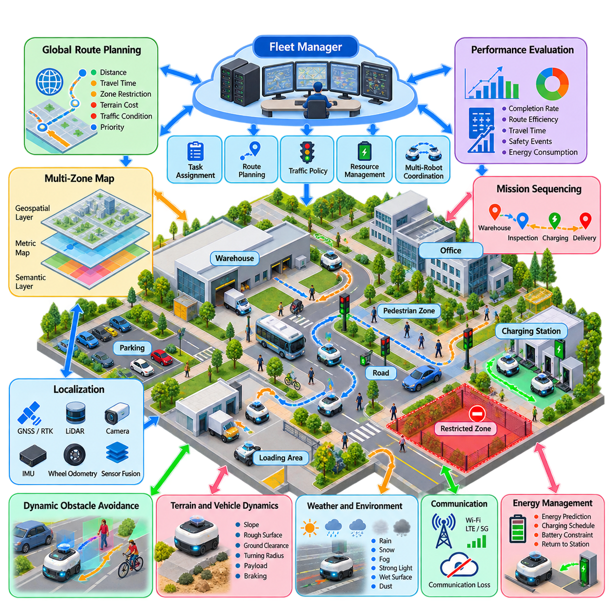
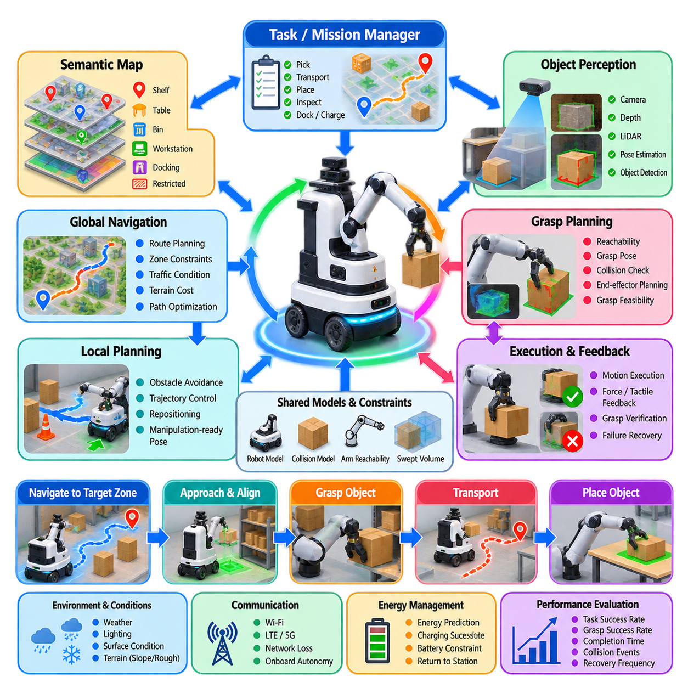
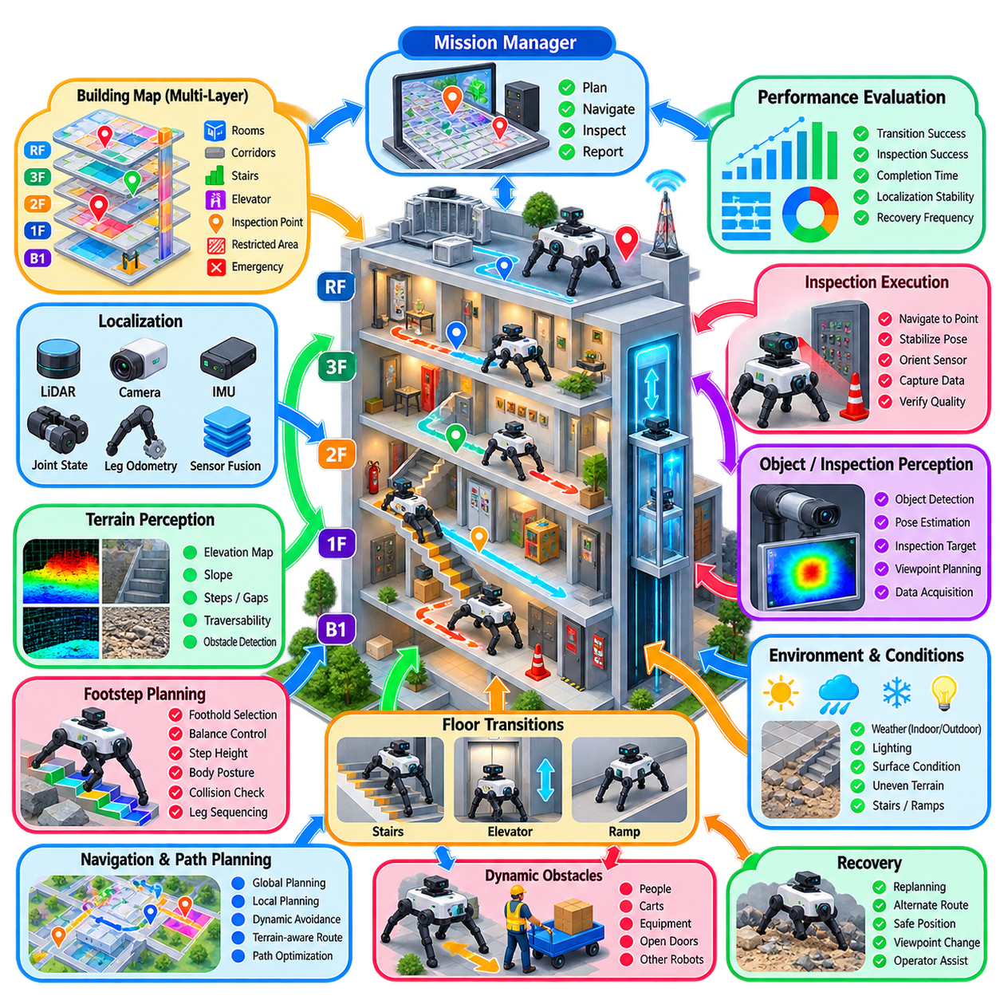
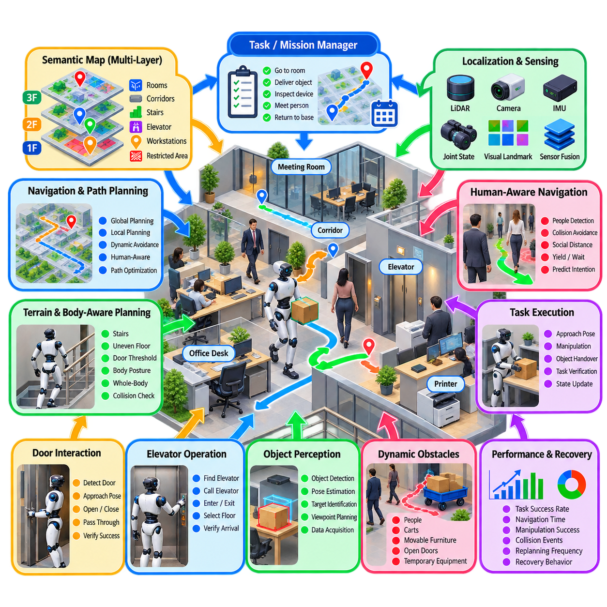
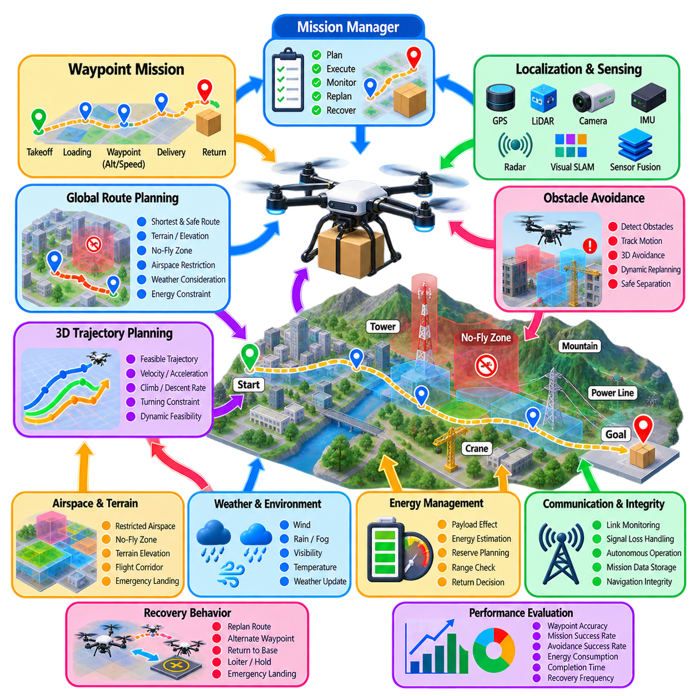
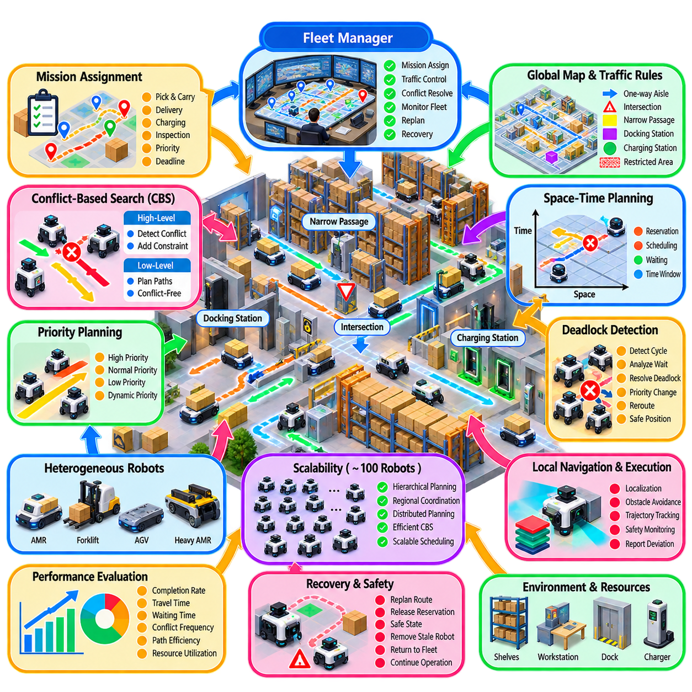
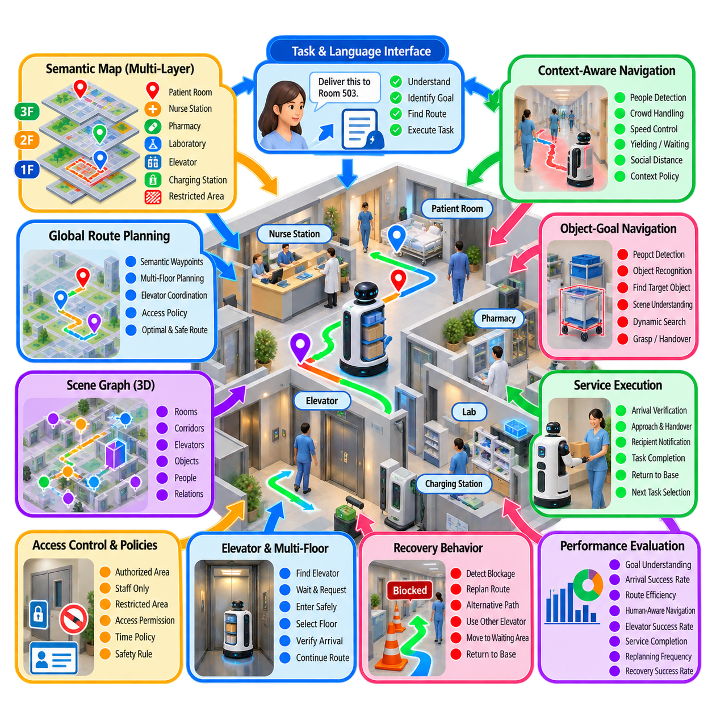
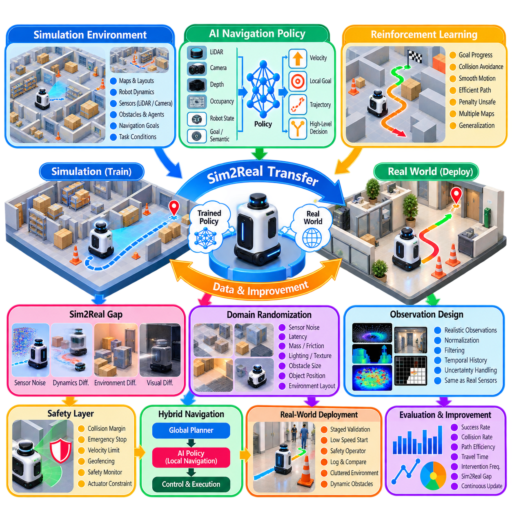
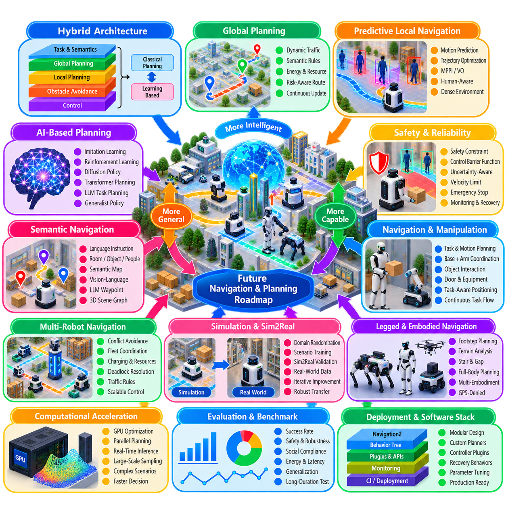

**Volume 15. Motion Planning and Navigation**

# Chapter 12. Industrial Navigation Case Studies

## 12.01. Indoor AMR Warehouse Dense Fleet Navigation Case

{width="7.268055555555556in" height="7.268055555555556in"}

A dense warehouse AMR deployment transforms navigation from a single-robot path-planning problem into a coordinated traffic-management problem. The environment typically contains narrow aisles, storage racks, work cells, charging stations, intersections, and shared transfer zones. As fleet density increases, successful operation depends not only on finding collision-free paths but also on controlling when and how robots occupy limited spatial resources.

The navigation architecture can be divided into fleet-level planning and robot-level execution. A fleet manager assigns missions, selects routes, manages traffic priorities, and coordinates shared resources, while each AMR performs localization, local planning, obstacle avoidance, trajectory tracking, and safety monitoring. This separation allows individual robots to react quickly to nearby conditions while maintaining globally coordinated warehouse traffic.

A warehouse map is usually represented through multiple complementary layers rather than a single occupancy grid. Metric maps support localization and local collision checking, while topological or graph representations describe aisles, intersections, stations, and permitted traffic connections. Semantic attributes can identify one-way lanes, restricted areas, waiting positions, charging zones, speed-limited regions, and locations requiring special navigation behavior.

Global route planning must consider congestion as well as geometric distance. A shortest path through the warehouse may be inefficient when many robots simultaneously select the same corridor or intersection. Edge costs can therefore incorporate predicted traffic density, reservation status, travel time, queue length, and operational priority. Dynamic cost adjustment distributes robots across alternative routes and reduces excessive concentration around high-demand areas.

Multi-robot coordination introduces the temporal dimension into path planning. Two paths that are geometrically collision-free can still conflict when robots attempt to occupy the same location at the same time. Space-time planning, priority-based planning, reservation methods, and Conflict-Based Search can represent these interactions explicitly. In production systems, computational complexity is often controlled by combining global traffic rules with localized conflict resolution. :chatgpt-content-reference{index="0"}

Intersections are particularly important because a small number of junctions can determine the throughput of an entire warehouse. Robots may reserve an intersection before entering it, receive crossing priorities from the fleet manager, or wait at predefined holding points. Reservations should cover sufficient space and time to prevent blocking inside the intersection while avoiding unnecessarily long occupation that reduces overall traffic capacity.

Deadlock occurs when several robots mutually prevent one another from progressing. Typical cases include opposing robots in a narrow aisle, circular waiting dependencies, and robots stopped near stations or intersections. Prevention mechanisms restrict entry into regions without guaranteed exits, while detection algorithms analyze waiting time or dependency graphs. Recovery may involve yielding, backing toward a safe waypoint, rerouting, or temporarily changing priorities.

Local navigation remains responsible for disturbances that cannot be efficiently handled by centralized planning. Workers, forklifts, pallets, carts, and unexpectedly placed objects may alter the traversable space within seconds. Local costmaps and planners continuously update obstacle information and modify velocity or trajectory commands. However, local avoidance should not independently create large route deviations that violate fleet-level traffic reservations or produce new conflicts.

Navigation parameters must reflect the physical properties of the AMR. Footprint size, payload-dependent braking distance, maximum velocity, acceleration, steering constraints, localization uncertainty, and sensor coverage influence safe clearance and trajectory feasibility. Velocity smoothing and acceleration limiting become especially important in dense fleets because aggressive stopping or oscillatory local planning can propagate delays to robots following through the same traffic corridor. :chatgpt-content-reference{index="1"}

Warehouse navigation also requires explicit handling of operational resources. Loading stations, conveyor interfaces, automatic doors, elevators, chargers, and docking points behave like capacity-constrained resources rather than ordinary destinations. A robot should normally approach such a resource only when access is available or reserved. Coordinating navigation with resource scheduling prevents robots from physically queuing in locations that obstruct unrelated traffic.

Mission scheduling and navigation therefore interact closely. Assigning the nearest robot to every task does not necessarily maximize fleet productivity because that decision can repeatedly direct robots through already congested areas. Better assignment considers estimated travel time, traffic conditions, battery state, payload capability, station queues, and future task demand. Navigation becomes part of a larger optimization problem involving both robot movement and warehouse workflow.

A practical dense-fleet system should degrade gracefully when communication becomes delayed or temporarily unavailable. Robots require sufficient onboard autonomy to stop safely, maintain local obstacle avoidance, and reach controlled states without continuous fleet-server commands. At the same time, stale reservations must be detected so that disconnected robots do not permanently block virtual traffic resources after communication failures or emergency stops.

Localization reliability directly affects fleet efficiency because excessive uncertainty forces larger safety margins. Warehouses containing repetitive racks and visually similar aisles can create perceptual ambiguity, while temporary inventory changes may modify sensor observations. Robust localization therefore combines appropriate sensing with map management and confidence monitoring. When localization quality falls below a threshold, the robot should reduce speed or stop rather than continue with uncertain positioning.

Recovery behavior must also be designed for fleet operation rather than isolated robots. Repeated spinning, reversing, or replanning may be acceptable during laboratory navigation but can disrupt traffic in a crowded aisle. Production recovery should identify whether the failure is local, route-related, resource-related, or fleet-related and select an action accordingly. Escalation from local recovery to fleet rerouting prevents individual failures from developing into system-wide congestion.

Performance evaluation should measure more than navigation success rate. Important fleet-level indicators include mission throughput, average travel time, waiting time, intersection utilization, congestion duration, deadlock frequency, replanning frequency, minimum separation, emergency-stop events, and energy consumed per completed mission. The architecture explicitly treats navigation benchmarking, safety, dynamic avoidance, and multi-robot scalability as interconnected concerns. :chatgpt-content-reference{index="2"}

Simulation is especially valuable before deploying large fleets because congestion effects are difficult to infer from tests involving only a few robots. Digital warehouse models can reproduce aisle geometry, traffic demand, station capacity, robot dynamics, and temporary obstacles. Increasing simulated fleet size reveals saturation points where additional robots no longer increase throughput and may instead reduce productivity because of queues, conflicts, and excessive waiting.

A mature warehouse deployment ultimately treats each AMR as one participant in a distributed transportation system. Reliable operation emerges from the integration of graph planning, local trajectory control, dynamic obstacle avoidance, multi-robot coordination, traffic rules, resource scheduling, and recovery management. This industrial case therefore connects the navigation technologies developed across the volume with the dense-fleet warehouse scenario defined for the chapter. :chatgpt-content-reference{index="3"}

## 12.02. Outdoor AMR Campus Multi Zone Navigation Case

{width="7.268055555555556in" height="7.268055555555556in"}

An outdoor AMR operating across a large campus faces a navigation problem that differs significantly from indoor warehouse navigation. The operating area may contain roads, sidewalks, buildings, parking zones, loading areas, pedestrian spaces, slopes, intersections, and restricted zones. The robot must therefore combine global route planning with reliable localization, terrain-aware motion, dynamic obstacle avoidance, and zone-specific navigation policies while maintaining safe operation across a continuously changing outdoor environment.

A multi-zone campus should be represented using a hierarchical map rather than a single flat navigation map. A global geospatial layer provides absolute positioning and connects buildings, roads, gates, and major operational areas. Local metric maps support obstacle avoidance and precise motion, while semantic information identifies pedestrian zones, vehicle roads, loading areas, restricted regions, charging stations, and inspection points. This hierarchical representation allows the navigation system to maintain both large-scale geographic consistency and local geometric accuracy.

Localization is particularly important because outdoor AMRs may operate over hundreds of meters or several kilometers and cannot depend exclusively on local SLAM. GNSS or RTK-GNSS can provide an absolute geographic reference, while LiDAR, cameras, IMU, wheel odometry, and local maps provide relative motion information. Sensor fusion can maintain continuity when satellite visibility becomes degraded near buildings, trees, covered areas, or other structures. The navigation system should also monitor localization confidence and transition to a safe operating mode when uncertainty becomes excessive.

Global route planning should account for the different characteristics of campus zones rather than simply minimizing geometric distance. A road segment may provide faster travel than a pedestrian path, while a restricted area may be completely unavailable. Route costs can incorporate distance, expected travel time, terrain difficulty, traffic conditions, road accessibility, operational priorities, and zone restrictions. The resulting route should represent a feasible operational corridor rather than merely a mathematically shortest path between two geographic coordinates.

Campus intersections and zone boundaries require explicit traffic policies because outdoor AMRs may share space with vehicles, pedestrians, bicycles, and other robots. Priority rules can determine whether the robot should stop, yield, cross, or reroute. Temporary reservations may be useful at narrow passages, gates, loading areas, and other capacity-limited locations. These mechanisms extend multi-robot coordination from warehouse-style aisle management to a heterogeneous outdoor transportation environment.

Outdoor dynamic obstacle avoidance must handle a wider range of object types and motion patterns than a typical indoor warehouse. Pedestrians can move unpredictably, vehicles can approach at significantly higher speeds, and temporary objects such as construction barriers or parked equipment can appear without being represented in the original map. Local perception should continuously update the traversable space and predict relevant object motion. The local planner then modifies velocity and trajectory while respecting the global route and vehicle-specific motion constraints.

Weather and environmental conditions introduce additional uncertainty into outdoor navigation. Rain, snow, fog, strong sunlight, wet surfaces, mud, dust, and seasonal changes can affect perception, localization, traction, and braking performance. A robust system should therefore monitor environmental and vehicle-state conditions and adapt navigation behavior accordingly. Reduced speed, increased clearance, alternative routes, or temporary mission suspension may be required when the estimated operating risk exceeds predefined limits.

Terrain and vehicle dynamics must also be included in route feasibility. Slopes, uneven pavement, curbs, drainage structures, rough surfaces, and temporary terrain changes can make an apparently valid path unsuitable for a particular AMR. The planner should consider maximum gradeability, ground clearance, turning radius, payload, acceleration, braking capability, and surface conditions. This is especially important for outdoor platforms carrying substantial payloads, where stopping distance and traction can change significantly with vehicle mass and terrain.

A multi-zone campus may contain different operational objectives within the same mission. An AMR may travel from a warehouse to a manufacturing building, perform an inspection, visit a charging station, and then continue toward another operational zone. Navigation therefore needs to be integrated with mission sequencing rather than treating every destination as an isolated goal. Waypoints, semantic locations, zone transitions, task priorities, battery constraints, and expected service durations can be combined into a mission-level route and execution plan.

Communication availability is another important consideration for outdoor campus operation. Wi-Fi may provide coverage in some zones while private networks, LTE, or 5G may be required elsewhere. Temporary communication loss should not immediately terminate autonomous operation. The robot should retain sufficient onboard information to continue local safety functions, complete a controlled transition, or return to a predefined safe location. At the fleet level, communication status should also influence task assignment and route selection when remote coordination becomes temporarily unreliable.

Charging and energy management become increasingly important as the geographic operating area expands. A robot that begins a mission with insufficient energy may reach a distant zone but become unable to return or complete the next task. Mission planning should therefore estimate energy consumption from distance, payload, terrain, slope, speed, and environmental conditions. Charging stations can be modeled as operational resources, allowing the fleet manager to coordinate charging schedules with mission priorities and prevent unnecessary travel caused by poorly timed charging decisions.

Performance evaluation should measure both navigation quality and operational productivity. Relevant indicators include mission completion rate, localization reliability, route efficiency, travel time, waiting time, obstacle-avoidance events, emergency stops, communication interruptions, energy consumed per mission, and successful transitions between zones. Testing should include normal traffic as well as degraded GNSS, communication loss, temporary obstacles, adverse weather assumptions, and unexpected route blockages. Such evaluation connects the fundamental navigation methods in this volume with realistic outdoor AMR deployment requirements.

A mature outdoor campus navigation system ultimately operates as a hierarchical autonomous transportation architecture. Global geospatial planning determines the long-range route, zone-aware planning manages operational restrictions, local navigation reacts to immediate environmental changes, and the vehicle controller executes physically feasible motion. Multi-robot coordination, semantic maps, sensor fusion, energy management, safety monitoring, and recovery behaviors complete the system. The key engineering objective is not simply to make an AMR reach a destination, but to maintain predictable, safe, and efficient autonomous operation while the robot moves continuously across heterogeneous campus zones.

## 12.03. Mobile Manipulator Nav to Grasp Integration Case

{width="7.268055555555556in" height="7.268055555555556in"}

A mobile manipulator combines autonomous navigation with robotic manipulation, creating a system that must solve both where to move and how to interact with an object. Unlike a conventional AMR, the robot cannot treat navigation as complete when it reaches a target location. It must arrive at a manipulation-ready pose with sufficient clearance, correct orientation, stable localization, and an unobstructed workspace for the arm. This case therefore connects navigation, perception, grasp planning, and manipulation execution.

The overall architecture should coordinate global navigation, local motion planning, object perception, manipulation planning, and task execution. A mission may begin with a semantic target such as a shelf, workstation, bin, or machine. The navigation system converts this target into an approach region, while the manipulation system determines the required end-effector pose. The two planners must exchange constraints continuously because the best navigation pose is determined not only by the robot base but also by the arm\'s reachable workspace.

A semantic map can provide the high-level structure required for navigation-to-grasp tasks. Instead of representing only free and occupied space, the map can identify shelves, tables, containers, workstations, docking areas, and manipulation targets. Object-level perception then refines the target location using camera, depth, or LiDAR information. The resulting representation connects semantic location with geometric pose, allowing the robot to move from a task description such as "pick the object from the workstation" toward a physically executable approach and grasp sequence.

Navigation should terminate at a manipulation-ready pose rather than at an arbitrary waypoint. The planner must consider the manipulator\'s reachability, arm joint limits, collision geometry, end-effector orientation, object accessibility, and required approach direction. Several candidate base poses can be generated around the target and evaluated according to reachability, collision margin, localization confidence, and expected manipulation quality. This creates a coupled base-placement and manipulation problem rather than two completely independent planning stages.

The transition from navigation to manipulation requires a scan-ready or grasp-ready validation process. Before stopping, the robot should verify that the target is visible, the estimated object pose is sufficiently accurate, the base is stable, and the arm has an unobstructed path. If these conditions are not satisfied, the navigation planner may perform a local repositioning maneuver instead of immediately initiating manipulation. This closed-loop transition prevents a common failure mode in which navigation succeeds geometrically but the arm cannot safely reach the intended object.

Perception and localization must remain active during the manipulation approach. Objects may be displaced from their mapped positions, partially occluded, or surrounded by temporary obstacles. A camera or depth sensor mounted on the robot can refine object pose estimation as the base approaches the manipulation area. Sensor fusion can combine global localization with local visual or geometric information, allowing the robot to maintain a consistent relationship between the mobile base, the manipulator, the target object, and the surrounding workspace.

Collision avoidance must consider the complete robot body rather than the AMR footprint alone. During navigation, the planner primarily protects the mobile base, while during manipulation the arm, wrist, end effector, and carried object can extend into previously free areas. The planning system therefore needs a combined collision model and must account for the changing configuration of the manipulator. Safe operation may require the base to stop farther from an obstacle even when the base itself has adequate clearance, because the arm\'s reachable motion could otherwise create a collision.

The planning pipeline can be organized as a hierarchical sequence in which global navigation provides a route to the manipulation zone, local planning produces a feasible approach trajectory, and manipulation planning generates arm and gripper motion. However, these stages should not be completely isolated. If no feasible grasp exists from the current approach direction, the manipulation planner should be able to request a new base pose or alternative approach. Likewise, if the desired base pose is blocked, the navigation system should search for another manipulation-compatible pose.

Execution should be monitored as a closed-loop process rather than treated as a fixed sequence of commands. After reaching the approach pose, the robot can re-observe the target, update its object estimate, validate grasp feasibility, and execute the arm trajectory. During grasping, force, tactile, visual, or joint-state feedback can provide evidence that the object has been successfully acquired. If the grasp fails, the system should distinguish between perception error, reachability failure, collision risk, object displacement, and gripper failure before deciding whether to retry, reposition, or request a new plan.

The same integration principle applies after grasp acquisition. Once an object has been picked, the robot\'s geometry, mass distribution, and manipulation constraints may change. The carried object can increase the effective footprint or restrict allowable motion near obstacles. The navigation system should therefore update its motion constraints and select a route appropriate for the loaded configuration. At a destination, the process is reversed: navigation provides a placement-ready pose, manipulation plans the release motion, and perception verifies that the object has been placed correctly.

A production system should define explicit interfaces between navigation and manipulation. Navigation should expose candidate base poses, approach orientations, path feasibility, clearance, and localization confidence, while manipulation should return reachability, required base-pose constraints, collision requirements, and grasp status. These interfaces allow the two subsystems to remain modular while still supporting coordinated planning. A behavior-tree or mission-level executive can supervise transitions among navigation, perception, approach validation, grasping, verification, recovery, and completion.

Performance evaluation should measure the complete task rather than navigation or grasping independently. Useful indicators include successful navigation-to-grasp rate, approach-pose accuracy, grasp success rate, task completion time, replanning frequency, collision events, recovery frequency, and placement accuracy. Testing should cover different object locations, occlusion conditions, approach directions, obstacle configurations, and localization uncertainty. This industrial case therefore extends navigation from point-to-point mobility toward integrated task execution in which the robot must physically arrive, perceive, manipulate, verify, and continue its mission.

## 12.04. Quadruped Multi Floor Building Inspection Case

{width="7.268055555555556in" height="7.268055555555556in"}

A quadruped robot performing multi-floor building inspection must combine locomotion, navigation, perception, localization, and inspection-task execution within a single operational framework. Unlike a wheeled AMR, the robot can traverse stairs, uneven floors, thresholds, ramps, and other terrain transitions, but its navigation must account for body stability and foothold feasibility. In a multi-floor building, the mission therefore extends beyond finding a path between two points and becomes a coordinated process of localization, terrain assessment, floor transitions, inspection execution, and recovery.

The building environment should be represented using multiple map layers that describe both geometric and semantic information. A global building map can identify floors, rooms, corridors, stairways, elevators, inspection points, restricted areas, and emergency locations, while local elevation or terrain maps describe the detailed surface conditions encountered by the quadruped. Combining these representations allows the navigation system to reason about where the robot should travel and whether the selected route is physically suitable for legged locomotion.

Localization is particularly important when inspection missions extend across several floors. The robot may combine LiDAR, cameras, IMU, joint-state information, and leg odometry to maintain an estimate of its position and orientation. In areas where GNSS is unavailable, such as indoor corridors, stairwells, and underground facilities, local SLAM and multi-sensor fusion become important. The navigation system should maintain localization confidence throughout the mission and recognize situations where accumulated drift or ambiguous observations require additional localization actions.

Floor transitions introduce a special planning problem because the robot must determine how to move between different elevation levels. Stairs, ramps, elevators, and other vertical connections should be represented as navigable transitions rather than ordinary waypoints. Stair traversal requires appropriate foothold selection, body posture, balance control, and speed regulation, while elevator use introduces interaction with doors, elevator controls, and floor selection. The navigation architecture must therefore coordinate building-level route planning with specialized transition behaviors.

Terrain perception provides the information required for safe quadruped navigation. Elevation maps, depth observations, LiDAR measurements, and visual information can be used to estimate surface height, slope, discontinuities, steps, gaps, and potentially unstable regions. The robot can classify terrain according to traversability and select routes that provide sufficient stability. When the observed terrain differs from the building map, the local planner should update the traversability representation rather than blindly following a precomputed path.

Footstep planning becomes a central component when the robot encounters stairs, uneven surfaces, or obstacles that cannot be treated as simple two-dimensional occupancy. Each foothold must provide sufficient support while maintaining whole-body balance and a feasible sequence of leg configurations. The planner must consider reachable foothold locations, collision constraints, body orientation, step height, terrain slope, and the timing of leg movements. This creates a direct connection between high-level navigation and low-level locomotion planning.

Inspection missions also require navigation to be synchronized with sensing activities. At predefined inspection points, the quadruped may need to stop, stabilize its body, orient a camera or other sensor, and acquire measurements before continuing. The desired inspection pose may therefore differ from the shortest navigational stopping position. The mission planner should treat inspection locations as task-aware waypoints that contain both navigation requirements and sensing requirements, allowing the robot to arrive in a configuration suitable for reliable data acquisition.

Dynamic obstacles must be handled throughout the building. Workers, maintenance personnel, carts, temporary equipment, open doors, and other robots can change the available navigation space. A local planner should detect these changes and generate collision-free motion while preserving the stability requirements of legged locomotion. In narrow corridors or stairways, avoidance may require waiting rather than immediate rerouting because the available alternative space may be insufficient for safe passage.

Inspection reliability depends not only on reaching the correct location but also on maintaining repeatable sensing conditions. Camera orientation, sensor height, distance from the inspection target, lighting, and robot posture can influence the quality of collected data. The system should therefore associate inspection targets with preferred viewpoints or sensing poses. When the required viewpoint cannot be achieved safely, the robot should reposition or select an alternative observation pose rather than collecting low-quality data from an unsuitable configuration.

A multi-floor inspection mission should be managed as a sequence of navigation and task states rather than as one uninterrupted trajectory. A typical mission can involve traveling along a corridor, reaching an inspection point, stabilizing the quadruped, collecting sensor data, moving toward a stairway or elevator, transitioning to another floor, validating localization, and continuing the inspection route. This approach allows failures at individual stages to be detected and recovered without necessarily terminating the complete mission.

Recovery behavior is particularly important for quadruped inspection because the robot may encounter terrain or conditions that were not represented during initial planning. If a foothold becomes unsafe, localization confidence decreases, a stairway becomes blocked, or an inspection position cannot be reached, the robot should enter an appropriate recovery state. Possible responses include stopping, replanning locally, selecting another foothold sequence, returning to a safe position, changing the inspection viewpoint, or requesting operator intervention when autonomous recovery is insufficient.

Performance evaluation should consider both navigation and inspection outcomes. Important measures include floor-to-floor transition success, localization stability, terrain traversal success, foothold planning reliability, inspection-point arrival accuracy, sensing success rate, mission completion time, recovery frequency, and collision or safety events. Testing should cover normal corridors, stairs, elevators, uneven terrain, dynamic obstacles, localization degradation, and blocked routes. This connects the quadruped navigation methods developed earlier in the volume with a realistic multi-floor building inspection scenario. :chatgpt-content-reference{index="0"}

A mature multi-floor quadruped inspection system ultimately combines building-level route planning, terrain-aware navigation, footstep planning, specialized floor-transition behaviors, inspection-aware positioning, and continuous recovery. Global planning determines the inspection sequence and floor transitions, while local navigation and locomotion planning respond to the physical environment. Perception and localization continuously update the robot\'s understanding of the building, and inspection execution determines whether each required observation has been successfully completed. The resulting architecture treats the quadruped not simply as a mobile platform, but as an autonomous inspection system capable of navigating complex multi-level environments while maintaining both locomotion safety and mission objectives.

## 12.05. Humanoid Office Navigation Task Execution Case

{width="7.268055555555556in" height="7.268055555555556in"}

A humanoid robot operating in an office must integrate navigation with task execution in an environment designed primarily for humans. Unlike a conventional wheeled robot, the humanoid can use doors, stairs, elevators, desks, shelves, and other human-oriented facilities, but this flexibility introduces additional planning requirements. The robot must reason about its location, posture, reachable objects, human traffic, and task context while moving safely through corridors, rooms, shared workspaces, and other office areas.

Office navigation should use a hierarchical representation that combines geometric maps with semantic information. A global map can represent floors, rooms, corridors, doors, elevators, stairs, meeting areas, workstations, and restricted spaces, while local maps describe obstacles and free space around the robot. Semantic labels allow task instructions to refer to meaningful locations such as "go to the meeting room," "deliver the document to the desk," or "inspect the printer," rather than requiring manually specified geometric coordinates.

Localization must remain reliable as the humanoid moves between visually similar office areas. The robot can combine LiDAR, cameras, IMU, joint-state information, and visual landmarks to estimate its position and orientation. Office environments may contain repetitive corridors, movable furniture, glass surfaces, temporary partitions, and changing lighting conditions that affect perception. Continuous localization confidence monitoring is therefore important, particularly before the robot begins an interaction task or enters a constrained area such as an elevator, doorway, or narrow passage.

Humanoid navigation must also consider body configuration rather than treating the robot as a simple fixed footprint. The robot may change posture while walking, reaching, bending, opening a door, or interacting with furniture. Its effective collision geometry therefore varies according to the current whole-body configuration. Navigation and whole-body motion planning should exchange constraints so that the selected path provides sufficient clearance for the torso, arms, legs, and carried objects throughout the intended movement.

Task execution begins when navigation brings the robot into a task-compatible position rather than simply reaching a destination coordinate. For example, delivering an object to a desk may require the robot to approach from a particular direction, maintain sufficient space for arm motion, and stop at a suitable height and distance. Similarly, interacting with a door, elevator panel, printer, or workstation requires a reachable manipulation pose. The navigation planner must therefore generate approach positions that satisfy both mobility and task constraints.

Human-aware navigation is essential in an office because pedestrians may occupy corridors, doorways, meeting areas, and shared workspaces. The robot should maintain appropriate separation, avoid abrupt movements, and adapt its trajectory when people change direction. In narrow areas, waiting or yielding may be preferable to forcing a detour. The navigation policy should distinguish between static infrastructure and temporary human activity while preserving predictable behavior that allows people to understand the robot\'s intended movement.

Office task execution also requires coordination between navigation, perception, manipulation, and high-level reasoning. A task such as delivering a document can be represented as a sequence of navigation, object verification, approach, handover, confirmation, and return actions. If the target desk is occupied or the recipient is unavailable, the robot should not simply continue executing the original motion sequence. Instead, the task executive can update the state, select an alternative action, or request additional information while maintaining a safe navigation state.

Doors and elevators represent important interaction points because they combine navigation with environmental manipulation. A humanoid may need to detect whether a door is open, determine the appropriate approach pose, operate a handle or button, and verify successful passage. Elevator operation similarly requires locating the elevator, selecting the required floor, entering without collision, maintaining a safe position, and confirming arrival. These behaviors should be represented as structured task actions rather than being treated as ordinary navigation waypoints.

Dynamic office environments require continuous replanning. Chairs, carts, boxes, open doors, people, and temporary equipment can change the available space after a route has already been planned. Local navigation should respond to these changes while the task planner preserves the overall mission objective. When a corridor becomes blocked, the system may select another route, wait for access to become available, or revise the task sequence. Recovery should therefore operate at both navigation and task levels.

Performance evaluation should measure the success of the complete navigation-to-task pipeline rather than navigation alone. Relevant measures include destination arrival accuracy, task completion rate, human-interaction success, manipulation success, navigation time, waiting time, replanning frequency, collision events, recovery frequency, and successful operation of doors or elevators. Testing should include normal office traffic as well as blocked corridors, changing furniture layouts, uncertain localization, unavailable task targets, and unexpected human interactions.

A mature humanoid office system ultimately combines semantic navigation, human-aware motion planning, whole-body constraints, manipulation-aware positioning, task sequencing, environmental interaction, and recovery. Global planning determines where the robot should travel, local planning maintains safe motion, perception updates the environment model, and task execution determines what must happen at each meaningful location. This case therefore extends navigation from simple point-to-point movement toward integrated task execution in which the humanoid must understand an office environment, move through it safely, interact with its facilities and occupants, complete a task, and recover appropriately when conditions differ from the original plan. The case belongs to the industrial navigation case-study structure defined for the navigation volume.

## 12.06. Cargo UAV Waypoint Navigation Obstacle Avoidance Case

{width="7.268055555555556in" height="7.268055555555556in"}

A cargo unmanned aerial vehicle (UAV) operating autonomously must combine waypoint navigation, flight trajectory planning, obstacle avoidance, and mission execution within a single navigation architecture. Unlike ground robots, a cargo UAV moves through a three-dimensional environment and must continuously account for altitude, airspeed, heading, climb and descent rates, and available flight corridors. The navigation problem therefore extends beyond selecting a sequence of geographic points and requires generation of dynamically feasible trajectories that remain safe under changing environmental conditions.

A cargo UAV mission can be represented as a sequence of semantic waypoints connected by feasible flight segments. Waypoints may represent departure locations, loading areas, delivery destinations, inspection points, intermediate altitude changes, or emergency diversion locations. Each waypoint can contain geographic coordinates, target altitude, desired heading, speed constraints, arrival conditions, and mission-specific requirements. The route planner uses these constraints to construct a mission route while maintaining sufficient flexibility for local replanning when the environment changes.

Global route planning should consider more than the shortest geographic distance between waypoints. Terrain elevation, restricted airspace, no-fly zones, buildings, transmission infrastructure, expected weather, communication coverage, and mission priorities can influence route selection. For cargo missions, payload mass and energy consumption are also important because a route that is geometrically feasible may become operationally unsuitable when battery reserves, climb requirements, or payload-dependent flight performance are considered.

The navigation system should maintain a hierarchical representation of the flight environment. A global geospatial map can provide terrain, airspace, infrastructure, and mission-zone information, while local three-dimensional representations support obstacle detection and immediate trajectory adjustment. Semantic information can identify restricted regions, delivery corridors, emergency landing locations, charging or refueling facilities, and other operational resources. This separation allows long-range route planning to remain computationally manageable while local navigation reacts rapidly to newly observed conditions.

Obstacle avoidance is a central requirement because the UAV may encounter objects that are absent from the original map. Buildings, cranes, towers, power lines, other aircraft, birds, temporary structures, and unexpected airborne objects can create conflicts along the planned route. Perception sensors and tracking algorithms should continuously estimate the position and motion of relevant obstacles. The local planner can then modify the trajectory while respecting vehicle dynamics, minimum separation requirements, and the higher-level mission route.

Three-dimensional obstacle avoidance differs fundamentally from planar navigation because the UAV can potentially avoid an obstacle by changing altitude as well as by moving laterally. However, vertical maneuvering is not always available or desirable. Airspace restrictions, terrain, weather, energy consumption, aircraft performance, and nearby obstacles may limit the usable altitude range. The planner should therefore evaluate alternative three-dimensional trajectories rather than assuming that climbing or descending is always the safest response.

Trajectory generation must respect the physical constraints of the cargo UAV. Maximum velocity, acceleration, climb rate, descent rate, turning radius, attitude limits, payload mass, and available propulsion authority determine whether a candidate trajectory can actually be executed. A mathematically valid path may be impossible for the aircraft to follow if curvature is excessive or if the required maneuver exceeds its dynamic capabilities. Navigation and flight-control layers should therefore exchange trajectory feasibility information before a planned route is committed to execution.

Energy-aware planning becomes particularly important for cargo UAVs because payload and flight distance directly affect available endurance. Climbing to higher altitudes, fighting wind, carrying heavier payloads, or performing repeated avoidance maneuvers can increase energy consumption. Mission planning should estimate energy requirements along candidate routes and maintain an appropriate reserve for diversion, return-to-base, or emergency landing. A waypoint sequence should therefore be evaluated not only by travel distance and time but also by expected energy demand.

Weather conditions can change the feasibility of a planned flight after mission execution has already begun. Wind direction and speed can alter ground speed, energy consumption, and trajectory tracking requirements, while rain, fog, icing, or reduced visibility can affect perception and vehicle performance. The navigation system should continuously monitor relevant environmental information and update route or speed constraints when necessary. If conditions exceed defined operating limits, the mission manager should be able to delay, divert, return, or transition to an appropriate safe state.

Communication and navigation integrity must also be considered throughout the mission. A cargo UAV may travel beyond reliable local network coverage, making autonomous onboard operation essential. The aircraft should retain sufficient mission information to continue safe flight during temporary communication loss while monitoring whether the current route remains valid. Predefined behaviors such as loitering, returning to base, diverting to a safe waypoint, or performing an emergency landing can provide structured responses when communication or navigation confidence becomes insufficient.

Waypoint execution should be treated as a closed-loop process rather than a simple point-to-point command. As the UAV approaches a waypoint, the navigation system should verify position, altitude, heading, velocity, and mission conditions before confirming arrival. If wind or obstacle avoidance causes significant deviation, the next trajectory should be recalculated from the current state rather than blindly following the original path. This allows waypoint navigation to remain robust when actual flight conditions differ from those assumed during mission planning.

Obstacle avoidance and mission planning should remain coordinated because a local maneuver can affect subsequent mission feasibility. For example, a temporary altitude change may consume additional energy or move the aircraft toward restricted airspace. A local planner should therefore communicate significant trajectory changes to the mission-level planner, which can reassess the remaining route, energy reserve, and delivery requirements. This hierarchical interaction prevents local avoidance behavior from creating a new mission-level failure.

Recovery behavior is essential when the UAV encounters conditions that cannot be resolved by ordinary local replanning. A blocked corridor, severe weather change, navigation uncertainty, communication loss, propulsion degradation, or insufficient energy reserve may require the mission to change state. Recovery can involve selecting an alternate waypoint sequence, diverting to a safe location, returning to base, holding temporarily, or executing an emergency landing procedure. The recovery architecture should be deterministic enough to provide predictable responses while preserving mission information for later continuation when appropriate.

Performance evaluation should measure the complete navigation and mission-execution process. Relevant indicators include waypoint arrival accuracy, route completion rate, obstacle-avoidance success, minimum separation, trajectory tracking error, energy consumption, communication availability, recovery frequency, mission completion time, and successful cargo delivery. Testing should include nominal routes as well as dynamic obstacles, restricted-area encounters, weather changes, communication loss, navigation uncertainty, and emergency diversion scenarios. This case therefore connects waypoint navigation, three-dimensional trajectory planning, obstacle avoidance, and autonomous cargo mission execution within the industrial navigation case-study structure defined for the volume.

## 12.07. 100 Robot Fleet CBS Multi Robot Planning Case

{width="7.268055555555556in" height="7.268055555555556in"}

A 100-robot fleet represents a significant transition from individual robot navigation to large-scale multi-robot planning. In this environment, independently generated paths can create conflicts at shared corridors, intersections, stations, and narrow passages even when every individual path is locally collision-free. The case therefore focuses on coordinated fleet navigation in which route selection, temporal coordination, conflict resolution, deadlock prevention, and traffic management must operate together to maintain scalable and predictable fleet behavior.

The fleet architecture should distinguish between global mission coordination and individual robot execution. A fleet manager can assign missions, establish priorities, coordinate shared resources, and maintain a global representation of robot states, while each robot performs localization, local obstacle avoidance, trajectory tracking, and safety monitoring. This separation reduces the computational burden on centralized planning while preserving sufficient onboard autonomy for rapid reactions to local environmental changes.

Conflict-Based Search (CBS) provides a useful framework for coordinating multiple robots because it explicitly represents conflicts between individual paths. A high-level search identifies a collision between two planned trajectories and generates alternative constraints that force the involved robots to use different spatial or temporal resources. Low-level planning then finds paths satisfying those constraints. For a 100-robot fleet, the practical challenge is not only finding conflict-free solutions but controlling the computational growth caused by increasing numbers of robots and interactions.

Space-time planning extends ordinary path planning by representing both position and time. Two robots may safely traverse the same corridor when their occupation times do not overlap, while the same geometric paths can become conflicting when their timing coincides. Space-time A\* or related temporal planners can therefore incorporate reservations, waiting actions, and scheduled passage through constrained areas. This representation is particularly useful for intersections, narrow aisles, docking areas, and other locations where spatial capacity is limited.

Priority-based planning provides another mechanism for reducing coordination complexity. Robots can receive priorities based on mission urgency, operational role, deadline, location, or previously established traffic rules. Higher-priority robots may retain their planned routes while lower-priority robots modify their paths or wait. However, priority rules must be carefully designed because fixed priorities can create unfair delays or persistent blocking. A large fleet therefore benefits from combining priority policies with conflict detection and dynamic replanning.

Deadlock detection becomes increasingly important as fleet size grows. A deadlock can occur when several robots wait for resources or positions occupied by one another, producing a circular dependency in which no robot can progress. The fleet manager can analyze robot dependencies, waiting duration, reservation states, and blocked routes to identify such conditions. Recovery may involve changing priorities, releasing reservations, rerouting selected robots, or moving one robot to a predefined safe holding position.

Traffic management rules provide a practical layer between formal multi-robot planning and real warehouse operation. Intersections, one-way aisles, loading stations, charging areas, and narrow passages can be treated as controlled resources with explicit entry and exit conditions. Robots may reserve these resources before entering and release them after departure. Such rules reduce unnecessary pairwise conflicts and allow the global planner to reason about high-demand locations using structured traffic policies rather than resolving every interaction independently.

At a fleet size of approximately 100 robots, scalability becomes a primary engineering requirement. A centralized planner that attempts to optimize every robot simultaneously may experience rapidly increasing computational cost as the number of conflicts grows. Hierarchical planning can reduce this burden by separating mission assignment, regional traffic coordination, and local path planning. Robots can first be distributed across operational regions or traffic corridors, after which detailed conflict resolution is performed only where interactions actually occur.

Heterogeneous fleets introduce additional constraints when AMRs, forklifts, AGVs, or other mobile platforms share the same environment. Different vehicle dimensions, speeds, turning capabilities, braking distances, and operational priorities must be represented in the planning model. A route that is feasible for a compact AMR may be unsuitable for a forklift, while a slow vehicle may create significant temporal conflicts with faster robots. Fleet planning should therefore combine geometric compatibility with vehicle-specific motion and traffic constraints.

The navigation stack should maintain consistency between fleet-level coordination and robot-level execution. A globally assigned route may become invalid when a local obstacle appears, while an independently generated local detour may interfere with another robot\'s reservation. The system therefore requires an interface through which local planners report significant deviations and the fleet manager updates relevant reservations or replans affected routes. This feedback loop prevents local navigation behavior from silently creating new fleet-level conflicts.

A 100-robot warehouse should also be evaluated under increasing traffic demand rather than only under nominal conditions. Important indicators include mission completion rate, average travel time, waiting time, conflict frequency, deadlock frequency, replanning rate, intersection utilization, path efficiency, computational latency, and resource utilization. Testing can progressively increase robot density and task demand to identify the point at which congestion begins to dominate fleet performance and additional robots produce diminishing operational benefit.

Recovery and safety must remain independent from optimization objectives. When communication is delayed, localization becomes unreliable, or a robot encounters an unexpected obstacle, the affected robot must be able to enter a safe state without waiting for a complete global solution. At the fleet level, stale reservations and unavailable robots must be removed from active planning assumptions. This allows the fleet to continue operating around local failures while preserving the possibility of later reintegration.

The complete 100-robot CBS case therefore combines centralized or hierarchical fleet coordination, Conflict-Based Search, space-time planning, priority management, deadlock detection, traffic rules, heterogeneous robot constraints, and scalable local navigation. The source structure places these methods within the multi-robot navigation chapter and connects them to a dedicated warehouse 100-robot fleet case. The industrial case consequently represents navigation as a fleet-level coordination problem in which spatial planning, temporal scheduling, conflict resolution, and local autonomy must remain consistent as the number of participating robots increases.

## 12.08. Semantic Navigation Hospital Service Robot Case

{width="7.268055555555556in" height="7.268055555555556in"}

A hospital service robot operates in an environment where navigation goals are naturally expressed through human concepts such as patient rooms, nurse stations, pharmacies, laboratories, elevators, and treatment areas. Semantic navigation allows these concepts to become part of the robot's navigation representation instead of relying only on geometric coordinates. The robot can therefore interpret a service request in terms of meaningful destinations, operational zones, objects, and contextual relationships before converting the request into executable navigation goals.

The navigation architecture should combine metric, topological, and semantic representations. Metric maps provide geometric information for localization and collision avoidance, while a topological graph represents connectivity among corridors, rooms, elevators, and floors. A semantic layer associates these locations with names, functions, access policies, and task-related attributes. This structure follows the broader semantic-navigation framework in which language instructions, semantic maps, scene context, and human-robot shared representations are connected to physical navigation.

A request such as "deliver this item to Room 503" must first be transformed from language into a navigation and service objective. The system can identify the destination, determine its floor and zone, retrieve relevant access information, and generate an appropriate semantic waypoint sequence. Instead of treating Room 503 as an isolated coordinate, the planner can understand its relationship to the current corridor, elevator, nurse station, and surrounding rooms. This makes task specification more intuitive while preserving the geometric precision required for execution.

Semantic maps should also represent operational meaning rather than only location names. A corridor may be designated as public, staff-only, high-traffic, or temporarily restricted, while a room may require authorization before entry. Elevators can be represented as floor-transition resources, and charging stations as energy resources. By attaching such attributes to spatial entities, route planning can select paths that satisfy hospital policies and task requirements rather than simply minimizing travel distance.

Scene context can influence navigation behavior even when the geometric map remains unchanged. A corridor near an emergency department may require different speed and yielding policies from a quiet inpatient area. Crowded waiting rooms, treatment activities, cleaning operations, or temporary medical equipment can also change how a robot should move through a location. Context-aware navigation policies allow semantic information to modify speed, clearance, route preference, and interaction behavior according to the current operational situation.

Human-aware navigation is especially important because hospitals contain patients, visitors, clinicians, carts, beds, wheelchairs, and other moving entities with different motion characteristics. The robot should detect and track nearby people and equipment while maintaining appropriate separation and predictable movement. In narrow corridors or doorways, waiting or yielding may be safer than aggressive local avoidance. Dynamic obstacle handling must therefore work together with semantic context so that navigation behavior reflects both geometry and the meaning of the surrounding activity.

Multi-floor hospital missions require semantic coordination of elevators, corridors, and destination areas. A robot assigned to another floor should identify an appropriate elevator, navigate to a waiting position, request or coordinate access, enter safely, select the required floor, verify arrival, and continue toward the destination. The elevator is therefore not merely a waypoint but a structured navigation resource whose use contains several states, transitions, and verification steps.

Object-goal navigation can extend semantic navigation when the robot must find a destination that is defined by an object rather than a fixed coordinate. A request may involve locating a medication cart, supply station, charging dock, or other recognized object. Perception can identify candidate objects, while scene context and semantic relationships help determine which candidate corresponds to the task. This connects object detection and scene understanding with navigation goal generation instead of requiring every destination to be permanently encoded in the map.

A three-dimensional scene graph can provide a structured representation of relationships among floors, rooms, corridors, objects, people, and service resources. Nodes can represent semantic entities while edges describe relations such as connected-to, inside, near, accessible-from, or located-on-floor. The navigation system can use this graph to reason from a high-level service request toward a sequence of physically reachable locations. This reflects the volume structure that explicitly connects semantic navigation with 3D scene graphs and shared semantic spaces.

Service execution should remain connected to navigation after the destination has been reached. Arriving near a patient room does not necessarily mean that the delivery task is complete. The robot may need to verify the room, approach an appropriate handover position, notify a recipient, wait for confirmation, or return to another service location. A mission executive can therefore coordinate semantic navigation with arrival verification, service interaction, completion confirmation, and subsequent task selection.

Recovery should also use semantic information. If a corridor becomes unavailable, the robot can search for an alternative route through another permitted corridor rather than selecting any geometrically open path. If an elevator is unavailable, the mission planner can identify another valid floor-transition resource or postpone the task. When a destination cannot be accessed, semantic knowledge about nearby waiting areas, nurse stations, or alternative service points can support a meaningful recovery strategy instead of a purely geometric replanning response.

Performance evaluation should measure both navigation quality and semantic task success. Relevant indicators include semantic-goal interpretation accuracy, destination arrival success, route efficiency, human-aware navigation performance, elevator transition success, service completion rate, replanning frequency, waiting time, and recovery success. Testing should include ambiguous instructions, changing corridor accessibility, dynamic crowds, moved objects, multi-floor tasks, and temporarily unavailable destinations to evaluate whether semantic reasoning remains connected to reliable physical execution.

A mature hospital service robot therefore integrates semantic maps, language-to-goal interpretation, object-goal navigation, scene-context reasoning, 3D scene graphs, human-aware motion, multi-floor navigation, and service-task execution. Global semantic reasoning determines where and why the robot should move, while geometric planning determines how it can safely reach the selected destination. The resulting system extends navigation beyond coordinate-based movement into context-aware service autonomy, consistent with the semantic navigation and industrial case-study structure defined in the source volume.

## 12.09. AI Navigation Policy Sim2Real Transfer Case

{width="7.268055555555556in" height="7.268055555555556in"}

An AI navigation policy transferred from simulation to a physical robot must preserve useful learned behavior while remaining robust to differences between simulated and real environments. Simulation can provide large amounts of training experience without exposing hardware to collisions or excessive wear, but simulated sensing, dynamics, obstacles, and interactions never reproduce reality perfectly. Sim2Real navigation therefore focuses on reducing this reality gap while maintaining safety, stability, and predictable behavior during real-world deployment.

The development pipeline begins with a simulation environment containing robot dynamics, sensors, maps, obstacles, navigation goals, and task conditions. An AI policy observes representations such as LiDAR scans, depth images, occupancy information, robot state, target direction, or semantic features and generates navigation actions. Depending on the architecture, these actions may represent velocity commands, local goals, trajectories, or higher-level navigation decisions that are subsequently executed by conventional control layers.

Reinforcement learning can train navigation behavior through repeated interaction with simulated environments. Reward functions typically encourage progress toward the goal, successful arrival, collision avoidance, smooth motion, and efficient trajectories while penalizing unsafe or unstable behavior. Training across many maps and obstacle configurations prevents the policy from memorizing one environment. The objective is to learn navigation behavior that generalizes to environmental conditions not explicitly encountered during training.

The simulation-to-reality gap appears in several forms. Sensor models may differ from physical LiDAR, cameras, or depth sensors because of noise, latency, missing measurements, reflections, and calibration errors. Robot dynamics may differ because of wheel slip, actuator delay, payload variation, friction, or imperfect control. Environmental geometry and obstacle behavior can also differ from simulation. A policy that depends excessively on idealized observations can therefore degrade significantly when deployed on real hardware.

Domain randomization reduces this dependence by varying simulation parameters during training. Sensor noise, latency, robot mass, friction, actuator response, obstacle dimensions, lighting, textures, object positions, and environmental layouts can be randomized within meaningful ranges. The policy is consequently exposed to many versions of the navigation problem rather than one deterministic simulator configuration. Successful transfer occurs when the real system behaves like another variation within the distribution experienced during training.

Observation design is equally important for transferability. Policies based on highly simulator-specific information may achieve excellent simulated performance but fail when equivalent measurements cannot be obtained reliably from physical sensors. Training inputs should therefore correspond closely to observations available on the real robot. Normalization, filtering, temporal history, uncertainty handling, and sensor preprocessing should remain consistent between simulation and deployment so that the learned policy receives comparable representations in both domains.

Navigation policy transfer should normally retain a safety layer independent of the learned model. An AI policy may propose a velocity or trajectory, while deterministic safety functions enforce collision margins, emergency stopping, velocity limits, geofencing, and actuator constraints. This separation prevents the learned policy from becoming the sole safety mechanism. It also allows experimental policies to be evaluated progressively while established navigation and control components continue protecting the physical platform.

A practical architecture can combine learned navigation with classical planning rather than replacing the complete navigation stack. A global planner can determine the long-range route, while the AI policy handles local obstacle avoidance, local trajectory selection, or context-dependent navigation behavior. Localization, mapping, safety monitoring, and low-level control can remain deterministic. Such hybrid integration limits the responsibility of the learned policy and makes failures easier to diagnose during Sim2Real deployment.

Curriculum learning can progressively increase navigation difficulty during training. The policy may first learn goal reaching in open spaces, then encounter static obstacles, narrow passages, dynamic objects, sensor disturbances, and increasingly complex environments. Later stages can introduce randomized dynamics and degraded observations. This progression allows fundamental navigation behavior to stabilize before the policy is exposed to the uncertainty required for robust real-world transfer.

Real-world deployment should proceed through staged validation rather than immediate unrestricted operation. Initial tests can use low speeds, open environments, safety operators, and simple routes before progressing toward cluttered spaces and dynamic obstacles. Logged observations, actions, localization states, near-collision events, and interventions can be compared with simulation results. Differences discovered during these tests can guide updates to sensor models, dynamics randomization, reward design, or policy constraints.

Real-world data can subsequently be incorporated into the development loop. Recorded sensor streams and vehicle responses can improve simulation models or create replay scenarios that reproduce difficult physical conditions. Limited real-world fine-tuning may adapt the policy to residual differences that randomization did not cover. However, adaptation should be controlled so that improvements for one deployment environment do not destroy previously learned general navigation behavior or introduce unexpected regressions.

Generalization should be evaluated across environments rather than on a single demonstration route. A robust policy should tolerate different corridor widths, obstacle layouts, floor conditions, lighting, payloads, sensor noise, and moving-object patterns within its intended operating domain. Evaluation should distinguish ordinary task success from robustness under distribution shift. This reflects the broader AI-based planning structure, which includes deep reinforcement learning, imitation learning, transformer policies, world models, generalist navigation, and Sim2Real transfer. :chatgpt-content-reference{index="0"}

Failure detection and fallback behavior are essential when the policy encounters conditions outside its training distribution. Uncertain observations, repeated oscillation, excessive command changes, lack of progress, or unsafe proximity can indicate that learned behavior is becoming unreliable. The system can reduce speed, stop, invoke a classical planner, return to a known-safe state, or request assistance. Monitoring the policy therefore becomes part of navigation architecture rather than an external diagnostic function.

Performance evaluation should include simulation and physical-world metrics using comparable scenarios whenever possible. Relevant measures include goal success rate, collision rate, minimum obstacle distance, trajectory efficiency, travel time, intervention frequency, command smoothness, localization robustness, and policy inference latency. The difference between simulated and physical performance provides an important transfer metric, while repeated testing reveals whether the learned behavior remains stable under environmental variation.

A mature Sim2Real navigation system ultimately forms a continuous loop between simulation, policy learning, validation, physical deployment, data collection, and model improvement. Simulation supplies scalable experience, domain randomization builds robustness, real-world testing exposes remaining gaps, and deterministic safety mechanisms constrain deployment risk. The objective is not simply to reproduce simulated performance on hardware, but to create an AI navigation policy that preserves useful learned intelligence while operating safely and consistently under the uncertainty of real environments.

## 12.10. Future Navigation and Planning Roadmap

{width="7.268055555555556in" height="7.268055555555556in"}

Future robot navigation will evolve from pipelines that independently solve localization, global planning, local planning, obstacle avoidance, and control toward integrated systems that reason about geometry, semantics, dynamics, tasks, and uncertainty together. Classical planning will remain important because it provides predictable structure and explicit constraints, while learning-based components will increasingly improve perception-conditioned decisions, prediction, adaptation, and policy selection. The resulting architecture will be hybrid rather than exclusively model-based or learned.

Global planning will progressively move beyond static shortest-path optimization. Future planners will incorporate dynamic traffic, predicted obstacle motion, semantic restrictions, energy consumption, mission urgency, resource availability, and risk into route generation. A route will therefore represent a continuously evaluated operational plan rather than a fixed geometric path. Graph search, sampling-based methods, trajectory optimization, and model predictive techniques will remain complementary tools selected according to environment scale, robot dynamics, and planning horizon.

Local navigation will become increasingly predictive. Traditional reactive planners primarily respond to the current state of nearby obstacles, whereas future systems will estimate how pedestrians, vehicles, robots, and environmental conditions may evolve over the next several seconds. Motion prediction can be integrated with trajectory optimization, MPPI, velocity-obstacle methods, or learned policies to evaluate future interactions before conflicts occur. This shift from reaction toward prediction will improve navigation in dense, dynamic, and human-populated environments.

Safety will increasingly be represented as an explicit planning constraint rather than only as a final emergency layer. Control Barrier Functions, collision envelopes, uncertainty-aware margins, velocity limits, and independent safety monitors can constrain both classical and learned navigation commands. AI policies may propose increasingly sophisticated behavior, but deterministic mechanisms will continue to verify whether the resulting motion satisfies operational safety requirements. This separation will be important as navigation systems become more autonomous and adaptive.

Multi-robot navigation will expand from conflict avoidance toward coordinated fleet intelligence. Conflict-Based Search, priority planning, space-time planning, deadlock resolution, and traffic rules provide foundations for shared-space coordination, but larger fleets will require hierarchical and distributed planning. Fleet systems will increasingly coordinate routes, missions, charging, intersections, stations, and other shared resources simultaneously. Navigation will consequently become part of a broader optimization problem spanning individual motion and system-level productivity.

Semantic navigation will change how robots receive and interpret goals. Instead of requiring every task to be expressed as coordinates, robots will increasingly reason about rooms, objects, people, activities, operational zones, and relationships. Language instructions, semantic maps, object-goal navigation, vision-language navigation, LLM-generated waypoints, contextual policies, and 3D scene graphs already define the major components of this direction in the source structure. Future navigation will increasingly connect these representations to reliable geometric execution.

AI-based planning will extend navigation from learned local policies toward more general planning intelligence. The source structure connects imitation learning, reinforcement learning, neural motion planning, diffusion policies, transformer-based planning, LLM-based task and motion planning, and generalist navigation policies. These methods indicate a progression toward systems that can reuse learned navigation knowledge across multiple robots and tasks rather than training an isolated policy for every platform or environment.

Generalist navigation policies will require stronger representations of embodiment. An AMR, quadruped, humanoid, mobile manipulator, and UAV cannot execute identical motion even when they share the same semantic objective. Future models will therefore need to condition planning on platform geometry, kinematics, dynamics, sensing, payload, locomotion capability, and available actions. Shared representations may provide common reasoning, while embodiment-specific planners and controllers convert that reasoning into physically feasible motion for each robot class.

Navigation and manipulation will also become more tightly coupled. Mobile manipulators and humanoids cannot always plan base motion independently from reaching, grasping, carrying, opening doors, or interacting with equipment. Future task and motion planning systems will reason jointly about where the robot should stand, how the body should be configured, which object should be manipulated, and what navigation action should follow. Navigation will consequently evolve from destination reaching toward continuous task-aware positioning within longer physical-action sequences.

Legged navigation will push planning beyond two-dimensional occupancy representations. The volume structure already includes footstep planning, elevation-map terrain analysis, stair traversal, gap crossing, full-body planning, GPS-denied navigation, hybrid wheeled-legged strategies, and humanoid navigation. These capabilities point toward planners that jointly reason about terrain traversability, contact selection, body configuration, stability, and route objectives. Future systems will increasingly connect global mission planning directly with locomotion feasibility.

Computational acceleration will become another important development axis. Optimization-based planning already includes GPU-accelerated trajectory optimization in the source structure, while local planning includes GPU-parallel MPPI rollouts. Greater parallelism will allow planners to evaluate more candidate trajectories, uncertainty samples, predicted futures, and multi-robot interactions within real-time constraints, enabling more complex reasoning without sacrificing control-cycle responsiveness.

Simulation will become a continuous part of navigation engineering rather than only a pre-deployment testing environment. Learned policies can be trained across large numbers of randomized scenarios, while classical planners can be stress-tested against congestion, sensor degradation, dynamic obstacles, and unusual terrain. Sim2Real validation will connect simulation results with physical logs, allowing difficult real-world events to be reproduced and incorporated into subsequent development cycles. Navigation improvement will therefore become increasingly data-driven and iterative.

Production navigation stacks will need modularity despite this increasing intelligence. The source structure dedicates a complete chapter to Navigation2 architecture, behavior trees, costmap plugins, custom global planners, controller plugins, recovery behaviors, APIs, parameter tuning, continuous integration, and production deployment. This suggests that future intelligence must remain deployable through explicit interfaces, testable modules, monitoring, recovery logic, and repeatable software-engineering processes rather than becoming an inseparable monolithic model.

Evaluation will correspondingly expand beyond success rate and path length. Future benchmarks will need to measure safety, uncertainty handling, social compliance, energy use, computation latency, recovery quality, generalization, fleet scalability, semantic task completion, and performance under distribution shift. Different platforms will require common system-level metrics together with embodiment-specific measures. Long-duration operation will also become increasingly important because reliable navigation must remain stable as maps, traffic patterns, sensors, environments, and robot conditions change.

The long-term roadmap is therefore not the replacement of classical navigation by a single AI planner. It is the convergence of graph planning, sampling, optimization, predictive local control, dynamic obstacle avoidance, multi-robot coordination, semantic reasoning, learning-based policies, production navigation frameworks, and embodiment-aware locomotion. The source volume deliberately places these topics in successive chapters before concluding with industrial cases and this future roadmap. The future navigation system will increasingly understand not only how to move, but what the motion is for, what may happen next, which constraints matter, and how to adapt while preserving safe physical execution.
